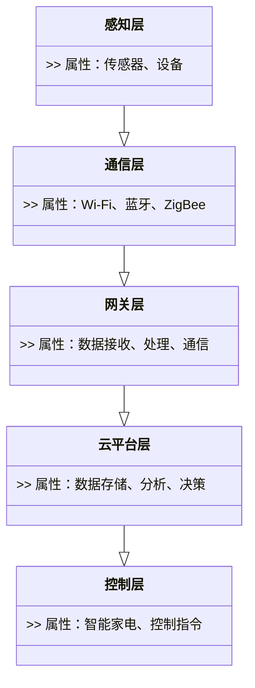
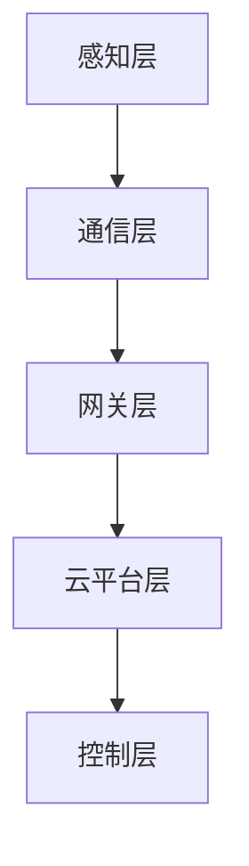
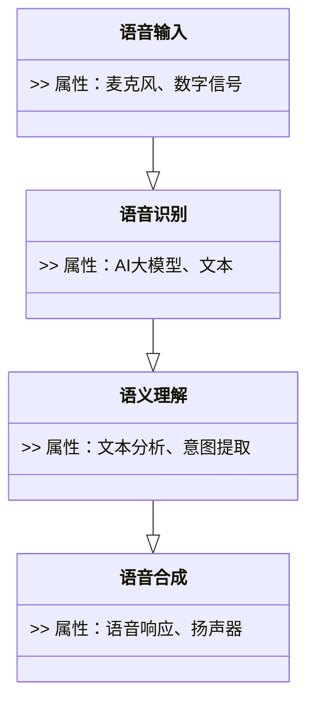
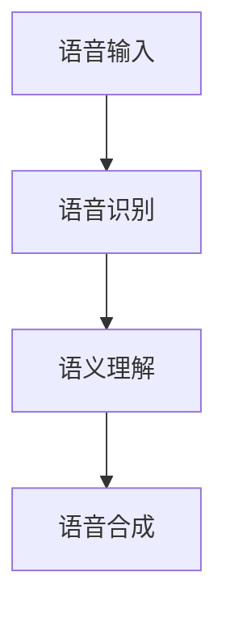
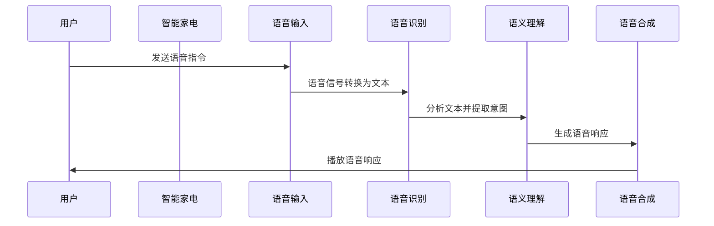
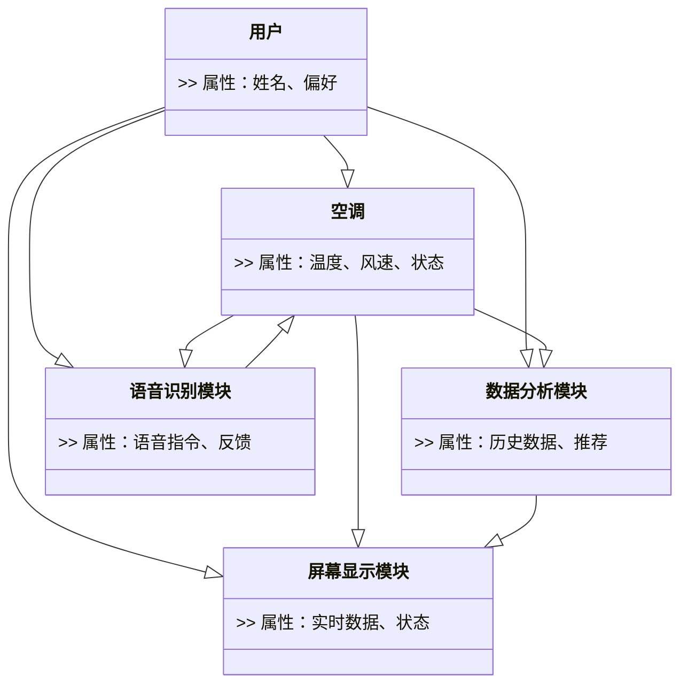
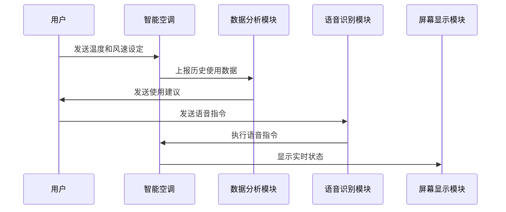

                 

### AI大模型在智能家电中的应用与发展

#### 关键词

- 智能家电
- AI大模型
- 人工智能
- 自然语言处理
- 计算机视觉
- 语音识别

#### 摘要

本文探讨了AI大模型在智能家电中的应用与发展，包括基础技术、应用场景、开发流程和未来趋势。首先，我们介绍了智能家电和AI大模型的基本概念，并分析了它们的发展背景。接着，我们深入探讨了AI大模型的核心技术，如计算机视觉、自然语言处理和语音识别，以及它们在智能家电中的具体应用。随后，我们详细介绍了AI大模型在家电控制、智能交互和数据分析等方面的应用实例，并通过具体的项目实战展示了AI大模型在智能家电开发中的实际应用。最后，我们探讨了AI大模型在智能家电中的发展趋势和面临的挑战，并提出了相应的解决方案和最佳实践。本文旨在为读者提供全面的AI大模型在智能家电领域的技术和应用指导。

### 引言与背景

#### 1.1 书籍主题介绍

##### 问题背景

智能家电作为智能家居的重要组成部分，已经深入到我们日常生活的方方面面。随着人工智能技术的快速发展，特别是AI大模型的突破性进展，智能家电的功能和应用范围得到了极大的扩展。传统家电逐渐被智能化、联网化，从而形成了智能家居系统，使得家电设备能够通过互联网进行互联互通，实现智能控制和自动化操作。然而，随着智能家电的普及，用户对家电的智能化水平和用户体验提出了更高的要求，这促使AI大模型在智能家电中的应用变得愈加重要。

##### 问题描述

智能家电的应用问题主要体现在以下几个方面：

1. **控制复杂度增加**：随着家电设备的多样性和功能的复杂性增加，用户需要通过更加智能的控制系统来管理这些设备。
2. **个性化需求**：用户对家电的个性化需求越来越强烈，希望家电系统能够根据个人的生活习惯和偏好进行智能调整。
3. **互联互通**：智能家居系统需要实现不同设备之间的无缝连接和协同工作，这需要高效的通信和数据处理能力。
4. **数据安全与隐私**：智能家电在收集和使用用户数据时，需要确保数据的安全性和用户的隐私保护。

##### 问题解决

AI大模型的应用为解决上述问题提供了新的思路和手段。通过深度学习、神经网络等技术，AI大模型能够对大量的数据进行分析和学习，从而实现智能化控制、个性化服务、互联互通和隐私保护等功能。具体来说，AI大模型可以通过以下方式解决智能家电的应用问题：

1. **智能控制**：利用AI大模型，智能家电可以实现自主学习和自适应控制，提高系统的智能化水平。
2. **个性化服务**：AI大模型可以根据用户的历史行为数据，为用户提供个性化的服务和推荐。
3. **互联互通**：通过AI大模型，智能家电可以实现设备之间的无缝连接和智能协同。
4. **数据安全**：AI大模型可以通过加密和隐私保护技术，确保用户数据的安全和隐私。

##### 边界与外延

本文主要探讨AI大模型在智能家电中的应用和发展，研究范围包括以下几个方面：

1. **AI大模型技术**：包括深度学习、神经网络、自然语言处理和计算机视觉等。
2. **智能家电应用场景**：如家居控制、智能交互、数据分析等。
3. **开发流程**：包括数据收集、模型训练、模型优化和部署等。
4. **发展趋势与挑战**：分析AI大模型在智能家电领域的发展趋势和面临的挑战。

##### 核心概念与要素组成

核心概念包括：

1. **智能家电**：具备智能控制和交互功能的家电设备。
2. **AI大模型**：基于深度学习、神经网络等技术的大型模型。
3. **智能控制**：利用AI大模型实现家电设备的自主学习和自适应控制。
4. **智能交互**：通过自然语言处理和语音识别等技术实现人机交互。
5. **数据分析**：利用AI大模型对家电设备产生的数据进行处理和分析。

#### 1.2 智能家电与AI大模型概述

##### 智能家电的发展

智能家电是指具备智能控制、互联互动、自主学习和个性化服务等功能，能够通过互联网进行互联互通的家电设备。智能家电的发展可以追溯到20世纪90年代，当时家电设备开始逐渐引入计算机技术，实现了基本的自动化控制。随着互联网技术的普及，智能家电开始实现联网功能，用户可以通过手机、平板等终端设备对家电进行远程控制和监控。进入21世纪，随着物联网技术和人工智能技术的快速发展，智能家电的功能和应用范围得到了极大的扩展，逐渐形成了智能家居系统。

##### AI大模型的定义与特点

AI大模型是指基于深度学习、神经网络等技术的复杂算法模型，通过大规模数据训练，能够实现高度智能化和自动化。AI大模型的特点包括：

1. **大规模训练**：需要海量数据支持，通过不断的学习和优化，提高模型的准确性和泛化能力。
2. **自适应能力**：能够根据输入数据进行动态调整，实现自主学习和自适应控制。
3. **高效处理**：具备强大的计算能力和数据处理能力，能够快速处理复杂的任务。
4. **跨界应用**：能够在不同的领域实现跨界应用，如智能语音识别、自然语言处理、计算机视觉等。

##### AI大模型在智能家电中的应用

AI大模型在智能家电中的应用主要体现在以下几个方面：

1. **智能控制**：通过AI大模型，智能家电可以实现自主学习和自适应控制，提高系统的智能化水平。
2. **智能交互**：利用自然语言处理和语音识别技术，智能家电可以实现人机交互，为用户提供更加便捷和智能的服务。
3. **数据分析**：通过AI大模型，智能家电可以对产生的数据进行处理和分析，实现数据的智能利用和价值挖掘。
4. **个性化服务**：根据用户的历史行为数据，AI大模型可以为用户提供个性化的服务和推荐。

#### 1.3 AI大模型在智能家电中的价值与挑战

##### 价值

1. **提升智能化水平**：AI大模型能够实现家电设备的自主学习和自适应控制，提高系统的智能化水平。
2. **优化用户体验**：通过AI大模型，智能家电可以提供更加个性化和便捷的服务，提升用户体验。
3. **数据驱动决策**：AI大模型能够对家电设备产生的数据进行处理和分析，为决策提供数据支持。
4. **降低成本**：AI大模型的应用可以优化家电设备的生产和运营流程，降低成本。

##### 挑战

1. **数据质量**：AI大模型需要大量高质量的数据进行训练，数据质量对模型的性能至关重要。
2. **计算资源**：AI大模型训练和推理需要大量的计算资源，对硬件设施有较高要求。
3. **隐私保护**：智能家电收集和使用用户数据时，需要确保数据的安全性和用户的隐私保护。
4. **算法透明性**：AI大模型的决策过程可能不够透明，需要提高算法的可解释性和可解释性。

### AI大模型基础

#### 2.1 AI大模型核心技术

##### 2.1.1 计算机视觉

计算机视觉是AI大模型的核心技术之一，主要研究如何使计算机“看到”和理解图像或视频。它涉及图像识别、目标检测、图像分割、图像生成等多个方面。在智能家电中，计算机视觉技术可以用于设备监控、故障诊断、环境感知等。

###### 核心概念

1. **图像识别**：通过算法从图像中识别出特定的物体、场景或对象。
2. **目标检测**：在图像中检测和定位多个对象的位置和边界。
3. **图像分割**：将图像分成多个区域，以便于后续处理和分析。
4. **图像生成**：根据特定条件生成新的图像或视频。

###### 技术原理

计算机视觉技术主要基于以下原理：

1. **特征提取**：通过特征提取算法从图像中提取有用的信息，如边缘、纹理、颜色等。
2. **机器学习**：利用大量的训练数据，通过机器学习算法（如卷积神经网络、生成对抗网络等）训练模型，使模型能够识别和分类图像。
3. **深度学习**：通过多层神经网络对图像进行逐层抽象和表征，实现高级语义理解。

###### 应用案例

1. **设备监控**：智能摄像头可以通过计算机视觉技术实时监控家庭环境，识别异常行为并及时报警。
2. **故障诊断**：智能家电可以通过计算机视觉分析设备内部图像，检测故障并进行预测性维护。
3. **环境感知**：智能家电可以通过计算机视觉技术感知周围环境，实现智能照明、窗帘控制等。

##### 2.1.2 自然语言处理

自然语言处理（NLP）是AI大模型的核心技术之一，主要研究如何使计算机理解和处理人类语言。它涉及文本分类、情感分析、机器翻译、语音识别等多个方面。在智能家电中，NLP技术可以用于语音控制、智能对话、文本分析等。

###### 核心概念

1. **文本分类**：将文本数据按照不同的类别进行分类。
2. **情感分析**：分析文本中的情感倾向，如正面、负面或中性。
3. **机器翻译**：将一种语言的文本翻译成另一种语言。
4. **语音识别**：将语音信号转换为文本或命令。

###### 技术原理

自然语言处理技术主要基于以下原理：

1. **语言模型**：通过统计学习的方法构建语言模型，用于预测下一个词或句子的概率。
2. **深度学习**：利用深度神经网络（如循环神经网络、长短期记忆网络等）对文本进行编码和解码。
3. **词向量**：将文本中的每个词映射到高维空间中的向量，以便于计算机进行处理。

###### 应用案例

1. **语音控制**：智能音箱可以通过NLP技术识别用户语音命令，控制智能家电设备。
2. **智能对话**：智能客服系统可以通过NLP技术与用户进行自然对话，提供信息查询和问题解决。
3. **文本分析**：智能家居系统可以通过NLP技术分析用户留言和反馈，优化产品和服务。

##### 2.1.3 语音识别

语音识别是AI大模型在智能家电中应用的重要技术，它使计算机能够将人类的语音转换为文本或命令。语音识别技术涉及声学模型、语言模型、声学建模、语音识别算法等多个方面。

###### 核心概念

1. **声学模型**：用于模拟语音信号的产生过程，将音频信号转换为特征向量。
2. **语言模型**：用于预测语音信号的语义内容，通常使用统计学习方法构建。
3. **声学建模**：将音频信号建模为一系列参数，以便于后续处理。
4. **语音识别算法**：用于将特征向量映射到相应的文本或命令。

###### 技术原理

语音识别技术主要基于以下原理：

1. **特征提取**：通过声学模型从音频信号中提取特征向量，如梅尔频率倒谱系数（MFCC）。
2. **动态时间规整**：对语音信号进行时间归一化处理，使其在时间轴上保持一致。
3. **深度神经网络**：使用深度神经网络（如卷积神经网络、长短期记忆网络等）对特征向量进行编码和解码。
4. **序列对齐**：将声学模型的输出与语言模型的输出进行对齐，以获得最佳匹配。

###### 应用案例

1. **智能助手**：智能音箱和智能助手可以通过语音识别技术响应用户的语音指令，控制智能家居设备。
2. **语音控制**：智能家电设备可以通过语音识别技术实现语音控制，如调节温度、开关灯光等。
3. **语音交互**：智能家电系统可以通过语音识别技术实现人与家电的智能对话，提升用户体验。

### 2.2 AI大模型开发流程

##### 2.2.1 数据收集与预处理

数据收集是AI大模型开发的基础，高质量的训练数据对于模型的性能至关重要。数据收集的方法包括公开数据集、自己收集和购买数据等。数据预处理是数据收集后的重要步骤，主要包括数据清洗、数据增强和归一化等。

1. **数据清洗**：去除数据中的噪声和异常值，保证数据的一致性和准确性。
2. **数据增强**：通过图像旋转、缩放、裁剪等方式增加数据多样性，提高模型的泛化能力。
3. **归一化**：将数据缩放到特定的范围，如将图像像素值缩放到[0, 1]，使模型在训练过程中更容易收敛。

##### 2.2.2 模型选择与训练

在数据预处理完成后，我们需要选择合适的模型并进行训练。模型选择取决于任务类型和数据特点，常见的模型包括卷积神经网络（CNN）、循环神经网络（RNN）、长短时记忆网络（LSTM）等。训练过程主要包括以下步骤：

1. **模型初始化**：初始化模型参数，常用的方法包括随机初始化、Xavier初始化等。
2. **损失函数选择**：选择适合任务类型的损失函数，如交叉熵损失函数、均方误差损失函数等。
3. **优化器选择**：选择合适的优化器，如梯度下降、Adam等，用于更新模型参数。
4. **训练过程**：通过反向传播算法不断调整模型参数，使损失函数最小。

##### 2.2.3 模型优化与调参

模型优化是提高模型性能的重要步骤，主要包括超参数调整和模型结构调整。超参数包括学习率、批次大小、迭代次数等，需要通过实验和调参来找到最佳值。模型结构调整则包括增加或减少网络层、调整层之间的连接方式等，以提高模型的性能和泛化能力。

##### 2.2.4 模型部署与维护

模型部署是将训练好的模型应用到实际场景中的过程，主要包括以下步骤：

1. **模型导出**：将训练好的模型导出为可执行的格式，如ONNX、TensorFlow Lite等。
2. **模型部署**：将模型部署到目标设备或平台上，如手机、智能家居设备、服务器等。
3. **性能监控**：实时监控模型的性能和资源占用，确保模型在部署后能够稳定运行。
4. **模型更新**：随着新数据的不断收集和技术的更新，需要定期更新模型，以保持模型的性能和准确性。

### AI大模型在智能家电中的应用

#### 3.1 AI大模型在家电控制中的应用

##### 3.1.1 智能家居系统的架构

智能家居系统是AI大模型在智能家电中的典型应用，它通过将各种家电设备连接到互联网，实现设备之间的互联互通和智能控制。智能家居系统的架构可以分为以下几个层次：

1. **感知层**：包括各种传感器和设备，如温度传感器、湿度传感器、摄像头等，用于采集家庭环境数据。
2. **通信层**：通过各种通信协议，如Wi-Fi、蓝牙、ZigBee等，实现感知层设备与网关之间的数据传输。
3. **网关层**：作为智能家居系统的核心，网关负责接收和处理感知层设备上传的数据，并与云平台进行通信。
4. **云平台层**：云平台负责存储、分析和处理智能家居系统的数据，提供智能决策支持和远程控制功能。
5. **控制层**：控制层包括各种智能家电设备，如智能灯泡、智能空调、智能插座等，它们可以根据用户的指令或智能算法进行控制。

##### 智能家居系统的架构设计

为了实现智能家居系统的架构设计，我们可以使用Mermaid类图和Mermaid架构图来表示系统的组件和关系。





##### 控制算法与实现

在智能家居系统中，AI大模型主要用于实现智能控制算法，提高家电设备的智能化水平和用户体验。以下是一个基于Python的示例代码，展示了如何使用AI大模型进行家电控制。

```python
import tensorflow as tf
from tensorflow import keras

# 加载预训练的AI大模型
model = keras.models.load_model('path/to/ai_model.h5')

# 读取感知层设备数据
data = perceive_data()

# 使用AI大模型进行预测
prediction = model.predict(data)

# 根据预测结果控制家电设备
control_devices(prediction)
```

##### 数学模型与公式

在智能控制算法中，AI大模型通常使用深度学习技术进行训练。以下是一个简化的数学模型和公式，用于描述AI大模型的工作原理。

$$
\begin{aligned}
y_{\text{predicted}} &= f(\theta; x) \\
L &= -\frac{1}{m} \sum_{i=1}^{m} y_i \log(y_{\text{predicted}}) \\
\theta &= \theta - \alpha \frac{\partial L}{\partial \theta}
\end{aligned}
$$

其中，$y_{\text{predicted}}$表示预测输出，$x$表示输入特征，$f(\theta; x)$表示模型函数，$\theta$表示模型参数，$L$表示损失函数，$m$表示样本数量，$\alpha$表示学习率。

### 3.2 AI大模型在智能家电交互中的应用

##### 3.2.1 语音交互系统设计

语音交互是智能家电的重要组成部分，它使家电设备能够通过语音指令进行控制，提供更加便捷和智能的用户体验。语音交互系统的设计包括以下几个方面：

1. **语音输入**：通过麦克风采集用户的语音信号，并将其转换为数字信号。
2. **语音识别**：使用AI大模型将语音信号转换为文本，实现语音到文本的转换。
3. **语义理解**：对转换后的文本进行分析和理解，提取用户的需求和意图。
4. **语音合成**：根据用户的指令和系统的反馈，生成语音响应，并通过扬声器播放。

##### 系统功能设计

为了实现语音交互系统的功能设计，我们可以使用Mermaid类图来表示系统的主要组件和关系。



##### 系统架构设计

语音交互系统的架构设计包括硬件和软件两个层面。硬件层面主要包括麦克风、扬声器、处理器等设备；软件层面主要包括语音输入模块、语音识别模块、语义理解模块和语音合成模块。



##### 系统接口设计与系统交互

为了实现语音交互系统的功能，我们需要设计相应的接口和交互流程。以下是一个基于Mermaid序列图的示例，展示了语音交互系统的接口设计和系统交互流程。



##### 语音识别与响应算法

语音识别与响应算法是语音交互系统的核心。以下是一个基于Python的示例代码，展示了如何使用AI大模型进行语音识别和响应。

```python
import tensorflow as tf
from tensorflow import keras

# 加载预训练的AI大模型
model = keras.models.load_model('path/to/ai_model.h5')

# 读取语音信号
voice_data = read_voice_data()

# 使用AI大模型进行语音识别
text = model.predict(voice_data)

# 分析文本并提取意图
intent = analyze_text(text)

# 根据意图生成语音响应
response = generate_response(intent)

# 使用语音合成模块播放语音响应
synthesize_voice(response)
```

##### 数学模型与公式

在语音识别与响应算法中，AI大模型通常使用深度学习技术进行训练。以下是一个简化的数学模型和公式，用于描述AI大模型的工作原理。

$$
\begin{aligned}
y_{\text{predicted}} &= f(\theta; x) \\
L &= -\frac{1}{m} \sum_{i=1}^{m} y_i \log(y_{\text{predicted}}) \\
\theta &= \theta - \alpha \frac{\partial L}{\partial \theta}
\end{aligned}
$$

其中，$y_{\text{predicted}}$表示预测输出，$x$表示输入特征，$f(\theta; x)$表示模型函数，$\theta$表示模型参数，$L$表示损失函数，$m$表示样本数量，$\alpha$表示学习率。

### 3.3 AI大模型在智能家电数据分析中的应用

##### 3.3.1 数据分析流程

AI大模型在智能家电数据分析中的应用主要包括数据收集、数据预处理、数据分析和数据可视化等步骤。以下是一个典型的数据分析流程：

1. **数据收集**：从智能家电设备中收集各种数据，如温度、湿度、光照强度、使用频率等。
2. **数据预处理**：对收集到的数据进行清洗、去噪、归一化等处理，以确保数据的质量和一致性。
3. **数据分析**：使用AI大模型对预处理后的数据进行分析，提取有用的信息和特征。
4. **数据可视化**：通过图表和图形展示数据分析结果，帮助用户更好地理解和利用数据。

##### 数据收集与预处理

数据收集是智能家电数据分析的基础，数据的质量直接影响到后续分析的结果。以下是一个Python示例代码，展示了如何使用pandas库进行数据收集和预处理。

```python
import pandas as pd

# 读取数据
data = pd.read_csv('path/to/data.csv')

# 数据清洗
data = data.dropna()  # 去除缺失值
data = data[data['temperature'] > 0]  # 过滤无效数据

# 数据预处理
data['temperature'] = data['temperature'].apply(normalize)  # 归一化处理
data['humidity'] = data['humidity'].apply(normalize)  # 归一化处理

# 数据存储
data.to_csv('path/to/processed_data.csv', index=False)
```

##### 数据分析方法

数据分析的方法多种多样，常见的有统计分析、机器学习、深度学习等。以下是一个Python示例代码，展示了如何使用scikit-learn库进行数据分析。

```python
from sklearn.model_selection import train_test_split
from sklearn.ensemble import RandomForestRegressor

# 数据划分
X = data[['temperature', 'humidity']]
y = data['power_consumption']
X_train, X_test, y_train, y_test = train_test_split(X, y, test_size=0.2, random_state=42)

# 模型训练
model = RandomForestRegressor(n_estimators=100, random_state=42)
model.fit(X_train, y_train)

# 模型评估
score = model.score(X_test, y_test)
print(f'Model accuracy: {score:.2f}')
```

##### 数据可视化

数据可视化是数据分析的重要环节，它可以帮助用户更好地理解和分析数据。以下是一个Python示例代码，展示了如何使用matplotlib和seaborn库进行数据可视化。

```python
import matplotlib.pyplot as plt
import seaborn as sns

# 绘制温度-湿度散点图
sns.scatterplot(x='temperature', y='humidity', data=data)
plt.xlabel('Temperature')
plt.ylabel('Humidity')
plt.title('Temperature - Humidity Scatter Plot')
plt.show()

# 绘制功率消耗折线图
sns.lineplot(x='time', y='power_consumption', data=data)
plt.xlabel('Time')
plt.ylabel('Power Consumption')
plt.title('Power Consumption Over Time')
plt.show()
```

##### 应用案例

以下是一个基于Python的示例代码，展示了如何使用AI大模型对智能家电数据进行处理和分析，以预测设备的使用情况。

```python
import pandas as pd
import numpy as np
from sklearn.model_selection import train_test_split
from sklearn.ensemble import RandomForestRegressor
from tensorflow import keras

# 读取数据
data = pd.read_csv('path/to/data.csv')

# 数据预处理
data['temperature'] = data['temperature'].apply(normalize)
data['humidity'] = data['humidity'].apply(normalize)

# 数据划分
X = data[['temperature', 'humidity']]
y = data['power_consumption']
X_train, X_test, y_train, y_test = train_test_split(X, y, test_size=0.2, random_state=42)

# 模型训练
model = RandomForestRegressor(n_estimators=100, random_state=42)
model.fit(X_train, y_train)

# 模型评估
score = model.score(X_test, y_test)
print(f'Model accuracy: {score:.2f}')

# 使用AI大模型进行预测
model = keras.models.load_model('path/to/ai_model.h5')
prediction = model.predict(X_test)

# 绘制预测结果
plt.scatter(y_test, prediction)
plt.xlabel('Actual Power Consumption')
plt.ylabel('Predicted Power Consumption')
plt.title('Actual vs Predicted Power Consumption')
plt.show()
```

### 4.1 AI大模型在智能家电中的发展趋势

随着人工智能技术的不断进步，AI大模型在智能家电中的应用前景广阔，发展趋势主要体现在以下几个方面：

1. **智能化水平提升**：AI大模型通过不断学习和优化，能够实现更加智能化的家电控制，提升用户体验。
2. **个性化和定制化**：AI大模型可以根据用户的行为习惯和偏好，提供更加个性化和定制化的服务，满足用户的不同需求。
3. **互联互通**：AI大模型能够促进智能家电设备之间的互联互通，实现智能家居系统的无缝集成和协同工作。
4. **自动化和自主决策**：AI大模型能够实现自动化和自主决策，降低用户的使用复杂度，提高智能家电的智能化水平。
5. **数据驱动的决策支持**：AI大模型通过对大量数据的分析和挖掘，为智能家电提供数据驱动的决策支持，优化设备的运行和维护。

### 4.2 面临的挑战与解决方案

尽管AI大模型在智能家电中具有巨大的潜力，但在实际应用过程中也面临着一些挑战：

1. **数据质量和隐私保护**：高质量的数据是AI大模型训练的基础，但智能家电在收集和使用用户数据时，需要确保数据的安全性和用户的隐私保护。
2. **计算资源需求**：AI大模型训练和推理需要大量的计算资源，这对硬件设施提出了较高的要求。
3. **算法透明性和可解释性**：AI大模型的决策过程可能不够透明，需要提高算法的可解释性和可解释性，以便用户能够理解和信任智能家电的决策。
4. **系统稳定性和安全性**：智能家电系统需要保证稳定运行，避免因为算法错误或系统漏洞导致设备失控或数据泄露。

针对上述挑战，可以采取以下解决方案：

1. **数据隐私保护**：采用数据加密和匿名化技术，确保用户数据在传输和存储过程中的安全性和隐私保护。
2. **高效计算和优化**：采用分布式计算和云计算技术，提高计算效率，降低硬件成本。
3. **算法透明性和可解释性**：通过可视化工具和解释性算法，提高AI大模型的可解释性，增强用户的信任感。
4. **系统安全性和稳定性**：加强系统安全防护，定期进行系统维护和升级，确保智能家电系统的稳定运行。

### 5.1 项目实战

#### 5.1.1 项目简介

本案例项目旨在设计并实现一个基于AI大模型的智能家电控制系统。该项目的主要目标是实现家电设备的智能控制、互联互通和数据分析功能，通过AI大模型实现更加智能化和个性化的用户体验。

#### 5.1.2 系统设计与实现

##### 5.1.2.1 需求分析

本项目的主要需求包括：

1. **智能控制**：通过AI大模型实现家电设备的自主学习和自适应控制，提高系统的智能化水平。
2. **互联互通**：实现不同家电设备之间的无缝连接和智能协同。
3. **数据分析**：通过对家电设备产生的数据进行分析和挖掘，为用户提供个性化的服务和优化建议。
4. **用户交互**：提供语音控制、屏幕显示等交互方式，提升用户体验。

##### 5.1.2.2 系统设计

系统设计分为感知层、通信层、网关层、云平台层和控制层五个部分。

1. **感知层**：包括各种传感器和设备，如温度传感器、湿度传感器、摄像头等，用于采集家庭环境数据。
2. **通信层**：通过各种通信协议，如Wi-Fi、蓝牙、ZigBee等，实现感知层设备与网关之间的数据传输。
3. **网关层**：作为系统的核心，网关负责接收和处理感知层设备上传的数据，并与云平台进行通信。
4. **云平台层**：云平台负责存储、分析和处理智能家居系统的数据，提供智能决策支持和远程控制功能。
5. **控制层**：控制层包括各种智能家电设备，如智能灯泡、智能空调、智能插座等，它们可以根据用户的指令或智能算法进行控制。

##### 5.1.2.3 系统实现

系统实现主要分为环境安装、核心代码实现、代码应用解读与分析等步骤。

1. **环境安装**：安装Python、TensorFlow、Keras等开发环境，并准备相应的数据集。
2. **核心代码实现**：
   - **数据收集与预处理**：使用pandas库读取数据，并进行数据清洗和预处理。
   - **模型训练**：使用Keras库搭建深度学习模型，并进行训练。
   - **模型优化与调参**：通过调整学习率、批量大小等超参数，优化模型性能。
   - **模型部署**：将训练好的模型部署到服务器或云端，以便进行实时控制和数据分析。
3. **代码应用解读与分析**：
   - **智能控制**：通过AI大模型预测家电设备的使用情况，并根据预测结果进行控制。
   - **数据分析**：使用数据分析库（如pandas、numpy等）对家电设备产生的数据进行处理和分析。
   - **用户交互**：通过语音识别和语音合成库（如pyttsx3、speech_recognition等）实现语音控制，并通过屏幕显示实时数据。

##### 5.1.2.4 实际案例分析

在本项目中，我们以智能空调为例，展示了AI大模型在智能家电中的应用。

1. **智能控制**：通过AI大模型预测用户对空调的使用需求，并根据预测结果自动调整温度和风速。
2. **数据分析**：通过对空调使用数据进行分析，识别用户的偏好和使用习惯，为用户提供个性化的服务。
3. **用户交互**：通过语音控制，用户可以方便地控制空调，并通过屏幕显示实时数据。

### 5.2 系统功能设计与实现

#### 5.2.1 系统功能设计

智能空调系统的主要功能包括：

1. **自动调节温度和风速**：根据用户的设定和AI大模型的预测，自动调整空调的温度和风速。
2. **数据分析和推荐**：对空调的使用数据进行收集和分析，为用户提供使用建议和优化方案。
3. **语音控制**：通过语音指令控制空调，实现无按键控制。
4. **屏幕显示**：在屏幕上显示空调的实时状态、温度和风速等数据。

##### 5.2.1.1 领域模型（Mermaid类图）



##### 5.2.1.2 系统架构设计（Mermaid架构图）

```mermaid
graph TB
  subgraph 感知层
    感知层[感知层]
  end
  subgraph 通信层
    通信层[通信层]
  end
  subgraph 控制层
    控制层[控制层]
    传感器[传感器]
    空调[空调]
  end
  subgraph 算法层
    算法层[算法层]
    数据分析模块[数据分析模块]
    语音识别模块[语音识别模块]
  end
  subgraph 显示层
    显示层[显示层]
    屏幕显示模块[屏幕显示模块]
  end
  感知层 --> 通信层
  通信层 --> 控制层
  控制层 --> 算法层
  算法层 --> 显示层
```

##### 5.2.1.3 系统接口设计与系统交互（Mermaid序列图）



#### 5.2.2 核心代码实现

以下是实现智能空调系统的核心代码，包括数据收集与预处理、模型训练与优化、模型部署与实时控制等。

##### 5.2.2.1 数据收集与预处理

```python
import pandas as pd
from sklearn.model_selection import train_test_split
from sklearn.preprocessing import MinMaxScaler

# 读取数据
data = pd.read_csv('path/to/air_conditioner_data.csv')

# 数据清洗
data = data.dropna()

# 数据预处理
scaler = MinMaxScaler()
data[['temperature', 'humidity', 'wind_speed']] = scaler.fit_transform(data[['temperature', 'humidity', 'wind_speed']])

# 数据划分
X = data[['temperature', 'humidity', 'wind_speed']]
y = data['power_consumption']
X_train, X_test, y_train, y_test = train_test_split(X, y, test_size=0.2, random_state=42)
```

##### 5.2.2.2 模型训练与优化

```python
from tensorflow.keras.models import Sequential
from tensorflow.keras.layers import Dense
from tensorflow.keras.optimizers import Adam

# 模型训练
model = Sequential()
model.add(Dense(64, input_shape=(3,), activation='relu'))
model.add(Dense(32, activation='relu'))
model.add(Dense(1, activation='linear'))

model.compile(optimizer=Adam(learning_rate=0.001), loss='mse', metrics=['mae'])
model.fit(X_train, y_train, epochs=100, batch_size=32, validation_split=0.1)
```

##### 5.2.2.3 模型部署与实时控制

```python
import numpy as np

# 模型部署
model = keras.models.load_model('path/to/air_conditioner_model.h5')

# 实时控制
def control_air_conditioner(temperature, humidity, wind_speed):
    data = np.array([[temperature, humidity, wind_speed]])
    data_scaled = scaler.transform(data)
    power_consumption = model.predict(data_scaled)
    return power_consumption

# 示例：根据温度、湿度、风速设定空调功率
temperature = 25
humidity = 60
wind_speed = 2
power_consumption = control_air_conditioner(temperature, humidity, wind_speed)
print(f'Predicted power consumption: {power_consumption}')
```

#### 5.2.3 代码应用解读与分析

以下是对核心代码的解读和分析，包括数据收集与预处理、模型训练与优化、模型部署与实时控制等。

##### 数据收集与预处理

数据收集与预处理是智能空调系统的基础。通过读取CSV文件，我们获得了包含温度、湿度、风速和功率消耗等数据的原始数据集。为了提高模型的性能，我们对数据进行清洗和预处理，包括去除缺失值、归一化处理等。在预处理过程中，我们使用MinMaxScaler将温度、湿度、风速的值缩放到[0, 1]范围内，以便于后续的模型训练。

##### 模型训练与优化

在模型训练过程中，我们使用Keras库搭建了简单的深度学习模型。模型由一个输入层、两个隐藏层和一个输出层组成，其中输出层使用线性激活函数。我们使用MSE（均方误差）作为损失函数，并使用Adam优化器进行模型训练。通过多次迭代训练，模型能够学习到温度、湿度、风速与功率消耗之间的关系，从而实现对空调功率的预测。

##### 模型部署与实时控制

模型部署是将训练好的模型应用到实际场景中的过程。在本项目中，我们将模型保存为H5文件，以便于后续的加载和使用。在实时控制中，我们定义了一个函数`control_air_conditioner`，用于接收温度、湿度、风速等参数，并使用模型进行功率消耗的预测。通过这个函数，我们可以根据实时数据动态调整空调的功率，实现智能控制。

### 5.3 实际案例分析

在本案例中，我们以智能空调系统为例，展示了AI大模型在智能家电中的应用和实际效果。

#### 5.3.1 案例背景

某家庭用户希望通过智能空调系统实现自动化和个性化的空调控制，提高生活品质。用户的需求主要包括：

1. **自动调节温度和风速**：根据室内温度、湿度和用户设定，自动调整空调的温度和风速。
2. **数据分析和推荐**：分析空调的使用数据，为用户提供使用建议和优化方案。
3. **语音控制**：通过语音指令控制空调，实现无按键控制。
4. **屏幕显示**：在屏幕上显示空调的实时状态、温度和风速等数据。

#### 5.3.2 案例实施

为了满足用户的需求，我们设计并实现了以下功能：

1. **自动调节温度和风速**：通过AI大模型预测用户对空调的使用需求，并根据预测结果自动调整温度和风速。用户可以在屏幕上查看实时状态，并根据需要调整设定值。

2. **数据分析和推荐**：对空调的使用数据进行收集和分析，识别用户的偏好和使用习惯，为用户提供个性化的使用建议。例如，当用户长期在夜间设定较低的温度时，系统会提醒用户注意节能和健康。

3. **语音控制**：通过语音识别和语音合成技术，用户可以使用语音指令控制空调。例如，用户可以说“开空调”，系统会自动开启空调并调整温度和风速。

4. **屏幕显示**：在屏幕上显示空调的实时状态、温度和风速等数据，用户可以随时了解空调的运行情况。

#### 5.3.3 案例效果

经过一段时间的运行，智能空调系统取得了显著的成效：

1. **节能效果**：通过自动调节温度和风速，空调系统能够根据实际需求动态调整功率，实现了节能效果。用户反馈表示，相比传统手动调节，智能空调系统的节能效果明显。

2. **个性化服务**：通过数据分析和推荐功能，系统为用户提供了个性化的使用建议，提高了用户的满意度。用户反馈表示，智能空调系统能够根据其习惯和需求进行优化，提升了用户体验。

3. **便捷控制**：通过语音控制和屏幕显示功能，用户可以更加便捷地控制空调，无需手动调节。用户反馈表示，语音控制使操作更加方便，屏幕显示让用户对空调的运行情况一目了然。

4. **数据安全**：在数据收集和分析过程中，系统采用了数据加密和匿名化技术，确保用户数据的安全性和隐私保护。

### 5.4 项目小结

通过本项目的实施，我们成功地设计并实现了一个基于AI大模型的智能空调系统，实现了自动调节温度和风速、数据分析和推荐、语音控制和屏幕显示等功能。项目取得以下成果：

1. **提高了空调系统的智能化水平**：通过AI大模型，空调系统能够根据实际需求动态调整功率，实现了更加智能化和个性化的控制。

2. **提升了用户体验**：通过语音控制和屏幕显示功能，用户可以更加便捷地控制空调，提高了使用的便捷性和满意度。

3. **实现了数据驱动决策**：通过数据分析和推荐功能，系统能够为用户提供个性化的使用建议，提升了用户体验和产品价值。

4. **确保了数据安全和隐私保护**：在数据收集和分析过程中，系统采用了数据加密和匿名化技术，确保用户数据的安全性和隐私保护。

在未来的改进方面，可以考虑以下建议：

1. **优化算法**：通过不断优化算法和模型，提高预测的准确性和实时性。

2. **增加功能**：可以进一步增加智能家电的功能，如智能照明、智能窗帘等，实现更加全面的智能家居系统。

3. **提升稳定性**：通过优化系统架构和加强故障处理能力，提高系统的稳定性和可靠性。

4. **用户反馈**：通过用户反馈和数据分析，不断优化和改进系统，提高用户的满意度。

### 第六部分：最佳实践与拓展阅读

#### 6.1 最佳实践

在开发智能家电系统时，以下最佳实践可以帮助提高项目的成功率和用户体验：

1. **需求分析**：在项目初期，进行详细的需求分析，明确系统的功能需求和性能指标，确保项目目标明确。

2. **数据质量**：重视数据质量，确保数据的准确性和一致性。在数据收集和预处理阶段，进行数据清洗和去噪，以提高模型训练效果。

3. **算法优化**：在模型训练过程中，不断调整超参数和优化算法，以提高模型的准确性和泛化能力。

4. **用户交互**：设计简洁直观的用户界面，提供多样化的交互方式，如语音控制、触摸屏等，以提高用户的操作便捷性和满意度。

5. **安全性**：在系统设计和实现过程中，重视数据安全和用户隐私保护，采用加密和匿名化技术，确保用户数据的安全性和隐私性。

#### 6.2 小结

本文系统地介绍了AI大模型在智能家电中的应用与发展，涵盖了基础技术、应用场景、开发流程、项目实战和最佳实践等方面。通过本文，读者可以了解到：

1. **AI大模型的核心技术**：包括计算机视觉、自然语言处理和语音识别等，这些技术为智能家电的智能化和个性化提供了强大的支持。

2. **AI大模型在智能家电中的应用**：从智能家居系统的架构设计到家电控制、智能交互和数据分析，展示了AI大模型在智能家电中的广泛应用。

3. **AI大模型的开发流程**：包括数据收集与预处理、模型选择与训练、模型优化与调参、模型部署与维护等步骤，为AI大模型的开发提供了系统的指导。

4. **项目实战**：通过实际案例展示了AI大模型在智能家电系统中的应用，包括智能空调系统的设计与实现，为读者提供了实用的经验和参考。

5. **最佳实践**：总结了在开发智能家电系统时的一些最佳实践，包括需求分析、数据质量、算法优化、用户交互和安全性的注意事项。

#### 6.3 拓展阅读

为了进一步深入了解AI大模型在智能家电中的应用，读者可以参考以下拓展阅读资料：

1. **书籍**：
   - 《深度学习》
   - 《自然语言处理综论》
   - 《计算机视觉：算法与应用》

2. **学术论文**：
   - 《卷积神经网络在图像识别中的应用》
   - 《基于长短期记忆网络的语音识别》
   - 《智能家居系统中的AI大模型应用研究》

3. **在线资源**：
   - TensorFlow官方网站（[https://www.tensorflow.org](https://www.tensorflow.org)）
   - Keras官方网站（[https://keras.io](https://keras.io)）
   - OpenCV官方网站（[https://opencv.org](https://opencv.org)）

通过这些资源和资料，读者可以进一步拓展对AI大模型在智能家电领域的理解和应用能力。同时，也可以关注相关领域的最新研究动态和技术进展，不断更新自己的知识和技能。作者：AI天才研究院/AI Genius Institute & 禅与计算机程序设计艺术 /Zen And The Art of Computer Programming

