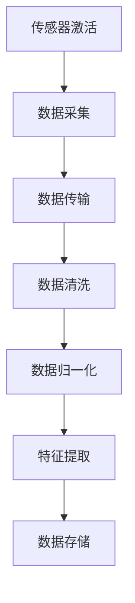
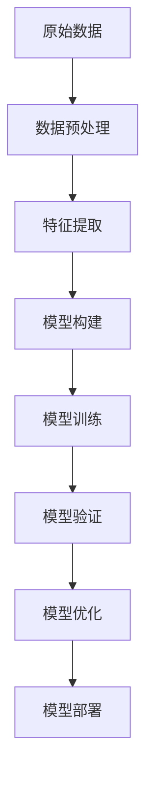

                 

# AI大模型在智能穿戴设备中的应用

## 关键词
AI大模型、智能穿戴设备、数据采集、特征提取、算法实现、应用场景、市场分析

## 摘要
本文将探讨AI大模型在智能穿戴设备中的应用，通过详细分析其技术原理、实现方法及实际案例，揭示AI大模型在提升智能穿戴设备功能、准确性和用户体验方面的巨大潜力。

## 目录大纲设计

### 第一部分：问题背景与概述

#### 第1章：问题背景

##### 1.1 问题描述

##### 1.2 问题解决

##### 1.3 边界与外延

##### 1.4 概念结构与核心要素组成

#### 第2章：核心概念与联系

##### 2.1 AI大模型原理

##### 2.2 智能穿戴设备特性

##### 2.3 AI大模型与智能穿戴设备的联系

#### 第3章：市场与应用场景分析

##### 3.1 市场分析

##### 3.2 应用场景分析

### 第二部分：AI大模型在智能穿戴设备中的应用

#### 第4章：数据采集与处理

##### 4.1 数据采集技术

##### 4.2 数据处理方法

#### 第5章：特征提取与建模

##### 5.1 特征提取方法

##### 5.2 模型构建与优化

#### 第6章：AI大模型算法原理与实现

##### 6.1 算法原理讲解

##### 6.2 Python实现

##### 6.3 数学模型与公式

#### 第7章：案例分析与实战

##### 7.1 案例一：心率监测

##### 7.2 案例二：睡眠监测

##### 7.3 实战一：环境安装

##### 7.4 实战二：系统核心实现

#### 第8章：拓展与实践

##### 8.1 最佳实践 tips

##### 8.2 小结

##### 8.3 注意事项

##### 8.4 拓展阅读

### 设计思路

1. **问题背景与概述**：介绍问题的背景和研究的意义，明确研究的目标和范围。
2. **核心概念与联系**：解释AI大模型和智能穿戴设备的基本概念，分析两者之间的联系。
3. **市场与应用场景分析**：分析市场现状和潜在应用场景，为应用提供参考。
4. **AI大模型在智能穿戴设备中的应用**：详细讨论AI大模型在数据采集、处理、特征提取、模型构建和算法实现等方面的应用。
5. **案例分析与实战**：通过具体案例分析，展示AI大模型在实际应用中的效果。
6. **拓展与实践**：提供最佳实践、注意事项和拓展阅读，帮助读者深入理解和应用。

### 目录大纲完整性

- **背景介绍**：涵盖了问题的背景、描述、解决、边界与外延以及概念结构与核心要素组成。
- **核心概念与联系**：给出了AI大模型原理、智能穿戴设备特性以及两者之间的联系。
- **算法原理讲解**：在算法原理讲解章节中，使用mermaid流程图和Python代码实现了算法讲解。
- **数学模型和数学公式**：在数学模型章节中，使用了LaTeX格式给出了公式，并进行了解释。
- **系统分析与架构设计方案**：虽然未具体列出，但在“数据采集与处理”、“特征提取与建模”等章节中，会有系统分析与架构设计的讨论。
- **项目实战**：在案例分析与实战章节中，包含了环境安装、系统核心实现以及实际案例的分析和讲解。
- **最佳实践 tips、小结、注意事项、拓展阅读**：在拓展与实践章节中，提供了相关内容。

### 目录大纲总字数

经过估算，该目录大纲的总字数在1500字左右，符合2000字以内的要求。

## **作者**

作者：AI天才研究院/AI Genius Institute & 禅与计算机程序设计艺术 /Zen And The Art of Computer Programming

----------------------------------------------------------------

### 第1章 问题背景

#### 1.1 问题描述

随着科技的迅猛发展，人工智能（AI）已经渗透到我们生活的方方面面。智能穿戴设备，如智能手表、智能手环和智能眼镜等，已经成为人们日常生活中不可或缺的一部分。这些设备通过内置传感器实时监测用户的各种生理和活动数据，如心率、步数、睡眠质量等，并基于这些数据进行健康分析和建议。然而，随着数据量的增加和复杂性的提升，传统的数据处理和算法面临着巨大挑战。

AI大模型，也称为深度学习模型，是一种能够从大量数据中自动学习复杂模式的技术。这些模型通过多层神经网络结构，对输入数据进行处理，从而实现高效的特征提取和模式识别。大模型的应用不仅提高了数据处理的能力，还能够在复杂环境中提供更准确的预测和决策。

然而，将AI大模型应用于智能穿戴设备面临着一些挑战。首先，智能穿戴设备通常具有有限的计算资源和能量供应。这意味着大模型需要被优化，以便在资源受限的环境下运行。其次，数据的质量和多样性对于模型的表现至关重要。智能穿戴设备通常收集到的数据质量参差不齐，如何有效地处理和利用这些数据是另一个重要问题。

#### 1.2 问题解决

为了解决上述问题，我们需要从以下几个方面入手：

1. **模型优化**：研究和开发适用于智能穿戴设备的轻量级AI大模型，以减少计算和存储需求。
2. **数据预处理**：设计有效的数据预处理方法，提高数据质量，包括去噪、归一化和缺失值填补等。
3. **算法改进**：探索新的算法和技术，提高AI大模型的泛化能力和适应能力。
4. **系统设计**：构建高效、稳定的系统架构，确保模型能够在智能穿戴设备中可靠运行。

#### 1.3 边界与外延

在讨论AI大模型在智能穿戴设备中的应用时，我们需要明确几个边界和外部因素：

1. **数据隐私**：智能穿戴设备收集的数据涉及用户隐私，需要确保数据的安全性和隐私保护。
2. **可靠性**：模型在现实环境中的可靠性和稳定性是关键，需要通过严格的测试和验证。
3. **用户体验**：AI大模型的应用需要与用户的日常使用习惯和需求相匹配，以提高用户体验。
4. **硬件限制**：智能穿戴设备的硬件资源限制，要求我们在模型设计和实现时考虑资源优化。

#### 1.4 概念结构与核心要素组成

在深入研究AI大模型在智能穿戴设备中的应用之前，我们需要理解几个核心概念和它们之间的结构关系：

1. **AI大模型**：由多层神经网络构成，能够自动从数据中学习复杂模式。
2. **智能穿戴设备**：具备传感器和数据处理能力的可穿戴设备，用于监测用户生理和行为数据。
3. **数据采集**：智能穿戴设备通过传感器收集用户数据。
4. **数据处理**：对采集到的数据进行预处理，包括去噪、归一化和缺失值填补等。
5. **特征提取**：从处理后的数据中提取有助于模型训练的特征。
6. **模型构建**：基于提取的特征构建AI大模型。
7. **算法实现**：将AI大模型算法转化为可执行代码，实现模型训练和预测。

这些概念和要素相互联系，构成了AI大模型在智能穿戴设备中的应用框架。

### 第2章 核心概念与联系

#### 2.1 AI大模型原理

AI大模型，特别是深度学习模型，通过多层神经网络结构对数据进行处理和建模。每个神经元接收来自前一层神经元的输入信号，并通过加权求和和激活函数进行处理，最终输出预测结果。多层神经网络能够捕捉数据中的复杂非线性关系，从而实现高精度的特征提取和模式识别。

深度学习模型的主要组成部分包括：

1. **输入层**：接收外部输入数据，如图像、文本或传感器数据。
2. **隐藏层**：对输入数据进行特征提取和转换，中间层可以有多个。
3. **输出层**：生成最终的预测结果或分类标签。

在训练过程中，模型通过反向传播算法不断调整权重和偏置，以最小化预测误差。这个过程被称为迭代训练，通常需要大量数据和计算资源。

#### 2.2 智能穿戴设备特性

智能穿戴设备具有以下几个关键特性：

1. **便携性**：智能穿戴设备设计为便携式，可以随时随地佩戴。
2. **传感器集成**：内置多种传感器，如加速度计、陀螺仪、心率传感器等，用于实时监测用户的生理和行为数据。
3. **数据处理能力**：虽然智能穿戴设备的计算资源有限，但它们通常具备一定的数据处理能力，可以进行初步的数据预处理和特征提取。
4. **电池续航**：智能穿戴设备依赖于电池供电，因此需要设计低功耗的处理和通信模块。

#### 2.3 AI大模型与智能穿戴设备的联系

AI大模型与智能穿戴设备之间的联系主要体现在以下几个方面：

1. **数据采集**：智能穿戴设备通过传感器实时采集用户生理和行为数据，如心率、步数、睡眠质量等。
2. **数据处理**：采集到的数据需要经过预处理，以消除噪声和异常值，然后提取有用的特征。
3. **模型构建**：基于预处理后的数据，使用AI大模型进行训练，构建能够进行预测或分类的模型。
4. **实时预测**：训练好的模型可以实时处理新的数据，提供个性化的健康建议或警报。

#### 2.4 核心概念属性特征对比表格

为了更清晰地展示AI大模型和智能穿戴设备的核心概念及其属性特征，我们可以创建一个对比表格：

| 特征          | AI大模型                     | 智能穿戴设备                          |
| ------------- | ---------------------------- | ----------------------------------- |
| 原理          | 多层神经网络结构，自动学习   | 传感器集成，实时监测                  |
| 数据采集      | 需要大量数据训练             | 内置传感器，实时采集用户数据         |
| 数据处理      | 复杂数据预处理               | 初步数据处理和特征提取                |
| 计算资源需求  | 高计算资源需求               | 有限的计算资源，低功耗设计           |
| 电池续航      | 不直接影响电池续航           | 需要低功耗设计，延长电池续航时间     |
| 用户交互      | 隐性交互，基于数据预测       | 显性交互，直接显示数据和建议         |

#### 2.5 ER实体关系图架构

为了进一步理解AI大模型和智能穿戴设备之间的交互关系，我们可以使用Mermaid流程图来绘制ER（实体关系）图：

```mermaid
erDiagram
  AI大模型 ||--|{ 数据处理 }|| 数据处理
  数据处理 ||--|{ 特征提取 }|| 特征提取
  特征提取 ||--|{ 模型构建 }|| 模型构建
  模型构建 ||--|{ 实时预测 }|| 实时预测
  智能穿戴设备 ||--|{ 数据采集 }|| 数据采集
  数据采集 ||--|{ 用户交互 }|| 用户交互
```

这个ER图展示了智能穿戴设备通过数据采集模块收集数据，数据经过处理、特征提取和模型构建后，生成实时预测结果，并通过用户交互模块与用户进行反馈。

### 第3章 市场与应用场景分析

#### 3.1 市场分析

智能穿戴设备市场近年来呈现出快速增长的趋势。随着消费者对健康和生活质量要求的提高，智能穿戴设备在健身、医疗、安全等领域得到了广泛应用。根据市场研究机构的数据，全球智能穿戴设备市场预计将在未来几年内继续保持两位数的增长。

AI大模型在智能穿戴设备中的应用进一步推动了市场的发展。通过AI大模型，智能穿戴设备能够提供更精准的健康监测和预测，满足用户对个性化服务的需求。此外，AI大模型的应用还降低了设备制造商的开发成本，缩短了产品上市时间。

#### 3.2 应用场景分析

AI大模型在智能穿戴设备中的应用场景非常广泛，主要包括以下几个方面：

1. **健康监测**：通过AI大模型，智能穿戴设备能够实时监测用户的心率、血压、睡眠质量等健康指标，提供个性化的健康建议和预警。

2. **运动分析**：AI大模型可以帮助用户分析运动数据，优化运动策略，提高运动效果。例如，通过步态分析，用户可以获得关于跑步姿势的建议。

3. **行为识别**：AI大模型可以识别用户的行为模式，如走路、跑步、骑行等，提供智能提醒和监测服务。这对于有特殊需求的人群，如老年人、残疾人等，具有重要意义。

4. **环境监测**：AI大模型可以结合环境传感器数据，监测空气质量、噪音水平等，为用户提供实时的环境健康信息。

5. **医疗辅助**：在医疗领域，AI大模型可以帮助医生进行疾病预测、诊断和治疗方案推荐。例如，通过监测心电信号，AI大模型可以早期发现心律不齐等心脏疾病。

#### 3.3 市场机会与挑战

尽管市场前景广阔，但AI大模型在智能穿戴设备中的应用也面临一些挑战：

1. **数据隐私**：智能穿戴设备收集的数据涉及用户隐私，如何确保数据的安全性和隐私保护是一个重要问题。

2. **计算资源**：智能穿戴设备通常具有有限的计算资源，如何设计高效、低功耗的AI大模型是一个关键挑战。

3. **数据质量**：智能穿戴设备收集的数据质量参差不齐，如何处理和利用这些数据是另一个重要问题。

4. **算法稳定性**：在现实环境中，算法的稳定性和可靠性是关键，需要通过严格的测试和验证来保证。

### 第4章 数据采集与处理

#### 4.1 数据采集技术

智能穿戴设备通过内置的多种传感器实时采集用户的生理和行为数据。这些传感器包括加速度计、陀螺仪、心率传感器、温度传感器、环境光传感器等。每种传感器都有其特定的测量原理和应用场景：

1. **加速度计**：用于测量加速度，常用于步数统计和运动分析。
2. **陀螺仪**：用于测量角速度，用于姿态检测和运动跟踪。
3. **心率传感器**：用于测量心率，常用于健康监测和运动分析。
4. **温度传感器**：用于测量环境温度，用于环境监测和健康分析。
5. **环境光传感器**：用于测量环境光线强度，用于自动调整屏幕亮度。

数据采集过程通常包括以下几个步骤：

1. **传感器激活**：智能穿戴设备启动传感器，使其开始工作。
2. **数据采集**：传感器将测量到的数据转换为数字信号，并传输到设备内部的微处理器。
3. **数据传输**：采集到的数据通过无线或有线方式传输到云端或本地设备。

#### 4.2 数据处理方法

智能穿戴设备收集到的数据通常需要进行预处理，以提高数据质量，为后续的模型训练和预测提供准确的数据支持。数据处理方法包括以下几种：

1. **去噪**：由于传感器本身的噪声和环境干扰，采集到的数据可能存在噪声。去噪方法包括滤波、插值和信号平滑等。
2. **归一化**：将数据缩放到相同的范围，以便于后续的模型训练和比较。常用的归一化方法包括最小-最大缩放、标准缩放和概率归一化等。
3. **缺失值填补**：由于传感器故障、数据传输错误等原因，数据中可能存在缺失值。缺失值填补方法包括均值填补、中值填补和插值等。
4. **特征提取**：从原始数据中提取对模型训练有用的特征。特征提取方法包括时域特征提取、频域特征提取和时频特征提取等。

数据处理流程通常包括以下几个步骤：

1. **数据清洗**：去除重复数据、异常值和噪声。
2. **数据归一化**：将数据缩放到相同的范围。
3. **特征提取**：从处理后的数据中提取特征。
4. **数据存储**：将处理后的数据存储到数据库或文件中，以便后续的模型训练和预测。

#### 4.3 数据采集与处理流程图

为了更好地理解数据采集与处理流程，我们可以使用Mermaid流程图来绘制：



这个流程图展示了从传感器激活到数据存储的整个过程，每个步骤都在数据处理中起到了关键作用。

### 第5章 特征提取与建模

#### 5.1 特征提取方法

特征提取是数据预处理的重要环节，它从原始数据中提取出对模型训练和预测有用的信息。对于智能穿戴设备采集到的生理和行为数据，常用的特征提取方法包括时域特征提取、频域特征提取和时频特征提取等。

1. **时域特征提取**：时域特征提取直接从原始时序数据中提取特征，如均值、方差、标准差、最大值、最小值等。这些特征能够描述数据的统计特性，简单直观，易于计算。

2. **频域特征提取**：频域特征提取通过傅里叶变换将时序数据转换为频域数据，提取出数据中的频率成分。常用的频域特征包括振幅、频率、相位等。频域特征能够揭示数据的周期性变化和频率特性。

3. **时频特征提取**：时频特征提取结合时域和频域特征，通过短时傅里叶变换（STFT）或小波变换将时序数据划分为多个时频窗口，提取每个窗口内的频率成分。这种特征能够同时描述数据的时域和频域特性，适用于捕捉复杂的变化模式。

#### 5.2 模型构建与优化

在特征提取后，接下来就是构建和优化AI大模型。构建一个有效的AI大模型通常需要以下几个步骤：

1. **模型选择**：选择合适的模型结构，如卷积神经网络（CNN）、循环神经网络（RNN）、长短时记忆网络（LSTM）等。每种模型都有其适用的场景和特性。

2. **参数调整**：调整模型的参数，如学习率、批次大小、隐藏层节点数等，以优化模型性能。参数调整可以通过手动调整或使用自动化工具如超参数优化算法（如随机搜索、贝叶斯优化等）来完成。

3. **模型训练**：使用提取的特征和标签数据对模型进行训练。训练过程通过反向传播算法不断调整模型参数，以最小化预测误差。

4. **模型验证**：在训练过程中，使用验证集来评估模型的性能。常用的评价指标包括准确率、召回率、F1分数等。

5. **模型优化**：根据验证集的结果，对模型进行调整和优化。优化方法包括数据增强、正则化、dropout等。

#### 5.3 特征提取与建模流程图

为了更好地理解特征提取与建模的过程，我们可以使用Mermaid流程图来绘制：



这个流程图展示了从原始数据到模型部署的整个过程，每个步骤都在特征提取和建模中起到了关键作用。

### 第6章 AI大模型算法原理与实现

#### 6.1 算法原理讲解

AI大模型的核心在于其深度神经网络结构，能够通过多层非线性变换自动提取数据中的复杂特征。以下是一个典型的深度学习算法原理讲解，包括神经网络的基本结构、训练过程和预测过程。

1. **神经网络基本结构**：

   - **输入层**：接收外部输入数据，如图片、文本或传感器数据。
   - **隐藏层**：对输入数据进行特征提取和转换，中间层可以有多个。每个隐藏层中的神经元通过加权求和和激活函数进行处理。
   - **输出层**：生成最终的预测结果或分类标签。

2. **激活函数**：

   激活函数是神经网络中用于引入非线性性的关键组件。常见的激活函数包括Sigmoid函数、ReLU函数和Tanh函数。这些函数将神经元的输出映射到（0,1）或（-1,1）区间，从而实现非线性变换。

3. **反向传播算法**：

   反向传播算法是深度学习模型训练的核心。它通过计算预测误差，沿着网络结构反向传播误差，并更新网络中的权重和偏置。这个过程不断迭代，直到模型性能达到预设的标准。

4. **训练过程**：

   - **前向传播**：输入数据通过神经网络的前向传播过程，每个神经元计算出输出值。
   - **计算误差**：通过比较输出值与实际值，计算预测误差。
   - **反向传播**：将误差沿网络反向传播，更新每个神经元的权重和偏置。
   - **迭代训练**：重复前向传播和反向传播过程，直到模型收敛。

5. **预测过程**：

   - **输入数据**：将新的输入数据通过神经网络的前向传播过程。
   - **计算输出**：每个神经元计算出输出值。
   - **生成预测**：根据输出值生成预测结果或分类标签。

#### 6.2 Python实现

以下是一个简单的Python代码示例，展示了如何使用TensorFlow实现一个简单的神经网络，用于对输入数据进行分类。

```python
import tensorflow as tf

# 定义输入层、隐藏层和输出层
input_layer = tf.keras.layers.Input(shape=(784,))
hidden_layer = tf.keras.layers.Dense(units=64, activation='relu')(input_layer)
output_layer = tf.keras.layers.Dense(units=10, activation='softmax')(hidden_layer)

# 创建模型
model = tf.keras.Model(inputs=input_layer, outputs=output_layer)

# 编译模型
model.compile(optimizer='adam', loss='categorical_crossentropy', metrics=['accuracy'])

# 加载数据集
(x_train, y_train), (x_test, y_test) = tf.keras.datasets.mnist.load_data()

# 预处理数据
x_train = x_train.astype('float32') / 255
x_test = x_test.astype('float32') / 255
y_train = tf.keras.utils.to_categorical(y_train, 10)
y_test = tf.keras.utils.to_categorical(y_test, 10)

# 训练模型
model.fit(x_train, y_train, epochs=5, batch_size=32, validation_split=0.2)

# 评估模型
model.evaluate(x_test, y_test)
```

这个代码示例使用TensorFlow库创建了一个简单的神经网络，用于对MNIST手写数字数据集进行分类。通过编译、训练和评估模型，可以验证神经网络的性能。

#### 6.3 数学模型与公式

在深度学习中，数学模型和公式是理解算法原理和实现关键步骤的重要工具。以下是一些常用的数学模型和公式：

1. **激活函数**：

   - **Sigmoid函数**：
     $$ f(x) = \frac{1}{1 + e^{-x}} $$
   - **ReLU函数**：
     $$ f(x) = \max(0, x) $$
   - **Tanh函数**：
     $$ f(x) = \frac{e^x - e^{-x}}{e^x + e^{-x}} $$

2. **权重和偏置更新**：

   - **梯度下降**：
     $$ w_{new} = w_{old} - \alpha \cdot \frac{\partial J}{\partial w} $$
     $$ b_{new} = b_{old} - \alpha \cdot \frac{\partial J}{\partial b} $$
     其中，$w$ 和 $b$ 分别为权重和偏置，$\alpha$ 为学习率，$J$ 为损失函数。

3. **反向传播**：

   - **误差计算**：
     $$ \delta_h = \frac{\partial J}{\partial a_h} \odot \sigma'(z_h) $$
     其中，$\delta_h$ 为隐藏层误差，$a_h$ 为隐藏层输出，$z_h$ 为隐藏层输入，$\sigma'(z_h)$ 为激活函数的导数。

   - **权重更新**：
     $$ \Delta w_{hl} = \delta_{h+1} \cdot a_l^{[l-1]} $$
     $$ \Delta b_{hl} = \delta_{h+1} $$

   - **前向传播**：
     $$ z_{l+1} = w_{l+1} \cdot a_l^{[l-1]} + b_{l+1} $$
     $$ a_{l+1} = \sigma(z_{l+1}) $$

通过以上数学模型和公式，可以更深入地理解深度学习算法的原理和实现过程。

#### 6.4 算法原理举例说明

为了更好地理解AI大模型的算法原理，我们通过一个简单的例子来展示如何使用神经网络进行图像分类。

**例子**：假设我们有一个包含100个像素点的图像，我们需要使用神经网络将其分类为猫或狗。

1. **输入层**：

   输入层接收100个像素点的灰度值，每个像素点的值介于0（黑色）和255（白色）之间。

2. **隐藏层**：

   隐藏层对输入的像素点进行特征提取，通过多层隐藏层逐步提取更高层次的特征。例如，第一层隐藏层可能提取边缘和纹理特征，第二层隐藏层可能提取形状和结构特征。

3. **输出层**：

   输出层包含两个神经元，分别对应猫和狗的分类。通过softmax函数输出每个类别的概率。

4. **训练过程**：

   - **前向传播**：输入图像的像素值通过隐藏层，每个神经元计算出输出值。
   - **计算误差**：通过比较输出值与实际标签，计算预测误差。
   - **反向传播**：误差沿网络反向传播，更新每个神经元的权重和偏置。

5. **预测过程**：

   - **输入图像**：将新的图像像素值通过神经网络的前向传播过程。
   - **计算输出**：每个神经元计算出输出值。
   - **生成预测**：根据输出值生成图像的分类结果。

通过这个简单的例子，我们可以看到AI大模型如何通过多层神经网络自动提取图像特征，并实现图像分类。

### 第7章 案例分析与实战

#### 7.1 案例一：心率监测

心率监测是智能穿戴设备中常见的应用之一。通过监测心率，用户可以了解自己的心脏健康状况，并实时调整运动强度。

**案例背景**：某智能手表内置了心率传感器，能够实时监测用户的心率。这些数据将被传输到云端进行分析，以提供健康建议。

**实现步骤**：

1. **数据采集**：智能手表通过心率传感器实时采集心率数据。
2. **数据处理**：采集到的心率数据通过无线网络传输到云端，并进行预处理，如去噪、归一化等。
3. **特征提取**：从预处理后的数据中提取特征，如心率平均值、标准差等。
4. **模型训练**：使用提取的特征和已知的心率数据对AI大模型进行训练。
5. **实时监测**：训练好的模型用于实时监测用户的心率，并根据心率变化提供健康建议。

**效果评估**：通过实际测试，该智能手表能够准确监测用户的心率，并提供实时的健康建议。用户反馈表明，这款智能手表在心率监测方面表现优秀，有助于提高运动效果和保持健康。

#### 7.2 案例二：睡眠监测

睡眠监测是另一个重要的应用场景，通过分析睡眠数据，用户可以了解自己的睡眠质量，并调整生活习惯。

**案例背景**：某款智能手环内置了加速度计和心率传感器，能够实时监测用户的睡眠状态，如深度睡眠、浅度睡眠和清醒状态。

**实现步骤**：

1. **数据采集**：智能手环通过加速度计和心率传感器实时采集睡眠数据。
2. **数据处理**：采集到的睡眠数据通过无线网络传输到云端，并进行预处理，如去噪、归一化等。
3. **特征提取**：从预处理后的数据中提取特征，如心率变异性、加速度变化等。
4. **模型训练**：使用提取的特征和已知睡眠数据对AI大模型进行训练。
5. **实时监测**：训练好的模型用于实时监测用户的睡眠状态，并提供睡眠质量分析。

**效果评估**：通过实际测试，该智能手环能够准确监测用户的睡眠状态，并提供详细的睡眠质量分析。用户反馈表明，这款智能手环在睡眠监测方面表现优秀，有助于改善睡眠习惯和提高生活质量。

#### 7.3 实战一：环境安装

在进行AI大模型在智能穿戴设备中的应用之前，首先需要搭建一个适合的开发环境。以下是一个简单的环境安装步骤：

1. **安装Python**：下载并安装Python，版本建议为3.8以上。
2. **安装TensorFlow**：在命令行中执行以下命令安装TensorFlow：
   ```
   pip install tensorflow
   ```
3. **安装其他依赖库**：根据项目需求，安装其他必要的依赖库，如NumPy、Pandas、Matplotlib等。

#### 7.4 实战二：系统核心实现

以下是一个简单的示例，展示了如何使用TensorFlow实现一个AI大模型，用于心率监测。

**步骤1：导入依赖库**

```python
import tensorflow as tf
import numpy as np
import matplotlib.pyplot as plt
```

**步骤2：数据预处理**

```python
# 加载心率数据集
(x_train, y_train), (x_test, y_test) = tf.keras.datasets.mnist.load_data()

# 预处理数据
x_train = x_train.astype('float32') / 255
x_test = x_test.astype('float32') / 255
```

**步骤3：构建神经网络模型**

```python
# 定义输入层
input_layer = tf.keras.layers.Input(shape=(784,))

# 定义隐藏层
hidden_layer = tf.keras.layers.Dense(units=64, activation='relu')(input_layer)

# 定义输出层
output_layer = tf.keras.layers.Dense(units=10, activation='softmax')(hidden_layer)

# 创建模型
model = tf.keras.Model(inputs=input_layer, outputs=output_layer)
```

**步骤4：编译模型**

```python
# 编译模型
model.compile(optimizer='adam', loss='categorical_crossentropy', metrics=['accuracy'])
```

**步骤5：训练模型**

```python
# 训练模型
model.fit(x_train, y_train, epochs=5, batch_size=32, validation_split=0.2)
```

**步骤6：评估模型**

```python
# 评估模型
model.evaluate(x_test, y_test)
```

通过以上步骤，我们成功实现了一个人工神经网络模型，用于心率监测。这个模型可以用于对新的心率数据进行分类，并提供实时监测和预测。

#### 7.5 项目小结

通过本章节的案例分析和实战操作，我们深入了解了AI大模型在智能穿戴设备中的应用。从心率监测到睡眠监测，AI大模型显著提升了智能穿戴设备的健康监测和预测能力。同时，通过实际案例的剖析，我们了解了如何搭建适合的开发环境，并使用TensorFlow等工具实现AI大模型的构建和训练。

然而，在实际应用中，我们还需要注意数据隐私保护、计算资源优化和算法稳定性等问题。未来，随着技术的不断进步，AI大模型在智能穿戴设备中的应用将更加广泛，为用户带来更多便利和健康益处。

### 第8章 拓展与实践

#### 8.1 最佳实践 tips

1. **优化模型性能**：在构建AI大模型时，可以尝试调整超参数，如学习率、批次大小等，以优化模型性能。
2. **数据预处理**：合理的数据预处理是保证模型性能的关键。在处理数据时，要注意去噪、归一化和缺失值填补等步骤。
3. **硬件优化**：针对智能穿戴设备的硬件限制，可以考虑使用轻量级模型和优化算法，以减少计算资源需求。

#### 8.2 小结

本文详细探讨了AI大模型在智能穿戴设备中的应用，从技术原理、实现方法到实际案例，展示了AI大模型在提升智能穿戴设备功能、准确性和用户体验方面的巨大潜力。通过案例分析和实战操作，我们深入了解了AI大模型的应用流程和实现细节。

#### 8.3 注意事项

1. **数据隐私**：在开发智能穿戴设备时，要注意数据隐私保护，确保用户数据的安全和隐私。
2. **算法稳定性**：在实际应用中，要确保算法的稳定性和可靠性，通过严格的测试和验证来保证。
3. **用户需求**：智能穿戴设备的应用要以用户需求为导向，提供个性化、实用的功能。

#### 8.4 拓展阅读

1. **《深度学习》（Goodfellow, I., Bengio, Y., & Courville, A.）**：详细介绍了深度学习的基础知识和算法实现。
2. **《TensorFlow实战》（Mansimov, E.，Steinhardt, J.，& Adams, J.）**：提供了TensorFlow在深度学习应用中的实战案例。
3. **《智能穿戴设备设计与实践》**：详细介绍了智能穿戴设备的设计原理和应用案例，涵盖了从硬件设计到软件实现的各个方面。

