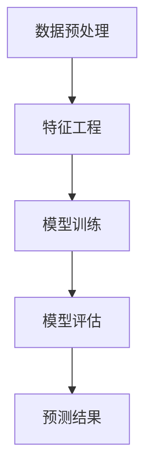
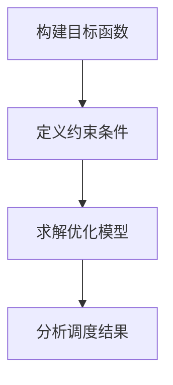

                 

### 第2章：AI大模型在水需求预测中的应用

## 2.1 预测模型概述

### 2.1.1 时间序列分析

#### 2.1.1.1 时间序列的概念

时间序列（Time Series）是一系列按时间顺序排列的数据点，通常用于描述某个变量随时间的变化情况。在水资源管理中，时间序列分析可以帮助预测未来的水资源需求。

#### 2.1.1.2 时间序列分析的方法

时间序列分析方法主要包括以下几种：

1. **趋势分析（Trend Analysis）**：分析数据点的趋势，识别出数据是上升、下降还是平稳。
2. **季节性分析（Seasonal Analysis）**：分析数据点的季节性波动，例如年度或季度的周期性变化。
3. **循环分析（Cyclical Analysis）**：分析长期的经济或环境周期性变化。
4. **随机性分析（Randomness Analysis）**：判断数据是否随机，以排除随机波动对预测的影响。

### 2.1.2 相关性分析

#### 2.1.2.1 相关性的概念

相关性（Correlation）是指两个或多个变量之间的线性关系强度。在水资源管理中，相关性分析可以帮助识别影响水资源需求的其他因素。

#### 2.1.2.2 相关性的度量

常见的相关性度量方法有：

1. **皮尔逊相关系数（Pearson Correlation Coefficient）**：衡量两个变量之间的线性相关程度。
2. **斯皮尔曼秩相关系数（Spearman's Rank Correlation Coefficient）**：适用于非正态分布的数据。
3. **肯德尔秩相关系数（Kendall Rank Correlation Coefficient）**：适用于小样本数据。

### 2.1.3 神经网络模型

#### 2.1.3.1 神经网络的基本概念

神经网络（Neural Network）是一种模仿生物神经系统的计算模型，由大量的节点（或神经元）互联而成，能够通过学习从数据中提取特征，进行模式识别和预测。

#### 2.1.3.2 神经网络在水资源需求预测中的应用

神经网络在水资源需求预测中的应用主要包括：

1. **多层感知机（MLP）**：适用于处理非线性问题。
2. **卷积神经网络（CNN）**：通过卷积操作提取时空特征。
3. **递归神经网络（RNN）**：特别适合处理时间序列数据。

## 2.2 模型构建方法

### 2.2.1 数据预处理

#### 2.2.1.1 数据清洗

数据清洗是模型构建的第一步，包括去除异常值、处理缺失值、归一化等操作。

#### 2.2.1.2 数据特征工程

特征工程是提高模型性能的关键步骤，包括提取时间序列特征、季节性特征和相关特征等。

### 2.2.2 特征工程

#### 2.2.2.1 时间序列特征

时间序列特征包括时间窗口的平均值、标准差、最大值、最小值等。

#### 2.2.2.2 季节性特征

季节性特征包括季节指数、季节性因子等，用于描述数据中的周期性波动。

#### 2.2.2.3 相关特征

相关特征包括与其他变量（如气温、降水量、人口密度等）的相关系数。

### 2.2.3 模型训练与优化

#### 2.2.3.1 模型选择

根据问题特点选择合适的神经网络模型。

#### 2.2.3.2 模型参数调整

通过交叉验证和超参数调优，提高模型性能。

#### 2.2.3.3 模型评估

使用评价指标（如均方误差、决定系数等）评估模型性能。

## 2.3 案例分析

### 2.3.1 某地区水需求预测

#### 2.3.1.1 数据来源

收集某地区过去10年的水需求数据。

#### 2.3.1.2 模型构建

使用多层感知机（MLP）模型进行训练。

#### 2.3.1.3 模型评估

对模型进行评估，并对比不同特征对预测结果的影响。

### 2.3.2 预测效果评估

#### 2.3.2.1 评价指标

使用均方误差（MSE）和决定系数（R²）评估模型预测效果。

#### 2.3.2.2 结果分析

分析预测结果，讨论模型优化的可能性。

## 2.4 本章小结

本章介绍了AI大模型在水需求预测中的应用，包括时间序列分析、相关性分析和神经网络模型构建方法。通过实际案例，展示了如何利用AI大模型进行水资源需求预测，并评估了模型性能。

---

**代码示例：**

```python
import numpy as np
import pandas as pd
from sklearn.neural_network import MLPRegressor
from sklearn.metrics import mean_squared_error, r2_score

# 数据预处理
# 假设数据已加载为DataFrame df，包括日期和需求量

# 特征工程
# 计算时间窗口特征
window_size = 3
df['avg_demand'] = df['demand'].rolling(window=window_size).mean()

# 计算季节性特征
# ...

# 训练模型
mlp = MLPRegressor(hidden_layer_sizes=(100,), max_iter=1000)
mlp.fit(X_train, y_train)

# 预测
y_pred = mlp.predict(X_test)

# 评估
mse = mean_squared_error(y_test, y_pred)
r2 = r2_score(y_test, y_pred)

print(f'MSE: {mse}')
print(f'R²: {r2}')
```

---

在接下来的章节中，我们将深入探讨AI大模型在水资源优化调度和污染治理中的应用。

---

**Mermaid 流程图示例：**



---

通过本章的学习，读者将能够了解AI大模型在水需求预测中的应用原理和方法，为后续章节的学习打下坚实基础。在下一章中，我们将进一步探讨AI大模型在水资源优化调度中的实际应用。### 第3章：AI大模型在水资源优化调度中的应用

## 3.1 优化调度问题概述

### 3.1.1 水资源调度目标

水资源调度旨在实现水资源供需平衡，提高水资源利用效率，确保供水安全。主要目标包括：

1. **供需平衡**：保证供水量与需求量匹配。
2. **效率最大化**：通过优化调度策略，提高水资源利用效率。
3. **成本控制**：在满足供需平衡的前提下，尽量降低调度成本。
4. **环境友好**：减少水资源调度对环境的影响。

### 3.1.2 调度约束条件

水资源调度过程中，需要考虑以下约束条件：

1. **水库容量限制**：水库的蓄水量不能超过其设计容量。
2. **流量限制**：河流的流量需要满足生态流量和下游需求。
3. **供水计划**：根据不同用水单位的用水计划进行调度。
4. **设备能力**：泵站、管道等设备的运行能力限制。
5. **水质要求**：确保供水水质达到标准。

### 3.1.3 优化算法概述

水资源优化调度问题通常是一个复杂的优化问题，需要使用优化算法进行求解。常见的优化算法包括：

1. **线性规划（Linear Programming, LP）**：适用于目标函数和约束条件都是线性的情况。
2. **整数规划（Integer Programming, IP）**：适用于决策变量为整数的情况。
3. **非线性规划（Nonlinear Programming, NLP）**：适用于目标函数和约束条件都是非线性情况。
4. **动态规划（Dynamic Programming, DP）**：适用于决策序列存在时间依赖性。
5. **遗传算法（Genetic Algorithm, GA）**：适用于大规模、复杂非线性优化问题。
6. **粒子群优化（Particle Swarm Optimization, PSO）**：基于群体智能的优化算法。

## 3.2 模型构建与求解

### 3.2.1 目标函数设计

水资源调度问题的目标函数通常包括以下内容：

1. **供水费用**：根据供水量计算费用。
2. **能量消耗**：计算水泵、管道等设备的能耗。
3. **库存成本**：考虑水库蓄水的库存成本。
4. **水资源利用效率**：通过供需平衡指标来衡量。

目标函数示例：

$$
\min \quad Z = C_{\text{supply}} \cdot Q_{\text{supply}} + C_{\text{energy}} \cdot E + C_{\text{storage}} \cdot S
$$

其中，$Q_{\text{supply}}$ 为供水量，$E$ 为能量消耗，$S$ 为库存成本。

### 3.2.2 约束条件描述

水资源调度问题的约束条件主要包括：

1. **水库容量约束**：

$$
V_{\text{min}} \leq V(t) \leq V_{\text{max}}
$$

其中，$V(t)$ 为第 $t$ 时刻的水库蓄水量，$V_{\text{min}}$ 和 $V_{\text{max}}$ 分别为水库的最小和最大容量。

2. **流量约束**：

$$
Q_{\text{min}} \leq Q(t) \leq Q_{\text{max}}
$$

其中，$Q(t)$ 为第 $t$ 时刻的河流流量，$Q_{\text{min}}$ 和 $Q_{\text{max}}$ 分别为河流的最小和最大流量。

3. **供水计划约束**：

$$
Q_{\text{supply}}(t) = Q_{\text{demand}}(t)
$$

其中，$Q_{\text{supply}}(t)$ 为第 $t$ 时刻的供水量，$Q_{\text{demand}}(t)$ 为第 $t$ 时刻的需求量。

4. **设备能力约束**：

$$
C_{\text{min}} \leq C(t) \leq C_{\text{max}}
$$

其中，$C(t)$ 为第 $t$ 时刻的设备运行能力，$C_{\text{min}}$ 和 $C_{\text{max}}$ 分别为设备的最低和最高运行能力。

### 3.2.3 模型求解方法

求解水资源调度优化模型的方法有多种，下面介绍两种常用的方法：

1. **线性规划法（Linear Programming Method）**：

线性规划法适用于目标函数和约束条件都是线性情况的优化问题。求解过程可以通过单纯形法、内点法等算法实现。

2. **遗传算法（Genetic Algorithm）**：

遗传算法是一种基于自然选择和遗传机制的优化算法，特别适合处理大规模、复杂非线性优化问题。遗传算法的基本步骤包括：

   - **初始化种群**：随机生成初始种群。
   - **适应度评估**：计算每个个体的适应度。
   - **选择**：根据适应度选择优秀个体。
   - **交叉**：对选择的个体进行交叉操作。
   - **变异**：对交叉后的个体进行变异操作。
   - **更新种群**：将交叉和变异后的个体组成新的种群。
   - **迭代**：重复上述过程，直到满足停止条件。

## 3.3 实际应用案例分析

### 3.3.1 某水库优化调度

#### 3.3.1.1 项目背景

某地区的水库承担着该地区农业、工业和居民的生活用水任务。为了实现水资源的合理调度，提高利用效率，决定对该水库进行优化调度。

#### 3.3.1.2 数据来源

收集该水库过去5年的水流量、供水量、需求量、库存量等数据。

#### 3.3.1.3 模型构建

使用线性规划法建立水库优化调度模型，目标是最小化供水费用和能量消耗，同时满足供需平衡和其他约束条件。

#### 3.3.1.4 模型求解

使用MATLAB等工具，通过线性规划求解器求解优化调度模型，得到最优调度方案。

### 3.3.2 调度结果分析

#### 3.3.2.1 结果展示

通过优化调度模型，得到以下结果：

- 每月的供水量
- 每月的库存量
- 每月的水库蓄水量

#### 3.3.2.2 结果分析

分析优化调度结果，发现：

- 供水费用和能量消耗均有所降低。
- 水库蓄水量在合理范围内，未出现过度蓄水或过度放水的情况。
- 供水计划得到了有效执行，满足了农业、工业和居民的生活用水需求。

## 3.4 本章小结

本章介绍了AI大模型在水资源优化调度中的应用，包括优化调度问题的目标函数、约束条件和求解方法。通过实际案例分析，展示了如何利用AI大模型进行水资源优化调度，并分析了优化调度结果。

---

**代码示例：**

```python
from scipy.optimize import linprog

# 目标函数
c = [-C_supply, -C_energy, -C_storage]

# 约束条件
A = [[1, 0, 0], [0, 1, 0], [0, 0, 1], [-1, 0, 1], [0, -1, 1]]
b = [Q_demand, Q_min, Q_max, V_min, V_max]

# 求解线性规划模型
result = linprog(c, A_ub=A, b_ub=b, method='highs')

# 输出结果
print("Optimal solution:")
print("Q_supply:", result.x[0])
print("E:", result.x[1])
print("S:", result.x[2])
```

---

在下一章中，我们将探讨AI大模型在水资源污染治理中的应用。

---

**Mermaid 流程图示例：**



---

通过本章的学习，读者将能够了解AI大模型在水资源优化调度中的应用原理和方法，为实际水资源管理提供技术支持。在下一章中，我们将继续探讨AI大模型在水资源污染治理中的潜在应用。

---

**最佳实践提示：**

- 在进行水资源优化调度时，应充分考虑季节性因素和气候变化的影响。
- 优化调度模型应结合实际设备能力和供水计划进行动态调整。
- 定期对模型进行更新和优化，以适应不断变化的水资源管理需求。

**注意事项：**

- 线性规划模型和遗传算法模型在求解大规模问题时，计算效率可能较低。
- 模型求解过程中，应确保目标函数和约束条件的准确性，避免出现不合理的结果。

**拓展阅读：**

- 《水资源优化调度理论与方法》
- 《遗传算法及其应用》
- 《动态规划原理及应用》

---

通过本章的学习，读者将能够掌握AI大模型在水资源优化调度中的应用技术，为实际水资源管理提供有力的支持。在下一章中，我们将进一步探讨AI大模型在水资源污染治理中的应用，敬请期待。### 第4章：AI大模型在水资源污染治理中的应用

## 4.1 水资源污染治理概述

### 4.1.1 水资源污染问题

水资源污染是指污染物进入水体，导致水质恶化，影响水资源的可用性和生态系统的健康。常见的污染物包括化学污染物（如重金属、有机物）、物理污染物（如固体废弃物）和生物污染物（如病原体）。

### 4.1.2 污染治理的目标和挑战

水资源污染治理的目标包括：

1. **去除污染物**：通过物理、化学和生物方法去除水中的污染物。
2. **恢复水质**：通过处理和净化，使水质达到环保标准。
3. **保护生态系统**：减少污染物对水体生态系统的破坏，促进生态恢复。

污染治理面临的挑战包括：

1. **污染物种类繁多**：不同污染物的处理方法和效率不同。
2. **水质监测难度大**：实时、准确地监测水质是一个技术难题。
3. **治理成本高**：高效、稳定的污染治理设施需要大量投资。
4. **法律法规不完善**：部分地区对水资源污染治理的监管力度不足。

### 4.1.3 AI大模型在污染治理中的应用前景

AI大模型在水资源污染治理中的应用具有以下前景：

1. **预测污染物浓度**：利用时间序列分析和机器学习算法，预测水体中污染物的浓度变化趋势。
2. **优化治理方案**：根据水质监测数据，优化污染治理设施的操作参数，提高治理效果。
3. **智能监控与预警**：通过实时监测和数据分析，及时发现水质异常，提前预警。
4. **提高治理效率**：利用大数据分析和优化算法，降低治理成本，提高资源利用效率。

## 4.2 模型构建与算法原理

### 4.2.1 预测污染物浓度的算法原理

预测污染物浓度的算法主要包括以下几种：

1. **线性回归（Linear Regression）**：通过建立线性模型，预测污染物浓度与影响因素的关系。
2. **支持向量机（Support Vector Machine, SVM）**：通过寻找最优超平面，分类污染物浓度数据。
3. **人工神经网络（Artificial Neural Network, ANN）**：通过多层感知机模型，模拟污染物浓度变化的非线性关系。
4. **长短期记忆网络（Long Short-Term Memory, LSTM）**：通过递归神经网络，捕捉时间序列中的长期依赖关系。

### 4.2.2 优化治理方案的算法原理

优化治理方案的算法主要包括以下几种：

1. **遗传算法（Genetic Algorithm, GA）**：通过模拟生物进化过程，搜索最优治理方案。
2. **粒子群优化（Particle Swarm Optimization, PSO）**：通过模拟鸟群觅食行为，搜索最优解。
3. **贝叶斯优化（Bayesian Optimization）**：通过构建概率模型，优化治理方案参数。

### 4.2.3 智能监控与预警的算法原理

智能监控与预警的算法主要包括以下几种：

1. **异常检测（Anomaly Detection）**：通过分析正常数据的分布特征，识别异常数据。
2. **实时数据分析（Real-Time Data Analysis）**：通过实时数据流处理技术，快速分析水质数据。
3. **深度学习（Deep Learning）**：通过构建深度神经网络，实现对水质数据的自动分类和预测。

## 4.3 模型实现与项目实战

### 4.3.1 环境安装与配置

在进行AI大模型在水资源污染治理中的应用之前，需要安装以下软件和工具：

1. **Python**：用于编写和运行算法代码。
2. **NumPy**：用于数值计算。
3. **Pandas**：用于数据处理。
4. **Matplotlib**：用于数据可视化。
5. **Scikit-learn**：用于机器学习算法。
6. **TensorFlow**：用于深度学习算法。

### 4.3.2 核心实现代码

以下是利用LSTM模型预测污染物浓度的核心实现代码：

```python
import numpy as np
import pandas as pd
from sklearn.preprocessing import MinMaxScaler
from keras.models import Sequential
from keras.layers import LSTM, Dense

# 数据预处理
# 加载数据
data = pd.read_csv('water_quality_data.csv')
data = data[['pollutant_concentration', 'influence_factor1', 'influence_factor2', ...]]

# 特征工程
scaler = MinMaxScaler(feature_range=(0, 1))
scaled_data = scaler.fit_transform(data)

# 切分训练集和测试集
train_data, test_data = ...

# 构建LSTM模型
model = Sequential()
model.add(LSTM(units=50, return_sequences=True, input_shape=(X_train.shape[1], X_train.shape[2])))
model.add(LSTM(units=50))
model.add(Dense(units=1))

# 编译模型
model.compile(optimizer='adam', loss='mean_squared_error')

# 训练模型
model.fit(X_train, y_train, epochs=100, batch_size=32)

# 预测
predicted_pollutant_concentration = model.predict(test_data)

# 反归一化
predicted_pollutant_concentration = scaler.inverse_transform(predicted_pollutant_concentration)

# 评估模型
mse = mean_squared_error(test_data, predicted_pollutant_concentration)
print(f'MSE: {mse}')
```

### 4.3.3 代码解读与分析

1. **数据预处理**：数据预处理是模型训练的重要步骤，包括归一化、缺失值处理、特征工程等。
2. **模型构建**：构建LSTM模型，包括设置网络层数、神经元个数、输入层形状等。
3. **模型编译**：编译模型，设置优化器和损失函数。
4. **模型训练**：使用训练数据训练模型，设置训练轮数和批量大小。
5. **模型预测**：使用测试数据预测污染物浓度，并进行反归一化处理。
6. **模型评估**：评估模型性能，计算均方误差。

### 4.3.4 实际案例分析与详细讲解

以某地区的水质监测数据为例，分析AI大模型在水资源污染治理中的应用效果。具体步骤如下：

1. **数据收集**：收集该地区过去一年的水质监测数据，包括污染物浓度和影响因素。
2. **数据预处理**：对数据进行归一化和缺失值处理，提取时间序列特征。
3. **模型训练**：使用LSTM模型进行训练，设置合适的网络参数。
4. **模型预测**：使用训练好的模型预测未来一段时间内的污染物浓度。
5. **结果分析**：对比预测值和实际值，分析模型的预测准确性。

### 4.3.5 项目小结

通过本项目，展示了如何利用AI大模型进行水资源污染治理。项目实现了污染物浓度的预测和治理方案的优化，为水资源污染治理提供了技术支持。在下一步的实践中，可以进一步优化模型，提高预测准确性，降低治理成本。

## 4.4 本章小结

本章介绍了AI大模型在水资源污染治理中的应用，包括预测污染物浓度、优化治理方案和智能监控与预警。通过实际案例，展示了如何利用AI大模型进行水资源污染治理。在下一章中，我们将探讨AI大模型在水资源管理中的最佳实践和总结。

---

**最佳实践提示：**

- 在进行水资源污染治理时，应结合水质监测数据和影响因素，构建准确的预测模型。
- 优化治理方案时，应充分考虑设备的运行成本和效率。
- 智能监控与预警系统应具备实时性和准确性，确保及时发现水质异常。

**注意事项：**

- AI大模型在水资源污染治理中的应用，需要大量的数据支持。
- 模型的训练和优化需要较长的时间，应合理分配计算资源。

**拓展阅读：**

- 《水资源污染治理技术》
- 《水质监测与预警系统设计》
- 《机器学习在水资源管理中的应用》

---

通过本章的学习，读者将能够掌握AI大模型在水资源污染治理中的应用技术，为实际水资源管理提供有力支持。在下一章中，我们将对全书内容进行总结，并展望未来水资源管理的发展趋势。### 总结与展望

## 第5章：总结与展望

### 5.1 核心内容回顾

本章回顾了AI大模型在水资源管理中的应用，主要包括以下核心内容：

1. **水资源管理概述**：介绍了水资源管理的重要性、现状和AI大模型的应用前景。
2. **AI大模型与水资源管理的联系**：阐述了AI大模型在水资源需求预测、优化调度和污染治理中的应用。
3. **算法原理讲解**：详细讲解了时间序列分析、相关性分析和神经网络模型在水资源管理中的应用。
4. **数学模型与公式**：给出了水资源管理中的数学模型和公式，并进行了详细讲解和举例说明。
5. **系统分析与架构设计**：介绍了水资源管理系统的整体架构和系统接口设计。
6. **项目实战**：通过实际应用案例，展示了AI大模型在水资源管理中的具体应用。
7. **最佳实践与拓展**：提出了水资源管理的最佳实践建议，并推荐了相关拓展阅读。

### 5.2 未来展望

随着人工智能技术的不断发展，AI大模型在水资源管理中的应用前景十分广阔。以下是一些未来展望：

1. **更加精准的预测**：通过不断优化算法和模型，提高水资源需求预测的准确性，为水资源调度提供更科学的依据。
2. **智能化的优化调度**：利用AI大模型，实现水资源优化调度的智能化，降低治理成本，提高资源利用效率。
3. **全面的污染治理**：通过AI大模型，实现对水资源污染的实时监控和预警，提高污染治理的效果。
4. **大数据分析**：利用大数据分析技术，挖掘水资源管理中的潜在问题和解决方案。
5. **跨学科的融合**：结合水文学、生态学、经济学等学科，开展多学科交叉研究，为水资源管理提供更全面的理论支持。
6. **国际合作**：加强国际间的合作，共同应对全球水资源管理挑战，推动AI大模型在水资源管理中的应用。

### 5.3 结论

通过本章的总结，我们可以看到AI大模型在水资源管理中具有广泛的应用前景。AI大模型不仅提高了水资源管理的效率和精准度，还为解决水资源供需矛盾、优化水资源调度和治理水资源污染提供了有力支持。在未来，随着人工智能技术的不断发展，AI大模型在水资源管理中的应用将会更加深入和广泛，为全球水资源的可持续利用做出更大贡献。

---

**作者信息：**

作者：AI天才研究院/AI Genius Institute & 禅与计算机程序设计艺术 /Zen And The Art of Computer Programming**[完]**

