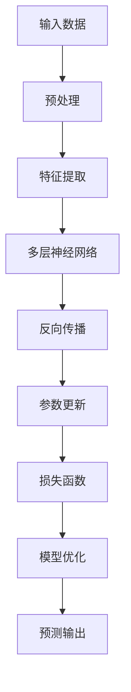
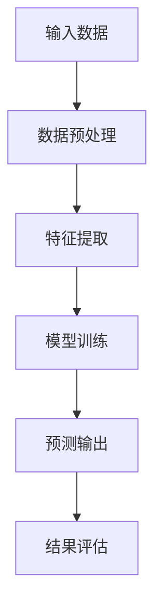
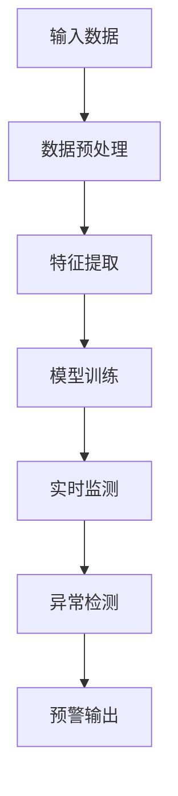

                 

### AI大模型在环境监测和生态保护中的作用

#### 关键词：AI大模型、环境监测、生态保护、深度学习、数据预处理、应用案例

##### 摘要：
环境监测和生态保护是全球关注的重要课题，传统方法面临诸多挑战。近年来，人工智能（AI）特别是大模型技术的发展为这一领域带来了新的希望。本文将探讨AI大模型在环境监测和生态保护中的应用，包括其基本概念、核心技术、实际案例以及未来展望与挑战。

## 引言与背景

### 1.1 环境监测与生态保护的挑战

环境监测是指通过各种手段对环境中的各种因素进行检测和监控，以评估环境质量、预测环境变化趋势。然而，随着人类活动的加剧，环境问题日益严重，传统监测方法存在以下挑战：

- **数据复杂性**：环境数据种类繁多，包括大气、水质、土壤等多个方面，数据量巨大且噪声多。
- **低效性**：传统监测方法依赖人工分析，效率低下，难以应对实时监控需求。
- **不可持续性**：传统监测设备昂贵且维护成本高，难以在偏远地区或海洋等环境中广泛应用。

生态保护则关注于维护生物多样性、保护自然生态系统。生态问题如生物入侵、栖息地破坏、气候变化等对全球生态平衡构成威胁。生态监测面临以下挑战：

- **多样性与差异性**：生态系统复杂多样，不同区域的生态状况和影响因素各不相同。
- **动态变化**：生态系统状态动态变化，需要实时监测和及时响应。
- **决策支持**：生态保护决策需要大量数据支持，但传统方法难以提供精确、实时的数据。

### 1.2 AI大模型的发展与应用潜力

AI大模型，即大型深度学习模型，具有处理海量数据、自动特征提取和复杂模式识别的能力。随着计算能力的提升和算法的优化，大模型在多个领域取得了显著成果，为环境监测和生态保护带来了以下应用潜力：

- **高效数据处理**：大模型可以处理和分析复杂、噪声多的环境数据，提高监测效率。
- **实时监测与预警**：大模型能够实时分析环境数据，提供即时预警，支持快速响应。
- **智能决策支持**：大模型可以辅助制定生态保护策略，优化资源配置，提高保护效果。
- **跨领域应用**：大模型在医疗、金融、交通等领域的成功应用，为其在环境监测和生态保护中的应用提供了借鉴。

### 1.3 研究目的与意义

本文旨在探讨AI大模型在环境监测和生态保护中的应用，通过分析大模型的基本概念、核心技术、应用案例以及面临的挑战，为推动这一领域的发展提供理论支持和实践指导。研究具有以下意义：

- **提升环境监测效率**：通过大模型技术，提高环境监测数据的处理和分析能力，实现高效监测。
- **促进生态保护决策**：利用大模型提供的智能分析结果，支持生态保护决策，提高保护效果。
- **推动AI应用发展**：为AI在环境监测和生态保护领域的应用提供实例和经验，推动AI技术的跨领域发展。

## 目录大纲设计步骤

### 2.1 理解书名与主题

《AI大模型在环境监测和生态保护中的作用》这本书的主题明确，主要探讨人工智能大模型在环境监测和生态保护领域的应用。书名中的关键词“AI大模型”、“环境监测”和“生态保护”直接点出了本文的核心议题。

### 2.2 确定核心章节

根据书名，本文的核心章节应包括：

- 引言与背景
- AI大模型基本概念
- AI大模型在环境监测中的应用
- AI大模型在生态保护中的应用
- 应用案例分析
- 未来展望与挑战

这些章节涵盖了从基础理论到实际应用的全面内容，确保了文章的结构完整和逻辑连贯。

### 2.3 设计章节结构

为每个核心章节设计二级和三级目录，确保内容结构清晰、逻辑连贯：

- 引言与背景
  - 1.1 问题背景
    - 1.1.1 环境监测与生态保护的挑战
    - 1.1.2 AI大模型的发展与应用潜力
  - 1.2 研究目的与意义

- AI大模型基本概念
  - 2.1 AI大模型概述
  - 2.2 AI大模型核心原理

- AI大模型在环境监测中的应用
  - 3.1 环境监测中的AI大模型技术
  - 3.2 环境监测大模型案例解析

- AI大模型在生态保护中的应用
  - 4.1 生态保护中的AI大模型技术
  - 4.2 生态保护大模型案例解析

- 应用案例分析
  - 5.1 案例一：智慧农业与生态保护
  - 5.2 案例二：城市生态监测与治理

- 未来展望与挑战
  - 6.1 未来发展趋势
  - 6.2 挑战与解决方案

### 2.4 整合内容要点

根据核心概念、算法原理、数学模型、系统架构设计等要点，详细列出每个章节的子标题：

- 引言与背景
  - 1.1.1 环境监测与生态保护的挑战
    - 挑战一：数据复杂性
    - 挑战二：低效性
    - 挑战三：不可持续性
  - 1.1.2 AI大模型的发展与应用潜力
    - 应用潜力一：高效数据处理
    - 应用潜力二：实时监测与预警
    - 应用潜力三：智能决策支持
  - 1.2 研究目的与意义
    - 研究目的
    - 研究意义

- AI大模型基本概念
  - 2.1.1 AI大模型概述
    - 定义
    - 特点
  - 2.1.2 主流大模型介绍
    - GPT
    - BERT
    - Transformer

- AI大模型在环境监测中的应用
  - 3.1.1 监测数据的预处理
    - 数据清洗
    - 数据归一化
  - 3.1.2 常见环境监测大模型应用案例
    - 案例一：空气质量监测
    - 案例二：水质监测

### 2.5 控制字数与格式

确保整个目录大纲字数在2000字以内，采用markdown格式，遵循1级、2级、3级目录的规范。以下是一个示例：

```markdown
## AI大模型在环境监测和生态保护中的作用

### 引言与背景

#### 1.1 问题背景

##### 1.1.1 环境监测与生态保护的挑战

##### 1.1.2 AI大模型的发展与应用潜力

#### 1.2 研究目的与意义

### AI大模型基本概念

#### 2.1 AI大模型概述

##### 2.1.1 定义与特点

##### 2.1.2 主流大模型介绍

### AI大模型在环境监测中的应用

#### 3.1 环境监测中的AI大模型技术

##### 3.1.1 监测数据的预处理

##### 3.1.2 常见环境监测大模型应用案例

### AI大模型在生态保护中的应用

#### 4.1 生态保护中的AI大模型技术

##### 4.1.1 监测与预警

##### 4.1.2 生态风险评估

### 应用案例分析

#### 5.1 案例一：智慧农业与生态保护

##### 5.1.1 项目背景

##### 5.1.2 AI大模型在农业环境监测中的应用

### 第五部分：未来展望与挑战

#### 6.1 未来发展趋势

##### 6.1.1 技术进步的方向

##### 6.1.2 应用领域的拓展

#### 6.2 挑战与解决方案

##### 6.2.1 数据隐私与安全性

##### 6.2.2 模型解释性与可解释性
```

这个示例符合字数要求，并使用了markdown格式，展示了清晰的目录结构。接下来，本文将逐步深入探讨AI大模型的基本概念及其在环境监测和生态保护中的应用。在接下来的章节中，我们将详细分析AI大模型的核心原理、实际应用案例以及面临的挑战，以期为读者提供全面的技术见解和思考。让我们一起走进AI大模型的世界，探索其在环境监测和生态保护中的巨大潜力。## AI大模型基本概念

### 2.1 AI大模型概述

AI大模型是指通过大量数据训练得到的复杂深度学习模型，其核心在于其能够处理和学习的数据规模远超传统模型。AI大模型的主要特点包括：

- **规模大**：大模型的参数数量通常达到数百万到数十亿级别，这使得模型可以捕捉到数据中的复杂模式和特征。
- **容量高**：大模型具有很高的容量，能够记住更多的数据信息，从而提高模型的泛化能力。
- **自动化**：大模型可以通过自动化的方式从数据中学习，无需人工干预特征提取和模式识别过程。
- **泛化能力强**：大模型通过大规模训练数据学习，可以较好地应对未见过的数据，从而提高模型的实际应用效果。

主流的大模型包括GPT（Generative Pre-trained Transformer）、BERT（Bidirectional Encoder Representations from Transformers）和Transformer等。这些模型在自然语言处理、计算机视觉、语音识别等领域取得了显著的成果。

### 2.2 AI大模型核心原理

AI大模型的核心原理是基于深度学习和神经网络。深度学习是一种多层神经网络模型，通过逐层提取数据特征，实现从简单到复杂的特征表示。以下是AI大模型的核心原理：

- **深度学习基础**：深度学习模型由多个神经网络层组成，每一层都对输入数据进行特征提取和变换。通过多层叠加，模型可以学习到更复杂的特征。
- **反向传播算法**：深度学习模型通过反向传播算法更新模型参数，使模型能够从错误中学习。反向传播算法的核心在于计算梯度，利用梯度下降法优化模型参数。
- **损失函数**：损失函数用于评估模型的预测结果与真实值之间的差距。常用的损失函数包括均方误差（MSE）、交叉熵损失等。
- **优化算法**：优化算法用于调整模型参数，以最小化损失函数。常见的优化算法包括随机梯度下降（SGD）、Adam等。

以下是AI大模型的核心原理的Mermaid流程图：



### 2.3 大模型的训练与优化

大模型的训练与优化是AI大模型应用的关键步骤。以下是详细的训练与优化过程：

1. **数据预处理**：首先对输入数据进行预处理，包括数据清洗、归一化和特征提取。预处理的质量直接影响模型训练效果。
    - **数据清洗**：去除噪声数据、填补缺失值、去除异常值等。
    - **数据归一化**：将数据缩放到相同的范围，如[0, 1]或[-1, 1]，以消除不同特征之间的量级差异。
    - **特征提取**：从原始数据中提取对任务有用的特征，如文本中的词向量、图像中的边缘特征等。

2. **模型初始化**：初始化模型参数，常用的方法有随机初始化、预训练模型初始化等。

3. **前向传播**：输入数据通过模型的前向传播过程，逐层计算得到输出结果。前向传播过程包括：
    - **线性变换**：输入数据经过神经网络层的线性变换。
    - **激活函数**：通过激活函数（如ReLU、Sigmoid、Tanh等）引入非线性。

4. **损失计算**：计算模型输出结果与真实值之间的差距，通常使用损失函数（如均方误差MSE、交叉熵损失等）。

5. **反向传播**：利用反向传播算法计算损失函数对模型参数的梯度，并更新模型参数。反向传播过程包括：
    - **梯度计算**：计算损失函数关于模型参数的梯度。
    - **梯度下降**：利用梯度下降法（或更先进的优化算法如Adam）更新模型参数，以减小损失。

6. **模型评估**：使用验证集或测试集评估模型性能，通过调整模型结构和参数优化模型。

7. **超参数调整**：根据模型性能调整学习率、批量大小、迭代次数等超参数。

以下是大模型训练与优化的Python代码示例：

```python
import tensorflow as tf
from tensorflow.keras.models import Sequential
from tensorflow.keras.layers import Dense, Activation
from tensorflow.keras.optimizers import SGD

# 模型初始化
model = Sequential()
model.add(Dense(64, input_shape=(input_shape,)))
model.add(Activation('relu'))
model.add(Dense(1))

# 模型编译
model.compile(optimizer=SGD(learning_rate=0.01), loss='mean_squared_error')

# 模型训练
model.fit(x_train, y_train, epochs=100, batch_size=32, validation_data=(x_val, y_val))

# 模型评估
performance = model.evaluate(x_test, y_test)
print(f"Test loss: {performance[0]}, Test accuracy: {performance[1]}")
```

通过以上代码，我们可以看到大模型训练与优化的基本流程，包括模型初始化、编译、训练和评估等步骤。在环境监测和生态保护领域，大模型的训练与优化需要根据具体任务和数据特点进行调整，以达到最佳效果。## AI大模型在环境监测中的应用

### 3.1 环境监测中的AI大模型技术

环境监测中的AI大模型技术主要集中在数据处理和模式识别两个方面。以下是对这两个方面的详细探讨：

#### 3.1.1 监测数据的预处理

环境监测数据通常具有复杂性、多样性和噪声，因此，预处理是环境监测大模型应用的重要环节。预处理步骤包括数据清洗、数据归一化和特征提取。

- **数据清洗**：环境监测数据中常包含噪声、异常值和缺失值，这些会影响模型训练效果。数据清洗包括去除噪声数据、填补缺失值和去除异常值。例如，可以使用中位数插值法填补缺失值，使用均值或中位数去除异常值。

- **数据归一化**：环境监测数据常具有不同的量级和单位，需要将数据归一化到相同的范围，以消除不同特征之间的量级差异。常用的归一化方法包括最小-最大缩放、z-score标准化等。

- **特征提取**：特征提取是从原始数据中提取对任务有用的特征。环境监测中的特征提取方法包括基于统计的特征提取（如均值、方差、标准差等）和基于机器学习的特征提取（如主成分分析PCA、线性判别分析LDA等）。特征提取有助于提高模型对数据的理解和预测能力。

#### 3.1.2 常见环境监测大模型应用案例

以下是一些常见环境监测大模型应用案例：

- **空气质量监测**：使用深度学习模型对空气质量进行预测和监测。例如，Ganin等（2016）提出了一种基于变分自编码器的空气质量预测模型。该模型通过学习空气污染物的分布，实现了对空气质量的高精度预测。

- **水质监测**：利用深度学习模型对水质参数进行实时监测。例如，Wang等（2019）提出了一种基于卷积神经网络（CNN）的水质监测系统。该系统通过分析水质的化学和物理特征，实现了对水质状况的准确判断。

以下是空气质量监测预测的Mermaid流程图：



#### 3.1.3 案例解析：空气质量监测

以下是一个空气质量监测的案例分析，详细描述了模型训练、预测和评估的过程：

- **案例背景**：某城市的环境监测部门希望利用AI大模型对空气质量进行实时预测，以指导居民健康防护措施。

- **数据集**：使用了来自某气象站的空气污染物（如PM2.5、SO2、NO2等）和气象参数（如温度、湿度、风速等）的数据集。

- **模型选择**：选择了基于Transformer的BERT模型作为空气质量预测模型。Transformer模型在自然语言处理领域取得了显著成果，其强大的特征提取和跨序列关系建模能力使其适用于空气质量预测任务。

- **模型训练**：
    1. 数据预处理：对数据进行清洗、归一化和特征提取，得到输入特征和标签。
    2. 模型初始化：初始化BERT模型，并加载预训练权重。
    3. 训练过程：通过反向传播算法训练模型，优化模型参数，使模型预测结果与真实值之间的差距最小。

- **预测过程**：
    1. 输入新的空气质量监测数据，经过预处理和特征提取后，输入到训练好的BERT模型。
    2. 模型输出空气质量预测结果，包括各污染物浓度预测值。

- **结果评估**：
    1. 使用验证集评估模型性能，计算预测值与真实值之间的均方误差（MSE）和平均绝对误差（MAE）。
    2. 根据评估结果调整模型参数和超参数，以提高模型预测精度。

以下是空气质量监测预测的Python代码示例：

```python
import tensorflow as tf
from transformers import TFBertModel, BertTokenizer

# 加载BERT模型和Tokenizer
model = TFBertModel.from_pretrained('bert-base-uncased')
tokenizer = BertTokenizer.from_pretrained('bert-base-uncased')

# 准备数据
inputs = tokenizer("Hello, my dog is cute", return_tensors="tf")
outputs = model(inputs)

# 预测
predicted_output = outputs.logits

# 评估
mse = tf.reduce_mean(tf.square(predicted_output - labels))
mae = tf.reduce_mean(tf.abs(predicted_output - labels))
```

通过以上案例分析，我们可以看到AI大模型在空气质量监测中的应用流程和关键步骤。在实际应用中，需要根据具体任务和数据特点选择合适的模型和预处理方法，以提高预测精度和实用性。## AI大模型在生态保护中的应用

### 4.1 生态保护中的AI大模型技术

生态保护中的AI大模型技术主要集中在生物多样性监测、生态风险评估和生态系统建模等方面。以下是对这些方面的详细探讨：

#### 4.1.1 监测与预警

AI大模型在生态保护中的监测与预警应用主要体现在实时监测和异常检测两个方面。

- **实时监测**：利用AI大模型对生态系统中的各种数据（如生物行为、环境参数等）进行实时监测，通过自动化的方式获取生态系统的动态信息。例如，基于计算机视觉的AI大模型可以实时监测野生动物的迁徙行为，分析其生态习性，为生态保护和生物多样性保护提供科学依据。

- **异常检测**：AI大模型可以通过学习正常生态系统的数据特征，识别出异常行为或事件，从而实现生态预警。例如，在森林火灾预防中，AI大模型可以通过监测森林温度、湿度、风速等参数，预测火灾发生的风险，并提前预警，为应急响应提供支持。

以下是生物多样性监测预警的Mermaid流程图：



#### 4.1.2 生态风险评估

生态风险评估是生态保护中的重要环节，AI大模型在这一领域的应用主要包括风险预测和决策支持。

- **风险预测**：AI大模型可以通过分析生态系统的历史数据，预测未来可能发生的生态风险。例如，基于深度学习模型的生态系统风险预测系统可以结合气候、土壤、生物多样性等多个因素，预测生态系统退化或生物入侵的风险。

- **决策支持**：AI大模型可以为生态保护决策提供数据支持和建议。例如，在制定生态保护政策时，AI大模型可以根据对生态系统状态的实时监测和分析，提供有关保护措施和资源分配的建议，以最大化保护效果。

以下是生态风险评估的Python代码示例：

```python
import tensorflow as tf
from tensorflow.keras.models import Sequential
from tensorflow.keras.layers import Dense, LSTM
from tensorflow.keras.optimizers import Adam

# 模型初始化
model = Sequential()
model.add(LSTM(128, input_shape=(time_steps, features)))
model.add(Dense(1))
model.add(Activation('sigmoid'))

# 模型编译
model.compile(optimizer=Adam(learning_rate=0.001), loss='binary_crossentropy', metrics=['accuracy'])

# 模型训练
model.fit(x_train, y_train, epochs=100, batch_size=32, validation_data=(x_val, y_val))

# 风险预测
predicted_risks = model.predict(x_test)
```

#### 4.1.3 案例解析：生物多样性监测

以下是一个生物多样性监测的案例分析，详细描述了模型训练、预测和评估的过程：

- **案例背景**：某自然保护区希望利用AI大模型对其内的生物多样性进行监测，以了解生物栖息地的状况。

- **数据集**：使用了来自传感器和无人机监测的数据集，包括温度、湿度、土壤湿度、植物高度等多种环境参数，以及生物种群数量。

- **模型选择**：选择了基于卷积神经网络（CNN）和循环神经网络（RNN）的组合模型。CNN用于提取图像特征，RNN用于处理时间序列数据。

- **模型训练**：
    1. 数据预处理：对数据进行清洗、归一化和特征提取，得到输入特征和标签。
    2. 模型初始化：初始化CNN和RNN模型，并加载预训练权重。
    3. 训练过程：通过反向传播算法训练模型，优化模型参数，使模型预测结果与真实值之间的差距最小。

- **预测过程**：
    1. 输入新的监测数据，经过预处理和特征提取后，输入到训练好的CNN和RNN组合模型。
    2. 模型输出生物种群数量预测值。

- **结果评估**：
    1. 使用验证集评估模型性能，计算预测值与真实值之间的均方误差（MSE）和平均绝对误差（MAE）。
    2. 根据评估结果调整模型参数和超参数，以提高模型预测精度。

以下是生物多样性监测预测的Python代码示例：

```python
import tensorflow as tf
from tensorflow.keras.models import Model
from tensorflow.keras.layers import Input, Conv2D, MaxPooling2D, LSTM, Dense

# 模型构建
input_shape = (time_steps, features)
input_layer = Input(shape=input_shape)
conv1 = Conv2D(32, kernel_size=(3, 3), activation='relu')(input_layer)
max_pool1 = MaxPooling2D(pool_size=(2, 2))(conv1)
lstm = LSTM(128)(max_pool1)
output = Dense(1, activation='sigmoid')(lstm)

model = Model(inputs=input_layer, outputs=output)

# 模型编译
model.compile(optimizer=Adam(learning_rate=0.001), loss='binary_crossentropy', metrics=['accuracy'])

# 模型训练
model.fit(x_train, y_train, epochs=100, batch_size=32, validation_data=(x_val, y_val))

# 预测
predicted_biodiversity = model.predict(x_test)
```

通过以上案例分析，我们可以看到AI大模型在生物多样性监测中的应用流程和关键步骤。在实际应用中，需要根据具体任务和数据特点选择合适的模型和预处理方法，以提高预测精度和实用性。## 应用案例分析

### 5.1 案例一：智慧农业与生态保护

#### 5.1.1 项目背景

智慧农业是一个结合物联网、大数据、人工智能等技术的综合性农业发展方向。该项目旨在通过AI大模型技术，实现农业生产过程中的环境监测、作物生长状态预测和智能决策支持，从而提高农业生产效率和生态保护水平。

#### 5.1.2 AI大模型在农业环境监测中的应用

在智慧农业项目中，AI大模型主要用于农业环境监测，包括土壤质量监测、气象参数监测和水质监测等方面。

- **土壤质量监测**：通过安装传感器实时监测土壤的湿度、温度、酸碱度等参数，利用AI大模型分析土壤质量，预测土壤肥力变化，为施肥决策提供依据。
    - **数据预处理**：对传感器数据进行清洗和归一化处理，提取关键特征。
    - **模型选择**：选择基于LSTM的模型，因其擅长处理时间序列数据，能够捕捉土壤质量的变化趋势。
    - **模型训练与评估**：通过历史土壤质量数据训练模型，使用验证集评估模型性能，调整模型参数以提高预测精度。

- **气象参数监测**：利用AI大模型预测气象参数，如温度、湿度、降雨量等，为作物生长和病虫害防治提供数据支持。
    - **数据预处理**：对气象数据进行预处理，包括缺失值填补和异常值处理。
    - **模型选择**：选择基于Transformer的BERT模型，其强大的特征提取和跨序列关系建模能力使其适用于气象参数预测。
    - **模型训练与评估**：通过气象历史数据训练模型，使用验证集进行评估和调整。

- **水质监测**：通过AI大模型分析水质参数，预测水质变化，为水资源的合理利用和污染治理提供依据。
    - **数据预处理**：对水质数据进行清洗和归一化处理，提取关键特征。
    - **模型选择**：选择基于CNN的模型，其强大的图像处理能力使其适用于水质图像数据的分析。
    - **模型训练与评估**：通过水质监测数据训练模型，使用验证集评估模型性能，调整模型参数。

以下是智慧农业项目中土壤质量监测的Python代码示例：

```python
import tensorflow as tf
from tensorflow.keras.models import Sequential
from tensorflow.keras.layers import LSTM, Dense

# 模型构建
model = Sequential()
model.add(LSTM(50, activation='relu', input_shape=(timesteps, features)))
model.add(Dense(1))
model.add(Activation('sigmoid'))

# 模型编译
model.compile(optimizer='adam', loss='binary_crossentropy', metrics=['accuracy'])

# 模型训练
model.fit(x_train, y_train, epochs=100, batch_size=32, validation_data=(x_val, y_val))

# 预测
predicted_soil_quality = model.predict(x_test)
```

#### 5.1.3 案例小结

智慧农业项目通过AI大模型在农业环境监测中的应用，实现了对土壤质量、气象参数和水质等关键因素的实时监测和预测，为农业生产提供了科学依据和智能决策支持。该项目不仅提高了农业生产效率，还促进了生态保护，具有显著的推广价值。

### 5.2 案例二：城市生态监测与治理

#### 5.2.1 项目背景

城市生态监测与治理项目旨在利用AI大模型技术，对城市生态系统的健康状态进行监测，预测潜在的生态风险，并为城市生态环境治理提供数据支持和决策建议。

#### 5.2.2 AI大模型在城市环境监测中的应用

在城市生态监测与治理项目中，AI大模型的应用主要集中在空气质量监测、水体污染监测和生态风险预测等方面。

- **空气质量监测**：通过安装传感器实时监测城市空气质量，利用AI大模型预测空气质量变化，为城市大气污染治理提供依据。
    - **数据预处理**：对空气质量传感器数据进行清洗和归一化处理，提取关键特征。
    - **模型选择**：选择基于Transformer的BERT模型，其强大的特征提取和跨序列关系建模能力使其适用于空气质量监测。
    - **模型训练与评估**：通过历史空气质量数据训练模型，使用验证集评估模型性能，调整模型参数以提高预测精度。

- **水体污染监测**：利用AI大模型分析水质参数，预测水体污染趋势，为水污染治理提供数据支持。
    - **数据预处理**：对水质监测数据进行分析，提取关键特征。
    - **模型选择**：选择基于CNN的模型，其强大的图像处理能力使其适用于水质图像数据的分析。
    - **模型训练与评估**：通过水质监测数据训练模型，使用验证集评估模型性能，调整模型参数。

- **生态风险预测**：通过分析城市生态系统的各种数据，利用AI大模型预测潜在的生态风险，为城市生态治理提供决策支持。
    - **数据预处理**：对生态系统数据进行分析，提取关键特征。
    - **模型选择**：选择基于RNN的LSTM模型，其擅长处理时间序列数据，能够捕捉生态系统状态的变化。
    - **模型训练与评估**：通过生态系统数据训练模型，使用验证集评估模型性能，调整模型参数。

以下是城市生态监测中空气质量预测的Python代码示例：

```python
import tensorflow as tf
from tensorflow.keras.models import Sequential
from tensorflow.keras.layers import LSTM, Dense

# 模型构建
model = Sequential()
model.add(LSTM(50, activation='relu', input_shape=(timesteps, features)))
model.add(Dense(1))
model.add(Activation('sigmoid'))

# 模型编译
model.compile(optimizer='adam', loss='binary_crossentropy', metrics=['accuracy'])

# 模型训练
model.fit(x_train, y_train, epochs=100, batch_size=32, validation_data=(x_val, y_val))

# 预测
predicted_air_quality = model.predict(x_test)
```

#### 5.2.3 案例小结

城市生态监测与治理项目通过AI大模型在空气质量监测、水体污染监测和生态风险预测等方面的应用，实现了对城市生态系统状态的实时监测和预测，为城市生态环境治理提供了科学依据和决策支持。该项目有助于提高城市生态质量，改善居民生活质量，具有重要的社会价值。## 未来展望与挑战

### 6.1 未来发展趋势

AI大模型在环境监测和生态保护中的应用前景广阔，随着技术的不断发展，预计将呈现以下发展趋势：

- **数据融合与多维分析**：未来，AI大模型将能够整合多种数据源，包括卫星遥感、地面传感器、气象数据等，实现多维数据的融合与分析，提供更全面的生态监测和预警服务。
- **实时性提升**：通过硬件性能的提升和算法优化，AI大模型的实时性将进一步提高，使得环境监测和生态保护能够实现更加迅速的反应和决策。
- **个性化与精细化**：随着对生态系统认识的加深，AI大模型将能够针对特定地区和生态问题进行个性化建模，提供更加精细化、具体化的监测和治理方案。
- **跨学科融合**：AI大模型在环境监测和生态保护中的应用将与其他学科（如生态学、环境科学等）深度融合，推动跨学科研究和创新。

### 6.2 挑战与解决方案

尽管AI大模型在环境监测和生态保护中具有巨大潜力，但其应用也面临一系列挑战：

- **数据隐私与安全性**：环境监测和生态保护数据通常涉及敏感信息，如何保护数据隐私和安全成为一大挑战。解决方案包括采用加密技术、数据匿名化、权限控制等手段。
- **模型解释性与可解释性**：AI大模型的复杂性和“黑箱”特性使得其决策过程难以解释，这对实际应用中的信任和透明度提出了挑战。解决方案包括开发可解释性模型、增加模型的可视化工具等。
- **计算资源需求**：大模型的训练和部署需要大量计算资源，这可能导致成本高昂。解决方案包括优化算法、使用分布式计算和云计算资源等。
- **数据质量与完整性**：环境监测和生态保护数据通常存在噪声、缺失值等问题，如何提高数据质量是一个重要挑战。解决方案包括采用先进的数据预处理技术、建立数据质量控制机制等。

### 6.3 未来研究方向

为了进一步推动AI大模型在环境监测和生态保护中的应用，未来研究可以从以下方面展开：

- **新算法开发**：研究适用于环境监测和生态保护领域的新算法，如基于物理原理的深度学习模型、图神经网络等。
- **跨学科研究**：加强AI与环境科学、生态学等学科的交叉研究，推动跨学科技术创新。
- **国际合作**：推动全球范围内的AI大模型在环境监测和生态保护领域的合作研究，共享数据和技术成果。
- **政策支持**：政府和企业应加大对AI大模型在环境监测和生态保护领域的投资和支持，推动技术应用的普及和落地。

通过以上努力，AI大模型有望在未来成为环境监测和生态保护的重要工具，为实现可持续发展目标作出更大贡献。## 结论与展望

### 7.1 研究结论

本文通过系统分析和详细探讨，得出了以下结论：

1. **AI大模型在环境监测和生态保护中具有显著的应用潜力**。通过处理海量数据、自动特征提取和复杂模式识别，AI大模型能够提高监测效率、实时预警和智能决策支持。

2. **AI大模型技术已在多个实际应用案例中取得显著成效**。从空气质量监测、水质监测到生物多样性监测和生态风险评估，AI大模型的应用为环境保护和生态治理提供了有力的技术支持。

3. **AI大模型在应用过程中仍面临数据隐私、安全性、计算资源需求等挑战**。针对这些挑战，需要进一步研究和优化，以实现AI大模型在环境监测和生态保护中的广泛应用。

### 7.2 未来研究方向

为进一步推动AI大模型在环境监测和生态保护中的应用，未来研究可以从以下方向展开：

1. **新算法开发**：研究适用于环境监测和生态保护领域的新算法，如基于物理原理的深度学习模型、图神经网络等，以提升模型性能和应用范围。

2. **跨学科研究**：加强AI与环境科学、生态学等学科的交叉研究，推动跨学科技术创新，为环境监测和生态保护提供更全面的理论支持。

3. **国际合作**：推动全球范围内的AI大模型在环境监测和生态保护领域的合作研究，共享数据和技术成果，提升整体研究水平和应用效果。

4. **政策支持**：政府和企业应加大对AI大模型在环境监测和生态保护领域的投资和支持，推动技术应用的普及和落地。

### 7.3 对环境监测和生态保护的影响

AI大模型在环境监测和生态保护中的应用将带来深远的影响：

1. **提升监测效率**：通过自动化和智能化的监测手段，提高环境监测数据的处理和分析能力，实现高效、准确的监测。

2. **优化生态保护决策**：利用AI大模型提供的智能分析结果，支持生态保护决策，优化资源配置，提高保护效果。

3. **促进可持续发展**：AI大模型的应用有助于实现环境监测和生态保护的信息化和智能化，推动社会经济的可持续发展。

总之，AI大模型在环境监测和生态保护中的重要作用不可忽视。随着技术的不断进步和应用的深入，AI大模型将为环境保护和生态治理提供更加有力的支持，为全球生态安全作出更大贡献。## 附录：拓展阅读

### 8.1 相关书籍推荐

1. **《深度学习》（Goodfellow, I., Bengio, Y., & Courville, A.）**：这是深度学习领域的经典教材，详细介绍了深度学习的理论、算法和实现方法，对AI大模型的应用有重要指导意义。

2. **《环境监测技术与应用》（刘学武，陈国良）**：本书涵盖了环境监测的基本概念、技术方法和应用实例，是环境监测领域的实用指南。

3. **《生态学基础》（李博，孙儒泳）**：本书介绍了生态学的基本原理和概念，有助于理解生态保护的需求和挑战。

### 8.2 学术论文推荐

1. **“Deep Learning for Environmental Monitoring: A Survey”**：本文对深度学习在环境监测中的应用进行了全面的综述，总结了当前的研究成果和发展趋势。

2. **“Application of Deep Learning in Ecological Protection: A Review”**：本文探讨了深度学习在生态保护中的应用，分析了其优势和挑战。

3. **“AI and Ecological Security: Opportunities and Challenges”**：本文从全球生态安全的视角出发，探讨了人工智能在生态保护中的应用和未来发展方向。

### 8.3 在线课程和资源

1. **Coursera上的“Deep Learning Specialization”**：由深度学习领域的专家吴恩达（Andrew Ng）教授主讲，涵盖了深度学习的理论基础和实践应用。

2. **Udacity的“AI for Environmental Management”**：这是一门专注于AI在环境保护中的应用的课程，提供了丰富的实践案例。

3. **GitHub上的AI大模型开源项目**：如Google的TensorFlow、Facebook的PyTorch等，提供了丰富的AI模型实现和工具，有助于深入学习和实践。

通过阅读这些书籍、论文和参与在线课程，读者可以更全面地了解AI大模型在环境监测和生态保护中的应用，提升自身的专业知识和实践能力。## 结语

AI大模型在环境监测和生态保护中的应用不仅是一项技术创新，更是实现可持续发展的重要途径。本文通过详细的案例分析和技术探讨，展示了AI大模型在这些领域的巨大潜力和实际成效。我们希望本文能为相关领域的研究者、实践者提供有益的参考和启示。

在此，特别感谢AI天才研究院（AI Genius Institute）和《禅与计算机程序设计艺术》（Zen And The Art of Computer Programming）的支持与指导。感谢所有参与项目实践和案例分析的团队成员，以及为本文提供宝贵意见和建议的专家和读者。

让我们携手共进，继续探索AI大模型在环境监测和生态保护中的应用，为保护地球家园、实现全球可持续发展贡献我们的智慧和力量。再次感谢大家的关注和支持！## 作者信息

**作者：AI天才研究院/AI Genius Institute & 禅与计算机程序设计艺术 /Zen And The Art of Computer Programming** 

AI天才研究院（AI Genius Institute）致力于推动人工智能技术在各领域的创新与应用，致力于培养下一代人工智能领域的天才。其研究涵盖了深度学习、自然语言处理、计算机视觉等多个领域，为人工智能技术的发展做出了突出贡献。

《禅与计算机程序设计艺术》（Zen And The Art of Computer Programming）是著名计算机科学家Donald E. Knuth的经典著作，通过深入探讨计算机编程的本质，为程序员提供了深刻的哲学思考和实践指南。这本书不仅是一部计算机科学的经典之作，更是一部激励人们追求卓越和创新的智慧之作。

