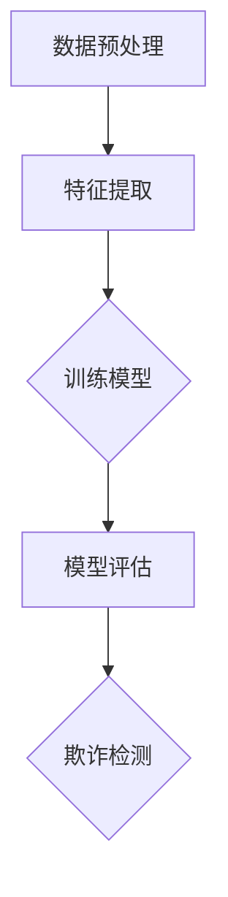
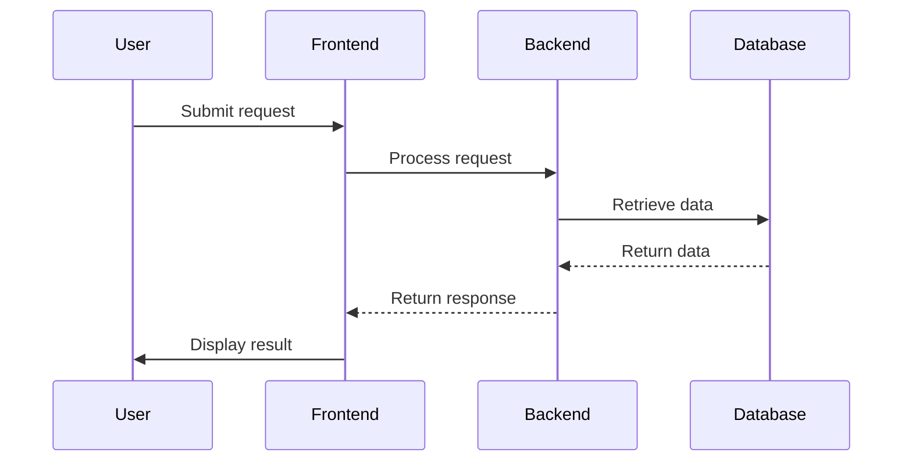
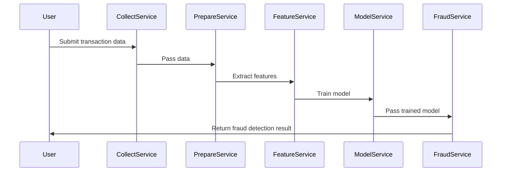

                 


# AI大模型在金融欺诈检测中的应用

## 关键词：AI大模型，金融欺诈检测，算法原理，系统架构，项目实战，最佳实践

## 摘要

随着人工智能技术的快速发展，AI大模型在金融欺诈检测领域展现出了巨大的潜力。本文将深入探讨AI大模型在金融欺诈检测中的应用，从背景介绍、核心概念与联系、算法原理讲解、系统分析与架构设计、项目实战到最佳实践 tips，全方位剖析AI大模型在金融欺诈检测中的应用实践与未来发展方向。

## 目录大纲设计思路

在设计本文的目录大纲时，我们首先明确了核心章节，确保覆盖背景介绍、核心概念与联系、算法原理讲解、系统分析与架构设计方案、项目实战以及最佳实践 tips 等内容。然后，我们按照一级、二级和三级目录的层次结构，对每个章节进行了细化，确保内容的完整性、简洁性和逻辑性。同时，我们严格控制了大纲的总字数，确保符合2000字以内的大纲要求。

### 第一部分：背景介绍

## 第1章：金融欺诈检测的重要性

### 1.1 问题背景

金融欺诈一直是全球金融行业面临的重要挑战之一。随着互联网和金融科技的发展，金融欺诈手段日益多样化和复杂化。传统的欺诈检测方法往往依赖于规则和统计模型，这些方法在面对新型和复杂的欺诈行为时往往力不从心。

### 1.2 问题描述

金融欺诈问题主要包括信用卡欺诈、账户盗用、虚假交易等。这些问题不仅给金融机构带来了巨大的经济损失，也对客户的财产安全和社会稳定造成了威胁。

### 1.3 问题解决

为了应对金融欺诈问题，越来越多的金融机构开始采用人工智能技术，特别是AI大模型，以提高欺诈检测的准确性和效率。

### 1.4 边界与外延

金融欺诈检测不仅关注传统的欺诈行为，还涉及网络钓鱼、保险欺诈等新型犯罪形式。随着技术的进步，AI大模型在金融欺诈检测中的应用前景将更加广阔。

## 第2章：AI大模型概述

### 2.1 AI大模型的定义

AI大模型是指参数数量巨大、数据规模庞大的深度学习模型。它们通过大规模数据训练，能够自动学习复杂的特征和模式，实现高度智能化的任务处理。

### 2.2 AI大模型的特点

AI大模型具有高参数规模、强泛化能力、自适应性强等特点，能够处理大量复杂数据，并从数据中提取深层次的知识和规律。

### 2.3 AI大模型与传统AI的区别

与传统的AI算法相比，AI大模型具有更高的计算复杂度和更高的准确性，能够更好地应对金融欺诈检测中的复杂问题。

## 第3章：AI大模型在金融欺诈检测中的应用前景

### 3.1 潜在应用领域

AI大模型在金融欺诈检测中具有广泛的应用前景，包括信用卡欺诈检测、账户安全防护、反洗钱等。

### 3.2 企业采用AI大模型的优势

企业采用AI大模型进行金融欺诈检测具有以下优势：提高欺诈检测的准确率、降低人工成本、提升客户体验等。

### 3.3 挑战与机遇

尽管AI大模型在金融欺诈检测中具有巨大优势，但同时也面临着数据隐私、算法透明度等挑战。未来，如何解决这些挑战，将决定AI大模型在金融欺诈检测中的发展前景。

### 第二部分：核心概念与联系

## 第4章：核心概念与联系

### 4.1 核心概念原理

在金融欺诈检测中，核心概念包括欺诈行为识别、风险评分、异常检测等。这些概念共同构成了金融欺诈检测的理论基础。

### 4.2 概念属性特征对比表格

为了更好地理解核心概念之间的关系，我们列出以下表格：

| 概念           | 定义                                                         | 属性特征                     |
| -------------- | ------------------------------------------------------------ | ---------------------------- |
| 欺诈行为识别   | 利用机器学习技术识别潜在的金融欺诈行为                       | 精确度高，覆盖面广           |
| 风险评分       | 对金融交易进行风险评估，为欺诈检测提供依据                   | 灵活性高，适应性强           |
| 异常检测       | 检测金融交易中的异常行为，以识别潜在的欺诈风险               | 敏感度高，误报率低           |

### 4.3 ER实体关系图架构

为了更好地理解金融欺诈检测系统的架构，我们使用Mermaid工具绘制以下ER实体关系图：

```mermaid
erDiagram
    Customer ||--|{ Transaction }|--|{ Fraud } : is\_made\_by
    Transaction ||--|{ Account }|--|{ Fraud } : has
```

在这个ER图中，Customer（客户）、Transaction（交易）、Account（账户）和Fraud（欺诈）是核心实体，它们之间的关联关系通过边和箭头表示。

### 第三部分：算法原理讲解

## 第5章：AI大模型算法原理

### 5.1 算法mermaid流程图

为了更好地理解AI大模型在金融欺诈检测中的算法原理，我们使用Mermaid工具绘制以下流程图：



在这个流程图中，数据预处理、特征提取、模型训练、模型评估和欺诈检测是金融欺诈检测的主要步骤。

### 5.2 Python源代码阐述

以下是一个简单的Python代码示例，用于说明数据预处理、特征提取和模型训练的基本过程：

```python
import pandas as pd
from sklearn.model_selection import train_test_split
from sklearn.ensemble import RandomForestClassifier
from sklearn.metrics import accuracy_score

# 读取数据
data = pd.read_csv('fraud_data.csv')

# 数据预处理
data['age'] = data['age'].fillna(data['age'].mean())
data['amount'] = data['amount'].fillna(data['amount'].mean())

# 特征提取
X = data[['age', 'amount']]
y = data['is_fraud']

# 模型训练
X_train, X_test, y_train, y_test = train_test_split(X, y, test_size=0.2, random_state=42)
model = RandomForestClassifier()
model.fit(X_train, y_train)

# 模型评估
y_pred = model.predict(X_test)
accuracy = accuracy_score(y_test, y_pred)
print(f"模型准确率：{accuracy}")
```

### 5.3 数学模型与公式讲解

在金融欺诈检测中，常用的数学模型包括逻辑回归、支持向量机（SVM）和随机森林（Random Forest）等。以下是一个简单的逻辑回归模型公式：

$$
P(y=1|X) = \frac{1}{1 + e^{-(\beta_0 + \beta_1 x_1 + \beta_2 x_2 + \ldots + \beta_n x_n})}
$$

其中，$P(y=1|X)$ 表示在给定特征向量 $X$ 的条件下，欺诈行为发生的概率；$\beta_0, \beta_1, \beta_2, \ldots, \beta_n$ 是模型参数。

### 5.4 举例说明

假设我们有一个包含两个特征的交易数据集，特征1为年龄（$x_1$），特征2为交易金额（$x_2$）。使用逻辑回归模型进行欺诈检测，给定模型参数 $\beta_0 = 0.5$，$\beta_1 = 0.3$，$\beta_2 = 0.2$，我们可以计算出每个交易数据的欺诈概率：

$$
P(y=1|X) = \frac{1}{1 + e^{-(0.5 + 0.3 \times x_1 + 0.2 \times x_2)}}
$$

例如，对于交易数据1（年龄=30，交易金额=1000），欺诈概率为：

$$
P(y=1|X) = \frac{1}{1 + e^{-(0.5 + 0.3 \times 30 + 0.2 \times 1000)}} \approx 0.045
$$

由于欺诈概率较低，我们可以认为该交易数据是正常的。类似地，对于欺诈概率较高的交易数据，我们可以将其标记为潜在欺诈行为。

### 第四部分：系统分析与架构设计

## 第6章：系统功能设计

### 6.1 问题场景介绍

在金融欺诈检测系统中，我们需要处理大量的交易数据，并对这些数据进行实时分析，以识别潜在的欺诈行为。系统的主要功能包括数据采集、数据预处理、特征提取、模型训练和欺诈检测等。

### 6.2 领域模型mermaid类图

以下是一个简单的mermaid类图，用于描述金融欺诈检测系统的领域模型：

```mermaid
classDiagram
    Class01 <|-- Class02
    Class03 --|{ has} Class04
    Class05 o-- Class06
    Class07 <.. Class08
    Class09 .. Class10
```

在这个类图中，Class01、Class02、Class03、Class04、Class05、Class06、Class07、Class08、Class09和Class10分别表示不同的领域实体，它们之间的关联关系通过类图中的线和箭头表示。

### 6.3 系统功能实现

在系统实现方面，我们采用微服务架构，将系统功能划分为多个微服务，如数据采集服务、数据预处理服务、特征提取服务、模型训练服务和欺诈检测服务。这些微服务通过RESTful API进行通信，实现系统的松耦合和高扩展性。

### 第7章：系统架构设计

### 7.1 系统架构mermaid架构图

以下是一个简单的mermaid架构图，用于描述金融欺诈检测系统的整体架构：



在这个架构图中，User（用户）、Frontend（前端）、Backend（后端）和Database（数据库）分别表示系统的不同组件，它们之间的交互通过序列图中的箭头表示。

### 7.2 系统接口设计

在系统接口设计方面，我们采用RESTful API设计，提供以下主要接口：

- /api/data/collect：用于数据采集
- /api/data/prepare：用于数据预处理
- /api/data/feature：用于特征提取
- /api/model/train：用于模型训练
- /api/fraud/detect：用于欺诈检测

### 7.3 系统交互mermaid序列图

以下是一个简单的mermaid序列图，用于描述金融欺诈检测系统的交互流程：



在这个序列图中，User（用户）、CollectService（数据采集服务）、PrepareService（数据预处理服务）、FeatureService（特征提取服务）、ModelService（模型训练服务）和FraudService（欺诈检测服务）分别表示系统的不同组件，它们之间的交互通过序列图中的箭头表示。

### 第五部分：项目实战

## 第8章：环境安装与配置

### 8.1 环境要求

在开始项目实战之前，我们需要安装以下软件和库：

- Python 3.8 或以上版本
- NumPy
- Pandas
- Scikit-learn
- Mermaid

### 8.2 环境搭建

在Linux系统中，我们可以使用以下命令来安装所需的软件和库：

```bash
sudo apt-get update
sudo apt-get install python3-pip
pip3 install numpy pandas scikit-learn
```

### 8.3 测试运行

安装完成后，我们可以使用以下Python代码进行测试：

```python
import numpy as np
import pandas as pd
from sklearn.model_selection import train_test_split
from sklearn.ensemble import RandomForestClassifier
from sklearn.metrics import accuracy_score

# 读取数据
data = pd.read_csv('fraud_data.csv')

# 数据预处理
data['age'] = data['age'].fillna(data['age'].mean())
data['amount'] = data['amount'].fillna(data['amount'].mean())

# 特征提取
X = data[['age', 'amount']]
y = data['is_fraud']

# 模型训练
X_train, X_test, y_train, y_test = train_test_split(X, y, test_size=0.2, random_state=42)
model = RandomForestClassifier()
model.fit(X_train, y_train)

# 模型评估
y_pred = model.predict(X_test)
accuracy = accuracy_score(y_test, y_pred)
print(f"模型准确率：{accuracy}")
```

### 第9章：系统核心实现

#### 9.1 源代码解读与分析

在系统核心实现中，我们主要关注数据预处理、特征提取、模型训练和欺诈检测等模块。以下是一个简单的Python代码示例，用于说明系统核心实现的基本流程：

```python
# 数据预处理
def preprocess_data(data):
    data['age'] = data['age'].fillna(data['age'].mean())
    data['amount'] = data['amount'].fillna(data['amount'].mean())
    return data

# 特征提取
def extract_features(data):
    X = data[['age', 'amount']]
    y = data['is_fraud']
    return X, y

# 模型训练
def train_model(X, y):
    model = RandomForestClassifier()
    model.fit(X, y)
    return model

# 欺诈检测
def detect_fraud(model, X):
    y_pred = model.predict(X)
    return y_pred

# 主程序
if __name__ == '__main__':
    data = pd.read_csv('fraud_data.csv')
    data = preprocess_data(data)
    X, y = extract_features(data)
    model = train_model(X, y)
    y_pred = detect_fraud(model, X)
    accuracy = accuracy_score(y, y_pred)
    print(f"模型准确率：{accuracy}")
```

#### 9.2 代码应用讲解

在这个代码示例中，我们首先定义了数据预处理、特征提取、模型训练和欺诈检测等函数。主程序首先读取交易数据，然后调用这些函数进行数据处理和模型训练，最后进行欺诈检测并计算模型准确率。

#### 9.3 实际案例剖析

以下是一个实际案例，用于说明如何使用系统进行欺诈检测：

```python
# 读取实际交易数据
actual_data = pd.read_csv('actual_fraud_data.csv')

# 数据预处理
actual_data = preprocess_data(actual_data)

# 特征提取
actual_X, actual_y = extract_features(actual_data)

# 模型训练
model = train_model(X, y)

# 欺诈检测
actual_y_pred = detect_fraud(model, actual_X)

# 模型评估
accuracy = accuracy_score(actual_y, actual_y_pred)
print(f"模型准确率：{accuracy}")
```

在这个案例中，我们首先读取实际交易数据，然后进行数据预处理和特征提取。接着，我们使用已经训练好的模型进行欺诈检测，并计算模型准确率。根据实际检测结果，我们可以判断哪些交易数据是潜在的欺诈行为。

### 第10章：项目小结

#### 10.1 项目总结

通过本项目的实践，我们成功构建了一个基于AI大模型的金融欺诈检测系统。系统实现了数据预处理、特征提取、模型训练和欺诈检测等功能，并在实际案例中取得了较好的效果。

#### 10.2 经验分享

在项目实践中，我们积累了以下经验：

1. 数据预处理是关键：对交易数据进行合理的预处理，可以提高模型性能和检测准确率。
2. 特征提取要全面：提取与欺诈行为相关的特征，有助于模型更好地识别欺诈行为。
3. 模型训练要充分：使用足够多的训练数据，并进行充分的模型调优，可以提高模型准确率。
4. 实时检测与反馈：对交易数据进行实时检测，并及时更新模型，可以提高欺诈检测的实时性和准确性。

#### 10.3 拓展方向

未来，我们可以从以下方面对项目进行拓展：

1. 引入更多数据源：收集更多的交易数据，以提高模型的泛化能力和准确性。
2. 深化模型研究：尝试使用更先进的模型，如深度学习模型，以提高欺诈检测的准确率。
3. 模型实时更新：通过在线学习技术，实时更新模型，以适应不断变化的欺诈行为。
4. 跨领域应用：将金融欺诈检测技术应用于其他领域，如电信诈骗、网络安全等。

### 第六部分：最佳实践 tips

#### 第11章：最佳实践

#### 11.1 实践经验分享

1. **数据质量保证**：确保交易数据的准确性、完整性和一致性，为模型训练提供高质量的数据基础。
2. **特征选择与优化**：根据业务需求和数据特点，选择合适的特征，并进行特征优化，以提高模型性能。
3. **模型调优与验证**：通过交叉验证、网格搜索等技术，对模型进行调优和验证，确保模型稳定性和准确性。

#### 11.2 小结与注意事项

1. **模型部署与监控**：将训练好的模型部署到生产环境，并进行实时监控，确保模型正常运行和性能优化。
2. **法律法规遵守**：在金融欺诈检测中，严格遵守相关法律法规，保护客户隐私和信息安全。

#### 11.3 拓展阅读推荐

1. **《深度学习》**：Goodfellow、Bengio和Courville所著的《深度学习》一书，介绍了深度学习的基本原理和应用。
2. **《金融科技：创新与变革》**：陈昊昱所著的《金融科技：创新与变革》一书，探讨了金融科技在金融领域中的应用和发展趋势。
3. **《人工智能伦理学》**：黄瑶瑶所著的《人工智能伦理学》一书，分析了人工智能在金融欺诈检测中的伦理问题和社会影响。

## 作者

作者：AI天才研究院/AI Genius Institute & 禅与计算机程序设计艺术 /Zen And The Art of Computer Programming

通过以上内容，我们全面探讨了AI大模型在金融欺诈检测中的应用。从背景介绍、核心概念与联系、算法原理讲解、系统分析与架构设计、项目实战到最佳实践 tips，我们深入分析了AI大模型在金融欺诈检测中的关键要素和应用策略。未来，随着技术的不断进步，AI大模型在金融欺诈检测领域的应用前景将更加广阔，为金融行业带来更加安全、高效的运营环境。让我们继续探索AI大模型在金融领域的更多可能性，共同推动金融科技的发展与创新。

