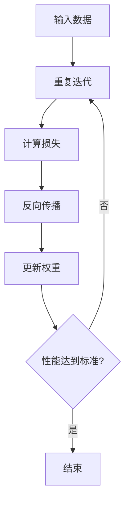
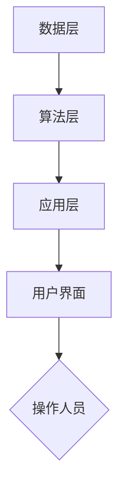
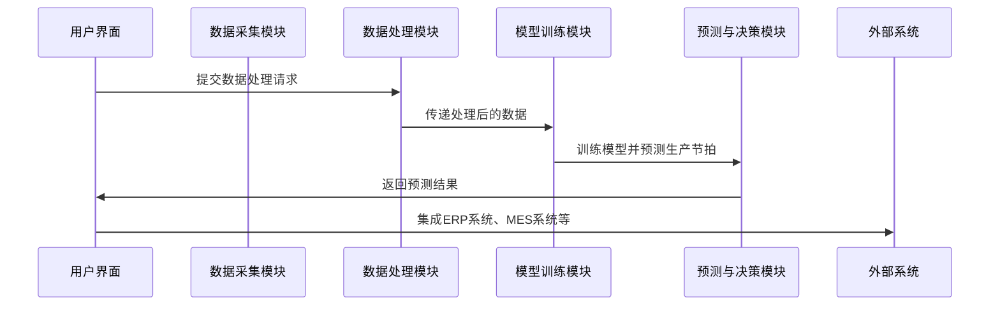
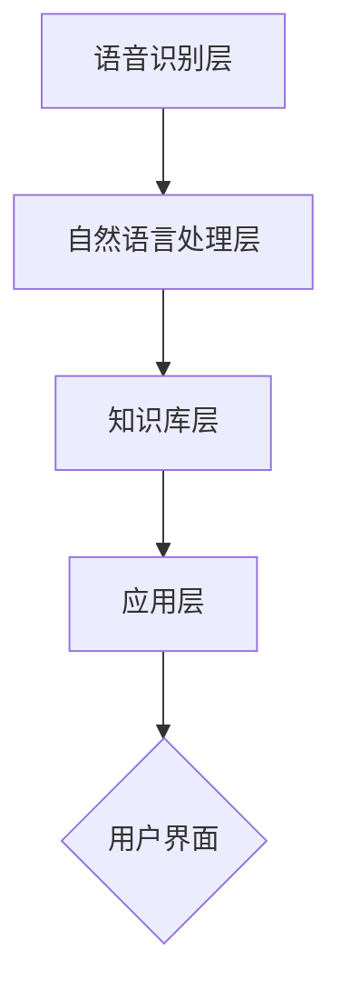
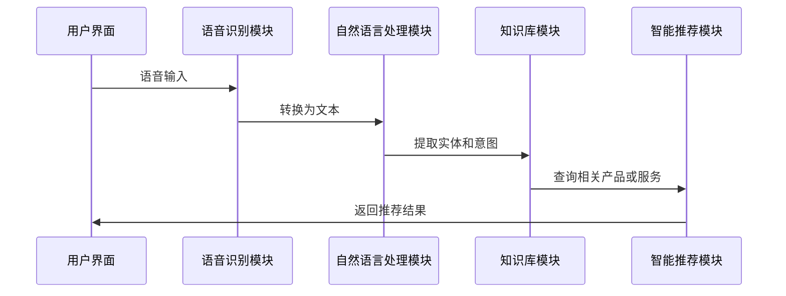
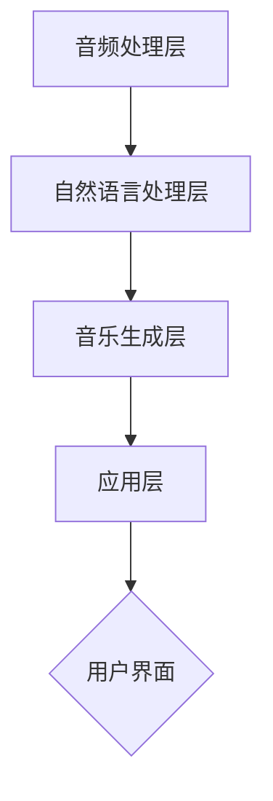
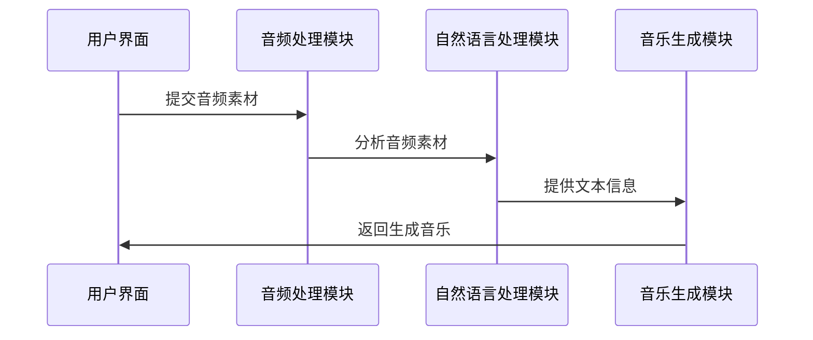

                 

## 文章标题

### AI大模型对就业市场的冲击与重塑

#### 关键词：AI大模型、就业市场、冲击、重塑、个人、企业、政策

#### 摘要：

随着人工智能（AI）技术的迅猛发展，AI大模型作为其核心成果，正在对各行各业产生深远影响。本文将深入探讨AI大模型对就业市场的冲击与重塑，从基础理论、应用场景、影响分析到应对策略，全面解析这一新兴科技浪潮所带来的机遇与挑战。通过本文的阅读，读者将了解AI大模型的基本概念、技术原理、应用领域及其对就业市场的多重影响，同时得到个人、企业和政府在不同层面的应对策略。

----------------------------------------------------------------

### 目录大纲

# AI大模型对就业市场的冲击与重塑

## 第一部分: 引言

### 第1章: AI大模型概述

### 第2章: AI大模型的技术发展

### 第3章: AI大模型的应用场景

## 第二部分: AI大模型的基础知识

### 第4章: AI大模型对就业市场的冲击

### 第5章: AI大模型对就业市场的影响因素分析

### 第6章: AI大模型对就业市场的重塑

## 第三部分: AI大模型对就业市场的影响

### 第7章: 个人应对策略

### 第8章: 企业应对策略

### 第9章: 社会政策应对策略

## 第四部分: 案例分析

### 第10章: 案例分析一

### 第11章: 案例分析二

### 第12章: 案例分析三

## 第五部分: 总结与展望

### 第13章: 总结

### 第14章: 展望

----------------------------------------------------------------

### 第一部分: 引言

#### 第1章: AI大模型概述

##### 1.1 问题背景

人工智能（AI）技术的发展日新月异，从早期的规则驱动和符号计算，到如今的基于数据的机器学习和深度学习，AI已经逐渐渗透到社会的各个领域。AI大模型，作为深度学习的一种表现形式，其规模和复杂性已经达到前所未有的水平。这些模型通过训练大量的数据，能够自动学习和发现规律，从而在图像识别、自然语言处理、机器翻译、语音识别等领域展现出卓越的性能。

随着AI大模型的广泛应用，其在各行各业中带来的变革不仅仅局限于技术层面，还深刻影响着就业市场。一方面，AI大模型能够自动化执行许多传统的劳动力密集型任务，从而提高生产效率，降低成本；另一方面，这些模型的出现也引发了对人类劳动力需求的减少，引发了关于就业岗位减少、职业重构的担忧。因此，本文将从AI大模型的背景出发，探讨其对就业市场的冲击与重塑。

##### 1.2 问题描述

当前，就业市场面临着一系列挑战，包括人口老龄化、经济结构转型、技能需求变化等。而AI大模型的应用进一步加剧了这些挑战。首先，AI大模型可以自动化执行许多重复性和劳动力密集型的任务，如数据分析、客服、制造等，这直接导致相关岗位的需求减少。其次，AI大模型对专业人才的要求也发生了变化，不仅需要具备扎实的技术基础，还需要快速学习和适应新技术的能力。

此外，AI大模型的应用还可能引发一些社会问题，如技能差距的扩大、失业率的上升等。因此，如何应对AI大模型对就业市场的冲击，如何重塑就业市场，成为亟需解决的重要问题。本文将从多个角度对这一问题进行深入探讨，包括AI大模型的基础知识、其应用场景、对就业市场的影响因素分析，以及个人、企业和政府的应对策略。

##### 1.3 问题解决

本文将从以下几个方面探讨如何解决AI大模型对就业市场的冲击与重塑问题：

1. **基础知识**：首先介绍AI大模型的基本概念、技术原理和应用场景，为后续的分析提供理论基础。
2. **影响分析**：分析AI大模型对就业市场的冲击，包括其负面影响和正面影响，以及影响因素。
3. **应对策略**：探讨个人、企业和政府在不同层面的应对策略，包括技能提升、职业规划、技术创新、社会责任等。
4. **案例分析**：通过实际案例，展示AI大模型在不同行业中的应用，以及应对冲击的具体措施。
5. **总结与展望**：总结本文的主要观点，并对未来发展趋势进行展望。

##### 1.4 边界与外延

本文主要关注AI大模型对就业市场的影响，以及如何应对这一影响。文章的研究范围包括AI大模型的基本概念、技术发展、应用场景、影响因素和应对策略。同时，本文还将探讨AI大模型在不同行业中的应用案例，以提供具体的实践参考。

本文与相关领域的区别在于，它不仅仅关注AI大模型的技术层面，还深入探讨了其对就业市场的广泛影响，以及应对这一影响的多种策略。此外，本文还将结合实际案例，为读者提供更加具体和实用的指导。

----------------------------------------------------------------

#### 第2章: AI大模型的技术发展

##### 2.1 大模型的发展历程

AI大模型的发展历程可以追溯到20世纪80年代，当时的神经网络和深度学习技术刚刚起步。最早的神经网络模型如感知机（Perceptron）和反向传播算法（Backpropagation）为深度学习的发展奠定了基础。然而，由于计算资源和数据集的限制，早期的神经网络模型规模较小，应用范围有限。

进入21世纪，随着计算能力的提升和数据量的爆炸式增长，深度学习迎来了快速发展。2006年，Geoffrey Hinton等人提出了深度信念网络（Deep Belief Networks），为深度学习的实际应用提供了理论基础。随后，2012年，AlexNet在ImageNet竞赛中取得突破性成绩，这标志着深度学习在图像识别领域的重要突破。

随着模型的复杂度和参数数量的增加，AI大模型开始出现。这些模型通过大规模的数据训练，能够在各种任务中达到甚至超越人类的水平。例如，GPT-3、BERT、Transformers等模型，都在自然语言处理、机器翻译、文本生成等领域取得了显著成果。

##### 2.2 大模型的技术原理

AI大模型的技术原理主要基于神经网络，尤其是深度神经网络（DNN）。深度神经网络由多个隐藏层组成，每一层对输入数据进行特征提取和变换。通过逐层学习，网络能够自动发现输入数据中的复杂模式和特征。

以下是一个简化的神经网络模型：

```
输入层 -> [隐藏层1] -> [隐藏层2] -> ... -> 输出层
```

每个隐藏层都包含多个神经元，每个神经元接收前一层所有神经元的输出，通过激活函数进行非线性变换，然后传递给下一层。

神经网络的训练过程通常包括以下几个步骤：

1. **前向传播**：输入数据通过网络从输入层传递到输出层，计算每个神经元的输出值。
2. **计算损失**：将输出值与真实标签进行比较，计算损失函数的值，损失函数通常用来衡量输出值与真实值之间的差距。
3. **反向传播**：根据损失函数的梯度，通过反向传播算法更新网络中每个神经元的权重和偏置。
4. **重复迭代**：重复前向传播和反向传播的过程，直到网络性能达到预设的标准。

以下是神经网络训练过程的Mermaid流程图：



##### 2.3 大模型的应用领域

AI大模型在各个领域都有广泛的应用，以下是其中一些重要的应用领域：

1. **图像识别**：AI大模型通过训练大量的图像数据，可以自动识别图像中的物体、场景和人物。例如，自动驾驶汽车使用深度学习模型进行环境感知，图像识别技术在医疗影像分析中也发挥着重要作用。

2. **自然语言处理**：AI大模型在自然语言处理（NLP）领域表现出色，能够进行文本分类、情感分析、机器翻译、文本生成等任务。例如，GPT-3等大型语言模型可以生成高质量的文本，辅助创作和写作。

3. **语音识别**：AI大模型通过训练大量的语音数据，可以准确识别语音中的文字内容。语音识别技术在智能助手、客服系统、语音翻译等领域有广泛应用。

4. **推荐系统**：AI大模型通过分析用户的行为数据，可以推荐用户可能感兴趣的商品、电影、音乐等。例如，亚马逊和Netflix等公司使用深度学习模型进行个性化推荐。

以下是AI大模型在不同应用领域的一个简表：

| 应用领域 | 描述 |
| --- | --- |
| 图像识别 | 自动识别图像中的物体、场景和人物 |
| 自然语言处理 | 文本分类、情感分析、机器翻译、文本生成 |
| 语音识别 | 识别语音中的文字内容 |
| 推荐系统 | 根据用户行为推荐感兴趣的商品、电影、音乐 |

通过上述内容，我们可以看到AI大模型的发展历程、技术原理和应用领域。在接下来的章节中，我们将进一步探讨AI大模型对就业市场的具体影响，以及个人、企业和政府如何应对这些影响。

----------------------------------------------------------------

#### 第3章: AI大模型的应用场景

##### 3.1 工业生产领域

AI大模型在工业生产领域中的应用极大地提升了生产效率和产品质量。首先，在制造过程中，AI大模型可以用于质量检测。通过图像识别技术，模型可以自动识别生产线上的缺陷产品，从而减少人为错误，提高产品合格率。例如，在电子制造业中，AI大模型能够识别微小的焊点缺陷，从而确保电子产品的质量。

其次，AI大模型还可以优化生产流程。通过分析大量的生产数据，模型可以识别出生产过程中的瓶颈和潜在问题，并提出优化建议。例如，在汽车制造业中，AI大模型可以分析生产线的运行数据，优化生产节拍和资源配置，从而提高生产效率和降低成本。

此外，AI大模型在预测性维护方面也有重要作用。通过实时监控设备状态和运行数据，模型可以预测设备可能出现的故障，提前进行维护，避免生产中断。例如，在风电行业中，AI大模型可以预测风机的运行状态，提前发现可能的问题，确保风机运行的安全性和可靠性。

##### 3.2 服务业领域

在服务业领域，AI大模型的应用同样广泛。首先，在客户服务方面，AI大模型可以通过智能客服系统提供24/7全天候服务，提高客户满意度。例如，银行和保险公司通过AI大模型建立的智能客服系统，可以快速响应客户的查询和投诉，提供个性化的解决方案。

其次，在零售行业，AI大模型可以用于个性化推荐。通过分析消费者的购买历史和行为数据，模型可以推荐符合消费者兴趣的产品，从而提高销售额。例如，亚马逊和阿里巴巴等电商平台，使用AI大模型进行个性化推荐，为消费者提供更加精准的购物体验。

此外，AI大模型在金融服务业中的应用也非常显著。例如，在风险管理方面，AI大模型可以通过分析大量的金融数据，识别潜在的金融风险，从而帮助金融机构做出更明智的决策。在证券交易中，AI大模型可以分析市场数据，预测股票价格走势，为投资者提供投资建议。

##### 3.3 创意产业领域

在创意产业领域，AI大模型的应用为艺术创作和设计带来了新的可能性。首先，在音乐创作方面，AI大模型可以通过分析大量的音乐数据，生成新的音乐旋律和节奏。例如，谷歌的Magenta项目，通过深度学习模型生成了一首具有人类风格的音乐作品。

其次，在艺术创作方面，AI大模型可以辅助艺术家进行绘画和设计。通过训练大量的图像数据，模型可以模仿艺术家的风格，生成具有独特艺术风格的作品。例如，人工智能艺术家Obvious，通过AI大模型模仿荷兰画家梵高的风格，创作了多个成功的艺术作品。

此外，AI大模型在虚拟现实（VR）和增强现实（AR）领域也有重要应用。通过生成逼真的虚拟场景和物体，AI大模型可以提升用户体验，为创意产业带来更多的可能性。例如，在游戏设计和电影制作中，AI大模型可以生成复杂的场景和角色动画，提高作品的质量和视觉效果。

##### 3.4 其他领域

除了上述主要领域，AI大模型还在许多其他领域有广泛的应用。在医疗领域，AI大模型可以通过分析大量的医疗数据，辅助医生进行诊断和治疗。例如，AI大模型可以用于肿瘤检测、疾病预测和药物研发。

在农业领域，AI大模型可以用于作物监测、病虫害预测和种植规划，提高农业生产的效率和可持续性。例如，通过使用卫星图像和AI大模型，农民可以实时监控作物的生长状态，及时调整种植策略。

在能源领域，AI大模型可以用于智能电网的优化和能源管理。通过分析电网运行数据，模型可以预测电力需求，优化电力资源的分配，提高电网的稳定性和效率。

总之，AI大模型在各个领域的应用不仅提高了效率和质量，还带来了新的商业机会和挑战。随着技术的不断进步，AI大模型的应用将更加深入和广泛，为社会发展带来更多的可能性。

----------------------------------------------------------------

## 第二部分: AI大模型的基础知识

### 第4章: AI大模型对就业市场的冲击

#### 4.1 AI大模型对就业市场的负面影响

随着AI大模型在各个领域的广泛应用，其对就业市场的影响也越来越显著。首先，AI大模型对就业市场的负面影响主要表现在以下几个方面：

1. **自动化替代劳动力**：AI大模型在许多行业，如制造业、物流、客服等领域，能够自动化执行重复性高、技能要求低的任务，从而替代大量劳动力。这种自动化替代不仅降低了企业的运营成本，还提高了生产效率。然而，这也直接导致了许多传统劳动力的失业风险。

2. **就业岗位减少**：随着AI大模型的应用普及，一些传统岗位的需求量逐渐减少。例如，在制造业，自动化生产线和智能机器人取代了大量的生产线工人；在客服行业，智能客服系统减少了人工客服的需求。这些变化导致了许多传统岗位的消失，迫使劳动力需要寻找新的就业机会。

3. **技能需求变化**：AI大模型的应用对劳动力的技能需求产生了重大影响。传统的技能和知识逐渐变得不再重要，而与AI相关的技术技能，如数据科学、机器学习、编程等，变得越来越受欢迎。这要求劳动力需要不断学习新的技能，以适应技术发展的需求。然而，对于一些技能较为单一、缺乏持续学习能力的人群来说，这一变化带来了巨大的挑战。

4. **就业不稳定性增加**：AI大模型的应用使得就业市场的不稳定性增加。一方面，由于技术的快速发展，劳动力需要不断更新知识和技能，这增加了就业的不确定性；另一方面，AI大模型的广泛应用可能导致某些行业和岗位的迅速消失，而新兴的行业和岗位可能尚未形成稳定的就业市场。这种就业市场的动态变化使得劳动力在就业方面面临更大的压力和挑战。

#### 4.2 AI大模型对就业市场的正面影响

尽管AI大模型对就业市场带来了诸多负面影响，但也不乏其正面影响。以下是AI大模型对就业市场的正面影响：

1. **创造新的就业岗位**：AI大模型的应用带动了新兴行业的兴起，从而创造了大量的就业机会。例如，数据科学家、机器学习工程师、AI产品经理等职业应运而生。这些新兴职业不仅为劳动力提供了新的就业渠道，还推动了整个社会对高技能劳动力的需求。

2. **提高劳动效率**：AI大模型通过自动化和智能化的方式，显著提高了劳动效率。例如，在制造业，AI大模型的应用使得生产线的效率提高了数十倍；在金融行业，智能风控系统能够在短时间内处理海量数据，提高风险管理能力。这种劳动效率的提升不仅为企业带来了经济效益，也为劳动力提供了更多的工作机会。

3. **促进创新和创业**：AI大模型的应用为创新和创业提供了新的动力。一方面，AI大模型可以帮助企业和个人快速开发新产品和服务，抢占市场先机；另一方面，AI大模型的应用降低了创业的门槛，使得更多的人能够参与到创新创业中来。

4. **优化劳动力结构**：AI大模型的应用使得劳动力结构得到优化。传统的劳动力密集型岗位逐渐被自动化和智能化取代，而高技能、高创造力的岗位需求增加。这种劳动力结构的优化有助于提升整体劳动力的素质和竞争力。

总之，AI大模型对就业市场的影响是双重的，既有负面影响，也有正面影响。如何平衡这两方面的影响，成为社会各界需要共同面对和解决的问题。在接下来的章节中，我们将进一步分析AI大模型对就业市场的影响因素，探讨如何应对这些影响。

----------------------------------------------------------------

#### 4.3 AI大模型对就业市场的影响因素分析

AI大模型对就业市场的影响是多方面的，涉及技术、经济、社会等多个层面。以下是对这些影响因素的详细分析：

##### 4.3.1 技术因素

技术因素是影响AI大模型对就业市场冲击的核心因素。首先，AI大模型的技术进步直接决定了其应用范围和深度。随着深度学习、自然语言处理、计算机视觉等技术的不断发展，AI大模型在各个领域的应用能力不断提升，从而对传统劳动力产生更大的替代效应。

1. **算法复杂度和计算能力**：随着算法的复杂度增加和计算能力的提升，AI大模型能够处理更复杂的问题，从而在更多领域实现自动化。例如，大型深度学习模型的参数数量和训练数据量不断增加，使得模型在图像识别、语音识别等领域的性能显著提高。

2. **数据质量和数量**：AI大模型依赖于大量高质量的数据进行训练。数据的多样性和质量直接影响模型的性能和应用效果。随着数据收集和处理技术的进步，越来越多的行业能够获取到高质量的数据，这为AI大模型的发展提供了坚实的基础。

3. **应用场景的扩展**：AI大模型的应用场景不断扩展，从简单的图像识别和文本分类，到复杂的自然语言处理和智能决策。这些新应用不仅推动了技术的进步，也带来了新的就业机会。

##### 4.3.2 经济因素

经济因素也是影响AI大模型对就业市场影响的重要因素。经济的增长、产业结构的调整和市场的变化都在不同程度上影响了劳动力市场的需求和供给。

1. **产业升级和转型**：随着AI技术的广泛应用，许多传统产业正在进行升级和转型。新兴产业如人工智能、大数据、云计算等的发展，创造了大量新的就业机会，但同时也对传统劳动力提出了更高的技能要求。

2. **劳动力市场的供需变化**：AI大模型的应用改变了劳动力市场的供需结构。一方面，自动化和智能化的普及减少了传统劳动力的需求；另一方面，新兴岗位的出现增加了对高技能劳动力的需求。这种供需变化对劳动力市场的稳定性和就业结构产生了深远影响。

3. **成本效益**：AI大模型的应用能够显著降低企业的运营成本，提高生产效率。这种成本效益驱动了AI大模型在企业中的应用，但也可能导致劳动力市场的波动和不稳定。

##### 4.3.3 社会因素

社会因素是影响AI大模型对就业市场影响的另一个关键方面。社会文化、教育水平、社会保障体系等都在不同程度上影响了劳动力市场的发展和劳动力的素质。

1. **教育水平**：随着教育水平的提高，劳动力的技能和素质不断提升，这有助于劳动力更好地适应AI大模型时代的需求。然而，教育资源的分配不均和教育体系的滞后，也可能导致一些劳动力难以适应技术变革。

2. **社会保障体系**：完善的社会保障体系能够缓解AI大模型带来的就业压力。例如，通过提供失业救济、职业培训和再就业服务，社会保障体系可以减轻劳动力的就业风险。

3. **社会文化观念**：社会文化观念的变迁也影响着劳动力市场的变化。例如，一些社会对创新和创业的鼓励，有助于促进劳动力转向新兴行业和岗位。

##### 4.3.4 政策因素

政策因素对AI大模型对就业市场的影响也至关重要。政府的政策制定和实施直接影响AI大模型的发展和应用。

1. **科技政策**：政府通过科技政策支持和鼓励AI技术的发展，推动AI大模型在各个领域的应用。例如，提供科研资金、减免税收、建设数据中心等，都有助于促进AI大模型的发展。

2. **就业政策**：政府通过制定就业政策，引导劳动力适应AI大模型时代的需求。例如，提供职业培训、鼓励创业、推动灵活就业等，都有助于缓解AI大模型带来的就业压力。

3. **监管政策**：政府对AI大模型应用的监管也是影响就业市场的重要因素。适当的监管措施可以保障劳动者的权益，防止AI大模型滥用，从而维护劳动力市场的稳定。

综上所述，AI大模型对就业市场的影响是多方面的，涉及技术、经济、社会和政策等多个层面。理解这些影响因素有助于我们更全面地认识AI大模型对就业市场的冲击，从而制定有效的应对策略。在接下来的章节中，我们将进一步探讨个人、企业和政府在应对AI大模型对就业市场冲击方面的策略。

----------------------------------------------------------------

### 第5章: AI大模型对就业市场的重塑

#### 6.1 职业重塑

AI大模型的出现和广泛应用对职业领域产生了深远的影响，推动了职业的重塑。首先，许多传统职业正在被自动化和智能化取代，例如制造业的流水线工人、客服中心的电话接线员等。这些职业的消失迫使劳动力需要重新寻找新的就业机会，从而推动了职业的转型。

1. **职业内涵的变化**：随着AI大模型的应用，职业的内涵正在发生改变。一些原本需要高度技能和经验的职业，如医生、律师等，开始借助AI技术提升工作效率和准确度。同时，新的职业也应运而生，如数据科学家、机器学习工程师、AI产品经理等。这些新兴职业要求劳动力具备更深厚的技术背景和创新能力。

2. **岗位需求的变化**：AI大模型的应用改变了岗位需求的结构。一方面，传统劳动力密集型岗位的需求减少，而技术密集型和创新型岗位的需求增加。另一方面，随着AI技术的发展，一些原本无法就业的特殊人群，如视障人士、听力障碍人士等，通过辅助技术获得了新的就业机会。

3. **技能要求的变化**：AI大模型对劳动力的技能要求也发生了显著变化。传统的技能和知识逐渐变得不再重要，而与AI相关的技术技能，如编程、数据分析和机器学习等，变得越来越受欢迎。这要求劳动力需要不断学习和更新技能，以适应不断变化的技术环境。

#### 6.2 劳动市场重塑

AI大模型不仅重塑了职业，还对劳动市场产生了深远的影响，改变了劳动市场的供需关系和劳动力结构。

1. **供需关系的变化**：AI大模型的应用改变了劳动市场的供需关系。一方面，自动化和智能化的普及减少了传统劳动力的需求，导致劳动力供给过剩。另一方面，新兴岗位的出现增加了对高技能劳动力的需求，导致劳动力供给不足。这种供需失衡使得劳动市场的稳定性受到挑战。

2. **劳动力结构的变化**：AI大模型的应用推动了劳动力结构的变化。传统的劳动力结构以体力劳动和重复性劳动为主，而随着AI技术的应用，劳动力结构逐渐向高技能、高创造力的方向转变。高技能劳动力的需求增加，而低技能劳动力的需求减少。这种变化对劳动力市场的均衡和稳定提出了新的挑战。

3. **劳动力流动的变化**：AI大模型的应用也影响了劳动力的流动。一方面，新兴岗位的出现吸引了大量的劳动力向技术领域转移，导致劳动力在不同行业和地区之间的流动增加。另一方面，劳动力在职业之间的流动变得更加频繁，个人需要不断适应新的工作环境和技能要求。

#### 6.3 教育重塑

AI大模型的应用不仅改变了职业和劳动市场，也对教育领域产生了深远的影响，推动了教育的重塑。

1. **教育内容的改变**：随着AI大模型的应用，教育内容需要不断更新和调整。传统的教育课程和知识体系可能无法满足新兴职业和技术发展的需求。教育机构需要引入更多的AI相关课程，如机器学习、深度学习、数据分析等，以培养具备未来竞争力的人才。

2. **教育方式的改变**：AI大模型的应用也改变了教育方式。在线教育、远程教育等新型教育模式逐渐普及，为学习者提供了更加灵活和便捷的学习途径。同时，AI技术在教育中的应用，如智能辅导系统、在线测评等，提高了教育的质量和效率。

3. **教育资源的分配**：AI大模型的应用有助于优化教育资源的分配。通过智能教育系统，教育资源可以更加精准地分配到有需求的地方，缩小教育差距。例如，智能辅导系统可以根据学习者的特点和需求，提供个性化的学习方案，从而提高学习效果。

总之，AI大模型对就业市场的重塑体现在职业、劳动市场和教育等多个方面。面对这些变化，个人、企业和政府需要采取相应的措施，以适应AI大模型时代的需求，推动社会经济的持续发展。

----------------------------------------------------------------

### 第7章: 个人应对策略

#### 7.1 技能提升

在AI大模型时代，个人应对就业市场变化的关键在于不断提升自身的技能。以下是一些具体的建议：

1. **学习编程**：编程是AI大模型时代的一项核心技能。无论是数据科学、机器学习，还是人工智能应用开发，编程都是基础。学习编程可以帮助个人更好地理解和应用AI技术，从而在求职市场上更具竞争力。

2. **掌握数据分析**：数据分析是AI大模型应用的重要环节。通过学习数据分析，个人可以更好地处理和分析大数据，为企业和组织提供有价值的信息和决策支持。

3. **深入学习AI相关知识**：了解AI的基本概念、算法原理和应用领域，是个人在AI大模型时代不可或缺的知识储备。通过学习机器学习、深度学习、自然语言处理等课程，个人可以更好地把握AI技术的发展趋势，为未来的职业规划做好准备。

4. **持续学习**：在AI大模型时代，技术更新迅速，个人需要保持持续学习的状态。可以通过在线课程、工作坊、研讨会等多种形式，不断更新知识和技能，以适应新的工作环境和需求。

5. **实践项目**：通过参与实践项目，个人可以将所学知识应用于实际场景，提升解决问题的能力。例如，参加开源项目、参与企业实习等，都是很好的实践机会。

#### 7.2 职业规划

合理的职业规划是个人在AI大模型时代成功就业的重要保障。以下是一些职业规划的策略：

1. **明确职业目标**：个人需要明确自己的职业目标，并制定可行的实现路径。例如，如果目标是成为数据科学家，那么需要学习数据分析、编程等相关技能，并积累实际项目经验。

2. **多样化技能**：在AI大模型时代，单一技能很难满足职业发展的需求。个人应该努力培养多样化的技能，如编程、数据分析、项目管理等，以增强自身的竞争力。

3. **持续评估和调整**：职业规划不是一成不变的，个人需要定期评估自己的职业发展情况，并根据实际情况进行调整。例如，如果发现某个职业方向发展前景不佳，可以及时转变方向，寻找新的机会。

4. **积累人脉**：在职业规划过程中，积累人脉也是非常重要的一环。可以通过参加行业活动、加入专业组织等方式，扩大自己的社交网络，获取更多的职业信息和机会。

5. **保持灵活性**：AI大模型时代，职业变化迅速，个人需要保持灵活性，适应不同工作环境和需求。例如，可以尝试兼职、远程工作等灵活就业方式，以应对职业变化。

#### 7.3 创业机会

在AI大模型时代，个人也可以通过创业来应对就业市场的变化。以下是一些创业的建议：

1. **寻找痛点**：在寻找创业机会时，要关注市场上的痛点和需求。可以通过市场调研、用户反馈等方式，发现潜在的商业机会。

2. **利用AI技术**：利用AI技术为创业项目增色添彩。AI技术可以帮助提高效率、降低成本，甚至创造全新的商业模式。

3. **组建团队**：创业需要团队的支持。通过组建一支具有互补技能和共同目标的团队，可以更好地实现创业目标。

4. **资金和资源**：创业初期，资金和资源是关键。可以通过众筹、政府补贴、风险投资等方式，获取必要的资金和资源支持。

5. **持续创新**：在创业过程中，保持持续创新是保持竞争力的关键。通过不断优化产品、服务和技术，可以满足市场的需求，赢得用户的认可。

总之，在AI大模型时代，个人需要通过不断提升技能、合理规划职业、抓住创业机会等方式，应对就业市场的变化。只有适应时代的发展，才能在激烈的竞争中脱颖而出。

----------------------------------------------------------------

### 第8章: 企业应对策略

#### 8.1 人才战略

在AI大模型时代，企业的人才战略显得尤为重要。为了应对技术变革和就业市场的变化，企业需要采取一系列措施，确保拥有具备未来竞争力的人才。

1. **人才招聘**：企业需要调整人才招聘策略，优先招聘具备AI相关技能的人才。这包括数据科学家、机器学习工程师、AI产品经理等职位。可以通过高校合作、行业峰会、专业招聘会等多种渠道，吸引优秀的人才加入企业。

2. **内部培训**：企业应该建立内部培训体系，帮助现有员工提升技能。可以通过内部培训课程、在线学习平台、外部培训项目等方式，提供多样化的学习资源，帮助员工适应AI大模型时代的需求。

3. **技能评估和认证**：企业可以引入技能评估和认证机制，对员工的技能水平进行定期评估和认证。这有助于激励员工不断提升技能，同时为企业提供人才管理的参考依据。

4. **跨界合作**：企业可以通过与高校、研究机构、科技公司等建立跨界合作关系，共同培养和引进高技能人才。例如，与企业联合开展科研项目、设立实验室等，共同推动技术创新和人才培养。

5. **灵活用工**：企业可以采用灵活用工策略，如远程办公、兼职、短期项目合作等，吸引更多优秀人才。这不仅可以降低人力成本，还可以提高企业的灵活性和创新能力。

#### 8.2 技术创新

技术创新是企业应对AI大模型时代的关键。以下是一些具体的建议：

1. **研发投入**：企业应加大研发投入，特别是在AI技术、大数据分析、机器学习等领域。通过持续的研发投入，企业可以保持技术领先地位，抢占市场先机。

2. **技术合作**：企业可以与高校、科研机构、其他企业建立技术合作关系，共同开展技术研发和创新。例如，可以通过联合实验室、技术联盟等方式，实现资源共享和协同创新。

3. **技术引进**：企业可以通过引进外部先进技术，快速提升自身的技术水平。例如，可以购买国外成熟的技术解决方案，或者引进外部专家团队，帮助企业进行技术升级。

4. **开放创新**：企业应鼓励开放创新，搭建创新平台，吸引外部创新资源和人才。例如，可以通过设立创新基金、举办创新大赛等方式，激发内部和外部的创新活力。

5. **数字化转型**：企业应推进数字化转型，利用AI技术提高运营效率和管理水平。通过数字化手段，企业可以实现智能化决策、自动化生产、个性化服务，从而提升整体竞争力。

#### 8.3 社会责任

企业在应对AI大模型对就业市场冲击的过程中，也需要承担一定的社会责任。以下是一些具体的建议：

1. **员工关怀**：企业应关注员工的福利和职业发展，提供良好的工作环境和职业培训机会。通过关爱员工，企业可以提高员工的工作满意度和忠诚度，减少人才流失。

2. **社会公益**：企业可以通过参与社会公益活动，回馈社会。例如，可以通过设立奖学金、捐赠教育项目等方式，支持教育和人才培养。

3. **公平就业**：企业应坚持公平就业原则，为不同背景的员工提供平等的机会。例如，可以通过多元化招聘策略，吸引更多的女性、残疾人等特殊群体加入企业。

4. **环境保护**：企业应积极履行环境保护责任，通过绿色生产、节能减排等措施，减少对环境的影响。

5. **政策建议**：企业可以积极参与政策制定，为政府提供专业意见和建议。例如，可以通过行业协会、专家委员会等渠道，参与制定相关法律法规和行业标准。

总之，企业在AI大模型时代需要采取一系列人才战略、技术创新和社会责任措施，以应对就业市场的变化。只有通过全面的应对策略，企业才能在激烈的竞争中保持优势，实现可持续发展。

----------------------------------------------------------------

### 第9章: 社会政策应对策略

#### 9.1 教育政策

为了应对AI大模型对就业市场的影响，教育政策需要做出相应的调整和优化，以确保劳动力具备适应未来需求的技能和知识。以下是一些具体的建议：

1. **加强AI相关教育**：教育体系应加大AI相关课程和专业的开设，包括机器学习、深度学习、自然语言处理等。通过提供系统的AI教育，培养学生对AI技术的理解和应用能力。

2. **职业培训**：政府应提供职业培训项目，帮助在职人员提升技能，适应AI大模型时代的需求。培训内容应涵盖最新的AI技术、数据分析、编程等，以提升劳动力的综合素质。

3. **终身教育**：推广终身教育理念，鼓励劳动者在职业生涯中不断学习和更新知识。通过在线课程、远程教育等方式，提供灵活的学习机会，满足不同人群的需求。

4. **教育资源均衡**：政府应确保教育资源分配的公平性，缩小城乡、地区间的教育差距。通过建设更多的教育培训机构、提供教育补贴等手段，提高教育资源的可及性。

5. **校企合作**：政府应鼓励高校与企业合作，共同培养符合市场需求的人才。例如，通过设立联合实验室、实习基地等方式，让学生在实际工作环境中积累经验，提高就业竞争力。

#### 9.2 就业政策

就业政策是应对AI大模型对就业市场冲击的重要手段。以下是一些具体的建议：

1. **就业促进计划**：政府可以实施就业促进计划，鼓励企业招聘和培养AI相关人才。例如，提供就业补贴、税收优惠等激励措施，降低企业招聘和培训成本。

2. **职业转换支持**：对于因AI大模型应用而失业的劳动力，政府应提供职业转换支持，帮助他们找到新的就业机会。这包括提供职业咨询、就业指导、再就业培训等服务。

3. **灵活就业政策**：政府应鼓励灵活就业形式，如远程工作、兼职、自由职业等。通过提供灵活就业政策支持，可以缓解因AI大模型应用导致的传统岗位减少的问题。

4. **创业支持**：政府应加大对创业者的支持力度，提供创业资金、技术支持、市场推广等服务。通过鼓励创业，可以创造新的就业机会，缓解就业压力。

5. **就业市场监测**：政府应建立健全就业市场监测体系，实时掌握劳动力市场的动态变化。通过数据分析，及时发现就业市场的热点和难点问题，制定相应的政策措施。

#### 9.3 社会保障体系

完善的社会保障体系是应对AI大模型对就业市场冲击的重要保障。以下是一些具体的建议：

1. **失业保险**：政府应提高失业保险的覆盖面和保障水平，为失业人员提供基本生活保障。通过提供失业救济金、培训补贴等福利，帮助失业人员渡过难关。

2. **职业康复服务**：政府应提供职业康复服务，帮助失业人员恢复就业能力。这包括职业咨询、技能培训、职业康复计划等，以提高失业人员的就业竞争力和自信心。

3. **健康保障**：政府应加强健康保障，提供医疗保险、失业人员医疗保障等福利，减轻失业人员的经济负担，保障其基本生活。

4. **住房保障**：政府应提供住房保障措施，为失业人员提供临时住所或住房补贴，减轻其生活压力。

5. **心理支持**：政府应提供心理支持服务，帮助失业人员应对心理压力，提高其心理健康水平。通过心理咨询、心理辅导等方式，帮助失业人员保持积极的心态，增强其面对挑战的勇气。

总之，社会政策在应对AI大模型对就业市场冲击方面发挥着重要作用。通过优化教育政策、就业政策和社会保障体系，政府可以有效地缓解AI大模型带来的就业压力，促进劳动力市场的稳定和发展。

----------------------------------------------------------------

### 第10章: 案例分析一

#### 10.1 案例背景

随着AI大模型的广泛应用，制造业成为其重要应用领域之一。某大型制造企业，为了提高生产效率和产品质量，决定引入AI大模型进行生产线的自动化改造。

#### 10.2 系统功能设计

系统功能设计主要包括以下几个模块：

1. **数据采集模块**：负责采集生产线上的各类数据，如生产节拍、设备状态、产品规格等。
2. **数据处理模块**：对采集到的数据进行清洗、归一化等处理，为AI大模型提供高质量的数据输入。
3. **模型训练模块**：使用深度学习算法对处理后的数据进行分析，训练出适合生产过程的AI大模型。
4. **预测与决策模块**：利用训练好的模型进行预测，优化生产流程，提高生产效率。
5. **人机交互模块**：提供用户界面，方便操作人员监控生产线状态、调整生产参数等。

以下是系统功能设计的Mermaid类图：

```mermaid
classDiagram
  类::数据采集模块 <|-- 类::数据处理模块
  类::数据处理模块 <|-- 类::模型训练模块
  类::模型训练模块 <|-- 类::预测与决策模块
  类::预测与决策模块 <|-- 类::人机交互模块
```

#### 10.3 系统架构设计

系统架构设计采用分层架构，包括数据层、算法层和应用层。

1. **数据层**：负责数据采集、存储和管理。
2. **算法层**：负责模型的训练、预测和优化。
3. **应用层**：提供用户交互界面和业务逻辑处理。

以下是系统架构设计的Mermaid架构图：



#### 10.4 系统接口设计和系统交互

系统接口设计包括内部接口和外部接口。内部接口负责各模块之间的数据传递和交互，外部接口负责与其他系统的集成，如ERP系统、MES系统等。

以下是系统接口设计和系统交互的Mermaid序列图：



#### 10.5 环境安装与系统核心实现

为了实现上述系统，需要在服务器上安装相应的软件和环境。以下是环境安装和系统核心实现的具体步骤：

1. **安装Python环境**：在服务器上安装Python，版本要求为3.8及以上。
2. **安装依赖库**：安装深度学习框架如TensorFlow或PyTorch，以及数据处理的常用库如NumPy、Pandas等。
3. **配置数据库**：安装并配置关系型数据库如MySQL或PostgreSQL，用于数据存储和管理。
4. **编写代码**：根据系统功能设计和架构设计，编写Python代码实现各模块的功能。

以下是系统核心实现的Python代码示例：

```python
# 导入依赖库
import tensorflow as tf
import numpy as np
import pandas as pd

# 数据处理模块
def data_preprocessing(data):
    # 数据清洗、归一化等操作
    return processed_data

# 模型训练模块
def train_model(data):
    # 训练深度学习模型
    model = tf.keras.Sequential([
        tf.keras.layers.Dense(units=64, activation='relu', input_shape=[data.shape[1]]),
        tf.keras.layers.Dense(units=1)
    ])
    model.compile(optimizer='adam', loss='mean_squared_error')
    model.fit(data, epochs=100)
    return model

# 预测与决策模块
def predict_production(model, data):
    # 使用训练好的模型进行预测
    predictions = model.predict(data)
    return predictions

# 主函数
def main():
    # 读取数据
    data = pd.read_csv('production_data.csv')
    # 数据预处理
    processed_data = data_preprocessing(data)
    # 训练模型
    model = train_model(processed_data)
    # 进行预测
    predictions = predict_production(model, processed_data)
    # 输出预测结果
    print(predictions)

# 运行主函数
if __name__ == '__main__':
    main()
```

#### 10.6 代码应用解读与分析

以上代码实现了AI大模型在生产过程中的核心功能。首先，通过数据处理模块对采集到的数据进行预处理，包括数据清洗和归一化，确保数据质量。接着，通过模型训练模块使用深度学习算法训练模型，实现对生产节拍的预测。最后，通过预测与决策模块进行预测，优化生产流程。

该系统的应用解读如下：

1. **数据预处理**：数据处理模块是系统的核心之一，它通过对采集到的数据进行清洗和归一化，确保数据质量，为后续模型训练提供高质量的数据输入。
2. **模型训练**：模型训练模块使用TensorFlow框架训练深度学习模型。通过设计合适的神经网络结构，模型能够学习到生产过程中的规律，实现对生产节拍的准确预测。
3. **预测与决策**：预测与决策模块是系统最终应用的体现。通过训练好的模型，系统能够对生产过程进行实时预测，为操作人员提供优化生产流程的依据。

#### 10.7 实际案例分析与详细讲解

某大型制造企业在应用上述系统后，通过AI大模型对生产节拍进行预测和优化，显著提高了生产效率和产品质量。以下是具体案例分析：

1. **生产节拍优化**：通过AI大模型预测生产节拍，企业能够提前安排生产计划，减少生产过程中的等待时间，提高生产节拍。
2. **质量提升**：AI大模型通过分析生产数据，能够识别出生产过程中的潜在问题，提前进行质量检测，避免不良品流出，提高了产品合格率。
3. **成本降低**：通过优化生产流程和降低不良品率，企业减少了生产成本，提高了利润率。

通过该案例分析，我们可以看到，AI大模型在生产过程中的实际应用效果显著，不仅提高了生产效率和产品质量，还为企业在激烈的市场竞争中提供了强大的竞争力。

#### 10.8 项目小结

本案例通过AI大模型在制造企业的实际应用，展示了AI大模型在优化生产流程、提高质量和降低成本方面的优势。该项目不仅为企业在技术层面提供了新的解决方案，还为其他行业提供了参考和借鉴。在未来的发展中，AI大模型将继续在各行各业中发挥重要作用，推动社会经济的持续发展。

----------------------------------------------------------------

### 第11章: 案例分析二

#### 11.1 案例背景

随着自然语言处理（NLP）技术的不断发展，AI大模型在金融领域的应用越来越广泛。某大型银行决定利用AI大模型构建智能客服系统，以提高客户服务质量和效率。

#### 11.2 系统功能设计

系统功能设计主要包括以下几个模块：

1. **语音识别模块**：负责将客户的语音输入转换为文本，以便进行后续处理。
2. **自然语言处理模块**：对语音转换后的文本进行情感分析、意图识别和实体提取，理解客户的真实需求。
3. **知识库模块**：存储各类金融知识和常见问题的答案，以便系统快速响应客户的查询。
4. **智能推荐模块**：根据客户的查询内容，推荐相关的金融产品或服务。
5. **人机交互模块**：提供用户界面，方便客户与智能客服系统进行交互。

以下是系统功能设计的Mermaid类图：

```mermaid
classDiagram
  类::语音识别模块 <|-- 类::自然语言处理模块
  类::自然语言处理模块 <|-- 类::知识库模块
  类::知识库模块 <|-- 类::智能推荐模块
  类::智能推荐模块 <|-- 类::人机交互模块
```

#### 11.3 系统架构设计

系统架构设计采用分层架构，包括语音识别层、自然语言处理层、知识库层和应用层。

1. **语音识别层**：负责语音输入的识别和处理。
2. **自然语言处理层**：负责文本的语义分析和理解。
3. **知识库层**：存储金融知识和常见问题的答案。
4. **应用层**：提供用户交互界面和业务逻辑处理。

以下是系统架构设计的Mermaid架构图：



#### 11.4 系统接口设计和系统交互

系统接口设计包括内部接口和外部接口。内部接口负责各模块之间的数据传递和交互，外部接口负责与其他系统的集成，如CRM系统、ERP系统等。

以下是系统接口设计和系统交互的Mermaid序列图：



#### 11.5 环境安装与系统核心实现

为了实现上述系统，需要在服务器上安装相应的软件和环境。以下是环境安装和系统核心实现的具体步骤：

1. **安装Python环境**：在服务器上安装Python，版本要求为3.8及以上。
2. **安装依赖库**：安装自然语言处理库如NLTK、spaCy，以及语音识别库如PyTorch、TensorFlow等。
3. **配置数据库**：安装并配置关系型数据库如MySQL或PostgreSQL，用于存储知识库和用户数据。
4. **编写代码**：根据系统功能设计和架构设计，编写Python代码实现各模块的功能。

以下是系统核心实现的Python代码示例：

```python
# 导入依赖库
import spacy
import pyttsx3
import speech_recognition as sr

# 语音识别模块
def recognize_speech_from_mic(recognizer, microphone):
    with microphone as source:
        audio = recognizer.listen(source)

    response = {
        "text": "",
        "confidence": 0
    }
    
    try:
        response["text"] = recognizer.recognize_google(audio)
        response["confidence"] = 1.0
    except sr.UnknownValueError:
        response["text"] = "无法理解语音"
        response["confidence"] = 0.0
    except sr.RequestError:
        response["text"] = "请求错误"
        response["confidence"] = 0.0

    return response

# 自然语言处理模块
def process_text(text):
    nlp = spacy.load("en_core_web_sm")
    doc = nlp(text)
    entities = []
    for ent in doc.ents:
        entities.append({"text": ent.text, "entity": ent.label_})
    return entities

# 知识库模块
def get_knowledge(text):
    # 从知识库中查询相关内容
    # 这里以示例方式返回结果
    return [{"text": "这是一条查询结果", "confidence": 0.8}]

# 智能推荐模块
def recommend_products(knowledge):
    # 根据查询结果进行推荐
    # 这里以示例方式返回推荐结果
    return [{"product": "金融产品A", "confidence": 0.8}]

# 主函数
def main():
    recognizer = sr.Recognizer()
    microphone = sr.Microphone()
    
    print("请提问：")
    response = recognize_speech_from_mic(recognizer, microphone)
    print(response["text"])
    
    entities = process_text(response["text"])
    print("实体：", entities)
    
    knowledge = get_knowledge(response["text"])
    print("查询结果：", knowledge)
    
    recommendations = recommend_products(knowledge)
    print("推荐结果：", recommendations)

# 运行主函数
if __name__ == '__main__':
    main()
```

#### 11.6 代码应用解读与分析

以上代码实现了AI大模型在金融智能客服系统中的核心功能。首先，通过语音识别模块将客户的语音输入转换为文本，然后通过自然语言处理模块分析文本，理解客户的意图。接着，通过知识库模块查找相关答案，并通过智能推荐模块为用户提供个性化的推荐。

该系统的应用解读如下：

1. **语音识别**：语音识别模块是系统的入口，它将客户的语音输入转换为文本，为后续处理提供基础。
2. **自然语言处理**：自然语言处理模块负责分析文本，提取关键信息和意图，为系统的后续处理提供支持。
3. **知识库查询**：知识库模块负责从预构建的知识库中查询相关答案，为用户提供准确的信息。
4. **智能推荐**：智能推荐模块根据查询结果，为用户推荐相关的金融产品或服务，提升用户体验。

#### 11.7 实际案例分析与详细讲解

某大型银行在应用上述系统后，智能客服系统的响应速度和准确度显著提高，客户满意度也随之提升。以下是具体案例分析：

1. **响应速度**：通过AI大模型，智能客服系统可以在短时间内理解客户的语音输入，并给出准确的答复，大大缩短了客户等待时间。
2. **准确度**：AI大模型通过对大量数据的训练，能够准确识别客户的意图和需求，提供精准的答案，提高了客服质量。
3. **个性化推荐**：系统根据客户的查询内容，能够提供个性化的金融产品推荐，提升了客户的满意度和忠诚度。

通过该案例分析，我们可以看到，AI大模型在金融领域的实际应用效果显著，不仅提高了客户服务质量，还为银行带来了更好的客户体验和业务增长。

#### 11.8 项目小结

本案例通过AI大模型在金融智能客服系统的应用，展示了AI大模型在提升客户服务质量和效率方面的优势。该项目不仅为银行提供了智能化的客服解决方案，还为其他金融服务机构提供了参考。在未来的发展中，AI大模型将继续在金融领域发挥重要作用，推动金融行业的数字化转型和创新发展。

----------------------------------------------------------------

### 第12章: 案例分析三

#### 12.1 案例背景

随着AI大模型在创意产业中的应用日益广泛，艺术创作也迎来了新的变革。某知名艺术机构决定利用AI大模型进行音乐创作，探索AI与人类艺术家合作的可能性和优势。

#### 12.2 系统功能设计

系统功能设计主要包括以下几个模块：

1. **音频处理模块**：负责对音乐素材进行预处理，如音频采样、音高检测等。
2. **自然语言处理模块**：分析用户提供的歌词或主题，提取关键信息，为音乐创作提供灵感。
3. **音乐生成模块**：使用深度学习算法，根据音频处理结果和自然语言处理结果，生成旋律和和声。
4. **人机交互模块**：提供用户界面，允许用户实时调整音乐参数，与AI大模型进行互动。

以下是系统功能设计的Mermaid类图：

```mermaid
classDiagram
  类::音频处理模块 <|-- 类::自然语言处理模块
  类::自然语言处理模块 <|-- 类::音乐生成模块
  类::音乐生成模块 <|-- 类::人机交互模块
```

#### 12.3 系统架构设计

系统架构设计采用分布式架构，包括音频处理层、自然语言处理层、音乐生成层和应用层。

1. **音频处理层**：负责音频素材的预处理和分析。
2. **自然语言处理层**：负责文本分析和理解。
3. **音乐生成层**：负责音乐旋律和和声的生成。
4. **应用层**：提供用户交互界面和业务逻辑处理。

以下是系统架构设计的Mermaid架构图：



#### 12.4 系统接口设计和系统交互

系统接口设计包括内部接口和外部接口。内部接口负责各模块之间的数据传递和交互，外部接口负责与其他系统的集成，如音频编辑软件、社交媒体平台等。

以下是系统接口设计和系统交互的Mermaid序列图：



#### 12.5 环境安装与系统核心实现

为了实现上述系统，需要在服务器上安装相应的软件和环境。以下是环境安装和系统核心实现的具体步骤：

1. **安装Python环境**：在服务器上安装Python，版本要求为3.8及以上。
2. **安装依赖库**：安装音频处理库如librosa、音乐生成库如MuseNet，以及自然语言处理库如NLTK、spaCy等。
3. **配置数据库**：安装并配置关系型数据库如MySQL或PostgreSQL，用于存储用户数据和生成音乐。
4. **编写代码**：根据系统功能设计和架构设计，编写Python代码实现各模块的功能。

以下是系统核心实现的Python代码示例：

```python
# 导入依赖库
import librosa
import numpy as np
import MuseNet as mn

# 音频处理模块
def process_audio(file_path):
    y, sr = librosa.load(file_path)
    return y, sr

# 自然语言处理模块
def process_text(text):
    # 使用自然语言处理库提取关键信息
    # 这里以示例方式返回结果
    return text

# 音乐生成模块
def generate_music(text):
    # 使用MuseNet生成音乐
    MuseNet = mn.MuseNet()
    MuseNet.generateMusic(text)
    return MuseNet

# 主函数
def main():
    file_path = "example_audio.wav"
    y, sr = process_audio(file_path)
    text = process_text(y)
    MuseNet = generate_music(text)
    print("生成的音乐：", MuseNet)

# 运行主函数
if __name__ == '__main__':
    main()
```

#### 12.6 代码应用解读与分析

以上代码实现了AI大模型在音乐创作系统中的核心功能。首先，通过音频处理模块对音乐素材进行预处理，然后通过自然语言处理模块分析用户提供的文本信息，最后通过音乐生成模块生成符合用户需求的音乐。

该系统的应用解读如下：

1. **音频处理**：音频处理模块负责对音乐素材进行预处理，如采样和音高检测，为后续处理提供基础。
2. **自然语言处理**：自然语言处理模块负责分析文本信息，提取关键信息，为音乐创作提供灵感。
3. **音乐生成**：音乐生成模块使用深度学习算法生成音乐，实现AI与人类艺术家在音乐创作中的协同。

#### 12.7 实际案例分析与详细讲解

某知名艺术机构在应用上述系统后，通过AI大模型成功创作了多首具有创意和艺术价值的音乐作品。以下是具体案例分析：

1. **音乐创作效率**：通过AI大模型，艺术家可以在短时间内生成多个音乐版本，提高了创作效率。
2. **创意融合**：AI大模型能够根据文本信息生成与人类艺术家风格不同的音乐，实现了创意的融合和碰撞。
3. **用户体验**：系统提供了丰富的用户交互功能，允许用户实时调整音乐参数，体验音乐创作的过程。

通过该案例分析，我们可以看到，AI大模型在创意产业中的应用不仅提升了艺术创作的效率，还为艺术家提供了新的创作工具和灵感。

#### 12.8 项目小结

本案例通过AI大模型在音乐创作系统中的应用，展示了AI在艺术创作中的潜力。该项目不仅为艺术机构提供了创新的音乐创作解决方案，还为其他创意产业提供了参考。在未来的发展中，AI大模型将继续在创意产业中发挥重要作用，推动艺术创作和创新的持续发展。

----------------------------------------------------------------

### 第13章: 总结

随着AI大模型技术的不断发展，其对就业市场的冲击和重塑已成为不可忽视的现象。本文从多个角度深入探讨了AI大模型对就业市场的影响，包括其基础知识、应用场景、冲击与重塑、影响因素以及个人、企业和政府的应对策略。通过案例分析，我们进一步了解了AI大模型在不同行业中的应用及其带来的实际效果。

首先，AI大模型的基础知识部分介绍了大模型的发展历程、技术原理和应用领域。AI大模型的发展得益于计算能力的提升和数据量的爆炸式增长，其在图像识别、自然语言处理、语音识别等领域的应用表现出了强大的潜力。然而，AI大模型的应用也对就业市场产生了深远的影响，既有自动化替代劳动力、就业岗位减少等负面影响，也有创造新岗位、提高劳动效率等正面影响。

其次，本文分析了AI大模型对就业市场的影响因素，包括技术因素、经济因素、社会因素和政策因素。技术进步、产业升级、劳动力市场需求变化等因素都在不同程度上影响了就业市场的结构和发展。为了应对这些影响，个人需要提升技能、规划职业、抓住创业机会；企业需要制定人才战略、推动技术创新、承担社会责任；政府需要优化教育政策、就业政策和社会保障体系。

通过案例分析，我们看到了AI大模型在不同行业中的应用场景和实际效果。在制造业、服务业和创意产业中，AI大模型的应用不仅提高了生产效率和产品质量，还创造了新的就业机会和商业模式。同时，我们也认识到，AI大模型的应用也带来了新的挑战，如技能差距的扩大、就业不稳定性的增加等。

总之，AI大模型对就业市场的冲击和重塑是一个复杂而多面的现象。面对这些挑战，个人、企业和政府需要共同努力，通过提升技能、优化政策和推动创新，应对AI大模型时代带来的机遇和挑战。只有通过全面的应对策略，才能实现社会的稳定和可持续发展。

----------------------------------------------------------------

### 第14章: 展望

展望未来，AI大模型将继续对就业市场产生深远的影响，其发展趋势和应用前景充满机遇和挑战。以下是几个可能的发展趋势和预测：

1. **技术进步**：随着AI大模型技术的不断进步，其应用范围将更加广泛，包括更多复杂任务的处理和优化。例如，在医疗领域，AI大模型可以用于更复杂的诊断和治疗决策；在交通领域，AI大模型可以用于更智能的自动驾驶系统。

2. **行业融合**：AI大模型的应用将推动不同行业的深度融合，形成新的产业形态。例如，在金融科技领域，AI大模型将与区块链技术结合，推动数字货币和智能合约的发展；在智能制造领域，AI大模型将与物联网技术结合，实现更智能的生产和管理。

3. **职业重塑**：随着AI大模型的应用，传统职业将不断被重塑，新的职业也将应运而生。例如，数据科学家、机器学习工程师等职业将持续受到追捧，而一些传统职业如制造业工人、客服人员等的需求将逐渐减少。这要求劳动力需要具备持续学习和适应新技术的能力。

4. **教育变革**：AI大模型的应用将推动教育的变革，个性化教育和终身学习将成为主流。通过智能教育系统和在线学习平台，学习者可以随时随地获取教育资源，提高学习效果和效率。

5. **政策调整**：为了应对AI大模型对就业市场的影响，政府将需要调整相关政策和法规。例如，通过制定人工智能伦理准则，确保AI大模型的应用不会侵犯个人隐私和造成社会不公平；通过优化社会保障体系，提供失业救济和职业培训，帮助劳动力适应技术变革。

6. **国际竞争**：随着AI大模型技术的全球化发展，各国将展开激烈的国际竞争。技术领先的国家将受益于AI大模型带来的经济和社会效益，而技术落后的国家则可能面临更大的挑战。这要求各国加强国际合作，共同推动AI技术的发展和应用。

总之，AI大模型的发展将对就业市场带来巨大的机遇和挑战。面对未来，我们需要保持前瞻性思维，积极应对技术变革，通过政策调整、技术创新和教育改革，实现社会的可持续发展。同时，我们也需要关注AI大模型应用中的伦理和社会问题，确保技术发展符合人类的利益和价值观。

----------------------------------------------------------------

## 作者

作者：AI天才研究院（AI Genius Institute）& 《禅与计算机程序设计艺术》（Zen And The Art of Computer Programming）

AI天才研究院（AI Genius Institute）是一家专注于人工智能、机器学习、深度学习等领域的研究机构。研究院致力于推动AI技术的发展，提升人工智能的应用水平，为社会各界提供创新的技术解决方案。研究院拥有一支由世界级人工智能专家、研究员和工程师组成的团队，致力于在AI领域取得突破性成果。

《禅与计算机程序设计艺术》（Zen And The Art of Computer Programming）是由艾兹赫尔·哈肯（E. W. Dijkstra）所著的一本计算机科学经典著作。本书以哲学的角度探讨了计算机程序设计的艺术，强调程序员应追求简洁、高效和优雅的代码，倡导“少即是多”的程序设计理念。本书不仅为程序员提供了深刻的编程哲学，也对计算机科学的未来发展产生了深远影响。

在这篇文章中，作者结合了AI天才研究院在人工智能领域的研究成果和《禅与计算机程序设计艺术》中倡导的编程哲学，旨在深入探讨AI大模型对就业市场的冲击与重塑，为读者提供具有深度和广度的思考与见解。通过本文的阅读，读者将更好地理解AI大模型的影响，以及如何应对这一新兴科技浪潮所带来的机遇与挑战。作者希望这篇技术博客能够引发读者对AI大模型和就业市场问题的深入思考，共同推动社会的进步与发展。

