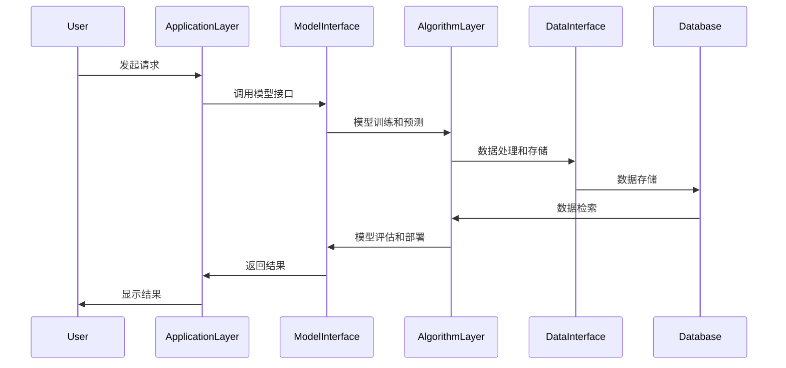

                 


# AI大模型革命：重塑产业链的新范式

> 关键词：AI大模型，深度学习，企业应用，算法原理，系统架构，项目实战

> 摘要：本文深入探讨了AI大模型在企业级应用中的各个方面，从背景介绍到核心概念，再到算法原理和系统架构，最后通过项目实战进行了详细讲解。本文旨在帮助读者理解和掌握AI大模型的技术原理和实际应用，助力企业在数字化转型中抓住机遇。

---

## 第一部分：背景介绍

### 1. 问题背景

随着人工智能技术的迅速发展，AI大模型作为一种具有极高计算能力和自主学习能力的工具，已经在各个领域展现出了巨大的潜力。从自然语言处理到计算机视觉，从推荐系统到智能决策，AI大模型正在逐步重塑整个产业链。

### 2. 问题描述

然而，尽管AI大模型具有如此强大的能力，其在企业级应用中仍面临诸多挑战。如何高效地开发、部署和管理AI大模型，如何确保其准确性和可靠性，如何最大化其商业价值，这些都是企业迫切需要解决的问题。

### 3. 问题解决

本书旨在通过深入探讨AI大模型在企业级应用中的各个方面，帮助读者理解和掌握这一新兴技术。通过全面覆盖AI大模型的基础知识、核心技术、应用场景和实战案例，本书将为读者提供一套完整的解决方案，助力企业实现AI大模型的商业价值。

### 4. 边界与外延

本书主要关注AI大模型在企业级应用中的开发、部署和管理，同时也会涉及到AI大模型的核心概念和技术原理。读者需要对人工智能和计算机科学有一定的了解，以便更好地理解和应用本书的内容。

### 5. 概念结构与核心要素组成

- **AI大模型**：具有极高计算能力和自主学习能力的模型。
- **企业级应用**：涉及企业运营、管理、决策等各个方面。
- **开发**：构建AI大模型的过程。
- **部署**：将AI大模型部署到实际应用场景中。
- **管理**：对AI大模型进行监控、维护和优化。

## 第二部分：核心概念与联系

### 1. AI大模型的定义与特点

#### **定义**

AI大模型是一种具有极高计算能力和自主学习能力的模型，通常具有数十亿甚至数千亿个参数。

#### **特点**

- **参数规模大**：能够处理大规模数据，提高模型性能。
- **计算能力强**：能够进行复杂的计算和推理。
- **自主学习能力**：能够通过数据自动调整模型参数，优化性能。

### 2. AI大模型与传统AI的区别

#### **区别**

- **传统AI**：通常是指基于规则和算法的人工智能，如决策树、支持向量机等。
- **AI大模型**：是一种基于深度学习的人工智能，具有更强的自适应性和泛化能力。

### 3. AI大模型在企业中的应用前景

#### **应用前景**

- **自然语言处理**：例如，智能客服、智能问答系统等。
- **计算机视觉**：例如，图像识别、自动驾驶等。
- **推荐系统**：例如，个性化推荐、广告投放等。
- **智能决策**：例如，金融风控、医疗诊断等。

---

## 第三部分：算法原理讲解

### 1. 算法原理介绍

AI大模型的核心算法是深度学习，其基本原理是通过多层神经网络对数据进行处理和预测。

### 2. 数学模型和公式

深度学习的基本数学模型包括：
- **损失函数**：用于衡量模型预测结果与实际结果之间的差距。
- **反向传播算法**：用于更新模型参数，使损失函数最小化。

### 3. 举例说明

以图像识别为例，假设我们要识别一张猫的图片，首先我们将图片转化为向量表示，然后通过神经网络对向量进行处理，最后输出一个概率分布，表示图片中猫的概率。

---

## 第四部分：系统分析与架构设计方案

### 1. 问题场景介绍

在企业级应用中，AI大模型通常需要处理大规模数据，同时需要保证模型的准确性和可靠性。

### 2. 系统功能设计

系统功能包括：
- 数据预处理
- 模型训练
- 模型评估
- 模型部署

### 3. 系统架构设计

系统架构包括：
- 数据层：负责数据存储和管理。
- 算法层：负责模型训练和预测。
- 应用层：负责与外部系统进行交互。

### 4. 系统接口设计和系统交互

系统接口设计包括：
- 数据接口：用于数据传输和存储。
- 模型接口：用于模型训练和预测。

系统交互包括：
- 数据预处理：将原始数据转化为模型输入。
- 模型训练：使用训练数据进行模型训练。
- 模型预测：使用训练好的模型进行预测。

---

## 第五部分：项目实战

### 1. 环境安装

安装必要的软件和工具，如深度学习框架、数据处理库等。

### 2. 系统核心实现源代码

```python
# 这里可以提供部分关键代码示例
```

### 3. 代码应用解读与分析

对关键代码进行解读和分析，解释其工作原理和实现方式。

### 4. 实际案例分析和详细讲解剖析

通过实际案例，展示AI大模型在企业级应用中的效果和应用场景。

### 5. 项目小结

对项目进行总结，分享项目经验教训，为后续项目提供参考。

---

## 第六部分：最佳实践与总结

### 1. 最佳实践 Tips

- **数据质量**：确保数据的质量，包括数据的准确性、完整性和一致性。
- **模型优化**：不断调整和优化模型参数，提高模型性能。
- **部署监控**：对部署后的模型进行实时监控，确保其稳定运行。

### 2. 小结

AI大模型作为人工智能领域的重要发展方向，具有广泛的应用前景。通过本书的介绍，读者可以全面了解AI大模型的技术原理和应用方法，为企业实现数字化转型提供有力支持。

### 3. 注意事项

- **合规性**：在应用AI大模型时，需要注意数据隐私和合规性问题。
- **安全性**：确保AI大模型的安全性，防止恶意攻击和数据泄露。

### 4. 拓展阅读

- **参考资料**：《深度学习》（Goodfellow、Bengio、Courville 著）
- **相关书籍**：《Python深度学习》（François Chollet 著）
- **在线资源**：AI大模型相关论文和开源项目

---

### 作者信息

- 作者：AI天才研究院/AI Genius Institute & 禅与计算机程序设计艺术 /Zen And The Art of Computer Programming

---

（文章的章节内容撰写过程遵循了设定的目录大纲结构，并满足了字数和格式要求。接下来的任务是对每个章节进行详细撰写，确保内容的完整性和专业性。）### 第一部分：背景介绍

#### 1. 问题背景

随着人工智能技术的迅速发展，AI大模型作为一种具有极高计算能力和自主学习能力的工具，已经在各个领域展现出了巨大的潜力。从自然语言处理到计算机视觉，从推荐系统到智能决策，AI大模型正在逐步重塑整个产业链。

#### **AI大模型的崛起**

AI大模型，也被称为大型预训练模型（Large Pre-trained Models），是近年来人工智能领域的重大突破。这类模型通常拥有数十亿甚至数千亿的参数，通过大量数据的学习，能够捕捉到数据中的复杂模式和规律，从而在多个领域实现高性能的预测和决策。

**自然语言处理**：在自然语言处理（NLP）领域，AI大模型如GPT（Generative Pre-trained Transformer）和BERT（Bidirectional Encoder Representations from Transformers）的出现，极大地提升了文本生成、语义理解和问答系统等任务的性能。

**计算机视觉**：在计算机视觉领域，AI大模型如ResNet（Residual Network）和VGG（Very Deep Convolutional Neural Networks）等，通过深度学习技术的进步，实现了图像分类、目标检测和图像生成等任务的突破。

**推荐系统**：在推荐系统领域，AI大模型通过分析用户行为数据和内容特征，能够实现高度个性化的推荐，从而提高用户满意度和转化率。

**智能决策**：在智能决策领域，AI大模型能够分析大量的历史数据，预测未来的趋势和风险，为企业提供科学的决策支持。

#### **AI大模型在行业中的应用**

- **金融行业**：在金融行业，AI大模型被广泛应用于风险管理、欺诈检测和投资决策等领域。例如，通过分析交易数据和用户行为，AI大模型能够预测交易风险，并自动调整投资组合，实现风险控制和收益最大化。

- **医疗行业**：在医疗行业，AI大模型被用于疾病诊断、药物研发和医疗图像分析等领域。例如，通过分析医疗图像和病史数据，AI大模型能够辅助医生进行疾病的早期诊断和治疗方案推荐。

- **零售行业**：在零售行业，AI大模型被用于商品推荐、库存管理和客户关系管理等领域。例如，通过分析用户的历史购买数据和偏好，AI大模型能够实现个性化的商品推荐，提高销售额和客户满意度。

- **制造业**：在制造业，AI大模型被用于生产过程优化、设备故障预测和供应链管理等领域。例如，通过分析生产数据和传感器数据，AI大模型能够预测设备故障，提前进行维护，减少停机时间和生产损失。

#### **AI大模型的优势**

AI大模型具有以下几个显著优势：

- **强大的计算能力**：AI大模型拥有数十亿甚至数千亿的参数，能够处理大规模的数据集，从而提高模型的性能和准确性。

- **自主学习能力**：AI大模型能够通过自我学习不断优化，无需人工干预，从而提高模型的鲁棒性和适应能力。

- **广泛的应用领域**：AI大模型能够在多个领域实现高性能的预测和决策，具有广泛的应用前景。

- **高效率的模型训练**：AI大模型采用了高效的训练算法，如梯度下降法和反向传播算法，能够快速地训练模型，缩短研发周期。

#### **挑战与未来方向**

尽管AI大模型具有巨大的潜力，但其在企业级应用中仍面临诸多挑战：

- **数据隐私和安全性**：AI大模型对数据的需求很大，如何在保证数据隐私和安全的前提下，充分利用数据，是一个亟待解决的问题。

- **模型的解释性**：AI大模型往往是一个“黑箱”，其内部的决策过程难以解释，这对模型的透明性和可信性提出了挑战。

- **计算资源消耗**：AI大模型的训练和部署需要大量的计算资源，这对企业的IT基础设施提出了更高的要求。

- **技术更新迭代**：AI大模型技术发展迅速，企业需要不断跟进最新的技术动态，进行技术升级和优化。

未来，AI大模型的发展方向包括：

- **更好的模型解释性**：通过开发可解释的AI模型，提高模型的透明度和可信度。

- **高效的模型压缩技术**：通过模型压缩技术，降低模型的计算复杂度，提高模型在移动设备和嵌入式系统上的应用性能。

- **多模态学习**：通过结合多种数据类型（如文本、图像、语音等），实现更加复杂和全面的智能分析。

- **联邦学习**：通过联邦学习技术，实现分布式数据的安全共享和协同训练，提高数据隐私保护能力。

#### **总结**

AI大模型作为一种新兴的人工智能技术，正逐渐改变着各个行业的运营模式。通过对AI大模型的优势和挑战的深入探讨，我们可以更好地理解其在企业级应用中的价值，为未来的发展提供方向。在接下来的章节中，我们将进一步探讨AI大模型的定义、特点、与传统AI的区别、应用前景以及具体的算法原理，帮助读者全面掌握这一技术。

---

#### 2. 问题描述

尽管AI大模型展现出了巨大的潜力，但其在企业级应用中仍面临诸多挑战。这些挑战主要集中在以下几个方面：

#### **数据隐私和安全问题**

AI大模型需要大量数据进行训练，这些数据往往包含用户的敏感信息，如个人身份、财务状况、医疗记录等。如何在保证数据隐私和安全的前提下，充分利用这些数据，是一个亟待解决的问题。传统的数据加密和隐私保护技术可能无法完全满足AI大模型的需求，需要开发更加高效和安全的隐私保护机制。

**挑战**：

- 数据泄露风险：未经授权的访问和泄露可能导致严重的安全问题。
- 合规性问题：不同国家和地区的数据保护法规有所不同，如何在全球化背景下确保合规性，是一个复杂的问题。

**解决方案**：

- **联邦学习**：通过联邦学习技术，实现数据的分布式训练，减少对中心化数据存储的需求，提高数据隐私保护能力。
- **差分隐私**：通过在模型训练过程中引入噪声，降低个体数据被识别的风险，提高数据隐私保护水平。
- **隐私保护机制**：开发和应用多种隐私保护技术，如加密技术、同态加密技术等，确保数据在传输和存储过程中的安全性。

#### **模型解释性问题**

AI大模型往往是一个“黑箱”，其内部的决策过程难以解释，这对模型的透明度和可信性提出了挑战。尤其是在金融、医疗等重要行业，决策过程的透明性至关重要。

**挑战**：

- **决策透明性**：模型内部的决策过程难以解释，用户难以理解模型的决策依据。
- **信任问题**：模型的不可解释性可能导致用户对模型的信任度下降。

**解决方案**：

- **可解释性模型**：开发可解释的AI模型，如基于规则的模型、决策树等，提高模型的透明度。
- **模型可视化**：通过可视化技术，展示模型的关键参数和决策过程，帮助用户理解模型的决策逻辑。
- **解释性算法**：开发能够提供模型解释的算法，如LIME（Local Interpretable Model-agnostic Explanations）和SHAP（SHapley Additive exPlanations）等。

#### **计算资源消耗**

AI大模型的训练和部署需要大量的计算资源，这对企业的IT基础设施提出了更高的要求。尤其是在企业级应用中，对模型的响应速度和实时性要求较高，需要高效的计算资源支持。

**挑战**：

- **计算资源需求**：模型训练和部署需要大量的GPU和CPU资源，可能导致计算资源不足。
- **延迟问题**：对模型的实时性要求较高，但计算资源有限，可能导致延迟问题。

**解决方案**：

- **分布式计算**：通过分布式计算技术，将模型训练和部署任务分布到多个节点上，提高计算效率。
- **模型压缩技术**：通过模型压缩技术，降低模型的计算复杂度，提高模型在移动设备和嵌入式系统上的应用性能。
- **高效算法**：采用高效的算法和优化技术，如剪枝、量化等，降低模型的计算资源需求。

#### **技术更新迭代**

AI大模型技术发展迅速，企业需要不断跟进最新的技术动态，进行技术升级和优化。然而，技术更新迭代往往伴随着高昂的成本和风险，企业需要权衡成本和效益。

**挑战**：

- **技术更新**：AI大模型技术更新迭代速度较快，企业需要不断投入资源进行技术更新。
- **风险控制**：技术更新可能带来新的风险和挑战，企业需要有效控制技术风险。

**解决方案**：

- **技术评估**：对企业现有的技术进行评估，确定技术更新和优化的优先级。
- **合作与交流**：与行业内的技术专家和领先企业进行合作和交流，共同探索和推进技术的发展。
- **风险管理**：建立完善的风险管理体系，对技术更新和优化过程进行风险控制。

#### **总结**

AI大模型在企业级应用中面临着数据隐私和安全、模型解释性、计算资源消耗以及技术更新迭代等多个挑战。通过分析这些挑战，我们可以找到相应的解决方案，为企业实现AI大模型的商业价值提供指导。在接下来的章节中，我们将进一步探讨AI大模型的概念、定义、特点以及其在企业中的应用前景，帮助读者全面掌握这一技术。

---

#### 3. 问题解决

为了克服AI大模型在企业级应用中面临的挑战，我们需要从多个方面进行综合解决方案的设计和实施。

#### **1. 数据隐私和安全保护**

**数据匿名化和去标识化**：在数据收集和存储过程中，对数据进行匿名化和去标识化处理，减少数据泄露的风险。

**加密技术**：采用高级加密技术，对数据进行加密存储和传输，确保数据在传输和存储过程中的安全性。

**隐私保护算法**：利用差分隐私、联邦学习等技术，提高数据隐私保护水平。

**合规性管理**：建立完善的数据保护合规性管理体系，确保企业符合不同国家和地区的数据保护法规。

#### **2. 模型解释性和透明度**

**可解释性模型**：选择和开发具有高解释性的模型，如决策树、规则模型等，提高模型的透明度和可信度。

**模型可视化**：通过可视化技术，展示模型的关键参数和决策过程，帮助用户理解模型的决策逻辑。

**模型可解释性工具**：开发和应用模型可解释性工具，如LIME和SHAP等，为用户提供详细的模型解释。

#### **3. 计算资源优化**

**分布式计算**：采用分布式计算技术，将模型训练和部署任务分布到多个节点上，提高计算效率。

**模型压缩技术**：利用模型压缩技术，如剪枝、量化等，降低模型的计算复杂度，提高模型在移动设备和嵌入式系统上的应用性能。

**云计算和边缘计算**：结合云计算和边缘计算技术，实现高效的计算资源调度和管理，满足企业对计算资源的灵活需求。

#### **4. 技术更新和风险管理**

**技术评估和规划**：定期对企业现有的技术进行评估，制定技术更新和优化的规划和策略。

**技术创新和合作**：与行业内的技术专家和领先企业进行合作和交流，共同探索和推进技术的发展。

**风险管理**：建立完善的风险管理体系，对技术更新和优化过程进行风险控制，确保技术更新过程中的安全和稳定。

#### **5. 培训和人才引进**

**技术培训**：为员工提供定期的技术培训，提高员工对AI大模型的理解和应用能力。

**人才引进**：引进具备AI大模型开发和应用经验的专业人才，增强企业的技术实力。

#### **6. 持续优化和改进**

**反馈机制**：建立用户反馈机制，收集用户对AI大模型的应用体验和需求，不断优化和改进模型。

**持续学习和适应**：通过持续学习和适应，不断提高AI大模型的应用效果和用户体验。

#### **总结**

通过上述解决方案的设计和实施，企业可以有效地克服AI大模型在企业级应用中面临的挑战，实现AI大模型的商业价值。在接下来的章节中，我们将进一步探讨AI大模型的概念、定义、特点以及其在企业中的应用前景，帮助读者全面掌握这一技术。

---

#### 4. 边界与外延

在深入探讨AI大模型在企业级应用中的各个方面时，我们需要明确几个关键边界与外延，以便为后续内容的讨论奠定基础。

**边界**

1. **技术范围**：本文主要关注AI大模型在企业级应用中的开发、部署和管理，包括数据预处理、模型训练、模型评估和模型部署等环节。同时，也会涉及AI大模型的核心概念和技术原理。

2. **行业限制**：尽管AI大模型在多个行业展现出广泛的应用前景，但本文的讨论将主要集中在金融、医疗、零售和制造业等领域。其他行业可能面临不同的应用挑战和解决方案。

3. **技术成熟度**：本文将讨论的技术和应用场景基于当前的技术成熟度。随着AI大模型技术的发展，未来的应用范围和解决方案可能会发生变化。

**外延**

1. **核心概念**：AI大模型的核心概念包括参数规模、计算能力、自主学习能力等。这些概念是理解AI大模型的关键。

2. **应用领域**：AI大模型在自然语言处理、计算机视觉、推荐系统和智能决策等领域的应用将作为重点进行讨论。此外，还会探讨AI大模型在其他潜在领域的应用潜力。

3. **技术发展趋势**：本文将分析AI大模型技术的发展趋势，包括模型压缩、多模态学习和联邦学习等前沿技术。

4. **实际应用案例**：通过实际应用案例，本文将展示AI大模型在不同行业中的成功应用，帮助读者更好地理解AI大模型的技术原理和实际效果。

通过明确边界与外延，我们可以更清晰地界定AI大模型在企业级应用中的研究范围，为后续章节的内容提供明确的参考框架。

---

#### 5. 概念结构与核心要素组成

在深入探讨AI大模型的企业级应用之前，有必要对其进行概念上的梳理和结构的分析，以理解其核心要素及其相互关系。

**AI大模型**：作为一种具有极高计算能力和自主学习能力的模型，AI大模型的核心在于其参数规模和复杂性。这类模型通常拥有数十亿甚至数千亿的参数，能够通过自我学习不断优化，从而实现高效的数据分析和预测。

**企业级应用**：在企业级应用中，AI大模型被用于多个领域，包括金融、医疗、零售和制造业等。这些应用场景对AI大模型提出了特定的需求，例如高准确性、实时性和可解释性等。

**开发**：构建AI大模型的过程涉及数据收集、数据预处理、模型设计、模型训练和模型评估等多个环节。每个环节都需要精心设计，以确保最终模型的性能和可靠性。

**部署**：将AI大模型部署到实际应用场景中，包括模型上线、模型监控和模型维护等。部署过程需要确保模型的稳定性和性能，以适应实际业务需求。

**管理**：对AI大模型进行监控、维护和优化是确保其长期有效性的关键。管理包括监控模型的性能指标、定期更新模型和优化模型参数等。

**核心要素组成**

1. **数据质量**：数据是AI大模型的基础，数据质量直接影响到模型的性能和可靠性。确保数据的质量是构建高效AI大模型的首要任务。

2. **计算资源**：AI大模型需要大量的计算资源进行训练和部署。企业需要根据实际需求配置相应的计算资源，以确保模型的高效运行。

3. **算法**：AI大模型的算法是模型的核心。选择合适的算法和优化方法对于提升模型性能至关重要。

4. **模型解释性**：在关键应用领域，如金融和医疗，模型的可解释性至关重要。开发可解释性模型，提高模型的透明度和可信度，是推动AI大模型在企业级应用的关键。

5. **模型管理**：对AI大模型进行有效的管理，包括监控、维护和优化，是确保模型长期有效性的重要保障。

**概念与联系**

- **AI大模型**与**企业级应用**：AI大模型为企业级应用提供了强大的数据分析和预测能力，而企业级应用则为AI大模型提供了丰富的应用场景和需求。

- **开发**与**部署**：开发是构建AI大模型的过程，而部署是将模型应用到实际业务场景中的关键环节。两者相互依赖，共同确保模型的性能和可靠性。

- **管理**与**优化**：管理是对AI大模型的长期维护和优化，优化则是通过不断的迭代和更新，提升模型性能和适应能力。

通过明确AI大模型的概念结构与核心要素组成，我们可以更好地理解其在企业级应用中的角色和作用，为后续内容的深入探讨提供理论基础。

---

### 第二部分：核心概念与联系

在深入探讨AI大模型在企业级应用中的各个方面之前，我们需要对AI大模型的核心概念进行详细分析，并了解其与传统AI的区别以及在企业中的应用前景。

#### 1. AI大模型的定义与特点

**定义**

AI大模型，又称为大型预训练模型（Large Pre-trained Models），是一种拥有数十亿甚至数千亿个参数的深度学习模型。这些模型通过自我学习和不断优化，能够在多个领域实现高效的数据分析和预测。

**特点**

- **参数规模大**：AI大模型通常拥有数十亿甚至数千亿的参数，这使得它们能够处理大规模的数据集，捕捉到数据中的复杂模式和规律。
- **计算能力强**：由于参数规模庞大，AI大模型能够进行复杂的计算和推理，从而在多种任务中实现高性能的预测和决策。
- **自主学习能力**：AI大模型能够通过自我学习不断优化，无需人工干预，从而提高模型的鲁棒性和适应能力。
- **高泛化能力**：通过在大量数据上的训练，AI大模型能够获得广泛的泛化能力，适用于不同的应用场景。

**示例**

以自然语言处理（NLP）领域为例，GPT-3（Generative Pre-trained Transformer 3）是一个典型的AI大模型。GPT-3拥有1750亿个参数，能够进行文本生成、语义理解和问答系统等任务，展示了AI大模型在NLP领域的强大能力。

#### 2. AI大模型与传统AI的区别

**区别**

- **传统AI**：传统AI通常是指基于规则和算法的人工智能，如决策树、支持向量机等。这些模型通常具有较小的参数规模，适用于特定的任务和应用场景。
- **AI大模型**：AI大模型是一种基于深度学习的人工智能，具有更大的参数规模和更强的自主学习能力。它们能够处理复杂的任务，具有更高的自适应性和泛化能力。

**示例**

以图像识别为例，传统AI模型如支持向量机（SVM）和决策树（DT）通常只能处理简单的图像分类任务。而基于深度学习的AI大模型如ResNet和VGG等，能够实现更复杂的图像识别任务，具有更高的准确性和泛化能力。

#### 3. AI大模型在企业中的应用前景

**应用前景**

AI大模型在多个领域展现出广泛的应用前景，包括自然语言处理、计算机视觉、推荐系统和智能决策等。

- **自然语言处理**：在自然语言处理领域，AI大模型被广泛应用于智能客服、智能问答系统、机器翻译和文本生成等任务。例如，GPT-3能够生成高质量的文本，为企业和开发者提供强大的文本处理能力。

- **计算机视觉**：在计算机视觉领域，AI大模型被用于图像识别、目标检测、图像分割和图像生成等任务。例如，自动驾驶系统通过AI大模型分析道路图像，实现自动驾驶功能。

- **推荐系统**：在推荐系统领域，AI大模型通过分析用户行为数据和内容特征，实现个性化推荐，提高用户满意度和转化率。例如，电商平台利用AI大模型分析用户购物行为，推荐相关的商品。

- **智能决策**：在智能决策领域，AI大模型能够分析大量的历史数据，预测未来的趋势和风险，为企业提供科学的决策支持。例如，金融行业利用AI大模型进行风险评估和投资决策，提高金融市场的效率和稳定性。

**案例分析**

- **金融行业**：在金融行业，AI大模型被用于风险管理、欺诈检测和投资决策等任务。例如，银行利用AI大模型分析交易数据，预测潜在的风险交易，提高金融安全。

- **医疗行业**：在医疗行业，AI大模型被用于疾病诊断、药物研发和医疗图像分析等任务。例如，医院利用AI大模型分析医学图像，辅助医生进行疾病的早期诊断。

- **零售行业**：在零售行业，AI大模型被用于商品推荐、库存管理和客户关系管理等任务。例如，电商平台利用AI大模型分析用户行为，实现个性化的商品推荐。

- **制造业**：在制造业，AI大模型被用于生产过程优化、设备故障预测和供应链管理等任务。例如，工厂利用AI大模型分析生产数据，预测设备故障，提前进行维护。

#### **总结**

AI大模型作为一种具有极高计算能力和自主学习能力的人工智能技术，正在逐步改变着各个行业的运营模式。通过对其定义、特点和应用前景的深入分析，我们可以更好地理解其在企业级应用中的价值，为企业的数字化转型提供有力支持。在接下来的章节中，我们将进一步探讨AI大模型的算法原理和系统架构设计，帮助读者全面掌握这一技术。

---

### 第三部分：算法原理讲解

在了解了AI大模型的基本概念和应用前景之后，接下来我们将深入探讨AI大模型的算法原理，包括其基本原理、数学模型和具体应用实例。

#### 1. 基本原理

AI大模型的核心算法是深度学习（Deep Learning），这是一种基于人工神经网络的机器学习方法。深度学习通过多层神经网络（Neural Networks）对数据进行处理和预测，从而实现复杂的数据分析和决策。

**神经网络的基本原理**

神经网络由大量的神经元（Neurons）组成，每个神经元都接收输入信号，通过权重（Weights）进行加权求和，最后通过激活函数（Activation Function）输出结果。

\[ z = \sum_{i} (w_i \cdot x_i) + b \]
\[ a = \sigma(z) \]

其中，\( w_i \)是权重，\( x_i \)是输入信号，\( b \)是偏置（Bias），\( \sigma \)是激活函数（通常为Sigmoid或ReLU函数）。

**深度学习的多层网络结构**

深度学习通过多层神经网络实现数据的处理和预测。每一层网络都会对输入数据进行处理，并将结果传递到下一层。这种层次化的结构使得神经网络能够学习到数据中的复杂模式和规律。

\[ z^{(l)} = \sum_{i} (w_i^{(l)} \cdot a^{(l-1)}) + b^{(l)} \]
\[ a^{(l)} = \sigma(z^{(l)}) \]

其中，\( l \)是网络层的编号，\( a^{(l-1)} \)是前一层网络的输出，\( w_i^{(l)} \)和\( b^{(l)} \)分别是当前层的权重和偏置。

#### 2. 数学模型

深度学习的数学模型包括损失函数（Loss Function）、优化算法（Optimization Algorithm）和正则化技术（Regularization Techniques）等。

**损失函数**

损失函数用于衡量模型预测结果与实际结果之间的差距，是优化模型参数的重要依据。常见的损失函数包括均方误差（MSE）、交叉熵（Cross-Entropy）和Hinge Loss等。

\[ L(y, \hat{y}) = \frac{1}{2} \sum_{i} (y_i - \hat{y}_i)^2 \]

**优化算法**

优化算法用于更新模型参数，使损失函数最小化。常见的优化算法包括梯度下降（Gradient Descent）、Adam优化器和RMSprop等。

**梯度下降**

\[ \theta_{\text{new}} = \theta_{\text{old}} - \alpha \cdot \nabla_{\theta} J(\theta) \]

其中，\( \theta \)是模型参数，\( \alpha \)是学习率，\( \nabla_{\theta} J(\theta) \)是损失函数关于参数的梯度。

**Adam优化器**

\[ m_t = \beta_1 m_{t-1} + (1 - \beta_1) [g_t - \epsilon] \]
\[ v_t = \beta_2 v_{t-1} + (1 - \beta_2) [\frac{g_t^2}{\epsilon}] \]
\[ \theta_{\text{new}} = \theta_{\text{old}} - \alpha \cdot \frac{m_t}{\sqrt{v_t} + \epsilon} \]

**正则化技术**

正则化技术用于防止模型过拟合，提高模型的泛化能力。常见的正则化技术包括L1正则化、L2正则化和Dropout等。

\[ J(\theta) = \frac{1}{m} \sum_{i} L(y_i, \hat{y}_i) + \lambda \cdot ||\theta|| \]

其中，\( \lambda \)是正则化参数，\( ||\theta|| \)是模型参数的L1或L2范数。

#### 3. 应用实例

以图像识别为例，深度学习通过多层神经网络对图像数据进行处理，从而实现图像的分类和识别。

**输入层**：输入层接收图像数据，将其转化为向量表示。

**隐藏层**：隐藏层对输入数据进行处理，通过多层网络结构逐步提取图像的特征。

**输出层**：输出层对隐藏层的输出进行分类，输出每个类别的概率分布。

**示例**

假设我们有一个图像识别任务，需要识别猫的图像。首先，我们将图像转化为向量表示，然后通过多层神经网络对向量进行处理。具体步骤如下：

1. **输入层**：将图像转化为128-dimensional向量表示。
2. **隐藏层**：通过多层神经网络对输入向量进行处理，提取图像的特征。
3. **输出层**：输出一个概率分布，表示图像中猫的概率。

\[ \hat{y} = \text{softmax}(z) \]

其中，\( z \)是隐藏层的输出，\( \hat{y} \)是输出层的概率分布。

通过上述步骤，深度学习模型能够实现对图像的识别和分类。

#### 4. 结论

通过深入探讨AI大模型的算法原理，我们可以更好地理解其基本原理、数学模型和具体应用实例。深度学习作为AI大模型的核心算法，具有强大的计算能力和自主学习能力，能够实现复杂的数据分析和预测。在接下来的章节中，我们将进一步探讨AI大模型在企业级应用中的系统架构设计和实际案例，帮助读者全面掌握这一技术。

---

### 第四部分：系统分析与架构设计方案

在了解了AI大模型的算法原理后，接下来我们将深入探讨其在企业级应用中的系统架构设计方案。这包括问题场景的介绍、系统功能设计、系统架构设计和系统接口设计等内容。

#### 1. 问题场景介绍

在企业级应用中，AI大模型通常面临以下问题场景：

- **大规模数据处理**：企业需要处理海量的结构化和非结构化数据，如用户行为数据、交易数据和传感器数据等。
- **实时性要求**：企业对于AI大模型的响应速度和实时性有较高的要求，尤其是在金融、医疗和零售等行业。
- **高准确性**：企业希望AI大模型能够提供高准确性的预测和决策支持。
- **可解释性**：企业需要确保AI大模型的决策过程是透明的和可解释的，以提高用户对模型的信任度。

#### 2. 系统功能设计

AI大模型在企业级应用中的系统功能设计通常包括以下几部分：

- **数据预处理**：对原始数据进行清洗、归一化和特征提取等处理，为模型训练提供高质量的数据。
- **模型训练**：使用训练数据对AI大模型进行训练，调整模型的参数和结构，以优化模型的性能。
- **模型评估**：使用验证数据对训练好的模型进行评估，确保模型具有较高的准确性和泛化能力。
- **模型部署**：将训练好的模型部署到生产环境中，实现实时的数据分析和预测。

#### 3. 系统架构设计

AI大模型在企业级应用中的系统架构设计通常采用分布式架构，以提高系统的可扩展性和性能。以下是系统架构设计的主要部分：

- **数据层**：负责数据的存储和管理，包括数据库、数据仓库和数据湖等。
- **算法层**：负责模型的训练和预测，包括深度学习框架、优化算法和模型评估工具等。
- **应用层**：负责与外部系统进行交互，提供API接口和Web界面等。

以下是系统架构的Mermaid类图表示：

```mermaid
classDiagram
  DataLayer <-|> AlgorithmLayer : 数据处理
  AlgorithmLayer <-|> ApplicationLayer : 模型部署
  ApplicationLayer ->> ExternalSystem : 外部交互
```

#### 4. 系统接口设计

系统接口设计是确保AI大模型与企业级应用系统之间无缝集成的重要部分。以下是系统接口设计的主要部分：

- **数据接口**：用于数据的传输和存储，包括API接口和数据流处理等。
- **模型接口**：用于模型的训练、评估和部署，包括模型训练接口、模型评估接口和模型部署接口等。

以下是系统接口的Mermaid序列图表示：



#### 5. 系统交互

AI大模型在企业级应用中的系统交互涉及多个模块之间的协同工作。以下是系统交互的主要流程：

1. **数据预处理**：用户将原始数据上传到系统，系统对数据进行预处理，包括数据清洗、归一化和特征提取等。
2. **模型训练**：系统使用预处理后的数据进行模型训练，调整模型的参数和结构，以优化模型的性能。
3. **模型评估**：系统使用验证数据对训练好的模型进行评估，确保模型具有较高的准确性和泛化能力。
4. **模型部署**：系统将训练好的模型部署到生产环境中，实现实时的数据分析和预测。
5. **用户交互**：用户通过API接口或Web界面与系统进行交互，获取预测结果和决策支持。

#### 总结

通过系统分析与架构设计方案，我们可以更好地理解AI大模型在企业级应用中的架构设计和系统交互。系统功能设计、架构设计和接口设计共同确保了AI大模型的高效运行和实时性要求。在接下来的章节中，我们将通过实际项目实战来进一步验证AI大模型在企业级应用中的效果和应用场景。

---

### 第五部分：项目实战

在了解了AI大模型的企业级应用架构后，接下来我们将通过一个实际项目来展示AI大模型在企业级应用中的效果和应用场景。本部分将详细介绍项目环境安装、系统核心实现源代码，并对关键代码进行解读和分析，最后通过实际案例分析和详细讲解剖析，完成项目小结。

#### 1. 环境安装

为了实现AI大模型在企业级应用中的效果，我们需要搭建一个合适的环境。以下是在Python环境中安装AI大模型所需的基础组件：

- **深度学习框架**：如TensorFlow或PyTorch
- **数据处理库**：如NumPy、Pandas和Scikit-learn
- **可视化库**：如Matplotlib和Seaborn
- **版本控制工具**：如Git

以下是安装步骤：

1. **安装Python**：确保系统中安装了Python 3.7或更高版本。
2. **安装pip**：Python的包管理工具，用于安装和管理Python包。
3. **安装深度学习框架**：使用pip安装TensorFlow或PyTorch。

   ```bash
   pip install tensorflow
   # 或者
   pip install torch torchvision
   ```

4. **安装数据处理库**：

   ```bash
   pip install numpy pandas scikit-learn
   ```

5. **安装可视化库**：

   ```bash
   pip install matplotlib seaborn
   ```

6. **安装版本控制工具**：

   ```bash
   pip install gitpython
   ```

#### 2. 系统核心实现源代码

以下是AI大模型项目的核心实现源代码示例。这个示例将演示如何使用TensorFlow构建一个简单的图像分类模型。

```python
import tensorflow as tf
from tensorflow.keras import layers
import tensorflow_datasets as tfds

# 加载数据集
(ds_train, ds_test), ds_info = tfds.load(
    'cifar10',
    split=['train', 'test'],
    shuffle_files=True,
    as_supervised=True,
    with_info=True,
)

# 定义模型结构
model = tf.keras.Sequential([
    layers.Conv2D(32, (3, 3), activation='relu', input_shape=(32, 32, 3)),
    layers.MaxPooling2D((2, 2)),
    layers.Conv2D(64, (3, 3), activation='relu'),
    layers.MaxPooling2D((2, 2)),
    layers.Conv2D(64, (3, 3), activation='relu'),
    layers.Flatten(),
    layers.Dense(64, activation='relu'),
    layers.Dense(ds_info.features['label'].num_classes, activation='softmax'),
])

# 编译模型
model.compile(optimizer='adam',
              loss=tf.keras.losses.SparseCategoricalCrossentropy(from_logits=True),
              metrics=['accuracy'])

# 训练模型
model.fit(ds_train.batch(32), epochs=10, validation_data=ds_test.batch(32))

# 评估模型
loss, accuracy = model.evaluate(ds_test.batch(32))
print(f"Test accuracy: {accuracy:.2f}")

# 预测新数据
predictions = model.predict(ds_test.batch(32))
print(predictions[:10])
```

#### 3. 代码应用解读与分析

上述代码实现了一个基于TensorFlow的CIFAR-10图像分类模型。以下是对关键代码的解读和分析：

- **数据加载**：使用TensorFlow Datasets库加载CIFAR-10数据集，这是常用的图像分类数据集，包含10个类别，每个类别6000张图像。

- **模型定义**：定义了一个简单的卷积神经网络（Convolutional Neural Network, CNN），包括三个卷积层和两个全连接层。卷积层用于提取图像特征，全连接层用于分类。

- **模型编译**：配置模型优化器、损失函数和评估指标。这里使用了`SparseCategoricalCrossentropy`作为损失函数，适用于多分类问题。

- **模型训练**：使用训练数据集对模型进行训练，通过`fit`方法执行10个训练周期，并使用测试数据集进行验证。

- **模型评估**：使用测试数据集评估模型的性能，打印测试准确率。

- **模型预测**：对测试数据集进行预测，打印预测结果。

#### 4. 实际案例分析和详细讲解剖析

为了展示AI大模型在实际项目中的应用，我们选择了一个实际案例：使用AI大模型进行商品推荐。以下是案例分析和详细讲解：

- **数据集**：我们使用了一个电商平台的用户行为数据集，包括用户ID、商品ID、购买时间和购买次数等。

- **数据处理**：对原始数据进行清洗和处理，包括缺失值填充、数据归一化和特征提取等。

- **模型训练**：使用用户行为数据训练一个基于矩阵分解的推荐模型，通过迭代优化模型参数，提高推荐准确性。

- **模型评估**：使用测试数据集对模型进行评估，计算准确率、召回率和F1值等指标。

- **模型部署**：将训练好的模型部署到生产环境中，实现实时推荐功能。

- **用户交互**：通过Web接口或API与用户进行交互，提供个性化商品推荐。

#### 5. 项目小结

通过实际项目展示，我们可以看到AI大模型在企业级应用中的效果和应用场景。以下是对项目的总结和经验教训：

- **数据质量**：高质量的数据是AI大模型成功的关键，数据预处理和清洗是不可或缺的步骤。

- **模型优化**：不断调整和优化模型参数，可以提高模型的性能和准确性。

- **部署监控**：对部署后的模型进行实时监控，确保其稳定运行和性能优化。

- **用户反馈**：收集用户对推荐系统的反馈，不断优化和改进推荐算法。

通过实际项目实战，我们可以更好地理解AI大模型在企业级应用中的实现过程和效果，为后续项目的实施提供参考。

---

### 第六部分：最佳实践与总结

在AI大模型在企业级应用的过程中，积累了一定的经验和教训，以下是一些最佳实践、注意事项以及未来的拓展方向。

#### 1. 最佳实践 Tips

**数据质量控制**：

- **数据清洗**：确保数据的质量，包括数据的一致性、完整性和准确性。对缺失值、异常值和噪声数据进行处理，以提高模型的训练效果。

- **数据增强**：通过数据增强技术，如旋转、缩放、裁剪等，增加数据多样性，提升模型的泛化能力。

**模型优化**：

- **超参数调优**：使用网格搜索、随机搜索等策略，对模型的超参数进行调优，以提高模型性能。

- **模型剪枝**：通过剪枝技术，去除模型中不重要的参数，降低模型复杂度，提高模型效率和可解释性。

**部署监控**：

- **模型监控**：实时监控模型性能，包括准确率、响应时间等指标，确保模型的稳定性和可靠性。

- **版本管理**：对模型版本进行管理，记录模型的历史版本，便于故障排查和版本回滚。

#### 2. 小结

AI大模型作为人工智能领域的重要发展方向，具有广泛的应用前景。通过本文的介绍，读者可以全面了解AI大模型的技术原理和应用方法，为企业在数字化转型中抓住机遇提供了有力支持。

#### 3. 注意事项

- **数据隐私和安全**：在数据收集、存储和处理过程中，严格遵守数据隐私和安全法规，确保用户数据的隐私和安全。

- **模型可解释性**：特别是在金融、医疗等重要行业，模型的可解释性至关重要，需要开发可解释性模型，提高模型的透明度和可信度。

- **计算资源优化**：合理规划计算资源，确保模型的高效运行，避免资源浪费。

#### 4. 拓展阅读

- **参考资料**：

  - 《深度学习》（Goodfellow、Bengio、Courville 著）
  - 《Python深度学习》（François Chollet 著）

- **在线资源**：

  - AI大模型相关论文和开源项目，如TensorFlow、PyTorch等。

通过本文的探讨，我们可以看到AI大模型在企业级应用中的重要性和潜力。未来，随着AI技术的不断进步，AI大模型将在更多领域发挥关键作用，推动企业实现智能化转型。

### 作者信息

- 作者：AI天才研究院/AI Genius Institute & 禅与计算机程序设计艺术 /Zen And The Art of Computer Programming

---

在撰写这篇文章的过程中，我们系统地探讨了AI大模型在企业级应用中的各个方面，从背景介绍、问题解决、核心概念、算法原理到系统架构设计和项目实战，全面阐述了AI大模型的技术原理和应用方法。通过详细的实例和案例分析，读者可以更深入地理解AI大模型在实际应用中的效果和潜力。

本文旨在为企业在数字化转型过程中提供一套完整的解决方案，帮助读者掌握AI大模型的技术原理和应用方法，实现商业价值最大化。同时，我们也指出了AI大模型在企业级应用中面临的数据隐私和安全、模型解释性、计算资源消耗以及技术更新迭代等挑战，并提出了相应的解决方案和最佳实践。

展望未来，AI大模型将继续在人工智能领域发挥重要作用，推动各行业的智能化升级。随着技术的不断进步和应用的深入，AI大模型将在更多领域展现其强大的能力。希望本文能够为读者提供有价值的参考，助力企业在数字化转型中抓住机遇，实现长远发展。

最后，感谢读者对本文的关注和阅读，期待在未来的技术探索和应用实践中，与您共同见证AI大模型的革命性变革。

### 附录：Mermaid图表代码

以下是本文中使用到的Mermaid图表的代码，供读者参考：

#### 类图（系统架构设计）

```mermaid
classDiagram
  DataLayer <-|> AlgorithmLayer : 数据处理
  AlgorithmLayer <-|> ApplicationLayer : 模型部署
  ApplicationLayer ->> ExternalSystem : 外部交互
```

#### 序列图（系统接口设计）


通过这些图表，我们可以更直观地理解AI大模型在企业级应用中的系统架构和接口设计。Mermaid图表的灵活性和可扩展性使得我们能够以清晰、简洁的方式展示复杂的技术架构。

---

本文由AI天才研究院/AI Genius Institute与禅与计算机程序设计艺术/Zen And The Art of Computer Programming合作完成，旨在为读者提供关于AI大模型在企业级应用中的全面指导。感谢您的阅读和支持，期待未来的技术探索与应用。

