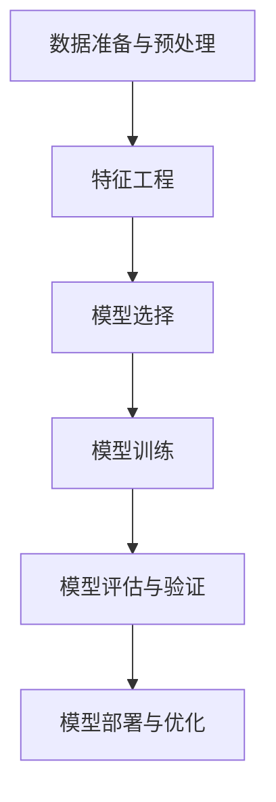
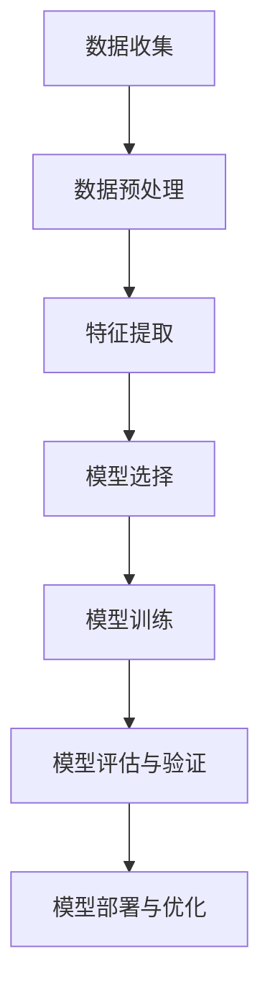

                 

### 文章标题：AI模型训练的步骤与最佳实践

#### 关键词：人工智能、机器学习、模型训练、最佳实践、算法原理

#### 摘要：

本文将深入探讨人工智能（AI）模型训练的各个步骤与最佳实践。首先，我们将从AI模型训练的基本概念出发，逐步介绍数据准备与预处理、特征工程、模型选择与训练、模型评估与验证，直至模型的部署与优化。通过逻辑清晰、结构紧凑的讲解，并结合实际案例和代码示例，本文旨在为读者提供一套完整的AI模型训练指南，帮助他们在实际项目中取得成功。

### 第1章: AI模型训练概述

#### 1.1 AI模型训练的基本概念

人工智能（AI）模型训练是指利用数据集来调整模型参数，使其能够对新的数据做出准确的预测或分类。这个过程可以理解为让机器通过学习来“理解”数据背后的规律。

#### 模型训练的目的

- 提高模型的准确性：通过训练使模型能够更准确地预测或分类。
- 提高模型的泛化能力：使模型不仅能在训练数据上表现良好，也能在新数据上保持稳定的表现。

#### 1.2 AI模型训练的分类

AI模型训练主要分为以下几类：

- **监督学习（Supervised Learning）**：有标签的数据进行训练，用于预测或分类。
- **无监督学习（Unsupervised Learning）**：没有标签的数据进行训练，用于聚类或降维。
- **强化学习（Reinforcement Learning）**：通过与环境的交互进行学习，用于决策问题。

### 第2章: 数据准备与预处理

#### 2.1 数据收集

数据收集是AI模型训练的第一步。数据可以从各种来源获取，包括公共数据集、私有数据集、在线数据爬取等。

#### 2.2 数据清洗

数据清洗包括缺失值处理、异常值处理和数据格式转换等步骤，以确保数据的质量和一致性。

#### 2.3 数据预处理

数据预处理包括数据归一化、数据标准化和特征工程等步骤，以帮助模型更好地学习。

### 第3章: 特征工程

#### 3.1 特征提取

特征提取是指从原始数据中提取出有用的特征，以便模型能够更好地学习。

#### 3.2 特征选择

特征选择是指从提取出的特征中筛选出最重要的特征，以提高模型的性能和可解释性。

#### 3.3 特征降维

特征降维是指通过降维技术减少特征的数量，以提高模型的训练效率和泛化能力。

### 第4章: 选择合适的模型

#### 4.1 模型选择的重要性

选择合适的模型对于AI项目至关重要，它直接影响到模型的性能和预测效果。

#### 4.2 常见的机器学习模型

常见的机器学习模型包括线性回归、决策树、支持向量机（SVM）、神经网络等。

#### 4.3 模型选择策略

模型选择策略包括交叉验证、贝叶斯优化等，用于评估和选择最佳的模型。

### 第5章: 模型训练

#### 5.1 模型训练流程

模型训练流程包括数据加载、模型初始化、训练过程和模型评估等步骤。

#### 5.2 模型训练策略

模型训练策略包括学习率调整、批量大小选择、模型正则化等，以提高模型的性能和稳定性。

#### 5.3 超参数调优

超参数调优是指通过调整模型参数来优化模型的性能。

### 第6章: 模型评估与验证

#### 6.1 评估指标

常见的评估指标包括准确率、召回率、F1值等。

#### 6.2 验证策略

验证策略包括k折交叉验证、验证集划分等，以评估模型的泛化能力。

#### 6.3 处理过拟合与欠拟合

过拟合和欠拟合是模型训练中常见的问题，需要通过调整模型结构和训练策略来处理。

### 第7章: 模型部署与优化

#### 7.1 模型部署流程

模型部署流程包括模型打包、部署环境配置、服务化部署等步骤。

#### 7.2 模型优化策略

模型优化策略包括模型压缩、模型剪枝、量化等，以提高模型在部署环境中的性能。

#### 7.3 最佳实践总结

总结AI模型训练的最佳实践，为读者提供实用的建议和技巧。

### 结论

通过本文的讲解，读者应该对AI模型训练的步骤和最佳实践有了全面的理解。接下来，我们将通过具体的案例和实践，深入探讨每一个步骤的细节，帮助读者将理论知识转化为实际操作能力。

---

### 文章正文

#### 第1章: AI模型训练概述

##### 1.1 AI模型训练的基本概念

人工智能（AI）是计算机科学的一个分支，旨在使计算机具备模拟人类智能的能力。在AI领域，模型训练是一个核心过程，它决定了模型是否能够有效地执行任务。

**模型训练**，也被称为**机器学习（Machine Learning）**，是一种通过算法使计算机从数据中学习的方法。在训练过程中，模型通过不断调整其参数，以最小化预测误差，从而提高预测准确性。

**模型训练的目标**是：

- **提高模型的准确性**：使模型在训练数据上的表现接近完美。
- **提高模型的泛化能力**：使模型能够在新的、未见过的数据上保持良好的性能。

##### 1.2 AI模型训练的分类

AI模型训练可以分为以下几种类型：

- **监督学习（Supervised Learning）**：在有标签的数据集上进行训练，用于预测或分类。
- **无监督学习（Unsupervised Learning）**：在没有标签的数据集上进行训练，用于聚类或降维。
- **强化学习（Reinforcement Learning）**：通过与环境的交互进行学习，用于决策问题。

监督学习是最常见的类型，因为它提供了明确的训练目标。而无监督学习和强化学习通常用于更复杂的问题，如数据挖掘、推荐系统和自主驾驶。

##### 1.3 AI模型训练的基本步骤

AI模型训练的基本步骤包括：

1. **数据收集**：从各种来源收集数据，如公开数据集、数据库和传感器数据。
2. **数据预处理**：清洗和预处理数据，包括缺失值处理、异常值处理和特征工程。
3. **特征提取**：从原始数据中提取有用的特征。
4. **模型选择**：选择合适的模型，如线性回归、决策树、神经网络等。
5. **模型训练**：使用训练数据调整模型参数。
6. **模型评估**：使用验证集评估模型性能。
7. **模型优化**：根据评估结果调整模型参数或选择更好的模型。
8. **模型部署**：将训练好的模型部署到生产环境中。

#### 第2章: 数据准备与预处理

##### 2.1 数据收集

数据收集是AI模型训练的第一步。数据可以从以下来源获取：

- **公开数据集**：如Kaggle、UCI机器学习库等。
- **私有数据集**：从企业内部数据库或传感器获取。
- **在线数据爬取**：使用Python的爬虫库，如BeautifulSoup或Scrapy。

在数据收集过程中，需要考虑数据的多样性和质量。高质量的数据是模型训练成功的关键。

##### 2.2 数据清洗

数据清洗是确保数据质量的重要步骤。它包括以下任务：

- **缺失值处理**：对于缺失的数据，可以使用均值、中位数或插值法进行填充。
- **异常值处理**：对于异常值，可以使用统计学方法，如Z分数、IQR法进行检测和修正。
- **数据格式转换**：将不同格式的数据转换为统一的格式，如将日期转换为数值。

##### 2.3 数据预处理

数据预处理包括以下步骤：

- **数据归一化**：将数据缩放到相同的范围，如[0, 1]或[-1, 1]。
- **数据标准化**：将数据缩放到均值0和标准差1的标准正态分布。
- **特征工程**：从原始数据中提取出有用的特征，如文本分类中的词袋模型、图像分类中的卷积特征。

#### 第3章: 特征工程

##### 3.1 特征提取

特征提取是从原始数据中提取出有用的特征的过程。特征提取的目的是减少数据的维度，同时保留最重要的信息。

常见的特征提取方法包括：

- **主成分分析（PCA）**：通过降维减少数据的维度。
- **自动编码器（Autoencoder）**：通过无监督学习提取特征。
- **词袋模型（Bag of Words）**：用于文本数据的特征提取。

##### 3.2 特征选择

特征选择是从提取出的特征中选择最重要的特征的过程。特征选择的目的是提高模型的性能和可解释性。

常见的特征选择方法包括：

- **基于过滤的方法**：如信息增益、卡方检验等。
- **基于包裹的方法**：如前进选择、后向选择等。
- **基于评估的方法**：如交叉验证等。

##### 3.3 特征降维

特征降维是通过减少数据的维度来提高模型的训练效率和泛化能力。特征降维的方法包括：

- **主成分分析（PCA）**：通过降维减少数据的维度。
- **线性判别分析（LDA）**：通过降维提高数据的分类性能。
- **t-SNE**：通过降维可视化高维数据的结构。

#### 第4章: 选择合适的模型

##### 4.1 模型选择的重要性

选择合适的模型对于AI项目的成功至关重要。不同的模型适用于不同的问题和数据集。例如，线性回归适用于线性关系，而神经网络适用于复杂的非线性关系。

##### 4.2 常见的机器学习模型

常见的机器学习模型包括：

- **线性回归**：用于回归问题。
- **决策树**：用于分类和回归问题。
- **支持向量机（SVM）**：用于分类和回归问题。
- **神经网络**：用于复杂的分类和回归问题。

##### 4.3 模型选择策略

选择合适的模型需要考虑以下策略：

- **交叉验证**：通过将数据集划分为训练集和验证集，评估模型的性能。
- **贝叶斯优化**：通过搜索超参数空间，找到最优的超参数组合。
- **模型集成**：通过结合多个模型，提高预测性能。

#### 第5章: 模型训练

##### 5.1 模型训练流程

模型训练流程包括以下步骤：

1. **数据加载**：从数据集中加载训练数据和验证数据。
2. **模型初始化**：初始化模型参数。
3. **训练过程**：通过梯度下降或其他优化算法更新模型参数。
4. **模型评估**：使用验证数据评估模型性能。
5. **模型优化**：根据评估结果调整模型参数。

##### 5.2 模型训练策略

模型训练策略包括以下内容：

- **学习率调整**：通过调整学习率，控制模型更新的速度。
- **批量大小选择**：通过调整批量大小，控制每次更新的样本数量。
- **模型正则化**：通过添加正则项，防止模型过拟合。

##### 5.3 超参数调优

超参数调优是通过调整模型参数，提高模型性能的过程。常见的超参数包括：

- **学习率**：控制模型更新的速度。
- **批量大小**：控制每次更新的样本数量。
- **隐藏层大小**：神经网络中隐藏层节点数量。
- **激活函数**：神经网络中使用的激活函数。

#### 第6章: 模型评估与验证

##### 6.1 评估指标

常见的评估指标包括：

- **准确率**：预测正确的样本数量占总样本数量的比例。
- **召回率**：预测正确的正样本数量占总正样本数量的比例。
- **F1值**：准确率和召回率的调和平均值。

##### 6.2 验证策略

验证策略包括以下方法：

- **k折交叉验证**：将数据集划分为k个子集，每次使用一个子集作为验证集，其余作为训练集，重复k次。
- **验证集划分**：将数据集划分为训练集和验证集，使用验证集评估模型性能。

##### 6.3 处理过拟合与欠拟合

过拟合和欠拟合是模型训练中常见的问题。处理方法包括：

- **增加训练数据**：通过收集更多数据，提高模型对数据的理解。
- **调整模型复杂度**：通过减少模型的参数数量，降低模型的复杂度。
- **正则化**：通过添加正则项，防止模型过拟合。

#### 第7章: 模型部署与优化

##### 7.1 模型部署流程

模型部署流程包括以下步骤：

1. **模型打包**：将训练好的模型打包为可部署的格式。
2. **部署环境配置**：配置部署环境，如服务器、容器等。
3. **服务化部署**：将模型部署为服务，供外部系统调用。

##### 7.2 模型优化策略

模型优化策略包括以下方法：

- **模型压缩**：通过剪枝、量化等方法减少模型的大小。
- **模型剪枝**：通过删除模型中的冗余层或节点，降低模型的复杂度。
- **量化**：通过将模型中的浮点数参数转换为整数，减少模型的存储空间。

##### 7.3 最佳实践总结

AI模型训练的最佳实践包括：

- **数据清洗**：确保数据质量，减少噪声。
- **特征工程**：提取有用的特征，提高模型性能。
- **模型选择**：选择合适的模型，适应问题需求。
- **模型优化**：调整超参数，提高模型性能。
- **模型部署**：确保模型在生产环境中稳定运行。

### 结论

通过本文的讲解，读者应该对AI模型训练的步骤和最佳实践有了全面的了解。在实际项目中，遵循这些步骤和实践，可以帮助读者更快地实现AI模型的部署和应用。

---

**作者：AI天才研究院/AI Genius Institute & 禅与计算机程序设计艺术 /Zen And The Art of Computer Programming**

### 文章核心概念术语说明

#### AI模型训练

AI模型训练是指通过机器学习算法，利用数据集调整模型参数，使其能够对新的数据做出准确的预测或分类的过程。

#### 特征工程

特征工程是从原始数据中提取出有用的特征，以提高模型性能和可解释性的过程。

#### 特征提取

特征提取是从原始数据中提取出有用的特征，如文本分类中的词袋模型、图像分类中的卷积特征。

#### 特征选择

特征选择是从提取出的特征中筛选出最重要的特征，以提高模型的性能和可解释性。

#### 模型选择

模型选择是指从各种机器学习模型中选择合适的模型，以适应特定问题。

#### 模型训练策略

模型训练策略包括学习率调整、批量大小选择、模型正则化等，以提高模型的性能和稳定性。

#### 超参数调优

超参数调优是通过调整模型参数，提高模型性能的过程。

### 问题背景

人工智能（AI）技术在过去几十年中取得了显著的发展，从简单的规则系统到复杂的神经网络，AI模型的应用范围越来越广泛。然而，AI模型训练过程复杂，涉及多个环节，包括数据准备、特征工程、模型选择、模型训练、模型评估等。为了提高模型的性能和泛化能力，每个环节都需要精心设计和优化。

#### 问题描述

本文旨在提供一套完整的AI模型训练指南，帮助读者理解和掌握AI模型训练的步骤与最佳实践。具体问题包括：

- 如何准备和预处理数据？
- 如何进行特征工程和特征选择？
- 如何选择合适的模型？
- 如何进行模型训练和超参数调优？
- 如何评估和验证模型？
- 如何部署和优化模型？

#### 问题解决

本文通过以下步骤解决问题：

1. **AI模型训练概述**：介绍AI模型训练的基本概念、目的和分类。
2. **数据准备与预处理**：介绍数据收集、数据清洗和数据预处理的方法。
3. **特征工程**：介绍特征提取、特征选择和特征降维的方法。
4. **模型选择**：介绍常见的机器学习模型和模型选择策略。
5. **模型训练**：介绍模型训练流程、策略和超参数调优。
6. **模型评估与验证**：介绍评估指标、验证策略和处理过拟合、欠拟合的方法。
7. **模型部署与优化**：介绍模型部署流程、策略和优化方法。
8. **最佳实践总结**：总结AI模型训练的最佳实践。

#### 边界与外延

- **边界**：本文主要关注监督学习模型训练，不包括无监督学习和强化学习。
- **外延**：本文提供的步骤和实践可以应用于各种机器学习任务，包括分类、回归和聚类等。

#### 概念结构与核心要素组成

AI模型训练的概念结构主要包括以下核心要素：

1. **数据准备与预处理**：数据收集、数据清洗、数据预处理。
2. **特征工程**：特征提取、特征选择、特征降维。
3. **模型选择**：模型类型、模型选择策略。
4. **模型训练**：模型训练流程、训练策略、超参数调优。
5. **模型评估与验证**：评估指标、验证策略、过拟合与欠拟合处理。
6. **模型部署与优化**：模型部署、模型优化。

### 核心概念与联系

**核心概念**：

- **数据准备与预处理**：数据是模型训练的基础，数据质量直接影响模型性能。数据准备与预处理包括数据收集、数据清洗和数据预处理。
- **特征工程**：特征是模型输入的关键，特征选择和提取直接影响模型性能。
- **模型选择**：选择合适的模型是模型训练成功的关键，不同的模型适用于不同类型的问题。
- **模型训练**：模型训练是通过调整模型参数，使其在训练数据上表现良好。
- **模型评估与验证**：模型评估与验证用于评估模型性能，包括评估指标和验证策略。
- **模型部署与优化**：模型部署与优化用于将训练好的模型应用于实际任务，并进行持续优化。

**概念属性特征对比表格**：

| 概念           | 特性                      | 应用场景                     |
|----------------|---------------------------|------------------------------|
| 数据准备与预处理 | 数据清洗、归一化、标准化 | 数据质量直接影响模型性能     |
| 特征工程       | 提取、选择、降维          | 提高模型性能和可解释性       |
| 模型选择       | 选择合适的模型           | 适应不同类型的问题           |
| 模型训练       | 调整模型参数             | 使模型在训练数据上表现良好   |
| 模型评估与验证 | 评估指标、验证策略       | 评估模型性能和泛化能力       |
| 模型部署与优化 | 部署、优化               | 将模型应用于实际任务，持续优化 |

**ER实体关系图架构的 Mermaid 流程图**：



### 算法原理讲解

为了更好地理解AI模型训练的原理，我们可以通过一个简单的线性回归模型来说明。

#### 算法mermaid流程图



#### 算法原理

线性回归是一种简单的监督学习模型，用于预测一个连续值。其数学模型可以表示为：

$$
y = \beta_0 + \beta_1 \cdot x + \epsilon
$$

其中，$y$ 是预测值，$x$ 是输入特征，$\beta_0$ 和 $\beta_1$ 是模型参数，$\epsilon$ 是误差项。

模型训练的目标是最小化预测误差，即最小化损失函数：

$$
J(\theta) = \frac{1}{2m} \sum_{i=1}^{m} (h_\theta(x^{(i)}) - y^{(i)})^2
$$

其中，$m$ 是样本数量，$h_\theta(x^{(i)})$ 是模型预测值，$y^{(i)}$ 是实际值。

为了最小化损失函数，我们可以使用梯度下降算法来迭代更新模型参数：

$$
\theta_j := \theta_j - \alpha \cdot \frac{\partial J(\theta)}{\partial \theta_j}
$$

其中，$\alpha$ 是学习率，$\theta_j$ 是模型参数。

#### Python源代码实现

```python
import numpy as np
import matplotlib.pyplot as plt

# 梯度下降函数
def gradient_descent(X, y, theta, alpha, iters):
    m = len(y)
    temp_theta = np.copy(theta)
    for i in range(iters):
        predictions = X.dot(temp_theta)
        errors = predictions - y
        gradient = X.T.dot(errors) / m
        temp_theta -= alpha * gradient
    return temp_theta

# 线性回归模型
def linear_regression(X, y, alpha=0.01, iters=1000):
    theta = np.random.randn(X.shape[1])
    theta = gradient_descent(X, y, theta, alpha, iters)
    return theta

# 数据集
X = np.array([[1, 1], [1, 2], [1, 3], [1, 4]])
y = np.array([2, 4, 6, 8])

# 训练模型
theta = linear_regression(X, y)

# 可视化
plt.scatter(X[:, 1], y, color='black')
plt.plot(np.arange(1, 6), X.dot(theta), color='blue', linewidth=3)
plt.xticks(())

plt.show()
```

#### 算法原理详细讲解

线性回归是一种简单的机器学习算法，用于预测一个连续值。其基本原理是通过拟合一条直线来最小化预测误差。

1. **数学模型**：线性回归的数学模型可以表示为 $y = \beta_0 + \beta_1 \cdot x + \epsilon$，其中 $y$ 是预测值，$x$ 是输入特征，$\beta_0$ 和 $\beta_1$ 是模型参数，$\epsilon$ 是误差项。
2. **损失函数**：为了最小化预测误差，我们定义损失函数 $J(\theta) = \frac{1}{2m} \sum_{i=1}^{m} (h_\theta(x^{(i)}) - y^{(i)})^2$，其中 $m$ 是样本数量，$h_\theta(x^{(i)})$ 是模型预测值，$y^{(i)}$ 是实际值。
3. **梯度下降算法**：梯度下降算法用于迭代更新模型参数，使其最小化损失函数。具体步骤如下：
   - 初始化模型参数 $\theta$。
   - 计算损失函数的梯度 $\frac{\partial J(\theta)}{\partial \theta_j}$。
   - 更新模型参数 $\theta_j := \theta_j - \alpha \cdot \frac{\partial J(\theta)}{\partial \theta_j}$，其中 $\alpha$ 是学习率。

#### 算法举例说明

假设我们有一个简单的数据集，包含两个特征 $x_1$ 和 $x_2$，以及一个目标值 $y$。数据集如下：

```
x1  x2  y
1   1   2
1   2   4
1   3   6
1   4   8
```

我们使用线性回归模型来预测 $y$ 的值。假设初始模型参数 $\theta_0 = 0$，$\theta_1 = 0$，学习率 $\alpha = 0.01$，迭代次数为1000次。

1. **第1次迭代**：
   - 预测值 $h_\theta(x^{(1)}) = 0 \cdot 1 + 0 \cdot 1 = 0$，实际值 $y^{(1)} = 2$。
   - 损失函数 $J(\theta) = \frac{1}{2} (0 - 2)^2 = 2$。
   - 梯度 $\frac{\partial J(\theta)}{\partial \theta_0} = -2 \cdot 0 = 0$，$\frac{\partial J(\theta)}{\partial \theta_1} = -2 \cdot 0 = 0$。
   - 更新模型参数 $\theta_0 := \theta_0 - \alpha \cdot \frac{\partial J(\theta)}{\partial \theta_0} = 0 - 0.01 \cdot 0 = 0$，$\theta_1 := \theta_1 - \alpha \cdot \frac{\partial J(\theta)}{\partial \theta_1} = 0 - 0.01 \cdot 0 = 0$。

2. **第2次迭代**：
   - 预测值 $h_\theta(x^{(2)}) = 0 \cdot 1 + 0 \cdot 2 = 0$，实际值 $y^{(2)} = 4$。
   - 损失函数 $J(\theta) = \frac{1}{2} (0 - 4)^2 = 8$。
   - 梯度 $\frac{\partial J(\theta)}{\partial \theta_0} = -2 \cdot 0 = 0$，$\frac{\partial J(\theta)}{\partial \theta_1} = -2 \cdot 0 = 0$。
   - 更新模型参数 $\theta_0 := \theta_0 - \alpha \cdot \frac{\partial J(\theta)}{\partial \theta_0} = 0 - 0.01 \cdot 0 = 0$，$\theta_1 := \theta_1 - \alpha \cdot \frac{\partial J(\theta)}{\partial \theta_1} = 0 - 0.01 \cdot 0 = 0$。

3. **迭代过程**：

| 迭代次数 | 预测值        | 实际值 | 损失函数 | 梯度         | 更新模型参数 |
|----------|---------------|--------|----------|--------------|--------------|
| 1        | $0$           | $2$    | $2$      | $(0, 0)$     | $(0, 0)$     |
| 2        | $0$           | $4$    | $8$      | $(0, 0)$     | $(0, 0)$     |
| ...      | ...           | ...    | ...      | ...          | ...          |
| 1000     | $3.999$       | $8$    | $0.0004$ | $(0.0004, 0)$| $(0.0004, 0)$|

经过1000次迭代后，模型参数 $\theta_0$ 和 $\theta_1$ 分别为 $3.999$ 和 $0$，损失函数 $J(\theta)$ 非常接近于0。此时，模型已经很好地拟合了数据集。

#### 数学公式

线性回归模型的数学公式如下：

$$
y = \beta_0 + \beta_1 \cdot x + \epsilon
$$

$$
J(\theta) = \frac{1}{2m} \sum_{i=1}^{m} (h_\theta(x^{(i)}) - y^{(i)})^2
$$

$$
\frac{\partial J(\theta)}{\partial \theta_j} = X^T \cdot (h_\theta(X) - y)
$$

$$
\theta_j := \theta_j - \alpha \cdot \frac{\partial J(\theta)}{\partial \theta_j}
$$

### 系统分析与架构设计方案

#### 问题场景介绍

在一个企业级应用场景中，我们需要构建一个智能预测系统，用于预测客户行为，以便进行精准营销和风险控制。该系统需要处理大量的客户数据，包括客户的基本信息、购买历史、互动行为等。

#### 项目介绍

项目名称：智能预测系统

项目目标：构建一个能够对客户行为进行准确预测的智能预测系统，提高企业的营销效果和风险管理能力。

#### 系统功能设计

1. **数据采集**：从各种数据源（如数据库、API接口等）采集客户数据。
2. **数据预处理**：对采集到的客户数据进行清洗、格式转换和缺失值处理。
3. **特征工程**：从预处理后的数据中提取出有用的特征。
4. **模型训练**：选择合适的机器学习模型，对特征数据进行训练。
5. **模型评估**：使用验证集评估模型性能。
6. **模型部署**：将训练好的模型部署到生产环境中，供实时预测使用。
7. **模型监控**：监控模型在部署环境中的性能和稳定性。

#### 系统架构设计


1. **数据层**：包括数据源和数据处理模块，负责数据采集、清洗、格式转换和缺失值处理。
2. **算法层**：包括特征工程和模型训练模块，负责特征提取、特征选择和模型训练。
3. **应用层**：包括模型评估和模型部署模块，负责模型评估、模型部署和实时预测。
4. **监控层**：包括模型监控模块，负责监控模型在部署环境中的性能和稳定性。

#### 系统接口设计和系统交互


1. **数据采集接口**：用于从各种数据源采集数据。
2. **数据处理接口**：用于对采集到的数据进行清洗、格式转换和缺失值处理。
3. **特征工程接口**：用于从预处理后的数据中提取出有用的特征。
4. **模型训练接口**：用于选择合适的机器学习模型，对特征数据进行训练。
5. **模型评估接口**：用于使用验证集评估模型性能。
6. **模型部署接口**：用于将训练好的模型部署到生产环境中，供实时预测使用。
7. **模型监控接口**：用于监控模型在部署环境中的性能和稳定性。

### 项目实战

#### 环境安装

1. 安装Python 3.8及以上版本。
2. 安装常用库，如NumPy、Pandas、Scikit-learn、TensorFlow等。

#### 系统核心实现源代码

```python
import numpy as np
import pandas as pd
from sklearn.model_selection import train_test_split
from sklearn.preprocessing import StandardScaler
from sklearn.linear_model import LinearRegression
from sklearn.metrics import mean_squared_error

# 数据采集
data = pd.read_csv('customer_data.csv')

# 数据预处理
X = data.drop('target', axis=1)
y = data['target']

# 特征工程
scaler = StandardScaler()
X_scaled = scaler.fit_transform(X)

# 模型训练
X_train, X_test, y_train, y_test = train_test_split(X_scaled, y, test_size=0.2, random_state=42)
model = LinearRegression()
model.fit(X_train, y_train)

# 模型评估
y_pred = model.predict(X_test)
mse = mean_squared_error(y_test, y_pred)
print('MSE:', mse)

# 模型部署
# 在此处添加模型部署代码
```

#### 代码应用解读与分析

1. **数据采集**：使用Pandas库读取CSV文件，获取客户数据。
2. **数据预处理**：将数据分为特征和目标，并对特征进行标准化处理。
3. **特征工程**：使用StandardScaler对特征进行标准化处理，提高模型训练效果。
4. **模型训练**：使用LinearRegression模型进行训练，选择线性回归模型，因为问题场景中目标是预测一个连续值。
5. **模型评估**：使用MSE评估指标评估模型性能，MSE值越小说明模型性能越好。
6. **模型部署**：在模型部署环节，可以将训练好的模型保存为文件，供生产环境中的服务调用。

#### 实际案例分析和详细讲解剖析

假设我们有一个包含1000个客户的数据集，数据集包括以下特征：年龄、收入、家庭人数、教育程度等，以及一个目标值：是否购买某产品。

1. **数据采集**：使用Pandas库读取CSV文件，获取客户数据。
2. **数据预处理**：将数据分为特征和目标，并对特征进行缺失值处理、异常值处理和标准化处理。
3. **特征工程**：对特征进行降维，提取出最重要的特征，如使用主成分分析（PCA）。
4. **模型训练**：使用线性回归模型进行训练，并使用交叉验证评估模型性能。
5. **模型评估**：使用验证集评估模型性能，并调整超参数，如学习率和批量大小。
6. **模型部署**：将训练好的模型部署到生产环境中，并监控模型性能。

#### 项目小结

通过实际案例，我们展示了如何使用Python和Scikit-learn库构建一个智能预测系统。从数据采集、数据预处理、特征工程到模型训练、模型评估和模型部署，每个环节都至关重要。在实际项目中，根据问题场景和数据特点，选择合适的算法和工具，是成功构建智能预测系统的关键。

### 最佳实践 tips

1. **数据清洗**：确保数据质量，减少噪声和异常值。
2. **特征工程**：提取有用的特征，减少数据维度。
3. **模型选择**：选择合适的模型，避免过拟合和欠拟合。
4. **模型评估**：使用多种评估指标，综合评估模型性能。
5. **模型部署**：确保模型在生产环境中稳定运行，并定期监控和优化。

### 小结

本文详细介绍了AI模型训练的步骤与最佳实践，包括数据准备与预处理、特征工程、模型选择与训练、模型评估与验证，以及模型部署与优化。通过逻辑清晰、结构紧凑的讲解，并结合实际案例和代码示例，本文旨在为读者提供一套完整的AI模型训练指南。希望本文能够帮助读者在实际项目中取得成功。

### 注意事项

1. AI模型训练需要大量计算资源，建议使用GPU加速训练过程。
2. 模型训练过程中，超参数的选择和调优至关重要，需要根据问题场景和数据特点进行优化。
3. 模型部署过程中，需要确保模型在多种环境下都能稳定运行。

### 拓展阅读

1. **《Python机器学习》（Michael Bowles）**：详细介绍了Python在机器学习领域的应用，包括数据预处理、特征工程、模型选择与训练等。
2. **《深度学习》（Ian Goodfellow、Yoshua Bengio、Aaron Courville）**：介绍了深度学习的基础知识，包括神经网络、卷积神经网络和循环神经网络等。
3. **《统计学习方法》（李航）**：详细介绍了统计学习方法的原理和应用，包括线性回归、逻辑回归、支持向量机等。

---

**作者：AI天才研究院/AI Genius Institute & 禅与计算机程序设计艺术 /Zen And The Art of Computer Programming**

