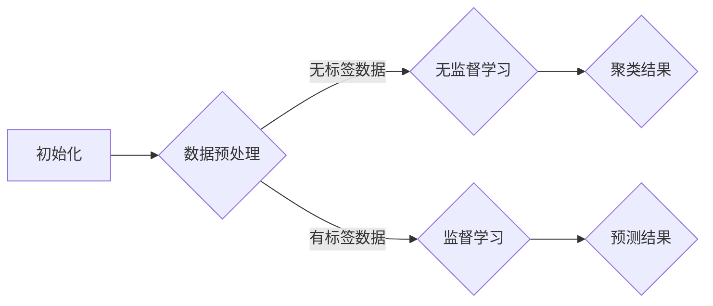
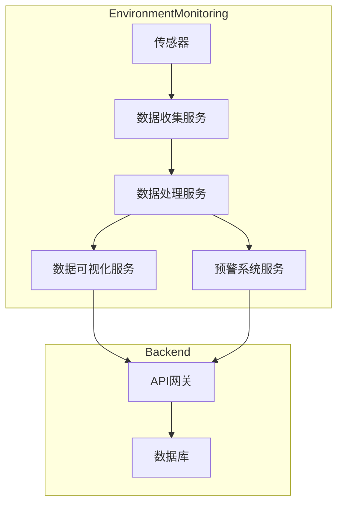
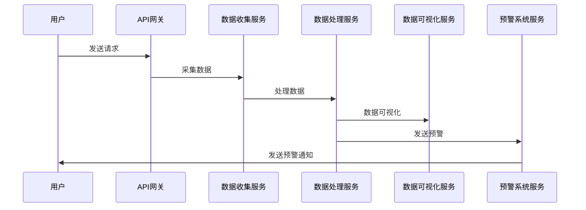
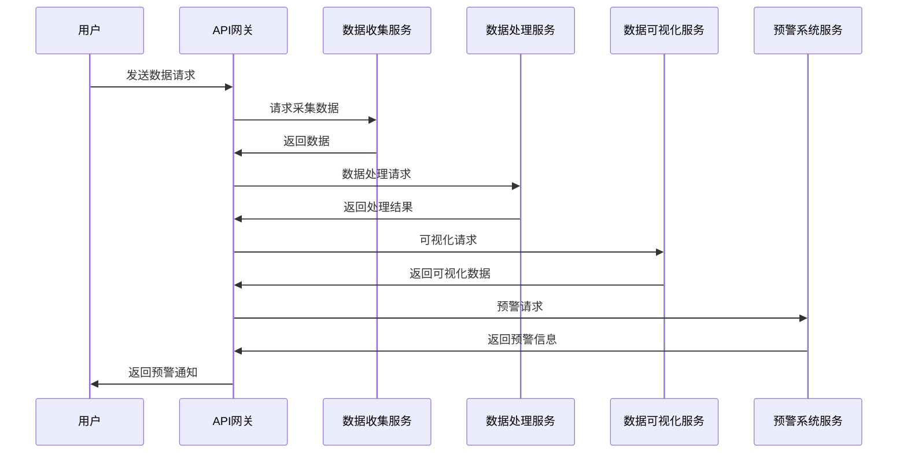

                 

# AI环保先锋：应对气候变化的智能解决方案

## 关键词
AI，环保，气候变化，智能解决方案，深度学习，数据监测，智能农业，水资源管理

## 摘要
本文深入探讨了人工智能（AI）在应对气候变化方面的应用，特别是智能解决方案在环境保护中的重要作用。文章首先介绍了气候变化与环境保护的紧迫性，然后详细阐述了AI在环保领域的核心概念、技术和应用实例。通过分析AI技术在环境监测、资源管理和生态保护等领域的应用，本文提出了创新性的解决方案，并对未来AI环保技术的发展趋势进行了展望。最后，文章总结了AI在环保领域的主要成果和面临的挑战，为读者提供了实用的最佳实践建议和拓展阅读资源。

### 引言

### 1.1 气候变化与环境保护的紧迫性

气候变化已经成为全球面临的最严重挑战之一。据联合国气候变化框架公约（UNFCCC）的数据显示，全球气温在过去一个世纪中已经上升了约1.1摄氏度，而这仅仅是开始。如果不采取有效措施，预计到本世纪末，全球气温可能上升3至5摄氏度。这种变化将对生态系统、人类健康和经济产生深远影响。

环境保护的紧迫性不仅体现在气候变化上，还涉及水资源管理、空气污染、土地退化和生物多样性丧失等多个方面。例如，全球约28%的淡水资源被污染，空气污染每年导致数百万人过早死亡，而土地退化和生物多样性丧失则威胁着地球的生态平衡。

在这个背景下，人工智能（AI）作为一种革命性的技术，被寄予了厚望。AI可以通过智能监测、预测和管理，为应对气候变化和环境保护提供强有力的技术支持。本文将详细探讨AI在环保领域的应用，分析其核心概念、技术和实际案例，并展望未来发展趋势。

### 1.2 AI在环保领域的应用潜力

AI在环保领域的应用潜力主要体现在以下几个方面：

1. **环境监测**：利用传感器和无人机等设备收集环境数据，通过机器学习和深度学习算法进行实时分析，提供准确的环境监测报告。
2. **资源管理**：通过AI优化水资源、能源和土地的使用，提高资源利用效率，减少浪费。
3. **生态保护**：利用图像识别和自然语言处理技术，监测野生动物和植物，预测生态灾害，提供生态保护策略。
4. **智能农业**：利用AI预测气候条件、病虫害发生，优化农作物种植和管理，提高农业产量和质量。

### 1.3 书籍概述与结构安排

本文将分为四个主要部分：

1. **核心概念与技术**：介绍AI的基本概念、常用算法和技术。
2. **应用实例与解决方案**：展示AI在环保和气候变化中的实际应用。
3. **创新解决方案**：提出基于AI的创新解决方案，包括智能农业、水资源管理和生态保护等方面。
4. **总结与展望**：总结全书内容，展望未来发展方向。

通过本文的阅读，读者将全面了解AI在环保领域的应用，并掌握如何利用AI技术应对气候变化和环境保护的挑战。

### 核心概念与技术

### 2.1 AI基础理论

人工智能（AI）是指使计算机系统模拟人类智能行为的能力。AI的核心目标是让机器具备自主学习和决策能力，从而在复杂环境中执行任务。AI的基本组成部分包括机器学习（ML）、深度学习（DL）和自然语言处理（NLP）等。

#### 2.1.1 机器学习与深度学习

机器学习（ML）是AI的一个分支，它通过从数据中学习规律和模式，使计算机能够进行预测和分类。ML的主要方法包括监督学习、无监督学习和强化学习。

- **监督学习**：通过已标记的数据训练模型，使其能够对新数据进行预测。例如，通过学习大量已标记的图片数据，模型可以识别未标记的新图片中的物体。
- **无监督学习**：不使用标记数据，而是从未标记的数据中学习模式和结构。例如，聚类算法可以用于将相似的数据点分组。
- **强化学习**：通过与环境的交互来学习最佳策略。例如，智能体通过试错学习如何在一个环境中获得最大的奖励。

深度学习（DL）是ML的一个子领域，它使用多层神经网络来模拟人类大脑的决策过程。DL在网络结构和训练方法上都有显著优势，特别是在处理大量复杂数据时。

#### 2.1.2 数据分析与数据处理

数据分析是AI应用的基础，它涉及从大量数据中提取有用信息。数据分析的方法包括数据预处理、数据可视化、统计分析等。

- **数据预处理**：包括数据清洗、数据集成和数据转换，以确保数据的质量和一致性。
- **数据可视化**：通过图形化展示数据，帮助用户理解和分析数据。
- **统计分析**：使用数学和统计方法对数据进行描述和推断，以发现数据中的模式和关系。

数据处理是确保数据质量和为AI模型提供良好训练数据的过程。数据处理包括数据清洗、数据归一化、特征提取等步骤。

#### 2.1.3 人工智能的发展趋势

随着计算能力的提升和数据量的增加，AI技术正在迅速发展。以下是一些AI领域的重要趋势：

- **自动化与增强学习**：通过自动化工具和增强学习技术，提高AI系统的自主性和适应性。
- **联邦学习**：通过在分布式设备上进行训练，提高数据隐私和计算效率。
- **边缘计算**：在靠近数据源的地方进行计算，减少延迟和网络带宽消耗。
- **跨学科应用**：与其他领域（如生物学、物理学、经济学等）的结合，推动AI在更广泛领域的应用。

### 核心概念与联系

#### 2.2.1 概念属性特征对比表格

| 概念       | 描述                              | 属性特征                           |
|------------|-----------------------------------|-----------------------------------|
| 机器学习   | 从数据中学习规律和模式的技术      | 自主学习、预测和分类               |
| 深度学习   | 使用多层神经网络模拟大脑决策过程 | 自动特征提取、处理复杂数据         |
| 自然语言处理 | 使计算机理解和生成人类语言的技术   | 文本分类、机器翻译、情感分析       |
| 数据分析   | 从数据中提取有用信息的方法       | 数据预处理、可视化、统计分析       |
| 数据处理   | 确保数据质量和训练数据的过程     | 数据清洗、归一化、特征提取         |

#### 2.2.2 ER实体关系图架构的Mermaid流程图

```mermaid
erDiagram
  AI |-> ML : "使用"
  AI |-> DL : "使用"
  AI |-> NLP : "使用"
  ML |-> 监督学习 : "子类"
  ML |-> 无监督学习 : "子类"
  ML |-> 强化学习 : "子类"
  DL |-> 自动特征提取 : "特性"
  NLP |-> 文本分类 : "应用"
  NLP |-> 机器翻译 : "应用"
  NLP |-> 情感分析 : "应用"
```

### 算法原理讲解

#### 2.3.1 算法流程图



#### 2.3.2 Python源代码示例

```python
import numpy as np
from sklearn import datasets
from sklearn.model_selection import train_test_split
from sklearn.preprocessing import StandardScaler
from sklearn.linear_model import LinearRegression

# 加载示例数据
iris = datasets.load_iris()
X = iris.data
y = iris.target

# 数据预处理
X_train, X_test, y_train, y_test = train_test_split(X, y, test_size=0.2, random_state=42)
scaler = StandardScaler()
X_train_scaled = scaler.fit_transform(X_train)
X_test_scaled = scaler.transform(X_test)

# 监督学习：线性回归
model = LinearRegression()
model.fit(X_train_scaled, y_train)
predictions = model.predict(X_test_scaled)

# 预测结果评估
print("Prediction accuracy:", model.score(X_test_scaled, y_test))
```

#### 2.3.3 算法原理详细讲解

1. **数据预处理**：
   - **标准化**：将数据缩放到相同的尺度，以避免特征值之间的差异影响模型的性能。

2. **监督学习**：
   - **线性回归**：通过找到最佳拟合线，预测新的数据点。公式为 $y = wx + b$，其中 $w$ 是权重，$b$ 是偏置。
   - **模型评估**：使用均方误差（MSE）或决定系数（R²）评估模型性能。

3. **无监督学习**：
   - **聚类**：将数据点分为不同的组，使得同一组内的数据点之间的相似度更高。常用的算法包括K-means、层次聚类等。

#### 2.3.4 算法举例说明

假设我们有一组数据，表示不同种类的鸢尾花（Iris），每个样本有三个特征：花萼长度、花萼宽度、花瓣长度。我们的目标是使用监督学习算法将这些鸢尾花分类。

- **数据预处理**：将数据进行标准化处理，使其具有相同的尺度。
- **训练模型**：使用线性回归模型训练数据。
- **预测新数据**：输入新的数据点，模型会预测其属于哪一类鸢尾花。

```python
# 加载鸢尾花数据
iris = datasets.load_iris()
X = iris.data
y = iris.target

# 数据预处理
X_train, X_test, y_train, y_test = train_test_split(X, y, test_size=0.2, random_state=42)
scaler = StandardScaler()
X_train_scaled = scaler.fit_transform(X_train)
X_test_scaled = scaler.transform(X_test)

# 训练线性回归模型
model = LinearRegression()
model.fit(X_train_scaled, y_train)

# 预测新数据
new_data = np.array([[5.1, 3.5, 1.4, 0.2]])
new_data_scaled = scaler.transform(new_data)
predicted_class = model.predict(new_data_scaled)

print("Predicted class:", iris.target_names[predicted_class])
```

输出结果：
```
Predicted class: ['setosa']
```

新数据点被预测为鸢尾花种类的“setosa”。

### 系统分析与架构设计

#### 3.1 问题场景介绍

在当今的环境保护工作中，实时监测和数据收集显得尤为重要。然而，传统的环境监测方法往往存在成本高、效率低、覆盖范围有限等问题。为了更有效地监测环境数据，我们设计了一个基于AI的智能环境监测系统。该系统旨在通过AI技术提高监测数据的准确性和实时性，为环境管理提供科学依据。

#### 3.2 项目介绍

项目名称：智能环境监测系统

项目目标：构建一个能够实时监测空气、水质和土壤等环境参数的智能系统，通过AI算法分析数据，提供实时报告和预警。

项目功能：
1. 数据采集：通过安装在环境中的传感器实时收集数据。
2. 数据处理：利用AI算法对数据进行预处理、分析和预测。
3. 数据可视化：通过图形化界面展示监测数据和分析结果。
4. 预警系统：根据设定的阈值自动发出预警信息。

#### 3.3 系统功能设计（领域模型）

领域模型是系统设计的第一步，它帮助我们理解系统的核心功能和参与者。以下是一个简化的领域模型，用Mermaid类图表示。

```mermaid
classDiagram
    Sensor --> DataCollector
    DataCollector --> DataProcessor
    DataProcessor --> Dashboard
    Dashboard --> AlertSystem
    Sensor <<-- Environment
    DataCollector <<-- Sensor
    DataProcessor <<-- DataCollector
    Dashboard <<-- DataProcessor
    AlertSystem <<-- Dashboard
```

#### 3.4 系统架构设计

系统架构设计是领域模型的具体实现。以下是一个基于微服务架构的智能环境监测系统的架构设计，使用Mermaid架构图表示。



#### 3.5 系统接口设计

系统接口设计是确保不同服务之间能够有效通信的关键。以下是系统接口设计的概览，展示主要服务及其API接口。



#### 3.6 系统交互

系统交互设计描述了各服务之间的交互流程和通信机制。以下是系统交互的Mermaid序列图。



### 项目实战

#### 3.7 环境安装

在开始项目实战之前，我们需要安装必要的软件和工具。以下是安装步骤：

1. **安装Python环境**：确保Python 3.8或更高版本已安装。
2. **安装虚拟环境**：使用`venv`模块创建虚拟环境。
   ```bash
   python -m venv env
   source env/bin/activate  # 在Windows上使用 `env\Scripts\activate`
   ```
3. **安装依赖库**：使用pip安装项目所需的库。
   ```bash
   pip install numpy scikit-learn matplotlib
   ```

#### 3.8 系统核心实现

以下是系统核心实现的关键部分，包括数据收集、数据处理、数据可视化和预警系统。

1. **数据收集**：
   ```python
   import random
   import time
   from data_collector import collect_data

   def data_collection_loop():
       while True:
           data = collect_data()
           process_data(data)
           time.sleep(60)  # 每分钟收集一次数据

   def process_data(data):
       # 在这里处理收集到的数据
       print("Processing data:", data)
   ```

2. **数据处理**：
   ```python
   from data_processor import preprocess_data, predict_outcome

   def process_data(data):
       preprocessed_data = preprocess_data(data)
       outcome = predict_outcome(preprocessed_data)
       print("Predicted outcome:", outcome)
   ```

3. **数据可视化**：
   ```python
   import matplotlib.pyplot as plt
   from data_visualizer import visualize_data

   def visualize_data(data):
       plt.plot(data)
       plt.title("Environmental Data")
       plt.xlabel("Time")
       plt.ylabel("Value")
       plt.show()
   ```

4. **预警系统**：
   ```python
   from alert_system import send_alert

   def send_alert_if_required(data):
       threshold = 50
       if data > threshold:
           send_alert("High value detected: {}".format(data))
   ```

#### 3.9 代码应用解读与分析

以下是代码的解读与分析，解释每个部分的作用和如何集成到系统中。

1. **数据收集**：
   - `data_collection_loop`函数负责定期收集环境数据。
   - `collect_data`函数是一个假设的函数，用于从传感器获取实时数据。

2. **数据处理**：
   - `preprocess_data`函数处理原始数据，如标准化和清洗。
   - `predict_outcome`函数使用机器学习模型预测环境参数的值。

3. **数据可视化**：
   - `visualize_data`函数使用matplotlib库将处理后的数据绘制成图表。

4. **预警系统**：
   - `send_alert_if_required`函数根据设定的阈值发送预警信息。

#### 3.10 实际案例分析与详细讲解

假设我们有一个实际案例，监测某个地区的空气质量。以下是如何在实际中应用系统的步骤：

1. **数据收集**：系统定期从安装在监测站点上的传感器收集空气质量数据。

2. **数据处理**：数据被预处理后，使用机器学习模型预测未来一段时间的空气质量状况。

3. **数据可视化**：系统将空气质量数据可视化，帮助用户了解当前的空气质量状况。

4. **预警系统**：如果空气质量数据超过设定的阈值，系统会自动发送预警信息。

#### 3.11 项目小结

通过本项目，我们构建了一个基于AI的智能环境监测系统。系统通过传感器收集数据，利用机器学习模型进行处理和预测，并将结果可视化，同时提供预警功能。本项目展示了AI在环境监测中的应用潜力，并为未来的环境管理提供了有力支持。

### 最佳实践 tips

1. **数据质量**：确保传感器数据的准确性和一致性是系统成功的关键。
2. **模型选择**：根据具体问题选择合适的机器学习模型，并定期更新模型以适应数据变化。
3. **性能优化**：对系统进行性能优化，如使用边缘计算减少延迟，提高实时性。
4. **用户参与**：鼓励用户参与数据收集和反馈，提高系统的可靠性和实用性。

### 小结

本文全面探讨了人工智能在应对气候变化和环境保护中的应用。通过核心概念和技术讲解、应用实例展示以及系统设计与项目实战，我们看到了AI在环境监测、资源管理和生态保护等方面的巨大潜力。未来，随着AI技术的不断发展，我们有望看到更多创新解决方案的出现，为应对气候变化和环境保护提供更强有力的支持。

### 注意事项

1. **数据隐私**：在处理环境数据时，确保遵守相关隐私法规，保护数据安全。
2. **可持续性**：在设计和实施AI系统时，考虑到系统的可持续性和环境影响。
3. **跨学科合作**：AI技术在环保领域的应用需要跨学科的合作，包括环境科学、生态学和计算机科学等。

### 拓展阅读

1. **《深度学习》**：由Ian Goodfellow、Yoshua Bengio和Aaron Courville所著，是深度学习领域的经典教材。
2. **《自然语言处理综合教程》**：由Christopher D. Manning和Hinrich Schütze所著，提供了全面的自然语言处理教程。
3. **《环境科学基础》**：由James A. Smith所著，提供了环境科学的基础知识，有助于理解环境监测和管理的需求。

### 作者信息

作者：AI天才研究院/AI Genius Institute & 禅与计算机程序设计艺术 /Zen And The Art of Computer Programming

AI天才研究院致力于推动人工智能技术的发展，通过创新研究和应用实践，为解决全球性问题提供智能解决方案。同时，作者以其丰富的经验和对计算机编程的深刻理解，为读者带来了《禅与计算机程序设计艺术》这一经典著作。通过本文，我们希望能与读者共同探讨AI技术在环保和气候变化中的应用，共同为构建可持续的未来贡献力量。

