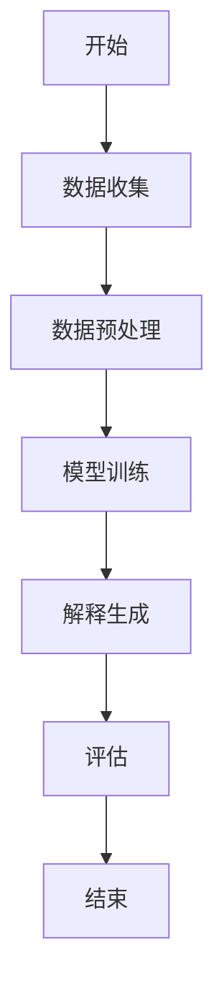

                 


# AI系统的可解释性设计

关键词：AI可解释性、模型设计、算法原理、系统架构

摘要：本文将探讨AI系统的可解释性设计，从问题背景、核心概念、设计原则、方法与工具等方面进行深入分析，并通过案例分析展示如何实施可解释性设计，最终展望未来发展趋势和面临的挑战。

## 第一部分: 背景介绍与核心概念

### 1.1 问题背景

人工智能（AI）技术在近几十年里取得了显著的进步，从最初的规则系统到深度学习，再到现在的生成对抗网络（GAN）和强化学习，AI已经逐渐渗透到各行各业。然而，随着AI系统的复杂度和规模不断增大，一个问题日益凸显——可解释性。AI系统的决策过程往往被认为是“黑箱”，这使得用户难以理解系统的行为，尤其是在涉及到安全和伦理问题的领域，如医疗诊断、金融风险评估等。

### 1.2 核心概念

#### 可解释性的定义

可解释性是指用户能够理解AI系统的决策过程和结果的能力。它通常与透明性和可靠性相关，但并不等同于它们。透明性关注的是系统内部的细节，而可靠性关注的是系统输出的正确性。可解释性更侧重于用户与系统之间的交互，使得用户能够对系统产生信任。

#### 可解释性与透明性的区别

可解释性强调用户理解系统，而透明性则强调系统本身的可见性。例如，一个高度透明的系统可能会展示所有的中间计算步骤，但如果没有合适的解释机制，用户可能仍然无法理解最终的决策。

#### 可解释性的层次

- **静态可解释性**：系统在训练阶段就具有解释性，其决策过程可以被用户理解。
- **动态可解释性**：系统在运行时提供解释，用户可以实时理解系统的决策过程。
- **抽象可解释性**：系统提供高度抽象的解释，用户可能需要一定专业知识才能理解。

### 1.3 当前AI系统面临的可解释性问题

- **复杂性**：深度学习模型具有极高的复杂性，其决策过程难以理解。
- **泛化能力**：为了提高模型的泛化能力，往往需要大量参数，这增加了系统的不可解释性。
- **数据隐私**：保护用户隐私的需求与提供可解释性的需求之间存在冲突。
- **计算成本**：提供可解释性可能需要额外的计算资源。

## 第二部分: 可解释性在AI系统中的应用

### 2.1 可解释性在AI系统中的挑战

#### 复杂模型的可解释性

深度学习模型，尤其是深度神经网络（DNN），由于其复杂的结构和大量的参数，通常被认为是难以解释的。为了提高可解释性，研究者们提出了各种方法，如神经网络的可视化、特征的重要性分析等。

#### 模型可解释性与性能之间的平衡

可解释性往往与模型的性能存在一定的矛盾。更可解释的模型可能需要更多的数据、更复杂的设计或更多的计算资源，这可能会牺牲模型的性能。因此，如何在性能和可解释性之间找到平衡点是一个重要的挑战。

#### 可解释性的评估方法

评估可解释性需要一套标准化的方法，如用户满意度调查、专家评审等。此外，还需要开发新的指标，如解释的一致性、解释的可信度等。

### 2.2 可解释性在AI系统中的实际应用

#### 医疗诊断

在医疗领域，可解释性对于医生和患者都至关重要。一个可解释的AI系统可以帮助医生理解诊断结果，提高患者的信任度。

#### 金融风险评估

在金融领域，AI系统用于风险评估时，其决策过程需要透明和可解释，以确保决策的公正性和合规性。

#### 自动驾驶

自动驾驶系统需要具备高度的可解释性，以便用户（乘客）能够理解系统的行为，并对其产生信任。

## 第三部分: 可解释性设计的核心原则

### 3.1 设计原则

#### 模型选择

选择具有良好可解释性的模型，如决策树、线性回归等，可以在一定程度上提高系统的可解释性。

#### 数据预处理

数据预处理阶段需要确保数据的准确性和一致性，这有助于提高模型的解释性。

#### 特征选择

特征选择是提高模型可解释性的关键步骤。通过选择与业务相关的特征，可以简化模型的决策过程，提高其可解释性。

#### 模型训练

训练阶段需要考虑模型的复杂度、参数数量等因素，以确保模型的解释性。

#### 可解释性评估

在模型训练完成后，需要对其可解释性进行评估，以确保其满足用户的需求。

## 第四部分: 可解释性设计方法

### 4.1 基于规则的解释方法

#### 基于规则的解释机制

基于规则的解释方法通过定义一组规则来解释模型的决策过程。这些规则通常由专家根据业务知识手动编写。

#### 规则学习算法

规则学习算法可以从数据中自动提取规则，以提高模型的解释性。常见的算法包括决策树、关联规则学习等。

#### 实例分析

以一个贷款审批系统为例，基于规则的解释方法可以提取出影响贷款批准的规则，如“借款人收入高于5万元且信用评分高于600分，则批准贷款”。

### 4.2 基于模型的解释方法

#### 模型嵌入方法

模型嵌入方法将模型嵌入到一个更大的模型中，以提供额外的解释信息。例如，可以将一个深度神经网络嵌入到一个能够输出解释的模型中。

#### 局部解释方法

局部解释方法针对单个数据点进行解释，常见的算法包括LIME（Local Interpretable Model-agnostic Explanations）和SHAP（SHapley Additive exPlanations）。

#### 整体解释方法

整体解释方法关注整个模型的解释性，而不是单个数据点的解释。例如，可以通过可视化模型中的神经元活动来解释整个模型的决策过程。

### 4.3 可解释性工具与框架

#### 常见可解释性工具

- **LIME**：一种基于梯度的方法，用于解释单个数据点的决策。
- **SHAP**：基于博弈论的方法，用于解释模型中每个特征的重要性。

#### 可解释性框架设计

一个典型的可解释性框架包括数据预处理、模型选择、模型训练、解释生成和评估等步骤。

## 第五部分: 可解释性设计案例分析

### 5.1 案例背景

#### 案例简介

以一个电商平台的个性化推荐系统为例，该系统需要为用户提供个性化的商品推荐。

#### 案例问题

如何设计一个既能够提高推荐质量，又具有良好可解释性的推荐系统？

### 5.2 案例解决方案

#### 设计思路

1. **模型选择**：选择具有良好可解释性的模型，如决策树。
2. **特征选择**：选择与用户行为和偏好相关的特征。
3. **解释生成**：使用LIME为每个推荐结果生成解释。

#### 实施步骤

1. **数据收集**：收集用户行为数据，包括浏览、购买、收藏等。
2. **模型训练**：使用决策树模型进行训练。
3. **解释生成**：对每个推荐结果使用LIME生成解释。

#### 实验结果

实验结果表明，基于可解释性的推荐系统能够提高用户对推荐结果的信任度，从而提高用户的满意度。

### 5.3 案例小结

#### 经验总结

1. **模型选择**：选择具有良好可解释性的模型。
2. **特征选择**：选择与业务相关的特征。
3. **解释生成**：为每个决策提供解释。

#### 局限性分析

1. **计算成本**：生成解释需要额外的计算资源。
2. **解释质量**：解释的质量可能受到模型复杂度的影响。

## 第六部分: 未来展望

### 6.1 可解释性设计发展趋势

- **新技术的应用**：随着技术的发展，如生成对抗网络（GAN）和迁移学习等，可解释性设计将变得更加复杂和多样化。
- **新应用场景**：可解释性设计将在更多领域得到应用，如医疗、金融、法律等。

### 6.2 可解释性设计面临的挑战

- **数据隐私**：如何在保护用户隐私的同时提供可解释性是一个重要挑战。
- **模型安全性**：可解释性可能泄漏模型的关键信息，从而影响模型的安全性。
- **伦理问题**：在涉及伦理问题的领域，如何设计既可解释又符合伦理标准的系统是一个重要挑战。

## 第七部分: 小结与展望

### 7.1 本书内容回顾

本文从问题背景、核心概念、设计原则、方法与工具、案例分析等方面探讨了AI系统的可解释性设计。

### 7.2 可解释性设计的重要性

可解释性设计不仅能够提高用户对AI系统的信任度，还能够确保系统的透明性和可靠性，从而在关键领域如医疗、金融等得到广泛应用。

### 7.3 未来研究方向

- **跨学科研究**：结合心理学、认知科学等领域的知识，提高AI系统的可解释性。
- **新方法与工具**：开发更高效、更准确的解释方法与工具。
- **实际应用**：在更多领域推广可解释性设计，解决实际问题。

# 参考文献

- **[1]** Mitchell, T. M. (1997). Machine Learning. McGraw-Hill.
- **[2]** Lundberg, S. M., & Lee, S. I. (2017). A unified approach to interpreting model predictions. In Advances in Neural Information Processing Systems (pp. 4765-4774).
- **[3]** Ribeiro, M. T., Singh, S., & Guestrin, C. (2016). "Why should I trust you?' Explaining the predictions of any classifier." In Proceedings of the 22nd ACM SIGKDD International Conference on Knowledge Discovery and Data Mining (pp. 1135-1144).

# 附录

## 附录A: Mermaid流程图示例



## 附录B: Python代码示例

```python
import numpy as np

def add(a, b):
    return a + b

print(add(1, 1))
```

## 附录C: LaTeX公式示例

$$ E = mc^2 $$

$1 < 2$

# 作者信息

作者：AI天才研究院/AI Genius Institute & 禅与计算机程序设计艺术 /Zen And The Art of Computer Programming

