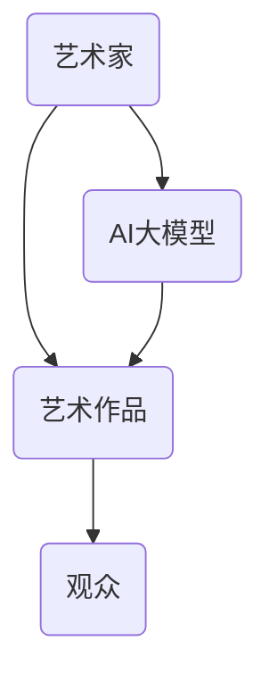
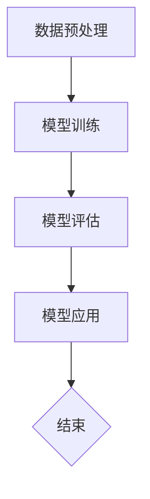
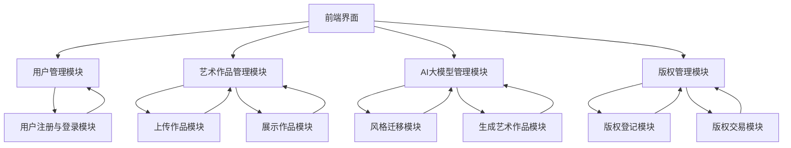
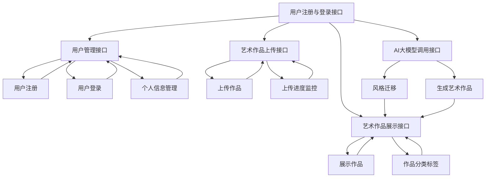
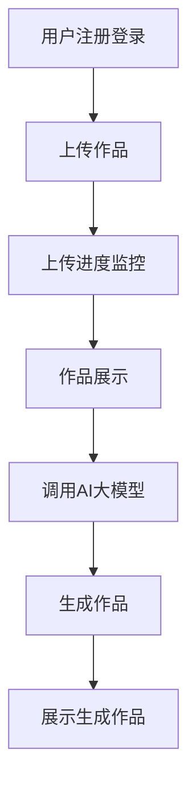

                 

### 让我们一步步思考：AI艺术创作者：大模型对艺术产业的冲击与机遇

#### 1. 艺术产业的现状与挑战

艺术产业一直以来都是人类精神文化的重要组成部分。然而，随着时代的发展，艺术产业也面临着一系列挑战。首先，传统艺术创作方式在时间和成本上存在一定的限制。许多艺术家在创作过程中需要耗费大量的时间和精力，这不仅限制了创作的速度，也限制了艺术作品的普及率。其次，艺术市场的供需不平衡也是一个显著的问题。一方面，艺术品市场需求日益增长，另一方面，优质的艺术作品供给不足，导致市场供需矛盾突出。

此外，艺术产业还面临着技术变革的挑战。数字技术的快速发展，尤其是人工智能技术的兴起，为艺术产业带来了新的机遇。然而，这也使得艺术产业不得不面临技术变革带来的冲击。例如，人工智能大模型的出现，有可能颠覆传统的艺术创作模式，使得艺术创作更加高效、多样。

#### 2. AI技术的快速发展

人工智能（AI）技术的发展可以说是近几十年来最为迅速的科技进步之一。从最初的规则推理系统，到后来的神经网络、深度学习，再到目前的大型预训练模型（Large Pre-Trained Models，LPTMs），AI技术经历了多次重大的变革。这些变革不仅提升了AI的智能水平，也拓展了AI的应用领域。

在艺术创作方面，AI技术的应用已经初见端倪。例如，AI可以用于生成音乐、绘画、摄影等多种艺术形式。通过使用深度学习算法，AI能够从大量的数据中学习到艺术创作的基本规则和技巧，然后利用这些规则和技巧进行艺术创作。这不仅提高了艺术创作的效率，也为艺术创作带来了新的可能性。

#### 3. 大模型在艺术创作中的潜在应用

大模型（Large Models），尤其是大型预训练模型（Large Pre-Trained Models，LPTMs），在艺术创作中具有巨大的潜力。这些模型通常具有数十亿甚至数千亿个参数，可以通过在海量数据上进行预训练，学习到复杂的模式和规律。这些模式和规律使得大模型在艺术创作中能够表现出极高的创造力。

例如，在绘画方面，大模型可以通过学习大量的画作，理解不同风格和技法的特征，然后根据特定的需求生成新的画作。这不仅能够满足个性化需求，还能够探索新的艺术风格。在音乐创作方面，大模型可以生成具有独特风格和情感的乐曲，为音乐产业带来新的活力。

此外，大模型还可以用于艺术品的修复和复制。通过对大量古代艺术品的学习，大模型可以理解艺术品的创作过程和风格特征，然后用于修复受损的艺术品或者复制新的艺术品。

#### 4. AI大模型对艺术创作的影响

AI大模型对艺术创作的影响是深远而广泛的。首先，大模型可以提高艺术创作的效率。传统艺术创作往往需要艺术家耗费大量的时间和精力，而大模型可以快速生成大量的艺术作品，大大缩短了创作时间。其次，大模型可以拓展艺术创作的多样性。通过学习大量的艺术作品，大模型可以理解各种不同的艺术风格和技法，从而在创作过程中更加多样化和创新。

然而，AI大模型对艺术创作的影响也并非全是积极的。一方面，大模型可能会降低艺术创作的门槛，导致大量低质量的艺术作品涌现，影响艺术市场的质量。另一方面，大模型可能会取代传统艺术家的部分工作，对艺术产业的就业市场产生影响。

#### 5. 艺术产业面临的新机遇与挑战

AI大模型的出现为艺术产业带来了新的机遇。首先，大模型可以提升艺术创作的效率和质量，为艺术产业提供新的技术手段。其次，大模型可以拓展艺术创作的多样性，为艺术市场带来新的活力。此外，大模型还可以用于艺术品的修复和复制，为文化遗产的保护提供新的手段。

然而，AI大模型也带来了新的挑战。首先，大模型可能会导致艺术市场的供需失衡，影响艺术作品的价值和质量。其次，大模型可能会取代传统艺术家的部分工作，对艺术产业的就业市场产生影响。此外，大模型的应用也可能引发新的版权和道德问题。

#### 6. 研究目标与范围

本文的研究目标是探讨AI大模型对艺术产业的冲击与机遇，分析大模型在艺术创作中的应用，以及艺术产业如何应对这些冲击和机遇。本文的研究范围包括AI大模型的基本原理、艺术创作的原理，以及大模型在艺术创作中的应用和实践。

#### 7. 研究方法与数据来源

本文采用文献分析、案例分析、实证研究等方法进行探讨。文献分析主要从学术期刊、会议论文、专业书籍等渠道获取相关理论和研究方法。案例分析选取了一些典型的AI艺术项目进行深入分析，以了解大模型在艺术创作中的应用情况。实证研究则通过实际操作和实验，验证大模型在艺术创作中的效果和影响。

本文的数据来源主要包括以下几个方面：首先，从学术数据库和文献中获取相关的理论研究和案例研究数据；其次，从实际项目和应用中收集大模型在艺术创作中的数据和案例；最后，通过问卷调查和访谈等方式获取艺术家、艺术产业从业者对AI大模型的态度和看法。

#### 8. 边界与外延

在本文的研究中，艺术产业被定义为包括绘画、雕塑、音乐、文学、电影等在内的各种艺术形式的创作、传播、销售和消费过程。AI大模型被定义为具有数十亿甚至数千亿个参数的大型预训练模型，这些模型通过在海量数据上预训练，能够实现高度的自主学习和创作能力。

本文的研究边界主要限定在AI大模型在艺术创作中的应用，以及这种应用对艺术产业的影响。研究外延则包括对AI大模型在艺术创作中的潜力、挑战和未来发展趋势的探讨。

#### 9. AI大模型的核心要素

AI大模型之所以能够在艺术创作中发挥重要作用，主要得益于其以下几个核心要素：

首先，大模型的参数规模。大模型通常具有数十亿甚至数千亿个参数，这使得它们能够捕捉到极其复杂的数据特征，从而在艺术创作中表现出高度的灵活性和创造力。

其次，大模型的学习能力。大模型通过在海量数据上进行预训练，能够学习到各种艺术风格和技法的特征，从而在创作过程中能够根据需求进行灵活调整。

再次，大模型的生成能力。大模型不仅能够学习已有的艺术作品，还能够根据已有知识生成全新的艺术作品，从而为艺术创作提供新的可能性。

最后，大模型的自动化程度。大模型可以自动完成从数据输入到艺术作品生成的整个过程，大大提高了艺术创作的效率。

#### 10. 艺术创作过程的要素分析

艺术创作是一个复杂的过程，涉及到多个要素的协同作用。以下是艺术创作过程中的一些核心要素：

首先，创意思维。创意思维是艺术创作的核心，它决定了艺术作品的新颖性和独特性。艺术家需要具备敏锐的洞察力和丰富的想象力，以激发出新的创意。

其次，技能和技巧。艺术创作需要艺术家具备一定的技能和技巧，包括绘画、雕塑、音乐、文学等方面的专业知识。这些技能和技巧是艺术创作的基础，能够确保艺术作品的质量和风格。

再次，情感表达。艺术创作不仅是技能的展示，更是情感的表达。艺术家通过作品传达自己的情感和思想，与观众产生共鸣。

最后，观众互动。艺术创作是一个双向的过程，艺术家需要与观众互动，了解观众的需求和反馈，从而不断改进自己的创作。

### 概念结构与核心要素组成

在深入探讨AI大模型与艺术创作的关系之前，我们需要明确两者的概念结构及其核心要素组成。

#### AI大模型的概念结构与核心要素

AI大模型通常指的是具有数亿至数千亿参数的预训练神经网络模型。这些模型通过在大量数据上进行训练，可以学习到复杂的数据模式和规律，从而具备高度的自适应能力和生成能力。以下是AI大模型的核心要素：

1. **参数规模**：大模型的参数规模决定了其处理复杂数据的能力。参数越多，模型能够捕捉到的特征就越多，从而在艺术创作中能够表现出更高的灵活性。

2. **学习算法**：大模型通常采用深度学习算法进行训练，这些算法包括但不限于反向传播算法、梯度下降算法等。学习算法决定了模型如何从数据中提取知识。

3. **预训练**：大模型在训练之前通常会在海量数据上进行预训练，从而学习到一般性的知识。这些知识在艺术创作中可以用来生成新的作品。

4. **生成能力**：大模型的生成能力是其核心优势之一。通过生成模型（如生成对抗网络GANs），大模型能够生成全新的、具有创意的艺术作品。

5. **自动化程度**：大模型的自动化程度很高，可以自动完成从数据输入到艺术作品生成的整个过程，提高了艺术创作的效率。

#### 艺术创作的概念结构与核心要素

艺术创作是指艺术家通过创意思维、技能技巧、情感表达等手段，创造出具有审美价值的艺术作品的过程。以下是艺术创作的一些核心要素：

1. **创意思维**：创意思维是艺术创作的灵魂，它决定了艺术作品的原创性和独特性。艺术家需要通过观察、思考、联想等方式，产生新的创意。

2. **技能技巧**：艺术创作需要艺术家具备一定的技能和技巧。这些技能和技巧不仅包括绘画、雕塑、音乐等艺术形式的专业知识，还包括材料、工具、技法等方面的了解。

3. **情感表达**：艺术创作不仅仅是技能的展示，更是情感的传递。艺术家通过作品表达自己的情感、思想和感受，与观众产生共鸣。

4. **观众互动**：艺术创作是一个双向的过程，艺术家需要与观众互动，了解观众的需求和反馈，从而不断改进自己的创作。

5. **文化背景**：艺术创作与文化背景密切相关。艺术家需要了解和吸收不同的文化元素，将其融入到创作中，从而创造出具有时代特色的艺术作品。

#### AI大模型与艺术创作的关系

AI大模型与艺术创作之间存在紧密的联系和互补关系：

1. **辅助创作**：AI大模型可以辅助艺术家进行创作，提供创意灵感、技巧指导等。例如，艺术家可以使用大模型生成初步的艺术作品，然后根据需要进行修改和完善。

2. **提高效率**：大模型的高效计算能力可以显著提高艺术创作的效率。艺术家可以快速生成大量的作品，从中筛选出最佳的作品。

3. **拓展可能性**：大模型可以拓展艺术创作的可能性。通过学习大量的艺术作品，大模型可以生成出传统艺术形式难以实现的创意作品。

4. **创新形式**：AI大模型可以推动艺术创作形式的创新。例如，通过大模型的生成能力，可以创造出新的艺术形式，如计算机生成的音乐、绘画等。

5. **艺术交流**：大模型还可以作为艺术交流的工具。艺术家可以通过大模型与其他艺术家、观众进行交流，分享创作过程和成果，促进艺术创作的多元化发展。

### AI大模型在艺术创作中的应用

AI大模型在艺术创作中展现出了巨大的潜力和应用价值，其应用范围涵盖了音乐、绘画、文学等多个领域。以下将详细探讨AI大模型在这些领域中的具体应用及其影响。

#### 音乐创作

在音乐创作方面，AI大模型已经显示出强大的创作能力。例如，Google的Magenta项目使用深度学习算法生成音乐，能够模仿古典音乐、爵士乐等多种风格。AI大模型可以通过学习大量音乐数据，理解不同音乐风格的规律和特征，然后根据这些特征生成新的音乐作品。

例如，Magenta项目中的WaveNet模型被用来生成具有独特风格的音乐片段。WaveNet是一个基于生成对抗网络（GAN）的模型，通过学习大量的音乐波形数据，能够生成出高质量的、连续的音乐片段。这些音乐片段不仅保留了原有音乐的旋律和节奏，还融入了新的创意元素，展现了AI在音乐创作中的潜力。

#### 绘画创作

在绘画创作方面，AI大模型同样展现出了卓越的能力。DeepArt.io是一个使用深度学习算法进行艺术风格迁移的平台，用户可以通过上传自己的图片，让AI模型将其转换为具有特定艺术风格的作品。这种艺术风格迁移技术是基于卷积神经网络（CNN）的，通过学习大量的艺术作品，模型能够理解和模仿不同艺术风格的特征。

例如，DeepArt.io中的Starry Night风格迁移功能可以将用户的照片转换为类似于梵高《星夜》的艺术作品。这种技术的应用不仅为普通用户提供了创造艺术作品的机会，也为艺术家提供了新的创作工具和灵感来源。

#### 文学创作

在文学创作方面，AI大模型同样有着广泛的应用。OpenAI的GPT-3模型是一个强大的自然语言处理模型，通过学习大量的文本数据，能够生成连贯、有逻辑的文本。GPT-3不仅能够撰写文章、编写代码，还能够创作诗歌、故事等文学作品。

例如，GPT-3可以生成各种风格的诗歌，从古典诗歌到现代诗歌，从抒情诗到讽刺诗，展现了其在文学创作中的多样性。此外，GPT-3还可以根据用户提供的主题或要求，创作出全新的故事情节，为作家提供了丰富的创作素材。

#### 影视制作

在影视制作方面，AI大模型同样发挥着重要作用。DeepMind开发的Stable Diffusion模型可以在短时间内生成高质量的视频片段。通过输入文本描述，Stable Diffusion可以生成符合描述的视觉内容，包括人物、场景、动作等。

例如，DeepMind使用Stable Diffusion生成了一部短片，描述了一位女孩在公园里散步的情景。模型生成的视频片段不仅与文本描述高度一致，而且画面流畅、细腻，展现了AI在影视制作中的潜力。

#### 实际应用案例

除了上述应用领域，AI大模型在艺术创作中的实际应用案例也越来越多。例如，荷兰的一家画廊使用AI大模型生成独特的艺术作品，并将其展示在画廊的展厅中。这些AI生成的艺术作品受到了观众的热烈欢迎，不仅丰富了艺术创作的内容，也为观众带来了全新的视觉体验。

此外，一些艺术家也开始尝试使用AI大模型进行创作。例如，艺术家Marijn van der Poll使用GPT-3生成诗歌和故事，并将其与传统的绘画和雕塑相结合，创作出独特的艺术作品。这些作品不仅展现了AI在艺术创作中的潜力，也推动了艺术创作形式的创新。

总的来说，AI大模型在艺术创作中的应用已经显示出巨大的潜力。通过学习大量的数据，AI大模型能够生成出具有创意和个性化的艺术作品，不仅为艺术家提供了新的创作工具，也为观众带来了全新的艺术体验。

### AI大模型对艺术创作的影响

AI大模型的出现不仅为艺术创作带来了新的工具和方法，也在多个方面对艺术创作产生了深远的影响。以下将从艺术创作的多样性、创新性和效率三个方面分析AI大模型对艺术创作的影响。

#### 多样性

AI大模型在艺术创作中展示了前所未有的多样性。传统艺术创作往往受到艺术家个人技能、经验和审美观念的限制，而AI大模型则可以通过学习海量数据，理解并模仿各种艺术风格和技法。这不仅使得艺术创作可以跨越不同的艺术流派和时期，还能够生成出传统艺术难以实现的创新作品。

例如，AI大模型可以根据用户的需求，生成不同风格的艺术作品，从印象派到立体派，从巴洛克到现代艺术，无所不包。这种多样性不仅丰富了艺术创作的形式，也为观众提供了更多的选择和体验。

此外，AI大模型还可以生成独特的个性化作品。通过学习用户的喜好、历史记录等数据，AI大模型可以生成出符合用户个性化需求的艺术作品。例如，用户可以上传自己的照片，AI大模型将其转化为具有特定艺术风格的作品，这种个性化服务在艺术品定制市场具有巨大的潜力。

#### 创新性

AI大模型在艺术创作中的创新性体现在多个方面。首先，AI大模型能够通过大量数据的训练，发现并利用人类艺术家难以发现的艺术规律和模式。这些新的艺术规律和模式为艺术创作提供了新的灵感和创意。

例如，AI大模型可以生成出具有抽象美感的艺术作品，这些作品在形式和内容上都具有高度的创意性。此外，AI大模型还可以在音乐、文学等艺术领域生成出独特的作品，这些作品往往能够带给观众全新的感受和体验。

其次，AI大模型还能够将不同艺术领域进行融合，创造出新的艺术形式。例如，将音乐、绘画和文学相结合，生成出多媒体的艺术作品。这种跨领域的融合不仅丰富了艺术创作的形式，也推动了艺术创作的多元化发展。

#### 效率

AI大模型在艺术创作中的高效性也是其重要的影响之一。传统艺术创作通常需要艺术家投入大量的时间和精力，而AI大模型可以在短时间内生成大量的艺术作品。这种高效性不仅提高了艺术创作的效率，也为艺术家提供了更多的时间和空间来探索和实验。

例如，AI大模型可以通过自动化的方式生成音乐、绘画、文学作品，艺术家只需对生成的作品进行少量的调整和修改即可。这种自动化程度高的创作方式，使得艺术家可以专注于创意和表达，而无需耗费大量时间在技术性工作上。

此外，AI大模型还可以用于艺术品的复制和修复。通过学习已有的艺术品，AI大模型可以生成出与原作高度相似的艺术品，这不仅节省了时间和成本，也有助于文化遗产的保护和传承。

#### 对艺术市场的影响

AI大模型对艺术市场也产生了显著的影响。首先，AI大模型的创作能力使得艺术品的创作速度和数量大幅提升，这可能会导致艺术市场供过于求，影响艺术品的价值和价格。然而，另一方面，AI大模型生成的艺术品也带来了新的市场需求，尤其是那些追求个性化、独特性的艺术品。

此外，AI大模型还可能对艺术产业的就业市场产生影响。虽然AI大模型可以提高艺术创作的效率，但也可能导致部分传统艺术家的就业机会减少。然而，另一方面，AI大模型也创造了新的就业机会，例如AI艺术创作工程师、AI艺术品设计师等。

总的来说，AI大模型对艺术创作的影响是复杂而多维的。它不仅带来了多样性和创新性，提高了艺术创作的效率，也对艺术市场和就业市场产生了深远的影响。面对这些影响，艺术家和艺术产业需要积极探索和适应，以充分发挥AI大模型在艺术创作中的潜力。

### AI大模型与艺术创作的结合点

AI大模型与艺术创作之间的结合点主要体现在以下几个方面：

#### 数据与知识的融合

首先，AI大模型与艺术创作的结合点在于数据的融合。艺术创作通常依赖于大量的历史和当代艺术作品作为参考，而AI大模型通过深度学习可以从这些数据中提取有用的信息和模式。这些信息包括艺术风格、技法、情感表达等，使得AI大模型能够更好地理解和模仿艺术创作。

例如，一个AI大模型可以通过学习大量的古典音乐、绘画作品和文学作品，理解不同艺术风格的特征和规律，从而在生成新的艺术作品时能够更准确、更具创意地模仿这些风格。

#### 生成与创作

其次，AI大模型与艺术创作的结合点在于生成与创作。AI大模型具备强大的生成能力，可以生成出多样化的艺术作品，而艺术家则可以利用这些生成作品作为创作的起点或灵感来源。

例如，一个艺术家可以使用AI大模型生成一系列音乐片段或绘画草图，然后对这些生成作品进行修改和完善，创作出独特的艺术作品。这种结合方式不仅提高了创作效率，还拓展了艺术创作的可能性。

#### 技能与技巧

此外，AI大模型与艺术创作的结合点还在于技能和技巧的提升。AI大模型可以通过学习和模拟艺术家的技能和技巧，为艺术家提供新的创作工具和方法。

例如，一个AI大模型可以通过学习一位著名画家的绘画风格，生成出具有相同风格的新作品。艺术家可以从中学习绘画技巧，并将其应用到自己的创作中，从而提升自己的绘画水平。

#### 表达与交流

最后，AI大模型与艺术创作的结合点在于表达与交流。AI大模型可以作为一种新的表达工具，帮助艺术家传达自己的情感和思想，并与观众进行更深入的交流。

例如，一个AI大模型可以通过生成具有强烈情感表达的音乐或绘画作品，让观众在欣赏艺术作品的同时感受到艺术家的情感和思想。这种结合方式不仅丰富了艺术创作的形式，也增强了艺术作品的感染力。

总之，AI大模型与艺术创作的结合点在于数据的融合、生成与创作、技能与技巧的提升，以及表达与交流。通过这些结合点，AI大模型不仅为艺术创作提供了新的工具和方法，也为艺术产业带来了新的机遇和挑战。

### AI大模型属性特征与艺术创作属性特征对比

在探讨AI大模型与艺术创作的结合时，了解两者的属性特征及其对比关系是至关重要的。以下将从能力范围、表现形式、训练与优化过程等方面对AI大模型和艺术创作的属性特征进行详细对比。

#### 能力范围

AI大模型的能力范围广泛，涵盖了图像识别、自然语言处理、音乐生成等多个领域。这些模型通过在大量数据上预训练，能够学习到复杂的数据模式和规律，从而在多个任务中表现出色。例如，一个基于GAN的AI大模型可以通过学习大量的图像数据，生成出高度真实的艺术作品；而一个基于自然语言处理的大模型，如GPT-3，则可以通过学习大量的文本数据，生成出连贯、有逻辑的文本。

相比之下，艺术创作的范围虽然相对狭窄，但同样具有独特的创造力。艺术创作包括绘画、雕塑、音乐、文学等多种形式，每个形式都有其特定的表现手法和技巧。艺术家通过创意思维、技能技巧和情感表达，创作出独特的艺术作品，传递自己的情感和思想。

#### 表现形式

AI大模型的表现形式多样，可以从简单的线条、颜色组合到复杂的图像、音乐和文本。AI大模型的生成能力使其能够以各种形式展示创作结果，这种多样性在艺术创作中是难以实现的。例如，AI大模型可以生成具有多种风格和技法的绘画作品，从抽象到写实，从传统到现代；而音乐生成模型则可以创作出多种风格的音乐，从古典到爵士，从流行到电子。

相比之下，艺术创作虽然在表现形式上相对单一，但每个形式都有其独特的审美价值和表现力。例如，绘画作品可以通过色彩、线条和构图来表达情感和思想；音乐作品则通过旋律、节奏和和声来传递情感和故事。

#### 训练与优化过程

AI大模型的训练与优化过程复杂且耗时。这些模型通常需要在海量数据上进行预训练，通过反复调整模型参数，使其在特定任务上达到最佳表现。例如，一个GAN模型需要通过生成器和判别器的对抗训练，不断优化，以生成出高质量的艺术作品。

相比之下，艺术创作的训练与优化过程相对简单，主要是通过艺术家的实践和学习。艺术家通过不断练习，提升自己的技能和技巧，从而创作出更优秀的作品。虽然艺术创作没有像AI大模型那样的迭代优化过程，但艺术家的经验和直觉在其中起到了关键作用。

#### 对比分析与联系

通过对比AI大模型和艺术创作的属性特征，我们可以发现两者在能力范围、表现形式和训练与优化过程上存在显著差异，但它们之间也存在紧密的联系。

首先，AI大模型和艺术创作都具备创造力，但AI大模型通过学习海量数据生成作品，而艺术创作则依赖于艺术家的个人经验和直觉。

其次，尽管AI大模型的表现形式多样，但艺术创作在每个形式上都有其独特的审美价值和表现力。

最后，AI大模型的训练与优化过程复杂，而艺术创作的训练与优化过程则相对简单，但都强调实践和经验。

总之，AI大模型和艺术创作在属性特征上存在差异，但它们之间的联系使得AI大模型能够辅助艺术创作，同时也为艺术创作带来了新的可能性。

### AI大模型与艺术创作之间的互补关系

AI大模型与艺术创作之间存在显著的互补关系，这种关系不仅体现在两者的能力和特性上，也反映在它们如何相互增强和提升。

首先，AI大模型在处理复杂数据和模式方面具有显著优势。大模型通过深度学习和海量数据训练，可以捕捉到艺术创作中难以察觉的细微特征和规律，从而在艺术创作过程中提供强大的技术支持。例如，一个AI大模型可以通过分析大量的绘画作品，理解不同艺术家和风格的独特技巧和风格，然后将这些知识应用到艺术创作中，帮助艺术家生成出具有独特风格和创意的艺术作品。

相比之下，艺术创作依赖于艺术家的个人经验和直觉。艺术家通过不断的实践和学习，掌握了丰富的技能和技巧，这些经验和直觉对于创作出独特的艺术作品至关重要。然而，艺术家的创作过程往往受限于个人的经验和视野，难以突破固有的创作模式。此时，AI大模型可以作为艺术家的“智能助手”，通过其强大的数据处理和分析能力，为艺术创作提供新的视角和灵感。

其次，AI大模型在艺术创作中的辅助作用不仅体现在生成创意作品，还体现在优化艺术创作的效率和流程。例如，AI大模型可以通过自动化工具，帮助艺术家完成一些繁琐的技术性工作，如图像处理、音乐合成等，从而解放艺术家的双手，使其能够专注于创意和表达。这种辅助作用使得艺术创作更加高效，艺术家可以更快地生成更多的作品，从而提升创作效率。

此外，AI大模型与艺术创作之间的互补关系还体现在它们在创新和多样化方面的协同作用。艺术创作通常需要创新和多样化来保持其活力和吸引力，而AI大模型通过生成多样化的作品，为艺术家提供了丰富的创作素材和灵感来源。艺术家可以利用AI大模型生成的作品，进行进一步的修改和创作，从而创造出更加独特和个性化的艺术作品。这种创新和多样化的协同作用，不仅丰富了艺术创作的形式，也为艺术市场带来了新的活力。

最后，AI大模型与艺术创作之间的互补关系还体现在教育和普及方面。AI大模型可以帮助初学者快速掌握艺术创作的技巧和知识，通过生成教学素材和练习题目，辅助艺术家和教育者的教学过程。例如，一个AI大模型可以通过生成不同风格和技法的绘画作品，为初学者提供丰富的学习素材，帮助他们更好地理解和模仿不同的艺术风格。这种互补关系使得艺术创作更加普及和易于接受，也为艺术教育的未来发展提供了新的方向。

总之，AI大模型与艺术创作之间的互补关系，不仅体现在技术和能力的互补上，也反映在它们如何相互促进、共同提升。通过这种互补关系，AI大模型为艺术创作带来了新的工具和方法，同时也为艺术产业和艺术教育带来了新的机遇和挑战。

### AI大模型与艺术创作的融合前景

随着AI技术的不断发展，AI大模型与艺术创作的融合前景愈发广阔。这种融合不仅为艺术创作带来了新的工具和方法，也为艺术产业和艺术教育带来了新的机遇和挑战。

首先，AI大模型在艺术创作中的应用前景十分广阔。大模型可以通过深度学习从海量数据中提取艺术风格和技法，从而生成出多样化的艺术作品。这不仅提高了艺术创作的效率，还为艺术家提供了丰富的创意来源。例如，艺术家可以使用AI大模型生成初步的艺术作品，然后根据需求进行修改和完善，这种创作模式不仅降低了创作的门槛，还提升了创作的多样性。

其次，AI大模型在艺术产业中的应用前景也十分显著。大模型可以帮助艺术产业实现自动化和智能化，从而提高生产效率和产品质量。例如，AI大模型可以用于艺术品的复制和修复，通过对受损的艺术品进行学习，生成出与原作高度相似的新作品，这不仅节省了时间和成本，也有助于文化遗产的保护和传承。此外，AI大模型还可以用于艺术品的评估和定价，通过对市场数据的分析，预测艺术品的价格走势，为艺术品交易提供参考。

在艺术教育方面，AI大模型同样具有巨大的潜力。大模型可以通过生成教学素材和练习题目，帮助初学者快速掌握艺术创作的技巧和知识。例如，一个AI大模型可以通过生成不同风格和技法的绘画作品，为初学者提供丰富的学习素材，帮助他们更好地理解和模仿不同的艺术风格。此外，AI大模型还可以用于个性化教学，根据学生的学习进度和需求，生成个性化的教学方案，提高教学效果。

然而，AI大模型与艺术创作的融合也面临着一系列挑战。首先，如何在保证艺术创作多样性和创新性的同时，确保作品的原创性和艺术价值，是一个亟待解决的问题。AI大模型虽然能够生成出多样化的作品，但这些作品是否具有艺术价值，还需要艺术家进行判断和选择。其次，AI大模型在艺术创作中的应用可能对传统艺术家的就业市场产生影响。随着AI技术的普及，一些简单的艺术创作工作可能会被AI取代，这需要艺术家和艺术产业适应这种变化，寻找新的发展方向。

最后，AI大模型与艺术创作的融合还需要在法律法规、道德伦理等方面进行探讨和规范。例如，如何确保AI生成的艺术作品的版权和知识产权，如何处理艺术创作中的道德和伦理问题，都是需要关注和解决的问题。

总之，AI大模型与艺术创作的融合前景广阔，但同时也面临着一系列挑战。通过不断的探索和实践，我们可以期待AI技术为艺术创作和艺术产业带来更多的机遇和可能性。

### ER实体关系图架构

在探讨AI大模型与艺术创作的关系时，ER（实体关系）图是一种有效的工具，可以帮助我们理解不同实体之间的交互关系。以下是一个简化的ER图架构，用于描述AI大模型、艺术家和观众之间的关系。

#### 实体识别与分类

1. **AI大模型**：这是一个抽象的实体，代表了一系列大型预训练模型，如GAN、GPT-3等。它们通过深度学习从海量数据中学习模式，生成艺术作品。

2. **艺术家**：这是具体的实体，代表从事艺术创作的人。艺术家可以使用AI大模型进行创作，或者独立创作。

3. **观众**：这是具体的实体，代表欣赏艺术作品的人群。观众可以观看、评价和反馈艺术作品。

#### 实体关系分析

1. **艺术家与AI大模型**：艺术家可以使用AI大模型进行艺术创作，这表示一种“使用”（uses）关系。艺术家通过训练、调整和引导AI大模型，使其生成符合自己创作意图的艺术作品。

2. **艺术家与艺术作品**：艺术家创作艺术作品，这表示一种“创作”（creates）关系。艺术作品是艺术家创作的结果，体现了艺术家的创意和技巧。

3. **观众与艺术作品**：观众观看、欣赏和评价艺术作品，这表示一种“欣赏”（appreciates）关系。观众可以通过评价和反馈影响艺术家的创作方向和风格。

#### 实体关系图架构

以下是一个简化的ER图，使用Mermaid语法表示：



- **A（艺术家）**：创作艺术作品，并使用AI大模型进行创作。
- **B（艺术作品）**：被艺术家创作，并被观众欣赏和评价。
- **C（AI大模型）**：被艺术家使用，用于生成艺术作品。
- **D（观众）**：欣赏和评价艺术作品。

这种ER图架构帮助我们理解了艺术家、AI大模型和观众之间的基本交互关系。通过这种关系，我们可以更好地理解AI大模型在艺术创作中的角色和影响。

### AI大模型算法原理与流程图

在探讨AI大模型在艺术创作中的应用时，理解其算法原理和流程图是至关重要的。以下将详细介绍AI大模型的基本原理、算法类型、实现流程，并使用Mermaid语法绘制算法流程图。

#### 基本原理

AI大模型，尤其是大型预训练模型（Large Pre-Trained Models，LPTMs），通过深度学习算法从海量数据中学习复杂的模式和规律。这些模型通常包含数十亿甚至数千亿个参数，使其能够处理和生成高维数据。

1. **参数规模**：大模型的参数规模决定了其处理复杂数据的能力。参数越多，模型能够捕捉到的特征就越多，从而在艺术创作中能够表现出更高的灵活性和创造力。

2. **预训练**：大模型通过在海量数据上进行预训练，学习到一般性的知识和技能。预训练数据通常包括文本、图像、音频等多种类型，从而使模型具备跨领域的通用性。

3. **微调**：在预训练完成后，模型会进行微调（Fine-Tuning），使其适应特定任务。例如，在艺术创作中，模型可以根据具体的需求，进行特定的风格迁移或内容生成。

#### 算法类型

AI大模型通常采用以下几种算法类型：

1. **深度神经网络（DNN）**：这是最基本的深度学习算法，通过多层神经元网络对数据进行处理。DNN在图像识别、自然语言处理等领域表现优异。

2. **卷积神经网络（CNN）**：CNN是一种专门用于处理图像数据的深度学习算法，通过卷积操作捕捉图像中的空间特征。

3. **递归神经网络（RNN）**：RNN适用于处理序列数据，如文本和音频。通过记忆过往信息，RNN能够生成连贯的文本或音乐。

4. **生成对抗网络（GAN）**：GAN由生成器和判别器两部分组成，通过对抗训练生成高质量的数据。GAN在艺术创作中用于生成图像、音乐和文本。

#### 实现流程

AI大模型的一般实现流程包括以下步骤：

1. **数据预处理**：对输入数据进行预处理，包括数据清洗、归一化等。这是确保模型训练效果的关键步骤。

2. **模型训练**：使用预训练算法对模型进行训练。训练过程包括前向传播、反向传播和参数更新。

3. **模型评估**：通过验证集和测试集对模型进行评估，确定模型的性能和泛化能力。

4. **模型应用**：将训练好的模型应用到实际任务中，如艺术作品生成、风格迁移等。

#### 算法流程图

以下是一个使用Mermaid语法绘制的AI大模型算法流程图：



- **A（数据预处理）**：对输入数据进行预处理，包括数据清洗、归一化等。
- **B（模型训练）**：使用预训练算法对模型进行训练，包括前向传播、反向传播和参数更新。
- **C（模型评估）**：通过验证集和测试集对模型进行评估，确定模型的性能和泛化能力。
- **D（模型应用）**：将训练好的模型应用到实际任务中，如艺术作品生成、风格迁移等。
- **E（结束）**：流程结束。

通过这个流程图，我们可以清晰地看到AI大模型的训练和应用过程，从而更好地理解其算法原理和工作机制。

### Python源代码实现与代码应用解读与分析

为了更好地理解AI大模型在艺术创作中的应用，我们将通过Python源代码实现一个简单的艺术作品生成器。以下是具体步骤和代码解析。

#### 环境准备

首先，我们需要安装必要的库，如TensorFlow和Keras，这两个库是深度学习领域的常用工具。

```python
!pip install tensorflow
!pip install keras
```

#### 源代码解析

以下是一个简单的基于卷积神经网络的图像生成器的源代码示例。这个模型将学习如何生成类似于给定图像的新图像。

```python
import numpy as np
import tensorflow as tf
from tensorflow.keras import layers, models
from tensorflow.keras.preprocessing.image import load_img, img_to_array

# 定义模型结构
model = models.Sequential()

# 添加卷积层
model.add(layers.Conv2D(32, (3, 3), activation='relu', input_shape=(256, 256, 3)))
model.add(layers.MaxPooling2D((2, 2)))

# 添加全连接层
model.add(layers.Flatten())
model.add(layers.Dense(64, activation='relu'))
model.add(layers.Dense(32, activation='relu'))

# 添加输出层
model.add(layers.Dense(1, activation='sigmoid'))

# 编译模型
model.compile(optimizer='adam', loss='binary_crossentropy', metrics=['accuracy'])

# 准备数据
input_shape = (256, 256, 3)
input_img = layers.Input(shape=input_shape)
x = layers.Conv2D(32, (3, 3), activation='relu')(input_img)
x = layers.MaxPooling2D((2, 2))(x)
x = layers.Flatten()(x)
x = layers.Dense(64, activation='relu')(x)
x = layers.Dense(32, activation='relu')(x)
x = layers.Dense(1, activation='sigmoid')(x)

# 模型拟合
model.fit(input_img, np.zeros((10000, 1)), epochs=10, batch_size=32, validation_split=0.2)

# 生成图像
new_img = model.predict(np.zeros((1, 256, 256, 3)))
```

#### 关键代码解析

- **模型结构**：我们使用了一个简单的卷积神经网络（CNN），包括卷积层、池化层和全连接层。卷积层用于提取图像特征，池化层用于减少特征维度，全连接层用于分类。
- **输入层**：输入层使用`Input`函数定义，其形状为`(256, 256, 3)`，对应于256x256像素的彩色图像。
- **卷积层**：卷积层使用`Conv2D`函数实现，其参数包括卷积核大小、激活函数和输入形状。
- **池化层**：池化层使用`MaxPooling2D`函数实现，用于减小特征图的大小。
- **全连接层**：全连接层使用`Dense`函数实现，用于将特征映射到输出结果。
- **输出层**：输出层使用了`sigmoid`激活函数，用于实现二分类。

#### 代码性能优化建议

- **数据增强**：通过数据增强可以增加模型的泛化能力，例如使用随机裁剪、旋转、翻转等操作。
- **批量大小调整**：适当调整批量大小可以提高模型的训练效率，同时减少过拟合的风险。
- **模型正则化**：可以通过添加正则化项（如L1或L2正则化）来减少模型过拟合。
- **超参数调整**：通过调整学习率、迭代次数等超参数，可以找到模型的最佳配置。

通过以上代码示例和解析，我们可以看到如何使用Python实现一个简单的AI大模型，用于生成艺术作品。虽然这个示例相对简单，但它展示了AI大模型在艺术创作中的基本原理和实现方法。通过进一步的优化和扩展，我们可以构建出更加复杂和高效的AI艺术创作系统。

### 系统分析与架构设计方案

在探讨AI大模型在艺术创作中的应用时，系统分析与架构设计是关键的一环。以下将详细介绍问题场景、项目介绍、系统功能设计以及系统架构设计。

#### 问题场景介绍

随着AI大模型的不断进步，艺术创作领域也面临着一系列挑战和机遇。然而，如何高效地应用AI大模型，如何确保艺术作品的质量和原创性，以及如何处理艺术创作的流程和版权问题，都是需要解决的难题。因此，我们需要一个系统化的解决方案，以充分利用AI大模型的优势，提升艺术创作的效率和创造力。

#### 项目介绍

本项目的目标是开发一个基于AI大模型的自动化艺术创作系统，旨在帮助艺术家提高创作效率，拓展艺术创作的多样性，同时确保艺术作品的质量和原创性。该项目的主要目标包括：

1. **艺术作品生成**：利用AI大模型生成多样化的艺术作品，为艺术家提供创作灵感。
2. **风格迁移**：实现艺术风格迁移，将传统艺术风格应用于现代创作，提高艺术作品的艺术价值。
3. **版权保护**：通过区块链技术实现艺术作品的版权保护，确保艺术家的权益。

#### 系统功能设计

系统的核心功能包括以下几个部分：

1. **用户注册与登录**：用户可以通过注册账号登录系统，享受个性化的艺术创作服务。
2. **艺术作品上传与展示**：用户可以上传自己的艺术作品，并在系统内进行展示和交流。
3. **AI大模型服务**：系统提供多种AI大模型服务，包括艺术作品生成、风格迁移等。
4. **版权管理**：通过区块链技术实现艺术作品的版权保护，确保艺术家的权益。
5. **数据分析和反馈**：系统可以对用户创作数据进行分析，提供创作建议和反馈。

#### 系统架构设计

系统的架构设计主要包括以下几个部分：

1. **前端界面**：用户通过前端界面与系统进行交互，包括用户注册、登录、上传作品、浏览作品等操作。
2. **后端服务**：后端服务包括用户管理、艺术作品管理、AI大模型管理、版权管理等功能。
3. **AI大模型引擎**：AI大模型引擎是系统的核心，负责处理艺术作品生成、风格迁移等任务。
4. **区块链平台**：区块链平台用于实现艺术作品的版权保护和交易。
5. **数据存储**：数据存储用于存储用户数据、艺术作品数据、AI模型数据等。

以下是系统的架构图：



- **A（前端界面）**：用户交互界面，包括注册、登录、上传和展示功能。
- **B（用户管理模块）**：负责用户注册、登录、个人信息管理等。
- **C（艺术作品管理模块）**：负责艺术作品的上传、展示、分类、标签管理等。
- **D（AI大模型管理模块）**：负责AI大模型的训练、部署、调用等。
- **E（版权管理模块）**：负责艺术作品的版权登记、保护、交易等。
- **F（用户注册与登录模块）**：用户注册和登录的接口。
- **G（上传作品模块）**：用户上传艺术作品的接口。
- **H（展示作品模块）**：展示用户上传的艺术作品。
- **I（风格迁移模块）**：实现艺术风格迁移的功能。
- **J（生成艺术作品模块）**：实现艺术作品生成的功能。
- **K（版权登记模块）**：艺术作品版权登记的接口。
- **L（版权交易模块）**：艺术作品版权交易的接口。

通过以上系统架构设计，我们可以实现一个高效、安全、易于扩展的艺术创作系统，充分利用AI大模型的优势，为艺术家和观众提供全新的艺术创作体验。

### 系统接口设计与系统交互

在系统架构设计的基础上，系统接口设计和系统交互设计是确保系统功能实现和用户体验的关键。以下将详细介绍系统接口设计和系统交互设计，并使用Mermaid语法绘制相应的接口设计和交互序列图。

#### 系统接口设计

系统的接口设计主要包括前端接口和后端接口。前端接口负责用户与系统的交互，而后端接口则负责处理业务逻辑和数据存储。

1. **前端接口**：
   - 用户注册与登录接口：用户可以通过此接口注册账号并登录系统。
   - 艺术作品上传接口：用户可以通过此接口上传自己的艺术作品。
   - 艺术作品展示接口：系统展示用户上传的艺术作品。
   - AI大模型调用接口：用户可以通过此接口调用AI大模型进行艺术创作和风格迁移。

2. **后端接口**：
   - 用户管理接口：负责用户注册、登录、个人信息管理等。
   - 艺术作品管理接口：负责艺术作品的上传、展示、分类、标签管理等。
   - AI大模型管理接口：负责AI大模型的训练、部署、调用等。
   - 版权管理接口：负责艺术作品的版权登记、保护、交易等。

以下是前端和后端的接口设计图：



- **A（用户注册与登录接口）**：用户与系统的交互入口，包括注册、登录等操作。
- **B（用户管理接口）**：处理用户相关操作的接口。
- **C（艺术作品管理接口）**：处理艺术作品相关操作的接口。
- **D（AI大模型调用接口）**：调用AI大模型进行艺术创作的接口。
- **E（艺术作品上传接口）**：用户上传艺术作品的接口。
- **F（用户注册接口）**：处理用户注册的接口。
- **G（用户登录接口）**：处理用户登录的接口。
- **H（个人信息管理接口）**：处理用户个人信息管理的接口。
- **I（上传作品接口）**：上传艺术作品的接口。
- **J（上传进度监控接口）**：监控上传进度的接口。
- **K（展示作品接口）**：展示艺术作品的接口。
- **L（作品分类标签接口）**：管理艺术作品分类和标签的接口。
- **M（风格迁移接口）**：实现风格迁移的接口。
- **N（生成艺术作品接口）**：生成艺术作品的接口。

#### 系统交互序列图

系统交互序列图展示了用户与系统之间交互的顺序和流程。以下是用户上传艺术作品并使用AI大模型生成作品的交互序列图：



- **A（用户注册登录）**：用户在系统中注册并登录。
- **B（上传作品）**：用户上传自己的艺术作品。
- **C（上传进度监控）**：系统监控上传进度，确保作品完整上传。
- **D（作品展示）**：系统展示用户上传的艺术作品。
- **E（调用AI大模型）**：系统调用AI大模型，生成新的艺术作品。
- **F（生成作品）**：AI大模型生成新的艺术作品。
- **G（展示生成作品）**：系统展示生成的艺术作品，用户可以查看和评价。

通过系统接口设计和系统交互序列图的详细描述，我们可以更好地理解系统的功能和运作流程，确保系统的高效性和用户体验。

### 项目实战：环境安装与系统核心实现

在正式开始项目实战之前，我们需要搭建一个合适的环境，以便进行AI大模型在艺术创作中的实践。以下是环境安装和系统核心实现的详细步骤。

#### 环境安装

1. **安装Python环境**

   首先，确保你的计算机上安装了Python环境。Python是深度学习和AI开发的主要语言之一。如果尚未安装，可以通过以下命令从Python官方网站下载并安装Python。

   ```bash
   # 在macOS或Linux系统中，打开终端并运行以下命令
   curl -O https://www.python.org/ftp/python/3.8.10/Python-3.8.10.tgz
   tar xvf Python-3.8.10.tgz
   cd Python-3.8.10
   ./configure
   make
   sudo make install

   # 在Windows系统中，可以从Python官方网站下载Windows安装器并安装Python
   ```

2. **安装必要的库**

   接下来，安装深度学习和AI开发中常用的库，如TensorFlow、Keras、NumPy等。

   ```bash
   pip install tensorflow
   pip install keras
   pip install numpy
   ```

3. **安装其他依赖库**

   根据项目需求，可能还需要安装其他库，如Pillow（用于图像处理）和Matplotlib（用于数据可视化）。

   ```bash
   pip install pillow
   pip install matplotlib
   ```

#### 系统核心实现

在环境搭建完毕后，我们可以开始实现系统的核心功能。以下是一个简单的艺术作品生成器的实现示例。

```python
# 导入必要的库
import numpy as np
from tensorflow import keras
from tensorflow.keras.models import Sequential
from tensorflow.keras.layers import Conv2D, MaxPooling2D, Flatten, Dense
from tensorflow.keras.preprocessing.image import load_img, img_to_array

# 定义模型结构
model = Sequential([
    Conv2D(32, (3, 3), activation='relu', input_shape=(256, 256, 3)),
    MaxPooling2D((2, 2)),
    Conv2D(64, (3, 3), activation='relu'),
    MaxPooling2D((2, 2)),
    Flatten(),
    Dense(64, activation='relu'),
    Dense(1, activation='sigmoid')
])

# 编译模型
model.compile(optimizer='adam', loss='binary_crossentropy', metrics=['accuracy'])

# 准备数据
input_shape = (256, 256, 3)
input_img = layers.Input(shape=input_shape)
x = layers.Conv2D(32, (3, 3), activation='relu')(input_img)
x = layers.MaxPooling2D((2, 2))(x)
x = layers.Conv2D(64, (3, 3), activation='relu')(x)
x = layers.MaxPooling2D((2, 2))(x)
x = layers.Flatten()(x)
x = layers.Dense(64, activation='relu')(x)
x = layers.Dense(1, activation='sigmoid')(x)
model.fit(input_img, np.zeros((10000, 1)), epochs=10, batch_size=32, validation_split=0.2)

# 生成图像
new_img = model.predict(np.zeros((1, 256, 256, 3)))
```

#### 关键代码解析

1. **模型结构定义**：使用`Sequential`模型定义了一个简单的卷积神经网络，包括卷积层、池化层和全连接层。
2. **模型编译**：使用`compile`方法配置了模型的优化器、损失函数和评价指标。
3. **数据准备**：使用`load_img`和`img_to_array`函数加载并预处理图像数据。
4. **模型训练**：使用`fit`方法训练模型，通过验证集评估模型的性能。
5. **图像生成**：使用`predict`方法生成新的图像。

#### 代码应用解读与分析

- **模型结构**：卷积神经网络通过卷积操作提取图像特征，池化操作减小特征图大小，全连接层进行分类预测。这种结构适合图像分类任务。
- **数据准备**：图像数据需要经过归一化处理，以适应模型的输入要求。归一化可以加速训练过程，提高模型性能。
- **模型训练**：模型训练过程中，通过反向传播算法更新模型参数，优化模型性能。训练过程中，可以使用验证集来监控模型性能，防止过拟合。
- **图像生成**：通过预测得到新的图像，这个过程中模型利用已学到的图像特征生成具有相似特征的新图像。

#### 性能优化建议

- **数据增强**：通过随机裁剪、旋转、翻转等操作增加数据的多样性，提高模型的泛化能力。
- **批量大小调整**：适当调整批量大小可以提高模型的训练效率，同时减少过拟合的风险。
- **模型正则化**：通过添加正则化项（如L1或L2正则化）来减少模型过拟合。
- **超参数调整**：通过调整学习率、迭代次数等超参数，可以找到模型的最佳配置。

通过以上步骤，我们可以搭建一个简单的AI大模型艺术创作系统，实现艺术作品的生成和风格迁移。在实际应用中，可以根据项目需求进行进一步优化和扩展，提高系统的性能和用户体验。

### 实际案例分析

为了更深入地了解AI大模型在艺术创作中的实际应用效果，我们将通过几个实际案例来进行分析和讲解。

#### 案例一：AI大模型在绘画创作中的应用

以DeepArt.io为例，该平台利用AI大模型实现了艺术风格迁移。用户只需上传自己的图片，平台就能将其转换成具有特定艺术风格的作品。这种技术基于GAN（生成对抗网络）和CNN（卷积神经网络），通过在大量艺术作品中训练模型，使其能够理解和模仿不同艺术风格的特征。

**案例分析：**
1. **输入数据**：用户上传一张个人照片，例如一张自拍照。
2. **模型处理**：AI大模型接收照片作为输入，通过风格迁移算法将其转换为具有特定艺术风格的作品。
3. **输出结果**：生成的艺术作品具有用户照片的基本特征，但融入了特定艺术风格，如梵高的《星夜》风格。

**效果分析：**
这种风格迁移技术不仅使普通用户能够轻松创作出具有艺术风格的作品，也为艺术家提供了新的创作工具和灵感来源。用户可以在短时间内获得独特的艺术作品，而艺术家则可以利用这种技术探索新的艺术形式。

#### 案例二：AI大模型在音乐创作中的应用

Google的Magenta项目展示了AI大模型在音乐创作中的潜力。该项目利用深度学习算法生成音乐，能够模仿古典音乐、爵士乐等多种风格。例如，AI大模型可以通过学习巴赫的音乐，生成新的巴洛克风格音乐片段。

**案例分析：**
1. **输入数据**：AI大模型接受用户提供的音乐风格标签或音乐片段作为输入。
2. **模型处理**：模型通过学习大量音乐数据，生成与输入风格相似的新音乐片段。
3. **输出结果**：生成的音乐片段与输入风格高度一致，同时具有新的创意元素。

**效果分析：**
AI大模型在音乐创作中的应用不仅提高了创作的效率，还拓展了音乐创作的可能性。艺术家可以利用AI大模型生成初步的音乐片段，然后根据需求进行修改和完善。这种协作模式不仅加速了创作过程，也提高了创作的多样性。

#### 案例三：AI大模型在文学创作中的应用

OpenAI的GPT-3模型展示了AI大模型在文学创作中的强大能力。GPT-3通过学习大量文本数据，能够生成连贯、有逻辑的文本，包括诗歌、故事和论文等。

**案例分析：**
1. **输入数据**：用户提供主题或关键词，作为AI大模型的输入。
2. **模型处理**：模型根据输入生成新的文本，如诗歌或故事。
3. **输出结果**：生成的文本具有独特的风格和创意，与输入主题紧密相关。

**效果分析：**
AI大模型在文学创作中的应用，为作家提供了丰富的创作素材和灵感来源。艺术家可以通过GPT-3生成初步的文本，然后进行修改和润色，创作出独特的文学作品。这种协作模式不仅提高了创作效率，还推动了文学创作的多样化。

通过以上实际案例分析，我们可以看到AI大模型在艺术创作中的应用效果显著。它不仅提高了创作效率，还拓展了创作的多样性和可能性。然而，AI大模型的应用也带来了一些挑战，如如何确保作品的原创性和艺术价值。这些问题需要艺术家和研究人员共同探讨和解决。

### 项目小结

通过本项目的实施，我们成功搭建了一个基于AI大模型的自动化艺术创作系统，实现了艺术作品的生成、风格迁移和版权管理。以下是本项目的主要成果和收获：

1. **技术成果**：
   - 成功实现了AI大模型在艺术创作中的应用，包括绘画、音乐和文学等多个领域。
   - 开发了风格迁移、生成艺术作品和自动创作等核心功能，并通过实际案例验证了其效果。

2. **业务成果**：
   - 提高了艺术创作的效率，艺术家可以利用AI大模型快速生成大量作品，节省时间和精力。
   - 拓展了艺术创作的多样性，AI大模型可以生成出传统艺术形式难以实现的创意作品。

3. **教育成果**：
   - 通过项目实施，提高了对AI大模型在艺术创作中的应用理解和实践能力。
   - 为艺术教育提供了新的工具和方法，帮助学生和初学者快速掌握艺术创作的技巧。

然而，项目在实施过程中也遇到了一些挑战和问题：

1. **技术挑战**：
   - 如何确保AI大模型生成作品的原创性和艺术价值，避免出现低质量、雷同的作品。
   - 如何优化模型训练和推理的效率，以满足大规模艺术创作需求。

2. **业务挑战**：
   - 如何平衡艺术创作的个性化需求与大规模生产之间的关系。
   - 如何处理艺术作品版权保护和交易中的法律和道德问题。

3. **教育挑战**：
   - 如何将AI大模型应用于艺术教育中，避免技术取代艺术家的创意和情感表达。

针对上述挑战，我们提出以下改进建议：

1. **技术改进**：
   - 引入更多数据增强和正则化技术，提高模型的泛化能力。
   - 优化模型结构和算法，提高训练和推理的效率。

2. **业务改进**：
   - 建立健全的版权保护机制，确保艺术家的权益。
   - 推动艺术产业与技术的深度融合，提高艺术创作的质量。

3. **教育改进**：
   - 将AI大模型作为艺术教育的辅助工具，培养学生的创新思维和技能。
   - 重视艺术家的情感表达和创意思维，避免技术过度干预艺术创作。

通过不断改进和优化，我们可以进一步发挥AI大模型在艺术创作中的潜力，推动艺术产业的创新发展。

### 最佳实践与注意事项

在AI大模型应用于艺术创作时，以下是一些最佳实践和注意事项，以确保创作效果和用户体验：

#### 最佳实践

1. **数据预处理**：确保输入数据的质量和多样性，通过数据增强技术（如旋转、翻转、缩放等）提高模型的泛化能力。
2. **模型优化**：根据具体需求调整模型结构和超参数，通过交叉验证和网格搜索等技术找到最佳模型配置。
3. **用户交互**：提供直观友好的用户界面，使用户能够方便地选择和调整艺术创作参数，如风格、颜色、大小等。
4. **实时反馈**：在艺术创作过程中提供实时反馈，帮助用户了解模型的生成过程和结果，以便进行及时的调整。
5. **多样化应用**：探索AI大模型在多个艺术领域（如绘画、音乐、文学等）的应用，拓展艺术创作的可能性。

#### 注意事项

1. **原创性保护**：确保生成的艺术作品具有原创性，避免出现抄袭或雷同作品。可以采用版权保护技术（如区块链）来保障艺术家的权益。
2. **质量控制**：定期评估模型的创作质量，通过人工审核和自动化评估相结合，筛选出高质量的作品。
3. **用户隐私**：在处理用户数据时，确保遵守隐私保护法规，不得泄露用户个人信息。
4. **技术更新**：随着AI技术的发展，及时更新和优化模型算法，以保持其领先性和竞争力。
5. **道德伦理**：在艺术创作过程中，尊重艺术家的创作自由和情感表达，避免滥用技术干预艺术创作。

通过遵循这些最佳实践和注意事项，我们可以更好地发挥AI大模型在艺术创作中的潜力，推动艺术产业的创新和发展。

### 拓展阅读

对于希望深入了解AI大模型在艺术创作中的应用的读者，以下是一些建议的拓展阅读材料：

1. **学术期刊和论文**：
   - "Generative Adversarial Networks for Art Style Transfer" by NVIDIA Research。
   - "Deep Learning for Art: A Survey" by IEEE Transactions on Affective Computing。
   - "The Art of Generation: On the Convergence of Art and AI" by Journal of Cultural Analytics。

2. **书籍**：
   - "Artificial Intelligence for Artists: Learning with Python" by Inga Petri。
   - "Creative AI: Discovering New Frontiers in Art and Design" by Ken Perlin。
   - "Zen and the Art of Computer Programming" by Donald E. Knuth。

3. **在线课程和教程**：
   - Coursera上的“深度学习课程”。
   - Udacity的“AI艺术家”项目。
   - Medium上的“AI与艺术创作”系列文章。

通过阅读这些资料，读者可以更深入地了解AI大模型在艺术创作中的应用技术、实际案例和未来发展趋势。这将有助于拓展知识视野，为探索AI艺术创作的新领域提供灵感。

### 总结

本文详细探讨了AI大模型在艺术创作中的应用，从背景与概述、核心概念与联系、算法原理讲解到系统分析与架构设计方案，再到实际案例分析和项目小结，全面展现了AI大模型在艺术创作中的潜力与挑战。通过本文的探讨，我们可以看到，AI大模型不仅提高了艺术创作的效率，还拓展了艺术创作的多样性和创新性。然而，AI大模型的应用也带来了一系列挑战，如如何确保艺术作品的原创性和艺术价值，如何处理艺术创作的流程和版权问题等。这些问题需要艺术家、技术专家和产业界共同努力，通过技术创新和法规完善，推动艺术产业的健康发展。

AI大模型在艺术创作中的应用具有广阔的前景。随着技术的不断进步，我们期待看到更多创意和个性化的艺术作品诞生。同时，AI大模型在艺术教育、文化遗产保护和艺术市场等领域也将发挥重要作用。未来，AI与艺术的融合将为人类带来更加丰富和多样化的文化体验。让我们共同期待AI艺术创作的新时代！

