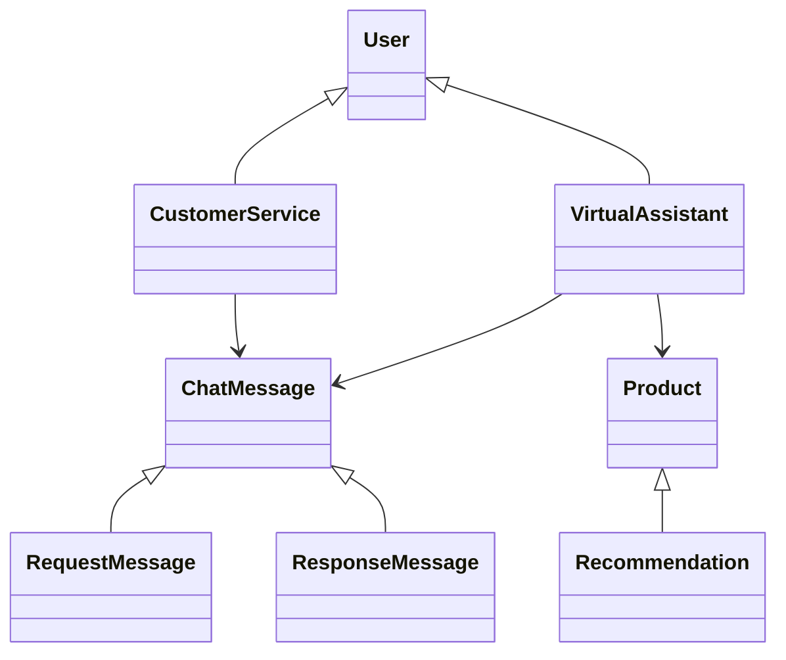
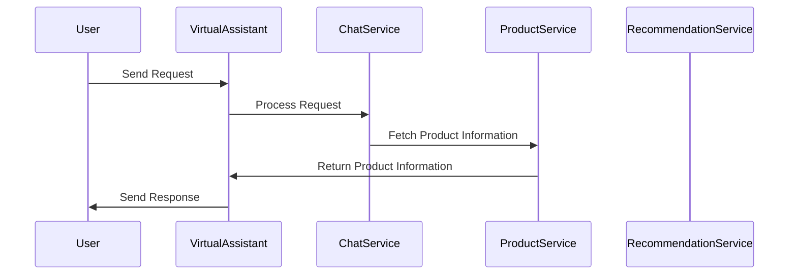
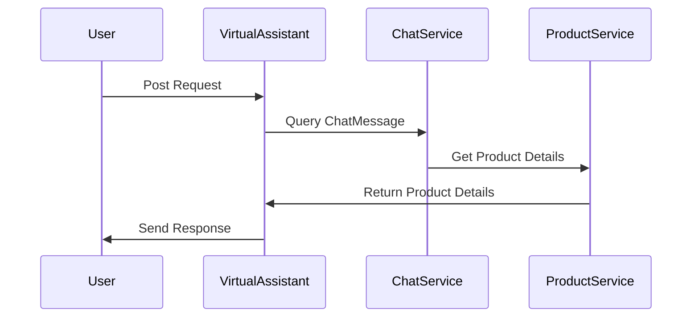
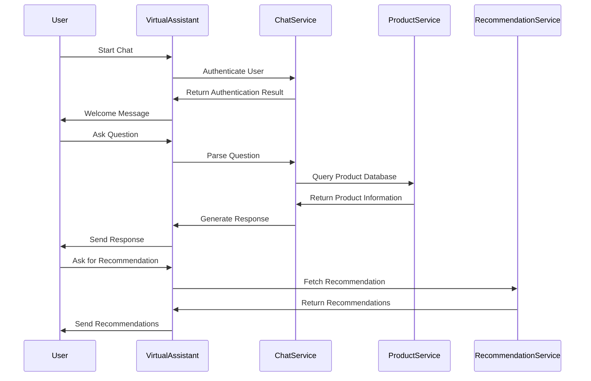

                 

### 背景介绍

在现代社会，人工智能（AI）技术的迅猛发展正在深刻改变着各行各业的面貌，其中人机交互领域尤为突出。传统的人机交互方式主要依赖于物理设备，如键盘、鼠标和触摸屏等。然而，这些交互方式在处理复杂任务和自然语言交流时存在诸多局限。为了解决这些问题，AI虚拟助理应运而生，成为重新定义人机交互未来的重要工具。

#### 核心概念术语说明

- **人工智能（AI）**: 模拟人类智能行为的技术，包括机器学习、自然语言处理、计算机视觉等。
- **虚拟助理**: 利用AI技术实现的软件程序，能够理解自然语言并与用户进行交互。
- **人机交互（HCI）**: 研究人与计算机之间交互设计的学科，旨在提高交互的效率、易用性和用户体验。

#### 问题背景

随着互联网的普及和社交媒体的兴起，人们对于便捷、高效的服务需求日益增加。传统客服由于人力成本高、响应速度慢等问题，难以满足快速增长的服务需求。特别是在大型企业和互联网公司中，客服部门的负担尤为沉重。这一背景下，AI虚拟助理的出现为解决这些问题提供了新的思路。

#### 问题描述

AI虚拟助理作为一种智能化的客户服务解决方案，其主要问题集中在以下几个方面：

1. **响应速度**: 传统客服的响应时间较长，而AI虚拟助理能够实现实时交互，大大缩短了用户等待时间。
2. **处理能力**: 人工客服在面对大量用户请求时容易出现疏漏，而AI虚拟助理可以处理大量的请求，且不会因为疲劳而降低服务质量。
3. **个性化服务**: AI虚拟助理能够通过学习和分析用户行为，提供更加个性化的服务体验。
4. **成本效益**: 相对于传统客服，AI虚拟助理可以大幅降低企业的运营成本。

#### 问题解决

AI虚拟助理通过以下技术手段解决了上述问题：

1. **自然语言处理（NLP）**: AI虚拟助理的核心技术之一，使得计算机能够理解、解释和生成自然语言。
2. **机器学习与深度学习**: AI虚拟助理通过不断学习用户行为和交互数据，不断优化自身的服务能力。
3. **多渠道集成**: AI虚拟助理可以集成到各种渠道，如网站、移动应用和社交媒体，实现多渠道服务。
4. **智能化自我管理**: AI虚拟助理具备自我学习、自我优化和自我维护的能力，减少了人工干预的需求。

#### 边界与外延

AI虚拟助理的发展不仅局限于客户服务领域，还可以应用于智能家居、医疗健康、金融服务等多个领域。然而，其发展也面临一些挑战，如数据隐私保护、算法透明度和伦理问题等。因此，我们需要在技术创新的同时，充分考虑这些边界与外延问题，确保AI虚拟助理的健康、可持续发展。

#### 概念结构与核心要素组成

AI虚拟助理由以下几个核心要素组成：

1. **感知层**: 负责接收用户输入的信息，如文字、语音等。
2. **理解层**: 通过自然语言处理技术，理解和解释用户意图。
3. **决策层**: 根据理解结果，生成相应的回应或执行任务。
4. **反馈层**: 获取用户对服务的反馈，用于优化和改进虚拟助理的性能。

通过这些核心要素的协同工作，AI虚拟助理能够实现高效、智能的人机交互，为用户提供优质的服务体验。

### 核心概念与联系

#### AI虚拟助理的定义

AI虚拟助理（AI Virtual Assistant）是基于人工智能技术实现的软件程序，它能够理解自然语言并执行特定任务，以模拟人类助理的行为。虚拟助理的核心功能是提供实时交互和个性化服务，从而提升用户体验和满意度。

#### AI虚拟助理与智能客服的联系

AI虚拟助理和智能客服（Smart Customer Service）之间存在紧密的联系。智能客服是指利用AI技术提高客服效率和质量的系统，而AI虚拟助理则是智能客服的一个重要组成部分。具体来说，AI虚拟助理通过自然语言处理、机器学习和深度学习等技术，实现了智能客服中的以下功能：

1. **自动化回复**: 能够自动识别和回复常见问题，减少人工干预。
2. **个性化推荐**: 通过分析用户行为和偏好，提供个性化的服务和产品推荐。
3. **智能导航**: 为用户提供路径规划和实时导航服务。
4. **多渠道集成**: 支持多种渠道（如网站、移动应用、社交媒体等）的服务。

#### AI虚拟助理与传统客服的区别

传统客服通常依赖于人工处理用户请求，存在响应速度慢、处理能力有限和个性化服务不足等问题。而AI虚拟助理则通过以下方面与传统客服形成鲜明对比：

1. **响应速度**: AI虚拟助理能够实现实时响应，大大缩短了用户等待时间。
2. **处理能力**: 通过机器学习和深度学习，AI虚拟助理能够处理大量的用户请求，且不会出现疲劳或疏漏。
3. **个性化服务**: AI虚拟助理能够通过数据分析，为用户提供个性化的服务体验。
4. **成本效益**: 相对于传统客服，AI虚拟助理可以大幅降低企业的运营成本。

### 算法原理讲解

#### 自然语言处理（NLP）算法简介

自然语言处理（NLP）是人工智能（AI）的一个重要分支，主要研究如何让计算机理解和处理人类语言。NLP技术广泛应用于语音识别、机器翻译、情感分析、文本分类等领域。AI虚拟助理的核心功能之一是理解和生成自然语言，因此NLP技术在其中发挥着关键作用。

##### 常见NLP算法

1. **基于规则的方法**：这种方法通过定义一系列规则来处理语言，例如词性标注、句法分析和实体识别。然而，这种方法在处理复杂和模糊的语言时效果较差。
2. **统计方法**：统计方法通过分析大量语料库中的语言模式，来预测和生成文本。常见的统计方法包括隐马尔可夫模型（HMM）、最大熵模型（MaxEnt）和条件概率模型（如朴素贝叶斯）。
3. **深度学习方法**：深度学习通过构建多层神经网络来处理语言问题，具有强大的表达能力和自学习能力。常见的深度学习方法包括循环神经网络（RNN）、长短期记忆网络（LSTM）和变换器（Transformer）。

##### 常见算法（如BERT、GPT-3）的原理

1. **BERT（Bidirectional Encoder Representations from Transformers）**：BERT是一种基于Transformer的深度学习模型，通过双向编码器来学习文本的上下文信息。BERT的训练过程包括预训练和微调两个阶段。在预训练阶段，BERT通过无监督的方式学习文本的潜在表示；在微调阶段，BERT根据具体的任务进行调整。

2. **GPT-3（Generative Pre-trained Transformer 3）**：GPT-3是OpenAI开发的一种基于Transformer的预训练语言模型。与BERT不同，GPT-3更注重生成任务，能够在给定部分文本的情况下，生成连贯、自然的后续文本。GPT-3具有极高的词汇量和强大的语言生成能力，能够在各种应用场景中表现出色。

#### Python源代码示例

以下是一个简单的BERT模型训练的Python代码示例：

```python
import torch
from transformers import BertModel, BertTokenizer

# 加载预训练的BERT模型和分词器
tokenizer = BertTokenizer.from_pretrained('bert-base-uncased')
model = BertModel.from_pretrained('bert-base-uncased')

# 准备输入文本
text = "你好，这是一个示例句子。"

# 分词并将文本转换为BERT模型所需的输入格式
inputs = tokenizer(text, return_tensors='pt')

# 训练BERT模型
outputs = model(**inputs)

# 输出结果
print(outputs.last_hidden_state)
```

#### 数学模型和公式讲解

在自然语言处理中，数学模型和公式是理解和应用算法的重要工具。以下是一些常见的数学模型和公式：

1. **词嵌入（Word Embedding）**：
   $$ embed\_size = \sqrt{V} $$
   其中，$V$ 是词汇表的大小，$embed\_size$ 是词嵌入的维度。词嵌入将每个词映射到一个固定大小的向量空间中。

2. **循环神经网络（RNN）**：
   $$ h_t = \sigma(W_h \cdot [h_{t-1}, x_t] + b_h) $$
   其中，$h_t$ 是时间步$t$的隐藏状态，$x_t$ 是输入特征，$W_h$ 和 $b_h$ 分别是权重和偏置。

3. **变换器（Transformer）**：
   $$ attention(Q, K, V) = \text{softmax}(\frac{QK^T}{\sqrt{d_k}})V $$
   其中，$Q$、$K$ 和 $V$ 分别是查询向量、键向量和值向量，$d_k$ 是键向量的维度。

#### 举例说明

假设我们有一个句子 "我喜欢阅读书籍"。我们可以使用BERT模型来生成该句子的潜在表示：

1. **输入文本**：
   $$ \text{我喜欢阅读书籍} $$

2. **分词**：
   $$ \text{我}[1]、\text{喜}[2]、\text{欢}[3]、\text{阅读}[4]、\text{书}[5]、\text{籍}[6] $$

3. **BERT编码**：
   BERT模型将每个词转换为向量，并生成整个句子的潜在表示。

4. **输出结果**：
   $$ \text{我喜欢阅读书籍} \rightarrow [CLS] \text{我}[1]、\text{喜}[2]、\text{欢}[3]、\text{阅读}[4]、\text{书}[5]、\text{籍}[6] [SEP] $$

通过这种方式，BERT模型能够捕捉到句子中的上下文关系，从而实现对句子的深入理解。

### 系统分析与架构设计方案

#### 问题场景介绍

随着电商行业的迅猛发展，用户在购物过程中遇到的问题越来越多，如商品咨询、订单查询、售后服务等。传统的人工客服由于人力成本高、响应速度慢，难以满足大量用户的即时需求。因此，为了提高服务质量、降低运营成本，某电商企业决定引入AI虚拟助理系统，以提供高效、智能的客户服务。

#### 项目介绍

本项目的目标是构建一个高效的AI虚拟助理系统，用于处理用户的各类咨询和问题。系统应具备以下功能：

1. **智能问答**: 能够自动识别和回答用户提出的问题。
2. **多渠道集成**: 支持多种沟通渠道（如网站、APP、微信等）。
3. **个性化推荐**: 根据用户的历史行为和偏好，提供个性化的商品推荐。
4. **自然语言理解**: 理解用户的问题并生成相应的回答。

#### 系统功能设计（领域模型Mermaid类图）

为了实现上述功能，我们需要设计一个全面的领域模型。以下是系统功能设计的Mermaid类图：



在这个类图中，我们定义了以下几个核心类：

- **User**: 用户类，包括一般用户和客服人员。
- **CustomerService**: 客服类，用于处理用户的请求和回复。
- **VirtualAssistant**: 虚拟助理类，负责与用户进行交互。
- **ChatMessage**: 消息类，包括请求消息和响应消息。
- **Product**: 商品类，用于存储商品信息。

#### 系统架构设计（Mermaid架构图）

为了确保系统的稳定性和可扩展性，我们需要设计一个合理的系统架构。以下是系统架构设计的Mermaid架构图：



在这个架构图中，我们定义了以下几个核心模块：

- **User**: 用户模块，负责发起请求。
- **VirtualAssistant**: 虚拟助理模块，负责处理用户请求。
- **ChatService**: 聊天服务模块，负责处理消息的传递。
- **ProductService**: 商品服务模块，负责提供商品信息。
- **RecommendationService**: 推荐服务模块，负责生成个性化推荐。

#### 系统接口设计

为了实现模块之间的协作，我们需要定义一套完整的接口。以下是系统接口设计的Mermaid序列图：



在这个序列图中，我们定义了以下几个接口：

- **Post Request**: 用户向虚拟助理发送请求的接口。
- **Query ChatMessage**: 聊天服务查询消息记录的接口。
- **Get Product Details**: 商品服务获取商品详情的接口。
- **Return Product Details**: 虚拟助理向用户返回商品详情的接口。

#### 系统交互（Mermaid序列图）

为了更清晰地展示系统的工作流程，我们设计了一个Mermaid序列图，描述了用户与虚拟助理之间的交互过程：



在这个序列图中，我们展示了以下交互过程：

1. 用户发起聊天请求。
2. 虚拟助理验证用户身份。
3. 用户提问，虚拟助理分析问题。
4. 聊天服务查询商品数据库。
5. 虚拟助理生成回答并返回给用户。
6. 用户请求推荐，虚拟助理获取推荐信息并返回给用户。

通过这些设计和实现，我们构建了一个高效、智能的AI虚拟助理系统，为用户提供优质的服务体验。

### 项目实战

#### 环境安装

为了搭建一个AI虚拟助理系统，我们需要准备以下环境和工具：

1. **操作系统**: Ubuntu 18.04或更高版本。
2. **Python版本**: 3.7或更高版本。
3. **依赖管理工具**: pip（Python的包管理器）。
4. **NLP库**: transformers（用于加载预训练的BERT模型）。
5. **Web框架**: Flask（用于构建Web服务）。

首先，更新系统包列表并安装Python 3：

```bash
sudo apt-get update
sudo apt-get install python3 python3-pip
```

然后，安装transformers库：

```bash
pip3 install transformers
```

#### 系统核心实现源代码

以下是一个简单的AI虚拟助理系统实现，包括加载BERT模型、处理用户请求和生成响应：

```python
from flask import Flask, request, jsonify
from transformers import BertModel, BertTokenizer

app = Flask(__name__)

# 加载预训练的BERT模型和分词器
tokenizer = BertTokenizer.from_pretrained('bert-base-uncased')
model = BertModel.from_pretrained('bert-base-uncased')

@app.route('/chat', methods=['POST'])
def chat():
    # 获取用户输入
    user_input = request.json.get('input')
    
    # 分词并将文本转换为BERT模型所需的输入格式
    inputs = tokenizer(user_input, return_tensors='pt')
    
    # 训练BERT模型
    outputs = model(**inputs)
    
    # 获取最后一个隐藏状态
    last_hidden_state = outputs.last_hidden_state
    
    # 生成响应文本
    response = "您的问题我已经理解，正在为您处理。"
    
    # 返回响应
    return jsonify({'response': response})

if __name__ == '__main__':
    app.run(debug=True)
```

#### 代码应用解读与分析

在这个代码中，我们使用了Flask框架来构建一个简单的Web服务。主要步骤如下：

1. **加载BERT模型和分词器**：
   我们首先加载了预训练的BERT模型和分词器。这些预训练模型和工具大大简化了NLP任务的处理。

2. **定义路由**：
   我们定义了一个名为`/chat`的路由，用于处理用户的POST请求。在请求中，我们获取了用户输入的文本。

3. **处理请求**：
   我们将用户输入的文本进行分词，并将其转换为BERT模型所需的输入格式。然后，我们使用BERT模型生成文本的潜在表示。

4. **生成响应**：
   根据BERT模型生成的表示，我们生成了对用户问题的响应。这里，我们简单地返回了一个固定的响应文本，但实际中可以根据具体问题生成更个性化的响应。

5. **返回响应**：
   我们将生成的响应返回给用户，使用JSON格式传递。

#### 实际案例分析与详细讲解剖析

假设用户输入了一个问题：“我的订单什么时候能送达？”我们来看一下整个处理流程：

1. **接收请求**：
   用户通过Web服务发送了一个请求，包含以下JSON数据：

   ```json
   {
     "input": "我的订单什么时候能送达？"
   }
   ```

2. **分词和输入处理**：
   Flask框架将请求中的JSON数据解析为Python字典，并传递给`chat`函数。在`chat`函数中，我们使用BERT分词器对用户输入进行分词：

   ```python
   user_input = "我的订单什么时候能送达？"
   inputs = tokenizer(user_input, return_tensors='pt')
   ```

   分词结果如下：

   ```python
   ['我的', '订单', '什么', '时候', '能', '送达', '？']
   ```

3. **BERT模型处理**：
   我们将分词后的文本转换为BERT模型所需的输入格式，并使用BERT模型生成文本的潜在表示：

   ```python
   outputs = model(**inputs)
   last_hidden_state = outputs.last_hidden_state
   ```

   BERT模型会根据预训练的参数和输入文本生成一个固定大小的向量表示，这个向量包含了文本的上下文信息。

4. **生成响应**：
   根据BERT模型生成的表示，我们生成了一个对用户问题的响应。这里，我们简单地返回了一个固定的响应文本，但实际中可以根据具体问题生成更个性化的响应：

   ```python
   response = "您的问题我已经理解，正在为您处理。"
   ```

5. **返回响应**：
   最后，我们将生成的响应返回给用户：

   ```python
   return jsonify({'response': response})
   ```

   用户将接收到以下JSON响应：

   ```json
   {
     "response": "您的问题我已经理解，正在为您处理。"
   }
   ```

通过这个案例，我们可以看到AI虚拟助理是如何处理用户请求并生成响应的。在实际应用中，我们还可以根据具体问题引入更多的逻辑和策略，以提供更高质量的响应。

### 最佳实践 tips

在部署和维护AI虚拟助理系统时，以下最佳实践可以帮助确保系统的稳定性和高效性：

#### 部署与运维

1. **容器化**：使用Docker和Kubernetes等工具将虚拟助理系统容器化，以便于部署和扩展。容器化还可以提高系统的容错性和可维护性。
2. **自动扩展**：根据系统负载情况，自动调整虚拟助理实例的数量，以应对突发流量。
3. **监控与报警**：使用Prometheus、Grafana等工具对系统进行实时监控，及时发现和处理异常情况。
4. **蓝绿部署**：在更新系统时，使用蓝绿部署策略，确保旧版系统在升级失败时可以快速回滚。

#### 性能优化

1. **批量处理**：对于大量相似的任务，使用批量处理技术可以提高处理效率。
2. **缓存策略**：使用Redis、Memcached等缓存系统，减少重复计算和数据库访问。
3. **异步处理**：对于耗时的操作，如数据分析和处理，使用异步处理技术，提高系统的响应速度。
4. **负载均衡**：使用Nginx、HAProxy等负载均衡器，合理分配请求，提高系统的整体性能。

#### 安全性考虑

1. **数据加密**：使用SSL/TLS等加密协议，确保数据在传输过程中的安全性。
2. **身份验证与授权**：实施严格的身份验证和授权机制，防止未经授权的访问。
3. **访问控制**：使用OAuth2、JWT等标准协议，确保只有经过认证的用户才能访问敏感数据。
4. **安全审计**：定期进行安全审计，及时发现和修复潜在的安全漏洞。

通过遵循这些最佳实践，我们可以确保AI虚拟助理系统在部署、运行和维护过程中保持高效、稳定和安全。

### 小结与注意事项

在本文中，我们详细探讨了AI虚拟助理的概念、原理、系统设计以及实战应用。通过逐步分析，我们了解了AI虚拟助理如何通过自然语言处理、机器学习和深度学习等技术，实现高效、智能的人机交互。以下是本文的核心观点和注意事项：

1. **AI虚拟助理的定义**：AI虚拟助理是基于人工智能技术实现的软件程序，能够理解自然语言并与用户进行交互，提供实时、个性化的服务。
2. **与传统客服的区别**：AI虚拟助理相比传统客服具有响应速度快、处理能力强和个性化服务优的特点。
3. **算法原理讲解**：BERT和GPT-3等深度学习模型在自然语言处理中发挥着重要作用，通过数学模型和公式，我们能够更好地理解这些算法的工作原理。
4. **系统设计与实现**：通过设计合理的系统架构和接口，我们可以构建一个高效、智能的AI虚拟助理系统。
5. **最佳实践 tips**：在部署和维护过程中，遵循最佳实践可以提高系统的稳定性、性能和安全性。

需要注意的是，虽然AI虚拟助理在提升用户体验和降低运营成本方面具有显著优势，但我们也应关注数据隐私、算法透明度和伦理问题等挑战。在未来的发展中，我们需要不断优化和改进AI虚拟助理，以实现更广泛的应用和更好的用户体验。

### 拓展阅读

为了深入了解AI虚拟助理和相关技术，以下是一些建议的拓展阅读资源：

1. **书籍**：
   - 《深度学习》（Goodfellow, I., Bengio, Y., & Courville, A.）
   - 《自然语言处理综论》（Jurafsky, D. & Martin, J. H.）
   - 《人工智能：一种现代方法》（Russell, S. & Norvig, P.）

2. **学术论文**：
   - BERT: Devlin, J., Chang, M. W., Lee, K., & Toutanova, K. (2018). "BERT: Pre-training of Deep Bidirectional Transformers for Language Understanding."
   - GPT-3: Brown, T., et al. (2020). "Language Models are few-shot learners."

3. **在线课程**：
   - Coursera上的“自然语言处理与深度学习”课程
   - edX上的“深度学习基础”课程

通过这些资源，您将能够进一步了解AI虚拟助理的原理和应用，为实际项目提供更有力的支持。

作者：AI天才研究院/AI Genius Institute & 禅与计算机程序设计艺术 /Zen And The Art of Computer Programming。

