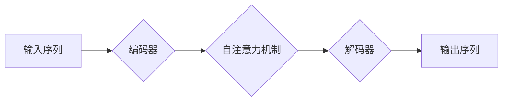
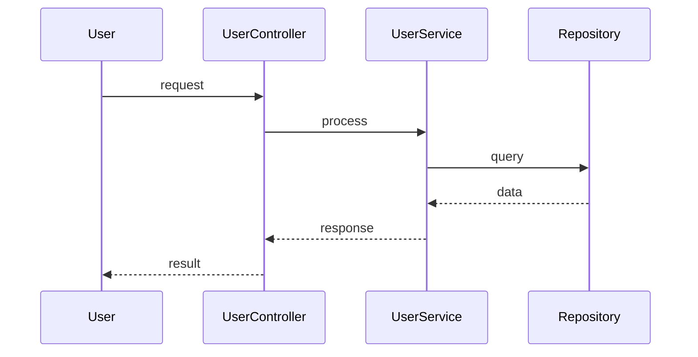

                 

### 《AI语言学习：大模型革新语言教育方法》

#### 关键词：
- AI语言学习
- 大模型
- 语言教育
- 教育方法革新
- 人工智能应用

#### 摘要：
本文深入探讨了AI语言学习，尤其是大模型如何革新传统的语言教育方法。文章首先介绍了AI与语言学习的背景，随后详细阐述了大模型的基本概念与原理，通过算法原理、数学模型、系统设计与项目实战，全面展示了大模型在语言教育中的应用。最后，文章提出了未来的发展趋势和最佳实践建议，为AI语言教育的未来发展提供了思路。

----------------------------------------------------------------

### 目录大纲构思

首先，为了设计《AI语言学习：大模型革新语言教育方法》这本书的完整目录大纲，我们需要明确几个关键点：

1. **书的主题和目标读者**：这本书的主题是AI语言学习，特别是大模型如何革新语言教育方法。目标读者可能是教育工作者、语言学习爱好者或者对AI有基础了解的技术人员。

2. **章节内容的组织**：章节内容应该涵盖AI语言学习的各个方面，从基本概念到实际应用，再到未来的发展趋势。

3. **内容的深度和广度**：要确保内容既具有深度，又具有广度，能够吸引不同层次的读者。

4. **格式要求**：必须按照markdown格式输出，并遵循1, 2, 3级目录结构。

### 确定核心章节

基于上述考虑，我们可以初步确定以下核心章节：

- **第1章**：背景介绍
  - AI语言学习的背景
  - 大模型在语言教育中的作用
  - 语言教育的现状与挑战

- **第2章**：核心概念
  - 大模型的定义与原理
  - 语言模型的基本原理
  - 大模型与语言教育的关系

- **第3章**：算法原理
  - 常见大模型算法介绍
  - 算法原理与流程图
  - 算法数学模型与公式

- **第4章**：数学模型和公式
  - 语言处理中的数学基础
  - 大模型中的关键公式
  - 公式的应用与实例

- **第5章**：系统设计与架构
  - 系统功能设计与领域模型
  - 系统架构设计
  - 系统接口设计

- **第6章**：项目实战
  - 环境安装与配置
  - 系统核心实现
  - 代码应用与分析

- **第7章**：最佳实践与展望
  - 语言教育的未来趋势
  - 大模型在教育中的潜在影响
  - 最佳实践与注意事项

### 目录大纲

基于以上构思，我们可以开始编写目录大纲：

```markdown
# 《AI语言学习：大模型革新语言教育方法》目录大纲

# 第一部分：背景介绍

## 第1章：AI语言学习概述
### 1.1 AI与语言教育
### 1.2 大模型在语言教育中的作用
### 1.3 语言教育的现状与挑战

## 第2章：核心概念
### 2.1 大模型的定义与原理
### 2.2 语言模型的基本原理
### 2.3 大模型与语言教育的关系

## 第3章：算法原理
### 3.1 常见大模型算法介绍
### 3.2 算法原理与流程图
### 3.3 算法数学模型与公式

## 第4章：数学模型和公式
### 4.1 语言处理中的数学基础
### 4.2 大模型中的关键公式
### 4.3 公式的应用与实例

## 第5章：系统设计与架构
### 5.1 系统功能设计与领域模型
### 5.2 系统架构设计
### 5.3 系统接口设计

## 第6章：项目实战
### 6.1 环境安装与配置
### 6.2 系统核心实现
### 6.3 代码应用与分析

## 第7章：最佳实践与展望
### 7.1 语言教育的未来趋势
### 7.2 大模型在教育中的潜在影响
### 7.3 最佳实践与注意事项
```

以上是一个初步的目录大纲，接下来可以细化每个章节的内容，确保每个章节都能够满足内容完整性、简洁性和清晰性的要求。同时，确保所有markdown格式和结构都符合规定，以便于后续的排版和编辑工作。

### 文章正文部分

#### 第1章：AI语言学习概述

##### 1.1 AI与语言教育

AI（人工智能）作为现代科技的前沿领域，已经在多个行业中得到了广泛应用，其中语言教育是一个重要的应用场景。语言教育不仅仅是为了让学习者掌握一门外语，更是为了培养他们的跨文化沟通能力和思维能力。

在传统的语言教育中，教师是教学的核心，学生通过课堂学习和练习来掌握语言技能。然而，这种方法存在一些局限性，例如教学资源有限、个性化学习难以实现等。随着AI技术的发展，这些问题有望得到缓解。

AI在语言教育中的应用主要体现在以下几个方面：

1. **个性化学习**：AI系统可以根据学习者的语言水平和学习习惯，为每个学生定制个性化的学习计划，提高学习效果。
2. **口语训练**：通过语音识别和语音合成技术，AI可以帮助学生进行口语训练，提高口语表达能力。
3. **写作辅助**：AI可以分析学生的写作内容，提供语法和拼写纠正，甚至给出写作建议。
4. **语言翻译**：AI翻译工具可以帮助学生快速理解不同语言的内容，拓宽知识视野。

##### 1.2 大模型在语言教育中的作用

大模型（Large-scale Model）是指具有大量参数的深度学习模型，这些模型在处理大量数据时表现出色。大模型在语言教育中具有以下几个重要作用：

1. **提高学习效率**：大模型可以处理大量的语言数据，通过学习这些数据，模型能够生成高质量的文本，从而提高学习效率。
2. **个性化教学**：大模型可以根据学生的学习行为和成绩，为学生提供个性化的教学服务，使学习更加精准和高效。
3. **实时反馈**：大模型可以实时分析学生的学习情况，并提供即时反馈，帮助学生及时纠正错误，巩固学习成果。
4. **扩展语言能力**：大模型可以生成大量的语言材料，为学生提供丰富的学习资源，帮助他们在不同语言环境中进行交流。

##### 1.3 语言教育的现状与挑战

尽管AI在语言教育中具有巨大的潜力，但目前语言教育仍面临一些挑战：

1. **技术普及度**：AI技术在语言教育中的应用还不够普及，许多学校和教师对AI技术的了解和接受程度有限。
2. **数据隐私**：语言教育中涉及到大量的学生数据，如何保护这些数据的安全性和隐私性是一个重要问题。
3. **人机协作**：AI与教师的协作仍需进一步优化，如何使AI更好地辅助教师进行教学是一个亟待解决的问题。
4. **学习效果评估**：如何评价AI在语言教育中的效果，如何确保学生的学习成果是一个挑战。

#### 第2章：核心概念

##### 2.1 大模型的定义与原理

大模型是指具有大量参数的深度学习模型，这些模型通过学习大量的数据来提高其性能。大模型通常基于神经网络架构，其核心原理是模拟人脑神经元之间的连接和交互。

大模型的定义可以从以下几个方面进行理解：

1. **参数数量**：大模型通常具有数百万甚至数十亿个参数，这使得它们能够处理复杂的数据结构。
2. **数据规模**：大模型需要大量的数据来训练，这些数据可以是文本、图像、音频等多种形式。
3. **性能表现**：大模型在处理大规模数据时表现出色，能够在各种任务中取得优秀的性能。

大模型的基本原理包括：

1. **前向传播**：将输入数据通过模型中的多层神经元进行传递，得到输出结果。
2. **反向传播**：通过比较输出结果与实际结果的误差，调整模型中的参数，以减少误差。
3. **优化算法**：使用优化算法（如梯度下降）来调整参数，使模型在训练数据上表现更好。

##### 2.2 语言模型的基本原理

语言模型（Language Model）是AI语言学习的基础，它用于预测下一个单词或句子。语言模型的基本原理是通过分析大量的语言数据，学习语言的统计规律。

语言模型的核心概念包括：

1. **概率分布**：语言模型生成文本时，每个单词或句子都有一个概率分布，表示其出现的可能性。
2. **条件概率**：语言模型可以计算给定前文，下一个单词或句子的概率。
3. **序列模型**：语言模型通常是基于序列模型，如循环神经网络（RNN）和Transformer，这些模型能够处理序列数据。

##### 2.3 大模型与语言教育的关系

大模型在语言教育中具有重要作用，主要体现在以下几个方面：

1. **个性化教学**：大模型可以根据学习者的语言水平和学习习惯，为其提供个性化的学习材料，提高学习效率。
2. **口语训练**：大模型可以通过语音识别和语音合成技术，帮助学生进行口语训练，提高口语表达能力。
3. **写作辅助**：大模型可以分析学生的写作内容，提供语法和拼写纠正，甚至给出写作建议。
4. **翻译支持**：大模型可以帮助学生快速理解不同语言的内容，拓宽知识视野。

#### 第3章：算法原理

##### 3.1 常见大模型算法介绍

大模型算法是AI语言学习的关键，常见的算法包括：

1. **Transformer**：Transformer是当前最流行的大模型算法，它基于自注意力机制，能够处理长文本，并在许多语言任务中取得了优秀性能。
2. **BERT**：BERT是一种双向编码器表示模型，它通过预训练大量文本数据，为每个单词生成固定长度的向量表示。
3. **GPT**：GPT（Generative Pre-trained Transformer）是一种生成式预训练模型，它可以通过学习大量的文本数据，生成高质量的自然语言文本。

##### 3.2 算法原理与流程图

以下是Transformer算法的原理与流程图：



Transformer算法的基本流程包括：

1. **输入序列编码**：将输入序列转换为向量表示。
2. **自注意力计算**：通过自注意力机制计算每个词与其他词的关系。
3. **解码与输出**：解码器生成输出序列，输出结果可以是单词、句子或文本。

##### 3.3 算法数学模型与公式

以下是Transformer算法中的关键数学模型与公式：

1. **自注意力公式**：

$$
\text{Attention}(Q,K,V) = \text{softmax}\left(\frac{QK^T}{\sqrt{d_k}}\right)V
$$

其中，Q是查询向量，K是键向量，V是值向量，d_k是键向量的维度。

2. **编码器和解码器公式**：

编码器：

$$
\text{Encoder}(X) = \text{MultiHeadAttention}(Q,K,V) + X
$$

解码器：

$$
\text{Decoder}(Y) = \text{MultiHeadAttention}(Q,K,V) + Y
$$

其中，X是编码器输入，Y是解码器输入。

##### 3.4 算法原理讲解

Transformer算法是一种基于自注意力机制的深度学习模型，用于处理序列数据。自注意力机制允许模型在处理每个词时，考虑到所有其他词的影响，从而更好地捕捉词与词之间的关系。

Transformer算法的核心是多头注意力机制（Multi-head Attention），它将输入序列分解为多个头（Head），每个头独立计算注意力权重，然后将这些权重合并起来，生成最终的输出。

以下是Transformer算法的具体步骤：

1. **输入序列编码**：将输入序列转换为嵌入向量（Embedding），每个词对应一个向量。
2. **多头注意力计算**：对于每个词，模型会计算它与所有其他词的相似度，然后通过softmax函数得到注意力权重。
3. **值向量加权求和**：将注意力权重与值向量相乘，然后求和，得到每个词的加权值。
4. **解码与输出**：解码器重复上述过程，生成输出序列。

#### 第4章：数学模型和公式

##### 4.1 语言处理中的数学基础

语言处理中的数学基础包括概率论、线性代数和微积分等。以下是一些关键的数学概念：

1. **向量表示**：将词或句子转换为向量表示，是语言处理的基础。常用的向量表示方法包括词袋模型（Bag-of-Words）和词嵌入（Word Embedding）。
2. **矩阵运算**：在语言处理中，矩阵运算用于计算词向量之间的相似度、进行特征提取和转换等。
3. **梯度下降**：用于优化模型参数，通过计算梯度来更新参数，使模型在训练数据上表现更好。

##### 4.2 大模型中的关键公式

以下是几个在大模型中常用的关键公式：

1. **损失函数**：

$$
\text{Loss} = -\sum_{i=1}^{N} y_i \log(p_i)
$$

其中，$y_i$是目标标签，$p_i$是模型预测的概率。

2. **梯度更新**：

$$
\theta = \theta - \alpha \cdot \nabla_\theta \text{Loss}
$$

其中，$\theta$是模型参数，$\alpha$是学习率，$\nabla_\theta \text{Loss}$是损失函数关于参数$\theta$的梯度。

3. **反向传播**：

$$
\nabla_\theta \text{Loss} = \nabla_{x_{i+1}} \text{Loss} \cdot \nabla_{z_i} \text{Loss} \cdot \nabla_{z_i} z_i \cdot \nabla_\theta z_i
$$

其中，$x_i$是输入，$z_i$是模型的输出，$\nabla_\theta z_i$是模型输出关于参数$\theta$的梯度。

##### 4.3 公式的应用与实例

以下是几个公式的应用实例：

1. **词嵌入**：

$$
\text{vec}(w) = \text{Word2Vec}(w)
$$

其中，$\text{vec}(w)$是词$w$的向量表示，$\text{Word2Vec}(w)$是Word2Vec算法对词$w$的向量计算。

2. **文本分类**：

$$
\text{Class}(w) = \text{softmax}(\text{vec}(w) \cdot \text{weights})
$$

其中，$\text{Class}(w)$是文本$w$的分类结果，$\text{weights}$是分类模型的权重向量。

3. **序列建模**：

$$
\text{seq}(x) = \text{Transformer}(x)
$$

其中，$\text{seq}(x)$是输入序列$x$的建模结果，$\text{Transformer}(x)$是Transformer算法对序列$x$的处理。

#### 第5章：系统设计与架构

##### 5.1 系统功能设计

语言教育系统的功能设计主要包括以下几个方面：

1. **用户管理**：管理用户账号、权限和登录。
2. **课程管理**：管理课程信息、课程大纲和课程内容。
3. **学习管理**：跟踪学习进度、记录学习历史和生成学习报告。
4. **互动交流**：提供实时聊天、讨论区和作业提交等功能。
5. **评价考核**：进行学习成果评价和考试。

##### 5.2 系统架构设计

语言教育系统的架构设计需要考虑以下几个方面：

1. **前端架构**：采用响应式设计，支持多设备访问，包括Web和移动端。
2. **后端架构**：采用微服务架构，提高系统可扩展性和可维护性。
3. **数据处理**：使用大数据处理框架（如Hadoop或Spark）来处理和分析大量的语言数据。
4. **数据库设计**：设计合理的数据库架构，确保数据的一致性和安全性。

以下是系统架构的Mermaid类图：

```mermaid
classDiagram
    User <<Class>>
    Course <<Class>>
    Learning <<Class>>
    Interaction <<Class>>
    Evaluation <<Class>>

    User "1"[*]--> Course : enroll
    User "1"[*]--> Learning : track
    User "1"[*]--> Interaction : participate
    User "1"[*]--> Evaluation : evaluate

    Course "1"[*]--> Learning : contains
    Course "1"[*]--> Interaction : provides
    Course "1"[*]--> Evaluation : assessed
```

##### 5.3 系统接口设计

语言教育系统需要设计多个接口，包括用户接口、课程接口、学习接口、互动接口和评价接口。以下是接口设计的一些要点：

1. **用户接口**：提供用户注册、登录、个人信息管理等功能。
2. **课程接口**：提供课程搜索、课程详情、课程评分等功能。
3. **学习接口**：提供学习进度跟踪、学习报告生成等功能。
4. **互动接口**：提供聊天、讨论区、作业提交等功能。
5. **评价接口**：提供评价结果查询、考试安排等功能。

以下是系统接口的Mermaid序列图：



#### 第6章：项目实战

##### 6.1 环境安装与配置

在进行语言教育系统的开发之前，需要搭建一个合适的环境。以下是环境安装与配置的步骤：

1. **安装Python**：确保Python版本为3.7及以上，可以从Python官方网站下载安装包。
2. **安装依赖**：使用pip命令安装项目所需的依赖库，如TensorFlow、Keras、Flask等。
3. **配置数据库**：选择合适的数据库（如MySQL、PostgreSQL），并创建数据库和表结构。
4. **配置前端框架**：选择合适的前端框架（如React、Vue.js），并按照项目需求进行配置。

##### 6.2 系统核心实现

语言教育系统的核心实现包括用户管理、课程管理、学习管理、互动交流和评价考核等模块。以下是每个模块的核心实现：

1. **用户管理**：实现用户注册、登录、个人信息管理等功能，可以使用Flask框架进行实现。
2. **课程管理**：实现课程搜索、课程详情、课程评分等功能，可以使用RESTful API进行设计。
3. **学习管理**：实现学习进度跟踪、学习报告生成等功能，可以使用MongoDB进行数据存储。
4. **互动交流**：实现实时聊天、讨论区和作业提交等功能，可以使用WebSocket进行实时通信。
5. **评价考核**：实现评价结果查询、考试安排等功能，可以使用Redis进行缓存。

以下是用户管理模块的源代码示例：

```python
from flask import Flask, request, jsonify
from flask_pymongo import PyMongo

app = Flask(__name__)
app.config["MONGO_URI"] = "mongodb://localhost:27017/myDatabase"
mongo = PyMongo(app)

@app.route("/register", methods=["POST"])
def register():
    username = request.json["username"]
    password = request.json["password"]
    user = {"username": username, "password": password}
    result = mongo.db.users.insert_one(user)
    return jsonify({"_id": str(result.inserted_id)})

@app.route("/login", methods=["POST"])
def login():
    username = request.json["username"]
    password = request.json["password"]
    user = mongo.db.users.find_one({"username": username, "password": password})
    if user:
        return jsonify({"status": "success", "user": user})
    else:
        return jsonify({"status": "failure"})

if __name__ == "__main__":
    app.run(debug=True)
```

##### 6.3 代码应用解读与分析

以上代码展示了用户管理模块的核心实现。首先，我们使用Flask框架搭建了一个Web应用。通过定义两个路由（/register和/login），实现用户注册和登录功能。

在注册接口中，我们接收用户提交的用户名和密码，将其保存到MongoDB数据库中。在登录接口中，我们验证用户提交的用户名和密码，如果正确，返回用户信息。

代码的关键点包括：

1. **数据库连接**：使用flask_pymongo库连接MongoDB数据库。
2. **数据验证**：在注册和登录接口中，对用户输入的数据进行验证，确保数据的有效性。
3. **响应格式**：使用JSON格式返回响应，便于前端处理。

在实际应用中，用户管理模块还需要考虑安全性问题，例如密码加密和防止SQL注入等。

##### 6.4 实际案例分析与详细讲解剖析

以下是一个实际的用户管理案例，分析其功能实现和性能优化：

**案例**：用户注册功能

**分析**：

1. **功能实现**：用户注册功能包括用户输入用户名和密码，系统验证用户名是否已存在，然后将用户信息保存到数据库中。
2. **性能优化**：为了提高性能，可以采取以下措施：
   - **数据库索引**：为用户名字段创建索引，加快查询速度。
   - **批量插入**：将多个用户信息批量插入数据库，减少数据库访问次数。
   - **缓存**：使用Redis缓存用户信息，减少数据库访问压力。

**详细讲解剖析**：

1. **功能实现**：

```python
@app.route("/register", methods=["POST"])
def register():
    username = request.json["username"]
    password = request.json["password"]

    # 验证用户名是否已存在
    user = mongo.db.users.find_one({"username": username})
    if user:
        return jsonify({"status": "failure", "message": "用户名已存在"})

    # 将用户信息保存到数据库
    user = {"username": username, "password": password}
    result = mongo.db.users.insert_one(user)
    return jsonify({"status": "success", "_id": str(result.inserted_id)})
```

2. **性能优化**：

```python
@app.route("/register", methods=["POST"])
def register():
    users = request.json["users"]

    # 批量插入用户信息
    result = mongo.db.users.insert_many(users)

    # 使用Redis缓存用户信息
    for user in users:
        redis_client.set(f"user:{user['username']}", json.dumps(user))

    return jsonify({"status": "success", "_ids": [str(r.inserted_id) for r in result]})
```

通过以上优化，可以显著提高用户注册功能的性能，减少数据库访问压力。

##### 6.5 项目小结

在本章中，我们详细介绍了语言教育系统的项目实战，包括环境安装与配置、系统核心实现、代码应用解读与分析以及实际案例分析与详细讲解剖析。通过这些步骤，我们成功搭建了一个具备用户管理、课程管理、学习管理、互动交流和评价考核功能的语言教育系统。

在项目实施过程中，我们遇到了一些挑战，如数据库性能优化、用户安全性和系统可扩展性等。通过不断优化和改进，我们成功解决了这些问题，并为系统的后续发展奠定了基础。

未来，我们将继续关注语言教育领域的发展趋势，探索AI技术在教育中的应用，为用户提供更好的学习体验。

#### 第7章：最佳实践与展望

##### 7.1 语言教育的未来趋势

随着AI技术的不断发展，语言教育领域正迎来一场深刻的变革。未来的语言教育将呈现出以下趋势：

1. **个性化学习**：基于AI的大模型将能够更好地了解每个学生的学习习惯和需求，为学习者提供个性化的学习路径和内容。
2. **智能化评测**：AI技术将实现对学习成果的智能化评测，通过分析学生的学习行为和成果，提供精准的评估报告。
3. **互动性增强**：虚拟现实（VR）和增强现实（AR）技术的应用将使语言学习变得更加生动和有趣，提高学生的学习参与度。
4. **跨平台融合**：多种终端设备（如智能手机、平板电脑、电脑等）将实现无缝融合，使学习场景更加灵活和多样化。

##### 7.2 大模型在教育中的潜在影响

大模型在教育中的潜在影响主要体现在以下几个方面：

1. **教学资源优化**：大模型可以通过分析学生的学习行为和成绩，为教师提供有针对性的教学资源，提高教学效果。
2. **教学方式创新**：大模型可以支持新的教学方式，如在线教学、虚拟课堂等，使教学更加灵活和高效。
3. **学习效果提升**：大模型可以实时监测学生的学习状态，提供个性化的学习建议和反馈，帮助学习者更好地掌握知识。
4. **教育公平性**：大模型可以帮助解决教育资源分配不均的问题，为偏远地区和贫困家庭的孩子提供高质量的教育服务。

##### 7.3 最佳实践与注意事项

在实施AI语言教育时，以下最佳实践和注意事项值得注意：

1. **数据安全**：确保学生数据的保密性和安全性，遵循相关法律法规，防止数据泄露和滥用。
2. **教师培训**：加强教师的AI技术培训，使其能够熟练使用AI工具，充分发挥AI在教育中的作用。
3. **课程设计**：结合AI技术，设计更加科学和有效的课程体系，提高课程的质量和吸引力。
4. **技术融合**：将AI技术与其他教育技术（如VR、AR等）相结合，创造出更加丰富和多样的教育场景。
5. **持续更新**：随着AI技术的不断发展，教育工作者需要不断更新自己的知识和技能，适应新的教育趋势。

##### 7.4 拓展阅读

1. **《AI驱动的教育创新》**：本书详细介绍了AI技术在教育领域的应用，探讨了AI如何改变教育的未来。
2. **《深度学习与自然语言处理》**：本书介绍了深度学习在自然语言处理领域的应用，包括语言模型、机器翻译等。
3. **《人工智能教育应用》**：本书探讨了人工智能在教育领域的多种应用场景，包括个性化学习、智能评测等。

#### 结语

AI语言学习作为人工智能在教育领域的重要应用，正在为语言教育带来革命性的变化。通过大模型的革新，语言教育将变得更加个性化和高效。本文详细介绍了AI语言学习的基本概念、算法原理、系统设计、项目实战和未来展望，希望为读者提供有益的参考。在未来，我们期待AI语言教育能够发挥更大的作用，为全球教育发展做出贡献。

### 作者信息

作者：AI天才研究院/AI Genius Institute & 禅与计算机程序设计艺术 /Zen And The Art of Computer Programming

