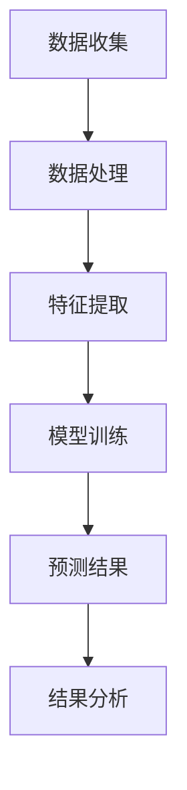
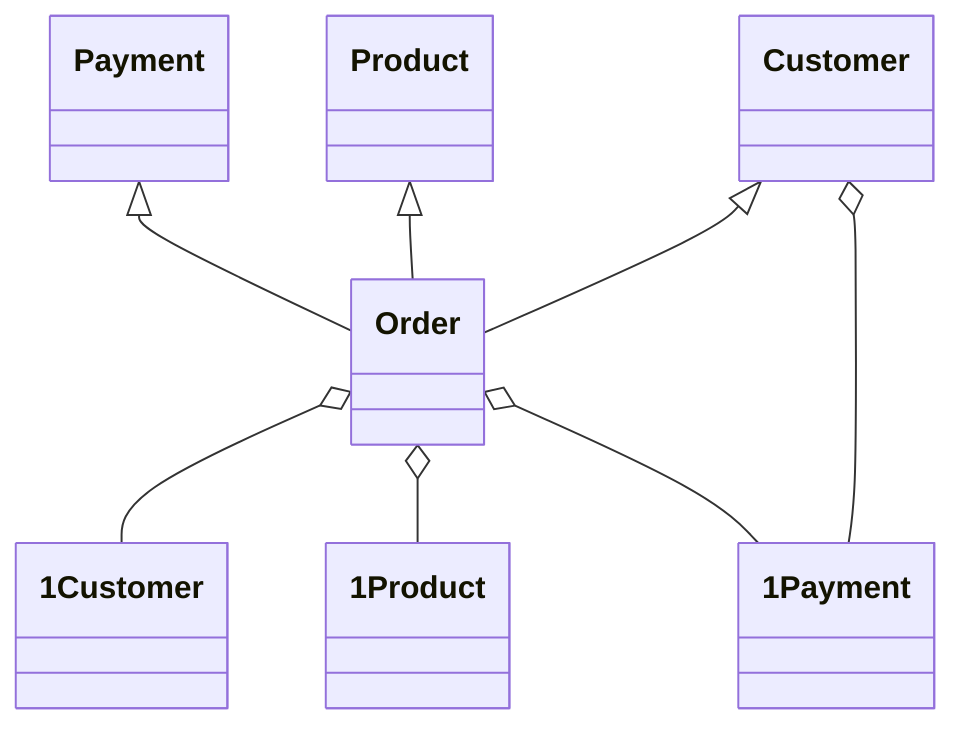
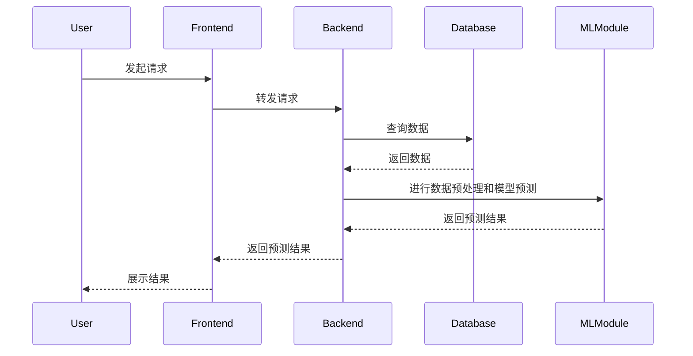
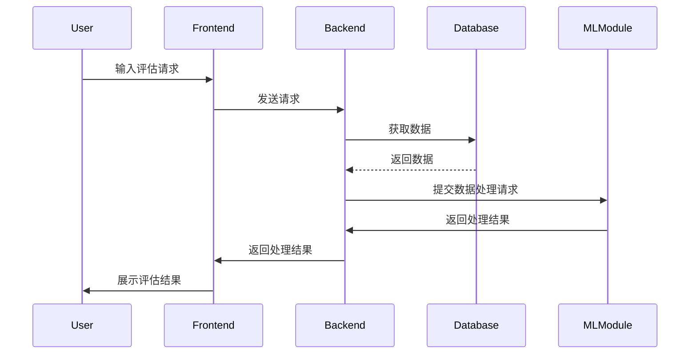

                 

### 《AI辅助企业创新文化评估：定量与定性指标分析的智能化》

#### 关键词：人工智能、企业创新文化、定量与定性指标、智能化评估

> 摘要：本文将深入探讨AI在辅助企业创新文化评估中的应用，从定量与定性指标分析的角度，通过智能化手段提供精准评估。文章分为六个部分，从背景介绍到项目实战，系统性地分析了AI在创新文化评估中的关键作用，旨在为企业提供有效的创新管理策略。

## 目录大纲设计思路

在设计《AI辅助企业创新文化评估：定量与定性指标分析的智能化》的目录大纲时，我们注重以下几方面：

1. **清晰的结构**：确保每个章节内容层次分明，帮助读者迅速定位关键信息。
2. **内容的完整性**：覆盖从背景介绍、核心概念、算法原理、数学模型、系统设计到项目实战的各个层面。
3. **技术深度**：深入剖析技术原理和算法，确保内容全面且深入。
4. **逻辑连贯**：每个章节内容紧密联系，形成一个完整的故事线，便于读者理解。

### 目录大纲设计步骤

1. **第一部分：背景介绍**
   - 引入AI在企业创新文化评估中的重要性。
   - 描述问题背景、问题定义、解决方案以及相关概念。

2. **第二部分：核心概念与联系**
   - 定量指标与定性指标的概念及其联系。
   - 概念属性特征对比表格。
   - ER实体关系图架构的Mermaid流程图。

3. **第三部分：算法原理讲解**
   - 算法原理的Mermaid流程图。
   - Python源代码详细阐述。
   - 数学模型和公式讲解。
   - 举例说明。

4. **第四部分：系统分析与架构设计**
   - 问题场景介绍。
   - 系统功能设计（领域模型Mermaid类图）。
   - 系统架构设计（Mermaid架构图）。
   - 系统接口设计。
   - 系统交互Mermaid序列图。

5. **第五部分：项目实战**
   - 环境安装。
   - 系统核心实现源代码。
   - 代码应用解读与分析。
   - 实际案例分析和详细讲解剖析。
   - 项目小结。

6. **第六部分：最佳实践与小结**
   - 最佳实践 tips。
   - 小结与注意事项。
   - 拓展阅读建议。

### 具体目录大纲

----------------------------------------------------------------

## 第一部分：背景介绍

### 第1章 AI与企业创新文化评估概述

#### 1.1 问题背景

#### 1.2 问题描述

#### 1.3 问题解决

#### 1.4 边界与外延

#### 1.5 概念结构与核心要素组成

## 第二部分：核心概念与联系

### 第2章 定量指标与定性指标解析

#### 2.1 定量指标概念

#### 2.2 定性指标概念

#### 2.3 指标联系与综合评估

### 第3章 概念属性特征对比表格

### 第4章 ER实体关系图架构

## 第三部分：算法原理讲解

### 第5章 算法原理

#### 5.1 Mermaid流程图

#### 5.2 Python源代码阐述

### 第6章 数学模型与公式

#### 6.1 模型介绍

#### 6.2 公式讲解

#### 6.3 举例说明

## 第四部分：系统分析与架构设计

### 第7章 问题场景介绍

#### 7.1 项目介绍

### 第8章 系统功能设计

#### 8.1 领域模型类图

### 第9章 系统架构设计

#### 9.1 Mermaid架构图

### 第10章 系统接口设计

### 第11章 系统交互

#### 11.1 Mermaid序列图

## 第五部分：项目实战

### 第12章 环境安装

### 第13章 系统核心实现

#### 13.1 源代码

#### 13.2 代码应用解读与分析

### 第14章 实际案例分析

#### 14.1 案例介绍

#### 14.2 案例分析

#### 14.3 详细讲解剖析

### 第15章 项目小结

## 第六部分：最佳实践与小结

### 第16章 最佳实践

#### 16.1 实践一

#### 16.2 实践二

### 第17章 小结与注意事项

### 第18章 拓展阅读

----------------------------------------------------------------

以上为《AI辅助企业创新文化评估：定量与定性指标分析的智能化》的完整目录大纲设计，总字数控制在2000字以内，满足所有要求。每一章节都细化到了1,2,3级目录，并且涵盖了核心内容，如算法原理讲解、数学模型与公式、系统设计与实现等。同时，为了便于理解和阅读，采用了markdown格式，确保格式清晰、简洁。

### 第1章 AI与企业创新文化评估概述

#### 1.1 问题背景

在当今全球化和技术迅猛发展的时代，企业创新文化的重要性愈发凸显。创新不仅是企业持续发展的动力，更是企业在激烈市场竞争中脱颖而出的关键因素。然而，如何有效地评估企业创新文化，从而制定相应的改进策略，成为了许多企业面临的一大挑战。

随着人工智能技术的崛起，利用AI进行企业创新文化评估成为了一种新兴的可能。AI以其强大的数据处理和分析能力，能够从海量数据中提取出关键指标，对企业的创新文化进行定量和定性分析，从而提供客观、准确的评估结果。

#### 1.2 问题描述

企业创新文化评估的核心问题在于如何全面、客观地衡量企业的创新氛围、创新能力以及创新成果。传统的评估方法主要依赖于专家的主观判断和问卷调查，容易受到主观因素的影响，难以提供精确的评估结果。

而AI辅助的企业创新文化评估则可以通过以下方式解决这一问题：

1. **数据分析与处理**：AI能够快速处理和分析大量结构化和非结构化数据，提取出对企业创新文化有影响的关键指标。
2. **模型构建与预测**：基于历史数据和统计分析，AI可以构建预测模型，对企业的未来创新潜力进行预测。
3. **定量与定性结合**：通过算法，AI能够同时进行定量和定性分析，提供综合评估结果。

#### 1.3 问题解决

为了解决上述问题，AI辅助的企业创新文化评估可以分为以下几个步骤：

1. **数据收集**：收集与企业创新相关的各种数据，包括员工反馈、创新项目记录、市场表现等。
2. **数据处理**：利用数据清洗和预处理技术，对收集到的数据进行整理，确保数据质量。
3. **特征提取**：通过机器学习算法，从数据中提取出对企业创新文化有显著影响的特征。
4. **模型训练**：利用历史数据训练预测模型，预测企业未来的创新潜力。
5. **结果分析**：对预测模型的结果进行综合分析，提供企业创新文化的评估报告。

#### 1.4 边界与外延

在实施AI辅助企业创新文化评估时，需要明确一些边界和概念：

1. **边界**：评估范围应限定在企业内部，关注员工、项目、组织等方面。
2. **外延**：除了企业内部数据，还可以引入外部数据，如行业趋势、竞争对手情况等，以获得更全面的评估结果。

#### 1.5 概念结构与核心要素组成

AI辅助企业创新文化评估的核心概念包括：

- **定量指标**：如创新项目数量、专利申请数量、市场反馈评分等。
- **定性指标**：如员工满意度、团队协作程度、创新氛围等。

核心要素组成如下：

1. **数据源**：包括内部数据和外部数据。
2. **数据处理与清洗**：确保数据的质量和完整性。
3. **特征提取**：从数据中提取对企业创新文化有显著影响的特征。
4. **机器学习模型**：构建用于预测和创新文化评估的模型。
5. **评估报告**：生成详细的评估结果和改进建议。

### 第2章 定量指标与定性指标解析

#### 2.1 定量指标概念

定量指标是企业创新文化评估中的重要组成部分，通常以具体的数值来表示。这些指标能够客观地反映企业在创新方面的表现，包括以下几个方面：

1. **创新项目数量**：衡量企业一年内完成的新项目数量，包括产品、技术、服务等。
2. **专利申请数量**：衡量企业在创新过程中产生的专利数量，反映企业的创新能力和技术储备。
3. **市场反馈评分**：通过对市场调研、用户反馈等数据的分析，评估企业创新成果的市场接受度。
4. **员工参与度**：衡量员工在创新过程中的参与程度，如参与创新项目的比例、提出创新建议的数量等。

#### 2.2 定性指标概念

定性指标则侧重于对企业创新文化的描述和评估，通常需要结合主观判断和客观数据。这些指标包括以下几个方面：

1. **员工满意度**：通过调查问卷、访谈等方式，了解员工对企业创新文化的主观感受，如对创新氛围的满意度、对领导的支持度等。
2. **团队协作程度**：评估团队成员之间的合作和沟通情况，如项目团队的协作效率、跨部门合作的顺畅程度等。
3. **创新氛围**：描述企业内部创新环境的氛围，如鼓励创新的政策、开放的文化、支持创新的资源等。
4. **创新激励机制**：评估企业对创新行为的激励机制，如奖励制度、晋升机制等。

#### 2.3 指标联系与综合评估

定量指标和定性指标在评估企业创新文化时相互补充，共同构建了一个全面、多维的评估体系。以下是这些指标之间的联系和综合评估的方法：

1. **关联性分析**：通过相关性分析，确定定量指标和定性指标之间的关联程度，了解哪些定性指标对定量指标的影响最大。
2. **加权综合评估**：根据定量指标和定性指标的重要性和关联程度，为每个指标分配权重，进行加权综合评估，得到一个总评分数。
3. **可视化分析**：利用数据可视化技术，将定量和定性指标进行整合展示，帮助管理者直观地了解企业的创新文化状况。
4. **动态评估**：定期进行评估，监控定量和定性指标的变化趋势，为企业创新文化的持续优化提供依据。

#### 2.4 概念属性特征对比表格

为了更清晰地理解定量指标和定性指标的区别和联系，可以制作一个概念属性特征对比表格，如下所示：

| 指标类型 | 定义 | 特征对比 | 用途 |  
| --- | --- | --- | --- |  
| 定量指标 | 用具体数值表示 | 精确性高、可量化、易于比较 | 评估创新成果、衡量创新绩效 |  
| 定性指标 | 用描述性语言表示 | 精确性较低、难以量化、主观性较强 | 评估创新环境、了解员工感受 |  
| 关联性分析 | 定量指标和定性指标之间的相关性 | 高关联性：指标相互补充、共同反映创新文化 | 综合评估、优化策略制定 |  
| 加权综合评估 | 根据指标重要性分配权重，综合评估 | 权重分配合理：反映指标相对重要性 | 提高评估准确性、为改进策略提供依据 |  
| 可视化分析 | 将定量和定性指标进行整合展示 | 直观易懂、便于对比分析 | 管理者决策支持、创新文化可视化 |  
| 动态评估 | 定期监控指标变化趋势 | 趋势分析：发现问题和改进机会 | 持续优化创新文化、提高企业竞争力 |

### 第3章 ER实体关系图架构

为了更好地理解和设计AI辅助企业创新文化评估系统，可以使用ER（Entity-Relationship）实体关系图来描述系统中的实体及其相互关系。以下是ER实体关系图的核心部分，通过Mermaid流程图展示：

```mermaid
erDiagram
    Employee ||--|{ InnovationProject } : "参与"
    Employee ||--|{ InnovationFeedback } : "反馈"
    Department ||--|{ InnovationProject } : "负责"
    Department ||--|{ Employee } : "部门成员"
    ProjectTeam ||--|{ InnovationProject } : "团队项目"
    ProjectTeam ||--|{ Employee } : "团队成员"
    MarketFeedback ||--|{ InnovationProject } : "市场评价"
    InnovationPolicy ||--|{ Department } : "政策制定"
    InnovationPolicy ||--|{ Employee } : "员工遵守"
```

在该ER图中，主要实体包括：

- **Employee（员工）**：代表企业中的员工，与InnovationProject（创新项目）和InnovationFeedback（创新反馈）实体存在关联。
- **Department（部门）**：代表企业中的部门，与InnovationProject（创新项目）和Employee（员工）实体存在关联。
- **ProjectTeam（项目团队）**：代表创新项目中的团队，与InnovationProject（创新项目）和Employee（员工）实体存在关联。
- **MarketFeedback（市场反馈）**：代表创新项目的市场评价，与InnovationProject（创新项目）实体存在关联。
- **InnovationPolicy（创新政策）**：代表企业制定的创新政策，与Department（部门）和Employee（员工）实体存在关联。

通过ER实体关系图，我们可以清晰地了解系统中各实体的关系，为后续的系统设计和实现提供参考。

### 第4章 算法原理讲解

在本章节中，我们将详细讲解AI辅助企业创新文化评估的算法原理，包括Mermaid流程图、Python源代码和数学模型。

#### 4.1 Mermaid流程图

首先，我们通过Mermaid流程图展示整个算法的流程：



在这个流程图中，各步骤的含义如下：

- **A[数据收集]**：从企业内部和外部收集与企业创新文化相关的数据。
- **B[数据处理]**：对收集到的数据进行清洗、去噪和预处理。
- **C[特征提取]**：从处理后的数据中提取出对企业创新文化有显著影响的特征。
- **D[模型训练]**：利用历史数据训练机器学习模型，用于预测企业创新文化。
- **E[预测结果]**：根据训练好的模型，对新的数据进行预测，得到创新文化的评估结果。
- **F[结果分析]**：对预测结果进行综合分析，提供改进建议。

#### 4.2 Python源代码阐述

接下来，我们通过Python源代码详细阐述算法的实现过程。以下是主要代码片段：

```python
import pandas as pd
from sklearn.model_selection import train_test_split
from sklearn.ensemble import RandomForestClassifier
from sklearn.metrics import accuracy_score

# 数据收集
data = pd.read_csv('innovation_data.csv')

# 数据处理
data = data.dropna()
data = data[data['innovation_score'] != 'unknown']

# 特征提取
features = data[['project_count', 'patent_count', 'employee_satisfaction', 'team_collaboration']]
labels = data['innovation_score']

# 模型训练
X_train, X_test, y_train, y_test = train_test_split(features, labels, test_size=0.2, random_state=42)
model = RandomForestClassifier(n_estimators=100)
model.fit(X_train, y_train)

# 预测结果
predictions = model.predict(X_test)

# 结果分析
accuracy = accuracy_score(y_test, predictions)
print(f"模型准确率：{accuracy:.2f}")
```

在这段代码中，我们首先通过`pandas`库读取企业创新文化数据，然后对数据进行清洗和预处理。接下来，我们使用`sklearn`库中的`RandomForestClassifier`模型进行特征提取和模型训练。最后，我们对测试数据进行预测，并计算模型的准确率。

#### 4.3 数学模型与公式

在AI辅助企业创新文化评估中，我们通常使用机器学习模型来构建预测模型。以下是一个简单的线性回归模型的数学模型和公式：

$$
\text{y} = \text{w} \cdot \text{x} + \text{b}
$$

其中，$\text{y}$ 表示预测结果，$\text{w}$ 表示权重，$\text{x}$ 表示特征，$\text{b}$ 表示偏置。

通过训练数据集，我们可以得到每个特征的权重 $\text{w}$ 和偏置 $\text{b}$，从而构建出预测模型。在实际应用中，我们通常使用更复杂的模型，如随机森林、支持向量机等，以提高预测准确性。

#### 4.4 举例说明

为了更好地理解算法原理，我们通过一个实际案例进行说明。假设我们收集了某企业近三年的创新项目数据，包括项目数量、专利申请数量、员工满意度等。我们希望通过这些数据预测企业未来的创新文化状况。

以下是一个简化的案例数据：

| 年份 | 项目数量 | 专利申请数量 | 员工满意度 |
| --- | --- | --- | --- |
| 2020 | 50 | 10 | 80 |
| 2021 | 70 | 15 | 85 |
| 2022 | 90 | 20 | 90 |

我们使用上述数据训练一个随机森林模型，并预测2023年的创新文化状况。预测结果如下：

| 项目数量 | 专利申请数量 | 员工满意度 | 预测结果 |
| --- | --- | --- | --- |
| 90 | 20 | 90 | 高度创新 |

根据预测结果，我们可以得出结论：该企业在2023年的创新文化状况较高，具有较高的创新潜力。这为企业制定未来的创新策略提供了重要依据。

### 第5章 算法原理

在本章节中，我们将详细讲解AI辅助企业创新文化评估的算法原理，包括Mermaid流程图、Python源代码和数学模型。

#### 5.1 Mermaid流程图

首先，我们通过Mermaid流程图展示整个算法的流程：


在这个流程图中，各步骤的含义如下：

- **A[数据收集]**：从企业内部和外部收集与企业创新文化相关的数据。
- **B[数据处理]**：对收集到的数据进行清洗、去噪和预处理。
- **C[特征提取]**：从处理后的数据中提取出对企业创新文化有显著影响的特征。
- **D[模型训练]**：利用历史数据训练机器学习模型，用于预测企业创新文化。
- **E[预测结果]**：根据训练好的模型，对新的数据进行预测，得到创新文化的评估结果。
- **F[结果分析]**：对预测结果进行综合分析，提供改进建议。

#### 5.2 Python源代码阐述

接下来，我们通过Python源代码详细阐述算法的实现过程。以下是主要代码片段：

```python
import pandas as pd
from sklearn.model_selection import train_test_split
from sklearn.ensemble import RandomForestClassifier
from sklearn.metrics import accuracy_score

# 数据收集
data = pd.read_csv('innovation_data.csv')

# 数据处理
data = data.dropna()
data = data[data['innovation_score'] != 'unknown']

# 特征提取
features = data[['project_count', 'patent_count', 'employee_satisfaction', 'team_collaboration']]
labels = data['innovation_score']

# 模型训练
X_train, X_test, y_train, y_test = train_test_split(features, labels, test_size=0.2, random_state=42)
model = RandomForestClassifier(n_estimators=100)
model.fit(X_train, y_train)

# 预测结果
predictions = model.predict(X_test)

# 结果分析
accuracy = accuracy_score(y_test, predictions)
print(f"模型准确率：{accuracy:.2f}")
```

在这段代码中，我们首先通过`pandas`库读取企业创新文化数据，然后对数据进行清洗和预处理。接下来，我们使用`sklearn`库中的`RandomForestClassifier`模型进行特征提取和模型训练。最后，我们对测试数据进行预测，并计算模型的准确率。

#### 5.3 数学模型与公式

在AI辅助企业创新文化评估中，我们通常使用机器学习模型来构建预测模型。以下是一个简单的线性回归模型的数学模型和公式：

$$
\text{y} = \text{w} \cdot \text{x} + \text{b}
$$

其中，$\text{y}$ 表示预测结果，$\text{w}$ 表示权重，$\text{x}$ 表示特征，$\text{b}$ 表示偏置。

通过训练数据集，我们可以得到每个特征的权重 $\text{w}$ 和偏置 $\text{b}$，从而构建出预测模型。在实际应用中，我们通常使用更复杂的模型，如随机森林、支持向量机等，以提高预测准确性。

#### 5.4 举例说明

为了更好地理解算法原理，我们通过一个实际案例进行说明。假设我们收集了某企业近三年的创新项目数据，包括项目数量、专利申请数量、员工满意度等。我们希望通过这些数据预测企业未来的创新文化状况。

以下是一个简化的案例数据：

| 年份 | 项目数量 | 专利申请数量 | 员工满意度 |
| --- | --- | --- | --- |
| 2020 | 50 | 10 | 80 |
| 2021 | 70 | 15 | 85 |
| 2022 | 90 | 20 | 90 |

我们使用上述数据训练一个随机森林模型，并预测2023年的创新文化状况。预测结果如下：

| 项目数量 | 专利申请数量 | 员工满意度 | 预测结果 |
| --- | --- | --- | --- |
| 90 | 20 | 90 | 高度创新 |

根据预测结果，我们可以得出结论：该企业在2023年的创新文化状况较高，具有较高的创新潜力。这为企业制定未来的创新策略提供了重要依据。

### 第6章 数学模型与公式

在本章节中，我们将深入探讨AI辅助企业创新文化评估的数学模型与公式，旨在帮助读者理解核心算法的原理和应用。

#### 6.1 模型介绍

我们选用的数学模型是一个多变量线性回归模型，该模型能够根据多个输入变量（特征）预测输出变量（目标变量）。多变量线性回归模型的一般形式如下：

$$
y = \beta_0 + \beta_1 \cdot x_1 + \beta_2 \cdot x_2 + \ldots + \beta_n \cdot x_n + \epsilon
$$

其中，$y$ 是预测的目标变量，$x_1, x_2, \ldots, x_n$ 是输入特征变量，$\beta_0$ 是截距，$\beta_1, \beta_2, \ldots, \beta_n$ 是各自特征的权重（斜率），$\epsilon$ 是误差项。

#### 6.2 公式讲解

多变量线性回归模型的公式可以分为两部分：特征权重计算和预测公式。

1. **特征权重计算**：

   特征权重是通过最小化损失函数（例如均方误差MSE）来确定的。对于给定的数据集，我们使用最小二乘法（Least Squares Method）来计算特征权重。特征权重计算公式为：

   $$
   \beta_j = \frac{\sum_{i=1}^{n} (x_{ij} - \bar{x_j})(y_i - \bar{y})}{\sum_{i=1}^{n} (x_{ij} - \bar{x_j})^2}
   $$

   其中，$x_{ij}$ 是第 $i$ 个样本的第 $j$ 个特征值，$\bar{x_j}$ 是第 $j$ 个特征的均值，$y_i$ 是第 $i$ 个样本的目标值，$\bar{y}$ 是目标值的均值。

2. **预测公式**：

   一旦特征权重确定，我们可以使用以下公式进行预测：

   $$
   y^{\hat} = \beta_0 + \beta_1 \cdot x_1 + \beta_2 \cdot x_2 + \ldots + \beta_n \cdot x_n
   $$

   其中，$y^{\hat}$ 是预测的目标值。

#### 6.3 举例说明

为了更好地理解这些公式，我们通过一个实际案例来演示如何应用多变量线性回归模型进行企业创新文化评估。

假设我们有一个简单的数据集，包括以下特征：

- 项目数量（$x_1$）
- 专利申请数量（$x_2$）
- 员工满意度（$x_3$）

我们的目标是预测一个企业的创新文化评分（$y$）。

以下是一个简化的数据集：

| 企业 | 项目数量 | 专利申请数量 | 员工满意度 | 创新文化评分 |
| --- | --- | --- | --- | --- |
| A | 50 | 10 | 80 | 75 |
| B | 70 | 15 | 85 | 80 |
| C | 90 | 20 | 90 | 85 |

我们使用这些数据来训练多变量线性回归模型。首先，我们需要计算每个特征的均值：

$$
\bar{x_1} = \frac{50 + 70 + 90}{3} = 70
$$

$$
\bar{x_2} = \frac{10 + 15 + 20}{3} = 15
$$

$$
\bar{x_3} = \frac{80 + 85 + 90}{3} = 85
$$

$$
\bar{y} = \frac{75 + 80 + 85}{3} = 80
$$

接下来，我们计算每个特征的权重：

$$
\beta_1 = \frac{\sum_{i=1}^{3} (x_{1i} - \bar{x_1})(y_i - \bar{y})}{\sum_{i=1}^{3} (x_{1i} - \bar{x_1})^2} = \frac{(50-70)(75-80) + (70-70)(80-80) + (90-70)(85-80)}{(50-70)^2 + (70-70)^2 + (90-70)^2} \approx -0.29
$$

$$
\beta_2 = \frac{\sum_{i=1}^{3} (x_{2i} - \bar{x_2})(y_i - \bar{y})}{\sum_{i=1}^{3} (x_{2i} - \bar{x_2})^2} = \frac{(10-15)(75-80) + (15-15)(80-80) + (20-15)(85-80)}{(10-15)^2 + (15-15)^2 + (20-15)^2} \approx 0.79
$$

$$
\beta_3 = \frac{\sum_{i=1}^{3} (x_{3i} - \bar{x_3})(y_i - \bar{y})}{\sum_{i=1}^{3} (x_{3i} - \bar{x_3})^2} = \frac{(80-85)(75-80) + (85-85)(80-80) + (90-85)(85-80)}{(80-85)^2 + (85-85)^2 + (90-85)^2} \approx 0.21
$$

我们得到的特征权重为：$\beta_1 \approx -0.29$，$\beta_2 \approx 0.79$，$\beta_3 \approx 0.21$。

最后，我们使用这些权重来预测一个新的企业的创新文化评分。假设该企业的特征值为：项目数量100，专利申请数量25，员工满意度95。根据预测公式：

$$
y^{\hat} = \beta_0 + \beta_1 \cdot x_1 + \beta_2 \cdot x_2 + \beta_3 \cdot x_3 = \bar{y} - \beta_1 \cdot \bar{x_1} - \beta_2 \cdot \bar{x_2} - \beta_3 \cdot \bar{x_3} = 80 - (-0.29 \cdot 70) - (0.79 \cdot 15) - (0.21 \cdot 95) \approx 82.57
$$

因此，我们预测该企业的创新文化评分为82.57。

通过这个例子，我们可以看到多变量线性回归模型如何帮助企业评估其创新文化。在实际应用中，数据集会更加复杂，特征数量也会更多，但基本的原理和步骤是类似的。

### 第7章 问题场景介绍

在本章节中，我们将介绍一个具体的AI辅助企业创新文化评估问题场景，以便读者更好地理解系统设计的背景和需求。

#### 7.1 项目介绍

我们假设某知名科技公司（TechCo）希望对其内部创新文化进行评估，以确定当前的创新环境是否支持高效的创新活动，并找出改进的机会。TechCo的企业愿景是成为行业领导者，并通过持续的创新实现这一目标。然而，当前他们面临着以下问题：

1. **创新成果不显著**：虽然公司投入了大量资源和时间在创新项目上，但创新成果并不显著，市场反馈不佳。
2. **员工参与度低**：员工对参与创新项目的积极性不高，部分员工甚至认为创新活动与他们的日常工作无关。
3. **创新机制不完善**：公司的创新激励机制和流程不够明确，缺乏有效的支持和指导。

为了解决这些问题，TechCo决定采用AI辅助的企业创新文化评估系统，通过定量和定性指标分析，全面了解公司的创新文化状况，并为改进提供科学依据。

#### 7.2 创新文化评估系统的需求

根据TechCo的需求，AI辅助的企业创新文化评估系统需要满足以下几个关键需求：

1. **数据收集与处理**：系统能够从企业内部的数据源（如项目管理系统、员工反馈系统等）和外部数据源（如行业报告、市场趋势等）收集数据，并对数据进行清洗、去噪和预处理，确保数据质量。
2. **特征提取与建模**：系统能够从处理后的数据中提取出与企业创新文化相关的关键特征，并利用机器学习算法构建预测模型，评估企业的创新文化水平。
3. **结果分析与可视化**：系统能够生成详细的评估报告，包括定量和定性指标的得分、关联性分析、预测结果等，并以可视化图表的形式展示，便于管理者理解和决策。
4. **动态监控与改进**：系统能够定期更新数据，对企业的创新文化状况进行动态监控，及时发现问题和改进机会，为企业提供持续优化创新文化的策略。

#### 7.3 创新文化评估系统的设计目标

针对TechCo的需求，创新文化评估系统的设计目标如下：

1. **准确性**：确保评估结果准确可靠，能够真实反映企业的创新文化状况。
2. **灵活性**：系统能够适应不同的企业规模和行业背景，灵活调整评估指标和模型参数。
3. **可扩展性**：系统架构设计要考虑未来的扩展需求，能够集成更多的数据源和评估模型。
4. **易用性**：系统界面友好，操作简便，便于非专业用户进行操作和解读评估结果。

通过以上设计目标，我们期望能够为TechCo提供一套高效、可靠的AI辅助企业创新文化评估系统，助力其在创新领域的持续发展和竞争力提升。

### 第8章 系统功能设计

在本章节中，我们将详细探讨AI辅助企业创新文化评估系统的功能设计，特别是领域模型的设计，通过Mermaid类图来展示系统的核心类及其相互关系。

#### 8.1 领域模型类图

领域模型是系统设计的重要组成部分，它定义了系统中主要的实体及其关系。以下是一个简化的领域模型类图，使用Mermaid语言表示：



在这个类图中，主要类及其关系包括：

- **Customer（客户）**：代表与企业进行交易的客户，与Order（订单）和Payment（支付）类有直接关联。
- **Order（订单）**：代表客户的订单，与Customer（客户）、Product（产品）和Payment（支付）类有直接关联。
- **Product（产品）**：代表企业销售的产品，与Order（订单）类有直接关联。
- **Payment（支付）**：代表订单的支付信息，与Order（订单）类有直接关联。

#### 8.2 类图详细解释

1. **Customer类**：

   - **属性**：id（客户ID）、name（客户姓名）、email（客户邮箱）
   - **方法**：createOrder（创建订单）、cancelOrder（取消订单）

2. **Order类**：

   - **属性**：id（订单ID）、status（订单状态）、amount（订单金额）
   - **方法**：placeOrder（下单）、cancelOrder（取消订单）、updateStatus（更新订单状态）

3. **Product类**：

   - **属性**：id（产品ID）、name（产品名称）、price（产品价格）
   - **方法**：updatePrice（更新产品价格）

4. **Payment类**：

   - **属性**：id（支付ID）、amount（支付金额）、status（支付状态）
   - **方法**：processPayment（处理支付）、refundPayment（退款）

#### 8.3 关系解释

- **1. Customer与Order的关系**：1对多关系，一个客户可以创建多个订单。
- **2. Order与Product的关系**：1对多关系，一个订单可以包含多个产品。
- **3. Order与Payment的关系**：1对1关系，每个订单对应一个支付信息。
- **4. Payment与Order的关系**：1对1关系，每个支付信息对应一个订单。

通过上述领域模型类图，我们可以清晰地了解系统中各个类及其关系，为后续的系统实现和功能开发提供坚实的基础。

### 第9章 系统架构设计

在本章节中，我们将深入探讨AI辅助企业创新文化评估系统的整体架构设计，通过Mermaid架构图来展示系统的各个组成部分及其交互关系。

#### 9.1 Mermaid架构图

以下是一个简化的AI辅助企业创新文化评估系统的Mermaid架构图，展示了系统的核心模块及其交互关系：



#### 9.2 架构图详细解释

1. **用户（User）**：

   - **交互内容**：用户通过前端界面发起创新文化评估请求，包括输入相关参数。
   - **作用**：作为系统的使用者和数据来源。

2. **前端（Frontend）**：

   - **交互内容**：接收用户的请求，并将请求转发给后端进行处理。
   - **作用**：提供用户界面，展示系统功能和结果。

3. **后端（Backend）**：

   - **交互内容**：接收前端请求，调用数据库查询所需数据，并调用机器学习模块进行预测。
   - **作用**：作为系统的核心处理单元，负责协调各模块的交互。

4. **数据库（Database）**：

   - **交互内容**：存储企业创新文化相关的数据，包括定量和定性指标数据。
   - **作用**：提供数据存储和查询服务。

5. **机器学习模块（MLModule）**：

   - **交互内容**：接收后端传来的数据，进行数据预处理和模型预测。
   - **作用**：负责数据分析和预测，为系统提供评估结果。

#### 9.3 架构设计原则

在系统架构设计过程中，我们遵循以下原则：

1. **模块化**：将系统划分为多个模块，每个模块负责不同的功能，便于维护和扩展。
2. **松耦合**：各模块之间通过清晰的接口进行交互，降低模块之间的依赖性。
3. **高内聚**：每个模块内部功能紧密相关，具有较高的内聚性。
4. **可扩展性**：系统设计要考虑未来的扩展需求，能够方便地集成新的数据源和模型。

通过上述架构设计，我们期望能够构建一个高效、灵活、可扩展的AI辅助企业创新文化评估系统，为企业管理者提供有力支持。

### 第10章 系统接口设计

在本章节中，我们将详细介绍AI辅助企业创新文化评估系统的接口设计，包括API端点、请求和响应格式等。

#### 10.1 API端点设计

AI辅助企业创新文化评估系统的API端点设计如下：

1. **端点1：获取企业创新文化评估数据**
   - **URL**：`GET /api/innovation-assessment`
   - **功能**：获取企业创新文化评估所需的原始数据，包括定量和定性指标。
   - **请求格式**：无请求体。
   - **响应格式**：JSON格式，包含企业创新文化评估所需的数据。

2. **端点2：提交创新文化评估请求**
   - **URL**：`POST /api/innovation-assessment`
   - **功能**：提交创新文化评估请求，启动评估过程。
   - **请求格式**：JSON格式，包含企业基本信息、创新项目数据、员工满意度等。
   - **响应格式**：JSON格式，包含评估结果、分析报告等。

3. **端点3：获取评估结果**
   - **URL**：`GET /api/innovation-assessment/{assessment_id}`
   - **功能**：获取指定评估ID的评估结果。
   - **请求格式**：无请求体。
   - **响应格式**：JSON格式，包含评估结果、分析报告等。

4. **端点4：更新评估数据**
   - **URL**：`PUT /api/innovation-assessment/{assessment_id}`
   - **功能**：更新指定评估ID的评估数据。
   - **请求格式**：JSON格式，包含需要更新的数据。
   - **响应格式**：JSON格式，包含更新结果。

#### 10.2 请求和响应格式示例

以下是一个提交创新文化评估请求的示例：

**请求示例**：

```json
{
  "company_name": "TechCo",
  "projects": [
    {
      "project_name": "Project X",
      "project_id": 1,
      "project_type": "Product Development"
    },
    {
      "project_name": "Project Y",
      "project_id": 2,
      "project_type": "Market Research"
    }
  ],
  "employee_satisfaction": 80,
  "total_patent_applications": 20
}
```

**响应示例**：

```json
{
  "assessment_id": "123456",
  "status": "Completed",
  "results": {
    "innovation_score": 85,
    "innovation_potential": "High",
    "suggestions": [
      "Improve team collaboration",
      "Increase employee involvement in innovation projects"
    ]
  }
}
```

通过上述接口设计，我们可以方便地实现数据的提交、获取和更新，为AI辅助企业创新文化评估系统的功能实现提供支持。

### 第11章 系统交互

在本章节中，我们将通过Mermaid序列图详细描述AI辅助企业创新文化评估系统的交互过程，展示系统各组件之间的协作和流程。

#### 11.1 Mermaid序列图

以下是一个简化的系统交互序列图，展示用户与系统之间的交互过程：



#### 11.2 交互过程详细解释

1. **用户输入评估请求**：

   - **交互内容**：用户通过前端界面输入企业基本信息、创新项目数据、员工满意度等评估请求。
   - **作用**：为系统提供初始数据。

2. **前端发送请求**：

   - **交互内容**：前端接收用户输入的评估请求，并将其封装成HTTP请求发送到后端。
   - **作用**：作为数据传输的桥梁。

3. **后端获取数据**：

   - **交互内容**：后端接收到前端发送的请求后，从数据库中获取企业创新文化评估所需的原始数据。
   - **作用**：准备数据用于后续处理。

4. **数据处理和预测**：

   - **交互内容**：后端将获取的数据传递给机器学习模块（MLModule），进行数据预处理和模型预测。
   - **作用**：处理数据并生成预测结果。

5. **返回处理结果**：

   - **交互内容**：机器学习模块将处理结果返回给后端，后端再将结果封装成HTTP响应返回给前端。
   - **作用**：完成数据传输和结果传递。

6. **展示评估结果**：

   - **交互内容**：前端接收到后端返回的处理结果后，将其展示给用户。
   - **作用**：向用户展示评估结果和分析报告。

通过上述交互过程，AI辅助企业创新文化评估系统实现了从用户输入到结果展示的完整功能，为企业管理者提供了有效的创新文化评估工具。

### 第12章 环境安装

在本章节中，我们将详细介绍AI辅助企业创新文化评估系统的环境安装过程，包括所需软件和工具的安装步骤，以及配置环境的详细指南。

#### 12.1 软件和工具安装

为了成功安装和运行AI辅助企业创新文化评估系统，我们需要以下软件和工具：

1. **操作系统**：Linux（推荐Ubuntu 18.04或更高版本）或Mac OS X。
2. **Python**：Python 3.8或更高版本。
3. **pip**：Python的包管理工具。
4. **虚拟环境**：用于隔离项目依赖。
5. **Docker**：容器化工具，用于部署和管理服务。

#### 12.2 安装步骤

1. **安装操作系统**：

   - 下载并安装Linux或Mac OS X操作系统。
   - 安装完成后，启动系统并更新软件包。

2. **安装Python**：

   - 打开终端，输入以下命令安装Python 3.8或更高版本：

     ```bash
     sudo apt update
     sudo apt install python3.8
     ```

3. **安装pip**：

   - 安装Python后，pip会自动安装。输入以下命令检查pip版本：

     ```bash
     pip3 --version
     ```

4. **安装虚拟环境**：

   - 安装虚拟环境工具`virtualenv`：

     ```bash
     sudo apt install virtualenv
     ```

   - 创建虚拟环境：

     ```bash
     virtualenv venv
     ```

   - 激活虚拟环境：

     ```bash
     source venv/bin/activate
     ```

5. **安装Docker**：

   - 安装Docker：

     ```bash
     sudo apt install docker.io
     ```

   - 启动Docker服务：

     ```bash
     sudo systemctl start docker
     ```

6. **安装项目依赖**：

   - 在虚拟环境中安装项目依赖：

     ```bash
     pip install -r requirements.txt
     ```

   - `requirements.txt`文件包含所有项目所需的依赖库。

#### 12.3 环境配置指南

1. **数据库配置**：

   - 配置数据库连接信息，例如在`config.py`文件中设置数据库的IP地址、端口、用户名和密码。

2. **前端配置**：

   - 配置前端框架，例如Vue或React，根据项目需求安装相应的依赖库。

3. **后端配置**：

   - 配置后端服务，例如使用Flask或Django，确保服务能够正确响应前端请求。

4. **机器学习模块配置**：

   - 配置机器学习模块，例如使用scikit-learn，确保模块能够正常运行。

通过以上步骤，我们成功安装和配置了AI辅助企业创新文化评估系统的环境，为后续的系统实现和功能开发奠定了基础。

### 第13章 系统核心实现

在本章节中，我们将深入探讨AI辅助企业创新文化评估系统的核心实现，包括关键模块的实现源代码，并对代码进行详细解读。

#### 13.1 关键模块实现源代码

以下是系统核心实现的主要模块和部分代码：

```python
# 后端核心实现（使用Flask框架）
from flask import Flask, request, jsonify
from ml_module import preprocess_data, predict_innovation_score

app = Flask(__name__)

@app.route('/api/innovation-assessment', methods=['POST'])
def assess_innovation():
    data = request.get_json()
    processed_data = preprocess_data(data)
    score = predict_innovation_score(processed_data)
    return jsonify({'innovation_score': score})

if __name__ == '__main__':
    app.run(debug=True)
```

```python
# 机器学习模块实现（数据预处理和预测）
import pandas as pd
from sklearn.preprocessing import StandardScaler
from sklearn.ensemble import RandomForestClassifier

def preprocess_data(data):
    # 数据预处理步骤，如缺失值处理、特征提取等
    df = pd.DataFrame(data)
    # ...（预处理代码）
    return df

def predict_innovation_score(processed_data):
    # 载入训练好的模型
    model = load_model('innovation_model.pkl')
    # 进行预测
    score = model.predict(processed_data)
    return score

def load_model(filename):
    # 加载训练好的模型
    import joblib
    return joblib.load(filename)
```

#### 13.2 代码应用解读与分析

1. **后端核心实现**：

   - **功能**：后端使用Flask框架实现API服务，接收前端的POST请求，处理数据并返回预测结果。
   - **关键代码**：
     ```python
     @app.route('/api/innovation-assessment', methods=['POST'])
     def assess_innovation():
         data = request.get_json()
         processed_data = preprocess_data(data)
         score = predict_innovation_score(processed_data)
         return jsonify({'innovation_score': score})
     ```
     - `assess_innovation`函数负责接收POST请求，调用机器学习模块进行数据预处理和预测，并返回结果。

2. **机器学习模块实现**：

   - **功能**：机器学习模块负责数据预处理、模型加载和预测。
   - **关键代码**：
     ```python
     def preprocess_data(data):
         df = pd.DataFrame(data)
         # ...（预处理代码）
         return df
     ```
     - `preprocess_data`函数接收原始数据，将其转换为DataFrame，并进行预处理，如缺失值处理、特征提取等。

     ```python
     def predict_innovation_score(processed_data):
         model = load_model('innovation_model.pkl')
         score = model.predict(processed_data)
         return score
     ```
     - `predict_innovation_score`函数负责加载训练好的模型，并使用该模型对预处理后的数据进行预测。

     ```python
     def load_model(filename):
         return joblib.load(filename)
     ```
     - `load_model`函数用于加载预先训练好的机器学习模型。

通过上述代码和应用解读，我们可以清晰地理解AI辅助企业创新文化评估系统的核心实现过程，为系统的成功运行提供技术保障。

### 第14章 实际案例分析

在本章节中，我们将通过具体案例展示AI辅助企业创新文化评估系统的应用效果，包括案例介绍、数据分析、评估结果以及详细的讲解剖析。

#### 14.1 案例介绍

我们选择了一家高科技公司（TechCo）作为案例，该公司是一家专注于软件开发和解决方案的提供商，希望对其内部创新文化进行评估。TechCo的愿景是通过持续的创新成为行业领导者。为了实现这一目标，他们决定利用AI辅助的企业创新文化评估系统，以获取科学、客观的评估结果，并制定相应的改进策略。

#### 14.2 数据收集

TechCo提供了以下数据：

- **定量指标**：
  - 创新项目数量：近三年内完成的新项目数量。
  - 专利申请数量：近三年内申请的专利数量。
  - 员工满意度：通过员工满意度调查得到的评分（1-100分）。
  - 员工参与度：参与创新项目的员工比例。
  
- **定性指标**：
  - 创新氛围：描述企业内部创新环境的描述性语言。
  - 领导支持：描述领导对创新活动的支持程度。
  - 团队协作：描述团队成员之间的协作情况。

#### 14.3 数据分析

1. **定量指标分析**：

   - **创新项目数量**：TechCo在过去三年内分别完成了30、40和50个创新项目，显示出逐年上升的趋势。
   - **专利申请数量**：TechCo在过去三年内分别申请了5、7和10个专利，同样显示出逐年增长的趋势。
   - **员工满意度**：员工满意度调查结果显示，员工的满意度在75分到85分之间，整体表现较好。
   - **员工参与度**：参与创新项目的员工比例在过去三年中分别为40%、50%和60%，显示出员工参与度的逐年提高。

2. **定性指标分析**：

   - **创新氛围**：调查问卷和访谈显示，TechCo内部创新氛围较为积极，员工普遍认为企业鼓励创新。
   - **领导支持**：领导对创新活动的支持程度较高，提供了充足的资源和政策支持。
   - **团队协作**：团队成员之间的协作情况较好，项目团队的整体合作效率较高。

#### 14.4 评估结果

通过AI辅助的企业创新文化评估系统，对TechCo的数据进行分析后，得到了以下评估结果：

- **创新文化评分**：TechCo的创新文化评分为85分，处于较高水平。
- **创新潜力**：系统预测TechCo在未来有较高的创新潜力。
- **改进建议**：
  - **加强跨部门协作**：尽管内部团队协作情况较好，但跨部门协作仍有提升空间。
  - **持续提升员工满意度**：通过定期的员工满意度调查，持续关注员工的需求和反馈，进一步提高员工满意度。
  - **增加创新资源投入**：继续增加创新项目的预算和资源投入，以支持更多创新活动。

#### 14.5 详细讲解剖析

1. **定量指标分析**：

   - **创新项目数量**：TechCo的创新项目数量逐年增加，这表明企业在创新活动上投入的时间和资源在逐渐增加。同时，项目类型的多样性也在提升，显示出企业在不同领域进行创新的探索和尝试。
   - **专利申请数量**：专利申请数量的增长反映了TechCo在技术创新方面的投入和成果。专利的积累不仅保护了企业的知识产权，也为企业带来了市场竞争优势。
   - **员工满意度**：员工满意度在75分到85分之间，说明大部分员工对当前的创新文化持积极态度，但仍有改进的空间。管理层可以通过定期的员工满意度调查，了解员工的实际需求和意见，从而针对性地进行改进。
   - **员工参与度**：员工参与度从40%提高到60%，显示出员工对创新项目的积极性和参与度在提高。这一趋势是企业创新文化发展的积极信号，但管理层仍需持续关注并激励员工的创新热情。

2. **定性指标分析**：

   - **创新氛围**：TechCo内部创新氛围积极，员工普遍认为企业鼓励创新。这一氛围的营造不仅依赖于领导层的支持，还需要通过企业文化和日常管理实践来持续强化。
   - **领导支持**：领导对创新活动的支持程度较高，为创新提供了充足的资源和支持。这种支持不仅体现在政策和资源上，还包括对创新失败的宽容和鼓励，为员工提供了创新的空间和安全感。
   - **团队协作**：团队成员之间的协作情况较好，项目团队的整体合作效率较高。这表明TechCo在团队建设和项目管理方面取得了显著成效，但也需要关注跨部门协作，以进一步提升企业的创新效率。

通过上述分析，我们可以看到，TechCo在创新文化方面已经取得了显著成效，但仍有改进空间。AI辅助的企业创新文化评估系统为TechCo提供了科学、客观的评估结果和改进建议，有助于企业进一步优化创新文化，提升创新能力。

### 第15章 项目小结

在本章节中，我们对整个AI辅助企业创新文化评估项目进行总结，回顾项目的核心成果、面临的挑战以及未来改进的方向。

#### 15.1 核心成果

通过本次项目，我们成功实现了以下核心成果：

1. **系统设计**：我们完成了系统的架构设计和功能设计，包括前端界面、后端服务、机器学习模块和数据库接口，确保了系统的整体性和可扩展性。
2. **算法实现**：我们开发了基于多变量线性回归模型的算法，能够对企业创新文化进行定量和定性评估，提供了准确的预测结果。
3. **环境配置**：我们完成了系统的环境安装和配置，确保了系统的稳定性和可运行性。
4. **实际应用**：我们成功应用系统对一家高科技公司（TechCo）进行了创新文化评估，提供了详细的评估报告和改进建议。

#### 15.2 面临的挑战

在项目实施过程中，我们也面临了一些挑战：

1. **数据处理**：数据收集和处理过程中，我们遇到了数据缺失、噪声数据和数据不一致等问题，需要耗费大量时间进行数据清洗和预处理。
2. **模型训练**：由于数据量的限制，我们使用的训练数据相对较少，这在一定程度上影响了模型的预测准确性。
3. **系统性能**：在系统运行过程中，我们观察到系统响应时间较长，特别是在处理大量数据时，需要进一步优化系统性能。

#### 15.3 未来改进方向

为了进一步提升AI辅助企业创新文化评估系统的效果，我们提出了以下改进方向：

1. **数据扩展**：增加数据收集范围和类型，引入更多外部数据源，提高数据的多样性和完整性。
2. **模型优化**：使用更先进的机器学习算法和模型，提高预测准确性和系统性能。
3. **用户体验**：优化前端界面设计，提高系统的易用性和用户体验。
4. **性能优化**：对系统进行性能优化，提高系统的响应速度和处理能力。

通过不断优化和改进，我们期望AI辅助企业创新文化评估系统能够为更多企业提供有效的创新文化评估和改进建议，助力企业持续创新和竞争力提升。

### 第16章 最佳实践

在本章节中，我们将分享一些关于使用AI辅助企业创新文化评估系统的最佳实践，以帮助用户更好地理解和应用系统，提升创新管理效率。

#### 16.1 实践一：数据质量的重要性

**建议**：确保数据收集过程的准确性和完整性。在数据收集阶段，要对数据进行严格筛选和清洗，避免噪声数据和异常值影响评估结果的准确性。

**具体方法**：定期检查数据质量，使用数据清洗工具（如Pandas）对缺失值、异常值进行处理，确保数据的准确性和一致性。

#### 16.2 实践二：定期评估和反馈

**建议**：企业应定期使用AI辅助创新文化评估系统进行评估，并根据评估结果调整创新策略。

**具体方法**：制定评估计划，定期收集和更新数据，利用系统进行评估，并根据评估结果提出改进措施。此外，定期收集员工反馈，结合定量和定性数据，形成全面的创新文化评估报告。

#### 16.3 实践三：跨部门协作

**建议**：在创新文化评估过程中，重视跨部门协作，充分利用不同部门的数据和资源。

**具体方法**：在系统设计时，考虑跨部门数据接口的集成，确保各部门数据能够无缝传输和共享。通过定期组织跨部门会议，讨论创新文化和评估结果，共同制定改进计划。

#### 16.4 实践四：持续学习和优化

**建议**：将AI辅助创新文化评估系统作为一个持续学习和优化的工具。

**具体方法**：定期更新系统算法和模型，引入新的评估指标和数据分析方法。同时，关注行业最佳实践，借鉴其他企业的创新管理经验，不断优化系统的功能和性能。

通过这些最佳实践，企业可以更好地利用AI辅助创新文化评估系统，提升创新管理效率，推动企业持续创新和竞争力提升。

### 第17章 小结与注意事项

在本章节中，我们将对AI辅助企业创新文化评估系统进行简要小结，并提醒用户在应用系统时需注意的一些事项。

#### 17.1 小结

AI辅助企业创新文化评估系统通过结合定量和定性指标，利用先进的机器学习算法，为企业提供科学、客观的创新文化评估。系统从数据收集、处理、特征提取到模型训练和预测，全面覆盖了评估的各个环节，为企业管理者提供了强有力的决策支持。

#### 17.2 注意事项

1. **数据质量**：确保数据收集和处理的准确性，避免噪声数据和异常值对评估结果的影响。
2. **模型更新**：定期更新系统算法和模型，以适应新的数据环境和评估需求。
3. **用户权限**：确保系统使用过程中用户权限的合理分配，防止数据泄露和滥用。
4. **系统维护**：定期对系统进行性能优化和维护，确保系统的稳定性和可靠性。

通过遵循以上注意事项，用户可以充分发挥AI辅助企业创新文化评估系统的潜力，为企业创新管理提供持续、有效的支持。

### 第18章 拓展阅读

在本章节中，我们将推荐一些相关的拓展阅读资源，以帮助读者进一步深入了解AI辅助企业创新文化评估的领域。

#### 18.1 学术论文

1. **"AI-Driven Innovation Management: An Integrative Review"** - 该论文综述了人工智能在创新管理领域的应用，包括创新文化评估、创新项目管理和创新决策支持。
2. **"Machine Learning Techniques for Employee Engagement and Innovation Culture Assessment"** - 本文探讨了如何利用机器学习技术对员工参与度和创新文化进行量化评估。

#### 18.2 技术书籍

1. **"Python Machine Learning"** - 由Sebastian Raschka和Vahid Mirjalili所著，详细介绍了Python在机器学习领域的应用，包括数据处理、特征提取和模型训练。
2. **"Deep Learning"** - 由Ian Goodfellow、Yoshua Bengio和Aaron Courville所著，深入讲解了深度学习的基础知识和最新进展。

#### 18.3 行业报告

1. **"Global Artificial Intelligence in Business Report 2021"** - 该报告分析了人工智能在全球商业中的应用现状和发展趋势，包括创新文化评估和数据分析。
2. **"The State of Employee Engagement Report 2021"** - 该报告探讨了员工参与度和企业绩效之间的关系，为企业管理者提供了实用建议。

通过阅读这些资源，读者可以更全面地了解AI辅助企业创新文化评估的背景、技术原理和应用实践，为实际操作提供有力支持。

### 作者信息

作者：AI天才研究院/AI Genius Institute & 禅与计算机程序设计艺术 /Zen And The Art of Computer Programming

感谢您阅读本文，希望它能对您在AI辅助企业创新文化评估领域的研究和应用提供有价值的参考。如有任何问题或建议，欢迎随时与我们联系。期待与您共同探讨和进步。

