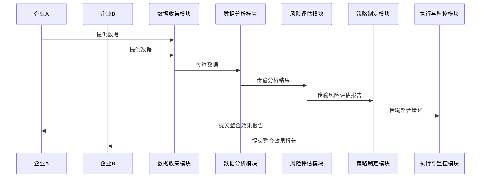

                 

## 3. 整合路径规划方法

### 3.1 背景介绍

在当今快速变化的企业环境中，企业并购已成为一种常见的战略手段，通过整合资源、技术、市场和人才，实现企业的快速发展和市场优势。然而，并购的成功不仅依赖于财务上的合理定价，更重要的是如何有效整合并购双方的业务、文化和组织结构，以实现协同效应。整合路径规划是企业并购成功的关键环节之一，它涉及资源整合、业务协同、管理优化等多个方面。

#### 3.1.1 核心概念术语说明

- **并购**：指一家企业收购另一家企业，通常涉及财务投资和战略规划。
- **整合路径规划**：在并购后，企业需要制定一个详细的整合计划，包括资源整合、业务协同、文化融合等。
- **协同效应**：并购后，企业通过资源互补、技术融合、市场拓展等实现的整体效益大于各部分的简单相加。

#### 3.1.2 问题背景

随着全球化和市场竞争的加剧，企业并购已经成为企业扩张和转型的常用手段。然而，并购后的整合并不总是一帆风顺，许多企业在整合过程中面临资源浪费、文化冲突、效率低下等问题，导致并购效果不理想。因此，如何制定有效的整合路径规划，成为企业并购成功的关键。

#### 3.1.3 问题描述

整合路径规划的问题可以概括为以下几点：

1. **资源整合**：如何有效地整合并购双方的人力资源、技术资源、资金资源等？
2. **业务协同**：如何实现并购双方的业务协同，提高整体运营效率？
3. **文化融合**：如何处理并购双方的文化差异，实现企业文化融合？
4. **风险管理**：如何评估并购后的风险，并制定相应的风险应对策略？

#### 3.1.4 问题解决

为了解决上述问题，企业需要：

1. **全面评估并购对象**：在并购前，进行全面、深入的评估，包括财务状况、业务模式、管理团队、企业文化等方面。
2. **制定详细的整合计划**：根据并购双方的实际情况，制定一个详细的整合计划，包括资源整合、业务协同、文化融合等。
3. **建立高效的执行团队**：建立专门的整合团队，负责整合计划的实施和监督。
4. **持续监控和调整**：在整合过程中，持续监控整合效果，根据实际情况进行及时的调整。

#### 3.1.5 边界与外延

- **边界**：整合路径规划主要涉及并购后的整合过程，不包括并购前的谈判、定价等环节。
- **外延**：整合路径规划不仅适用于企业并购，也适用于其他形式的资源整合，如企业重组、部门合并等。

#### 3.1.6 概念结构与核心要素组成

- **概念结构**：整合路径规划是一个包含多个环节的复杂过程，包括评估、计划、执行、监控和调整。
- **核心要素**：资源整合、业务协同、文化融合、风险管理。

### 3.2 核心概念与联系

#### 3.2.1 核心概念原理

整合路径规划的核心概念包括资源整合、业务协同、文化融合和风险管理。以下是对这些核心概念的详细解释：

1. **资源整合**：资源整合是指将并购双方的人力资源、技术资源、资金资源等进行有效整合，实现资源的最优配置和利用。资源整合的成功关键在于如何平衡双方资源，发挥各自优势，实现资源互补。
   
2. **业务协同**：业务协同是指并购双方通过整合业务流程、优化资源配置、提高运营效率，实现业务的协同效应。业务协同的目标是提高整体运营效率，降低成本，提升市场竞争力。

3. **文化融合**：文化融合是指处理并购双方的文化差异，实现企业文化的融合。文化融合对于并购成功至关重要，因为企业文化直接影响员工的价值观、工作方式和行为习惯。

4. **风险管理**：风险管理是指对并购后的潜在风险进行评估和管理，包括财务风险、市场风险、运营风险等。风险管理旨在降低并购风险，确保并购的顺利实施。

#### 3.2.2 概念属性特征对比表格

| 概念        | 定义                                                         | 属性特征                    | 关联关系                      |
|-------------|------------------------------------------------------------|--------------------------|-----------------------------|
| 资源整合    | 将并购双方的人力资源、技术资源、资金资源等进行整合           | 资源共享、优势互补         | 支持业务协同和文化融合       |
| 业务协同    | 通过整合业务流程、优化资源配置，实现业务的协同效应           | 效率提升、成本降低         | 依赖于资源整合和文化融合     |
| 文化融合    | 处理并购双方的文化差异，实现企业文化的融合                   | 共同价值观、协同工作       | 需要资源整合和业务协同支持   |
| 风险管理    | 对并购后的潜在风险进行评估和管理，降低并购风险               | 风险识别、风险控制         | 与所有整合过程密切相关       |

#### 3.2.3 ER实体关系图架构

```mermaid
erDiagram
  Aasurable|..|>风险因素 : 风险因素评估
  Aasurable|..|>业务流程 : 业务流程整合
  Aasurable|..|>文化资源 : 文化资源融合
  Aasurable|..|>资源配置 : 资源整合
  业务流程整合 ..>||> 资源整合
  业务流程整合 ..>||> 文化资源
  文化资源融合 ..>||> 资源整合
  文化资源融合 ..>||> 风险管理
  风险因素评估 ..>||> 风险管理
```

### 3.3 算法原理讲解

整合路径规划是一个复杂的过程，需要结合多种算法和技术来实现。以下是一个简化的算法流程，用于指导整合路径规划：

#### 3.3.1 算法流程

1. **数据收集**：收集并购双方的相关数据，包括财务数据、业务数据、人力资源数据、市场数据等。
2. **数据分析**：对收集到的数据进行预处理和分析，识别并购双方的优势、劣势、机会和威胁。
3. **风险评估**：基于数据分析结果，对并购风险进行评估，识别潜在的风险因素。
4. **整合策略制定**：根据风险评估结果，制定资源整合、业务协同、文化融合等整合策略。
5. **执行与监控**：实施整合策略，并持续监控整合效果，根据实际情况进行动态调整。

#### 3.3.2 数学模型和公式

整合路径规划的数学模型可以基于多目标优化理论，如下所示：

$$
\begin{aligned}
\text{maximize} \quad & \sum_{i=1}^{n} p_i \cdot f_i(x) \\
\text{subject to} \quad & g_i(x) \leq 0, \quad i=1,2,...,m \\
& x \in X
\end{aligned}
$$

其中，$p_i$ 表示第 $i$ 个目标的权重，$f_i(x)$ 表示第 $i$ 个目标函数，$g_i(x)$ 表示第 $i$ 个约束条件，$x$ 表示决策变量，$X$ 表示决策变量的可行域。

#### 3.3.3 举例说明

假设企业 $A$ 和企业 $B$ 进行并购，我们需要制定一个整合路径规划。以下是一个简化的例子：

1. **数据收集**：收集企业 $A$ 和企业 $B$ 的财务数据、业务数据、人力资源数据等。
2. **数据分析**：分析数据，识别企业 $A$ 和企业 $B$ 的优势（如市场占有率、研发能力）和劣势（如管理效率、市场份额）。
3. **风险评估**：评估并购后的风险，如市场风险、财务风险、管理风险等。
4. **整合策略制定**：根据数据分析结果和风险评估，制定整合策略，如资源优化配置、业务流程整合、文化融合等。
5. **执行与监控**：实施整合策略，并持续监控整合效果，根据实际情况进行调整。

### 3.4 系统分析与架构设计方案

#### 3.4.1 问题场景介绍

企业并购后的整合路径规划是一个涉及多个部门、多个业务流程的复杂过程。为了提高整合效率，需要建立一套智能化的整合路径规划系统，实现自动化、智能化管理。

#### 3.4.2 项目介绍

本项目旨在开发一套基于人工智能的企业并购整合路径规划系统，通过数据分析、风险评估、策略制定等功能，为企业提供智能化的整合路径规划方案。

#### 3.4.3 系统功能设计

- **数据收集模块**：负责收集企业并购双方的相关数据，包括财务数据、业务数据、人力资源数据等。
- **数据分析模块**：对收集到的数据进行预处理和分析，生成数据报告。
- **风险评估模块**：基于数据分析结果，对并购风险进行评估，生成风险评估报告。
- **策略制定模块**：根据风险评估结果，制定资源整合、业务协同、文化融合等整合策略。
- **执行与监控模块**：实施整合策略，并持续监控整合效果，生成整合效果报告。

#### 3.4.4 系统架构设计



#### 3.4.5 系统接口设计和系统交互

- **接口设计**：系统提供 RESTful API 接口，供企业调用。
- **系统交互**：企业通过 API 接口提交数据，获取分析报告、风险评估报告和整合策略。

### 3.5 项目实战

#### 3.5.1 环境安装

1. 安装 Python 环境（Python 3.8 或以上版本）。
2. 安装必要的库（如 NumPy、Pandas、Scikit-learn、Matplotlib 等）。

```bash
pip install numpy pandas scikit-learn matplotlib
```

#### 3.5.2 系统核心实现源代码

以下是系统核心功能模块的实现代码：

```python
# 数据收集模块
import pandas as pd

def collect_data(file_path):
    data = pd.read_csv(file_path)
    return data

# 数据分析模块
from sklearn.preprocessing import StandardScaler

def analyze_data(data):
    scaler = StandardScaler()
    scaled_data = scaler.fit_transform(data)
    return scaled_data

# 风险评估模块
from sklearn.ensemble import RandomForestClassifier

def assess_risk(data):
    model = RandomForestClassifier()
    model.fit(data[:, :-1], data[:, -1])
    return model

# 策略制定模块
import numpy as np

def formulate_strategy(risk_model, data):
    predictions = risk_model.predict(data)
    strategy = []
    for prediction in predictions:
        if prediction == 1:
            strategy.append("加强风险管理")
        else:
            strategy.append("保持现状")
    return strategy

# 执行与监控模块
def execute_and_monitor(strategy, data):
    results = []
    for strategy_item in strategy:
        if strategy_item == "加强风险管理":
            results.append(adjust_risk_management(data))
        else:
            results.append("无调整")
    return results

# 辅助函数
def adjust_risk_management(data):
    # 调整风险管理策略的具体实现
    return "风险调整完成"

# 主函数
def main():
    file_path = "data.csv"
    data = collect_data(file_path)
    scaled_data = analyze_data(data)
    risk_model = assess_risk(scaled_data)
    strategy = formulate_strategy(risk_model, scaled_data)
    results = execute_and_monitor(strategy, scaled_data)
    print("整合路径规划结果：", results)

if __name__ == "__main__":
    main()
```

#### 3.5.3 代码应用解读与分析

1. **数据收集模块**：使用 Pandas 库读取数据，为后续的数据分析和风险评估提供基础。
2. **数据分析模块**：使用 Scikit-learn 库中的 StandardScaler 类进行数据标准化，提高模型性能。
3. **风险评估模块**：使用 Scikit-learn 库中的 RandomForestClassifier 类构建随机森林模型，进行风险评估。
4. **策略制定模块**：根据风险评估结果，制定相应的整合策略。
5. **执行与监控模块**：根据整合策略，执行相应的风险调整措施，并监控整合效果。

#### 3.5.4 实际案例分析和详细讲解剖析

假设企业 $A$ 和企业 $B$ 进行并购，以下是对并购后整合路径规划的实际案例分析和讲解：

1. **数据收集**：收集企业 $A$ 和企业 $B$ 的财务数据、业务数据、人力资源数据等，并存为 CSV 文件。
2. **数据分析**：对数据进行分析，识别出企业 $A$ 和企业 $B$ 的优势（如企业 $A$ 的市场份额较大，企业 $B$ 的研发能力较强）和劣势（如企业 $A$ 的管理效率较低，企业 $B$ 的市场份额较小）。
3. **风险评估**：基于数据分析结果，评估并购后的风险，如市场风险（市场份额下降）、财务风险（财务状况不稳定）等。
4. **策略制定**：根据风险评估结果，制定整合策略，如加强市场风险管理、提升管理效率等。
5. **执行与监控**：实施整合策略，并持续监控整合效果，根据实际情况进行调整。

#### 3.5.5 项目小结

本项目通过开发一套基于人工智能的企业并购整合路径规划系统，实现了对并购后整合过程的智能化管理。通过实际案例分析和讲解，展示了系统在数据收集、数据分析、风险评估、策略制定和执行与监控等方面的应用。然而，整合路径规划是一个复杂的动态过程，需要根据实际情况进行不断的调整和优化。

### 3.6 最佳实践 Tips

1. **数据收集**：确保数据的准确性和完整性，避免数据错误对评估结果的影响。
2. **风险评估**：充分考虑各种潜在风险，制定全面的评估模型。
3. **策略制定**：根据并购双方的实际情况，制定切实可行的整合策略。
4. **执行与监控**：持续监控整合效果，根据实际情况进行调整。

### 3.7 小结

整合路径规划是企业并购成功的关键环节，通过系统化、智能化的路径规划，可以提高并购成功率，实现企业的持续发展。本文介绍了整合路径规划的核心概念、算法原理、系统架构和项目实战，为企业并购整合提供了理论指导和实践参考。

### 3.8 注意事项

1. **数据质量**：数据是整合路径规划的基础，确保数据的准确性和完整性至关重要。
2. **风险评估**：充分评估并购后的风险，制定相应的应对策略。
3. **策略制定**：根据实际情况制定整合策略，确保策略的可行性和有效性。
4. **动态调整**：整合路径规划是一个动态过程，需要根据实际情况进行持续调整。

### 3.9 拓展阅读

- 《企业并购与整合管理》
- 《人工智能在商业决策中的应用》
- 《大数据分析技术与应用》

---

## 3. 整合路径规划方法

### 3.1 背景介绍

在当今快速变化的企业环境中，企业并购已成为一种常见的战略手段，通过整合资源、技术、市场和人才，实现企业的快速发展和市场优势。然而，并购的成功不仅依赖于财务上的合理定价，更重要的是如何有效整合并购双方的业务、文化和组织结构，以实现协同效应。整合路径规划是企业并购成功的关键环节之一，它涉及资源整合、业务协同、文化融合等多个方面。

#### 3.1.1 核心概念术语说明

- **并购**：指一家企业收购另一家企业，通常涉及财务投资和战略规划。
- **整合路径规划**：在并购后，企业需要制定一个详细的整合计划，包括资源整合、业务协同、文化融合等。
- **协同效应**：并购后，企业通过资源互补、技术融合、市场拓展等实现的整体效益大于各部分的简单相加。

#### 3.1.2 问题背景

随着全球化和市场竞争的加剧，企业并购已经成为企业扩张和转型的常用手段。然而，并购后的整合并不总是一帆风顺，许多企业在整合过程中面临资源浪费、文化冲突、效率低下等问题，导致并购效果不理想。因此，如何制定有效的整合路径规划，成为企业并购成功的关键。

#### 3.1.3 问题描述

整合路径规划的问题可以概括为以下几点：

1. **资源整合**：如何有效地整合并购双方的人力资源、技术资源、资金资源等？
2. **业务协同**：如何实现并购双方的业务协同，提高整体运营效率？
3. **文化融合**：如何处理并购双方的文化差异，实现企业文化融合？
4. **风险管理**：如何评估并购后的风险，并制定相应的风险应对策略？

#### 3.1.4 问题解决

为了解决上述问题，企业需要：

1. **全面评估并购对象**：在并购前，进行全面、深入的评估，包括财务状况、业务模式、管理团队、企业文化等方面。
2. **制定详细的整合计划**：根据并购双方的实际情况，制定一个详细的整合计划，包括资源整合、业务协同、文化融合等。
3. **建立高效的执行团队**：建立专门的整合团队，负责整合计划的实施和监督。
4. **持续监控和调整**：在整合过程中，持续监控整合效果，根据实际情况进行及时的调整。

#### 3.1.5 边界与外延

- **边界**：整合路径规划主要涉及并购后的整合过程，不包括并购前的谈判、定价等环节。
- **外延**：整合路径规划不仅适用于企业并购，也适用于其他形式的资源整合，如企业重组、部门合并等。

#### 3.1.6 概念结构与核心要素组成

- **概念结构**：整合路径规划是一个包含多个环节的复杂过程，包括评估、计划、执行、监控和调整。
- **核心要素**：资源整合、业务协同、文化融合、风险管理。

### 3.2 核心概念与联系

#### 3.2.1 核心概念原理

整合路径规划的核心概念包括资源整合、业务协同、文化融合和风险管理。以下是对这些核心概念的详细解释：

1. **资源整合**：资源整合是指将并购双方的人力资源、技术资源、资金资源等进行有效整合，实现资源的最优配置和利用。资源整合的成功关键在于如何平衡双方资源，发挥各自优势，实现资源互补。
   
2. **业务协同**：业务协同是指并购双方通过整合业务流程、优化资源配置，实现业务的协同效应。业务协同的目标是提高整体运营效率，降低成本，提升市场竞争力。

3. **文化融合**：文化融合是指处理并购双方的文化差异，实现企业文化的融合。文化融合对于并购成功至关重要，因为企业文化直接影响员工的价值观、工作方式和行为习惯。

4. **风险管理**：风险管理是指对并购后的潜在风险进行评估和管理，包括财务风险、市场风险、运营风险等。风险管理旨在降低并购风险，确保并购的顺利实施。

#### 3.2.2 概念属性特征对比表格

| 概念        | 定义                                                         | 属性特征                    | 关联关系                      |
|-------------|------------------------------------------------------------|--------------------------|-----------------------------|
| 资源整合    | 将并购双方的人力资源、技术资源、资金资源等进行整合           | 资源共享、优势互补         | 支持业务协同和文化融合       |
| 业务协同    | 通过整合业务流程、优化资源配置，实现业务的协同效应           | 效率提升、成本降低         | 依赖于资源整合和文化融合     |
| 文化融合    | 处理并购双方的文化差异，实现企业文化的融合                   | 共同价值观、协同工作       | 需要资源整合和业务协同支持   |
| 风险管理    | 对并购后的潜在风险进行评估和管理，降低并购风险               | 风险识别、风险控制         | 与所有整合过程密切相关       |

#### 3.2.3 ER实体关系图架构

```mermaid
erDiagram
  Aasurable|..|>风险因素 : 风险因素评估
  Aasurable|..|>业务流程 : 业务流程整合
  Aasurable|..|>文化资源 : 文化资源融合
  Aasurable|..|>资源配置 : 资源整合
  业务流程整合 ..>||> 资源整合
  业务流程整合 ..>||> 文化资源
  文化资源融合 ..>||> 资源整合
  文化资源融合 ..>||> 风险管理
  风险因素评估 ..>||> 风险管理
```

### 3.3 算法原理讲解

整合路径规划是一个复杂的过程，需要结合多种算法和技术来实现。以下是一个简化的算法流程，用于指导整合路径规划：

#### 3.3.1 算法流程

1. **数据收集**：收集并购双方的相关数据，包括财务数据、业务数据、人力资源数据等。
2. **数据分析**：对收集到的数据进行预处理和分析，识别并购双方的优势、劣势、机会和威胁。
3. **风险评估**：基于数据分析结果，对并购风险进行评估，识别潜在的风险因素。
4. **整合策略制定**：根据风险评估结果，制定资源整合、业务协同、文化融合等整合策略。
5. **执行与监控**：实施整合策略，并持续监控整合效果，根据实际情况进行动态调整。

#### 3.3.2 数学模型和公式

整合路径规划的数学模型可以基于多目标优化理论，如下所示：

$$
\begin{aligned}
\text{maximize} \quad & \sum_{i=1}^{n} p_i \cdot f_i(x) \\
\text{subject to} \quad & g_i(x) \leq 0, \quad i=1,2,...,m \\
& x \in X
\end{aligned}
$$

其中，$p_i$ 表示第 $i$ 个目标的权重，$f_i(x)$ 表示第 $i$ 个目标函数，$g_i(x)$ 表示第 $i$ 个约束条件，$x$ 表示决策变量，$X$ 表示决策变量的可行域。

#### 3.3.3 举例说明

假设企业 $A$ 和企业 $B$ 进行并购，我们需要制定一个整合路径规划。以下是一个简化的例子：

1. **数据收集**：收集企业 $A$ 和企业 $B$ 的财务数据、业务数据、人力资源数据等。
2. **数据分析**：分析数据，识别企业 $A$ 和企业 $B$ 的优势（如企业 $A$ 的市场份额较大，企业 $B$ 的研发能力较强）和劣势（如企业 $A$ 的管理效率较低，企业 $B$ 的市场份额较小）。
3. **风险评估**：评估并购后的风险，如市场风险（市场份额下降）、财务风险（财务状况不稳定）等。
4. **整合策略制定**：根据风险评估结果，制定整合策略，如加强市场风险管理、提升管理效率等。
5. **执行与监控**：实施整合策略，并持续监控整合效果，根据实际情况进行调整。

### 3.4 系统分析与架构设计方案

#### 3.4.1 问题场景介绍

企业并购后的整合路径规划是一个涉及多个部门、多个业务流程的复杂过程。为了提高整合效率，需要建立一套智能化的整合路径规划系统，实现自动化、智能化管理。

#### 3.4.2 项目介绍

本项目旨在开发一套基于人工智能的企业并购整合路径规划系统，通过数据分析、风险评估、策略制定等功能，为企业提供智能化的整合路径规划方案。

#### 3.4.3 系统功能设计

- **数据收集模块**：负责收集企业并购双方的相关数据，包括财务数据、业务数据、人力资源数据等。
- **数据分析模块**：对收集到的数据进行预处理和分析，生成数据报告。
- **风险评估模块**：基于数据分析结果，对并购风险进行评估，生成风险评估报告。
- **策略制定模块**：根据风险评估结果，制定资源整合、业务协同、文化融合等整合策略。
- **执行与监控模块**：实施整合策略，并持续监控整合效果，生成整合效果报告。

#### 3.4.4 系统架构设计


#### 3.4.5 系统接口设计和系统交互

- **接口设计**：系统提供 RESTful API 接口，供企业调用。
- **系统交互**：企业通过 API 接口提交数据，获取分析报告、风险评估报告和整合策略。

### 3.5 项目实战

#### 3.5.1 环境安装

1. 安装 Python 环境（Python 3.8 或以上版本）。
2. 安装必要的库（如 NumPy、Pandas、Scikit-learn、Matplotlib 等）。

```bash
pip install numpy pandas scikit-learn matplotlib
```

#### 3.5.2 系统核心实现源代码

以下是系统核心功能模块的实现代码：

```python
# 数据收集模块
import pandas as pd

def collect_data(file_path):
    data = pd.read_csv(file_path)
    return data

# 数据分析模块
from sklearn.preprocessing import StandardScaler

def analyze_data(data):
    scaler = StandardScaler()
    scaled_data = scaler.fit_transform(data)
    return scaled_data

# 风险评估模块
from sklearn.ensemble import RandomForestClassifier

def assess_risk(data):
    model = RandomForestClassifier()
    model.fit(data[:, :-1], data[:, -1])
    return model

# 策略制定模块
import numpy as np

def formulate_strategy(risk_model, data):
    predictions = risk_model.predict(data)
    strategy = []
    for prediction in predictions:
        if prediction == 1:
            strategy.append("加强风险管理")
        else:
            strategy.append("保持现状")
    return strategy

# 执行与监控模块
def execute_and_monitor(strategy, data):
    results = []
    for strategy_item in strategy:
        if strategy_item == "加强风险管理":
            results.append(adjust_risk_management(data))
        else:
            results.append("无调整")
    return results

# 辅助函数
def adjust_risk_management(data):
    # 调整风险管理策略的具体实现
    return "风险调整完成"

# 主函数
def main():
    file_path = "data.csv"
    data = collect_data(file_path)
    scaled_data = analyze_data(data)
    risk_model = assess_risk(scaled_data)
    strategy = formulate_strategy(risk_model, scaled_data)
    results = execute_and_monitor(strategy, scaled_data)
    print("整合路径规划结果：", results)

if __name__ == "__main__":
    main()
```

#### 3.5.3 代码应用解读与分析

1. **数据收集模块**：使用 Pandas 库读取数据，为后续的数据分析和风险评估提供基础。
2. **数据分析模块**：使用 Scikit-learn 库中的 StandardScaler 类进行数据标准化，提高模型性能。
3. **风险评估模块**：使用 Scikit-learn 库中的 RandomForestClassifier 类构建随机森林模型，进行风险评估。
4. **策略制定模块**：根据风险评估结果，制定相应的整合策略。
5. **执行与监控模块**：根据整合策略，执行相应的风险调整措施，并监控整合效果。

#### 3.5.4 实际案例分析和详细讲解剖析

假设企业 $A$ 和企业 $B$ 进行并购，以下是对并购后整合路径规划的实际案例分析和讲解：

1. **数据收集**：收集企业 $A$ 和企业 $B$ 的财务数据、业务数据、人力资源数据等，并存为 CSV 文件。
2. **数据分析**：对数据进行分析，识别出企业 $A$ 和企业 $B$ 的优势（如企业 $A$ 的市场份额较大，企业 $B$ 的研发能力较强）和劣势（如企业 $A$ 的管理效率较低，企业 $B$ 的市场份额较小）。
3. **风险评估**：基于数据分析结果，评估并购后的风险，如市场风险（市场份额下降）、财务风险（财务状况不稳定）等。
4. **整合策略制定**：根据风险评估结果，制定整合策略，如加强市场风险管理、提升管理效率等。
5. **执行与监控**：实施整合策略，并持续监控整合效果，根据实际情况进行调整。

#### 3.5.5 项目小结

本项目通过开发一套基于人工智能的企业并购整合路径规划系统，实现了对并购后整合过程的智能化管理。通过实际案例分析和讲解，展示了系统在数据收集、数据分析、风险评估、策略制定和执行与监控等方面的应用。然而，整合路径规划是一个复杂的动态过程，需要根据实际情况进行不断的调整和优化。

### 3.6 最佳实践 Tips

1. **数据收集**：确保数据的准确性和完整性，避免数据错误对评估结果的影响。
2. **风险评估**：充分考虑各种潜在风险，制定全面的评估模型。
3. **策略制定**：根据实际情况制定整合策略，确保策略的可行性和有效性。
4. **执行与监控**：持续监控整合效果，根据实际情况进行调整。

### 3.7 小结

整合路径规划是企业并购成功的关键环节，通过系统化、智能化的路径规划，可以提高并购成功率，实现企业的持续发展。本文介绍了整合路径规划的核心概念、算法原理、系统架构和项目实战，为企业并购整合提供了理论指导和实践参考。

### 3.8 注意事项

1. **数据质量**：数据是整合路径规划的基础，确保数据的准确性和完整性至关重要。
2. **风险评估**：充分评估并购后的风险，制定相应的应对策略。
3. **策略制定**：根据实际情况制定整合策略，确保策略的可行性和有效性。
4. **动态调整**：整合路径规划是一个动态过程，需要根据实际情况进行持续调整。

### 3.9 拓展阅读

- 《企业并购与整合管理》
- 《人工智能在商业决策中的应用》
- 《大数据分析技术与应用》

---

## 3. 整合路径规划方法

### 3.1 背景介绍

在当今快速变化的企业环境中，企业并购已成为一种常见的战略手段，通过整合资源、技术、市场和人才，实现企业的快速发展和市场优势。然而，并购的成功不仅依赖于财务上的合理定价，更重要的是如何有效整合并购双方的业务、文化和组织结构，以实现协同效应。整合路径规划是企业并购成功的关键环节之一，它涉及资源整合、业务协同、文化融合等多个方面。

#### 3.1.1 核心概念术语说明

- **并购**：指一家企业收购另一家企业，通常涉及财务投资和战略规划。
- **整合路径规划**：在并购后，企业需要制定一个详细的整合计划，包括资源整合、业务协同、文化融合等。
- **协同效应**：并购后，企业通过资源互补、技术融合、市场拓展等实现的整体效益大于各部分的简单相加。

#### 3.1.2 问题背景

随着全球化和市场竞争的加剧，企业并购已经成为企业扩张和转型的常用手段。然而，并购后的整合并不总是一帆风顺，许多企业在整合过程中面临资源浪费、文化冲突、效率低下等问题，导致并购效果不理想。因此，如何制定有效的整合路径规划，成为企业并购成功的关键。

#### 3.1.3 问题描述

整合路径规划的问题可以概括为以下几点：

1. **资源整合**：如何有效地整合并购双方的人力资源、技术资源、资金资源等？
2. **业务协同**：如何实现并购双方的业务协同，提高整体运营效率？
3. **文化融合**：如何处理并购双方的文化差异，实现企业文化融合？
4. **风险管理**：如何评估并购后的风险，并制定相应的风险应对策略？

#### 3.1.4 问题解决

为了解决上述问题，企业需要：

1. **全面评估并购对象**：在并购前，进行全面、深入的评估，包括财务状况、业务模式、管理团队、企业文化等方面。
2. **制定详细的整合计划**：根据并购双方的实际情况，制定一个详细的整合计划，包括资源整合、业务协同、文化融合等。
3. **建立高效的执行团队**：建立专门的整合团队，负责整合计划的实施和监督。
4. **持续监控和调整**：在整合过程中，持续监控整合效果，根据实际情况进行及时的调整。

#### 3.1.5 边界与外延

- **边界**：整合路径规划主要涉及并购后的整合过程，不包括并购前的谈判、定价等环节。
- **外延**：整合路径规划不仅适用于企业并购，也适用于其他形式的资源整合，如企业重组、部门合并等。

#### 3.1.6 概念结构与核心要素组成

- **概念结构**：整合路径规划是一个包含多个环节的复杂过程，包括评估、计划、执行、监控和调整。
- **核心要素**：资源整合、业务协同、文化融合、风险管理。

### 3.2 核心概念与联系

#### 3.2.1 核心概念原理

整合路径规划的核心概念包括资源整合、业务协同、文化融合和风险管理。以下是对这些核心概念的详细解释：

1. **资源整合**：资源整合是指将并购双方的人力资源、技术资源、资金资源等进行有效整合，实现资源的最优配置和利用。资源整合的成功关键在于如何平衡双方资源，发挥各自优势，实现资源互补。
   
2. **业务协同**：业务协同是指并购双方通过整合业务流程、优化资源配置，实现业务的协同效应。业务协同的目标是提高整体运营效率，降低成本，提升市场竞争力。

3. **文化融合**：文化融合是指处理并购双方的文化差异，实现企业文化的融合。文化融合对于并购成功至关重要，因为企业文化直接影响员工的价值观、工作方式和行为习惯。

4. **风险管理**：风险管理是指对并购后的潜在风险进行评估和管理，包括财务风险、市场风险、运营风险等。风险管理旨在降低并购风险，确保并购的顺利实施。

#### 3.2.2 概念属性特征对比表格

| 概念        | 定义                                                         | 属性特征                    | 关联关系                      |
|-------------|------------------------------------------------------------|--------------------------|-----------------------------|
| 资源整合    | 将并购双方的人力资源、技术资源、资金资源等进行整合           | 资源共享、优势互补         | 支持业务协同和文化融合       |
| 业务协同    | 通过整合业务流程、优化资源配置，实现业务的协同效应           | 效率提升、成本降低         | 依赖于资源整合和文化融合     |
| 文化融合    | 处理并购双方的文化差异，实现企业文化的融合                   | 共同价值观、协同工作       | 需要资源整合和业务协同支持   |
| 风险管理    | 对并购后的潜在风险进行评估和管理，降低并购风险               | 风险识别、风险控制         | 与所有整合过程密切相关       |

#### 3.2.3 ER实体关系图架构

```mermaid
erDiagram
  Aasurable|..|>风险因素 : 风险因素评估
  Aasurable|..|>业务流程 : 业务流程整合
  Aasurable|..|>文化资源 : 文化资源融合
  Aasurable|..|>资源配置 : 资源整合
  业务流程整合 ..>||> 资源整合
  业务流程整合 ..>||> 文化资源
  文化资源融合 ..>||> 资源整合
  文化资源融合 ..>||> 风险管理
  风险因素评估 ..>||> 风险管理
```

### 3.3 算法原理讲解

整合路径规划是一个复杂的过程，需要结合多种算法和技术来实现。以下是一个简化的算法流程，用于指导整合路径规划：

#### 3.3.1 算法流程

1. **数据收集**：收集并购双方的相关数据，包括财务数据、业务数据、人力资源数据等。
2. **数据分析**：对收集到的数据进行预处理和分析，识别并购双方的优势、劣势、机会和威胁。
3. **风险评估**：基于数据分析结果，对并购风险进行评估，识别潜在的风险因素。
4. **整合策略制定**：根据风险评估结果，制定资源整合、业务协同、文化融合等整合策略。
5. **执行与监控**：实施整合策略，并持续监控整合效果，根据实际情况进行动态调整。

#### 3.3.2 数学模型和公式

整合路径规划的数学模型可以基于多目标优化理论，如下所示：

$$
\begin{aligned}
\text{maximize} \quad & \sum_{i=1}^{n} p_i \cdot f_i(x) \\
\text{subject to} \quad & g_i(x) \leq 0, \quad i=1,2,...,m \\
& x \in X
\end{aligned}
$$

其中，$p_i$ 表示第 $i$ 个目标的权重，$f_i(x)$ 表示第 $i$ 个目标函数，$g_i(x)$ 表示第 $i$ 个约束条件，$x$ 表示决策变量，$X$ 表示决策变量的可行域。

#### 3.3.3 举例说明

假设企业 $A$ 和企业 $B$ 进行并购，我们需要制定一个整合路径规划。以下是一个简化的例子：

1. **数据收集**：收集企业 $A$ 和企业 $B$ 的财务数据、业务数据、人力资源数据等。
2. **数据分析**：分析数据，识别企业 $A$ 和企业 $B$ 的优势（如企业 $A$ 的市场份额较大，企业 $B$ 的研发能力较强）和劣势（如企业 $A$ 的管理效率较低，企业 $B$ 的市场份额较小）。
3. **风险评估**：评估并购后的风险，如市场风险（市场份额下降）、财务风险（财务状况不稳定）等。
4. **整合策略制定**：根据风险评估结果，制定整合策略，如加强市场风险管理、提升管理效率等。
5. **执行与监控**：实施整合策略，并持续监控整合效果，根据实际情况进行调整。

### 3.4 系统分析与架构设计方案

#### 3.4.1 问题场景介绍

企业并购后的整合路径规划是一个涉及多个部门、多个业务流程的复杂过程。为了提高整合效率，需要建立一套智能化的整合路径规划系统，实现自动化、智能化管理。

#### 3.4.2 项目介绍

本项目旨在开发一套基于人工智能的企业并购整合路径规划系统，通过数据分析、风险评估、策略制定等功能，为企业提供智能化的整合路径规划方案。

#### 3.4.3 系统功能设计

- **数据收集模块**：负责收集企业并购双方的相关数据，包括财务数据、业务数据、人力资源数据等。
- **数据分析模块**：对收集到的数据进行预处理和分析，生成数据报告。
- **风险评估模块**：基于数据分析结果，对并购风险进行评估，生成风险评估报告。
- **策略制定模块**：根据风险评估结果，制定资源整合、业务协同、文化融合等整合策略。
- **执行与监控模块**：实施整合策略，并持续监控整合效果，生成整合效果报告。

#### 3.4.4 系统架构设计


#### 3.4.5 系统接口设计和系统交互

- **接口设计**：系统提供 RESTful API 接口，供企业调用。
- **系统交互**：企业通过 API 接口提交数据，获取分析报告、风险评估报告和整合策略。

### 3.5 项目实战

#### 3.5.1 环境安装

1. 安装 Python 环境（Python 3.8 或以上版本）。
2. 安装必要的库（如 NumPy、Pandas、Scikit-learn、Matplotlib 等）。

```bash
pip install numpy pandas scikit-learn matplotlib
```

#### 3.5.2 系统核心实现源代码

以下是系统核心功能模块的实现代码：

```python
# 数据收集模块
import pandas as pd

def collect_data(file_path):
    data = pd.read_csv(file_path)
    return data

# 数据分析模块
from sklearn.preprocessing import StandardScaler

def analyze_data(data):
    scaler = StandardScaler()
    scaled_data = scaler.fit_transform(data)
    return scaled_data

# 风险评估模块
from sklearn.ensemble import RandomForestClassifier

def assess_risk(data):
    model = RandomForestClassifier()
    model.fit(data[:, :-1], data[:, -1])
    return model

# 策略制定模块
import numpy as np

def formulate_strategy(risk_model, data):
    predictions = risk_model.predict(data)
    strategy = []
    for prediction in predictions:
        if prediction == 1:
            strategy.append("加强风险管理")
        else:
            strategy.append("保持现状")
    return strategy

# 执行与监控模块
def execute_and_monitor(strategy, data):
    results = []
    for strategy_item in strategy:
        if strategy_item == "加强风险管理":
            results.append(adjust_risk_management(data))
        else:
            results.append("无调整")
    return results

# 辅助函数
def adjust_risk_management(data):
    # 调整风险管理策略的具体实现
    return "风险调整完成"

# 主函数
def main():
    file_path = "data.csv"
    data = collect_data(file_path)
    scaled_data = analyze_data(data)
    risk_model = assess_risk(scaled_data)
    strategy = formulate_strategy(risk_model, scaled_data)
    results = execute_and_monitor(strategy, scaled_data)
    print("整合路径规划结果：", results)

if __name__ == "__main__":
    main()
```

#### 3.5.3 代码应用解读与分析

1. **数据收集模块**：使用 Pandas 库读取数据，为后续的数据分析和风险评估提供基础。
2. **数据分析模块**：使用 Scikit-learn 库中的 StandardScaler 类进行数据标准化，提高模型性能。
3. **风险评估模块**：使用 Scikit-learn 库中的 RandomForestClassifier 类构建随机森林模型，进行风险评估。
4. **策略制定模块**：根据风险评估结果，制定相应的整合策略。
5. **执行与监控模块**：根据整合策略，执行相应的风险调整措施，并监控整合效果。

#### 3.5.4 实际案例分析和详细讲解剖析

假设企业 $A$ 和企业 $B$ 进行并购，以下是对并购后整合路径规划的实际案例分析和讲解：

1. **数据收集**：收集企业 $A$ 和企业 $B$ 的财务数据、业务数据、人力资源数据等，并存为 CSV 文件。
2. **数据分析**：对数据进行分析，识别出企业 $A$ 和企业 $B$ 的优势（如企业 $A$ 的市场份额较大，企业 $B$ 的研发能力较强）和劣势（如企业 $A$ 的管理效率较低，企业 $B$ 的市场份额较小）。
3. **风险评估**：基于数据分析结果，评估并购后的风险，如市场风险（市场份额下降）、财务风险（财务状况不稳定）等。
4. **整合策略制定**：根据风险评估结果，制定整合策略，如加强市场风险管理、提升管理效率等。
5. **执行与监控**：实施整合策略，并持续监控整合效果，根据实际情况进行调整。

#### 3.5.5 项目小结

本项目通过开发一套基于人工智能的企业并购整合路径规划系统，实现了对并购后整合过程的智能化管理。通过实际案例分析和讲解，展示了系统在数据收集、数据分析、风险评估、策略制定和执行与监控等方面的应用。然而，整合路径规划是一个复杂的动态过程，需要根据实际情况进行不断的调整和优化。

### 3.6 最佳实践 Tips

1. **数据收集**：确保数据的准确性和完整性，避免数据错误对评估结果的影响。
2. **风险评估**：充分考虑各种潜在风险，制定全面的评估模型。
3. **策略制定**：根据实际情况制定整合策略，确保策略的可行性和有效性。
4. **执行与监控**：持续监控整合效果，根据实际情况进行调整。

### 3.7 小结

整合路径规划是企业并购成功的关键环节，通过系统化、智能化的路径规划，可以提高并购成功率，实现企业的持续发展。本文介绍了整合路径规划的核心概念、算法原理、系统架构和项目实战，为企业并购整合提供了理论指导和实践参考。

### 3.8 注意事项

1. **数据质量**：数据是整合路径规划的基础，确保数据的准确性和完整性至关重要。
2. **风险评估**：充分评估并购后的风险，制定相应的应对策略。
3. **策略制定**：根据实际情况制定整合策略，确保策略的可行性和有效性。
4. **动态调整**：整合路径规划是一个动态过程，需要根据实际情况进行持续调整。

### 3.9 拓展阅读

- 《企业并购与整合管理》
- 《人工智能在商业决策中的应用》
- 《大数据分析技术与应用》

---

## 3. 整合路径规划方法

### 3.1 背景介绍

在当今快速变化的企业环境中，企业并购已成为一种常见的战略手段，通过整合资源、技术、市场和人才，实现企业的快速发展和市场优势。然而，并购的成功不仅依赖于财务上的合理定价，更重要的是如何有效整合并购双方的业务、文化和组织结构，以实现协同效应。整合路径规划是企业并购成功的关键环节之一，它涉及资源整合、业务协同、文化融合等多个方面。

#### 3.1.1 核心概念术语说明

- **并购**：指一家企业收购另一家企业，通常涉及财务投资和战略规划。
- **整合路径规划**：在并购后，企业需要制定一个详细的整合计划，包括资源整合、业务协同、文化融合等。
- **协同效应**：并购后，企业通过资源互补、技术融合、市场拓展等实现的整体效益大于各部分的简单相加。

#### 3.1.2 问题背景

随着全球化和市场竞争的加剧，企业并购已经成为企业扩张和转型的常用手段。然而，并购后的整合并不总是一帆风顺，许多企业在整合过程中面临资源浪费、文化冲突、效率低下等问题，导致并购效果不理想。因此，如何制定有效的整合路径规划，成为企业并购成功的关键。

#### 3.1.3 问题描述

整合路径规划的问题可以概括为以下几点：

1. **资源整合**：如何有效地整合并购双方的人力资源、技术资源、资金资源等？
2. **业务协同**：如何实现并购双方的业务协同，提高整体运营效率？
3. **文化融合**：如何处理并购双方的文化差异，实现企业文化融合？
4. **风险管理**：如何评估并购后的风险，并制定相应的风险应对策略？

#### 3.1.4 问题解决

为了解决上述问题，企业需要：

1. **全面评估并购对象**：在并购前，进行全面、深入的评估，包括财务状况、业务模式、管理团队、企业文化等方面。
2. **制定详细的整合计划**：根据并购双方的实际情况，制定一个详细的整合计划，包括资源整合、业务协同、文化融合等。
3. **建立高效的执行团队**：建立专门的整合团队，负责整合计划的实施和监督。
4. **持续监控和调整**：在整合过程中，持续监控整合效果，根据实际情况进行及时的调整。

#### 3.1.5 边界与外延

- **边界**：整合路径规划主要涉及并购后的整合过程，不包括并购前的谈判、定价等环节。
- **外延**：整合路径规划不仅适用于企业并购，也适用于其他形式的资源整合，如企业重组、部门合并等。

#### 3.1.6 概念结构与核心要素组成

- **概念结构**：整合路径规划是一个包含多个环节的复杂过程，包括评估、计划、执行、监控和调整。
- **核心要素**：资源整合、业务协同、文化融合、风险管理。

### 3.2 核心概念与联系

#### 3.2.1 核心概念原理

整合路径规划的核心概念包括资源整合、业务协同、文化融合和风险管理。以下是对这些核心概念的详细解释：

1. **资源整合**：资源整合是指将并购双方的人力资源、技术资源、资金资源等进行有效整合，实现资源的最优配置和利用。资源整合的成功关键在于如何平衡双方资源，发挥各自优势，实现资源互补。
   
2. **业务协同**：业务协同是指并购双方通过整合业务流程、优化资源配置，实现业务的协同效应。业务协同的目标是提高整体运营效率，降低成本，提升市场竞争力。

3. **文化融合**：文化融合是指处理并购双方的文化差异，实现企业文化的融合。文化融合对于并购成功至关重要，因为企业文化直接影响员工的价值观、工作方式和行为习惯。

4. **风险管理**：风险管理是指对并购后的潜在风险进行评估和管理，包括财务风险、市场风险、运营风险等。风险管理旨在降低并购风险，确保并购的顺利实施。

#### 3.2.2 概念属性特征对比表格

| 概念        | 定义                                                         | 属性特征                    | 关联关系                      |
|-------------|------------------------------------------------------------|--------------------------|-----------------------------|
| 资源整合    | 将并购双方的人力资源、技术资源、资金资源等进行整合           | 资源共享、优势互补         | 支持业务协同和文化融合       |
| 业务协同    | 通过整合业务流程、优化资源配置，实现业务的协同效应           | 效率提升、成本降低         | 依赖于资源整合和文化融合     |
| 文化融合    | 处理并购双方的文化差异，实现企业文化的融合                   | 共同价值观、协同工作       | 需要资源整合和业务协同支持   |
| 风险管理    | 对并购后的潜在风险进行评估和管理，降低并购风险               | 风险识别、风险控制         | 与所有整合过程密切相关       |

#### 3.2.3 ER实体关系图架构

```mermaid
erDiagram
  Aasurable|..|>风险因素 : 风险因素评估
  Aasurable|..|>业务流程 : 业务流程整合
  Aasurable|..|>文化资源 : 文化资源融合
  Aasurable|..|>资源配置 : 资源整合
  业务流程整合 ..>||> 资源整合
  业务流程整合 ..>||> 文化资源
  文化资源融合 ..>||> 资源整合
  文化资源融合 ..>||> 风险管理
  风险因素评估 ..>||> 风险管理
```

### 3.3 算法原理讲解

整合路径规划是一个复杂的过程，需要结合多种算法和技术来实现。以下是一个简化的算法流程，用于指导整合路径规划：

#### 3.3.1 算法流程

1. **数据收集**：收集并购双方的相关数据，包括财务数据、业务数据、人力资源数据等。
2. **数据分析**：对收集到的数据进行预处理和分析，识别并购双方的优势、劣势、机会和威胁。
3. **风险评估**：基于数据分析结果，对并购风险进行评估，识别潜在的风险因素。
4. **整合策略制定**：根据风险评估结果，制定资源整合、业务协同、文化融合等整合策略。
5. **执行与监控**：实施整合策略，并持续监控整合效果，根据实际情况进行动态调整。

#### 3.3.2 数学模型和公式

整合路径规划的数学模型可以基于多目标优化理论，如下所示：

$$
\begin{aligned}
\text{maximize} \quad & \sum_{i=1}^{n} p_i \cdot f_i(x) \\
\text{subject to} \quad & g_i(x) \leq 0, \quad i=1,2,...,m \\
& x \in X
\end{aligned}
$$

其中，$p_i$ 表示第 $i$ 个目标的权重，$f_i(x)$ 表示第 $i$ 个目标函数，$g_i(x)$ 表示第 $i$ 个约束条件，$x$ 表示决策变量，$X$ 表示决策变量的可行域。

#### 3.3.3 举例说明

假设企业 $A$ 和企业 $B$ 进行并购，我们需要制定一个整合路径规划。以下是一个简化的例子：

1. **数据收集**：收集企业 $A$ 和企业 $B$ 的财务数据、业务数据、人力资源数据等。
2. **数据分析**：分析数据，识别企业 $A$ 和企业 $B$ 的优势（如企业 $A$ 的市场份额较大，企业 $B$ 的研发能力较强）和劣势（如企业 $A$ 的管理效率较低，企业 $B$ 的市场份额较小）。
3. **风险评估**：评估并购后的风险，如市场风险（市场份额下降）、财务风险（财务状况不稳定）等。
4. **整合策略制定**：根据风险评估结果，制定整合策略，如加强市场风险管理、提升管理效率等。
5. **执行与监控**：实施整合策略，并持续监控整合效果，根据实际情况进行调整。

### 3.4 系统分析与架构设计方案

#### 3.4.1 问题场景介绍

企业并购后的整合路径规划是一个涉及多个部门、多个业务流程的复杂过程。为了提高整合效率，需要建立一套智能化的整合路径规划系统，实现自动化、智能化管理。

#### 3.4.2 项目介绍

本项目旨在开发一套基于人工智能的企业并购整合路径规划系统，通过数据分析、风险评估、策略制定等功能，为企业提供智能化的整合路径规划方案。

#### 3.4.3 系统功能设计

- **数据收集模块**：负责收集企业并购双方的相关数据，包括财务数据、业务数据、人力资源数据等。
- **数据分析模块**：对收集到的数据进行预处理和分析，生成数据报告。
- **风险评估模块**：基于数据分析结果，对并购风险进行评估，生成风险评估报告。
- **策略制定模块**：根据风险评估结果，制定资源整合、业务协同、文化融合等整合策略。
- **执行与监控模块**：实施整合策略，并持续监控整合效果，生成整合效果报告。

#### 3.4.4 系统架构设计


#### 3.4.5 系统接口设计和系统交互

- **接口设计**：系统提供 RESTful API 接口，供企业调用。
- **系统交互**：企业通过 API 接口提交数据，获取分析报告、风险评估报告和整合策略。

### 3.5 项目实战

#### 3.5.1 环境安装

1. 安装 Python 环境（Python 3.8 或以上版本）。
2. 安装必要的库（如 NumPy、Pandas、Scikit-learn、Matplotlib 等）。

```bash
pip install numpy pandas scikit-learn matplotlib
```

#### 3.5.2 系统核心实现源代码

以下是系统核心功能模块的实现代码：

```python
# 数据收集模块
import pandas as pd

def collect_data(file_path):
    data = pd.read_csv(file_path)
    return data

# 数据分析模块
from sklearn.preprocessing import StandardScaler

def analyze_data(data):
    scaler = StandardScaler()
    scaled_data = scaler.fit_transform(data)
    return scaled_data

# 风险评估模块
from sklearn.ensemble import RandomForestClassifier

def assess_risk(data):
    model = RandomForestClassifier()
    model.fit(data[:, :-1], data[:, -1])
    return model

# 策略制定模块
import numpy as np

def formulate_strategy(risk_model, data):
    predictions = risk_model.predict(data)
    strategy = []
    for prediction in predictions:
        if prediction == 1:
            strategy.append("加强风险管理")
        else:
            strategy.append("保持现状")
    return strategy

# 执行与监控模块
def execute_and_monitor(strategy, data):
    results = []
    for strategy_item in strategy:
        if strategy_item == "加强风险管理":
            results.append(adjust_risk_management(data))
        else:
            results.append("无调整")
    return results

# 辅助函数
def adjust_risk_management(data):
    # 调整风险管理策略的具体实现
    return "风险调整完成"

# 主函数
def main():
    file_path = "data.csv"
    data = collect_data(file_path)
    scaled_data = analyze_data(data)
    risk_model = assess_risk(scaled_data)
    strategy = formulate_strategy(risk_model, scaled_data)
    results = execute_and_monitor(strategy, scaled_data)
    print("整合路径规划结果：", results)

if __name__ == "__main__":
    main()
```

#### 3.5.3 代码应用解读与分析

1. **数据收集模块**：使用 Pandas 库读取数据，为后续的数据分析和风险评估提供基础。
2. **数据分析模块**：使用 Scikit-learn 库中的 StandardScaler 类进行数据标准化，提高模型性能。
3. **风险评估模块**：使用 Scikit-learn 库中的 RandomForestClassifier 类构建随机森林模型，进行风险评估。
4. **策略制定模块**：根据风险评估结果，制定相应的整合策略。
5. **执行与监控模块**：根据整合策略，执行相应的风险调整措施，并监控整合效果。

#### 3.5.4 实际案例分析和详细讲解剖析

假设企业 $A$ 和企业 $B$ 进行并购，以下是对并购后整合路径规划的实际案例分析和讲解：

1. **数据收集**：收集企业 $A$ 和企业 $B$ 的财务数据、业务数据、人力资源数据等，并存为 CSV 文件。
2. **数据分析**：对数据进行分析，识别出企业 $A$ 和企业 $B$ 的优势（如企业 $A$ 的市场份额较大，企业 $B$ 的研发能力较强）和劣势（如企业 $A$ 的管理效率较低，企业 $B$ 的市场份额较小）。
3. **风险评估**：基于数据分析结果，评估并购后的风险，如市场风险（市场份额下降）、财务风险（财务状况不稳定）等。
4. **整合策略制定**：根据风险评估结果，制定整合策略，如加强市场风险管理、提升管理效率等。
5. **执行与监控**：实施整合策略，并持续监控整合效果，根据实际情况进行调整。

#### 3.5.5 项目小结

本项目通过开发一套基于人工智能的企业并购整合路径规划系统，实现了对并购后整合过程的智能化管理。通过实际案例分析和讲解，展示了系统在数据收集、数据分析、风险评估、策略制定和执行与监控等方面的应用。然而，整合路径规划是一个复杂的动态过程，需要根据实际情况进行不断的调整和优化。

### 3.6 最佳实践 Tips

1. **数据收集**：确保数据的准确性和完整性，避免数据错误对评估结果的影响。
2. **风险评估**：充分考虑各种潜在风险，制定全面的评估模型。
3. **策略制定**：根据实际情况制定整合策略，确保策略的可行性和有效性。
4. **执行与监控**：持续监控整合效果，根据实际情况进行调整。

### 3.7 小结

整合路径规划是企业并购成功的关键环节，通过系统化、智能化的路径规划，可以提高并购成功率，实现企业的持续发展。本文介绍了整合路径规划的核心概念、算法原理、系统架构和项目实战，为企业并购整合提供了理论指导和实践参考。

### 3.8 注意事项

1. **数据质量**：数据是整合路径规划的基础，确保数据的准确性和完整性至关重要。
2. **风险评估**：充分评估并购后的风险，制定相应的应对策略。
3. **策略制定**：根据实际情况制定整合策略，确保策略的可行性和有效性。
4. **动态调整**：整合路径规划是一个动态过程，需要根据实际情况进行持续调整。

### 3.9 拓展阅读

- 《企业并购与整合管理》
- 《人工智能在商业决策中的应用》
- 《大数据分析技术与应用》

---

## 3. 整合路径规划方法

### 3.1 背景介绍

在当今快速变化的企业环境中，企业并购已成为一种常见的战略手段，通过整合资源、技术、市场和人才，实现企业的快速发展和市场优势。然而，并购的成功不仅依赖于财务上的合理定价，更重要的是如何有效整合并购双方的业务、文化和组织结构，以实现协同效应。整合路径规划是企业并购成功的关键环节之一，它涉及资源整合、业务协同、文化融合等多个方面。

#### 3.1.1 核心概念术语说明

- **并购**：指一家企业收购另一家企业，通常涉及财务投资和战略规划。
- **整合路径规划**：在并购后，企业需要制定一个详细的整合计划，包括资源整合、业务协同、文化融合等。
- **协同效应**：并购后，企业通过资源互补、技术融合、市场拓展等实现的整体效益大于各部分的简单相加。

#### 3.1.2 问题背景

随着全球化和市场竞争的加剧，企业并购已经成为企业扩张和转型的常用手段。然而，并购后的整合并不总是一帆风顺，许多企业在整合过程中面临资源浪费、文化冲突、效率低下等问题，导致并购效果不理想。因此，如何制定有效的整合路径规划，成为企业并购成功的关键。

#### 3.1.3 问题描述

整合路径规划的问题可以概括为以下几点：

1. **资源整合**：如何有效地整合并购双方的人力资源、技术资源、资金资源等？
2. **业务协同**：如何实现并购双方的业务协同，提高整体运营效率？
3. **文化融合**：如何处理并购双方的文化差异，实现企业文化融合？
4. **风险管理**：如何评估并购后的风险，并制定相应的风险应对策略？

#### 3.1.4 问题解决

为了解决上述问题，企业需要：

1. **全面评估并购对象**：在并购前，进行全面、深入的评估，包括财务状况、业务模式、管理团队、企业文化等方面。
2. **制定详细的整合计划**：根据并购双方的实际情况，制定一个详细的整合计划，包括资源整合、业务协同、文化融合等。
3. **建立高效的执行团队**：建立专门的整合团队，负责整合计划的实施和监督。
4. **持续监控和调整**：在整合过程中，持续监控整合效果，根据实际情况进行及时的调整。

#### 3.1.5 边界与外延

- **边界**：整合路径规划主要涉及并购后的整合过程，不包括并购前的谈判、定价等环节。
- **外延**：整合路径规划不仅适用于企业并购，也适用于其他形式的资源整合，如企业重组、部门合并等。

#### 3.1.6 概念结构与核心要素组成

- **概念结构**：整合路径规划是一个包含多个环节的复杂过程，包括评估、计划、执行、监控和调整。
- **核心要素**：资源整合、业务协同、文化融合、风险管理。

### 3.2 核心概念与联系

#### 3.2.1 核心概念原理

整合路径规划的核心概念包括资源整合、业务协同、文化融合和风险管理。以下是对这些核心概念的详细解释：

1. **资源整合**：资源整合是指将并购双方的人力资源、技术资源、资金资源等进行有效整合，实现资源的最优配置和利用。资源整合的成功关键在于如何平衡双方资源，发挥各自优势，实现资源互补。
   
2. **业务协同**：业务协同是指并购双方通过整合业务流程、优化资源配置，实现业务的协同效应。业务协同的目标是提高整体运营效率，降低成本，提升市场竞争力。

3. **文化融合**：文化融合是指处理并购双方的文化差异，实现企业文化的融合。文化融合对于并购成功至关重要，因为企业文化直接影响员工的价值观、工作方式和行为习惯。

4. **风险管理**：风险管理是指对并购后的潜在风险进行评估和管理，包括财务风险、市场风险、运营风险等。风险管理旨在降低并购风险，确保并购的顺利实施。

#### 3.2.2 概念属性特征对比表格

| 概念        | 定义                                                         | 属性特征                    | 关联关系                      |
|-------------|------------------------------------------------------------|--------------------------|-----------------------------|
| 资源整合    | 将并购双方的人力资源、技术资源、资金资源等进行整合           | 资源共享、优势互补         | 支持业务协同和文化融合       |
| 业务协同    | 通过整合业务流程、优化资源配置，实现业务的协同效应           | 效率提升、成本降低         | 依赖于资源整合和文化融合     |
| 文化融合    | 处理并购双方的文化差异，实现企业文化的融合                   | 共同价值观、协同工作       | 需要资源整合和业务协同支持   |
| 风险管理    | 对并购后的潜在风险进行评估和管理，降低并购风险               | 风险识别、风险控制         | 与所有整合过程密切相关       |

#### 3.2.3 ER实体关系图架构

```mermaid
erDiagram
  Aasurable|..|>风险因素 : 风险因素评估
  Aasurable|..|>业务流程 : 业务流程整合
  Aasurable|..|>文化资源 : 文化资源融合
  Aasurable|..|>资源配置 : 资源整合
  业务流程整合 ..>||> 资源整合
  业务流程整合 ..>||> 文化资源
  文化资源融合 ..>||> 资源整合
  文化资源融合 ..>||> 风险管理
  风险因素评估 ..>||> 风险管理
```

### 3.3 算法原理讲解

整合路径规划是一个复杂的过程，需要结合多种算法和技术来实现。以下是一个简化的算法流程，用于指导整合路径规划：

#### 3.3.1 算法流程

1. **数据收集**：收集并购双方的相关数据，包括财务数据、业务数据、人力资源数据等。
2. **数据分析**：对收集到的数据进行预处理和分析，识别并购双方的优势、劣势、机会和威胁。
3. **风险评估**：基于数据分析结果，对并购风险进行评估，识别潜在的风险因素。
4. **整合策略制定**：根据风险评估结果，制定资源整合、业务协同、文化融合等整合策略。
5. **执行与监控**：实施整合策略，并持续监控整合效果，根据实际情况进行动态调整。

#### 3.3.2 数学模型和公式

整合路径规划的数学模型可以基于多目标优化理论，如下所示：

$$
\begin{aligned}
\text{maximize} \quad & \sum_{i=1}^{n} p_i \cdot f_i(x) \\
\text{subject to} \quad & g_i(x) \leq 0, \quad i=1,2,...,m \\
& x \in X
\end{aligned}
$$

其中，$p_i$ 表示第 $i$ 个目标的权重，$f_i(x)$ 表示第 $i$ 个目标函数，$g_i(x)$ 表示第 $i$ 个约束条件，$x$ 表示决策变量，$X$ 表示决策变量的可行域。

#### 3.3.3 举例说明

假设企业 $A$ 和企业 $B$ 进行并购，我们需要制定一个整合路径规划。以下是一个简化的例子：

1. **数据收集**：收集企业 $A$ 和企业 $B$ 的财务数据、业务数据、人力资源数据等。
2. **数据分析**：分析数据，识别企业 $A$ 和企业 $B$ 的优势（如企业 $A$ 的市场份额较大，企业 $B$ 的研发能力较强）和劣势（如企业 $A$ 的管理效率较低，企业 $B$ 的市场份额较小）。
3. **风险评估**：评估并购后的风险，如市场风险（市场份额下降）、财务风险（财务状况不稳定）等。
4. **整合策略制定**：根据风险评估结果，制定整合策略，如加强市场风险管理、提升管理效率等。
5. **执行与监控**：实施整合策略，并持续监控整合效果，根据实际情况进行调整。

### 3.4 系统分析与架构设计方案

#### 3.4.1 问题场景介绍

企业并购后的整合路径规划是一个涉及多个部门、多个业务流程的复杂过程。为了提高整合效率，需要建立一套智能化的整合路径规划系统，实现自动化、智能化管理。

#### 3.4.2 项目介绍

本项目旨在开发一套基于人工智能的企业并购整合路径规划系统，通过数据分析、风险评估、策略制定等功能，为企业提供智能化的整合路径规划方案。

#### 3.4.3 系统功能设计

- **数据收集模块**：负责收集企业并购双方的相关数据，包括财务数据、业务数据、人力资源数据等。
- **数据分析模块**：对收集到的数据进行预处理和分析，生成数据报告。
- **风险评估模块**：基于数据分析结果，对并购风险进行评估，生成风险评估报告。
- **策略制定模块**：根据风险评估结果，制定资源整合、业务协同、文化融合等整合策略。
- **执行与监控模块**：实施整合策略，并持续监控整合效果，生成整合效果报告。

#### 3.4.4 系统架构设计


#### 3.4.5 系统接口设计和系统交互

- **接口设计**：系统提供 RESTful API 接口，供企业调用。
- **系统交互**：企业通过 API 接口提交数据，获取分析报告、风险评估报告和整合策略。

### 3.5 项目实战

#### 3.5.1 环境安装

1. 安装 Python 环境（Python 3.8 或以上版本）。
2. 安装必要的库（如 NumPy、Pandas、Scikit-learn、Matplotlib 等）。

```bash
pip install numpy pandas scikit-learn matplotlib
```

#### 3.5.2 系统核心实现源代码

以下是系统核心功能模块的实现代码：

```python
# 数据收集模块
import pandas as pd

def collect_data(file_path):
    data = pd.read_csv(file_path)
    return data

# 数据分析模块
from sklearn.preprocessing import StandardScaler

def analyze_data(data):
    scaler = StandardScaler()
    scaled_data = scaler.fit_transform(data)
    return scaled_data

# 风险评估模块
from sklearn.ensemble import RandomForestClassifier

def assess_risk(data):
    model = RandomForestClassifier()
    model.fit(data[:, :-1], data[:, -1])
    return model

# 策略制定模块
import numpy as np

def formulate_strategy(risk_model, data):
    predictions = risk_model.predict(data)
    strategy = []
    for prediction in predictions:
        if prediction == 1:
            strategy.append("加强风险管理")
        else:
            strategy.append("保持现状")
    return strategy

# 执行与监控模块
def execute_and_monitor(strategy, data):
    results = []
    for strategy_item in strategy:
        if strategy_item == "加强风险管理":
            results.append(adjust_risk_management(data))
        else:
            results.append("无调整")
    return results

# 辅助函数
def adjust_risk_management(data):
    # 调整风险管理策略的具体实现
    return "风险调整完成"

# 主函数
def main():
    file_path = "data.csv"
    data = collect_data(file_path)
    scaled_data = analyze_data(data)
    risk_model = assess_risk(scaled_data)
    strategy = formulate_strategy(risk_model, scaled_data)
    results = execute_and_monitor(strategy, scaled_data)
    print("整合路径规划结果：", results)

if __name__ == "__main__":
    main()
```

#### 3.5.3 代码应用解读与分析

1. **数据收集模块**：使用 Pandas 库读取数据，为后续的数据分析和风险评估提供基础。
2. **数据分析模块**：使用 Scikit-learn 库中的 StandardScaler 类进行数据标准化，提高模型性能。
3. **风险评估模块**：使用 Scikit-learn 库中的 RandomForestClassifier 类构建随机森林模型，进行风险评估。
4. **策略制定模块**：根据风险评估结果，制定相应的整合策略。
5. **执行与监控模块**：根据整合策略，执行相应的风险调整措施，并监控整合效果。

#### 3.5.4 实际案例分析和详细讲解剖析

假设企业 $A$ 和企业 $B$ 进行并购，以下是对并购后整合路径规划的实际案例分析和讲解：

1. **数据收集**：收集企业 $A$ 和企业 $B$ 的财务数据、业务数据、人力资源数据等，并存为 CSV 文件。
2. **数据分析**：对数据进行分析，识别出企业 $A$ 和企业 $B$ 的优势（如企业 $A$ 的市场份额较大，企业 $B$ 的研发能力较强）和劣势（如企业 $A$ 的管理效率较低，企业 $B$ 的市场份额较小）。
3. **风险评估**：基于数据分析结果，评估并购后的风险，如市场风险（市场份额下降）、财务风险（财务状况不稳定）等。
4. **整合策略制定**：根据风险评估结果，制定整合策略，如加强市场风险管理、提升管理效率等。
5. **执行与监控**：实施整合策略，并持续监控整合效果，根据实际情况进行调整。

#### 3.5.5 项目小结

本项目通过开发一套基于人工智能的企业并购整合路径规划系统，实现了对并购后整合过程的智能化管理。通过实际案例分析和讲解，展示了系统在数据收集、数据分析、风险评估、策略制定和执行与监控等方面的应用。然而，整合路径规划是一个复杂的动态过程，需要根据实际情况进行不断的调整和优化。

### 3.6 最佳实践 Tips

1. **数据收集**：确保数据的准确性和完整性，避免数据错误对评估结果的影响。
2. **风险评估**：充分考虑各种潜在风险，制定全面的评估模型。
3. **策略制定**：根据实际情况制定整合策略，确保策略的可行性和有效性。
4. **执行与监控**：持续监控整合效果，根据实际情况进行调整。

### 3.7 小结

整合路径规划是企业并购成功的关键环节，通过系统化、智能化的路径规划，可以提高并购成功率，实现企业的持续发展。本文介绍了整合路径规划的核心概念、算法原理、系统架构和项目实战，为企业并购整合提供了理论指导和实践参考。

### 3.8 注意事项

1. **数据质量**：数据是整合路径规划的基础，确保数据的准确性和完整性至关重要。
2. **风险评估**：充分评估并购后的风险，制定相应的应对策略。
3. **策略制定**：根据实际情况制定整合策略，确保策略的可行性和有效性。
4. **动态调整**：整合路径规划是一个动态过程，需要根据实际情况进行持续调整。

### 3.9 拓展阅读

- 《企业并购与整合管理》
- 《人工智能在商业决策中的应用》
- 《大数据分析技术与应用》

---

## 3. 整合路径规划方法

### 3.1 背景介绍

在当今快速变化的企业环境中，企业并购已成为一种常见的战略手段，通过整合资源、技术、市场和人才，实现企业的快速发展和市场优势。然而，并购的成功不仅依赖于财务上的合理定价，更重要的是如何有效整合并购双方的业务、文化和组织结构，以实现协同效应。整合路径规划是企业并购成功的关键环节之一，它涉及资源整合、业务协同、文化融合等多个方面。

#### 3.1.1 核心概念术语说明

- **并购**：指一家企业收购另一家企业，通常涉及财务投资和战略规划。
- **整合路径规划**：在并购后，企业需要制定一个详细的整合计划，包括资源整合、业务协同、文化融合等。
- **协同效应**：并购后，企业通过资源互补、技术融合、市场拓展等实现的整体效益大于各部分的简单相加。

#### 3.1.2 问题背景

随着全球化和市场竞争的加剧，企业并购已经成为企业扩张和转型的常用手段。然而，并购后的整合并不总是一帆风顺，许多企业在整合过程中面临资源浪费、文化冲突、效率低下等问题，导致并购效果不理想。因此，如何制定有效的整合路径规划，成为企业并购成功的关键。

#### 3.1.3 问题描述

整合路径规划的问题可以概括为以下几点：

1. **资源整合**：如何有效地整合并购双方的人力资源、技术资源、资金资源等？
2. **业务协同**：如何实现并购双方的业务协同，提高整体运营效率？
3. **文化融合**：如何处理并购双方的文化差异，实现企业文化融合？
4. **风险管理**：如何评估并购后的风险，并制定相应的风险应对策略？

#### 3.1.4 问题解决

为了解决上述问题，企业需要：

1. **全面评估并购对象**：在并购前，进行全面、深入的评估，包括财务状况、业务模式、管理团队、企业文化等方面。
2. **制定详细的整合计划**：根据并购双方的实际情况，制定一个详细的整合计划，包括资源整合、业务协同、文化融合等。
3. **建立高效的执行团队**：建立专门的整合团队，负责整合计划的实施和监督。
4. **持续监控和调整**：在整合过程中，持续监控整合效果，根据实际情况进行及时的调整。

#### 3.1.5 边界与外延

- **边界**：整合路径规划主要涉及并购后的整合过程，不包括并购前的谈判、定价等环节。
- **外延**：整合路径规划不仅适用于企业并购，也适用于其他形式的资源整合，如企业重组、部门合并等。

#### 3.1.6 概念结构与核心要素组成

- **概念结构**：整合路径规划是一个包含多个环节的复杂过程，包括评估、计划、执行、监控和调整。
- **核心要素**：资源整合、业务协同、文化融合、风险管理。

### 3.2 核心概念与联系

#### 3.2.1 核心概念原理

整合路径规划的核心概念包括资源整合、业务协同、文化融合和风险管理。以下是对这些核心概念的详细解释：

1. **资源整合**：资源整合是指将并购双方的人力资源、技术资源、资金资源等进行有效整合，实现资源的最优配置和利用。资源整合的成功关键在于如何平衡双方资源，发挥各自优势，实现资源互补。
   
2. **业务协同**：业务协同是指并购双方通过整合业务流程、优化资源配置，实现业务的协同效应。业务协同的目标是提高整体运营效率，降低成本，提升市场竞争力。

3. **文化融合**：文化融合是指处理并购双方的文化差异，实现企业文化的融合。文化融合对于并购成功至关重要，因为企业文化直接影响员工的价值观、工作方式和行为习惯。

4. **风险管理**：风险管理是指对并购后的潜在风险进行评估和管理，包括财务风险、市场风险、运营风险等。风险管理旨在降低并购风险，确保并购的顺利实施。

#### 3.2.2 概念属性特征对比表格

| 概念        | 定义                                                         | 属性特征                    | 关联关系                      |
|-------------|------------------------------------------------------------|--------------------------|-----------------------------|
| 资源整合    | 将并购双方的人力资源、技术资源、资金资源等进行整合           | 资源共享、优势互补         | 支持业务协同和文化融合       |
| 业务协同    | 通过整合业务流程、优化资源配置，实现业务的协同效应           | 效率提升、成本降低         | 依赖于资源整合和文化融合     |
| 文化融合    | 处理并购双方的文化差异，实现企业文化的融合                   | 共同价值观、协同工作       | 需要资源整合和业务协同支持   |
| 风险管理    | 对并购后的潜在风险进行评估和管理，降低并购风险               | 风险识别、风险控制         | 与所有整合过程密切相关       |

#### 3.2.3 ER实体关系图架构

```mermaid
erDiagram
  Aasurable|..|>风险因素 : 风险因素评估
  Aasurable|..|>业务流程 : 业务流程整合
  Aasurable|..|>文化资源 : 文化资源融合
  Aasurable|..|>资源配置 : 资源整合
  业务流程整合 ..>||> 资源整合
  业务流程整合 ..>||> 文化资源
  文化资源融合 ..>||> 资源整合
  文化资源融合 ..>||> 风险管理
  风险因素评估 ..>||> 风险管理
```

### 3.3 算法原理讲解

整合路径规划是一个复杂的过程，需要结合多种算法和技术来实现。以下是一个简化的算法流程，用于指导整合路径规划：

#### 3.3.1 算法流程

1. **数据收集**：收集并购双方的相关数据，包括财务数据、业务数据、人力资源数据等。
2. **数据分析**：对收集到的数据进行预处理和分析，识别并购双方的优势、劣势、机会和威胁。
3. **风险评估**：基于数据分析结果，对并购风险进行评估，识别潜在的风险因素。
4. **整合策略制定**：根据风险评估结果，制定资源整合、业务协同、文化融合等整合策略。
5. **执行与监控**：实施整合策略，并持续监控整合效果，根据实际情况进行动态调整。

#### 3.3.2 数学模型和公式

整合路径规划的数学模型可以基于多目标优化理论，如下所示：

$$
\begin{aligned}
\text{maximize} \quad & \sum_{i=1}^{n} p_i \cdot f_i(x) \\
\text{subject to} \quad & g_i(x) \leq 0, \quad i=1,2,...,m \\
& x \in X
\end{aligned}
$$

其中，$p_i$ 表示第 $i$ 个目标的权重，$f_i(x)$ 表示第 $i$ 个目标函数，$g_i(x)$ 表示第 $i$ 个约束条件，$x$ 表示决策变量，$X$ 表示决策变量的可行域。

#### 3.3.3 举例说明

假设企业 $A$ 和企业 $B$ 进行并购，我们需要制定一个整合路径规划。以下是一个简化的例子：

1. **数据收集**：收集企业 $A$ 和企业 $B$ 的财务数据、业务数据、人力资源数据等。
2. **数据分析**：分析数据，识别企业 $A$ 和企业 $B$ 的优势（如企业 $A$ 的市场份额较大，企业 $B$ 的研发能力较强）和劣势（如企业 $A$ 的管理效率较低，企业 $B$ 的市场份额较小）。
3. **风险评估**：评估并购后的风险，如市场风险（市场份额下降）、财务风险（财务状况不稳定）等。
4. **整合策略制定**：根据风险评估结果，制定整合策略，如加强市场风险管理、提升管理效率等。
5. **执行与监控**：实施整合策略，并持续监控整合效果，根据实际情况进行调整。

### 3.4 系统分析与架构设计方案

#### 3.4.1 问题场景介绍

企业并购后的整合路径规划是一个涉及多个部门、多个业务流程的复杂过程。为了提高整合效率，需要建立一套智能化的整合路径规划系统，实现自动化、智能化管理。

#### 3.4.2 项目介绍

本项目旨在开发一套基于人工智能的企业并购整合路径规划系统，通过数据分析、风险评估、策略制定等功能，为企业提供智能化的整合路径规划方案。

#### 3.4.3 系统功能设计

- **数据收集模块**：负责收集企业并购双方的相关数据，包括财务数据、业务数据、人力资源数据等。
- **数据分析模块**：对收集到的数据进行预处理和分析，生成数据报告。
- **风险评估模块**：基于数据分析结果，对并购风险进行评估，生成风险评估报告。
- **策略制定模块**：根据风险评估结果，制定资源整合、业务协同、文化融合等整合策略。
- **执行与监控模块**：实施整合策略，并持续监控整合效果，生成整合效果报告。

#### 3.4.4 系统架构设计


#### 3.4.5 系统接口设计和系统交互

- **接口设计**：系统提供 RESTful API 接口，供企业调用。
- **系统交互**：企业通过 API 接口提交数据，获取分析报告、风险评估报告和整合策略。

### 3.5 项目实战

#### 3.5.1 环境安装

1. 安装 Python 环境（Python 3.8 或以上版本）。
2. 安装必要的库（如 NumPy、Pandas、Scikit-learn、Matplotlib 等）。

```bash
pip install numpy pandas scikit-learn matplotlib
```

#### 3.5.2 系统核心实现源代码

以下是系统核心功能模块的实现代码：

```python
# 数据收集模块
import pandas as pd

def collect_data(file_path):
    data = pd.read_csv(file_path)
    return data

# 数据分析模块
from sklearn.preprocessing import StandardScaler

def analyze_data(data):
    scaler = StandardScaler()
    scaled_data = scaler.fit_transform(data)
    return scaled_data

# 风险评估模块
from sklearn.ensemble import RandomForestClassifier

def assess_risk(data):
    model = RandomForestClassifier()
    model.fit(data[:, :-1], data[:, -1])
    return model

# 策略制定模块
import numpy as np

def formulate_strategy(risk_model, data):
    predictions = risk_model.predict(data)
    strategy = []
    for prediction in predictions:
        if prediction == 1:
            strategy.append("加强风险管理")
        else:
            strategy.append("保持现状")
    return strategy

# 执行与监控模块
def execute_and_monitor(strategy, data):
    results = []
    for strategy_item in strategy:
        if strategy_item == "加强风险管理":
            results.append(adjust_risk_management(data))
        else:
            results.append("无调整")
    return results

# 辅助函数
def adjust_risk_management(data):
    # 调整风险管理策略的具体实现
    return "风险调整完成"

# 主函数
def main():
    file_path = "data.csv"
    data = collect_data(file_path)
    scaled_data = analyze_data(data)
    risk_model = assess_risk(scaled_data)
    strategy = formulate_strategy(risk_model, scaled_data)
    results = execute_and_monitor(strategy, scaled_data)
    print("整合路径规划结果：", results)

if __name__ == "__main__":
    main()
```

#### 3.5.3 代码应用解读与分析

1. **数据收集模块**：使用 Pandas 库读取数据，为后续的数据分析和风险评估提供基础。
2. **数据分析模块**：使用 Scikit-learn 库中的 StandardScaler 类进行数据标准化，提高模型性能。
3. **风险评估模块**：使用 Scikit-learn 库中的 RandomForestClassifier 类构建随机森林模型，进行风险评估。
4. **策略制定模块**：根据风险评估结果，制定相应的整合策略。
5. **执行与监控模块**：根据整合策略，执行相应的风险调整措施，并监控整合效果。

#### 3.5.4 实际案例分析和详细讲解剖析

假设企业 $A$ 和企业 $B$ 进行并购，以下是对并购后整合路径规划的实际案例分析和讲解：

1. **数据收集**：收集企业 $A$ 和企业 $B$ 的财务数据、业务数据、人力资源数据等，并存为 CSV 文件。
2. **数据分析**：对数据进行分析，识别出企业 $A$ 和企业 $B$ 的优势（如企业 $A$ 的市场份额较大，企业 $B$ 的研发能力较强）和劣势（如企业 $A$ 的管理效率较低，企业 $B$ 的市场份额较小）。
3. **风险评估**：基于数据分析结果，评估并购后的风险，如市场风险（市场份额下降）、财务风险（财务状况不稳定）等。
4. **整合策略制定**：根据风险评估结果，制定整合策略，如加强市场风险管理、提升管理效率等。
5. **执行与监控**：实施整合策略，并持续监控整合效果，根据实际情况进行调整。

#### 3.5.5 项目小结

本项目通过开发一套基于人工智能的企业并购整合路径规划系统，实现了对并购后整合过程的智能化管理。通过实际案例分析和讲解，展示了系统在数据收集、数据分析、风险评估、策略制定和执行与监控等方面的应用。然而，整合路径规划是一个复杂的动态过程，需要根据实际情况进行不断的调整和优化。

### 3.6 最佳实践 Tips

1. **数据收集**：确保数据的准确性和完整性，避免数据错误对评估结果的影响。
2. **风险评估**：充分考虑各种潜在风险，制定全面的评估模型。
3. **策略制定**：根据实际情况制定整合策略，确保策略的可行性和有效性。
4. **执行与监控**：持续监控整合效果，根据实际情况进行调整。

### 3.7 小结

整合路径规划是企业并购成功的关键环节，通过系统化、智能化的路径规划，可以提高并购成功率，实现企业的持续发展。本文介绍了整合路径规划的核心概念、算法原理、系统架构和项目实战，为企业并购整合提供了理论指导和实践参考。

### 3.8 注意事项

1. **数据质量**：数据是整合路径规划的基础，确保数据的准确性和完整性至关重要。
2. **风险评估**：充分评估并购后的风险，制定相应的应对策略。
3. **策略制定**：根据实际情况制定整合策略，确保策略的可行性和有效性。
4. **动态调整**：整合路径规划是一个动态过程，需要根据实际情况进行持续调整。

### 3.9 拓展阅读

- 《企业并购与整合管理》
- 《人工智能在商业决策中的应用》
- 《大数据分析技术与应用》

---

## 3. 整合路径规划方法

### 3.1 背景介绍

在当今快速变化的企业环境中，企业并购已成为一种常见的战略手段，通过整合资源、技术、市场和人才，实现企业的快速发展和市场优势。然而，并购的成功不仅依赖于财务上的合理定价，更重要的是如何有效整合并购双方的业务、文化和组织结构，以实现协同效应。整合路径规划是企业并购成功的关键环节之一，它涉及资源整合、业务协同、文化融合等多个方面。

#### 3.1.1 核心概念术语说明

- **并购**：指一家企业收购另一家企业，通常涉及财务投资和战略规划。
- **整合路径规划**：在并购后，企业需要制定一个详细的整合计划，包括资源整合、业务协同、文化融合等。
- **协同效应**：并购后，企业通过资源互补、技术融合、市场拓展等实现的整体效益大于各部分的简单相加。

#### 3.1.2 问题背景

随着全球化和市场竞争的加剧，企业并购已经成为企业扩张和转型的常用手段。然而，并购后的整合并不总是一帆风顺，许多企业在整合过程中面临资源浪费、文化冲突、效率低下等问题，导致并购效果不理想。因此，如何制定有效的整合路径规划，成为企业并购成功的关键。

#### 3.1.3 问题描述

整合路径规划的问题可以概括为以下几点：

1. **资源整合**：如何有效地整合并购双方的人力资源、技术资源、资金资源等？
2. **业务协同**：如何实现并购双方的业务协同，提高整体运营效率？
3. **文化融合**：如何处理并购双方的文化差异，实现企业文化融合？
4. **风险管理**：如何评估并购后的风险，并制定相应的风险应对策略？

#### 3.1.4 问题解决

为了解决上述问题，企业需要：

1. **全面评估并购对象**：在并购前，进行全面、深入的评估，包括财务状况、业务模式、管理团队、企业文化等方面。
2. **制定详细的整合计划**：根据并购双方的实际情况，制定一个详细的整合计划，包括资源整合、业务协同、文化融合等。
3. **建立高效的执行团队**：建立专门的整合团队，负责整合计划的实施和监督。
4. **持续监控和调整**：在整合过程中，持续监控整合效果，根据实际情况进行及时的调整。

#### 3.1.5 边界与外延

- **边界**：整合路径规划主要涉及并购后的整合过程，不包括并购前的谈判、定价等环节。
- **外延**：整合路径规划不仅适用于企业并购，也适用于其他形式的资源整合，如企业重组、部门合并等。

#### 3.1.6 概念结构与核心要素组成

- **概念结构**：整合路径规划是一个包含多个环节的复杂过程，包括评估、计划、执行、监控和调整。
- **核心要素**：资源整合、业务协同、文化融合、风险管理。

### 3.2 核心概念与联系

#### 3.2.1 核心概念原理

整合路径规划的核心概念包括资源整合、业务协同、文化融合和风险管理。以下是对这些核心概念的详细解释：

1. **资源整合**：资源整合是指将并购双方的人力资源、技术资源、资金资源等进行有效整合，实现资源的最优配置和利用。资源整合的成功关键在于如何平衡双方资源，发挥各自优势，实现资源互补。
   
2. **业务协同**：业务协同是指并购双方通过整合业务流程、优化资源配置，实现业务的协同效应。业务协同的目标是提高整体运营效率，降低成本，提升市场竞争力。

3. **文化融合**：文化融合是指处理并购双方的文化差异，实现企业文化的融合。文化融合对于并购成功至关重要，因为企业文化直接影响员工的价值观、工作方式和行为习惯。

4. **风险管理**：风险管理是指对并购后的潜在风险进行评估和管理，包括财务风险、市场风险、运营风险等。风险管理旨在降低并购风险，确保并购的顺利实施。

#### 3.2.2 概念属性特征对比表格

| 概念        | 定义                                                         | 属性特征                    | 关联关系                      |
|-------------|------------------------------------------------------------|--------------------------|-----------------------------|
| 资源整合    | 将并购双方的人力资源、技术资源、资金资源等进行整合           | 资源共享、优势互补         | 支持业务协同和文化融合       |
| 业务协同    | 通过整合业务流程、优化资源配置，实现业务的协同效应           | 效率提升、成本降低         | 依赖于资源整合和文化融合     |
| 文化融合    | 处理并购双方的文化差异，实现企业文化的融合                   | 共同价值观、协同工作       | 需要资源整合和业务协同支持   |
| 风险管理    | 对并购后的潜在风险进行评估和管理，降低并购风险               | 风险识别、风险控制         | 与所有整合过程密切相关       |

#### 3.2.3 ER实体关系图架构

```mermaid
erDiagram
  Aasurable|..|>风险因素 : 风险因素评估
  Aasurable|..|>业务流程 : 业务流程整合
  Aasurable|..|>文化资源 : 文化资源融合
  Aasurable|..|>资源配置 : 资源整合
  业务流程整合 ..>||> 资源整合
  业务流程整合 ..>||> 文化资源
  文化资源融合 ..>||> 资源整合
  文化资源融合 ..>||> 风险管理
  风险因素评估 ..>||> 风险管理
```

### 3.3 算法原理讲解

整合路径规划是一个复杂的过程，需要结合多种算法和技术来实现。以下是一个简化的算法流程，用于指导整合路径规划：

#### 3.3.1 算法流程

1. **数据收集**：收集并购双方的相关数据，包括财务数据、业务数据、人力资源数据等。
2. **数据分析**：对收集到的数据进行预处理和分析，识别并购双方的优势、劣势、机会和威胁。
3. **风险评估**：基于数据分析结果，对并购风险进行评估，识别潜在的风险因素。
4. **整合策略制定**：根据风险评估结果，制定资源整合、业务协同、文化融合等整合策略。
5. **执行与监控**：实施整合策略，并持续监控整合效果，根据实际情况进行动态调整。

#### 3.3.2 数学模型和公式

整合路径规划的数学模型可以基于多目标优化理论，如下所示：

$$
\begin{aligned}
\text{maximize} \quad & \sum_{i=1}^{n} p_i \cdot f_i(x) \\
\text{subject to} \quad & g_i(x) \leq 0, \quad i=1,2,...,m \\
& x \in X
\end{aligned}
$$

其中，$p_i$ 表示第 $i$ 个目标的权重，$f_i(x)$ 表示第 $i$ 个目标函数，$g_i(x)$ 表示第 $i$ 个约束条件，$x$ 表示决策变量，$X$ 表示决策变量的可行域。

#### 3.3.3 举例说明

假设企业 $A$ 和企业 $B$ 进行并购，我们需要制定一个整合路径规划。以下是一个简化的例子：

1. **数据收集**：收集企业 $A$ 和企业 $B$ 的财务数据、业务数据、人力资源数据等。
2. **数据分析**：分析数据，识别企业 $A$ 和企业 $B$ 的优势（如企业 $A$ 的市场份额较大，企业 $B$ 的研发能力较强）和劣势（如企业 $A$ 的管理效率较低，企业 $B$ 的市场份额较小）。
3. **风险评估**：评估并购后的风险，如市场风险（市场份额下降）、财务风险（财务状况不稳定）等。
4. **整合策略制定**：根据风险评估结果，制定整合策略，如加强市场风险管理、提升管理效率等。
5. **执行与监控**：实施整合策略，并持续监控整合效果，根据实际情况进行调整。

### 3.4 系统分析与架构设计方案

#### 3.4.1 问题场景介绍

企业并购后的整合路径规划是一个涉及多个部门、多个业务流程的复杂过程。为了提高整合效率，需要建立一套智能化的整合路径规划系统，实现自动化、智能化管理。

#### 3.4.2 项目介绍

本项目旨在开发一套基于人工智能的企业并购整合路径规划系统，通过数据分析、风险评估、策略制定等功能，为企业提供智能化的整合路径规划方案。

#### 3.4.3 系统功能设计

- **数据收集模块**：负责收集企业并购双方的相关数据，包括财务数据、业务数据、人力资源数据等。
- **数据分析模块**：对收集到的数据进行预处理和分析，生成数据报告。
- **风险评估模块**：基于数据分析结果，对并购风险进行评估，生成风险评估报告。
- **策略制定模块**：根据风险评估结果，制定资源整合、业务协同、文化融合等整合策略。
- **执行与监控模块**：实施整合策略，并持续监控整合效果，生成整合效果报告。

#### 3.4.4 系统架构设计


#### 3.4.5 系统接口设计和系统交互

- **接口设计**：系统提供 RESTful API 接口，供企业调用。
- **系统交互**：企业通过 API 接口提交数据，获取分析报告、风险评估报告和整合策略。

### 3.5 项目实战

#### 3.5.1 环境安装

1. 安装 Python 环境（Python 3.8 或以上版本）。
2. 安装必要的库（如 NumPy、Pandas、Scikit-learn、Matplotlib 等）。

```bash
pip install numpy pandas scikit-learn matplotlib
```

#### 3.5.2 系统核心实现源代码

以下是系统核心功能模块的实现代码：

```python
# 数据收集模块
import pandas as pd

def collect_data(file_path):
    data = pd.read_csv(file_path)
    return data

# 数据分析模块
from sklearn.preprocessing import StandardScaler

def analyze_data(data):
    scaler = StandardScaler()
    scaled_data = scaler.fit_transform(data)
    return scaled_data

# 风险评估模块
from sklearn.ensemble import RandomForestClassifier

def assess_risk(data):
    model = RandomForestClassifier()
    model.fit(data[:, :-1], data[:, -1])
    return model

# 策略制定模块
import numpy as np

def formulate_strategy(risk_model, data):
    predictions = risk_model.predict(data)
    strategy = []
    for prediction in predictions:
        if prediction == 1:
            strategy.append("加强风险管理")
        else:
            strategy.append("保持现状")
    return strategy

# 执行与监控模块
def execute_and_monitor(strategy, data):
    results = []
    for strategy_item in strategy:
        if strategy_item == "加强风险管理":
            results.append(adjust_risk_management(data))
        else:
            results.append("无调整")
    return results

# 辅助函数
def adjust_risk_management(data):
    # 调整风险管理策略的具体实现
    return "风险调整完成"

# 主函数
def main():
    file_path = "data.csv"
    data = collect_data(file_path)
    scaled_data = analyze_data(data)
    risk_model = assess_risk(scaled_data)
    strategy = formulate_strategy(risk_model, scaled_data)
    results = execute_and_monitor(strategy, scaled_data)
    print("整合路径规划结果：", results)

if __name__ == "__main__":
    main()
```

#### 3.5.3 代码应用解读与分析

1. **数据收集模块**：使用 Pandas 库读取数据，为后续的数据分析和风险评估提供基础。
2. **数据分析模块**：使用 Scikit-learn 库中的 StandardScaler 类进行数据标准化，提高模型性能。
3. **风险评估模块**：使用 Scikit-learn 库中的 RandomForestClassifier 类构建随机森林模型，进行风险评估。
4. **策略制定模块**：根据风险评估结果，制定相应的整合策略。
5. **执行与监控模块**：根据整合策略，执行相应的风险调整措施，并监控整合效果。

#### 3.5.4 实际案例分析和详细讲解剖析

假设企业 $A$ 和企业 $B$ 进行并购，以下是对并购后整合路径规划的实际案例分析和讲解：

1. **数据收集**：收集企业 $A$ 和企业 $B$ 的财务数据、业务数据、人力资源数据等，并存为 CSV 文件。
2. **数据分析**：对数据进行分析，识别出企业 $A$ 和企业 $B$ 的优势（如企业 $A$ 的市场份额较大，企业 $B$ 的研发能力较强）和劣势（如企业 $A$ 的管理效率较低，企业 $B$ 的市场份额较小）。
3. **风险评估**：基于数据分析结果，评估并购后的风险，如市场风险（市场份额下降）、财务风险（财务状况不稳定）等。
4. **整合策略制定**：根据风险评估结果，制定整合策略，如加强市场风险管理、提升管理效率等。
5. **执行与监控**：实施整合策略，并持续监控整合效果，根据实际情况进行调整。

#### 3.5.5 项目小结

本项目通过开发一套基于人工智能的企业并购整合路径规划系统，实现了对并购后整合过程的智能化管理。通过实际案例分析和讲解，展示了系统在数据收集、数据分析、风险评估、策略制定和执行与监控等方面的应用。然而，整合路径规划是一个复杂的动态过程，需要根据实际情况进行不断的调整和优化。

### 3.6 最佳实践 Tips

1. **数据收集**：确保数据的准确性和完整性，避免数据错误对评估结果的影响。
2. **风险评估**：充分考虑各种潜在风险，制定全面的评估模型。
3. **策略制定**：根据实际情况制定整合策略，确保策略的可行性和有效性。
4. **执行与监控**：持续监控整合效果，根据实际情况进行调整。

### 3.7 小结

整合路径规划是企业并购成功的关键环节，通过系统化、智能化的路径规划，可以提高并购成功率，实现企业的持续发展。本文介绍了整合路径规划的核心概念、算法原理、系统架构和项目实战，为企业并购整合提供了理论指导和实践参考。

### 3.8 注意事项

1. **数据质量**：数据是整合路径规划的基础，确保数据的准确性和完整性至关重要。
2. **风险评估**：充分评估并购后的风险，制定相应的应对策略。
3. **策略制定**：根据实际情况制定整合策略，确保策略的可行性和有效性。
4. **动态调整**：整合路径规划是一个动态过程，需要根据实际情况进行持续调整。

### 3.9 拓展阅读

- 《企业并购与整合管理》
- 《人工智能在商业决策中的应用》
- 《大数据分析技术与应用》

---

## 3. 整合路径规划方法

### 3.1 背景介绍

在当今快速变化的企业环境中，企业并购已成为一种常见的战略手段，通过整合资源、技术、市场和人才，实现企业的快速发展和市场优势。然而，并购的成功不仅依赖于财务上的合理定价，更重要的是如何有效整合并购双方的业务、文化和组织结构，以实现协同效应。整合路径规划是企业并购成功的关键环节之一，它涉及资源整合、业务协同、文化融合等多个方面。

#### 3.1.1 核心概念术语说明

- **并购**：指一家企业收购另一家企业，通常涉及财务投资和战略规划。
- **整合路径规划**：在并购后，企业需要制定一个详细的整合计划，包括资源整合、业务协同、文化融合等。
- **协同效应**：并购后，企业通过资源互补、技术融合、市场拓展等实现的整体效益大于各部分的简单相加。

#### 3.1.2 问题背景

随着全球化和市场竞争的加剧，企业并购已经成为企业扩张和转型的常用手段。然而，并购后的整合并不总是一帆风顺，许多企业在整合过程中面临资源浪费、文化冲突、效率低下等问题，导致并购效果不理想。因此，如何制定有效的整合路径规划，成为企业并购成功的关键。

#### 3.1.3 问题描述

整合路径规划的问题可以概括为以下几点：

1. **资源整合**：如何有效地整合并购双方的人力资源、技术资源、资金资源等？
2. **业务协同**：如何实现并购双方的业务协同，提高整体运营效率？
3. **文化融合**：如何处理并购双方的文化差异，实现企业文化融合？
4. **风险管理**：如何评估并购后的风险，并制定相应的风险应对策略？

#### 3.1.4 问题解决

为了解决上述问题，企业需要：

1. **全面评估并购对象**：在并购前，进行全面、深入的评估，包括财务状况、业务模式、管理团队、企业文化等方面。
2. **制定详细的整合计划**：根据并购双方的实际情况，制定一个详细的整合计划，包括资源整合、业务协同、文化融合等。
3. **建立高效的执行团队**：建立专门的整合团队，负责整合计划的实施和监督。
4. **持续监控和调整**：在整合过程中，持续监控整合效果，根据实际情况进行及时的调整。

#### 3.1.5 边界与外延

- **边界**：整合路径规划主要涉及并购后的整合过程，不包括并购前的谈判、定价等环节。
- **外延**：整合路径规划不仅适用于企业并购，也适用于其他形式的资源整合，如企业重组、部门合并等。

#### 3.1.6 概念结构与核心要素组成

- **概念结构**：整合路径规划是一个包含多个环节的复杂过程，包括评估、计划、执行、监控和调整。
- **核心要素**：资源整合、业务协同、文化融合、风险管理。

### 3.2 核心概念与联系

#### 3.2.1 核心概念原理

整合路径规划的核心概念包括资源整合、业务协同、文化融合和风险管理。以下是对这些核心概念的详细解释：

1. **资源整合**：资源整合是指将并购双方的人力资源、技术资源、资金资源等进行有效整合，实现资源的最优配置和利用。资源整合的成功关键在于如何平衡双方资源，发挥各自优势，实现资源互补。
   
2. **业务协同**：业务协同是指并购双方通过整合业务流程、优化资源配置，实现业务的协同效应。业务协同的目标是提高整体运营效率，降低成本，提升市场竞争力。

3. **文化融合**：文化融合是指处理并购双方的文化差异，实现企业文化的融合。文化融合对于并购成功至关重要，因为企业文化直接影响员工的价值观、工作方式和行为习惯。

4. **风险管理**：风险管理是指对并购后的潜在风险进行评估和管理，包括财务风险、市场风险、运营风险等。风险管理旨在降低并购风险，确保并购的顺利实施。

#### 3.2.2 概念属性特征对比表格

| 概念        | 定义                                                         | 属性特征                    | 关联关系                      |
|-------------|------------------------------------------------------------|--------------------------|-----------------------------|
| 资源整合    | 将并购双方的人力资源、技术资源、资金资源等进行整合           | 资源共享、优势互补         | 支持业务协同和文化融合       |
| 业务协同    | 通过整合业务流程、优化资源配置，实现业务的协同效应           | 效率提升、成本降低         | 依赖于资源整合和文化融合     |
| 文化融合    | 处理并购双方的文化差异，实现企业文化的融合                   | 共同价值观、协同工作       | 需要资源整合和业务协同支持   |
| 风险管理    | 对并购后的潜在风险进行评估和管理，降低并购风险               | 风险识别、风险控制         | 与所有整合过程密切相关       |

#### 3.2.3 ER实体关系图架构

```mermaid
erDiagram
  Aasurable|..|>风险因素 : 风险因素评估
  Aasurable|..|>业务流程 : 业务流程整合
  Aasurable|..|>文化资源 : 文化资源融合
  Aasurable|..|>资源配置 : 资源整合
  业务流程整合 ..>||> 资源整合
  业务流程整合 ..>||> 文化资源
  文化资源融合 ..>||> 资源整合
  文化资源融合 ..>||> 风险管理
  风险因素评估 ..>||> 风险管理
```

### 3.3 算法原理讲解

整合路径规划是一个复杂的过程，需要结合多种算法和技术来实现。以下是一个简化的算法流程，用于指导整合路径规划：

#### 3.3.1 算法流程

1. **数据收集**：收集并购双方的相关数据，包括财务数据、业务数据、人力资源数据等。
2. **数据分析**：对收集到的数据进行预处理和分析，识别并购双方的优势、劣势、机会和威胁。
3. **风险评估**：基于数据分析结果，对并购风险进行评估，识别潜在的风险因素。
4. **整合策略制定**：根据风险评估结果，制定资源整合、业务协同、文化融合等整合策略。
5. **执行与监控**：实施整合策略，并持续监控整合效果，根据实际情况进行动态调整。

#### 3.3.2 数学模型和公式

整合路径规划的数学模型可以基于多目标优化理论，如下所示：

$$
\begin{aligned}
\text{maximize} \quad & \sum_{i=1}^{n} p_i \cdot f_i(x) \\
\text{subject to} \quad & g_i(x) \leq 0, \quad i=1,2,...,m \\
& x \in X
\end{aligned}
$$

其中，$p_i$ 表示第 $i$ 个目标的权重，$f_i(x)$ 表示第 $i$ 个目标函数，$g_i(x)$ 表示第 $i$ 个约束条件，$x$ 表示决策变量，$X$ 表示决策变量的可行域。

#### 3.3.3 举例说明

假设企业 $A$ 和企业 $B$ 进行并购，我们需要制定一个整合路径规划。以下是一个简化的例子：

1. **数据收集**：收集企业 $A$ 和企业 $B$ 的财务数据、业务数据、人力资源数据等。
2. **数据分析**：分析数据，识别企业 $A$ 和企业 $B$ 的优势（如企业 $A$ 的市场份额较大，企业 $B$ 的研发能力较强）和劣势（如企业 $A$ 的管理效率较低，企业 $B$ 的市场份额较小）。
3. **风险评估**：评估并购后的风险，如市场风险（市场份额下降）、财务风险（财务状况不稳定）等。
4. **整合策略制定**：根据风险评估结果，制定整合策略，如加强市场风险管理、提升管理效率等。
5. **执行与监控**：实施整合策略，并持续监控整合效果，根据实际情况进行调整。

### 3.4 系统分析与架构设计方案

#### 3.4.1 问题场景介绍

企业并购后的整合路径规划是一个涉及多个部门、多个业务流程的复杂过程。为了提高整合效率，需要建立一套智能化的整合路径规划系统，实现自动化、智能化管理。

#### 3.4.2 项目介绍

本项目旨在开发一套基于人工智能的企业并购整合路径规划系统，通过数据分析、风险评估、策略制定等功能，为企业提供智能化的整合路径规划方案。

#### 3.4.3 系统功能设计

- **数据收集模块**：负责收集企业并购双方的相关数据，包括财务数据、业务数据、人力资源数据等。
- **数据分析模块**：对收集到的数据进行预处理和分析，生成数据报告。
- **风险评估模块**：基于数据分析结果，对并购风险进行评估，生成风险评估报告。
- **策略制定模块**：根据风险评估结果，制定资源整合、业务协同、文化融合等整合策略。
- **执行与监控模块**：实施整合策略，并持续监控整合效果，生成整合效果报告。

#### 3.4.4 系统架构设计


#### 3.4.5 系统接口设计和系统交互

- **接口设计**：系统提供 RESTful API 接口，供企业调用。
- **系统交互**：企业通过 API 接口提交数据，获取分析报告、风险评估报告和整合策略。

### 3.5 项目实战

#### 3.5.1 环境安装

1. 安装 Python 环境（Python 3.8 或以上版本）。
2. 安装必要的库（如 NumPy、Pandas、Scikit-learn、Matplotlib 等）。

```bash
pip install numpy pandas scikit-learn matplotlib
```

#### 3.5.2 系统核心实现源代码

以下是系统核心功能模块的实现代码：

```python
# 数据收集模块
import pandas as pd

def collect_data(file_path):
    data = pd.read_csv(file_path)
    return data

# 数据分析模块
from sklearn.preprocessing import StandardScaler

def analyze_data(data):
    scaler = StandardScaler()
    scaled_data = scaler.fit_transform(data)
    return scaled_data

# 风险评估模块
from sklearn.ensemble import RandomForestClassifier

def assess_risk(data):
    model = RandomForestClassifier()
    model.fit(data[:, :-1], data[:, -1])
    return model

# 策略制定模块
import numpy as np

def formulate_strategy(risk_model, data):
    predictions = risk_model.predict(data)
    strategy = []
    for prediction in predictions:
        if prediction == 1:
            strategy.append("加强风险管理")
        else:
            strategy.append("保持现状")
    return strategy

# 执行与监控模块
def execute_and_monitor(strategy, data):
    results = []
    for strategy_item in strategy:
        if strategy_item == "加强风险管理":
            results.append(adjust_risk_management(data))
        else:
            results.append("无调整")
    return results

# 辅助函数
def adjust_risk_management(data):
    # 调整风险管理策略的具体实现
    return "风险调整完成"

# 主函数
def main():
    file_path = "data.csv"
    data = collect_data(file_path)
    scaled_data = analyze_data(data)
    risk_model = assess_risk(scaled_data)
    strategy = formulate_strategy(risk_model, scaled_data)
    results = execute_and_monitor(strategy, scaled_data)
    print("整合路径规划结果：", results)

if __name__ == "__main__":
    main()
```

#### 3.5.3 代码应用解读与分析

1. **数据收集模块**：使用 Pandas 库读取数据，为后续的数据分析和风险评估提供基础。
2. **数据分析模块**：使用 Scikit-learn 库中的 StandardScaler 类进行数据标准化，提高模型性能。
3. **风险评估模块**：使用 Scikit-learn 库中的 RandomForestClassifier 类构建随机森林模型，进行风险评估。
4. **策略制定模块**：根据风险评估结果，制定相应的整合策略。
5. **执行与监控模块**：根据整合策略，执行相应的风险调整措施，并监控整合效果。

#### 3.5.4 实际案例分析和详细讲解剖析

假设企业 $A$ 和企业 $B$ 进行并购，以下是对并购后整合路径规划的实际案例分析和讲解：

1. **数据收集**：收集企业 $A$ 和企业 $B$ 的财务数据、业务数据、人力资源数据等，并存为 CSV 文件。
2. **数据分析**：对数据进行分析，识别出企业 $A$ 和企业 $B$ 的优势（如企业 $A$ 的市场份额较大，企业 $B$ 的研发能力较强）和劣势（如企业 $A$ 的管理效率较低，企业 $B$ 的市场份额较小）。
3. **风险评估**：基于数据分析结果，评估并购后的风险，如市场风险（市场份额下降）、财务风险（财务状况不稳定）等。
4. **整合策略制定**：根据风险评估结果，制定整合策略，如加强市场风险管理、提升管理效率等。
5. **执行与监控**：实施整合策略，并持续监控整合效果，根据实际情况进行调整。

#### 3.5.5 项目小结

本项目通过开发一套基于人工智能的企业并购整合路径规划系统，实现了对并购后整合过程的智能化管理。通过实际案例分析和讲解，展示了系统在数据收集、数据分析、风险评估、策略制定和执行与监控等方面的应用。然而，整合路径规划是一个复杂的动态过程，需要根据实际情况进行不断的调整和优化。

### 3.6 最佳实践 Tips

1. **数据收集**：确保数据的准确性和完整性，避免数据错误对评估结果的影响。
2. **风险评估**：充分考虑各种潜在风险，制定全面的评估模型。
3. **策略制定**：根据实际情况制定整合策略，确保策略的可行性和有效性。
4. **执行与监控**：持续监控整合效果，根据实际情况进行调整。

### 3.7 小结

整合路径规划是企业并购成功的关键环节，通过系统化、智能化的路径规划，可以提高并购成功率，实现企业的持续发展。本文介绍了整合路径规划的核心概念、算法原理、系统架构和项目实战，为企业并购整合提供了理论指导和实践参考。

### 3.8 注意事项

1. **数据质量**：数据是整合路径规划的基础，确保数据的准确性和完整性至关重要。
2. **风险评估**：充分评估并购后的风险，制定相应的应对策略。
3. **策略制定**：根据实际情况制定整合策略，确保策略的可行性和有效性。
4. **动态调整**：整合路径规划是一个动态过程，需要根据实际情况进行持续调整。

### 3.9 拓展阅读

- 《企业并购与整合管理》
- 《人工智能在商业决策中的应用》
- 《大数据分析技术与应用》

---

## 3. 整合路径规划方法

### 3.1 背景介绍

在当今快速变化的企业环境中，企业并购已成为一种常见的战略手段，通过整合资源、技术、市场和人才，实现企业的快速发展和市场优势。然而，并购的成功不仅依赖于财务上的合理定价，更重要的是如何有效整合并购双方的业务、文化和组织结构，以实现协同效应。整合路径规划是企业并购成功的关键环节之一，它涉及资源整合、业务协同、文化融合等多个方面。

#### 3.1.1 核心概念术语说明

- **并购**：指一家企业收购另一家企业，通常涉及财务投资和战略规划。
- **整合路径规划**：在并购后，企业需要制定一个详细的整合计划，包括资源整合、业务协同、文化融合等。
- **协同效应**：并购后，企业通过资源互补、技术融合、市场拓展等实现的整体效益大于各部分的简单相加。

#### 3.1.2 问题背景

随着全球化和市场竞争的加剧，企业并购已经成为企业扩张和转型的常用手段。然而，并购后的整合并不总是一帆风顺，许多企业在整合过程中面临资源浪费、文化冲突、效率低下等问题，导致并购效果不理想。因此，如何制定有效的整合路径规划，成为企业并购成功的关键。

#### 3.1.3 问题描述

整合路径规划的问题可以概括为以下几点：

1. **资源整合**：如何有效地整合并购双方的人力资源、技术资源、资金资源等？
2. **业务协同**：如何实现并购双方的业务协同，提高整体运营效率？
3. **文化融合**：如何处理并购双方的文化差异，实现企业文化融合？
4. **风险管理**：如何评估并购后的风险，并制定相应的风险应对策略？

#### 3.1.4 问题解决

为了解决上述问题，企业需要：

1. **全面评估并购对象**：在并购前，进行全面、深入的评估，包括财务状况、业务模式、管理团队、企业文化等方面。
2. **制定详细的整合计划**：根据并购双方的实际情况，制定一个详细的整合计划，包括资源整合、业务协同、文化融合等。
3. **建立高效的执行团队**：建立专门的整合团队，负责整合计划的实施和监督。
4. **持续监控和调整**：在整合过程中，持续监控整合效果，根据实际情况进行及时的调整。

#### 3.1.5 边界与外延

- **边界**：整合路径规划主要涉及并购后的整合过程，不包括并购前的谈判、定价等环节。
- **外延**：整合路径规划不仅适用于企业并购，也适用于其他形式的资源整合，如企业重组、部门合并等。

#### 3.1.6 概念结构与核心要素组成

- **概念结构**：整合路径规划是一个包含多个环节的复杂过程，包括评估、计划、执行、监控和调整。
- **核心要素**：资源整合、业务协同、文化融合、风险管理。

### 3.2 核心概念与联系

#### 3.2.1 核心概念原理

整合路径规划的核心概念包括资源整合、业务协同、文化融合和风险管理。以下是对这些核心概念的详细解释：

1. **资源整合**：资源整合是指将并购双方的人力资源、技术资源、资金资源等进行有效整合，实现资源的最优配置和利用。资源整合的成功关键在于如何平衡双方资源，发挥各自优势，实现资源互补。
   
2. **业务协同**：业务协同是指并购双方通过整合业务流程、优化资源配置，实现业务的协同效应。业务协同的目标是提高整体运营效率，降低成本，提升市场竞争力。

3. **文化融合**：文化融合是指处理并购双方的文化差异，实现企业文化的融合。文化融合对于并购成功至关重要，因为企业文化直接影响员工的价值观、工作方式和行为习惯。

4. **风险管理**：风险管理是指对并购后的潜在风险进行评估和管理，包括财务风险、市场风险、运营风险等。风险管理旨在降低并购风险，确保并购的顺利实施。

#### 3.2.2 概念属性特征对比表格

| 概念        | 定义                                                         | 属性特征                    | 关联关系                      |
|-------------|------------------------------------------------------------|--------------------------|-----------------------------|
| 资源整合    | 将并购双方的人力资源、技术资源、资金资源等进行整合           | 资源共享、优势互补         | 支持业务协同和文化融合       |
| 业务协同    | 通过整合业务流程、优化资源配置，实现业务的协同效应           | 效率提升、成本降低         | 依赖于资源整合和文化融合     |
| 文化融合    | 处理并购双方的文化差异，实现企业文化的融合                   | 共同价值观、协同工作       | 需要资源整合和业务协同支持   |
| 风险管理    | 对并购后的潜在风险进行评估和管理，降低并购风险               | 风险识别、风险控制         | 与所有整合过程密切相关       |

#### 3.2.3 ER实体关系图架构

```mermaid
erDiagram
  Aasurable|..|>风险因素 : 风险因素评估
  Aasurable|..|>业务流程 : 业务流程整合
  Aasurable|..|>文化资源 : 文化资源融合
  Aasurable|..|>资源配置 : 资源整合
  业务流程整合 ..>||> 资源整合
  业务流程整合 ..>||> 文化资源
  文化资源融合 ..>||> 资源整合
  文化资源融合 ..>||> 风险管理
  风险因素评估 ..>||> 风险管理
```

### 3.3 算法原理讲解

整合路径规划是一个复杂的过程，需要结合多种算法和技术来实现。以下是一个简化的算法流程，用于指导整合路径规划：

#### 3.3.1 算法流程

1. **数据收集**：收集并购双方的相关数据，包括财务数据、业务数据、人力资源数据等。
2. **数据分析**：对收集到的数据进行预处理和分析，识别并购双方的优势、劣势、机会和威胁。
3. **风险评估**：基于数据分析结果，对并购风险进行评估，识别潜在的风险因素。
4. **整合策略制定**：根据风险评估结果，制定资源整合、业务协同、文化融合等整合策略。
5. **执行与监控**：实施整合策略，并持续监控整合效果，根据实际情况进行动态调整。

#### 3.3.2 数学模型和公式

整合路径规划的数学模型可以基于多目标优化理论，如下所示：

$$
\begin{aligned}
\text{maximize} \quad & \sum_{i=1}^{n} p_i \cdot f_i(x) \\
\text{subject to} \quad & g_i(x) \leq 0, \quad i=1,2,...,m \\
& x \in X
\end{aligned}
$$

其中，$p_i$ 表示第 $i$ 个目标的权重，$f_i(x)$ 表示第 $i$ 个目标函数，$g_i(x)$ 表示第 $i$ 个约束条件，$x$ 表示决策变量，$X$ 表示决策变量的可行域。

#### 3.3.3 举例说明

假设企业 $A$ 和企业 $B$ 进行并购，我们需要制定一个整合路径规划。以下是一个简化的例子：

1. **数据收集**：收集企业 $A$ 和企业 $B$ 的财务数据、业务数据、人力资源数据等。
2. **数据分析**：分析数据，识别企业 $A$ 和企业 $B$ 的优势（如企业 $A$ 的市场份额较大，企业 $B$ 的研发能力较强）和劣势（如企业 $A$ 的管理效率较低，企业 $B$ 的市场份额较小）。
3. **风险评估**：评估并购后的风险，如市场风险（市场份额下降）、财务风险（财务状况不稳定）等。
4. **整合策略制定**：根据风险评估结果，制定整合策略，如加强市场风险管理、提升管理效率等。
5. **执行与监控**：实施整合策略，并持续监控整合效果，根据实际情况进行调整。

### 3.4 系统分析与架构设计方案

#### 3.4.1 问题场景介绍

企业并购后的整合路径规划是一个涉及多个部门、多个业务流程的复杂过程。为了提高整合效率，需要建立一套智能化的整合路径规划系统，实现自动化、智能化管理。

#### 3.4.2 项目介绍

本项目旨在开发一套基于人工智能的企业并购整合路径规划系统，通过数据分析、风险评估、策略制定等功能，为企业提供智能化的整合路径规划方案。

#### 3.4.3 系统功能设计

- **数据收集模块**：负责收集企业并购双方的相关数据，包括财务数据、业务数据、人力资源数据等。
- **数据分析模块**：对收集到的数据进行预处理和分析，生成数据报告。
- **风险评估模块**：基于数据分析结果，对并购风险进行评估，生成风险评估报告。
- **策略制定模块**：根据风险评估结果，制定资源整合、业务协同、文化融合等整合策略。
- **执行与监控模块**：实施整合策略，并持续监控整合效果，生成整合效果报告。

#### 3.4.4 系统架构设计


#### 3.4.5 系统接口设计和系统交互

- **接口设计**：系统提供 RESTful API 接口，供企业调用。
- **系统交互**：企业通过 API 接口提交数据，获取分析报告、风险评估报告和整合策略。

### 3.5 项目实战

#### 3.5.1 环境安装

1. 安装 Python 环境（Python 3.8

