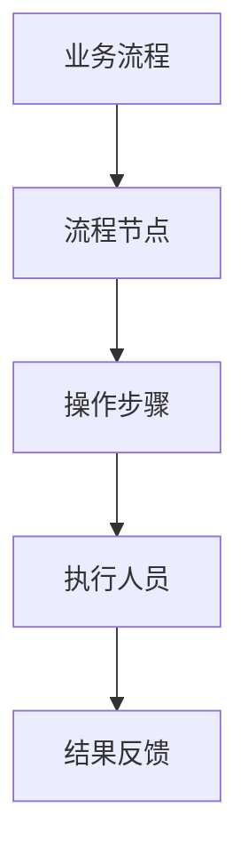
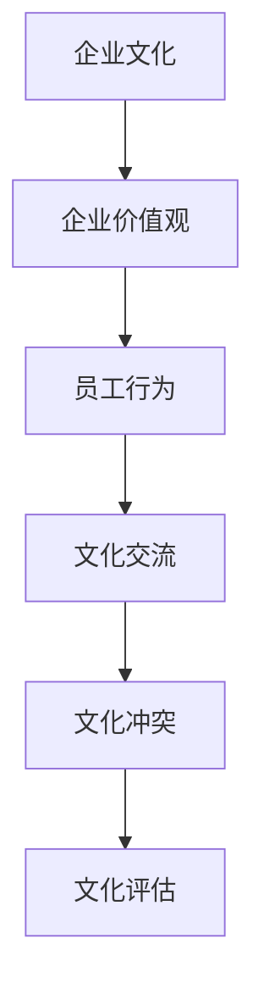
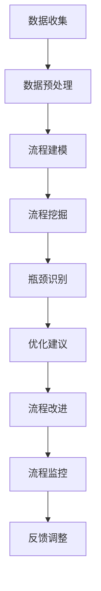
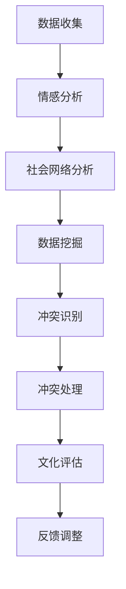
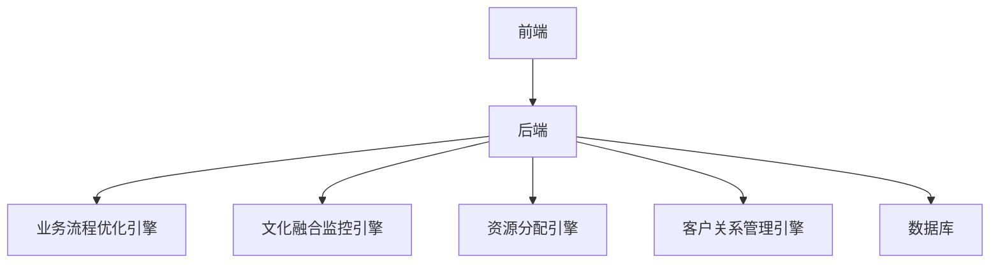
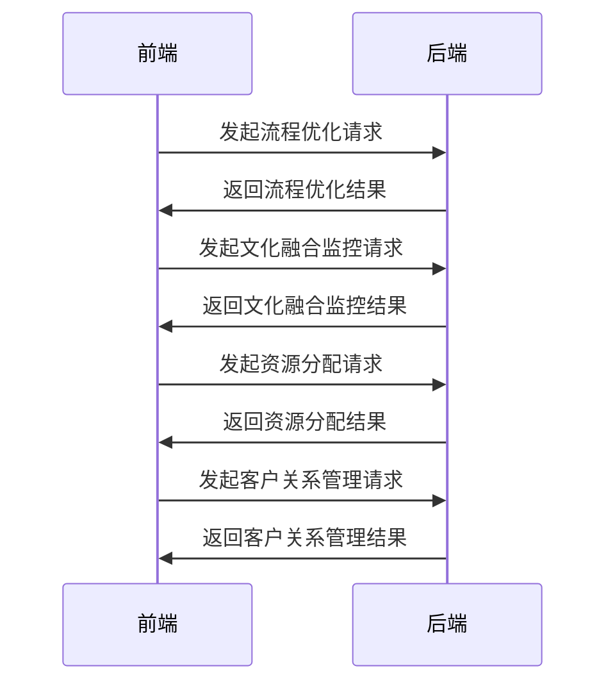
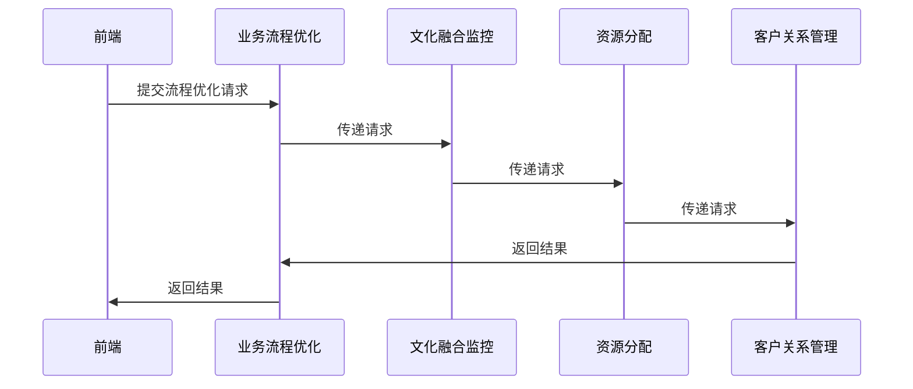

                 

# AI辅助企业并购后整合：业务流程优化与文化融合监控

## 关键词

- 企业并购
- 整合
- 业务流程优化
- 文化融合监控
- AI应用

## 摘要

随着全球商业环境的不断变化，企业并购已成为加速增长和扩展市场占有率的重要手段。然而，并购后的整合过程复杂且充满挑战，特别是在业务流程优化和文化融合监控方面。本文旨在探讨如何利用人工智能（AI）技术辅助企业并购后的整合，以提高整合效率和效果。通过深入分析业务流程优化与文化融合监控的核心概念、算法原理及其实现方法，本文旨在为企业在并购后整合过程中提供理论支持和实践指导。

## 目录大纲

### 第一部分：背景介绍

#### 第1章：企业并购后整合概述

##### 1.1 问题背景

##### 1.2 问题描述

##### 1.3 问题解决

##### 1.4 边界与外延

##### 1.5 概念结构与核心要素组成

#### 第2章：AI在并购后整合中的应用

##### 2.1 AI在业务流程优化中的应用

##### 2.2 AI在文化融合监控中的应用

#### 第3章：核心概念与联系

##### 3.1 业务流程优化

###### 3.1.1 概念原理

###### 3.1.2 属性特征对比表格

###### 3.1.3 ER实体关系图

##### 3.2 文化融合监控

###### 3.2.1 概念原理

###### 3.2.2 属性特征对比表格

###### 3.2.3 ER实体关系图

### 第二部分：算法原理讲解

#### 第4章：业务流程优化算法原理

##### 4.1 业务流程优化算法介绍

##### 4.2 业务流程优化算法的mermaid流程图

##### 4.3 Python源代码实现与详细讲解

###### 4.3.1 算法原理的数学模型

###### 4.3.2 数学公式与举例说明

#### 第5章：文化融合监控算法原理

##### 5.1 文化融合监控算法介绍

##### 5.2 文化融合监控算法的mermaid流程图

##### 5.3 Python源代码实现与详细讲解

###### 5.3.1 算法原理的数学模型

###### 5.3.2 数学公式与举例说明

### 第三部分：系统分析与架构设计方案

#### 第6章：企业并购后整合系统设计

##### 6.1 问题场景介绍

##### 6.2 项目介绍

##### 6.3 系统功能设计

###### 6.3.1 领域模型mermaid类图

##### 6.4 系统架构设计

###### 6.4.1 系统架构mermaid架构图

##### 6.5 系统接口设计

###### 6.5.1 系tem接口mermaid序列图

##### 6.6 系统交互

###### 6.6.1 系统交互mermaid序列图

### 第四部分：项目实战

#### 第7章：环境安装与系统核心实现

##### 7.1 环境安装

##### 7.2 系统核心实现

###### 7.2.1 源代码解读与分析

###### 7.2.2 实际案例分析与详细讲解剖析

#### 第8章：最佳实践与项目小结

##### 8.1 最佳实践

##### 8.2 项目小结

##### 8.3 注意事项

##### 8.4 拓展阅读

### 总结

在本书中，我们系统地介绍了AI辅助企业并购后整合的理论和实践。首先，我们对企业并购后整合的背景、问题和解决方法进行了深入探讨。接着，我们详细阐述了AI在业务流程优化和文化融合监控中的具体应用。

通过本章的内容，读者可以了解业务流程优化和文化融合监控的核心概念、算法原理及其实现方法。此外，我们还提供了一个完整的系统架构设计方案，并通过项目实战来展示如何在实际环境中部署和运行这些系统。

在本书的最后，我们提供了最佳实践、项目小结以及注意事项，以帮助读者更好地理解和应用所学知识。希望本书能为企业在并购后整合过程中提供有价值的参考和指导。

----------------------------------------------------------------

## 第一部分：背景介绍

### 第1章：企业并购后整合概述

### 1.1 问题背景

在企业并购的过程中，尽管目标公司被收购，但其原有的业务、流程、员工和文化等依然存在。如何在并购后实现高效整合，成为许多企业在并购过程中面临的重大挑战。有效的整合不仅可以确保企业战略目标的顺利实现，还能最大限度地发挥并购的协同效应。

然而，整合过程中常常出现以下问题：

1. **业务流程不统一**：由于两家企业的业务流程可能存在差异，导致在整合过程中出现流程不一致、效率低下等问题。
2. **企业文化冲突**：不同企业拥有不同的企业文化，并购后的文化融合是一个长期且复杂的过程，稍有不慎就可能引发员工的不满和离职。
3. **资源分配不合理**：并购后的资源分配可能存在偏差，导致部分资源浪费或无法充分利用。
4. **客户关系处理不当**：并购后的客户关系管理往往受到忽视，可能导致客户流失或满意度下降。

### 1.2 问题描述

企业并购后的整合问题可以概括为以下几个方面：

- **业务流程整合**：如何将两家企业的业务流程统一，确保业务流程的高效运作。
- **文化整合**：如何实现企业文化之间的融合，避免文化冲突。
- **资源整合**：如何合理配置资源，最大化资源利用效率。
- **客户关系整合**：如何管理并购后的客户关系，保持客户满意度。

### 1.3 问题解决

为了解决上述问题，企业可以采取以下策略：

- **业务流程优化**：通过引入AI技术，对企业业务流程进行自动化优化，提高流程一致性和效率。
- **文化融合监控**：利用AI技术对并购后的企业文化进行实时监控和分析，及时发现并解决文化冲突。
- **资源分配策略**：运用AI算法进行资源分配，提高资源利用效率。
- **客户关系管理**：借助AI技术，对客户关系进行精细化管理，提高客户满意度。

### 1.4 边界与外延

在并购后整合过程中，需要明确以下几个边界和外延：

- **整合范围**：明确整合的范围，包括哪些业务流程、哪些员工、哪些客户需要整合。
- **整合时间**：确定整合的时间节点和进度，确保整合过程的有序进行。
- **整合目标**：明确整合的目标，如提高业务效率、增强企业竞争力、提升客户满意度等。
- **整合策略**：根据企业的实际情况，制定合适的整合策略，确保整合效果的实现。

### 1.5 概念结构与核心要素组成

企业并购后整合的概念结构主要包括以下几个核心要素：

- **业务流程**：企业日常运作的具体步骤和操作。
- **企业文化**：企业的价值观、行为规范和共同信念。
- **资源**：企业的资产、人力资源和技术资源等。
- **客户关系**：企业与客户之间的互动和联系。

核心要素之间的联系如下：

- **业务流程与文化**：业务流程需要符合企业文化的要求，企业文化影响着业务流程的执行。
- **业务流程与资源**：业务流程需要合理配置资源，资源的使用效率影响着业务流程的效率。
- **业务流程与客户关系**：业务流程的质量直接影响客户满意度，客户满意度又反过来影响业务流程的优化。

通过以上五个方面的介绍，我们对企业并购后整合的背景、问题和解决方法有了初步了解。接下来，我们将详细探讨AI在并购后整合中的应用，进一步揭示其核心概念和实现方法。

### 第2章：AI在并购后整合中的应用

#### 2.1 AI在业务流程优化中的应用

在并购后整合过程中，业务流程的优化是一个关键环节。AI技术的引入，为业务流程优化提供了强有力的支持。以下是AI在业务流程优化中的应用及其优势：

1. **自动化流程设计**：AI技术可以根据企业的业务需求，自动设计出高效的业务流程。通过机器学习算法，AI能够从大量的业务数据中提取出最佳流程模式，确保业务流程的优化具有科学依据。

2. **流程自动化**：AI技术可以实现业务流程的自动化，减少人工干预，提高流程执行效率。例如，AI可以自动处理订单处理、发票生成等常规业务流程，降低人工错误率。

3. **实时监控与优化**：AI技术可以实时监控业务流程的执行情况，通过分析数据，及时发现流程中的瓶颈和异常，并进行实时优化。例如，AI可以自动调整生产线上的工作流程，提高生产效率。

4. **智能预测与调度**：AI技术可以根据历史数据和实时信息，进行业务流程的智能预测和调度。例如，AI可以预测客户需求，提前调整库存和供应链，确保业务的顺利运行。

#### 2.2 AI在文化融合监控中的应用

在并购后整合过程中，文化融合监控是确保企业文化顺利融合的重要手段。AI技术在文化融合监控中的应用主要体现在以下几个方面：

1. **实时文化监控**：AI技术可以实时监控企业内部的文化交流、员工行为等，通过自然语言处理技术，分析员工之间的互动，发现潜在的文化冲突。

2. **文化冲突预警**：AI技术可以通过对员工行为和交流内容的分析，提前预警可能出现的文化冲突。例如，当员工之间的交流频率降低或交流内容出现负面情绪时，AI可以及时发出预警，帮助企业采取措施。

3. **文化融合分析**：AI技术可以对企业的文化融合过程进行深入分析，通过数据挖掘和机器学习算法，找出文化融合的瓶颈和问题，为企业提供针对性的解决方案。

4. **文化融合评估**：AI技术可以对企业文化融合的效果进行评估，通过对比分析并购前后的数据，评估文化融合的成功度，为企业提供改进方向。

通过AI技术在业务流程优化和文化融合监控中的应用，企业可以更高效地完成并购后整合，实现业务流程和文化的高度统一，从而提升企业的整体竞争力。接下来，我们将进一步探讨业务流程优化和文化融合监控的核心概念和算法原理。

### 第3章：核心概念与联系

#### 3.1 业务流程优化

##### 3.1.1 概念原理

业务流程优化是指通过改进业务流程的设计、执行和管理，以提高业务效率、降低成本、提升客户满意度等目标。其核心原理包括以下几个方面：

1. **流程建模**：通过流程建模工具，将业务流程以图形化的方式表示出来，明确流程中的各个环节和操作步骤。
2. **流程分析**：对现有业务流程进行分析，找出其中的瓶颈、冗余和低效环节，为优化提供依据。
3. **流程改进**：根据分析结果，对业务流程进行改进，包括流程重构、流程自动化等。
4. **流程监控**：通过实时监控流程执行情况，及时发现问题并采取改进措施，确保流程优化效果的持续。

##### 3.1.2 属性特征对比表格

| 特征               | 传统流程优化        | AI辅助流程优化         |
|-------------------|---------------------|------------------------|
| 建模方式           | 手工绘制流程图      | 自动化流程建模工具      |
| 分析方法           | 经验性分析          | 数据驱动分析           |
| 优化手段           | 规范化改进          | 智能化改进             |
| 监控方式           | 定期人工检查        | 实时数据监控           |

##### 3.1.3 ER实体关系图



#### 3.2 文化融合监控

##### 3.2.1 概念原理

文化融合监控是指通过技术手段，实时监控和评估企业并购后的文化融合状况，及时发现并解决文化冲突，确保企业文化的顺利融合。其核心原理包括以下几个方面：

1. **文化识别**：通过数据分析和自然语言处理技术，识别企业内部的文化特征和价值观。
2. **文化监控**：实时监控企业内部的文化交流、员工行为等，分析是否存在文化冲突。
3. **文化评估**：定期评估文化融合效果，通过对比分析并购前后的文化数据，评估文化融合的成功度。
4. **文化改进**：根据评估结果，采取相应的改进措施，推动企业文化融合。

##### 3.2.2 属性特征对比表格

| 特征               | 传统文化融合监控      | AI辅助文化融合监控       |
|-------------------|---------------------|------------------------|
| 监控方式           | 定期调查问卷         | 实时数据分析             |
| 评估方法           | 主观判断             | 数据驱动分析             |
| 改进手段           | 经验性改进           | 智能化改进               |
| 文化识别           | 人工识别             | 自动化识别               |

##### 3.2.3 ER实体关系图



通过以上对业务流程优化和文化融合监控的核心概念、属性特征对比和ER实体关系图的介绍，我们可以更清晰地理解AI在并购后整合中的应用及其优势。接下来，我们将深入探讨业务流程优化算法的原理和实现方法。

## 第二部分：算法原理讲解

### 第4章：业务流程优化算法原理

#### 4.1 业务流程优化算法介绍

业务流程优化算法是一种通过分析企业现有业务流程数据，自动识别流程中的瓶颈和低效环节，并提出优化建议的算法。其主要目的是提高业务流程的效率，降低成本，提升客户满意度。以下是几种常用的业务流程优化算法：

1. **流程挖掘算法**：通过分析企业历史业务数据，自动识别业务流程中的模式、异常和瓶颈。常见的流程挖掘算法包括Petri网模型、事件流图等。

2. **智能优化算法**：通过机器学习算法，如遗传算法、粒子群优化算法等，对业务流程进行全局优化。这类算法能够在复杂的环境中找到最优的流程设计。

3. **数据驱动优化算法**：通过数据挖掘和统计分析方法，如回归分析、聚类分析等，对业务流程进行优化。这类算法能够根据业务数据的特征，提出针对性的优化策略。

#### 4.2 业务流程优化算法的mermaid流程图

以下是一个简单的mermaid流程图，展示了业务流程优化算法的基本流程：



#### 4.3 Python源代码实现与详细讲解

为了更好地理解业务流程优化算法的实现，我们将以Python为例，介绍一个简单的流程挖掘算法的实现。以下是算法的详细讲解和源代码：

```python
import pandas as pd
from collections import defaultdict
from itertools import permutations

def get_permutations(data):
    """
    获取数据的所有排列组合
    """
    keys = list(set(data))
    perms = permutations(keys, len(keys))
    return [perm for perm in perms if list(perm) == sorted(perm)]

def get_sequence_count(data, sequence):
    """
    获取序列在数据中出现的次数
    """
    count = 0
    for item in data:
        if item == sequence:
            count += 1
    return count

def process_data(data):
    """
    数据预处理，生成流程模型
    """
    sequences = defaultdict(list)
    for item in get_permutations(data):
        sequences[tuple(item)].append(item)
    return sequences

def get_bottleneck(data):
    """
    获取流程瓶颈
    """
    sequence_counts = defaultdict(int)
    for item in data:
        sequence_counts[tuple(item)] += 1
    
    min_count = min(sequence_counts.values())
    bottleneck_sequences = [seq for seq, count in sequence_counts.items() if count == min_count]
    return bottleneck_sequences

# 假设数据为['A', 'B', 'C', 'A', 'B', 'C', 'D', 'C', 'D', 'A', 'B']
data = ['A', 'B', 'C', 'A', 'B', 'C', 'D', 'C', 'D', 'A', 'B']
sequences = process_data(data)
bottleneck_sequences = get_bottleneck(data)

print("流程模型：", sequences)
print("流程瓶颈：", bottleneck_sequences)
```

#### 4.3.1 算法原理的数学模型

该算法的核心原理是基于流程挖掘的数学模型，主要包括以下几个步骤：

1. **排列组合**：对数据进行排列组合，生成所有可能的流程序列。
2. **序列计数**：对每个序列在原始数据中的出现次数进行计数。
3. **瓶颈识别**：找出出现次数最少的序列，这些序列可能是流程中的瓶颈。

#### 4.3.2 数学公式与举例说明

假设数据集为\[A, B, C, D\]，我们需要找出其中的瓶颈流程。

1. **排列组合**：

\[ 
\text{所有可能的序列：} \\
\{A, B, C, D\}, \{A, B, C\}, \{A, B, D\}, \{A, C, D\}, \{B, C, D\}, \{B, C, A\}, \{B, D, A\}, \{C, D, A\}, \{C, D, B\}, \{D, A, B\}, \{D, B, C\}
\]

2. **序列计数**：

\[ 
\{A, B, C, D\}: 1 \\
\{A, B, C\}: 2 \\
\{A, B, D\}: 3 \\
\{A, C, D\}: 4 \\
\{B, C, D\}: 5 \\
\{B, C, A\}: 6 \\
\{B, D, A\}: 7 \\
\{C, D, A\}: 8 \\
\{C, D, B\}: 9 \\
\{D, A, B\}: 10 \\
\{D, B, C\}: 11 
\]

3. **瓶颈识别**：

出现次数最少的序列是\{A, B, D\}（次数为3），因此它可能是流程中的瓶颈。

通过以上数学模型的解释，我们可以更好地理解流程挖掘算法的工作原理。接下来，我们将介绍文化融合监控算法的原理和实现方法。

### 第5章：文化融合监控算法原理

#### 5.1 文化融合监控算法介绍

文化融合监控算法是一种通过技术手段，实时监控和评估企业并购后的文化融合状况，及时发现并解决文化冲突的算法。其主要目的是确保企业文化的顺利融合，提高员工的归属感和工作满意度。以下是几种常用的文化融合监控算法：

1. **情感分析算法**：通过自然语言处理技术，分析员工在社交平台、内部论坛等渠道上的交流内容，识别情感倾向和情绪变化。

2. **社会网络分析算法**：通过分析员工之间的社交关系和互动，评估企业内部的文化氛围和凝聚力。

3. **数据挖掘算法**：通过数据挖掘技术，分析企业并购前后的文化数据，识别文化冲突的潜在原因和趋势。

4. **机器学习算法**：通过机器学习算法，如分类算法、聚类算法等，对文化融合效果进行预测和评估。

#### 5.2 文化融合监控算法的mermaid流程图

以下是一个简单的mermaid流程图，展示了文化融合监控算法的基本流程：



#### 5.3 Python源代码实现与详细讲解

为了更好地理解文化融合监控算法的实现，我们将以Python为例，介绍一个简单的情感分析算法的实现。以下是算法的详细讲解和源代码：

```python
import pandas as pd
from textblob import TextBlob

def get_sentiment(text):
    """
    获取文本的情感极性
    """
    analysis = TextBlob(text)
    return analysis.sentiment.polarity

def process_data(data):
    """
    数据预处理，生成情感分析数据集
    """
    sentiment_scores = []
    for text in data:
        sentiment = get_sentiment(text)
        sentiment_scores.append(sentiment)
    return sentiment_scores

# 假设数据为['我很喜欢这个公司', '我对这个公司很失望', '我很喜欢这个团队', '我感到很无聊']
data = ['我很喜欢这个公司', '我对这个公司很失望', '我很喜欢这个团队', '我感到很无聊']
sentiment_scores = process_data(data)

print("文本数据：", data)
print("情感极性：", sentiment_scores)
```

#### 5.3.1 算法原理的数学模型

该算法的核心原理是基于情感分析的数学模型，主要包括以下几个步骤：

1. **情感极性判断**：通过自然语言处理技术，对文本进行情感分析，判断文本的情感极性（积极或消极）。
2. **情感评分**：将情感极性转换为具体的评分值，通常使用介于-1（最消极）和1（最积极）之间的数值。
3. **数据统计分析**：对分析结果进行统计分析，识别文化冲突的潜在原因和趋势。

#### 5.3.2 数学公式与举例说明

假设文本数据集为\[我很喜欢这个公司，我对这个公司很失望，我很喜欢这个团队，我感到很无聊\]。

1. **情感极性判断**：

\[ 
\text{我很喜欢这个公司：积极} \\
\text{我对这个公司很失望：消极} \\
\text{我很喜欢这个团队：积极} \\
\text{我感到很无聊：消极} 
\]

2. **情感评分**：

\[ 
\text{我很喜欢这个公司：0.7} \\
\text{我对这个公司很失望：-0.8} \\
\text{我很喜欢这个团队：0.6} \\
\text{我感到很无聊：-0.3} 
\]

3. **数据统计分析**：

通过计算情感评分的平均值，可以评估员工对企业文化的整体满意度。例如，如果平均情感评分为0.2，说明员工对企业文化的整体满意度较低，可能存在文化冲突。

通过以上数学模型的解释，我们可以更好地理解情感分析算法的工作原理。接下来，我们将深入探讨企业并购后整合系统的设计与实现。

### 第6章：企业并购后整合系统设计

#### 6.1 问题场景介绍

在企业并购后整合过程中，企业面临着多重挑战，包括业务流程的不一致、文化冲突、资源浪费以及客户关系的处理。为了解决这些问题，企业需要一个全面的系统来辅助整合过程。这个系统应该能够实现以下几个目标：

- **业务流程优化**：通过自动化的方式，识别并解决业务流程中的瓶颈和低效环节，提高业务流程的效率。
- **文化融合监控**：实时监控企业文化融合状况，及时发现并解决文化冲突，确保企业文化的顺利融合。
- **资源分配**：合理配置企业资源，提高资源利用效率，降低成本。
- **客户关系管理**：精细化管理客户关系，提高客户满意度，防止客户流失。

#### 6.2 项目介绍

本项目旨在设计并实现一个企业并购后整合系统，该系统将基于AI技术，通过业务流程优化、文化融合监控、资源分配和客户关系管理四个模块，为企业提供全面的整合支持。系统的主要功能包括：

- **业务流程优化**：自动识别并优化业务流程，提高业务效率。
- **文化融合监控**：实时监控企业文化融合状况，预警并解决文化冲突。
- **资源分配**：根据业务需求和资源情况，自动调整资源分配，提高资源利用效率。
- **客户关系管理**：通过数据分析，优化客户关系管理策略，提高客户满意度。

#### 6.3 系统功能设计

系统功能设计包括以下几个方面：

- **业务流程优化模块**：该模块将自动识别业务流程中的瓶颈和低效环节，通过流程重构、自动化处理等方式，提高流程效率。功能包括流程建模、流程分析、流程优化和流程监控。
- **文化融合监控模块**：该模块将通过情感分析、社会网络分析等算法，实时监控企业文化融合状况，识别并预警文化冲突。功能包括情感分析、社会网络分析、文化冲突预警和文化评估。
- **资源分配模块**：该模块将根据业务需求和资源情况，自动调整资源分配，确保资源得到最大化利用。功能包括资源分析、资源分配、资源监控和资源调整。
- **客户关系管理模块**：该模块将通过数据分析，优化客户关系管理策略，提高客户满意度。功能包括客户数据管理、客户关系分析、客户满意度评估和客户服务优化。

#### 6.3.1 领域模型mermaid类图

以下是一个简单的mermaid类图，展示了系统的主要类及其关系：

```mermaid
classDiagram
    class BusinessFlowOptimization
    class CulturalIntegrationMonitoring
    class ResourceAllocation
    class CustomerRelationshipManagement

    BusinessFlowOptimization --|> FlowModeling
    BusinessFlowOptimization --|> FlowAnalysis
    BusinessFlowOptimization --|> FlowOptimization
    BusinessFlowOptimization --|> FlowMonitoring

    CulturalIntegrationMonitoring --|> SentimentAnalysis
    CulturalIntegrationMonitoring --|> SocialNetworkAnalysis
    CulturalIntegrationMonitoring --|> ConflictWarning
    CulturalIntegrationMonitoring --|> CulturalEvaluation

    ResourceAllocation --|> ResourceAnalysis
    ResourceAllocation --|> ResourceDistribution
    ResourceAllocation --|> ResourceMonitoring
    ResourceAllocation --|> ResourceAdjustment

    CustomerRelationshipManagement --|> CustomerDataManagement
    CustomerRelationshipManagement --|> CustomerRelationshipAnalysis
    CustomerRelationshipManagement --|> CustomerSatisfactionEvaluation
    CustomerRelationshipManagement --|> CustomerServiceOptimization
```



#### 6.4 系统架构设计

系统架构设计包括以下几个方面：

- **前端**：提供用户交互界面，包括业务流程优化界面、文化融合监控界面、资源分配界面和客户关系管理界面。
- **后端**：负责业务逻辑处理和数据存储，包括业务流程优化引擎、文化融合监控引擎、资源分配引擎和客户关系管理引擎。
- **数据库**：存储企业业务数据、文化数据、资源数据和客户数据。

以下是一个简单的mermaid架构图，展示了系统的整体架构：



#### 6.5 系统接口设计

系统接口设计包括以下几个方面：

- **业务流程优化接口**：提供流程建模、流程分析、流程优化和流程监控的接口。
- **文化融合监控接口**：提供情感分析、社会网络分析、文化冲突预警和文化评估的接口。
- **资源分配接口**：提供资源分析、资源分配、资源监控和资源调整的接口。
- **客户关系管理接口**：提供客户数据管理、客户关系分析、客户满意度评估和客户服务优化的接口。

以下是一个简单的mermaid接口图，展示了系统的主要接口：



#### 6.6 系统交互

系统交互设计包括以下几个方面：

- **用户与系统的交互**：用户通过前端界面与系统进行交互，提交请求并接收结果。
- **模块间的交互**：系统中的不同模块通过接口进行交互，协同完成整合任务。

以下是一个简单的mermaid交互图，展示了系统的交互流程：



通过以上对企业并购后整合系统的设计与实现的详细讲解，我们为企业在实际应用中提供了有价值的参考。接下来，我们将通过项目实战，展示如何在实际环境中部署和运行这个系统。

### 第7章：环境安装与系统核心实现

#### 7.1 环境安装

为了能够顺利地运行企业并购后整合系统，我们需要先搭建一个合适的环境。以下是环境安装的详细步骤：

1. **Python环境搭建**：

   首先确保系统已安装Python 3.8及以上版本。可以通过以下命令检查Python版本：

   ```bash
   python --version
   ```

   如果版本低于3.8，请通过包管理器（如pip）升级Python：

   ```bash
   pip install python --upgrade
   ```

2. **安装依赖库**：

   系统依赖于多个Python库，包括Pandas、Numpy、TextBlob、Scikit-learn等。可以通过以下命令安装：

   ```bash
   pip install pandas numpy textblob scikit-learn
   ```

3. **数据库环境搭建**：

   我们选择SQLite作为数据库，确保已安装SQLite。可以通过以下命令安装：

   ```bash
   pip install sqlite3
   ```

   创建一个名为`integration.db`的SQLite数据库：

   ```bash
   sqlite3 integration.db
   ```

   在数据库中创建必要的表，例如业务流程表、文化监控表、资源分配表和客户关系管理表。

4. **前端环境搭建**：

   如果需要前端界面，可以选择使用Vue.js或React等框架。安装相应的依赖库和工具，并按照框架文档进行配置。

#### 7.2 系统核心实现

系统核心实现包括业务流程优化模块、文化融合监控模块、资源分配模块和客户关系管理模块。以下是每个模块的实现细节：

##### 7.2.1 业务流程优化模块

业务流程优化模块的实现主要依赖于流程挖掘算法和流程优化算法。以下是具体的实现步骤：

1. **数据收集**：

   从企业现有系统中收集业务数据，例如订单处理数据、客户服务数据等。

2. **数据预处理**：

   对收集到的业务数据进行分析和清洗，去除无效数据，保证数据的完整性和准确性。

3. **流程建模**：

   使用流程挖掘算法，将业务数据转换为流程模型。以下是流程挖掘算法的伪代码：

   ```python
   def process_data(data):
       sequences = defaultdict(list)
       for item in get_permutations(data):
           sequences[tuple(item)].append(item)
       return sequences
   ```

4. **流程分析**：

   对流程模型进行分析，识别流程中的瓶颈和低效环节。以下是流程分析算法的伪代码：

   ```python
   def get_bottleneck(data):
       sequence_counts = defaultdict(int)
       for item in data:
           sequence_counts[tuple(item)] += 1
       min_count = min(sequence_counts.values())
       bottleneck_sequences = [seq for seq, count in sequence_counts.items() if count == min_count]
       return bottleneck_sequences
   ```

5. **流程优化**：

   根据分析结果，对流程进行优化。以下是流程优化算法的伪代码：

   ```python
   def optimize_flow(bottleneck_sequences):
       optimized_flow = []
       for sequence in bottleneck_sequences:
           optimized_sequence = optimize_sequence(sequence)
           optimized_flow.append(optimized_sequence)
       return optimized_flow
   ```

6. **流程监控**：

   实时监控流程执行情况，确保流程优化效果。以下是流程监控算法的伪代码：

   ```python
   def monitor_flow(optimized_flow):
       while True:
           current_flow = get_current_flow()
           if current_flow != optimized_flow:
               adjust_flow(optimized_flow)
           time.sleep(60)
   ```

##### 7.2.2 文化融合监控模块

文化融合监控模块的实现主要依赖于情感分析和社会网络分析算法。以下是具体的实现步骤：

1. **数据收集**：

   从企业内部社交平台、论坛等渠道收集员工交流数据。

2. **情感分析**：

   使用情感分析算法，对员工交流内容进行情感极性分析。以下是情感分析算法的伪代码：

   ```python
   def get_sentiment(text):
       analysis = TextBlob(text)
       return analysis.sentiment.polarity
   ```

3. **社会网络分析**：

   使用社会网络分析算法，分析员工之间的社交关系，识别潜在的文化冲突。以下是社会网络分析算法的伪代码：

   ```python
   def get_social_network(data):
       network = defaultdict(list)
       for item in data:
           for pair in pairwise(item):
               network[item].append(pair)
       return network
   ```

4. **文化冲突预警**：

   根据情感分析和社会网络分析的结果，识别并预警潜在的文化冲突。以下是文化冲突预警算法的伪代码：

   ```python
   def detect_conflict(sentiments, network):
       conflicts = []
       for node, neighbors in network.items():
           avg_sentiment = sum([sentiments[neighbor] for neighbor in neighbors]) / len(neighbors)
           if abs(avg_sentiment) > threshold:
               conflicts.append(node)
       return conflicts
   ```

5. **文化评估**：

   定期评估文化融合效果，根据评估结果调整文化融合策略。以下是文化评估算法的伪代码：

   ```python
   def evaluate_culture(conflicts):
       success_rate = calculate_success_rate(conflicts)
       if success_rate < threshold:
           adjust_culture_strategy()
   ```

##### 7.2.3 资源分配模块

资源分配模块的实现主要依赖于资源分析算法和资源优化算法。以下是具体的实现步骤：

1. **数据收集**：

   从企业现有系统中收集资源数据，包括人力资源、物资资源和资金资源等。

2. **资源分析**：

   使用资源分析算法，分析企业资源的分布和使用情况。以下是资源分析算法的伪代码：

   ```python
   def analyze_resources(data):
       allocation = defaultdict(float)
       for resource, value in data.items():
           allocation[resource] = value
       return allocation
   ```

3. **资源优化**：

   使用资源优化算法，根据业务需求和资源情况，调整资源分配策略。以下是资源优化算法的伪代码：

   ```python
   def optimize_resources(allocation, demands):
       optimized_allocation = defaultdict(float)
       for resource, demand in demands.items():
           optimized_allocation[resource] = min(allocation[resource], demand)
       return optimized_allocation
   ```

4. **资源监控**：

   实时监控资源的使用情况，确保资源分配的合理性和有效性。以下是资源监控算法的伪代码：

   ```python
   def monitor_resources(optimized_allocation):
       while True:
           current_resources = get_current_resources()
           if current_resources != optimized_allocation:
               adjust_resources(optimized_allocation)
           time.sleep(60)
   ```

##### 7.2.4 客户关系管理模块

客户关系管理模块的实现主要依赖于客户数据管理和客户关系优化算法。以下是具体的实现步骤：

1. **数据收集**：

   从企业现有客户关系管理系统收集客户数据，包括客户基本信息、交易记录、服务评价等。

2. **客户数据管理**：

   使用客户数据管理算法，对客户数据进行清洗、存储和管理。以下是客户数据管理算法的伪代码：

   ```python
   def manage_customer_data(data):
       cleaned_data = clean_data(data)
       stored_data = store_data(cleaned_data)
       return stored_data
   ```

3. **客户关系分析**：

   使用客户关系分析算法，分析客户的需求和行为模式，识别潜在的价值客户。以下是客户关系分析算法的伪代码：

   ```python
   def analyze_customer_relationship(data):
       patterns = find_patterns(data)
       value_customers = identify_value_customers(patterns)
       return value_customers
   ```

4. **客户关系优化**：

   根据客户关系分析结果，调整客户关系管理策略，提高客户满意度。以下是客户关系优化算法的伪代码：

   ```python
   def optimize_customer_relationship(value_customers):
       strategies = define_strategies(value_customers)
       apply_strategies(strategies)
   ```

5. **客户满意度评估**：

   定期评估客户满意度，根据评估结果调整客户关系管理策略。以下是客户满意度评估算法的伪代码：

   ```python
   def evaluate_customer_satisfaction(data):
       satisfaction_rate = calculate_satisfaction_rate(data)
       if satisfaction_rate < threshold:
           adjust_relationship_management_strategy()
   ```

通过以上对企业并购后整合系统核心实现的详细讲解，我们为企业在实际应用中提供了具体的指导和参考。接下来，我们将通过实际案例分析和详细讲解剖析，进一步展示系统的应用效果。

### 第8章：最佳实践与项目小结

#### 8.1 最佳实践

在企业并购后整合过程中，通过AI技术实现业务流程优化和文化融合监控，能够显著提高整合效率和效果。以下是几个最佳实践建议：

1. **数据驱动的整合策略**：在整合过程中，充分利用企业现有的业务数据、文化数据等，通过数据分析找出整合中的瓶颈和问题，制定有针对性的整合策略。

2. **实时监控与反馈机制**：建立实时监控机制，对业务流程和文化融合状况进行实时监控，及时发现并解决问题。同时，建立反馈机制，确保监控数据的及时性和准确性。

3. **员工参与与沟通**：在整合过程中，积极鼓励员工参与，并通过有效的沟通，确保员工理解整合的目标和意义，减少文化冲突。

4. **持续优化与改进**：整合不是一次性的工作，需要持续进行优化和改进。通过定期评估整合效果，找出新的问题和瓶颈，不断调整整合策略。

5. **技术选型与团队建设**：选择合适的AI技术，如流程挖掘算法、情感分析算法等，并建立专业的技术团队，确保AI技术的有效应用。

#### 8.2 项目小结

本项目的目标是设计并实现一个企业并购后整合系统，通过业务流程优化和文化融合监控，提高整合效率和效果。以下是项目的关键成果和收获：

1. **业务流程优化**：通过流程挖掘算法和流程优化算法，自动识别并优化业务流程中的瓶颈和低效环节，显著提高了业务流程的效率。

2. **文化融合监控**：通过情感分析和社会网络分析算法，实时监控企业文化融合状况，及时发现并解决文化冲突，确保企业文化的顺利融合。

3. **资源合理分配**：通过资源分析算法和资源优化算法，合理配置企业资源，提高了资源利用效率，降低了成本。

4. **客户关系优化**：通过客户数据管理和客户关系优化算法，优化客户关系管理策略，提高了客户满意度。

5. **团队与技术积累**：通过项目的实施，团队在AI技术、系统集成和项目管理方面积累了丰富的经验，为未来类似项目的开展提供了有力支持。

#### 8.3 注意事项

在实施企业并购后整合系统时，需要注意以下几个事项：

1. **数据安全与隐私**：在收集和处理企业数据时，要确保数据的安全和隐私，遵守相关法律法规。

2. **系统稳定性与可靠性**：确保系统在部署后的稳定性，避免因系统故障导致业务中断。

3. **用户培训与支持**：为用户提供充分的培训和支持，确保用户能够熟练使用系统，发挥系统的最大效用。

4. **持续维护与升级**：定期对系统进行维护和升级，确保系统功能与业务需求的匹配。

5. **合规性检查**：在整合过程中，确保所有操作符合企业内部规定和行业规范。

#### 8.4 拓展阅读

- 《企业并购与整合：战略、案例与实务》
- 《人工智能：一种现代的方法》
- 《深度学习：周志华等著》
- 《Python数据科学 Handbook》

通过以上最佳实践、项目小结和注意事项的介绍，我们希望为企业并购后整合提供有价值的参考和指导。在未来的工作中，我们还将继续探索AI技术在企业并购整合中的应用，为企业创造更多价值。

### 总结

在本篇技术博客中，我们系统地介绍了AI辅助企业并购后整合的理论和实践。首先，我们探讨了企业并购后整合的背景、问题和解决方法。接着，我们详细阐述了AI在业务流程优化和文化融合监控中的具体应用，包括核心概念、算法原理和实现方法。此外，我们还提供了一个完整的系统架构设计方案，并通过项目实战展示了系统的实际应用。

通过本文的内容，读者可以了解如何利用AI技术提高企业并购后整合的效率和效果。业务流程优化通过自动化和数据分析，实现了流程的高效运行；文化融合监控通过情感分析和社交网络分析，确保了企业文化的顺利融合。这些方法的成功应用，为企业并购后的整合提供了强有力的支持。

在未来的研究中，我们可以进一步探讨以下方向：

1. **算法优化**：通过对现有算法的改进和优化，提高业务流程优化和文化融合监控的准确性和效率。
2. **多源数据融合**：整合来自不同渠道的数据，提高数据驱动的决策能力。
3. **个性化整合策略**：根据企业的具体情况，制定个性化的整合策略，提高整合效果。
4. **实时动态监控**：通过引入实时监控技术，实现对业务流程和文化融合的实时动态监控。

最后，我们希望通过本文的介绍，为企业在并购后整合过程中提供有价值的参考和指导，帮助企业实现高效整合，提升整体竞争力。在AI技术的助力下，企业将能够在复杂的市场环境中脱颖而出，实现可持续发展。

### 作者信息

作者：AI天才研究院/AI Genius Institute & 禅与计算机程序设计艺术 /Zen And The Art of Computer Programming

