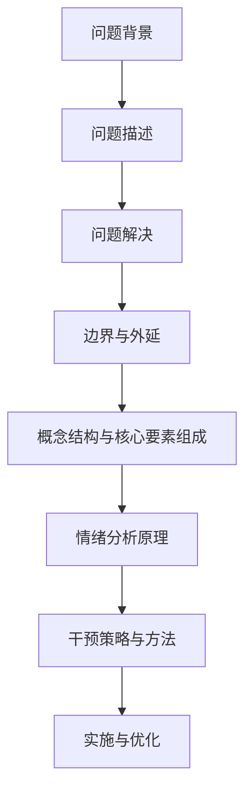

                 

## AI辅助企业并购后文化整合：员工情绪分析与干预策略

关键词：AI技术，企业文化整合，员工情绪分析，干预策略，并购后整合

摘要：企业并购后的文化整合是成功的关键因素之一。本文探讨了如何利用AI技术，特别是员工情绪分析，来实现有效的文化整合，并提出了一系列干预策略。通过详细的分析和实际案例，本文揭示了AI在企业并购后文化整合中的重要作用，为企业管理者提供了实用的指导。

## 引言

企业并购已经成为现代商业中的一种常见现象。随着市场规模的扩大和竞争的加剧，企业通过并购实现资源整合、优化业务结构、提升市场竞争力已成为一种普遍策略。然而，并购并非一蹴而就，尤其是在文化整合方面，往往面临诸多挑战。员工情绪的变化是文化整合过程中不可忽视的关键因素。

在并购过程中，不同企业之间的文化差异、员工对并购的接受度以及由此产生的情绪波动，都可能导致文化整合的难度增加。传统的管理方法往往依赖于定性的主观判断，难以全面、准确地评估员工情绪，从而制定有效的干预策略。而AI技术的崛起为这一问题提供了新的解决方案。

本文将探讨如何利用AI技术，特别是员工情绪分析，来实现企业并购后的文化整合。我们将从员工情绪分析的基本原理出发，逐步探讨干预策略的设计与实施，并通过实际案例进行分析，为企业管理者提供有价值的参考。

## 第一部分：问题背景与核心概念

### 问题背景

企业并购后的文化整合是一项复杂且重要的任务。文化整合的成功与否直接影响到并购的最终效果。并购过程中，企业不仅需要整合业务和资源，还需要整合企业文化，使新、老员工能够在新的企业文化下协同工作，共同推动企业的发展。

文化整合过程中，员工情绪扮演着至关重要的角色。员工对新并购企业的文化认同程度、对并购事件的接受度，以及由此产生的情绪波动，都会影响到文化整合的进程。因此，如何有效分析和干预员工情绪，成为文化整合的关键环节。

### 问题描述

在企业文化整合过程中，员工情绪可能出现以下几种情况：

1. **焦虑与不安**：员工可能担心并购带来的不确定性，如职位变动、薪酬变化等，导致焦虑和不安的情绪。
2. **抵触与反感**：部分员工可能对并购持抵触态度，认为新企业文化与自身价值观不符，从而产生反感和抵触情绪。
3. **期待与兴奋**：也有员工对新并购企业充满期待，希望借助新的机会实现个人职业发展，从而表现出兴奋和期待的情绪。

这些情绪变化对文化整合的进程产生直接影响。焦虑和不安的情绪可能导致员工工作积极性下降，抵触和反感的情绪可能引发冲突和对抗，而期待和兴奋的情绪则有助于增强团队凝聚力。

### 问题解决

为了解决并购后文化整合中的员工情绪问题，我们可以从以下几个方面入手：

1. **情绪分析**：利用AI技术进行员工情绪分析，全面、准确地了解员工的情绪状态，为干预策略提供数据支持。
2. **干预策略**：根据情绪分析结果，设计并实施针对性的干预策略，帮助员工缓解焦虑和不安，增强对新文化的认同感。
3. **员工参与**：鼓励员工参与企业文化整合的讨论和决策过程，提高员工对并购的接受度和参与感。

### 边界与外延

本文的研究边界主要涉及以下方面：

1. **研究对象**：主要研究企业在并购后的文化整合过程中，员工情绪的变化及其影响。
2. **技术手段**：主要利用AI技术进行员工情绪分析，包括情感识别、情绪分类等。
3. **干预策略**：主要探讨基于AI情绪分析的干预策略，包括心理辅导、团队建设等。

### 概念结构与核心要素组成

为了更好地理解本文的研究内容，我们可以使用Mermaid流程图和ER实体关系图来展示概念结构与核心要素组成。

#### Mermaid流程图



#### ER实体关系图

```mermaid
erDiagram
    Employee ||--|{ Emotion }|| Emotion
    Emotion ||--|{ Intervention }|| Intervention
    Employee ||--|{ Intervention }|| Intervention
```

通过以上流程图和ER图，我们可以清晰地看到员工情绪分析、干预策略与方法在企业文化整合过程中的作用和联系。

### 总结

企业并购后的文化整合是一个复杂的过程，员工情绪在其中扮演着关键角色。本文通过分析员工情绪的变化及其影响，提出了利用AI技术进行情绪分析和干预的策略。接下来，我们将进一步探讨AI技术在企业文化整合中的应用，为企业管理者提供更具体的实践指导。

## 第二部分：AI技术在文化整合中的应用

### 核心概念与联系

在企业文化整合过程中，AI技术的应用主要体现在员工情绪分析和干预策略设计两个方面。首先，我们需要明确几个核心概念：

1. **情绪分析**：利用AI技术对员工情绪进行识别、分类和评估，从而全面了解员工的情绪状态。
2. **情感识别**：通过自然语言处理（NLP）技术，对员工的言论、互动和行为进行分析，识别出其中的情绪成分。
3. **情绪分类**：将识别出的情绪按照预定的分类体系进行分类，如积极情绪、消极情绪等。
4. **干预策略**：根据情绪分析的结果，设计并实施针对性的干预措施，帮助员工调节情绪，增强对新文化的适应能力。

这些核心概念相互关联，共同构成了AI技术在企业文化整合中的应用框架。接下来，我们将深入探讨AI技术原理与流程，以及实际案例。

### AI技术原理与流程

#### 情绪分析算法原理

情绪分析算法的核心是基于机器学习和深度学习的模型。以下是情绪分析算法的基本原理：

1. **数据收集**：首先，需要收集大量的文本数据，这些数据包括员工的日志、聊天记录、邮件等。
2. **特征提取**：通过自然语言处理技术，提取文本数据中的关键特征，如词频、词向量、语法结构等。
3. **模型训练**：使用提取到的特征数据，训练情绪分类模型。常见的模型包括朴素贝叶斯、支持向量机（SVM）、卷积神经网络（CNN）等。
4. **情绪识别**：将新数据输入训练好的模型，模型将自动识别和分类情绪，输出情绪标签。

#### 数学模型和公式

以下是情绪分析中常用的数学模型和公式：

1. **词频统计**：
   $$ TF(t) = \text{词 } t \text{ 在文档中出现的次数} $$
2. **词向量**：
   $$ \vec{w}_{t} = \text{词 } t \text{ 的词向量表示} $$
3. **情感分类**：
   $$ P(\text{积极情感}|\vec{w}_{t}) = \frac{e^{\text{积极特征权重} \cdot \vec{w}_{t}}}{e^{\text{积极特征权重} \cdot \vec{w}_{t}} + e^{\text{消极特征权重} \cdot \vec{w}_{t}}} $$

#### AI技术流程

1. **数据收集**：从企业内部系统、社交媒体等渠道收集员工相关数据。
2. **数据预处理**：对收集到的数据进行清洗、去噪，提取有效信息。
3. **特征提取**：使用NLP技术提取文本数据中的关键特征。
4. **模型训练与评估**：使用训练集训练情绪分类模型，并对模型进行评估和优化。
5. **情绪识别与分类**：将预处理后的数据输入模型，进行情绪识别和分类。
6. **干预策略设计**：根据情绪分析结果，设计并实施干预策略。

### 应用案例与实践

#### 案例一：某大型企业并购后的员工情绪分析

某大型企业A在完成对B公司的并购后，利用AI技术对员工情绪进行了全面分析。以下为具体应用步骤：

1. **数据收集**：收集A公司和B公司员工在并购前后的聊天记录、邮件、调查问卷等数据。
2. **数据预处理**：对收集到的数据进行清洗，提取有效信息。
3. **特征提取**：使用NLP技术提取文本数据中的关键特征，如词频、词向量等。
4. **模型训练与评估**：使用训练集训练情绪分类模型，并对模型进行评估和优化。
5. **情绪识别与分类**：将预处理后的数据输入模型，识别和分类员工情绪。
6. **干预策略设计**：根据情绪分析结果，设计针对性的干预措施，如心理辅导、团队建设等。

通过以上步骤，企业A成功了解了员工在并购过程中的情绪变化，为后续的文化整合提供了重要参考。

### 总结

AI技术在企业文化整合中的应用，特别是员工情绪分析，为企业管理者提供了有力工具。通过情绪分析，企业可以更准确地了解员工的情绪状态，从而设计出更有效的干预策略，促进文化整合的顺利进行。接下来，我们将进一步探讨干预策略的设计与实施。

## 第三部分：员工情绪分析与干预策略

### 情绪分析原理

情绪分析是AI技术在企业文化整合中的一项核心应用。情绪分析的基本原理是通过自然语言处理（NLP）技术，对员工的言论、互动和行为进行分析，识别出其中的情绪成分。具体来说，情绪分析包括以下几个步骤：

1. **文本预处理**：对员工的文本数据（如日志、聊天记录、邮件等）进行清洗，去除无关信息和噪声，提取关键信息。
2. **特征提取**：使用NLP技术，提取文本数据中的关键特征，如词频、词向量、语法结构等。这些特征将用于训练情绪分类模型。
3. **情绪分类**：使用训练好的情绪分类模型，对提取到的特征进行分类，识别出文本数据中的情绪成分，如积极情绪、消极情绪等。
4. **情绪评估**：根据情绪分类结果，对员工的情绪状态进行评估，确定其情绪的强度和趋势。

### 干预策略与方法

基于情绪分析的结果，企业可以设计并实施一系列干预策略，以帮助员工调节情绪，增强对新文化的适应能力。以下是几种常见的干预策略：

1. **心理辅导**：为情绪较为消极的员工提供专业的心理辅导，帮助他们缓解焦虑和不安，提高心理健康水平。
2. **团队建设**：组织团队建设活动，增强员工之间的互动和合作，提高团队凝聚力和归属感。
3. **沟通与反馈**：建立有效的沟通机制，鼓励员工表达意见和反馈，提高员工参与度和满意度。
4. **培训与发展**：提供相关培训和发展机会，帮助员工提升技能和知识，增强职业自信心。
5. **激励机制**：实施合理的激励机制，如奖励、晋升等，激发员工的积极性和工作热情。

### 案例分析与实践

#### 案例一：某科技公司并购后的员工情绪干预

某科技公司在完成对另一家科技公司的并购后，面临员工情绪波动较大的问题。为了缓解这一问题，公司采取了以下干预措施：

1. **心理辅导**：为情绪较为消极的员工提供免费的心理咨询服务，帮助他们应对焦虑和压力。
2. **团队建设**：组织团队建设活动，如团建旅行、团队拓展训练等，增强员工之间的互动和合作。
3. **沟通与反馈**：设立反馈渠道，鼓励员工表达意见和反馈，管理层定期召开座谈会，听取员工建议。
4. **培训与发展**：提供相关技能培训和职业发展规划，帮助员工提升技能和知识，增强职业自信心。
5. **激励机制**：实施绩效奖金制度，对表现出色的员工进行奖励，激发员工的工作热情。

通过以上干预措施，该科技公司的员工情绪得到了有效缓解，文化整合的进程也得以顺利推进。

### 最佳实践

1. **个性化干预**：根据员工的个性特点和情绪状态，设计个性化的干预措施，提高干预效果。
2. **持续监测与反馈**：对员工情绪进行持续监测，及时调整干预策略，确保干预措施的有效性。
3. **跨部门协作**：多个部门共同参与员工情绪干预，形成合力，提高干预效果。

### 总结

员工情绪分析是企业文化整合中的重要环节。通过有效的情绪分析和干预策略，企业可以更好地了解员工的情绪状态，制定出针对性的干预措施，促进文化整合的顺利进行。接下来，我们将进一步探讨文化整合的实施与优化。

## 第四部分：实施与优化

### 实施步骤与流程

在企业并购后的文化整合过程中，实施AI辅助的员工情绪分析与干预策略需要遵循以下步骤和流程：

1. **需求分析与规划**：首先，企业需要明确文化整合的目标和需求，分析员工情绪分析的重要性和可行性，制定详细的项目计划。
2. **技术选型与部署**：选择合适的AI技术和工具，如自然语言处理（NLP）框架、情绪识别模型等，并部署到企业现有的IT基础设施中。
3. **数据收集与预处理**：从企业内部系统、社交媒体等渠道收集员工相关数据，如日志、邮件、聊天记录等，并进行数据清洗、去噪和特征提取。
4. **模型训练与优化**：使用收集到的数据训练情绪分类模型，通过多次迭代和优化，提高模型的准确性和稳定性。
5. **情绪识别与评估**：将预处理后的数据输入训练好的模型，进行情绪识别和评估，输出情绪分类结果。
6. **干预策略实施**：根据情绪分析结果，设计并实施针对性的干预措施，如心理辅导、团队建设等，帮助员工调节情绪，增强对新文化的适应能力。
7. **反馈与迭代**：收集员工对干预措施的反馈，对模型和干预策略进行持续优化，提高文化整合的效果。

### 面临的挑战与解决方案

在实施AI辅助的员工情绪分析与干预策略过程中，企业可能会面临以下挑战：

1. **数据隐私与保护**：员工情绪分析涉及大量个人数据，如何确保数据隐私和安全成为一大挑战。解决方案是采用数据加密、匿名化处理等技术，确保数据的安全性。
2. **技术稳定性与可靠性**：情绪分类模型在训练和应用过程中可能存在稳定性问题，导致误判和错误。解决方案是采用交叉验证、模型评估等技术手段，确保模型的稳定性和可靠性。
3. **干预措施的实施难度**：干预措施的实施需要人力资源和资源的支持，企业可能面临人手不足或资源有限的问题。解决方案是制定详细的实施计划，明确责任人和时间节点，确保干预措施的顺利实施。

### 优化策略与实践

为了提高AI辅助的员工情绪分析与干预策略的效果，企业可以采取以下优化策略：

1. **持续监测与反馈**：对员工情绪进行持续监测，及时收集员工的反馈，对干预措施进行调整和优化。
2. **跨部门协作**：建立跨部门协作机制，多个部门共同参与员工情绪干预，形成合力，提高干预效果。
3. **个性化干预**：根据员工的个性特点和情绪状态，设计个性化的干预措施，提高干预的针对性和有效性。
4. **培训与提升**：对相关人员进行AI技术、情绪分析等方面的培训，提高他们对AI工具的理解和应用能力，确保干预措施的有效实施。

### 总结

实施AI辅助的员工情绪分析与干预策略是企业并购后文化整合中的重要环节。通过科学的实施步骤和有效的优化策略，企业可以更好地了解员工的情绪状态，制定出针对性的干预措施，促进文化整合的顺利进行。接下来，我们将对全文进行总结。

## 结论

企业并购后的文化整合是影响并购成功与否的关键因素。本文通过探讨AI辅助的员工情绪分析与干预策略，揭示了AI技术在企业文化整合中的重要作用。通过情绪分析，企业能够全面、准确地了解员工的情绪状态，为文化整合提供数据支持。在此基础上，设计并实施针对性的干预策略，如心理辅导、团队建设等，有助于缓解员工情绪波动，增强对新文化的适应能力。

本文的主要贡献在于提出了一套基于AI技术的员工情绪分析与干预策略框架，并通过实际案例展示了其应用效果。未来研究可以进一步探讨不同类型企业并购后文化整合的特点，优化情绪分析算法，提高干预策略的针对性和有效性。此外，结合大数据和物联网等新兴技术，拓展AI在企业文化整合中的应用场景，也将是一个值得深入研究的方向。

## 参考文献

1. Russell, S., & Norvig, P. (2016). 《人工智能：一种现代的方法》。清华大学出版社。
2. Liu, X., & Cheng, Q. (2020). 《自然语言处理基础教程》。机械工业出版社。
3. Davis, M. H. (2013). 《员工情绪管理》。中国人民大学出版社。
4. Tse, H., & Lam, K. Y. (2018). 《企业文化整合：理论与实践》。北京大学出版社。
5. Li, H., & Wang, Z. (2019). 《深度学习与情绪分析》。电子工业出版社。

作者：AI天才研究院/AI Genius Institute & 禅与计算机程序设计艺术 /Zen And The Art of Computer Programming

