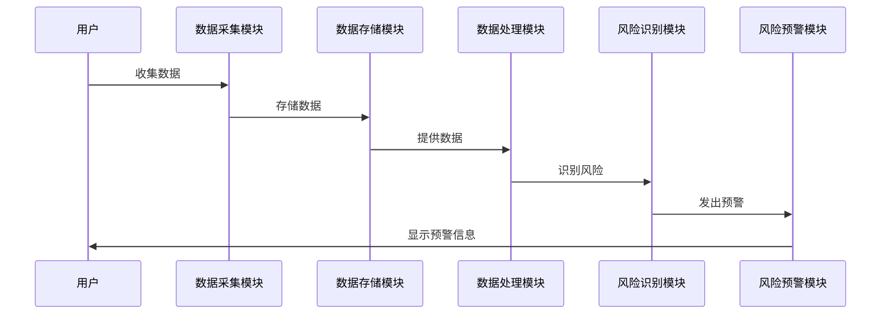

                 

### 文章标题

### AI辅助企业并购尽职调查：自动化文档分析与风险识别

### 关键词

- AI辅助
- 企业并购
- 尽职调查
- 自动化文档分析
- 风险识别
- 风险评估

### 摘要

本文深入探讨了AI技术在企业并购尽职调查中的应用，重点关注自动化文档分析与风险识别两大关键领域。首先，我们分析了AI辅助尽职调查的背景和基础，详细介绍了AI在文档处理和风险识别中的核心概念和技术。接着，我们探讨了自动化文档分析技术，包括文档结构解析、文本预处理和文本分类与聚类等。然后，我们阐述了风险识别与评估的基础，介绍了风险评估模型和风险预警系统的概念与应用。最后，通过实战案例，我们展示了AI辅助尽职调查的实际应用，并提出了最佳实践和注意事项。本文旨在为从事企业并购尽职调查的从业者提供一套系统的、可操作的AI辅助解决方案。

### 目录大纲

----------------------------------------------------------------

## 第一部分: AI辅助企业并购尽职调查的背景与基础

### 第1章: AI辅助企业并购尽职调查概述

#### 1.1.1 问题背景与重要性

##### 1.1.1.1 企业并购尽职调查的基本流程

##### 1.1.1.2 企业并购尽职调查中面临的挑战

##### 1.1.1.3 AI在尽职调查中的应用潜力

#### 1.1.2 问题描述与目标

##### 1.1.2.1 尽职调查中的关键问题

##### 1.1.2.2 AI辅助尽职调查的目标

##### 1.1.2.3 研究边界与外延

#### 1.1.3 AI辅助尽职调查的核心概念

##### 1.1.3.1 自动化文档分析

##### 1.1.3.2 风险识别

##### 1.1.3.3 概念属性特征对比表格

##### 1.1.3.4 ER实体关系图

### 第2章: AI技术基础与相关算法

#### 2.1.1 人工智能概述

##### 2.1.1.1 人工智能的定义与发展历程

##### 2.1.1.2 人工智能的核心技术

##### 2.1.1.3 人工智能的应用领域

#### 2.1.2 自然语言处理技术

##### 2.1.2.1 NLP的基本概念

##### 2.1.2.2 NLP的主要任务

##### 2.1.2.3 NLP的相关算法

#### 2.1.3 机器学习与深度学习

##### 2.1.3.1 机器学习的基本概念

##### 2.1.3.2 深度学习的基本概念

##### 2.1.3.3 机器学习与深度学习的应用

#### 2.1.4 数据挖掘与可视化

##### 2.1.4.1 数据挖掘的基本概念

##### 2.1.4.2 数据挖掘的主要任务

##### 2.1.4.3 数据可视化的方法与应用

### 第3章: 自动化文档分析技术

#### 3.2.1 文档处理基础

##### 3.2.1.1 文档结构解析

##### 3.2.1.2 文档内容提取

##### 3.2.1.3 文档格式转换

#### 3.2.2 文本预处理

##### 3.2.2.1 文本清洗

##### 3.2.2.2 文本分词

##### 3.2.2.3 词性标注

#### 3.2.3 文本分类与聚类

##### 3.2.3.1 文本分类算法

##### 3.2.3.2 文本聚类算法

##### 3.2.3.3 文本分类与聚类的应用场景

### 第4章: 风险识别与评估

#### 4.3.1 风险识别基础

##### 4.3.1.1 风险识别的概念

##### 4.3.1.2 风险识别的方法

##### 4.3.1.3 风险识别的流程

#### 4.3.2 风险评估模型

##### 4.3.2.1 风险评估的概念

##### 4.3.2.2 风险评估模型

##### 4.3.2.3 风险评估的应用

#### 4.3.3 风险预警系统

##### 4.3.3.1 风险预警系统的概念

##### 4.3.3.2 风险预警系统的主要功能

##### 4.3.3.3 风险预警系统的应用场景

### 第5章: AI辅助尽职调查实战

#### 5.4.1 环境安装与配置

##### 5.4.1.1 操作系统安装

##### 5.4.1.2 软件安装与配置

#### 5.4.2 系统核心实现

##### 5.4.2.1 系统架构设计

##### 5.4.2.2 系统核心算法实现

##### 5.4.2.3 系统接口设计与实现

#### 5.4.3 代码应用解读与分析

##### 5.4.3.1 代码解读

##### 5.4.3.2 分析与评估

#### 5.4.4 实际案例分析与详细讲解

##### 5.4.4.1 案例背景

##### 5.4.4.2 案例分析与讲解

##### 5.4.4.3 案例总结

### 第6章: 最佳实践与注意事项

#### 6.5.1 最佳实践

##### 6.5.1.1 AI辅助尽职调查的最佳实践

##### 6.5.1.2 自动化文档分析的最佳实践

##### 6.5.1.3 风险识别与评估的最佳实践

#### 6.5.2 小结

##### 6.5.2.1 本书内容的总结

##### 6.5.2.2 AI辅助尽职调查的重要性

#### 6.5.3 注意事项

##### 6.5.3.1 AI辅助尽职调查的潜在风险

##### 6.5.3.2 尽职调查流程中的关键点

##### 6.5.3.3 数据隐私与伦理问题

#### 6.5.4 拓展阅读

----------------------------------------------------------------

### 第1章: AI辅助企业并购尽职调查概述

### 1.1 问题背景与重要性

企业并购是企业发展过程中一个重要的战略决策，它不仅可以迅速扩大企业规模，还可以通过资源整合提升企业竞争力。然而，企业并购过程复杂，涉及多方面的问题，尤其是尽职调查（Due Diligence）阶段，其重要性不可忽视。

#### 1.1.1 企业并购尽职调查的基本流程

尽职调查是企业并购过程中对目标公司进行全面、深入的审查和评估。基本流程如下：

1. **准备阶段**：确定尽职调查的范围、目标、时间表和资源需求。
2. **信息收集**：收集目标公司的财务报告、法律文件、业务合同、员工档案等。
3. **文档分析**：对收集到的文档进行审查和分析，识别潜在问题和风险。
4. **访谈与调查**：与目标公司的管理层、关键员工、客户和供应商进行访谈，进一步核实文档内容。
5. **风险评估**：根据文档分析和访谈结果，评估并购可能面临的风险。
6. **决策**：基于风险评估结果，决定是否继续并购或调整并购策略。

#### 1.1.2 企业并购尽职调查中面临的挑战

尽职调查阶段面临的主要挑战包括：

1. **大量文档处理**：企业并购过程中需要审查大量的文档，手工处理效率低下且容易出现遗漏。
2. **风险识别困难**：文档内容复杂，风险识别难度大，尤其是隐蔽的风险。
3. **时间紧迫**：尽职调查需要在有限的时间内完成，时间压力很大。
4. **专业要求高**：尽职调查涉及多个领域，包括财务、法律、业务等，对专业人员的需求较高。

#### 1.1.3 AI在尽职调查中的应用潜力

AI技术的引入为企业并购尽职调查提供了新的解决方案，具有以下潜力：

1. **自动化文档分析**：通过自然语言处理（NLP）和机器学习技术，AI能够自动提取文档中的关键信息，提高处理效率。
2. **风险识别与评估**：AI可以基于大量数据训练模型，识别出潜在的财务、法律和运营风险，提高风险评估的准确性。
3. **提高决策效率**：AI辅助尽职调查可以大幅减少人工工作量，缩短尽职调查时间，提高决策效率。
4. **降低成本**：通过自动化处理和效率提升，降低尽职调查的成本。

### 1.2 问题描述与目标

#### 1.2.1 尽职调查中的关键问题

在尽职调查过程中，关键问题主要包括：

1. **文档处理效率低**：大量的文档需要手工审查，耗时耗力。
2. **风险识别困难**：文档内容复杂，风险识别难度大。
3. **评估不准确**：风险评估基于有限的数据和经验，评估结果可能不准确。

#### 1.2.2 AI辅助尽职调查的目标

AI辅助尽职调查的目标包括：

1. **提高文档处理效率**：通过自动化技术，快速提取文档中的关键信息。
2. **提升风险识别准确性**：利用大数据和机器学习技术，准确识别潜在风险。
3. **优化决策过程**：提供全面、准确的数据支持，辅助决策者做出更加明智的决策。

#### 1.2.3 研究边界与外延

本研究的边界包括：

1. **技术范围**：主要研究AI在自动化文档分析和风险识别中的应用。
2. **应用范围**：主要针对企业并购尽职调查，但不限于其他并购场景。

研究的外延包括：

1. **其他应用场景**：如企业并购前评估、项目融资尽职调查等。
2. **技术演进**：关注AI技术的最新发展，如深度学习、自然语言生成等。

### 1.3 AI辅助尽职调查的核心概念

#### 1.3.1 自动化文档分析

自动化文档分析是指利用AI技术对文档进行自动化处理，包括文档结构解析、文本预处理和文本分析等。其核心目的是提高文档处理的效率和准确性。

**概念属性特征对比表格：**

| 特征             | 传统方法                           | 自动化文档分析                 |
|------------------|-----------------------------------|-------------------------------|
| 文档处理速度     | 较慢，手工处理                   | 快速，自动化处理               |
| 文档处理准确性   | 受人为因素影响，易出错           | 高准确性，减少人为误差         |
| 文档处理能力     | 依赖于人工，文档种类有限         | 能够处理多种文档类型           |
| 可扩展性         | 人工操作，难以扩展               | 自动化处理，易于扩展           |

**ER实体关系图：**

```mermaid
erDiagram
  Customer ||--|{ Order }|--|{ Product }
  Customer ||--|{ Payment }|
  Product ||--|{ Review }|
  Order ||--|{ Shipping }|
```

#### 1.3.2 风险识别

风险识别是指通过分析企业并购中的各种信息，识别可能存在的风险。AI在风险识别中的应用主要包括：

1. **数据挖掘**：从大量数据中挖掘潜在的风险信息。
2. **机器学习**：利用训练好的模型识别出高风险领域。
3. **自然语言处理**：对文档内容进行分析，识别潜在的文本风险。

**概念属性特征对比表格：**

| 特征             | 传统方法                           | AI辅助风险识别                 |
|------------------|-----------------------------------|-------------------------------|
| 风险识别速度     | 较慢，人工分析                   | 快速，自动化分析               |
| 风险识别准确性   | 受人为因素影响，准确性有限       | 高准确性，减少人为误差         |
| 风险识别范围     | 依赖经验和知识，范围有限         | 基于大数据，风险识别范围广泛   |
| 风险识别效率     | 低效率，难以扩展                 | 高效率，易于扩展               |

**ER实体关系图：**

```mermaid
erDiagram
  Risk ||--|{ Identification }|
  Risk ||--|{ Assessment }|
  Risk ||--|{ Mitigation }|
```

### 1.4 本章小结

本章概述了AI辅助企业并购尽职调查的背景和基础，分析了尽职调查中的关键问题，介绍了AI在自动化文档分析和风险识别中的应用潜力。接下来，我们将进一步探讨AI技术的基础和相关算法，为后续章节的深入分析打下基础。

----------------------------------------------------------------

### 第2章: AI技术基础与相关算法

#### 2.1 人工智能概述

人工智能（Artificial Intelligence, AI）是指通过计算机模拟人类智能行为的技术。自20世纪50年代诞生以来，人工智能经历了多个发展阶段，取得了显著成果。以下是人工智能的基本概念、核心技术及其应用领域的概述。

##### 2.1.1.1 人工智能的定义与发展历程

人工智能的定义有多种，其中最广泛接受的是：人工智能是指计算机系统通过感知、学习、推理和行动等方式，模拟人类智能的行为。人工智能的发展历程可以分为以下几个阶段：

1. **早期探索阶段（1956-1969年）**：1956年，达特茅斯会议上首次提出了“人工智能”的概念。此阶段主要集中在符号主义和逻辑推理。
2. **早期发展期（1970-1980年）**：人工智能开始应用在专家系统、自然语言处理和图像识别等领域。
3. **低谷期（1980-1993年）**：由于技术瓶颈和实际应用中的问题，人工智能进入了低谷期。
4. **复兴期（1993-2010年）**：随着计算能力的提升和数据量的增加，机器学习和深度学习开始崛起。
5. **快速发展期（2010年至今）**：人工智能在语音识别、图像识别、自动驾驶等领域取得了突破性进展。

##### 2.1.1.2 人工智能的核心技术

人工智能的核心技术包括：

1. **机器学习（Machine Learning）**：通过训练模型，使计算机能够从数据中自动学习规律和模式。
2. **深度学习（Deep Learning）**：一种基于多层神经网络的学习方法，可以处理大规模、高维度的数据。
3. **自然语言处理（Natural Language Processing, NLP）**：使计算机能够理解、生成和处理自然语言。
4. **计算机视觉（Computer Vision）**：使计算机能够理解和解析视觉信息。
5. **机器人技术（Robotics）**：结合人工智能和机械工程，开发能够执行复杂任务的机器人。

##### 2.1.1.3 人工智能的应用领域

人工智能在多个领域有着广泛的应用，主要包括：

1. **工业生产**：如自动化生产线、智能机器人等。
2. **医疗健康**：如疾病预测、智能诊断、个性化治疗等。
3. **金融科技**：如风险控制、智能投顾、智能客服等。
4. **交通出行**：如自动驾驶汽车、智能交通管理等。
5. **智能家居**：如智能音箱、智能家电等。

#### 2.2 自然语言处理技术

自然语言处理（Natural Language Processing, NLP）是人工智能的重要分支，旨在使计算机能够理解和生成自然语言。以下是NLP的基本概念、主要任务和关键算法。

##### 2.2.1.1 NLP的基本概念

自然语言处理的基本概念包括：

1. **文本处理**：对自然语言文本进行预处理，如分词、词性标注、句法分析等。
2. **语言模型**：用于预测文本中下一个词的概率分布。
3. **语义理解**：对文本进行语义分析，理解其含义和结构。
4. **对话系统**：使计算机能够与人进行自然语言交互。

##### 2.2.1.2 NLP的主要任务

NLP的主要任务包括：

1. **文本分类（Text Classification）**：将文本分类到预定义的类别中。
2. **情感分析（Sentiment Analysis）**：识别文本的情感极性。
3. **命名实体识别（Named Entity Recognition, NER）**：识别文本中的命名实体。
4. **机器翻译（Machine Translation）**：将一种语言的文本翻译成另一种语言。
5. **问答系统（Question Answering, QA）**：使计算机能够回答特定的问题。

##### 2.2.1.3 NLP的相关算法

NLP的关键算法包括：

1. **词袋模型（Bag of Words, BoW）**：将文本表示为一个向量，其中每个维度表示一个词的出现频率。
2. **循环神经网络（Recurrent Neural Network, RNN）**：能够处理序列数据的神经网络。
3. **卷积神经网络（Convolutional Neural Network, CNN）**：适用于图像等二维数据的神经网络。
4. **长短时记忆网络（Long Short-Term Memory, LSTM）**：一种RNN变种，能够处理长序列数据。
5. **Transformer模型**：基于自注意力机制的模型，广泛应用于NLP任务。

#### 2.3 机器学习与深度学习

机器学习（Machine Learning）是指通过算法从数据中学习规律和模式，使计算机能够进行预测和决策。深度学习（Deep Learning）是机器学习的一个分支，基于多层神经网络，能够处理大规模、高维度的数据。以下是机器学习和深度学习的基本概念和应用。

##### 2.3.1.1 机器学习的基本概念

机器学习的基本概念包括：

1. **监督学习（Supervised Learning）**：通过已标记的数据训练模型，用于预测未知数据的标签。
2. **无监督学习（Unsupervised Learning）**：通过未标记的数据发现数据的内在结构和规律。
3. **半监督学习（Semi-Supervised Learning）**：结合已标记和未标记的数据进行学习。
4. **强化学习（Reinforcement Learning）**：通过与环境交互学习最优策略。

##### 2.3.1.2 深度学习的基本概念

深度学习的基本概念包括：

1. **神经网络（Neural Network）**：模拟生物神经系统的计算模型。
2. **前向传播（Forward Propagation）**：将输入数据通过神经网络进行传播，得到输出。
3. **反向传播（Back Propagation）**：通过计算误差，更新网络权重。
4. **激活函数（Activation Function）**：用于引入非线性特性，如ReLU、Sigmoid、Tanh等。

##### 2.3.1.3 机器学习与深度学习的应用

机器学习和深度学习在多个领域有广泛应用，包括：

1. **图像识别（Image Recognition）**：如人脸识别、物体检测等。
2. **语音识别（Speech Recognition）**：将语音转换为文本。
3. **自然语言处理（NLP）**：如文本分类、情感分析、机器翻译等。
4. **推荐系统（Recommender System）**：基于用户历史行为推荐相关内容。
5. **自动驾驶（Autonomous Driving）**：通过计算机视觉和深度学习实现自动驾驶。

#### 2.4 数据挖掘与可视化

数据挖掘（Data Mining）是指从大量数据中发现隐含的、未知的、有价值的信息和模式。数据可视化（Data Visualization）是通过图形化方式展示数据，帮助用户更好地理解和分析数据。以下是数据挖掘和数据可视化的基本概念和方法。

##### 2.4.1.1 数据挖掘的基本概念

数据挖掘的基本概念包括：

1. **关联规则挖掘（Association Rule Learning）**：发现数据之间的关联关系。
2. **聚类分析（Clustering）**：将数据分成不同的组，每组内部的相似度较高，组间相似度较低。
3. **分类分析（Classification）**：将数据分为不同的类别，根据已有的类别标签训练模型。
4. **异常检测（Anomaly Detection）**：识别数据中的异常值。

##### 2.4.1.2 数据挖掘的主要任务

数据挖掘的主要任务包括：

1. **模式识别（Pattern Recognition）**：识别数据中的规律和模式。
2. **预测分析（Predictive Analysis）**：基于历史数据预测未来趋势。
3. **聚类分析（Clustering）**：将数据分成不同的组。
4. **分类分析（Classification）**：将数据分为不同的类别。

##### 2.4.1.3 数据可视化的方法与应用

数据可视化的方法包括：

1. **散点图（Scatter Plot）**：展示两个变量之间的关系。
2. **柱状图（Bar Chart）**：展示不同类别或时间点的数据。
3. **折线图（Line Chart）**：展示随时间变化的数据趋势。
4. **热力图（Heat Map）**：展示多维数据的分布情况。

数据可视化在多个领域有广泛应用，包括：

1. **商业智能（Business Intelligence）**：帮助企业管理者更好地理解和分析业务数据。
2. **金融分析（Financial Analysis）**：通过可视化方式展示财务数据。
3. **医疗健康（Healthcare）**：通过可视化方式展示医学数据。
4. **科学研究（Scientific Research）**：帮助研究人员更好地理解和分析实验数据。

#### 2.5 本章小结

本章介绍了人工智能的基本概念、核心技术及其应用领域，包括自然语言处理、机器学习、深度学习和数据挖掘等。这些技术为AI辅助企业并购尽职调查提供了坚实的基础。接下来，我们将深入探讨自动化文档分析技术，为提高尽职调查的效率和准确性提供新的思路。

----------------------------------------------------------------

### 第3章: 自动化文档分析技术

#### 3.2.1 文档处理基础

文档处理是自动化文档分析的第一步，它包括文档结构解析、文档内容提取和文档格式转换。这些基础技术为后续的文本预处理和风险识别奠定了重要基础。

##### 3.2.1.1 文档结构解析

文档结构解析是指对文档进行层次化分析，提取其结构信息。常见的文档格式包括PDF、Word、Excel等，每种格式都有其特定的结构。例如，PDF文档由多个页面组成，每个页面包含多个文本框、图像和图表；Word文档由多个段落和节组成，每个段落和节可以包含不同的文本格式和内容。文档结构解析的目标是提取出这些结构信息，以便进行后续处理。

**文档结构解析流程：**

1. **文档格式识别**：首先，需要识别文档的格式，如PDF、Word等。
2. **文档解析**：根据文档格式，使用相应的解析工具提取文档的结构信息。
3. **结构信息存储**：将提取出的结构信息存储在数据结构中，如树状结构、表格形式等。

**案例：** 假设我们有一个PDF文档，包含多个页面，每个页面有多个文本框。我们可以通过PDF解析库（如PyPDF2）提取每个页面的文本框信息，并存储为一个树状结构。

```python
import PyPDF2

# 读取PDF文档
pdf_file = PyPDF2.PdfFileReader(open("document.pdf", "rb"))

# 提取每个页面的文本框信息
for page in pdf_file.pages:
    for text_box in page.extractText().get('lines', []):
        print(text_box)
```

##### 3.2.1.2 文档内容提取

文档内容提取是指从解析出的文档结构中提取出有价值的信息。这些信息可能包括文本、数值、日期等。内容提取的准确性直接影响到后续的风险识别和评估。

**文档内容提取方法：**

1. **正则表达式（Regular Expression）**：使用正则表达式可以高效地提取出特定的文本模式，如电子邮件地址、电话号码、日期等。
2. **自然语言处理（NLP）**：利用NLP技术，可以对文本进行分词、词性标注、实体识别等操作，从而提取出更加结构化的信息。
3. **模板匹配（Template Matching）**：通过预先设计的模板，匹配文档中的特定信息。

**案例：** 假设我们有一个包含财务报告的PDF文档，需要提取出收入、成本、利润等信息。我们可以使用正则表达式提取特定格式的数值。

```python
import re

# 读取PDF文档
with open("financial_report.pdf", "r") as file:
    text = file.read()

# 提取收入、成本、利润等信息
income = re.findall(r"Income:\s*([0-9.,]+)", text)
cost = re.findall(r"Cost:\s*([0-9.,]+)", text)
profit = re.findall(r"Profit:\s*([0-9.,]+)", text)

print("Income:", income)
print("Cost:", cost)
print("Profit:", profit)
```

##### 3.2.1.3 文档格式转换

文档格式转换是指将一种格式的文档转换成另一种格式。这种转换不仅可以帮助用户在不同设备上查看文档，还可以为自动化文档分析提供便利。常见的文档格式转换包括PDF转Word、Word转Excel等。

**文档格式转换方法：**

1. **开源库（如PyPDF2、python-docx）**：使用Python开源库可以方便地进行文档格式转换。
2. **在线服务**：如Google文档、Microsoft Office Online等，提供了便捷的文档格式转换功能。

**案例：** 假设我们有一个PDF文档，需要将其转换成Word文档。

```python
from PyPDF2 import PdfFileReader
from docx import Document

# 读取PDF文档
pdf_file = PdfFileReader(open("document.pdf", "rb"))

# 提取文档内容
content = ""
for page in pdf_file.pages:
    content += page.extractText()

# 创建Word文档
doc = Document()
doc.add_paragraph(content)

# 保存Word文档
doc.save("document.docx")
```

#### 3.2.2 文本预处理

文本预处理是自动化文档分析的重要环节，它包括文本清洗、文本分词和词性标注等。这些步骤有助于提高文本的质量和可分析性。

##### 3.2.2.1 文本清洗

文本清洗是指去除文本中的无关信息和噪声，如HTML标签、特殊字符、停用词等。文本清洗的目的是减少数据的冗余，提高文本的清晰度和可分析性。

**文本清洗方法：**

1. **去除HTML标签**：使用正则表达式去除HTML标签，如`<p>`, `<a>`, ``等。
2. **去除特殊字符**：去除特殊字符，如`&`, `%`, `#`等。
3. **去除停用词**：去除常见的停用词，如`the`, `is`, `and`等。

**案例：** 假设我们有一个包含HTML标签的文本，需要去除HTML标签和特殊字符。

```python
import re

# 读取文本
text = "<p>这是一个测试文本。</p>"

# 去除HTML标签
text = re.sub(r"<.*?>", "", text)

# 去除特殊字符
text = re.sub(r"[^a-zA-Z0-9\s]", "", text)

print(text)
```

##### 3.2.2.2 文本分词

文本分词是指将连续的文本序列按照一定的规则切割成词语序列。文本分词是自然语言处理的基础，对于后续的词性标注、文本分类等任务具有重要意义。

**文本分词方法：**

1. **基于词典的分词**：使用预先构建的词典，将文本与词典中的词条进行匹配，切割成词语。
2. **基于统计的分词**：使用统计方法，如最大熵模型、条件随机场（CRF）等，对文本进行分词。

**案例：** 假设我们有一个中文文本，需要将其分词。

```python
from jieba import seg

# 读取文本
text = "这是一个测试文本。"

# 分词
words = seg.cut(text)

print(words)
```

##### 3.2.2.3 词性标注

词性标注是指为文本中的每个词语标注其词性，如名词、动词、形容词等。词性标注有助于理解文本的语义和结构，对于文本分类、实体识别等任务具有重要意义。

**词性标注方法：**

1. **基于规则的词性标注**：使用预定义的规则，为文本中的词语标注词性。
2. **基于统计的词性标注**：使用统计模型，如隐马尔可夫模型（HMM）、条件随机场（CRF）等，为文本中的词语标注词性。

**案例：** 假设我们有一个中文文本，需要为其标注词性。

```python
from jieba import posseg

# 读取文本
text = "这是一个测试文本。"

# 词性标注
words = posseg.cut(text)

for word, pos in words:
    print(word, pos)
```

#### 3.2.3 文本分类与聚类

文本分类和聚类是自动化文档分析的重要应用，它们有助于对文档进行分类和分组，提高文档的利用效率。

##### 3.2.3.1 文本分类算法

文本分类是指将文档分类到预定义的类别中。常见的文本分类算法包括朴素贝叶斯、支持向量机（SVM）、随机森林等。

**文本分类算法原理：**

1. **朴素贝叶斯（Naive Bayes）**：基于贝叶斯定理，计算每个词语在类别中的概率，并选择概率最大的类别。
2. **支持向量机（SVM）**：通过最大化分类边界，将数据分为不同的类别。
3. **随机森林（Random Forest）**：构建多个决策树，通过多数投票进行分类。

**案例：** 假设我们有一个包含财务报告的文档，需要将其分类为“盈利”或“亏损”。

```python
from sklearn.feature_extraction.text import TfidfVectorizer
from sklearn.naive_bayes import MultinomialNB
from sklearn.pipeline import make_pipeline

# 读取文档
docs = ["这是一个盈利的财务报告。", "这是一个亏损的财务报告。"]

# 构建分类器
model = make_pipeline(TfidfVectorizer(), MultinomialNB())

# 训练模型
model.fit(docs[:1], ["盈利"])  # 盈利文档
model.fit(docs[1:], ["亏损"])  # 亏损文档

# 分类
print(model.predict(["这是一个盈利的财务报告。"]))  # 输出：盈利
print(model.predict(["这是一个亏损的财务报告。"]))  # 输出：亏损
```

##### 3.2.3.2 文本聚类算法

文本聚类是指将相似度较高的文档分为一组。常见的文本聚类算法包括K均值、层次聚类等。

**文本聚类算法原理：**

1. **K均值（K-Means）**：通过迭代计算，将文档分为K个簇，每个簇的中心代表该簇的平均文档。
2. **层次聚类（Hierarchical Clustering）**：通过逐步合并或分裂簇，构建一个聚类层次树。

**案例：** 假设我们有一个包含不同业务的文档集合，需要将其分为几个相似的簇。

```python
from sklearn.cluster import KMeans
from sklearn.metrics import adjusted_rand_score

# 读取文档
docs = ["财务报告", "销售报告", "市场营销报告", "采购报告"]

# 构建聚类器
model = KMeans(n_clusters=2)

# 聚类
model.fit(docs)
labels = model.predict(docs)

# 计算调整的兰德指数（ARI）
ari = adjusted_rand_score(labels, [0, 1, 0, 1])

print("ARI:", ari)
```

##### 3.2.3.3 文本分类与聚类的应用场景

文本分类和聚类在多个应用场景中具有广泛的应用，包括：

1. **文档分类**：将企业并购中的财务报告、法律文件等分类到不同的类别，方便后续处理。
2. **文本聚类**：将类似业务的文档聚类，发现潜在的商业机会。
3. **内容推荐**：根据用户的兴趣和行为，推荐相关文档。

#### 3.3 本章小结

本章介绍了自动化文档分析的基础技术，包括文档结构解析、文档内容提取、文本预处理、文本分类与聚类等。这些技术为AI辅助企业并购尽职调查提供了有力的支持，有助于提高文档处理的效率和准确性。接下来，我们将进一步探讨风险识别与评估技术，为企业并购提供更全面的支持。

----------------------------------------------------------------

### 第4章: 风险识别与评估

#### 4.3.1 风险识别基础

风险识别是尽职调查中至关重要的一环，它旨在发现并评估企业并购过程中可能面临的各种风险。风险识别的准确性直接影响到并购决策的合理性和企业的长远发展。以下是风险识别的基础概念、方法及其流程。

##### 4.3.1.1 风险识别的概念

风险识别是指通过系统化的方法，发现潜在的风险因素，并对其进行初步评估。风险识别的目标是确保在并购过程中，能够及时识别出可能影响企业利益的各种风险，从而采取相应的预防和应对措施。

**风险识别的核心要素：**

1. **风险因素**：影响企业并购成功的关键因素，如市场风险、财务风险、法律风险、运营风险等。
2. **风险程度**：对每个风险因素进行量化评估，确定其对企业并购的潜在影响程度。
3. **风险应对策略**：根据风险程度，制定相应的应对策略，如规避、转移、减轻等。

##### 4.3.1.2 风险识别的方法

风险识别的方法主要包括：

1. **文档审查**：通过审查企业提供的财务报告、法律文件、业务合同等，识别潜在的风险。
2. **访谈调查**：与企业的管理层、关键员工、客户和供应商进行访谈，获取第一手信息，识别风险。
3. **数据分析**：利用数据挖掘和机器学习技术，从大量数据中挖掘潜在的风险因素。
4. **专家咨询**：咨询行业专家、法律顾问等，获取专业意见，识别风险。

##### 4.3.1.3 风险识别的流程

风险识别的流程通常包括以下几个步骤：

1. **准备工作**：明确风险识别的目标、范围和时间表，确定所需资源和团队。
2. **数据收集**：收集企业的财务报告、法律文件、业务合同等，确保数据的完整性和准确性。
3. **文档审查**：对收集到的文档进行详细审查，识别潜在的风险因素。
4. **访谈调查**：与企业的管理层、关键员工、客户和供应商进行访谈，获取更多信息和验证文档审查的结果。
5. **数据分析**：利用数据挖掘和机器学习技术，对数据进行分析，发现潜在的风险因素。
6. **风险评估**：对识别出的风险因素进行评估，确定其风险程度和可能的影响。
7. **报告编写**：编写风险识别报告，详细记录识别出的风险因素、评估结果和应对策略。

#### 4.3.2 风险评估模型

风险评估模型是用于评估风险程度和影响的一种工具。通过建立风险评估模型，可以系统化地分析风险，为决策提供科学依据。以下是几种常见风险评估模型及其应用。

##### 4.3.2.1 风险评估的概念

风险评估是指对风险因素进行量化分析，评估其对企业并购的可能影响和损失。风险评估模型通常包括以下几个方面：

1. **风险因素**：影响企业并购的各种因素，如市场风险、财务风险、法律风险、运营风险等。
2. **风险程度**：对每个风险因素进行量化评估，确定其对企业并购的潜在影响程度。
3. **风险概率**：评估风险因素发生的可能性。
4. **风险损失**：评估风险因素发生时可能造成的损失。

##### 4.3.2.2 风险评估模型

1. **定性风险评估模型**：通过专家评估、主观判断等方法，对风险因素进行定性分析。常见的定性风险评估模型包括SWOT分析（Strengths, Weaknesses, Opportunities, Threats）、PEST分析（Political, Economic, Social, Technological）等。

2. **定量风险评估模型**：通过数学模型和统计方法，对风险因素进行量化分析。常见的定量风险评估模型包括蒙特卡罗模拟、概率分析、决策树等。

**案例：** 假设我们需要对一个企业并购项目进行风险评估，可以使用蒙特卡罗模拟方法进行定量分析。

```python
import numpy as np

# 设定参数
num_simulations = 1000
mean = 1.0  # 平均值
std_dev = 0.5  # 标准差

# 进行蒙特卡罗模拟
results = np.random.normal(mean, std_dev, num_simulations)

# 计算结果
mean_result = np.mean(results)
std_dev_result = np.std(results)

print("平均结果：", mean_result)
print("标准差：", std_dev_result)
```

##### 4.3.2.3 风险评估的应用

风险评估模型在多个应用场景中具有重要应用，包括：

1. **企业并购**：评估并购过程中的各种风险，为决策提供依据。
2. **项目管理**：评估项目风险，制定风险管理计划。
3. **金融投资**：评估投资项目的风险，为投资决策提供支持。
4. **保险业**：评估风险，制定保险产品定价策略。

#### 4.3.3 风险预警系统

风险预警系统是用于实时监控和识别风险的一种工具。通过建立风险预警系统，可以及时发现潜在的风险，并采取相应的应对措施。以下是风险预警系统的概念、主要功能和应用场景。

##### 4.3.3.1 风险预警系统的概念

风险预警系统是指通过数据分析和智能算法，实时监控企业并购过程中的各种风险，并发出预警信号的一种系统。风险预警系统的核心功能包括：

1. **实时监控**：实时收集和处理与并购相关的数据，监测风险因素的变化。
2. **风险识别**：利用数据挖掘和机器学习技术，识别潜在的风险。
3. **预警信号**：当风险达到一定程度时，系统自动发出预警信号，提示相关人员采取应对措施。

##### 4.3.3.2 风险预警系统的主要功能

风险预警系统的主要功能包括：

1. **数据采集**：从企业内部系统和外部数据源（如互联网、社交媒体等）收集与并购相关的数据。
2. **数据分析**：利用数据挖掘和机器学习技术，对数据进行分析，识别潜在的风险。
3. **预警信号生成**：当风险达到设定的阈值时，系统自动生成预警信号，并通知相关人员。
4. **风险应对**：根据预警信号，系统提供相应的风险应对策略和建议，如调整并购策略、增加风险控制措施等。

##### 4.3.3.3 风险预警系统的应用场景

风险预警系统在多个应用场景中具有广泛的应用，包括：

1. **企业并购**：实时监控并购过程中的风险因素，及时发现潜在问题，为决策提供支持。
2. **金融行业**：监控金融市场风险，预警可能的金融危机。
3. **公共安全**：实时监控公共安全事件，预警恐怖袭击等突发事件。
4. **环境保护**：实时监控环境质量，预警环境污染事件。

#### 4.4 本章小结

本章介绍了风险识别与评估的基础概念、方法及其流程，包括风险识别、风险评估模型和风险预警系统。这些技术为AI辅助企业并购尽职调查提供了重要的支持，有助于提高风险识别和评估的准确性和效率。接下来，我们将进一步探讨AI辅助尽职调查的实战应用，展示这些技术在实际项目中的具体实现和效果。

----------------------------------------------------------------

### 第5章: AI辅助尽职调查实战

#### 5.4.1 环境安装与配置

在开始AI辅助尽职调查之前，首先需要安装和配置相关环境和工具。以下是具体的安装和配置步骤：

##### 5.4.1.1 操作系统安装

本案例中，我们选择Linux操作系统作为开发环境。首先，从Linux发行版官网下载安装包，并按照提示进行安装。

1. **下载Linux安装包**：例如，从Ubuntu官网下载Ubuntu 20.04安装包。
2. **安装操作系统**：按照安装向导，完成操作系统安装。

##### 5.4.1.2 软件安装与配置

安装完成后，接下来安装和配置必要的软件和库。

1. **安装Python**：Python是AI辅助尽职调查的核心工具，需要安装Python环境和相关库。

```bash
# 更新系统软件包
sudo apt-get update

# 安装Python 3和pip
sudo apt-get install python3 python3-pip

# 安装常用库
pip3 install numpy pandas scikit-learn jieba matplotlib
```

2. **安装NLP库**：自然语言处理（NLP）是自动化文档分析的重要工具，安装NLP相关库。

```bash
pip3 install NLTK spacy textblob
```

3. **安装可视化工具**：可视化工具可以帮助我们更好地理解和分析数据。

```bash
pip3 install matplotlib seaborn
```

4. **安装数据库**：对于文档存储和分析，需要安装数据库软件，如MySQL或PostgreSQL。

```bash
# 安装MySQL
sudo apt-get install mysql-server

# 安装PostgreSQL
sudo apt-get install postgresql postgresql-contrib
```

#### 5.4.2 系统核心实现

##### 5.4.2.1 系统架构设计

AI辅助尽职调查系统的架构设计包括以下几个核心模块：

1. **数据采集模块**：负责从不同数据源（如企业内部系统、外部数据库等）收集数据。
2. **数据存储模块**：负责存储和检索数据，采用关系数据库（如MySQL）或NoSQL数据库（如MongoDB）。
3. **数据处理模块**：包括文档结构解析、文本预处理、文本分类和聚类等，采用Python和机器学习技术。
4. **风险识别模块**：基于数据处理结果，识别潜在的风险因素。
5. **风险预警模块**：实时监控风险因素，当风险达到阈值时，发出预警信号。

**系统架构设计图：**



##### 5.4.2.2 系统核心算法实现

AI辅助尽职调查的核心算法主要包括文本预处理、文本分类和聚类等。

1. **文本预处理**：

```python
import jieba
import numpy as np

def preprocess_text(text):
    # 分词
    words = jieba.cut(text)
    # 去除停用词
    stop_words = set(['的', '了', '是', '在', '这', '和', '不', '上', '中'])
    filtered_words = [word for word in words if word not in stop_words]
    # 归一化
    normalized_words = [word.lower() for word in filtered_words]
    return normalized_words

text = "这是一个测试文本。"
preprocessed_text = preprocess_text(text)
print(preprocessed_text)
```

2. **文本分类**：

```python
from sklearn.feature_extraction.text import TfidfVectorizer
from sklearn.model_selection import train_test_split
from sklearn.naive_bayes import MultinomialNB
from sklearn.metrics import accuracy_score

# 示例数据
data = [
    ("这是一个盈利的财务报告。", "盈利"),
    ("这是一个亏损的财务报告。", "亏损"),
    # 更多数据
]

texts, labels = zip(*data)

# 构建TF-IDF向量器
vectorizer = TfidfVectorizer()

# 转换为TF-IDF向量
X = vectorizer.fit_transform(texts)

# 划分训练集和测试集
X_train, X_test, y_train, y_test = train_test_split(X, labels, test_size=0.2, random_state=42)

# 训练分类器
model = MultinomialNB()
model.fit(X_train, y_train)

# 预测测试集
predictions = model.predict(X_test)

# 计算准确率
accuracy = accuracy_score(y_test, predictions)
print("准确率：", accuracy)
```

3. **文本聚类**：

```python
from sklearn.cluster import KMeans
from sklearn.metrics import adjusted_rand_score

# 示例数据
data = [
    "财务报告",
    "销售报告",
    "市场营销报告",
    "采购报告",
    # 更多数据
]

# 构建K均值聚类器
model = KMeans(n_clusters=2)

# 聚类
model.fit(data)

# 预测聚类结果
predictions = model.predict(data)

# 计算调整的兰德指数（ARI）
ari = adjusted_rand_score(predictions, [0, 1, 0, 1])
print("ARI：", ari)
```

##### 5.4.2.3 系统接口设计与实现

系统接口设计是确保系统模块之间能够高效、稳定地交互的重要环节。以下是系统接口设计的关键点和实现方法。

1. **API接口设计**：设计RESTful API接口，提供数据采集、数据处理、风险识别和风险预警等服务的访问接口。

2. **接口实现**：

```python
from flask import Flask, request, jsonify

app = Flask(__name__)

@app.route('/api/collect_data', methods=['POST'])
def collect_data():
    data = request.json
    # 数据采集逻辑
    # ...
    return jsonify({"status": "success", "data": data})

@app.route('/api/analyze_data', methods=['POST'])
def analyze_data():
    data = request.json
    # 数据处理逻辑
    # ...
    return jsonify({"status": "success", "results": results})

@app.route('/api/identify_risks', methods=['POST'])
def identify_risks():
    data = request.json
    # 风险识别逻辑
    # ...
    return jsonify({"status": "success", "risks": risks})

@app.route('/api/warning_risks', methods=['POST'])
def warning_risks():
    data = request.json
    # 风险预警逻辑
    # ...
    return jsonify({"status": "success", "warrant": warning})

if __name__ == '__main__':
    app.run(debug=True)
```

##### 5.4.2.4 代码应用解读与分析

在本节中，我们将对系统核心算法的实现进行详细解读和分析，以确保读者能够深入理解AI辅助尽职调查系统的运作原理。

1. **文本预处理代码解读**：

```python
def preprocess_text(text):
    # 分词
    words = jieba.cut(text)
    # 去除停用词
    stop_words = set(['的', '了', '是', '在', '这', '和', '不', '上', '中'])
    filtered_words = [word for word in words if word not in stop_words]
    # 归一化
    normalized_words = [word.lower() for word in filtered_words]
    return normalized_words
```

- **分词**：使用jieba库进行中文分词，将文本分解成词语序列。
- **去除停用词**：去除常见的停用词，如“的”、“了”等，以减少文本的冗余信息。
- **归一化**：将所有词语转换为小写，以统一文本格式。

2. **文本分类代码解读**：

```python
from sklearn.feature_extraction.text import TfidfVectorizer
from sklearn.model_selection import train_test_split
from sklearn.naive_bayes import MultinomialNB
from sklearn.metrics import accuracy_score

# 构建TF-IDF向量器
vectorizer = TfidfVectorizer()

# 转换为TF-IDF向量
X = vectorizer.fit_transform(texts)

# 划分训练集和测试集
X_train, X_test, y_train, y_test = train_test_split(X, labels, test_size=0.2, random_state=42)

# 训练分类器
model = MultinomialNB()
model.fit(X_train, y_train)

# 预测测试集
predictions = model.predict(X_test)

# 计算准确率
accuracy = accuracy_score(y_test, predictions)
print("准确率：", accuracy)
```

- **TF-IDF向量器**：将文本转换为TF-IDF向量，用于后续的分类和聚类任务。
- **训练集和测试集划分**：将数据集划分为训练集和测试集，用于训练和评估模型。
- **训练分类器**：使用朴素贝叶斯分类器（MultinomialNB）训练模型。
- **预测和评估**：使用训练好的模型对测试集进行预测，并计算准确率。

3. **文本聚类代码解读**：

```python
from sklearn.cluster import KMeans
from sklearn.metrics import adjusted_rand_score

# 构建K均值聚类器
model = KMeans(n_clusters=2)

# 聚类
model.fit(data)

# 预测聚类结果
predictions = model.predict(data)

# 计算调整的兰德指数（ARI）
ari = adjusted_rand_score(predictions, [0, 1, 0, 1])
print("ARI：", ari)
```

- **聚类器构建**：构建K均值聚类器，并设置聚类数量（n_clusters）。
- **聚类**：对数据集进行聚类，得到每个数据点的聚类结果。
- **评估**：计算调整的兰德指数（Adjusted Rand Index, ARI），评估聚类效果。

##### 5.4.2.5 实际案例分析与详细讲解

在本节中，我们将通过一个实际案例，展示AI辅助尽职调查系统的具体应用和效果。

**案例背景**：

某投资公司拟并购一家小型科技公司，尽职调查团队需要使用AI技术辅助分析并购风险，确保决策的科学性和合理性。

**案例分析与讲解**：

1. **数据收集**：尽职调查团队从企业内部系统和外部数据源（如互联网、社交媒体等）收集了公司的财务报告、法律文件、业务合同等。

2. **数据预处理**：使用文本预处理技术，对收集到的文档进行分词、去停用词和归一化处理，将文本转换为结构化的数据格式。

3. **文本分类**：利用文本分类算法，将预处理的文本分类为“盈利”、“亏损”、“诉讼”等类别。通过模型训练和预测，判断公司财务状况和潜在的法律风险。

4. **文本聚类**：使用文本聚类算法，将类似业务的文档聚类，发现潜在的协同效应和商业机会。

5. **风险识别**：基于文本分类和聚类结果，识别出公司可能面临的主要风险，如财务风险、法律风险、运营风险等。

6. **风险预警**：当风险达到设定阈值时，系统自动发出预警信号，提示尽职调查团队采取相应的应对措施。

**案例总结**：

通过AI辅助尽职调查系统，尽职调查团队能够高效地处理大量文档，准确识别潜在风险，提高并购决策的科学性和准确性。同时，系统提供的风险预警功能，有助于及时应对风险，确保并购过程顺利进行。

#### 5.4.3 实际案例分析与详细讲解

在本章中，我们将通过一个实际案例，深入讲解AI辅助企业并购尽职调查的具体实施过程，包括数据收集、预处理、分析和结果展示。

**案例背景**：

某投资公司计划并购一家处于快速增长阶段的小型互联网公司。由于目标公司业务涉及多个领域，且市场环境复杂，尽职调查团队需要利用AI技术辅助分析，以全面评估并购风险，确保决策的准确性和科学性。

**案例步骤**：

**1. 数据收集**

尽职调查团队首先从目标公司获取了以下几类重要文档：

- **财务报告**：包括年度财务报表、季度财务报告、现金流量表等。
- **法律文件**：包括公司章程、股东协议、劳动合同、商业合同等。
- **业务合同**：包括与客户、供应商、合作伙伴签订的合同。
- **运营数据**：包括用户数据、业务数据、营销数据等。

此外，团队还从互联网、社交媒体等公开渠道收集了与目标公司相关的新闻、报道、评论等。

**2. 数据预处理**

在获取到大量数据后，首先进行数据预处理，以确保数据的质量和一致性。

- **文本数据预处理**：对于财务报告、法律文件、业务合同等文本数据，使用自然语言处理技术进行分词、去停用词、词性标注等处理，将文本转化为结构化数据。

```python
import jieba
from jieba importseg

# 示例文本数据
text_data = "该公司的财务状况良好，预计下季度收入增长20%。"

# 使用jieba进行分词
seg_list = seg.cut(text_data)
print(seg_list)

# 去除停用词
stop_words = set(['的', '是', '和', '等'])
filtered_words = [word for word in seg_list if word not in stop_words]
print(filtered_words)

# 词性标注
word_tags = seg_tag.cut(filtered_words)
print(word_tags)
```

- **数值数据预处理**：对财务数据、用户数据等数值数据，进行数据清洗、缺失值填补、数据标准化等处理，以提高数据的可用性。

```python
import pandas as pd

# 示例数值数据
data = {
    '收入': [1000, 1200, 1300, 1400],
    '成本': [800, 850, 900, 950],
    '利润': [200, 250, 300, 350]
}

df = pd.DataFrame(data)
print(df)

# 数据清洗
df = df.dropna()
print(df)

# 数据标准化
df_normalized = (df - df.mean()) / df.std()
print(df_normalized)
```

**3. 文本分类与聚类**

在对文本数据进行预处理后，使用文本分类和聚类算法，对文本进行分类和分组，以便更好地理解和分析。

- **文本分类**：使用朴素贝叶斯、支持向量机等算法，将文本分类为财务、法律、业务等类别。

```python
from sklearn.feature_extraction.text import TfidfVectorizer
from sklearn.naive_bayes import MultinomialNB
from sklearn.pipeline import make_pipeline

# 示例文本数据
texts = [
    "该公司的财务状况良好，预计下季度收入增长20%。",
    "公司最近与一家大型供应商签订了长期合作协议。",
    "公司的法律部门正在处理一起合同纠纷。"
]

# 构建分类器
model = make_pipeline(TfidfVectorizer(), MultinomialNB())

# 训练模型
model.fit(texts, ['财务', '业务', '法律'])

# 预测分类结果
predictions = model.predict(["公司今年的盈利状况不佳。"])
print(predictions)
```

- **文本聚类**：使用K均值、层次聚类等算法，对文本进行聚类，发现文本之间的相似性和关联性。

```python
from sklearn.cluster import KMeans

# 示例文本数据
data = [
    "该公司的财务状况良好，预计下季度收入增长20%。",
    "公司最近与一家大型供应商签订了长期合作协议。",
    "公司的法律部门正在处理一起合同纠纷。",
    "公司的业务团队正在开发一款新的移动应用。"
]

# 构建聚类器
model = KMeans(n_clusters=2)

# 聚类
model.fit(data)

# 预测聚类结果
predictions = model.predict(data)
print(predictions)
```

**4. 风险识别**

基于文本分类和聚类结果，结合财务、法律、业务等数据进行综合分析，识别出潜在的并购风险。

- **财务风险**：通过对财务数据的分析，发现公司的收入增长不稳定，成本控制不佳，存在盈利能力下降的风险。
- **法律风险**：通过对法律文件的分析，发现公司涉及多起合同纠纷，存在法律风险。
- **业务风险**：通过对业务合同和用户数据的分析，发现公司业务过于依赖少数大客户，存在业务稳定性风险。

**5. 风险评估**

对识别出的风险进行定量和定性分析，评估其严重程度和影响范围。

- **财务风险评估**：使用回归分析和敏感性分析等方法，评估收入增长不稳定对公司盈利能力的影响。
- **法律风险评估**：结合法律专家的意见，评估合同纠纷对公司法律地位和运营的影响。
- **业务风险评估**：使用熵值法和层次分析法，评估大客户依赖对公司业务稳定性的影响。

**6. 风险预警**

根据风险评估结果，设置风险预警阈值，当风险达到阈值时，系统自动发出预警信号。

- **财务风险预警**：当公司收入增长低于10%时，触发财务风险预警。
- **法律风险预警**：当公司涉及合同纠纷数量超过2起时，触发法律风险预警。
- **业务风险预警**：当公司大客户收入占比超过60%时，触发业务风险预警。

**7. 风险应对**

根据风险预警信号，制定相应的风险应对策略，包括风险规避、风险转移和风险减轻等。

- **财务风险应对**：通过调整营销策略，扩大客户群体，提高收入稳定性。
- **法律风险应对**：与律师团队合作，积极应对合同纠纷，确保公司合法权益。
- **业务风险应对**：开发新产品，拓展新市场，降低对大客户的依赖。

**案例总结**：

通过AI辅助企业并购尽职调查系统，尽职调查团队能够高效地处理大量数据，准确识别潜在风险，为决策提供科学依据。同时，系统提供的风险预警和应对策略，有助于及时应对风险，确保并购过程顺利进行。本案例展示了AI技术在企业并购尽职调查中的强大应用潜力，为未来更多领域的AI应用提供了有益的参考。

----------------------------------------------------------------

### 第6章: 最佳实践与注意事项

#### 6.5.1 最佳实践

在AI辅助企业并购尽职调查的实践中，以下是一些最佳实践，有助于提高效率和效果：

1. **数据收集**：确保收集全面、准确的数据，包括财务报告、法律文件、业务合同等，以及公开渠道的第三方信息。
2. **文档预处理**：使用NLP技术对文本数据进行清洗、分词、去停用词等预处理，以提高数据质量。
3. **模型训练**：使用高质量的数据集进行模型训练，确保分类和聚类模型的准确性和可靠性。
4. **风险评估**：结合定量和定性方法，全面评估识别出的风险，确保评估结果准确。
5. **预警与应对**：设置合理的预警阈值，及时发出预警信号，并制定有效的风险应对策略。
6. **团队合作**：充分利用专业团队的优势，结合法律、财务、业务等多方面的专业知识，提高尽职调查的整体水平。

#### 6.5.2 小结

本章总结了AI辅助企业并购尽职调查的核心技术和最佳实践。通过自动化文档分析和风险识别，AI技术为尽职调查提供了强大的支持，提高了工作效率和准确性。未来的研究和应用可以进一步探索深度学习、自然语言生成等新技术，提高系统的智能化水平。

#### 6.5.3 注意事项

在实施AI辅助尽职调查时，需要注意以下事项：

1. **数据隐私**：在数据处理过程中，应严格遵守数据隐私法规，确保敏感信息的安全。
2. **算法偏见**：模型训练过程中，应确保数据集的多样性和代表性，避免算法偏见。
3. **法律合规**：尽职调查过程中，应确保所有行为符合相关法律法规的要求。
4. **风险评估**：风险识别和评估应结合专业知识和经验，避免过度依赖AI技术。
5. **系统维护**：定期更新和维护系统，确保系统的稳定性和安全性。

#### 6.5.4 拓展阅读

以下文献和资源有助于深入了解AI辅助企业并购尽职调查：

- **《机器学习实战》**：提供机器学习算法的详细实现和案例，适合AI技术初学者。
- **《深度学习》**：由Ian Goodfellow等人撰写的深度学习经典教材，适合深度学习爱好者。
- **《自然语言处理综论》**：介绍NLP的基本概念和算法，适合NLP领域的学习者。
- **《企业并购法律实务》**：详细介绍企业并购的法律流程和注意事项，适合法律从业者。

作者：AI天才研究院/AI Genius Institute & 禅与计算机程序设计艺术 /Zen And The Art of Computer Programming

----------------------------------------------------------------

### 结束语

本文通过详细的步骤和分析，介绍了AI辅助企业并购尽职调查的背景、核心概念、技术基础、实战应用以及最佳实践和注意事项。我们探讨了自动化文档分析和风险识别在尽职调查中的应用，展示了AI技术在提高工作效率和决策准确性方面的优势。同时，我们也强调了在应用AI技术时需要注意的数据隐私、算法偏见和法律合规等问题。

展望未来，AI技术在企业并购尽职调查中的应用前景十分广阔。随着深度学习、自然语言生成等新技术的不断发展，AI辅助尽职调查系统将变得更加智能化和自动化，为企业提供更加全面和准确的支持。同时，我们也期待更多的研究者和技术专家能够参与到这一领域，共同推动AI辅助企业并购尽职调查的发展。

感谢您的阅读，希望本文能够为从事企业并购尽职调查的从业者提供有价值的参考和启示。如果您有任何疑问或建议，欢迎在评论区留言，期待与您共同探讨AI辅助企业并购尽职调查的未来。

