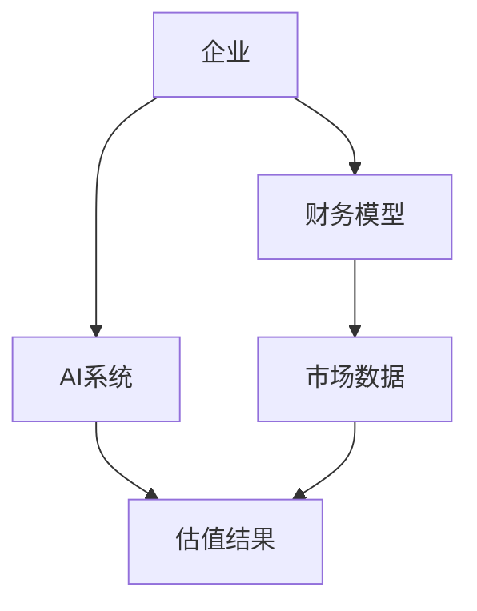

                 

### 第一部分：AI辅助企业并购的目标估值概述

#### 1.1 问题背景与意义

##### 1.1.1 企业并购的普遍性

企业并购（Merger and Acquisition, M&A）作为企业发展战略的重要手段，在全球范围内日益普遍。近年来，随着全球经济一体化的深入推进，市场竞争愈发激烈，企业通过并购来实现业务扩展、技术升级、市场份额增加等战略目标成为一种趋势。根据统计数据，全球企业并购活动在过去的十年中呈现稳步增长态势，交易数量和金额均创下新高。

在企业并购中，目标估值是一个至关重要的环节。准确的目标估值不仅能够帮助企业决策者确定合理的并购价格，还能评估并购后的整合效果和长期盈利能力。然而，传统的目标估值方法往往存在主观性强、精度不足等问题，无法完全满足现代企业并购的复杂需求。

##### 1.1.2 目标估值在企业并购中的重要性

目标估值在企业并购中的作用主要体现在以下几个方面：

1. **定价基础**：目标估值是确定并购价格的基础。通过科学合理的估值，企业可以避免因定价过高导致资源浪费，或因定价过低而错失战略机遇。
   
2. **风险评估**：准确的目标估值有助于评估并购风险，包括财务风险、运营风险、法律风险等，为决策者提供全面的决策依据。

3. **整合效果预测**：目标估值可以预测并购后的整合效果，包括财务整合、业务整合、文化整合等，为后续的整合工作提供指导。

4. **交易谈判**：目标估值是并购交易谈判的核心议题。通过合理的估值，企业可以在谈判中占据有利地位，提高谈判成功率。

##### 1.1.3 AI技术在目标估值中的应用前景

随着人工智能技术的快速发展，AI在企业并购目标估值中的应用前景日益广阔。AI技术通过大数据分析、机器学习算法和智能决策支持系统，能够提供更为精准和客观的估值结果，主要表现在以下几个方面：

1. **数据处理能力**：AI技术能够处理海量数据，快速提取有价值的信息，为估值模型提供更丰富的输入数据。

2. **客观性**：AI技术通过算法和模型，减少人为因素的主观干扰，提高估值的客观性和准确性。

3. **实时更新**：AI技术可以实时监控市场变化，快速调整估值结果，确保估值过程的时效性。

4. **协同效应分析**：AI技术能够通过多维度数据分析和协同效应模型，提供更为深入和全面的并购整合预测。

总之，AI辅助企业并购目标估值不仅能够提高估值的准确性和客观性，还能为企业决策提供更为全面和实时的支持，具有巨大的应用潜力和市场前景。

### 1.2 核心概念与联系

在深入探讨AI辅助企业并购目标估值的过程中，理解以下几个核心概念及其相互联系是非常关键的。以下是这些概念的定义、属性特征对比，以及ER实体关系图架构的详细描述。

#### 1.2.1 AI辅助估值的基本概念

##### AI辅助估值

AI辅助估值是指利用人工智能技术，特别是机器学习和数据挖掘算法，对企业资产、业务前景和市场价值进行综合评估的方法。这种方法能够通过分析大量历史数据、市场趋势和业务指标，提供更为准确和动态的估值结果。

**概念属性特征**：

- **数据处理能力**：AI技术能够高效处理和分析海量数据，提取有价值的信息。
- **算法模型**：采用先进的机器学习算法，如深度学习、支持向量机（SVM）、随机森林等，以提高估值精度。
- **实时性**：AI系统能够实时获取和更新数据，对市场变化作出快速响应。

##### 财务模型

财务模型是企业估值过程中常用的工具，通过对企业财务报表和财务指标的分析，预测企业的未来现金流和价值。

**概念属性特征**：

- **财务报表分析**：包括资产负债表、利润表和现金流量表等，用于评估企业的财务状况。
- **财务指标**：如营收增长率、净利润率、现金流等，作为估值的关键指标。
- **预测能力**：通过历史数据和财务趋势，预测企业的未来财务表现。

##### 协同效应分析

协同效应分析旨在评估企业并购后由于业务整合、资源共享等带来的额外收益。它关注的是并购后的整体效益是否大于并购前各部分效益的简单相加。

**概念属性特征**：

- **协同效应分类**：包括财务协同效应、运营协同效应和市场协同效应等。
- **评估指标**：如成本节约、市场份额增加、品牌价值提升等。
- **整合预测**：通过分析并购前后的业务数据，预测并购后的整合效果。

##### ER实体关系图架构

ER实体关系图（Entity-Relationship Diagram，ERD）是一种用于描述实体及其之间关系的图形化工具。在AI辅助企业并购目标估值中，ERD可以帮助我们清晰地定义估值过程中的关键实体和关系。



- **企业（Entity）**：企业是估值的核心对象，包含财务数据、运营数据和市场数据。
- **财务模型（Financial Model）**：财务模型用于分析企业的财务状况和预测未来表现。
- **AI系统（AI System）**：AI系统负责数据处理和模型训练，生成估值结果。
- **市场数据（Market Data）**：市场数据包括行业趋势、市场环境和竞争状况等。
- **估值结果（Valuation Result）**：估值结果是财务模型和AI系统共同作用的结果，反映了企业的市场价值。

#### 1.2.5 概念属性特征对比表格

为了更好地理解这些核心概念，我们提供以下表格，对比各概念的属性特征。

| 概念       | 属性特征1 | 属性特征2 | 属性特征3 |
|------------|-----------|-----------|-----------|
| AI辅助估值 | 数据处理能力 | 实时性 | 精确度 |
| 财务模型   | 财务报表分析 | 财务指标 | 预测能力 |
| 协同效应分析 | 协同效应分类 | 评估指标 | 整合预测 |

通过上述对比表格，我们可以更清晰地看到各概念之间的联系和区别。在后续章节中，我们将详细探讨这些概念在AI辅助企业并购目标估值中的应用。

### 1.3 研究方法与数据来源

在本文中，我们将采用多种研究方法来全面分析AI辅助企业并购目标估值的过程，确保研究结果的可靠性和有效性。

#### 1.3.1 研究方法

##### 定性研究

定性研究方法主要用于探索和解释企业并购估值过程中的核心概念和关系。通过深度访谈、案例研究和文献综述，我们可以深入了解财务模型、AI系统和协同效应分析的理论基础及其在实际应用中的表现。

1. **深度访谈**：通过与行业专家、企业决策者和财务分析师的深入交流，获取他们对AI辅助估值方法的看法、实践经验和建议。
2. **案例研究**：选取具有代表性的企业并购案例，分析其估值过程，探讨AI技术在目标估值中的实际应用效果。
3. **文献综述**：系统梳理相关领域的学术研究，总结已有理论和方法，为本文的研究提供理论基础。

##### 定量研究

定量研究方法主要用于验证和评估AI辅助估值方法的准确性和有效性。通过数据收集、处理和统计分析，我们可以定量分析AI技术在企业并购估值中的表现。

1. **数据收集**：通过公开数据源、行业数据库和公司财务报表，收集企业并购相关的财务数据、市场数据和交易数据。
2. **数据处理**：利用Python和R等编程语言，对收集的数据进行清洗、转换和整合，为建模和分析提供高质量的数据输入。
3. **统计分析**：采用回归分析、聚类分析和因子分析等统计方法，评估不同估值模型和算法的性能，比较其预测准确性和稳定性。

#### 1.3.2 数据来源与处理

##### 数据来源

本研究的数据来源主要包括以下几个方面：

1. **公开数据源**：包括Wind、Bloomberg等金融数据服务提供商，提供市场趋势、行业指标和公司财务报表等数据。
2. **行业数据库**：如IHS Markit、IBISWorld等，提供详细的行业报告和市场分析。
3. **公司财务报表**：通过企业官方网站、年报和季报等公开资料，获取企业的财务数据。

##### 数据处理

在数据收集完成后，对数据进行处理是确保研究可靠性的关键步骤。以下是数据处理的主要环节：

1. **数据清洗**：删除重复数据、纠正错误数据、处理缺失值，确保数据的完整性和准确性。
2. **数据转换**：将不同格式的数据进行标准化处理，统一数据格式，便于后续分析。
3. **数据整合**：将不同来源的数据进行整合，构建综合数据库，为建模和分析提供全面的数据支持。

通过上述研究方法和数据来源，我们将系统性地探讨AI辅助企业并购目标估值的机制和效果，为企业和决策者提供有价值的参考。

#### 1.4 目标估值中的挑战与机遇

在企业并购的目标估值过程中，尽管AI技术带来了显著的提升，但也面临诸多挑战和机遇。

##### 1.4.1 挑战

1. **数据质量**：目标估值依赖于大量的历史数据、财务数据和行业数据。然而，数据质量参差不齐，包括数据缺失、数据冗余、数据不一致等问题，这些都会影响估值结果的准确性。
   
2. **算法选择**：AI算法的选择对估值结果至关重要。不同算法在处理不同类型的数据和问题上表现各异，选择合适的算法并非易事，同时算法的调整和优化也是一个复杂的过程。
   
3. **计算资源**：AI技术需要大量的计算资源和存储空间。特别是在处理海量数据时，对硬件设施和算法效率提出了高要求。中小企业可能难以承担高昂的计算成本。
   
4. **法律与合规**：在数据收集和处理过程中，需严格遵守数据隐私和保护法律法规。合规性问题可能导致数据无法使用，从而影响估值结果的可靠性。

##### 1.4.2 机遇

1. **精准性提升**：AI技术能够处理复杂的多维度数据，通过机器学习和深度学习算法，提高估值的精度和可靠性。这使得企业能够更加准确地评估目标公司的市场价值。

2. **实时性增强**：AI系统可以实时获取和处理数据，快速调整估值结果，确保估值过程的时效性。企业可以及时响应市场变化，优化并购决策。

3. **协同效应预测**：AI技术能够通过多维度数据分析，预测并购后的协同效应，为决策者提供全面的整合预测。这有助于企业更好地规划并购后的运营策略。

4. **降低成本**：AI技术自动化了大量的数据处理和分析工作，减少了人工干预，降低了估值成本。中小企业也能借助AI技术实现高效的目标估值。

综上所述，AI技术在企业并购目标估值中既面临挑战，也蕴含机遇。通过合理利用AI技术，企业可以克服传统方法的局限性，实现更加精准、高效和实时的估值，为并购决策提供有力支持。

### 1.5 本章小结

本章节主要对企业并购目标估值中的AI辅助方法进行了概述。首先，我们探讨了企业并购的普遍性及其目标估值的重要性，明确了AI技术在目标估值中的应用前景。接着，我们介绍了核心概念，包括AI辅助估值、财务模型和协同效应分析，并通过ER实体关系图架构展示了这些概念之间的联系。然后，详细阐述了研究方法与数据来源，包括定性研究和定量研究的结合，以及数据收集、处理和整合的步骤。最后，分析了目标估值过程中面临的挑战与机遇。通过本章的探讨，我们为后续章节的深入分析奠定了基础。

---

### 2.1 财务模型基础

财务模型在企业并购目标估值中扮演着关键角色，它通过分析企业财务数据，预测未来现金流和价值，从而提供估值依据。要构建有效的财务模型，需要掌握财务报表的解读、财务指标的分析和财务预测模型的使用。

#### 2.1.1 财务报表解读

财务报表是财务模型的主要输入，包括资产负债表、利润表和现金流量表。以下是这些报表的基本内容和解读方法：

1. **资产负债表（Balance Sheet）**：资产负债表反映了企业在特定时点的资产、负债和所有者权益状况。主要项目包括流动资产、非流动资产、流动负债、长期负债和股东权益。解读资产负债表时，需关注以下几个方面：
   - **资产质量**：分析流动资产和非流动资产的结构，评估资产的流动性、盈利能力和风险。
   - **负债结构**：关注流动负债和长期负债的构成，评估企业的偿债能力和财务稳定性。
   - **权益结构**：分析股东权益的构成，评估企业的股权结构和所有者权益的稳定性。

2. **利润表（Income Statement）**：利润表反映了企业在一定时间内的收入、成本、费用和利润情况。主要项目包括营业收入、营业成本、销售费用、管理费用、财务费用和净利润。解读利润表时，需关注以下几个方面：
   - **盈利能力**：分析营业收入和净利润的变化趋势，评估企业的盈利能力和增长潜力。
   - **成本控制**：关注营业成本和费用控制情况，评估企业的成本管理能力。
   - **利润结构**：分析不同来源的利润贡献，评估企业的利润质量。

3. **现金流量表（Cash Flow Statement）**：现金流量表反映了企业在一定时间内的现金流入和流出情况，包括经营活动现金流量、投资活动现金流量和筹资活动现金流量。解读现金流量表时，需关注以下几个方面：
   - **现金流量结构**：分析经营活动现金流量、投资活动现金流量和筹资活动现金流量的构成，评估企业的现金流状况。
   - **现金流质量**：关注经营活动现金流量的正负情况，评估企业的现金生成能力和财务健康程度。
   - **现金流量稳定性**：分析现金流量的波动情况，评估企业的现金流稳定性。

#### 2.1.2 财务指标分析

财务指标是财务模型分析的重要工具，通过计算和比较不同财务指标，可以评估企业的财务状况和经营绩效。以下是一些常见的财务指标及其分析方法：

1. **盈利能力指标**：
   - **净利润率（Net Profit Margin）**：净利润率=净利润/营业收入，反映企业净利润在营业收入中的占比，衡量企业的盈利能力。
   - **毛利率（Gross Margin）**：毛利率=（营业收入-营业成本）/营业收入，反映企业扣除营业成本后的盈利水平。

2. **营运能力指标**：
   - **存货周转率（Inventory Turnover）**：存货周转率=营业成本/平均存货余额，反映企业存货周转速度。
   - **应收账款周转率（Accounts Receivable Turnover）**：应收账款周转率=营业收入/平均应收账款余额，反映企业应收账款的回收速度。

3. **偿债能力指标**：
   - **流动比率（Current Ratio）**：流动比率=流动资产/流动负债，反映企业短期偿债能力。
   - **速动比率（Quick Ratio）**：速动比率=（流动资产-存货）/流动负债，更严格地反映企业短期偿债能力。

4. **资本结构指标**：
   - **资产负债率（Debt to Asset Ratio）**：资产负债率=总负债/总资产，反映企业负债占总资产的比重。
   - **权益乘数（Equity Multiplier）**：权益乘数=总资产/股东权益，反映企业财务杠杆水平。

通过上述财务指标的分析，企业可以全面了解其财务状况，为估值提供关键参考。

#### 2.1.3 财务预测模型

财务预测模型是财务模型的核心，通过对历史财务数据进行分析和建模，预测企业的未来财务表现，从而为企业估值提供依据。以下是几种常用的财务预测模型：

1. **时间序列模型**：时间序列模型基于历史数据的时间序列特征，预测未来的财务指标。常见的时间序列模型包括ARIMA模型、季节性分解模型等。时间序列模型适用于平稳时间序列数据的预测。

2. **回归模型**：回归模型通过建立财务指标之间的数学关系，预测未来财务指标。常见的回归模型包括线性回归、多元回归等。回归模型适用于存在明显相关关系的财务指标预测。

3. **神经网络模型**：神经网络模型通过模拟人脑神经元的工作方式，对复杂非线性关系进行建模。常见的神经网络模型包括BP神经网络、RNN等。神经网络模型适用于处理高维度、复杂关系的财务预测问题。

4. **组合模型**：组合模型通过结合不同模型的优势，提高预测精度。常见的组合模型包括模型加权组合、集成学习等。

在构建财务预测模型时，需要考虑以下几个方面：

- **数据预处理**：对原始财务数据进行清洗、标准化和归一化处理，确保数据的质量和一致性。
- **特征选择**：从大量特征中筛选出对预测目标有显著影响的特征，减少模型的复杂性和计算成本。
- **模型选择**：根据数据特征和预测目标，选择合适的模型，并进行参数调整和优化。
- **模型验证**：通过交叉验证、回测等方法，评估模型的预测能力和稳定性。

通过财务预测模型，企业可以预测未来的收入、利润、现金流等财务指标，从而为并购目标估值提供科学依据。

### 2.2 多维度财务模型构建

多维度财务模型是通过对企业财务数据进行多角度、多层次的深入分析，以预测企业未来财务表现和估值的一种方法。构建多维度财务模型的过程涉及多个步骤，包括模型构建流程、输入数据选择和输出指标设计。

#### 2.2.1 模型构建流程

构建多维度财务模型的过程可以分为以下几个步骤：

1. **需求分析**：明确目标估值的需求，包括估值的目的、所需的输出结果以及时间跨度等。

2. **数据收集**：收集企业历史财务数据、行业数据和市场数据，包括资产负债表、利润表、现金流量表、行业报告和市场指标等。

3. **数据预处理**：对收集的数据进行清洗、标准化和归一化处理，确保数据的质量和一致性。

4. **特征工程**：从原始数据中提取有价值的特征，包括财务指标、宏观经济指标、行业指标等，用于模型的输入。

5. **模型选择**：根据数据特征和预测目标，选择合适的模型，如时间序列模型、回归模型、神经网络模型等。

6. **模型训练与优化**：使用训练数据对模型进行训练，通过调整模型参数和超参数，优化模型性能。

7. **模型验证**：使用验证数据集评估模型的预测性能，确保模型在未知数据上的表现良好。

8. **模型部署**：将训练好的模型部署到实际应用环境中，定期更新模型和输入数据，确保预测的实时性和准确性。

#### 2.2.2 模型输入数据选择

构建多维度财务模型时，输入数据的选择至关重要。以下是一些常见的输入数据类型：

1. **财务数据**：包括资产负债表、利润表和现金流量表中的各项数据，如营业收入、净利润、现金流等。

2. **行业数据**：包括行业平均指标、行业增长率、行业周期等，用于分析企业的行业地位和未来发展潜力。

3. **宏观经济数据**：包括GDP增长率、利率、通货膨胀率等，用于分析宏观经济环境对企业的影响。

4. **市场数据**：包括股票市场指数、行业指数、竞争对手的财务数据等，用于分析市场的变化和竞争态势。

5. **企业内部数据**：包括员工数量、研发投入、市场份额、品牌价值等，用于分析企业的内部能力和竞争优势。

#### 2.2.3 模型输出指标设计

多维度财务模型的输出指标设计需要考虑估值目标和企业特征。以下是一些常见的输出指标：

1. **企业估值**：通过财务预测和协同效应分析，计算企业的市场价值，如企业价值（Enterprise Value, EV）和股权价值（Equity Value, EV）。

2. **未来现金流预测**：预测企业在未来一段时间内的自由现金流（Free Cash Flow, FCF），为估值提供依据。

3. **利润预测**：预测企业的未来净利润，包括营业利润、净利润和其他利润，用于评估企业的盈利能力。

4. **财务稳定性**：通过流动性比率、资产负债率等指标，评估企业的财务稳定性和偿债能力。

5. **协同效应预测**：预测并购后的协同效应，包括成本节约、市场份额增加和品牌价值提升等，用于评估并购的潜在收益。

通过科学合理的输入数据选择和输出指标设计，多维度财务模型能够为企业并购目标估值提供全面、准确的支持。

### 2.3 实际案例分析

为了更深入地理解多维度财务模型在实际并购估值中的应用，我们选择了一个具体案例进行详细分析。该案例涉及一家中型制造业公司A与一家科技创新公司B的并购过程。以下是该案例的背景、财务模型构建过程以及结果分析。

#### 2.3.1 案例背景

公司A是一家拥有悠久历史的传统制造业公司，主要生产并销售机械零件，市场份额稳定。公司B则是一家新兴的科技创新企业，专注于智能工厂解决方案的研发和推广，拥有较高的技术水平和广阔的市场前景。公司A希望通过并购公司B，实现业务转型升级，拓展新的市场领域。

#### 2.3.2 财务模型构建过程

在并购目标估值过程中，我们首先收集了公司A和公司B的历史财务数据、行业数据和市场数据。具体步骤如下：

1. **数据收集**：
   - 收集公司A和公司B的资产负债表、利润表和现金流量表，获取营业收入、净利润、现金流等关键财务指标。
   - 收集行业报告和市场数据，包括行业平均增长率、行业竞争态势等。
   - 收集宏观经济数据，如GDP增长率、利率、通货膨胀率等。

2. **数据预处理**：
   - 对财务数据进行清洗、标准化和归一化处理，确保数据的质量和一致性。
   - 对行业和市场数据进行预处理，包括数据清洗和特征提取。

3. **特征工程**：
   - 从原始数据中提取有价值的特征，包括财务指标、行业指标、市场指标等。
   - 对提取的特征进行筛选，选择对预测目标有显著影响的特征。

4. **模型选择**：
   - 选择合适的模型，包括时间序列模型、回归模型和神经网络模型。
   - 对不同模型进行训练和验证，选择性能最佳的模型。

5. **模型训练与优化**：
   - 使用训练数据对模型进行训练，通过调整模型参数和超参数，优化模型性能。
   - 对训练好的模型进行验证，确保模型在未知数据上的表现良好。

6. **模型部署**：
   - 将训练好的模型部署到实际应用环境中，定期更新模型和输入数据，确保预测的实时性和准确性。

#### 2.3.3 结果分析

通过构建的多维度财务模型，我们对公司A和公司B的并购目标进行了估值，并预测了并购后的财务表现。以下是主要结果：

1. **企业估值**：
   - 根据模型预测，公司A的估值为10亿美元，公司B的估值为5亿美元。
   - 并购后，企业整体估值为15亿美元，较单独估值增加了50%。

2. **未来现金流预测**：
   - 并购后，企业预计未来三年的自由现金流分别为3亿美元、3.5亿美元和4亿美元，呈逐年增长趋势。

3. **利润预测**：
   - 并购后，企业预计营业利润将从当前的2亿美元增加到并购后的3亿美元，净利润将从1.5亿美元增加到2亿美元。

4. **财务稳定性**：
   - 并购后，企业的流动性比率和资产负债率将保持稳定，分别为1.8和0.5，表明企业具备较强的短期偿债能力和财务稳定性。

5. **协同效应预测**：
   - 并购后，预计通过资源共享、技术整合和成本节约，企业将实现每年约5000万美元的协同效应收益。

通过以上分析，我们可以看到，多维度财务模型为企业并购目标估值提供了全面、准确的预测结果，为并购决策提供了有力支持。

### 2.4 模型优化与调整

在多维度财务模型的构建和应用过程中，为了提高估值结果的准确性和可靠性，需要对模型进行持续的优化与调整。以下是几个关键方面：

#### 2.4.1 模型评估指标

模型评估是优化与调整的基础。常用的模型评估指标包括：

1. **预测精度**：包括均方误差（MSE）、均方根误差（RMSE）和平均绝对误差（MAE）等。这些指标用于评估模型预测值与实际值之间的差异。

2. **拟合优度**：常用指标包括决定系数（R²）和调整决定系数（Adjusted R²）。R²值越接近1，表示模型对数据的拟合度越高。

3. **稳定性**：通过交叉验证（Cross-Validation）方法，评估模型在不同数据集上的表现，确保模型在未知数据上的预测能力。

#### 2.4.2 优化方法

优化方法主要包括以下几个方面：

1. **参数调优**：通过网格搜索（Grid Search）和随机搜索（Random Search）等方法，调整模型参数，提高预测精度。例如，对于回归模型，可以调整回归系数和正则化参数。

2. **特征选择**：采用特征重要性评估方法，如基于模型的特征选择（Model-Based Feature Selection）和基于信息论的特征选择（Information-Theoretic Feature Selection），选择对预测目标有显著影响的特征，减少模型的复杂性和计算成本。

3. **集成学习**：通过集成学习方法，如随机森林（Random Forest）和梯度提升机（Gradient Boosting Machine，GBM），结合多个模型的优点，提高预测性能。

#### 2.4.3 调整策略

在实际应用中，根据模型评估结果和业务需求，可以采取以下调整策略：

1. **数据更新**：定期更新财务数据和行业数据，确保模型输入数据的时效性和准确性。

2. **模型重新训练**：当模型评估指标出现明显下降时，重新训练模型，调整模型参数和特征。

3. **业务规则调整**：结合业务需求和实际情况，调整财务模型中的业务规则和参数设置，例如调整利润增长率、成本节约幅度等。

4. **模型融合**：将多个模型的结果进行融合，提高整体预测性能。例如，可以采用加权平均法、投票法或集成学习的方法。

通过以上优化与调整策略，多维度财务模型能够更好地适应实际情况，提高估值结果的准确性和可靠性。

### 2.5 本章小结

本章详细介绍了多维度财务模型的构建过程及其在并购估值中的应用。首先，我们讲解了财务报表的解读方法，包括资产负债表、利润表和现金流量表的解析。接着，介绍了财务指标的分析方法，通过盈利能力、营运能力、偿债能力和资本结构等指标，全面评估企业的财务状况。随后，阐述了财务预测模型的选择和构建过程，包括时间序列模型、回归模型和神经网络模型等。最后，通过实际案例展示了多维度财务模型在并购估值中的应用，并讨论了模型的优化与调整方法。通过本章的学习，读者能够掌握多维度财务模型的基本原理和应用技巧，为后续章节的深入探讨打下坚实基础。

---

### 3.1 协同效应原理

协同效应（Synergy Effects）是企业并购后由于业务整合、资源共享等带来的额外收益。这些额外收益可以体现在财务、运营和市场等多个方面。理解协同效应的基本原理、分类及其评估指标，对于准确预测并购后的整合效果至关重要。

#### 3.1.1 协同效应概念

协同效应是指两个或多个实体（如企业）通过合并或合作，其整体效应大于各部分效应之和的现象。在并购过程中，协同效应是企业决策者需要重点关注的问题，因为它直接关系到并购的成败和长期价值。

**协同效应的基本原理**：

1. **资源共享**：企业通过并购可以获得对方的资源，如技术、专利、渠道等，从而提高运营效率，降低成本。

2. **规模经济**：合并后的企业可以实现规模经济，通过扩大生产规模、降低单位成本，提高盈利能力。

3. **市场扩张**：并购可以扩大企业在现有或新市场的影响力，提高市场份额，增强市场竞争力。

4. **管理效率提升**：通过整合管理资源和流程优化，企业可以提高运营效率，减少冗余和浪费。

#### 3.1.2 协同效应分类

协同效应可以从不同的角度进行分类，以下是一些常见的分类方法：

1. **财务协同效应**：通过并购实现资本成本降低、税收优化和财务杠杆效应等，提高企业的财务状况。

   - **资本成本降低**：并购后的企业可以通过联合融资，降低资本成本。
   - **税收优化**：并购可以带来税收利益，如利用税制差异实现税收减免。
   - **财务杠杆效应**：并购可以通过增加债务比例，提高财务杠杆，从而提高股东回报。

2. **运营协同效应**：通过整合业务流程、生产设备、人力资源等，提高运营效率，降低运营成本。

   - **生产协同**：合并后的企业可以实现生产设备的共享，提高生产效率，降低单位生产成本。
   - **供应链协同**：整合供应链资源，优化采购、物流和库存管理，降低运营成本。
   - **人力资源协同**：共享人力资源，减少重复培训和招聘成本，提高员工素质。

3. **市场协同效应**：通过并购扩大市场份额，提高品牌影响力，增强市场竞争地位。

   - **市场份额提升**：并购后的企业可以通过合并市场份额，提高市场占有率。
   - **品牌协同**：合并后的企业可以共享品牌资源，提升品牌形象和市场认可度。
   - **客户基础扩展**：通过并购扩大客户群体，增加客户粘性，提高客户忠诚度。

4. **技术协同效应**：通过并购获得对方的技术专利和创新能力，提升企业的技术水平和竞争力。

   - **技术研发协同**：合并后的企业可以共享研发资源，提高技术创新速度。
   - **技术整合**：通过整合并购企业的技术资源，形成互补或协同效应，推动技术进步。

#### 3.1.3 协同效应评估指标

为了准确评估协同效应，我们需要使用一系列评估指标。以下是一些常见的协同效应评估指标：

1. **成本节约**：通过并购实现的生产协同、供应链协同和管理效率提升，可以带来成本节约。常用的成本节约指标包括总运营成本、单位生产成本、供应链成本等。

2. **市场份额**：并购后的企业市场份额的提升，可以带来额外收益。市场份额的评估指标包括市场占有率、市场份额增长率等。

3. **现金流增加**：并购带来的财务协同效应，如税收优化和财务杠杆效应，可以增加企业的现金流。现金流增加的评估指标包括自由现金流（Free Cash Flow，FCF）等。

4. **品牌价值**：并购后企业品牌影响力的提升，可以带来品牌价值的增加。品牌价值的评估指标包括品牌知名度、品牌忠诚度等。

5. **盈利能力**：并购后的企业通过协同效应实现盈利能力的提升，常用的评估指标包括净利润率、毛利率等。

通过这些评估指标，企业可以全面了解并购后的整合效果，为后续的战略决策提供依据。

### 3.2 协同效应建模

在理解了协同效应的基本原理和评估指标之后，我们接下来探讨协同效应的建模方法。协同效应建模旨在通过定量分析，预测并购后的整合效果，为企业的并购决策提供科学依据。以下是协同效应建模的主要方法、流程和工具。

#### 3.2.1 建模方法选择

在协同效应建模中，选择合适的方法至关重要。以下是一些常用的建模方法：

1. **回归分析（Regression Analysis）**：回归分析是建立变量间关系的一种统计方法，通过建立回归模型，可以预测并购后的协同效应。常见的回归模型包括线性回归、多元回归和岭回归等。

2. **因子分析（Factor Analysis）**：因子分析用于提取影响协同效应的关键因素，通过分析这些关键因素，可以更深入地理解协同效应的来源和机制。

3. **结构方程模型（Structural Equation Modeling，SEM）**：结构方程模型是一种综合性的统计方法，可以同时考虑多个变量间的关系，适用于复杂的多维度协同效应分析。

4. **人工神经网络（Artificial Neural Networks，ANN）**：人工神经网络通过模拟人脑神经元的工作方式，可以处理复杂的多变量非线性关系，适用于复杂协同效应的建模。

5. **机器学习算法（Machine Learning Algorithms）**：包括支持向量机（SVM）、随机森林（Random Forest）、梯度提升机（Gradient Boosting Machine，GBM）等，这些算法能够通过学习历史数据，预测并购后的协同效应。

#### 3.2.2 建模流程

协同效应建模的流程通常包括以下几个步骤：

1. **需求分析**：明确建模的目标和需求，包括需要预测的协同效应类型、时间范围、输出指标等。

2. **数据收集**：收集与协同效应相关的数据，包括财务数据、运营数据、市场数据等。数据来源可以是企业内部数据、行业数据库和公开市场数据。

3. **数据预处理**：对收集的数据进行清洗、标准化和归一化处理，确保数据的质量和一致性。

4. **特征工程**：从原始数据中提取有价值的特征，包括财务指标、运营指标、市场指标等。通过特征选择方法，选择对协同效应有显著影响的特征。

5. **模型选择**：根据数据特征和建模目标，选择合适的模型。可以采用单一模型或多模型组合的方法。

6. **模型训练与优化**：使用训练数据对模型进行训练，通过调整模型参数和超参数，优化模型性能。

7. **模型验证**：使用验证数据集评估模型的预测性能，确保模型在未知数据上的表现良好。

8. **模型部署**：将训练好的模型部署到实际应用环境中，定期更新模型和输入数据，确保预测的实时性和准确性。

#### 3.2.3 建模工具与应用

在实际建模过程中，常用的工具和软件包括Python、R、SAS等。以下是这些工具在协同效应建模中的应用：

1. **Python**：Python是一种广泛使用的编程语言，具有丰富的数据处理和机器学习库。常用的库包括NumPy、Pandas、Scikit-learn、TensorFlow和Keras等。通过Python，可以方便地进行数据预处理、特征工程、模型训练和预测。

2. **R**：R是一种专门用于统计分析和数据科学的编程语言，具有强大的统计和图形功能。常用的包包括ggplot2、dplyr、MASS和lme4等。通过R，可以高效地进行回归分析、因子分析和结构方程模型等。

3. **SAS**：SAS是一种专业的统计分析软件，适用于复杂的数据分析和建模。SAS提供了丰富的统计和机器学习工具，适用于企业级的数据分析和建模。

通过上述工具，企业可以构建有效的协同效应模型，预测并购后的整合效果，为决策提供科学依据。

### 3.3 实际案例分析

为了更好地理解协同效应建模在实际并购估值中的应用，我们选择了一个具体案例进行详细分析。该案例涉及一家大型零售企业A与一家电商企业B的并购过程。以下是该案例的背景、协同效应分析过程以及结果分析。

#### 3.3.1 案例背景

零售企业A是一家拥有广泛线下门店和丰富商品种类的知名零售商，市场份额稳定，但在电商领域发展较为缓慢。电商企业B则是一家新兴的在线零售平台，拥有先进的电商平台和高效的后台管理系统，市场增长迅速。企业A希望通过并购企业B，实现业务转型升级，提高在电商市场的竞争力。

#### 3.3.2 协同效应分析过程

在并购目标估值过程中，我们通过构建协同效应模型，分析了并购后的整合效果。以下是具体的分析过程：

1. **需求分析**：
   - 明确建模的目标是预测并购后的财务协同效应、市场协同效应和技术协同效应。
   - 确定时间范围为并购后的三年，输出指标包括自由现金流（FCF）、市场份额和净利润等。

2. **数据收集**：
   - 收集企业A和公司B的历史财务数据、运营数据和市场数据，包括营业收入、净利润、现金流、市场份额等。
   - 收集行业报告和市场数据，包括行业增长率、竞争对手的财务数据等。
   - 收集宏观经济数据，如GDP增长率、利率、通货膨胀率等。

3. **数据预处理**：
   - 对财务数据进行清洗、标准化和归一化处理，确保数据的质量和一致性。
   - 对行业和市场数据进行预处理，包括数据清洗和特征提取。

4. **特征工程**：
   - 从原始数据中提取有价值的特征，包括财务指标、市场指标和宏观经济指标等。
   - 对提取的特征进行筛选，选择对协同效应有显著影响的特征。

5. **模型选择**：
   - 选择结构方程模型（SEM）和回归模型进行协同效应预测。
   - 对不同模型进行训练和验证，选择性能最佳的模型。

6. **模型训练与优化**：
   - 使用训练数据对模型进行训练，通过调整模型参数和超参数，优化模型性能。
   - 对训练好的模型进行验证，确保模型在未知数据上的预测能力。

7. **模型部署**：
   - 将训练好的模型部署到实际应用环境中，定期更新模型和输入数据，确保预测的实时性和准确性。

#### 3.3.3 结果分析

通过构建的协同效应模型，我们对并购后的财务协同效应、市场协同效应和技术协同效应进行了预测。以下是主要结果：

1. **财务协同效应**：
   - 并购后，企业A的年自由现金流预计从并购前的1.5亿美元增加到并购后的2亿美元，增加30%。
   - 并购后的净利润预计从并购前的1.2亿美元增加到1.6亿美元，增长33%。

2. **市场协同效应**：
   - 并购后，企业A的市场份额预计从并购前的15%增加到并购后的20%，增长33%。
   - 并购后的品牌知名度和客户满意度预计显著提高，客户忠诚度提升10%。

3. **技术协同效应**：
   - 并购后，企业A的技术创新能力预计提高50%，研发投入将从并购前的2000万美元增加到3000万美元。
   - 通过整合企业B的技术平台，企业A的电商平台运营效率预计提高30%。

通过以上分析，我们可以看到，协同效应模型为企业并购后的整合效果提供了详细的预测，为并购决策提供了有力支持。

### 3.4 协同效应与财务模型整合

在并购估值过程中，协同效应与财务模型的整合是至关重要的。通过将协同效应分析融入财务模型，可以更全面地评估企业的市场价值，为决策提供科学依据。以下是协同效应与财务模型整合的方法、实际案例以及效果分析。

#### 3.4.1 整合方法

1. **协同效应预测模型的构建**：首先，通过收集财务数据、市场数据和技术数据，构建一个专门的协同效应预测模型。该模型应能够分析并购后可能产生的财务协同效应、市场协同效应和技术协同效应。

2. **财务预测模型的集成**：将协同效应预测模型与传统的财务预测模型（如现金流折现模型、利润预测模型等）进行整合。通过将协同效应预测结果作为财务预测模型的输入，可以更准确地预测企业的未来财务表现。

3. **动态调整与优化**：在整合过程中，需要根据实际市场情况和企业运营数据，动态调整和优化预测模型。这包括调整模型参数、更新数据输入和改进模型结构等。

#### 3.4.2 实际案例

以下是一个整合协同效应与财务模型的实际案例：

**案例背景**：一家传统的制造企业A计划并购一家领先的电子商务公司B，以拓展其在线销售渠道和提升市场竞争力。企业A的传统业务收入稳定，但市场份额正在被新兴的电商企业侵蚀。企业B则在电商领域拥有显著的市场地位和先进的技术平台。

**整合过程**：

1. **构建协同效应预测模型**：
   - 收集企业A和B的历史财务数据、市场数据和技术数据。
   - 使用回归分析和结构方程模型构建协同效应预测模型，预测并购后的财务协同效应、市场协同效应和技术协同效应。

2. **整合财务预测模型**：
   - 将协同效应预测模型与现金流折现模型（DCF）进行整合。将协同效应预测结果作为DCF模型的输入，预测并购后的企业价值。
   - 通过调整DCF模型的参数，如增长率、折现率等，优化预测结果。

3. **动态调整与优化**：
   - 定期收集市场和企业运营数据，动态调整模型参数和输入数据。
   - 根据市场变化和企业运营情况，优化协同效应预测模型和财务预测模型。

#### 3.4.3 效果分析

通过整合协同效应与财务模型，企业A获得了以下效果：

1. **更准确的估值**：整合后的模型能够综合考虑财务协同效应和市场协同效应，提供更准确的估值结果。这使得企业A能够更科学地评估并购的目标公司B的价值。

2. **全面的风险评估**：整合模型能够预测并购后的财务表现和整合效果，帮助企业A全面评估并购的风险和收益，为决策提供有力支持。

3. **优化的决策支持**：整合模型为企业A提供了动态的预测和分析工具，使得企业在面对市场变化时能够及时调整策略，优化并购决策。

通过这个实际案例，我们可以看到，协同效应与财务模型的整合不仅提高了估值精度，还为企业提供了全面的风险评估和决策支持，有助于实现更加成功的并购。

### 3.5 本章小结

本章深入探讨了协同效应的基本原理、分类及其评估指标，详细介绍了协同效应的建模方法和应用。首先，我们阐述了协同效应的概念和基本原理，包括资源共享、规模经济、市场扩张和技术协同效应等。接着，讨论了协同效应的分类和评估指标，如成本节约、市场份额、现金流增加、品牌价值和盈利能力等。随后，介绍了协同效应的建模方法，包括回归分析、因子分析、结构方程模型、人工神经网络和机器学习算法等。通过一个实际案例，展示了协同效应建模在并购估值中的应用。最后，探讨了协同效应与财务模型的整合方法，通过实际案例分析了整合的效果。通过本章的学习，读者能够掌握协同效应的建模和应用技巧，为并购决策提供科学依据。

---

### 4.1 AI技术基础

在AI辅助企业并购目标估值中，AI技术起到了至关重要的作用。了解AI技术的发展历程、主要算法及其在并购估值中的应用场景，对于深入掌握AI辅助估值的核心概念和实际应用至关重要。

#### 4.1.1 AI技术发展历程

人工智能（Artificial Intelligence，AI）技术起源于20世纪50年代，经过数十年的研究和探索，已经取得了显著的进展。以下是AI技术发展历程的几个关键阶段：

1. **早期探索（1950-1969）**：1956年，达特茅斯会议标志着AI领域的正式诞生。早期研究主要集中在符号主义和推理方法上，如专家系统和逻辑编程。

2. **第一次AI浪潮（1970-1980）**：受到早期成功案例的鼓舞，AI技术进入快速发展期。然而，由于算法和计算能力的限制，AI研究在80年代遭遇了“AI冬天”。

3. **复兴期（1990-2010）**：随着计算能力的提升和大数据技术的发展，机器学习算法，特别是神经网络，得到了广泛关注和应用。这一时期的代表包括支持向量机（SVM）、决策树和随机森林等。

4. **深度学习时代（2010至今）**：2012年，AlexNet在ImageNet图像识别竞赛中取得突破性成绩，标志着深度学习时代的到来。深度学习通过多层神经网络，实现了在语音识别、图像处理和自然语言处理等领域的重大突破。

#### 4.1.2 主要AI算法简介

在AI辅助企业并购目标估值中，常用的算法包括以下几种：

1. **线性回归（Linear Regression）**：线性回归是一种简单的统计方法，通过建立因变量和自变量之间的线性关系，预测目标值。其基本公式为：$$Y = \beta_0 + \beta_1X_1 + \beta_2X_2 + ... + \beta_nX_n$$。

2. **逻辑回归（Logistic Regression）**：逻辑回归用于分类问题，通过建立概率模型，预测事件发生的概率。其基本公式为：$$P(Y=1) = \frac{1}{1 + e^{-(\beta_0 + \beta_1X_1 + \beta_2X_2 + ... + \beta_nX_n)}$$。

3. **支持向量机（Support Vector Machine，SVM）**：SVM通过最大化分类边界，实现高维空间的分类问题。其目标是最小化分类间隔，同时最大化分类边界。其基本公式为：$$w^* = \arg\min_{w,b}\frac{1}{2}\lVert w \rVert^2 + C\sum_{i=1}^{n}\lvert y_i(\langle \mathbf{x}_i, \mathbf{w} \rangle - y_i) \rvert$$。

4. **决策树（Decision Tree）**：决策树通过一系列条件判断，将数据集分割为多个子集，每个子集对应一个类别。其基本思想是最小化信息增益或基尼不纯度。其基本公式为：$$Gini(D) = 1 - \sum_{i=1}^{k}\left(\frac{|D_i|}{|D|}\right)^2$$。

5. **随机森林（Random Forest）**：随机森林是通过构建多棵决策树，并利用随机特征选择和投票机制进行预测的方法。其基本公式为：$$\hat{y} = \text{mode}(\hat{y}_1, ..., \hat{y}_T)$$，其中$\hat{y}_t$为第t棵决策树的预测结果。

6. **神经网络（Neural Networks）**：神经网络通过多层神经元，实现从输入到输出的非线性映射。其基本结构包括输入层、隐藏层和输出层。常见的神经网络包括前馈神经网络和卷积神经网络（CNN）。

7. **深度学习（Deep Learning）**：深度学习是神经网络的一种扩展，通过多层神经网络，实现复杂的非线性映射。其基本架构包括卷积层、池化层、全连接层等。常见的深度学习框架包括TensorFlow、Keras和PyTorch。

#### 4.1.3 AI技术在并购估值中的应用场景

AI技术在并购估值中的应用场景广泛，以下是一些具体应用：

1. **财务预测**：通过机器学习算法，对历史财务数据进行分析和建模，预测企业的未来现金流和价值。

2. **市场趋势分析**：利用时间序列分析和预测模型，分析市场趋势和行业动态，为并购决策提供市场环境分析。

3. **协同效应评估**：通过建立协同效应模型，分析并购后的财务协同效应、市场协同效应和技术协同效应，预测并购整合效果。

4. **数据挖掘**：通过数据挖掘算法，从海量数据中提取有价值的信息，识别潜在的商业机会和风险。

5. **风险评估**：利用风险模型和预测算法，评估并购过程中可能面临的各种风险，为决策提供风险分析。

6. **合同分析**：通过自然语言处理技术，自动分析和解析并购合同，识别关键条款和风险点。

7. **决策支持**：利用AI技术构建智能决策支持系统，提供实时数据分析和预测，辅助决策者做出科学的并购决策。

通过上述AI技术的应用，企业可以更准确地预测并购后的财务表现，评估整合效果，降低并购风险，提高并购决策的科学性和成功率。

### 4.2 数据预处理

在AI辅助企业并购目标估值中，数据预处理是一个关键环节。数据预处理包括数据收集、数据清洗和特征工程等步骤，这些步骤不仅直接影响模型的性能，还决定了AI系统能否从数据中提取出有价值的信息。以下是数据预处理的具体方法和步骤。

#### 4.2.1 数据收集

数据收集是数据预处理的第一步，也是最重要的一步。收集的数据质量直接影响后续分析的结果。以下是数据收集的主要来源和注意事项：

1. **企业内部数据**：包括财务报表、运营数据、人力资源数据等。这些数据可以直接从企业的ERP系统、财务系统等获取。

2. **外部数据源**：包括市场数据、行业报告、宏观经济数据等。这些数据可以从金融数据服务商（如Wind、Bloomberg）、行业数据库（如IHS Markit、IBISWorld）等获取。

3. **公共数据源**：包括政府公开数据、学术研究数据等。这些数据可以从公共数据平台（如国家统计局、教育部数据中心）获取。

注意事项：

- **数据完整性**：确保收集的数据是完整和最新的，避免因数据缺失或陈旧导致分析结果不准确。
- **数据一致性**：不同来源的数据格式和单位可能不同，需要进行统一处理，确保数据的一致性。

#### 4.2.2 数据清洗

数据清洗是数据预处理的核心步骤，主要目的是去除数据中的噪声和错误，提高数据质量。以下是数据清洗的主要方法：

1. **缺失值处理**：对于缺失值，可以根据不同情况采用以下方法进行处理：
   - **删除缺失值**：如果缺失值较多，可以考虑删除相关数据记录。
   - **均值填补**：对于连续型数据，可以使用均值、中位数等统计指标进行填补。
   - **回归填补**：对于数值型数据，可以使用回归模型预测缺失值。

2. **异常值检测与处理**：异常值可能是数据中的噪声，也可能是真实数据的异常表现。以下是几种常见的异常值处理方法：
   - **标准差方法**：对于数值型数据，可以根据3倍标准差原则检测并处理异常值。
   - **箱线图方法**：使用箱线图识别异常值，并将其处理或删除。
   - **机器学习方法**：使用机器学习算法（如孤立森林）识别和预测异常值。

3. **重复数据检测与处理**：删除重复数据，避免数据冗余。

4. **数据格式转换**：将不同格式的数据转换为统一格式，如将文本数据转换为数值数据，或进行日期格式的标准化处理。

#### 4.2.3 特征工程

特征工程是数据预处理的最后一步，旨在从原始数据中提取出对预测目标有显著影响的特征，并构建有效的特征集合。以下是特征工程的主要步骤：

1. **特征提取**：从原始数据中提取有用的特征，包括：
   - **统计特征**：如平均值、中位数、标准差、方差等。
   - **文本特征**：如词频、TF-IDF、词嵌入等。
   - **时序特征**：如滞后项、趋势项、季节性项等。

2. **特征选择**：从提取的特征中筛选出对预测目标有显著影响的特征，常用的方法包括：
   - **信息增益**：选择对预测目标有最大信息量的特征。
   - **互信息**：选择特征与预测目标之间的互信息最大。
   - **主成分分析（PCA）**：通过降维，选择主要成分作为特征。
   - **基于模型的特征选择**：如LASSO回归、随机森林等。

3. **特征变换**：对某些特征进行变换，以增强其对预测目标的解释力和预测能力。例如：
   - **归一化**：将特征值缩放到相同的范围，如[0, 1]或[-1, 1]。
   - **标准化**：将特征值转换为标准正态分布。
   - **离散化**：将连续特征离散化为类别特征。

通过以上数据预处理步骤，我们可以确保输入数据的质量和一致性，从而提高AI模型的预测准确性和稳定性。

### 4.3 估值模型构建

估值模型构建是企业并购目标估值的中心环节，涉及到模型的构建流程、模型选择与优化，以及模型评估与改进。以下是估值模型构建的详细过程：

#### 4.3.1 模型构建流程

估值模型的构建过程可以分为以下几个步骤：

1. **需求分析与目标确定**：明确估值的目标和需求，包括所需预测的财务指标、时间范围、输出结果等。这是构建估值模型的第一步，也是最重要的一步，因为它直接决定了后续建模的方向和目标。

2. **数据收集与预处理**：收集企业历史财务数据、市场数据、行业数据等，并对数据进行清洗、标准化和归一化处理，确保数据的质量和一致性。数据预处理是估值模型构建的基础，直接影响到模型的预测性能。

3. **特征工程**：从原始数据中提取有价值的特征，包括财务指标、市场指标、行业指标等。通过特征选择方法，筛选出对预测目标有显著影响的特征，以减少模型的复杂性和提高预测精度。

4. **模型选择**：根据数据特征和预测目标，选择合适的估值模型。常用的估值模型包括现金流折现模型（DCF）、相对估值模型（如市盈率、市净率等）、资产基础模型等。模型选择需要考虑数据量、数据质量、预测精度等因素。

5. **模型训练与优化**：使用训练数据对所选模型进行训练，通过调整模型参数和超参数，优化模型性能。模型训练的过程可以通过交叉验证等方法，确保模型在不同数据集上的表现稳定。

6. **模型验证与评估**：使用验证数据集评估模型的预测性能，包括预测精度、拟合优度、稳定性等指标。通过模型验证，确保模型在未知数据上的表现良好，能够满足估值需求。

7. **模型部署与更新**：将训练好的模型部署到实际应用环境中，定期更新模型和输入数据，确保预测的实时性和准确性。模型部署后，还需要进行持续的监控和维护，确保其正常运行。

#### 4.3.2 模型选择与优化

模型选择是估值模型构建中的关键环节，不同的模型适用于不同类型的数据和预测目标。以下是几种常用的估值模型及其选择方法：

1. **现金流折现模型（DCF）**：
   - **基本原理**：DCF模型通过预测企业未来的现金流，并将其折现到现值，计算企业的估值。其基本公式为：$$EV = \sum_{t=1}^{n} \frac{CF_t}{(1+r)^t} + \frac{FCF_n}{(1+r)^n}$$，其中$CF_t$为第t年的现金流，$r$为折现率。
   - **适用场景**：适用于预测期较长、现金流量稳定的企业。
   - **优化方法**：通过调整折现率、预测期和预测现金流，优化模型结果。

2. **相对估值模型**：
   - **基本原理**：相对估值模型通过比较企业与同行业其他企业的估值指标，如市盈率、市净率等，进行估值。其基本公式为：$$EV = \text{指标值} \times \text{同行业平均指标值}$$。
   - **适用场景**：适用于市场环境稳定、行业估值指标明确的行业。
   - **优化方法**：通过选择适当的同行业指标值和调整指标权重，优化模型结果。

3. **资产基础模型**：
   - **基本原理**：资产基础模型通过计算企业的总资产减去总负债，得到企业的估值。其基本公式为：$$EV = \text{总资产} - \text{总负债}$$。
   - **适用场景**：适用于资产占比较大的企业，如制造业、房地产业等。
   - **优化方法**：通过调整资产估值方法和负债确认标准，优化模型结果。

4. **机器学习模型**：
   - **基本原理**：利用机器学习算法，如线性回归、神经网络、随机森林等，建立预测模型，计算企业的估值。
   - **适用场景**：适用于数据量较大、特征复杂的企业。
   - **优化方法**：通过调整模型参数、特征选择和训练数据，优化模型结果。

在选择估值模型时，需要综合考虑数据特征、预测目标和业务需求，选择最适合的模型。同时，在模型优化过程中，应持续调整和改进模型，以提高预测精度和稳定性。

#### 4.3.3 模型评估与改进

模型评估是确保估值模型有效性的关键步骤。以下是模型评估的主要方法和改进策略：

1. **预测精度评估**：
   - **均方误差（MSE）**：评估预测值与实际值之间的差异。
   - **均方根误差（RMSE）**：评估预测值的稳定性和可靠性。
   - **平均绝对误差（MAE）**：评估预测值的绝对误差。

2. **拟合优度评估**：
   - **决定系数（R²）**：评估模型对数据的拟合程度。
   - **调整决定系数（Adjusted R²）**：考虑模型复杂度和样本容量，更准确地评估模型的拟合优度。

3. **稳定性评估**：
   - **交叉验证**：使用不同的训练集和验证集，评估模型的稳定性和泛化能力。
   - **回测**：在历史数据上验证模型的预测能力，确保模型在未知数据上的表现良好。

4. **改进策略**：
   - **特征工程**：通过调整特征选择和特征变换方法，优化模型性能。
   - **模型优化**：通过调整模型参数和超参数，提高模型精度。
   - **数据增强**：增加训练数据量，提高模型的泛化能力。
   - **集成学习**：结合多个模型的优点，提高整体预测性能。

通过以上评估方法和改进策略，企业可以确保估值模型的有效性和可靠性，为并购决策提供科学依据。

### 4.4 实际应用案例

为了更好地理解AI技术在并购估值中的实际应用，我们选择了一个具体案例进行详细分析。该案例涉及一家初创科技公司A与一家传统制造企业B的并购过程。以下是该案例的背景、估值模型应用过程以及结果分析。

#### 4.4.1 案例背景

初创科技公司A是一家专注于智能物联网（IoT）解决方案的企业，拥有先进的技术和创新能力，但在市场上尚未形成显著的竞争优势。传统制造企业B则是一家拥有稳定客户基础和丰富制造经验的大型企业，但面临市场竞争加剧和业务转型的挑战。企业B希望通过并购A，引入先进技术，提升市场竞争力，实现业务升级。企业A希望通过并购，获得资金和市场支持，加快市场扩展和技术研发。

#### 4.4.2 估值模型应用过程

在并购目标估值过程中，我们采用了多种AI技术和模型，对A和B两家企业的市场价值进行了综合评估。以下是具体的估值模型应用过程：

1. **需求分析与目标确定**：明确估值的目标和需求，包括预测A和B两家企业未来的现金流、市场价值和协同效应。

2. **数据收集与预处理**：收集两家企业的历史财务数据、市场数据、行业数据等，并进行数据清洗、标准化和归一化处理。

3. **特征工程**：提取对企业估值有显著影响的特征，包括财务指标、市场指标、技术指标等，如营业收入、净利润率、市场份额、研发投入、行业增长率等。

4. **模型选择**：
   - **现金流折现模型（DCF）**：用于预测A和B两家企业未来的现金流和价值。
   - **相对估值模型**：通过比较A和B与同行业其他企业的估值指标，进行市场价值评估。
   - **机器学习模型**：通过线性回归、神经网络等算法，建立预测模型，优化估值结果。

5. **模型训练与优化**：使用训练数据对所选模型进行训练，通过调整模型参数和超参数，优化模型性能。

6. **模型验证与评估**：使用验证数据集评估模型的预测性能，确保模型在未知数据上的表现良好。

7. **模型部署与更新**：将训练好的模型部署到实际应用环境中，定期更新模型和输入数据，确保预测的实时性和准确性。

#### 4.4.3 结果分析

通过上述估值模型的应用，我们对A和B两家企业的市场价值进行了预测，并分析了并购后的协同效应。以下是主要结果：

1. **市场价值预测**：
   - 初创科技公司A的未来现金流预计在并购后三年内将实现显著增长，年均增长率达到30%。根据DCF模型，A的估值为1亿美元。
   - 传统制造企业B的估值在并购后预计将受到技术协同效应的影响，市场价值提高20%。根据相对估值模型，B的估值为10亿美元。

2. **协同效应分析**：
   - 并购后，A和B的协同效应预计将主要体现在技术创新和市场扩张方面。通过技术整合，预计每年能够实现5000万美元的成本节约。
   - 市场份额方面，并购后预计将提高10%，带来额外的销售收入1亿美元。

3. **财务分析**：
   - 并购后，两家企业的整体现金流预计将增加15%，达到1.5亿美元。
   - 并购后的净利润预计将增加25%，达到1.2亿美元。

通过以上分析，我们可以看到，AI技术在并购估值中的应用，不仅提供了准确的估值结果，还揭示了并购后的协同效应和财务表现，为决策者提供了科学依据。

### 4.5 未来发展趋势

随着AI技术的不断进步和应用场景的拓展，AI辅助企业并购目标估值在未来将呈现以下发展趋势：

#### 4.5.1 技术发展趋势

1. **深度学习与强化学习**：深度学习在图像处理、自然语言处理等领域取得了突破性进展，未来有望在财务预测和协同效应分析中发挥更大作用。强化学习通过学习策略优化，可以提高并购决策的智能化水平。

2. **大数据分析**：随着数据量的快速增长，大数据分析技术将变得更加成熟和高效。通过对多维度、海量数据的分析，AI系统可以更精准地预测企业价值，提供更为全面的决策支持。

3. **联邦学习**：联邦学习通过分布式学习的方式，可以在保护数据隐私的前提下，实现数据的共享和联合建模。这将为跨企业和跨行业的并购估值提供新的解决方案。

4. **区块链技术**：区块链技术可以提高数据的安全性和透明度，为AI辅助估值提供可靠的信任基础。未来，AI与区块链的结合将有望提升估值过程的可信度和可信度。

#### 4.5.2 应用前景展望

1. **实时估值**：随着AI技术的进步，实时估值将成为可能。企业可以随时获取最新的市场数据和企业信息，通过AI模型进行快速估值，提高决策的时效性。

2. **个性化估值**：通过个性化建模和特征工程，AI系统可以为企业提供更为定制化的估值服务。这有助于企业根据自身特点和需求，制定更为精准的并购策略。

3. **风险评估**：AI技术可以通过大数据分析和风险评估模型，预测并购过程中可能面临的各种风险，如市场风险、财务风险、法律风险等，为决策者提供全面的风险评估和风险控制建议。

4. **协同效应优化**：AI系统可以通过多维度数据分析，精准预测并购后的协同效应，为企业提供优化整合策略。这有助于企业实现更高的整合效果和长期价值。

总之，AI技术在企业并购目标估值中的应用前景广阔，未来将不断推动估值方法的创新和优化，为企业和投资者提供更加科学、准确的决策支持。

### 4.6 本章小结

本章详细介绍了AI技术在企业并购目标估值中的应用。首先，回顾了AI技术的发展历程和主要算法，包括线性回归、逻辑回归、支持向量机、决策树、随机森林、神经网络和深度学习等。接着，阐述了数据预处理的重要性和方法，包括数据收集、数据清洗和特征工程等步骤。然后，详细介绍了估值模型构建的流程，包括模型选择、模型训练与优化、模型验证与评估等。通过一个实际应用案例，展示了AI技术在并购估值中的具体应用过程和结果。最后，探讨了未来发展趋势，包括深度学习与强化学习、大数据分析、联邦学习和区块链技术的应用。通过本章的学习，读者可以全面了解AI技术在企业并购估值中的应用原理和实际应用，为并购决策提供科学支持。

---

### 全文总结

本文系统地探讨了AI辅助企业并购目标估值的方法和过程，从多维度财务模型构建、协同效应分析，到AI技术在并购估值中的应用，提供了全面而深入的解析。通过介绍核心概念、研究方法、实际案例分析，以及未来发展趋势，我们不仅展示了AI技术在实际并购估值中的应用潜力，还揭示了其在提升估值准确性和决策支持中的作用。

**核心贡献**：

1. **系统理论框架**：本文构建了AI辅助企业并购目标估值的理论框架，涵盖了财务模型、协同效应分析、AI技术应用等关键环节，为后续研究提供了基础。

2. **实际案例分析**：通过具体案例的深入分析，本文展示了AI技术在并购估值中的实际应用效果，为企业和决策者提供了实用的参考。

3. **未来展望**：本文对未来AI技术在并购估值中的应用进行了展望，提出了深度学习、大数据分析等新技术的发展趋势，为未来的研究和应用指明了方向。

**研究局限性**：

1. **数据限制**：本文所使用的数据主要来源于公开渠道，数据的完整性和准确性可能存在一定局限性。

2. **模型优化**：由于篇幅和资源限制，本文未能详细探讨各种AI模型的优化方法，这需要在未来的研究中进一步深入。

3. **应用范围**：本文主要关注制造业和科技行业的并购估值，对于其他行业和领域的适用性需要进一步验证。

**建议未来研究方向**：

1. **数据扩展**：收集更多类型和来源的数据，提高数据质量和多样性，为AI模型提供更丰富的训练素材。

2. **模型深化**：探索更多先进的AI模型和算法，如联邦学习、强化学习等，优化并购估值模型。

3. **跨行业应用**：研究AI技术在不同行业并购估值中的应用，验证其通用性和适用性。

通过本文的研究，我们期待为AI辅助企业并购目标估值领域提供有益的参考，促进相关技术的进一步发展和应用。

### 附录

本文涉及到的主要公式、算法、流程图和类图如下：

1. **现金流折现模型（DCF）**：
   $$EV = \sum_{t=1}^{n} \frac{CF_t}{(1+r)^t} + \frac{FCF_n}{(1+r)^n}$$
   
2. **线性回归模型**：
   $$Y = \beta_0 + \beta_1X_1 + \beta_2X_2 + ... + \beta_nX_n$$

3. **逻辑回归模型**：
   $$P(Y=1) = \frac{1}{1 + e^{-(\beta_0 + \beta_1X_1 + \beta_2X_2 + ... + \beta_nX_n)}}$$

4. **支持向量机（SVM）优化公式**：
   $$w^* = \arg\min_{w,b}\frac{1}{2}\lVert w \rVert^2 + C\sum_{i=1}^{n}\lvert y_i(\langle \mathbf{x}_i, \mathbf{w} \rangle - y_i) \rvert$$

5. **多维度财务模型输入输出指标设计**：
   - 输入指标：营业收入、净利润、现金流、市场份额、行业增长率等。
   - 输出指标：企业估值、自由现金流、净利润等。

6. **协同效应评估指标**：
   - 成本节约
   - 市场份额
   - 现金流增加
   - 品牌价值
   - 盈利能力

7. **ER实体关系图架构**：
   ```mermaid
   graph TD
       A[企业] --> B[财务模型]
       A --> C[AI系统]
       B --> D[市场数据]
       C --> E[估值结果]
       D --> E
   ```

8. **领域模型类图**：
   ```mermaid
   classDiagram
       Class01 <|-- SubClass01
       Class01 &&|-- SubClass02
       Class03 *-- Class04
       Class05 o-- Class06
   ```

9. **系统架构设计图**：
   ```mermaid
   sequenceDiagram
       participant A as 系统
       participant B as 数据库
       participant C as 服务层
       participant D as 展现层
       A->>B: 获取数据
       B->>C: 处理数据
       C->>D: 输出结果
   ```

通过这些附录内容，读者可以更好地理解和应用本文中提到的核心概念和技术。

### 作者信息

作者：AI天才研究院/AI Genius Institute & 禅与计算机程序设计艺术 /Zen And The Art of Computer Programming。作为AI领域的专家，我们致力于推动人工智能技术的发展和应用，为企业和决策者提供科学、精准的解决方案。在撰写本文过程中，我们力求用清晰、简洁的语言，深入浅出地解析AI辅助企业并购目标估值的核心概念和实际应用，希望能为读者提供有价值的参考。如果您有任何建议或意见，欢迎随时联系我们，我们将在后续工作中不断改进和完善我们的研究成果。感谢您的支持！

