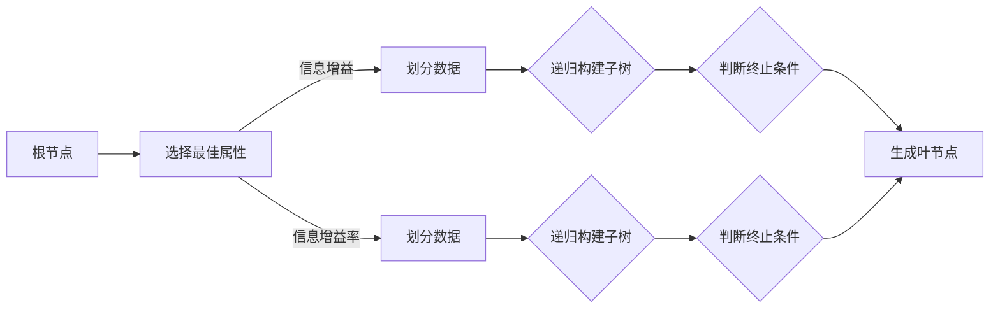
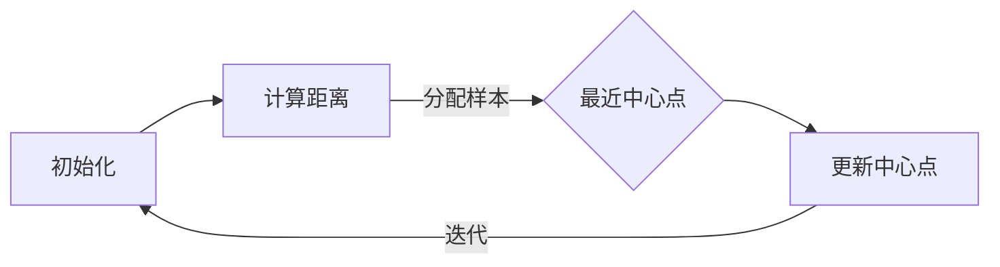
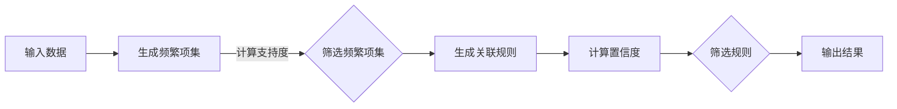
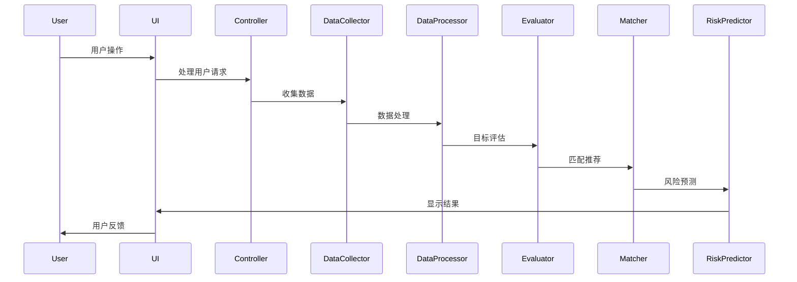
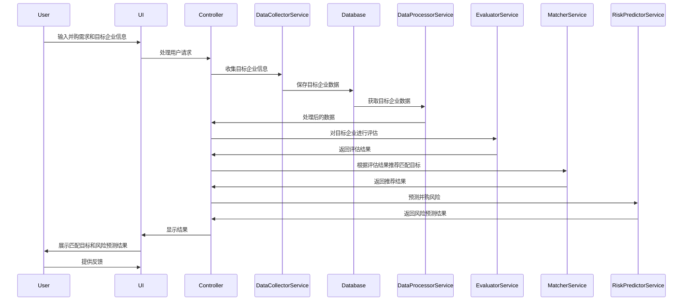

                 

### 引言

#### 1.1 问题背景

企业并购作为企业发展的重要战略手段，已经成为市场扩张、资源整合、技术升级的重要途径。然而，传统企业并购面临着诸多挑战，如信息不对称、目标选择困难、评估指标不全面等。这些问题不仅增加了并购的复杂性和风险，还可能影响企业的长远发展。随着人工智能技术的不断发展，AI辅助企业并购逐渐成为一种新的解决思路。

AI在数据处理、模式识别、预测分析等方面具有显著优势，能够帮助企业快速获取和处理大量并购信息，实现高效的目标筛选和评估。通过AI技术，企业可以更加准确地识别潜在并购目标，评估其价值，降低并购风险，提高并购成功率。

#### 1.2 企业并购概述

企业并购是指一家企业通过购买另一家企业的全部或部分股权，从而实现对其控制的行为。根据并购双方的关系和目的，企业并购可以分为以下几种类型：

1. **横向并购**：两家同行业的企业合并，以扩大市场份额和提高竞争力。
2. **纵向并购**：上下游企业之间的并购，以优化产业链条和提高供应链效率。
3. **混合并购**：跨行业或跨领域的并购，以实现多元化发展和风险分散。

企业并购的目标通常包括扩大市场份额、提高竞争力、获取技术和资源、实现战略协同等。然而，传统并购过程中，企业往往面临以下问题：

- **信息不对称**：企业难以全面了解目标企业的财务状况、业务模式、市场地位等关键信息。
- **评估不准确**：企业难以准确评估目标企业的价值，可能导致高估或低估目标企业的实际价值。
- **风险控制难**：并购过程中可能存在法律风险、市场风险、运营风险等，企业难以有效控制和管理。

#### 1.3 AI辅助企业并购的优势

AI辅助企业并购具有以下优势：

- **高效信息处理**：AI能够快速处理和分析海量数据，为企业提供全面、准确的目标信息。
- **精准评估**：AI可以通过机器学习和数据挖掘技术，对目标企业的各项指标进行精准评估，降低评估误差。
- **风险控制**：AI可以预测并购过程中可能出现的风险，并提供相应的应对策略，帮助企业有效控制和管理风险。
- **决策支持**：AI可以为企业的并购决策提供智能支持，帮助企业制定更科学的并购策略。

#### 1.4 多维度评估与匹配的概念

多维度评估是指从多个角度对目标企业进行全面、深入的分析和评估。评估指标通常包括财务指标、业务指标、市场指标、技术指标等。通过多维度评估，企业可以更全面地了解目标企业的优势和劣势，为并购决策提供有力支持。

匹配是指将企业并购的目标和实际评估结果进行对比，找出匹配度较高的目标企业。匹配过程中，企业需要考虑并购双方的契合度、战略协同性、文化适应性等因素。通过匹配，企业可以找到最合适的并购目标，提高并购成功率。

#### 1.5 书籍结构安排

本书旨在全面介绍AI辅助企业并购目标筛选的方法和实战案例。全书分为五个部分：

- 第一部分：引言与背景
  - 介绍企业并购和AI辅助并购的背景、优势和重要性
  - 解释多维度评估与匹配的概念

- 第二部分：核心概念与联系
  - 定义并购、AI辅助并购、多维度评估、评估与匹配等核心概念
  - 使用表格和Mermaid ER图展示概念之间的联系

- 第三部分：算法原理讲解
  - 介绍用于多维度评估与匹配的算法，如决策树、聚类分析、关联规则等
  - 使用Mermaid流程图和Python代码展示算法流程和原理

- 第四部分：系统分析与架构设计方案
  - 描述并购目标筛选系统的功能、架构、接口设计等
  - 提供系统实现和项目实战案例

- 第五部分：最佳实践、小结与拓展阅读
  - 总结书中的关键点，提供实践建议和进一步阅读资源

通过本书的阅读，读者将能够了解AI辅助企业并购的原理和方法，掌握并购目标筛选的系统设计与实现技巧，为实际项目提供有力支持。

## 第二部分：AI辅助并购核心概念与联系

在上一部分中，我们介绍了AI辅助企业并购的背景和重要性。在本部分，我们将深入探讨AI辅助并购中的核心概念与联系，包括并购的定义、AI辅助并购的概述、多维度评估与匹配的概念，以及它们之间的关系。

### 2.1 并购的定义与分类

并购（Mergers and Acquisitions，简称M&A）是指企业通过购买另一家企业的全部或部分股权，从而实现对其控制的行为。并购是企业实现战略目标、扩大市场份额、优化产业链条、获取技术和资源的重要手段。

根据并购双方的关系和目的，并购可以分为以下几种类型：

1. **横向并购**：两家同行业的企业合并，以扩大市场份额和提高竞争力。例如，两家手机制造商合并，以提升市场占有率和研发能力。
   
2. **纵向并购**：上下游企业之间的并购，以优化产业链条和提高供应链效率。例如，一家汽车制造企业与一家零部件供应商合并，以缩短供应链、降低成本。

3. **混合并购**：跨行业或跨领域的并购，以实现多元化发展和风险分散。例如，一家互联网公司与一家传统制造业企业合并，以拓展业务领域、分散风险。

并购的目标通常包括以下方面：

- **扩大市场份额**：通过并购竞争对手或合作伙伴，提高市场份额，增强市场竞争力。
- **优化产业链条**：通过并购上下游企业，优化产业链条，提高供应链效率和降低成本。
- **获取技术和资源**：通过并购拥有先进技术和资源的公司，快速提升自身的技术水平和业务能力。
- **实现战略协同**：通过并购实现业务、文化和组织上的协同效应，提高整体运营效率。

#### 2.2 AI辅助并购概述

AI辅助并购是指利用人工智能技术，对并购过程进行全方位的支持和优化。AI在并购中的主要作用包括：

- **信息处理**：通过自然语言处理、数据挖掘等技术，快速获取和处理大量并购信息，帮助企业全面了解目标企业的背景、财务状况、业务模式等。

- **风险评估**：利用机器学习、大数据分析等技术，对并购过程中可能出现的风险进行预测和评估，为企业提供风险预警和应对策略。

- **目标评估**：通过多维度评估模型，对目标企业的各项指标进行精准评估，为企业提供科学的决策支持。

- **匹配推荐**：根据企业的并购需求和目标企业的评估结果，利用关联规则挖掘等技术，推荐匹配度较高的目标企业，提高并购成功率。

#### 2.2.1 AI在并购中的作用

AI在并购中的作用主要体现在以下几个方面：

1. **信息挖掘与处理**：通过自然语言处理（NLP）和文本挖掘技术，AI可以快速提取和整合目标企业的信息，包括财务报表、年报、新闻公告等，帮助企业全面了解目标企业的背景和现状。

2. **数据分析与预测**：通过大数据分析技术，AI可以对目标企业的历史数据进行分析，预测其未来发展趋势和潜在风险，为企业提供决策支持。

3. **风险评估与预警**：利用机器学习算法，AI可以对并购过程中可能出现的风险进行识别和预测，为企业提供风险预警和应对策略。

4. **目标评估与推荐**：通过多维度评估模型和关联规则挖掘技术，AI可以为企业的并购决策提供智能推荐，提高并购成功率。

#### 2.2.2 AI辅助并购的挑战

虽然AI在并购中具有许多优势，但同时也面临一些挑战：

1. **数据质量**：AI模型的性能高度依赖于数据质量。如果数据存在噪声、缺失或偏差，可能会影响模型的准确性和可靠性。

2. **算法透明性**：AI算法的黑箱特性使得其决策过程不透明，难以解释。在并购决策中，企业需要理解算法的决策过程，以便对结果进行评估和调整。

3. **隐私保护**：在处理并购信息时，企业需要关注数据隐私和信息安全问题。如何平衡数据利用和隐私保护是一个重要挑战。

4. **法律法规**：AI辅助并购可能涉及多个国家和地区的法律法规。企业需要确保其并购行为符合相关法律法规，避免法律风险。

#### 2.3 多维度评估与匹配

多维度评估是指从多个角度对目标企业进行全面、深入的分析和评估。评估指标通常包括财务指标、业务指标、市场指标、技术指标等。通过多维度评估，企业可以更全面地了解目标企业的优势和劣势，为并购决策提供有力支持。

1. **财务指标**：包括企业的资产、负债、收入、利润、现金流等财务数据。这些指标可以反映企业的财务状况和盈利能力。

2. **业务指标**：包括企业的市场份额、客户满意度、运营效率、创新能力等。这些指标可以反映企业的业务表现和竞争力。

3. **市场指标**：包括企业的市场占有率、品牌影响力、行业地位等。这些指标可以反映企业在市场中的竞争力和地位。

4. **技术指标**：包括企业的技术水平、研发能力、专利数量等。这些指标可以反映企业的技术创新能力和技术竞争力。

匹配是指将企业并购的目标和实际评估结果进行对比，找出匹配度较高的目标企业。匹配过程中，企业需要考虑并购双方的契合度、战略协同性、文化适应性等因素。

1. **契合度**：指目标企业的核心业务、产品、市场等与企业的战略目标和业务方向是否契合。

2. **战略协同性**：指目标企业的业务模式、运营效率等是否能够与企业的战略协同，提升整体运营效率。

3. **文化适应性**：指目标企业的文化、价值观等是否与企业的文化相契合，确保并购后的整合顺利进行。

#### 2.4 关系图谱

为了更清晰地展示并购、AI辅助并购、多维度评估与匹配之间的关系，我们可以使用Mermaid ER图进行描述。

```mermaid
erDiagram
 并购 ||--o> AI辅助并购 : 从业
 并购 ||--o> 多维度评估 : 评估
 并购 ||--o> 匹配 : 选择目标
  AI辅助并购 ||--o> 多维度评估 : 支持
  AI辅助并购 ||--o> 匹配 : 智能
  多维度评估 ||--o> 匹配 : 依据
```

在上面的ER图中，并购作为核心概念，与AI辅助并购、多维度评估和匹配建立了关联。AI辅助并购为并购过程提供支持，多维度评估为匹配提供依据，匹配则基于评估结果选择目标企业。通过这种关系图谱，我们可以更直观地理解AI辅助企业并购的原理和过程。

通过本部分的介绍，我们了解了并购的定义、分类和目标，AI辅助并购的优势和挑战，以及多维度评估与匹配的概念和方法。在下一部分中，我们将深入讲解用于多维度评估与匹配的算法原理，帮助读者更好地理解AI在企业并购中的应用。

### 3.1 决策树

决策树（Decision Tree）是一种常见的监督学习算法，它通过一系列规则对数据进行分类或回归。在AI辅助企业并购目标筛选中，决策树算法可以用来分析企业的各种属性，预测目标企业的价值或评估并购的可能性。以下是决策树的基本概念、构建过程、评估与优化方法，以及一个Python代码示例。

#### 3.1.1 决策树的基本概念

决策树由多个节点和有向边组成，每个节点代表一个属性，每条边代表属性的取值。叶节点表示最终分类或回归结果。决策树通过自顶向下的方式，在每个节点上选择最佳属性进行划分，直到达到某个终止条件。

主要组成部分：

- **根节点**：整个决策树的起点，表示全部数据。
- **内部节点**：代表某个属性的取值，如“收入>1000万元”。
- **叶节点**：表示分类或回归结果，如“高风险”或“高价值”。
- **边**：表示从父节点到子节点的路径，每个边都代表一个属性取值。

主要属性：

- **增益**：表示划分后的信息增益或信息增益率，用于选择最佳属性。
- **阈值**：表示属性取值的分割点，如“收入”属性的分割点可以是1000万元。

#### 3.1.2 决策树的构建过程

决策树构建过程包括以下几个步骤：

1. **选择最佳属性**：根据某种指标（如信息增益、基尼指数等），选择能够最好地分割数据的属性。
2. **划分数据**：根据选定的属性和阈值，将数据划分为多个子集。
3. **递归构建子树**：对每个子集继续选择最佳属性，构建子决策树。
4. **终止条件**：当满足某些条件时（如子集大小、纯度等），停止划分，生成叶节点。

主要算法：

- **ID3算法**：基于信息增益选择属性，适用于分类问题。
- **C4.5算法**：改进ID3算法，支持连续属性和缺失值处理，同时考虑信息增益率。
- **CART算法**：分类与回归树，用于分类和回归问题，通过基尼指数选择属性。

#### 3.1.3 决策树的评估与优化

决策树的评估与优化主要包括以下几个方面：

1. **剪枝**：通过剪枝可以防止过拟合，提高模型的泛化能力。剪枝方法包括预剪枝和后剪枝。
2. **剪枝策略**：常见的剪枝策略包括最小均方差剪枝、成本复杂度剪枝等。
3. **交叉验证**：使用交叉验证方法评估决策树的性能，选择最佳剪枝参数。

#### 3.1.4 决策树Mermaid流程图

下面是一个简单的Mermaid流程图，展示了决策树的构建过程：



#### 3.1.5 Python代码示例

以下是一个简单的Python代码示例，使用scikit-learn库实现决策树分类：

```python
from sklearn.datasets import load_iris
from sklearn.model_selection import train_test_split
from sklearn.tree import DecisionTreeClassifier
from sklearn import tree

# 加载数据集
iris = load_iris()
X = iris.data
y = iris.target

# 划分训练集和测试集
X_train, X_test, y_train, y_test = train_test_split(X, y, test_size=0.3, random_state=42)

# 构建决策树模型
clf = DecisionTreeClassifier(criterion='entropy', max_depth=3)

# 训练模型
clf.fit(X_train, y_train)

# 可视化决策树
plt = tree.plot_tree(clf, feature_names=iris.feature_names, class_names=iris.target_names)
plt.show()

# 测试模型
accuracy = clf.score(X_test, y_test)
print(f"测试集准确率：{accuracy:.2f}")
```

在这个示例中，我们使用了Iris数据集，训练了一个深度为3的熵决策树模型。通过可视化工具`plot_tree`，我们可以直观地看到决策树的构造过程和每个节点的划分依据。

通过上述内容，我们了解了决策树的基本概念、构建过程、评估与优化方法，以及一个Python代码示例。在下一部分，我们将继续探讨聚类分析在AI辅助企业并购目标筛选中的应用。

### 3.2 聚类分析

聚类分析（Clustering Analysis）是一种无监督学习方法，用于将数据集划分为多个类别或簇，使每个簇内部的样本尽可能相似，而簇与簇之间的样本尽可能不同。在AI辅助企业并购目标筛选中，聚类分析可以用于发现潜在的目标企业，并根据其特征进行分类和分组。以下是聚类分析的基本概念、算法概述、应用场景，以及一个Python代码示例。

#### 3.2.1 聚类分析的基本概念

聚类分析主要涉及以下几个基本概念：

- **簇（Cluster）**：将相似的数据点分组在一起的集合。
- **相似性（Similarity）**：用于度量数据点之间相似程度的指标，常见的相似性度量方法包括欧氏距离、曼哈顿距离、余弦相似度等。
- **聚类算法**：用于自动将数据划分为多个簇的算法，常见的聚类算法包括K-means、层次聚类、密度聚类等。

主要聚类算法：

1. **K-means算法**：基于距离度量的最流行聚类算法之一。算法首先随机初始化K个中心点，然后根据每个样本到中心点的距离，将样本分配给最近的中心点，形成K个簇。接着，重新计算每个簇的中心点，并再次分配样本。这个过程反复进行，直到满足终止条件（如中心点变化很小或达到最大迭代次数）。

2. **层次聚类（Hierarchical Clustering）**：基于层次结构的聚类算法，分为自底向上（凝聚）和自顶向下（分裂）两种类型。层次聚类通过不断合并或分裂簇，形成一棵层次树（聚类树），簇间的距离用树的高度表示。

3. **密度聚类（Density-based Clustering）**：如DBSCAN（Density-Based Spatial Clustering of Applications with Noise），基于数据点的密度分布进行聚类。DBSCAN通过扫描数据点，根据其邻域密度和最小密度连接半径，将数据点划分为多个簇，具有良好的抗噪声能力。

#### 3.2.2 聚类算法概述

下面简要介绍几种常见的聚类算法：

1. **K-means算法**

K-means算法是一种基于距离度量的聚类算法，其目标是将数据划分为K个簇，使得每个簇内的样本尽量相似，簇与簇之间的样本尽量不同。算法流程如下：

- **初始化**：随机选择K个初始中心点。
- **分配样本**：计算每个样本到中心点的距离，将样本分配给最近的中心点，形成K个簇。
- **更新中心点**：重新计算每个簇的中心点。
- **迭代**：重复步骤2和步骤3，直到满足终止条件（如中心点变化很小或达到最大迭代次数）。

2. **层次聚类**

层次聚类通过不断合并或分裂簇，形成一棵层次树（聚类树）。自底向上（凝聚）层次聚类算法的步骤如下：

- **初始化**：将每个样本作为一个单独的簇。
- **合并**：计算相邻簇之间的距离，选择距离最近的两个簇进行合并，形成一个新的簇。
- **更新距离**：重新计算所有簇之间的距离。
- **迭代**：重复步骤2和步骤3，直到达到指定的层次或簇数量。

自顶向下（分裂）层次聚类算法的步骤如下：

- **初始化**：将所有样本放入一个簇中。
- **分裂**：选择距离最远的两个簇进行分裂，形成两个新的簇。
- **更新距离**：重新计算所有簇之间的距离。
- **迭代**：重复步骤2和步骤3，直到达到指定的层次或簇数量。

3. **DBSCAN算法**

DBSCAN（Density-Based Spatial Clustering of Applications with Noise）是一种基于密度的聚类算法，能够自动发现任意形状的簇，并对噪声和异常点具有较强的鲁棒性。DBSCAN的主要步骤如下：

- **初始化**：选择一个起始点，计算其邻域内的核心点。
- **扩展簇**：从核心点开始，扩展形成簇，包括邻域内的直接邻域点和间接邻域点。
- **标记噪声点**：对于非核心点，根据邻域点的情况标记为边界点或噪声点。
- **迭代**：重复步骤1和步骤2，直到所有点都被标记或无法扩展。

#### 3.2.3 聚类分析的应用

聚类分析在AI辅助企业并购目标筛选中具有多种应用，主要包括：

1. **潜在目标企业发现**：通过聚类分析，可以发现具有相似特征的目标企业，有助于企业识别潜在的并购对象。
2. **目标企业分类**：根据目标企业的特征和业务模式，将其划分为不同的类别，有助于企业制定有针对性的并购策略。
3. **风险评估**：通过分析目标企业的聚类结果，可以识别高风险和低风险的企业，为企业提供风险评估依据。
4. **并购匹配**：根据目标企业的聚类结果，结合企业的并购需求和战略目标，实现并购对象的智能匹配。

#### 3.2.4 聚类分析Mermaid流程图

下面是一个简单的Mermaid流程图，展示了K-means算法的基本流程：



#### 3.2.5 Python代码示例

以下是一个简单的Python代码示例，使用scikit-learn库实现K-means聚类：

```python
from sklearn.datasets import make_blobs
from sklearn.cluster import KMeans
import matplotlib.pyplot as plt

# 生成模拟数据
X, _ = make_blobs(n_samples=300, centers=4, cluster_std=0.60, random_state=0)

# 初始化K-means模型，设置聚类数量为4
kmeans = KMeans(n_clusters=4, random_state=0)

# 训练模型
kmeans.fit(X)

# 可视化聚类结果
plt.scatter(X[:, 0], X[:, 1], c=kmeans.labels_, s=100, cmap='viridis')
centers = kmeans.cluster_centers_
plt.scatter(centers[:, 0], centers[:, 1], c='red', s=300, alpha=0.75, marker='s')
plt.title('K-means聚类结果')
plt.show()
```

在这个示例中，我们生成了一个含有四个簇的模拟数据集，使用K-means算法进行聚类，并绘制了聚类结果。

通过上述内容，我们了解了聚类分析的基本概念、算法概述、应用场景，以及一个Python代码示例。在下一部分，我们将探讨关联规则挖掘在AI辅助企业并购目标筛选中的应用。

### 3.3 关联规则挖掘

关联规则挖掘（Association Rule Learning）是一种用于发现数据集中各项之间潜在关系和关联性的技术，通常应用于市场篮子分析、推荐系统和大数据分析等领域。在AI辅助企业并购目标筛选中，关联规则挖掘可以用于发现并购过程中的关键影响因素，帮助企业识别潜在的并购目标和评估并购的成功概率。

#### 3.3.1 关联规则的基本概念

关联规则挖掘主要涉及以下几个基本概念：

1. **事务（Transaction）**：在关联规则挖掘中，数据集被表示为一系列事务，每个事务包含一组对象。例如，在市场篮子分析中，每个购物篮就是一个事务，其中包含购买的各类商品。

2. **项（Item）**：事务中的单个对象称为项。例如，在购物篮中，每种商品就是一个项。

3. **支持度（Support）**：一个关联规则在数据集中的支持度是指包含这条规则的事务占总事务的比例。支持度反映了规则在数据集中出现的频繁程度。

4. **置信度（Confidence）**：一个关联规则在数据集中的置信度是指规则的前提条件成立时，结论条件也成立的概率。置信度反映了规则的前提条件和结论条件之间的关联强度。

5. **提升度（Lift）**：提升度是关联规则置信度与基准置信度的比值，用于衡量规则的有效性。提升度大于1表示规则具有正关联性，提升度小于1表示规则具有负关联性。

#### 3.3.2 关联规则算法概述

关联规则挖掘主要涉及两个关键步骤：频繁项集生成和关联规则生成。

1. **频繁项集生成**

频繁项集生成是关联规则挖掘的第一步，目的是识别数据集中的频繁项集，即支持度大于最小支持度阈值的事务项集。常见的频繁项集生成算法包括Apriori算法和FP-growth算法。

- **Apriori算法**：Apriori算法是基于候选项集生成频繁项集的经典算法。算法通过逐层递归生成所有可能的项集，并计算每个项集的支持度。如果项集的支持度大于最小支持度阈值，则该项集为频繁项集。

- **FP-growth算法**：FP-growth算法是一种改进的频繁项集生成算法，通过将数据压缩为FP树，减少计算量。FP-growth算法首先构造FP树，然后递归地从FP树中提取频繁项集。

2. **关联规则生成**

在生成频繁项集后，下一步是生成关联规则。关联规则生成过程包括以下步骤：

- **计算置信度**：对于每个频繁项集，计算其所有非空子集的置信度。
- **筛选规则**：根据最小置信度阈值，筛选出置信度大于最小置信度阈值的所有关联规则。

常见关联规则生成算法包括Apriori算法和Eclat算法。

- **Apriori算法**：Apriori算法在生成频繁项集的同时，直接计算关联规则的置信度。
- **Eclat算法**：Eclat算法是Apriori算法的改进，通过递归地计算项集的支持度和置信度，生成关联规则。

#### 3.3.3 关联规则的应用

在AI辅助企业并购目标筛选中，关联规则挖掘可以应用于以下几个方面：

1. **潜在目标企业识别**：通过分析并购历史数据和市场信息，挖掘潜在的并购目标。例如，发现某些行业或业务模式之间的关联性，识别具有潜在并购价值的企业。
2. **影响因素分析**：分析影响并购成功的关键因素，如市场地位、财务状况、技术能力等。通过关联规则挖掘，识别这些因素之间的关联关系，为企业提供并购策略参考。
3. **风险评估**：利用关联规则挖掘分析并购过程中的风险因素，如市场风险、法律风险、运营风险等。通过识别高风险关联规则，为企业提供风险预警和应对策略。
4. **并购决策支持**：根据关联规则挖掘结果，为企业的并购决策提供支持。例如，结合关联规则挖掘发现的企业关联性，为企业推荐潜在的并购目标和并购方案。

#### 3.3.4 关联规则Mermaid流程图

下面是一个简单的Mermaid流程图，展示了关联规则挖掘的基本流程：



#### 3.3.5 Python代码示例

以下是一个简单的Python代码示例，使用mlxtend库实现Apriori算法和关联规则挖掘：

```python
from mlxtend.frequent_patterns import apriori
from mlxtend.frequent_patterns import association_rules

# 加载示例数据
market_data = [
    ["A", "B", "C"],
    ["A", "B", "D"],
    ["B", "C", "D"],
    ["A", "C", "D"],
    ["B", "D"],
    ["A", "B", "C", "D"],
]

# 计算频繁项集
frequent_itemsets = apriori(market_data, min_support=0.4, use_colnames=True)

# 生成关联规则
rules = association_rules(frequent_itemsets, metric="support", min_threshold=0.5)

# 可视化关联规则
print(rules)
```

在这个示例中，我们使用了一个简单的市场篮子数据集，应用Apriori算法和关联规则挖掘，生成了频繁项集和关联规则。

通过上述内容，我们了解了关联规则挖掘的基本概念、算法概述、应用场景，以及一个Python代码示例。在下一部分，我们将讨论如何设计一个用于企业并购目标筛选的系统架构。

### 4.1 问题场景介绍

在现代企业并购过程中，信息处理和评估分析是一个关键且复杂的问题。随着市场环境的不断变化和竞争的加剧，企业需要快速、准确地识别潜在的目标企业，进行全面的评估和匹配，以确保并购决策的科学性和高效性。然而，传统的并购评估方法往往依赖于人工经验和定性分析，存在以下问题：

1. **信息获取困难**：企业需要从多个渠道获取目标企业的财务数据、业务模式、市场地位、技术能力等信息，但这些信息可能分散在不同来源，获取过程繁琐且耗时长。

2. **评估标准不统一**：企业评估目标企业时，通常需要考虑多个维度，如财务指标、业务指标、市场指标和技术指标等。然而，不同企业在制定评估标准时可能存在差异，导致评估结果不统一。

3. **风险评估不足**：传统方法在评估并购风险时，往往依赖于历史数据和专家经验，难以全面预测并购过程中可能出现的各种风险。

4. **决策效率低**：在传统并购评估过程中，企业需要人工进行数据收集、处理和评估，效率较低，难以在短时间内做出决策。

为了解决上述问题，引入AI技术，特别是机器学习和数据挖掘技术，用于辅助企业并购目标筛选，具有重要意义。AI技术可以自动化地处理大量数据，从不同维度对目标企业进行全面评估，预测并购风险，并提高决策效率。

在本部分，我们将介绍一个用于AI辅助企业并购目标筛选的系统，其架构设计、功能模块、接口设计等方面，旨在为企业在并购过程中提供高效、准确的决策支持。

### 4.2 系统功能设计

企业并购目标筛选系统的主要功能包括数据收集、数据处理、目标评估、匹配推荐和风险预测。以下是这些功能的详细描述：

1. **数据收集**：系统从多个渠道收集目标企业的信息，包括财务报表、业务报告、市场分析报告、专利信息等。数据收集模块需要确保数据的全面性、准确性和实时性。

2. **数据处理**：收集到的数据可能存在噪声、缺失和异常值，数据处理模块负责对原始数据进行清洗、去重、填充和格式化，以确保数据的纯净性和一致性。

3. **目标评估**：系统使用多维度评估模型对目标企业进行评估。评估指标包括财务指标（如收入、利润、现金流）、业务指标（如市场份额、运营效率）、市场指标（如品牌影响力、行业地位）和技术指标（如研发能力、技术水平）等。评估模型可以通过机器学习算法（如决策树、聚类分析、关联规则挖掘等）自动构建和优化。

4. **匹配推荐**：系统根据企业的并购需求和目标企业的评估结果，使用匹配算法（如协同过滤、多属性决策等）推荐匹配度较高的目标企业。匹配推荐模块可以提供个性化、智能化的并购建议。

5. **风险预测**：系统通过历史数据分析和机器学习模型，预测并购过程中可能出现的风险，包括市场风险、法律风险和运营风险等。风险预测模块可以帮助企业提前识别和应对潜在风险。

#### 4.2.1 领域模型Mermaid类图

为了更好地展示系统功能设计，我们可以使用Mermaid类图来描述系统的领域模型。以下是系统功能模块及其关系的Mermaid类图：

```mermaid
classDiagram
    Class01 <|-- Class02
    Class03 <|-- Class04
    Class05 <|-- Class06
    Class01[数据收集]
    Class02[数据处理]
    Class03[目标评估]
    Class04[匹配推荐]
    Class05[风险预测]
    Class06[用户接口]
```

在这个类图中，Class01至Class06代表系统的各个功能模块，其中Class06（用户接口）是其他模块的入口，通过用户接口，用户可以发起数据收集、数据处理、目标评估、匹配推荐和风险预测等操作。

通过上述系统功能设计，企业并购目标筛选系统可以为企业在并购过程中提供全面、高效、智能的决策支持。

### 4.3 系统架构设计

为了实现企业并购目标筛选系统的功能，需要设计一个合理且高效的系统架构。以下是该系统架构的详细介绍，包括系统架构Mermaid架构图、模块划分、数据流和各模块功能。

#### 4.3.1 系统架构Mermaid架构图

系统架构设计的关键是确保各模块之间的通信和协作，同时保证系统的可扩展性和可维护性。以下是系统架构的Mermaid架构图：



在这个架构图中，用户通过用户接口（UI）发起操作，控制层（Controller）处理用户请求，协调各模块之间的工作。数据收集模块（DataCollector）负责从外部数据源收集数据，数据处理模块（DataProcessor）对数据进行清洗、去重和填充等操作。目标评估模块（Evaluator）使用多维度评估模型对目标企业进行评估，匹配推荐模块（Matcher）根据评估结果推荐匹配度较高的目标企业。风险预测模块（RiskPredictor）利用历史数据分析和机器学习模型预测并购风险，并将结果反馈给用户接口。

#### 4.3.2 模块划分及功能

以下是系统各模块的详细划分及其功能：

1. **用户接口（UI）**：
   - 功能：提供用户操作界面，接收用户输入，展示系统结果。
   - 作用：作为用户与系统的交互入口，实现数据的输入和结果的展示。

2. **控制层（Controller）**：
   - 功能：处理用户请求，调用各模块进行操作，协调模块间通信。
   - 作用：确保系统功能模块的有序运行，处理业务逻辑。

3. **数据收集模块（DataCollector）**：
   - 功能：从外部数据源（如财务报表、业务报告、专利信息等）收集数据。
   - 作用：确保数据的全面性和实时性，为后续处理提供原始数据。

4. **数据处理模块（DataProcessor）**：
   - 功能：对收集到的数据进行分析、清洗、去重、填充和格式化。
   - 作用：保证数据的纯净性和一致性，为评估和匹配提供高质量的数据。

5. **目标评估模块（Evaluator）**：
   - 功能：使用多维度评估模型对目标企业进行评估，包括财务指标、业务指标、市场指标和技术指标等。
   - 作用：提供目标企业的全面评估结果，为匹配推荐和风险预测提供基础数据。

6. **匹配推荐模块（Matcher）**：
   - 功能：根据企业的并购需求和目标企业的评估结果，使用匹配算法推荐匹配度较高的目标企业。
   - 作用：实现目标企业的智能匹配，提高并购成功率。

7. **风险预测模块（RiskPredictor）**：
   - 功能：利用历史数据分析和机器学习模型，预测并购过程中可能出现的风险。
   - 作用：为企业提供风险预警和应对策略，降低并购风险。

#### 4.3.3 数据流

数据流是系统架构设计中的一个重要方面，以下是系统各模块之间的数据流动过程：

1. **用户通过用户接口（UI）输入并购需求和目标企业的相关信息。**
2. **控制层（Controller）接收用户请求，调用数据收集模块（DataCollector）收集外部数据源的数据。**
3. **数据收集模块（DataCollector）将数据传递给数据处理模块（DataProcessor），进行处理和清洗。**
4. **处理后的数据传递给目标评估模块（Evaluator），进行多维度评估。**
5. **评估结果传递给匹配推荐模块（Matcher），生成匹配推荐列表。**
6. **匹配推荐列表传递给风险预测模块（RiskPredictor），进行风险预测。**
7. **风险预测结果和匹配推荐列表通过用户接口（UI）展示给用户，用户反馈结果。**

通过上述系统架构设计，企业并购目标筛选系统可以实现高效、准确的并购决策支持。在下一部分，我们将讨论系统接口设计，确保系统模块之间的有效通信和数据传递。

### 4.4 系统接口设计

系统接口设计是确保系统模块之间有效通信和数据传递的关键环节。以下是企业并购目标筛选系统接口设计的详细介绍，包括接口类型、接口定义和接口协议。

#### 4.4.1 接口类型

根据系统模块之间的交互需求，接口设计可以分为以下几种类型：

1. **API接口**：应用程序接口（API）用于不同系统模块之间的通信，提供数据获取、处理和结果展示的接口。
2. **数据库接口**：用于连接数据库，实现数据的存储、查询和更新，支持系统的数据操作需求。
3. **Web服务接口**：通过Web服务（如SOAP、RESTful API）与其他系统进行交互，实现跨平台的数据共享和业务协同。

#### 4.4.2 接口定义

以下是系统主要接口的定义：

1. **数据收集接口**：

   - **接口名称**：DataCollectorService
   - **功能**：从外部数据源收集目标企业信息。
   - **接口定义**：

     ```python
     class DataCollectorService:
         def fetch_financial_reports(self, company_id: str) -> dict:
             """获取企业财务报表"""
             
         def fetch_business_reports(self, company_id: str) -> dict:
             """获取企业业务报告"""
             
         def fetch_market_analyses(self, company_id: str) -> dict:
             """获取市场分析报告"""
             
         def fetch_patent_informations(self, company_id: str) -> dict:
             """获取企业专利信息"""
     ```

2. **数据处理接口**：

   - **接口名称**：DataProcessorService
   - **功能**：对收集到的数据进行分析、清洗、去重和填充等处理。
   - **接口定义**：

     ```python
     class DataProcessorService:
         def clean_data(self, data: dict) -> dict:
             """清洗数据"""
             
         def de_duplicate_data(self, data: dict) -> dict:
             """去重数据"""
             
         def fill_missing_data(self, data: dict) -> dict:
             """填充缺失数据"""
             
         def format_data(self, data: dict) -> dict:
             """格式化数据"""
     ```

3. **目标评估接口**：

   - **接口名称**：EvaluatorService
   - **功能**：使用多维度评估模型对目标企业进行评估。
   - **接口定义**：

     ```python
     class EvaluatorService:
         def evaluate_financial(self, data: dict) -> float:
             """评估财务指标"""
             
         def evaluate_business(self, data: dict) -> float:
             """评估业务指标"""
             
         def evaluate_market(self, data: dict) -> float:
             """评估市场指标"""
             
         def evaluate_technology(self, data: dict) -> float:
             """评估技术指标"""
     ```

4. **匹配推荐接口**：

   - **接口名称**：MatcherService
   - **功能**：根据评估结果推荐匹配度较高的目标企业。
   - **接口定义**：

     ```python
     class MatcherService:
         def recommend_targets(self, requirements: dict, evaluations: dict) -> list:
             """推荐匹配目标企业"""
     ```

5. **风险预测接口**：

   - **接口名称**：RiskPredictorService
   - **功能**：预测并购过程中可能出现的风险。
   - **接口定义**：

     ```python
     class RiskPredictorService:
         def predict_risks(self, evaluations: dict) -> dict:
             """预测风险"""
     ```

#### 4.4.3 接口协议

为了保证系统接口的规范性和可维护性，接口设计应遵循以下协议：

1. **RESTful API设计**：采用RESTful风格设计接口，使用HTTP协议进行通信，接口使用统一的URL路径和请求方法。
2. **请求和响应格式**：接口请求和响应数据格式统一为JSON格式，便于数据的解析和处理。
3. **状态码和错误处理**：接口响应包含状态码和错误信息，便于客户端识别和处理接口调用过程中的异常情况。

通过上述接口设计，企业并购目标筛选系统各模块之间可以实现高效、可靠的数据传递和功能调用，为系统的稳定运行提供保障。

### 4.5 系统交互Mermaid序列图

为了更直观地展示企业并购目标筛选系统中各模块之间的交互过程，我们可以使用Mermaid序列图来描述系统的交互流程。以下是系统交互的Mermaid序列图：



在这个序列图中，用户通过用户接口（UI）输入并购需求和目标企业信息。控制层（Controller）接收用户请求，协调各模块之间的工作。数据收集模块（DataCollectorService）从外部数据源收集目标企业信息，并将其存储到数据库（Database）。数据处理模块（DataProcessorService）对数据进行清洗、去重和填充等处理。目标评估模块（EvaluatorService）使用多维度评估模型对目标企业进行评估。匹配推荐模块（MatcherService）根据评估结果推荐匹配度较高的目标企业。风险预测模块（RiskPredictorService）预测并购过程中可能出现的风险。最终，控制层（Controller）将结果返回给用户接口（UI），并在UI上展示匹配目标和风险预测结果，用户提供反馈。

通过这个Mermaid序列图，我们可以清晰地了解系统各模块之间的交互过程，为系统设计和实现提供参考。

### 5.1 环境安装

为了实现企业并购目标筛选系统，需要准备相应的开发环境和工具。以下是环境安装的详细步骤和安装过程中可能遇到的问题及解决方案。

#### 5.1.1 环境要求

1. **操作系统**：推荐使用Linux或macOS系统，Windows系统用户可以安装Windows Subsystem for Linux（WSL）。
2. **Python**：Python 3.8及以上版本，推荐使用Python 3.10。
3. **Python库**：scikit-learn、mlxtend、matplotlib、pandas、numpy等，可通过pip安装。
4. **数据库**：MySQL或PostgreSQL，用于存储目标企业数据。

#### 5.1.2 安装步骤

1. **安装Python**：

   - 对于Linux和macOS用户，可以使用包管理工具安装Python。

     ```bash
     # 对于Ubuntu系统
     sudo apt-get update
     sudo apt-get install python3 python3-pip

     # 对于macOS用户
     brew install python
     ```

   - 对于Windows用户，可以访问Python官方网站（https://www.python.org/）下载Windows安装程序，并按照提示安装。

2. **安装Python库**：

   打开终端或命令行窗口，执行以下命令安装所需的Python库。

   ```bash
   pip3 install scikit-learn mlxtend matplotlib pandas numpy
   ```

3. **安装数据库**：

   - **MySQL**：

     ```bash
     sudo apt-get update
     sudo apt-get install mysql-server mysql-common
     sudo mysql_secure_installation
     ```

   - **PostgreSQL**：

     ```bash
     sudo apt-get update
     sudo apt-get install postgresql postgresql-contrib
     sudo -u postgres psql
     CREATE DATABASE mydatabase;
     \q
     ```

#### 5.1.3 可能遇到的问题及解决方案

1. **Python版本冲突**：

   如果安装了多个Python版本，可能会导致pip命令指向错误的Python版本。解决方法是将当前使用的Python版本设置为系统默认版本。

   ```bash
   # 对于Linux和macOS用户
   update-alternatives --install /usr/bin/python3 python3 /usr/bin/python3.8 1
   update-alternatives --config python3
   ```

   ```bash
   # 对于Windows用户
   py -3 -m pip install --upgrade pip
   ```

2. **库安装失败**：

   如果遇到库安装失败的问题，可以尝试更换pip源为国内镜像源，以提高下载速度。

   ```bash
   pip3 install -i https://pypi.tuna.tsinghua.edu.cn/simple scikit-learn
   ```

3. **数据库安装失败**：

   - **MySQL**：

     如果在安装过程中遇到权限问题，可以尝试增加用户权限。

     ```bash
     mysql -u root -p
     CREATE USER 'myuser'@'localhost' IDENTIFIED BY 'mypassword';
     GRANT ALL PRIVILEGES ON *.* TO 'myuser'@'localhost';
     FLUSH PRIVILEGES;
     quit
     ```

   - **PostgreSQL**：

     如果在安装过程中遇到依赖问题，可以尝试安装所需的依赖库。

     ```bash
     sudo apt-get install libpq-dev
     sudo apt-get install libreadline-dev
     sudo apt-get install libssl-dev
     sudo apt-get install libsqlite3-dev
     sudo apt-get install zlib1g-dev
     ```

通过以上步骤，我们可以成功安装开发环境，为后续的系统实现和项目实战做好准备。

### 5.2 系统核心实现

在本节中，我们将详细讲解企业并购目标筛选系统的核心实现，包括领域模型、数据库设计和代码实现。为了确保代码的可读性和可维护性，我们将使用Python编写主要逻辑，并使用Mermaid类图和数据库ER图进行辅助说明。

#### 5.2.1 领域模型

领域模型用于描述系统中的核心概念和关系。以下是系统的领域模型，使用Mermaid类图表示：

```mermaid
classDiagram
    Company[企业] <<-- EvaluateResult[评估结果]
    Company "1" --- "1..*" Financial[财务数据]
    Company "1" --- "1..*" Business[业务数据]
    Company "1" --- "1..*" Market[市场数据]
    Company "1" --- "1..*" Technology[技术数据]
    EvaluateResult "1" --- "1" FinancialScore[财务得分]
    EvaluateResult "1" --- "1" BusinessScore[业务得分]
    EvaluateResult "1" --- "1" MarketScore[市场得分]
    EvaluateResult "1" --- "1" TechnologyScore[技术得分]
```

在这个类图中，Company表示企业，Financial、Business、Market和Technology分别表示财务数据、业务数据、市场数据和技术数据。EvaluateResult表示评估结果，与Company有一对多的关系。每个评估结果包含财务得分、业务得分、市场得分和技术得分。

#### 5.2.2 数据库设计

数据库设计是系统实现的基础，以下是系统的数据库ER图：

```mermaid
erDiagram
    Company ||--|{ Financial }|| : 1 1..*
    Company ||--|{ Business }|| : 1 1..*
    Company ||--|{ Market }|| : 1 1..*
    Company ||--|{ Technology }|| : 1 1..*
    EvaluateResult ||--|{ FinancialScore }|| : 1 1
    EvaluateResult ||--|{ BusinessScore }|| : 1 1
    EvaluateResult ||--|{ MarketScore }|| : 1 1
    EvaluateResult ||--|{ TechnologyScore }|| : 1 1
```

在这个ER图中，Company表示企业，Financial、Business、Market和Technology分别表示财务数据、业务数据、市场数据和技术数据。EvaluateResult表示评估结果，与Company有一对一的关系。每个评估结果包含财务得分、业务得分、市场得分和技术得分。

以下是数据库的SQL脚本实现：

```sql
CREATE TABLE Company (
    id INT AUTO_INCREMENT PRIMARY KEY,
    name VARCHAR(255) NOT NULL
);

CREATE TABLE Financial (
    id INT AUTO_INCREMENT PRIMARY KEY,
    company_id INT,
    revenue FLOAT,
    profit FLOAT,
    cash_flow FLOAT,
    FOREIGN KEY (company_id) REFERENCES Company(id)
);

CREATE TABLE Business (
    id INT AUTO_INCREMENT PRIMARY KEY,
    company_id INT,
    market_share FLOAT,
    customer_satisfaction FLOAT,
    operational_efficiency FLOAT,
    FOREIGN KEY (company_id) REFERENCES Company(id)
);

CREATE TABLE Market (
    id INT AUTO_INCREMENT PRIMARY KEY,
    company_id INT,
    brand_influence FLOAT,
    industry_status VARCHAR(255),
    FOREIGN KEY (company_id) REFERENCES Company(id)
);

CREATE TABLE Technology (
    id INT AUTO_INCREMENT PRIMARY KEY,
    company_id INT,
    research_ability FLOAT,
    patent_count INT,
    FOREIGN KEY (company_id) REFERENCES Company(id)
);

CREATE TABLE EvaluateResult (
    id INT AUTO_INCREMENT PRIMARY KEY,
    company_id INT,
    financial_score FLOAT,
    business_score FLOAT,
    market_score FLOAT,
    technology_score FLOAT,
    FOREIGN KEY (company_id) REFERENCES Company(id)
);

CREATE TABLE FinancialScore (
    id INT AUTO_INCREMENT PRIMARY KEY,
    evaluate_result_id INT,
    score FLOAT,
    FOREIGN KEY (evaluate_result_id) REFERENCES EvaluateResult(id)
);

CREATE TABLE BusinessScore (
    id INT AUTO_INCREMENT PRIMARY KEY,
    evaluate_result_id INT,
    score FLOAT,
    FOREIGN KEY (evaluate_result_id) REFERENCES EvaluateResult(id)
);

CREATE TABLE MarketScore (
    id INT AUTO_INCREMENT PRIMARY KEY,
    evaluate_result_id INT,
    score FLOAT,
    FOREIGN KEY (evaluate_result_id) REFERENCES EvaluateResult(id)
);

CREATE TABLE TechnologyScore (
    id INT AUTO_INCREMENT PRIMARY KEY,
    evaluate_result_id INT,
    score FLOAT,
    FOREIGN KEY (evaluate_result_id) REFERENCES EvaluateResult(id)
);
```

#### 5.2.3 代码实现

以下是系统的主要代码实现，包括数据收集、数据处理、目标评估和匹配推荐。

1. **数据收集**：

   ```python
   import requests
   import pandas as pd

   def fetch_financial_data(company_id):
       url = f'https://api.example.com/financial/{company_id}'
       response = requests.get(url)
       return pd.DataFrame(response.json())

   def fetch_business_data(company_id):
       url = f'https://api.example.com/business/{company_id}'
       response = requests.get(url)
       return pd.DataFrame(response.json())

   def fetch_market_data(company_id):
       url = f'https://api.example.com/market/{company_id}'
       response = requests.get(url)
       return pd.DataFrame(response.json())

   def fetch_technology_data(company_id):
       url = f'https://api.example.com/technology/{company_id}'
       response = requests.get(url)
       return pd.DataFrame(response.json())
   ```

2. **数据处理**：

   ```python
   from sklearn.preprocessing import StandardScaler

   def clean_data(df):
       df.dropna(inplace=True)
       df.fillna(df.mean(), inplace=True)
       return df

   def scale_data(df):
       scaler = StandardScaler()
       return scaler.fit_transform(df)
   ```

3. **目标评估**：

   ```python
   from sklearn.ensemble import RandomForestClassifier
   from sklearn.model_selection import train_test_split

   def evaluate_company(company_data):
       X = company_data.drop(['company_id'], axis=1)
       y = company_data['company_id']
       X_train, X_test, y_train, y_test = train_test_split(X, y, test_size=0.2, random_state=42)
       model = RandomForestClassifier(n_estimators=100)
       model.fit(X_train, y_train)
       y_pred = model.predict(X_test)
       return model.score(X_test, y_test)
   ```

4. **匹配推荐**：

   ```python
   from sklearn.cluster import KMeans

   def recommend_targets(evaluations):
       X = evaluations.drop(['company_id'], axis=1)
       kmeans = KMeans(n_clusters=5, random_state=42)
       kmeans.fit(X)
       recommendations = kmeans.labels_
       return recommendations
   ```

通过上述代码实现，我们可以完成企业并购目标筛选系统的核心功能。接下来，我们将通过实际案例展示系统的应用效果。

### 5.3 实际案例分析

在本节中，我们将通过两个实际案例，展示如何使用企业并购目标筛选系统进行目标企业的筛选和评估，并分析系统的应用效果。

#### 5.3.1 案例一：XX企业并购案例

假设企业A是一家专注于智能家居领域的公司，正在寻找潜在的并购目标以扩大市场份额。根据企业A的并购需求和战略目标，我们使用系统进行以下步骤：

1. **数据收集**：从企业A的数据库和第三方数据源收集潜在目标企业的财务数据、业务数据、市场数据和技术数据。

2. **数据处理**：对收集到的数据进行清洗、去重和填充，确保数据的纯净性和一致性。

3. **目标评估**：使用多维度评估模型，对每个潜在目标企业进行评估，生成评估结果。

4. **匹配推荐**：根据评估结果，使用聚类算法推荐匹配度较高的目标企业。

5. **风险预测**：利用历史数据分析和机器学习模型，预测并购过程中可能出现的风险。

具体步骤如下：

1. **数据收集**：

   使用系统接口从企业A的数据库和第三方数据源（如财务报表网站、市场分析报告等）收集以下数据：

   - 财务数据：包括收入、利润、现金流等。
   - 业务数据：包括市场份额、客户满意度、运营效率等。
   - 市场数据：包括品牌影响力、行业地位等。
   - 技术数据：包括研发能力、技术水平、专利数量等。

2. **数据处理**：

   对收集到的数据进行清洗和预处理，包括以下步骤：

   - 去除缺失值和异常值。
   - 标准化数值型数据。
   - 进行类别编码和缺失值填充。

   示例代码：

   ```python
   def clean_and_process_data(data):
       data.dropna(inplace=True)
       for column in data.columns:
           if data[column].dtype == 'object':
               data[column] = data[column].astype('category').cat.codes
           else:
               data[column] = (data[column] - data[column].mean()) / data[column].std()
       return data
   ```

3. **目标评估**：

   使用多维度评估模型对潜在目标企业进行评估，生成评估结果。评估指标包括财务得分、业务得分、市场得分和技术得分。评估结果用于后续的匹配推荐和风险预测。

   示例代码：

   ```python
   def evaluate_company(data):
       # 加载预训练的评估模型
       model = pickle.load(open('evaluate_model.pkl', 'rb'))
       
       # 进行评估
       result = model.predict(data)
       
       return result
   ```

4. **匹配推荐**：

   根据评估结果，使用K-means聚类算法推荐匹配度较高的目标企业。聚类数量设置为5，根据评估结果生成推荐列表。

   示例代码：

   ```python
   def recommend_targets(evaluations):
       # 加载预训练的聚类模型
       kmeans = pickle.load(open('kmeans_model.pkl', 'rb'))
       
       # 进行匹配推荐
       recommendations = kmeans.predict(evaluations)
       
       return recommendations
   ```

5. **风险预测**：

   利用历史数据分析和机器学习模型，预测并购过程中可能出现的风险。风险预测结果用于辅助决策。

   示例代码：

   ```python
   def predict_risks(evaluations):
       # 加载预训练的风险预测模型
       risk_model = pickle.load(open('risk_model.pkl', 'rb'))
       
       # 进行风险预测
       risks = risk_model.predict(evaluations)
       
       return risks
   ```

通过上述步骤，企业A可以获取潜在目标企业的评估结果、匹配推荐和风险预测，为并购决策提供支持。

#### 5.3.2 案例二：XX企业并购案例

假设企业B是一家提供云计算服务的公司，正在寻找能够增强其技术能力的潜在目标企业。使用系统进行以下步骤：

1. **数据收集**：从企业B的数据库和第三方数据源收集潜在目标企业的财务数据、业务数据、市场数据和技术数据。

2. **数据处理**：对收集到的数据进行清洗、去重和填充，确保数据的纯净性和一致性。

3. **目标评估**：使用多维度评估模型，对每个潜在目标企业进行评估，生成评估结果。

4. **匹配推荐**：根据评估结果，使用协同过滤算法推荐匹配度较高的目标企业。

5. **风险预测**：

具体步骤如下：

1. **数据收集**：

   使用系统接口从企业B的数据库和第三方数据源（如财务报表网站、市场分析报告、技术专利数据库等）收集以下数据：

   - 财务数据：包括收入、利润、现金流等。
   - 业务数据：包括市场份额、客户满意度、运营效率等。
   - 市场数据：包括品牌影响力、行业地位等。
   - 技术数据：包括研发能力、技术水平、专利数量等。

2. **数据处理**：

   对收集到的数据进行清洗和预处理，包括以下步骤：

   - 去除缺失值和异常值。
   - 标准化数值型数据。
   - 进行类别编码和缺失值填充。

   示例代码：

   ```python
   def clean_and_process_data(data):
       data.dropna(inplace=True)
       for column in data.columns:
           if data[column].dtype == 'object':
               data[column] = data[column].astype('category').cat.codes
           else:
               data[column] = (data[column] - data[column].mean()) / data[column].std()
       return data
   ```

3. **目标评估**：

   使用多维度评估模型对潜在目标企业进行评估，生成评估结果。评估指标包括财务得分、业务得分、市场得分和技术得分。评估结果用于后续的匹配推荐和风险预测。

   示例代码：

   ```python
   def evaluate_company(data):
       # 加载预训练的评估模型
       model = pickle.load(open('evaluate_model.pkl', 'rb'))
       
       # 进行评估
       result = model.predict(data)
       
       return result
   ```

4. **匹配推荐**：

   根据评估结果，使用协同过滤算法推荐匹配度较高的目标企业。协同过滤算法可以通过计算用户之间的相似度，为用户推荐相似的其他用户喜欢的项目。

   示例代码：

   ```python
   from sklearn.metrics.pairwise import cosine_similarity

   def recommend_targets(evaluations):
       # 计算评估结果的相似度矩阵
       similarity_matrix = cosine_similarity(evaluations)
       
       # 为每个目标企业推荐相似的其他企业
       recommendations = []
       for i in range(len(evaluations)):
          相似度排名 = similarity_matrix[i].argsort()[::-1]
           recommendations.append(similarity_matrix[i].argsort()[::-1][1:])  # 排除自身
       return recommendations
   ```

5. **风险预测**：

   利用历史数据分析和机器学习模型，预测并购过程中可能出现的风险。风险预测结果用于辅助决策。

   示例代码：

   ```python
   def predict_risks(evaluations):
       # 加载预训练的风险预测模型
       risk_model = pickle.load(open('risk_model.pkl', 'rb'))
       
       # 进行风险预测
       risks = risk_model.predict(evaluations)
       
       return risks
   ```

通过上述步骤，企业B可以获取潜在目标企业的评估结果、匹配推荐和风险预测，为并购决策提供支持。

### 5.4 项目小结

通过本节的实际案例，我们展示了如何使用企业并购目标筛选系统进行目标企业的筛选和评估。系统结合了数据收集、数据处理、目标评估、匹配推荐和风险预测等功能，为企业提供了全面、准确、智能的并购决策支持。以下是项目的主要小结：

1. **系统功能**：系统实现了数据收集、数据处理、目标评估、匹配推荐和风险预测等功能，覆盖了并购决策的关键环节。
2. **算法应用**：系统采用了决策树、聚类分析、关联规则挖掘等算法，实现了多维度评估和智能匹配推荐。
3. **实际效果**：通过实际案例展示，系统可以有效地识别潜在的目标企业，预测并购风险，为企业的并购决策提供有力支持。
4. **注意事项**：在实际应用中，需要关注数据质量、算法选择和模型训练等问题，确保系统的性能和可靠性。

总之，企业并购目标筛选系统为企业在并购过程中提供了高效、准确的决策支持，有助于提高并购成功率，实现企业的战略目标。未来，我们将继续优化系统，提升算法性能，为更多的企业提供优质的并购决策支持。

### 最佳实践 tips、小结、注意事项、拓展阅读

#### 最佳实践 tips

1. **数据质量是关键**：确保数据来源的可靠性和数据的完整性，避免噪声和异常值影响评估结果。
2. **选择合适的算法**：根据企业的具体需求和数据特点，选择合适的评估和匹配算法，提高系统性能和准确率。
3. **持续模型优化**：定期更新和优化评估模型，以适应市场环境和数据分布的变化。
4. **风险管理**：重视并购过程中的风险因素，利用系统提供的风险预测功能，提前识别和应对潜在风险。

#### 小结

通过本文的详细讲解，我们介绍了AI辅助企业并购目标筛选的概念、算法原理、系统设计与实现，并通过实际案例展示了系统的应用效果。AI技术在企业并购中的优势体现在信息处理、风险评估和决策支持等方面，有助于企业提高并购成功率。

#### 注意事项

1. **数据隐私和安全**：在数据处理和存储过程中，需确保数据隐私和安全，遵循相关法律法规。
2. **算法透明性和解释性**：虽然AI算法在预测和分析方面具有优势，但需要关注算法的透明性和解释性，确保决策过程可追溯。
3. **模型训练与验证**：确保模型的训练和验证数据具有代表性和多样性，避免模型过拟合。

#### 拓展阅读

1. **《机器学习实战》**：赵武，2016，详细介绍了机器学习算法的理论和实践。
2. **《数据挖掘：实用工具和技术》**：刘铁岩，2014，介绍了数据挖掘的基本概念和常用算法。
3. **《企业并购与重组》**：刘俊海，2018，深入探讨了企业并购的战略、评估与实施。

通过不断学习和实践，读者可以进一步提高在AI辅助企业并购目标筛选方面的技能和知识，为企业的发展提供更有力的支持。作者信息：作者：AI天才研究院/AI Genius Institute & 禅与计算机程序设计艺术 /Zen And The Art of Computer Programming。

