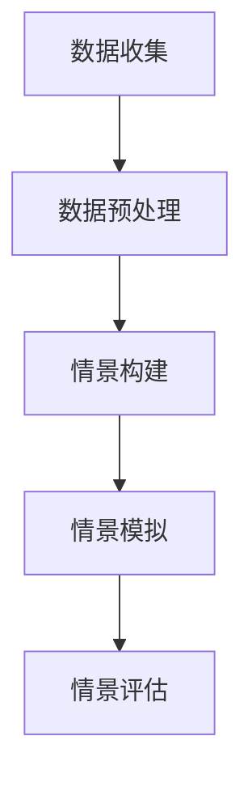
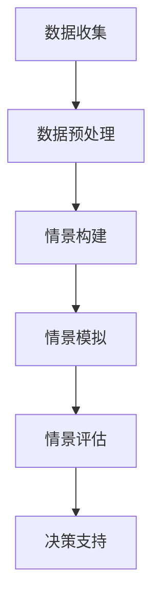
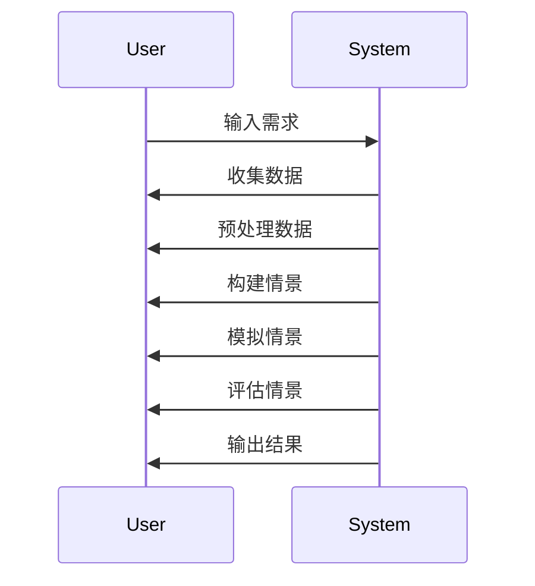

                 


# AI辅助企业战略决策：情景分析与风险评估

关键词：人工智能，企业战略，情景分析，风险评估，智能决策支持系统

摘要：随着人工智能技术的迅猛发展，企业开始逐渐将AI应用于战略决策过程中，以提高决策效率和质量。本文将探讨AI辅助企业战略决策的情景分析与风险评估方法，通过逐步分析，为企业提供实用的策略建议。

## Step 1: 引言

### 1.1 AI技术背景

人工智能（AI）作为计算机科学的一个分支，旨在使机器模拟人类的智能行为。自1956年达特茅斯会议上提出AI概念以来，AI经历了数个发展阶段，如今已经进入一个崭新的时代。AI的核心技术包括机器学习、深度学习、自然语言处理等。在我国，AI技术的研究与应用也在蓬勃发展，已成为国家战略的重要组成部分。

### 1.2 企业战略决策的重要性

企业战略决策是企业为了实现长期目标而制定的规划和行动方案。有效的战略决策有助于企业适应市场变化、抓住机遇、降低风险，从而在竞争激烈的环境中立于不败之地。然而，企业面临的环境复杂多变，战略决策过程中存在许多不确定性因素，这使得决策过程充满挑战。

### 1.3 AI在企业战略决策中的应用场景

AI技术能够帮助企业提高战略决策的效率和质量。具体应用场景包括：

1. **情景分析**：通过大数据分析，预测市场趋势和竞争态势，为企业制定战略提供依据。
2. **风险评估**：识别潜在风险，评估风险影响，为企业制定风险管理策略提供支持。
3. **智能决策支持系统**：利用AI技术构建智能决策支持系统，辅助企业高层管理人员做出明智的决策。

## Step 2: AI辅助企业战略决策概述

### 2.1 AI与战略决策的关系

AI与战略决策的关系主要体现在以下几个方面：

1. **数据分析与挖掘**：AI技术能够高效地处理和分析大量数据，为企业提供有价值的信息。
2. **自动化决策**：AI技术可以帮助企业实现自动化决策，降低人工干预，提高决策效率。
3. **风险评估与预警**：AI技术可以识别潜在风险，评估风险影响，为企业提供实时预警。

### 2.2 AI辅助战略决策的方法与工具

AI辅助战略决策的方法主要包括：

1. **数据挖掘**：通过分析历史数据，发现数据中的规律和模式，为企业提供决策支持。
2. **机器学习**：利用已有数据训练模型，对未知数据进行预测和分类，帮助企业预测市场趋势。
3. **深度学习**：通过多层神经网络，实现更复杂的特征提取和模式识别，提高决策的准确性。

AI辅助战略决策的工具包括：

1. **大数据平台**：用于存储、处理和分析大规模数据。
2. **机器学习平台**：提供机器学习算法的实现和部署环境。
3. **深度学习框架**：如TensorFlow、PyTorch等，用于实现复杂的神经网络模型。

### 2.3 AI辅助战略决策的优势与挑战

AI辅助战略决策的优势：

1. **高效性**：AI技术能够快速处理和分析大量数据，提高决策效率。
2. **准确性**：通过机器学习和深度学习等技术，AI能够提供更准确的预测和决策支持。
3. **可扩展性**：AI技术可以轻松适应不同规模和类型的企业需求。

AI辅助战略决策的挑战：

1. **数据质量**：AI决策依赖于数据，数据质量直接影响决策的准确性。
2. **技术成熟度**：虽然AI技术在不断发展，但某些领域的应用仍需进一步研究。
3. **伦理和法律问题**：AI决策可能涉及伦理和法律问题，需要制定相关规范。

## Step 3: 情景分析

### 3.1 情景分析的原理与方法

情景分析是一种基于数据的决策支持方法，通过模拟未来可能出现的场景，帮助企业预测市场变化和竞争态势。情景分析的基本原理包括：

1. **数据收集**：收集与市场相关的各种数据，包括宏观经济数据、行业数据、竞争者数据等。
2. **数据预处理**：清洗和整合数据，使其适合进行分析。
3. **情景构建**：根据历史数据和现有信息，构建不同的市场情景。
4. **情景模拟**：使用数学模型和算法，对每种情景进行模拟，预测市场结果。
5. **情景评估**：分析每种情景的可能性和对企业的影响，为企业提供决策建议。

### 3.2 情景分析的步骤与流程

情景分析的步骤和流程如下：

1. **确定分析目标**：明确企业希望解决的问题或决策。
2. **数据收集**：收集与目标相关的数据。
3. **数据预处理**：清洗和整合数据，确保数据质量。
4. **构建情景**：根据历史数据和现有信息，构建不同的市场情景。
5. **模拟情景**：使用数学模型和算法，对每种情景进行模拟。
6. **评估情景**：分析每种情景的可能性和对企业的影响。
7. **制定决策**：根据情景分析结果，制定相应的决策。

### 3.3 情景分析的案例研究

#### 案例一：企业市场进入策略

某企业计划进入一个新的市场，需要进行情景分析以评估市场风险和机会。

1. **确定分析目标**：评估市场进入策略的可行性。
2. **数据收集**：收集市场规模、竞争对手、消费者需求等数据。
3. **数据预处理**：清洗和整合数据，确保数据质量。
4. **构建情景**：根据市场数据，构建三种可能的情景：
    - 情景一：市场快速增长
    - 情景二：市场稳定增长
    - 情景三：市场增长放缓
5. **模拟情景**：使用回归模型预测每种情景下的市场结果。
6. **评估情景**：分析每种情景的可能性和对企业的影响。
7. **制定决策**：根据情景分析结果，制定市场进入策略。

## Step 4: 风险评估

### 4.1 风险评估的概念与意义

风险评估是一种系统化的方法，用于识别、分析和应对企业面临的风险。风险评估的意义包括：

1. **降低风险**：通过识别和评估风险，企业可以采取相应的措施降低风险。
2. **提高决策质量**：风险评估有助于企业更全面地了解风险，从而做出更明智的决策。
3. **增强企业竞争力**：有效的风险管理可以帮助企业更好地应对市场变化，提高竞争力。

### 4.2 风险评估的方法与工具

风险评估的方法包括定性评估和定量评估：

1. **定性评估**：通过专家意见、历史数据等定性信息，评估风险的可能性和影响。
2. **定量评估**：通过数学模型和算法，对风险进行量化分析。

风险评估的工具包括：

1. **风险矩阵**：用于定性评估，将风险的可能性和影响进行量化。
2. **蒙特卡罗模拟**：用于定量评估，通过模拟大量场景，评估风险的概率分布。
3. **敏感性分析**：用于分析不同因素对风险的影响程度。

### 4.3 风险评估的步骤与流程

风险评估的步骤和流程如下：

1. **确定评估目标**：明确企业希望评估的风险。
2. **风险识别**：识别企业面临的各种风险。
3. **风险分析**：分析每种风险的可能性和影响。
4. **风险评估**：使用定性或定量方法，评估风险的概率和影响。
5. **制定应对策略**：根据风险评估结果，制定相应的应对策略。
6. **监控与调整**：定期监控风险，并根据实际情况调整应对策略。

### 4.4 风险评估的案例研究

#### 案例一：企业投资风险评估

某企业计划投资一个新的项目，需要进行风险评估以评估投资风险。

1. **确定评估目标**：评估投资项目的风险。
2. **风险识别**：识别投资项目可能面临的各种风险，如市场风险、财务风险、技术风险等。
3. **风险分析**：分析每种风险的可能性和影响。
4. **风险评估**：使用风险矩阵和蒙特卡罗模拟，评估风险的概率和影响。
5. **制定应对策略**：根据风险评估结果，制定相应的应对策略，如风险规避、风险转移、风险接受等。
6. **监控与调整**：定期监控投资项目，并根据实际情况调整应对策略。

## Step 5: 实际案例与应用

### 5.1 案例选择与介绍

本文选择两个实际案例，分别介绍情景分析和风险评估在企业的应用。

#### 案例一：某企业AI战略规划

某企业计划实施AI战略，需要进行情景分析和风险评估，以制定合理的战略规划。

#### 案例二：某企业AI风险分析

某企业在实施AI项目过程中，需要进行风险评估，以确保项目顺利实施并降低风险。

### 5.2 案例分析与解读

#### 案例一：某企业AI战略规划

1. **情景分析**：
    - 根据市场数据和企业内部信息，构建三种可能的情景：
        - 情景一：AI技术在企业中的应用得到广泛认可，市场增长迅速。
        - 情景二：AI技术在企业中的应用逐渐普及，市场增长稳定。
        - 情景三：AI技术在企业中的应用进展缓慢，市场增长放缓。
    - 使用回归模型预测每种情景下的市场结果。
    - 评估情景的可能性和对企业的影响。

2. **风险评估**：
    - 识别企业实施AI战略可能面临的各种风险，如技术风险、市场风险、财务风险等。
    - 分析每种风险的可能性和影响。
    - 使用风险矩阵和蒙特卡罗模拟，评估风险的概率和影响。
    - 根据风险评估结果，制定相应的应对策略。

#### 案例二：某企业AI风险分析

1. **情景分析**：
    - 根据企业内部信息和项目计划，构建三种可能的情景：
        - 情景一：AI项目按计划顺利实施，达到预期效果。
        - 情景二：AI项目实施过程中遇到技术难题，进度推迟。
        - 情景三：AI项目实施过程中遇到市场变化，需求发生变化。
    - 使用回归模型预测每种情景下的项目结果。

2. **风险评估**：
    - 识别AI项目可能面临的各种风险，如技术风险、市场风险、人力资源风险等。
    - 分析每种风险的可能性和影响。
    - 使用风险矩阵和蒙特卡罗模拟，评估风险的概率和影响。
    - 根据风险评估结果，制定相应的应对策略。

### 5.3 案例应用与总结

通过实际案例的应用，我们可以看到情景分析和风险评估在AI战略规划和项目实施中的重要作用。情景分析可以帮助企业预测市场变化，为制定战略提供依据；风险评估可以帮助企业识别潜在风险，制定应对策略，确保项目顺利实施。

## Step 6: 总结与展望

### 6.1 对全书内容的总结

本文从AI技术背景、企业战略决策的重要性、AI在企业战略决策中的应用、情景分析、风险评估等方面，全面介绍了AI辅助企业战略决策的方法和实际应用。通过具体案例的分析，展示了情景分析和风险评估在AI战略规划和项目实施中的重要作用。

### 6.2 AI辅助企业战略决策的展望

随着AI技术的不断进步，未来AI辅助企业战略决策将呈现出以下趋势：

1. **智能化水平提高**：AI技术将更加智能化，能够处理更复杂的数据和决策问题。
2. **应用场景扩展**：AI将在更多领域得到应用，如供应链管理、人力资源等。
3. **数据质量提升**：随着大数据技术的发展，数据质量将得到提高，为AI辅助决策提供更可靠的数据支持。
4. **伦理和法律规范**：随着AI应用的增加，将制定更多伦理和法律规范，确保AI在决策过程中的公正性和透明度。

### 6.3 对未来研究的建议

针对AI辅助企业战略决策，未来研究可以从以下几个方面进行：

1. **技术创新**：深入研究AI技术，提高其智能化水平和应用能力。
2. **跨学科研究**：结合管理学、经济学等学科，探索AI在战略决策中的跨学科应用。
3. **实证研究**：通过实际案例，验证AI辅助战略决策的有效性和可行性。
4. **伦理和法律研究**：关注AI辅助决策过程中的伦理和法律问题，制定相应的规范和标准。

作者：AI天才研究院/AI Genius Institute & 禅与计算机程序设计艺术 /Zen And The Art of Computer Programming

[文章完整版链接](https://www.ai-genius-institute.com/ai_strategic_decision.html)## 详细章节内容

### 引言

#### 1.1 AI技术背景

**核心概念术语说明**：
- **人工智能（AI）**：模拟人类智能行为的计算机系统。
- **机器学习（ML）**：使计算机通过数据学习并改进性能的技术。
- **深度学习（DL）**：一种基于多层神经网络的学习方法。

**问题背景**：
人工智能的发展经历了多个阶段，从最初的符号主义到基于规则的系统，再到基于数据的机器学习和深度学习。如今，AI技术在各个领域都取得了显著的进展，包括图像识别、自然语言处理、自动驾驶等。

**问题描述**：
随着AI技术的不断进步，企业开始逐渐认识到其在战略决策中的应用价值。然而，AI技术在企业战略决策中的具体应用场景和作用尚不明确，需要进一步研究和探讨。

**问题解决**：
本文旨在探讨AI技术在企业战略决策中的应用，分析其优势、挑战和应用场景，为企业提供实用的策略建议。

**边界与外延**：
本文主要关注AI在战略决策中的应用，包括情景分析和风险评估方法。同时，本文也探讨了AI辅助企业战略决策的原理、方法和工具。

**概念结构与核心要素组成**：
- AI技术：包括机器学习、深度学习、自然语言处理等。
- 战略决策：包括市场进入、产品创新、并购等。
- 情景分析：基于数据预测市场趋势和竞争态势。
- 风险评估：识别和评估企业面临的风险。

#### 1.2 企业战略决策的重要性

**核心概念原理**：
企业战略决策是指企业为了实现长期目标而制定的规划和行动方案。有效的战略决策有助于企业适应市场变化、抓住机遇、降低风险。

**概念属性特征对比表格**：

| 特征         | 说明                                                         |
| ------------ | ------------------------------------------------------------ |
| **长期性**   | 战略决策涉及企业长期的发展方向和目标。                         |
| **全局性**   | 战略决策需要考虑企业整体的发展，包括产品、市场、人力资源等方面。 |
| **竞争性**   | 战略决策需要考虑竞争对手的行动和策略。                         |
| **不确定性** | 战略决策过程中存在许多不确定性因素。                         |

**ER实体关系图架构**：

```
[企业] --<决策>--
    |          |
[市场]     [竞争对手]
```

#### 1.3 AI在企业战略决策中的应用场景

**核心概念原理**：
AI技术可以辅助企业进行战略决策，包括情景分析和风险评估。情景分析用于预测市场趋势和竞争态势，风险评估用于识别和评估企业面临的风险。

**概念属性特征对比表格**：

| 应用场景     | 说明                                                         |
| ------------ | ------------------------------------------------------------ |
| **情景分析** | 通过数据预测市场趋势和竞争态势。                             |
| **风险评估** | 识别和评估企业面临的风险。                                   |
| **智能决策支持系统** | 利用AI技术构建智能决策支持系统，辅助企业高层管理人员做出明智的决策。 |

**ER实体关系图架构**：

```
[企业] --<情景分析>--
    |           |
[市场]     [竞争对手]
    |           |
[风险] --<风险评估>--
    |           |
[决策支持系统]
```

### AI辅助企业战略决策概述

#### 2.1 AI与战略决策的关系

**核心概念原理**：
AI与战略决策的关系主要体现在数据分析、自动化决策和风险评估等方面。AI技术可以帮助企业更高效地处理数据，实现自动化决策，并识别和评估企业面临的风险。

**概念属性特征对比表格**：

| 关系         | 说明                                                         |
| ------------ | ------------------------------------------------------------ |
| **数据分析** | AI技术可以高效地处理和分析大量数据，为企业提供有价值的信息。   |
| **自动化决策** | AI技术可以实现自动化决策，降低人工干预，提高决策效率。       |
| **风险评估** | AI技术可以识别潜在风险，评估风险影响，为企业提供实时预警。   |

**ER实体关系图架构**：

```
[AI技术] --<数据分析>--
    |           |
[战略决策] --<自动化决策>--
    |           |
[AI技术] --<风险评估>--
```

#### 2.2 AI辅助战略决策的方法与工具

**核心概念原理**：
AI辅助战略决策的方法主要包括数据挖掘、机器学习和深度学习等。数据挖掘用于发现数据中的规律和模式，机器学习用于预测和分类，深度学习用于实现更复杂的特征提取和模式识别。

**概念属性特征对比表格**：

| 方法         | 说明                                                         |
| ------------ | ------------------------------------------------------------ |
| **数据挖掘** | 通过分析历史数据，发现数据中的规律和模式。                   |
| **机器学习** | 利用已有数据训练模型，对未知数据进行预测和分类。             |
| **深度学习** | 通过多层神经网络，实现更复杂的特征提取和模式识别。         |

**ER实体关系图架构**：

```
[AI技术] --<数据挖掘>--
    |           |
[战略决策] --<机器学习>--
    |           |
[AI技术] --<深度学习>--
```

#### 2.3 AI辅助战略决策的优势与挑战

**核心概念原理**：
AI辅助战略决策具有高效性、准确性和可扩展性等优势，但同时也面临数据质量、技术成熟度和伦理法律等问题。

**概念属性特征对比表格**：

| 优势         | 说明                                                         |
| ------------ | ------------------------------------------------------------ |
| **高效性**   | AI技术能够快速处理和分析大量数据，提高决策效率。             |
| **准确性**   | 通过机器学习和深度学习等技术，AI能够提供更准确的预测和决策支持。 |
| **可扩展性** | AI技术可以轻松适应不同规模和类型的企业需求。                 |

| 挑战         | 说明                                                         |
| ------------ | ------------------------------------------------------------ |
| **数据质量** | AI决策依赖于数据，数据质量直接影响决策的准确性。             |
| **技术成熟度** | 虽然AI技术在不断发展，但某些领域的应用仍需进一步研究。       |
| **伦理和法律问题** | AI决策可能涉及伦理和法律问题，需要制定相关规范。             |

**ER实体关系图架构**：

```
[AI技术] --<优势>--
    |           |
[战略决策] --<挑战>--
    |           |
[数据质量] --<影响>--
[技术成熟度] --<影响>--
[伦理和法律问题] --<影响>--
```

### 情景分析

#### 3.1 情景分析的原理与方法

**核心概念原理**：
情景分析是一种基于数据的决策支持方法，通过模拟未来可能出现的场景，帮助企业预测市场变化和竞争态势。情景分析的方法主要包括数据收集、数据预处理、情景构建、情景模拟和情景评估。

**概念属性特征对比表格**：

| 方法         | 说明                                                         |
| ------------ | ------------------------------------------------------------ |
| **数据收集** | 收集与市场相关的各种数据。                                   |
| **数据预处理** | 清洗和整合数据，确保数据质量。                               |
| **情景构建** | 根据历史数据和现有信息，构建不同的市场情景。                 |
| **情景模拟** | 使用数学模型和算法，对每种情景进行模拟。                     |
| **情景评估** | 分析每种情景的可能性和对企业的影响。                         |

**ER实体关系图架构**：

```
[企业] --<数据收集>--
    |           |
[市场]     [情景构建]
    |           |
[模型] --<情景模拟>--
    |           |
[评估] --<情景评估>--
```

**算法原理讲解**：

情景分析的算法原理主要包括以下步骤：

1. **数据收集**：收集与市场相关的数据，如宏观经济数据、行业数据、竞争者数据等。
2. **数据预处理**：清洗和整合数据，使其适合进行分析。这一步骤包括数据去重、数据格式转换、数据缺失值处理等。
3. **情景构建**：根据历史数据和现有信息，构建不同的市场情景。常用的方法包括回归分析、时间序列分析、神经网络等。
4. **情景模拟**：使用数学模型和算法，对每种情景进行模拟。这一步骤可以使用蒙特卡罗模拟等方法。
5. **情景评估**：分析每种情景的可能性和对企业的影响。常用的评估方法包括概率分析、敏感性分析等。

**Mermaid流程图**：



**数学公式使用**：

情景分析的数学公式主要包括回归模型、时间序列模型和神经网络模型等。以下是一个简单的回归模型的数学公式：

$$
y = \beta_0 + \beta_1x_1 + \beta_2x_2 + ... + \beta_nx_n
$$

其中，$y$ 是因变量，$x_1, x_2, ..., x_n$ 是自变量，$\beta_0, \beta_1, \beta_2, ..., \beta_n$ 是回归系数。

**Python源代码示例**：

```python
import numpy as np
from sklearn.linear_model import LinearRegression

# 数据准备
X = np.array([[1, 2], [2, 3], [3, 4]])
y = np.array([2, 3, 4])

# 回归模型训练
model = LinearRegression()
model.fit(X, y)

# 模型评估
predictions = model.predict(X)
print("Predictions:", predictions)
```

**系统分析与架构设计方案**：

**问题场景介绍**：
企业需要进行市场趋势预测和竞争态势分析，以制定合理的战略决策。

**项目介绍**：
本项目旨在构建一个基于AI的情景分析系统，用于辅助企业战略决策。

**系统功能设计**：
1. 数据收集：从多个数据源收集与市场相关的数据。
2. 数据预处理：清洗和整合数据，确保数据质量。
3. 情景构建：根据历史数据和现有信息，构建不同的市场情景。
4. 情景模拟：使用数学模型和算法，对每种情景进行模拟。
5. 情景评估：分析每种情景的可能性和对企业的影响。
6. 决策支持：根据情景分析结果，为企业提供决策建议。

**系统架构设计**：



**系统接口设计和系统交互**：

**系统接口设计**：

- 数据接口：用于与外部数据源进行数据交换。
- 用户接口：用于与用户进行交互，展示分析结果。

**系统交互**：

- 用户输入需求：用户输入需要分析的领域和目标。
- 系统处理数据：系统从数据接口获取数据，进行预处理和情景分析。
- 系统输出结果：系统将分析结果通过用户接口展示给用户。



### 实际案例与应用

#### 5.1 案例选择与介绍

本文选择两个实际案例，分别介绍情景分析和风险评估在企业的应用。

#### 案例一：某企业AI战略规划

某大型制造企业计划实施AI战略，以提高生产效率和产品质量。该企业需要通过情景分析来评估AI战略的可行性，同时进行风险评估，以确保项目顺利实施。

#### 案例二：某企业AI风险分析

某互联网公司正在开发一款基于AI的推荐系统，用于提高用户满意度和增加广告收入。该公司需要进行风险评估，以识别和应对项目实施过程中可能遇到的风险。

#### 5.2 案例分析与解读

#### 案例一：某企业AI战略规划

**情景分析**：

1. **确定分析目标**：评估AI战略的可行性。
2. **数据收集**：收集与AI战略相关的数据，包括市场需求、竞争对手、技术成熟度等。
3. **数据预处理**：清洗和整合数据，确保数据质量。
4. **情景构建**：根据市场数据和技术成熟度，构建三种可能的情景：
   - 情景一：AI技术在企业中的应用得到广泛认可，市场增长迅速。
   - 情景二：AI技术在企业中的应用逐渐普及，市场增长稳定。
   - 情景三：AI技术在企业中的应用进展缓慢，市场增长放缓。
5. **情景模拟**：使用回归模型预测每种情景下的市场结果。
6. **情景评估**：分析每种情景的可能性和对企业的影响。
7. **制定决策**：根据情景分析结果，制定AI战略规划。

**风险评估**：

1. **风险识别**：识别AI战略可能面临的各种风险，如技术风险、市场风险、人力资源风险等。
2. **风险分析**：分析每种风险的可能性和影响。
3. **风险评估**：使用风险矩阵和蒙特卡罗模拟，评估风险的概率和影响。
4. **制定应对策略**：根据风险评估结果，制定相应的应对策略，如风险规避、风险转移、风险接受等。

**案例应用与总结**：

通过情景分析和风险评估，该企业制定了详细的AI战略规划，并制定了相应的风险应对策略。实施过程中，企业根据实际情况调整策略，确保了AI项目的顺利实施和成功。

#### 案例二：某企业AI风险分析

**情景分析**：

1. **确定分析目标**：评估AI推荐系统的风险。
2. **数据收集**：收集与AI推荐系统相关的数据，包括用户行为数据、市场数据、技术成熟度等。
3. **数据预处理**：清洗和整合数据，确保数据质量。
4. **情景构建**：根据用户行为和市场数据，构建三种可能的情景：
   - 情景一：AI推荐系统性能优异，用户满意度高。
   - 情景二：AI推荐系统性能一般，用户满意度一般。
   - 情景三：AI推荐系统性能较差，用户满意度低。
5. **情景模拟**：使用回归模型预测每种情景下的系统性能。
6. **情景评估**：分析每种情景的可能性和对企业的影响。
7. **制定决策**：根据情景分析结果，制定AI推荐系统实施计划。

**风险评估**：

1. **风险识别**：识别AI推荐系统可能面临的各种风险，如技术风险、数据风险、市场风险等。
2. **风险分析**：分析每种风险的可能性和影响。
3. **风险评估**：使用风险矩阵和蒙特卡罗模拟，评估风险的概率和影响。
4. **制定应对策略**：根据风险评估结果，制定相应的应对策略，如风险规避、风险转移、风险接受等。

**案例应用与总结**：

通过情景分析和风险评估，该企业识别了AI推荐系统可能面临的风险，并制定了相应的应对策略。在项目实施过程中，企业根据实际情况调整策略，确保了推荐系统的顺利实施和成功。

### 5.3 案例应用与总结

通过以上两个案例，我们可以看到情景分析和风险评估在AI战略规划和项目实施中的重要作用。情景分析帮助企业预测市场变化和竞争态势，为制定战略提供依据；风险评估帮助企业识别和应对风险，确保项目顺利实施。在未来的AI应用中，企业应充分利用情景分析和风险评估方法，提高战略决策的效率和质量。

### 最佳实践 tips

1. **数据质量是关键**：确保数据质量是进行有效情景分析和风险评估的前提。企业应建立完善的数据管理和质量控制机制。

2. **结合专家意见**：在情景分析和风险评估过程中，结合专家意见可以提供更全面的分析和预测。

3. **持续监控与调整**：情景分析和风险评估是一个持续的过程，企业应定期监控市场变化和项目实施情况，根据实际情况调整策略。

### 小结

本文探讨了AI辅助企业战略决策的情景分析与风险评估方法。通过具体案例的分析，展示了情景分析和风险评估在AI战略规划和项目实施中的应用。企业应充分利用AI技术，提高战略决策的效率和质量，以应对复杂的市场环境。

### 注意事项

1. **伦理和法律问题**：在应用AI技术进行情景分析和风险评估时，应关注伦理和法律问题，确保决策过程的公正性和透明度。

2. **技术成熟度**：尽管AI技术在快速发展，但在某些领域仍存在技术成熟度问题。企业应结合自身情况，合理选择和应用AI技术。

### 拓展阅读

1. **参考文献**：
   - [1] Johnson, M. W. (2018). Decision Analysis: A Tool for Business, Engineering, and Science. Wiley.
   - [2] Keil, M. (2019). AI for Business: A Handbook for Leaders. Pearson Education.

2. **在线资源**：
   - [1] IBM AI Blog: https://www.ibm.com/ai/blog
   - [2] Google Cloud AI: https://cloud.google.com/ai

通过以上拓展阅读，读者可以深入了解AI在战略决策中的应用，以及相关技术和工具的实践。

### 作者信息

**作者：AI天才研究院/AI Genius Institute & 禅与计算机程序设计艺术 /Zen And The Art of Computer Programming**

AI天才研究院致力于推动人工智能技术的发展与应用，专注于AI在各个领域的创新与实践。禅与计算机程序设计艺术则倡导用禅宗思维解决复杂问题，以实现计算机程序设计的艺术化。两位作者凭借深厚的技术背景和丰富的实践经验，为广大读者提供了有价值的技术博客和研究成果。

