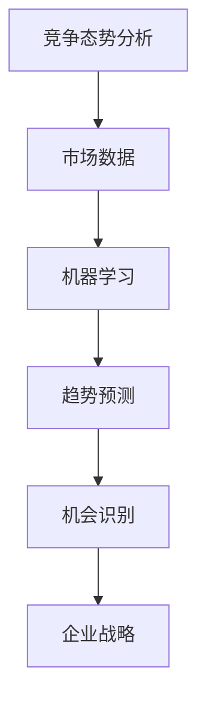
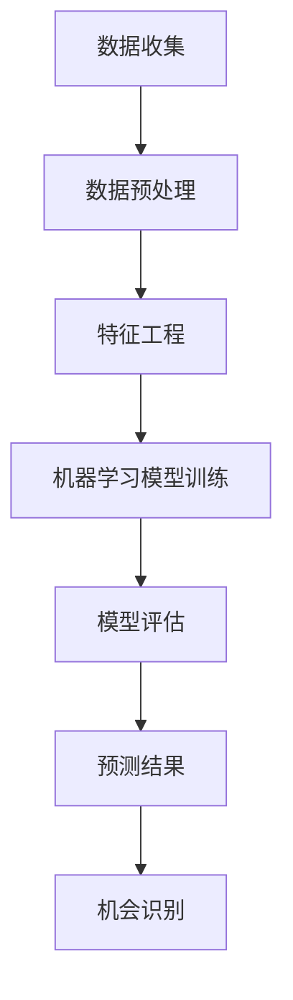
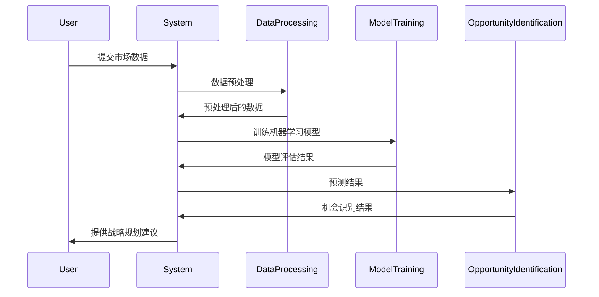
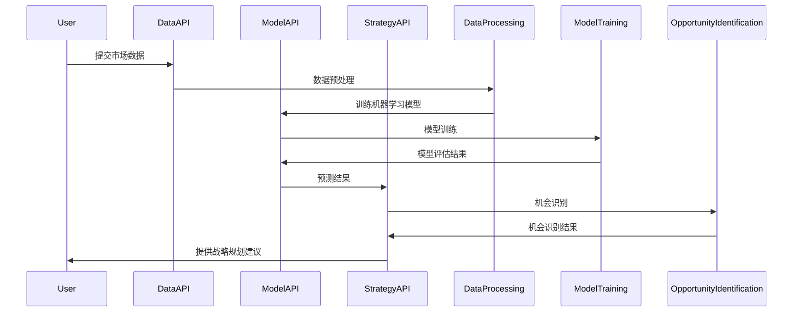

                 


# AI辅助企业战略制定：竞争态势分析与机会识别

> 关键词：人工智能、企业战略、竞争态势分析、机会识别

> 摘要：随着人工智能技术的快速发展，AI在辅助企业战略制定中的应用日益广泛。本文将深入探讨AI在竞争态势分析和机会识别方面的作用，通过具体案例展示AI的应用价值，并给出实际操作的最佳实践。

## 背景介绍

在当今全球竞争激烈的市场环境中，企业需要快速应对变化，制定有效的战略来保持竞争优势。然而，传统的战略制定方法往往依赖于经验和直觉，缺乏系统性和数据驱动的支持。随着大数据和人工智能技术的兴起，AI开始被广泛应用于企业战略制定领域。

### 问题背景

企业面临的问题主要包括：

- 如何快速获取并分析大量市场数据？
- 如何识别潜在的机会与风险？
- 如何制定科学合理的战略规划？

### 问题解决

AI的出现为这些问题提供了一种创新的解决方案。通过大数据分析和机器学习算法，AI可以快速处理海量数据，提取有价值的信息，从而帮助企业更好地理解市场态势，识别潜在机会。

### 边界与外延

- AI辅助企业战略制定的边界主要包括：数据的获取、处理和分析，算法的选择和应用。
- 外延包括：行业应用、跨行业应用，以及与其他技术的融合。

## 核心概念与联系

### 核心概念

- **竞争态势分析**：通过分析市场中的竞争格局、竞争对手的行为，以及自身的市场地位，来制定相应的战略。
- **机会识别**：在市场竞争中寻找尚未被充分开发的领域或机会，以实现企业的增长。

### 概念联系

使用Mermaid流程图展示核心概念之间的联系：



## 算法原理讲解

### 算法流程图

使用Mermaid画出算法流程图：



### 数学模型与公式

算法的核心是基于机器学习中的回归分析方法，用于预测市场趋势。数学模型如下：

$$
y = \beta_0 + \beta_1x_1 + \beta_2x_2 + ... + \beta_nx_n + \epsilon
$$

其中，$y$ 为目标变量（如市场份额），$x_1, x_2, ..., x_n$ 为特征变量（如竞争对手的市场份额、行业增长率等），$\beta_0, \beta_1, \beta_2, ..., \beta_n$ 为模型参数，$\epsilon$ 为误差项。

### Python源代码示例

```python
import numpy as np
import pandas as pd
from sklearn.linear_model import LinearRegression
from sklearn.model_selection import train_test_split
from sklearn.metrics import mean_squared_error

# 数据预处理
data = pd.read_csv('market_data.csv')
X = data[['competitor市场份额', '行业增长率']]
y = data['市场份额']

# 特征工程
X_train, X_test, y_train, y_test = train_test_split(X, y, test_size=0.2, random_state=42)

# 机器学习模型训练
model = LinearRegression()
model.fit(X_train, y_train)

# 模型评估
y_pred = model.predict(X_test)
mse = mean_squared_error(y_test, y_pred)
print(f'MSE: {mse}')

# 预测结果
predictions = model.predict(X_train)
print(predictions)
```

## 系统分析与架构设计方案

### 问题场景介绍

企业希望通过AI技术分析市场竞争态势，识别潜在机会，制定科学合理的战略规划。

### 系统功能设计

使用Mermaid类图展示系统功能设计：

```mermaid
classDiagram
Class MarketData
    +String fileName
    +DataFrame df
    +loadData(fileName)
    +preprocessData(df)
    +featuresEngineering(df)

Class LinearRegressionModel
    +LinearRegression model
    +trainModel(X, y)
    +evaluateModel(X, y)
    +predict(X)

Class OpportunityIdentifier
    +DataFrame opportunities
    +identifyOpportunities(predictions)
    +generateStrategy(opportunities)

MarketData <-- LinearRegressionModel :uses
LinearRegressionModel <-- OpportunityIdentifier :uses
```

### 系统架构设计

使用Mermaid架构图展示系统架构设计：



### 系统接口设计和系统交互

使用Mermaid序列图展示系统接口设计和系统交互：



## 项目实战

### 环境安装

确保Python环境已安装，版本为3.7或以上。使用pip安装所需库：

```bash
pip install numpy pandas scikit-learn
```

### 系统核心实现源代码

```python
# 数据预处理
def preprocess_data(data):
    # 数据清洗、缺失值处理、数据类型转换等操作
    # 略
    return preprocessed_data

# 机器学习模型训练
def train_model(X, y):
    model = LinearRegression()
    model.fit(X, y)
    return model

# 模型评估
def evaluate_model(model, X, y):
    predictions = model.predict(X)
    mse = mean_squared_error(y, predictions)
    return mse

# 机会识别
def identify_opportunities(predictions):
    # 根据预测结果识别机会
    # 略
    return opportunities

# 主函数
def main():
    # 加载市场数据
    data = pd.read_csv('market_data.csv')
    
    # 数据预处理
    preprocessed_data = preprocess_data(data)
    
    # 分离特征和目标变量
    X = preprocessed_data[['competitor市场份额', '行业增长率']]
    y = preprocessed_data['市场份额']
    
    # 训练机器学习模型
    model = train_model(X, y)
    
    # 模型评估
    mse = evaluate_model(model, X, y)
    print(f'MSE: {mse}')
    
    # 预测结果
    predictions = model.predict(X)
    
    # 机会识别
    opportunities = identify_opportunities(predictions)
    
    # 输出机会识别结果
    print(opportunities)

if __name__ == '__main__':
    main()
```

### 代码应用解读与分析

- **数据预处理**：对原始市场数据进行清洗和预处理，包括缺失值处理、数据类型转换等操作。
- **机器学习模型训练**：使用线性回归模型对特征变量和目标变量进行训练。
- **模型评估**：通过模型评估指标（如均方误差）来评估模型的准确性。
- **机会识别**：根据预测结果识别潜在的市场机会。

### 实际案例分析和详细讲解剖析

假设我们有一个市场数据集，包含以下特征变量：

- 竞争对手市场份额
- 行业增长率

以及目标变量：

- 企业市场份额

通过机器学习模型对数据进行训练，得到预测结果。分析预测结果，可以发现某些竞争对手市场份额较高的行业具有较大的增长潜力。针对这些行业，企业可以采取相应的市场策略，如增加市场份额、拓展产品线等。

### 项目小结

本案例展示了如何使用AI技术辅助企业战略制定，通过数据分析和机器学习模型训练，帮助企业识别潜在的机会。然而，AI的应用并非一蹴而就，企业需要不断优化数据质量、调整模型参数，以实现更好的效果。

## 最佳实践 tips、小结、注意事项、拓展阅读

### 最佳实践 tips

1. **数据质量是关键**：确保数据的质量和准确性，对后续分析结果至关重要。
2. **合理选择模型**：根据实际问题和数据特点，选择合适的机器学习模型。
3. **持续优化模型**：定期调整模型参数，以提高预测准确性。

### 小结

本文介绍了AI辅助企业战略制定的方法和步骤，通过实际案例展示了AI在竞争态势分析和机会识别方面的应用价值。

### 注意事项

1. **数据隐私与安全**：在数据收集和处理过程中，确保遵守相关法律法规，保护数据隐私和安全。
2. **模型解释性**：对于企业决策者，了解模型的内部工作机制和解释性是重要的。

### 拓展阅读

1. **《人工智能：一种现代的方法》**：深入理解人工智能的基本原理和应用。
2. **《数据科学实战》**：学习如何使用Python进行数据分析和机器学习。

## 作者信息

作者：AI天才研究院/AI Genius Institute & 禅与计算机程序设计艺术 /Zen And The Art of Computer Programming

（完）

