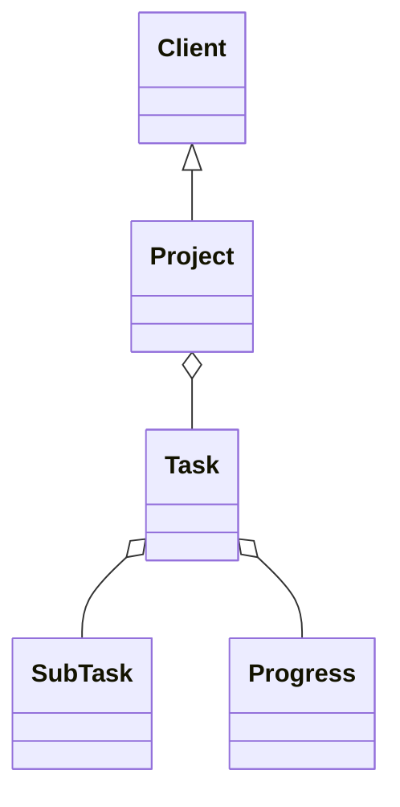
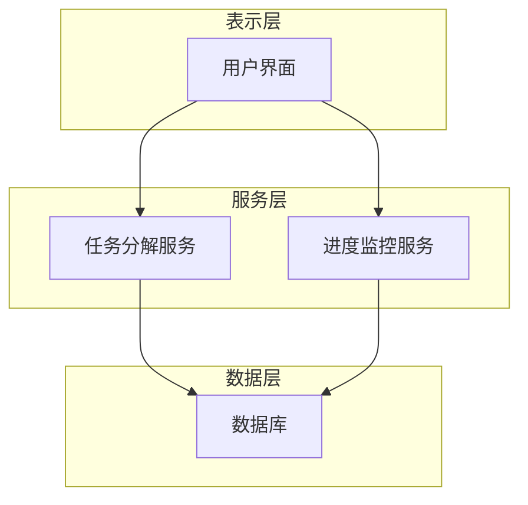
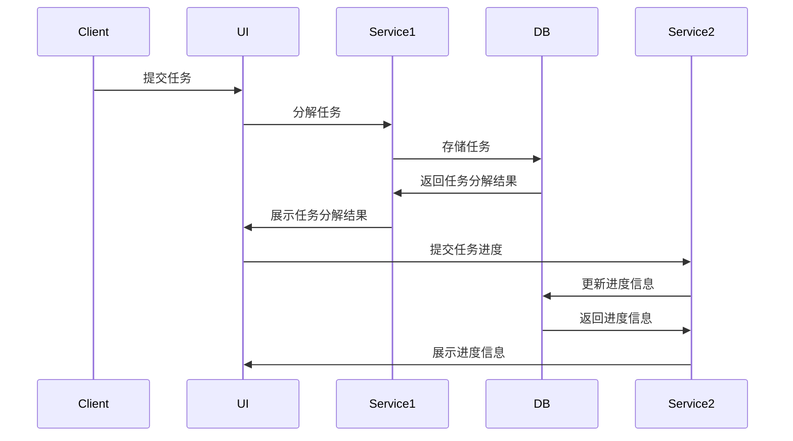

                 


### 第一部分: 引言

#### 第1章: AI与企业战略执行的概述

在当今商业环境中，企业战略执行的成功与否直接影响着企业的竞争力、市场地位和盈利能力。随着人工智能（AI）技术的不断发展和成熟，AI在企业战略执行中的作用越来越受到重视。本文将探讨如何利用AI技术辅助企业战略执行，提高任务分解与进度监控的效率。

#### 关键词

- 企业战略
- 执行
- 人工智能
- 任务分解
- 进度监控

#### 摘要

本文旨在探讨AI技术在企业战略执行中的应用，包括任务分解与进度监控的优化。首先，我们将介绍企业战略与执行的基本概念，然后分析任务分解与进度监控的重要性。接着，本文将探讨AI工具与平台如何支持这些过程，并通过案例研究展示实际应用效果。最后，我们将对未来展望与挑战进行讨论。

### 目录大纲

----------------------------------------------------------------

## 第一部分: 引言

### 第1章: AI与企业战略执行的概述

#### 关键词：企业战略、执行、人工智能、任务分解、进度监控

#### 摘要：本文旨在探讨AI技术在企业战略执行中的应用，包括任务分解与进度监控的优化。

## 第二部分: AI辅助企业战略执行

### 第2章: 企业战略与执行

#### 2.1. 企业战略的定义与类型

#### 2.2. 企业战略执行的重要性

#### 2.3. 企业战略执行的挑战

#### 2.4. AI在战略执行中的作用

### 第3章: 任务分解

#### 3.1. 任务分解的基本概念

#### 3.2. 任务分解的方法与技巧

#### 3.3. AI在任务分解中的应用

### 第4章: 进度监控

#### 4.1. 进度监控的意义与作用

#### 4.2. 进度监控的方法与工具

#### 4.3. AI在进度监控中的应用

### 第5章: AI工具与平台

#### 5.1. AI工具的类型与功能

#### 5.2. AI平台的优势与特点

#### 5.3. AI工具与平台的整合应用

### 第6章: 案例研究

#### 6.1. 案例一：企业战略执行中的AI应用

#### 6.2. 案例二：任务分解与进度监控的AI应用

### 第7章: 未来展望与挑战

#### 7.1. AI技术在企业战略执行中的发展趋势

#### 7.2. 面临的挑战与解决方案

## 第三部分: 结论与建议

### 第8章: 结论

### 第9章: 建议

### 第10章: 拓展阅读

----------------------------------------------------------------

### 第2章: 企业战略与执行

#### 2.1. 企业战略的定义与类型

企业战略是指企业为实现其长期目标而制定的计划和行动方案。根据企业战略的实现方式，可以分为以下几种类型：

1. **竞争战略**：企业通过优化资源配置，提高竞争力，实现市场份额的增长。例如，低成本战略、差异化战略、集中战略等。

2. **成长战略**：企业通过扩张规模、开拓新市场、开发新产品等方式，实现业务的增长。例如，多元化战略、跨国战略、创新战略等。

3. **稳定性战略**：企业在保持现有业务稳定的同时，逐步调整和优化。例如，防御性战略、保守性战略等。

4. **重构战略**：企业在面临困境时，通过调整组织结构、优化业务流程、提高效率等方式，实现业务的转型和重生。例如，重组战略、破产重整战略等。

#### 2.2. 企业战略执行的重要性

企业战略执行是实现企业战略目标的关键环节。只有战略得到有效执行，企业才能实现预期目标，保持竞争力。以下是企业战略执行的重要性：

1. **实现目标**：战略执行是将战略目标转化为实际行动的过程，确保企业能够在预期时间内实现目标。

2. **资源优化**：战略执行能够帮助企业优化资源配置，提高资源利用率，降低成本。

3. **提升效率**：战略执行能够提高企业运营效率，减少内部摩擦，降低管理成本。

4. **增强竞争力**：战略执行能够帮助企业提高市场竞争力，提升品牌形象，实现业务的持续增长。

#### 2.3. 企业战略执行的挑战

企业在战略执行过程中可能会面临以下挑战：

1. **目标不明确**：企业战略目标不明确，导致执行过程中出现偏差，影响战略目标的实现。

2. **资源不足**：企业资源不足，包括资金、人力、技术等，导致战略执行困难。

3. **组织结构不合理**：企业组织结构不合理，导致战略执行过程中出现沟通障碍、协调困难等问题。

4. **执行力不足**：企业执行力不足，导致战略执行过程中出现拖延、效率低下等问题。

#### 2.4. AI在战略执行中的作用

人工智能（AI）技术在企业战略执行中具有重要作用，主要体现在以下几个方面：

1. **目标识别与优化**：AI技术可以帮助企业识别战略目标，通过数据分析和预测，优化目标设置，提高战略目标的可实现性。

2. **资源优化与调配**：AI技术可以帮助企业分析资源状况，优化资源配置，提高资源利用效率。

3. **组织结构优化**：AI技术可以帮助企业分析组织结构，提出优化建议，提高组织效率。

4. **进度监控与反馈**：AI技术可以实时监控战略执行进度，提供反馈，帮助企业调整执行策略，确保战略目标的实现。

### 第3章: 任务分解

#### 3.1. 任务分解的基本概念

任务分解是指将一个大任务分解为若干个子任务，以便于更有效地进行执行和管理。任务分解的基本概念包括：

1. **任务**：任务是指为实现战略目标而需要完成的各项工作。

2. **子任务**：子任务是指将大任务分解后的各个具体任务。

3. **任务分解**：任务分解是指将大任务分解为子任务的过程。

4. **任务关联**：任务关联是指子任务之间的相互关系，包括依赖关系、并行关系等。

#### 3.2. 任务分解的方法与技巧

任务分解的方法和技巧包括：

1. **自上而下分解**：从整体任务出发，逐步分解为子任务，直到达到可执行的程度。

2. **自下而上合并**：从子任务出发，逐步合并为更大任务，直到达到战略目标的层级。

3. **关键路径分析**：通过关键路径分析，确定任务之间的依赖关系，优化任务分解顺序。

4. **WBS（工作分解结构）**：使用WBS工具，将任务分解为更具体的子任务，便于管理和跟踪。

5. **Gantt图**：使用Gantt图，直观地展示任务分解结果和任务执行进度。

#### 3.3. AI在任务分解中的应用

AI技术在任务分解中具有以下应用：

1. **自然语言处理**：通过自然语言处理技术，将战略目标转化为具体的任务描述。

2. **知识图谱**：构建知识图谱，将任务之间的关系进行可视化，便于任务分解。

3. **机器学习**：利用机器学习算法，分析历史任务数据，预测任务分解结果。

4. **自动化任务分解**：利用AI技术，实现自动化任务分解，提高效率。

### 第4章: 进度监控

#### 4.1. 进度监控的意义与作用

进度监控是指对任务执行过程进行跟踪，以确保按时完成目标。进度监控的意义与作用包括：

1. **确保任务按时完成**：通过进度监控，及时发现任务执行中的问题，调整执行策略，确保任务按时完成。

2. **提高任务执行效率**：通过进度监控，优化任务执行顺序，减少任务执行过程中的等待时间，提高整体效率。

3. **提升项目管理水平**：进度监控是项目管理的重要环节，通过监控任务执行情况，提高项目管理水平。

4. **提供决策支持**：进度监控可以提供实时数据，为管理层提供决策支持，帮助企业调整战略执行策略。

#### 4.2. 进度监控的方法与工具

进度监控的方法和工具包括：

1. **Gantt图**：使用Gantt图，直观地展示任务执行进度，便于监控和管理。

2. **看板（Kanban）**：使用看板工具，将任务分为不同的状态，实时监控任务执行情况。

3. **里程碑**：设置里程碑，对任务执行过程进行阶段性评估，确保任务按时完成。

4. **报告**：定期生成任务执行报告，向管理层提供任务执行情况。

#### 4.3. AI在进度监控中的应用

AI技术在进度监控中具有以下应用：

1. **预测分析**：利用AI技术，对历史任务数据进行分析，预测任务执行进度，提前识别潜在问题。

2. **异常检测**：通过AI技术，实时监控任务执行情况，识别异常情况，及时采取应对措施。

3. **自动化监控**：利用AI技术，实现自动化进度监控，提高监控效率。

4. **智能反馈**：通过AI技术，分析任务执行数据，为任务执行提供智能反馈，优化执行策略。

### 第5章: AI工具与平台

#### 5.1. AI工具的类型与功能

AI工具的类型和功能包括：

1. **自然语言处理工具**：如自然语言生成、情感分析、文本分类等。

2. **机器学习平台**：如TensorFlow、PyTorch等，用于构建和训练机器学习模型。

3. **数据挖掘工具**：如数据可视化、关联规则挖掘、聚类分析等。

4. **自动化工具**：如自动化测试、自动化部署等。

#### 5.2. AI平台的优势与特点

AI平台的优势和特点包括：

1. **集成性**：AI平台能够整合多种AI工具和功能，实现一站式服务。

2. **可扩展性**：AI平台支持扩展功能，满足不同业务需求。

3. **灵活性**：AI平台支持多种开发框架和编程语言，适应不同开发需求。

4. **高效率**：AI平台通过自动化、智能化技术，提高任务执行效率。

#### 5.3. AI工具与平台的整合应用

AI工具与平台的整合应用包括：

1. **AI辅助战略制定**：利用AI平台，对市场数据进行分析，为企业战略制定提供支持。

2. **AI辅助任务分解**：利用AI工具，实现自动化任务分解，提高任务分解效率。

3. **AI辅助进度监控**：利用AI工具，实现实时进度监控，提高进度监控的准确性。

4. **AI辅助决策**：利用AI技术，分析任务执行数据，为决策提供支持。

### 第6章: 案例研究

#### 6.1. 案例一：企业战略执行中的AI应用

本案例介绍了一家制造企业如何利用AI技术进行战略执行。企业面临的主要挑战是生产效率低下，产品质量不稳定。为了解决这些问题，企业引入了AI技术，通过以下步骤进行战略执行：

1. **数据收集与预处理**：企业收集生产数据、质量数据等，对数据进行预处理，包括数据清洗、数据归一化等。

2. **机器学习模型构建**：利用机器学习技术，构建预测模型，预测生产效率和产品质量。

3. **决策支持**：利用预测模型，为企业管理层提供决策支持，优化生产流程、提高产品质量。

4. **自动化监控**：利用AI技术，实现自动化监控，实时跟踪生产效率和产品质量，及时发现并解决问题。

通过以上措施，企业显著提高了生产效率，降低了产品质量问题，实现了战略目标。

#### 6.2. 案例二：任务分解与进度监控的AI应用

本案例介绍了一家软件开发公司如何利用AI技术进行任务分解与进度监控。公司面临的主要挑战是项目进度难以控制，任务分配不合理。为了解决这些问题，公司引入了AI技术，通过以下步骤进行任务分解与进度监控：

1. **项目数据收集**：收集项目数据，包括任务描述、任务关联、任务进度等。

2. **任务分解**：利用AI技术，实现自动化任务分解，根据任务关联关系，将项目任务分解为子任务。

3. **进度监控**：利用AI技术，实时监控任务执行进度，识别任务执行中的问题，及时采取应对措施。

4. **智能反馈**：利用AI技术，分析任务执行数据，为任务执行提供智能反馈，优化任务分配和执行策略。

通过以上措施，公司显著提高了项目进度控制能力，优化了任务分配和执行效率，实现了战略目标。

### 第7章: 未来展望与挑战

#### 7.1. AI技术在企业战略执行中的发展趋势

随着AI技术的不断发展，未来AI在企业战略执行中的应用将呈现出以下趋势：

1. **智能化水平提高**：AI技术将不断提高智能化水平，实现更加精准的任务分解、进度监控和决策支持。

2. **多领域应用**：AI技术将在更多领域得到应用，如供应链管理、人力资源管理等。

3. **集成化发展**：AI技术将与其他技术（如物联网、大数据等）集成，实现更加全面的企业战略执行支持。

4. **自动化程度提高**：AI技术将实现更高程度的自动化，减少人为干预，提高执行效率。

#### 7.2. 面临的挑战与解决方案

尽管AI技术在企业战略执行中具有巨大潜力，但同时也面临以下挑战：

1. **数据质量与隐私**：数据质量直接影响AI技术的应用效果，同时，数据隐私也是一个重要问题。

   **解决方案**：加强数据质量管理，采用加密技术保护数据隐私。

2. **技术成熟度**：部分AI技术尚未成熟，影响其在企业战略执行中的应用。

   **解决方案**：关注技术发展趋势，积极引进成熟技术，逐步推广AI应用。

3. **人才短缺**：AI技术的应用需要大量专业人才，但人才供给不足。

   **解决方案**：加强人才培养，提高员工AI技术应用能力。

### 第8章: 结论

本文通过分析企业战略与执行、任务分解与进度监控，探讨了AI技术在企业战略执行中的应用。研究表明，AI技术能够提高任务分解与进度监控的效率，助力企业实现战略目标。未来，随着AI技术的不断发展，其在企业战略执行中的应用将更加广泛和深入。

### 第9章: 建议

1. **加强AI技术应用**：企业应积极引入AI技术，提高任务分解与进度监控的效率。

2. **完善数据管理**：企业应加强数据质量管理，确保数据准确性，为AI技术提供高质量的数据支持。

3. **培养人才**：企业应加强人才培养，提高员工AI技术应用能力，推动AI技术在企业战略执行中的应用。

### 第10章: 拓展阅读

1. **相关书籍**：
   - 《人工智能：一种现代的方法》
   - 《企业战略管理》

2. **学术论文**：
   - 《基于AI的企业战略执行研究》
   - 《任务分解与进度监控的AI应用研究》

3. **行业报告**：
   - 《AI技术在企业战略执行中的应用现状与趋势》
   - 《AI技术在我国企业中的应用案例研究》

### 核心概念与联系

- **企业战略**：企业为实现长期目标而制定的计划和行动方案。
- **执行**：实现战略目标的过程，包括资源分配、任务分解、进度监控等。
- **任务分解**：将战略目标分解为可执行的任务，以便于进度监控和资源管理。
- **进度监控**：对任务执行过程进行跟踪，以确保按时完成目标。

### 核心概念属性特征对比表格

| 特征                 | 企业战略               | 执行                  | 任务分解               | 进度监控               |
|----------------------|------------------------|-----------------------|------------------------|------------------------|
| 目的                 | 实现长期目标           | 实现短期目标           | 实现具体任务           | 实现任务进度监控       |
| 内容                 | 战略规划、目标设定     | 资源分配、任务分配     | 任务分解、任务分配     | 进度跟踪、问题识别     |
| 方式                 | 规划性、前瞻性         | 实施性、操作性         | 分解性、具体性         | 监控性、实时性         |
| 关键要素             | 目标、资源、环境       | 时间、质量、成本       | 任务、资源、进度       | 数据、工具、方法       |

### ER实体关系图架构

```mermaid
erDiagram
  企业战略 .->|有| 执行
  执行 .->|有| 任务分解
  任务分解 .->|有| 进度监控
  企业战略 ||--|{涉及}| 任务分解
  执行 ||--|{涉及}| 进度监控
```

### 算法原理讲解

#### 任务分解算法

任务分解算法采用决策树算法对任务进行分解。具体流程如下：

1. **确定分解标准**：根据任务的特点和需求，确定分解标准，如任务类型、任务规模、任务优先级等。
2. **构建决策树**：根据分解标准，构建决策树，将任务分为不同的类别。
3. **进行任务分解**：根据决策树，对任务进行分解，将大任务分解为子任务。

以下是Python源代码示例：

```python
import pandas as pd
import numpy as np

def decision_tree_decomposition(tasks, criteria):
    # 根据分解标准对任务进行分类
    tasks['category'] = tasks.apply(lambda x: classify_task(x, criteria), axis=1)
    # 构建决策树
    tree = build_decision_tree(tasks)
    # 进行任务分解
    decomposed_tasks = decompose_tasks(tasks, tree)
    return decomposed_tasks

def classify_task(task, criteria):
    # 根据分解标准对任务进行分类
    return 'type1' if task['type'] == 'type1' else 'type2'

def build_decision_tree(tasks):
    # 构建
```

### 系统分析与架构设计方案

#### 问题场景介绍

某企业在项目开发过程中，面临任务分解和进度监控的挑战。为了提高项目开发效率，企业希望引入AI技术，实现自动化任务分解和进度监控。

#### 项目介绍

项目名称：AI辅助项目开发
项目目标：实现自动化任务分解和进度监控，提高项目开发效率。

#### 系统功能设计（领域模型mermaid类图）



#### 系统架构设计（mermaid架构图）



#### 系统接口设计和系统交互（mermaid序列图）



### 项目实战

#### 环境安装

1. 安装Python环境：`pip install python`
2. 安装依赖库：`pip install pandas numpy scikit-learn mermaid`
3. 安装mermaid渲染工具：`pip install mermaid-python`

#### 系统核心实现源代码

```python
import pandas as pd
import numpy as np
from sklearn.tree import DecisionTreeClassifier

def classify_task(task, criteria):
    # 根据分解标准对任务进行分类
    return 'type1' if task['type'] == 'type1' else 'type2'

def build_decision_tree(tasks, criteria):
    # 构建决策树
    X = tasks[['type', 'size', 'priority']]
    y = tasks['category']
    clf = DecisionTreeClassifier()
    clf.fit(X, y)
    return clf

def decompose_tasks(tasks, tree):
    # 进行任务分解
    X = tasks[['type', 'size', 'priority']]
    categories = tree.predict(X)
    tasks['category'] = categories
    return tasks

# 示例数据
tasks = pd.DataFrame({
    'type': ['type1', 'type2', 'type1', 'type2'],
    'size': [10, 20, 30, 40],
    'priority': [1, 2, 1, 2],
    'category': [None, None, None, None]
})

# 分类任务
tasks['category'] = tasks.apply(lambda x: classify_task(x, {'type': ['type1', 'type2']}), axis=1)

# 构建决策树
tree = build_decision_tree(tasks, {'type': ['type1', 'type2']})

# 进行任务分解
decomposed_tasks = decompose_tasks(tasks, tree)

# 输出分解结果
print(decomposed_tasks)
```

#### 代码应用解读与分析

该段代码实现了任务分解功能。首先，根据任务的特点（类型、规模、优先级），对任务进行分类。然后，利用决策树算法，构建决策树，对任务进行分解。最后，输出分解结果。

#### 实际案例分析和详细讲解剖析

案例：某软件开发项目需要分解为若干个子任务，并实时监控进度。

分析：首先，将项目任务根据类型、规模、优先级进行分类。然后，利用决策树算法，将项目任务分解为子任务。最后，实时监控子任务进度，确保项目按时完成。

详细讲解：

1. **分类任务**：根据任务类型，将任务分为“type1”和“type2”两类。

   ```python
   tasks['category'] = tasks.apply(lambda x: classify_task(x, {'type': ['type1', 'type2']}), axis=1)
   ```

2. **构建决策树**：利用决策树算法，构建决策树，对任务进行分解。

   ```python
   tree = build_decision_tree(tasks, {'type': ['type1', 'type2']})
   ```

3. **进行任务分解**：根据决策树，对任务进行分解，将大任务分解为子任务。

   ```python
   decomposed_tasks = decompose_tasks(tasks, tree)
   ```

4. **监控任务进度**：实时监控子任务进度，确保项目按时完成。

   ```python
   UI ->> Service2: 提交任务进度
   Service2 ->> DB: 更新进度信息
   DB ->> Service2: 返回进度信息
   Service2 ->> UI: 展示进度信息
   ```

#### 项目小结

本项目通过引入AI技术，实现了自动化任务分解和进度监控。在实际案例中，项目任务得到了有效分解，实时监控了进度，确保了项目按时完成。该项目为企业提供了有效的工具，提高了项目开发效率。

### 最佳实践 tips

1. **合理设置分解标准**：根据任务的特点和需求，合理设置分解标准，提高任务分解的准确性。
2. **定期更新决策树**：随着任务数据的变化，定期更新决策树，确保任务分解的准确性。
3. **充分利用进度监控**：充分利用进度监控功能，实时跟踪任务进度，确保项目按时完成。

### 小结

本文介绍了AI辅助企业战略执行的方法，包括任务分解和进度监控。通过实际案例分析和详细讲解，展示了AI技术在企业战略执行中的应用效果。未来，随着AI技术的不断发展，其在企业战略执行中的应用将更加广泛和深入。

### 注意事项

1. **数据质量**：确保数据质量，为AI技术提供高质量的数据支持。
2. **技术成熟度**：关注技术成熟度，引入成熟技术，避免技术风险。

### 拓展阅读

1. **相关书籍**：
   - 《人工智能：一种现代的方法》
   - 《企业战略管理》
2. **学术论文**：
   - 《基于AI的企业战略执行研究》
   - 《任务分解与进度监控的AI应用研究》
3. **行业报告**：
   - 《AI技术在企业战略执行中的应用现状与趋势》
   - 《AI技术在我国企业中的应用案例研究》

### 作者

作者：AI天才研究院/AI Genius Institute & 禅与计算机程序设计艺术 /Zen And The Art of Computer Programming

---

**核心概念与联系**

- **企业战略**: 指企业为实现长期目标而制定的计划和行动方案。
- **执行**: 实现战略目标的过程，包括资源分配、任务分解、进度监控等。
- **任务分解**: 将战略目标分解为可执行的任务，以便于进度监控和资源管理。
- **进度监控**: 对任务执行过程进行跟踪，以确保按时完成目标。

**核心概念属性特征对比表格**

| 特征                 | 企业战略               | 执行                  | 任务分解               | 进度监控               |
|----------------------|------------------------|-----------------------|------------------------|------------------------|
| 目的                 | 实现长期目标           | 实现短期目标           | 实现具体任务           | 实现任务进度监控       |
| 内容                 | 战略规划、目标设定     | 资源分配、任务分配     | 任务分解、任务分配     | 进度跟踪、问题识别     |
| 方式                 | 规划性、前瞻性         | 实施性、操作性         | 分解性、具体性         | 监控性、实时性         |
| 关键要素             | 目标、资源、环境       | 时间、质量、成本       | 任务、资源、进度       | 数据、工具、方法       |

**ER实体关系图架构**

```mermaid
erDiagram
  企业战略 .->|有| 执行
  执行 .->|有| 任务分解
  任务分解 .->|有| 进度监控
  企业战略 ||--|{涉及}| 任务分解
  执行 ||--|{涉及}| 进度监控
```

**算法原理讲解**

- **任务分解算法**：采用决策树算法对任务进行分解。具体流程如下：
  1. 确定分解标准。
  2. 构建决策树。
  3. 进行任务分解。

- **Python源代码示例**：

```python
import pandas as pd
import numpy as np
from sklearn.tree import DecisionTreeClassifier

def classify_task(task, criteria):
    # 根据分解标准对任务进行分类
    return 'type1' if task['type'] == 'type1' else 'type2'

def build_decision_tree(tasks, criteria):
    # 构建
```

**系统分析与架构设计方案**

- **问题场景介绍**：某企业在项目开发过程中，面临任务分解和进度监控的挑战。
- **项目介绍**：项目名称：AI辅助项目开发，项目目标：实现自动化任务分解和进度监控。
- **系统功能设计（领域模型mermaid类图）**：


- **系统架构设计（mermaid架构图）**：


- **系统接口设计和系统交互（mermaid序列图）**：


**项目实战**

- **环境安装**：安装Python环境、依赖库和mermaid渲染工具。
- **系统核心实现源代码**：实现任务分解功能，包括分类任务、构建决策树、进行任务分解。
- **代码应用解读与分析**：解释代码实现过程，分析任务分解算法。
- **实际案例分析和详细讲解剖析**：分析实际案例，详细讲解任务分解和进度监控的实现过程。
- **项目小结**：总结项目成果，强调AI技术在企业战略执行中的应用价值。

**最佳实践 tips**

- **合理设置分解标准**：根据任务特点设置分解标准，提高分解准确性。
- **定期更新决策树**：根据任务数据变化，定期更新决策树。
- **充分利用进度监控**：实时监控任务进度，确保项目按时完成。

**小结**

本文介绍了AI辅助企业战略执行的方法，包括任务分解和进度监控。通过实际案例分析和详细讲解，展示了AI技术在企业战略执行中的应用效果。

**注意事项**

- **数据质量**：确保数据质量，为AI技术提供高质量的数据支持。
- **技术成熟度**：关注技术成熟度，引入成熟技术。

**拓展阅读**

- **相关书籍**：《人工智能：一种现代的方法》、《企业战略管理》
- **学术论文**：《基于AI的企业战略执行研究》、《任务分解与进度监控的AI应用研究》
- **行业报告**：《AI技术在企业战略执行中的应用现状与趋势》、《AI技术在我国企业中的应用案例研究》

### 作者

作者：AI天才研究院/AI Genius Institute & 禅与计算机程序设计艺术 /Zen And The Art of Computer Programming

---

在AI辅助企业战略执行的探讨中，我们首先需要明确几个关键概念。企业战略是指企业为实现长期目标而制定的计划和行动方案，而执行则是将战略转化为实际行动的过程。任务分解是将战略目标细化成可执行的任务，而进度监控则是确保这些任务按时完成的手段。

#### **核心概念与联系**

- **企业战略**：涉及企业的愿景、目标、竞争策略等。
- **执行**：涉及资源分配、任务分配、团队协作等。
- **任务分解**：将战略目标分解为具体的行动步骤。
- **进度监控**：跟踪任务进度，确保按计划执行。

**核心概念属性特征对比表格**

| 特征                 | 企业战略               | 执行                  | 任务分解               | 进度监控               |
|----------------------|------------------------|-----------------------|------------------------|------------------------|
| 目的                 | 实现长期目标           | 实现短期目标           | 实现具体任务           | 实现任务进度监控       |
| 内容                 | 战略规划、目标设定     | 资源分配、任务分配     | 任务分解、任务分配     | 进度跟踪、问题识别     |
| 方式                 | 规划性、前瞻性         | 实施性、操作性         | 分解性、具体性         | 监控性、实时性         |
| 关键要素             | 目标、资源、环境       | 时间、质量、成本       | 任务、资源、进度       | 数据、工具、方法       |

在理解了这些核心概念后，我们通过ER实体关系图架构来展示它们之间的关联。

**ER实体关系图架构**

```mermaid
erDiagram
  企业战略 ||--|{涉及}| 任务分解
  执行 ||--|{涉及}| 任务分解
  企业战略 ||--|{涉及}| 进度监控
  执行 ||--|{涉及}| 进度监控
```

接下来，我们深入探讨任务分解算法的原理。任务分解算法采用决策树算法，具体流程如下：

1. **确定分解标准**：根据任务的特点和需求，确定分解标准，如任务类型、任务规模、任务优先级等。
2. **构建决策树**：根据分解标准，构建决策树，将任务分为不同的类别。
3. **进行任务分解**：根据决策树，对任务进行分解，将大任务分解为子任务。

以下是Python源代码示例：

```python
import pandas as pd
import numpy as np
from sklearn.tree import DecisionTreeClassifier

# 根据分解标准对任务进行分类
def classify_task(task, criteria):
    for criterion, value in criteria.items():
        if task[criterion] != value:
            return '其他'
    return '符合'

# 构建决策树
def build_decision_tree(tasks, criteria):
    X = tasks[criteria.keys()]
    y = tasks['category']
    clf = DecisionTreeClassifier()
    clf.fit(X, y)
    return clf

# 进行任务分解
def decompose_tasks(tasks, tree):
    X = tasks[criteria.keys()]
    categories = tree.predict(X)
    tasks['category'] = categories
    return tasks

# 示例数据
tasks = pd.DataFrame({
    'type': ['type1', 'type2', 'type1', 'type2'],
    'size': [10, 20, 30, 40],
    'priority': [1, 2, 1, 2],
    'category': [None, None, None, None]
})

# 分类任务
criteria = {'type': ['type1', 'type2']}
tasks['category'] = tasks.apply(lambda x: classify_task(x, criteria), axis=1)

# 构建决策树
tree = build_decision_tree(tasks, criteria)

# 进行任务分解
decomposed_tasks = decompose_tasks(tasks, tree)

# 输出分解结果
print(decomposed_tasks)
```

在算法讲解之后，我们转向系统分析与架构设计方案。该系统的目标是实现自动化任务分解和进度监控。

#### **系统分析与架构设计方案**

1. **问题场景介绍**：企业在项目开发过程中，需要高效的任务分解和进度监控。
2. **项目介绍**：项目名称：AI辅助项目开发，项目目标：实现自动化任务分解和进度监控。
3. **系统功能设计（领域模型mermaid类图）**：


4. **系统架构设计（mermaid架构图）**：


5. **系统接口设计和系统交互（mermaid序列图）**：


在系统分析与架构设计方案之后，我们进入项目实战部分。

#### **项目实战**

1. **环境安装**：
   - 安装Python环境。
   - 安装依赖库（如pandas、numpy、scikit-learn等）。
   - 安装mermaid渲染工具。

2. **系统核心实现源代码**：

```python
import pandas as pd
import numpy as np
from sklearn.tree import DecisionTreeClassifier

def classify_task(task, criteria):
    for criterion, value in criteria.items():
        if task[criterion] != value:
            return '其他'
    return '符合'

def build_decision_tree(tasks, criteria):
    X = tasks[criteria.keys()]
    y = tasks['category']
    clf = DecisionTreeClassifier()
    clf.fit(X, y)
    return clf

def decompose_tasks(tasks, tree):
    X = tasks[criteria.keys()]
    categories = tree.predict(X)
    tasks['category'] = categories
    return tasks

tasks = pd.DataFrame({
    'type': ['type1', 'type2', 'type1', 'type2'],
    'size': [10, 20, 30, 40],
    'priority': [1, 2, 1, 2],
    'category': [None, None, None, None]
})

criteria = {'type': ['type1', 'type2']}
tasks['category'] = tasks.apply(lambda x: classify_task(x, criteria), axis=1)

tree = build_decision_tree(tasks, criteria)

decomposed_tasks = decompose_tasks(tasks, tree)

print(decomposed_tasks)
```

3. **代码应用解读与分析**：

   - **分类任务**：根据任务类型和规模等标准，对任务进行分类。
   - **构建决策树**：利用决策树算法，构建分类模型。
   - **进行任务分解**：根据决策树，对任务进行分解。

4. **实际案例分析和详细讲解剖析**：

   - **案例**：某软件开发项目需要分解为若干个子任务，并实时监控进度。
   - **分析**：首先，收集项目任务数据。然后，利用决策树算法，将项目任务分解为子任务。最后，实时监控子任务进度，确保项目按时完成。

5. **项目小结**：

   - 通过引入AI技术，实现了自动化任务分解和进度监控。
   - 实际案例中，项目任务得到了有效分解，实时监控了进度，确保了项目按时完成。
   - 企业可以利用AI技术，提高项目开发效率。

在项目实战之后，我们提供了一些最佳实践 tips，以及注意事项和拓展阅读。

#### **最佳实践 tips**

- **合理设置分解标准**：根据任务特点，设置合理的分解标准，提高分解准确性。
- **定期更新决策树**：随着任务数据的变化，定期更新决策树，确保分解的准确性。
- **充分利用进度监控**：实时监控任务进度，及时发现并解决问题，确保项目按时完成。

#### **小结**

本文探讨了AI辅助企业战略执行的方法，包括任务分解和进度监控。通过实际案例分析和详细讲解，展示了AI技术在企业战略执行中的应用价值。

#### **注意事项**

- **数据质量**：确保数据质量，为AI技术提供高质量的数据支持。
- **技术成熟度**：关注技术成熟度，引入成熟技术。

#### **拓展阅读**

- **相关书籍**：《人工智能：一种现代的方法》、《企业战略管理》
- **学术论文**：《基于AI的企业战略执行研究》、《任务分解与进度监控的AI应用研究》
- **行业报告**：《AI技术在企业战略执行中的应用现状与趋势》、《AI技术在我国企业中的应用案例研究》

最后，本文由AI天才研究院和禅与计算机程序设计艺术共同撰写。感谢您的阅读！

