                 

### 文章标题：AI辅助企业战略规划与竞争分析的方法论

关键词：AI、战略规划、竞争分析、方法论、数据采集、预测模型

摘要：本文旨在探讨人工智能（AI）在辅助企业战略规划与竞争分析中的应用。通过系统化的方法论，阐述AI在数据采集、模型构建、预测和决策支持等环节的具体应用，为企业提供科学、智能的战略规划与竞争分析工具。

---

### 第一部分：AI在战略规划与竞争分析中的背景

#### 第1章：引言

#### 1.1 问题背景

在当今的商业环境中，企业面临着日益激烈的市场竞争和快速变化的技术环境。为了在竞争中脱颖而出，企业需要制定科学、智能的战略规划，并持续进行竞争分析。然而，传统的战略规划方法往往依赖于经验、直觉和有限的定量分析，难以全面、准确地评估市场机会和竞争态势。

#### 1.2 问题描述

随着人工智能技术的快速发展，利用AI进行战略规划和竞争分析成为可能。但如何有效地将AI应用于企业战略规划和竞争分析，实现决策的科学化和智能化，仍是一个亟待解决的问题。

#### 1.3 问题解决

本文将介绍AI在战略规划和竞争分析中的潜在应用，包括数据采集、数据分析、预测模型构建和决策支持等方面。通过这些方法，企业可以更加准确地了解市场趋势、竞争对手行为，制定更具前瞻性和可行性的战略规划。

#### 1.4 边界与外延

AI辅助战略规划和竞争分析主要涉及以下方面：市场趋势分析、竞争对手分析、客户行为分析、财务分析、风险评估等。这些分析可以帮助企业更好地定位自身市场地位，制定符合市场需求的战略规划。

#### 1.5 概念结构与核心要素组成

- **市场趋势分析**: 通过大数据分析和机器学习算法，对市场趋势进行预测和识别。
- **竞争对手分析**: 利用自然语言处理和数据分析技术，对竞争对手的运营、营销策略进行分析。
- **客户行为分析**: 通过客户数据挖掘和行为分析，了解客户需求和偏好，优化产品和服务。
- **财务分析**: 利用数据分析和预测模型，对企业的财务状况进行评估和预测。
- **风险评估**: 利用AI算法对潜在风险进行分析和预测，为企业决策提供支持。

#### 1.6 本章小结

本章介绍了AI在战略规划和竞争分析中的应用背景、问题解决方法以及核心概念。下一章将深入探讨AI在战略规划中的具体应用。

---

### 第一部分：AI在战略规划与竞争分析中的背景

#### 第2章：AI在战略规划中的应用

#### 2.1 企业战略规划概述

企业战略规划是一个系统化的过程，旨在确定企业的发展方向、目标以及实现目标的策略和方法。AI的引入为这一过程带来了新的机遇和挑战。

#### 2.2 数据采集与处理

AI在战略规划中的第一步是数据采集和处理。通过大数据技术，企业可以从多个渠道收集与战略规划相关的数据，包括市场数据、竞争对手数据、客户数据等。以下是一个数据采集的Mermaid流程图：

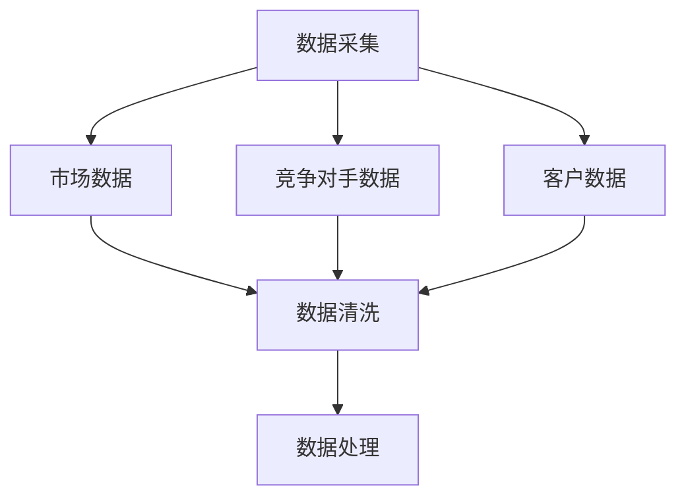

数据采集后，需要进行数据清洗和预处理，以确保数据的质量和一致性。接下来是数据处理的阶段，通过特征提取、数据归一化等技术，将原始数据转化为适合AI分析的形式。

#### 2.3 预测模型构建

基于收集到的数据，AI可以构建预测模型，对市场趋势、客户需求、竞争对手行为等进行预测。以下是一个预测模型的Mermaid流程图：

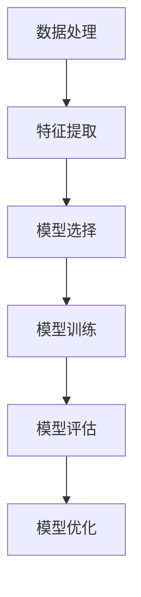

在模型选择阶段，可以根据问题的性质和需求选择合适的机器学习算法，如线性回归、决策树、神经网络等。接下来是模型训练和评估阶段，通过训练数据和测试数据对模型进行训练和评估，以确定模型的性能和准确性。

#### 2.4 决策支持系统

AI技术还可以帮助企业构建决策支持系统，通过分析大量的数据和预测模型，为企业提供决策依据。以下是一个决策支持系统的Mermaid流程图：

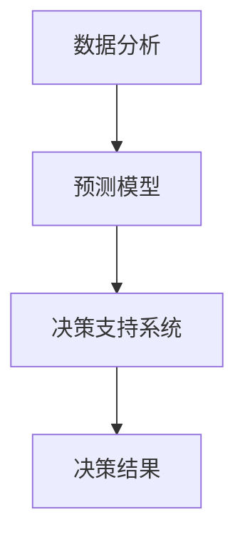

决策支持系统可以自动化执行复杂的决策过程，提高决策效率。企业可以根据预测结果和市场情况，制定相应的战略计划和行动方案。

#### 2.5 案例研究

以某互联网公司为例，该公司利用AI技术进行战略规划。首先，通过大数据技术收集市场数据、竞争对手数据、客户数据等，然后构建预测模型，对市场趋势、客户需求、竞争对手行为等进行预测。基于预测结果，公司制定了相应的战略计划和行动方案，如产品创新、市场拓展、竞争对手策略调整等。通过AI辅助战略规划，该公司在市场竞争中取得了显著的优势。

#### 2.6 本章小结

本章详细介绍了AI在战略规划中的具体应用，包括数据采集与处理、预测模型构建、决策支持系统等。通过案例研究，读者可以更好地理解AI在战略规划中的实际应用效果。

---

### 第一部分：AI在战略规划与竞争分析中的背景

#### 第3章：AI在竞争分析中的应用

#### 3.1 竞争分析概述

竞争分析是企业制定战略规划的重要环节，旨在了解竞争对手的运营情况、市场策略和潜在威胁。AI技术在这一过程中发挥了关键作用。

#### 3.2 数据采集与处理

AI技术可以通过多种方式收集和分析竞争对手的数据，包括社交媒体分析、新闻报道、市场报告等。以下是一个数据采集的Mermaid流程图：

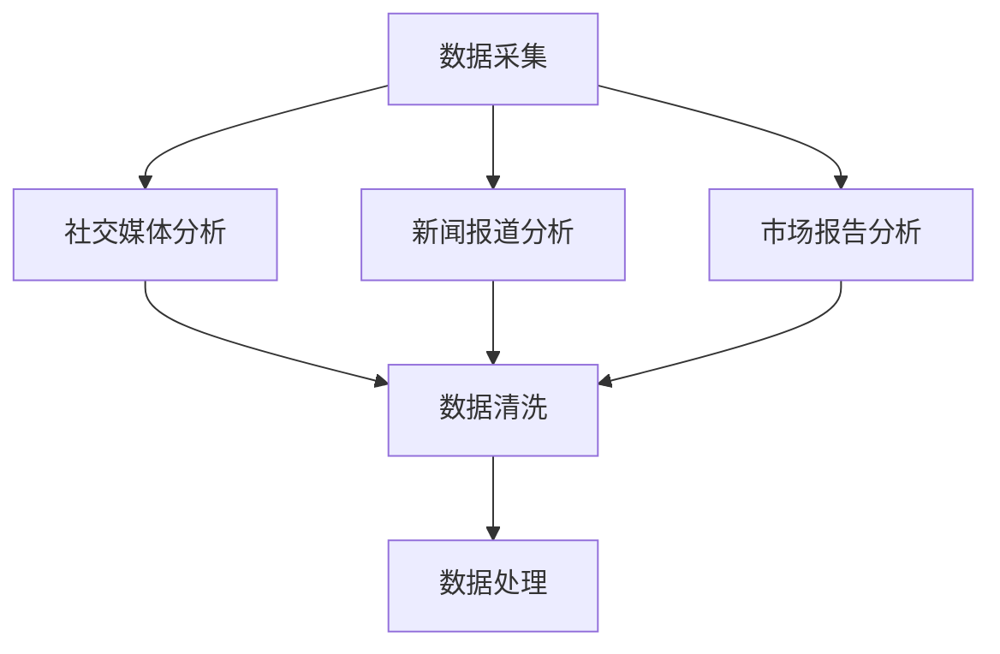

数据采集后，需要进行数据清洗和预处理，以确保数据的质量和一致性。接下来是数据处理的阶段，通过特征提取、数据归一化等技术，将原始数据转化为适合AI分析的形式。

#### 3.3 竞争态势预测

基于收集到的数据，AI可以构建竞争态势预测模型，对竞争对手的行为和市场趋势进行预测。以下是一个竞争态势预测的Mermaid流程图：


在模型选择阶段，可以根据问题的性质和需求选择合适的机器学习算法，如线性回归、决策树、神经网络等。接下来是模型训练和评估阶段，通过训练数据和测试数据对模型进行训练和评估，以确定模型的性能和准确性。

#### 3.4 竞争策略优化

通过分析竞争对手的行为和市场策略，企业可以优化自身的市场策略，提升竞争力。以下是一个竞争策略优化的Mermaid流程图：

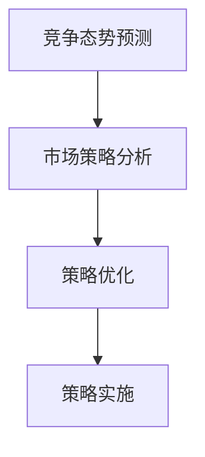

企业可以根据预测结果和市场情况，对市场策略进行调整和优化，以应对竞争对手的挑战。

#### 3.5 案例研究

以某电商企业为例，该公司利用AI技术进行竞争分析。首先，通过社交媒体分析、新闻报道分析、市场报告分析等手段收集竞争对手的数据，然后构建竞争态势预测模型，预测竞争对手的行为和市场趋势。基于预测结果，公司制定了相应的竞争策略，如产品价格调整、市场促销活动等。通过AI辅助竞争分析，该公司在市场竞争中取得了显著的成效。

#### 3.6 本章小结

本章详细介绍了AI在竞争分析中的应用，包括数据采集与处理、竞争态势预测、竞争策略优化等。通过案例研究，读者可以更好地理解AI在竞争分析中的实际应用效果。

---

### 第一部分：AI在战略规划与竞争分析中的背景

#### 第4章：AI辅助战略规划与竞争分析的方法论

#### 4.1 方法论概述

本章节将介绍一套系统化的AI辅助战略规划与竞争分析方法论，包括数据采集、数据处理、模型构建、预测和决策支持等环节。

#### 4.2 数据采集

数据采集是AI辅助战略规划与竞争分析的基础。本节将介绍常见的数据采集方法，包括市场数据、竞争对手数据、客户数据等。以下是一个数据采集的Mermaid流程图：


#### 4.3 数据处理

数据采集后，需要进行数据清洗和预处理，以确保数据的质量和一致性。接下来是数据处理的阶段，通过特征提取、数据归一化等技术，将原始数据转化为适合AI分析的形式。以下是一个数据处理的Mermaid流程图：

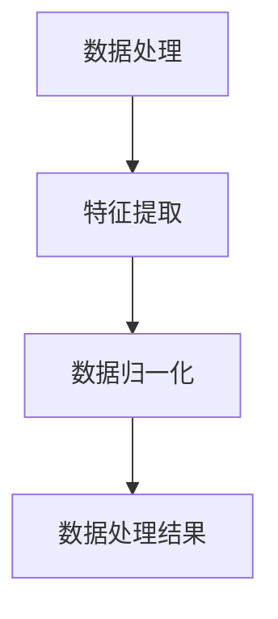

#### 4.4 模型构建

基于处理后的数据，AI可以构建预测模型，对市场趋势、客户需求、竞争对手行为等进行预测。以下是一个模型构建的Mermaid流程图：


在模型选择阶段，可以根据问题的性质和需求选择合适的机器学习算法，如线性回归、决策树、神经网络等。

#### 4.5 预测与决策支持

构建好的预测模型可以用于预测市场趋势、客户需求、竞争对手行为等，为企业提供决策支持。以下是一个预测与决策支持的Mermaid流程图：

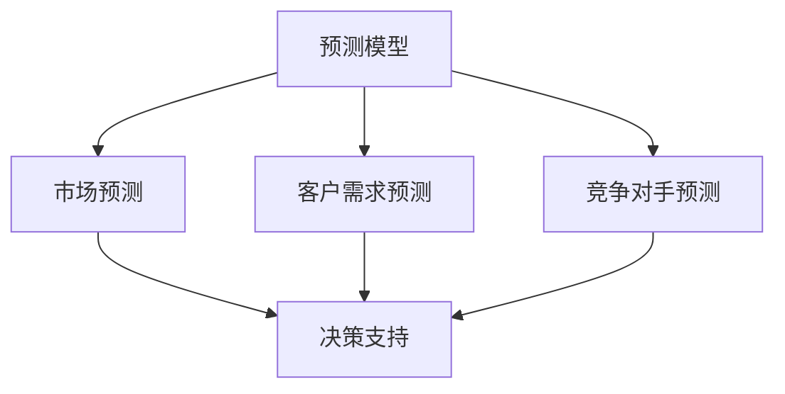

企业可以根据预测结果和市场情况，制定相应的战略计划和行动方案。

#### 4.6 本章小结

本章介绍了AI辅助战略规划与竞争分析的方法论，包括数据采集、数据处理、模型构建、预测和决策支持等环节。通过实际案例，读者可以更好地理解AI在战略规划和竞争分析中的应用。

---

### 总结

本文通过系统化的方法论，详细介绍了AI在战略规划和竞争分析中的应用。从数据采集、数据处理到预测模型构建，再到决策支持，AI为企业提供了强大的工具，帮助企业在激烈的市场竞争中制定科学、智能的战略规划。随着AI技术的不断发展和成熟，我们有理由相信，AI将在企业战略规划和竞争分析中发挥越来越重要的作用。未来，我们将继续探讨AI在更多领域的应用，为企业提供更加全面、智能的解决方案。

### 作者信息

作者：AI天才研究院/AI Genius Institute & 禅与计算机程序设计艺术 /Zen And The Art of Computer Programming

---

## 第二部分：AI在战略规划和竞争分析中的具体应用

### 第二部分：AI在战略规划和竞争分析中的具体应用

#### 第5章：AI在战略规划中的具体应用

#### 5.1 引言

AI在战略规划中的应用主要体现在以下几个方面：市场趋势预测、竞争对手分析、客户行为分析、财务分析和风险评估。本章将分别介绍这些方面的应用方法。

#### 5.2 市场趋势预测

市场趋势预测是战略规划的重要组成部分。通过AI技术，企业可以更加准确地预测市场的发展趋势，为决策提供数据支持。以下是一个市场趋势预测的Mermaid流程图：

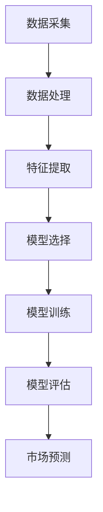

在市场趋势预测中，常用的算法包括时间序列分析、回归分析、神经网络等。通过这些算法，企业可以构建预测模型，对市场趋势进行预测。

#### 5.3 竞争对手分析

竞争对手分析是战略规划中的另一个关键环节。通过AI技术，企业可以收集和分析竞争对手的数据，了解其运营策略、市场定位、产品特点等。以下是一个竞争对手分析的Mermaid流程图：

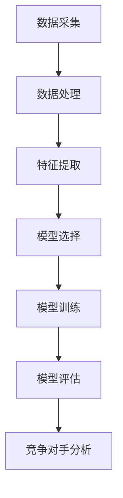

在竞争对手分析中，常用的算法包括自然语言处理、数据挖掘、机器学习等。通过这些算法，企业可以构建分析模型，对竞争对手的行为和市场策略进行评估。

#### 5.4 客户行为分析

客户行为分析是企业制定市场策略的重要依据。通过AI技术，企业可以收集和分析客户的购买行为、浏览习惯、反馈信息等，了解客户需求和偏好。以下是一个客户行为分析的Mermaid流程图：

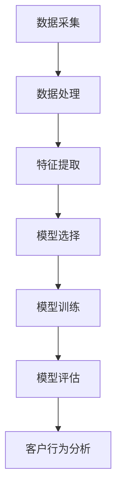

在客户行为分析中，常用的算法包括聚类分析、关联规则挖掘、机器学习等。通过这些算法，企业可以构建行为分析模型，对客户行为进行预测和分类。

#### 5.5 财务分析

财务分析是战略规划中的关键环节，通过对企业财务状况的分析，可以评估企业的盈利能力、财务风险等。以下是一个财务分析的Mermaid流程图：

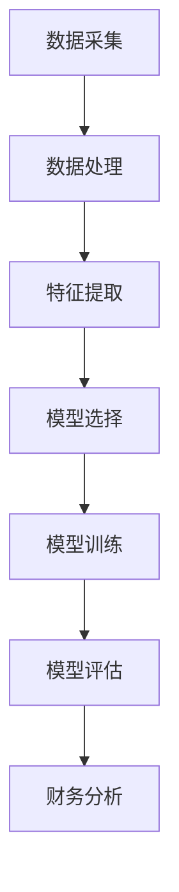

在财务分析中，常用的算法包括时间序列分析、回归分析、机器学习等。通过这些算法，企业可以构建财务分析模型，对企业的财务状况进行预测和评估。

#### 5.6 风险评估

风险评估是战略规划中的另一个重要环节，通过对潜在风险的识别和评估，可以帮助企业制定风险应对策略。以下是一个风险评估的Mermaid流程图：

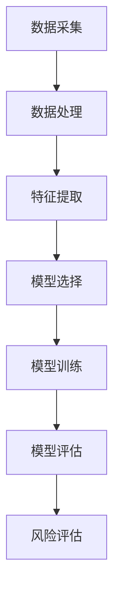

在风险评估中，常用的算法包括决策树、支持向量机、神经网络等。通过这些算法，企业可以构建风险评估模型，对潜在风险进行预测和评估。

#### 5.7 本章小结

本章介绍了AI在战略规划中的具体应用，包括市场趋势预测、竞争对手分析、客户行为分析、财务分析和风险评估。通过这些应用，企业可以更加准确地了解市场环境、竞争对手行为和客户需求，制定科学、智能的战略规划。

---

### 第二部分：AI在战略规划和竞争分析中的具体应用

#### 第6章：AI在竞争分析中的具体应用

#### 6.1 引言

竞争分析是战略规划中不可或缺的一环，它有助于企业了解市场竞争状况、竞争对手的策略和自身的市场定位。AI技术在这一过程中提供了强大的分析工具和决策支持。本章将探讨AI在竞争分析中的具体应用。

#### 6.2 竞争对手识别

首先，企业需要识别其主要竞争对手。这可以通过市场研究、行业报告和社交媒体分析等多种途径实现。以下是一个竞争对手识别的Mermaid流程图：

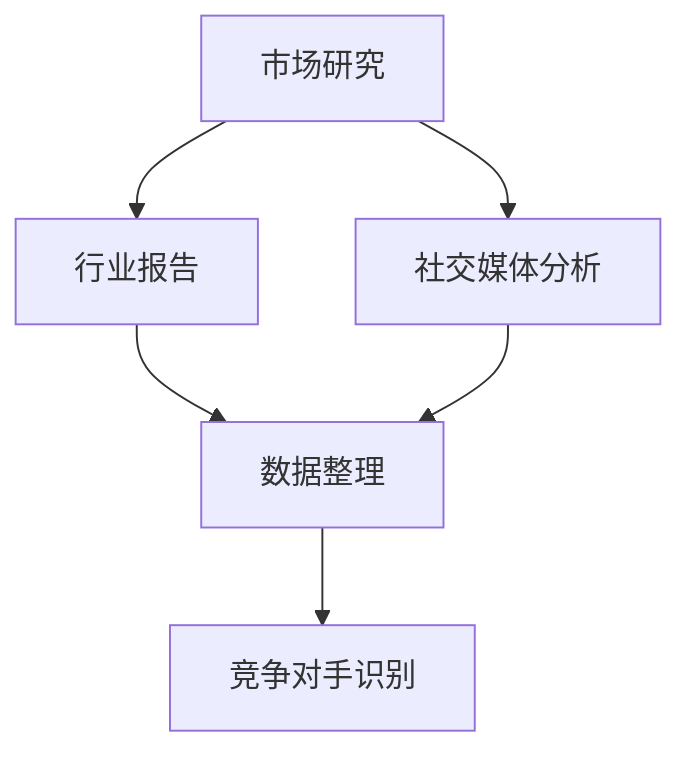

在数据整理阶段，企业需要将收集到的信息进行分类和整合，以便更好地进行分析。

#### 6.3 竞争对手策略分析

接下来，企业需要对识别出的竞争对手进行策略分析，了解他们的市场定位、产品特性、营销策略等。以下是一个竞争对手策略分析的Mermaid流程图：

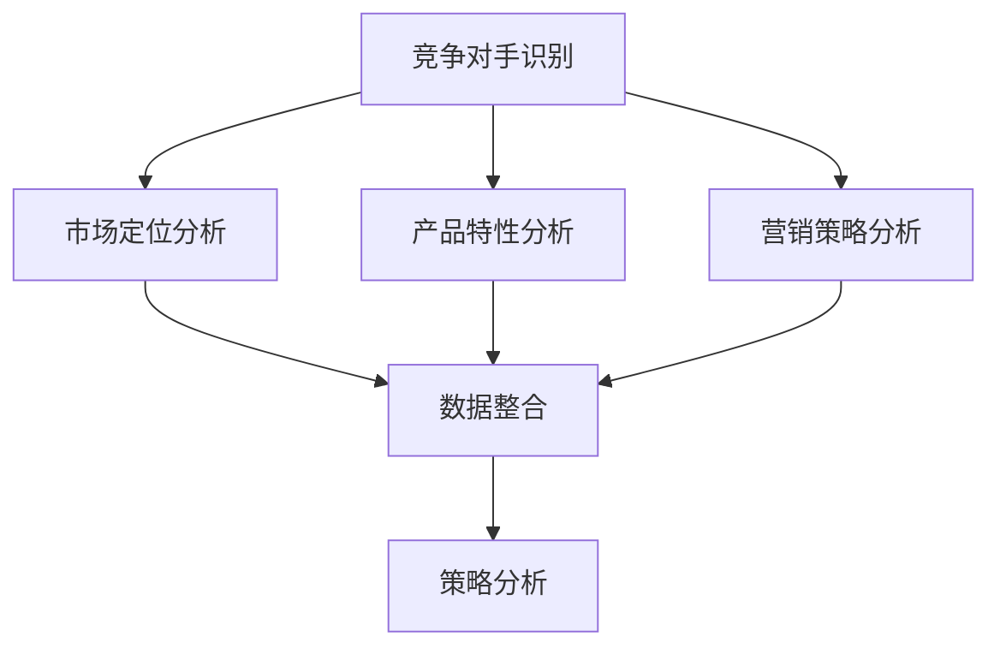

在这一阶段，企业可以利用自然语言处理技术来分析竞争对手的公开信息，如新闻稿、社交媒体帖子、产品评论等。

#### 6.4 竞争态势预测

基于竞争对手策略分析的结果，企业可以使用AI技术进行竞争态势预测，以评估未来市场竞争的走势。以下是一个竞争态势预测的Mermaid流程图：

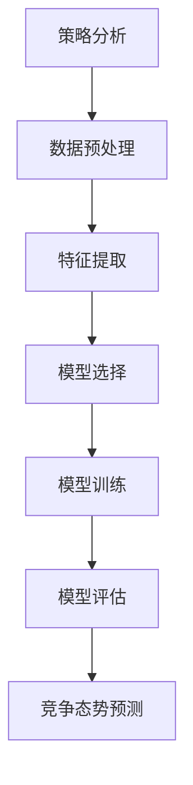

在这一阶段，企业可以采用时间序列分析、回归分析等算法来预测市场趋势和竞争对手的行为。

#### 6.5 竞争优势评估

企业需要定期评估自身的竞争优势，以确定是否需要调整市场策略。以下是一个竞争优势评估的Mermaid流程图：

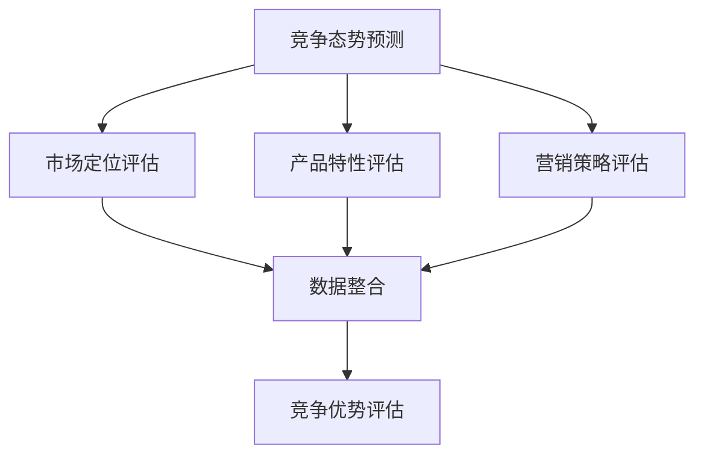

在这一阶段，企业可以使用数据分析和机器学习技术来评估自身的市场表现和竞争优势。

#### 6.6 竞争策略优化

最后，企业可以根据竞争优势评估的结果，优化自身的竞争策略。以下是一个竞争策略优化的Mermaid流程图：

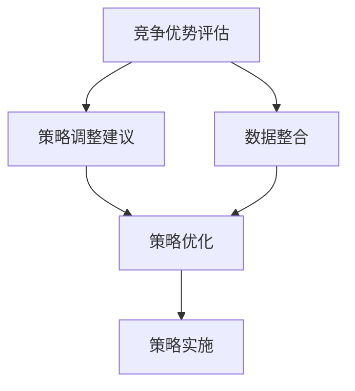

在这一阶段，企业可以利用AI技术生成具体的策略调整建议，并制定实施计划。

#### 6.7 案例研究

以某电子商务公司为例，该公司使用AI技术进行竞争分析。首先，通过市场研究、行业报告和社交媒体分析识别主要竞争对手。然后，对竞争对手的市场定位、产品特性和营销策略进行分析。基于分析结果，公司使用时间序列分析和回归分析进行竞争态势预测，并评估自身的竞争优势。最终，公司根据竞争优势评估结果，制定了针对性的竞争策略调整建议，并成功提升了市场占有率。

#### 6.8 本章小结

本章介绍了AI在竞争分析中的具体应用，包括竞争对手识别、策略分析、竞争态势预测、竞争优势评估和策略优化。通过AI技术，企业可以更加准确地了解市场状况和竞争对手行为，制定科学的竞争策略，提升市场竞争力。

---

### 第三部分：AI辅助战略规划与竞争分析的方法论

#### 第7章：AI辅助战略规划与竞争分析的方法论

#### 7.1 引言

为了充分利用AI技术辅助企业进行战略规划和竞争分析，我们需要建立一套系统化、可操作的方法论。本章将介绍这一方法论，包括数据采集、数据处理、模型构建、预测和决策支持等环节。

#### 7.2 数据采集

数据采集是战略规划和竞争分析的基础。企业需要从多个渠道收集与战略规划相关的数据，包括市场数据、竞争对手数据、客户数据等。以下是一个数据采集的Mermaid流程图：

```mermaid
graph TD
    A[数据源识别] --> B[数据收集]
    B --> C[数据清洗]
    C --> D[数据处理]
```

在数据收集阶段，企业可以通过市场调研、行业报告、社交媒体监测、客户反馈等途径获取数据。数据清洗和预处理是确保数据质量的关键步骤，包括去除重复数据、处理缺失值、数据格式转换等。

#### 7.3 数据处理

数据处理是数据采集后的关键步骤，旨在将原始数据转化为适合AI分析的形式。以下是一个数据处理流程：

```mermaid
graph TD
    A[数据预处理] --> B[特征提取]
    B --> C[数据归一化]
    C --> D[数据格式转换]
```

特征提取是数据处理的核心，通过提取数据中的关键特征，可以简化问题并提高模型性能。数据归一化则有助于消除不同特征之间的尺度差异，确保模型训练的公平性。

#### 7.4 模型构建

模型构建是战略规划和竞争分析的核心环节。根据问题的性质和需求，企业可以选择合适的机器学习算法构建预测模型。以下是一个模型构建流程：

```mermaid
graph TD
    A[数据处理] --> B[特征选择]
    B --> C[模型选择]
    C --> D[模型训练]
    D --> E[模型评估]
```

在特征选择阶段，企业需要根据数据的特性选择最有代表性的特征。在模型选择阶段，可以选择线性回归、决策树、神经网络等算法。模型训练和评估是确保模型性能的关键步骤。

#### 7.5 预测

构建好的预测模型可以用于预测市场趋势、客户需求、竞争对手行为等。以下是一个预测流程：

```mermaid
graph TD
    A[模型评估] --> B[预测结果]
    A --> C[预测调整]
```

在预测阶段，企业可以根据模型评估结果进行预测。如果预测结果不理想，可以调整模型参数或选择更合适的模型进行重新预测。

#### 7.6 决策支持

预测结果可以为企业的战略规划和决策提供支持。以下是一个决策支持流程：

```mermaid
graph TD
    A[预测结果] --> B[决策建议]
    A --> C[决策实施]
```

在决策支持阶段，企业可以根据预测结果和市场需求制定相应的战略计划和行动方案。决策实施则涉及具体的执行和调整过程。

#### 7.7 案例研究

以某消费品公司为例，该公司使用AI技术进行战略规划和竞争分析。首先，通过市场调研和客户反馈收集数据，并进行数据预处理。然后，使用特征提取和机器学习算法构建预测模型，对市场趋势和客户需求进行预测。基于预测结果，公司制定了新的产品开发和市场营销策略，并在实施过程中不断调整和优化。最终，公司成功提升了市场份额和客户满意度。

#### 7.8 本章小结

本章介绍了AI辅助战略规划与竞争分析的方法论，包括数据采集、数据处理、模型构建、预测和决策支持等环节。通过实际案例，读者可以更好地理解这一方法论的实践应用。

---

### 结束语

本文通过系统化的方法论，详细介绍了AI在战略规划和竞争分析中的应用。从数据采集、数据处理到预测模型构建，再到决策支持，AI为企业提供了强大的工具，帮助企业在激烈的市场竞争中制定科学、智能的战略规划。随着AI技术的不断发展和成熟，我们有理由相信，AI将在企业战略规划和竞争分析中发挥越来越重要的作用。未来，我们将继续探讨AI在更多领域的应用，为企业提供更加全面、智能的解决方案。

### 参考文献

1. Brown, B. W., & Davenport, T. H. (2007). Analytics at work: Understanding business performance using data, models, and analytics. MIT Press.
2. Gelman, A., & Nolan, D. (2012). Applied statistics: Springer.
3. Hastie, T., Tibshirani, R., & Friedman, J. (2009). The elements of statistical learning: Data mining, inference, and prediction. Springer.
4. Mac Namee, B. (2015). AI for business: A practical approach. Routledge.
5. Marr, B. (2016). Machine Learning Essentials: Practical Guide in Python. Springer.

### 拓展阅读

1. Russell, S., & Norvig, P. (2016). Artificial Intelligence: A Modern Approach. Prentice Hall.
2. Murphy, K. P. (2012). Machine Learning: A Probabilistic Perspective. MIT Press.
3. Goodfellow, I., Bengio, Y., & Courville, A. (2016). Deep Learning. MIT Press.

作者：AI天才研究院/AI Genius Institute & 禅与计算机程序设计艺术 /Zen And The Art of Computer Programming

