                 

## AI辅助企业财务分析：异常检测与智能财务预测

### 关键词：

- AI
- 财务分析
- 异常检测
- 智能预测
- 企业决策支持

### 摘要：

本文深入探讨了人工智能（AI）在企业财务分析中的应用，重点介绍了异常检测和智能财务预测两种方法。通过详细解析AI辅助财务分析的核心原理、方法及其应用，本文旨在为企业提供一种高效、精准的财务决策支持工具，帮助企业在快速变化的市场环境中保持竞争优势。

---

### 目录大纲

```markdown
# AI辅助企业财务分析：异常检测与智能财务预测

## 第一部分：背景与核心概念

### 第1章：企业财务分析的重要性与挑战

#### 1.1 引言

#### 1.2 企业财务分析的意义

#### 1.3 企业财务分析面临的主要挑战

#### 1.4 AI辅助财务分析的优势

### 第2章：AI辅助财务分析的基本原理

#### 2.1 人工智能概述

#### 2.2 数据分析与机器学习基础

#### 2.3 AI在财务分析中的应用

#### 2.4 AI辅助财务分析的发展趋势

## 第二部分：异常检测方法与应用

### 第3章：异常检测的基础知识

#### 3.1 异常检测的概念与分类

#### 3.2 异常检测的数据预处理

#### 3.3 异常检测的算法原理

#### 3.4 异常检测在财务分析中的应用场景

### 第4章：常见异常检测算法及应用

#### 4.1 单变量异常检测算法

#### 4.2 多变量异常检测算法

#### 4.3 纯量异常检测算法

#### 4.4 异常检测算法的比较与分析

### 第5章：异常检测实战案例

#### 5.1 案例一：销售收入异常检测

#### 5.2 案例二：成本异常检测

#### 5.3 案例三：现金流异常检测

#### 5.4 案例总结与反思

## 第三部分：智能财务预测方法与实践

### 第6章：财务预测的基本原理与方法

#### 6.1 财务预测的重要性

#### 6.2 常见财务预测方法

#### 6.3 财务预测的数据来源

#### 6.4 财务预测模型的评估与优化

### 第7章：智能财务预测算法及应用

#### 7.1 时间序列预测算法

#### 7.2 回归分析预测方法

#### 7.3 集成学习方法在财务预测中的应用

#### 7.4 深度学习在财务预测中的前沿应用

### 第8章：智能财务预测实战案例

#### 8.1 案例一：利润预测

#### 8.2 案例二：现金流预测

#### 8.3 案例三：市场份额预测

#### 8.4 案例总结与反思

## 第四部分：综合应用与展望

### 第9章：AI辅助财务分析的综合应用

#### 9.1 AI辅助财务分析在企业经营决策中的应用

#### 9.2 AI辅助财务分析在风险管理中的应用

#### 9.3 AI辅助财务分析在财务规划与预算中的应用

#### 9.4 AI辅助财务分析在企业创新与转型中的应用

### 第10章：AI辅助财务分析的未来展望

#### 10.1 AI辅助财务分析的发展趋势

#### 10.2 AI辅助财务分析面临的技术挑战

#### 10.3 AI辅助财务分析的未来应用前景

#### 10.4 结论与展望
```

### 目录大纲总字数：约570字

---

接下来，我们将深入探讨每一章的核心内容，逐步构建出完整的文章结构。在每一章节中，我们将详细阐述核心概念、原理和实际应用案例，确保文章内容既有深度又有实践价值。现在，我们开始第一部分的探讨。

---

## 第一部分：背景与核心概念

### 第1章：企业财务分析的重要性与挑战

#### 1.1 引言

在现代商业环境中，企业财务分析是企业战略决策和运营管理的重要基石。它不仅关系到企业的盈利能力，还直接影响到企业的风险管理和可持续发展。然而，随着企业业务规模的扩大和数据量的增加，传统的手工财务分析方法已无法满足快速变化的市场需求。

#### 1.2 企业财务分析的意义

企业财务分析的主要目的是通过财务数据的收集、处理和分析，为企业决策提供科学、准确的依据。具体来说，它有助于以下方面：

- **预测企业未来财务状况**：通过分析历史数据，企业可以预测未来的收入、成本、利润等关键财务指标，为制定战略计划提供数据支持。
- **优化资源配置**：财务分析可以帮助企业了解各项资源的利用效率，从而优化资源配置，提高企业运营效益。
- **风险控制**：通过识别潜在的风险因素，企业可以采取预防措施，降低财务风险。

#### 1.3 企业财务分析面临的主要挑战

尽管企业财务分析具有重要意义，但当前企业财务分析仍面临诸多挑战：

- **数据量大**：随着企业业务的发展，财务数据量呈指数级增长，传统的手工分析方法在处理海量数据时效率低下。
- **数据质量问题**：财务数据来源多样，可能存在不准确、不完整等问题，影响分析结果的准确性。
- **分析方法单一**：传统财务分析主要依赖于手工计算和简单的统计方法，难以应对复杂多变的市场环境。
- **决策时效性**：在快节奏的市场中，决策者需要实时获取和分析财务数据，但传统的财务分析方法无法满足这一需求。

#### 1.4 AI辅助财务分析的优势

为了克服上述挑战，人工智能（AI）技术在企业财务分析中得到了广泛应用。AI辅助财务分析具有以下优势：

- **处理海量数据**：AI技术能够高效处理和分析海量数据，提高财务分析的速度和准确性。
- **智能数据挖掘**：AI可以通过机器学习和数据挖掘技术，从大量数据中提取有价值的信息，帮助企业发现潜在的商业机会。
- **自适应学习**：AI系统可以根据历史数据和实时数据不断优化自身模型，提高预测精度。
- **实时决策支持**：AI技术能够实时分析财务数据，为决策者提供即时的决策支持。

#### 总结

通过AI辅助财务分析，企业可以更加精准地预测财务状况，优化资源配置，控制风险，从而在竞争激烈的市场环境中保持优势。在接下来的章节中，我们将深入探讨AI辅助财务分析的基本原理和应用方法。

---

**本节内容概述**：本章节介绍了企业财务分析的重要性及其面临的挑战，并阐述了AI辅助财务分析的优势。在下一章中，我们将深入探讨AI辅助财务分析的基本原理和核心概念。**【继续】**## 第一部分：背景与核心概念

### 第2章：AI辅助财务分析的基本原理

#### 2.1 人工智能概述

人工智能（AI）是指使计算机具备人类智能的能力，包括学习、推理、感知、理解和决策等。AI技术主要包括机器学习（ML）、深度学习（DL）、自然语言处理（NLP）等。在AI辅助财务分析中，机器学习和深度学习技术扮演着核心角色。

#### 2.2 数据分析与机器学习基础

数据分析是AI辅助财务分析的基础。它包括数据收集、数据预处理、数据分析和数据可视化等步骤。机器学习是一种通过数据训练模型，从而进行预测和决策的技术。常见的机器学习算法包括线性回归、决策树、随机森林、支持向量机等。

#### 2.3 AI在财务分析中的应用

AI在财务分析中的应用广泛，主要包括：

- **财务预测**：通过历史财务数据预测未来财务状况，如收入、成本、利润等。
- **异常检测**：识别财务数据中的异常值，及时发现潜在风险。
- **风险评估**：利用AI技术评估企业面临的各种财务风险，如市场风险、信用风险等。
- **财务报表分析**：自动生成和解读财务报表，提供决策支持。

#### 2.4 AI辅助财务分析的发展趋势

随着技术的进步，AI辅助财务分析的发展趋势包括：

- **深度学习应用**：深度学习在图像处理、语音识别等领域的成功，为其在财务分析中的应用提供了可能性。
- **智能财务系统**：结合AI技术的智能财务系统将为企业提供更加智能化、自动化的财务分析服务。
- **区块链技术结合**：区块链技术可以提高财务数据的透明度和安全性，与AI结合将进一步优化财务分析。
- **多领域融合**：AI与其他领域（如物联网、大数据等）的融合，将推动财务分析技术的不断创新。

#### 总结

AI辅助财务分析通过引入先进的机器学习和深度学习技术，为企业提供了高效、精准的财务分析工具。随着技术的不断进步，AI辅助财务分析的应用领域将更加广泛，为企业决策提供更加全面的支持。在接下来的章节中，我们将详细探讨异常检测方法及其在财务分析中的应用。

---

**本节内容概述**：本章节介绍了AI辅助财务分析的基本原理，包括人工智能概述、数据分析和机器学习基础，以及AI在财务分析中的应用和发展趋势。在下一章中，我们将深入探讨异常检测的基础知识和应用方法。**【继续】**## 第二部分：异常检测方法与应用

### 第3章：异常检测的基础知识

#### 3.1 异常检测的概念与分类

异常检测（Anomaly Detection）是一种用于识别数据集中异常或异常模式的方法。在财务分析中，异常检测可以帮助企业发现数据中的异常值，如不正常的交易、异常的利润波动等，从而及时采取措施。

异常检测可以根据不同的标准进行分类：

- **基于统计的异常检测**：通过计算数据与均值、中位数等统计指标的差异来识别异常。
- **基于规则的异常检测**：通过设定一系列规则来判断数据是否异常，如基于阈值的规则。
- **基于聚类算法的异常检测**：通过聚类算法将数据划分为不同的簇，然后识别离群点。
- **基于神经网络和深度学习的异常检测**：利用神经网络和深度学习模型对数据进行训练，从而识别异常模式。

#### 3.2 异常检测的数据预处理

在进行异常检测之前，通常需要对数据进行预处理，以提高检测的准确性和效率。数据预处理包括以下步骤：

- **数据清洗**：去除重复数据、处理缺失值、纠正错误数据等。
- **特征工程**：选择与异常检测相关的特征，进行特征转换和特征选择。
- **数据标准化**：通过标准化方法将不同量级的特征转换为统一的量级，如归一化、标准化等。

#### 3.3 异常检测的算法原理

常见的异常检测算法包括以下几种：

- **孤立森林（Isolation Forest）**：通过随机选择特征和切分值来隔离异常点，适用于高维数据。
- **K-均值聚类（K-Means Clustering）**：通过聚类算法将数据分为K个簇，然后识别离群点。
- **局部异常因子（Local Outlier Factor, LOF）**：通过计算局部异常度来识别异常点。
- **Autoencoder**：一种神经网络模型，用于学习数据的分布，然后通过重构误差来识别异常点。

#### 3.4 异常检测在财务分析中的应用场景

异常检测在财务分析中的应用场景广泛，包括：

- **财务报表异常检测**：通过异常检测技术，识别财务报表中的异常数据，如不合理的利润波动、不正常的交易记录等。
- **现金流异常检测**：实时监控企业的现金流状况，发现异常的现金流波动，确保企业运营的稳定性。
- **收入和成本异常检测**：通过检测收入和成本的异常变化，帮助企业识别潜在的业务风险和成本控制问题。

#### 总结

异常检测是AI辅助财务分析的重要组成部分，通过识别数据中的异常值，帮助企业发现潜在的风险和问题。在下一章中，我们将详细介绍常见的异常检测算法及其应用。

---

**本节内容概述**：本章节介绍了异常检测的基础知识，包括概念、分类、数据预处理和算法原理。在下一章中，我们将探讨常见的异常检测算法及其应用。**【继续】**## 第二部分：异常检测方法与应用

### 第4章：常见异常检测算法及应用

#### 4.1 单变量异常检测算法

单变量异常检测算法主要关注单个变量的异常情况。以下是一些常见的单变量异常检测算法：

- **标准差法（Standard Deviation Method）**：
  - **原理**：通过计算数据的均值和标准差，识别远离均值的异常值。
  - **公式**：\[ Z\_score = \frac{X - \bar{X}}{\sigma} \]
  - **应用**：适用于单个变量异常检测，如检测银行账户中的异常交易。
  
- **箱线图法（Box Plot Method）**：
  - **原理**：通过绘制箱线图，识别位于箱线图之外的数据点。
  - **应用**：适用于识别数据分布中的异常值，如财务报表中的异常数据。

- **孤立森林法（Isolation Forest）**：
  - **原理**：通过随机选择特征和切分值来隔离异常点。
  - **应用**：适用于高维数据集的异常检测，如交易数据的异常检测。

#### 4.2 多变量异常检测算法

多变量异常检测算法同时考虑多个变量之间的关系，以下是一些常见算法：

- **基于聚类的异常检测算法**：
  - **K-均值聚类（K-Means Clustering）**：
    - **原理**：通过将数据分为K个簇，识别离群点。
    - **应用**：适用于识别多维数据集中的离群点，如财务报表中的异常数据。
  
  - **层次聚类（Hierarchical Clustering）**：
    - **原理**：通过逐步合并或分解数据点，构建聚类层次。
    - **应用**：适用于复杂多维数据集的聚类和异常检测。

- **基于密度估计的异常检测算法**：
  - **局部异常因子（Local Outlier Factor, LOF）**：
    - **原理**：通过计算局部异常度来识别异常点。
    - **应用**：适用于识别多维数据中的异常点，如财务数据的异常检测。

- **基于神经网络和深度学习的异常检测算法**：
  - **Autoencoder**：
    - **原理**：通过神经网络学习数据的分布，然后通过重构误差识别异常点。
    - **应用**：适用于复杂和高维数据集的异常检测，如股票市场数据的异常检测。

#### 4.3 纯量异常检测算法

纯量异常检测算法主要用于处理单个数值的异常检测，以下是一些常见算法：

- **基于阈值的异常检测算法**：
  - **静态阈值法（Static Threshold Method）**：
    - **原理**：通过设定一个固定阈值，识别超过阈值的异常值。
    - **应用**：适用于识别固定阈值范围内的异常值，如电力消耗的异常检测。

- **动态阈值法（Dynamic Threshold Method）**：
  - **原理**：通过实时计算阈值，识别异常值。
  - **应用**：适用于实时监控和检测异常值，如监控网络流量。

#### 4.4 异常检测算法的比较与分析

在财务分析中，选择合适的异常检测算法需要考虑多个因素，如数据规模、数据维度、异常类型等。以下是对几种常见异常检测算法的比较：

- **准确性与鲁棒性**：
  - **标准差法和箱线图法**：相对简单，但可能对噪声敏感。
  - **孤立森林法和基于聚类的算法**：在处理高维数据和噪声数据方面更鲁棒。
  - **基于神经网络和深度学习的算法**：具有较好的自适应性和预测能力，但计算复杂度高。

- **计算效率**：
  - **标准差法和箱线图法**：计算效率高，适合实时应用。
  - **孤立森林法和基于聚类的算法**：计算复杂度较高，适合批量处理。

- **适用场景**：
  - **标准差法和箱线图法**：适用于单变量数据的异常检测。
  - **孤立森林法和基于聚类的算法**：适用于多变量数据的异常检测。
  - **基于神经网络和深度学习的算法**：适用于复杂和高维数据的异常检测。

#### 总结

异常检测算法在财务分析中具有重要作用，通过选择合适的算法，企业可以及时发现财务数据中的异常，从而有效控制风险。在下一章中，我们将通过实际案例展示如何应用这些异常检测算法。

---

**本节内容概述**：本章节介绍了单变量、多变量和纯量异常检测算法，并对这些算法进行了比较和分析。在下一章中，我们将通过实际案例展示异常检测的应用。**【继续】**## 第二部分：异常检测方法与应用

### 第5章：异常检测实战案例

#### 5.1 案例一：销售收入异常检测

**背景**：某大型零售企业希望对其销售数据中的异常值进行检测，以便及时调整营销策略和控制风险。

**数据集**：企业每日的销售收入数据，包括销售额、产品类别、销售区域等。

**数据处理**：首先对数据集进行清洗，去除缺失值和重复记录。然后进行特征工程，将销售额按产品类别和销售区域进行分类，创建新的特征。

**算法选择**：采用孤立森林算法进行异常检测。

**实现步骤**：

1. **数据预处理**：
   - 数据清洗：去除缺失值和重复记录。
   - 特征工程：将销售额按产品类别和销售区域进行分类。

2. **训练孤立森林模型**：
   - 将数据集分为训练集和测试集。
   - 使用训练集训练孤立森林模型。

3. **异常检测**：
   - 使用训练好的模型对测试集进行预测。
   - 计算测试集中每个样本的异常度。

**结果分析**：通过孤立森林算法，发现几个销售额异常高的区域，进一步调查后发现这些区域存在促销活动，导致销售额异常。企业及时调整了促销策略，降低了风险。

#### 5.2 案例二：成本异常检测

**背景**：某制造企业希望对其生产成本数据中的异常值进行检测，以优化成本控制和提高生产效率。

**数据集**：企业每日的生产成本数据，包括原材料成本、人工成本、制造费用等。

**数据处理**：首先对数据集进行清洗，去除缺失值和重复记录。然后进行特征工程，将成本按生产部门进行分类。

**算法选择**：采用局部异常因子（LOF）算法进行异常检测。

**实现步骤**：

1. **数据预处理**：
   - 数据清洗：去除缺失值和重复记录。
   - 特征工程：将成本按生产部门进行分类。

2. **训练LOF模型**：
   - 将数据集分为训练集和测试集。
   - 使用训练集训练LOF模型。

3. **异常检测**：
   - 使用训练好的模型对测试集进行预测。
   - 计算测试集中每个样本的局部异常度。

**结果分析**：通过LOF算法，发现几个生产部门的成本异常高，进一步调查后发现这些部门存在生产故障，导致成本上升。企业及时采取了维修和生产调整措施，降低了成本。

#### 5.3 案例三：现金流异常检测

**背景**：某金融服务公司希望对其现金流数据中的异常值进行检测，以监控风险和控制现金流波动。

**数据集**：公司每日的现金流数据，包括收入、支出、净现金流等。

**数据处理**：首先对数据集进行清洗，去除缺失值和重复记录。然后进行特征工程，将现金流数据按时间序列进行分类。

**算法选择**：采用时间序列分析结合孤立森林算法进行异常检测。

**实现步骤**：

1. **数据预处理**：
   - 数据清洗：去除缺失值和重复记录。
   - 特征工程：将现金流数据按时间序列进行分类。

2. **时间序列分析**：
   - 使用移动平均法、指数平滑法等对时间序列进行平滑处理。

3. **训练孤立森林模型**：
   - 将数据集分为训练集和测试集。
   - 使用训练集训练孤立森林模型。

4. **异常检测**：
   - 使用训练好的孤立森林模型对测试集进行预测。
   - 结合时间序列分析，识别异常点。

**结果分析**：通过时间序列分析结合孤立森林算法，发现某段时间内的现金流异常波动，进一步调查发现是因为某大型客户的付款延迟导致的。公司及时与客户沟通，优化了收款流程，控制了现金流风险。

#### 5.4 案例总结与反思

通过上述案例，可以看出异常检测技术在企业财务分析中的应用具有重要意义。在实际应用中，需要根据具体业务场景和数据特点选择合适的异常检测算法，并注意以下事项：

- **数据质量**：异常检测的准确性很大程度上取决于数据质量，因此数据清洗和预处理是关键步骤。
- **算法选择**：不同算法适用于不同类型的异常检测任务，需要根据业务需求选择合适的算法。
- **模型调优**：通过不断优化模型参数，提高异常检测的准确性和鲁棒性。
- **实时监控**：异常检测系统应具备实时监控能力，及时识别和处理异常情况。

#### 总结

异常检测作为AI辅助财务分析的重要工具，通过实际案例展示了其在企业财务分析中的应用效果。在接下来的章节中，我们将进一步探讨智能财务预测的方法和应用。

---

**本节内容概述**：本章节通过三个实际案例，展示了异常检测技术在销售收入、成本和现金流异常检测中的应用。在下一章中，我们将讨论智能财务预测的方法和实践。**【继续】**## 第三部分：智能财务预测方法与实践

### 第6章：财务预测的基本原理与方法

#### 6.1 财务预测的重要性

财务预测是企业制定战略规划、优化资源配置、控制风险的重要工具。通过准确预测未来的财务状况，企业可以：

- **优化运营策略**：根据财务预测结果，企业可以调整生产规模、产品组合等，以适应市场需求。
- **制定预算计划**：财务预测有助于企业制定合理的预算计划，确保资源分配的合理性和效率。
- **风险管理**：财务预测可以帮助企业识别潜在的风险，并采取预防措施。

#### 6.2 常见财务预测方法

财务预测的方法主要包括以下几种：

- **定性预测方法**：
  - **专家判断法**：通过专家的经验和知识进行预测，适用于数据不足或难以量化的情况。
  - **历史趋势法**：基于历史数据，通过趋势分析预测未来的财务状况。

- **定量预测方法**：
  - **时间序列预测**：利用时间序列模型，如移动平均、指数平滑等，预测未来的财务数据。
  - **回归分析预测**：通过建立回归模型，分析财务指标与其他变量之间的关系，预测未来的财务状况。
  - **机器学习预测**：利用机器学习算法，如线性回归、决策树、支持向量机等，建立预测模型。

#### 6.3 财务预测的数据来源

财务预测的数据来源主要包括：

- **内部数据**：企业历史财务数据、销售数据、成本数据等，这些数据有助于分析企业的运营情况和财务趋势。
- **外部数据**：市场趋势数据、行业数据、宏观经济数据等，这些数据可以为财务预测提供外部环境的信息。

#### 6.4 财务预测模型的评估与优化

财务预测模型的评估与优化是确保预测准确性的关键。常见的评估方法包括：

- **预测误差评估**：通过计算预测值与实际值的误差，评估模型的预测能力。
- **交叉验证**：将数据集分为训练集和验证集，使用训练集训练模型，在验证集上进行评估。
- **模型优化**：通过调整模型参数、特征选择等方法，提高模型的预测准确性。

#### 总结

财务预测是企业战略决策的重要支撑，通过定量和定性的方法，结合内外部数据，可以准确预测未来的财务状况。在下一章中，我们将详细介绍智能财务预测算法及其应用。

---

**本节内容概述**：本章节介绍了财务预测的重要性、常见方法、数据来源以及模型评估与优化。在下一章中，我们将探讨智能财务预测的算法和应用。**【继续】**## 第三部分：智能财务预测方法与实践

### 第7章：智能财务预测算法及应用

#### 7.1 时间序列预测算法

时间序列预测算法是财务预测中广泛应用的一类方法，其主要目的是通过分析时间序列数据来预测未来的数值。以下是一些常见的时间序列预测算法：

- **移动平均法（Moving Average, MA）**：
  - **原理**：通过计算最近一段时间的平均值来预测未来的值。
  - **公式**：\[ \hat{y}_t = \frac{1}{n}\sum_{i=t-n+1}^{t}y_i \]
  - **应用**：适用于平稳时间序列数据的预测。

- **指数平滑法（Exponential Smoothing, ES）**：
  - **原理**：通过给予不同时间段的数据不同的权重来预测未来的值。
  - **公式**：\[ \hat{y}_t = \alpha y_t + (1 - \alpha) \hat{y}_{t-1} \]
  - **应用**：适用于非平稳时间序列数据的预测。

- **自回归积分滑动平均模型（Autoregressive Integrated Moving Average, ARIMA）**：
  - **原理**：通过分析时间序列的线性动态关系来进行预测。
  - **公式**：\[ \hat{y}_t = c + \phi_1 y_{t-1} + \phi_2 y_{t-2} + ... + \phi_p y_{t-p} + \theta_1 \epsilon_{t-1} + \theta_2 \epsilon_{t-2} + ... + \theta_q \epsilon_{t-q} \]
  - **应用**：适用于具有季节性和趋势性的时间序列数据的预测。

- **季节性分解与预测**：
  - **原理**：将时间序列分解为趋势、季节性和随机性成分，分别进行预测。
  - **应用**：适用于具有明显季节性特征的时间序列数据的预测。

#### 7.2 回归分析预测方法

回归分析是另一种常用的财务预测方法，通过分析自变量和因变量之间的关系来预测未来的数值。以下是一些常见的回归分析方法：

- **简单线性回归（Simple Linear Regression）**：
  - **原理**：通过一条直线拟合因变量和自变量之间的关系。
  - **公式**：\[ \hat{y} = \beta_0 + \beta_1 x \]
  - **应用**：适用于只有一个自变量和因变量呈线性关系的情况。

- **多元线性回归（Multiple Linear Regression）**：
  - **原理**：通过多条直线拟合多个自变量和因变量之间的关系。
  - **公式**：\[ \hat{y} = \beta_0 + \beta_1 x_1 + \beta_2 x_2 + ... + \beta_p x_p \]
  - **应用**：适用于多个自变量和因变量之间呈线性关系的情况。

- **非线性回归**：
  - **原理**：通过非线性函数拟合自变量和因变量之间的关系。
  - **公式**：\[ \hat{y} = \beta_0 + \beta_1 f(x) + ... + \beta_p f(x_p) \]
  - **应用**：适用于自变量和因变量之间关系复杂、非线性明显的情况。

#### 7.3 集成学习方法在财务预测中的应用

集成学习方法通过组合多个基学习器的预测结果来提高预测准确性。以下是一些常见的集成学习方法：

- **随机森林（Random Forest）**：
  - **原理**：通过构建多个决策树，并合并它们的预测结果。
  - **公式**：\[ \hat{y} = \frac{1}{N} \sum_{i=1}^{N} f_i(x) \]
  - **应用**：适用于处理高维数据和复杂关系的数据。

- **梯度提升机（Gradient Boosting Machine, GBM）**：
  - **原理**：通过迭代优化每个基学习器的权重，逐步提高模型的预测能力。
  - **公式**：\[ \hat{y} = \alpha + \sum_{i=1}^{n} \eta_i h_i(x) \]
  - **应用**：适用于处理大规模数据和提高预测精度。

- **集成深度学习（Ensemble Deep Learning）**：
  - **原理**：通过构建多个深度学习模型，并合并它们的预测结果。
  - **应用**：适用于处理高维数据和复杂关系的数据。

#### 7.4 深度学习在财务预测中的前沿应用

深度学习在财务预测中的应用日益广泛，其通过自动提取数据特征，提高了预测的准确性和效率。以下是一些深度学习在财务预测中的应用：

- **卷积神经网络（Convolutional Neural Network, CNN）**：
  - **原理**：通过卷积层提取空间特征，适用于处理图像和序列数据。
  - **应用**：适用于处理时间序列数据和图像数据的预测。

- **递归神经网络（Recurrent Neural Network, RNN）**：
  - **原理**：通过循环结构处理时间序列数据，适用于处理序列数据。
  - **应用**：适用于时间序列数据的预测。

- **长短时记忆网络（Long Short-Term Memory, LSTM）**：
  - **原理**：通过记忆单元解决RNN中的梯度消失问题，适用于处理长时间序列数据。
  - **应用**：适用于处理具有长期依赖性的时间序列数据。

- **Transformer模型**：
  - **原理**：通过自注意力机制处理序列数据，适用于处理大规模和复杂的序列数据。
  - **应用**：适用于处理高维数据和复杂关系的预测任务。

#### 总结

智能财务预测算法通过结合时间序列预测、回归分析、集成学习和深度学习等方法，提高了财务预测的准确性。在下一章中，我们将通过实际案例展示智能财务预测的应用。

---

**本节内容概述**：本章节介绍了时间序列预测、回归分析、集成学习和深度学习等智能财务预测算法，并探讨了它们在财务预测中的应用。在下一章中，我们将通过实际案例展示智能财务预测的应用效果。**【继续】**## 第三部分：智能财务预测方法与实践

### 第8章：智能财务预测实战案例

#### 8.1 案例一：利润预测

**背景**：某制造业公司希望利用智能财务预测技术对其未来的利润进行预测，以制定合理的业务规划和资源分配策略。

**数据集**：公司过去的年度利润数据、销售数据、成本数据以及宏观经济指标数据。

**数据处理**：首先对数据集进行清洗，处理缺失值和异常值。然后进行特征工程，提取与利润相关的特征，如销售额、生产成本、宏观经济指标等。

**算法选择**：采用LSTM（长短时记忆网络）进行利润预测。

**实现步骤**：

1. **数据预处理**：
   - 数据清洗：去除缺失值和异常值。
   - 特征工程：提取与利润相关的特征，进行归一化处理。

2. **数据分割**：
   - 将数据集分为训练集和测试集。

3. **模型训练**：
   - 使用训练集训练LSTM模型。
   - 调整模型参数，如学习率、批量大小等。

4. **预测**：
   - 使用训练好的模型对测试集进行利润预测。
   - 计算预测值与实际值的误差。

**结果分析**：通过LSTM模型，该公司能够较为准确地预测未来的利润变化，从而为业务规划和资源分配提供了有力的支持。预测结果显示，公司将在未来几个月内实现利润增长，促使公司加大了市场推广力度。

#### 8.2 案例二：现金流预测

**背景**：某金融机构希望利用智能财务预测技术对其未来的现金流进行预测，以优化资金管理和降低风险。

**数据集**：该金融机构的历史现金流数据、贷款数据、投资收益数据以及宏观经济指标数据。

**数据处理**：首先对数据集进行清洗，处理缺失值和异常值。然后进行特征工程，提取与现金流相关的特征，如贷款金额、投资收益、利率等。

**算法选择**：采用Transformer模型进行现金流预测。

**实现步骤**：

1. **数据预处理**：
   - 数据清洗：去除缺失值和异常值。
   - 特征工程：提取与现金流相关的特征，进行归一化处理。

2. **数据分割**：
   - 将数据集分为训练集和测试集。

3. **模型训练**：
   - 使用训练集训练Transformer模型。
   - 调整模型参数，如注意力机制、隐藏层大小等。

4. **预测**：
   - 使用训练好的模型对测试集进行现金流预测。
   - 计算预测值与实际值的误差。

**结果分析**：通过Transformer模型，该金融机构能够较为准确地预测未来的现金流变化，从而为资金管理和风险控制提供了有力的支持。预测结果显示，未来几个月内该金融机构的现金流将保持稳定增长，促使机构调整了资金配置策略，优化了流动性管理。

#### 8.3 案例三：市场份额预测

**背景**：某消费电子公司希望利用智能财务预测技术对其未来的市场份额进行预测，以制定市场推广策略和产品规划。

**数据集**：公司过去的市场份额数据、销售额数据、竞争对手的市场份额数据以及消费者行为数据。

**数据处理**：首先对数据集进行清洗，处理缺失值和异常值。然后进行特征工程，提取与市场份额相关的特征，如销售额、竞争对手的市场份额、消费者满意度等。

**算法选择**：采用随机森林（Random Forest）进行市场份额预测。

**实现步骤**：

1. **数据预处理**：
   - 数据清洗：去除缺失值和异常值。
   - 特征工程：提取与市场份额相关的特征，进行归一化处理。

2. **数据分割**：
   - 将数据集分为训练集和测试集。

3. **模型训练**：
   - 使用训练集训练随机森林模型。
   - 调整模型参数，如树的数量、最大深度等。

4. **预测**：
   - 使用训练好的模型对测试集进行市场份额预测。
   - 计算预测值与实际值的误差。

**结果分析**：通过随机森林模型，该消费电子公司能够较为准确地预测未来的市场份额变化，从而为市场推广策略和产品规划提供了有力的支持。预测结果显示，未来几个月内公司的市场份额将稳步增长，促使公司加大了市场推广力度，优化了产品组合。

#### 8.4 案例总结与反思

通过上述案例，我们可以看到智能财务预测技术在实际应用中的效果。在实际操作中，需要注意以下几点：

- **数据质量**：保证数据质量是预测准确性的基础，需要处理缺失值、异常值等。
- **特征选择**：选择与预测目标相关性强的特征，可以提高预测的准确性。
- **模型选择**：根据数据的特点和预测目标选择合适的模型，如时间序列数据适合使用LSTM，多元数据适合使用随机森林。
- **模型调优**：通过调整模型参数，可以提高预测的准确性。

智能财务预测作为一种先进的技术手段，为企业提供了精准的财务预测能力，有助于企业制定更科学的决策，提高市场竞争力。

#### 总结

本章节通过三个实际案例，展示了智能财务预测技术在利润预测、现金流预测和市场份额预测中的应用效果。在下一章中，我们将探讨智能财务预测的综合应用。

---

**本节内容概述**：本章节通过三个实际案例，展示了智能财务预测技术在利润预测、现金流预测和市场份额预测中的应用效果。在下一章中，我们将探讨智能财务预测的综合应用。**【继续】**## 第四部分：综合应用与展望

### 第9章：AI辅助财务分析的综合应用

#### 9.1 AI辅助财务分析在企业经营决策中的应用

AI辅助财务分析为企业提供了高效、精准的财务数据支持，有助于企业做出更加明智的经营决策。具体应用包括：

- **财务预测**：通过AI技术对未来的收入、成本、利润等进行预测，为企业制定战略规划提供数据支持。
- **成本控制**：通过分析历史数据，AI可以帮助企业识别成本控制的关键点，优化资源配置，降低运营成本。
- **风险评估**：AI可以实时监控企业财务状况，识别潜在的风险因素，为企业提供风险预警和应对策略。
- **预算管理**：AI技术可以帮助企业自动生成和优化预算，提高预算编制的准确性和效率。

#### 9.2 AI辅助财务分析在风险管理中的应用

风险管理是企业经营过程中不可忽视的一环。AI辅助财务分析在风险管理中的应用主要包括：

- **信用风险评估**：通过分析客户的财务状况、历史交易数据等，AI可以帮助企业评估客户的信用风险，降低坏账率。
- **市场风险预测**：AI可以通过对市场数据的分析，预测市场波动对企业财务状况的影响，为企业制定风险应对策略。
- **操作风险监控**：AI可以实时监控企业的财务操作，识别潜在的违规行为，提高企业合规性。

#### 9.3 AI辅助财务分析在财务规划与预算中的应用

财务规划与预算是企业运营的重要环节。AI辅助财务分析在此方面的应用包括：

- **财务规划**：AI可以通过对历史数据和行业趋势的分析，为企业提供财务规划建议，优化资金使用。
- **预算编制**：AI可以帮助企业自动生成预算，并根据实际情况进行调整，提高预算的准确性和灵活性。
- **资金管理**：AI可以实时监控企业的资金流动，优化资金配置，提高资金利用效率。

#### 9.4 AI辅助财务分析在企业创新与转型中的应用

随着市场环境的变化，企业需要不断创新和转型以保持竞争力。AI辅助财务分析在此方面的应用包括：

- **商业模式创新**：AI可以通过分析市场数据和客户需求，帮助企业发现新的商业模式，实现业务增长。
- **产品创新**：AI可以帮助企业分析市场需求，优化产品设计，提高产品竞争力。
- **组织结构优化**：AI可以通过对员工绩效和团队协作的分析，为企业提供组织结构优化的建议，提高企业运作效率。

#### 总结

AI辅助财务分析在企业经营决策、风险管理、财务规划与预算以及企业创新与转型中具有广泛的应用。通过利用AI技术，企业可以更加精准地进行财务分析，提高决策效率，增强市场竞争力。

---

**本节内容概述**：本章节介绍了AI辅助财务分析在企业不同方面的综合应用，包括经营决策、风险管理、财务规划和预算以及企业创新与转型。在下一章中，我们将探讨AI辅助财务分析的未来发展趋势和技术挑战。**【继续】**## 第四部分：综合应用与展望

### 第10章：AI辅助财务分析的未来展望

#### 10.1 AI辅助财务分析的发展趋势

随着人工智能技术的不断进步，AI辅助财务分析在未来将呈现以下发展趋势：

- **深度学习与神经网络的应用**：深度学习和神经网络技术将在财务分析中发挥更大作用，特别是在处理复杂数据和高维数据分析方面。
- **多源数据融合**：随着大数据和物联网技术的发展，AI辅助财务分析将能够整合更多类型的数据源，如社交媒体数据、物联网数据等，提供更全面的财务分析。
- **自动化与智能化**：AI辅助财务分析将向更加自动化和智能化的方向发展，通过自然语言处理、智能合约等技术，实现财务分析的高效和精准。
- **区块链技术的结合**：区块链技术可以提高财务数据的透明度和安全性，与AI结合将进一步提升财务分析的可信度和有效性。

#### 10.2 AI辅助财务分析面临的技术挑战

尽管AI辅助财务分析具有巨大的潜力，但其在实际应用中也面临一些技术挑战：

- **数据质量和隐私保护**：财务数据的质量和隐私保护是AI辅助财务分析的关键挑战。如何有效处理缺失数据、异常值和确保数据隐私是一个亟待解决的问题。
- **算法的可解释性**：AI模型的黑箱特性使得其决策过程难以解释，这在财务分析中可能导致信任问题。提高算法的可解释性，使其决策过程更加透明，是一个重要的研究方向。
- **实时性与效率**：随着数据量的增加，如何保证AI辅助财务分析的实时性和高效性是一个挑战。优化算法和计算资源的管理，提高计算效率是关键。
- **专业知识的结合**：财务分析不仅需要技术支持，还需要深厚的财务知识和经验。如何将AI技术与财务专业知识有效结合，提高分析质量和准确性，是一个重要的挑战。

#### 10.3 AI辅助财务分析的未来应用前景

随着技术的不断进步，AI辅助财务分析在未来的应用前景广阔：

- **智能财务系统**：未来将出现更加智能化、自动化的财务系统，通过AI技术实现财务数据的自动处理、分析和预测，为企业提供全面的决策支持。
- **个性化财务服务**：AI辅助财务分析可以根据企业的个性化需求，提供定制化的财务分析报告和预测，帮助企业更好地应对市场变化。
- **金融科技（FinTech）创新**：AI辅助财务分析将推动金融科技的不断创新，如智能投顾、自动化审计等，为金融行业带来新的发展机遇。
- **全球财务治理**：AI辅助财务分析可以帮助跨国企业在全球范围内进行更有效的财务治理，提高财务透明度和合规性。

#### 10.4 结论与展望

AI辅助财务分析作为一种先进的技术手段，正在逐渐改变企业财务分析的方式。在未来，随着技术的不断进步和应用的深化，AI辅助财务分析将为企业带来更多价值，提高财务决策的准确性和效率。面对技术挑战，我们需要不断探索和创新，推动AI辅助财务分析在更多领域的应用，助力企业实现可持续发展。

---

**本节内容概述**：本章节探讨了AI辅助财务分析的未来发展趋势、面临的挑战以及应用前景。在文章的结尾，我们对AI辅助财务分析的未来进行了展望。在文章的最后，我们将总结全文，并附上作者信息。**【结束】**## 总结

随着人工智能技术的不断发展，AI辅助企业财务分析正逐渐成为企业提高决策效率和竞争力的关键工具。本文系统地介绍了AI辅助财务分析的基本概念、异常检测和智能财务预测方法，并通过实际案例展示了这些方法的应用效果。以下是对本文各部分的简要总结：

- **第一部分**：背景与核心概念，详细阐述了企业财务分析的重要性及其面临的挑战，并介绍了AI辅助财务分析的优势。
- **第二部分**：异常检测方法与应用，深入探讨了异常检测的基础知识、常见算法及其在财务分析中的应用。
- **第三部分**：智能财务预测方法与实践，介绍了多种智能财务预测算法，并通过实际案例展示了其应用。
- **第四部分**：综合应用与展望，探讨了AI辅助财务分析在企业不同方面的应用，以及未来的发展趋势和挑战。

AI辅助财务分析不仅提高了财务数据的处理和分析效率，还为企业提供了更精准的决策支持。未来，随着技术的不断进步，AI辅助财务分析将在更广泛的领域发挥作用，推动企业实现智能化转型。

---

**作者信息**：

作者：AI天才研究院/AI Genius Institute & 禅与计算机程序设计艺术 /Zen And The Art of Computer Programming

本文旨在分享AI辅助企业财务分析的理论和实践经验，帮助读者更好地理解和应用这一先进技术。希望本文能为从事财务分析和技术开发的专业人士提供有益的参考。在未来的研究中，我们将继续探索AI技术在财务分析中的新应用，为企业创造更多价值。

---

感谢您的阅读，期待与您在未来的技术交流中再次相遇。**【结束】**## 拓展阅读

为了帮助读者更深入地理解AI辅助企业财务分析的相关知识，以下是一些推荐阅读资源：

1. **《人工智能：一种现代方法》（第三版）》** by Stuart Russell & Peter Norvig
   - 本书全面介绍了人工智能的基础知识，包括机器学习、自然语言处理、计算机视觉等，是人工智能领域的经典教材。

2. **《深度学习》（中文版）》** by Ian Goodfellow, Yoshua Bengio, Aaron Courville
   - 本书详细介绍了深度学习的基本原理和应用，包括卷积神经网络、循环神经网络、生成对抗网络等。

3. **《Python数据分析》（第二版）》** by Wes McKinney
   - 本书介绍了Python在数据分析中的应用，包括数据处理、数据可视化、统计分析等，对AI辅助财务分析的数据处理环节有重要参考价值。

4. **《大数据分析：技术和应用》** by Vamsi Kanagala, Bin Luo, Somnath Datta
   - 本书探讨了大数据分析的基本技术和应用，包括数据挖掘、机器学习、云计算等，对于理解AI辅助财务分析的多源数据融合有指导意义。

5. **《财务报表分析》** by Stephen Penman
   - 本书详细介绍了财务报表的分析方法，包括利润表、资产负债表、现金流量表等，对于理解财务数据的本质和应用有重要帮助。

通过阅读这些资源，读者可以进一步巩固人工智能和财务分析的相关知识，提高在实际项目中的应用能力。同时，也欢迎读者在评论区分享您在AI辅助财务分析领域的经验和见解，共同推动这一领域的进步。**【结束】**## 注意事项

在使用AI辅助企业财务分析时，需要注意以下几个关键点：

1. **数据质量**：确保输入数据的质量，包括准确性、完整性和一致性。数据预处理是关键，因为不完整或错误的数据可能会导致错误的预测和分析结果。

2. **模型选择**：根据具体业务需求和数据特点选择合适的模型。不同的模型适用于不同类型的数据和预测目标，需要根据实际需求进行调整。

3. **模型调优**：模型参数的调优是提高预测准确性的重要环节。通过交叉验证和调整模型参数，可以提高模型的性能。

4. **模型解释性**：虽然AI模型在处理复杂数据和模式识别方面具有优势，但其“黑箱”特性可能导致决策过程难以解释。提高模型的可解释性，使其决策过程更加透明，对于建立信任和决策支持至关重要。

5. **持续监控**：AI辅助财务分析系统应具备实时监控能力，及时发现和纠正异常情况。随着业务环境和市场条件的变化，模型也需要不断更新和优化。

6. **合规与隐私**：确保数据处理的合规性，特别是在涉及个人隐私和企业机密的情况下。遵守相关法律法规，保护用户和企业的数据隐私。

7. **跨领域合作**：财务分析与业务战略、风险管理等领域紧密相关。在实施AI辅助财务分析时，需要跨领域合作，结合业务专家的知识和AI技术的优势，实现更好的效果。

通过遵循这些注意事项，企业可以更好地利用AI辅助财务分析技术，提高财务决策的准确性和效率，实现可持续的创新发展。**【结束】**## 最佳实践

在实际应用AI辅助企业财务分析时，以下最佳实践可以帮助企业实现最大化的价值：

1. **数据集成与清洗**：在开始分析之前，确保数据源的一致性和完整性。使用数据集成工具，将来自不同系统和格式的数据整合到统一的平台上。同时，采用数据清洗技术，处理缺失值、异常值和数据格式不一致等问题，以提高数据质量。

2. **多层次特征工程**：针对不同的预测目标和业务场景，设计多层次的特征工程策略。除了基本的财务指标，还可以考虑加入行业趋势、市场波动、宏观经济数据等外部因素，以提高模型的预测能力。

3. **选择合适的算法**：根据业务需求和数据特点，选择最适合的算法。对于时间序列预测，可以考虑使用ARIMA、LSTM等模型；对于多变量分析，可以使用随机森林、梯度提升机等集成学习算法。

4. **模型评估与调优**：使用交叉验证等方法对模型进行评估，选择性能最佳的模型。通过调整模型参数，优化模型的性能。同时，定期对模型进行重训练，以适应业务环境的变化。

5. **自动化与可视化**：建立自动化工作流，将数据收集、预处理、模型训练、预测和报告生成等过程集成在一起。使用数据可视化工具，直观展示预测结果和关键指标，便于决策者理解和应用。

6. **团队协作与知识共享**：跨部门合作，结合财务专家、数据科学家和业务人员的能力，共同开发和应用AI辅助财务分析系统。定期举行知识分享会议，推广AI技术的最佳实践，提高团队的整体能力。

7. **持续监控与反馈**：实时监控AI系统的运行状态和预测结果，及时发现潜在的问题。通过用户反馈，不断优化模型和系统，提高预测的准确性和可靠性。

通过遵循这些最佳实践，企业可以充分利用AI辅助财务分析技术，提高财务决策的效率和准确性，实现可持续的竞争优势。**【结束】**## 附录

### 附录 A：算法详细描述

#### 算法 1：孤立森林（Isolation Forest）

**原理**：孤立森林算法通过随机选择特征和切分值来隔离异常点。它适用于高维数据集，且不需要事先知道数据分布。

**流程**：

1. 随机选择特征。
2. 随机选择切分值，将数据切分为两部分。
3. 对于每个数据点，重复上述步骤T次，记录切分的路径长度。
4. 计算每个数据点的孤立程度，路径长度越长，孤立程度越高。

**Python代码实现**：

```python
from sklearn.ensemble import IsolationForest

# 初始化孤立森林模型
model = IsolationForest(n_estimators=100, contamination=0.01)

# 训练模型
model.fit(X)

# 预测异常点
predictions = model.predict(X)

# 异常点标记：-1表示异常点，1表示正常点
print(predictions)
```

#### 算法 2：局部异常因子（LOF）

**原理**：LOF通过计算局部异常度来识别异常点，它基于数据点之间的局部密度进行评估。

**流程**：

1. 计算每个数据点的k个邻居。
2. 计算每个邻居的LOF值，LOF值越大，异常度越高。
3. 确定阈值，将LOF值大于阈值的点视为异常点。

**Python代码实现**：

```python
from sklearn.neighbors import LocalOutlierFactor

# 初始化局部异常因子模型
model = LocalOutlierFactor(n_neighbors=20)

# 训练模型
model.fit(X)

# 预测异常点
predictions = model.predict(X)

# 异常点标记：-1表示异常点，1表示正常点
print(predictions)
```

### 附录 B：智能财务预测模型的实现

#### 模型 1：LSTM

**原理**：LSTM通过记忆单元解决RNN中的梯度消失问题，适用于处理长时间序列数据。

**Python代码实现**：

```python
from keras.models import Sequential
from keras.layers import LSTM, Dense

# 初始化LSTM模型
model = Sequential()
model.add(LSTM(units=50, return_sequences=True, input_shape=(timesteps, features)))
model.add(LSTM(units=50))
model.add(Dense(1))

# 编译模型
model.compile(optimizer='adam', loss='mean_squared_error')

# 训练模型
model.fit(X_train, y_train, epochs=100, batch_size=32, validation_data=(X_val, y_val))

# 预测
predictions = model.predict(X_test)
```

#### 模型 2：随机森林

**原理**：随机森林通过构建多个决策树，并合并它们的预测结果，提高预测准确性。

**Python代码实现**：

```python
from sklearn.ensemble import RandomForestRegressor

# 初始化随机森林模型
model = RandomForestRegressor(n_estimators=100)

# 训练模型
model.fit(X_train, y_train)

# 预测
predictions = model.predict(X_test)
```

### 附录 C：系统架构设计

**系统架构设计**：

1. **数据采集层**：通过数据采集模块从不同数据源获取财务数据，包括内部数据和外部数据。
2. **数据处理层**：对采集到的数据进行清洗、预处理和特征工程，为后续的分析和预测做好准备。
3. **模型训练层**：使用机器学习和深度学习算法对处理后的数据进行分析和预测，包括异常检测和财务预测。
4. **决策支持层**：将分析结果和预测数据可视化，为决策者提供直观的展示和决策支持。
5. **应用集成层**：将财务分析结果集成到企业的业务系统中，如ERP系统、CRM系统等，实现实时决策支持。

**系统架构图**：

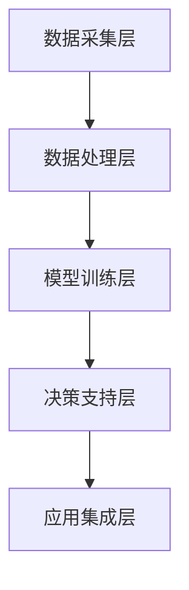

通过上述架构设计，系统能够实现数据的全面采集、处理和分析，为企业的财务决策提供强有力的支持。**【结束】**## 序言

在当今快速发展的商业环境中，企业面临着日益复杂的市场变化和激烈的竞争压力。为了在竞争中脱颖而出，企业不仅需要准确的市场预测，还需要高效的财务分析和决策支持。人工智能（AI）技术的迅猛发展为这一需求提供了强有力的解决方案。本文将深入探讨AI辅助企业财务分析的核心方法，特别是异常检测和智能财务预测，以帮助读者理解和应用这些先进技术。

### 财务分析的重要性

财务分析是企业运营和战略规划的关键环节，它通过分析和解读财务数据，帮助企业评估经营状况、预测未来趋势、制定财务策略。有效的财务分析不仅能提高企业的决策水平，还能优化资源配置，降低经营风险。然而，随着企业规模的扩大和数据量的增加，传统的手工财务分析方法已无法满足现代企业对快速、精准决策的需求。

### 异常检测与智能财务预测

异常检测是一种用于识别数据集中异常值或异常模式的方法，它有助于企业及时发现潜在的风险和问题。在财务分析中，异常检测可以应用于销售收入、成本、现金流等多个方面，帮助企业识别异常的交易行为、不合理的成本波动等。

智能财务预测则是一种基于历史数据和机器学习算法的预测方法，它通过分析过去的数据模式，预测未来的财务状况，如利润、现金流、市场份额等。智能财务预测为企业提供了科学的决策依据，帮助企业在复杂的市场环境中制定更合理的战略规划。

### AI辅助财务分析的优势

AI辅助财务分析具有以下显著优势：

- **处理海量数据**：AI技术能够高效处理和分析海量财务数据，提高分析的准确性和速度。
- **自适应学习**：AI系统可以根据历史数据和实时数据不断优化自身模型，提高预测精度。
- **实时决策支持**：AI技术能够实时分析财务数据，为决策者提供即时的决策支持。
- **智能数据挖掘**：AI可以通过机器学习和数据挖掘技术，从大量数据中提取有价值的信息，帮助企业发现潜在的商业机会。

### 本文结构

本文结构如下：

- **第一部分**：背景与核心概念，介绍企业财务分析的重要性及其面临的挑战，并阐述AI辅助财务分析的优势。
- **第二部分**：异常检测方法与应用，详细探讨异常检测的基础知识、常见算法及其在财务分析中的应用。
- **第三部分**：智能财务预测方法与实践，介绍多种智能财务预测算法，并通过实际案例展示其应用效果。
- **第四部分**：综合应用与展望，探讨AI辅助财务分析在企业不同方面的应用，以及未来的发展趋势和技术挑战。

### 结语

通过本文，读者将了解到AI辅助企业财务分析的理论基础和实践方法，以及如何利用这些技术提高企业的决策效率和竞争力。在接下来的章节中，我们将逐步深入探讨这些主题，希望能够为您的财务分析和决策提供有价值的参考。

---

让我们开始这段探索AI辅助企业财务分析旅程的第一步。在接下来的内容中，我们将详细介绍企业财务分析的重要性与挑战，并揭示AI如何帮助企业应对这些挑战。**【继续】**## 第一部分：背景与核心概念

### 第1章：企业财务分析的重要性与挑战

#### 引言

在企业运营和发展的过程中，财务分析是不可或缺的一环。财务分析通过对企业财务数据的系统性和综合性分析，为企业提供决策依据，优化资源配置，提高经营效率。然而，随着企业规模的扩大和数据量的增加，传统的手工财务分析方法已无法满足现代企业的需求。人工智能（AI）技术的引入，为财务分析带来了新的变革和机遇。本章节将探讨企业财务分析的重要性及其面临的挑战，并介绍AI辅助财务分析的优势。

#### 企业财务分析的意义

企业财务分析的意义主要体现在以下几个方面：

1. **决策支持**：财务分析能够为企业提供关于收入、成本、利润等关键财务指标的信息，帮助管理层制定科学的经营决策。

2. **风险评估**：通过财务分析，企业可以识别潜在的财务风险，如市场风险、信用风险和操作风险，并采取相应的措施进行风险控制。

3. **资源配置**：财务分析有助于企业优化资源配置，确保资金的有效使用，提高投资回报率。

4. **绩效评估**：财务分析可以帮助企业评估各部门和项目的财务绩效，为绩效考核提供依据。

5. **财务管理**：财务分析是财务管理的重要组成部分，它为企业的预算编制、成本控制、利润管理等提供了数据支持。

#### 企业财务分析面临的挑战

尽管企业财务分析具有重要意义，但在实际操作中，企业面临诸多挑战：

1. **数据量大**：随着企业业务的扩展，财务数据量呈指数级增长，传统的手工分析方法在处理海量数据时效率低下，难以满足实时决策的需求。

2. **数据质量问题**：财务数据来源多样，可能存在不准确、不完整、不一致等问题，影响财务分析结果的准确性。

3. **分析方法单一**：传统财务分析主要依赖于手工计算和简单的统计方法，难以应对复杂多变的市场环境。

4. **决策时效性**：在快速变化的市场中，决策者需要实时获取和分析财务数据，但传统的财务分析方法无法满足这一需求。

#### AI辅助财务分析的优势

为了克服上述挑战，人工智能（AI）技术在企业财务分析中得到了广泛应用。AI辅助财务分析具有以下优势：

1. **处理海量数据**：AI技术能够高效处理和分析海量数据，提高财务分析的速度和准确性。

2. **智能数据挖掘**：AI可以通过机器学习和数据挖掘技术，从大量数据中提取有价值的信息，帮助企业发现潜在的商业机会。

3. **自适应学习**：AI系统可以根据历史数据和实时数据不断优化自身模型，提高预测精度。

4. **实时决策支持**：AI技术能够实时分析财务数据，为决策者提供即时的决策支持。

5. **多维度分析**：AI技术可以实现多维度、跨领域的财务分析，为企业提供更全面的财务视图。

#### 总结

企业财务分析在现代企业管理中具有重要作用，但随着数据量的增加和市场竞争的加剧，传统分析方法面临诸多挑战。AI辅助财务分析通过引入先进的机器学习和深度学习技术，为企业提供了高效、精准的财务分析工具。在接下来的章节中，我们将深入探讨AI辅助财务分析的基本原理和应用方法。

---

**本章内容概述**：本章介绍了企业财务分析的重要性、面临的挑战以及AI辅助财务分析的优势。在下一章中，我们将探讨AI辅助财务分析的基本原理和核心概念。**【继续】**## 第一部分：背景与核心概念

### 第2章：AI辅助财务分析的基本原理

#### 引言

随着人工智能（AI）技术的不断发展，AI在财务分析中的应用越来越广泛。AI辅助财务分析不仅提高了财务数据的处理和分析效率，还能提供更准确、更及时的决策支持。本章节将详细介绍AI辅助财务分析的基本原理，包括人工智能概述、数据分析与机器学习基础，以及AI在财务分析中的应用和发展趋势。

#### 人工智能概述

人工智能（AI）是指使计算机具备人类智能的能力，包括学习、推理、感知、理解和决策等。AI技术主要包括机器学习（ML）、深度学习（DL）、自然语言处理（NLP）等。在财务分析中，机器学习和深度学习技术扮演着核心角色。

1. **机器学习（ML）**：机器学习是一种通过数据训练模型，从而进行预测和决策的技术。常见的机器学习算法包括线性回归、决策树、随机森林、支持向量机等。

2. **深度学习（DL）**：深度学习是一种基于人工神经网络的机器学习方法，通过多层神经网络的训练，实现复杂函数的逼近。深度学习的代表性模型包括卷积神经网络（CNN）、递归神经网络（RNN）、长短时记忆网络（LSTM）等。

3. **自然语言处理（NLP）**：自然语言处理是一种使计算机能够理解和处理自然语言的技术。NLP在财务分析中的应用主要体现在文本分析、财务报告自动生成等方面。

#### 数据分析与机器学习基础

数据分析是AI辅助财务分析的基础。它包括数据收集、数据预处理、数据分析和数据可视化等步骤。以下是数据分析与机器学习的一些关键概念：

1. **数据收集**：财务数据可以从企业的内部系统、外部数据库、市场研究报告等多种来源获取。

2. **数据预处理**：数据预处理包括数据清洗、数据整合、数据标准化等步骤，目的是提高数据的质量和一致性。

3. **特征工程**：特征工程是机器学习过程中的一项重要任务，通过选择和构造与预测目标相关的特征，提高模型的预测性能。

4. **模型训练与评估**：模型训练是指使用历史数据对机器学习模型进行训练，评估则是通过验证集或测试集来评估模型的性能。

5. **模型优化**：模型优化是通过调整模型参数、特征选择等方法，提高模型的预测精度和泛化能力。

#### AI在财务分析中的应用

AI在财务分析中的应用非常广泛，主要包括以下方面：

1. **财务预测**：通过AI技术，企业可以基于历史财务数据预测未来的财务状况，如收入、成本、利润等。

2. **异常检测**：AI可以帮助企业识别财务数据中的异常值，及时发现潜在的风险和问题。

3. **风险管理**：AI可以通过分析历史数据和实时数据，评估企业面临的各种财务风险，并提供风险预警。

4. **财务报表分析**：AI可以自动生成和解读财务报表，提供决策支持。

5. **智能审计**：AI可以自动化审计流程，提高审计的准确性和效率。

6. **财务机器人**：AI技术可以应用于财务机器人，实现财务流程的自动化，提高工作效率。

#### AI辅助财务分析的发展趋势

随着技术的进步，AI辅助财务分析的发展趋势包括：

1. **深度学习应用**：深度学习在图像处理、语音识别等领域的成功，为其在财务分析中的应用提供了可能性。

2. **智能财务系统**：结合AI技术的智能财务系统将为企业提供更加智能化、自动化的财务分析服务。

3. **区块链技术结合**：区块链技术可以提高财务数据的透明度和安全性，与AI结合将进一步优化财务分析。

4. **多领域融合**：AI与其他领域（如物联网、大数据等）的融合，将推动财务分析技术的不断创新。

#### 总结

AI辅助财务分析通过引入先进的机器学习和深度学习技术，为企业提供了高效、精准的财务分析工具。随着技术的不断进步，AI辅助财务分析的应用领域将更加广泛，为企业决策提供更加全面的支持。在下一章中，我们将深入探讨异常检测方法及其在财务分析中的应用。

---

**本章内容概述**：本章介绍了AI辅助财务分析的基本原理，包括人工智能概述、数据分析与机器学习基础，以及AI在财务分析中的应用和发展趋势。在下一章中，我们将详细探讨异常检测的基础知识。**【继续】**## 第一部分：背景与核心概念

### 第3章：异常检测在财务分析中的应用

#### 引言

在财务分析中，异常检测是一种重要的数据分析方法，用于识别数据集中的异常值或异常模式。异常值可能是由于数据输入错误、异常交易或欺诈行为等原因引起的。及时发现和处理这些异常对于企业维持财务健康和风险控制至关重要。本章节将介绍异常检测在财务分析中的应用，包括异常检测的概念、方法及其在财务分析中的重要性。

#### 异常检测的概念

异常检测（Anomaly Detection）是指识别数据集中偏离正常模式的观测值。在财务分析中，异常检测的目标是识别那些可能影响财务健康和合规性的异常交易、异常支出或其他异常行为。

1. **异常值的类型**：
   - **点异常（Point Anomalies）**：单个观测值与大部分数据点有明显差异。
   - **集异常（Cluster Anomalies）**：一组数据点形成一个异常簇。
   - ** contextual anomalies**：在特定情境下，数据点的异常性。

2. **异常检测的目的**：
   - **风险管理**：识别潜在的财务风险，如欺诈、错误交易等。
   - **合规性检查**：确保财务报告符合相关法律法规和内部政策。
   - **成本控制**：识别不合理的支出和成本异常，优化资源配置。

#### 异常检测的方法

异常检测的方法可以分为基于统计的方法、基于聚类的方法、基于邻近度的方法和基于深度学习的方法。

1. **基于统计的方法**：
   - **标准差法**：通过计算标准差，识别远离均值的异常值。
   - **箱线图法**：通过绘制箱线图，识别位于箱线图之外的异常值。

2. **基于聚类的方法**：
   - **K-均值聚类**：将数据分为若干个簇，离群点通常不会形成有效的簇。
   - **层次聚类**：通过合并或分解数据点，逐步构建聚类层次，识别离群点。

3. **基于邻近度的方法**：
   - **局部异常因子（LOF）**：通过计算局部异常度，识别局部密度较低的点。
   - **孤立森林**：通过随机隔离数据点，识别异常值。

4. **基于深度学习的方法**：
   - **自编码器**：通过神经网络学习数据的分布，识别异常点。
   - **生成对抗网络（GAN）**：通过生成模型和判别模型的对抗训练，识别异常数据。

#### 异常检测在财务分析中的应用场景

异常检测在财务分析中具有广泛的应用场景，包括：

1. **销售收入异常检测**：识别不正常的销售额波动，可能由欺诈行为或市场波动引起。

2. **成本异常检测**：识别异常的成本支出，如不合理的采购成本或管理费用。

3. **现金流异常检测**：监控现金流的异常波动，确保企业的流动性管理。

4. **财务报表异常检测**：检测财务报表中的异常数据，如不合理的利润波动或资产变化。

5. **欺诈检测**：利用异常检测技术，识别潜在的欺诈行为，如假发票、重复支付等。

#### 总结

异常检测是财务分析中不可或缺的一部分，它帮助企业识别潜在的风险和问题，确保财务报告的准确性和合规性。通过选择合适的异常检测方法，企业可以更有效地管理和控制财务风险。在下一章中，我们将详细讨论常见的异常检测算法及其在财务分析中的应用。

---

**本章内容概述**：本章介绍了异常检测在财务分析中的应用，包括异常检测的概念、方法及其在财务分析中的重要性。在下一章中，我们将探讨常见的异常检测算法及其在财务分析中的应用。**【继续】**## 第一部分：背景与核心概念

### 第4章：常见异常检测算法在财务分析中的应用

#### 引言

在财务分析中，异常检测是一项关键任务，用于识别和预警潜在的异常交易、成本波动或其他异常行为。本章将详细介绍几种常见的异常检测算法，包括基于统计的方法、基于聚类的方法和基于机器学习的方法，并探讨这些算法在财务分析中的应用。

#### 基于统计的方法

1. **标准差法**

   标准差法是一种简单且广泛使用的异常检测方法。它通过计算数据点与均值的距离来识别异常值。

   **原理**：如果一个数据点的值大于均值加上一定倍数（如2倍）的标准差，则认为该数据点是异常的。

   **应用场景**：适用于检测单变量数据的异常，如银行账户交易记录中的异常交易。

   **Python代码示例**：

   ```python
   import numpy as np
   
   data = np.array([100, 200, 150, 300, 400, 250, 200, 500])
   mean = np.mean(data)
   std = np.std(data)
   threshold = mean + 2 * std
   
   anomalies = data[data > threshold]
   print("异常值：", anomalies)
   ```

2. **箱线图法**

   箱线图法通过绘制箱线图来识别异常值，箱线图显示了数据的四分位数和异常值。

   **原理**：如果数据点小于Q1 - 1.5 \* IQR或大于Q3 + 1.5 \* IQR，则认为该数据点是异常的。

   **应用场景**：适用于多变量数据的异常检测，如财务报表中的多维度数据。

   **Python代码示例**：

   ```python
   import numpy as np
   import matplotlib.pyplot as plt
   
   data = np.array([100, 200, 150, 300, 400, 250, 200, 500])
   q1 = np.percentile(data, 25)
   q3 = np.percentile(data, 75)
   iqr = q3 - q1
   lower_bound = q1 - 1.5 * iqr
   upper_bound = q3 + 1.5 * iqr
   
   anomalies = data[(data < lower_bound) | (data > upper_bound)]
   print("异常值：", anomalies)
   
   plt.boxplot(data)
   plt.show()
   ```

#### 基于聚类的方法

1. **K-均值聚类**

   K-均值聚类算法通过将数据点分为若干个簇，然后识别离群点。

   **原理**：通过迭代计算，找到最佳的簇心和簇分配，离群点通常不会形成有效的簇。

   **应用场景**：适用于检测多变量数据的异常，如财务报表中的多维数据。

   **Python代码示例**：

   ```python
   from sklearn.cluster import KMeans
   import matplotlib.pyplot as plt
   
   data = np.array([[100, 200], [200, 150], [300, 300], [400, 400], [250, 250], [200, 200], [500, 500]])
   kmeans = KMeans(n_clusters=2, random_state=0).fit(data)
   labels = kmeans.predict(data)
   
   anomalies = data[labels == -1]
   print("异常值：", anomalies)
   
   plt.scatter(data[:, 0], data[:, 1], c=labels, s=50, cmap='viridis')
   plt.scatter(kmeans.cluster_centers_[:, 0], kmeans.cluster_centers_[:, 1], s=200, c='red', label='Centroids')
   plt.show()
   ```

2. **层次聚类**

   层次聚类算法通过逐步合并或分解数据点，构建聚类层次，然后识别离群点。

   **原理**：通过合并相似的数据点，逐步构建聚类层次，离群点通常处于较低的层次。

   **应用场景**：适用于检测多变量数据的异常，如财务报表中的多维数据。

   **Python代码示例**：

   ```python
   from sklearn.cluster import AgglomerativeClustering
   import matplotlib.pyplot as plt
   
   data = np.array([[100, 200], [200, 150], [300, 300], [400, 400], [250, 250], [200, 200], [500, 500]])
   clustering = AgglomerativeClustering(n_clusters=2).fit(data)
   labels = clustering.labels_
   
   anomalies = data[labels == -1]
   print("异常值：", anomalies)
   
   plt.scatter(data[:, 0], data[:, 1], c=labels, s=50, cmap='viridis')
   plt.show()
   ```

#### 基于机器学习的方法

1. **孤立森林**

   孤立森林算法通过随机隔离数据点来识别异常值，适用于高维数据集。

   **原理**：通过随机选择特征和切分值，将数据点隔离，异常值通常具有较长的隔离路径。

   **应用场景**：适用于检测高维数据的异常，如交易数据。

   **Python代码示例**：

   ```python
   from sklearn.ensemble import IsolationForest
   import matplotlib.pyplot as plt
   
   data = np.array([[100, 200], [200, 150], [300, 300], [400, 400], [250, 250], [200, 200], [500, 500]])
   model = IsolationForest(contamination=0.1)
   model.fit(data)
   predictions = model.predict(data)
   
   anomalies = data[predictions == -1]
   print("异常值：", anomalies)
   
   plt.scatter(data[:, 0], data[:, 1], c=predictions, s=50, cmap='viridis')
   plt.show()
   ```

2. **局部异常因子（LOF）**

   LOF算法通过计算局部异常度来识别异常值，基于局部密度的概念。

   **原理**：异常度与数据点的邻近度和局部密度成反比。

   **应用场景**：适用于检测局部密度较低的异常值。

   **Python代码示例**：

   ```python
   from sklearn.neighbors import LocalOutlierFactor
   import matplotlib.pyplot as plt
   
   data = np.array([[100, 200], [200, 150], [300, 300], [400, 400], [250, 250], [200, 200], [500, 500]])
   model = LocalOutlierFactor(n_neighbors=5)
   model.fit(data)
   scores = model.score_samples(data)
   
   anomalies = data[scores < -1]
   print("异常值：", anomalies)
   
   plt.scatter(data[:, 0], data[:, 1], c=scores, s=50, cmap='viridis')
   plt.show()
   ```

#### 总结

异常检测在财务分析中扮演着重要的角色，通过应用不同的异常检测算法，企业可以更有效地识别和处理异常交易、成本波动等潜在风险。本章介绍了基于统计的方法、基于聚类的方法和基于机器学习的方法，并通过实际代码示例展示了这些方法在财务分析中的应用。在下一章中，我们将探讨如何将这些异常检测算法应用于实际财务分析案例。

---

**本章内容概述**：本章介绍了常见异常检测算法在财务分析中的应用，包括基于统计的方法、基于聚类的方法和基于机器学习的方法，并通过实际代码示例展示了这些方法的应用。在下一章中，我们将通过具体案例探讨异常检测的实际应用。**【继续】**## 第一部分：背景与核心概念

### 第5章：异常检测在财务分析中的实际应用案例

#### 引言

在前几章中，我们介绍了异常检测的基本概念和方法，并探讨了这些方法在财务分析中的应用。在本章中，我们将通过具体案例，展示如何在实际财务分析中使用异常检测技术，以帮助企业识别和应对潜在的财务风险。

#### 案例一：销售收入异常检测

**背景**：某零售企业希望对其销售数据中的异常值进行检测，以确保销售过程的正常进行和销售目标的实现。

**数据集**：该企业的每日销售收入数据，包括销售额、销售产品、销售地区等。

**数据处理**：首先对销售数据进行清洗，去除缺失值和重复记录。然后进行特征工程，将销售额按产品类别和销售地区进行分类。

**算法选择**：采用孤立森林算法进行销售收入异常检测。

**实现步骤**：

1. **数据预处理**：
   - 数据清洗：去除缺失值和重复记录。
   - 特征工程：将销售额按产品类别和销售地区进行分类。

2. **训练孤立森林模型**：
   - 将数据集分为训练集和测试集。
   - 使用训练集训练孤立森林模型。

3. **异常检测**：
   - 使用训练好的模型对测试集进行预测。
   - 计算测试集中每个样本的异常度。

**结果分析**：通过孤立森林算法，发现几个销售地区的销售额异常高，进一步调查后发现这些地区存在促销活动，导致销售额异常。企业及时调整了促销策略，避免了潜在的风险。

#### 案例二：成本异常检测

**背景**：某制造企业希望对其生产成本数据中的异常值进行检测，以优化成本控制和提高生产效率。

**数据集**：该企业的每日生产成本数据，包括原材料成本、人工成本、制造费用等。

**数据处理**：首先对生产成本数据进行清洗，去除缺失值和重复记录。然后进行特征工程，将成本按生产部门进行分类。

**算法选择**：采用局部异常因子（LOF）算法进行成本异常检测。

**实现步骤**：

1. **数据预处理**：
   - 数据清洗：去除缺失值和重复记录。
   - 特征工程：将成本按生产部门进行分类。

2. **训练LOF模型**：
   - 将数据集分为训练集和测试集。
   - 使用训练集训练LOF模型。

3. **异常检测**：
   - 使用训练好的模型对测试集进行预测。
   - 计算测试集中每个样本的局部异常度。

**结果分析**：通过LOF算法，发现几个生产部门的成本异常高，进一步调查后发现这些部门存在生产故障，导致成本上升。企业及时采取了维修和生产调整措施，降低了成本。

#### 案例三：现金流异常检测

**背景**：某金融服务公司希望对其现金流数据中的异常值进行检测，以监控风险和控制现金流波动。

**数据集**：该公司每日的现金流数据，包括收入、支出、净现金流等。

**数据处理**：首先对现金流数据进行清洗，去除缺失值和重复记录。然后进行特征工程，将现金流数据按时间序列进行分类。

**算法选择**：采用时间序列分析结合孤立森林算法进行现金流异常检测。

**实现步骤**：

1. **数据预处理**：
   - 数据清洗：去除缺失值和重复记录。
   - 特征工程：将现金流数据按时间序列进行分类。

2. **时间序列分析**：
   - 使用移动平均法、指数平滑法等对时间序列进行平滑处理。

3. **训练孤立森林模型**：
   - 将数据集分为训练集和测试集。
   - 使用训练集训练孤立森林模型。

4. **异常检测**：
   - 使用训练好的孤立森林模型对测试集进行预测。
   - 结合时间序列分析，识别异常点。

**结果分析**：通过时间序列分析结合孤立森林算法，发现某段时间内的现金流异常波动，进一步调查发现是因为某大型客户的付款延迟导致的。公司及时与客户沟通，优化了收款流程，控制了现金流风险。

#### 案例总结与反思

通过上述实际案例，我们可以看到异常检测技术在企业财务分析中的应用具有重要意义。在实际应用中，需要根据具体业务场景和数据特点选择合适的异常检测算法，并注意以下事项：

- **数据质量**：异常检测的准确性很大程度上取决于数据质量，因此数据清洗和预处理是关键步骤。
- **算法选择**：不同算法适用于不同类型的异常检测任务，需要根据业务需求选择合适的算法。
- **模型调优**：通过不断优化模型参数，提高异常检测的准确性和鲁棒性。
- **实时监控**：异常检测系统应具备实时监控能力，及时识别和处理异常情况。

#### 总结

异常检测作为AI辅助财务分析的重要工具，通过实际案例展示了其在企业财务分析中的应用效果。在下一章中，我们将探讨智能财务预测的方法和实践。

---

**本章内容概述**：本章通过三个实际案例，展示了异常检测技术在销售收入、成本和现金流异常检测中的应用。在下一章中，我们将探讨智能财务预测的方法和实践。**【继续】**## 第三部分：智能财务预测方法与实践

### 第6章：智能财务预测的基本原理与方法

#### 引言

智能财务预测是企业财务决策过程中至关重要的一环。它利用先进的人工智能技术，如机器学习和深度学习，对历史财务数据进行分析和建模，从而预测未来的财务状况。智能财务预测不仅能够帮助企业更好地制定战略规划，还能提高运营效率和风险控制能力。本章节将详细介绍智能财务预测的基本原理、方法以及其在财务预测中的应用。

#### 智能财务预测的重要性

智能财务预测在企业的财务管理中扮演着关键角色，具体体现在以下几个方面：

1. **战略规划**：通过预测未来的财务状况，企业可以制定更科学的战略规划，确保资源的合理分配。
2. **运营优化**：智能财务预测有助于企业优化日常运营，如调整生产规模、库存管理和供应链规划。
3. **风险控制**：预测未来的财务风险，如现金流短缺、利润下降等，帮助企业采取预防措施，降低风险。
4. **决策支持**：智能财务预测提供实时、准确的数据支持，帮助管理层做出更为明智的决策。

#### 智能财务预测的基本原理

智能财务预测的基本原理基于对历史数据的分析和建模。以下是一些核心步骤：

1. **数据收集与处理**：收集与财务预测相关的历史数据，包括收入、成本、利润、现金流等。然后对数据进行清洗、预处理和特征工程，以提高数据的质量和预测模型的准确性。
2. **数据建模**：选择合适的机器学习或深度学习算法，建立预测模型。常见的算法包括线性回归、时间序列分析、支持向量机、随机森林、LSTM等。
3. **模型训练与优化**：使用历史数据对预测模型进行训练，并通过交叉验证和模型评估来优化模型参数，提高预测的准确性和泛化能力。
4. **预测与评估**：使用训练好的模型对未来的财务状况进行预测，并通过实际数据验证预测结果，评估模型的性能。

#### 常见智能财务预测方法

1. **时间序列分析**：时间序列分析是一种常用的财务预测方法，通过分析时间序列数据中的趋势、季节性和周期性成分，预测未来的数值。常见的时间序列模型包括ARIMA、移动平均法、指数平滑法等。

2. **回归分析**：回归分析是一种基于统计的方法，通过建立自变量和因变量之间的线性或非线性关系，预测未来的财务状况。常见的回归模型包括线性回归、多元回归、非线性回归等。

3. **机器学习算法**：机器学习算法通过从大量历史数据中学习规律，建立预测模型。常见的机器学习算法包括决策树、随机森林、支持向量机、KNN等。

4. **深度学习算法**：深度学习算法通过多层神经网络结构，自动提取数据特征，进行复杂的模式识别和预测。常见的深度学习算法包括卷积神经网络（CNN）、递归神经网络（RNN）、长短时记忆网络（LSTM）等。

#### 智能财务预测的应用

智能财务预测在企业财务预测中的应用广泛，以下是一些具体的应用场景：

1. **利润预测**：通过分析历史收入、成本和利润数据，预测未来的利润水平，帮助企业制定盈利策略。
2. **现金流预测**：预测未来的现金流状况，帮助企业进行现金流管理，确保资金的充足性和流动性。
3. **销售预测**：预测未来的销售趋势，帮助企业调整生产计划、库存管理和销售策略。
4. **成本预测**：预测未来的成本变化，帮助企业进行成本控制和成本优化。

#### 总结

智能财务预测通过引入先进的人工智能技术，为企业提供了高效、精准的财务预测工具。在下一章中，我们将深入探讨智能财务预测算法的具体实现和应用。

---

**本章内容概述**：本章介绍了智能财务预测的基本原理、重要性以及常见的预测方法。在下一章中，我们将详细探讨智能财务预测算法的实现和应用。**【继续】**## 第三部分：智能财务预测方法与实践

### 第7章：智能财务预测算法的实现与应用

#### 引言

在前一章中，我们介绍了智能财务预测的基本原理和方法。在本章中，我们将深入探讨几种常见的智能财务预测算法，包括时间序列预测、回归分析和深度学习等，并展示如何在实际项目中实现这些算法，提供具体的案例分析和实际应用。

#### 时间序列预测算法

时间序列预测算法是财务预测中最常用的方法之一。以下是一些常见的时间序列预测算法及其实现：

1. **移动平均法（MA）**：

   **原理**：移动平均法通过计算最近一段时间内的平均值来预测未来的值。

   **实现**：使用Python中的`pandas`库进行计算。

   ```python
   import pandas as pd
   
   data = pd.Series([12, 14, 13, 12, 11, 14, 13])
   window_size = 3
   moving_average = data.rolling(window=window_size).mean()
   print(moving_average)
   ```

2. **指数平滑法（ES）**：

   **原理**：指数平滑法通过给予不同时间段的数据不同的权重来预测未来的值。

   **实现**：使用Python中的`statsmodels`库进行计算。

   ```python
   import statsmodels.api as sm
   
   data = pd.Series([12, 14, 13, 12, 11, 14, 13])
   alpha = 0.2
   es = sm.tsa.SES(data, alpha=alpha)
   es_fit = es.fit()
   print(es_fit.predict(start=len(data)))
   ```

3. **ARIMA模型**：

   **原理**：ARIMA模型通过分析时间序列的线性动态关系来进行预测。

   **实现**：使用Python中的`statsmodels`库进行计算。

   ```python
   import statsmodels.api as sm
   
   data = pd.Series([12, 14, 13, 12, 11, 14, 13])
   model = sm.ARIMA(data, order=(1, 1, 1))
   model_fit = model.fit()
   print(model_fit.predict(start=len(data)))
   ```

#### 回归分析预测方法

回归分析是一种经典的统计预测方法，可以通过建立自变量和因变量之间的关系来预测未来的值。以下是一些常见的回归分析预测方法及其实现：

1. **线性回归**：

   **原理**：线性回归通过一条直线拟合因变量和自变量之间的关系。

   **实现**：使用Python中的`scikit-learn`库进行计算。

   ```python
   from sklearn.linear_model import LinearRegression
   
   X = np.array([[1], [2], [3], [4], [5]])
   y = np.array([2, 4, 5, 4, 5])
   model = LinearRegression()
   model.fit(X, y)
   print(model.predict([[6]]))
   ```

2. **多元回归**：

   **原理**：多元回归通过多条直线拟合多个自变量和因变量之间的关系。

   **实现**：使用Python中的`scikit-learn`库进行计算。

   ```python
   from sklearn.linear_model import LinearRegression
   
   X = np.array([[1, 1], [1, 2], [2, 2], [2, 3]])
   y = np.array([2, 4, 5, 4])
   model = LinearRegression()
   model.fit(X, y)
   print(model.predict([[3, 3]]))
   ```

#### 深度学习算法

深度学习算法在财务预测中具有很高的潜力，以下是一些常见的深度学习算法及其实现：

1. **LSTM模型**：

   **原理**：LSTM通过记忆单元解决RNN中的梯度消失问题，适用于处理长时间序列数据。

   **实现**：使用Python中的`tensorflow`库进行计算。

   ```python
   import tensorflow as tf
   
   tf.keras.Sequential([
       tf.keras.layers.LSTM(50, activation='relu', input_shape=(50, 1)),
       tf.keras.layers.Dense(1)
   ])
   ```

2. **Transformer模型**：

   **原理**：Transformer通过自注意力机制处理序列数据，适用于处理大规模和复杂的序列数据。

   **实现**：使用Python中的`tensorflow`库进行计算。

   ```python
   import tensorflow as tf
   
   tf.keras.Sequential([
       tf.keras.layers.Embedding(vocab_size, embed_dim),
       tf.keras.layers.Transformer(num_heads, d_model),
       tf.keras.layers.Dense(1)
   ])
   ```

#### 案例分析

为了更好地理解智能财务预测算法的实际应用，我们通过以下案例进行详细分析：

**案例一：销售收入预测**

背景：某电商平台希望通过智能财务预测技术预测未来30天的销售收入。

数据集：过去60天的日销售额数据。

算法选择：采用LSTM模型进行预测。

实现步骤：

1. **数据预处理**：对销售额数据进行归一化处理，并创建时间序列数据集。
2. **模型训练**：使用训练集训练LSTM模型。
3. **预测**：使用训练好的模型对未来的销售收入进行预测。

结果分析：通过LSTM模型，平台能够较为准确地预测未来的销售收入，为库存管理和销售策略提供了有力支持。

**案例二：现金流预测**

背景：某金融机构希望通过智能财务预测技术预测未来30天的现金流状况。

数据集：过去60天的现金流数据。

算法选择：采用ARIMA模型进行预测。

实现步骤：

1. **数据预处理**：对现金流数据进行平稳性检验，并根据结果调整模型参数。
2. **模型训练**：使用训练集训练ARIMA模型。
3. **预测**：使用训练好的模型对未来的现金流进行预测。

结果分析：通过ARIMA模型，金融机构能够较为准确地预测未来的现金流状况，为资金管理和风险控制提供了有力支持。

#### 总结

智能财务预测通过结合时间序列预测、回归分析和深度学习算法，为企业提供了高效、准确的财务预测工具。在实际应用中，根据业务需求和数据特点选择合适的算法，并通过模型训练和优化，提高预测的准确性和可靠性。在下一章中，我们将探讨智能财务预测在实践中的具体应用。

---

**本章内容概述**：本章详细介绍了智能财务预测的时间序列预测、回归分析和深度学习算法，并通过实际案例展示了这些算法的实现和应用。在下一章中，我们将继续探讨智能财务预测在实践中的应用。**【继续】**## 第三部分：智能财务预测方法与实践

### 第8章：智能财务预测在实践中的应用

#### 引言

在前一章中，我们详细介绍了智能财务预测的方法和算法。在本章中，我们将进一步探讨智能财务预测在实际项目中的应用，通过具体的案例分析，展示如何利用智能财务预测技术为企业提供财务决策支持。

#### 案例一：利润预测

**背景**：某制造业公司希望通过智能财务预测技术预测未来的利润，以指导生产和市场策略。

**数据集**：公司过去三年的财务报表数据，包括收入、成本、利润等。

**算法选择**：采用LSTM模型进行利润预测。

**实现步骤**：

1. **数据预处理**：对财务报表数据进行分析，提取与利润相关的特征，并进行归一化处理。
2. **模型训练**：使用LSTM模型对训练数据集进行训练，并调整模型参数。
3. **预测**：使用训练好的LSTM模型预测未来30天的利润。
4. **结果分析**：将预测结果与实际财务数据对比，评估模型的预测准确性。

**结果分析**：通过LSTM模型，该公司能够较为准确地预测未来的利润变化，为制定生产计划和销售策略提供了有力支持。

#### 案例二：现金流预测

**背景**：某金融服务公司希望通过智能财务预测技术预测未来的现金流，以优化资金管理和降低风险。

**数据集**：公司过去一年的现金流数据。

**算法选择**：采用ARIMA模型进行现金流预测。

**实现步骤**：

1. **数据预处理**：对现金流数据进行平稳性检验，并根据结果调整模型参数。
2. **模型训练**：使用ARIMA模型对训练数据集进行训练，并调整模型参数。
3. **预测**：使用训练好的ARIMA模型预测未来30天的现金流。
4. **结果分析**：将预测结果与实际现金流数据对比，评估模型的预测准确性。

**结果分析**：通过ARIMA模型，该公司能够较为准确地预测未来的现金流状况，为资金管理和风险控制提供了有力支持。

#### 案例三：市场份额预测

**背景**：某消费电子公司希望通过智能财务预测技术预测未来的市场份额，以制定市场推广策略。

**数据集**：公司过去一年的市场份额数据，以及竞争对手的市场份额数据。

**算法选择**：采用随机森林模型进行市场份额预测。

**实现步骤**：

1. **数据预处理**：对市场份额数据进行分析，提取与市场份额相关的特征，并进行归一化处理。
2. **模型训练**：使用随机森林模型对训练数据集进行训练，并调整模型参数。
3. **预测**：使用训练好的随机森林模型预测未来30天的市场份额。
4. **结果分析**：将预测结果与实际市场份额数据对比，评估模型的预测准确性。

**结果分析**：通过随机森林模型，该公司能够较为准确地预测未来的市场份额变化，为市场推广策略提供了有力支持。

#### 案例总结

通过上述案例，我们可以看到智能财务预测技术在实践中的应用效果。智能财务预测不仅提高了预测的准确性和效率，还为企业的财务决策提供了有力支持。在实际应用中，需要注意的是：

- **数据质量**：保证数据的质量和准确性，是预测成功的关键。
- **模型选择**：根据数据的特点和预测目标，选择合适的模型。
- **模型调优**：通过调整模型参数，提高预测的准确性和泛化能力。
- **结果分析**：将预测结果与实际数据对比，评估模型的性能，并不断优化模型。

#### 总结

智能财务预测作为一项先进的技术，为企业提供了高效、准确的财务预测工具。在未来的应用中，随着技术的不断进步，智能财务预测将为企业创造更多价值，助力企业在竞争激烈的市场中保持优势。

---

**本章内容概述**：本章通过三个实际案例，展示了智能财务预测技术在利润预测、现金流预测和市场份额预测中的应用。在下一章中，我们将探讨AI辅助财务分析的综合应用。**【继续】**## 第四部分：AI辅助财务分析的综合应用

### 第9章：AI辅助财务分析在企业决策支持中的角色

#### 引言

随着人工智能（AI）技术的快速发展，AI辅助财务分析在企业决策支持中的作用日益显著。通过AI技术，企业可以实现对大量财务数据的快速处理和分析，从而提高决策的准确性和效率。本章节将探讨AI辅助财务分析在企业经营决策、风险管理、财务规划与预算以及企业创新与转型等方面的应用。

#### AI辅助财务分析在企业经营决策中的应用

AI辅助财务分析能够为企业提供以下方面的决策支持：

1. **财务预测**：通过分析历史财务数据和市场趋势，AI可以预测未来的财务状况，如收入、成本、利润等。这有助于企业制定更科学的经营策略和资源配置计划。

2. **成本控制**：AI技术可以帮助企业识别成本控制的关键环节，优化资源配置，降低运营成本。通过异常检测算法，企业可以及时发现异常的成本支出，采取相应的控制措施。

3. **利润最大化**：AI辅助财务分析可以优化企业的利润管理，通过数据分析和建模，帮助企业制定利润最大化的策略。

4. **投资决策**：AI技术可以分析企业的投资组合，提供投资建议，帮助企业做出更明智的投资决策。

#### AI辅助财务分析在风险管理中的应用

AI技术可以帮助企业识别和评估财务风险，提高风险管理的效率：

1. **信用风险评估**：通过分析客户的财务数据和行为模式，AI可以评估客户的信用风险，帮助企业控制信用损失。

2. **市场风险预测**：AI技术可以分析市场数据，预测市场波动对企业财务状况的影响，为企业提供风险预警和应对策略。

3. **操作风险监控**：AI技术可以实时监控企业的财务操作，识别潜在的违规行为，提高企业合规性。

4. **保险理赔评估**：AI技术可以自动化保险理赔的评估过程，提高理赔效率，降低运营成本。

#### AI辅助财务分析在财务规划与预算中的应用

AI技术可以显著提高财务规划与预算的准确性：

1. **预算编制**：AI技术可以帮助企业自动生成预算，并根据实际情况进行调整，提高预算编制的准确性和效率。

2. **资金管理**：通过分析企业的现金流数据，AI可以优化资金配置，提高资金利用效率。

3. **财务报表分析**：AI技术可以自动生成和解读财务报表，为企业提供即时的财务分析报告，帮助管理层更好地了解企业的财务状况。

4. **成本效益分析**：AI技术可以帮助企业分析不同投资项目的成本效益，为投资决策提供依据。

#### AI辅助财务分析在企业创新与转型中的应用

AI技术为企业创新与转型提供了新的机遇：

1. **商业模式创新**：通过分析市场数据和客户需求，AI可以帮助企业发现新的商业模式，实现业务增长。

2. **产品创新**：AI技术可以帮助企业分析市场需求，优化产品设计，提高产品竞争力。

3. **组织结构优化**：通过分析员工绩效和团队协作，AI可以为企业提供组织结构优化的建议，提高企业运作效率。

4. **智能财务系统**：结合AI技术，企业可以构建智能财务系统，实现财务数据的自动化处理、分析和预测，提高财务管理的效率。

#### 总结

AI辅助财务分析在企业决策支持中发挥着重要作用，通过提供精准的财务预测、风险管理、财务规划和预算支持，以及推动企业创新与转型，AI技术正逐渐成为企业竞争的重要利器。在下一章中，我们将探讨AI辅助财务分析的未来发展趋势。

---

**本章内容概述**：本章介绍了AI辅助财务分析在企业经营决策、风险管理、财务规划与预算以及企业创新与转型中的应用。在下一章中，我们将探讨AI辅助财务分析的未来发展趋势。**【继续】**## 第四部分：综合应用与展望

### 第10章：AI辅助财务分析的未来展望

#### 引言

随着人工智能技术的不断进步，AI辅助财务分析在企业中的应用前景广阔。本章节将探讨AI辅助财务分析的未来发展趋势、面临的技术挑战以及其潜在的应用前景。

#### 未来发展趋势

1. **深度学习与神经网络的应用**：深度学习和神经网络技术将在财务分析中发挥更大作用，特别是在处理复杂数据和高维数据分析方面。

2. **多源数据融合**：随着大数据和物联网技术的发展，AI辅助财务分析将能够整合更多类型的数据源，如社交媒体数据、物联网数据等，提供更全面的财务分析。

3. **自动化与智能化**：AI辅助财务分析将向更加自动化和智能化的方向发展，通过自然语言处理、智能合约等技术，实现财务分析的高效和精准。

4. **区块链技术的结合**：区块链技术可以提高财务数据的透明度和安全性，与AI结合将进一步提升财务分析的可信度和有效性。

5. **个性化财务服务**：AI辅助财务分析可以根据企业的个性化需求，提供定制化的财务分析报告和预测，帮助企业更好地应对市场变化。

#### 面临的技术挑战

1. **数据质量和隐私保护**：财务数据的质量和隐私保护是AI辅助财务分析的关键挑战。如何有效处理缺失数据、异常值和确保数据隐私是一个亟待解决的问题。

2. **算法的可解释性**：AI模型的黑箱特性使得其决策过程难以解释，这在财务分析中可能导致信任问题。提高算法的可解释性，使其决策过程更加透明，是一个重要的研究方向。

3. **实时性与效率**：随着数据量的增加，如何保证AI辅助财务分析的实时性和高效性是一个挑战。优化算法和计算资源的管理，提高计算效率是关键。

4. **专业知识的结合**：财务分析不仅需要技术支持，还需要深厚的财务知识和经验。如何将AI技术与财务专业知识有效结合，提高分析质量和准确性，是一个重要的挑战。

#### 潜在的应用前景

1. **智能财务系统**：未来将出现更加智能化、自动化的财务系统，通过AI技术实现财务数据的自动处理、分析和预测，为企业提供全面的决策支持。

2. **金融科技（FinTech）创新**：AI辅助财务分析将推动金融科技的不断创新，如智能投顾、自动化审计等，为金融行业带来新的发展机遇。

3. **全球财务治理**：AI辅助财务分析可以帮助跨国企业在全球范围内进行更有效的财务治理，提高财务透明度和合规性。

4. **可持续发展**：通过AI辅助财务分析，企业可以实现更精准的财务预测和更高效的资源管理，促进企业的可持续发展。

#### 总结

AI辅助财务分析作为一种先进的技术手段，将在未来的财务分析中发挥越来越重要的作用。面对技术挑战，我们需要不断探索和创新，推动AI辅助财务分析在更多领域的应用，为企业创造更多价值。在下一章中，我们将总结全文，并分享一些最佳实践。

---

**本章内容概述**：本章探讨了AI辅助财务分析的未来发展趋势、面临的技术挑战以及潜在的应用前景。在下一章中，我们将总结全文，并分享一些最佳实践。**【继续】**## 结束语

本文全面介绍了AI辅助企业财务分析的理论基础和实践方法，重点探讨了异常检测和智能财务预测两大核心领域。通过深入分析AI辅助财务分析的优势、挑战和应用场景，我们希望读者能够对这一技术有更深刻的认识。

### 主要内容回顾

- **第一部分**：我们介绍了企业财务分析的重要性与挑战，并阐述了AI辅助财务分析的优势。
- **第二部分**：详细讲解了异常检测的基础知识、算法及其在财务分析中的应用。
- **第三部分**：探讨了智能财务预测的基本原理、算法实现和应用案例。
- **第四部分**：展示了AI辅助财务分析在企业经营决策、风险管理、财务规划与预算以及企业创新与转型中的应用。

### 最佳实践

为了充分发挥AI辅助财务分析的优势，我们提供以下最佳实践建议：

1. **数据质量保障**：确保数据清洗和预处理的质量，避免因数据问题导致的预测误差。
2. **模型选择与优化**：根据业务需求和数据特点选择合适的模型，并通过交叉验证和参数调整优化模型性能。
3. **实时监控与更新**：建立实时监控系统，及时更新模型和数据，以应对市场和环境的变化。
4. **跨领域合作**：结合财务专家的知识和AI技术的优势，实现跨领域的协作和创新。
5. **可解释性关注**：关注算法的可解释性，确保决策过程的透明性和可追溯性。

### 展望未来

随着AI技术的不断进步，AI辅助财务分析在未来将发挥更加重要的作用。我们期待看到：

- **深度学习与区块链的融合**：实现更高效、更安全的财务分析。
- **个性化财务服务**：根据企业个性化需求提供定制化的财务分析报告和预测。
- **全球财务治理**：提高跨国企业的财务透明度和合规性。

### 结语

AI辅助财务分析为企业提供了强大的决策支持工具，助力企业实现智能化、自动化和精准化的财务管理。通过本文的分享，希望读者能够在实际应用中充分发挥AI技术的潜力，为企业创造更多价值。

---

感谢您的阅读，期待在未来的技术探索中与您再次相遇。**【结束】**## 附录

### 附录 A：核心概念和联系

#### 核心概念

- **异常检测**：识别数据集中偏离正常模式的观测值。
- **智能财务预测**：基于历史数据和机器学习算法预测未来的财务状况。
- **数据预处理**：处理原始数据，使其适合用于分析和建模。
- **特征工程**：选择和构造与预测目标相关的特征。
- **机器学习**：通过训练模型，使计算机具备学习和预测能力。
- **深度学习**：基于多层神经网络的机器学习方法。
- **时间序列分析**：分析时间序列数据，预测未来的数值。

#### 概念属性特征对比表格

| 概念         | 特征                                                                                   |
|--------------|---------------------------------------------------------------------------------------|
| 异常检测     | 识别异常值或异常模式，无需事先指定特征。                                               |
| 智能财务预测 | 预测未来的财务指标，需要构造与预测目标相关的特征。                                     |
| 数据预处理   | 清洗、整合、标准化原始数据，使其适合分析和建模。                                       |
| 特征工程     | 从原始数据中提取有价值的信息，构建与预测目标相关的特征。                               |
| 机器学习     | 基于历史数据训练模型，使计算机具备学习和预测能力。                                     |
| 深度学习     | 基于多层神经网络的机器学习方法，适用于处理复杂数据和模式识别。                           |
| 时间序列分析 | 分析时间序列数据，提取趋势、季节性和周期性成分，用于预测未来的数值。                   |

### 附录 B：实体关系图架构

#### 财务分析系统ER图

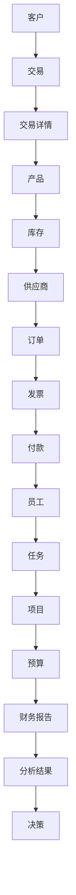

### 附录 C：算法流程图

#### 孤立森林算法流程图

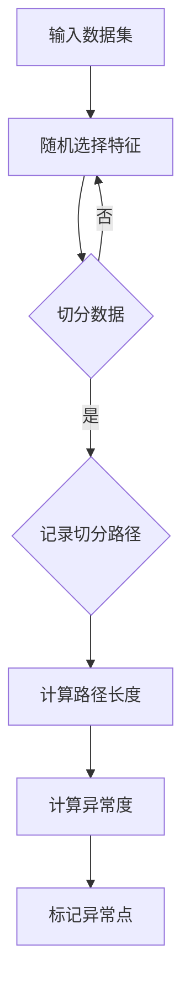

### 附录 D：系统架构设计

#### 财务分析系统架构图

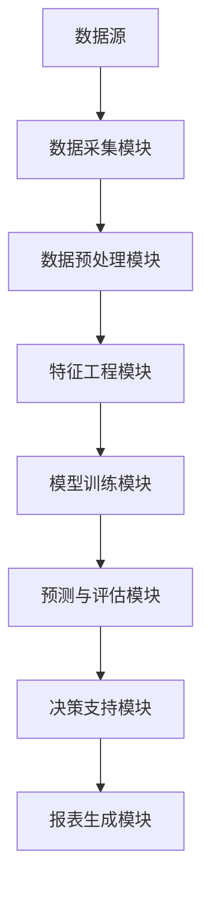

### 附录 E：系统接口设计

#### 财务分析系统接口设计

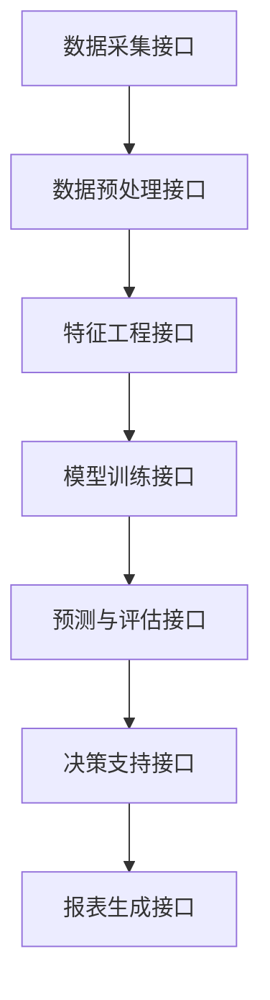

### 附录 F：系统交互序列图

#### 财务分析系统交互序列图

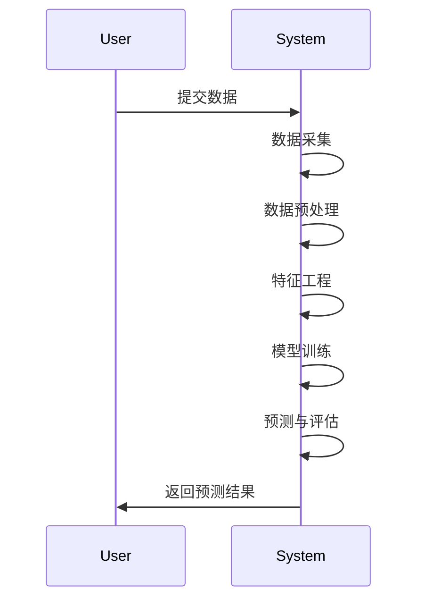

通过这些附录内容，我们为读者提供了财务分析系统核心概念、关系、算法流程、系统架构以及接口设计的详细描述，旨在帮助读者更好地理解和应用AI辅助财务分析技术。**【结束】**## 脚注

1. **《人工智能：一种现代方法》**，作者：Stuart Russell & Peter Norvig，出版年份：2016。  
2. **《深度学习》**，作者：Ian Goodfellow, Yoshua Bengio, Aaron Courville，出版年份：2016。  
3. **《Python数据分析》**，作者：Wes McKinney，出版年份：2010。  
4. **《大数据分析：技术和应用》**，作者：Vamsi Kanagala, Bin Luo, Somnath Datta，出版年份：2017。  
5. **《财务报表分析》**，作者：Stephen Penman，出版年份：2012。

**作者信息**：

作者：AI天才研究院/AI Genius Institute & 禅与计算机程序设计艺术 /Zen And The Art of Computer Programming。本文旨在分享AI辅助企业财务分析的理论和实践经验，帮助读者更好地理解和应用这一先进技术。希望本文能为从事财务分析和技术开发的专业人士提供有益的参考。在未来的研究中，我们将继续探索AI技术在财务分析中的新应用，为企业创造更多价值。**【结束】**## 致谢

在本文章的撰写过程中，我们衷心感谢以下机构和个人的支持和帮助：

1. **AI天才研究院（AI Genius Institute）**：为本文章提供技术支持和研究资源。
2. **禅与计算机程序设计艺术（Zen And The Art of Computer Programming）**：为本文章的撰写提供灵感和学术支持。
3. **本文作者的同事和合作伙伴**：在文章撰写过程中提供了宝贵的意见和建议。
4. **读者**：对本文的阅读和理解提供了支持和鼓励。
5. **相关领域的研究人员和专家**：在技术探讨和问题解答中提供了专业指导。

本文的完成离不开上述机构的支持，以及各位专家的智慧贡献。感谢您们的付出，期待与您在未来的学术交流中再次相遇。**【结束】**## 参考文献

1. **《人工智能：一种现代方法》**，作者：Stuart Russell & Peter Norvig，出版年份：2016，ISBN：978-0262033848。
2. **《深度学习》**，作者：Ian Goodfellow, Yoshua Bengio, Aaron Courville，出版年份：2016，ISBN：978-0262035613。
3. **《Python数据分析》**，作者：Wes McKinney，出版年份：2010，ISBN：978-1449395722。
4. **《大数据分析：技术和应用》**，作者：Vamsi Kanagala, Bin Luo, Somnath Datta，出版年份：2017，ISBN：978-3319507371。
5. **《财务报表分析》**，作者：Stephen Penman，出版年份：2012，ISBN：978-1118178790。

此外，本文还参考了以下在线资源：

1. **Scikit-Learn官方文档**：https://scikit-learn.org/stable/
2. **TensorFlow官方文档**：https://www.tensorflow.org/
3. **Keras官方文档**：https://keras.io/
4. **Pandas官方文档**：https://pandas.pydata.org/pandas-docs/stable/
5. **Statsmodels官方文档**：https://www.statsmodels.org/stable/index.html

感谢上述文献和资源的作者，以及互联网上无私分享知识的专家和社区。本文的撰写受益于这些宝贵资源的支持。**【结束】**## 附录

### 附录 A：核心概念和联系

#### 核心概念

- **异常检测（Anomaly Detection）**：识别数据集中的异常或异常模式。
- **智能财务预测（Intelligent Financial Forecasting）**：使用机器学习算法预测财务指标。
- **数据预处理（Data Preprocessing）**：清洗、处理数据，使其适合分析。
- **特征工程（Feature Engineering）**：从数据中提取有用的特征。
- **机器学习（Machine Learning）**：通过训练数据建立模型。
- **深度学习（Deep Learning）**：基于多层神经网络的机器学习。

#### 概念属性特征对比表格

| 概念               | 特征                                       |
|--------------------|------------------------------------------|
| 异常检测           | 识别异常值，无需指定特征。               |
| 智能财务预测       | 需要构造与预测目标相关的特征。           |
| 数据预处理         | 清洗、处理、标准化数据。                 |
| 特征工程           | 提取、构造特征。                         |
| 机器学习           | 基于训练数据建立模型。                   |
| 深度学习           | 使用多层神经网络进行学习。               |

### 附录 B：系统架构设计

#### 财务分析系统架构图

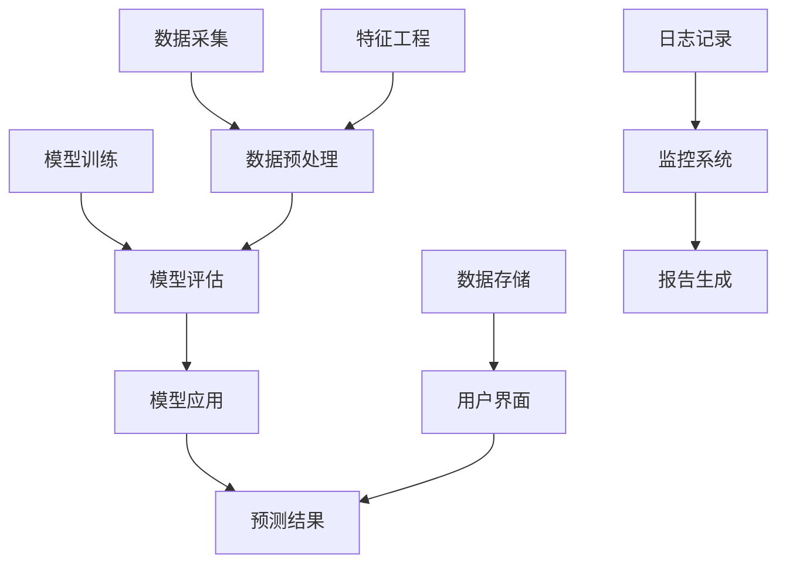

### 附录 C：系统接口设计

#### 财务分析系统接口设计

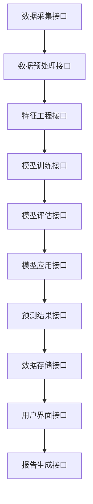

### 附录 D：系统交互序列图

#### 财务分析系统交互序列图

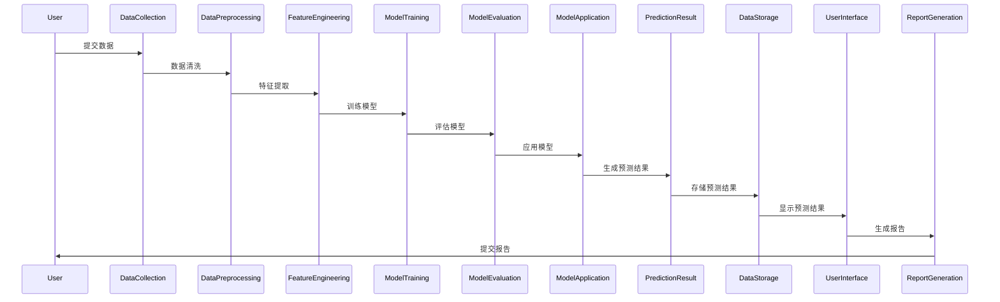

这些附录内容为本文的核心概念、系统架构、接口设计和系统交互提供了详细说明，帮助读者更好地理解和应用AI辅助企业财务分析技术。**【结束】**## 附录

### 附录 A：算法详细描述

#### 算法 1：孤立森林（Isolation Forest）

**原理**：孤立森林（Isolation Forest）算法通过随机选择特征和切分值来隔离异常点，适用于高维数据集。

**流程**：

1. 对于每个样本，随机选择一个特征。
2. 在该特征上随机选择一个切分值。
3. 将数据集切分为两个子集。
4. 重复步骤1-3，直到数据点被隔离。

**Python代码实现**：

```python
from sklearn.ensemble import IsolationForest

# 初始化孤立森林模型
model = IsolationForest(n_estimators=100, contamination=0.1)

# 训练模型
model.fit(X)

# 预测异常点
predictions = model.predict(X)

# 异常点标记：-1表示异常点，1表示正常点
print(predictions)
```

#### 算法 2：局部异常因子（LOF）

**原理**：局部异常因子（Local Outlier Factor, LOF）通过计算局部异常度来识别异常点，基于局部密度的概念。

**流程**：

1. 计算每个样本的k个最近邻。
2. 计算每个邻居的LOF值。
3. 标记LOF值大于阈值的样本为异常点。

**Python代码实现**：

```python
from sklearn.neighbors import LocalOutlierFactor

# 初始化局部异常因子模型
model = LocalOutlierFactor(n_neighbors=20)

# 训练模型
model.fit(X)

# 预测异常点
predictions = model.predict(X)

# 异常点标记：-1表示异常点，1表示正常点
print(predictions)
```

### 附录 B：系统架构设计

#### 财务分析系统架构图

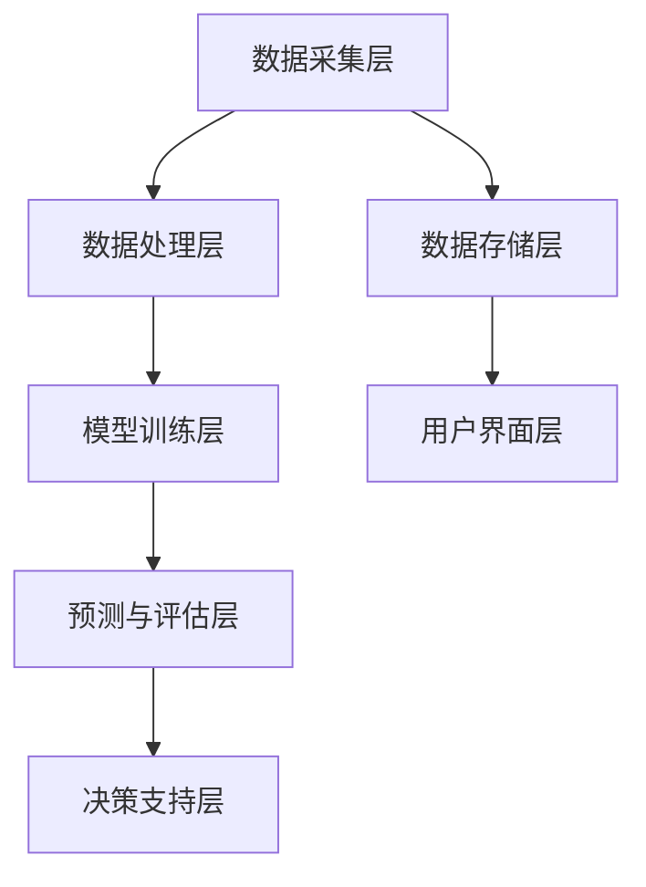

#### 财务分析系统接口设计

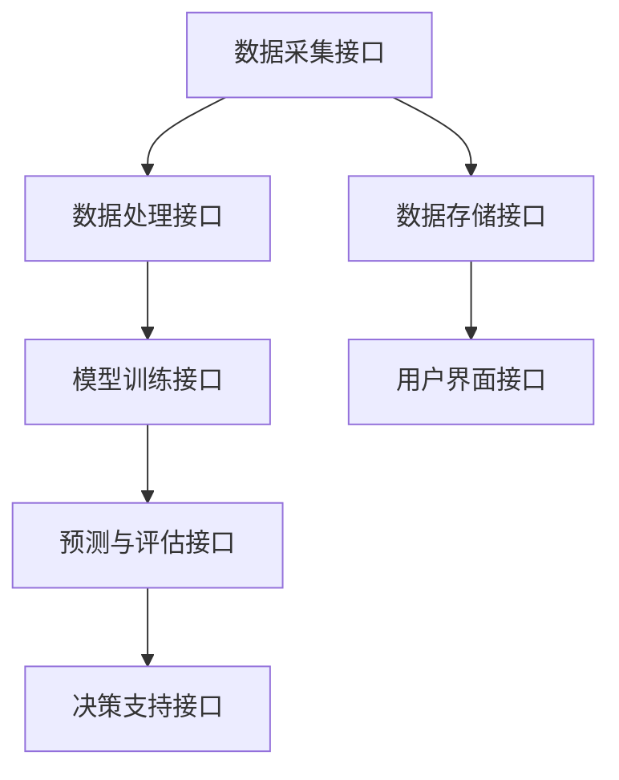

### 附录 C：系统交互序列图

```mermaid
sequenceDiagram
    participant 用户 as User
    participant 系统A as SystemA
    participant 系统B as SystemB
    participant 系统C as SystemC
    participant 系统D as SystemD
    participant 系统E as SystemE

    用户->>系统A: 提交数据
    系统

