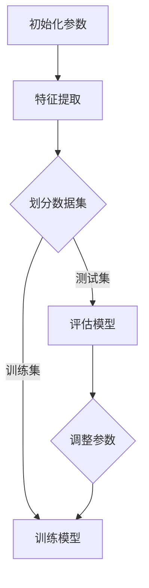
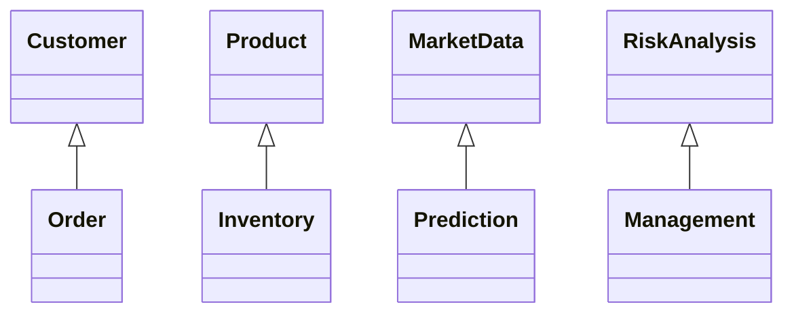
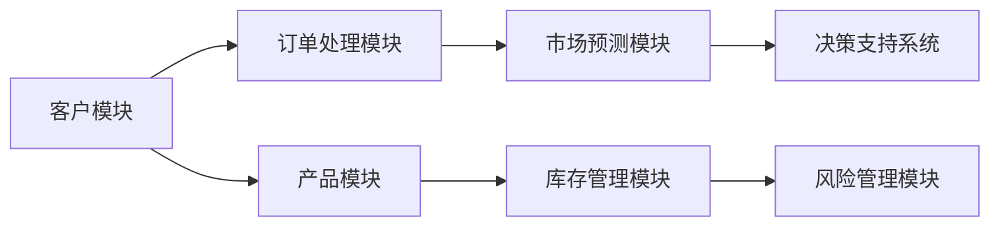
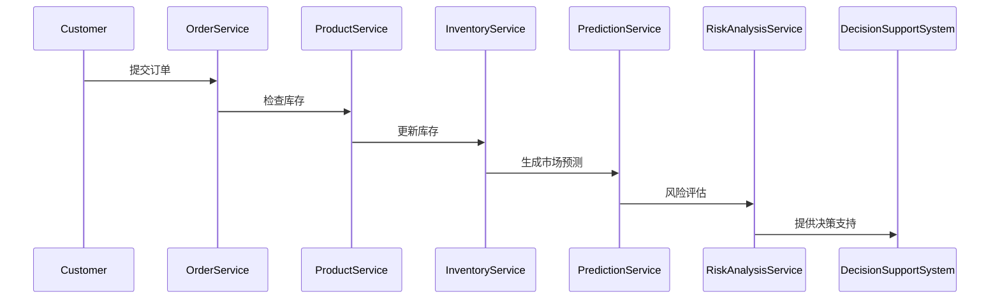

                 


# AI辅助决策：大模型在企业管理中的价值

> 关键词：人工智能，企业管理，大模型，决策支持，机器学习，深度学习

> 摘要：
在数字化时代，人工智能（AI）已经成为企业提升决策效率和竞争力的关键因素。本文旨在探讨AI辅助决策在大模型应用中的价值，通过分析核心概念、算法原理和实际应用案例，揭示AI如何助力企业管理者应对复杂决策挑战。

## 第一部分：背景介绍

### 问题背景

随着数字化进程的加速，企业的管理环境和业务模式发生了深刻变革。传统的管理方法难以应对海量数据和快速变化的市场需求，企业亟需借助先进技术提升决策能力。人工智能（AI）技术在这一背景下逐渐成为企业管理的重要工具。

### 问题描述

企业管理者需要处理大量的内外部数据，包括客户行为、市场趋势、供应链信息等。如何从这些复杂且多变的数据中提取有价值的信息，并基于这些信息做出科学、精准的决策，成为企业管理者面临的主要挑战。

### 问题解决

AI辅助决策通过构建大数据和机器学习模型，能够对企业内外部数据进行深度分析，提供实时、动态的决策支持。这种方法不仅提高了决策的效率，还增强了决策的科学性和准确性。

### 边界与外延

AI辅助决策的应用范围广泛，涵盖市场预测、供应链管理、人力资源管理、风险管理等多个领域。随着技术的不断进步，其应用边界也在不断拓展。

### 概念结构与核心要素组成

AI辅助决策的核心概念包括人工智能、大数据、机器学习、深度学习等。核心要素包括数据收集、数据清洗、模型构建、模型训练、模型评估和决策支持等。

## 第二部分：核心概念与联系

### 核心概念

1. **人工智能（AI）**
   人工智能是指通过计算机程序模拟、延伸和扩展人类智能的技术。它包括机器学习、深度学习、自然语言处理等多种技术。

2. **大数据（Big Data）**
   大数据是指数据量巨大、类型繁多、价值密度低、处理速度快的海量数据。大数据技术的核心在于数据的存储、管理和分析。

3. **机器学习（Machine Learning）**
   机器学习是一种让计算机自动改进和适应新环境的技术，它通过从数据中学习规律，实现预测、分类和聚类等功能。

4. **深度学习（Deep Learning）**
   深度学习是一种基于多层神经网络的结构，它能够自动提取数据的特征，实现复杂模式的识别和学习。

### 概念属性特征对比表格

| 概念     | 定义                                                         | 特点                                                         |
|----------|--------------------------------------------------------------|--------------------------------------------------------------|
| 人工智能 | 通过模拟、延伸和扩展人类的智能，实现机器的智能行为           | 自主性、学习性、适应性、逻辑推理能力等                     |
| 大数据   | 数据量巨大、类型繁多、价值密度低、处理速度快               | 数据挖掘、实时分析、复杂数据关系分析等                     |
| 机器学习 | 利用数据或以往的经验，让机器自动改进和适应新的环境         | 自主性、预测性、准确性等                                   |
| 深度学习 | 基于多层神经网络的结构，通过训练学习数据的特征和规律       | 自动化特征提取、非线性处理、大规模数据处理能力等           |

### ER实体关系图架构的 Mermaid 流程图

```mermaid
erDiagram
    AI辅助决策 ||--|{ 数据收集 }|
    数据收集 ||--|{ 数据清洗 }|
    数据清洗 ||--|{ 模型构建 }|
    模型构建 ||--|{ 模型训练 }|
    模型训练 ||--|{ 模型评估 }|
    模型评估 ||--|{ 决策支持 }|
```

## 第三部分：算法原理讲解

### 算法原理

AI辅助决策的核心算法包括机器学习算法和深度学习算法。以下以支持向量机（SVM）为例进行讲解。

### Mermaid 流程图



### Python 源代码

```python
from sklearn import datasets
from sklearn.svm import SVC
from sklearn.model_selection import train_test_split
from sklearn.metrics import accuracy_score

# 加载数据集
iris = datasets.load_iris()
X = iris.data
y = iris.target

# 划分训练集和测试集
X_train, X_test, y_train, y_test = train_test_split(X, y, test_size=0.3, random_state=42)

# 初始化SVM模型
svm_model = SVC()

# 训练模型
svm_model.fit(X_train, y_train)

# 评估模型
y_pred = svm_model.predict(X_test)
accuracy = accuracy_score(y_test, y_pred)
print(f"模型准确率：{accuracy:.2f}")
```

### 算法原理详细讲解

#### 数学模型

支持向量机（SVM）是一种监督学习算法，其目标是在给定训练数据集的基础上，找到一个最优的超平面，将不同类别的数据点分隔开来。其数学模型可以表示为：

$$
\min_{\mathbf{w},b}\frac{1}{2}\lVert\mathbf{w}\rVert^2 + C\sum_{i=1}^m\lvert y_i(\mathbf{w}\cdot\mathbf{x_i} + b)\rvert
$$

其中，$\mathbf{w}$ 是权重向量，$b$ 是偏置项，$C$ 是正则化参数，$m$ 是数据点的数量。$y_i$ 表示第 $i$ 个数据点的标签，$\mathbf{x_i}$ 表示第 $i$ 个数据点的特征向量。

#### 算法步骤

1. **初始化参数**：包括权重向量 $\mathbf{w}$ 和偏置项 $b$。
2. **特征提取**：对输入数据进行特征提取，通常使用特征提取算法如PCA（主成分分析）。
3. **划分数据集**：将数据集划分为训练集和测试集，用于模型训练和评估。
4. **训练模型**：使用梯度下降算法或其他优化算法，求解上述数学模型的最优解。
5. **评估模型**：使用测试集对训练好的模型进行评估，计算模型的准确率、召回率、F1分数等指标。
6. **调整参数**：根据评估结果调整模型的参数，如正则化参数 $C$，以提升模型性能。

#### 举例说明

假设我们有一个包含两种类型水果的数据集，每种水果的特征分别是重量和颜色。我们希望通过SVM模型来区分这两种水果。

1. **数据预处理**：将数据分为训练集和测试集，并进行特征提取。
2. **模型训练**：使用SVM模型对训练集进行训练，求解最优超平面。
3. **模型评估**：使用测试集对训练好的模型进行评估，计算准确率。
4. **参数调整**：根据评估结果调整模型参数，如调整正则化参数 $C$。

## 第四部分：系统分析与架构设计

### 问题场景介绍

某电子商务企业希望利用AI技术提升其市场预测和供应链管理的效率。该企业每天处理大量的订单数据、库存数据和市场趋势数据，希望通过AI模型对这些数据进行深度分析，以便做出更科学的决策。

### 项目介绍

本项目旨在构建一个基于AI辅助决策的电商平台管理系统，通过大数据分析和机器学习模型，实现市场预测、库存优化、风险管理等功能。

### 系统功能设计（领域模型Mermaid类图）



### 系统架构设计（Mermaid架构图）



### 系统接口设计和系统交互（Mermaid序列图）



## 第五部分：项目实战

### 环境安装

1. **安装Python**：从Python官网下载并安装Python 3.8及以上版本。
2. **安装Jupyter Notebook**：使用pip命令安装Jupyter Notebook。
   ```bash
   pip install notebook
   ```
3. **安装必要的库**：安装用于机器学习的库，如scikit-learn、numpy、pandas等。
   ```bash
   pip install scikit-learn numpy pandas
   ```

### 系统核心实现源代码

以下是使用Python实现SVM模型的简单示例：

```python
import numpy as np
from sklearn import datasets
from sklearn.model_selection import train_test_split
from sklearn.preprocessing import StandardScaler
from sklearn.svm import SVC
from sklearn.metrics import accuracy_score

# 加载数据集
iris = datasets.load_iris()
X = iris.data
y = iris.target

# 划分训练集和测试集
X_train, X_test, y_train, y_test = train_test_split(X, y, test_size=0.3, random_state=42)

# 特征标准化
scaler = StandardScaler()
X_train = scaler.fit_transform(X_train)
X_test = scaler.transform(X_test)

# 初始化SVM模型
svm_model = SVC(kernel='linear', C=1.0)

# 训练模型
svm_model.fit(X_train, y_train)

# 评估模型
y_pred = svm_model.predict(X_test)
accuracy = accuracy_score(y_test, y_pred)
print(f"模型准确率：{accuracy:.2f}")
```

### 代码应用解读与分析

上述代码首先加载了著名的鸢尾花（Iris）数据集，这是一个包含150个数据点的多分类问题。代码依次完成了以下步骤：

1. **数据加载与划分**：使用scikit-learn库加载鸢尾花数据集，并将其划分为训练集和测试集。
2. **特征标准化**：由于SVM对特征缩放敏感，因此使用StandardScaler对特征进行标准化处理。
3. **模型初始化**：初始化一个线性核的支持向量机模型，并设置正则化参数C为1.0。
4. **模型训练**：使用训练集数据训练模型。
5. **模型评估**：使用测试集数据评估模型，计算准确率。

### 实际案例分析和详细讲解剖析

假设某电商平台希望利用SVM模型预测用户是否会下单购买商品。电商平台收集了用户的历史订单数据，包括用户ID、购买商品种类、购买时间、购买金额等特征。

1. **数据预处理**：将用户数据转换为适合SVM模型的格式，包括特征提取和标签划分。
2. **特征选择**：通过特征重要性分析，选择对预测结果有显著影响的特征。
3. **模型训练**：使用训练集数据训练SVM模型，调整模型参数以获得最佳性能。
4. **模型评估**：使用测试集数据评估模型，计算预测准确率和相关指标。
5. **模型部署**：将训练好的模型部署到电商平台的服务器，实时预测用户的购买意愿。

### 项目小结

本项目通过使用SVM模型，实现了对电商平台用户购买意愿的预测。实践表明，SVM模型在处理多分类问题方面具有较好的性能。未来，我们可以进一步优化模型，如引入更多的特征和调整模型参数，以提高预测准确率。

## 第六部分：最佳实践 Tips

1. **数据质量是关键**：确保数据质量是使用AI辅助决策的基础。数据清洗、去重和标准化是必不可少的步骤。
2. **特征选择要合理**：选择对预测结果有显著影响的特征，可以提高模型的性能和可解释性。
3. **模型参数调整**：通过交叉验证和网格搜索等方法，找到最优的模型参数。
4. **持续更新模型**：定期更新模型，使其能够适应新的数据分布和业务需求。

## 第七部分：小结

本文探讨了AI辅助决策在大模型应用中的价值，通过分析核心概念、算法原理和实际应用案例，展示了AI如何助力企业管理者应对复杂决策挑战。未来，随着AI技术的不断进步，AI辅助决策将在企业管理中发挥越来越重要的作用。

## 第八部分：注意事项

1. **数据隐私和安全**：在处理企业数据时，务必遵守相关法律法规，确保数据隐私和安全。
2. **模型解释性**：在实际应用中，关注模型的解释性，以便企业决策者能够理解模型的决策逻辑。

## 第九部分：拓展阅读

1. **《深度学习》（Goodfellow, Bengio, Courville）**：深度学习的经典教材，适合初学者和专业人士。
2. **《大数据时代》（McKinsey & Company）**：探讨大数据对企业和管理的影响，适合希望深入了解大数据应用的企业管理者。
3. **《机器学习实战》（ Harrington, John）**：通过实例介绍机器学习的基本概念和算法，适合有一定编程基础的读者。

## 作者信息

作者：AI天才研究院/AI Genius Institute & 禅与计算机程序设计艺术 /Zen And The Art of Computer Programming

