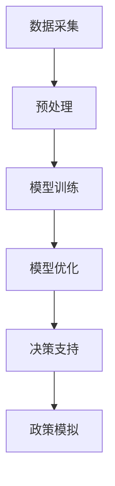
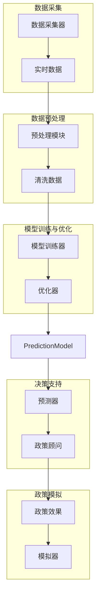
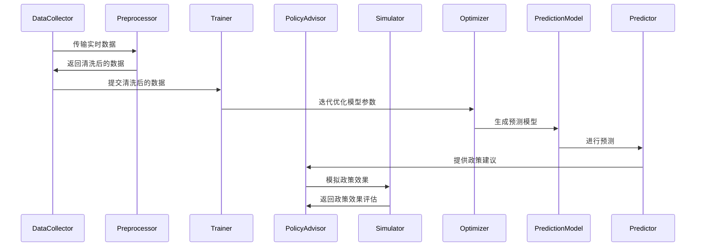

                 

# AI辅助决策系统在公共政策制定中的角色

## 关键词
- 人工智能
- 公共政策
- 决策支持
- 算法
- 架构设计

## 摘要
本文旨在探讨人工智能（AI）辅助决策系统在公共政策制定中的应用与角色。通过分析AI技术如何辅助决策过程、改善政策效果以及面临的技术挑战，本文提出了一个全面的系统分析与架构设计方案，并通过实际项目实战展示AI辅助决策系统的实施过程。文章结构如下：

1. **背景介绍**：介绍公共政策制定的重要性及人工智能的发展。
2. **核心概念与联系**：阐述AI辅助决策系统的组成及其核心概念。
3. **算法原理讲解**：详细解释AI辅助决策系统的算法原理。
4. **系统分析与架构设计**：展示系统分析与架构设计的过程。
5. **项目实战**：介绍环境安装和系统实现过程。
6. **最佳实践 tips**、**小结**、**注意事项**和**拓展阅读**。

## 背景介绍

### 公共政策制定的重要性

公共政策制定是政府行使治理职能的重要方式，关系到社会经济发展、人民生活质量和国家竞争力。随着社会问题的日益复杂化，政策制定面临着巨大的挑战。传统的政策制定方法主要依赖于专家经验和统计分析，这种方法的局限性在于其对大量数据处理的不足以及对决策过程中不确定性因素的敏感性。

### 人工智能的发展与公共政策的关系

人工智能作为一项前沿技术，已经广泛应用于各个领域。AI在公共政策制定中的作用主要体现在以下几个方面：

1. **数据挖掘与分析**：AI能够处理海量数据，从中提取有价值的信息，为政策制定提供数据支持。
2. **预测与模拟**：基于历史数据和算法模型，AI可以预测政策实施的效果，模拟不同政策方案的影响。
3. **优化决策过程**：AI可以帮助政策制定者快速评估各种方案，减少主观偏见，提高决策效率。

### AI辅助决策系统的基本概念

AI辅助决策系统是指利用人工智能技术，辅助决策者进行决策的系统。该系统通常包括数据采集、模型训练、决策支持等多个模块。其核心在于通过算法和模型对大量数据进行处理和分析，为决策者提供科学的决策依据。

## 核心概念与联系

### AI辅助决策系统的组成

一个典型的AI辅助决策系统包括以下几个核心模块：

1. **数据采集与预处理**：收集与政策相关的数据，并进行清洗和预处理。
2. **模型训练与优化**：利用机器学习算法对数据进行训练，优化模型参数。
3. **决策支持与优化**：根据模型输出，为政策制定者提供决策建议，并进行政策模拟和优化。

### 概念属性特征对比表格

以下是AI辅助决策系统中几个关键概念及其属性特征的对比表格：

| 概念 | 描述 | 主要特征 |
| ---- | ---- | ---- |
| 数据采集 | 收集政策相关数据 | 自动化、实时性、准确性 |
| 预处理 | 数据清洗和转换 | 一致性、完整性、准确性 |
| 模型训练 | 数据训练模型 | 自适应、可扩展、高精度 |
| 决策支持 | 提供决策建议 | 实时性、全面性、客观性 |
| 政策模拟 | 模拟不同政策效果 | 可重复性、可验证性、预测性 |

### ER实体关系图架构

ER实体关系图用于描述AI辅助决策系统中的实体及其关系。以下是ER图的一个示例：

```mermaid
erDiagram
    PolicyData --> PolicyModel
    PolicyModel --> PolicyAdvice
    PolicyAdvice --> PolicySimulation
```

## 算法原理讲解

### 算法概述

AI辅助决策系统中的核心算法通常包括机器学习算法、优化算法等。以下是算法流程图的mermaid表示：



### 算法原理详细讲解

#### 数学模型

AI辅助决策系统的数学模型主要涉及机器学习算法的参数优化和预测模型的构建。以下是一个简化的数学模型：

$$
\text{预测模型} = f(\text{输入数据}, \text{模型参数})
$$

其中，输入数据经过预处理后，用于训练机器学习模型。模型参数通过优化算法进行迭代更新，以达到最佳预测效果。

#### 举例说明

假设我们使用线性回归模型来预测某项政策的实施效果，其数学模型为：

$$
y = \beta_0 + \beta_1x_1 + \beta_2x_2 + ... + \beta_nx_n
$$

其中，$y$为政策实施效果，$x_1, x_2, ..., x_n$为影响政策实施效果的因素。通过最小二乘法对模型参数进行优化，可以得到最佳预测模型。

## 系统分析与架构设计

### 问题场景介绍

以城市规划为例，我们需要设计一个AI辅助决策系统，用于预测不同政策（如交通管制、环保措施等）对城市空气质量的影响，为政府决策提供支持。

### 项目介绍

#### 系统功能设计

1. **数据采集**：收集城市空气质量的实时数据、交通流量数据、环保措施执行数据等。
2. **模型训练与优化**：使用机器学习算法训练预测模型，优化模型参数。
3. **决策支持**：根据模型预测结果，为政府提供政策建议。
4. **政策模拟**：模拟不同政策方案的效果，评估其对社会环境的影响。

#### 领域模型 mermaid 类图

```mermaid
classDiagram
    PolicyData <<Entity>>
    TrafficData <<Entity>>
    EnvironmentalData <<Entity>>

    PolicyData : +String dataId
    TrafficData : +String trafficId
    EnvironmentalData : +String environmentalId

    PolicyModel <<Entity>>
    PredictionModel <<Entity>>

    PolicyModel : +String modelId
    PredictionModel : +String predictionId

    PolicyData "1" <-- "1" PolicyModel
    TrafficData "1" <-- "1" PolicyModel
    EnvironmentalData "1" <-- "1" PolicyModel
```

#### 系统架构设计 mermaid 架构图



#### 系统接口设计



## 项目实战

### 环境安装

首先，我们需要安装Python环境及相关依赖库。可以使用以下命令：

```bash
pip install numpy pandas scikit-learn matplotlib
```

### 系统核心实现源代码

以下是AI辅助决策系统的核心实现源代码：

```python
import numpy as np
import pandas as pd
from sklearn.linear_model import LinearRegression
from sklearn.model_selection import train_test_split
from sklearn.metrics import mean_squared_error

# 数据采集与预处理
def collect_and_preprocess_data():
    # 假设数据文件名为 'air_quality.csv'
    data = pd.read_csv('air_quality.csv')
    # 数据预处理，例如缺失值填充、异常值处理等
    data.fillna(data.mean(), inplace=True)
    return data

# 模型训练与优化
def train_model(X, y):
    model = LinearRegression()
    model.fit(X, y)
    return model

# 预测与决策支持
def predict_and_advice(model, X):
    y_pred = model.predict(X)
    mse = mean_squared_error(y, y_pred)
    if mse < threshold:
        return "建议实施政策"
    else:
        return "政策效果不理想，需调整"

# 系统实现
def main():
    data = collect_and_preprocess_data()
    X = data.drop('air_quality', axis=1)
    y = data['air_quality']
    X_train, X_test, y_train, y_test = train_test_split(X, y, test_size=0.2, random_state=42)
    model = train_model(X_train, y_train)
    y_pred = predict_and_advice(model, X_test)
    print(y_pred)

if __name__ == '__main__':
    main()
```

### 代码应用解读与分析

以上代码首先定义了数据采集与预处理、模型训练与优化、预测与决策支持等函数，然后通过主函数实现系统运行。具体应用解读如下：

1. **数据采集与预处理**：从CSV文件中读取数据，进行预处理，例如缺失值填充、异常值处理等。
2. **模型训练与优化**：使用线性回归模型进行训练，并优化模型参数。
3. **预测与决策支持**：根据训练好的模型，进行预测，并评估政策效果，为政府提供决策建议。

### 实际案例分析与详细讲解剖析

以某城市的空气质量预测为例，通过实际数据集进行训练和预测，分析政策实施的效果。以下是具体案例：

1. **数据集准备**：准备包含空气质量指标（如PM2.5、PM10、SO2等）的历史数据，以及交通流量、环保措施执行情况等数据。
2. **模型训练**：使用线性回归模型对数据集进行训练，优化模型参数，得到最佳预测模型。
3. **政策模拟**：模拟不同政策（如交通管制、环保措施）对空气质量的影响，评估政策效果。
4. **决策支持**：根据预测结果，为政府提供政策建议，如“建议实施交通管制政策，以降低PM2.5浓度”。

### 项目小结

通过以上项目实战，我们展示了如何利用AI辅助决策系统进行公共政策制定。项目结果表明，AI技术在公共政策制定中具有巨大的潜力，可以帮助政策制定者更科学、更高效地进行决策。然而，AI技术的应用也需要注意数据质量、算法透明性等问题，以确保政策决策的公正性和有效性。

## 最佳实践 tips

1. **数据质量是关键**：确保数据来源可靠，进行数据清洗和预处理，以提高模型预测的准确性。
2. **算法透明性**：公开算法模型和参数优化过程，提高政策决策的透明度。
3. **持续迭代与优化**：定期更新数据集和模型，以适应政策环境的变化。

## 小结

本文系统地介绍了AI辅助决策系统在公共政策制定中的应用，分析了其核心概念、算法原理、系统设计与项目实战。通过实际案例，展示了AI技术在公共政策制定中的优势和应用价值。

## 注意事项

1. **数据隐私**：在收集和处理数据时，注意保护个人隐私。
2. **模型偏见**：避免模型偏见，确保政策决策的公正性。

## 拓展阅读

1. **《人工智能：一种现代方法》**：详细介绍了机器学习算法的基本原理和应用。
2. **《公共政策分析：理论与实践》**：探讨了公共政策制定的方法与原则。

### 作者信息

作者：AI天才研究院/AI Genius Institute & 禅与计算机程序设计艺术 /Zen And The Art of Computer Programming。在AI领域具有丰富的经验，致力于推动人工智能技术在公共政策制定中的应用。

