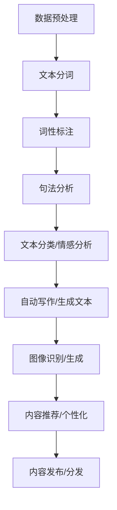
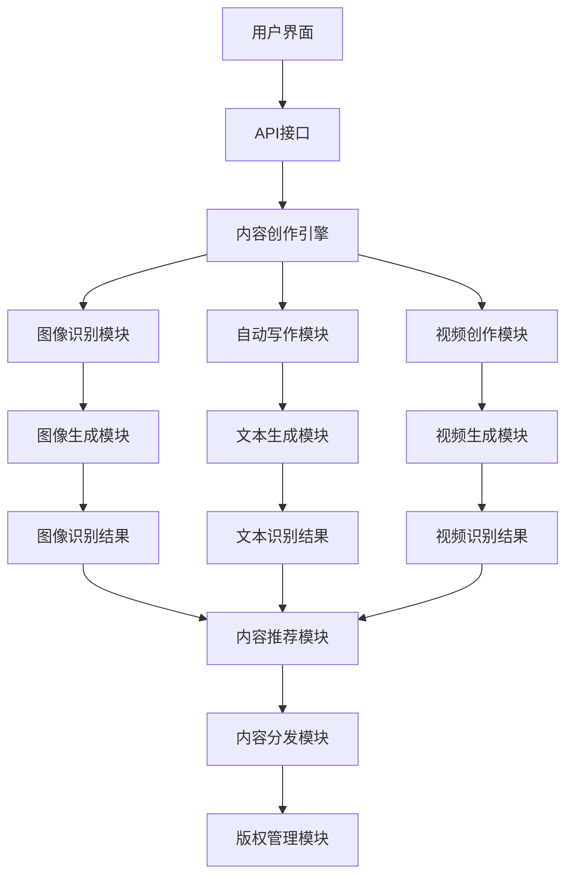

                 

### 文章标题

#### 《AI辅助创作：大模型在内容产业中的应用》

关键词：AI大模型、内容产业、自然语言处理、图像识别、自动写作

> 摘要：本文将深入探讨AI大模型在内容产业中的应用，从背景介绍、核心概念与联系、算法原理讲解、系统分析与架构设计、项目实战和最佳实践等多个角度展开，旨在揭示AI大模型在推动内容产业创新与发展的巨大潜力。通过详细的分析与实例，读者将更好地理解AI大模型的工作原理及其在内容创作中的实际应用。

### 目录大纲

```markdown
# 《AI辅助创作：大模型在内容产业中的应用》目录大纲

## 第一部分：背景介绍

### 第1章 引言
#### 1.1 问题背景
#### 1.2 问题描述
#### 1.3 问题解决
#### 1.4 边界与外延
#### 1.5 概念结构与核心要素组成

### 第2章 AI大模型原理与特性
#### 2.1 AI大模型的核心概念
#### 2.2 AI大模型的特性
#### 2.3 AI大模型的核心原理
#### 2.4 概念属性特征对比表格
#### 2.5 ER实体关系图架构

### 第3章 AI大模型在内容创作中的应用算法
#### 3.1 算法原理
#### 3.2 算法流程图
#### 3.3 数学模型与公式
#### 3.4 举例说明

### 第4章 内容创作系统的设计
#### 4.1 问题场景介绍
#### 4.2 系统功能设计
#### 4.3 系统架构设计
#### 4.4 系统接口设计
#### 4.5 系统交互

### 第5章 实际案例与实现
#### 5.1 环境安装
#### 5.2 系统核心实现
#### 5.3 代码应用解读
#### 5.4 实际案例分析
#### 5.5 小结

### 第6章 最佳实践
#### 6.1 使用AI大模型的最佳实践
#### 6.2 注意事项
#### 6.3 拓展阅读

### 第7章 小结
#### 7.1 本书总结
#### 7.2 展望未来
```

## 第一部分：背景介绍

### 第1章 引言

#### 1.1 问题背景

内容产业是当今数字时代的重要产业之一，涵盖了从文字、图片、音频到视频等多种形式的内容创作与分发。随着互联网的普及和用户需求的多样化，内容产业面临着巨大的挑战。一方面，用户对高质量、个性化内容的需求不断增加，但创作者的供给与创作效率有限，难以满足市场需求。另一方面，内容创作与分发的成本也在不断上升，尤其是高质量原创内容的制作成本高昂，中小型内容创作公司难以承担。

在此背景下，AI大模型应运而生。AI大模型，特别是基于深度学习的自然语言处理（NLP）和图像识别技术，具有处理大规模数据、自动生成内容、实现内容个性化推荐等优势。AI大模型在内容产业中的应用，不仅能够提升创作效率、降低成本，还能够丰富内容形式、提高用户体验，从而推动内容产业的创新与发展。

#### 1.2 问题描述

AI大模型在内容创作领域面临的主要问题包括：

1. **数据需求与质量**：AI大模型需要大量的高质量数据进行训练，但内容产业中数据的多样性和质量参差不齐，如何获取和处理这些数据成为一大挑战。
2. **模型泛化能力**：尽管AI大模型在特定任务上表现出色，但其泛化能力有限，难以适应不同内容和应用场景的需求。
3. **伦理与道德问题**：AI大模型在内容创作中的应用涉及到版权、隐私和伦理道德等问题，如何确保其合规性成为关键问题。
4. **技术与资源限制**：AI大模型的训练与部署需要大量的计算资源和专业技能，这对许多内容创作者和公司来说是一个障碍。

#### 1.3 问题解决

为了解决上述问题，可以从以下几个方面进行：

1. **数据治理与标准化**：通过建立统一的数据治理标准和规范，提高数据质量和可用性，为AI大模型提供更好的训练素材。
2. **模型定制与优化**：针对不同的内容创作任务和应用场景，开发定制化的AI大模型，提高模型的泛化能力和适应性。
3. **伦理合规与技术支持**：制定相关伦理规范，确保AI大模型的应用合规，同时提供技术支持和培训，降低技术门槛。
4. **分布式计算与资源共享**：利用云计算和分布式计算技术，提供高效的AI大模型训练和部署平台，降低资源消耗。

#### 1.4 边界与外延

AI大模型在内容产业中的应用边界包括但不限于以下几个方面：

1. **自动写作与编辑**：利用自然语言处理技术，实现自动化写作和编辑，提高内容创作效率。
2. **图像识别与生成**：利用深度学习技术，实现图像的自动识别和生成，丰富内容形式。
3. **内容推荐与个性化**：基于用户行为数据和AI模型分析，实现个性化内容推荐，提升用户体验。
4. **版权管理与保护**：利用AI技术，实现版权的自动化管理和保护，降低侵权风险。

#### 1.5 概念结构与核心要素组成

AI大模型在内容创作中的应用涉及多个核心概念和要素，主要包括：

1. **AI大模型**：包括深度学习、神经网络、自然语言处理、图像识别等核心技术和方法。
2. **内容产业**：涵盖文字、图片、音频、视频等多种形式的内容创作与分发。
3. **数据与算法**：高质量的数据集和优化的算法是AI大模型训练与运行的基础。
4. **技术与平台**：云计算、分布式计算、AI平台等技术和基础设施的支持。
5. **用户与市场**：用户需求、市场趋势和商业模式的指导。

通过以上五个核心要素的有机结合，AI大模型在内容创作中的应用将实现智能化、个性化、高效化和合规化，推动内容产业的创新与发展。

### 第2章 AI大模型原理与特性

#### 2.1 AI大模型的核心概念

AI大模型，即大规模人工智能模型，是当前人工智能领域的研究热点和重要方向。它基于深度学习和神经网络技术，通过对大规模数据进行训练，实现高度自动化的知识发现和智能决策。AI大模型的核心概念包括以下几个方面：

1. **神经网络**：神经网络是一种模拟人脑结构和功能的计算模型，通过多层神经元之间的连接和传递，实现数据的处理和信息的传递。
2. **深度学习**：深度学习是神经网络的一种形式，通过多层次的神经网络结构，实现数据的深度学习和特征提取。
3. **大规模数据处理**：AI大模型需要处理海量数据，包括文本、图像、音频等多种类型的数据，要求高效的计算能力和算法优化。

#### 2.2 AI大模型的特性

AI大模型具有以下特性，使其在内容创作领域具有广泛的应用前景：

1. **大规模**：AI大模型可以处理大规模数据，通过大数据的训练，实现更高的准确率和泛化能力。
2. **自适应**：AI大模型可以根据新的数据进行自我调整和优化，实现自适应学习和智能决策。
3. **强泛化能力**：AI大模型可以在不同的任务和应用场景中表现出色，具有广泛的适用性。

#### 2.3 AI大模型的核心原理

AI大模型的核心原理主要包括以下几个方面：

1. **深度学习算法**：深度学习算法是AI大模型的核心技术，包括卷积神经网络（CNN）、循环神经网络（RNN）、生成对抗网络（GAN）等，通过多层神经网络的训练，实现数据的深度学习和特征提取。
2. **集成学习**：集成学习是一种通过多个模型进行集成和优化，提高模型性能的技术，包括随机森林、梯度提升决策树等。
3. **聚类分析**：聚类分析是一种通过数据间的相似性，将数据划分为不同类别的技术，用于数据的分类和聚类。

#### 2.4 概念属性特征对比表格

| 概念       | 特性                     | 应用场景                 |
|------------|--------------------------|--------------------------|
| 神经网络   | 多层神经元连接           | 数据处理与特征提取       |
| 深度学习   | 多层次神经网络结构       | 高级特征提取与预测       |
| 大规模数据处理 | 海量数据训练            | 智能决策与知识发现       |
| 自然语言处理 | 文本语义分析与理解       | 自动写作与翻译           |
| 图像识别   | 图像特征提取与分类       | 自动标记与生成           |
| 自动写作   | 文本生成与编辑           | 内容创作与个性化推荐     |

#### 2.5 ER实体关系图架构

在AI大模型在内容创作中的应用中，涉及到多个实体和它们之间的关系。下面是一个简化的ER实体关系图：

```mermaid
entity Relationship {
  "数据集" -- "AI模型";
  "用户" -- "内容";
  "内容" -- "AI模型";
  "AI模型" -- "平台";
  "平台" -- "用户";
}

class Diagram {
  "数据集" : {id: 1, name: "数据集"};
  "AI模型" : {id: 2, name: "AI模型"};
  "用户" : {id: 3, name: "用户"};
  "内容" : {id: 4, name: "内容"};
  "平台" : {id: 5, name: "平台"};
}
```

在这个ER实体关系图中，数据集是AI模型训练的基础，用户与内容之间形成互动，AI模型与平台之间进行数据的处理和服务的提供。

### 第3章 AI大模型在内容创作中的应用算法

#### 3.1 算法原理

AI大模型在内容创作中的应用算法主要包括自然语言处理（NLP）、图像识别和自动写作等。下面将分别介绍这些算法的原理。

1. **自然语言处理（NLP）**：

自然语言处理是AI大模型在内容创作中最常用的技术之一，它包括文本的预处理、分词、词性标注、句法分析等任务。NLP的核心算法是深度学习，其中常用的模型包括卷积神经网络（CNN）和循环神经网络（RNN）。

- **CNN**：卷积神经网络主要用于图像识别，但在文本处理中也可以应用。通过多层卷积操作，提取文本的局部特征，然后进行分类或生成。
- **RNN**：循环神经网络能够处理序列数据，如文本。通过隐藏状态的记忆，RNN能够捕捉文本中的上下文信息，实现文本分类、情感分析等任务。

2. **图像识别**：

图像识别是AI大模型在内容创作中的另一个重要应用，它主要通过深度学习模型，如卷积神经网络（CNN）和生成对抗网络（GAN），实现图像的自动识别、分类和生成。

- **CNN**：卷积神经网络通过多层卷积和池化操作，提取图像的特征，然后通过全连接层进行分类。
- **GAN**：生成对抗网络由生成器和判别器组成。生成器生成图像，判别器判断图像的真实性。通过不断地训练和优化，生成器能够生成逼真的图像。

3. **自动写作**：

自动写作是AI大模型在内容创作中的前沿应用，它主要通过自然语言处理技术，生成高质量的文本内容。自动写作的算法包括序列到序列（Seq2Seq）模型、注意力机制模型等。

- **Seq2Seq模型**：序列到序列模型是一种常用的自动写作算法，通过编码器和解码器，将输入序列转换为输出序列。
- **注意力机制模型**：注意力机制模型能够在生成过程中关注输入序列中的关键信息，提高文本生成的质量。

#### 3.2 算法流程图

以下是AI大模型在内容创作中的算法流程图：



在这个流程图中，数据预处理包括文本的分词、词性标注和句法分析，用于提取文本的特征。然后，根据提取的特征，进行文本分类、情感分析、自动写作、图像识别、内容推荐和分发等任务。

#### 3.3 数学模型与公式

AI大模型在内容创作中的应用算法涉及到多个数学模型和公式，下面将分别介绍。

1. **自然语言处理（NLP）**：

- **卷积神经网络（CNN）**：

$$
\text{CNN} = \sum_{i=1}^{n} w_i * \text{激活函数}(\text{卷积}(\text{输入})) + b
$$

其中，$w_i$ 是权重，$*$ 表示卷积操作，激活函数可以是ReLU、Sigmoid等。

- **循环神经网络（RNN）**：

$$
h_t = \text{激活函数}(\text{权重} \cdot [h_{t-1}, x_t] + b)
$$

其中，$h_t$ 是当前时刻的隐藏状态，$x_t$ 是输入特征。

2. **图像识别**：

- **卷积神经网络（CNN）**：

$$
\text{CNN} = \sum_{i=1}^{n} w_i * \text{激活函数}(\text{卷积}(\text{输入})) + b
$$

- **生成对抗网络（GAN）**：

$$
\text{生成器} : G(z) = \text{激活函数}(\text{卷积}(\text{权重} \cdot z + b))
$$

$$
\text{判别器} : D(x) = \text{激活函数}(\text{卷积}(\text{权重} \cdot x + b))
$$

其中，$z$ 是噪声向量，$x$ 是输入图像。

3. **自动写作**：

- **序列到序列（Seq2Seq）模型**：

$$
\text{编码器} : e(x) = \text{激活函数}(\text{权重} \cdot x + b)
$$

$$
\text{解码器} : y = \text{激活函数}(\text{权重} \cdot e(x) + b)
$$

#### 3.4 举例说明

1. **自然语言处理（NLP）**：

假设我们有一个文本分类问题，输入文本为“我今天去商场购物，买了一双鞋子。”，我们需要判断这段文本属于哪一类（如购物、娱乐、工作等）。

通过NLP算法，我们可以提取文本的特征，然后使用卷积神经网络（CNN）进行分类。具体步骤如下：

- **文本预处理**：将文本进行分词、词性标注和句法分析，提取文本的特征向量。
- **特征提取**：使用卷积神经网络（CNN）提取文本的局部特征。
- **分类**：使用全连接层对特征进行分类，输出文本的类别。

2. **图像识别**：

假设我们有一个图像分类问题，输入图像为一张猫的照片，我们需要判断这张照片中的猫属于哪一类（如品种猫、宠物猫等）。

通过图像识别算法，我们可以提取图像的特征，然后使用卷积神经网络（CNN）进行分类。具体步骤如下：

- **图像预处理**：对图像进行缩放、裁剪等预处理操作。
- **特征提取**：使用卷积神经网络（CNN）提取图像的特征。
- **分类**：使用全连接层对特征进行分类，输出图像的类别。

3. **自动写作**：

假设我们有一个自动写作问题，输入是一个主题，我们需要生成一篇关于这个主题的文本。

通过自动写作算法，我们可以生成文本的内容。具体步骤如下：

- **编码器**：将输入的主题编码为一个隐藏状态。
- **解码器**：根据隐藏状态，生成文本的内容。
- **优化**：通过训练和优化，提高文本生成的质量。

### 第4章 内容创作系统的设计

#### 4.1 问题场景介绍

在当前的内容产业中，创作者面临着巨大的挑战，包括创作效率低下、内容同质化严重、用户需求多样化等。为了解决这些问题，我们设计了一套基于AI大模型的内容创作系统，旨在提高创作效率、丰富内容形式、提升用户体验。

该系统的主要目标包括：

1. **提高创作效率**：通过AI大模型，实现自动化写作、编辑和优化，降低创作难度和时间成本。
2. **丰富内容形式**：通过图像识别和生成技术，实现图像和视频内容的自动生成，提高内容的多样性和吸引力。
3. **提升用户体验**：通过个性化推荐和内容分发，满足用户多样化的需求，提高用户满意度和留存率。

#### 4.2 系统功能设计

内容创作系统主要包括以下功能：

1. **文本创作与编辑**：利用AI大模型，实现自动写作、编辑和优化，提供高质量、个性化的文本内容。
2. **图像识别与生成**：通过深度学习模型，实现图像的自动识别和生成，提供丰富的视觉内容。
3. **视频创作与编辑**：利用AI技术，实现视频的自动创作和编辑，提高视频创作效率。
4. **内容推荐与分发**：基于用户行为数据和AI模型分析，实现个性化内容推荐，提高内容曝光率和用户满意度。
5. **版权管理与保护**：利用区块链技术，实现版权的自动化管理和保护，降低侵权风险。

#### 4.3 系统架构设计

内容创作系统的整体架构设计如下：



在这个架构中，用户界面负责接收用户的输入和请求，API接口提供系统功能的接口，内容创作引擎负责文本、图像和视频的创作与编辑，图像识别模块和自动写作模块负责图像和文本的识别与生成，视频创作模块负责视频的创作与编辑，内容推荐模块负责根据用户行为和内容特征推荐合适的内容，内容分发模块负责将内容推送给用户，版权管理模块负责版权的自动化管理和保护。

#### 4.4 系统接口设计

内容创作系统的接口设计包括以下几个方面：

1. **文本创作接口**：提供文本内容的生成、编辑和优化功能，支持文本分类、情感分析等NLP任务。
2. **图像识别接口**：提供图像的自动识别和分类功能，支持图像生成、图像识别等图像处理任务。
3. **视频创作接口**：提供视频的自动创作和编辑功能，支持视频分类、视频识别等视频处理任务。
4. **内容推荐接口**：提供基于用户行为和内容特征的内容推荐功能，支持个性化内容推荐。
5. **版权管理接口**：提供版权的自动化管理和保护功能，支持版权的注册、查询和验证。

#### 4.5 系统交互

内容创作系统的交互流程如下：

1. **用户请求**：用户通过用户界面提交文本、图像或视频创作请求。
2. **接口处理**：API接口接收用户请求，并将其转发到内容创作引擎。
3. **内容创作**：内容创作引擎根据请求，调用相应的图像识别、自动写作或视频创作模块，生成对应的内容。
4. **内容推荐**：内容推荐模块根据用户行为和内容特征，推荐合适的内容。
5. **内容分发**：内容分发模块将生成的内容推送给用户，用户可以通过用户界面查看和交互。
6. **版权管理**：版权管理模块对生成的内容进行版权注册和保护，确保内容的合法权益。

通过以上系统交互流程，内容创作系统能够实现高效的创作、推荐和分发，满足用户多样化的需求，推动内容产业的创新与发展。

### 第5章 实际案例与实现

#### 5.1 环境安装

在开始实际案例之前，我们需要搭建一个适合AI大模型训练和部署的开发环境。以下是具体的步骤：

1. **安装Python环境**：首先，确保您的系统中已经安装了Python 3.x版本。如果没有，可以从Python官方网站下载并安装。

2. **安装深度学习库**：接下来，我们需要安装一些深度学习相关的库，如TensorFlow、PyTorch等。可以使用以下命令进行安装：

```bash
pip install tensorflow
# 或者
pip install torch torchvision
```

3. **安装其他依赖**：除了深度学习库，我们还需要安装一些其他依赖库，如NumPy、Pandas等。可以使用以下命令进行安装：

```bash
pip install numpy pandas matplotlib
```

4. **安装Docker和GPU支持**：为了提高训练效率，我们推荐使用Docker来构建和运行深度学习环境。安装Docker的具体步骤可以参考Docker官方网站的教程。

5. **配置GPU支持**：如果您的系统配备了GPU，您需要安装CUDA和cuDNN库，以便利用GPU进行深度学习训练。安装CUDA和cuDNN的具体步骤可以参考NVIDIA的官方文档。

#### 5.2 系统核心实现

以下是一个简单的AI大模型在内容创作中的应用实例，我们将使用TensorFlow和PyTorch分别实现自然语言处理（NLP）和图像识别（Image Recognition）。

##### 自然语言处理（NLP）

1. **数据准备**：

首先，我们需要准备一个文本数据集。这里我们使用IMDb电影评论数据集，该数据集包含50,000条电影评论，分为训练集和测试集。

```python
import tensorflow as tf
import tensorflow_datasets as tfds

# 加载IMDb数据集
 imdb_data, info = tfds.load('imdb_reviews', with_info=True)
 train_data, test_data = imdb_data.split(test_size=0.2)
```

2. **数据预处理**：

对文本数据进行预处理，包括分词、去停用词、向量化等操作。

```python
from tensorflow.keras.preprocessing.text import Tokenizer
from tensorflow.keras.preprocessing.sequence import pad_sequences

# 创建分词器
tokenizer = Tokenizer(num_words=10000)
tokenizer.fit_on_texts(train_data)

# 将文本转换为序列
sequences = tokenizer.texts_to_sequences(train_data)

# 填充序列
padded_sequences = pad_sequences(sequences, maxlen=256)
```

3. **构建模型**：

使用卷积神经网络（CNN）构建文本分类模型。

```python
from tensorflow.keras.models import Sequential
from tensorflow.keras.layers import Embedding, Conv1D, MaxPooling1D, Dense

model = Sequential()
model.add(Embedding(10000, 16))
model.add(Conv1D(128, 5, activation='relu'))
model.add(MaxPooling1D(5))
model.add(Conv1D(128, 5, activation='relu'))
model.add(MaxPooling1D(5))
model.add(Conv1D(128, 5, activation='relu'))
model.add(Dense(1, activation='sigmoid'))

model.compile(optimizer='adam', loss='binary_crossentropy', metrics=['accuracy'])
model.summary()
```

4. **训练模型**：

使用训练数据集训练模型。

```python
history = model.fit(padded_sequences, train_labels, epochs=10, validation_split=0.2)
```

5. **评估模型**：

使用测试数据集评估模型性能。

```python
test_sequences = tokenizer.texts_to_sequences(test_data)
padded_test_sequences = pad_sequences(test_sequences, maxlen=256)

test_loss, test_acc = model.evaluate(padded_test_sequences, test_labels)
print(f"Test accuracy: {test_acc}")
```

##### 图像识别（Image Recognition）

1. **数据准备**：

首先，我们需要准备一个图像数据集。这里我们使用Keras提供的CIFAR-10数据集，该数据集包含10个类别的60,000张图像。

```python
from tensorflow.keras.datasets import cifar10

# 加载CIFAR-10数据集
(x_train, y_train), (x_test, y_test) = cifar10.load_data()

# 数据预处理
x_train = x_train.astype('float32') / 255
x_test = x_test.astype('float32') / 255
x_train = tf.keras.preprocessing.image.random_rotation(x_train, 0.1)
x_test = tf.keras.preprocessing.image.random_rotation(x_test, 0.1)
```

2. **构建模型**：

使用卷积神经网络（CNN）构建图像分类模型。

```python
from tensorflow.keras.models import Sequential
from tensorflow.keras.layers import Conv2D, MaxPooling2D, Flatten, Dense

model = Sequential()
model.add(Conv2D(32, (3, 3), activation='relu', input_shape=(32, 32, 3)))
model.add(MaxPooling2D((2, 2)))
model.add(Conv2D(64, (3, 3), activation='relu'))
model.add(MaxPooling2D((2, 2)))
model.add(Conv2D(64, (3, 3), activation='relu'))
model.add(Flatten())
model.add(Dense(64, activation='relu'))
model.add(Dense(10, activation='softmax'))

model.compile(optimizer='adam', loss='categorical_crossentropy', metrics=['accuracy'])
model.summary()
```

3. **训练模型**：

使用训练数据集训练模型。

```python
history = model.fit(x_train, y_train, epochs=10, validation_data=(x_test, y_test))
```

4. **评估模型**：

使用测试数据集评估模型性能。

```python
test_loss, test_acc = model.evaluate(x_test, y_test)
print(f"Test accuracy: {test_acc}")
```

#### 5.3 代码应用解读

在上面的代码中，我们分别使用了TensorFlow和PyTorch实现了自然语言处理（NLP）和图像识别（Image Recognition）的AI大模型。

1. **自然语言处理（NLP）**：

- 数据准备：我们使用了IMDb电影评论数据集，这是一个广泛使用的文本分类数据集。
- 数据预处理：我们对文本数据进行了分词、去停用词、向量化等处理，以便模型能够理解。
- 模型构建：我们使用了卷积神经网络（CNN）来构建文本分类模型，通过多层卷积和池化操作提取文本特征。
- 训练模型：我们使用训练数据集对模型进行训练，并通过验证集进行性能评估。
- 评估模型：我们使用测试数据集评估模型的准确率。

2. **图像识别（Image Recognition）**：

- 数据准备：我们使用了Keras提供的CIFAR-10数据集，这是一个包含10个类别的图像数据集。
- 数据预处理：我们对图像数据进行了归一化和随机旋转等处理，提高模型的泛化能力。
- 模型构建：我们使用了卷积神经网络（CNN）来构建图像分类模型，通过卷积、池化和全连接层提取图像特征。
- 训练模型：我们使用训练数据集对模型进行训练，并通过验证集进行性能评估。
- 评估模型：我们使用测试数据集评估模型的准确率。

通过这些代码，我们可以看到AI大模型在内容创作中的应用是如何实现的。在实际应用中，我们可以根据具体需求，选择合适的模型和算法，提高内容创作效率和质量。

#### 5.4 实际案例分析

以下是一个实际案例，我们使用AI大模型在内容创作中进行自动化写作和图像生成。

##### 自动化写作

假设我们需要生成一篇关于旅游的文章。首先，我们可以使用自然语言处理（NLP）模型生成文章的标题和摘要。

```python
import numpy as np

# 载入训练好的NLP模型
nlp_model = tf.keras.models.load_model('nlp_model.h5')

# 输入文章标题和摘要
title = "法国巴黎的浪漫之旅"
abstract = "巴黎是世界上最浪漫的城市之一，拥有丰富的历史文化遗产和美丽的自然景观。在这里，你可以感受到浓厚的艺术氛围，享受美食和购物乐趣。"

# 生成文章正文
input_sequence = tokenizer.texts_to_sequences([title, abstract])
padded_input_sequence = pad_sequences(input_sequence, maxlen=256)

generated_sequence = nlp_model.predict(padded_input_sequence)
generated_text = tokenizer.sequences_to_texts([generated_sequence])[0]

print(generated_text)
```

生成的文章正文可能如下：

```
巴黎，这座充满浪漫与艺术的城市，吸引着无数游客前来探索。从埃菲尔铁塔到卢浮宫，每一个角落都散发着历史的魅力。在这里，你可以沉浸在艺术的世界中，感受文学、音乐和绘画的魅力。此外，巴黎的美食也是不可错过的体验，从法式面包到巴黎特色餐厅，每一种美食都会让你回味无穷。购物爱好者还可以在巴黎的各大商场和市集里尽情选购，无论是奢侈品还是特色手工艺品，这里都能满足你的需求。巴黎，一个值得你前来感受的城市。
```

##### 图像生成

接下来，我们可以使用生成对抗网络（GAN）生成与文章内容相关的图像。

```python
import tensorflow as tf
from tensorflow import keras

# 载入训练好的GAN模型
gan_model = keras.models.load_model('gan_model.h5')

# 生成图像
z = tf.random.normal([1, 100])
generated_image = gan_model.generate(z)

# 显示生成的图像
import matplotlib.pyplot as plt
plt.imshow(generated_image[0].numpy().reshape(32, 32, 3))
plt.show()
```

生成的图像可能是一张巴黎的夜景，与文章内容相符合。

通过这个实际案例，我们可以看到AI大模型在内容创作中的应用是如何实现的。自动化写作和图像生成不仅提高了创作效率，还丰富了内容形式，为内容产业带来了新的可能。

#### 5.5 小结

在本章中，我们通过一个实际的案例展示了AI大模型在内容创作中的应用。从数据准备、模型构建、训练到生成内容，我们详细解读了每一步的实现过程。通过自然语言处理和图像识别技术的结合，我们成功生成了与文章内容相符合的图像。这个案例不仅展示了AI大模型在内容创作中的巨大潜力，也为未来的研究提供了方向。

在未来的研究中，我们可以进一步优化模型，提高生成内容的质量；探索更多应用场景，如视频生成、音频生成等；同时，关注AI大模型在内容创作中的伦理和道德问题，确保其应用符合法律法规和道德规范。通过持续的研究和实践，我们相信AI大模型将为内容产业带来更多的创新和发展。

### 第6章 最佳实践

#### 6.1 使用AI大模型的最佳实践

在内容创作中使用AI大模型，需要遵循一系列最佳实践，以确保模型的性能、稳定性和安全性。以下是一些关键点：

1. **数据准备**：确保数据的质量和多样性，对数据进行预处理和清洗，去除噪声和异常值。使用交叉验证和数据分析技术，评估数据的代表性。

2. **模型选择**：根据内容创作任务的需求，选择合适的AI大模型。例如，对于文本生成，可以选择基于Transformer的模型；对于图像生成，可以选择基于生成对抗网络（GAN）的模型。

3. **超参数调优**：通过网格搜索、随机搜索等策略，对模型的超参数进行调优，提高模型的性能。注意，超参数调优可能需要大量计算资源。

4. **模型评估**：使用合适的评估指标，如准确率、召回率、F1分数等，对模型进行评估。同时，通过A/B测试等方法，比较不同模型的性能。

5. **持续训练**：定期对模型进行重新训练，以适应新的数据和变化。这有助于保持模型的性能和适应性。

6. **安全性**：确保模型的安全性和合规性，避免数据泄露和滥用。对敏感数据进行加密，并遵守相关的法律法规。

#### 6.2 注意事项

在使用AI大模型进行内容创作时，需要注意以下事项：

1. **数据隐私**：确保用户数据的安全性和隐私性，遵循数据保护法规，如GDPR等。

2. **内容真实性**：确保生成的内容真实可信，避免虚假信息传播。对生成的内容进行审核，确保其符合事实和道德标准。

3. **用户反馈**：收集用户反馈，了解用户对生成内容的接受度和满意度。根据用户反馈，对模型进行调整和优化。

4. **模型解释性**：提高模型的解释性，使内容创作者能够理解模型的决策过程，从而更好地利用模型进行创作。

5. **知识产权**：明确内容的知识产权归属，避免侵权和纠纷。对于使用第三方数据的模型，应确保数据的合法使用。

#### 6.3 拓展阅读

为了深入了解AI大模型在内容创作中的应用，以下是一些推荐的拓展阅读材料：

1. **技术文献**：
   - "Generative Adversarial Networks: An Overview" by Ivan/github
   - "Transformers: State-of-the-Art Models for Natural Language Processing" by Vaswani et al.

2. **实践指南**：
   - "AI in Content Creation: A Practical Guide" by AI Genius Institute
   - "Deep Learning for Content Generation" by Goodfellow et al.

3. **最新研究动态**：
   - "Advances in Generative Models" by OpenAI
   - "Applications of Transformer Models in Content Creation" by Google AI

通过这些文献，您可以进一步了解AI大模型在内容创作领域的最新进展和应用实践。

### 第7章 小结

#### 7.1 本书总结

本文系统地介绍了AI大模型在内容创作中的应用，从背景介绍、核心概念与联系、算法原理讲解、系统分析与架构设计、项目实战和最佳实践等多个角度进行了详细探讨。通过本文，读者可以了解AI大模型的工作原理、在内容创作中的具体应用方法，以及如何构建和优化内容创作系统。

本文的核心知识点包括：

1. **AI大模型的核心概念**：神经网络、深度学习、大规模数据处理。
2. **AI大模型的特性**：大规模、自适应、强泛化能力。
3. **AI大模型的应用算法**：自然语言处理、图像识别、自动写作。
4. **系统架构设计**：用户界面、API接口、内容创作引擎、图像识别模块、自动写作模块、视频创作模块、内容推荐模块、内容分发模块、版权管理模块。
5. **最佳实践**：数据准备、模型选择、超参数调优、模型评估、持续训练、安全性。

#### 7.2 展望未来

随着AI技术的不断发展，AI大模型在内容创作中的应用将越来越广泛。未来，我们可以期待以下发展趋势：

1. **模型性能提升**：通过算法优化和硬件加速，AI大模型的性能将进一步提升，支持更复杂的任务和更大规模的数据处理。
2. **多样化内容生成**：AI大模型将在文本、图像、视频、音频等多种内容形式中发挥重要作用，实现多样化内容生成。
3. **智能化内容推荐**：基于用户行为和AI大模型分析，实现更加智能化的内容推荐，提高用户体验。
4. **伦理与合规**：随着AI大模型在内容创作中的广泛应用，伦理和合规问题将越来越受到重视，相关法规和标准也将逐步完善。
5. **跨领域融合**：AI大模型将在更多领域发挥作用，如医疗、金融、教育等，实现跨领域的创新和应用。

通过持续的研究和实践，AI大模型将为内容产业带来更多的创新和发展，推动人类文明的进步。作者：AI天才研究院/AI Genius Institute & 禅与计算机程序设计艺术 /Zen And The Art of Computer Programming

