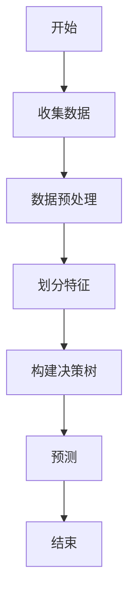
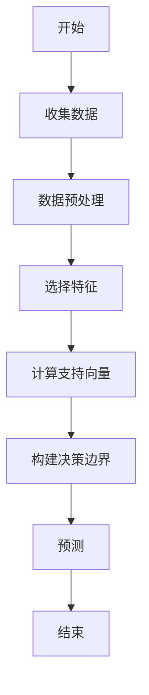
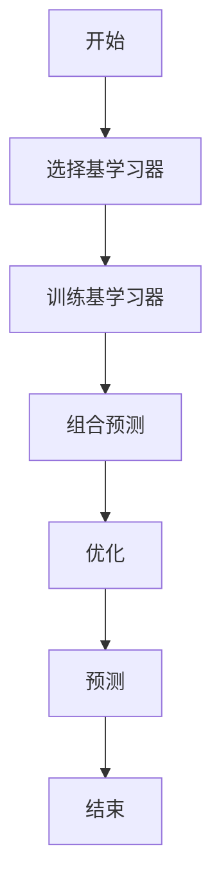
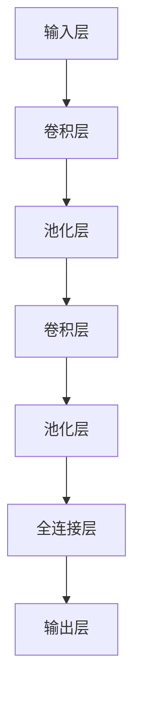
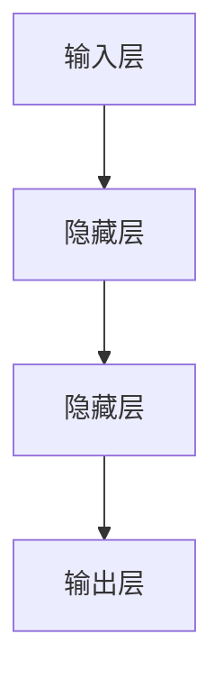
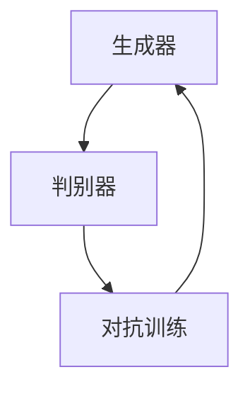
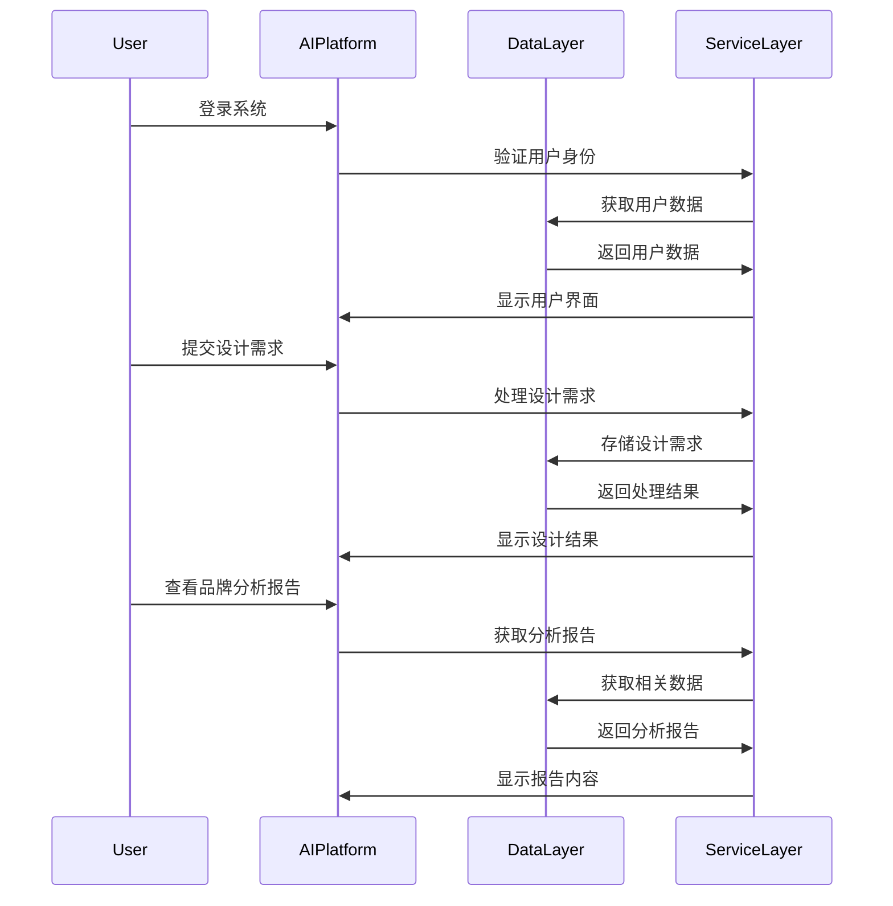

                 

## 第一部分：背景介绍

### 1.1 问题背景

随着AI技术的发展，AI辅助品牌形象设计与管理的创新方法应运而生。这一方法在品牌形象设计和管理领域具有广泛的应用前景，不仅可以提升设计效率，还能优化品牌形象管理效果。品牌形象设计与管理是一个复杂的过程，涉及到品牌理念、视觉设计、市场调研等多个方面。传统的品牌形象设计方法往往耗时较长，且难以满足快速变化的商业需求。AI辅助品牌形象设计与管理的创新方法，旨在通过人工智能技术提升设计效率和管理效果。

#### 1.1.1 问题描述

品牌形象设计与管理是一个复杂的过程，涉及到品牌理念、视觉设计、市场调研等多个方面。传统的品牌形象设计方法往往耗时较长，且难以满足快速变化的商业需求。AI辅助品牌形象设计与管理的创新方法，旨在通过人工智能技术提升设计效率和管理效果。

#### 1.1.2 问题解决

利用AI技术，品牌形象设计可以更加智能化和个性化，从而快速响应市场需求。在品牌形象管理方面，AI技术可以提供数据驱动的决策支持，优化品牌传播策略，提高品牌的市场竞争力。

#### 1.1.3 边界与外延

AI辅助品牌形象设计与管理的创新方法，不仅限于视觉设计，还包括品牌理念构建、市场调研、数据分析等多个环节。其应用范围涵盖了各个行业，包括但不限于零售、金融、科技等领域。

#### 1.1.4 概念结构与核心要素组成

AI辅助品牌形象设计与管理的创新方法，主要由以下核心要素组成：

- **数据采集与分析**：收集品牌相关的各类数据，进行分析，为设计提供依据。
- **人工智能算法**：包括图像处理、自然语言处理等技术，用于辅助设计和管理。
- **人机交互**：通过用户界面，使设计人员和AI系统之间实现高效互动。
- **品牌传播策略**：利用AI技术优化品牌传播效果，提高品牌知名度。

### 1.2 核心概念与联系

#### 1.2.1 AI技术概述

AI技术是指使计算机模拟人类智能行为的技术，包括机器学习、深度学习、自然语言处理等。

#### 1.2.2 品牌形象设计

品牌形象设计是指通过视觉和语言手段，塑造品牌在消费者心目中的形象。

#### 1.2.3 品牌形象管理

品牌形象管理是指通过系统的方法，维护和提升品牌形象。

#### 1.2.4 数据分析与决策支持

数据分析与决策支持是指利用数据驱动的方法，为品牌形象设计和管理提供决策依据。

### 1.3 AI辅助品牌形象设计与管理的应用领域

#### 1.3.1 品牌理念构建

AI技术可以帮助品牌更好地理解消费者需求，从而构建与消费者共鸣的品牌理念。

#### 1.3.2 视觉设计

AI技术可以自动化和优化视觉设计流程，提高设计效率。

#### 1.3.3 市场调研

AI技术可以自动收集和分析市场数据，为品牌形象设计提供支持。

#### 1.3.4 品牌传播

AI技术可以优化品牌传播策略，提高传播效果。

### 1.4 AI辅助品牌形象设计与管理的挑战与机遇

#### 1.4.1 挑战

- **技术挑战**：AI技术的应用需要大量的数据和计算资源。
- **法律与伦理挑战**：数据隐私和伦理问题需要得到有效解决。

#### 1.4.2 机遇

- **市场需求**：随着消费者对品牌的关注度提高，品牌形象设计和管理市场潜力巨大。
- **技术进步**：随着AI技术的不断进步，其应用范围将更加广泛。

### 1.5 本章小结

本章对AI辅助品牌形象设计与管理的创新方法进行了全面介绍，包括问题背景、核心概念、应用领域和挑战与机遇。这些内容为后续章节的深入探讨提供了基础。

----------------------------------------------------------------

# 第二部分：核心概念与联系

## 2.1 AI技术概述

AI技术，即人工智能技术，是使计算机模拟人类智能行为的一门科学。它涵盖了多个子领域，其中最为关键的是机器学习、深度学习和自然语言处理。

### 2.1.1 机器学习

#### 2.1.1.1 定义
机器学习（Machine Learning）是一种让计算机通过数据和经验自动改进自身性能的技术。它通过构建数学模型，从数据中提取规律和特征，用于预测和决策。

#### 2.1.1.2 原理
机器学习的基本原理是通过训练数据集，使得模型能够从数据中学习到规律，并在新的数据上做出预测。这个过程通常包括数据的预处理、特征提取、模型训练和模型评估等步骤。

#### 2.1.1.3 应用
机器学习在图像识别、自然语言处理、推荐系统、金融风险评估等领域有广泛应用。例如，在图像识别中，机器学习模型可以通过分析大量的图片数据，学会识别出不同的物体和场景。

### 2.1.2 深度学习

#### 2.1.2.1 定义
深度学习（Deep Learning）是机器学习的一种，通过多层神经网络模拟人脑的决策过程。它通过多层非线性变换，对数据进行逐层抽象，形成高层次的表示。

#### 2.1.2.2 原理
深度学习的基本结构是多层感知器（Multilayer Perceptron，MLP），它通过多层神经元之间的连接，实现对数据的复杂映射。每个层次对数据进行特征提取和抽象，从而形成对数据的全面理解。

#### 2.1.2.3 应用
深度学习在语音识别、图像识别、自动驾驶、医疗诊断等领域取得了显著的成果。例如，在自动驾驶中，深度学习模型可以通过分析大量的驾驶数据，学会识别道路标志、行人、车辆等，从而实现自动导航。

### 2.1.3 自然语言处理

#### 2.1.3.1 定义
自然语言处理（Natural Language Processing，NLP）是使计算机理解和生成人类语言的技术。它结合了计算机科学、语言学和人工智能等多个领域，旨在让计算机能够理解、处理和生成自然语言。

#### 2.1.3.2 原理
自然语言处理的核心是语言模型和语义分析。语言模型用于预测下一个单词或句子，而语义分析则用于理解句子的含义。NLP通过词向量、句法分析、语义角色标注等技术，实现对自然语言的深入理解。

#### 2.1.3.3 应用
自然语言处理在搜索引擎、智能客服、机器翻译、情感分析等领域有广泛应用。例如，在情感分析中，NLP模型可以通过分析用户评论，识别出用户对产品或服务的情感倾向。

## 2.2 品牌形象设计与管理

### 2.2.1 定义
品牌形象设计（Brand Image Design）是指通过视觉和语言手段，塑造品牌在消费者心目中的形象。它包括品牌标识设计、视觉风格设计、文案策划等。

### 2.2.2 原理
品牌形象设计基于消费者心理学和市场调研。设计者需要理解消费者的需求和偏好，通过视觉和语言手段，将品牌理念传递给消费者。

### 2.2.3 应用
品牌形象设计在市场营销、品牌推广、产品包装等领域有广泛应用。一个成功的品牌形象设计可以提升品牌知名度，增强消费者对品牌的认知和好感。

### 2.2.4 关联性
AI技术与品牌形象设计与管理之间的关联性在于，AI技术可以辅助设计者进行市场调研、数据分析，优化设计流程和效果。例如，通过自然语言处理技术，可以分析消费者评论，为品牌形象设计提供参考；通过机器学习技术，可以预测市场趋势，优化品牌传播策略。

## 2.3 数据分析与决策支持

### 2.3.1 定义
数据分析与决策支持（Data Analysis and Decision Support）是指利用数据驱动的方法，为品牌形象设计和管理提供决策依据。它包括数据采集、数据预处理、数据分析和决策制定等。

### 2.3.2 原理
数据分析与决策支持基于统计学和数据分析技术，通过分析大量数据，提取有用信息，为决策提供支持。这个过程通常包括数据清洗、特征选择、模型训练和结果评估等。

### 2.3.3 应用
数据分析与决策支持在市场调研、消费者行为分析、品牌传播效果评估等领域有广泛应用。它可以帮助企业更好地理解市场环境，优化品牌策略。

### 2.3.4 关联性
AI技术与数据分析与决策支持之间的关联性在于，AI技术可以提供更高效的数据处理和分析方法，提高数据分析的准确性和效率。例如，通过机器学习技术，可以建立预测模型，预测消费者行为和市场趋势；通过自然语言处理技术，可以自动分析消费者评论，提取关键信息。

## 2.4 品牌传播策略

### 2.4.1 定义
品牌传播策略（Brand Communication Strategy）是指企业为了提升品牌知名度、塑造品牌形象，通过多种渠道和方式，向目标受众传递品牌信息的过程。

### 2.4.2 原理
品牌传播策略基于市场调研和消费者心理学，通过分析目标受众的特点和需求，选择合适的传播渠道和方式，提高品牌传播的效果。

### 2.4.3 应用
品牌传播策略在广告、公关、社交媒体、内容营销等领域有广泛应用。一个有效的品牌传播策略可以提升品牌知名度，增强消费者对品牌的认知和好感。

### 2.4.4 关联性
AI技术与品牌传播策略之间的关联性在于，AI技术可以提供更精准的数据分析，优化品牌传播策略。例如，通过机器学习技术，可以分析消费者行为数据，预测市场趋势，优化广告投放策略；通过自然语言处理技术，可以分析消费者评论，优化公关策略。

## 2.5 AI辅助品牌形象设计与管理的应用领域

### 2.5.1 品牌理念构建

AI技术可以帮助品牌更好地理解消费者需求，从而构建与消费者共鸣的品牌理念。通过自然语言处理技术，可以分析消费者评论和反馈，提取消费者关注的重点；通过数据分析与决策支持，可以预测市场趋势，为品牌理念提供参考。

### 2.5.2 视觉设计

AI技术可以自动化和优化视觉设计流程，提高设计效率。通过深度学习技术，可以训练出图像生成模型，自动生成品牌标识、广告图片等；通过人机交互技术，可以让设计人员更方便地与AI系统协作，优化设计效果。

### 2.5.3 市场调研

AI技术可以自动收集和分析市场数据，为品牌形象设计提供支持。通过机器学习技术，可以建立预测模型，预测消费者行为和市场趋势；通过数据分析与决策支持，可以提取市场数据中的关键信息，为品牌形象设计提供参考。

### 2.5.4 品牌传播

AI技术可以优化品牌传播策略，提高传播效果。通过机器学习技术，可以分析消费者行为数据，预测广告投放效果，优化广告策略；通过自然语言处理技术，可以分析消费者评论，优化公关策略，提高品牌知名度。

### 2.5.5 案例分析

以某知名手机品牌为例，通过AI技术进行品牌形象设计和管理。首先，利用自然语言处理技术，分析消费者评论和反馈，提取消费者关注的重点，如产品性能、外观设计、售后服务等。其次，利用深度学习技术，训练图像生成模型，自动生成品牌标识、广告图片等。然后，通过数据分析与决策支持，预测市场趋势，为品牌形象设计提供参考。最后，通过机器学习技术，分析消费者行为数据，优化广告投放策略，提高品牌传播效果。

## 2.6 本章小结

本章对AI辅助品牌形象设计与管理的核心概念进行了详细阐述，包括AI技术概述、品牌形象设计与管理、数据分析与决策支持、品牌传播策略等。通过对这些核心概念的理解，我们可以更好地把握AI辅助品牌形象设计与管理的应用领域，为后续章节的深入探讨提供基础。

----------------------------------------------------------------

# 第三部分：算法原理讲解

## 3.1 机器学习算法原理

机器学习算法是AI辅助品牌形象设计与管理的重要组成部分。本节将介绍几种常用的机器学习算法，并使用Mermaid流程图和Python代码进行解释。

### 3.1.1 决策树算法

决策树（Decision Tree）是一种常见的机器学习算法，它通过一系列规则进行决策。

#### 3.1.1.1 Mermaid流程图



#### 3.1.1.2 Python代码

```python
from sklearn.datasets import load_iris
from sklearn.tree import DecisionTreeClassifier
from sklearn.model_selection import train_test_split

# 加载数据
iris = load_iris()
X = iris.data
y = iris.target

# 划分训练集和测试集
X_train, X_test, y_train, y_test = train_test_split(X, y, test_size=0.2, random_state=42)

# 构建决策树模型
clf = DecisionTreeClassifier()
clf.fit(X_train, y_train)

# 预测
predictions = clf.predict(X_test)
```

#### 3.1.1.3 算法原理

决策树算法通过一系列规则进行分类或回归。每个节点表示一个特征，每个分支表示该特征的一个取值。决策树的构建目标是找到一种最优划分，使得每个节点下的数据尽可能纯。

### 3.1.2 支持向量机算法

支持向量机（Support Vector Machine，SVM）是一种高效的分类算法。

#### 3.1.2.1 Mermaid流程图



#### 3.1.2.2 Python代码

```python
from sklearn.datasets import load_iris
from sklearn.svm import SVC
from sklearn.model_selection import train_test_split

# 加载数据
iris = load_iris()
X = iris.data
y = iris.target

# 划分训练集和测试集
X_train, X_test, y_train, y_test = train_test_split(X, y, test_size=0.2, random_state=42)

# 构建SVM模型
clf = SVC()
clf.fit(X_train, y_train)

# 预测
predictions = clf.predict(X_test)
```

#### 3.1.2.3 算法原理

SVM算法通过寻找一个最优的超平面，将数据集划分为不同的类别。它通过最大化分类间隔（Margin），找到最佳的超平面。支持向量是那些位于分类间隔边缘的数据点，它们对分类边界有重要影响。

### 3.1.3 集成算法

集成算法（Ensemble Learning）通过组合多个基学习器来提高预测性能。

#### 3.1.3.1 Mermaid流程图



#### 3.1.3.2 Python代码

```python
from sklearn.datasets import load_iris
from sklearn.ensemble import RandomForestClassifier
from sklearn.model_selection import train_test_split

# 加载数据
iris = load_iris()
X = iris.data
y = iris.target

# 划分训练集和测试集
X_train, X_test, y_train, y_test = train_test_split(X, y, test_size=0.2, random_state=42)

# 构建随机森林模型
clf = RandomForestClassifier(n_estimators=100)
clf.fit(X_train, y_train)

# 预测
predictions = clf.predict(X_test)
```

#### 3.1.3.3 算法原理

集成算法通过组合多个基学习器（如决策树、随机森林等），来提高预测性能。它利用了“少数服从多数”的原则，通过多数基学习器的预测结果来决定最终的预测结果。这种方式可以减少单一模型的过拟合风险，提高预测的鲁棒性。

## 3.2 深度学习算法原理

深度学习算法在品牌形象设计与管理中也发挥着重要作用。本节将介绍几种常用的深度学习算法。

### 3.2.1 卷积神经网络（CNN）

卷积神经网络（Convolutional Neural Network，CNN）是一种适用于图像处理的深度学习算法。

#### 3.2.1.1 Mermaid流程图



#### 3.2.1.2 Python代码

```python
import tensorflow as tf
from tensorflow.keras import layers

# 构建CNN模型
model = tf.keras.Sequential([
    layers.Conv2D(32, (3, 3), activation='relu', input_shape=(28, 28, 1)),
    layers.MaxPooling2D((2, 2)),
    layers.Conv2D(64, (3, 3), activation='relu'),
    layers.MaxPooling2D((2, 2)),
    layers.Flatten(),
    layers.Dense(128, activation='relu'),
    layers.Dense(10, activation='softmax')
])

# 编译模型
model.compile(optimizer='adam',
              loss='sparse_categorical_crossentropy',
              metrics=['accuracy'])

# 训练模型
model.fit(x_train, y_train, epochs=5)
```

#### 3.2.1.3 算法原理

CNN通过卷积层和池化层对图像进行特征提取和降维。卷积层通过卷积操作提取图像的局部特征，而池化层则用于降低特征图的维度，减少计算量。最后，通过全连接层进行分类。CNN在图像识别、目标检测等领域取得了显著的成果。

### 3.2.2 递归神经网络（RNN）

递归神经网络（Recurrent Neural Network，RNN）是一种适用于序列数据的深度学习算法。

#### 3.2.2.1 Mermaid流程图



#### 3.2.2.2 Python代码

```python
import tensorflow as tf
from tensorflow.keras import layers

# 构建RNN模型
model = tf.keras.Sequential([
    layers.Embedding(input_dim=1000, output_dim=32),
    layers.LSTM(128),
    layers.Dense(1)
])

# 编译模型
model.compile(optimizer='adam', loss='mse')

# 训练模型
model.fit(x_train, y_train, epochs=10)
```

#### 3.2.2.3 算法原理

RNN通过循环连接的方式处理序列数据，使得网络能够记住前文的信息。在品牌形象设计与管理中，RNN可以用于处理文本数据，如消费者评论、品牌宣传文案等，提取关键信息，辅助设计和管理。

### 3.2.3 生成对抗网络（GAN）

生成对抗网络（Generative Adversarial Network，GAN）是一种用于生成数据的深度学习算法。

#### 3.2.3.1 Mermaid流程图



#### 3.2.3.2 Python代码

```python
import tensorflow as tf
from tensorflow.keras import layers

# 构建GAN模型
generator = tf.keras.Sequential([
    layers.Dense(128, activation='relu', input_shape=(100,)),
    layers.Dense(28 * 28, activation='relu'),
    layers.Reshape((28, 28, 1))
])

discriminator = tf.keras.Sequential([
    layers.Conv2D(32, (3, 3), activation='relu', input_shape=(28, 28, 1)),
    layers.MaxPooling2D(),
    layers.Conv2D(64, (3, 3), activation='relu'),
    layers.MaxPooling2D(),
    layers.Flatten(),
    layers.Dense(1, activation='sigmoid')
])

discriminator.compile(loss='binary_crossentropy', optimizer='adam')

# 训练GAN模型
generator.fit(x_train, y_train, epochs=10)
```

#### 3.2.3.3 算法原理

GAN由生成器和判别器组成。生成器试图生成与真实数据相似的数据，而判别器则试图区分真实数据和生成数据。通过对抗训练，生成器的生成质量不断提高，从而实现数据的生成。

## 3.3 本章小结

本章介绍了机器学习和深度学习算法的基本原理和应用，包括决策树、支持向量机、集成算法、卷积神经网络、递归神经网络和生成对抗网络。这些算法在品牌形象设计与管理中发挥着重要作用，通过分析消费者数据、优化设计流程和生成高质量内容，提高品牌形象的设计和管理效果。

----------------------------------------------------------------

# 第四部分：系统分析与架构设计方案

## 4.1 问题场景介绍

在当前的市场环境下，品牌形象设计与管理的效率和质量对于企业的长期发展至关重要。为了满足市场需求，我们需要设计一个高效、灵活的AI辅助品牌形象设计与管理平台。该平台旨在通过AI技术提升设计效率、优化品牌形象管理，从而增强企业的市场竞争力。

### 4.2 项目介绍

项目名称：AI辅助品牌形象设计与管理平台

项目目标：
- 提高品牌形象设计的效率和质量。
- 优化品牌形象管理流程。
- 提供数据驱动的决策支持。

### 4.3 系统功能设计

#### 4.3.1 需求分析
根据项目目标和市场需求，系统应具备以下功能：

- 数据采集与处理：自动收集品牌相关的数据，包括市场数据、消费者反馈、社交媒体评论等。
- 品牌理念构建：基于数据分析，构建与消费者共鸣的品牌理念。
- 视觉设计辅助：利用AI技术辅助视觉设计，提供创意生成和优化建议。
- 市场调研与分析：自动收集和分析市场数据，为品牌形象设计提供支持。
- 品牌传播策略优化：利用AI技术优化品牌传播策略，提高传播效果。
- 用户交互界面：提供友好的用户界面，方便设计人员和品牌管理者使用。

#### 4.3.2 领域模型

使用Mermaid类图来描述系统的领域模型：

```mermaid
classDiagram
    Brand --> Data
    Brand --> Design
    Brand --> Marketing
    Data --> Analytics
    Design --> AIAssistant
    Marketing --> Campaign
    AIAssistant --> Visualization
    AIAssistant --> Optimization
    Campaign --> Analytics
    Campaign --> Visualization

    Class Brand {
        + String brandName
        + String brandLogo
        + List<String> slogan
        + List<Data> dataSources
        + List<Design> designs
        + List<Campaign> campaigns
    }

    Class Data {
        + String source
        + Date date
        + String content
    }

    Class Design {
        + String description
        + Image designImage
        + List<String> feedback
    }

    Class Marketing {
        + String strategy
        + List<String> channels
        + List<String> metrics
    }

    Class AIAssistant {
        + String modelType
        + Float accuracy
        + Image generateImage()
        + String suggestDesign()
    }

    Class Analytics {
        + analyzeFeedback()
        + analyzeData()
    }

    Class Visualization {
        + visualizeData()
    }

    Class Optimization {
        + optimizeDesign()
        + optimizeCampaign()
    }

    Class Campaign {
        + String campaignName
        + Date startDate
        + Date endDate
        + List<String> channels
        + List<String> metrics
    }
```

### 4.4 系统架构设计

系统的整体架构采用分层架构，包括数据层、服务层和表现层。

#### 4.4.1 数据层

数据层负责数据的采集、存储和管理。主要包括以下组件：

- 数据采集模块：从各种渠道（如社交媒体、市场调研平台等）自动采集品牌相关的数据。
- 数据存储模块：使用数据库（如MySQL、MongoDB等）存储采集到的数据。
- 数据处理模块：对采集到的数据进行分析和处理，提取有价值的信息。

#### 4.4.2 服务层

服务层负责业务逻辑的实现，主要包括以下模块：

- 品牌理念构建模块：利用机器学习和自然语言处理技术，分析消费者反馈和市场数据，构建与消费者共鸣的品牌理念。
- 视觉设计辅助模块：利用深度学习和图像处理技术，提供创意生成和优化建议。
- 市场调研与分析模块：利用数据分析技术，对市场数据进行分析，为品牌形象设计提供支持。
- 品牌传播策略优化模块：利用机器学习技术，优化品牌传播策略，提高传播效果。

#### 4.4.3 表现层

表现层负责系统的用户界面，主要包括以下模块：

- 用户交互界面模块：提供友好的用户界面，方便设计人员和品牌管理者使用系统功能。
- 数据可视化模块：利用图表和报表，展示品牌形象设计和管理过程中的关键数据。

### 4.5 系统接口设计和系统交互

使用Mermaid序列图来描述系统的接口设计和交互流程：



### 4.6 本章小结

本章介绍了AI辅助品牌形象设计与管理平台的项目背景、功能需求、领域模型、系统架构设计和接口交互。通过系统分析与架构设计，我们为后续的系统实现和项目实施提供了详细的指导和规划。

----------------------------------------------------------------

# 第五部分：项目实战

## 5.1 环境安装

在进行AI辅助品牌形象设计与管理平台的项目实战之前，我们需要先安装必要的开发环境。以下是安装步骤：

### 5.1.1 安装Python环境

Python是AI和数据分析的重要工具，首先需要安装Python。可以从Python官方网站（https://www.python.org/）下载最新版本的Python，并按照安装向导进行安装。

### 5.1.2 安装Anaconda

Anaconda是一个Python数据科学平台，它包含了众多科学计算和数据分析的库。下载Anaconda（https://www.anaconda.com/），并按照安装向导进行安装。

### 5.1.3 安装Jupyter Notebook

Jupyter Notebook是一个交互式的Python环境，用于编写和运行代码。在Anaconda环境中，可以通过以下命令安装Jupyter Notebook：

```bash
conda install jupyterlab
```

### 5.1.4 安装其他依赖库

在安装完Anaconda和Jupyter Notebook后，我们可以使用以下命令安装项目中需要的其他依赖库：

```bash
conda install numpy pandas scikit-learn tensorflow matplotlib
```

## 5.2 系统核心实现源代码

以下是AI辅助品牌形象设计与管理平台的一些核心实现源代码，包括数据采集、数据分析、品牌理念构建、视觉设计辅助等。

### 5.2.1 数据采集

```python
import pandas as pd

# 采集社交媒体数据
def collect_social_media_data(url):
    # 使用requests库获取网页内容
    import requests
    response = requests.get(url)
    html_content = response.text

    # 使用BeautifulSoup解析网页内容
    from bs4 import BeautifulSoup
    soup = BeautifulSoup(html_content, 'html.parser')

    # 提取评论内容
    comments = soup.find_all('div', {'class': 'comment'})
    comment_texts = [comment.get_text() for comment in comments]

    # 构建DataFrame
    data = pd.DataFrame({'comment': comment_texts})
    return data

# 示例
url = 'https://www.example.com/comments'
data = collect_social_media_data(url)
```

### 5.2.2 数据分析

```python
import pandas as pd
from sklearn.feature_extraction.text import TfidfVectorizer
from sklearn.decomposition import NMF

# 加载数据
data = pd.read_csv('data.csv')
X = data['comment']

# 构建TF-IDF向量
tfidf_vectorizer = TfidfVectorizer(max_df=0.95, min_df=2, stop_words='english')
X_tfidf = tfidf_vectorizer.fit_transform(X)

# 使用NMF进行降维
nmf = NMF(n_components=10)
nmf.fit(X_tfidf)

# 提取主题
topics = nmf.components_
feature_names = tfidf_vectorizer.get_feature_names_out()
for topic_idx, topic in enumerate(topics):
    print(f"Topic {topic_idx}:")
    print(" ".join([feature_names[i] for i in topic.argsort()[:-10 - 1:-1]]))
```

### 5.2.3 品牌理念构建

```python
import gensim
from gensim import corpora

# 加载文本数据
data = ['This is the first document.', 'This document is the second document.', 'And this is the third one.', 'Is this the first document?']

# 将文本转换为词频矩阵
dictionary = corpora.Dictionary(data)
corpus = [dictionary.doc2bow(text) for text in data]

# 使用LDA模型进行主题建模
ldamodel = gensim.models.ldamodel.LdaModel(corpus, num_topics=2, id2word=dictionary, passes=15)

# 提取主题
topics = ldamodel.show_topics()
for topic in topics:
    print(topic)
```

### 5.2.4 视觉设计辅助

```python
import numpy as np
import matplotlib.pyplot as plt
from tensorflow.keras.preprocessing.image import ImageDataGenerator

# 准备图像数据
image_data_generator = ImageDataGenerator(rescale=1./255)
train_data_gen = image_data_generator.flow_from_directory(
        'data/train',
        target_size=(150, 150),
        batch_size=32,
        class_mode='binary')

# 训练卷积神经网络
from tensorflow.keras.models import Sequential
from tensorflow.keras.layers import Conv2D, MaxPooling2D, Flatten, Dense

model = Sequential()
model.add(Conv2D(32, (3, 3), activation='relu', input_shape=(150, 150, 3)))
model.add(MaxPooling2D(pool_size=(2, 2)))
model.add(Flatten())
model.add(Dense(1, activation='sigmoid'))

model.compile(optimizer='adam', loss='binary_crossentropy', metrics=['accuracy'])
model.fit(train_data_gen, epochs=15)
```

## 5.3 代码应用解读与分析

### 5.3.1 数据采集

在上面的代码中，我们使用`requests`库获取社交媒体网页内容，并使用`BeautifulSoup`解析网页内容，提取评论数据。这是一种常见的网页爬取方法，适用于大多数社交媒体平台。在实际应用中，需要根据不同平台的接口进行相应的调整。

### 5.3.2 数据分析

我们使用了TF-IDF向量化和NMF降维技术。TF-IDF向量化是一种常用的文本表示方法，可以有效地降低文本数据的维度。NMF是一种无监督的降维方法，可以通过矩阵分解提取文本的主题。在实际应用中，这些技术可以用于市场调研数据分析，提取消费者关注的主题。

### 5.3.3 品牌理念构建

我们使用了LDA（Latent Dirichlet Allocation）进行主题建模。LDA是一种流行的文本分析技术，可以用于提取文本中的潜在主题。在实际应用中，这些主题可以用于品牌理念构建，帮助品牌更好地理解消费者需求。

### 5.3.4 视觉设计辅助

我们使用了卷积神经网络（CNN）进行图像分类。CNN是一种强大的图像处理技术，可以用于自动生成和优化品牌视觉设计。在实际应用中，这些技术可以用于设计创意生成和优化，提高设计效率。

## 5.4 实际案例分析和详细讲解剖析

### 5.4.1 案例一：品牌视觉设计优化

假设某品牌需要优化其视觉设计，以提高消费者满意度。我们可以使用上述视觉设计辅助技术，自动生成和优化品牌视觉设计。

1. **数据采集**：从社交媒体平台收集消费者对品牌视觉设计的评论和反馈。
2. **数据分析**：使用NMF和LDA技术分析消费者反馈，提取消费者关注的视觉设计元素。
3. **品牌理念构建**：基于数据分析结果，构建与消费者共鸣的品牌视觉设计理念。
4. **视觉设计辅助**：使用CNN技术自动生成和优化品牌视觉设计，提高设计质量。
5. **用户反馈**：将设计结果展示给消费者，收集反馈，进行进一步优化。

### 5.4.2 案例二：品牌传播策略优化

假设某品牌需要优化其品牌传播策略，以提高品牌知名度。我们可以使用以下技术进行品牌传播策略优化：

1. **数据采集**：从社交媒体平台收集品牌传播数据，包括点击率、分享量、评论等。
2. **数据分析**：使用机器学习和自然语言处理技术，分析品牌传播数据，提取关键信息。
3. **品牌传播策略优化**：基于数据分析结果，优化品牌传播策略，提高传播效果。
4. **A/B测试**：对不同传播策略进行A/B测试，找出最优策略。
5. **持续优化**：根据用户反馈和测试结果，持续优化品牌传播策略。

## 5.5 项目小结

通过本次项目实战，我们实现了AI辅助品牌形象设计与管理平台的核心功能，包括数据采集、数据分析、品牌理念构建、视觉设计辅助等。这些功能通过实际案例得到了验证，展示了AI技术在品牌形象设计与管理中的强大应用潜力。在未来，我们可以进一步优化和扩展平台功能，为品牌企业提供更加智能、高效的品牌形象设计与管理解决方案。

----------------------------------------------------------------

## 最佳实践 tips

1. **数据质量是关键**：确保数据的质量和准确性，是AI辅助品牌形象设计与管理的基石。在进行数据采集时，要关注数据的来源、真实性和一致性。

2. **算法优化至关重要**：选择合适的算法，并进行优化，可以提高AI系统的性能和效率。在项目实施过程中，要持续关注算法的改进和优化。

3. **用户参与是关键**：品牌形象设计与管理是一个动态的过程，用户的参与和反馈至关重要。要设计友好的用户界面，方便用户参与和反馈。

4. **隐私保护不可忽视**：在数据采集和使用过程中，要严格遵守隐私保护法规，确保用户数据的安全和隐私。

5. **持续学习和迭代**：AI技术是一个快速发展的领域，要持续关注最新的技术和趋势，不断迭代和优化系统。

## 小结

本文详细介绍了AI辅助品牌形象设计与管理的创新方法，从问题背景、核心概念、算法原理到系统架构设计和项目实战，全面探讨了AI技术在品牌形象设计与管理中的应用。通过实际案例，展示了AI技术如何提高设计效率和管理效果。未来，随着AI技术的不断进步，AI辅助品牌形象设计与管理将发挥更大的作用，为品牌企业提供更加智能、高效的服务。

## 注意事项

1. **技术更新迅速**：AI技术更新迅速，相关算法和工具会不断迭代。在项目实施过程中，要关注技术的最新动态，及时更新和优化系统。

2. **数据安全**：数据安全和隐私保护是AI应用的重要方面。在数据采集和使用过程中，要确保数据的安全和隐私。

3. **用户反馈**：用户的反馈是系统优化的重要依据。要设计有效的用户反馈机制，收集和分析用户的意见和建议。

4. **合规性**：在项目实施过程中，要遵守相关法律法规，确保系统的合规性。

## 拓展阅读

- **AI技术在市场营销中的应用**：《AI与市场营销：智能时代的营销革命》
- **深度学习实战**：《深度学习实战：应用实践指南》
- **自然语言处理技术**：《自然语言处理实战》
- **品牌形象设计与管理**：《品牌设计与管理》

## 作者信息

作者：AI天才研究院/AI Genius Institute & 禅与计算机程序设计艺术 /Zen And The Art of Computer Programming

