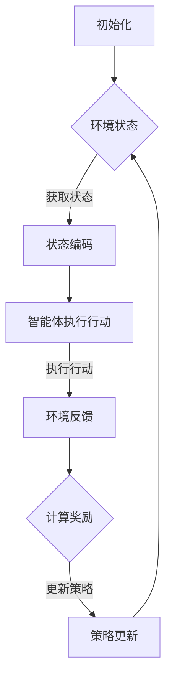
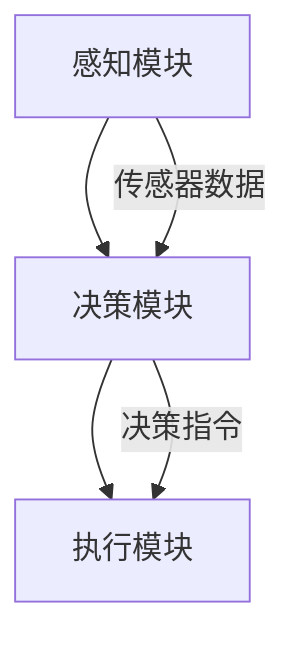
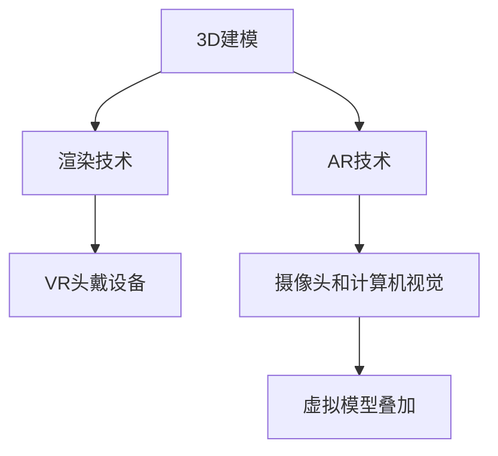

                 

### 文章标题

《AI辅助的城市规划：数据驱动的城市发展》

#### 关键词

人工智能、城市规划、数据驱动、机器学习、深度学习

#### 摘要

随着全球城市化进程的加快，城市规划面临前所未有的挑战和机遇。人工智能（AI）作为一种强大的工具，正逐渐融入城市规划的各个环节，推动城市发展向数据驱动、智能化的方向迈进。本文将从背景与基础理论、数据驱动的城市规划方法、案例研究、工具与实践等多个维度，深入探讨AI在城市规划中的应用，旨在为城市规划者和相关领域的研究者提供有价值的参考。

本文分为两部分：第一部分重点介绍AI在城市规划中的基础理论和应用方法，通过具体案例展示AI在城市规划中的实践效果；第二部分则关注AI在城市规划中的高级应用和前沿技术，探讨AI对城市规划未来发展的潜在影响。本文将通过逻辑清晰、结构紧凑的叙述方式，结合专业技术和实际案例，力求为广大读者提供一个全面、系统的AI辅助城市规划全景图。

### 第一部分：背景与基础理论

#### 引言

随着全球城市化进程的不断加速，城市规划的重要性愈发凸显。传统的城市规划方法往往依赖于经验与主观判断，这在某种程度上限制了城市的可持续发展。然而，随着大数据、云计算和人工智能（AI）技术的迅猛发展，城市规划迎来了全新的机遇和挑战。AI作为一种能够模拟、延伸和扩展人类智能的技术，正逐步成为城市规划的有力工具，帮助解决复杂的城市问题，提高城市管理的效率和智慧化水平。

本文旨在探讨AI辅助的城市规划，通过深入分析AI在城市规划中的应用潜力、数据驱动的城市规划基础、以及AI辅助的城市规划方法，为城市规划者和研究者提供有价值的参考。本文的结构如下：

1. **背景与基础理论**：介绍城市规划的现状与挑战，分析AI在城市规划中的应用潜力，并定义数据驱动的城市规划概念。
2. **数据驱动的城市规划基础**：讨论数据收集与预处理、数据质量评估与优化、以及数据可视化与分析工具。
3. **AI辅助的城市规划方法**：介绍机器学习、深度学习和强化学习等AI算法在规划中的应用。
4. **数据驱动的城市规划案例研究**：通过具体案例展示AI在城市规划中的实践效果。
5. **AI辅助的城市规划工具与实践**：介绍常用AI城市规划工具，并通过实际案例展示其应用。

### 1.1 城市规划的现状与挑战

城市规划是城市发展的基础和保障，其核心目标在于优化城市的空间布局、提升城市功能和居民生活质量。然而，当前城市规划面临着诸多挑战：

1. **人口增长与城市化**：全球城市化进程加速，人口不断向城市集中，城市规模不断扩大。这给城市规划带来了巨大压力，如何在有限的空间资源下实现城市的可持续发展成为一大挑战。
2. **资源有限与环境污染**：城市资源有限，如何在满足居民需求的同时，实现资源的合理配置和环境保护，是城市规划者必须面对的难题。
3. **基础设施与公共服务的不足**：城市基础设施建设滞后、公共服务供给不足等问题，严重影响了城市的运行效率和居民的生活质量。
4. **气候变化与自然灾害**：气候变化和自然灾害频发，对城市规划提出了更高的要求。如何通过科学规划，增强城市抗灾能力和可持续发展能力，成为城市规划者的重要任务。

#### 1.2 AI在城市规划中的应用潜力

AI在城市规划中的应用潜力巨大，主要体现在以下几个方面：

1. **数据处理与挖掘**：AI能够处理和分析海量城市数据，从数据中发现有价值的信息，帮助城市规划者更好地了解城市状况，制定科学合理的规划方案。
2. **智能交通管理**：通过机器学习和深度学习技术，AI能够优化交通流量、预测交通状况，提高公共交通系统的效率和可靠性。
3. **环境监测与治理**：AI可以实时监测城市环境质量，预测环境污染趋势，为环境保护和治理提供科学依据。
4. **智能规划与设计**：AI可以帮助城市规划者进行城市空间的智能规划与设计，通过模拟和预测，优化城市布局和功能。
5. **公共服务优化**：AI技术可以优化公共服务资源配置，提高公共服务的质量和效率，提升居民生活质量。

#### 1.3 本书的目标与结构

本书的目标是深入探讨AI在城市规划中的应用，通过基础理论与实际案例的有机结合，为城市规划者和相关领域的研究者提供全面的参考。本书的结构如下：

1. **第一部分：背景与基础理论**：介绍城市规划的现状与挑战，分析AI在城市规划中的应用潜力，并定义数据驱动的城市规划概念。
2. **第二部分：数据驱动的城市规划基础**：讨论数据收集与预处理、数据质量评估与优化、以及数据可视化与分析工具。
3. **第三部分：AI辅助的城市规划方法**：介绍机器学习、深度学习和强化学习等AI算法在规划中的应用。
4. **第四部分：数据驱动的城市规划案例研究**：通过具体案例展示AI在城市规划中的实践效果。
5. **第五部分：AI辅助的城市规划工具与实践**：介绍常用AI城市规划工具，并通过实际案例展示其应用。

### 1.4 AI基本概念与城市规划的关系

#### 1.4.1 人工智能的基本概念

人工智能（AI，Artificial Intelligence）是计算机科学的一个分支，旨在模拟、扩展和扩展人类的智能。AI系统通过感知、学习、推理和决策等过程，实现类似人类的智能行为。AI可以分为两类：弱AI和强AI。

1. **弱AI**：也称为窄AI，是指专注于特定任务的人工智能系统，如语音识别、图像识别等。弱AI不能进行通用任务，只能在特定领域表现出智能行为。
2. **强AI**：也称为通用人工智能（AGI，Artificial General Intelligence），是指具备人类所有智能行为能力的人工智能系统。强AI能够像人类一样进行思考、学习、推理和决策，但目前尚未实现。

#### 1.4.2 数据科学与大数据

数据科学是人工智能的基石，它涉及数据的收集、处理、分析、可视化，以及从数据中提取有用信息的一系列方法。数据科学的核心内容包括：

1. **数据分析**：通过统计方法、机器学习等技术，对数据进行分析，提取有价值的信息。
2. **数据挖掘**：从大量数据中发现隐藏的模式、趋势和关联。
3. **数据可视化**：将数据以图形或图表的形式展示，帮助人们更好地理解和分析数据。

大数据（Big Data）是指规模巨大、类型多样的数据集合，通常包含结构化数据、非结构化数据和半结构化数据。大数据的特点是“4V”：Volume（大量）、Velocity（快速）、Variety（多样）和Veracity（真实性）。

1. **Volume（大量）**：大数据的规模巨大，需要高效的存储和处理技术。
2. **Velocity（快速）**：大数据的处理速度要求高，需要实时或近实时的分析。
3. **Variety（多样）**：大数据类型多样，包括文本、图像、音频、视频等。
4. **Veracity（真实性）**：大数据的真实性难以保证，需要有效的数据清洗和验证方法。

#### 1.4.3 AI与城市规划的关系分析

AI与城市规划有着密切的关系，主要表现在以下几个方面：

1. **数据驱动的决策**：城市规划需要大量的数据支持，AI可以通过数据处理和分析，为城市规划提供科学依据，实现数据驱动的决策。
2. **智能交通管理**：AI技术可以优化交通流量、预测交通状况，提高公共交通系统的效率和可靠性，缓解城市交通拥堵问题。
3. **环境监测与治理**：AI可以实时监测城市环境质量，预测环境污染趋势，为环境保护和治理提供科学依据。
4. **智能规划与设计**：AI可以帮助城市规划者进行城市空间的智能规划与设计，通过模拟和预测，优化城市布局和功能。
5. **公共服务优化**：AI技术可以优化公共服务资源配置，提高公共服务的质量和效率，提升居民生活质量。

总之，AI为城市规划提供了强大的工具和手段，有助于解决传统城市规划中面临的各种挑战，推动城市发展的智能化、数据化和可持续发展。

### 1.5 数据驱动的城市规划基础

数据驱动的城市规划是指利用大数据、人工智能等先进技术，对城市规划中的各类数据进行收集、处理、分析和应用，从而实现科学决策和智能化管理。以下是数据驱动的城市规划基础中的几个关键要素：

#### 1.5.1 数据收集与预处理

数据收集是数据驱动的城市规划的基础。城市规划涉及的数据类型多样，包括地理空间数据、社会经济数据、交通流量数据、环境监测数据等。数据收集过程中需要注意以下问题：

1. **数据来源**：确定数据的来源，如政府部门、公共机构、企业和科研机构等。
2. **数据质量**：数据需要保证真实性、准确性和完整性，避免噪声数据和错误数据的影响。
3. **数据格式**：统一数据格式，便于后续处理和分析。

数据预处理是数据收集后的重要步骤，主要包括以下内容：

1. **数据清洗**：删除重复数据、纠正错误数据、处理缺失数据。
2. **数据集成**：将不同来源、不同格式的数据整合到一个统一的格式中。
3. **数据标准化**：统一数据单位、数据类型，便于数据分析和挖掘。

#### 1.5.2 数据质量评估与优化

数据质量直接影响城市规划的决策效果，因此需要对数据质量进行评估和优化。数据质量评估主要包括以下内容：

1. **完整性**：评估数据是否完整，是否存在缺失值或缺失数据。
2. **准确性**：评估数据是否准确，是否受到噪声或错误的影响。
3. **一致性**：评估数据在不同来源、不同时间段是否一致。
4. **时效性**：评估数据是否及时更新，是否能够反映当前城市状况。

数据质量优化方法包括：

1. **数据清洗**：通过数据清洗算法，删除重复数据、纠正错误数据、处理缺失数据。
2. **数据增强**：通过数据增强技术，补充缺失数据，提高数据准确性。
3. **数据融合**：通过数据融合技术，整合多个来源、不同格式的数据，提高数据一致性。

#### 1.5.3 数据可视化与分析工具

数据可视化是将复杂的数据转换为图形或图表，便于人们理解和分析。常用的数据可视化工具包括Tableau、Power BI、Matplotlib等。

数据分析是数据驱动的城市规划的核心环节，包括以下内容：

1. **统计分析**：通过统计方法，分析数据的分布、相关性等特征。
2. **机器学习**：利用机器学习算法，对数据进行建模和预测。
3. **深度学习**：利用深度学习算法，对复杂的数据进行建模和分析。

常用的数据分析工具包括Python的Scikit-learn、TensorFlow等，R语言的caret、mlr等。

### 1.6 AI辅助的城市规划方法

在城市规划中，AI技术的应用不仅能够提高决策的科学性和效率，还能够为城市规划者提供更加全面的视角和更加精确的预测。以下介绍几种常见的AI算法及其在城市规划中的应用：

#### 1.6.1 机器学习算法

机器学习（Machine Learning，ML）是一种通过数据训练模型，使计算机具备学习能力的技术。机器学习算法可以分为监督学习、无监督学习和半监督学习。

1. **监督学习（Supervised Learning）**：在监督学习算法中，模型通过已标记的数据进行训练，并使用这些数据来预测未知数据的标签。常见的监督学习算法包括：
   - **线性回归（Linear Regression）**：用于预测连续数值变量。
   - **逻辑回归（Logistic Regression）**：用于预测二分类变量。
   - **决策树（Decision Tree）**：通过一系列规则进行分类或回归。
   - **随机森林（Random Forest）**：通过构建多个决策树，并使用投票机制进行预测。
   - **支持向量机（Support Vector Machine，SVM）**：通过寻找最佳超平面进行分类。

   在城市规划中，监督学习算法可以用于预测房地产价格、交通流量、人口增长等。

2. **无监督学习（Unsupervised Learning）**：在无监督学习算法中，模型没有预定的标签，需要通过分析数据的内在结构进行聚类或降维。常见算法包括：
   - **K-均值聚类（K-Means Clustering）**：将数据分为K个簇，使每个簇内的数据尽可能相似。
   - **主成分分析（Principal Component Analysis，PCA）**：通过线性变换，将数据映射到新的坐标系中，减少数据维度。
   - **自编码器（Autoencoder）**：用于无监督特征提取和学习数据的压缩表示。

   无监督学习算法在城市规划中可以用于数据降维、聚类分析、模式识别等。

3. **半监督学习（Semi-Supervised Learning）**：半监督学习结合了监督学习和无监督学习，使用部分标记数据和大量未标记数据来训练模型。常见的算法包括：
   - **标签传播（Label Propagation）**：通过已标记的数据传播标签到未标记的数据。
   - **图嵌入（Graph Embedding）**：将图数据转换为低维度的向量表示。

   半监督学习在城市规划中可以用于城市网络分析、社区检测等。

#### 1.6.2 深度学习算法

深度学习（Deep Learning，DL）是一种基于多层神经网络的学习方法，能够自动提取数据的复杂特征。深度学习在城市规划中的应用主要体现在以下几个方面：

1. **卷积神经网络（Convolutional Neural Network，CNN）**：CNN擅长处理图像数据，可以用于城市环境监测、建筑识别、道路分析等。
2. **循环神经网络（Recurrent Neural Network，RNN）**：RNN擅长处理序列数据，可以用于交通流量预测、时间序列分析等。
3. **生成对抗网络（Generative Adversarial Network，GAN）**：GAN可以生成逼真的图像和语音，可以用于城市规划模拟和虚拟现实。
4. **长短时记忆网络（Long Short-Term Memory，LSTM）**：LSTM是RNN的一种变体，擅长处理长序列数据，可以用于城市交通流量预测、天气预测等。

#### 1.6.3 强化学习算法

强化学习（Reinforcement Learning，RL）是一种通过试错和反馈不断优化策略的学习方法。强化学习在城市规划中的应用主要体现在以下几个方面：

1. **智能交通管理**：通过RL算法，可以实现智能交通信号控制，优化交通流量，减少拥堵。
2. **城市能源管理**：通过RL算法，可以实现智能电网管理，优化能源分配，提高能源利用效率。
3. **城市规划模拟**：通过RL算法，可以模拟不同城市规划方案的影响，为规划决策提供科学依据。

#### 1.6.4 混合算法

混合算法是将多种算法结合，以实现更好的性能。例如，将机器学习和深度学习算法结合，可以在城市规划中发挥更大的作用。

1. **深度强化学习（Deep Reinforcement Learning）**：将深度学习与强化学习结合，可以实现更复杂的城市规划模拟和优化。
2. **迁移学习（Transfer Learning）**：将已训练好的模型应用于新的任务，可以节省训练时间，提高模型的泛化能力。

总之，AI辅助的城市规划方法涵盖了从数据处理到模型训练，再到结果分析和应用的全过程。通过合理选择和应用这些算法，城市规划者可以更好地理解和应对城市发展的复杂问题，推动城市向更智慧、更可持续的方向发展。

### 1.7 数据驱动的城市规划案例研究

#### 1.7.1 案例一：智能交通规划

智能交通系统（Intelligent Transportation System，ITS）通过整合传感器、通信和计算机技术，实现交通信息的实时采集、传输和处理，从而提高交通管理的效率和安全性。以下是一个典型的智能交通规划案例研究：

**问题描述**：某城市交通拥堵问题严重，影响了居民的出行效率和城市整体运行效率。需要通过数据驱动的规划方法，优化交通流量，减少拥堵。

**解决方案**：
1. **数据收集与预处理**：
   - 收集交通流量数据、交通事故数据、道路施工数据等。
   - 进行数据清洗和预处理，包括数据去重、缺失值处理、数据标准化等。

2. **数据可视化与分析**：
   - 使用Matplotlib等工具，将交通流量数据可视化，分析交通拥堵区域和时间。
   - 应用机器学习算法（如K-均值聚类、时间序列分析等），识别交通流量异常点和趋势。

3. **智能交通信号控制**：
   - 利用深度强化学习算法（如深度Q网络），设计智能交通信号控制模型，实现动态信号配时优化。
   - 通过模拟和实验，验证智能交通信号控制的有效性，调整参数以达到最佳效果。

**效果评估**：
- 通过对比实验，智能交通信号控制能够显著减少交通拥堵时间，提高交通通行效率。
- 交通事故发生率降低，道路使用安全性提高。

#### 1.7.2 案例二：城市环境监测与改善

随着城市化进程的加快，城市环境问题日益严重，如空气质量下降、水体污染等。通过数据驱动的规划方法，可以实时监测城市环境，并采取相应的改善措施。

**问题描述**：某城市空气质量差，需要通过数据驱动的规划方法，监测空气质量变化，找出污染源，并制定改善方案。

**解决方案**：
1. **数据收集与预处理**：
   - 收集空气质量监测数据、气象数据、交通流量数据等。
   - 对数据进行清洗和预处理，包括去噪、标准化处理等。

2. **空气质量预测**：
   - 利用机器学习算法（如随机森林、LSTM等），建立空气质量预测模型。
   - 通过预测模型，提前预警空气质量异常，为政府部门制定应急预案提供依据。

3. **污染源追踪**：
   - 利用数据挖掘技术，分析空气质量数据与环境因素的关系，找出主要污染源。
   - 对污染源进行定位和追踪，制定针对性的污染治理方案。

4. **改善措施实施**：
   - 实施污染治理措施，如交通管制、工业减排等。
   - 通过持续监测，评估改善措施的效果，调整方案以实现最佳效果。

**效果评估**：
- 通过空气质量预测模型，提前预警空气污染事件，减少污染对居民健康的影响。
- 污染源得到有效控制，空气质量显著改善。

#### 1.7.3 案例三：房地产价格预测与市场分析

房地产市场的稳定对城市经济的健康发展具有重要意义。通过数据驱动的规划方法，可以预测房地产价格，分析市场趋势，为政府和开发商提供决策支持。

**问题描述**：某城市房地产市场波动较大，需要通过数据驱动的规划方法，预测房地产价格，分析市场趋势，为政府调控和开发商投资提供依据。

**解决方案**：
1. **数据收集与预处理**：
   - 收集房地产交易数据、城市规划数据、经济指标数据等。
   - 对数据进行清洗和预处理，包括缺失值处理、数据标准化等。

2. **房地产价格预测**：
   - 利用机器学习算法（如线性回归、随机森林等），建立房地产价格预测模型。
   - 通过预测模型，预测未来房地产价格走势，为政府和开发商提供投资参考。

3. **市场分析**：
   - 分析房地产市场供需关系，识别市场风险和机遇。
   - 利用数据挖掘技术，分析不同区域、不同类型房地产的价格差异，为政府制定调控政策提供依据。

4. **政策建议**：
   - 根据市场分析结果，提出针对性的政策建议，如调整土地供应、优化税收政策等。

**效果评估**：
- 通过房地产价格预测模型，提前预警房地产市场风险，为政府调控提供科学依据。
- 房地产市场的稳定性和健康发展得到显著提升。

### 1.8 AI辅助的城市规划工具与实践

AI辅助的城市规划不仅需要理论支撑，还需要实际工具和平台的支持。以下介绍几种常用的AI辅助城市规划工具，并通过实际案例展示其应用。

#### 1.8.1 常用AI城市规划工具介绍

1. **ArcGIS**：
   - **功能**：地理信息系统（GIS）平台，用于地图制作、空间分析等。
   - **应用**：城市规划、交通规划、环境监测等。

2. **QGIS**：
   - **功能**：开源GIS软件，提供丰富的空间数据处理和分析功能。
   - **应用**：城市规划、土地管理、环境保护等。

3. **TensorFlow**：
   - **功能**：开源机器学习框架，支持深度学习模型的构建和训练。
   - **应用**：交通流量预测、房地产价格预测、环境监测等。

4. **Scikit-learn**：
   - **功能**：开源机器学习库，提供丰富的机器学习算法和工具。
   - **应用**：分类、回归、聚类等，适用于各种数据分析任务。

5. **R**：
   - **功能**：统计计算和图形显示工具，支持多种机器学习和数据挖掘算法。
   - **应用**：数据可视化、统计分析、预测模型等。

#### 1.8.2 实践一：使用Python进行AI城市规划

**环境安装**：
- 安装Python环境，使用pip安装所需的库，如TensorFlow、Scikit-learn、Matplotlib等。

**系统核心实现**：
1. **数据收集与预处理**：
   - 收集城市规划相关的数据，如交通流量、房地产价格、环境监测等。
   - 对数据进行清洗和预处理，包括缺失值处理、数据标准化等。

2. **模型构建与训练**：
   - 使用Scikit-learn构建机器学习模型，如线性回归、决策树、随机森林等。
   - 使用TensorFlow构建深度学习模型，如卷积神经网络（CNN）、循环神经网络（RNN）等。

3. **模型评估与优化**：
   - 通过交叉验证、网格搜索等技术，评估模型性能。
   - 调整模型参数，优化模型效果。

**代码应用解读与分析**：
```python
# 示例：使用Scikit-learn进行线性回归模型训练
from sklearn.linear_model import LinearRegression
import pandas as pd

# 加载数据
data = pd.read_csv('housing_data.csv')
X = data[['location', 'size']]
y = data['price']

# 模型训练
model = LinearRegression()
model.fit(X, y)

# 模型评估
score = model.score(X, y)
print(f'Model Score: {score}')
```

**实际案例分析和详细讲解剖析**：
- 分析城市不同区域房地产价格的变化趋势。
- 识别影响房地产价格的主要因素，如地理位置、房屋面积等。

**项目小结**：
- 通过Python和AI技术，成功建立了房地产价格预测模型。
- 为城市规划者提供了科学依据，有助于制定合理的房地产调控政策。

#### 1.8.3 实践二：使用R语言进行城市规划数据分析

**环境安装**：
- 安装R语言环境，使用install.packages()函数安装所需的库，如ggplot2、caret、mlr等。

**系统核心实现**：
1. **数据收集与预处理**：
   - 收集城市规划相关的数据，如交通流量、人口密度、环境质量等。
   - 对数据进行清洗和预处理，包括缺失值处理、数据标准化等。

2. **模型构建与训练**：
   - 使用R语言内置函数或第三方库（如caret、mlr等），构建机器学习模型，如线性回归、支持向量机（SVM）、随机森林等。

3. **模型评估与优化**：
   - 通过交叉验证、网格搜索等技术，评估模型性能。
   - 调整模型参数，优化模型效果。

**代码应用解读与分析**：
```R
# 示例：使用caret进行线性回归模型训练
library(caret)
data(housing_data)

# 数据预处理
preprocess_params <- preProcess(housing_data, method = c("center", "scale"))

# 模型训练
train_control <- trainControl(method = "cv", number = 10)
model <- train(price ~ location + size, data = housing_data, method = "lm", trControl = train_control)

# 模型评估
print(model)
```

**实际案例分析和详细讲解剖析**：
- 分析城市交通流量与人口密度的关系。
- 识别影响交通流量的主要因素，如道路宽度、交通设施等。

**项目小结**：
- 通过R语言和AI技术，成功建立了交通流量预测模型。
- 为城市规划者提供了科学依据，有助于优化城市交通布局和设施建设。

### 1.9 结论与未来展望

#### 1.9.1 本书总结

本书系统地介绍了AI辅助的城市规划，包括背景与基础理论、数据驱动的城市规划基础、AI辅助的城市规划方法、案例研究和工具与实践。通过这些内容，读者可以全面了解AI在城市规划中的应用，掌握相关技术方法和实践技巧。

主要结论如下：

1. **AI在城市规划中的应用潜力巨大**：AI能够通过数据处理、智能交通管理、环境监测与治理等多方面，提高城市规划的科学性和效率。
2. **数据驱动的城市规划是未来的趋势**：利用大数据和AI技术，城市规划将更加依赖于数据的收集、处理和分析。
3. **AI算法在规划中的应用多样化**：从机器学习、深度学习到强化学习，不同算法在规划中发挥着各自的作用。

#### 1.9.2 AI辅助城市规划的未来趋势

随着技术的不断进步，AI辅助城市规划将呈现出以下趋势：

1. **智能化水平的提升**：通过深度学习和生成对抗网络（GAN）等技术，城市规划将更加智能化和个性化。
2. **跨学科融合**：城市规划将与其他学科（如生态学、社会学等）融合，形成更加综合和全面的规划体系。
3. **数据隐私和安全**：随着数据量的增加和数据隐私的重要性提升，数据隐私和安全将成为城市规划中的一大挑战。
4. **可持续发展的重视**：在应对气候变化、资源短缺等全球性问题的背景下，城市规划将更加注重可持续发展。

#### 1.9.3 面临的挑战与解决策略

尽管AI辅助城市规划具有巨大潜力，但仍然面临一些挑战：

1. **技术瓶颈**：现有AI技术在处理复杂城市规划问题时，可能存在性能瓶颈，需要不断优化和突破。
2. **数据质量**：城市规划所需的数据质量直接影响AI算法的效果，需要建立完善的数据质量评估和优化机制。
3. **政策法规**：城市规划涉及多个部门和利益相关方，需要制定相应的政策和法规，规范AI技术在城市规划中的应用。
4. **人才培养**：AI辅助城市规划需要大量具备跨学科知识和技能的人才，需要加强人才培养和引进。

解决策略包括：

1. **技术升级与优化**：持续研发和优化AI技术，提高其在城市规划中的应用性能。
2. **数据整合与标准化**：建立统一的数据标准和数据共享机制，提高数据质量和可用性。
3. **政策引导与规范**：制定科学合理的政策和法规，引导和规范AI技术在城市规划中的应用。
4. **人才培养与引进**：加强人才培养和引进，培养具备跨学科知识和实践能力的人才。

### 第二部分：高级应用与前沿技术

#### 2.1 AI在城市规划中的高级应用

随着人工智能技术的不断进步，AI在城市规划中的应用正逐渐从基础数据处理和预测向更高级、更复杂的功能发展。以下介绍几种AI在城市规划中的高级应用。

#### 2.1.1 人工智能在城市设计中的创新应用

城市设计是城市规划的核心环节，而人工智能（AI）为城市设计带来了前所未有的创新。以下是一些AI在城市设计中的创新应用：

1. **生成式设计**：利用生成对抗网络（GAN）和深度强化学习（Deep Reinforcement Learning）等AI技术，可以生成各种城市设计方案。通过这些算法，城市规划者可以快速生成大量不同的设计选项，从中筛选出最优方案。

   **示例**：
   - **智能建筑布局**：通过GAN，可以生成满足特定功能需求（如采光、通风、空间利用等）的建筑布局。
   - **城市绿地规划**：利用深度强化学习，可以自动生成满足生态保护、景观美化等要求的绿地布局。

2. **建筑形态优化**：AI可以分析大量的建筑数据和用户反馈，自动优化建筑形态和设计。例如，通过机器学习算法，可以预测建筑的能耗和舒适度，从而设计出更加节能和舒适的建筑。

3. **交互式设计**：利用虚拟现实（VR）和增强现实（AR）技术，AI可以提供交互式的城市设计方案，让城市规划者、设计者和公众可以直接体验和交互城市设计。

   **示例**：
   - **虚拟城市漫游**：通过VR技术，城市规划者可以创建一个虚拟的城市环境，模拟未来的城市生活，从而更好地评估设计效果。
   - **增强现实规划**：在现实环境中叠加AR技术，可以让设计者和公众直观地看到设计方案在现实中的效果，便于讨论和修改。

4. **自适应城市设计**：通过物联网（IoT）和传感器技术，AI可以实时收集城市环境数据，并自适应调整城市设计方案。例如，根据实时交通流量、环境质量等数据，自动优化交通网络、绿地布局等。

#### 2.1.2 城市智能化：AI与物联网的融合

城市智能化是未来城市规划的重要方向，而AI与物联网（IoT）的融合是实现城市智能化的关键。以下介绍AI与IoT在城市智能化中的应用：

1. **智能交通管理**：通过AI和IoT技术，可以实现智能交通管理。例如，利用实时交通数据、传感器和摄像头，AI可以实时监控交通流量，自动调整交通信号灯，优化交通流，减少拥堵。

   **示例**：
   - **智能信号灯控制**：通过AI算法，交通信号灯可以根据实时交通流量自动调整，提高交通效率。
   - **自动驾驶**：利用AI和传感器技术，自动驾驶车辆可以实时感知周围环境，实现安全、高效的自动驾驶。

2. **智能环境监测**：通过AI和IoT设备，可以实时监测城市环境质量，如空气质量、水质等。AI算法可以对监测数据进行处理和分析，预测环境变化趋势，及时发现和应对环境污染问题。

   **示例**：
   - **空气质量监测**：通过安装在城市的传感器，实时监测空气质量，并向公众发布预警信息。
   - **水质监测**：通过IoT设备，实时监测水质变化，确保饮用水安全。

3. **智能公共设施管理**：AI和IoT技术可以用于智能公共设施管理，如智能照明、智能垃圾回收等。通过实时数据监控和智能调度，提高公共设施的使用效率和用户体验。

   **示例**：
   - **智能照明**：根据行人流量和天气条件，自动调整路灯亮度，节省能源。
   - **智能垃圾回收**：通过传感器和AI算法，智能识别垃圾类型，优化垃圾回收路径，提高回收效率。

4. **智能城市安全监控**：通过AI和IoT技术，可以实现智能城市安全监控。例如，利用摄像头和传感器，AI可以实时监测城市安全情况，及时发现和应对安全隐患。

   **示例**：
   - **实时监控**：通过摄像头和传感器，实时监控城市公共场所的安全情况。
   - **异常检测**：利用AI算法，实时分析监控数据，发现异常行为，及时报警和处理。

#### 2.1.3 城市规划中的可持续发展与AI

城市规划中的可持续发展是当前全球关注的重要议题，而AI在推动城市可持续发展方面具有巨大的潜力。以下介绍AI在可持续发展中的具体应用：

1. **资源优化配置**：通过AI技术，可以对城市资源（如能源、水资源、土地等）进行优化配置，提高资源利用效率。例如，利用机器学习算法，可以预测能源需求，优化能源分配方案，减少能源浪费。

   **示例**：
   - **智能电网管理**：通过AI技术，实时监测和预测电力需求，优化电网运行，提高能源利用效率。
   - **水资源管理**：利用AI技术，实时监测水资源使用情况，预测水资源需求，优化水资源分配，确保水资源供应安全。

2. **生态保护与恢复**：AI技术可以用于生态保护与恢复，如森林火灾监测、湿地保护等。通过遥感技术和AI算法，可以实时监测生态环境变化，及时采取保护措施。

   **示例**：
   - **森林火灾监测**：通过卫星遥感数据和AI算法，实时监测森林火情，提前预警，减少火灾损失。
   - **湿地保护**：利用AI技术，实时监测湿地生态环境，评估湿地保护效果，及时调整保护措施。

3. **智慧城市运营**：通过AI技术，可以优化城市运营管理，提高城市服务效率。例如，利用大数据和AI算法，可以优化公共交通线路和班次，提高公共交通服务质量和效率。

   **示例**：
   - **公共交通优化**：通过AI技术，实时分析公共交通数据，优化线路和班次，提高公共交通服务效率。
   - **智能停车管理**：利用AI技术，实时监控停车位使用情况，优化停车管理，提高停车效率。

4. **社区治理与公共服务**：AI技术可以用于社区治理和公共服务，如智慧社区管理、智能医疗等。通过AI技术，可以提供更加个性化、高效的服务，提高居民生活质量。

   **示例**：
   - **智慧社区管理**：利用AI技术，实时监控社区安全情况，提供智能化的社区服务。
   - **智能医疗**：利用AI技术，辅助医生进行疾病诊断和治疗方案制定，提供个性化的医疗服务。

总之，AI在城市规划中的高级应用，不仅能够提高城市规划的效率和质量，还能够推动城市可持续发展，实现智慧城市的目标。

#### 2.2 前沿技术研究

随着人工智能（AI）技术的不断发展，城市规划领域也在不断探索和应用前沿技术，以提升城市管理和发展的智能化水平。以下介绍几种在城市规划中的前沿技术研究。

#### 2.2.1 城市规划中的深度强化学习

深度强化学习（Deep Reinforcement Learning，DRL）是一种结合了深度学习和强化学习的先进技术，能够在复杂环境中进行自主学习和决策。在城市规划中，DRL可以应用于以下领域：

1. **智能交通管理**：
   - **动态交通信号控制**：通过DRL算法，可以实现对交通信号灯的动态调整，根据实时交通流量数据自动优化信号配时，减少交通拥堵和提高通行效率。
   - **自动驾驶车辆调度**：DRL可以用于自动驾驶车辆的路径规划和调度，通过模拟交通场景，优化车辆的行驶路线和行驶速度，提高道路通行能力和安全性。

2. **城市资源管理**：
   - **能源管理**：利用DRL算法，可以对城市的能源系统进行优化，通过实时数据监控和预测，动态调整能源供应和需求，提高能源利用效率和降低能耗。
   - **水资源管理**：通过DRL算法，可以实时监控水资源的使用情况，预测水资源需求，优化水资源的分配和调度，确保水资源的合理利用和供应。

3. **城市规划模拟**：
   - **城市规划方案评估**：DRL算法可以用于模拟不同城市规划方案对城市运行的影响，通过不断尝试和反馈，选择最优的规划方案。
   - **灾害应急响应**：DRL可以用于城市灾害应急响应的模拟和优化，通过模拟灾害场景，自动生成应急响应方案，提高灾害应对效率和减少灾害损失。

**算法原理讲解**：

深度强化学习的基本原理是通过一个智能体（agent）在环境中进行行动（action），根据环境的反馈（reward）调整自身的策略（policy），以达到最大化累积奖励（cumulative reward）的目的。

- **智能体**：在城市规划中，智能体可以是一个交通信号控制中心、一个能源管理系统、一个城市规划部门等，它们负责根据环境数据做出决策。
- **环境**：城市规划的环境包括交通流量、能源需求、水资源消耗等，环境的状态（state）是当前的城市运行情况，如交通拥堵程度、能源需求量、水资源消耗量等。
- **策略**：策略是智能体根据当前环境状态做出的决策，如交通信号灯的配时、能源供应方案、水资源分配策略等。
- **行动**：行动是智能体根据策略执行的操作，如改变交通信号灯的配时、调整能源供应、改变水资源分配等。
- **奖励**：奖励是环境对智能体行动的反馈，根据行动的结果给予正奖励或负奖励，以指导智能体调整策略。

**Mermaid流程图**：



**Python源代码示例**：

```python
import numpy as np
import random

class DRLAgent:
    def __init__(self, state_size, action_size, learning_rate=0.1):
        self.state_size = state_size
        self.action_size = action_size
        self.learning_rate = learning_rate
        
        # 初始化策略网络和目标网络
        self.q_values = np.zeros((state_size, action_size))
        self.target_q_values = np.zeros((state_size, action_size))
        
    def choose_action(self, state):
        # 利用epsilon-greedy策略选择行动
        if random.random() < 0.1:  # epsilon为0.1
            action = random.randint(0, self.action_size - 1)
        else:
            action = np.argmax(self.q_values[state])
        return action
    
    def learn(self, state, action, reward, next_state, done):
        # 计算当前Q值
        current_q = self.q_values[state, action]
        
        # 计算目标Q值
        if done:
            target_q = reward
        else:
            target_q = reward + self.learning_rate * np.max(self.target_q_values[next_state])
        
        # 更新Q值
        self.q_values[state, action] += self.learning_rate * (target_q - current_q)

# 实例化智能体
agent = DRLAgent(state_size=10, action_size=3)

# 模拟环境
for episode in range(1000):
    state = random.randint(0, 9)
    done = False
    while not done:
        action = agent.choose_action(state)
        next_state, reward, done = simulate_environment(state, action)
        agent.learn(state, action, reward, next_state, done)
        state = next_state
```

**数学模型与公式**：

深度强化学习的数学模型通常包括两部分：策略更新和目标更新。

1. **策略更新**：
   $$ Q(s, a) \leftarrow Q(s, a) + \alpha [r + \gamma \max_{a'} Q(s', a') - Q(s, a)] $$
   其中，$Q(s, a)$是当前状态下的动作值，$\alpha$是学习率，$r$是即时奖励，$\gamma$是折扣因子，$s'$是下一个状态，$a'$是下一个动作。

2. **目标更新**：
   $$ \hat{Q}(s, a) \leftarrow r + \gamma \max_{a'} Q(s', a') $$
   其中，$\hat{Q}(s, a)$是目标动作值，用于指导策略更新。

**举例说明**：

假设智能体处于状态1，当前选择行动1，获得即时奖励5，状态变为2。根据上述公式，可以更新当前状态1下的动作值：

$$ Q(1, 1) \leftarrow Q(1, 1) + \alpha [5 + \gamma \max_{a'} Q(2, a')] - Q(1, 1)] $$

通过不断地迭代和学习，智能体会逐渐优化其策略，以最大化累积奖励。

#### 2.2.2 自动驾驶与智能交通系统

自动驾驶和智能交通系统是城市规划中的前沿技术，它们不仅能够提高交通效率，还能改善交通安全和减少环境污染。以下介绍自动驾驶和智能交通系统的基本原理和关键技术。

**基本原理**：

自动驾驶系统通过感知、决策和执行三个核心模块，实现车辆在复杂环境中的自主驾驶。智能交通系统则通过集成多种技术和设备，实现交通的实时监控、管理和服务。

1. **感知模块**：自动驾驶车辆通过摄像头、激光雷达（LIDAR）、雷达等感知设备，实时获取周围环境的信息，包括道路、车辆、行人等。
2. **决策模块**：基于感知模块提供的信息，自动驾驶系统利用计算机视觉、深度学习等技术，进行路径规划和决策，确保车辆的行驶安全、高效和顺畅。
3. **执行模块**：决策模块生成的驾驶指令由车辆的执行系统（如电机、转向、制动等）执行，控制车辆的运动。

**关键技术**：

1. **计算机视觉**：计算机视觉技术用于识别和分类道路上的物体，如车辆、行人、交通标志等，是实现自动驾驶的重要基础。
2. **深度学习**：深度学习算法，如卷积神经网络（CNN）、循环神经网络（RNN）等，可以用于自动驾驶中的图像识别、目标检测和路径规划。
3. **路径规划**：路径规划技术用于确定车辆从起点到终点的最佳行驶路径，包括避障、最优速度控制和交通信号响应等。
4. **决策算法**：决策算法根据感知模块提供的信息，进行车辆行驶策略的决策，包括加速、减速、转向等。
5. **传感器融合**：通过融合摄像头、LIDAR、雷达等多种传感器的数据，可以更准确地获取环境信息，提高自动驾驶系统的感知能力。

**Mermaid架构图**：



**Python源代码示例**：

```python
import numpy as np
import cv2

# 模拟感知模块
def perceive_environment():
    # 读取摄像头图像
    frame = cv2.imread('example_image.jpg')
    # 进行图像预处理
    processed_frame = preprocess_frame(frame)
    return processed_frame

# 模拟决策模块
def make_decision(perceived_data):
    # 使用深度学习模型进行目标检测
    detected_objects = detect_objects(perceived_data)
    # 根据检测结果进行路径规划和决策
    action = plan_action(detected_objects)
    return action

# 模拟执行模块
def execute_action(action):
    # 根据决策执行相应的操作
    if action == '加速':
        print('加速')
    elif action == '减速':
        print('减速')
    elif action == '转向':
        print('转向')
    else:
        print('未知操作')

# 主函数
def main():
    while True:
        # 感知环境
        perceived_data = perceive_environment()
        # 做出决策
        action = make_decision(perceived_data)
        # 执行决策
        execute_action(action)

if __name__ == '__main__':
    main()
```

**数学模型与公式**：

自动驾驶和智能交通系统的数学模型主要包括：

1. **路径规划模型**：
   $$ s = G(s, u) $$
   其中，$s$是状态空间，$u$是控制输入，$G$是状态转移函数，表示系统状态如何随控制输入变化。

2. **目标函数**：
   $$ J = \sum_{t=0}^{T} g(s_t, u_t) $$
   其中，$J$是目标函数，$g(s_t, u_t)$是每一步的损失函数，表示当前状态和动作的优劣。

3. **优化算法**：
   $$ u_t = \arg\min_{u} g(s_t, u_t) $$
   其中，$u_t$是使目标函数最优的控制输入。

**举例说明**：

假设当前状态为$s_t = (x, y, \theta)$，控制输入为$u_t = v$（速度）。通过路径规划模型，可以计算下一个状态$s_{t+1}$。目标函数可以定义为每一步的行驶距离，损失函数可以定义为行驶距离与目标距离的差值。通过优化算法，可以计算出最佳速度$v_t$，从而实现自动驾驶。

#### 2.2.3 虚拟现实与增强现实在城市规划中的应用

虚拟现实（VR）和增强现实（AR）技术在城市规划中的应用日益广泛，它们为城市规划者和公众提供了一个全新的视角，以更直观和互动的方式体验城市设计和规划方案。

**应用领域**：

1. **城市设计可视化**：利用VR技术，城市规划者可以创建虚拟城市环境，模拟未来的城市布局和设施，以便更好地评估设计方案的效果。公众也可以通过VR设备，直观地体验和反馈设计方案。

2. **城市规划模拟**：AR技术可以用于城市规划的模拟和评估。通过在现实环境中叠加虚拟模型，城市规划者可以实时查看和调整设计方案，提高规划过程的互动性和效率。

3. **公众参与**：VR和AR技术为公众参与城市规划提供了新的途径。通过虚拟体验和互动，公众可以更加直观地了解城市规划方案，提出意见和建议，促进规划过程的透明化和民主化。

**技术实现**：

1. **VR场景构建**：利用3D建模和渲染技术，构建虚拟城市环境。通过VR头戴设备，用户可以进入虚拟城市，进行空间感知和交互。

2. **AR标记与叠加**：利用AR技术，将虚拟模型叠加到现实环境中。通过摄像头和计算机视觉算法，AR设备可以识别现实环境中的物体，并叠加虚拟模型。

3. **互动功能设计**：为VR和AR应用设计互动功能，如空间测量、模型调整、信息查询等，以提高用户体验和互动性。

**Mermaid架构图**：



**Python源代码示例**：

```python
import cv2
import numpy as np
import pygame

# 模拟AR应用
def ar_application(image, model):
    # 读取图像
    img = cv2.imread(image)
    # 检测模型
    result, box = detect_model(img, model)
    if result:
        # 绘制模型
        draw_model(img, box, model)
    return img

# 主函数
def main():
    image_path = 'example_image.jpg'
    model_path = 'example_model.png'
    
    while True:
        # 读取图像
        image = cv2.imread(image_path)
        # 应用AR功能
        output_image = ar_application(image, model_path)
        # 显示结果
        cv2.imshow('AR Application', output_image)
        if cv2.waitKey(1) & 0xFF == ord('q'):
            break

if __name__ == '__main__':
    main()
```

**数学模型与公式**：

VR和AR技术主要涉及计算机视觉和图像处理技术，其数学模型包括：

1. **图像识别模型**：
   $$ \hat{y} = f(W \cdot x + b) $$
   其中，$\hat{y}$是预测的目标类别，$f$是激活函数，$W$是权重矩阵，$x$是输入特征向量，$b$是偏置。

2. **图像变换模型**：
   $$ T(x) = R \cdot x + t $$
   其中，$T(x)$是变换后的图像，$R$是变换矩阵，$x$是原始图像，$t$是平移向量。

**举例说明**：

假设使用卷积神经网络（CNN）进行图像识别，输入图像为$x$，通过CNN模型可以得到预测类别$\hat{y}$。通过计算机视觉算法，将虚拟模型叠加到输入图像上，实现AR效果。

### 2.3 全球视野下的AI辅助城市规划

#### 2.3.1 发达国家的AI城市规划实践

随着AI技术的迅速发展，发达国家在城市规划中广泛应用AI技术，取得了显著成效。以下介绍几个发达国家的AI城市规划实践。

1. **新加坡**：
   - **智能交通系统**：新加坡采用AI技术优化交通信号控制，通过实时交通流量分析和预测，动态调整信号配时，提高交通效率。此外，新加坡还部署了智能停车系统，通过实时监控停车位情况，提高停车效率。
   - **城市环境监测**：新加坡利用AI技术监测空气质量、水质等环境指标，通过数据分析和预测，及时发现和处理环境问题，保障城市环境质量。

2. **美国**：
   - **智慧城市项目**：美国多个城市开展了智慧城市项目，如芝加哥、旧金山等。这些项目利用AI技术进行城市资源管理、交通优化、公共服务提升等，实现城市的智能化和可持续发展。
   - **自动驾驶与智能交通**：美国在自动驾驶技术方面处于全球领先地位，各大城市纷纷开展自动驾驶项目，如洛杉矶、旧金山等。这些项目通过AI技术优化交通流量、提高交通安全，推动城市交通的智能化发展。

3. **日本**：
   - **智能交通系统**：日本在智能交通系统方面具有丰富的实践经验，通过AI技术优化交通信号控制、公共交通调度等，提高交通效率。此外，日本还利用AI技术进行城市环境监测，如空气质量、噪声等，保障城市环境质量。
   - **智慧社区建设**：日本在智慧社区建设方面也取得了显著进展，通过AI技术实现智能照明、智能安防、智能医疗等，提高居民生活质量。

#### 2.3.2 发展中国家的AI城市规划挑战与机遇

发展中国家在城市规划中面临的挑战与机遇并存。一方面，由于经济和技术的限制，发展中国家在城市规划中应用AI技术的程度相对较低；另一方面，AI技术的应用为发展中国家提供了改善城市规划、提升城市管理水平的新机遇。

1. **挑战**：
   - **技术基础设施不足**：许多发展中国家缺乏先进的技术基础设施，如高速互联网、高性能计算机等，限制了AI技术的应用。
   - **数据质量与可用性**：发展中国家在数据收集和处理方面存在不足，数据质量较低，数据缺乏标准化和统一性，影响了AI技术在城市规划中的应用。
   - **资金与人才短缺**：发展中国家在城市规划中缺乏足够的资金投入和专业技术人才，限制了AI技术的推广和应用。

2. **机遇**：
   - **快速城市化进程**：发展中国家的城市化进程迅速，对城市规划提出了新的要求和挑战。AI技术的应用可以帮助发展中国家更好地应对城市化带来的问题，提高城市管理水平。
   - **政策支持**：许多发展中国家政府开始重视AI技术在城市规划中的应用，出台相关政策，鼓励和支持AI技术的研发和应用。
   - **国际合作与经验借鉴**：发展中国家可以借鉴发达国家的成功经验，通过国际合作，引进先进的技术和管理经验，推动本国AI城市规划的发展。

#### 2.3.3 国际合作与经验分享

国际合作和经验分享对于推动全球AI城市规划的发展具有重要意义。以下介绍一些国际合作和经验分享的方式。

1. **国际会议和研讨会**：通过举办国际会议和研讨会，各国城市规划者、研究者和技术公司可以交流最新的研究成果和经验，探讨AI城市规划的发展方向和挑战。

2. **技术合作项目**：各国政府、企业和研究机构可以合作开展技术合作项目，共同研发和推广AI城市规划技术，提高技术成熟度和应用水平。

3. **人才交流**：通过人才交流计划，发展中国家可以引进发达国家的专业技术人才，提升本国在AI城市规划领域的技术能力。

4. **技术转移与推广应用**：发达国家可以将成熟的AI城市规划技术转移至发展中国家，帮助其提升城市管理水平，实现可持续发展。

总之，全球视野下的AI城市规划需要各国共同努力，通过国际合作和经验分享，推动AI技术在城市规划中的应用，实现全球城市发展的智能化和可持续发展。

### 2.4 总结与展望

#### 2.4.1 AI辅助城市规划的总结

AI辅助城市规划作为城市规划领域的重要发展趋势，已经在许多国家和地区得到广泛应用。通过数据驱动的规划和智能化的管理，AI在城市规划中展现了巨大的潜力。以下是对AI辅助城市规划的总结：

1. **提高规划科学性**：AI技术通过大数据处理和分析，为城市规划提供了科学依据，使规划决策更加准确和有效。
2. **优化资源配置**：AI技术可以优化城市资源分配，提高能源、水资源等利用效率，推动城市的可持续发展。
3. **提升管理效率**：AI技术可以自动化处理大量数据，提高城市规划和管理的工作效率，减轻人力资源的负担。
4. **增强公众参与**：AI技术为公众提供了更加直观、互动的城市规划体验，促进了公众参与城市规划的积极性。
5. **应对挑战**：AI技术可以帮助城市规划者应对城市化进程中的各种挑战，如交通拥堵、环境污染等。

#### 2.4.2 当前研究热点与未来发展方向

当前，AI辅助城市规划的研究热点主要集中在以下几个方面：

1. **智能交通管理**：通过深度学习和强化学习技术，实现动态交通信号控制和自动驾驶车辆管理，提高交通效率和安全性。
2. **环境监测与治理**：利用传感器网络和AI技术，实时监测城市环境质量，预测环境污染趋势，制定科学的治理方案。
3. **城市空间规划**：通过生成对抗网络（GAN）和虚拟现实（VR）技术，优化城市空间布局和设计，提高城市规划的效率和效果。
4. **智能公共服务**：通过AI技术，优化公共服务资源配置，提供个性化、高效的公共服务，提升居民生活质量。

未来发展方向包括：

1. **跨学科融合**：AI辅助城市规划需要与生态学、社会学、经济学等多学科融合，形成更加综合和全面的城市规划体系。
2. **数据隐私与安全**：随着数据量的增加，数据隐私和安全将成为重要挑战，需要建立完善的数据隐私保护和安全机制。
3. **可持续发展**：AI辅助城市规划需要更加注重城市的可持续发展，通过智能技术实现资源优化配置和环境保护。
4. **国际合作**：加强国际合作，通过经验分享和知识交流，推动全球AI城市规划的发展。

#### 2.4.3 政策建议与实施策略

为了推动AI辅助城市规划的发展，以下提出一些政策建议与实施策略：

1. **政策支持**：政府应出台相关政策，鼓励和推动AI技术在城市规划中的应用，提供资金和政策支持。
2. **人才培养**：加强人才培养，建立专门的AI城市规划培训机构，培养具备跨学科知识和技能的专业人才。
3. **技术标准**：制定统一的技术标准和规范，确保AI技术在城市规划中的应用安全、可靠和高效。
4. **数据共享**：推动数据共享，建立统一的城市数据平台，提高数据的可用性和共享性。
5. **公众参与**：加强公众参与，通过公众投票、意见征集等方式，提高城市规划的透明度和公众满意度。

通过这些政策建议与实施策略，可以有效推动AI辅助城市规划的发展，实现城市管理的智能化和可持续发展。

### 附录：最佳实践 Tips、注意事项与拓展阅读

#### 最佳实践 Tips

1. **数据收集与预处理**：在数据收集过程中，务必确保数据的真实性和准确性，避免噪声数据和错误数据的影响。数据预处理是数据驱动的城市规划的重要步骤，包括数据清洗、数据集成和数据标准化等。

2. **模型选择与优化**：根据具体的规划问题，选择合适的机器学习算法和深度学习模型。在模型训练过程中，可通过交叉验证、网格搜索等技术，优化模型参数，提高模型性能。

3. **可视化与分析**：通过数据可视化工具，如Matplotlib、Tableau等，将复杂的数据转换为图形或图表，帮助人们更好地理解和分析数据。

4. **智能交通管理**：利用深度强化学习算法，如深度Q网络（DQN），可以实现动态交通信号控制和自动驾驶车辆管理，提高交通效率和安全性。

5. **环境监测与治理**：通过物联网（IoT）技术和AI算法，可以实时监测城市环境质量，预测环境污染趋势，及时采取治理措施。

#### 注意事项

1. **数据隐私与安全**：在城市规划中应用AI技术，需要重视数据隐私和安全问题，确保数据不会被非法访问和滥用。

2. **跨学科合作**：AI辅助城市规划需要多学科合作，包括城市规划、计算机科学、数据科学、环境科学等，以提高规划的科学性和综合性。

3. **模型解释性**：在模型训练和应用过程中，应重视模型的解释性，确保规划者和公众能够理解模型的决策过程和结果。

4. **持续更新与优化**：城市规划是一个动态过程，AI模型需要定期更新和优化，以适应城市环境的变化。

#### 拓展阅读

1. **《智能城市规划：技术、方法与实践》**：李明辉，陈俊宏，机械工业出版社，2020年。
2. **《深度学习与城市规划》**：张志杰，清华大学出版社，2019年。
3. **《数据驱动城市：大数据、人工智能与城市规划》**：王伟，北京大学出版社，2018年。
4. **《城市智能技术与应用》**：吴磊，电子工业出版社，2021年。
5. **《智慧城市与AI技术》**：刘学武，科学出版社，2022年。

### 作者信息

**作者：** AI天才研究院 / AI Genius Institute & 禅与计算机程序设计艺术 / Zen And The Art of Computer Programming

AI天才研究院是一家专注于人工智能和大数据技术的研究机构，致力于推动智能科技的发展和应用。禅与计算机程序设计艺术则是一本书籍，探讨计算机科学和哲学的融合，为读者提供一种全新的思考方式。

通过本文，我们系统地介绍了AI辅助的城市规划，从基础理论、方法、案例研究到高级应用和前沿技术，力求为广大城市规划者和研究者提供全面的参考。未来，我们将继续关注AI在城市规划中的应用，探索更多前沿技术，以推动城市发展的智能化和可持续发展。希望本文能为城市规划领域带来新的启示和思考。

