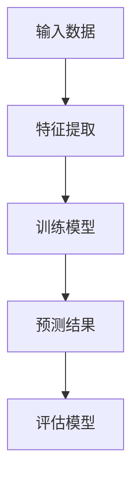
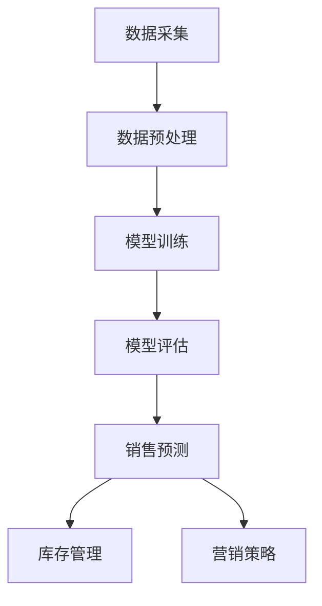
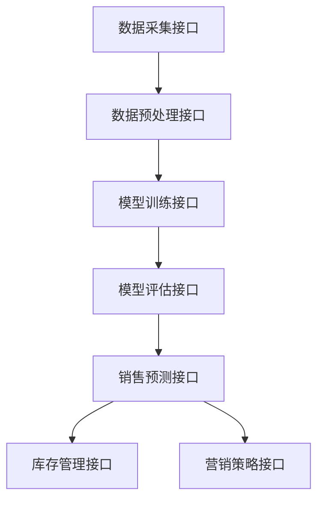
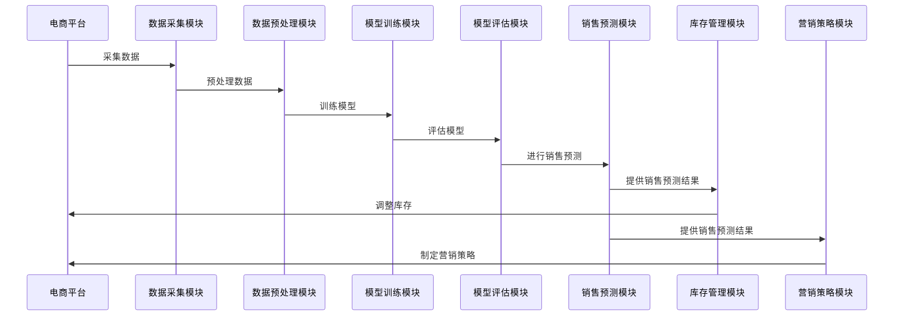

                 

### 文章标题

《AI驱动开发：人工智能在软件工程中的应用》

> 关键词：人工智能、软件工程、AI驱动开发、算法、系统架构、应用实践

> 摘要：本文深入探讨了人工智能在软件工程中的应用，通过分析AI驱动开发的背景、核心概念、算法原理、应用实践，探讨了人工智能如何提升软件开发的效率和质量，为软件开发者提供了宝贵的参考和启示。

### 第一部分：背景介绍与核心概念

#### 第1章：AI驱动开发：问题背景与挑战

##### 1.1.1 问题背景

在当今数字化时代，软件工程作为信息技术的重要分支，发挥着越来越重要的作用。然而，随着软件系统的复杂度和规模不断增长，传统的软件开发方法面临着诸多挑战，如开发周期长、成本高、维护困难等。这些问题的存在严重制约了软件工程的发展。在这种情况下，人工智能（AI）技术的引入为软件工程带来了新的机遇和挑战。

##### 1.1.2 问题描述

传统软件工程中常见的问题包括：

1. **开发效率低**：软件系统开发过程中，程序员需要耗费大量时间进行代码编写和调试，导致开发周期长、效率低。
2. **测试困难**：软件测试是确保软件质量的重要环节，但传统的测试方法往往无法全面覆盖所有可能的测试场景，导致测试难度大、覆盖率低。
3. **维护复杂**：随着软件系统的运行时间增长，系统会不断出现新的问题，需要不断进行维护和更新，传统的维护方法难以应对。

##### 1.1.3 问题解决

人工智能技术在软件工程中的应用，为解决上述问题提供了新的思路。通过AI技术，可以自动化地完成一些繁琐的任务，如代码生成、测试、优化等，从而提高开发效率和质量。AI驱动开发的核心理念是利用人工智能技术，辅助软件开发过程，提升软件开发的自动化程度和智能化水平。

##### 1.1.4 边界与外延

AI驱动开发主要适用于以下场景：

1. **大规模软件开发**：对于复杂、大规模的软件系统，AI驱动开发可以显著提高开发效率和质量。
2. **持续集成与持续部署**：在持续集成和持续部署（CI/CD）过程中，AI技术可以自动化地完成测试、构建、部署等任务，提高开发流程的效率。
3. **代码审查与优化**：通过AI技术，可以自动化地审查代码质量，提供优化建议，提高代码的可读性和可维护性。

##### 1.1.5 概念结构与核心要素组成

AI驱动开发的基本概念包括：

1. **人工智能**：一种模拟人类智能的技术，包括机器学习、深度学习、自然语言处理等子领域。
2. **软件工程**：一门关于软件设计、开发、测试和维护的工程学科。
3. **AI驱动开发**：利用人工智能技术辅助软件开发过程，提升开发效率和质量的方法。

在软件工程中，核心概念包括：

1. **需求分析**：明确软件系统的功能需求、性能需求等。
2. **设计**：根据需求分析结果，设计软件系统的架构和模块。
3. **编码**：根据设计文档，编写代码实现软件功能。
4. **测试**：测试软件系统，确保其满足需求和设计要求。
5. **维护**：对软件系统进行更新和修复，确保其持续稳定运行。

这些核心概念与人工智能技术的关系如下：

- **需求分析**：利用自然语言处理技术，可以自动提取和分析用户需求。
- **设计**：利用机器学习技术，可以自动生成软件架构和模块设计。
- **编码**：利用代码生成技术，可以自动化地生成代码实现。
- **测试**：利用测试自动化技术，可以自动化地完成测试任务。
- **维护**：利用代码审查和优化技术，可以自动化地提高代码质量。

#### 第2章：核心概念与联系

##### 2.1.1 人工智能概述

人工智能（AI）是指通过计算机模拟人类智能的技术。它包括多个子领域，如机器学习、深度学习、自然语言处理、计算机视觉等。人工智能的目标是使计算机具备人类智能，能够自主地学习、推理、决策和执行任务。

##### 2.1.2 软件工程概述

软件工程是一门关于软件设计、开发、测试和维护的工程学科。软件工程的目标是通过系统化、规范化的方法，开发高质量的软件系统，满足用户需求。软件工程包括需求分析、设计、编码、测试、维护等多个阶段。

##### 2.1.3 AI与软件工程的联系

人工智能技术在软件工程中的应用主要体现在以下几个方面：

1. **需求分析**：利用自然语言处理技术，自动提取和分析用户需求。
2. **设计**：利用机器学习技术，自动生成软件架构和模块设计。
3. **编码**：利用代码生成技术，自动化地生成代码实现。
4. **测试**：利用测试自动化技术，自动化地完成测试任务。
5. **维护**：利用代码审查和优化技术，自动化地提高代码质量。

##### 2.1.4 概念属性特征对比表格

| 概念         | 特点                                                         |
|--------------|--------------------------------------------------------------|
| 人工智能     | 自动化、智能化、自主学习、推理能力、决策能力                 |
| 软件工程     | 系统化、规范化、质量保证、需求驱动、迭代开发               |
| AI驱动开发   | 结合人工智能技术，提升软件开发效率和质量                     |

##### 2.1.5 ER实体关系图架构

以下是一个简单的ER实体关系图，展示了AI驱动开发中的核心实体及其关系：

```mermaid
erDiagram
  AI技术 ||--|{ 软件工程 }|
  软件工程 ||--|{ AI驱动开发 }|
  AI驱动开发 ||--|{ 需求分析 }|
  AI驱动开发 ||--|{ 设计 }|
  AI驱动开发 ||--|{ 编码 }|
  AI驱动开发 ||--|{ 测试 }|
  AI驱动开发 ||--|{ 维护 }|
```

#### 第3章：AI驱动开发的主要算法原理

##### 3.1.1 算法原理概述

AI驱动开发的核心在于利用人工智能算法辅助软件开发。主要算法包括：

1. **机器学习算法**：用于自动生成代码、优化代码质量、自动测试等。
2. **深度学习算法**：用于图像识别、语音识别、自然语言处理等。
3. **强化学习算法**：用于自动优化系统性能、自动调试等。

##### 3.1.2 算法原理讲解

以下是一个简单的机器学习算法——线性回归的流程图：



线性回归的数学模型如下：

$$
y = w_1x_1 + w_2x_2 + ... + w_nx_n + b
$$

其中，$x_1, x_2, ..., x_n$ 是输入特征，$y$ 是预测结果，$w_1, w_2, ..., w_n$ 是权重，$b$ 是偏置。

##### 3.1.3 数学模型和公式

线性回归的数学模型如下：

$$
y = w_1x_1 + w_2x_2 + ... + w_nx_n + b
$$

其中，$x_1, x_2, ..., x_n$ 是输入特征，$y$ 是预测结果，$w_1, w_2, ..., w_n$ 是权重，$b$ 是偏置。

##### 3.1.4 通俗易懂地举例说明

假设我们要预测一个商品的销售量，输入特征包括商品的价格、品牌、促销信息等。使用线性回归算法，我们可以建立一个预测模型，如下所示：

$$
销售量 = 0.5 \times 价格 + 0.3 \times 品牌 + 0.2 \times 促销信息 + 0.1
$$

通过训练模型，我们可以得到每个特征的权重。例如，如果价格的特征权重为0.5，那么价格每增加1元，销售量就会增加0.5个单位。

### 第二部分：AI驱动开发的应用实践

#### 第4章：AI驱动开发的算法实践

##### 4.1.1 环境安装与准备

在进行AI驱动开发之前，我们需要安装和配置必要的开发环境。以下是安装和配置Python环境以及相关库的步骤：

1. **安装Python**：下载并安装Python，可以选择Python 3.x版本。
2. **安装Jupyter Notebook**：Python的交互式开发环境，可以使用pip安装。
   ```bash
   pip install notebook
   ```
3. **安装TensorFlow**：TensorFlow是Python中常用的机器学习库，可以使用pip安装。
   ```bash
   pip install tensorflow
   ```

##### 4.1.2 系统核心实现源代码

以下是一个简单的AI驱动开发的示例代码，使用TensorFlow实现线性回归模型：

```python
import tensorflow as tf
import numpy as np

# 定义线性回归模型
model = tf.keras.Sequential([
  tf.keras.layers.Dense(units=1, input_shape=[1])
])

# 编译模型
model.compile(optimizer='sgd', loss='mean_squared_error')

# 训练模型
x_train = np.array([1, 2, 3, 4])
y_train = np.array([1, 2, 3, 4])
model.fit(x_train, y_train, epochs=100)

# 预测结果
x_predict = np.array([5])
y_predict = model.predict(x_predict)
print(y_predict)
```

##### 4.1.3 代码应用解读与分析

这个示例代码使用了TensorFlow库，定义了一个简单的线性回归模型。模型由一个全连接层（Dense Layer）组成，输入特征是一个维度，输出结果是预测的销售量。

- **编译模型**：使用`compile`方法编译模型，指定优化器和损失函数。这里使用的是随机梯度下降（SGD）优化器和均方误差（MSE）损失函数。
- **训练模型**：使用`fit`方法训练模型，将训练数据传入，指定训练轮数（epochs）。
- **预测结果**：使用`predict`方法进行预测，输入一个新数据点，输出预测结果。

##### 4.1.4 实际案例分析和详细讲解剖析

假设我们有一个电商平台的销售数据，包括商品价格和销售量。我们可以使用这个数据集来训练线性回归模型，预测新商品的销售量。

1. **数据预处理**：首先，我们需要对数据进行预处理，包括数据清洗、归一化等。
2. **划分数据集**：将数据集划分为训练集和测试集，用于训练和评估模型。
3. **训练模型**：使用训练集训练模型，调整模型参数。
4. **评估模型**：使用测试集评估模型性能，调整模型参数。
5. **预测销售量**：使用训练好的模型预测新商品的销售量。

以下是一个实际案例的分析和代码实现：

```python
import pandas as pd
import numpy as np
from sklearn.model_selection import train_test_split
from sklearn.preprocessing import StandardScaler
import tensorflow as tf

# 加载数据集
data = pd.read_csv('sales_data.csv')

# 数据预处理
data['Price'] = data['Price'].astype(float)
data['Sales'] = data['Sales'].astype(float)

# 划分数据集
x = data[['Price']]
y = data['Sales']
x_train, x_test, y_train, y_test = train_test_split(x, y, test_size=0.2, random_state=42)

# 归一化数据
scaler = StandardScaler()
x_train = scaler.fit_transform(x_train)
x_test = scaler.transform(x_test)

# 定义线性回归模型
model = tf.keras.Sequential([
  tf.keras.layers.Dense(units=1, input_shape=[1])
])

# 编译模型
model.compile(optimizer='sgd', loss='mean_squared_error')

# 训练模型
model.fit(x_train, y_train, epochs=100)

# 评估模型
loss = model.evaluate(x_test, y_test)
print("测试集损失：", loss)

# 预测销售量
x_predict = np.array([[100]])
x_predict = scaler.transform(x_predict)
y_predict = model.predict(x_predict)
print("预测销售量：", y_predict)
```

在这个案例中，我们首先加载了一个包含商品价格和销售量的数据集，然后进行数据预处理，包括数据清洗和归一化。接下来，我们将数据集划分为训练集和测试集，用于训练和评估模型。然后，我们定义了一个简单的线性回归模型，使用训练集进行训练，并使用测试集评估模型性能。最后，我们使用训练好的模型预测一个新商品（价格为100元）的销售量。

#### 第5章：AI驱动开发的系统架构设计

##### 5.1.1 问题场景介绍

假设我们要开发一个电商平台，需要预测每个商品的销售量，以便更好地进行库存管理和营销策略制定。为了实现这个目标，我们可以使用AI驱动开发的方法，构建一个基于机器学习的销售预测系统。

##### 5.1.2 项目介绍

项目名称：电商平台销售预测系统

项目目标：利用机器学习算法预测每个商品的销售量，为库存管理和营销策略提供数据支持。

##### 5.1.3 系统功能设计

系统功能设计主要包括以下几个方面：

1. **数据采集**：从电商平台的数据源（如数据库、日志等）采集商品价格、销量等数据。
2. **数据预处理**：对采集到的数据进行清洗、归一化等预处理操作，为后续建模提供高质量的数据。
3. **模型训练**：使用机器学习算法（如线性回归、决策树、神经网络等）训练销售预测模型。
4. **模型评估**：使用测试集评估模型性能，调整模型参数，优化模型。
5. **销售预测**：使用训练好的模型进行销售预测，为库存管理和营销策略提供数据支持。

##### 5.1.4 系统架构设计

系统架构设计如下：



- **数据采集**：从电商平台的数据源（如数据库、日志等）采集商品价格、销量等数据。
- **数据预处理**：对采集到的数据进行清洗、归一化等预处理操作，为后续建模提供高质量的数据。
- **模型训练**：使用机器学习算法（如线性回归、决策树、神经网络等）训练销售预测模型。
- **模型评估**：使用测试集评估模型性能，调整模型参数，优化模型。
- **销售预测**：使用训练好的模型进行销售预测，为库存管理和营销策略提供数据支持。
- **库存管理**：根据销售预测结果，调整库存水平，确保商品供应充足。
- **营销策略**：根据销售预测结果，制定针对性的营销策略，提升销售额。

##### 5.1.5 系统接口设计

系统接口设计如下：



- **数据采集接口**：用于从电商平台的数据源采集商品价格、销量等数据。
- **数据预处理接口**：用于对采集到的数据进行清洗、归一化等预处理操作。
- **模型训练接口**：用于训练销售预测模型。
- **模型评估接口**：用于评估模型性能，调整模型参数。
- **销售预测接口**：用于使用训练好的模型进行销售预测。
- **库存管理接口**：用于根据销售预测结果，调整库存水平。
- **营销策略接口**：用于根据销售预测结果，制定针对性的营销策略。

##### 5.1.6 系统交互Mermaid序列图

以下是一个简单的系统交互序列图，展示了各模块之间的交互流程：



### 第三部分：总结与拓展

#### 第6章：AI驱动开发的最佳实践

##### 6.1.1 最佳实践 tips

在进行AI驱动开发时，以下是一些最佳实践建议：

1. **数据质量优先**：确保数据的质量和准确性，为后续的模型训练和预测提供可靠的数据基础。
2. **选择合适的算法**：根据具体问题和数据特点，选择合适的机器学习算法，并进行算法调优。
3. **模型评估与优化**：使用多种评估指标和方法评估模型性能，持续优化模型。
4. **自动化与持续集成**：利用自动化工具和持续集成（CI/CD）流程，提高开发效率和代码质量。
5. **跨领域合作**：与不同领域的专家合作，充分发挥人工智能技术在软件开发中的应用潜力。

##### 6.1.2 小结

本文深入探讨了人工智能在软件工程中的应用，介绍了AI驱动开发的背景、核心概念、算法原理和应用实践。通过本文的阅读，读者可以了解到：

- 人工智能技术在软件开发中的重要性。
- AI驱动开发的核心原理和关键技术。
- 如何利用AI技术提升软件开发效率和质量。

希望本文能为软件开发者提供有价值的参考和启示。

#### 第7章：注意事项与未来展望

##### 7.1.1 注意事项

在实施AI驱动开发时，需要注意以下几点：

1. **数据隐私与安全**：确保数据处理过程符合隐私保护法规，避免数据泄露和安全风险。
2. **模型解释性**：模型解释性对于软件工程至关重要，需要确保模型的可解释性。
3. **模型泛化能力**：避免过拟合问题，提高模型的泛化能力。
4. **持续学习与更新**：随着技术和业务环境的变化，需要持续学习和更新模型。

##### 7.1.2 未来展望

AI驱动开发具有广阔的发展前景：

1. **更高效的算法**：随着算法技术的发展，AI驱动开发的效率将进一步提升。
2. **跨领域应用**：人工智能技术将在更多领域得到应用，如物联网、自动驾驶等。
3. **智能开发工具**：智能开发工具将逐渐普及，为软件开发者提供更便捷的开发体验。
4. **人机协作**：人工智能与人类开发者的协作将更加紧密，共同推动软件工程的发展。

未来，AI驱动开发将在软件工程中发挥更加重要的作用，为软件开发带来深远的影响。

