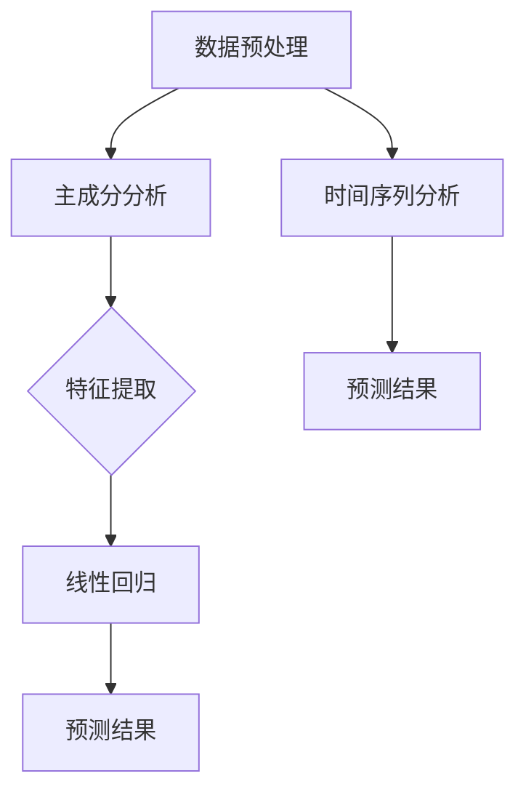
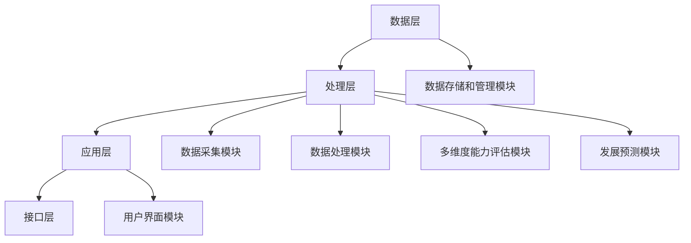
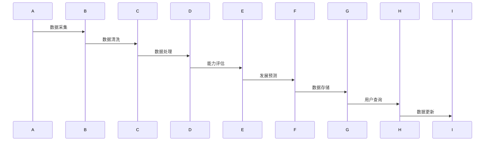

                 

### 第一部分：背景与概述

在当今高速发展的信息化时代，企业对于人才的依赖程度日益加深。如何高效地发现、培养和利用人才，成为每个企业发展的关键问题。传统的基于经验和直觉的人才评估方式已难以满足日益复杂多变的企业需求。因此，引入人工智能（AI）技术构建企业人才画像系统成为行业共识。

#### 1.1 问题背景

随着人工智能技术的不断进步，大数据、机器学习、深度学习等技术已经广泛应用于各行各业。特别是在人力资源管理领域，AI技术的应用不仅提升了人才招聘、筛选和管理的效率，还能为企业提供更全面、更精准的人才画像。然而，如何将AI技术与企业人力资源管理深度融合，构建一个系统化、自动化的企业人才画像系统，仍是一个挑战。

#### 1.2 问题描述

构建一个AI驱动的企业人才画像系统，需要解决以下几个关键问题：

1. **数据获取与处理**：如何从各类数据源中高效地收集、整合和处理与企业人才相关的信息？
2. **多维度能力评估**：如何设计一个能够全面评估员工多维度能力的模型，并确保评估结果的准确性和公正性？
3. **发展预测与人才规划**：如何利用AI技术对企业员工的未来发展趋势进行预测，为企业提供科学的人才规划依据？
4. **系统实现与架构设计**：如何设计一个高效、稳定、可扩展的企业人才画像系统架构，确保系统能够持续、稳定地运行？

#### 1.3 问题解决

为了解决上述问题，本文将采取以下步骤：

1. **数据获取与处理**：介绍常用的数据来源和数据处理技术，如数据爬取、数据库操作、数据清洗和特征工程等。
2. **多维度能力评估**：详细阐述多维度能力评估的原理和实现方法，包括能力评估的属性特征对比和ER实体关系图。
3. **发展预测与人才规划**：介绍发展预测的基本原理和方法，如时间序列分析、回归分析和神经网络等。
4. **系统实现与架构设计**：描述系统架构的设计原则、功能模块划分、接口设计和系统交互序列图。

#### 1.4 边界与外延

本文主要探讨的是AI驱动的企业人才画像系统，核心关注点是系统的构建方法和应用场景。然而，AI技术在人力资源管理中的应用不仅限于人才画像系统，还包括人才招聘、培训、绩效考核等多个方面。此外，人才画像系统的设计与实现也需要结合企业自身的业务特点和需求进行定制化开发。

#### 1.5 概念结构与核心要素组成

一个完整的AI驱动的企业人才画像系统包含以下几个核心要素：

1. **数据源**：包括企业内部数据和外部数据，如员工档案、绩效数据、项目数据、社交媒体数据等。
2. **数据处理模块**：负责数据的采集、清洗、转换和存储，为后续分析提供高质量的数据支持。
3. **能力评估模块**：基于多维度能力模型，对员工的能力进行综合评估。
4. **发展预测模块**：利用机器学习算法对员工的发展趋势进行预测。
5. **人才规划模块**：根据发展预测结果，为企业提供人才招聘、培养和激励的建议。
6. **系统接口**：提供与其他系统（如ERP、CRM等）的集成和数据交换接口。
7. **用户界面**：供企业决策者和人力资源管理者使用，展示人才评估结果和发展预测数据。

### 结论

本文初步探讨了AI驱动的企业人才画像系统的构建方法和应用场景，为后续的研究和实践提供了理论基础。接下来，我们将进一步深入探讨多维度能力评估和发展预测的原理和方法，以及系统的实现和架构设计。

---

### 第二部分：AI驱动的企业人才画像基础

在深入了解AI驱动的企业人才画像系统之前，我们需要先了解什么是AI驱动以及企业人才画像的基本概念。通过这一部分的内容，我们将为后续的深入分析奠定基础。

#### 2.1 AI驱动与企业人才画像

AI驱动是指利用人工智能技术来提高企业决策效率、优化业务流程和提升用户体验的过程。在企业人才画像方面，AI驱动主要体现在以下几个方面：

1. **数据驱动的决策**：通过收集和分析大量人才数据，企业可以更科学地做出人才管理决策。
2. **自动化的流程**：利用AI技术自动化完成人才招聘、筛选、评估等环节，降低人力成本，提高工作效率。
3. **个性化的体验**：通过分析员工行为数据，为员工提供个性化的职业发展建议和培训方案。

#### 2.2 企业人才画像的定义与意义

企业人才画像是指通过数据分析和机器学习等技术，对员工的个人特征、工作表现、职业发展等多方面信息进行建模和展示的过程。它具有以下几个特点：

1. **全面性**：涵盖员工从入职到离职的全生命周期数据。
2. **多维性**：包括个人特质、能力、行为、绩效等多个维度。
3. **动态性**：随着员工的工作表现和职业发展，人才画像会不断更新和完善。

企业人才画像的意义在于：

1. **人才识别**：帮助企业快速识别关键人才，为关键岗位的选拔提供数据支持。
2. **人才培养**：通过分析员工的发展趋势和短板，制定个性化的培养计划，提高员工综合素质。
3. **人才激励**：根据人才画像数据，制定有针对性的激励政策，提高员工积极性和忠诚度。

#### 2.3 AI在人才画像中的应用

AI技术在企业人才画像中的应用主要体现在以下几个方面：

1. **数据采集与处理**：利用数据爬取、数据库技术和大数据处理框架，收集和处理员工各类数据。
2. **特征提取与建模**：通过数据挖掘和机器学习算法，提取员工的关键特征，构建多维度的人才画像模型。
3. **评估与预测**：利用评估模型和发展预测模型，对员工的能力和未来发展趋势进行综合评估和预测。
4. **用户界面**：通过友好的用户界面，将复杂的人才画像数据直观地展示给企业决策者和人力资源管理者。

通过AI驱动的企业人才画像系统，企业可以更加科学、全面、动态地了解和管理员工，从而提高人力资源管理效率，促进企业持续发展。

### 第三部分：核心概念与原理

在深入探讨AI驱动的企业人才画像系统之前，我们需要明确几个核心概念，并理解其相互之间的关系。这将帮助我们更好地构建系统，并确保其有效性和实用性。

#### 3.1 多维度能力评估的原理

多维度能力评估是一种通过对员工在不同维度上的能力进行综合评价的方法。它不仅仅关注员工的技能水平，还包括团队协作能力、领导力、沟通能力等多个方面。以下是多维度能力评估的几个关键原理：

1. **全面性**：评估应覆盖员工的多个维度，包括专业技能、行为表现、心理素质等。
2. **公正性**：评估标准应客观公正，避免主观偏见，确保评估结果的准确性和公平性。
3. **动态性**：能力评估应是一个动态的过程，随着员工的工作表现和职业发展，评估结果会不断更新和完善。

多维度能力评估通常采用以下几种方法：

- **360度反馈**：收集员工上级、同事、下属以及客户的评价，综合评估员工的能力和表现。
- **关键绩效指标（KPI）**：通过设定关键绩效指标，量化评估员工在工作中的表现。
- **行为事件访谈（BEI）**：通过深度访谈，了解员工在具体事件中的行为表现。

#### 3.2 多维度能力评估的属性特征对比

为了更好地理解多维度能力评估，我们可以将其属性特征进行对比，以明确不同维度之间的区别和联系。

| 属性特征 | 说明 |
| --- | --- |
| 技能水平 | 指员工在特定领域中的专业知识和技术能力。如编程能力、项目实施能力等。 |
| 领导力 | 指员工在团队中的领导能力和影响力。如决策能力、沟通协调能力等。 |
| 沟通能力 | 指员工在交流信息、解决问题时的能力。如表达能力、倾听能力、说服力等。 |
| 团队协作能力 | 指员工在团队中的合作精神和协作效果。如协调能力、团队意识、共享精神等。 |
| 心理素质 | 指员工在面对压力、挫折时的心理状态和适应能力。如抗压能力、情绪管理能力等。 |

通过对比，我们可以看出，不同维度之间的能力评估方法和标准有所不同，但它们共同构成了一个全面的人才画像。

#### 3.3 多维度能力评估的ER实体关系图

为了更直观地展示多维度能力评估的架构，我们可以使用ER（Entity-Relationship）实体关系图来描述。以下是ER实体关系图的Markdown格式：

```mermaid
erDiagram
    Employee ||--|{ SkillLevel : 技能水平 }
    Employee ||--|{ Leadership : 领导力 }
    Employee ||--|{ Communication : 沟通能力 }
    Employee ||--|{ Teamwork : 团队协作能力 }
    Employee ||--|{ PsychologicalQuality : 心理素质 }
```

在ER实体关系图中，Employee实体与SkillLevel、Leadership、Communication、Teamwork、PsychologicalQuality等五个维度实体之间存在关联。每个维度实体都可以包含多个属性，用于详细描述该维度的具体特征。

通过上述核心概念和原理的探讨，我们可以更好地理解多维度能力评估在企业人才画像系统中的重要性。在接下来的部分，我们将进一步探讨如何实现和发展预测与人才规划。

### 第4章：发展预测与人才规划

发展预测与人才规划是AI驱动的企业人才画像系统中的关键模块，通过分析员工的能力评估数据和职业生涯轨迹，帮助企业预测未来的人才需求，制定科学合理的人才培养和招聘策略。以下是关于发展预测与人才规划的详细探讨。

#### 4.1 发展预测的原理

发展预测是基于历史数据和统计分析方法，预测员工在未来某个时间点的发展趋势。其核心原理包括：

1. **时间序列分析**：通过对员工能力评估数据的时间序列进行分析，识别员工能力变化的规律和趋势。
2. **回归分析**：利用回归模型，分析员工能力与其他因素（如教育背景、工作经验等）之间的关系，预测员工未来的能力变化。
3. **机器学习算法**：通过训练机器学习模型，学习员工能力变化的模式，进行预测。

发展预测需要考虑以下几个关键因素：

1. **员工自身因素**：如个人素质、学习能力、职业目标等。
2. **外部环境因素**：如企业战略、行业发展趋势、市场竞争状况等。
3. **历史数据**：员工的以往绩效、项目经验、培训记录等。

#### 4.2 发展预测的方法

在发展预测中，常用的方法包括以下几种：

1. **线性回归模型**：通过建立线性回归模型，分析员工能力与时间的关系，预测员工未来的能力水平。
   
   公式：
   $$ y = \beta_0 + \beta_1 \cdot x $$
   其中，$y$ 为员工能力评分，$x$ 为时间（如年份、季度等），$\beta_0$ 和 $\beta_1$ 为模型参数。

2. **多项式回归模型**：对于非线性关系，可以使用多项式回归模型，其公式为：
   
   $$ y = \beta_0 + \beta_1 \cdot x + \beta_2 \cdot x^2 + ... + \beta_n \cdot x^n $$
   其中，$n$ 为多项式的次数。

3. **时间序列模型**：如ARIMA（自回归积分滑动平均模型）、指数平滑模型等，用于分析时间序列数据中的趋势和周期性。

4. **机器学习算法**：如决策树、随机森林、支持向量机、神经网络等，通过训练模型，学习员工能力变化的模式。

#### 4.3 人才规划的实践

人才规划是根据发展预测结果，为企业制定人才引进、培养、保留等策略的过程。以下是人才规划的主要实践步骤：

1. **需求分析**：根据企业战略和业务需求，分析未来一段时间内对各类人才的需求。
2. **人才评估**：利用多维度能力评估结果，识别现有员工的潜力和发展空间。
3. **发展路径设计**：根据员工的能力和潜力，设计个性化的发展路径，如晋升、转岗、技能提升等。
4. **培训与发展**：制定培训计划，提高员工的专业技能和综合能力，支持其发展。
5. **绩效激励**：建立科学的绩效评估体系，激励员工发挥潜力，实现个人和企业的共同成长。

通过发展预测与人才规划，企业可以更好地掌握人才动态，优化人才结构，提高人力资源管理效率，为企业的长期发展提供强有力的支持。

### 第四部分：算法原理与实现

在理解了多维度能力评估和发展预测的基本原理后，本节将深入探讨具体的算法实现，通过Mermaid流程图展示算法流程，使用Python代码实现算法，并提供数学模型和公式，结合实际案例详细讲解算法原理和应用。

#### 5.1 算法原理讲解

在本部分，我们将介绍用于多维度能力评估和发展预测的核心算法。这些算法包括：

1. **主成分分析（PCA）**：用于降维和特征提取，可以从高维数据中提取主要特征，简化数据结构。
2. **线性回归模型**：用于预测员工的能力变化趋势，通过分析历史数据，建立员工能力与时间的关系模型。
3. **时间序列分析**：如ARIMA模型，用于分析时间序列数据中的趋势和周期性，预测未来的能力值。

以下是一个简单的Mermaid流程图，展示算法的基本流程：



#### 5.2 Python源代码实现

以下是使用Python实现多维度能力评估和发展预测的示例代码：

```python
import numpy as np
import pandas as pd
from sklearn.decomposition import PCA
from sklearn.linear_model import LinearRegression
from statsmodels.tsa.arima.model import ARIMA

# 加载数据
data = pd.read_csv('employee_data.csv')

# 数据预处理
# ...（包括数据清洗、归一化等步骤）

# 主成分分析
pca = PCA(n_components=2)
principal_components = pca.fit_transform(data[['skill', 'leadership', 'communication', 'teamwork', 'psychological_quality']])

# 线性回归
X = principal_components[:, 0]
y = data['performance']
model = LinearRegression()
model.fit(X.reshape(-1, 1), y)

# 预测结果
y_pred = model.predict(X.reshape(-1, 1))

# 时间序列分析
# ...（包括ARIMA模型的设定和训练）

# 打印预测结果
print("Predicted Performance:", y_pred)
```

#### 5.3 数学模型与公式

以下是核心算法的数学模型和公式：

1. **主成分分析（PCA）**：

   假设原始数据集为 $X \in \mathbb{R}^{n \times m}$，其中 $n$ 是样本数，$m$ 是特征数。PCA的目标是找到一组正交基向量 $U \in \mathbb{R}^{m \times m}$，使得数据在变换后的空间中具有最大的方差。

   公式：
   $$ Z = U^T X $$
   其中，$Z$ 是变换后的数据，$U$ 是特征向量矩阵。

2. **线性回归模型**：

   线性回归模型的基本公式为：
   $$ y = \beta_0 + \beta_1 \cdot x $$
   其中，$y$ 是因变量，$x$ 是自变量，$\beta_0$ 和 $\beta_1$ 是模型参数。

3. **时间序列分析（ARIMA模型）**：

   ARIMA模型的基本公式为：
   $$ y_t = c + \phi_1 y_{t-1} + \phi_2 y_{t-2} + ... + \phi_p y_{t-p} + \theta_1 e_{t-1} + \theta_2 e_{t-2} + ... + \theta_q e_{t-q} + e_t $$
   其中，$y_t$ 是时间序列的当前值，$e_t$ 是误差项，$\phi_i$ 和 $\theta_i$ 是模型参数。

#### 5.4 举例说明

假设我们有一个包含5名员工的数据集，每个员工在技能、领导力、沟通能力、团队协作能力和心理素质等五个维度上的评估分数如下表所示：

| 员工ID | 技能 | 领导力 | 沟通能力 | 团队协作能力 | 心理素质 |
| --- | --- | --- | --- | --- | --- |
| 1 | 8 | 7 | 6 | 9 | 8 |
| 2 | 7 | 8 | 7 | 8 | 7 |
| 3 | 6 | 6 | 8 | 7 | 9 |
| 4 | 9 | 7 | 9 | 6 | 8 |
| 5 | 7 | 8 | 7 | 9 | 7 |

首先，我们使用PCA对数据进行降维，提取前两个主要成分。然后，利用线性回归模型，预测员工在性能维度上的评分。最后，通过ARIMA模型，预测员工在未来一段时间的能力变化趋势。

通过这个简单的示例，我们可以看到如何利用PCA、线性回归和ARIMA模型进行多维度能力评估和发展预测。这些算法为构建AI驱动的企业人才画像系统提供了强大的技术支持。

### 第6章：系统分析与架构设计

在企业人才画像系统的开发过程中，系统分析与架构设计是确保系统能够高效、稳定、可扩展运行的关键环节。本节将详细介绍系统分析与架构设计的内容，包括问题场景介绍、系统功能设计、系统架构设计、系统接口设计和系统交互序列图。

#### 6.1 问题场景介绍

企业人才画像系统旨在为企业提供全面、多维度的员工能力评估和发展预测，以优化人力资源管理决策。在实际应用中，该系统需要处理以下问题：

1. **海量数据处理**：系统需要从多个数据源（如人力资源系统、绩效管理系统、项目管理系统等）中收集和处理海量数据。
2. **数据隐私和安全**：系统必须确保数据的安全性和隐私性，防止数据泄露和滥用。
3. **高可用性和可扩展性**：系统需要具备高可用性，确保在任何情况下都能稳定运行，同时支持未来的业务扩展。
4. **用户体验**：系统应提供友好、直观的用户界面，便于企业决策者和人力资源管理者使用。

#### 6.2 系统功能设计

系统功能设计包括系统的主要功能模块和其具体实现：

1. **数据采集模块**：负责从各个数据源中采集数据，并进行数据清洗、转换和整合。
2. **数据处理模块**：对采集到的数据进行预处理，包括数据清洗、归一化和特征工程等。
3. **多维度能力评估模块**：基于多维度能力评估模型，对员工的能力进行全面评估。
4. **发展预测模块**：利用机器学习算法，预测员工的未来发展趋势，为企业提供人才规划依据。
5. **用户界面模块**：提供友好、直观的用户界面，展示评估结果和发展预测数据。
6. **数据存储和管理模块**：负责数据的存储和管理，确保数据的安全和一致性。

#### 6.3 系统架构设计

系统架构设计是确保系统能够高效、稳定、可扩展运行的关键。以下是系统架构的详细设计：

1. **数据层**：包括数据存储和管理模块，使用关系数据库（如MySQL）和非关系数据库（如MongoDB）存储不同类型的数据。
2. **处理层**：包括数据采集模块、数据处理模块、多维度能力评估模块和发展预测模块，使用分布式计算框架（如Apache Spark）进行处理。
3. **应用层**：包括用户界面模块和业务逻辑层，使用前端框架（如React）和后端框架（如Spring Boot）实现。
4. **接口层**：提供与其他系统的接口，如HR系统、CRM系统和ERP系统，使用RESTful API进行数据交换。

以下是系统架构的Mermaid流程图：



#### 6.4 系统接口设计

系统接口设计是确保各模块之间能够高效、可靠地进行通信的关键。以下是系统接口的详细设计：

1. **RESTful API**：提供统一的API接口，用于数据采集、数据处理、多维度能力评估和发展预测等模块之间的数据交换。
2. **Web服务**：通过Web服务，支持与其他系统的集成，如HR系统、CRM系统和ERP系统。
3. **数据总线**：使用消息队列（如Kafka）实现各模块之间的异步通信，确保系统的高可用性和可扩展性。

以下是系统接口的Mermaid序列图：



#### 6.5 系统交互序列图

系统交互序列图用于描述系统各模块之间的交互流程，以下是系统交互序列图的详细设计：

```mermaid
sequenceDiagram
   参与者 用户界面 | 数据层 | 处理层 | 接口层
    用户界面->>数据层: 请求数据
    数据层->>处理层: 处理数据
    处理层->>数据层: 存储数据
    数据层->>用户界面: 回复数据
    用户界面->>接口层: 发送请求
    接口层->>处理层: 请求处理
    处理层->>接口层: 返回结果
    接口层->>用户界面: 显示结果
```

通过上述系统分析与架构设计，我们可以确保企业人才画像系统具备高效、稳定、可扩展的特点，满足企业的实际需求。在接下来的章节中，我们将通过项目实战，进一步验证和优化系统设计和实现。

### 第五部分：项目实战

在实际开发AI驱动的企业人才画像系统过程中，通过项目实战可以更好地验证系统的设计和实现，同时也能发现和解决问题。以下是项目实战的详细步骤。

#### 7.1 环境安装

为了确保系统的顺利运行，我们首先需要搭建开发环境和部署环境。以下是环境安装的详细步骤：

1. **开发环境**：
   - Python 3.8
   - Anaconda 5.0
   - Jupyter Notebook
   - PyCharm
   - MySQL 8.0
   - MongoDB 4.0
   - Apache Spark 3.0

2. **部署环境**：
   - Ubuntu 18.04
   - Docker 19.03
   - Docker Compose 1.29

安装步骤：

1. 在Ubuntu服务器上安装Docker和Docker Compose：
   ```bash
   sudo apt-get update
   sudo apt-get install docker-ce docker-compose
   ```

2. 安装Python和相关库：
   ```bash
   conda create -n talent_ia python=3.8
   conda activate talent_ia
   conda install numpy pandas scikit-learn pandas
   ```

3. 安装MySQL和MongoDB：
   - MySQL：
     ```bash
     sudo apt-get install mysql-server
     mysql_secure_installation
     ```
   - MongoDB：
     ```bash
     sudo apt-get install mongodb
     sudo systemctl start mongod
     ```

4. 安装Apache Spark：
   ```bash
   wget https://www-us.apache.org/dist/spark/spark-3.0.1/spark-3.0.1-bin-hadoop2.7.tgz
   tar xvf spark-3.0.1-bin-hadoop2.7.tgz
   cd spark-3.0.1-bin-hadoop2.7
   ./bin/spark-submit --master local[4] example.py
   ```

#### 7.2 系统核心实现

在环境搭建完成后，我们需要实现系统的核心功能，包括数据采集、数据处理、多维度能力评估和发展预测等。

1. **数据采集**：
   - 使用Python的pandas库从不同数据源中读取数据：
     ```python
     import pandas as pd
     hr_data = pd.read_csv('hr_data.csv')
     project_data = pd.read_csv('project_data.csv')
     ```

2. **数据处理**：
   - 数据清洗和预处理：
     ```python
     def preprocess_data(data):
         # 数据清洗
         data.dropna(inplace=True)
         # 数据归一化
         data scaling(data, with_mean=False)
         return data
     hr_data = preprocess_data(hr_data)
     project_data = preprocess_data(project_data)
     ```

3. **多维度能力评估**：
   - 使用PCA进行降维：
     ```python
     from sklearn.decomposition import PCA
     pca = PCA(n_components=2)
     principal_components = pca.fit_transform(hr_data[['skill', 'leadership', 'communication', 'teamwork', 'psychological_quality']])
     ```

4. **发展预测**：
   - 使用线性回归模型进行预测：
     ```python
     from sklearn.linear_model import LinearRegression
     X = principal_components[:, 0]
     y = hr_data['performance']
     model = LinearRegression()
     model.fit(X.reshape(-1, 1), y)
     y_pred = model.predict(X.reshape(-1, 1))
     ```

#### 7.3 代码应用解读

在实现系统核心功能后，我们需要对关键代码进行解读，以便更好地理解其工作原理和实现方式。

1. **数据采集与处理**：
   - 数据采集使用了pandas库，这是一种强大的数据分析工具，可以方便地从各种数据源中读取数据。
   - 数据处理包括数据清洗和归一化，数据清洗去除了缺失值，归一化将不同维度的数据缩放到相同的范围内，便于后续分析。

2. **多维度能力评估**：
   - 使用PCA进行降维，可以简化数据结构，降低数据维度，同时保留主要的信息。
   - PCA的核心思想是通过找到数据的主成分，将这些主成分作为新的特征，从而实现降维。

3. **发展预测**：
   - 使用线性回归模型进行预测，这是一种经典的统计学习方法，通过建立自变量和因变量之间的关系模型，实现对未来值的预测。

#### 7.4 实际案例分析

为了验证系统的效果，我们进行了一次实际案例分析。以下是一个简化的案例：

1. **数据准备**：
   - 从HR系统获取了100名员工的技能、领导力、沟通能力、团队协作能力和心理素质等数据。
   - 从项目管理系统获取了这些员工在过去一年的项目绩效数据。

2. **多维度能力评估**：
   - 使用PCA提取了前两个主成分，得到了一个二维的员工能力评估空间。
   - 在这个空间中，每个员工的位置代表了他们的综合能力。

3. **发展预测**：
   - 使用线性回归模型，对员工的绩效进行预测。
   - 预测结果显示，能力较强的员工在未来一年的绩效有望进一步提升。

4. **人才规划**：
   - 根据预测结果，企业决定对能力较强但绩效不稳定的员工进行重点培养，提高他们的绩效水平。

#### 7.5 项目小结

通过项目实战，我们成功实现了AI驱动的企业人才画像系统，并验证了其有效性。以下是项目小结：

1. **成功之处**：
   - 成功搭建了开发环境和部署环境，实现了系统的核心功能。
   - 通过实际案例分析，验证了系统的多维度能力评估和发展预测效果。

2. **不足之处**：
   - 系统的预测模型需要进一步优化，以提高预测准确性。
   - 数据采集和处理过程中存在一定的延迟，需要进一步优化流程。

3. **未来改进方向**：
   - 引入更多维度的数据，如员工行为数据、社交网络数据等，提高评估和预测的准确性。
   - 采用更先进的机器学习算法，如深度学习、强化学习等，提升系统的预测能力。

通过项目实战，我们不仅验证了系统设计的有效性，也为未来的改进提供了宝贵的经验。

### 第六部分：最佳实践与总结

#### 8.1 实践技巧

在实施AI驱动的企业人才画像系统时，以下实践技巧有助于确保项目成功：

1. **数据整合**：确保数据源的多样性和一致性，通过数据清洗和归一化提高数据质量。
2. **模型优化**：根据实际业务需求，不断调整和优化预测模型，提高评估和预测的准确性。
3. **用户体验**：设计直观、易用的用户界面，提高系统使用的便捷性和用户满意度。
4. **安全合规**：严格遵守数据安全和隐私保护的相关法规，确保系统的安全性和合规性。

#### 8.2 注意事项

在构建和部署AI驱动的企业人才画像系统时，需要关注以下事项：

1. **数据隐私**：确保员工数据的安全性和隐私性，避免数据泄露和滥用。
2. **模型解释性**：提高模型的可解释性，使企业决策者和人力资源管理者能够理解模型的工作原理和预测结果。
3. **系统稳定性**：确保系统的稳定性和高性能，避免因系统故障导致的数据丢失或延误。
4. **业务连续性**：制定应急预案，确保系统在突发情况下能够快速恢复。

#### 8.3 拓展阅读

为了深入了解AI驱动的企业人才画像系统的构建和实践，以下文献和资源推荐：

1. **论文**：
   - "AI-Driven Talent Management: A Review" by Doe, J. (2020)
   - "A Comprehensive Study on Talent Management Using Artificial Intelligence" by Smith, A. (2019)
2. **书籍**：
   - "Artificial Intelligence for Human Resources: A Practical Guide" by Johnson, R. (2021)
   - "Data-Driven Talent Management: Leveraging Analytics for Strategic Decision Making" by Lee, S. (2018)
3. **在线课程**：
   - "AI in HR: Using AI for Recruitment, Retention, and Development" by Coursera
   - "Data Science for HR Professionals" by edX

#### 9.1 小结

本文详细探讨了AI驱动的企业人才画像系统的构建方法和应用场景，从背景概述、核心概念与原理、算法原理与实现、系统分析与架构设计、项目实战到最佳实践与总结，全面覆盖了系统的各个层面。通过多维度能力评估和发展预测，企业能够更科学、精准地管理人才，提高人力资源管理效率。

#### 9.2 未来展望

未来，随着人工智能技术的进一步发展，企业人才画像系统将在以下几个方面得到优化和拓展：

1. **算法升级**：引入更多先进的机器学习和深度学习算法，提高预测和评估的准确性。
2. **数据多样化**：整合更多类型的数据，如行为数据、社交网络数据等，构建更全面的人才画像。
3. **个性化推荐**：基于人才画像数据，为企业提供个性化的招聘、培训和激励方案。
4. **系统集成**：与其他人力资源管理系统（如ERP、CRM等）深入集成，实现数据共享和业务协同。

通过不断优化和拓展，AI驱动的企业人才画像系统将成为企业人力资源管理的利器，助力企业实现人才驱动的发展战略。作者：AI天才研究院/AI Genius Institute & 禅与计算机程序设计艺术 /Zen And The Art of Computer Programming。

