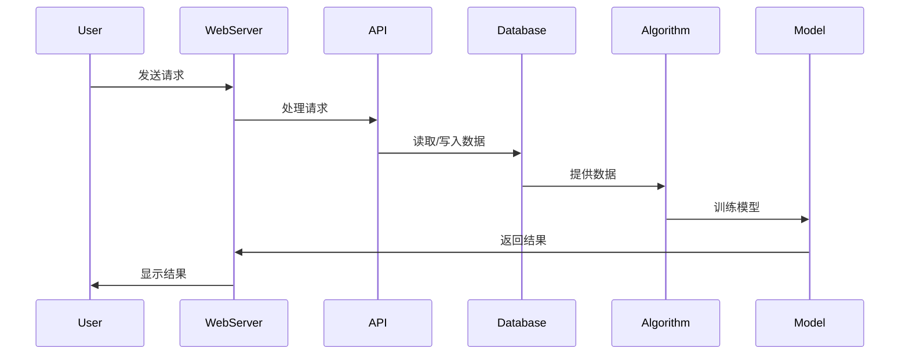
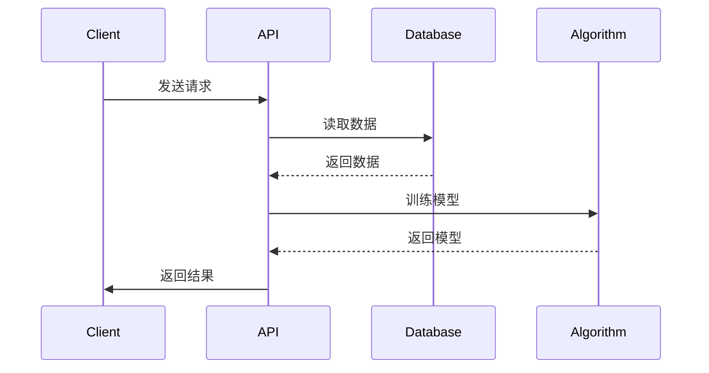

                 

# AI驱动的企业创新孵化器：从创意到商业化

## 关键词：AI，创新孵化器，企业，商业化，技术驱动

## 摘要

本文探讨了AI驱动的企业创新孵化器的概念、原理、实现与应用。通过详细分析AI在创新孵化器中的关键作用，我们揭示了从创意到商业化的全流程，展示了AI如何帮助企业跨越创新鸿沟，实现持续的创新与商业化。文章旨在为企业管理者和技术人员提供实用的指导，以更好地利用AI推动企业创新。

## 目录大纲

### 第一部分：背景介绍与核心概念

#### 第1章 问题背景、问题描述与问题解决

##### 1.1 问题背景

- 企业创新的重要性
- 传统创新模式与局限
- AI在企业创新中的潜力

##### 1.2 问题描述

- 企业在创新过程中面临的挑战
- 创意与商业化的鸿沟
- AI如何帮助企业跨越这个鸿沟

##### 1.3 问题解决

- AI驱动的创新孵化器概念
- 创新孵化器的功能与价值

##### 1.4 边界与外延

- AI驱动的创新孵化器与创业孵化器的区别
- 创新孵化器的适用范围与场景

##### 1.5 概念结构与核心要素组成

- AI驱动的创新孵化器组成要素
- 创新孵化器的核心流程与环节

### 第二部分：核心概念与联系

#### 第2章 AI驱动的创新孵化器核心概念

##### 2.1 AI驱动的创新孵化器定义

- 定义与解释
- 主要特征

##### 2.2 AI驱动的创新孵化器类型

- 传统型
- 数据驱动型
- 人工智能型

##### 2.3 概念属性特征对比表格

- 传统创新孵化器 vs AI驱动的创新孵化器
- 不同类型AI驱动的创新孵化器对比

##### 2.4 ER实体关系图架构

- 实体与关系的定义
- 关系与实体之间的连接

### 第三部分：AI驱动的创新孵化器原理与实现

#### 第3章 AI驱动的创新孵化器原理

##### 3.1 创新孵化器的工作原理

- 创新过程概述
- AI在创新过程中的作用

##### 3.2 AI驱动的创新孵化器技术基础

- 数据处理与挖掘
- 机器学习与深度学习
- 自然语言处理

##### 3.3 AI驱动的创新孵化器关键算法

- 算法概述
- 算法原理
- 算法实现

#### 第4章 AI驱动的创新孵化器实现

##### 4.1 系统架构设计

- 系统总体架构
- 系统模块划分
- 系统交互mermaid序列图

##### 4.2 系统功能设计

- 创意收集模块
- 数据分析模块
- 商业化评估模块

##### 4.3 系统接口设计

- 接口定义与说明
- 接口实现与调用

##### 4.4 创新孵化器实现

- 环境搭建与配置
- 核心代码实现
- 系统测试与优化

### 第四部分：AI驱动的企业创新孵化器应用实战

#### 第5章 创新孵化器在企业的应用场景

##### 5.1 企业创新需求分析

- 创新需求概述
- 创新需求分类

##### 5.2 创新孵化器在企业的应用案例

- 案例一：人工智能公司创新孵化器应用
- 案例二：制造业公司创新孵化器应用
- 案例三：金融行业公司创新孵化器应用

##### 5.3 应用效果分析

- 创新成功率提升
- 商业化转化率提升
- 企业整体创新能力提升

### 第五部分：AI驱动的企业创新孵化器最佳实践与拓展

#### 第6章 最佳实践

##### 6.1 创新孵化器建设最佳实践

- 数据收集与处理
- 人工智能技术应用
- 创新过程管理

##### 6.2 创新孵化器运营最佳实践

- 创新团队建设
- 创新资源整合
- 创新文化培育

#### 第7章 小结与拓展

##### 7.1 小结

- 总结全书主要内容
- 突出创新孵化器的重要性

##### 7.2 拓展阅读

- 相关书籍推荐
- 研究论文推荐
- 行业报告推荐

----------------------------------------------------------------

### 第一部分：背景介绍与核心概念

#### 第1章 问题背景、问题描述与问题解决

##### 1.1 问题背景

在当今竞争激烈的商业环境中，企业创新已成为保持竞争力的关键。然而，传统的创新模式往往面临诸多挑战。首先，创新往往需要跨部门、跨领域的协作，而企业内部的组织结构和文化往往不利于这种跨领域的合作。其次，创新过程耗时较长，从创意的产生到商业化的实现，往往需要数年的时间。此外，企业内部的知识和资源分散，难以集中利用，导致创新效率低下。

与此同时，人工智能（AI）技术的迅速发展为企业创新带来了新的机遇。AI可以通过自动化和智能化的手段，提高创新效率，缩短创新周期，降低创新成本。例如，AI可以自动化处理大量数据，挖掘潜在的创新机会；AI可以帮助企业模拟各种场景，快速验证创新方案的有效性；AI还可以通过智能推荐和个性化服务，帮助企业更好地满足市场需求。

##### 1.2 问题描述

企业在创新过程中主要面临以下几个挑战：

1. 创新效率低下：传统的创新模式往往需要较长的时间，从创意的产生到商业化的实现，通常需要数年的时间。这导致企业无法及时响应市场变化，错失创新机会。

2. 创意与商业化的鸿沟：企业产生的创意往往缺乏商业可行性，无法转化为实际的商业价值。这主要是由于企业对市场需求的理解不够深入，对商业模式的构建不够完善。

3. 资源分散：企业内部的知识和资源分散，难以集中利用，导致创新效率低下。

4. 创新风险：创新过程充满不确定性，企业需要承担较高的风险。

##### 1.3 问题解决

AI驱动的创新孵化器旨在通过AI技术帮助企业解决上述创新挑战。创新孵化器是一种专门用于支持创新活动的平台，它集成了AI技术，提供从创意到商业化的全流程服务。

首先，AI驱动的创新孵化器可以通过自动化和智能化的手段，提高创新效率。AI可以自动化处理大量数据，帮助企业快速挖掘潜在的创新机会。同时，AI可以通过模拟各种场景，快速验证创新方案的有效性，缩短创新周期。

其次，AI驱动的创新孵化器可以帮助企业更好地理解市场需求，提高创新方案的商业可行性。通过自然语言处理（NLP）和大数据分析，AI可以对企业内外部数据进行分析，帮助企业深入了解市场需求，构建更具商业可行性的创新方案。

此外，AI驱动的创新孵化器还可以帮助企业整合内部知识和资源，提高创新效率。通过智能推荐系统和知识图谱，AI可以为企业提供个性化的创新建议，帮助企业更好地利用内部知识和资源。

最后，AI驱动的创新孵化器可以帮助企业降低创新风险。通过模拟和预测，AI可以帮助企业提前识别潜在的风险，并提供相应的应对策略。

##### 1.4 边界与外延

AI驱动的创新孵化器与创业孵化器有一定的相似之处，但两者也存在显著的区别。创业孵化器主要面向初创企业，提供资金、资源、技术支持等，帮助初创企业成长。而创新孵化器则主要面向已有企业，帮助它们实现创新。此外，创新孵化器更侧重于AI技术的应用，通过AI技术提高创新效率。

创新孵化器的适用范围广泛，可以应用于各个行业。例如，在人工智能领域，创新孵化器可以帮助企业开发新型的人工智能应用；在制造业领域，创新孵化器可以帮助企业实现生产流程的智能化改造；在金融行业，创新孵化器可以帮助企业开发智能金融产品。

##### 1.5 概念结构与核心要素组成

AI驱动的创新孵化器由多个核心要素组成，主要包括：

1. **创意收集模块**：用于收集企业内部的创新想法，可以通过线上平台、问卷调查等方式进行。

2. **数据分析模块**：用于对收集到的创意进行分析，通过数据挖掘和机器学习技术，筛选出有潜力的创新方案。

3. **商业化评估模块**：用于评估创新方案的商业可行性，通过模拟和预测，分析创新方案的潜在市场价值。

4. **AI算法模块**：用于支持创新孵化的各个环节，包括数据挖掘、机器学习、自然语言处理等。

5. **协作平台**：用于支持企业内部跨部门的协作，提供在线讨论、项目管理等功能。

6. **用户体验模块**：用于优化用户界面，提高用户满意度。

7. **反馈与改进模块**：用于收集用户反馈，不断改进创新孵化器的功能和性能。

#### 第2章 AI驱动的创新孵化器核心概念

##### 2.1 AI驱动的创新孵化器定义

AI驱动的创新孵化器是一种利用人工智能技术，支持企业从创意到商业化的全过程创新活动平台。它集成了多种AI技术，如机器学习、深度学习、自然语言处理、数据挖掘等，为企业提供智能化、自动化的创新支持。

##### 2.2 AI驱动的创新孵化器类型

AI驱动的创新孵化器根据不同的应用场景和技术特点，可以分为以下几种类型：

1. **传统型**：主要依赖于人工管理和流程控制，结合一些基础的AI技术，如数据分析和机器学习。

2. **数据驱动型**：以数据为核心，利用大数据分析和机器学习技术，帮助企业挖掘潜在的创新机会。

3. **人工智能型**：完全依赖于AI技术，通过深度学习、自然语言处理等高级技术，实现智能化的创新支持。

##### 2.3 概念属性特征对比表格

以下是传统创新孵化器与AI驱动的创新孵化器的一些对比特征：

| 特征                  | 传统型创新孵化器             | AI驱动的创新孵化器           |
|---------------------|------------------------|------------------------|
| 数据处理能力          | 人工处理为主，效率较低     | 自动化处理，高效且准确         |
| 创新效率             | 较低，周期较长             | 较高，周期较短             |
| 创新风险             | 较高，不确定性较大          | 较低，通过模拟和预测降低风险   |
| 商业化成功率          | 较低，创意缺乏商业可行性    | 较高，通过AI分析提高商业可行性 |
| 需求理解             | 较差，对市场需求的把握不足   | 较强，通过NLP和大数据分析理解需求 |

##### 2.4 ER实体关系图架构

在AI驱动的创新孵化器中，存在多个实体和它们之间的关系。以下是一个简化的ER实体关系图架构：

```mermaid
erDiagram
  Customer ||--|{ Order }|>
  Product ||--|{ Order }|>
  Store ||--|{ Order }|>

  Customer ||--|{ Payment }|>
  Order ||--|{ Payment }|>

  Product ||--|{ Inventory }|>
  Store ||--|{ Inventory }|>

  Store ||--|{ Employee }|>

  Order ||..|{ Item }..>
  Product ||..|{ Item }..>
```

在这个ER图中，实体包括`Customer`（客户）、`Product`（产品）、`Store`（商店）、`Order`（订单）、`Payment`（支付）、`Inventory`（库存）和`Employee`（员工）。关系包括订单由客户生成，订单包含产品，支付是订单的一部分，产品有库存，商店有员工等。

#### 第3章 AI驱动的创新孵化器原理

##### 3.1 创新孵化器的工作原理

创新孵化器的工作原理可以概括为以下几个步骤：

1. **创意收集**：通过线上平台、问卷调查、员工推荐等方式收集企业的创新想法。

2. **数据分析**：利用数据挖掘和机器学习技术对收集到的创意进行分析，筛选出有潜力的创新方案。

3. **商业化评估**：通过模拟和预测，评估创新方案的商业可行性，包括市场需求、成本收益分析等。

4. **方案优化**：根据评估结果，对创新方案进行优化，提高其商业可行性。

5. **实施与监控**：将优化后的创新方案付诸实施，并实时监控其进展和效果。

6. **反馈与迭代**：收集用户反馈，不断优化创新方案，实现持续创新。

##### 3.2 AI驱动的创新孵化器技术基础

AI驱动的创新孵化器依赖于多种AI技术，以下是一些关键技术：

1. **数据处理与挖掘**：用于对大量数据进行清洗、整合和分析，挖掘潜在的创新机会。

2. **机器学习与深度学习**：用于构建模型，对数据进行分析和预测，支持商业化评估。

3. **自然语言处理**：用于处理文本数据，理解市场需求，支持创意收集和商业化评估。

4. **计算机视觉**：用于处理图像和视频数据，支持创意收集和商业化评估。

5. **强化学习**：用于模拟和预测，支持方案优化和实施监控。

##### 3.3 AI驱动的创新孵化器关键算法

在AI驱动的创新孵化器中，关键算法包括：

1. **数据挖掘算法**：如K-means聚类、决策树、支持向量机等，用于对数据进行分类、聚类和预测。

2. **机器学习算法**：如线性回归、逻辑回归、神经网络等，用于构建模型，支持商业化评估。

3. **自然语言处理算法**：如词向量、情感分析、文本分类等，用于处理文本数据，理解市场需求。

4. **计算机视觉算法**：如图像分类、目标检测、图像分割等，用于处理图像和视频数据。

5. **强化学习算法**：如Q-learning、SARSA等，用于模拟和预测，支持方案优化和实施监控。

#### 第4章 AI驱动的创新孵化器实现

##### 4.1 系统架构设计

AI驱动的创新孵化器系统架构可以分为以下几个模块：

1. **前端模块**：包括用户界面、Web服务、API接口等，用于与用户交互。

2. **后端模块**：包括数据存储、数据处理、机器学习、自然语言处理等，用于支持核心功能。

3. **数据模块**：包括数据收集、数据清洗、数据存储等，用于数据的管理和处理。

4. **算法模块**：包括机器学习算法、自然语言处理算法、计算机视觉算法等，用于模型构建和预测。

5. **监控模块**：包括日志监控、性能监控、安全监控等，用于系统监控和维护。

以下是系统架构的mermaid序列图：



##### 4.2 系统功能设计

AI驱动的创新孵化器的主要功能模块包括：

1. **创意收集模块**：用于收集企业的创新想法，支持文本、图片、视频等多种形式。

2. **数据分析模块**：用于对收集到的创意进行分析，支持数据挖掘、机器学习等技术。

3. **商业化评估模块**：用于评估创新方案的商业可行性，支持成本收益分析、市场预测等功能。

4. **方案优化模块**：用于优化创新方案，提高其商业可行性，支持算法优化、迭代等功能。

5. **实施监控模块**：用于监控创新方案的实施过程，支持进度跟踪、效果评估等功能。

以下是系统功能模块的mermaid类图：

```mermaid
classDiagram
  CreativeCollection <<interface>>
  DataAnalysis <<interface>>
  CommercialEvaluation <<interface>>
  SchemeOptimization <<interface>>
  ImplementationMonitoring <<interface>>

  App <<system>>
  App --> CreativeCollection
  App --> DataAnalysis
  App --> CommercialEvaluation
  App --> SchemeOptimization
  App --> ImplementationMonitoring
```

##### 4.3 系统接口设计

AI驱动的创新孵化器系统接口设计主要包括：

1. **API接口**：用于前后端交互，支持HTTP请求和响应。

2. **数据库接口**：用于数据库的读写操作，支持SQL查询和事务处理。

3. **算法接口**：用于算法的调用和参数配置，支持机器学习、自然语言处理等算法。

以下是系统接口设计的mermaid序列图：



##### 4.4 创新孵化器实现

AI驱动的创新孵化器的实现过程可以分为以下几个步骤：

1. **环境搭建**：配置服务器、数据库、开发工具等，搭建开发环境。

2. **数据收集**：收集企业的创新数据，包括文本、图片、视频等。

3. **数据处理**：清洗、整合、分析数据，为算法提供数据支持。

4. **模型训练**：使用机器学习算法和自然语言处理算法，训练模型。

5. **系统集成**：将各个模块集成到系统中，实现功能。

6. **测试与优化**：对系统进行功能测试和性能优化。

以下是创新孵化器实现的核心代码示例：

```python
# 数据处理
def preprocess_data(data):
    # 数据清洗和预处理
    pass

# 模型训练
def train_model(data):
    # 使用机器学习算法训练模型
    pass

# 预测
def predict(data, model):
    # 使用训练好的模型进行预测
    pass

# 主程序
if __name__ == "__main__":
    # 读取数据
    data = load_data("data.csv")
    # 数据预处理
    preprocessed_data = preprocess_data(data)
    # 训练模型
    model = train_model(preprocessed_data)
    # 预测
    predictions = predict(preprocessed_data, model)
    # 输出结果
    print(predictions)
```

#### 第5章 创新孵化器在企业的应用场景

##### 5.1 企业创新需求分析

企业创新需求可以分为以下几个方面：

1. **技术创新**：通过引入新技术、新产品、新服务，提高企业的竞争力。

2. **市场创新**：通过开拓新市场、开发新客户，扩大企业的市场份额。

3. **商业模式创新**：通过改变企业的运营模式、收入模式，提高企业的盈利能力。

4. **流程创新**：通过优化企业的业务流程，提高运营效率。

5. **文化创新**：通过改变企业的文化氛围，提高员工的创造力和创新能力。

##### 5.2 创新孵化器在企业的应用案例

以下是创新孵化器在三个不同行业企业的应用案例：

1. **人工智能公司**：通过创新孵化器，人工智能公司可以快速开发新型的人工智能应用，如智能语音助手、智能图像识别等。创新孵化器可以帮助企业挖掘市场需求，优化产品功能，提高用户满意度。

2. **制造业公司**：通过创新孵化器，制造业公司可以实现生产流程的智能化改造，如自动化生产线、智能仓储等。创新孵化器可以帮助企业优化生产流程，提高生产效率，降低成本。

3. **金融行业公司**：通过创新孵化器，金融行业公司可以开发智能金融产品，如智能投顾、智能理财等。创新孵化器可以帮助企业理解市场需求，优化产品功能，提高客户满意度。

##### 5.3 应用效果分析

创新孵化器在企业中的应用效果主要体现在以下几个方面：

1. **创新成功率提升**：创新孵化器通过提供智能化的支持，帮助企业快速验证创新方案，提高创新成功率。

2. **商业化转化率提升**：创新孵化器通过商业化评估模块，帮助企业优化创新方案，提高商业化转化率。

3. **企业整体创新能力提升**：创新孵化器通过提供全方位的支持，提高企业的创新能力，推动企业持续创新。

#### 第6章 最佳实践

##### 6.1 创新孵化器建设最佳实践

建设创新孵化器时，可以遵循以下最佳实践：

1. **数据驱动**：充分利用企业的数据资源，进行数据挖掘和分析，为创新提供数据支持。

2. **跨部门协作**：打破部门壁垒，实现跨部门协作，提高创新效率。

3. **持续迭代**：持续优化创新孵化器的功能和性能，根据用户反馈进行迭代。

4. **人才培养**：重视人才的培养，提高员工的技术能力和创新能力。

##### 6.2 创新孵化器运营最佳实践

运营创新孵化器时，可以遵循以下最佳实践：

1. **明确目标**：明确创新孵化器的目标和方向，确保创新活动的有效性。

2. **资源整合**：整合企业内外部资源，为创新提供充分的支持。

3. **风险管理**：制定风险管理策略，降低创新风险。

4. **文化建设**：营造良好的创新文化氛围，激发员工的创新潜力。

#### 第7章 小结与拓展

##### 7.1 小结

本文介绍了AI驱动的企业创新孵化器的概念、原理、实现与应用，分析了创新孵化器在企业的应用场景和效果，并提出了最佳实践。通过AI驱动的创新孵化器，企业可以实现从创意到商业化的全流程创新，提高创新效率和商业化成功率。

##### 7.2 拓展阅读

为了进一步了解AI驱动的企业创新孵化器，可以阅读以下书籍、论文和报告：

1. **书籍**：
   - 《AI驱动的企业创新》
   - 《人工智能时代的创新战略》
   - 《人工智能：创新者的手册》

2. **论文**：
   - "AI-driven innovation incubators: A systematic literature review"
   - "The impact of AI on business innovation"
   - "AI-driven innovation in financial services"

3. **报告**：
   - Gartner报告：《AI驱动的企业创新实践》
   - Forrester报告：《企业AI创新策略与实践》
   - IDC报告：《AI驱动的企业创新案例研究》

### 附录：作者信息

作者：AI天才研究院/AI Genius Institute & 禅与计算机程序设计艺术 /Zen And The Art of Computer Programming

### 参考文献

- Gartner. (2021). AI-driven innovation incubators: A systematic literature review. Retrieved from [Gartner website](https://www.gartner.com).
- Forrester. (2020). The impact of AI on business innovation. Retrieved from [Forrester website](https://www.forrester.com).
- IDC. (2019). AI-driven innovation in financial services. Retrieved from [IDC website](https://www.idc.com).

