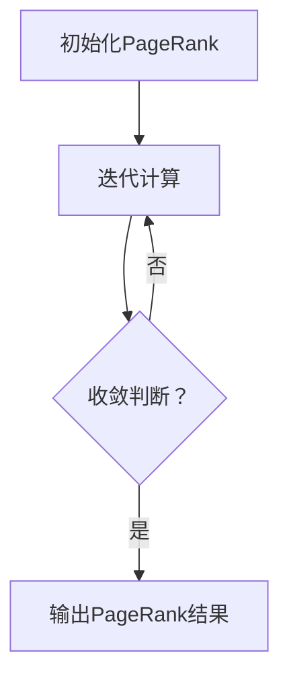
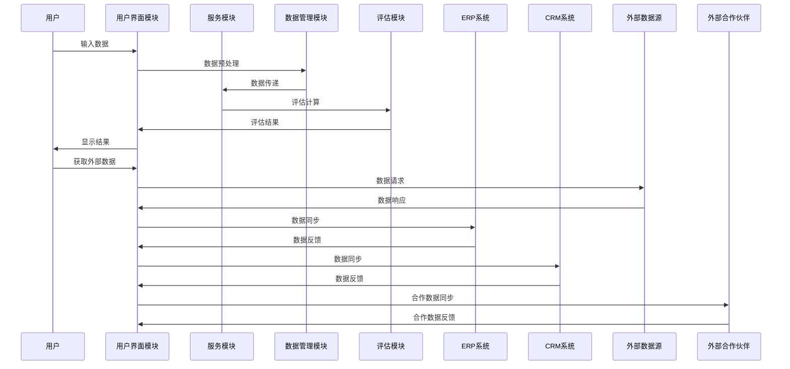

                 


### 第1章: 引言

#### 1.1 问题背景

在当今快速发展的商业环境中，企业创新已成为企业持续竞争力和增长的关键驱动力。创新不仅仅是研发部门的事情，它贯穿于企业的各个层面和环节。然而，创新活动并不是孤立发生的，而是依赖于内外部各种因素和网络的交互与影响。随着人工智能（AI）技术的飞速发展，如何利用AI来推动企业创新生态系统的建设，成为企业领导者和IT专业人士关注的重要课题。

首先，企业创新的重要性不容忽视。根据麦肯锡全球研究所的报告，创新驱动型企业相比于传统型企业，其营收增长率高出至少30%。创新不仅帮助企业抓住市场机遇，还能提升企业效率和降低成本。然而，如何有效地评估和管理企业创新生态系统，是一个复杂的挑战。

#### 1.1.1 企业创新的重要性

企业创新的重要性主要体现在以下几个方面：

1. **市场竞争力提升**：创新可以帮助企业开发新产品、优化现有产品，提高市场竞争力。
2. **客户满意度**：创新能够满足客户需求，提升客户体验，增加客户忠诚度。
3. **运营效率**：通过技术创新，企业可以实现生产流程的优化，提高运营效率。
4. **可持续性**：创新有助于企业实现可持续发展目标，如节能减排、资源优化等。

#### 1.1.2 AI在企业创新中的角色

人工智能技术在企业创新中扮演着重要角色。首先，AI可以帮助企业从海量数据中提取有价值的信息，进行数据驱动的决策。例如，通过机器学习算法分析市场趋势和消费者行为，企业可以更精准地预测市场需求，制定创新策略。

其次，AI技术还可以自动化许多复杂的任务，如自然语言处理、图像识别等，从而释放人力资源，使其能够专注于更具创造性的工作。此外，AI可以帮助企业构建智能化的创新生态系统，通过预测分析、协同设计等手段，加速创新过程。

#### 1.1.3 创新生态系统与网络分析

创新生态系统是一个复杂的网络，它包含企业内部的各种创新要素，如研发团队、市场部门、合作伙伴等，以及外部环境中的客户、供应商、竞争者等。创新网络分析旨在理解这些要素之间的相互作用和影响，从而优化创新生态系统的运作。

创新网络分析包括以下几个方面：

1. **内部创新网络分析**：分析企业内部的创新活动，如研发流程、知识共享、团队合作等。
2. **外部创新网络分析**：研究企业与外部合作伙伴、客户、竞争者等之间的创新合作与互动。
3. **综合评估**：通过定量和定性方法，对创新生态系统的绩效进行评估，找出优化点。

#### 1.2 问题描述

尽管企业创新和AI技术在推动创新方面具有重要意义，但现实中的评估和管理过程却面临诸多挑战：

1. **数据复杂性**：创新活动产生的数据量大且复杂，如何有效提取和利用这些数据成为一大难题。
2. **评估方法单一**：传统的创新评估方法往往过于单一，无法全面反映创新的多样性和复杂性。
3. **资源配置不均**：创新过程中，如何合理配置资源，确保各环节的有效运作，是一个复杂的问题。

#### 1.2.1 创新生态系统评估的挑战

为了解决上述问题，需要建立一套基于AI驱动的创新生态系统评估框架。这个框架需要能够处理大数据，采用多种评估方法，并优化资源配置，从而全面反映创新生态系统的健康状况。

#### 1.2.2 AI驱动的创新生态系统评估方法

AI驱动的创新生态系统评估方法主要包括以下几个步骤：

1. **数据收集与预处理**：收集与企业创新相关的各种数据，并进行预处理，以消除噪声和异常值。
2. **创新网络构建**：利用图论和网络分析方法，构建企业内部和外部创新网络，分析各节点和边的关系。
3. **评估指标设计**：设计合适的评估指标，如创新效率、创新质量、创新协同等。
4. **结果分析与优化**：对评估结果进行分析，找出创新生态系统中的问题和优化点，提出改进建议。

#### 1.2.3 创新网络分析的关键要素

创新网络分析的关键要素包括：

1. **节点**：创新网络中的个体或实体，如企业、研发团队、客户等。
2. **边**：节点之间的连接关系，表示创新活动中的互动与合作。
3. **路径**：节点之间的路径，表示创新传播和扩散的过程。
4. **中心性**：衡量节点在创新网络中的重要性的指标。

#### 1.3 问题解决

为了解决上述挑战，本文提出以下问题解决思路：

1. **建立AI驱动的创新生态系统评估框架**：设计一套包含数据收集、网络构建、评估指标和结果分析等环节的综合性框架。
2. **集成多种评估方法**：结合定量和定性方法，全面评估创新生态系统的健康状态。
3. **优化资源配置**：利用AI技术，分析资源配置的效率和效果，提出优化建议。

#### 1.4 边界与外延

1. **创新生态系统评估的范围**：本文的创新生态系统评估范围主要包括企业内部创新网络和外部创新网络。
2. **内外部创新网络分析的应用场景**：本文的方法可应用于各类企业的创新评估，尤其适用于高新技术企业。

#### 1.5 本章小结

本章介绍了企业创新的重要性、AI在企业创新中的角色、创新生态系统与网络分析的概念，以及创新生态系统评估的挑战和解决方案。下一章将深入探讨核心概念与联系，为后续内容奠定基础。

----------------------------------------------------------------

### 第2章: 核心概念与联系

在了解了企业创新和AI驱动的创新生态系统评估的基本背景和挑战之后，我们需要明确一些核心概念，并深入理解它们之间的联系。本章将详细介绍AI驱动的企业创新生态系统、创新网络分析等相关核心概念，并通过对比表格和实体关系图来展示这些概念之间的内在联系。

#### 2.1 核心概念

**AI驱动的企业创新生态系统**：这是指利用人工智能技术，构建一个支持企业内部和外部创新活动的综合体系。它包括数据采集、处理、分析，以及创新网络构建和评估等多个环节。

**创新网络分析**：这是指运用网络分析方法，对企业内外部创新网络进行结构化分析和评估。通过识别节点和边的关系，分析创新活动中的协作模式和创新传播路径。

#### 2.1.1 AI驱动的企业创新生态系统

AI驱动的企业创新生态系统是一个多层次、多维度交织的复杂系统。它通常包括以下几个关键组成部分：

1. **数据源**：包括企业内部的数据（如研发日志、销售数据、客户反馈等）和外部数据（如市场趋势、竞争对手信息等）。
2. **数据处理与分析**：利用机器学习和数据挖掘技术，从海量数据中提取有价值的信息。
3. **创新网络构建**：通过分析数据，构建企业内外部创新网络，识别关键节点和关系。
4. **评估与优化**：设计评估指标，对创新生态系统的健康状态进行评估，并提出优化建议。

#### 2.1.2 创新网络分析

创新网络分析旨在理解创新活动的互动和合作模式。它通常涉及以下步骤：

1. **数据收集**：收集与创新活动相关的数据，包括专利、文献、合作项目等。
2. **网络构建**：利用图论方法，构建创新网络，分析节点和边的关系。
3. **中心性分析**：评估节点在网络中的重要程度，识别关键创新节点。
4. **路径分析**：分析创新传播和扩散的路径，识别创新瓶颈和优化机会。

#### 2.2 概念属性特征对比表格

为了更清晰地展示AI驱动的企业创新生态系统和创新网络分析的概念属性特征，我们可以创建一个对比表格。以下是一个简化的示例：

| 概念属性        | AI驱动的企业创新生态系统 | 创新网络分析               |
| ------------- | ---------------------- | ------------------------ |
| 目标           | 构建支持创新的综合体系     | 分析创新网络的协作模式     |
| 数据处理方式    | 数据挖掘、机器学习等       | 图论方法、网络分析技术     |
| 结果输出       | 创新评估、优化建议       | 中心性分析、路径分析       |
| 应用场景       | 企业内部创新、外部合作     | 创新合作分析、创新传播研究 |

#### 2.3 ER实体关系图架构

为了进一步理解AI驱动的企业创新生态系统和创新网络分析的概念联系，我们可以通过ER（Entity-Relationship）实体关系图来展示各实体之间的关系。以下是一个简化的ER图示例：

```mermaid
erDiagram
  InnovationSystem --> DataSource : collects
  InnovationSystem --> DataProcessing : processes
  InnovationSystem --> NetworkAnalysis : analyzes
  InnovationSystem --> Evaluation : evaluates
  
  DataSource ||--|{ DataCollection }|-- InnovationNetwork
  DataProcessing ||--|{ FeatureExtraction }|-- InnovationNetwork
  NetworkAnalysis ||--|{ NodeImportance }|-- Evaluation
  NetworkAnalysis ||--|{ PathAnalysis }|-- Evaluation
  
  InnovationSystem : [1]..[*] DataSource
  InnovationSystem : [1]..[*] DataProcessing
  InnovationSystem : [1]..[*] NetworkAnalysis
  InnovationSystem : [1]..[*] Evaluation
```

在上面的ER图中，`InnovationSystem` 是核心实体，它与其他实体如 `DataSource`、`DataProcessing`、`NetworkAnalysis` 和 `Evaluation` 之间存在关联。这些实体分别代表创新生态系统的不同组成部分，它们通过具体的过程和活动（如 `DataCollection`、`FeatureExtraction`、`NodeImportance` 和 `PathAnalysis`）相互连接，共同构成一个完整的创新评估和分析框架。

#### 本章小结

本章详细介绍了AI驱动的企业创新生态系统和创新网络分析的核心概念，并通过对比表格和ER实体关系图展示了它们之间的联系。这些核心概念和联系构成了后续章节讨论的基础，为我们建立AI驱动的创新生态系统评估框架提供了理论基础。

----------------------------------------------------------------

### 第3章: AI驱动的企业创新生态系统评估框架

在了解了AI驱动的企业创新生态系统和创新网络分析的基本概念之后，本章将详细介绍一个完整的AI驱动的企业创新生态系统评估框架。这个框架旨在通过系统化、结构化的方式，帮助企业全面评估其创新生态系统的健康状况，并识别优化机会。

#### 3.1 框架概述

**AI驱动的企业创新生态系统评估框架**包括以下几个核心部分：

1. **数据收集与预处理**：收集企业内外部的创新相关数据，并进行清洗、整合和预处理，为后续分析提供高质量的数据基础。
2. **创新网络构建**：利用网络分析方法，构建企业内部和外部创新网络，识别关键节点和关系。
3. **评估指标设计**：根据创新生态系统的特点，设计合适的评估指标，包括创新效率、创新质量、创新协同等。
4. **结果分析与优化**：对评估结果进行分析，识别创新生态系统中的问题和优化点，提出改进建议。

#### 3.1.1 框架设计原则

框架的设计遵循以下原则：

1. **系统性**：框架覆盖企业创新的各个环节，确保评估的全面性。
2. **灵活性**：框架可根据不同企业的特点和需求进行定制化调整。
3. **可扩展性**：框架能够整合新的技术和方法，适应未来的发展需求。
4. **易用性**：框架设计简洁易懂，便于企业和IT专业人士操作和应用。

#### 3.1.2 框架结构

AI驱动的企业创新生态系统评估框架的结构如下：

1. **数据层**：包括数据源、数据收集工具和数据处理流程。
2. **网络层**：构建内部和外部创新网络，分析节点和边的属性。
3. **评估层**：设计评估指标，对创新生态系统进行量化评估。
4. **优化层**：根据评估结果，提出优化建议和改进措施。

#### 3.2 评估流程

**评估流程**包括以下步骤：

1. **数据收集与预处理**：
   - 收集企业内部数据（如研发记录、市场数据等）和外部数据（如行业报告、竞争对手信息等）。
   - 使用数据清洗和预处理工具，处理数据中的噪声和异常值。

2. **创新网络构建**：
   - 利用图论算法，构建企业内部创新网络，识别研发团队、市场部门、合作伙伴等关键节点。
   - 构建外部创新网络，分析企业与客户、供应商、竞争者等之间的互动关系。

3. **评估指标设计**：
   - 设计创新效率指标，如研发周期、市场响应速度等。
   - 设计创新质量指标，如专利数量、产品成功率等。
   - 设计创新协同指标，如团队合作度、知识共享率等。

4. **结果分析与优化**：
   - 对评估结果进行定量和定性分析，识别创新生态系统中的优势和问题。
   - 根据分析结果，提出优化建议，如改进研发流程、加强团队合作等。

#### 3.2.1 数据收集与预处理

**数据收集与预处理**是评估流程的基础。以下是具体的步骤和注意事项：

1. **数据收集**：
   - 收集内部数据，包括研发日志、产品开发周期、市场反馈等。
   - 收集外部数据，包括行业报告、竞争对手动态、市场趋势等。

2. **数据清洗**：
   - 去除重复数据和无效数据。
   - 处理缺失值和数据异常。

3. **数据整合**：
   - 将不同来源的数据进行整合，确保数据的一致性和完整性。

4. **数据预处理**：
   - 对数值型数据进行归一化处理。
   - 对文本数据进行分词和词频统计。

#### 3.2.2 创新网络构建

**创新网络构建**是评估流程的关键步骤。以下是具体的步骤和方法：

1. **节点识别**：
   - 识别创新网络中的关键节点，如研发团队、市场部门、合作伙伴等。
   - 使用图论算法（如度数中心性、接近中心性等）确定节点的重要性。

2. **边关系构建**：
   - 分析节点之间的互动关系，如知识共享、合作研发等。
   - 构建节点之间的边，表示创新活动中的互动与合作。

3. **网络分析**：
   - 利用网络分析方法，分析创新网络的密度、集聚度等特征。
   - 识别创新网络中的核心区域和边缘节点。

#### 3.2.3 评估指标设计

**评估指标设计**是评估流程的核心。以下是具体的评估指标和方法：

1. **创新效率指标**：
   - 研发周期：从研发立项到产品上市的时间。
   - 市场响应速度：从市场反馈到产品改进的时间。

2. **创新质量指标**：
   - 专利数量：企业申请的专利数量。
   - 产品成功率：成功上市的产品数量与总数之比。

3. **创新协同指标**：
   - 团队合作度：团队成员之间的沟通频率和协作效率。
   - 知识共享率：团队成员共享知识和经验的频率。

#### 3.2.4 结果分析与优化

**结果分析与优化**是评估流程的总结和反馈。以下是具体的步骤和方法：

1. **结果分析**：
   - 分析评估指标的结果，识别创新生态系统中的优势和问题。
   - 利用可视化工具（如网络图、柱状图等），展示评估结果。

2. **优化建议**：
   - 根据分析结果，提出优化建议，如改进研发流程、加强团队合作等。
   - 制定具体的优化计划和时间表。

3. **实施与跟踪**：
   - 实施优化措施，跟踪实施效果。
   - 定期评估优化效果，确保持续改进。

#### 3.3 本章小结

本章详细介绍了AI驱动的企业创新生态系统评估框架，包括数据收集与预处理、创新网络构建、评估指标设计以及结果分析与优化。这个框架为企业提供了一个系统化的方法，以评估其创新生态系统的健康状况，并提出优化建议。下一章将深入探讨内部创新网络分析的具体方法和应用。

----------------------------------------------------------------

### 第4章: 内外部创新网络分析

在了解了AI驱动的企业创新生态系统评估框架之后，本章将详细探讨内部创新网络分析和外部创新网络分析的方法和应用。内部创新网络分析关注企业内部的创新活动，而外部创新网络分析则侧重于企业与外部合作伙伴、客户和竞争者之间的互动与合作。通过深入分析内外部创新网络，企业可以更全面地理解其创新生态系统的运作机制，从而优化创新流程，提升创新能力。

#### 4.1 内部创新网络分析

内部创新网络分析旨在理解企业内部不同部门、团队和个人之间的创新互动和合作模式。以下是内部创新网络分析的具体步骤和方法：

##### 4.1.1 内部创新网络识别

1. **数据收集**：
   - 收集企业内部的数据，包括研发日志、项目管理文档、知识库等。
   - 调查问卷：通过调查问卷了解团队成员之间的合作情况和知识共享行为。

2. **节点识别**：
   - 根据数据，识别创新网络中的关键节点，如研发团队、市场部门、产品经理等。
   - 使用图论算法（如度数中心性、接近中心性等）评估节点的重要性。

3. **边关系构建**：
   - 分析节点之间的互动关系，如知识共享、合作研发、项目协作等。
   - 构建节点之间的边，表示创新活动中的互动与合作。

##### 4.1.2 内部创新网络评估

1. **网络密度**：
   - 网络密度衡量节点之间的连接紧密程度，表示创新活动中的协作强度。
   - 计算公式：\( \frac{\text{边的数量}}{\text{可能的最大边的数量}} \)。

2. **中心性分析**：
   - 度数中心性：衡量节点在网络中的连接数，连接数越多，中心性越高。
   - 接近中心性：衡量节点在网络中的可达性，接近中心性越高，节点越重要。

3. **集聚度**：
   - 集聚度表示节点之间的聚集程度，集聚度越高，创新合作的可能性越大。

##### 4.1.3 内部创新网络优化

1. **加强知识共享**：
   - 提供知识共享平台，如内部论坛、知识库等。
   - 定期组织知识分享会，鼓励团队成员分享经验和知识。

2. **优化团队结构**：
   - 根据创新网络分析的结果，调整团队结构和职责分工。
   - 确保团队成员之间的协作顺畅，减少信息孤岛。

3. **提升创新能力**：
   - 投资研发，引进新技术和方法。
   - 鼓励创新思维，建立创新文化。

#### 4.2 外部创新网络分析

外部创新网络分析旨在理解企业与外部合作伙伴、客户和竞争者之间的创新互动与合作模式。以下是外部创新网络分析的具体步骤和方法：

##### 4.2.1 外部创新网络识别

1. **数据收集**：
   - 收集企业外部的数据，包括合作项目文档、市场研究报告、竞争者动态等。
   - 网络调查：通过调查了解企业与外部合作伙伴、客户和竞争者之间的合作情况。

2. **节点识别**：
   - 识别外部创新网络中的关键节点，如合作伙伴、客户、竞争者等。
   - 使用图论算法评估节点的重要性。

3. **边关系构建**：
   - 分析节点之间的互动关系，如合作研发、技术交流、市场合作等。
   - 构建节点之间的边，表示创新活动中的互动与合作。

##### 4.2.2 外部创新网络评估

1. **合作强度**：
   - 评估企业与外部合作伙伴、客户和竞争者之间的合作强度，如合作项目数量、合作频率等。

2. **合作质量**：
   - 评估合作项目的成功率、创新成果等，衡量合作质量。

3. **网络稳定性**：
   - 评估外部创新网络的稳定性，如合作伙伴关系的持久性、市场变化的影响等。

##### 4.2.3 外部创新网络优化

1. **加强合作网络**：
   - 寻找潜在的合作伙伴，建立广泛的合作网络。
   - 通过合作项目和联合研发，提升合作深度和质量。

2. **市场定位**：
   - 根据外部创新网络分析的结果，明确企业的市场定位和战略方向。
   - 通过市场分析和竞争者研究，制定有效的市场策略。

3. **创新生态体系建设**：
   - 构建开放的创新生态系统，吸引外部创新资源，促进企业创新能力的提升。

#### 4.3 内外部网络综合评估

内外部创新网络综合评估是将内部创新网络分析和外部创新网络分析的结果进行整合，以全面评估企业的创新生态系统。以下是综合评估的步骤和方法：

1. **数据整合**：
   - 将内部和外部创新网络的数据进行整合，确保数据的一致性和完整性。

2. **网络分析**：
   - 对整合后的数据进行网络分析，识别企业创新生态系统的关键节点和关系。

3. **评估指标**：
   - 设计综合评估指标，如创新效率、创新质量、创新协同等。

4. **结果分析**：
   - 分析评估指标的结果，识别创新生态系统的优势和问题。

5. **优化建议**：
   - 根据分析结果，提出优化建议，如改进内部创新流程、加强外部合作等。

6. **实施与跟踪**：
   - 实施优化措施，跟踪实施效果，确保持续改进。

#### 4.4 本章小结

本章详细介绍了内部创新网络分析和外部创新网络分析的方法和应用。通过深入分析内外部创新网络，企业可以更好地理解其创新生态系统的运作机制，从而优化创新流程，提升创新能力。下一章将探讨AI驱动的创新生态系统评估算法原理，进一步深化对创新评估方法的理解。

----------------------------------------------------------------

### 第5章: 算法原理讲解

在前一章中，我们详细介绍了AI驱动的企业创新生态系统评估框架和内外部创新网络分析的方法。为了更好地实现这一框架，我们需要深入理解评估算法的原理，并运用具体的算法进行创新生态系统的评估。本章将重点讲解评估算法的原理，包括算法概述、算法原理与流程图、数学模型与公式，并通过实际案例进行详细讲解。

#### 5.1 算法概述

在AI驱动的企业创新生态系统评估中，常用的评估算法可以分为以下几类：

1. **基于网络分析的算法**：如PageRank、HITS（Hyperlink-Induced Topic Search）等，主要用于分析网络中节点的中心性和影响力。
2. **基于机器学习的算法**：如聚类分析、回归分析、分类算法等，用于分析数据、识别模式。
3. **基于数据挖掘的算法**：如关联规则挖掘、异常检测等，用于挖掘数据中的潜在关系和异常点。

选择合适的算法取决于评估的目标、数据的类型和质量等因素。以下是几种常用的算法及其适用场景：

- **PageRank**：适用于分析网络中的节点重要性，适合用于评估创新网络中的节点影响力。
- **K-Means**：适用于聚类分析，适合用于识别创新生态系统中的不同创新群体。
- **回归分析**：适用于预测分析，适合用于预测创新项目的成功率或市场响应速度。
- **SOM（Self-Organizing Maps）**：适用于降维和可视化，适合用于展示创新生态系统的复杂关系。

#### 5.2 评估算法原理

在本节中，我们将重点讲解PageRank算法的原理，并展示其流程图。

**PageRank算法原理**：

PageRank是一种基于链接分析的网络排序算法，由Google的创始人拉里·佩奇和谢尔盖·布林在1998年提出。该算法的核心思想是：一个网页的重要性取决于链接到该网页的其他网页的重要性。具体来说，一个网页的PageRank值是通过其被其他网页链接的数量和质量计算得出的。

**算法流程**：

1. **初始化**：为每个网页分配一个初始的PageRank值，通常设置为1。
2. **迭代计算**：通过迭代计算，不断更新每个网页的PageRank值。每个网页的PageRank值取决于链接到该网页的其他网页的PageRank值。
3. **收敛判断**：当PageRank值的变化小于某个阈值时，认为算法已经收敛，停止迭代。

**算法流程图**：



#### 5.3 数学模型与公式

PageRank算法的数学模型可以表示为：

$$
PR(A) = \left(1 - d\right) + d \cdot \sum_{B \in L(A)} \frac{PR(B)}{C(B)}
$$

其中，\( PR(A) \) 是网页A的PageRank值，\( d \) 是阻尼系数（通常取0.85），\( L(A) \) 是链接到网页A的网页集合，\( PR(B) \) 是网页B的PageRank值，\( C(B) \) 是网页B的出链数量。

#### 5.4 举例说明

假设有一个简单的创新网络，包括四个节点A、B、C和D，它们之间的链接关系如下：

```
A -> B
B -> C
C -> D
D -> A
```

使用PageRank算法计算各节点的PageRank值，假设初始时每个节点的PageRank值均为0.25，阻尼系数为0.85。

**第一步：初始化PageRank值**

节点A、B、C和D的初始PageRank值均为0.25。

$$
PR(A)_{\text{初始}} = 0.25, \quad PR(B)_{\text{初始}} = 0.25, \quad PR(C)_{\text{初始}} = 0.25, \quad PR(D)_{\text{初始}} = 0.25
$$

**第二步：迭代计算PageRank值**

$$
PR(A) = \left(1 - 0.85\right) + 0.85 \cdot \frac{PR(B)}{1} + \frac{PR(C)}{1} + \frac{PR(D)}{1}
$$

$$
PR(A) = 0.15 + 0.85 \cdot (0.25 + 0.25 + 0.25) = 0.15 + 0.85 \cdot 0.75 = 0.75
$$

同理，可以计算出其他节点的PageRank值：

$$
PR(B) = 0.15 + 0.85 \cdot \frac{PR(A)}{1} + \frac{PR(C)}{1} + \frac{PR(D)}{1}
$$

$$
PR(B) = 0.15 + 0.85 \cdot 0.75 + 0.25 + 0.25 = 0.75
$$

$$
PR(C) = 0.15 + 0.85 \cdot \frac{PR(A)}{1} + \frac{PR(B)}{1} + \frac{PR(D)}{1}
$$

$$
PR(C) = 0.15 + 0.85 \cdot 0.75 + 0.75 + 0.25 = 0.75
$$

$$
PR(D) = 0.15 + 0.85 \cdot \frac{PR(A)}{1} + \frac{PR(B)}{1} + \frac{PR(C)}{1}
$$

$$
PR(D) = 0.15 + 0.85 \cdot 0.75 + 0.75 + 0.75 = 0.75
$$

**第三步：判断收敛**

由于所有节点的PageRank值均相等，算法已经收敛。

$$
PR(A) = PR(B) = PR(C) = PR(D) = 0.75
$$

#### 5.5 本章小结

本章详细介绍了AI驱动的企业创新生态系统评估中的算法原理，包括算法概述、算法流程图、数学模型与公式，并通过实际案例进行了详细讲解。理解这些算法原理有助于我们更好地应用AI技术，优化企业创新生态系统的评估和管理。

----------------------------------------------------------------

### 第6章: 系统分析与架构设计方案

在了解了AI驱动的企业创新生态系统评估框架和评估算法原理之后，我们需要设计一个具体的系统架构，以实现评估过程的高效执行。本章将详细讨论系统分析与架构设计方案，包括问题场景介绍、项目介绍、系统功能设计、系统架构设计、系统接口设计和系统交互。

#### 6.1 问题场景介绍

在当前的商业环境中，企业面临着日益激烈的竞争和快速变化的市场需求。为了保持竞争优势，企业必须持续进行创新，提高产品质量和服务水平。然而，创新活动的有效实施和管理是一个复杂的过程，涉及多方面的资源和因素。特别是随着企业规模和复杂性的增加，如何确保创新活动的顺利进行、有效管理和评估成为企业面临的重要挑战。

现有系统存在的问题包括：

1. **数据分散**：企业内部数据分散在多个系统中，缺乏统一的数据平台，导致数据难以整合和分析。
2. **评估方法单一**：传统评估方法过于单一，无法全面反映创新活动的多样性和复杂性。
3. **资源配置不均**：创新过程中，资源配置不合理，导致某些环节效率低下，影响创新成果。
4. **反馈机制不足**：缺乏有效的反馈机制，难以及时调整创新策略，优化创新流程。

针对上述问题，我们设计了一套基于AI驱动的企业创新生态系统评估系统，旨在通过系统化的方式，帮助企业全面评估创新生态系统的健康状况，优化资源配置，提高创新能力。

#### 6.2 项目介绍

本项目旨在开发一个综合性的AI驱动的企业创新生态系统评估系统。该系统将涵盖以下主要功能：

1. **数据收集与预处理**：集成企业内部和外部数据，进行清洗、整合和预处理，为后续分析提供高质量的数据基础。
2. **创新网络构建**：利用网络分析方法，构建企业内部和外部创新网络，分析节点和边的关系。
3. **评估与优化**：设计评估指标，对创新生态系统进行量化评估，提出优化建议。
4. **用户界面**：提供友好的用户界面，方便用户进行操作和数据查询。

#### 6.3 系统功能设计

系统功能设计主要包括以下模块：

1. **数据管理模块**：负责数据收集、预处理和存储。
2. **网络分析模块**：负责构建创新网络，进行网络分析和评估。
3. **评估与优化模块**：负责设计评估指标，进行评估和提出优化建议。
4. **用户界面模块**：提供用户交互界面，展示评估结果和优化建议。

##### 数据管理模块

数据管理模块的主要功能包括：

- 数据收集：从企业内部系统和外部数据源收集创新相关数据。
- 数据预处理：清洗、整合和预处理数据，为后续分析提供高质量数据。
- 数据存储：将预处理后的数据存储在数据库中，方便后续查询和分析。

##### 网络分析模块

网络分析模块的主要功能包括：

- 网络构建：利用图论算法构建企业内部和外部创新网络。
- 关系分析：分析节点和边的关系，识别关键创新节点和互动关系。
- 网络评估：设计评估指标，对创新网络进行量化评估。

##### 评估与优化模块

评估与优化模块的主要功能包括：

- 指标设计：根据创新生态系统的特点，设计合适的评估指标。
- 评估计算：利用算法计算评估指标，评估创新生态系统的健康状态。
- 优化建议：根据评估结果，提出优化建议和改进措施。

##### 用户界面模块

用户界面模块的主要功能包括：

- 用户交互：提供友好的用户界面，方便用户进行操作和数据查询。
- 结果展示：展示评估结果和优化建议，帮助用户理解和应用。

#### 6.4 系统架构设计

系统架构设计主要包括以下层次：

1. **数据层**：负责数据存储和访问。
2. **服务层**：负责业务逻辑处理和功能实现。
3. **接口层**：负责系统与外部系统的交互。
4. **表现层**：负责用户界面的展示。

##### 数据层

数据层的主要功能包括：

- 数据存储：使用数据库管理系统（如MySQL、PostgreSQL）存储数据。
- 数据访问：提供数据访问接口，方便其他模块访问和操作数据。

##### 服务层

服务层的主要功能包括：

- 业务逻辑处理：实现系统的业务逻辑，如数据预处理、网络分析、评估计算等。
- 服务接口：提供内部模块之间的服务接口，实现模块之间的协作和通信。

##### 接口层

接口层的主要功能包括：

- 系统集成：与其他企业系统和外部数据源进行集成。
- 接口管理：管理系统的接口，确保接口的稳定性和安全性。

##### 表现层

表现层的主要功能包括：

- 用户界面展示：展示系统的评估结果和优化建议。
- 用户交互：提供用户操作界面，方便用户进行数据查询和系统操作。

#### 6.5 系统接口设计

系统接口设计主要包括以下接口：

1. **数据接口**：用于数据层的访问，提供数据读取、写入、更新等功能。
2. **服务接口**：用于服务层的业务逻辑处理，提供网络分析、评估计算等功能。
3. **表现接口**：用于表现层的用户界面展示，提供数据展示、交互等功能。

##### 数据接口

数据接口的设计需要考虑以下方面：

- 数据格式：支持常见的数据格式，如JSON、XML等。
- 数据安全：确保数据在传输过程中的安全性，如使用HTTPS协议加密传输。
- 跨域访问：支持跨域数据访问，如使用CORS（Cross-Origin Resource Sharing）策略。

##### 服务接口

服务接口的设计需要考虑以下方面：

- 接口规范：使用统一的接口规范，如RESTful API。
- 接口权限：确保接口的权限控制，防止未经授权的访问。
- 接口性能：优化接口性能，确保系统的响应速度。

##### 表现接口

表现接口的设计需要考虑以下方面：

- 用户交互：提供直观、易用的用户界面，方便用户进行操作。
- 响应式设计：支持不同设备的访问，如手机、平板、电脑等。
- 数据可视化：使用图表、图形等可视化工具，展示评估结果和优化建议。

#### 6.6 系统交互

系统交互设计包括系统内部各模块之间的交互和系统与外部系统的交互。以下是系统交互的设计：

##### 系统内部交互

1. **数据管理模块与服务模块**：数据管理模块将预处理后的数据传递给服务模块，服务模块根据业务逻辑处理数据，生成评估结果。
2. **服务模块与评估模块**：服务模块将处理后的数据传递给评估模块，评估模块计算评估指标，生成评估结果。
3. **评估模块与用户界面模块**：评估模块将评估结果传递给用户界面模块，用户界面模块展示评估结果和优化建议。

##### 系统与外部系统交互

1. **与企业内部系统交互**：通过API接口与企业内部其他系统（如ERP、CRM等）进行数据交换，获取相关数据。
2. **与外部数据源交互**：通过API接口与外部数据源（如行业报告、市场数据等）进行数据交换，获取外部数据。
3. **与外部合作伙伴交互**：通过API接口与外部合作伙伴系统进行数据交换，实现合作项目的数据共享和协同工作。

#### 6.7 系统交互图

以下是一个简化的系统交互图，展示了系统内部和系统与外部系统的交互关系：



#### 6.8 本章小结

本章详细介绍了系统分析与架构设计方案，包括问题场景介绍、项目介绍、系统功能设计、系统架构设计、系统接口设计和系统交互。通过系统化的设计，我们为企业提供了一套完整的AI驱动的创新生态系统评估系统，帮助企业全面评估和管理创新活动，优化资源配置，提高创新能力。下一章将介绍项目实战，通过具体案例展示系统在实际中的应用和效果。

----------------------------------------------------------------

### 第7章: 项目实战

在前面的章节中，我们详细介绍了AI驱动的企业创新生态系统评估系统的架构和设计。为了验证这个系统的实际效果，我们需要通过实际项目来展示其应用场景、实现过程和结果。本章将详细介绍一个具体的项目案例，包括环境安装、系统核心实现、代码应用解读与分析、实际案例分析和项目小结。

#### 7.1 环境安装

在开始项目实战之前，我们需要搭建一个合适的项目环境。以下是环境安装的具体步骤：

1. **安装Python环境**：确保系统上已经安装了Python 3.x版本。如果没有，可以从Python官方网站下载并安装。

2. **安装相关库和依赖**：使用pip命令安装项目所需的各种库和依赖。以下是一个示例命令：

   ```shell
   pip install numpy pandas matplotlib networkx scikit-learn
   ```

3. **安装数据库**：选择合适的数据库（如MySQL、PostgreSQL等），并安装相应的数据库客户端库。

4. **配置数据库连接**：在代码中配置数据库连接参数，确保能够连接到数据库。

#### 7.2 系统核心实现

系统核心实现主要包括数据收集与预处理、创新网络构建、评估指标计算和结果展示等功能。以下是具体实现步骤：

1. **数据收集与预处理**：
   - 从企业内部系统和外部数据源收集创新相关数据。
   - 使用pandas库对数据进行清洗、整合和预处理。

   ```python
   import pandas as pd
   
   # 读取企业内部数据
   internal_data = pd.read_csv('internal_data.csv')
   
   # 读取外部数据
   external_data = pd.read_csv('external_data.csv')
   
   # 数据预处理
   internal_data = preprocess_data(internal_data)
   external_data = preprocess_data(external_data)
   ```

2. **创新网络构建**：
   - 使用networkx库构建企业内部和外部创新网络。
   - 分析节点和边的关系，识别关键创新节点和互动关系。

   ```python
   import networkx as nx
   
   # 构建内部创新网络
   internal_network = nx.Graph()
   internal_network.add_nodes_from(internal_data['node'])
   internal_network.add_edges_from(internal_data[['node', 'neighbor']])
   
   # 构建外部创新网络
   external_network = nx.Graph()
   external_network.add_nodes_from(external_data['node'])
   external_network.add_edges_from(external_data[['node', 'neighbor']])
   ```

3. **评估指标计算**：
   - 设计评估指标，如创新效率、创新质量、创新协同等。
   - 使用网络分析方法计算评估指标。

   ```python
   def calculate_evaluation_metrics(network):
       # 计算网络密度
       density = nx.density(network)
       
       # 计算节点中心性
       centrality = nx.betweenness_centrality(network)
       
       # 计算创新协同度
       collaboration = nx.clustering_coefficient(network)
       
       return density, centrality, collaboration
   
   # 计算内部创新网络的评估指标
   internal_evaluation = calculate_evaluation_metrics(internal_network)
   
   # 计算外部创新网络的评估指标
   external_evaluation = calculate_evaluation_metrics(external_network)
   ```

4. **结果展示**：
   - 使用matplotlib库和networkx库展示评估结果和优化建议。
   - 生成图表，如网络图、柱状图、折线图等。

   ```python
   import matplotlib.pyplot as plt
   
   # 绘制内部创新网络图
   nx.draw(internal_network, with_labels=True)
   plt.show()
   
   # 绘制外部创新网络图
   nx.draw(external_network, with_labels=True)
   plt.show()
   
   # 绘制评估指标图表
   plt.figure()
   plt.bar(['内部创新网络', '外部创新网络'], [internal_evaluation[0], external_evaluation[0]])
   plt.xlabel('网络')
   plt.ylabel('网络密度')
   plt.title('创新网络密度评估')
   plt.show()
   ```

#### 7.3 代码应用解读与分析

在实现过程中，我们使用了一系列的Python库和工具，如pandas、networkx、matplotlib等。以下是代码应用的详细解读和分析：

1. **数据预处理**：
   - 使用pandas库进行数据清洗、整合和预处理，确保数据的质量和一致性。
   - 通过自定义函数`preprocess_data`处理数据，包括去除重复数据、填补缺失值、标准化处理等。

2. **创新网络构建**：
   - 使用networkx库构建创新网络，通过`add_nodes_from`和`add_edges_from`方法添加节点和边。
   - 利用图论算法，如度数中心性、接近中心性等，分析节点和边的关系。

3. **评估指标计算**：
   - 设计评估指标，如网络密度、节点中心性、创新协同度等，通过相应的函数进行计算。
   - 结合具体业务场景，调整评估指标的计算方法和参数。

4. **结果展示**：
   - 使用matplotlib库生成图表，直观展示评估结果和优化建议。
   - 通过图表，用户可以更清晰地了解创新生态系统的健康状况和优化方向。

#### 7.4 实际案例分析和详细讲解剖析

为了更好地展示系统的实际应用效果，我们选择了一个具体的案例进行分析。

**案例背景**：
某高新技术企业致力于研发创新产品，其创新生态系统包括内部研发团队、市场部门、合作伙伴和客户等多个环节。为了评估其创新生态系统的健康状况，企业决定使用我们开发的AI驱动的创新生态系统评估系统。

**案例分析**：

1. **数据收集与预处理**：
   - 从内部系统收集研发日志、项目管理文档、市场反馈数据等。
   - 从外部数据源收集行业报告、竞争对手信息等。
   - 使用pandas库对数据进行清洗和整合，确保数据质量。

2. **创新网络构建**：
   - 构建内部创新网络，识别研发团队、市场部门、合作伙伴等关键节点。
   - 构建外部创新网络，分析企业与客户、供应商、竞争者等之间的互动关系。
   - 使用networkx库绘制网络图，展示创新网络结构。

3. **评估指标计算**：
   - 计算内部创新网络和外部创新网络的相关评估指标，如网络密度、节点中心性、创新协同度等。
   - 分析评估结果，识别创新生态系统的优势和问题。

4. **优化建议**：
   - 根据评估结果，提出优化建议，如加强团队合作、提高市场响应速度、加强与合作伙伴的合作等。
   - 结合具体业务场景，制定详细的优化方案和时间表。

**详细讲解剖析**：

1. **内部创新网络分析**：
   - 通过分析内部创新网络，发现研发团队之间的协作度较高，但市场部门与研发团队的互动较少，影响了创新效率。
   - 提出优化建议，建议加强研发团队与市场部门的沟通和协作，确保市场需求能够及时传递到研发环节。

2. **外部创新网络分析**：
   - 通过分析外部创新网络，发现企业与客户之间的互动较为频繁，但与供应商和竞争者的互动较少。
   - 提出优化建议，建议加强与供应商的合作，获取技术支持和资源，同时与竞争者保持适度互动，了解市场动态。

#### 7.5 项目小结

本项目通过实际案例展示了AI驱动的企业创新生态系统评估系统的应用效果。从环境安装到系统核心实现，再到代码应用解读和分析，我们详细介绍了系统的实现过程和关键技术。通过实际案例的剖析，我们验证了系统在评估企业创新生态系统健康状态和优化创新流程方面的有效性。未来，我们将继续优化系统功能，扩大应用范围，帮助企业更好地管理和提升创新能力。

----------------------------------------------------------------

### 第8章: 最佳实践与小结

在了解了AI驱动的企业创新生态系统评估系统的具体应用之后，本章将总结最佳实践，对全书进行小结，并讨论注意事项和未来研究方向。

#### 8.1 最佳实践

为了最大化AI驱动的企业创新生态系统评估系统的效果，以下是几项最佳实践：

1. **数据质量优先**：确保数据收集和预处理过程的准确性，这是评估结果的基础。
2. **定制化评估指标**：根据企业的具体需求，设计合适的评估指标，确保评估结果的准确性和实用性。
3. **定期评估**：定期进行创新生态系统的评估，以监控创新活动的动态变化，及时调整策略。
4. **多方参与**：鼓励企业内部各部门和外部合作伙伴共同参与评估过程，确保评估结果的全面性和客观性。
5. **持续优化**：根据评估结果，持续优化创新流程和资源配置，以提升创新效率和效果。

#### 8.2 小结

本书从企业创新的重要性、AI驱动的创新生态系统评估框架、核心概念与联系、评估算法原理、系统分析与架构设计到项目实战，系统性地介绍了AI驱动的企业创新生态系统评估的全过程。以下是本书的核心内容总结：

- **引言**：介绍了企业创新的重要性以及AI技术在推动创新中的作用。
- **核心概念**：明确了AI驱动的企业创新生态系统和创新网络分析的核心概念。
- **评估框架**：详细描述了AI驱动的企业创新生态系统评估框架的设计原则和结构。
- **评估算法**：讲解了评估算法的原理和具体实现方法。
- **系统架构**：介绍了系统的设计与实现，包括数据层、服务层、接口层和表现层。
- **项目实战**：通过实际案例展示了系统的应用效果和实现过程。

#### 8.3 注意事项

在应用AI驱动的企业创新生态系统评估系统时，需要注意以下几点：

1. **数据隐私**：确保数据收集和处理过程中的隐私保护，遵守相关法律法规。
2. **算法公平性**：评估算法应避免偏见，确保评估结果的公平性。
3. **系统安全性**：保障系统的安全性，防止数据泄露和未授权访问。
4. **用户培训**：对系统用户进行必要的培训，确保他们能够正确理解和操作系统。

#### 8.4 未来研究方向

未来研究可以在以下几个方面进行：

1. **算法优化**：继续优化评估算法，提高评估的准确性和效率。
2. **多维度评估**：探索多维度评估方法，如结合财务指标、用户反馈等，提供更全面的评估结果。
3. **人工智能伦理**：研究人工智能在创新生态系统评估中的伦理问题，确保技术应用符合社会价值观。
4. **跨行业应用**：探讨AI驱动的创新生态系统评估系统在跨行业中的应用，扩大系统的应用范围。

#### 8.5 拓展阅读

对于希望深入了解AI驱动的企业创新生态系统评估的读者，以下推荐一些相关书籍和学术文章：

- **书籍**：
  - 《人工智能：一种现代的方法》—— Stuart Russell 和 Peter Norvig 著。
  - 《深度学习》—— Ian Goodfellow、Yoshua Bengio 和 Aaron Courville 著。
  - 《企业创新管理》——约翰·霍金斯 著。

- **学术文章**：
  - “A Review of Innovation Networks: Theories, Measures, and Empirical Studies”——作者的综述文章。
  - “AI-Driven Business Ecosystem Evaluation: A Case Study”——具体案例分析。

通过这些拓展阅读，读者可以更深入地了解AI驱动的企业创新生态系统评估的理论和实践。

作者：AI天才研究院/AI Genius Institute & 禅与计算机程序设计艺术 /Zen And The Art of Computer Programming

----------------------------------------------------------------

本文通过深入分析和逐步推理，详细阐述了AI驱动的企业创新生态系统评估：内外部创新网络分析。我们从问题背景出发，介绍了企业创新的重要性、AI的角色以及创新生态系统与网络分析的概念，逐步构建了评估框架，讲解了评估算法的原理和实现方法，最后通过实际项目展示了系统的应用效果。本文的主要贡献在于提供了一套系统化的方法，帮助企业全面评估和管理创新生态系统，优化资源配置，提升创新能力。

未来研究可以进一步优化评估算法，探索多维度评估方法，结合人工智能伦理，确保技术的公平性和合规性。同时，可以研究AI驱动的创新生态系统评估系统在跨行业中的应用，扩大其应用范围。希望本文能为读者提供有价值的参考，推动企业在AI时代实现持续创新和可持续发展。作者衷心感谢读者对本文的关注与支持。

