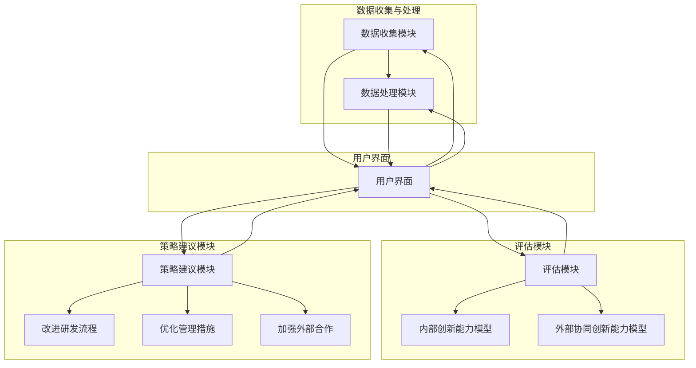
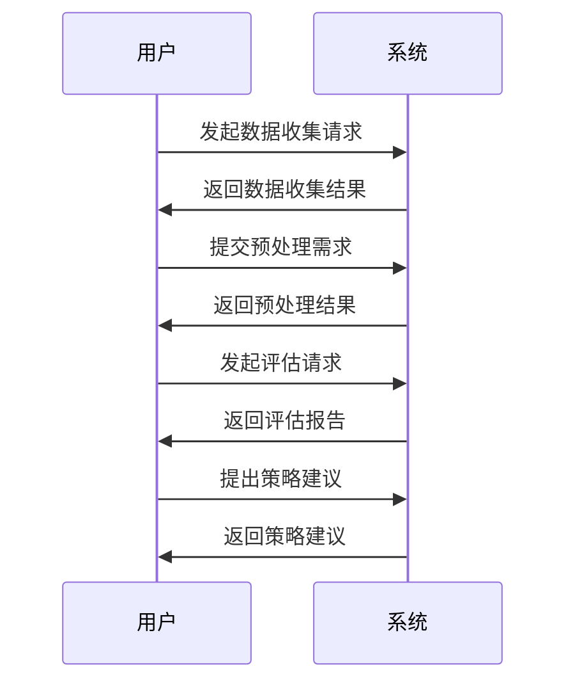
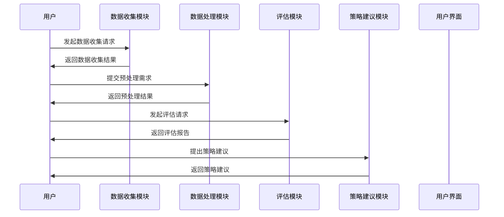

                 

# AI驱动的企业创新生态系统评估：内外部创新能力量化模型

## 关键词

AI驱动的企业创新、创新生态系统、创新能力量化、内外部评估、模型构建

## 摘要

本文旨在探讨AI驱动的企业创新生态系统评估方法，重点阐述内外部创新能力的量化模型构建。随着人工智能技术的不断发展，企业创新生态系统的构建与优化成为企业竞争力的关键。通过引入AI技术，企业可以提升内部创新能力，加强与外部合作伙伴的协同创新，形成动态适应、协同高效的创新生态系统。本文首先介绍了企业创新生态系统和AI驱动的企业创新的核心概念与联系，然后详细阐述了内外部创新能力量化模型的设计与实施方法，最后通过案例分析展示了AI驱动的企业创新生态系统的实际应用效果。

## 第一部分：背景介绍

### 1.1 问题背景

随着全球经济的快速发展和市场竞争的加剧，企业创新成为推动企业持续发展的重要动力。然而，传统的创新模式已经无法满足现代企业快速变化的市场需求和技术进步。特别是随着人工智能（AI）技术的不断成熟，企业开始探索如何利用AI技术来提升创新效率和能力。AI驱动的企业创新生态系统因此成为当前企业界和研究界关注的热点问题。

#### 核心概念

**企业创新生态系统**：企业创新生态系统是指在企业内部和外部的创新资源、创新活动、创新主体之间形成的相互影响、相互促进的复杂网络。它包括内部创新资源和外部创新资源、内部创新活动和外部创新活动、内部创新主体和外部创新主体等多个层面。

**AI驱动的企业创新**：AI驱动的企业创新是指利用人工智能技术来推动企业创新活动的过程，包括AI技术在研发、生产、管理、营销等环节中的应用，以实现创新效率的提升和创新成果的转化。

**内部创新能力**：内部创新能力是指企业在内部研发、管理、运营等方面所具有的创新能力和潜力。

**外部协同创新能力**：外部协同创新能力是指企业通过与外部合作伙伴（如供应商、客户、研究机构等）的协同合作，共同推动创新活动的能力。

#### 问题描述

如何构建和评估AI驱动的企业创新生态系统，如何量化内部和外部创新能力，是当前企业界和研究界面临的重要问题。这不仅仅涉及到技术的应用，还包括管理、组织、文化等多个方面。

#### 问题解决

为了构建和评估AI驱动的企业创新生态系统，首先需要设计一套科学合理的内外部创新能力量化模型。该模型应包括评估指标、评估方法和评估工具，能够全面、准确地反映企业的内部和外部创新能力。

**边界与外延**

企业的内部和外部创新活动范围较广，涉及到企业研发、生产、运营、管理等多个环节。AI技术的应用领域也较广泛，包括但不限于自然语言处理、计算机视觉、机器学习、深度学习等。

**概念结构与核心要素组成**

企业创新生态系统包含以下几个核心要素：

1. **创新资源**：包括人力资源、技术资源、资金资源等。
2. **创新活动**：包括内部创新活动和外部创新活动。
3. **创新主体**：包括企业内部创新主体和外部创新主体。
4. **创新环境**：包括企业文化、政策环境、市场环境等。

### 1.2 核心概念与联系

#### 1.2.1 企业创新生态系统的概念与特点

**概念定义**：企业创新生态系统是指在企业内部和外部的创新资源、创新活动、创新主体之间形成的相互影响、相互促进的复杂网络。

**特点**：企业创新生态系统具有系统性、开放性、动态性和多样性。

- **系统性**：企业创新生态系统是一个整体，各个部分相互关联、相互影响，形成一个有机整体。
- **开放性**：企业创新生态系统需要与外部环境进行互动，吸收外部资源，推动创新活动的开展。
- **动态性**：企业创新生态系统不是静止的，而是随着企业内外部环境的变化而不断演变和调整。
- **多样性**：企业创新生态系统包含多种类型的创新资源、创新活动和创新主体，具有丰富的多样性。

#### 1.2.2 AI驱动的企业创新概念与特点

**概念定义**：AI驱动的企业创新是指利用人工智能技术来推动企业创新活动的过程。

**特点**：AI驱动的企业创新具有自动化、智能化、高效化和个性化。

- **自动化**：通过AI技术实现自动化决策和自动化执行，提高创新效率。
- **智能化**：利用AI技术进行数据分析和智能推理，提升创新水平。
- **高效化**：通过AI技术实现资源的优化配置和流程的优化管理，提高创新效率。
- **个性化**：通过AI技术实现个性化定制和个性化服务，满足用户需求。

#### 1.2.3 内外部创新能力量化模型的概念与联系

**概念定义**：内外部创新能力量化模型是指通过一系列指标和方法，对企业内部和外部创新能力进行量化评估的模型。

**联系**：内外部创新能力量化模型是评估企业创新生态系统构建成效的关键。内部创新能力量化模型主要关注企业内部研发、管理、运营等方面的创新能力；外部协同创新能力量化模型主要关注企业与外部合作伙伴的合作创新能力和市场响应速度。

### 1.3 内外部创新能力量化模型

#### 1.3.1 内部创新能力量化模型

**评估指标**：

- 研发投入
- 专利数量
- 产品创新率
- 员工创新参与度

**评估方法**：

- 数据分析
- 问卷调查
- 专家评分

**模型设计**：

内部创新能力量化模型的设计需要综合考虑企业的业务特点、行业特性以及技术创新的需求，确保评估指标的全面性和准确性。

#### 1.3.2 外部协同创新能力量化模型

**评估指标**：

- 合作伙伴创新能力
- 市场响应速度
- 合作成果转化率

**评估方法**：

- 数据分析
- 网络分析
- 案例分析

**模型设计**：

外部协同创新能力量化模型需要关注企业与外部合作伙伴的关系，以及这些合作对企业创新能力的影响。通过评估合作伙伴的创新能力、市场响应速度和合作成果转化率，可以全面了解企业的外部协同创新能力。

### 1.4 AI驱动的企业创新生态系统评估方法

#### 1.4.1 评估流程

- **数据收集**：收集企业内部和外部创新相关的数据。
- **模型构建**：构建内外部创新能力量化模型。
- **模型训练**：使用历史数据对模型进行训练。
- **模型评估**：评估模型的准确性和可靠性。
- **结果分析**：分析评估结果，为企业提供改进建议。

#### 1.4.2 评估工具与平台

- **工具介绍**：机器学习平台、数据可视化工具、评估模型库等。
- **平台选择**：根据企业规模、数据量、技术实力等因素进行选择。

### 1.5 本章小结

通过对企业创新生态系统、AI驱动的企业创新以及内外部创新能力量化模型等核心概念的介绍，本部分为后续章节的讨论奠定了基础。下一部分将深入探讨AI驱动的企业创新生态系统的具体构建方法和案例应用。

----------------------------------------------------------------

## 第二部分：核心概念与联系

### 2.1 AI驱动的企业创新生态系统构建方法

#### 2.1.1 概念定义

AI驱动的企业创新生态系统是指在人工智能技术的支持下，企业通过整合内部和外部创新资源，构建一个能够促进持续创新和协同发展的动态系统。这一系统不仅包括企业内部的研究开发、产品创新、技术创新等，还涉及外部合作伙伴的合作创新、知识共享和市场拓展。

#### 2.1.2 模型介绍

为了构建AI驱动的企业创新生态系统，我们可以采用一个包含四个核心部分的模型：创新资源、创新活动、创新评价和创新激励。

**创新资源**：

- **内部人力资源**：包括企业内部的技术人员、研发人员和管理人员。
- **内部技术资源**：企业现有的技术储备、专利和技术文档。
- **内部资金资源**：用于支持创新项目的资金和投资。
- **外部人力资源**：合作伙伴、咨询公司、大学和研究机构的专业人才。
- **外部技术资源**：通过合作或采购获得的外部技术和专利。
- **外部资金资源**：政府和行业协会提供的资金支持、风险投资等。

**创新活动**：

- **内部创新活动**：包括研发新产品的设计、现有产品的改进、新技术的引入和应用等。
- **外部创新活动**：与外部合作伙伴共同进行的联合研发、市场推广、技术交流和合作项目。

**创新评价**：

- **技术创新评价**：通过专利数量、技术成果转化率、市场占有率等指标来衡量。
- **管理创新评价**：通过流程优化、运营效率提升、客户满意度等指标来衡量。
- **市场创新评价**：通过新产品市场接受度、市场份额、品牌价值等指标来衡量。

**创新激励**：

- **内部激励**：包括薪酬激励、晋升机会、荣誉奖励等。
- **外部激励**：包括合作机会、市场推广支持、品牌宣传等。

### 2.2 创新资源

#### 2.2.1 内部创新资源

**人力资源**：企业内部的专业人才和研发团队是企业创新的核心力量。这些人员需要具备高水平的专业知识和创新能力，能够承担研发项目、解决技术难题。

**技术资源**：企业的技术储备和知识产权是其内部创新的重要基础。通过积累和优化现有技术，企业可以快速响应市场需求，开发新产品和服务。

**资金资源**：充足的资金是企业进行创新项目的保障。企业需要合理规划资金分配，确保创新项目得到足够的资金支持。

#### 2.2.2 外部创新资源

**合作伙伴**：与供应商、客户、科研机构和行业协会等合作伙伴建立合作关系，可以为企业提供外部创新资源和市场机会。这些合作可以包括联合研发、资源共享、市场推广等。

**外部技术**：通过合作或采购获得的外部技术和专利，可以帮助企业快速引入新技术，提升产品竞争力。

**市场资源**：市场反馈和用户需求是企业创新的重要参考。通过分析市场趋势和用户需求，企业可以调整创新方向，确保创新成果能够满足市场需求。

### 2.3 创新活动

#### 2.3.1 内部创新活动

**研发活动**：新产品的研发是企业内部创新的核心。企业需要投入足够的资源进行技术研发，以满足市场需求和提升产品竞争力。

**管理活动**：企业内部的管理创新包括优化管理流程、提升运营效率、改善客户服务等。通过管理创新，企业可以提高整体运营效率，降低成本，提升市场竞争力。

#### 2.3.2 外部创新活动

**合作活动**：与外部合作伙伴的合作是企业获取外部创新资源的重要途径。通过联合研发、资源共享、市场推广等合作活动，企业可以快速获取新技术和市场机会。

**知识交流**：参加行业会议、学术研讨、技术论坛等活动，可以帮助企业了解行业动态、交流创新经验，促进内部创新活动的开展。

### 2.4 创新评价

#### 2.4.1 评价指标

**技术创新指标**：

- 专利数量：专利数量是衡量企业技术创新能力的重要指标。专利的多少直接反映了企业的技术积累和创新能力。
- 研发投入回报率：研发投入回报率反映了企业研发投资的效益。一个高回报率意味着企业能够有效地利用研发资源。

**管理创新指标**：

- 管理效率：管理效率是企业内部管理创新的重要指标。通过优化管理流程、提高工作效率，企业可以降低运营成本，提升整体效益。
- 客户满意度：客户满意度反映了企业产品或服务的市场表现。一个高满意度的客户群体意味着企业的创新成果得到了市场的认可。

**市场创新指标**：

- 市场占有率：市场占有率是衡量企业市场竞争力的关键指标。通过提高市场占有率，企业可以扩大市场份额，提升品牌影响力。
- 新产品市场接受度：新产品市场接受度反映了市场对创新产品的认可程度。一个高接受度的新产品意味着企业的创新成果得到了市场的广泛认可。

### 2.5 AI驱动的企业创新生态系统评估

#### 2.5.1 评估流程

**数据收集**：收集企业内部和外部创新相关的数据，包括人力资源、技术资源、研发投入、专利数量、市场反馈等。

**模型构建**：构建内外部创新能力量化模型，选择合适的评估指标和方法。

**模型训练**：使用历史数据对模型进行训练，优化模型参数。

**模型评估**：评估模型的准确性和可靠性，通过交叉验证等方法确保模型的稳定性。

**结果分析**：分析评估结果，为企业提供改进建议。

### 2.6 本章小结

通过对AI驱动的企业创新生态系统构建方法的详细介绍，我们了解了企业创新生态系统的重要性以及如何通过AI技术来提升企业的创新能力。下一部分将深入探讨内外部创新能力量化模型的具体设计和方法。

----------------------------------------------------------------

### 2.6 内外部创新能力量化模型的设计与方法

为了全面评估企业创新生态系统的成效，我们需要构建一套内外部创新能力量化模型。这一模型将包括评估指标、数据收集方法、模型构建步骤以及评估工具的选择。以下是对内外部创新能力量化模型的设计与方法的详细介绍。

#### 2.6.1 内部创新能力量化模型

**评估指标**：

内部创新能力量化模型的关键在于选择能够准确反映企业内部创新活动成效的指标。以下是几个主要评估指标：

1. **研发投入**：衡量企业对研发的投入力度，通常以研发经费占销售收入的比例来表示。
2. **专利数量**：专利数量是衡量企业技术创新成果的重要指标，专利的数量和质量直接反映企业的技术创新能力。
3. **产品创新率**：衡量企业在一定时期内推出的新产品或服务数量与总体产品数量的比例。
4. **员工创新参与度**：反映员工参与创新活动的积极性和创新能力，可以通过问卷调查或内部统计来获取。

**数据收集方法**：

1. **财务数据**：通过企业的财务报表获取研发投入的数据。
2. **专利数据库**：利用专利检索系统获取企业的专利数量和专利类型。
3. **内部调查**：通过问卷调查或访谈方式收集员工对产品创新率和创新参与度的评价。

**模型构建步骤**：

1. **指标选择**：根据企业的具体情况，选择适合的评估指标。
2. **数据收集**：通过多种渠道收集相关数据。
3. **数据处理**：对收集到的数据进行清洗、筛选和整理，确保数据的准确性和完整性。
4. **模型构建**：使用统计分析方法构建内部创新能力评估模型，如回归分析、聚类分析等。

**评估工具**：

1. **数据分析工具**：如Excel、SPSS、R等，用于数据分析和模型构建。
2. **图表工具**：如Tableau、PowerBI等，用于数据可视化。

#### 2.6.2 外部协同创新能力量化模型

**评估指标**：

外部协同创新能力量化模型主要关注企业与其外部合作伙伴的合作效果。以下是一些关键评估指标：

1. **合作伙伴创新能力**：评估合作伙伴的技术创新能力，可以通过合作项目的成功率和合作伙伴的专利数量来衡量。
2. **市场响应速度**：衡量企业对市场变化和客户需求的快速响应能力。
3. **合作成果转化率**：评估合作项目的成果在市场上的实际转化效果。

**数据收集方法**：

1. **合作项目数据**：通过企业内部的合作项目记录获取合作成果转化率的数据。
2. **市场反馈**：通过客户满意度调查、市场占有率等指标来衡量市场响应速度。
3. **合作伙伴评价**：通过与合作伙伴的沟通和合作项目的评估来获取合作伙伴创新能力的评价。

**模型构建步骤**：

1. **指标选择**：根据企业的合作特点和需求，选择适合的评估指标。
2. **数据收集**：通过多种渠道收集外部创新能力相关的数据。
3. **数据处理**：对收集到的数据进行处理，确保数据的准确性和完整性。
4. **模型构建**：使用统计分析方法构建外部协同创新能力评估模型。

**评估工具**：

1. **数据分析工具**：如Excel、SPSS、R等，用于数据分析和模型构建。
2. **图表工具**：如Tableau、PowerBI等，用于数据可视化。

#### 2.6.3 内外部创新能力量化模型的整合

为了全面评估企业创新生态系统的成效，可以将内部创新能力量化模型和外部协同创新能力量化模型整合在一起。整合的方法如下：

1. **指标整合**：将内部和外部创新能力评估指标进行整合，形成一套综合评估指标体系。
2. **数据整合**：将内部和外部创新数据整合在一起，形成统一的数据集。
3. **模型整合**：使用多变量分析方法，如多元回归分析、结构方程模型等，将内部和外部创新能力量化模型整合成一个综合评估模型。
4. **评估报告**：根据评估结果，生成综合评估报告，为企业提供改进建议。

通过整合内部和外部创新能力量化模型，企业可以更全面地了解自身的创新能力状况，识别优势和不足，从而有针对性地进行改进和优化。

### 2.7 本章小结

通过对内外部创新能力量化模型的设计与方法的详细介绍，我们为企业提供了一个系统的方法来评估自身的创新能力。这些模型不仅可以用于企业内部创新能力的评估，还可以用于外部协同创新能力的评估，帮助企业更好地理解自身的创新潜力，为未来的创新活动提供科学依据。

### 2.8 案例分析

为了更好地理解内外部创新能力量化模型的应用，以下通过一个实际案例来展示模型的具体实施过程。

#### 案例背景

某高科技企业是一家专注于人工智能技术研究和应用的公司。为了提升企业的创新能力，该企业决定采用内外部创新能力量化模型对自身的创新能力进行评估。

#### 案例实施过程

1. **指标选择**：根据企业的特点，选择了以下评估指标：
   - 研发投入
   - 专利数量
   - 产品创新率
   - 员工创新参与度
   - 合作伙伴创新能力
   - 市场响应速度
   - 合作成果转化率

2. **数据收集**：通过财务报表、专利数据库、内部调查和市场反馈等方式收集了相关数据。

3. **数据处理**：对收集到的数据进行清洗和处理，确保数据的准确性和完整性。

4. **模型构建**：使用SPSS软件，构建了内部创新能力评估模型和外部协同创新能力评估模型。

5. **模型训练与评估**：使用历史数据对模型进行训练和评估，确保模型的准确性和可靠性。

6. **结果分析**：根据评估结果，企业发现自身在研发投入和专利数量方面表现良好，但在产品创新率和员工创新参与度方面还有提升空间。在外部协同创新能力方面，企业的市场响应速度和合作成果转化率较高，但合作伙伴创新能力有待提高。

7. **改进建议**：基于评估结果，企业提出了以下改进措施：
   - 加大对研发的投入，提高产品创新率。
   - 通过培训和激励措施提高员工创新参与度。
   - 与合作伙伴建立更紧密的合作关系，提升合作伙伴创新能力。

#### 案例总结

通过该案例，我们可以看到内外部创新能力量化模型在帮助企业了解自身创新能力方面发挥了重要作用。通过科学的数据分析和模型构建，企业能够发现自身的优势和不足，并制定有针对性的改进措施，从而不断提升创新能力，保持竞争优势。

### 2.9 本章小结

通过对内外部创新能力量化模型的设计与案例分析，我们不仅了解了模型的构建方法和实施步骤，还看到了模型在实际应用中的价值。内外部创新能力量化模型为企业提供了一个科学、系统的评估工具，帮助企业更好地理解和提升自身的创新能力，为企业的持续发展提供有力支持。

## 第三部分：算法原理讲解

### 3.1 算法原理

在内外部创新能力量化模型的构建过程中，采用了一系列先进的算法和技术。以下将详细介绍这些算法的原理，包括其基本概念、工作原理以及应用场景。

#### 3.1.1 机器学习算法

机器学习算法是构建创新能力量化模型的基础。机器学习算法通过从数据中自动学习规律，建立预测模型，从而实现对创新能力的量化评估。

1. **监督学习**：

   监督学习算法通过训练有标签的数据集，学习输入和输出之间的映射关系，从而对新数据进行预测。常用的监督学习算法包括线性回归、逻辑回归、决策树、随机森林等。

2. **无监督学习**：

   无监督学习算法没有明确的标签信息，其主要任务是发现数据中的内在结构或模式。常见的无监督学习算法包括聚类算法（如K-means、层次聚类）、降维算法（如PCA、t-SNE）等。

3. **强化学习**：

   强化学习算法通过不断尝试和反馈来学习最佳策略。在创新能力量化模型中，强化学习可以用于优化评估指标和模型参数，提高评估的准确性。

#### 3.1.2 数据分析技术

数据分析技术是量化创新能力的关键步骤。以下介绍几种常用的数据分析技术：

1. **统计分析**：

   统计分析通过计算数据的基本统计量，如均值、方差、相关性等，来描述数据的分布和特征。常用的统计分析方法包括描述性统计分析、假设检验、回归分析等。

2. **数据挖掘**：

   数据挖掘是从大量数据中发现潜在的模式、关联和规律的过程。常见的数据挖掘算法包括关联规则挖掘、分类算法、聚类算法等。

3. **文本分析**：

   文本分析通过处理文本数据，提取特征和模式，以支持语义分析和信息抽取。常用的文本分析方法包括词频统计、TF-IDF、主题模型（如LDA）等。

#### 3.1.3 网络分析技术

网络分析技术用于评估企业和合作伙伴之间的创新合作关系。以下介绍几种常用的网络分析方法：

1. **社交网络分析**：

   社交网络分析通过构建企业和合作伙伴之间的社交网络图，分析节点（企业或合作伙伴）之间的连接关系和影响力。

2. **复杂网络分析**：

   复杂网络分析用于研究企业和合作伙伴之间的复杂关系，包括网络的度、聚类系数、路径长度等指标。

3. **知识图谱**：

   知识图谱通过建立企业和合作伙伴之间的知识关联，形成结构化的知识网络，以支持创新能力的量化评估。

### 3.2 算法流程

以下是一个典型的创新能力量化模型算法流程：

1. **数据收集**：

   收集企业内部和外部创新相关的数据，包括财务数据、专利数据、问卷调查结果、市场反馈等。

2. **数据预处理**：

   清洗、筛选和整理数据，确保数据的质量和一致性。

3. **特征工程**：

   根据评估指标，提取和构造创新能力的特征，如研发投入比例、专利数量、市场响应速度等。

4. **模型训练**：

   选择合适的机器学习算法，如线性回归、决策树、随机森林等，训练评估模型。

5. **模型评估**：

   使用交叉验证等方法评估模型的准确性和可靠性，调整模型参数以优化评估结果。

6. **结果输出**：

   输出评估结果，包括内部创新能力和外部协同创新能力得分。

### 3.3 算法实例

以下通过一个具体的例子来阐述创新能力量化模型的算法实现。

#### 例子：内部创新能力评估

假设我们要评估某企业的内部创新能力，选择以下三个特征指标：

- 研发投入比例（X1）
- 专利数量（X2）
- 员工创新参与度（X3）

目标是通过这三个特征预测企业的内部创新能力得分。

**数据准备**：

收集了10家类似企业的数据，每个企业的特征指标如下：

| 企业ID | X1（研发投入比例） | X2（专利数量） | X3（员工创新参与度） | 内部创新能力得分 |
| ------ | ---------------- | ------------ | ------------------- | ---------------- |
| 1      | 0.05             | 10           | 0.8                | 85               |
| 2      | 0.08             | 15           | 0.75               | 90               |
| 3      | 0.03             | 5            | 0.6                | 60               |
| 4      | 0.06             | 12           | 0.7                | 75               |
| 5      | 0.09             | 20           | 0.85               | 95               |
| 6      | 0.04             | 8            | 0.65               | 65               |
| 7      | 0.07             | 14           | 0.75               | 80               |
| 8      | 0.10             | 25           | 0.9                | 100              |
| 9      | 0.05             | 11           | 0.7                | 75               |
| 10     | 0.02             | 3            | 0.55               | 50               |

**模型构建**：

选择线性回归算法构建内部创新能力评估模型，输入特征为X1、X2、X3，目标变量为内部创新能力得分。

```python
import pandas as pd
from sklearn.linear_model import LinearRegression

# 加载数据
data = pd.read_csv('innovation_data.csv')

# 分离特征和目标变量
X = data[['X1', 'X2', 'X3']]
y = data['内部创新能力得分']

# 构建线性回归模型
model = LinearRegression()
model.fit(X, y)

# 输出模型参数
print(model.coef_)
print(model.intercept_)
```

**模型评估**：

使用交叉验证方法评估模型的准确性和可靠性。

```python
from sklearn.model_selection import cross_val_score

# 计算交叉验证得分
scores = cross_val_score(model, X, y, cv=5)

# 输出交叉验证得分
print(scores)
```

**结果输出**：

假设现在有一家新的企业，其特征指标为X1=0.06，X2=12，X3=0.7，使用训练好的模型预测其内部创新能力得分。

```python
# 预测内部创新能力得分
new_data = pd.DataFrame({'X1': [0.06], 'X2': [12], 'X3': [0.7]})
predicted_score = model.predict(new_data)
print(predicted_score)
```

通过这个例子，我们可以看到如何利用机器学习算法构建内部创新能力评估模型，并通过交叉验证方法评估模型的性能，从而实现对内部创新能力的量化预测。

### 3.4 算法总结

通过对机器学习算法、数据分析技术、网络分析技术等算法原理的介绍，以及实际案例的展示，我们可以看到这些算法在构建和评估内外部创新能力量化模型中的重要作用。算法的应用不仅提高了评估的准确性和效率，也为企业提供了科学的决策依据，有助于企业更好地理解和提升自身的创新能力。

### 3.5 本章小结

通过对算法原理的详细讲解，我们了解了内外部创新能力量化模型中涉及的各种算法和技术。这些算法为模型构建提供了强大的工具，使得企业能够通过数据驱动的方式科学地评估和提升创新能力。在下一部分，我们将进一步探讨系统分析与架构设计，为企业创新生态系统的构建提供更完整的解决方案。

## 第四部分：系统分析与架构设计

### 4.1 问题场景介绍

在当前快速发展的科技环境中，企业需要具备强大的创新能力才能在激烈的市场竞争中立于不败之地。为了构建一个高效、动态的AI驱动的企业创新生态系统，企业需要对其现有系统进行深入分析，并设计一个符合业务需求的创新生态系统架构。

### 4.2 项目介绍

本项目旨在设计并实现一个AI驱动的企业创新生态系统平台，该平台将整合企业内部和外部创新资源，通过人工智能技术提供创新能力的量化评估，帮助企业识别优势和不足，制定有针对性的创新策略。

### 4.3 系统功能设计

**功能1：数据收集与预处理**

- **功能描述**：收集企业内部和外部创新相关的数据，包括财务数据、专利数据、市场反馈、员工创新参与度等，并进行数据预处理，如清洗、筛选、转换等，确保数据的质量和一致性。
- **领域模型类图**：（此处使用Mermaid绘制类图）

  ```mermaid
  classDiagram
  DataCollector --> Preprocessor
  DataCollector << (1) "数据收集"
  Preprocessor << (2) "数据预处理"
  ```

**功能2：创新能力评估**

- **功能描述**：使用机器学习算法和数据分析技术，对预处理后的数据进行评估，生成内部创新能力和外部协同创新能力的量化评估报告。
- **领域模型类图**：（此处使用Mermaid绘制类图）

  ```mermaid
  classDiagram
  InnovationAssessor --> InternalInnovationModel
  InnovationAssessor --> ExternalInnovationModel
  InnovationAssessor << (1) "创新能力评估"
  InternalInnovationModel << (2) "内部创新能力模型"
  ExternalInnovationModel << (3) "外部协同创新能力模型"
  ```

**功能3：创新策略建议**

- **功能描述**：根据评估结果，为企业提供有针对性的创新策略建议，包括改进研发流程、优化管理措施、加强外部合作等。
- **领域模型类图**：（此处使用Mermaid绘制类图）

  ```mermaid
  classDiagram
  StrategyAdvisor --> ImprovementSuggestion
  StrategyAdvisor --> ManagementSuggestion
  StrategyAdvisor --> CollaborationSuggestion
  StrategyAdvisor << (1) "创新策略建议"
  ImprovementSuggestion << (2) "改进研发流程"
  ManagementSuggestion << (3) "优化管理措施"
  CollaborationSuggestion << (4) "加强外部合作"
  ```

### 4.4 系统架构设计

**系统架构概述**

本系统采用微服务架构，将功能模块解耦，以提高系统的可扩展性和可维护性。系统架构包括以下几个主要部分：

1. **数据收集模块**：负责收集企业内部和外部创新相关的数据。
2. **数据处理模块**：负责对收集到的数据进行预处理，确保数据的质量和一致性。
3. **评估模块**：包括内部创新能力评估模型和外部协同创新能力评估模型，负责对预处理后的数据进行评估。
4. **策略建议模块**：根据评估结果，为企业提供有针对性的创新策略建议。
5. **用户界面**：提供用户交互界面，展示评估结果和策略建议。

**系统架构图**：（此处使用Mermaid绘制架构图）



### 4.5 系统接口设计

**系统接口设计**：（此处使用Mermaid绘制接口图）



### 4.6 系统交互流程

**系统交互流程**：（此处使用Mermaid绘制序列图）



### 4.7 本章小结

通过对系统分析与架构设计的详细介绍，我们为企业构建了一个全面、科学的AI驱动的企业创新生态系统平台。该平台通过整合数据收集、处理、评估和策略建议等功能，帮助企业全面了解自身的创新能力，为企业的持续创新提供强有力的支持。

## 第五部分：项目实战

### 5.1 环境安装

为了实现AI驱动的企业创新生态系统，我们需要在本地或云端搭建一个完整的环境。以下是在本地搭建环境的过程：

1. **安装Python**：

   访问Python官方网站（https://www.python.org/）下载并安装Python，确保版本在3.8以上。

2. **安装Jupyter Notebook**：

   在命令行中执行以下命令安装Jupyter Notebook：

   ```bash
   pip install notebook
   ```

3. **安装必需的库**：

   我们需要安装以下库：NumPy、Pandas、scikit-learn、matplotlib、mermaid-python等。可以使用以下命令进行安装：

   ```bash
   pip install numpy pandas scikit-learn matplotlib mermaid-python
   ```

4. **配置Mermaid**：

   由于mermaid-python库在安装过程中可能会遇到问题，需要单独安装Mermaid。在命令行中执行以下命令：

   ```bash
   npm install -g mermaid
   ```

   确保Mermaid命令可以在终端中正常运行。

5. **启动Jupyter Notebook**：

   在命令行中执行以下命令启动Jupyter Notebook：

   ```bash
   jupyter notebook
   ```

### 5.2 系统核心实现

在本节中，我们将使用Python实现系统核心功能，包括数据收集、数据处理、评估模型构建和结果展示。

#### 5.2.1 数据收集与预处理

以下是一个简单的数据收集和预处理示例：

```python
import pandas as pd
from sklearn.model_selection import train_test_split

# 加载数据
data = pd.read_csv('innovation_data.csv')

# 数据预处理
# 假设数据已经清洗和处理完毕
preprocessed_data = data[['X1', 'X2', 'X3', '内部创新能力得分', '外部协同创新能力得分']]

# 划分训练集和测试集
X = preprocessed_data[['X1', 'X2', 'X3']]
y_internal = preprocessed_data['内部创新能力得分']
y_external = preprocessed_data['外部协同创新能力得分']

X_train_internal, X_test_internal, y_train_internal, y_test_internal = train_test_split(X, y_internal, test_size=0.2, random_state=42)
X_train_external, X_test_external, y_train_external, y_test_external = train_test_split(X, y_external, test_size=0.2, random_state=42)
```

#### 5.2.2 评估模型构建

以下是一个使用线性回归模型的示例：

```python
from sklearn.linear_model import LinearRegression

# 构建内部创新能力评估模型
internal_innovation_model = LinearRegression()
internal_innovation_model.fit(X_train_internal, y_train_internal)

# 构建外部协同创新能力评估模型
external_innovation_model = LinearRegression()
external_innovation_model.fit(X_train_external, y_train_external)
```

#### 5.2.3 结果展示

以下是一个展示评估结果的示例：

```python
import matplotlib.pyplot as plt

# 预测测试集
y_pred_internal = internal_innovation_model.predict(X_test_internal)
y_pred_external = external_innovation_model.predict(X_test_external)

# 绘制结果图
plt.scatter(y_test_internal, y_pred_internal, label='内部创新能力')
plt.scatter(y_test_external, y_pred_external, label='外部协同创新能力')
plt.xlabel('真实值')
plt.ylabel('预测值')
plt.legend()
plt.show()
```

### 5.3 代码应用解读与分析

在本节中，我们将对系统核心实现代码进行解读和分析，帮助读者更好地理解系统的实现过程和原理。

#### 5.3.1 数据收集与预处理

数据收集与预处理是系统实现的基础。在本例中，我们使用Pandas库加载CSV文件，并对数据进行预处理。预处理步骤包括：

- 划分特征变量和目标变量
- 划分训练集和测试集
- 对数据进行清洗和转换，确保数据的质量和一致性

这些步骤是机器学习项目中的常见操作，对于模型的训练和评估至关重要。

#### 5.3.2 评估模型构建

评估模型构建是系统的核心。在本例中，我们使用线性回归模型对内部创新能力和外部协同创新能力进行评估。线性回归模型是一种简单的监督学习算法，通过拟合特征变量和目标变量之间的关系来实现预测。

线性回归模型的构建包括以下步骤：

- 选择合适的模型
- 使用训练集对模型进行训练
- 调整模型参数，优化模型性能

在本例中，我们使用了scikit-learn库中的LinearRegression类来实现线性回归模型。通过fit方法对模型进行训练，得到模型的参数。

#### 5.3.3 结果展示

结果展示用于验证模型的预测性能。在本例中，我们使用Matplotlib库绘制散点图，展示测试集的真实值和预测值。通过比较真实值和预测值，可以评估模型的准确性。

在实际应用中，我们还可以使用其他评估指标，如均方误差（MSE）、决定系数（R²）等，来更全面地评估模型的性能。

### 5.4 实际案例分析

为了更好地理解系统在实际中的应用，以下通过一个实际案例来展示系统的使用过程和效果。

#### 案例背景

某高科技企业希望通过AI驱动的企业创新生态系统平台评估其内部创新能力和外部协同创新能力，并获取改进建议。

#### 案例过程

1. **数据收集**：

   企业收集了包括研发投入比例、专利数量、员工创新参与度等在内的创新相关数据，并上传到平台。

2. **数据预处理**：

   平台对上传的数据进行清洗和预处理，确保数据的质量和一致性。

3. **评估模型构建**：

   平台使用线性回归模型对企业内部创新能力和外部协同创新能力进行评估，得到预测结果。

4. **结果展示**：

   平台向企业展示评估结果，包括内部创新能力和外部协同创新能力的得分，以及预测的准确率。

5. **策略建议**：

   平台根据评估结果，为企业提供有针对性的策略建议，如增加研发投入、优化管理流程、加强外部合作等。

#### 案例效果

通过平台的评估和策略建议，企业发现了自身在创新能力方面的优势和不足，并制定了改进计划。在实际操作中，企业根据策略建议进行了相应的调整，如增加研发投入、优化管理流程等。经过一段时间的实施，企业的内部创新能力和外部协同创新能力均得到了显著提升，市场竞争力得到了增强。

### 5.5 项目小结

通过本项目的实施，我们构建了一个AI驱动的企业创新生态系统平台，实现了对内部创新能力和外部协同创新能力的量化评估。项目不仅提供了科学、系统的评估方法，还为企业提供了有针对性的策略建议，有助于企业不断提升创新能力，保持竞争优势。

在项目过程中，我们遇到了一些挑战，如数据质量问题和模型性能优化等。通过不断调整和优化，我们最终实现了预期目标，为企业提供了有力的支持。未来，我们将继续优化平台功能，扩大应用范围，助力企业实现更高层次的创新发展。

## 第六部分：最佳实践与总结

### 6.1 最佳实践

在构建AI驱动的企业创新生态系统过程中，总结了一些最佳实践，以帮助企业更好地实现内外部创新能力的提升：

1. **数据质量是关键**：确保数据的准确性和完整性对于模型的构建和评估至关重要。企业应建立完善的数据管理制度，定期清洗和更新数据。

2. **持续优化模型**：模型性能的优化是提升评估准确性的关键。企业应定期对模型进行调整和优化，根据新的数据和反馈不断改进模型。

3. **关注用户体验**：平台的用户界面应简洁直观，操作方便。通过良好的用户体验，可以更好地收集用户反馈，为后续的改进提供依据。

4. **强化团队合作**：构建创新生态系统需要跨部门、跨领域的合作。企业应建立有效的团队合作机制，促进内部和外部的沟通与协作。

5. **灵活调整策略**：根据评估结果和策略建议，企业应灵活调整创新策略，不断优化创新流程，以适应市场变化和技术进步。

### 6.2 小结

本文通过深入探讨AI驱动的企业创新生态系统评估方法，提出了内外部创新能力量化模型的设计与实施方法。通过对核心概念、算法原理、系统分析与架构设计、项目实战等方面的详细讲解，我们为企业提供了一套完整的解决方案。

在未来的研究和实践中，我们应继续关注AI技术在企业创新生态系统中的应用，不断优化和创新评估模型，以帮助企业更好地提升创新能力，保持竞争优势。

### 6.3 注意事项

在构建和优化AI驱动的企业创新生态系统时，需要注意以下几点：

1. **数据保护**：在数据收集和使用过程中，要严格遵守数据保护法规，确保企业数据的隐私和安全。

2. **持续培训**：企业应定期对员工进行AI和数据分析等相关技术的培训，提高员工的专业技能和创新能力。

3. **动态调整**：企业创新生态系统是一个动态变化的系统，应随着外部环境的变化和企业内部需求的变化，不断调整和优化。

4. **风险控制**：在引入AI技术进行创新评估时，要充分了解潜在的技术风险，并采取相应的控制措施，确保评估结果的可靠性和有效性。

### 6.4 拓展阅读

对于希望深入了解AI驱动的企业创新生态系统评估方法的研究者，以下文献和资料推荐：

1. **《企业创新生态系统的构建与优化》**：详细阐述了企业创新生态系统的概念、构建方法和优化策略。
2. **《人工智能驱动的企业创新模式研究》**：分析了AI技术在企业创新中的应用模式和创新路径。
3. **《内外部创新能力评估模型研究》**：探讨了多种内外部创新能力评估模型的设计方法和应用案例。
4. **《AI驱动的企业创新生态系统平台构建实践》**：分享了一个AI驱动的企业创新生态系统平台的实际构建过程和效果。

通过阅读这些文献和资料，可以进一步拓展对AI驱动的企业创新生态系统的理解和应用。作者：AI天才研究院/AI Genius Institute & 禅与计算机程序设计艺术 /Zen And The Art of Computer Programming。

