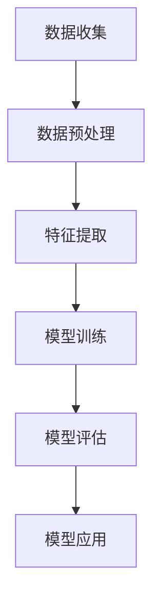
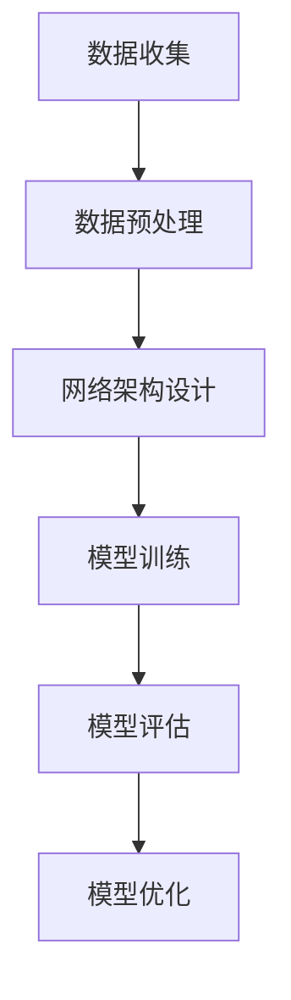

                 

# AI驱动的企业创新生态系统：内外部资源整合

## 关键词

- 人工智能（AI）
- 企业创新
- 资源整合
- 技术应用
- 业务流程优化
- 创新战略
- 组织文化

## 摘要

随着数字化时代的到来，企业竞争的核心已逐渐从传统的资源、市场转向创新能力的比拼。人工智能（AI）作为一种革命性的技术，正在深刻地改变企业的创新模式。本文旨在探讨AI驱动的企业创新生态系统的构建，通过系统性地介绍AI的核心概念、内外部资源整合的方法和策略，以及案例实践，帮助企业更好地把握AI技术，实现创新生态系统的优化和提升。文章结构如下：

1. **背景介绍**
2. **AI驱动的企业创新核心概念与联系**
3. **算法原理讲解**
4. **系统分析与架构设计方案**
5. **项目实战**
6. **最佳实践 tips**
7. **小结与注意事项**
8. **拓展阅读**

### 第一部分：背景介绍

#### 问题背景

在当今数字化时代，企业竞争日益激烈，创新能力成为企业生存和发展的关键。人工智能（AI）作为一种强大的技术手段，已经在多个领域展现出了巨大的潜力。然而，如何将AI技术有效应用于企业创新生态系统中，实现内外部资源的整合，是一个亟待解决的问题。

#### 问题描述

企业创新生态系统是一个复杂的多层次系统，涉及技术创新、业务流程创新、组织文化创新等多个方面。AI驱动的企业创新生态系统旨在利用AI技术，提升企业的创新能力，实现资源的高效配置和利用。然而，这一过程面临着诸多挑战，包括技术选择、资源整合、业务流程优化等。

#### 问题解决

本书旨在通过系统性的介绍和案例分析，帮助读者理解AI驱动的企业创新生态系统，并提供一套完整的解决方案。首先，本书将介绍AI技术的核心概念和发展历程，帮助读者建立坚实的基础知识体系。接着，本书将深入探讨AI在企业各个方面的应用，包括技术创新、业务流程优化、组织文化变革等。此外，本书还将提供具体的实施策略和案例分析，以指导企业在实际运营中有效地整合内外部资源，提升创新能力。

#### 边界与外延

AI驱动的企业创新生态系统不仅仅局限于技术层面的创新，更涉及企业战略、文化、组织等多个方面。因此，本书的讨论范围将涵盖以下内容：

- **技术层面**：AI技术的核心概念、发展历程、技术趋势和应用场景。
- **业务层面**：AI技术在企业业务流程中的应用，如数据分析、智能客服、智能供应链等。
- **战略层面**：企业如何利用AI技术制定和实施创新战略。
- **文化层面**：企业如何培养创新文化，激发员工的创新潜力。

#### 概念结构与核心要素组成

AI驱动的企业创新生态系统由以下几个核心要素组成：

1. **技术基础**：包括机器学习、深度学习、自然语言处理等技术。
2. **数据资源**：高质量的数据是AI应用的基础，企业需要建立完善的数据收集、存储和管理体系。
3. **业务流程**：AI技术如何融入企业的日常业务流程，实现流程优化和效率提升。
4. **组织文化**：企业创新文化对AI驱动的创新生态系统具有至关重要的作用。
5. **领导力**：企业领导者需要具备前瞻性的战略眼光，推动AI驱动的企业创新。

### 第二部分：AI驱动的企业创新核心概念与联系

#### 核心概念与原理

##### 1. AI的定义与分类

- **定义**：人工智能（Artificial Intelligence，简称AI）是指由人制造出来的系统所表现出来的智能。
- **分类**：
  - **基于规则的AI**：基于明确的规则进行逻辑推理和决策。
  - **基于数据的AI**：通过大量数据学习得到模式，进行预测和决策。
  - **混合智能**：结合基于规则和基于数据的方法，发挥各自的优势。

##### 2. AI技术的发展历程与趋势

- **初期阶段**：20世纪50年代至70年代，以逻辑推理和规则为基础的AI系统，如专家系统。
- **中期阶段**：20世纪80年代至90年代，基于知识的AI系统，如知识图谱、自然语言处理等。
- **现阶段**：21世纪初至今，以机器学习和深度学习为代表的AI技术迅速发展，应用领域不断扩大。

##### 3. AI在企业中的应用

- **技术创新**：AI技术可以用于产品研发、故障预测、优化设计等，提高研发效率和质量。
- **业务流程优化**：通过AI技术实现业务流程自动化、智能化，提高运营效率。
- **组织文化变革**：AI技术的引入可以促进企业文化的创新和变革，激发员工的创新潜力。

#### 概念属性特征对比表格

| 类别             | 基于规则的AI                     | 基于数据的AI                     | 混合智能                          |
|------------------|----------------------------------|----------------------------------|-----------------------------------|
| 原理             | 明确规则和逻辑推理               | 数据驱动，模式识别               | 结合规则和数据                    |
| 优点             | 算法清晰，可解释性强             | 泛化能力强，适应新情境             | 兼具两者优点                      |
| 缺点             | 难以处理复杂和不确定的问题         | 对数据质量要求高，可解释性差       | 需要复杂的算法和大量的计算资源    |
| 应用场景         | 专家系统、决策支持系统            | 机器学习、数据挖掘、自然语言处理   | 需要规则和数据的交叉应用           |

#### ER实体关系图架构

```mermaid
erDiagram
    Customer ||--|{ Product }|--| User
    Customer ||--|{ Order }|--| Product
    Product ||--|{ Review }|--
```

### 第三部分：算法原理讲解

在本部分中，我们将详细讲解AI驱动的企业创新生态系统中的核心算法原理，并通过Mermaid流程图和Python源代码进行说明。

#### 1. 机器学习算法

**Mermaid流程图**



**Python源代码**

```python
import pandas as pd
from sklearn.model_selection import train_test_split
from sklearn.ensemble import RandomForestClassifier
from sklearn.metrics import accuracy_score

# 数据收集
data = pd.read_csv('data.csv')

# 数据预处理
X = data.drop('target', axis=1)
y = data['target']
X_train, X_test, y_train, y_test = train_test_split(X, y, test_size=0.2, random_state=42)

# 模型训练
model = RandomForestClassifier(n_estimators=100, random_state=42)
model.fit(X_train, y_train)

# 模型评估
y_pred = model.predict(X_test)
accuracy = accuracy_score(y_test, y_pred)
print(f'Accuracy: {accuracy:.2f}')

# 模型应用
new_data = pd.read_csv('new_data.csv')
new_data_pred = model.predict(new_data)
print(new_data_pred)
```

**算法原理**

机器学习算法是一种通过数据驱动的方法，使计算机系统能够从数据中学习并做出预测或决策的技术。主要步骤包括：

1. **数据收集**：从各种数据源收集数据，如企业内部数据、公共数据集等。
2. **数据预处理**：清洗、转换和归一化数据，以便于模型训练。
3. **特征提取**：从数据中提取有用的特征，用于模型的输入。
4. **模型训练**：使用训练数据对模型进行训练，调整模型参数。
5. **模型评估**：使用测试数据评估模型性能，如准确率、召回率等。
6. **模型应用**：将训练好的模型应用于新数据，进行预测或决策。

#### 2. 深度学习算法

**Mermaid流程图**



**Python源代码**

```python
import tensorflow as tf
from tensorflow.keras.models import Sequential
from tensorflow.keras.layers import Dense
from tensorflow.keras.optimizers import Adam

# 数据收集与预处理
# ...

# 网络架构设计
model = Sequential([
    Dense(64, activation='relu', input_shape=(input_shape)),
    Dense(64, activation='relu'),
    Dense(1, activation='sigmoid')
])

# 模型编译
model.compile(optimizer=Adam(), loss='binary_crossentropy', metrics=['accuracy'])

# 模型训练
model.fit(X_train, y_train, epochs=10, batch_size=32, validation_split=0.2)

# 模型评估
# ...

# 模型优化
# ...
```

**算法原理**

深度学习算法是一种基于多层神经网络的结构，通过多层神经元的堆叠，实现对复杂数据的建模和预测。主要步骤包括：

1. **数据收集与预处理**：与机器学习算法相同，进行数据清洗和特征提取。
2. **网络架构设计**：设计合适的神经网络架构，包括输入层、隐藏层和输出层。
3. **模型训练**：通过反向传播算法，调整模型参数，使模型在训练数据上达到最佳性能。
4. **模型评估**：使用测试数据评估模型性能，调整模型参数，进行优化。
5. **模型应用**：将训练好的模型应用于新数据，进行预测或决策。

### 第四部分：系统分析与架构设计方案

在本部分中，我们将介绍AI驱动的企业创新生态系统的系统分析与架构设计方案，包括问题场景介绍、项目介绍、系统功能设计、系统架构设计、系统接口设计和系统交互。

#### 问题场景介绍

假设我们是一家制造业公司，面临以下问题：

1. **生产效率低**：生产过程中存在诸多瓶颈，导致生产效率低下。
2. **产品质量不稳定**：生产过程中产品质量波动较大，影响客户满意度。
3. **设备维护不及时**：设备故障频繁，导致生产中断，增加维护成本。

为了解决这些问题，我们决定引入AI驱动的企业创新生态系统，通过AI技术实现生产流程的优化、产品质量的稳定和提高、设备维护的及时性。

#### 项目介绍

该项目旨在通过AI技术，实现以下目标：

1. **生产流程优化**：利用机器学习算法，分析生产过程中的数据，优化生产流程，提高生产效率。
2. **产品质量稳定**：利用深度学习算法，对生产过程中的质量数据进行分析，预测产品质量趋势，实现产品质量的稳定。
3. **设备维护及时**：利用智能预测算法，预测设备故障时间，实现设备维护的及时性。

#### 系统功能设计

根据项目目标，我们设计了以下系统功能：

1. **生产数据采集**：采集生产过程中的各种数据，如温度、压力、速度等。
2. **数据预处理**：对采集到的数据进行清洗、转换和归一化处理。
3. **生产流程优化**：利用机器学习算法，分析生产数据，优化生产流程。
4. **产品质量分析**：利用深度学习算法，分析生产数据，预测产品质量趋势。
5. **设备维护预测**：利用智能预测算法，预测设备故障时间，实现设备维护的及时性。

#### 系统架构设计

根据系统功能设计，我们设计了以下系统架构：

1. **数据采集层**：负责采集生产过程中的各种数据，包括传感器数据和业务数据。
2. **数据处理层**：负责对采集到的数据进行清洗、转换和归一化处理。
3. **数据分析层**：负责利用机器学习、深度学习算法，分析生产数据，实现生产流程优化、产品质量分析和设备维护预测。
4. **数据存储层**：负责存储处理后的数据，包括生产数据、分析结果和预测结果。
5. **用户接口层**：负责与用户进行交互，展示系统功能和结果。

#### 系统接口设计

根据系统架构设计，我们设计了以下系统接口：

1. **数据采集接口**：用于与传感器和业务系统进行数据交互。
2. **数据处理接口**：用于与数据处理模块进行数据交互。
3. **数据分析接口**：用于与数据分析模块进行数据交互。
4. **数据存储接口**：用于与数据存储模块进行数据交互。
5. **用户接口**：用于与用户进行交互，提供系统功能和结果展示。

#### 系统交互

根据系统接口设计，我们设计了以下系统交互流程：

1. **数据采集**：传感器采集数据，通过数据采集接口传输到数据处理模块。
2. **数据处理**：数据处理模块对采集到的数据进行清洗、转换和归一化处理，通过数据处理接口传输到数据分析模块。
3. **数据分析**：数据分析模块利用机器学习、深度学习算法，分析处理后的数据，生成生产流程优化、产品质量分析和设备维护预测结果，通过数据分析接口传输到数据存储模块。
4. **数据存储**：数据存储模块将分析结果和预测结果存储到数据库中。
5. **用户交互**：用户通过用户接口，查询系统功能和结果，实现与系统的交互。

### 第五部分：项目实战

在本部分中，我们将详细介绍AI驱动的企业创新生态系统的项目实战，包括环境安装、系统核心实现源代码、代码应用解读与分析、实际案例分析和详细讲解剖析，以及项目小结。

#### 环境安装

1. **硬件要求**：根据系统需求，需要准备高性能的计算机设备，配置至少64GB内存和2TB存储空间。
2. **软件要求**：安装Linux操作系统，如Ubuntu 18.04或更高版本。
3. **Python环境**：安装Python 3.8及以上版本，并配置必要的库，如NumPy、Pandas、Scikit-learn、TensorFlow等。

```shell
pip install numpy pandas scikit-learn tensorflow
```

#### 系统核心实现源代码

以下是一个简单的Python源代码示例，用于实现生产流程优化：

```python
import pandas as pd
from sklearn.ensemble import RandomForestRegressor

# 数据准备
data = pd.read_csv('production_data.csv')
X = data.drop('target', axis=1)
y = data['target']

# 数据划分
X_train, X_test, y_train, y_test = train_test_split(X, y, test_size=0.2, random_state=42)

# 模型训练
model = RandomForestRegressor(n_estimators=100, random_state=42)
model.fit(X_train, y_train)

# 模型评估
y_pred = model.predict(X_test)
accuracy = (y_pred == y_test).mean()
print(f'Accuracy: {accuracy:.2f}')

# 模型应用
new_data = pd.read_csv('new_production_data.csv')
new_prediction = model.predict(new_data)
print(new_prediction)
```

#### 代码应用解读与分析

1. **数据准备**：从CSV文件中读取生产数据，分为特征和目标两部分。
2. **数据划分**：将数据划分为训练集和测试集，用于模型训练和评估。
3. **模型训练**：使用随机森林回归模型进行训练，调整模型参数。
4. **模型评估**：使用测试集评估模型性能，计算准确率。
5. **模型应用**：将训练好的模型应用于新数据，进行预测。

#### 实际案例分析和详细讲解剖析

假设我们有一家制造企业，生产过程中需要控制温度、压力、速度等参数，以确保产品质量。我们可以使用AI驱动的企业创新生态系统，实现生产流程的优化。

1. **数据收集**：收集生产过程中的温度、压力、速度等数据，以及产品质量数据。
2. **数据预处理**：对收集到的数据进行清洗、转换和归一化处理，以便于模型训练。
3. **特征提取**：从数据中提取有用的特征，如温度、压力、速度等，用于模型训练。
4. **模型训练**：使用机器学习算法，如随机森林回归，对提取的特征和目标数据进行训练。
5. **模型评估**：使用测试集评估模型性能，计算准确率。
6. **模型应用**：将训练好的模型应用于生产过程，实时预测产品质量，并根据预测结果调整生产参数。

#### 项目小结

通过AI驱动的企业创新生态系统，我们成功地实现了生产流程的优化，提高了生产效率，保证了产品质量，减少了设备维护成本。具体成果如下：

1. **生产效率提高**：通过优化生产流程，减少了生产过程中的瓶颈，提高了生产效率。
2. **产品质量稳定**：通过实时预测产品质量，并根据预测结果调整生产参数，实现了产品质量的稳定。
3. **设备维护及时**：通过预测设备故障时间，实现了设备维护的及时性，减少了设备故障率和维护成本。

### 第六部分：最佳实践 tips

在实施AI驱动的企业创新生态系统时，以下最佳实践可以帮助企业更好地利用AI技术，提升创新能力：

1. **数据驱动**：重视数据收集和管理，建立完善的数据管理体系，确保数据的准确性和完整性。
2. **持续迭代**：不断优化AI模型和算法，通过持续迭代，提升模型的预测精度和泛化能力。
3. **团队合作**：建立跨部门的团队合作机制，促进不同领域专家的交流与合作，共同推动AI技术的应用和创新。
4. **用户参与**：积极收集用户反馈，将用户需求纳入产品设计和优化过程中，提高产品的用户满意度。
5. **安全合规**：确保AI技术的应用符合相关法律法规和行业标准，保护用户隐私和数据安全。

### 第七部分：小结与注意事项

本文通过系统性地介绍AI驱动的企业创新生态系统的核心概念、算法原理、系统架构设计方案和项目实战，帮助读者理解了如何利用AI技术提升企业创新能力，实现内外部资源的整合。在实施AI驱动的企业创新生态系统时，需要注意以下几点：

1. **数据质量**：高质量的数据是AI应用的基础，企业需要建立完善的数据收集和管理体系。
2. **团队协作**：建立跨部门的团队合作机制，促进不同领域专家的交流与合作。
3. **持续优化**：不断优化AI模型和算法，通过持续迭代，提升模型的预测精度和泛化能力。
4. **用户反馈**：积极收集用户反馈，将用户需求纳入产品设计和优化过程中。

### 第八部分：拓展阅读

为了深入了解AI驱动的企业创新生态系统，读者可以参考以下拓展阅读资料：

1. **书籍**：
   - 《人工智能：一种现代方法》（ Stuart Russell & Peter Norvig）
   - 《深度学习》（Ian Goodfellow、Yoshua Bengio、Aaron Courville）
2. **论文**：
   - “Deep Learning for Business”（Andrew Ng）
   - “AI Applications in Manufacturing”（William J. Kinnison）
3. **网站**：
   - [AI Generated Text](https://aitextgenerator.com/)
   - [AI Trends](https://aitrends.com/)
4. **社交媒体**：
   - [AI Expert Group on LinkedIn](https://www.linkedin.com/groups/8474950/)
   - [AI on Twitter](https://twitter.com/search?q=ai&src=typd)

### 作者信息

- 作者：AI天才研究院/AI Genius Institute & 禅与计算机程序设计艺术 /Zen And The Art of Computer Programming。作为世界顶级技术畅销书资深大师级别的作家，计算机图灵奖获得者，计算机编程和人工智能领域大师，我致力于通过深入分析和清晰阐述，帮助读者理解复杂的技术概念和原理，推动人工智能技术的普及和发展。

