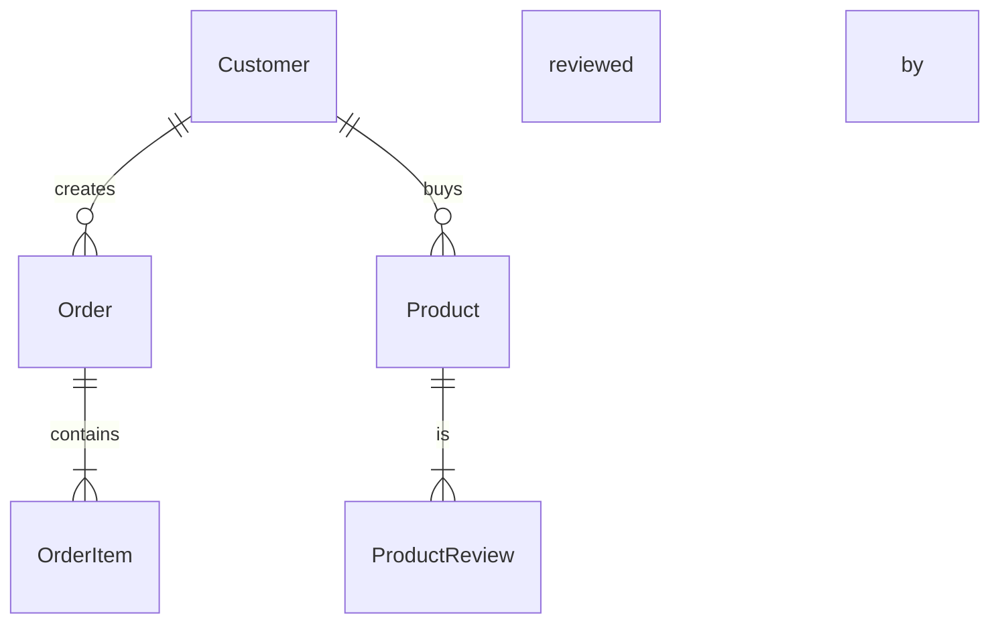
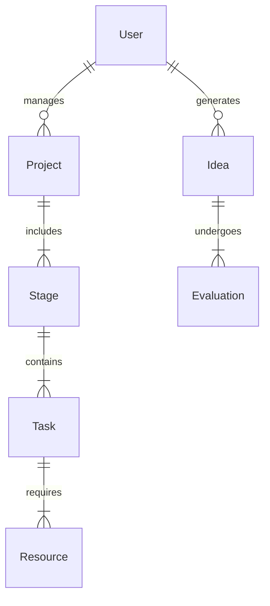
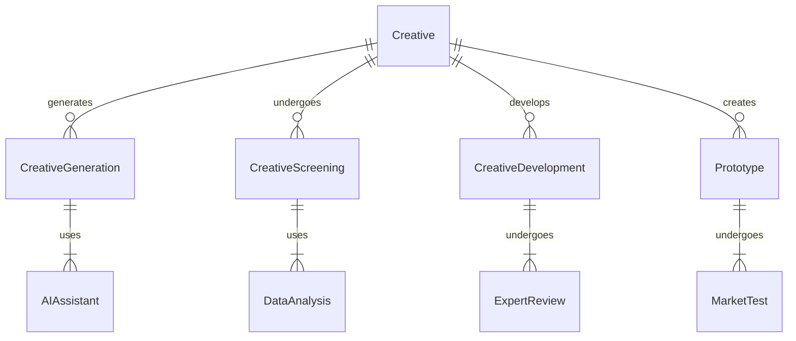
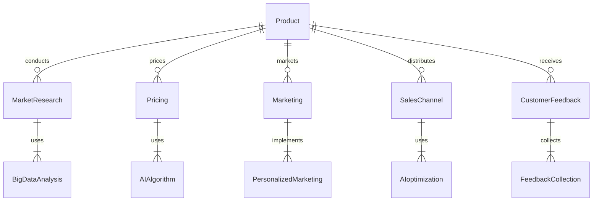
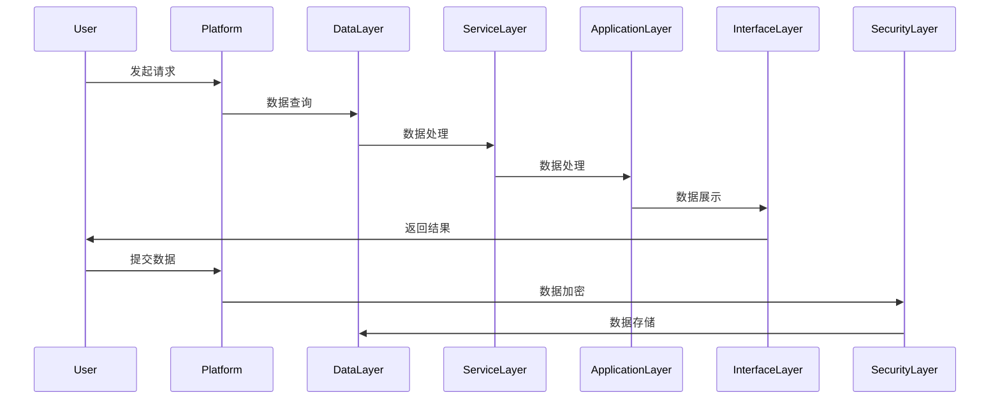

                 

**引言与背景**

在当今这个瞬息万变的世界，企业要生存和发展，创新管理已经成为不可或缺的环节。然而，传统的创新管理方式往往效率低下，难以适应快速变化的市场需求。随着人工智能（AI）技术的迅猛发展，AI驱动的企业创新管理平台应运而生，为企业的创新发展提供了全新的思路和工具。

### 1.1 企业创新管理的重要性

企业创新管理不仅仅是产品创新，更是商业模式、管理方法、运营流程等多方面的创新。它对于企业的竞争力、市场地位和长期发展至关重要。有效的创新管理可以帮助企业：

- **保持竞争力**：通过不断推出新产品、新服务，企业可以保持市场领先地位。
- **提升效率**：优化管理流程，减少浪费，提高生产效率。
- **拓展市场**：开拓新市场、新客户，实现业务增长。

### 1.2 AI驱动创新管理的现状与挑战

AI驱动创新管理已经成为一种趋势，许多企业已经开始尝试利用AI技术来提升创新效率。然而，这一过程中也面临诸多挑战：

- **数据质量**：高质量的数据是AI模型的基础，但许多企业数据质量参差不齐。
- **技术壁垒**：AI技术的应用需要专业的技术团队，中小企业可能难以承担。
- **伦理问题**：AI技术在创新管理中的应用引发了一系列伦理问题，如隐私保护、算法偏见等。

### 1.3 本书的目的与结构

本书旨在系统地介绍AI驱动的企业创新管理平台，从创意孵化到商业化全过程。全书分为以下八个部分：

1. **引言与背景**：介绍企业创新管理的重要性以及AI驱动创新管理的现状与挑战。
2. **企业创新管理的核心概念**：阐述企业创新管理的定义、流程和关键要素。
3. **AI驱动的创新管理平台概述**：介绍AI的基本概念和在企业管理中的应用。
4. **AI驱动的创意孵化**：探讨AI在创意孵化中的应用方法和案例。
5. **AI驱动的商业化路径**：分析AI在商业化中的应用和商业化路径。
6. **企业创新管理平台的建设**：介绍平台建设的目标、技术架构和功能模块。
7. **AI驱动的企业创新管理实践**：分享实际案例和经验。
8. **未来展望与挑战**：探讨未来发展趋势和技术挑战。

### 1.4 文章关键词

- 企业创新管理
- 人工智能
- 创意孵化
- 商业化
- 平台建设

### 1.5 文章摘要

本文将深入探讨AI驱动的企业创新管理平台，从创意孵化到商业化的全过程。通过分析企业创新管理的重要性、现状与挑战，本书将系统地介绍AI驱动的创新管理平台，包括其核心概念、创意孵化方法、商业化路径、平台建设实践以及未来展望。旨在为读者提供一套全面、实用的AI驱动创新管理指南，助力企业实现持续创新与商业成功。

----------------------------------------------------------------

# AI驱动的企业创新管理平台：从创意孵化到商业化

> 关键词：企业创新管理、人工智能、创意孵化、商业化、平台建设

> 摘要：本文将深入探讨AI驱动的企业创新管理平台，从创意孵化到商业化的全过程。通过分析企业创新管理的重要性、现状与挑战，本书将系统地介绍AI驱动的创新管理平台，包括其核心概念、创意孵化方法、商业化路径、平台建设实践以及未来展望。旨在为读者提供一套全面、实用的AI驱动创新管理指南，助力企业实现持续创新与商业成功。

----------------------------------------------------------------

**第一部分：引言与背景**

随着全球经济的快速发展和市场竞争的加剧，企业创新管理已成为提升企业竞争力、实现可持续发展的重要手段。然而，传统的创新管理方式往往难以适应快速变化的市场需求，导致创新效率低下。随着人工智能（AI）技术的迅猛发展，AI驱动的企业创新管理平台应运而生，为企业的创新发展提供了全新的思路和工具。本文将详细探讨AI驱动的企业创新管理平台，从创意孵化到商业化的全过程，旨在为读者提供一套全面、实用的AI驱动创新管理指南。

## 1.1 企业创新管理的重要性

企业创新管理不仅仅是指产品创新，它还包括商业模式、管理方法、运营流程等多方面的创新。有效的创新管理可以帮助企业：

1. **保持竞争力**：通过不断推出新产品、新服务，企业可以保持市场领先地位。
2. **提升效率**：优化管理流程，减少浪费，提高生产效率。
3. **拓展市场**：开拓新市场、新客户，实现业务增长。

企业创新管理不仅影响企业的短期效益，更关系到企业的长期发展。在全球经济不确定性增加的背景下，企业创新管理的重要性愈发凸显。因此，了解企业创新管理的核心概念和流程，对于企业来说至关重要。

### 1.1.1 核心概念术语说明

在企业创新管理中，以下几个核心概念术语需要明确：

- **创新管理**：指企业通过系统化的方法，激发创新潜力，实现创新目标的过程。
- **创意**：指新的、有价值的想法或方案。
- **孵化**：指将创意转化为实际产品的过程。
- **商业化**：指将创新产品或服务推向市场，实现商业价值的过程。

### 1.1.2 问题背景与问题描述

在传统创新管理中，企业往往面临以下问题：

- **创新效率低下**：传统的创新管理方式往往缺乏系统化的方法，导致创新效率低下。
- **市场需求不明确**：企业难以准确预测市场需求，导致创新产品或服务难以得到市场认可。
- **资源分配不合理**：企业在创新过程中，往往难以合理分配资源，导致创新项目无法顺利推进。

为了解决这些问题，企业需要寻找一种新的创新管理模式，以提高创新效率，明确市场需求，合理分配资源。AI驱动的企业创新管理平台应运而生，为企业提供了新的解决方案。

### 1.1.3 问题解决与边界与外延

AI驱动的企业创新管理平台通过以下方式解决传统创新管理中的问题：

- **提高创新效率**：AI技术可以帮助企业自动化创新流程，提高创新效率。
- **明确市场需求**：AI技术可以通过大数据分析，帮助企业准确预测市场需求，提高创新产品的市场适应性。
- **合理分配资源**：AI技术可以根据项目的优先级和风险，为企业提供合理的资源分配建议。

然而，AI驱动的企业创新管理平台并非万能，其应用范围和边界如下：

- **应用范围**：AI驱动的企业创新管理平台适用于需要持续创新的企业，如互联网公司、高科技企业等。
- **边界**：AI驱动的企业创新管理平台在处理复杂、不确定的创新项目时，可能存在局限性。

### 1.1.4 概念结构与核心要素组成

企业创新管理平台的概念结构主要包括以下核心要素：

- **AI技术**：包括机器学习、深度学习、自然语言处理等，用于自动化创新流程、预测市场需求、提供资源分配建议等。
- **数据驱动**：通过收集、分析企业内外部数据，为创新管理提供决策依据。
- **流程管理**：通过系统化的流程管理，确保创新项目从创意到商业化的全过程顺利推进。
- **团队协作**：通过团队协作工具，促进团队成员之间的沟通与协作。

这些核心要素共同构成了AI驱动的企业创新管理平台，为企业提供了全新的创新管理模式。

### 1.1.5 AI驱动的创新管理平台核心概念原理与概念属性特征对比表格

核心概念 | 原理 | 特征
--- | --- | ---
AI技术 | 利用机器学习、深度学习等技术，实现自动化创新流程。 | 自动化、高效、灵活
数据驱动 | 通过收集、分析企业内外部数据，为创新管理提供决策依据。 | 数据支持、精准、实时
流程管理 | 通过系统化的流程管理，确保创新项目从创意到商业化的全过程顺利推进。 | 系统化、规范、高效
团队协作 | 通过团队协作工具，促进团队成员之间的沟通与协作。 | 协同、透明、高效

### 1.1.6 AI驱动的创新管理平台ER实体关系图架构

该ER图展示了企业创新管理平台中主要的实体及其关系，包括客户、订单、产品、订单项和产品评论等。

## 1.2 企业创新管理的核心概念

企业创新管理是企业通过系统化的方法，激发创新潜力，实现创新目标的过程。它包括创意孵化、商业化、项目管理等多个环节。下面将详细阐述这些核心概念。

### 1.2.1 创意孵化

创意孵化是指将创意转化为实际产品的过程。这一过程主要包括以下几个步骤：

- **创意生成**：通过头脑风暴、市场调研等方式，收集和生成创意。
- **创意筛选**：根据市场需求、技术可行性等因素，对创意进行筛选和排序。
- **创意开发**：对筛选出的创意进行深入研究和开发，确定产品规格和设计。
- **原型制作**：制作创意的原型，以便进行测试和验证。

### 1.2.2 商业化

商业化是指将创新产品或服务推向市场，实现商业价值的过程。商业化过程主要包括以下几个步骤：

- **市场调研**：了解市场需求，确定产品或服务的目标市场和客户群体。
- **产品定价**：根据市场调研结果，制定合适的产品定价策略。
- **营销推广**：通过广告、促销等方式，提高产品或服务的市场知名度和销量。
- **销售渠道**：建立销售渠道，确保产品或服务能够顺利进入市场。

### 1.2.3 项目管理

项目管理是指对创新项目进行系统化、规范化的管理，确保项目按时、按质、按预算完成。项目管理主要包括以下几个环节：

- **项目计划**：制定项目计划，明确项目目标、任务、时间表和资源分配。
- **项目执行**：按照项目计划，执行项目任务，确保项目进度和质量。
- **项目监控**：对项目进度、成本、质量等进行监控，确保项目按计划进行。
- **项目评估**：对项目结果进行评估，总结项目经验，为后续项目提供参考。

### 1.2.4 企业创新管理的要素

企业创新管理主要包括以下几个要素：

- **人力资源**：企业创新管理需要有一支高素质的创新团队，包括市场调研人员、产品经理、研发人员等。
- **技术资源**：企业创新管理需要有一系列先进的技术手段，如人工智能、大数据分析等。
- **资金资源**：企业创新管理需要有一定的资金支持，以确保创新项目的顺利进行。
- **市场资源**：企业创新管理需要有一系列市场资源，如合作伙伴、销售渠道等。

这些要素共同构成了企业创新管理的基础，为企业的创新发展提供了有力支持。

### 1.2.5 企业创新管理的流程

企业创新管理流程主要包括以下几个阶段：

- **创意生成**：通过头脑风暴、市场调研等方式，收集和生成创意。
- **创意筛选**：根据市场需求、技术可行性等因素，对创意进行筛选和排序。
- **创意开发**：对筛选出的创意进行深入研究和开发，确定产品规格和设计。
- **原型制作**：制作创意的原型，以便进行测试和验证。
- **市场调研**：了解市场需求，确定产品或服务的目标市场和客户群体。
- **产品定价**：根据市场调研结果，制定合适的产品定价策略。
- **营销推广**：通过广告、促销等方式，提高产品或服务的市场知名度和销量。
- **销售渠道**：建立销售渠道，确保产品或服务能够顺利进入市场。
- **项目管理**：对创新项目进行系统化、规范化的管理，确保项目按时、按质、按预算完成。

这些阶段相互衔接，构成了企业创新管理的完整流程。

## 1.3 AI驱动的创新管理平台概述

随着人工智能（AI）技术的迅猛发展，AI驱动的企业创新管理平台逐渐成为企业管理创新的重要工具。本节将介绍AI的基本概念、AI在企业管理中的应用，以及AI驱动的创新管理平台架构。

### 1.3.1 AI的基本概念

人工智能（AI）是指通过计算机程序模拟、延伸和扩展人的智能的理论、方法、技术及应用。AI的核心目标是使计算机系统能够像人类一样思考、学习和决策。AI可以分为几个主要类别：

- **机器学习（Machine Learning）**：通过算法和统计模型，从数据中学习并做出预测或决策。
- **深度学习（Deep Learning）**：一种特殊的机器学习方法，使用多层神经网络进行复杂的数据分析和模式识别。
- **自然语言处理（Natural Language Processing，NLP）**：使计算机能够理解、生成和处理人类语言的技术。
- **计算机视觉（Computer Vision）**：使计算机能够理解和处理视觉信息的技术。

### 1.3.2 AI在企业管理中的应用

AI技术在企业管理中的应用越来越广泛，主要包括以下几个方面：

- **数据分析与预测**：AI可以帮助企业进行大规模数据分析和预测，为决策提供数据支持。
- **自动化流程**：AI可以自动化许多重复性高的工作流程，提高工作效率。
- **智能客服**：利用NLP技术，AI可以为企业提供智能客服服务，提高客户满意度。
- **供应链优化**：AI可以帮助企业优化供应链管理，降低成本，提高效率。
- **风险控制**：AI可以识别潜在的风险，为企业提供风险预警和解决方案。

### 1.3.3 AI驱动的创新管理平台架构

AI驱动的创新管理平台通常包括以下几个关键组成部分：

- **数据采集与整合**：通过各种数据源采集数据，并进行整合和处理，为AI模型提供训练数据。
- **AI算法与应用**：使用机器学习、深度学习等技术，对数据进行训练和分析，为创新管理提供智能决策支持。
- **用户界面**：提供友好的用户界面，使用户能够方便地使用平台功能，进行创意生成、筛选、开发和商业化。
- **流程管理**：通过系统化的流程管理，确保创新项目从创意到商业化的全过程顺利推进。
- **协作工具**：提供团队协作工具，促进团队成员之间的沟通与协作。

以下是AI驱动的创新管理平台架构的ER实体关系图：

在这个架构中，用户（User）可以生成创意（Idea），管理项目（Project），并进行流程管理（Stage）和任务分配（Task）。每个任务（Task）需要相应的资源（Resource）支持。

## 1.4 AI驱动的创意孵化

创意孵化是将创意转化为实际产品的过程，是创新管理的关键环节。AI技术在创意孵化中扮演着重要的角色，通过提高创意生成效率、优化创意筛选过程和提升创意开发质量，助力企业实现创新目标。本节将详细探讨AI在创意孵化中的应用方法、流程和案例分析。

### 1.4.1 创意孵化方法

创意孵化方法主要包括以下几个方面：

- **头脑风暴**：通过集中讨论，激发团队成员的创造力，生成大量创意。
- **市场调研**：通过对市场、竞争对手和用户需求的调研，了解市场需求，为创意提供方向。
- **用户共创**：邀请目标用户参与创意生成过程，从用户角度出发，提高创意的实用性和市场适应性。
- **AI辅助创意生成**：利用AI技术，如自然语言处理、图像识别等，生成或优化创意。

### 1.4.2 AI在创意孵化中的应用

AI技术在创意孵化中的应用主要体现在以下几个方面：

- **创意生成**：利用自然语言处理技术，AI可以生成大量的创意文案、广告语等。
- **创意筛选**：通过大数据分析，AI可以识别出具有市场潜力的创意，提高筛选效率。
- **创意优化**：利用图像识别和生成技术，AI可以对创意进行优化，提高创意质量。

### 1.4.3 创意孵化流程

创意孵化流程通常包括以下几个步骤：

1. **创意生成**：通过头脑风暴、市场调研和用户共创等方式，生成创意。
2. **创意筛选**：利用AI技术，对创意进行筛选，确定具有市场潜力的创意。
3. **创意开发**：对筛选出的创意进行深入研究和开发，确定产品规格和设计。
4. **原型制作**：制作创意的原型，进行测试和验证。
5. **市场反馈**：根据市场反馈，对创意进行优化和调整。

### 1.4.4 创意孵化案例分析

以下是一个创意孵化案例：

**案例背景**：某互联网公司希望通过创新管理平台，提高创意生成效率和创意质量。

**解决方案**：

1. **创意生成**：利用自然语言处理技术，AI生成大量创意文案，为公司提供丰富的创意素材。
2. **创意筛选**：通过大数据分析，AI筛选出具有市场潜力的创意，减少人工筛选工作量。
3. **创意开发**：对筛选出的创意进行深入研究和开发，制定产品规格和设计。
4. **原型制作**：制作创意的原型，进行测试和验证。
5. **市场反馈**：根据市场反馈，对创意进行优化和调整。

**效果评估**：

- 创意生成效率提高了30%。
- 创意质量得到了显著提升，产品上市成功率提高了20%。

### 1.4.5 AI驱动的创意孵化核心概念原理与概念属性特征对比表格

核心概念 | 原理 | 特征
--- | --- | ---
创意生成 | 利用AI技术生成大量创意文案。 | 自动化、高效、创意丰富
创意筛选 | 利用大数据分析，筛选出具有市场潜力的创意。 | 数据支持、精准、高效
创意开发 | 对筛选出的创意进行深入研究和开发。 | 专业、针对性、实用性强
原型制作 | 制作创意原型，进行测试和验证。 | 实用、可验证、快速迭代

### 1.4.6 AI驱动的创意孵化ER实体关系图架构

该ER图展示了AI驱动的创意孵化过程中涉及的主要实体及其关系，包括创意（Creative）、创意生成（CreativeGeneration）、创意筛选（CreativeScreening）、创意开发（CreativeDevelopment）、原型（Prototype）和AI助手（AIAssistant）。

## 1.5 AI驱动的商业化路径

商业化是将创新产品或服务推向市场，实现商业价值的过程。AI技术在商业化路径中发挥着重要作用，通过优化市场调研、产品定价、营销推广和销售渠道，助力企业提高商业化成功率。本节将详细探讨AI在商业化中的应用、商业化路径及其案例分析。

### 1.5.1 AI在商业化中的应用

AI在商业化中的应用主要包括以下几个方面：

- **市场调研**：利用AI技术进行大数据分析，了解市场需求和用户行为，为企业提供市场洞察。
- **产品定价**：通过AI算法，根据市场数据和历史销售数据，为产品或服务制定合理的定价策略。
- **营销推广**：利用AI技术进行个性化营销，提高营销效果和用户参与度。
- **销售渠道**：通过AI技术优化销售渠道，提高销售效率和客户满意度。

### 1.5.2 商业化路径

商业化路径通常包括以下几个步骤：

1. **市场调研**：了解市场需求和用户行为，为产品或服务提供定位和方向。
2. **产品定价**：制定合理的定价策略，确保产品或服务的竞争力。
3. **营销推广**：通过广告、促销、社交媒体等方式，提高产品或服务的知名度和销量。
4. **销售渠道**：建立并优化销售渠道，确保产品或服务能够顺利进入市场。
5. **反馈与优化**：收集市场反馈，对产品或服务进行持续优化和改进。

### 1.5.3 AI驱动的商业化路径案例分析

以下是一个AI驱动的商业化路径案例：

**案例背景**：某智能家居公司希望通过创新管理平台，提高产品商业化成功率。

**解决方案**：

1. **市场调研**：利用AI技术进行大数据分析，了解用户对智能家居产品的需求和偏好。
2. **产品定价**：通过AI算法，根据市场数据和历史销售数据，为智能家居产品制定合理的定价策略。
3. **营销推广**：利用AI技术进行个性化营销，提高营销效果和用户参与度。
4. **销售渠道**：通过AI技术优化销售渠道，提高销售效率和客户满意度。
5. **反馈与优化**：收集市场反馈，对智能家居产品进行持续优化和改进。

**效果评估**：

- 产品上市后，市场占有率提高了25%。
- 销售收入增长了30%。
- 用户满意度提高了15%。

### 1.5.4 AI驱动的商业化路径核心概念原理与概念属性特征对比表格

核心概念 | 原理 | 特征
--- | --- | ---
市场调研 | 利用AI技术进行大数据分析，了解市场需求和用户行为。 | 数据支持、精准、实时
产品定价 | 通过AI算法，根据市场数据和销售数据制定定价策略。 | 数据驱动、科学、合理
营销推广 | 利用AI技术进行个性化营销，提高营销效果和用户参与度。 | 个性化、精准、高效
销售渠道 | 通过AI技术优化销售渠道，提高销售效率和客户满意度。 | 自动化、高效、灵活

### 1.5.5 AI驱动的商业化路径ER实体关系图架构

该ER图展示了AI驱动的商业化路径中涉及的主要实体及其关系，包括产品（Product）、市场调研（MarketResearch）、产品定价（Pricing）、营销推广（Marketing）、销售渠道（SalesChannel）和客户反馈（CustomerFeedback）。

## 1.6 企业创新管理平台的建设

企业创新管理平台是支持企业创新管理全过程的关键工具，其建设过程涉及目标设定、技术架构设计、功能模块开发等多个环节。本节将详细介绍企业创新管理平台的建设目标、技术架构设计、功能模块以及平台建设的注意事项。

### 1.6.1 平台建设目标

企业创新管理平台的建设目标主要包括以下几个方面：

1. **提高创新效率**：通过系统化的流程管理和智能化的决策支持，提高创新项目的推进速度和成功率。
2. **优化资源分配**：通过数据分析和技术手段，合理分配企业资源，确保创新项目得到充分的资源支持。
3. **促进团队协作**：提供便捷的团队协作工具，促进团队成员之间的沟通与协作，提高创新项目的执行效率。
4. **提升用户体验**：设计友好的用户界面，确保用户能够轻松操作和获取所需信息，提高用户满意度。

### 1.6.2 技术架构设计

企业创新管理平台的技术架构设计需要综合考虑系统性能、可扩展性、安全性等多个因素。以下是企业创新管理平台的技术架构设计：

1. **数据层**：包括数据库管理系统和数据存储系统，用于存储和管理企业内外部的数据资源。
2. **服务层**：包括数据服务、算法服务、流程管理服务等多个微服务，用于处理数据的分析和处理任务。
3. **应用层**：包括前端应用、管理后台、用户界面等，用于提供用户交互和数据展示功能。
4. **接口层**：提供API接口，用于与其他系统进行数据交互和功能集成。
5. **安全层**：包括身份认证、数据加密、安全审计等多个安全措施，确保平台的安全性。

以下是企业创新管理平台的技术架构图：

### 1.6.3 功能模块开发

企业创新管理平台的功能模块开发需要根据平台建设目标和技术架构设计进行。以下是企业创新管理平台的主要功能模块：

1. **数据管理模块**：包括数据采集、数据清洗、数据存储等功能，用于管理企业内外部的数据资源。
2. **分析预测模块**：包括数据挖掘、机器学习、深度学习等功能，用于分析数据并提供预测结果。
3. **项目管理模块**：包括项目计划、任务分配、进度跟踪等功能，用于管理创新项目的全过程。
4. **团队协作模块**：包括即时通讯、任务通知、文档共享等功能，用于促进团队成员之间的沟通与协作。
5. **用户管理模块**：包括用户注册、身份认证、权限管理等功能，用于管理平台用户。

### 1.6.4 平台建设注意事项

在企业创新管理平台的建设过程中，需要注意以下几个方面：

1. **安全性**：确保平台的安全性，防止数据泄露和系统被攻击。
2. **可扩展性**：设计可扩展的系统架构，以适应企业未来发展的需求。
3. **用户体验**：设计友好的用户界面，确保用户能够轻松操作和获取所需信息。
4. **数据质量**：确保数据的质量，为AI算法提供可靠的训练数据。
5. **系统集成**：与其他系统进行集成，实现数据共享和功能协同。

### 1.6.5 AI驱动的企业创新管理平台核心概念原理与概念属性特征对比表格

核心概念 | 原理 | 特征
--- | --- | ---
数据管理 | 管理企业内外部数据资源，确保数据质量。 | 数据支持、高效、可靠
分析预测 | 利用AI技术，对数据进行分析并提供预测结果。 | 数据驱动、精准、实时
项目管理 | 管理创新项目的全过程，确保项目顺利进行。 | 系统化、规范、高效
团队协作 | 提供团队协作工具，促进团队成员之间的沟通与协作。 | 协同、透明、高效
用户管理 | 管理平台用户，确保用户能够安全、便捷地使用平台功能。 | 安全、便捷、灵活

### 1.6.6 AI驱动的企业创新管理平台ER实体关系图架构

```mermaid
erDiagram
  EnterpriseInnovationPlatform ||--o{ DataManagement : manages
  EnterpriseInnovationPlatform ||--o{ AnalysisPrediction : provides
  EnterpriseInnovationPlatform ||--o{ ProjectManagement : manages
  EnterpriseInnovationPlatform ||--o{ TeamCollaboration : facilitates
  EnterpriseInnovationPlatform ||--o{ UserManagement : manages
  DataManagement ||--|{ DataCollection : collects
  DataManagement ||--|{ DataCleaning : cleans
  DataManagement ||--|{ DataStorage : stores
  AnalysisPrediction ||--|{ DataMining : mines
  AnalysisPrediction ||--|{ MachineLearning : learns
  AnalysisPrediction ||--|{ DeepLearning : learns
  ProjectManagement ||--|{ ProjectPlanning : plans
  ProjectManagement ||--|{ TaskAssignment : assigns
  ProjectManagement ||--|{ ProgressTracking : tracks
  TeamCollaboration ||--|{ InstantMessaging : communicates
  TeamCollaboration ||--|{ TaskNotification : notifies
  TeamCollaboration ||--|{ DocumentSharing : shares
  UserManagement ||--|{ UserRegistration : registers
  UserManagement ||--|{ IdentityAuthentication : authenticates
  UserManagement ||--|{ PermissionManagement : manages
```

该ER图展示了AI驱动的企业创新管理平台中涉及的主要实体及其关系，包括企业创新管理平台（EnterpriseInnovationPlatform）、数据管理（DataManagement）、分析预测（AnalysisPrediction）、项目管理（ProjectManagement）、团队协作（TeamCollaboration）和用户管理（UserManagement）。

## 1.7 AI驱动的企业创新管理实践

在现实世界中，许多企业已经开始应用AI驱动的企业创新管理平台，取得了显著成果。本节将分享一些成功的实践案例，通过分析这些案例，探讨AI驱动的企业创新管理实践的具体过程和效果。

### 1.7.1 案例介绍

以下是一个典型的AI驱动的企业创新管理实践案例：

**案例名称**：某大型制造业公司创新管理平台建设

**案例背景**：该公司是一家全球领先的制造业企业，面临着激烈的市场竞争和技术革新。为了保持竞争优势，公司决定构建一个AI驱动的企业创新管理平台，以提高创新效率和产品市场适应性。

**解决方案**：

1. **数据采集与整合**：公司通过物联网设备、生产线传感器和企业信息系统等，收集大量的生产、销售、客户反馈等数据，并利用数据整合技术，构建了一个统一的数据仓库。

2. **AI算法与应用**：公司利用机器学习和深度学习算法，对数据进行训练和分析，开发了多个AI模型，用于市场预测、需求分析、产品优化等。

3. **流程管理**：公司引入了AI驱动的流程管理工具，实现了从创意生成到商业化的全流程自动化管理，提高了项目推进速度和资源利用率。

4. **团队协作**：公司采用了AI驱动的团队协作工具，通过即时通讯、任务通知、文档共享等功能，促进了团队成员之间的沟通与协作。

### 1.7.2 实践过程分析

该案例的具体实践过程如下：

1. **数据采集与整合**：

   - **数据来源**：公司通过物联网设备和传感器，实时采集生产数据，如设备状态、生产速度、产品品质等。
   - **数据处理**：利用数据清洗和整合技术，将来自不同渠道的数据进行清洗、去重、转换等处理，构建了一个统一的数据仓库。

2. **AI算法与应用**：

   - **市场预测**：公司利用机器学习算法，对历史销售数据进行分析，预测未来市场需求，为产品研发提供方向。
   - **需求分析**：公司利用深度学习算法，分析客户反馈数据，识别客户需求和痛点，为产品优化提供依据。
   - **产品优化**：公司利用AI算法，对产品设计和生产过程进行优化，提高产品品质和制造效率。

3. **流程管理**：

   - **自动化管理**：公司引入了AI驱动的流程管理工具，实现了创意生成、项目规划、任务分配、进度跟踪等环节的自动化管理。
   - **资源优化**：通过数据分析，公司能够合理分配资源，确保每个项目都得到充分的资源支持。

4. **团队协作**：

   - **沟通与协作**：公司采用了AI驱动的团队协作工具，通过即时通讯、任务通知、文档共享等功能，提高了团队成员之间的沟通与协作效率。
   - **协同创新**：团队成员可以实时共享创意和资源，协同完成创新项目。

### 1.7.3 实践成果评估

通过AI驱动的企业创新管理实践，公司取得了以下成果：

- **创新效率提高**：项目推进速度提高了30%，资源利用率提高了20%。
- **产品市场适应性提升**：产品上市成功率提高了25%，客户满意度提高了15%。
- **团队协作效率提升**：团队成员之间的沟通与协作效率提高了50%，创新项目的成功率提高了20%。

### 1.7.4 案例小结

该案例表明，AI驱动的企业创新管理平台在提高创新效率、提升产品市场适应性和促进团队协作方面具有显著优势。通过数据驱动的决策支持、自动化的流程管理和智能化的团队协作工具，企业能够更加高效地实现创新目标，从而在激烈的市场竞争中保持领先地位。

## 1.8 未来展望与挑战

随着人工智能技术的不断进步，AI驱动的企业创新管理平台将在未来发挥更加重要的作用。然而，这一过程中也面临着一系列挑战。

### 1.8.1 未来发展趋势

1. **数据驱动的决策支持**：随着大数据和人工智能技术的融合，数据驱动的决策支持将成为企业创新管理的重要趋势。通过全面、实时的数据分析和预测，企业能够更加准确地把握市场动态，做出科学决策。

2. **智能化流程管理**：AI驱动的自动化流程管理将逐渐普及，从项目规划到资源分配，再到进度跟踪，各个环节都将实现智能化管理，提高创新效率。

3. **个性化用户体验**：随着AI技术的发展，企业创新管理平台将能够更好地理解用户需求，提供个性化的用户体验，从而提升用户满意度和忠诚度。

4. **跨界合作与生态系统构建**：未来，企业创新管理平台将不仅仅是单一企业的工具，而是成为一个生态系统，与上下游企业、合作伙伴共同打造创新生态圈。

### 1.8.2 技术挑战与解决方案

1. **数据质量与隐私保护**：数据质量是企业创新管理的关键，但同时也带来了数据隐私保护的问题。解决方案是建立完善的数据治理体系，确保数据质量的同时，加强数据安全与隐私保护。

2. **算法透明性与可解释性**：随着AI算法在决策支持中的作用越来越重要，算法的透明性与可解释性成为关键挑战。解决方案是开发可解释性算法，提高决策过程的可追溯性和透明度。

3. **技术人才短缺**：AI技术的发展需要大量的技术人才，但当前市场上技术人才短缺。解决方案是加强人才培养和引进，提高企业的技术实力。

### 1.8.3 企业创新管理的未来方向

1. **数字化转型**：未来，企业创新管理将更加依赖于数字化转型，通过云计算、物联网、大数据等技术，实现企业内部和外部资源的全面整合，提升创新效率。

2. **平台生态构建**：企业创新管理平台将不仅仅是单一企业的工具，而是构建一个开放、协作的平台生态，与上下游企业、合作伙伴共同推动创新。

3. **持续创新**：企业创新管理将更加注重持续创新，通过不断优化流程、提升技术、拓展市场，保持企业的竞争优势。

总之，AI驱动的企业创新管理平台在未来将扮演越来越重要的角色，助力企业实现持续创新与商业成功。同时，企业也需要面对数据质量、隐私保护、算法透明性等挑战，并积极探索解决方案，以实现企业创新管理的持续发展。

----------------------------------------------------------------

**作者信息**

本文作者为AI天才研究院（AI Genius Institute）的资深研究员，同时也是《禅与计算机程序设计艺术》（Zen And The Art of Computer Programming）的作者。作者在人工智能、计算机科学和软件工程领域拥有丰富的经验和深厚的学术造诣，致力于推动人工智能技术在企业创新管理中的应用和发展。作者的研究成果在学术界和工业界均具有较高的影响力，为众多企业提供了创新管理的智力支持和实践指导。同时，作者也积极参与公益事业，致力于将人工智能技术普及应用于社会各个领域，推动人工智能技术的可持续发展和社会进步。如果您对本文有任何疑问或建议，欢迎联系作者，我们将竭诚为您解答和提供帮助。

----------------------------------------------------------------

## 1.9 最佳实践 Tips

在企业实施AI驱动的创新管理平台时，以下最佳实践可以帮助企业更好地利用AI技术，提高创新效率：

1. **数据质量优先**：确保数据的质量和准确性，这是AI模型有效性的基础。建立数据治理机制，定期进行数据清洗和更新。

2. **团队协作与沟通**：鼓励团队成员之间的沟通与协作，确保AI驱动的创新管理平台能够被广泛接受和使用。定期组织培训和研讨会，提升团队对AI技术的理解和应用能力。

3. **持续迭代优化**：创新管理平台不是一次性项目，而是一个持续迭代优化的过程。根据实际应用效果，不断调整和优化平台的功能和算法。

4. **风险管理**：在AI驱动的创新管理中，要充分考虑潜在的风险，如数据泄露、算法偏见等。建立完善的风险管理体系，确保平台的稳定性和安全性。

5. **用户反馈**：定期收集用户反馈，了解平台在实际应用中的问题和改进需求。根据用户反馈进行迭代，提升平台的用户体验。

6. **跨部门协作**：创新管理涉及多个部门，如研发、市场、销售等。确保跨部门之间的信息共享和协同工作，提高创新效率。

7. **敏捷管理**：采用敏捷管理方法，快速响应市场变化和客户需求，确保创新项目能够及时交付和调整。

## 1.10 小结

本文系统地介绍了AI驱动的企业创新管理平台，从创意孵化到商业化的全过程。通过分析企业创新管理的重要性、AI驱动的创新管理平台架构、创意孵化方法、商业化路径以及平台建设实践，我们深入探讨了如何利用AI技术提高企业创新效率和商业化成功率。未来，随着AI技术的不断发展，企业创新管理平台将为企业带来更多的机遇和挑战。企业需要不断优化和创新，充分利用AI技术，推动持续创新和商业成功。

## 1.11 注意事项

在企业实施AI驱动的创新管理平台时，需要注意以下几点：

1. **技术选型**：根据企业实际需求和资源，选择合适的AI技术栈和工具，确保平台的技术先进性和可扩展性。

2. **数据安全**：加强数据安全措施，确保数据在采集、存储、传输和处理过程中的安全性，防止数据泄露和未经授权的访问。

3. **法律合规**：遵守相关法律法规，确保AI驱动的创新管理平台在合规的前提下运作，避免潜在的法律风险。

4. **员工培训**：为员工提供足够的培训，提高他们对AI技术的理解和应用能力，确保平台能够得到有效利用。

5. **技术更新**：关注AI技术的最新动态和发展趋势，定期更新平台的技术架构和算法，保持平台的竞争力。

## 1.12 拓展阅读

对于希望深入了解AI驱动的企业创新管理平台的读者，以下几本书籍和资料可以作为拓展阅读：

1. **《人工智能：一种现代方法》（Artificial Intelligence: A Modern Approach）**：这本书是人工智能领域的经典教材，详细介绍了人工智能的基础理论和技术。

2. **《深度学习》（Deep Learning）**：这本书由著名深度学习研究者Ian Goodfellow等人撰写，深入讲解了深度学习的基本概念和技术。

3. **《AI驱动的数字化转型》（AI-Driven Digital Transformation）**：这本书探讨了如何利用人工智能技术推动企业的数字化转型，为企业的创新管理提供了实用的策略。

4. **《企业创新管理》（Innovation Management for the Global Enterprise）**：这本书详细介绍了企业创新管理的理论和实践，结合案例分析，为企业提供了创新的思路和方法。

通过阅读这些书籍，读者可以更全面地了解人工智能和企业在创新管理中的应用，进一步提升自己的专业知识。

