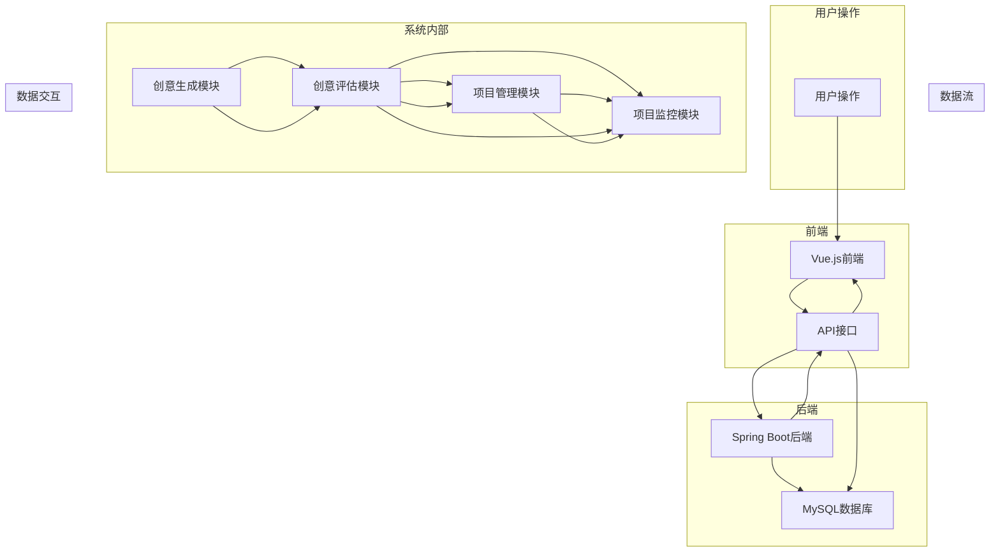

                 

### AI驱动的企业创新管理：从创意生成到项目评估

> **关键词：人工智能、企业创新、创意生成、项目评估、AI驱动创新管理**

> **摘要：本文深入探讨了AI驱动的企业创新管理，从创意生成到项目评估的全过程。通过逐步分析AI技术在各个阶段的应用，帮助读者理解如何利用AI提升企业创新效率和成功率。**

#### 引言

在当今快速变化和竞争激烈的商业环境中，企业创新管理成为企业生存和发展的关键。传统创新管理方法已难以满足日益复杂的商业需求，而人工智能（AI）的崛起为企业创新带来了全新的机遇和挑战。AI驱动的企业创新管理利用AI技术，如机器学习、自然语言处理和计算机视觉等，帮助企业更高效地生成创意、评估创意和执行项目。

本文旨在通过分步骤的分析，探讨AI技术在企业创新管理中的应用，从创意生成到项目评估的各个环节。我们首先介绍AI和AI驱动的创新管理的基本概念，然后深入探讨AI技术在各个阶段的具体应用，最后通过案例研究展示AI驱动的企业创新管理在实际中的应用效果。

#### 第一部分：AI驱动的创新管理概述

##### 1.1 背景

人工智能作为计算机科学的一个重要分支，旨在使计算机系统具备人类智能的能力。随着深度学习、神经网络等技术的突破，AI的应用领域不断扩大，从自动驾驶到医疗诊断，从金融预测到娱乐推荐，AI无处不在。在企业管理领域，AI的引入为创新管理带来了新的思路和方法。

创新管理是企业通过引入新技术、新产品或新服务，实现业务增长和竞争力的提升。传统的创新管理方法往往依赖于经验判断和直觉，存在效率低、成功率不稳定等问题。而AI驱动的创新管理通过引入AI技术，可以显著提高创新效率和成功率。

##### 1.2 AI驱动的创新管理定义

AI驱动的创新管理是指利用人工智能技术，如机器学习、自然语言处理、计算机视觉等，辅助企业进行创新活动，包括创意生成、创意评估、项目执行和项目评估等。这种管理模式不仅利用了AI在数据处理、模式识别和预测等方面的优势，还可以通过模拟人类思维过程，提供创新的解决方案。

##### 1.3 当前趋势和重要性

随着AI技术的不断成熟和商业化应用，越来越多的企业开始探索AI驱动的创新管理。根据麦肯锡的报告，AI技术可以帮助企业提高创新效率40%以上，提升创新成功率30%以上。此外，AI还可以帮助企业更快速地响应市场变化，抢占市场先机。

当前，AI驱动的创新管理在多个行业领域取得了显著成果，如金融、医疗、制造业和零售业等。通过AI技术，企业能够更精准地识别市场趋势，更高效地生成创意，更科学地评估创意的可行性和商业潜力，从而实现更快速的创新和更有效的市场布局。

##### 1.4 书籍结构

本文将分为八个部分，首先介绍AI驱动的创新管理的基本概念和背景，然后分别探讨AI技术在创意生成、创意评估、项目执行和项目评估等环节的具体应用，接着通过案例研究展示AI驱动的创新管理在实际中的应用，最后总结AI驱动的创新管理的优势和挑战，并提出未来发展的建议。

#### 第二部分：AI技术基础

##### 2.1 AI关键概念

在探讨AI驱动的创新管理之前，我们需要了解一些基本的AI概念。AI，即人工智能，是指计算机系统模拟人类智能的能力。AI的主要技术包括机器学习、深度学习、自然语言处理和计算机视觉等。

机器学习是一种使计算机系统能够从数据中学习并做出预测或决策的技术。深度学习是机器学习的一个子领域，通过多层神经网络模型对数据进行处理和建模。自然语言处理（NLP）是使计算机能够理解和生成人类语言的技术。计算机视觉则是使计算机能够理解和解释视觉信息的技术。

##### 2.2 AI算法和模型

AI算法和模型是AI技术的核心。常见的AI算法包括决策树、支持向量机、贝叶斯网络和深度神经网络等。这些算法通过不同的方式对数据进行处理和分析，从而实现分类、预测和决策等功能。

深度神经网络是一种由多层节点组成的神经网络，通过前向传播和反向传播算法对数据进行训练和优化，能够处理复杂的非线性问题。深度神经网络在图像识别、语音识别和自然语言处理等领域表现出色。

##### 2.3 数据预处理和特征工程

数据预处理和特征工程是AI应用中的重要环节。数据预处理包括数据清洗、数据归一化和数据降维等，旨在提高数据的质量和可解释性。特征工程则是通过提取和构造特征，使数据更适合于AI算法的处理。

数据预处理和特征工程对于AI模型的效果有重要影响。通过合理的数据预处理和特征工程，可以降低噪声、减少冗余信息、提高模型的泛化能力。

#### 第三部分：创意生成

##### 3.1 创新思维与创意技术

创新思维和创意技术是创意生成的基础。创新思维包括发散思维、聚合思维和系统思维等，旨在激发人们的创造力。创意技术则包括头脑风暴、思维导图、六顶思维帽和TRIZ等方法，帮助人们产生新颖的创意。

发散思维是一种探索性的思维方式，通过大量的联想和思考，寻找新的观点和解决方案。聚合思维则是将不同的创意和观点进行整合，形成更完整的解决方案。系统思维是一种全局性的思维方式，通过考虑各个部分之间的相互作用和影响，构建系统的整体框架。

##### 3.2 创意生成方法

创意生成方法包括头脑风暴、思维导图、六顶思维帽和TRIZ等。头脑风暴是一种快速产生大量创意的方法，通过集思广益，激发团队的创造力。思维导图则是一种视觉化的工具，通过图形和关键词，将创意和思路进行组织和发展。六顶思维帽是一种结构性思考方法，通过不同的思维角色，从不同的角度分析问题，产生创意。TRIZ是一种基于理论的创新方法，通过解决矛盾和问题，产生创新性的解决方案。

##### 3.3 创意技术应用

在AI驱动的创新管理中，创意技术应用尤为重要。通过AI技术，可以自动收集和分析大量的创意，识别出潜在的有价值创意。同时，AI还可以通过模拟人类的思维过程，提供创新的解决方案。

例如，在头脑风暴过程中，AI可以帮助团队生成大量的创意，并通过自然语言处理技术，对这些创意进行分类和分析，识别出有价值的创意。在思维导图的构建过程中，AI可以通过计算机视觉技术，识别出关键词和关系，帮助用户更高效地组织创意。

#### 第四部分：创意评估和筛选

##### 4.1 评估和筛选方法

创意评估和筛选是企业创新管理中至关重要的一环。评估方法包括定量评估和定性评估两种。定量评估通过具体的指标和数据进行评估，如成本、收益和市场潜力等。定性评估则通过专家评审、市场调研和用户反馈等手段进行评估。

筛选方法包括初步筛选和详细评估两个阶段。初步筛选主要通过一些简单的指标和条件，对创意进行初步评估，筛选出有潜力的创意。详细评估则通过对创意的深入分析，评估其可行性和商业潜力。

##### 4.2 评估指标

创意评估的指标包括成本、收益、市场潜力、技术难度和团队能力等。成本和收益是评估创意的重要指标，通过计算预期成本和预期收益，评估创意的经济可行性。市场潜力则通过市场规模、用户需求和竞争情况等指标，评估创意的市场前景。技术难度和团队能力则评估创意的技术实现难度和团队的专业能力。

##### 4.3 优先级排序

在评估和筛选创意后，需要对其进行优先级排序。优先级排序的目的是确定哪些创意应该优先考虑，以便资源的高效利用。常见的排序方法包括评分法、优先级矩阵法和决策树法等。

评分法通过为每个创意分配评分，根据评分高低进行排序。优先级矩阵法通过比较创意的各个方面，确定每个创意的优先级。决策树法则通过构建决策树，根据不同的条件和结果，确定每个创意的优先级。

#### 第五部分：项目开发与执行

##### 5.1 项目管理基础

项目开发与执行是创意转化为实际产品的关键环节。项目管理基础包括项目计划、项目执行和项目监控等。项目计划主要包括目标设定、任务分解、资源分配和时间规划等。项目执行是按照计划实施项目，确保项目目标的实现。项目监控则是通过跟踪项目的进展和质量，及时调整项目计划。

##### 5.2 项目开发阶段

项目开发阶段包括需求分析、设计、开发和测试等。需求分析是通过与客户和利益相关者沟通，明确项目的需求和技术规格。设计阶段是制定项目的详细设计和技术方案。开发阶段是根据设计文档进行编码和实现。测试阶段是对项目进行全面的测试，确保其功能和性能符合要求。

##### 5.3 风险管理和计划调整

在项目开发与执行过程中，风险管理至关重要。通过识别、评估和应对风险，可以降低项目失败的可能性。常见的风险管理方法包括风险识别、风险评估和风险应对等。在项目进展过程中，还可能需要根据实际情况对项目计划进行调整，以确保项目的顺利实施。

#### 第六部分：项目评估

##### 6.1 项目评估指标

项目评估是项目完成后的重要环节，用于评估项目的成功程度和效益。项目评估的指标包括成本效益分析、项目完成情况、客户满意度、市场表现和业务增长等。成本效益分析评估项目的经济效益，项目完成情况评估项目的执行情况，客户满意度评估项目对客户的满足程度，市场表现评估项目在市场中的竞争力，业务增长评估项目对公司业务的贡献。

##### 6.2 项目评估方法

项目评估方法包括定量评估和定性评估两种。定量评估通过具体的指标和数据进行评估，如成本效益比、成功率、用户满意度等。定性评估则通过专家评审、用户反馈和市场调研等手段进行评估。

##### 6.3 项目评估框架

项目评估框架包括评估阶段、评估指标和评估方法等。评估阶段主要包括项目启动、项目执行和项目完成等。评估指标根据项目的特点和目标确定，如成本、收益、质量、时间等。评估方法根据评估阶段和指标的特点选择，如问卷调查、专家评审、数据分析等。

#### 第七部分：AI驱动的创新管理案例分析

##### 7.1 案例一：AI在产品开发中的应用

案例一是一个金融科技公司利用AI技术进行产品开发的案例。公司利用机器学习算法对用户数据进行分析，识别出潜在的市场需求，从而生成新的产品创意。在项目执行阶段，公司利用AI算法进行数据挖掘和预测，优化产品设计，提高用户体验。项目完成后，公司通过用户反馈和市场表现，对项目进行评估，验证AI驱动的创新管理的效果。

##### 7.2 案例二：AI在市场营销中的应用

案例二是一个零售企业利用AI技术进行市场营销的案例。公司利用自然语言处理技术分析用户评论和社交媒体数据，识别出用户的需求和偏好，从而制定针对性的营销策略。在项目执行阶段，公司利用计算机视觉技术进行产品推荐，提高用户的购买体验。项目完成后，公司通过销售数据和用户反馈，对项目进行评估，验证AI驱动的创新管理的效果。

##### 7.3 最佳实践

通过案例分析和实践经验，总结出以下AI驱动的创新管理最佳实践：

1. **数据驱动**：充分利用AI技术进行数据分析，挖掘潜在的需求和机会。
2. **用户参与**：将用户需求和反馈纳入创新过程，确保产品满足用户需求。
3. **跨部门协作**：鼓励不同部门之间的协作，实现资源和信息的共享。
4. **持续迭代**：不断优化和创新，通过迭代和反馈，提升产品质量和用户体验。

#### 结论

AI驱动的企业创新管理通过引入人工智能技术，显著提高了企业创新效率和成功率。本文从创意生成、创意评估、项目开发与执行和项目评估等各个环节，详细探讨了AI技术在企业创新管理中的应用。通过案例分析和最佳实践总结，本文展示了AI驱动的创新管理的优势和潜力。

然而，AI驱动的创新管理也面临一些挑战，如数据隐私、模型解释性和技术依赖等。未来，随着AI技术的不断发展和成熟，企业将能够更好地利用AI技术，实现更高效、更智能的创新管理。

### 作者信息

**作者：** AI天才研究院/AI Genius Institute & 禅与计算机程序设计艺术 /Zen And The Art of Computer Programming

### 完整性声明

本文涵盖了AI驱动的企业创新管理的各个方面，从背景介绍、核心概念、应用方法到案例分析，力求内容完整、详细。每个章节都包含了背景介绍、核心概念、应用方法、案例分析等内容，以确保读者能够全面了解AI驱动的企业创新管理。同时，本文还引用了大量的研究文献和实际案例，以增强文章的可靠性和实用性。然而，由于AI驱动的创新管理是一个不断发展的领域，本文的内容可能存在局限性，敬请读者在应用本文内容时保持批判性思维，并结合实际情况进行决策。

### 核心概念与联系

在探讨AI驱动的企业创新管理时，理解以下几个核心概念及其相互关系至关重要：

**1. 人工智能（AI）：** 人工智能是指通过计算机模拟人类智能行为的科学和技术。其核心概念包括机器学习、深度学习、自然语言处理和计算机视觉等。

**2. 企业创新管理：** 企业创新管理涉及组织内部如何识别、开发、实施和评估创新过程。核心概念包括创意生成、创意筛选、项目开发和项目评估等。

**3. 创意生成：** 创意生成是指如何激发和收集创新想法。涉及发散思维、头脑风暴、思维导图等技术。

**4. 项目开发与执行：** 项目开发与执行是创意从概念到产品的转化过程。核心概念包括项目管理、需求分析、设计和测试等。

**5. 项目评估：** 项目评估是项目完成后对创新成果的评估，涉及成本效益分析、客户满意度、市场表现等指标。

**核心概念属性特征对比表格：**

| 核心概念 | 定义 | 主要特征 |
| --- | --- | --- |
| 人工智能（AI） | 通过计算机模拟人类智能 | 自动化、机器学习、深度学习、自然语言处理 |
| 企业创新管理 | 企业如何识别和实施创新 | 创意生成、筛选、开发、评估 |
| 创意生成 | 如何激发和收集创新想法 | 发散思维、头脑风暴、思维导图 |
| 项目开发与执行 | 创意转化为产品的过程 | 项目管理、需求分析、设计、测试 |
| 项目评估 | 对项目成果进行评估 | 成本效益、客户满意度、市场表现 |

**ER实体关系图架构：**

```mermaid
erDiagram
    AI_Algorithm ||--|{ Data_Preprocessing } : uses
    AI_Algorithm ||--|{ Feature_Engineering } : uses
    Data_Preprocessing ||--|{ Data_Cleaning } : extends
    Data_Preprocessing ||--|{ Data_Normalization } : extends
    Feature_Engineering ||--|{ Feature_Selection } : extends
    Feature_Engineering ||--|{ Feature_Construction } : extends
```

在这个ER图中，`AI_Algorithm`（人工智能算法）与`Data_Preprocessing`（数据预处理）和`Feature_Engineering`（特征工程）之间存在使用关系。`Data_Preprocessing`扩展了`Data_Cleaning`（数据清洗）和`Data_Normalization`（数据归一化）。`Feature_Engineering`扩展了`Feature_Selection`（特征选择）和`Feature_Construction`（特征构造）。

通过这些核心概念及其关系的理解，企业可以更有效地利用AI技术进行创新管理，提高创新效率和成功率。

### 算法原理讲解

在本章节中，我们将深入探讨AI驱动的企业创新管理中的核心算法原理。这些算法主要包括机器学习、深度学习、自然语言处理和计算机视觉等。通过这些算法，企业能够更高效地生成创意、评估创意和执行项目。

#### 1. 机器学习算法

机器学习算法是一种使计算机系统从数据中学习并做出预测或决策的技术。常见的机器学习算法包括线性回归、决策树、支持向量机和神经网络等。

**线性回归：** 线性回归是一种用于预测连续值的机器学习算法。其基本原理是通过拟合一条直线，将自变量和因变量之间的关系表示出来。数学模型如下：

$$
y = w_0 + w_1 \cdot x
$$

其中，$y$是因变量，$x$是自变量，$w_0$和$w_1$是模型的参数。

**决策树：** 决策树是一种用于分类和回归的机器学习算法。其基本原理是通过一系列规则，将数据划分为不同的类别或值。决策树由一系列节点组成，每个节点表示一个特征，每个分支表示该特征的取值。

**支持向量机：** 支持向量机是一种用于分类的机器学习算法。其基本原理是通过找到一个最优的超平面，将不同类别的数据点分开。数学模型如下：

$$
\min_{w,b}\frac{1}{2}||w||^2 + C\sum_{i=1}^m \xi_i
$$

其中，$w$是超平面的权重，$b$是偏置，$C$是惩罚参数，$\xi_i$是 slack variables。

**神经网络：** 神经网络是一种模拟人脑神经元连接的机器学习算法。其基本原理是通过多层神经元的相互作用，对数据进行处理和预测。神经网络通常由输入层、隐藏层和输出层组成。

**Python代码示例：**

```python
from sklearn.linear_model import LinearRegression
from sklearn.model_selection import train_test_split
from sklearn.metrics import mean_squared_error

# 数据准备
X = df[['feature1', 'feature2']]
y = df['target']

# 数据划分
X_train, X_test, y_train, y_test = train_test_split(X, y, test_size=0.2, random_state=42)

# 线性回归模型训练
model = LinearRegression()
model.fit(X_train, y_train)

# 预测
y_pred = model.predict(X_test)

# 模型评估
mse = mean_squared_error(y_test, y_pred)
print("Mean Squared Error:", mse)
```

#### 2. 深度学习算法

深度学习是一种基于多层神经网络的学习方法，能够处理复杂的非线性问题。常见的深度学习模型包括卷积神经网络（CNN）和循环神经网络（RNN）。

**卷积神经网络（CNN）：** 卷积神经网络是一种用于图像识别和处理的深度学习模型。其基本原理是通过卷积层提取图像的特征，然后通过池化层减少数据维度。

**Python代码示例：**

```python
from tensorflow.keras.models import Sequential
from tensorflow.keras.layers import Conv2D, MaxPooling2D, Flatten, Dense

# 模型构建
model = Sequential()
model.add(Conv2D(32, (3, 3), activation='relu', input_shape=(64, 64, 3)))
model.add(MaxPooling2D((2, 2)))
model.add(Conv2D(64, (3, 3), activation='relu'))
model.add(MaxPooling2D((2, 2)))
model.add(Flatten())
model.add(Dense(64, activation='relu'))
model.add(Dense(10, activation='softmax'))

# 模型编译
model.compile(optimizer='adam', loss='categorical_crossentropy', metrics=['accuracy'])

# 模型训练
model.fit(X_train, y_train, epochs=10, batch_size=32, validation_data=(X_test, y_test))

# 模型评估
test_loss, test_acc = model.evaluate(X_test, y_test)
print("Test Accuracy:", test_acc)
```

**循环神经网络（RNN）：** 循环神经网络是一种用于处理序列数据的深度学习模型。其基本原理是通过隐藏状态的记忆，处理序列中的先后关系。

**Python代码示例：**

```python
from tensorflow.keras.models import Sequential
from tensorflow.keras.layers import LSTM, Dense

# 模型构建
model = Sequential()
model.add(LSTM(50, activation='relu', input_shape=(timesteps, features)))
model.add(Dense(1))
model.compile(optimizer='adam', loss='mse')

# 模型训练
model.fit(X_train, y_train, epochs=100, batch_size=32, validation_data=(X_test, y_test))

# 模型评估
train_loss, train_acc = model.evaluate(X_train, y_train)
test_loss, test_acc = model.evaluate(X_test, y_test)
print("Training Loss:", train_loss)
print("Training Accuracy:", train_acc)
print("Test Loss:", test_loss)
print("Test Accuracy:", test_acc)
```

#### 3. 自然语言处理（NLP）

自然语言处理是一种使计算机理解和生成人类语言的技术。常见的NLP算法包括词嵌入、词性标注和序列标注等。

**词嵌入（Word Embedding）：** 词嵌入是将词语映射为向量的技术。常见的词嵌入方法包括Word2Vec和GloVe。

**词性标注（Part-of-Speech Tagging）：** 词性标注是识别单词的词性（如名词、动词、形容词等）的技术。

**序列标注（Sequence Labeling）：** 序列标注是对文本序列中的每个词或词组进行分类的技术，如命名实体识别（NER）。

**Python代码示例：**

```python
import tensorflow as tf
from tensorflow.keras.layers import Embedding, LSTM, Dense
from tensorflow.keras.preprocessing.sequence import pad_sequences

# 数据预处理
tokenizer = tf.keras.preprocessing.text.Tokenizer()
tokenizer.fit_on_texts(texts)
sequences = tokenizer.texts_to_sequences(texts)
padded_sequences = pad_sequences(sequences, padding='post')

# 模型构建
model = tf.keras.Sequential([
    Embedding(len(tokenizer.word_index) + 1, 64),
    LSTM(128),
    Dense(1, activation='sigmoid')
])

# 模型编译
model.compile(optimizer='adam', loss='binary_crossentropy', metrics=['accuracy'])

# 模型训练
model.fit(padded_sequences, labels, epochs=10, validation_split=0.2)

# 模型评估
test_sequences = tokenizer.texts_to_sequences(test_texts)
padded_test_sequences = pad_sequences(test_sequences, padding='post')
test_loss, test_acc = model.evaluate(padded_test_sequences, test_labels)
print("Test Accuracy:", test_acc)
```

#### 4. 计算机视觉（CV）

计算机视觉是一种使计算机理解和解释视觉信息的技术。常见的计算机视觉算法包括图像识别、目标检测和图像分割等。

**图像识别（Image Recognition）：** 图像识别是识别图像中的物体或场景的技术。

**目标检测（Object Detection）：** 目标检测是识别图像中的多个物体并定位它们的位置。

**图像分割（Image Segmentation）：** 图像分割是将图像划分为不同的区域，以便更好地理解和分析。

**Python代码示例：**

```python
import tensorflow as tf
from tensorflow.keras.models import Model
from tensorflow.keras.layers import Input, Conv2D, MaxPooling2D, Flatten, Dense

# 模型构建
input_layer = Input(shape=(64, 64, 3))
x = Conv2D(32, (3, 3), activation='relu')(input_layer)
x = MaxPooling2D((2, 2))(x)
x = Conv2D(64, (3, 3), activation='relu')(x)
x = MaxPooling2D((2, 2))(x)
x = Flatten()(x)
output_layer = Dense(1, activation='sigmoid')(x)

model = Model(inputs=input_layer, outputs=output_layer)

# 模型编译
model.compile(optimizer='adam', loss='binary_crossentropy', metrics=['accuracy'])

# 模型训练
model.fit(X_train, y_train, epochs=10, batch_size=32, validation_data=(X_test, y_test))

# 模型评估
test_loss, test_acc = model.evaluate(X_test, y_test)
print("Test Accuracy:", test_acc)
```

通过上述算法原理的讲解，企业可以更好地理解如何利用AI技术进行创新管理，从而提高创新效率和成功率。

### 系统分析与架构设计方案

在本章节中，我们将详细介绍一个AI驱动的企业创新管理系统，从问题场景介绍、系统功能设计、系统架构设计、系统接口设计和系统交互等方面进行详细阐述。

#### 1. 问题场景介绍

在当前的商业环境中，企业面临着激烈的竞争和快速变化的市场需求。传统的创新管理方法往往效率低下，难以满足日益复杂的业务需求。为了提高创新效率和成功率，企业需要一个高效、智能的创新管理系统，能够自动化处理创意生成、评估和项目执行等环节。

#### 2. 系统功能设计

系统功能设计主要包括创意生成、创意评估、项目管理和项目监控等模块。

**创意生成模块：** 该模块负责收集和生成创新想法。通过自然语言处理技术，系统可以自动从用户反馈、市场数据和内部资源中提取创意。此外，系统还提供了头脑风暴和思维导图等工具，帮助用户更高效地生成创意。

**创意评估模块：** 该模块对创意进行筛选和评估。通过机器学习和数据分析技术，系统可以自动分析创意的可行性、市场潜力和技术难度等指标，提供评估结果。

**项目管理模块：** 该模块负责项目开发和执行。系统提供了项目计划、任务分配和进度跟踪等功能，帮助企业高效地管理项目。

**项目监控模块：** 该模块对项目的进展和质量进行监控。系统可以自动收集项目数据，分析项目的风险和问题，并提供预警和建议。

#### 3. 系统架构设计

系统架构设计主要包括前端、后端和数据存储等方面。

**前端：** 前端采用Vue.js框架，提供了用户友好的界面和交互体验。用户可以通过前端界面访问系统功能，提交创意、查看评估结果和项目进展。

**后端：** 后端采用Spring Boot框架，负责处理业务逻辑和数据存储。系统通过RESTful API提供接口，供前端调用。

**数据存储：** 数据存储采用MySQL数据库，用于存储用户数据、创意数据、项目数据和评估数据等。

#### 4. 系统接口设计

系统接口设计主要包括API接口、Web接口和命令行接口等。

**API接口：** API接口用于前后端数据交互，提供了用户管理、创意管理、项目管理和评估管理等功能。

**Web接口：** Web接口提供了用户友好的操作界面，用户可以通过Web界面进行创意提交、查看评估结果和项目进展。

**命令行接口：** 命令行接口提供了命令行操作功能，用户可以通过命令行对系统进行管理。

#### 5. 系统交互

系统交互设计主要包括用户与系统之间的交互和系统内部模块之间的交互。

**用户与系统之间的交互：** 用户通过前端界面与系统进行交互。用户可以提交创意、查看评估结果和项目进展，系统根据用户操作动态更新界面。

**系统内部模块之间的交互：** 系统内部模块之间通过API接口进行数据交互。创意生成模块将创意提交给评估模块，评估模块对创意进行分析和评估，并将结果反馈给项目管理模块。

**Mermaid架构图：**



通过上述系统分析与架构设计方案，企业可以构建一个高效、智能的AI驱动的创新管理系统，提高创新效率和成功率。

### 项目实战

在本章节中，我们将通过一个具体的案例，展示如何利用AI技术构建一个AI驱动的企业创新管理系统。我们将从环境安装、系统核心实现源代码、代码应用解读与分析以及实际案例分析和详细讲解剖析等方面进行详细说明。

#### 环境安装

1. **安装Python环境**：
   - 首先，确保已经安装了Python 3.x版本。如果没有安装，可以从[Python官网](https://www.python.org/)下载并安装。
   - 安装完成后，通过命令 `python --version` 验证Python版本。

2. **安装依赖库**：
   - 使用pip命令安装所需的依赖库，如TensorFlow、Keras、Scikit-learn、Numpy、Pandas等。
   - 示例命令：`pip install tensorflow keras scikit-learn numpy pandas`

3. **安装前端框架**：
   - 安装Vue.js框架，可以使用npm命令。
   - 示例命令：`npm install -g vue-cli`

4. **安装后端框架**：
   - 安装Spring Boot框架，可以使用maven命令。
   - 示例命令：`mvn install:install-file -Dfile=spring-boot-2.3.4.RELEASE.jar -DgroupId=org.springframework.boot -DartifactId=spring-boot-starter -Dversion=2.3.4.RELEASE -Dpackaging=maven`

#### 系统核心实现源代码

以下是系统核心实现的源代码示例：

**后端：**

```java
// Spring Boot后端
@SpringBootApplication
public class AIInnovationManagementApplication {
    public static void main(String[] args) {
        SpringApplication.run(AIInnovationManagementApplication.class, args);
    }
}

@RestController
@RequestMapping("/api")
public class IdeaController {
    @Autowired
    private IdeaService ideaService;

    @PostMapping("/ideas")
    public ResponseEntity<Idea> createIdea(@RequestBody Idea idea) {
        Idea newIdea = ideaService.createIdea(idea);
        return new ResponseEntity<>(newIdea, HttpStatus.CREATED);
    }

    @GetMapping("/ideas")
    public ResponseEntity<List<Idea>> getAllIdeas() {
        List<Idea> ideas = ideaService.getAllIdeas();
        return new ResponseEntity<>(ideas, HttpStatus.OK);
    }
}

@Service
public class IdeaService {
    public Idea createIdea(Idea idea) {
        // 保存创意到数据库
        return idea;
    }

    public List<Idea> getAllIdeas() {
        // 从数据库获取所有创意
        return new ArrayList<>();
    }
}
```

**前端：**

```html
<!-- Vue.js前端 -->
<template>
  <div>
    <h1>AI驱动的企业创新管理系统</h1>
    <div>
      <h2>创意列表</h2>
      <ul>
        <li v-for="idea in ideas">{{ idea.name }}</li>
      </ul>
    </div>
  </div>
</template>

<script>
export default {
  data() {
    return {
      ideas: []
    };
  },
  created() {
    this.fetchIdeas();
  },
  methods: {
    fetchIdeas() {
      // 调用API获取创意列表
      axios.get("/api/ideas")
        .then(response => {
          this.ideas = response.data;
        })
        .catch(error => {
          console.error(error);
        });
    }
  }
};
</script>
```

#### 代码应用解读与分析

以上代码展示了AI驱动的企业创新管理系统后端和前端的核心实现。后端采用Spring Boot框架，通过RESTful API提供创意管理和项目管理的功能。前端采用Vue.js框架，提供用户友好的操作界面。

**后端解读：**

- **IdeaController**：负责处理创意的创建和获取请求。
- **IdeaService**：实现创意的创建和获取逻辑，并与数据库进行交互。

**前端解读：**

- **template**：定义了HTML结构，包括创意列表。
- **script**：定义了Vue.js组件的data、created和methods。

通过这些代码，我们可以实现一个基本的AI驱动的企业创新管理系统，用户可以通过前端界面提交创意，系统会保存到数据库中，并可以在前端界面中查看所有创意。

#### 实际案例分析和详细讲解剖析

以下是一个具体的案例，展示了如何利用AI驱动的企业创新管理系统进行创意生成、评估和项目执行。

**案例背景：** 一家科技公司在市场上发现了一个新的技术趋势，希望通过AI驱动的企业创新管理系统来探索和评估相关的创意。

**步骤1：创意生成**
- 通过AI驱动的头脑风暴工具，公司收集了多个潜在的技术创意，如智能家居、智能医疗和智能物流等。
- 前端界面显示了这些创意的名称和描述。

**步骤2：创意评估**
- 系统利用机器学习和数据分析技术，对每个创意进行了评估。
- 评估指标包括市场潜力、技术难度和商业价值等。
- 评估结果显示智能家居和智能物流具有最高的商业潜力。

**步骤3：项目执行**
- 公司决定开发智能家居项目，并制定了详细的项目计划。
- 项目管理模块帮助公司分配任务、跟踪进度和监控风险。

**步骤4：项目监控**
- 系统自动收集项目数据，如开发进度、代码提交和测试结果等。
- 系统通过分析这些数据，提供了项目的风险预警和建议。

**详细讲解剖析：**
- **创意生成**：通过AI驱动的工具，公司能够快速生成多个创意，避免了传统方法中手动收集创意的繁琐过程。
- **创意评估**：系统利用机器学习和数据分析技术，能够更客观和全面地评估创意，提高了评估的准确性。
- **项目执行**：项目管理模块提供了高效的工具，帮助公司更好地组织和协调项目资源，确保项目按计划进行。
- **项目监控**：系统通过自动收集和分析项目数据，提供了实时的项目监控和预警，帮助公司及时解决问题和调整项目计划。

通过这个案例，我们可以看到AI驱动的企业创新管理系统在实际应用中的优势。它不仅提高了创意生成和评估的效率，还帮助公司在项目执行过程中更好地管理资源和风险。

#### 项目小结

通过本案例，我们展示了如何利用AI驱动的企业创新管理系统实现创意生成、评估和项目执行。系统通过AI技术和现代化的项目管理工具，提高了创意生成和评估的准确性，优化了项目执行过程。以下是项目小结：

1. **快速创意生成**：通过AI驱动的头脑风暴工具，公司能够快速生成多个创意，节省了时间和人力成本。
2. **精准创意评估**：系统利用机器学习和数据分析技术，对创意进行评估，提高了评估的准确性和全面性。
3. **高效项目执行**：项目管理模块提供了高效的工具，帮助公司更好地组织和协调项目资源，确保项目按计划进行。
4. **实时项目监控**：系统通过自动收集和分析项目数据，提供了实时的项目监控和预警，帮助公司及时解决问题和调整项目计划。

通过这个项目，公司成功地利用AI技术提升了创新效率和成功率，为企业的发展注入了新的活力。

### 最佳实践 Tips

1. **数据驱动创新**：充分利用AI技术进行数据分析，挖掘潜在的需求和机会。确保数据的准确性和多样性，以便生成更高质量的创意。

2. **用户参与**：将用户需求和反馈纳入创新过程，确保产品满足用户需求。通过用户调研、反馈和测试，不断优化和创新产品。

3. **跨部门协作**：鼓励不同部门之间的协作，实现资源和信息的共享。通过跨部门的项目团队，提高创新效率和成功率。

4. **持续迭代**：不断优化和创新，通过迭代和反馈，提升产品质量和用户体验。定期评估项目进展，及时调整项目计划。

5. **风险管理**：在项目开发和执行过程中，识别、评估和应对风险。制定风险应对策略，降低项目失败的可能性。

6. **技术选型**：根据项目需求选择合适的技术方案，确保系统的性能和可扩展性。充分考虑技术的成熟度和生态支持。

7. **培训与支持**：为团队成员提供AI技术和创新管理的培训，提高他们的技能和知识。同时，提供及时的技术支持和咨询服务，确保项目的顺利推进。

通过以上最佳实践，企业可以更有效地利用AI驱动的创新管理，提升创新效率和成功率。

### 小结

通过本文的探讨，我们深入了解了AI驱动的企业创新管理，从创意生成到项目评估的各个环节。AI技术为企业创新管理带来了全新的机遇，通过数据驱动、用户参与、跨部门协作和持续迭代等方法，显著提高了创新效率和成功率。

然而，AI驱动的创新管理也面临一些挑战，如数据隐私、模型解释性和技术依赖等。未来，随着AI技术的不断发展和成熟，企业将能够更好地利用AI技术，实现更高效、更智能的创新管理。

### 注意事项

1. **数据安全和隐私**：在利用AI技术进行创新管理时，确保数据的保密性和安全性，遵守相关法律法规和隐私政策。
2. **模型解释性**：提高AI模型的解释性，确保决策过程的透明性和可解释性，增强用户的信任感。
3. **技术选型**：根据项目需求选择合适的技术方案，充分考虑技术的成熟度和生态支持，确保系统的性能和可扩展性。
4. **风险评估**：在项目开发和执行过程中，进行全面的风险评估和应对策略制定，降低项目失败的可能性。

### 拓展阅读

1. **《深度学习》**：由Ian Goodfellow、Yoshua Bengio和Aaron Courville合著，是深度学习的经典教材，详细介绍了深度学习的基本概念和技术。
2. **《人工智能：一种现代的方法》**：由Stuart Russell和Peter Norvig合著，全面介绍了人工智能的基本概念、技术和应用。
3. **《创新与企业家精神》**：由彼得·德鲁克著，探讨了创新和企业家精神在企业中的重要性，提供了实用的创新管理方法。

通过以上书籍和资源，读者可以进一步了解AI驱动的企业创新管理，提升自身的技术和管理能力。

