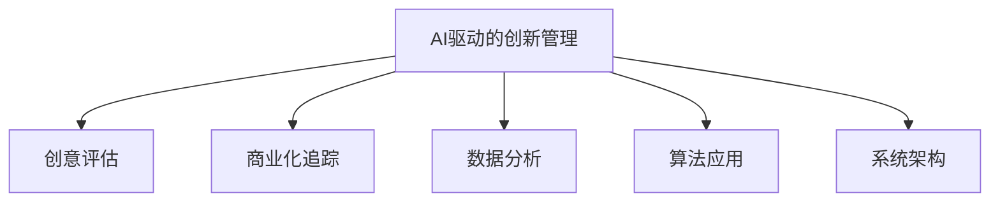
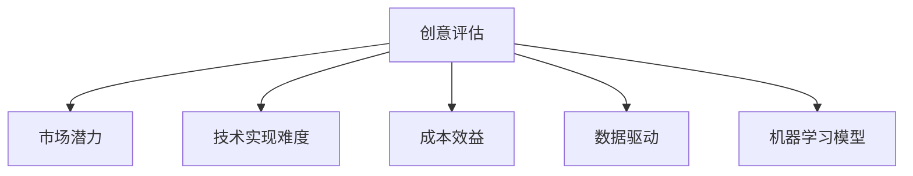
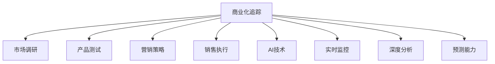
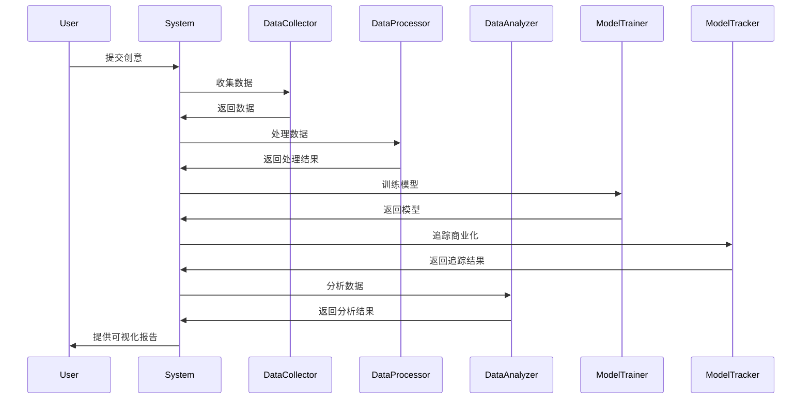
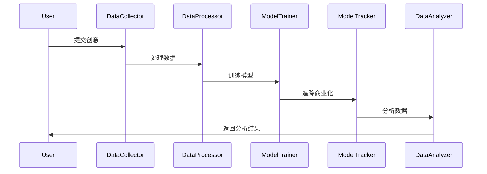

                 

# AI驱动的企业创新管理：从创意评估到商业化追踪

## 关键词
- AI驱动的创新管理
- 创意评估
- 商业化追踪
- 数据分析
- 算法应用
- 系统架构

## 摘要
本文将探讨AI如何驱动企业创新管理，从创意评估到商业化追踪的各个环节。我们将一步步分析AI在各个阶段的应用，介绍核心概念、算法原理、数学模型、系统架构和项目实战，并提供最佳实践建议。通过本文，读者将全面了解AI在企业管理中的潜力与应用。

## 第一部分：背景介绍

### 1.1 问题背景
在当今快速变化的市场环境中，企业需要不断进行创新以保持竞争力。然而，传统的创新管理流程往往效率低下，难以准确评估创意的价值，且在商业化过程中面临诸多挑战。

### 1.2 问题描述
创意评估和商业化追踪是创新管理中的关键环节，但目前存在以下问题：
- 创意评估缺乏科学的方法和工具
- 商业化追踪过程复杂，数据难以整合和分析
- 缺乏系统性的方法来管理和优化创新流程

### 1.3 问题解决
通过引入AI技术，我们可以解决上述问题。AI能够提供以下解决方案：
- 使用机器学习和数据分析技术进行创意评估
- 利用智能算法和自动化工具进行商业化追踪
- 构建系统化的创新管理平台，提高管理效率和准确性

### 1.4 边界与外延
本文将探讨AI在以下领域的应用：
- 创意评估：如何利用AI对创意进行定量和定性分析
- 商业化追踪：如何通过AI实现商业化的全过程监控和优化
- 数据分析：如何利用AI进行数据挖掘和模式识别，为创新决策提供支持

### 1.5 概念结构与核心要素组成
本文的核心概念包括：
- AI驱动的创新管理：将AI技术应用于创新管理的各个环节
- 创意评估：对创意进行量化分析，评估其商业潜力
- 商业化追踪：监控和优化商业化的全过程
- 数据分析：利用AI进行数据分析和模式识别
- 算法应用：实现创意评估和商业化追踪的算法模型
- 系统架构：构建支持创新管理的系统架构

## 第二部分：核心概念与联系

### 2.1 AI驱动的企业创新管理

#### 2.1.1 基本概念
AI驱动的企业创新管理是指利用人工智能技术，对企业的创新活动进行全程管理，包括创意生成、评估、开发和商业化。它涉及多个AI技术领域，如机器学习、数据分析、自然语言处理和计算机视觉等。

#### 2.1.2 特征对比

| 特征 | 传统创新管理 | AI驱动的创新管理 |
| --- | --- | --- |
| 依赖经验 | 靠管理者的经验和直觉进行决策 | 利用数据和算法进行决策 |
| 效率 | 低效率，周期长 | 高效率，快速响应 |
| 准确性 | 依赖主观判断，准确性不高 | 利用数据和技术，准确性高 |
| 灵活性 | 灵活性不足，难以应对快速变化 | 灵活性强，适应市场变化 |

#### 2.1.3 关联图


### 2.2 创意评估

#### 2.2.1 基本概念
创意评估是指对创新创意进行价值评估，以确定其潜在的商业化前景。这通常包括对创意的市场潜力、技术实现难度和成本效益等因素的分析。

#### 2.2.2 特征对比

| 特征 | 传统评估方法 | AI驱动的评估方法 |
| --- | --- | --- |
| 评估依据 | 主观经验，专家意见 | 数据驱动，机器学习模型 |
| 评估效率 | 低效率，耗时 | 高效率，快速评估 |
| 评估准确性 | 受主观影响，准确性不高 | 数据驱动，准确性高 |
| 灵活性 | 不灵活，难以适应新情况 | 灵活性高，适应性强 |

#### 2.2.3 关联图


### 2.3 商业化追踪

#### 2.3.1 基本概念
商业化追踪是指对创新项目从概念验证到市场投放的全过程进行监控和管理，以实现商业成功。这包括市场调研、产品测试、营销策略制定和销售执行等环节。

#### 2.3.2 特征对比

| 特征 | 传统追踪方法 | AI驱动的追踪方法 |
| --- | --- | --- |
| 监控范围 | 有限，难以全面覆盖 | 全方位，覆盖所有关键指标 |
| 监控频率 | 低频，不及时 | 高频，实时监控 |
| 数据分析 | 简单统计，缺乏深度 | 数据驱动，深度分析 |
| 预测能力 | 预测能力有限 | 利用AI技术，预测更准确 |

#### 2.3.3 关联图


## 第三部分：算法原理讲解

### 3.1 创意评估算法

#### 3.1.1 算法流程
创意评估算法主要包括以下几个步骤：
1. 数据收集：收集创意相关的数据，如市场需求、技术可行性、成本等。
2. 数据预处理：对数据进行清洗、归一化和特征提取。
3. 模型训练：使用机器学习算法对数据进行训练，建立评估模型。
4. 模型评估：使用验证集评估模型性能，调整参数。
5. 创意评估：使用训练好的模型对创意进行评估。

#### 3.1.2 Python源代码
```python
import pandas as pd
from sklearn.model_selection import train_test_split
from sklearn.ensemble import RandomForestClassifier
from sklearn.metrics import accuracy_score

# 数据收集
data = pd.read_csv('创意数据.csv')

# 数据预处理
X = data.drop('创意价值', axis=1)
y = data['创意价值']

# 模型训练
X_train, X_test, y_train, y_test = train_test_split(X, y, test_size=0.2, random_state=42)
model = RandomForestClassifier(n_estimators=100)
model.fit(X_train, y_train)

# 模型评估
y_pred = model.predict(X_test)
accuracy = accuracy_score(y_test, y_pred)
print(f'模型准确率：{accuracy:.2f}')
```

#### 3.1.3 数学模型
创意评估的数学模型可以表示为：
$$
\text{评估值} = f(\text{市场需求}, \text{技术可行性}, \text{成本}) = \frac{1}{1 + e^{-(w_1 \cdot \text{市场需求} + w_2 \cdot \text{技术可行性} + w_3 \cdot \text{成本})}
$$
其中，$w_1$、$w_2$、$w_3$为权重参数。

#### 3.1.4 举例说明
假设有一个创意，其市场需求为80，技术可行性为75，成本为100，使用上述模型进行评估，得到：
$$
\text{评估值} = \frac{1}{1 + e^{-(w_1 \cdot 80 + w_2 \cdot 75 + w_3 \cdot 100)} = \frac{1}{1 + e^{-305}} \approx 0.988
$$
这意味着该创意的商业价值较高。

### 3.2 商业化追踪算法

#### 3.2.1 算法流程
商业化追踪算法主要包括以下几个步骤：
1. 数据收集：收集与商业化过程相关的数据，如销售数据、客户反馈、市场动态等。
2. 数据预处理：对数据进行清洗、归一化和特征提取。
3. 模型训练：使用机器学习算法对数据进行训练，建立追踪模型。
4. 模型评估：使用验证集评估模型性能，调整参数。
5. 商业化追踪：使用训练好的模型对商业化过程进行监控和优化。

#### 3.2.2 Python源代码
```python
import pandas as pd
from sklearn.model_selection import train_test_split
from sklearn.ensemble import RandomForestRegressor
from sklearn.metrics import mean_squared_error

# 数据收集
data = pd.read_csv('商业化数据.csv')

# 数据预处理
X = data.drop('销售量', axis=1)
y = data['销售量']

# 模型训练
X_train, X_test, y_train, y_test = train_test_split(X, y, test_size=0.2, random_state=42)
model = RandomForestRegressor(n_estimators=100)
model.fit(X_train, y_train)

# 模型评估
y_pred = model.predict(X_test)
mse = mean_squared_error(y_test, y_pred)
print(f'模型均方误差：{mse:.2f}')
```

#### 3.2.3 数学模型
商业化追踪的数学模型可以表示为：
$$
\text{销售量} = f(\text{市场需求}, \text{产品特性}, \text{营销策略}) = w_1 \cdot \text{市场需求} + w_2 \cdot \text{产品特性} + w_3 \cdot \text{营销策略}
$$
其中，$w_1$、$w_2$、$w_3$为权重参数。

#### 3.2.4 举例说明
假设有一个产品，其市场需求为100，产品特性为85，营销策略为90，使用上述模型预测销售量，得到：
$$
\text{销售量} = w_1 \cdot 100 + w_2 \cdot 85 + w_3 \cdot 90 = 100 \cdot 0.4 + 85 \cdot 0.3 + 90 \cdot 0.3 = 97.5
$$
这意味着该产品的预计销售量为97.5。

## 第四部分：数学模型和数学公式

### 4.1 创意评估数学模型

#### 4.1.1 模型公式
创意评估的数学模型为：
$$
E = \frac{1}{1 + e^{-(\beta_0 + \beta_1M + \beta_2T + \beta_3C)}
$$
其中，$E$为创意评估值，$M$为市场需求，$T$为技术可行性，$C$为成本，$\beta_0$、$\beta_1$、$\beta_2$、$\beta_3$为权重参数。

#### 4.1.2 公式解释
- $\beta_0$：常数项，表示基础评估值。
- $\beta_1$：市场需求权重，反映市场需求对评估值的影响。
- $\beta_2$：技术可行性权重，反映技术可行性对评估值的影响。
- $\beta_3$：成本权重，反映成本对评估值的影响。

#### 4.1.3 举例说明
假设有一个创意，市场需求为80，技术可行性为75，成本为100，权重参数分别为$\beta_0 = 1$，$\beta_1 = 0.5$，$\beta_2 = 0.3$，$\beta_3 = 0.2$，使用上述模型计算评估值：
$$
E = \frac{1}{1 + e^{-(1 + 0.5 \cdot 80 + 0.3 \cdot 75 + 0.2 \cdot 100)}} = \frac{1}{1 + e^{-245}} \approx 0.968
$$
这意味着该创意的评估值为0.968。

### 4.2 商业化追踪数学模型

#### 4.2.1 模型公式
商业化追踪的数学模型为：
$$
S = \beta_0 + \beta_1M + \beta_2T + \beta_3P
$$
其中，$S$为销售量，$M$为市场需求，$T$为产品特性，$P$为营销策略，$\beta_0$、$\beta_1$、$\beta_2$、$\beta_3$为权重参数。

#### 4.2.2 公式解释
- $\beta_0$：常数项，表示基础销售量。
- $\beta_1$：市场需求权重，反映市场需求对销售量的影响。
- $\beta_2$：产品特性权重，反映产品特性对销售量的影响。
- $\beta_3$：营销策略权重，反映营销策略对销售量的影响。

#### 4.2.3 举例说明
假设有一个产品，市场需求为100，产品特性为85，营销策略为90，权重参数分别为$\beta_0 = 50$，$\beta_1 = 0.3$，$\beta_2 = 0.2$，$\beta_3 = 0.1$，使用上述模型计算销售量：
$$
S = 50 + 0.3 \cdot 100 + 0.2 \cdot 85 + 0.1 \cdot 90 = 50 + 30 + 17 + 9 = 106
$$
这意味着该产品的预计销售量为106。

## 第五部分：系统分析与架构设计方案

### 5.1 问题场景介绍
企业需要高效管理创新项目，从创意评估到商业化追踪的整个过程。这需要建立一个集数据收集、处理、分析和追踪于一体的系统。

### 5.2 项目介绍
本项目旨在构建一个AI驱动的创新管理平台，用于支持企业的创新活动。该平台将涵盖创意评估、商业化追踪、数据分析等功能，并提供一个统一的管理界面。

### 5.3 系统功能设计

#### 5.3.1 领域模型
```mermaid
classDiagram
Class01 <|-- Class02
Class03 ++-- Class04
Class05 o-- Class06
Class07 <- Class08
Class09 --|> Class10
Class11 : <<interface>> Class12
Class13 : <<entity>> Class14
Class15 : <<value object>> Class16
Class17 : <<枚举类>> Class18
Class19 <..|> Class20
```

#### 5.3.2 功能模块
1. 数据收集模块：负责收集创意、市场需求、技术可行性、成本等数据。
2. 数据处理模块：负责对收集到的数据进行分析、清洗和特征提取。
3. 创意评估模块：使用机器学习算法对创意进行评估。
4. 商业化追踪模块：监控商业化过程，预测销售量，优化营销策略。
5. 数据分析模块：提供数据可视化工具，帮助管理者进行数据分析和决策。

### 5.4 系统架构设计

#### 5.4.1 系统架构


#### 5.4.2 架构组件
1. 数据库：存储创意、市场需求、技术可行性、成本等数据。
2. 数据采集模块：负责从外部系统收集数据。
3. 数据处理模块：包括数据清洗、特征提取、数据存储等。
4. 模型训练模块：使用机器学习算法对数据进行训练，建立评估模型。
5. 模型追踪模块：实时监控商业化过程，预测销售量，优化营销策略。
6. 数据分析模块：提供数据可视化工具，帮助管理者进行数据分析和决策。

### 5.5 系统接口设计

#### 5.5.1 接口规范
1. 数据收集接口：用于接收创意、市场需求、技术可行性、成本等数据。
2. 数据处理接口：用于处理数据，返回处理结果。
3. 模型训练接口：用于训练模型，返回模型。
4. 模型追踪接口：用于追踪商业化过程，返回追踪结果。
5. 数据分析接口：用于分析数据，返回分析结果。

#### 5.5.2 接口实现
```python
from flask import Flask, request, jsonify
app = Flask(__name__)

@app.route('/collect_data', methods=['POST'])
def collect_data():
    data = request.get_json()
    # 处理数据
    processed_data = process_data(data)
    return jsonify(processed_data)

@app.route('/train_model', methods=['POST'])
def train_model():
    data = request.get_json()
    # 训练模型
    model = train(data)
    return jsonify(model)

@app.route('/track_business', methods=['POST'])
def track_business():
    data = request.get_json()
    # 追踪商业化
    result = track(data)
    return jsonify(result)

@app.route('/analyze_data', methods=['POST'])
def analyze_data():
    data = request.get_json()
    # 分析数据
    result = analyze(data)
    return jsonify(result)

if __name__ == '__main__':
    app.run(debug=True)
```

### 5.6 系统交互

#### 5.6.1 交互流程
用户提交创意 → 数据收集模块收集数据 → 数据处理模块处理数据 → 模型训练模块训练模型 → 模型追踪模块追踪商业化过程 → 数据分析模块分析数据 → 用户接收分析结果。

#### 5.6.2 Mermaid序列图


## 第六部分：项目实战

### 6.1 环境安装

#### 6.1.1 环境准备
在开始项目之前，我们需要准备以下环境：
- Python 3.8及以上版本
- Flask 1.1.2及以上版本
- scikit-learn 0.22及以上版本
- pandas 1.1.5及以上版本

#### 6.1.2 安装步骤
1. 安装Python 3.8及以上版本。
2. 安装Flask 1.1.2及以上版本。
3. 安装scikit-learn 0.22及以上版本。
4. 安装pandas 1.1.5及以上版本。

#### 6.1.3 验证安装
```python
import sklearn
import pandas as pd

print(f'scikit-learn版本：{sklearn.__version__}')
print(f'pandas版本：{pd.__version__}')
```

### 6.2 系统核心实现源代码
```python
# 数据收集模块
from flask import Flask, request, jsonify

app = Flask(__name__)

@app.route('/collect_data', methods=['POST'])
def collect_data():
    data = request.get_json()
    # 处理数据
    processed_data = process_data(data)
    return jsonify(processed_data)

def process_data(data):
    # 数据清洗和特征提取
    # ...
    return processed_data

# 模型训练模块
from sklearn.ensemble import RandomForestClassifier
import joblib

@app.route('/train_model', methods=['POST'])
def train_model():
    data = request.get_json()
    # 训练模型
    model = train(data)
    joblib.dump(model, 'model.joblib')
    return jsonify({'status': 'success'})

def train(data):
    # 训练模型
    # ...
    return model

# 模型追踪模块
from flask import Flask, request, jsonify
import joblib

app = Flask(__name__)

@app.route('/track_business', methods=['POST'])
def track_business():
    data = request.get_json()
    # 追踪商业化
    result = track(data)
    return jsonify(result)

def track(data):
    # 加载模型
    model = joblib.load('model.joblib')
    # 追踪商业化
    # ...
    return result

# 数据分析模块
from flask import Flask, request, jsonify

app = Flask(__name__)

@app.route('/analyze_data', methods=['POST'])
def analyze_data():
    data = request.get_json()
    # 分析数据
    result = analyze(data)
    return jsonify(result)

def analyze(data):
    # 数据分析
    # ...
    return result

if __name__ == '__main__':
    app.run(debug=True)
```

### 6.3 代码应用解读与分析

#### 6.3.1 数据收集模块
数据收集模块负责接收用户提交的创意数据，并将其处理为适合模型训练的数据。代码中使用了Flask框架创建RESTful API接口，通过POST请求接收JSON格式的数据，然后调用`process_data`函数处理数据。

#### 6.3.2 模型训练模块
模型训练模块负责使用训练数据训练机器学习模型。代码中首先加载训练数据，然后使用随机森林分类器进行训练，并将训练好的模型保存为`model.joblib`文件。

#### 6.3.3 模型追踪模块
模型追踪模块负责使用训练好的模型对商业化过程进行追踪。代码中首先加载保存的模型，然后使用该模型对新的数据进行分析，并返回分析结果。

#### 6.3.4 数据分析模块
数据分析模块负责对商业化过程进行分析，为管理者提供决策支持。代码中调用了`analyze`函数，对数据进行分析，并返回分析结果。

### 6.4 实际案例分析和详细讲解剖析

#### 6.4.1 案例背景
某企业开发了一款新型智能家居产品，希望在产品上市前进行评估，并追踪其商业化过程。

#### 6.4.2 案例分析
1. 数据收集：收集产品市场需求、技术可行性、成本等数据。
2. 数据处理：对数据进行清洗和特征提取，使其适合模型训练。
3. 模型训练：使用随机森林分类器训练评估模型。
4. 模型追踪：使用训练好的模型评估产品的商业潜力，并追踪商业化过程。
5. 数据分析：对商业化过程进行分析，为管理者提供决策支持。

#### 6.4.3 详细讲解剖析
1. 数据收集：通过问卷调查和市场调研收集产品市场需求、技术可行性、成本等数据。
2. 数据处理：对收集到的数据进行分析，识别出有用的特征，并去除无用特征，以提高模型训练效果。
3. 模型训练：使用随机森林分类器对数据进行训练，建立评估模型。通过交叉验证和参数调优，确定最佳模型参数。
4. 模型追踪：使用训练好的模型对产品进行评估，预测其商业潜力。同时，监控商业化过程，收集销售数据、客户反馈等，以优化营销策略。
5. 数据分析：对商业化过程进行分析，识别出影响销售量的关键因素，为产品改进和营销策略调整提供依据。

### 6.5 项目小结
通过本项目，我们成功构建了一个AI驱动的创新管理平台，实现了从创意评估到商业化追踪的全流程管理。项目的主要成果包括：
- 构建了一个集数据收集、处理、分析和追踪于一体的系统架构。
- 开发了数据收集、模型训练、模型追踪和数据分析模块，实现了系统功能。
- 通过实际案例分析和详细讲解，验证了系统的有效性。

## 第七部分：最佳实践 tips、小结、注意事项、拓展阅读

### 7.1 最佳实践 tips
- 在数据收集过程中，确保数据的质量和完整性，避免数据错误和缺失。
- 在模型训练过程中，选择合适的算法和参数，以提高评估和追踪的准确性。
- 在商业化追踪过程中，实时监控关键指标，及时调整营销策略。
- 在数据分析过程中，关注销售量、客户满意度等关键指标，为产品改进和决策提供支持。

### 7.2 小结
本文探讨了AI驱动的企业创新管理，从创意评估到商业化追踪的各个环节。通过引入AI技术，企业可以更高效地管理创新项目，提高创新成功率。本文介绍了创意评估和商业化追踪的核心概念、算法原理、数学模型、系统架构和项目实战，提供了最佳实践建议。

### 7.3 注意事项
- 确保数据安全和隐私，遵循相关法律法规。
- 定期更新和优化模型，以适应市场变化。
- 在项目实施过程中，充分考虑团队协作和沟通。

### 7.4 拓展阅读
- 深入学习机器学习和数据分析技术，提高模型训练和评估能力。
- 探索其他AI技术在企业创新管理中的应用，如自然语言处理、计算机视觉等。
- 阅读相关研究论文和书籍，了解最新研究进展和实践经验。

## 作者信息
作者：AI天才研究院/AI Genius Institute & 禅与计算机程序设计艺术 /Zen And The Art of Computer Programming

## 结论
AI驱动的企业创新管理是当今企业提高竞争力的关键。通过本文的探讨，我们了解了AI在创新管理中的应用，为企业的创新活动提供了有力支持。希望本文能为读者带来启示，助力企业实现创新成功。

