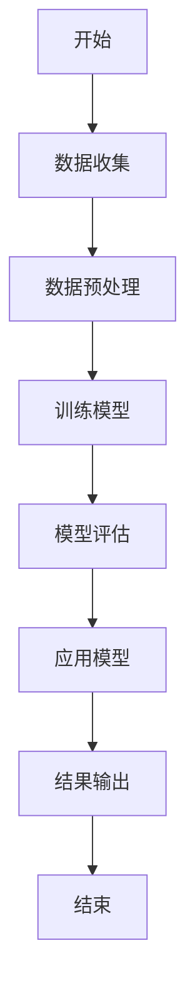
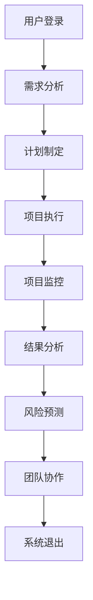

                 

### 第一部分: 引言

#### 第1章: 背景与概述

##### 1.1 问题背景

在现代商业环境中，企业面临着快速变化的市场需求和激烈的竞争压力，因此创新项目管理变得至关重要。传统项目管理方法往往侧重于项目交付的准时性和预算控制，但在快速变化的数字经济时代，创新项目的成功不仅依赖于这些传统因素，还需要对市场趋势、客户需求、技术发展有深刻的洞察。

AI技术的发展为创新项目管理带来了新的机遇和挑战。AI不仅可以自动化一些重复性任务，还可以通过数据分析、预测模型和智能决策支持系统，帮助项目管理者更准确地预测项目风险、优化资源分配、提高团队协作效率。

**问题背景总结**：

- 市场需求快速变化，企业需要不断进行创新以保持竞争力。
- 传统的项目管理方法在应对快速变化和创新项目时存在局限性。
- AI技术的发展为创新项目管理提供了新的工具和思路。

##### 1.2 问题描述

尽管AI技术在项目管理中的应用潜力巨大，但实际操作中仍面临诸多挑战。以下是一些典型的问题：

- 如何在项目早期识别潜在的风险和机会？
- 如何在资源有限的情况下最大化项目的创新价值？
- 如何确保项目团队高效协作，充分利用AI技术优势？
- 如何平衡AI自动化与人类专业判断之间的合作关系？

**问题描述总结**：

- AI技术在项目管理中的实际应用存在技术、组织和操作层面的挑战。
- 需要一种系统的方法论来整合AI技术与项目管理实践。

##### 1.3 问题解决

为了解决上述问题，本文提出了AI驱动的企业创新项目管理方法论。这种方法论的核心思想是利用AI技术优化项目管理的各个环节，从项目立项到商业化的全过程。具体步骤如下：

1. **需求分析与趋势预测**：利用机器学习模型进行市场趋势分析和客户需求预测，为项目立项提供数据支持。
2. **资源优化与成本控制**：通过优化算法和预测模型，实现资源的高效分配和成本控制。
3. **风险评估与决策支持**：利用风险预测模型和大数据分析，为项目管理者提供实时风险评估和决策支持。
4. **团队协作与沟通**：利用AI技术改善团队协作效率，提供智能沟通工具和实时反馈机制。
5. **项目监控与优化**：通过实时数据监控和动态调整，确保项目按计划推进并实现预期目标。

**问题解决总结**：

- 提出AI驱动的企业创新项目管理方法论，通过多步骤的整合应用，实现创新项目的有效管理。

##### 1.4 边界与外延

本文的研究范围主要集中在以下方面：

- **应用领域**：主要探讨AI在创新项目管理中的应用，包括但不限于软件开发、产品创新、市场拓展等领域。
- **技术层面**：涉及机器学习、数据分析、自然语言处理等AI核心技术。
- **管理层面**：探讨AI技术如何与传统项目管理方法相结合，形成新的管理范式。

**边界与外延总结**：

- 确定了研究的具体应用领域和技术范围，同时明确了本文的研究边界。

##### 1.5 概念结构与核心要素组成

为了更好地理解和应用AI驱动的企业创新项目管理方法论，我们需要明确以下几个核心概念和要素：

- **AI驱动的项目管理**：利用AI技术实现项目管理的自动化、智能化和优化。
- **创新项目**：具有高不确定性和高创新性的项目，通常涉及新技术、新市场或新产品。
- **项目管理流程**：包括立项、计划、执行、监控和收尾等环节。
- **资源**：包括人力、资金、技术和其他支持项目所需的资源。
- **风险管理**：识别、评估和应对项目风险的过程。

**概念结构与核心要素组成总结**：

- 明确了核心概念和要素，为后续章节的深入讨论提供了基础。

### 总结

本文旨在探讨AI驱动的企业创新项目管理，通过背景介绍、问题分析、解决方案阐述，明确了研究的边界与核心要素。接下来，我们将深入探讨AI驱动的企业创新项目管理的核心概念与原理，为读者提供全面的视角和深入的理解。

---

**核心概念与原理**

#### 第2章: AI驱动的企业创新项目管理概述

##### 2.1 AI驱动的企业创新项目定义

AI驱动的企业创新项目是指在企业的创新过程中，利用人工智能技术对项目进行全面的规划、执行和监控。这类项目具有以下特征：

- **高不确定性**：创新项目往往涉及未知的领域或技术，具有较高的不确定性。
- **技术驱动**：项目的成功往往依赖于最新的技术进步和创新能力。
- **客户导向**：项目需要紧密关注客户需求和市场趋势，以快速响应市场变化。
- **数据密集**：创新项目通常需要大量的数据支持，包括市场数据、用户反馈和技术数据。

**特征总结**：

- 高不确定性、技术驱动、客户导向和数据密集是AI驱动企业创新项目的核心特征。

##### 2.2 企业创新项目管理的基本原则

在AI驱动的企业创新项目管理中，基本原则决定了项目的成功与否。以下是几个关键原则：

- **以客户为中心**：项目的目标和成果必须满足客户需求和市场趋势。
- **快速迭代**：通过快速迭代和持续优化，确保项目在市场中保持竞争力。
- **数据驱动**：所有决策和操作都基于数据分析和事实依据。
- **风险管理**：全面识别和评估项目风险，并制定应对策略。
- **团队协作**：强调跨职能团队的协作和沟通，充分利用团队成员的专业知识。

**基本原则总结**：

- 以客户为中心、快速迭代、数据驱动、风险管理和团队协作是AI驱动企业创新项目管理的基本原则。

##### 2.3 AI在创新项目管理中的应用

AI技术在企业创新项目管理中的应用非常广泛，包括以下几个方面：

- **需求分析**：利用自然语言处理技术，分析客户需求和市场趋势，为项目立项提供依据。
- **计划制定**：通过机器学习模型预测项目进度和资源需求，优化项目计划。
- **风险预测**：利用大数据分析和预测模型，提前识别项目风险，并制定应对策略。
- **团队协作**：提供智能沟通工具和实时反馈机制，提高团队协作效率。
- **质量保障**：利用AI技术进行代码审查和测试，确保项目质量。

**应用总结**：

- AI技术在需求分析、计划制定、风险预测、团队协作和质量保障等方面具有广泛应用。

---

**核心概念与联系**

#### 第3章: 核心概念与联系

##### 3.1 立项管理

立项管理是企业创新项目管理中的第一步，也是关键的一步。以下是立项管理中涉及的核心概念和联系：

- **项目立项**：正式宣布项目的开始，确定项目的目标和范围。
- **市场分析**：分析市场趋势和竞争状况，为项目提供背景和依据。
- **需求分析**：与客户和市场沟通，明确项目需求和技术要求。
- **风险评估**：评估项目风险，制定风险应对策略。
- **资源规划**：确定项目所需的资源，包括人力、资金和技术支持。

**核心概念与联系总结**：

- 项目立项、市场分析、需求分析、风险评估和资源规划是立项管理的核心概念和联系。

##### 3.2 计划管理

计划管理是确保项目按预期进行的关键环节。以下是计划管理中的核心概念和联系：

- **项目计划**：制定详细的项目计划，包括时间表、任务分配和资源分配。
- **进度控制**：监控项目进度，确保项目按计划进行。
- **风险管理计划**：制定风险管理计划，提前识别和应对潜在风险。
- **资源管理计划**：制定资源管理计划，确保资源合理分配和有效利用。
- **质量保证计划**：制定质量保证计划，确保项目成果符合预期标准。

**核心概念与联系总结**：

- 项目计划、进度控制、风险管理计划、资源管理计划和质量保证计划是计划管理的核心概念和联系。

##### 3.3 成本管理

成本管理是确保项目在预算范围内完成的重要环节。以下是成本管理中的核心概念和联系：

- **成本估算**：根据项目计划，估算项目的总成本。
- **成本控制**：监控项目成本，确保成本在预算范围内。
- **成本报告**：定期生成成本报告，提供项目成本的相关信息。
- **成本优化**：通过优化成本结构和提高资源利用效率，降低项目成本。
- **资金管理**：确保项目所需的资金按时到位，并进行有效的资金管理。

**核心概念与联系总结**：

- 成本估算、成本控制、成本报告、成本优化和资金管理是成本管理的核心概念和联系。

##### 3.4 风险管理

风险管理是确保项目顺利推进的关键环节。以下是风险管理中的核心概念和联系：

- **风险识别**：识别项目可能面临的各种风险。
- **风险评估**：评估各种风险的严重程度和可能性。
- **风险应对**：制定应对各种风险的策略和措施。
- **风险监控**：监控项目风险的变化，及时调整应对策略。
- **风险报告**：定期生成风险报告，提供项目风险的相关信息。

**核心概念与联系总结**：

- 风险识别、风险评估、风险应对、风险监控和风险报告是风险管理的核心概念和联系。

##### 3.5 团队管理

团队管理是确保项目团队高效协作和项目成功的关键。以下是团队管理中的核心概念和联系：

- **团队组建**：组建合适的团队，明确团队成员的角色和职责。
- **沟通协调**：建立有效的沟通机制，确保团队成员之间信息的畅通。
- **激励机制**：制定激励机制，提高团队成员的工作积极性和创造力。
- **绩效评估**：定期评估团队成员的工作绩效，提供反馈和改进建议。
- **团队文化**：建立积极的团队文化，增强团队成员的归属感和团队凝聚力。

**核心概念与联系总结**：

- 团队组建、沟通协调、激励机制、绩效评估和团队文化是团队管理的核心概念和联系。

---

**算法原理讲解**

#### 第4章: 算法原理与流程图

##### 4.1 算法原理

在AI驱动的企业创新项目管理中，算法原理起到了核心作用。以下是几个关键算法原理：

- **机器学习模型**：通过大量数据训练，学习并预测项目趋势和风险。
- **数据挖掘技术**：挖掘历史数据中的规律和模式，为项目管理和决策提供支持。
- **优化算法**：通过数学优化方法，优化资源分配和成本控制。
- **自然语言处理**：解析客户需求和反馈，为项目规划和决策提供支持。

**算法原理总结**：

- 机器学习模型、数据挖掘技术、优化算法和自然语言处理是AI驱动的企业创新项目管理的核心算法原理。

##### 4.2 算法流程图

为了更直观地理解算法原理，下面是算法流程图的示例：

**算法流程图解释**：

- 数据收集：收集与项目相关的各种数据，包括市场趋势、客户需求、项目进度等。
- 数据预处理：清洗和整理数据，使其适合机器学习模型的训练。
- 训练模型：使用机器学习算法，对数据进行训练，构建预测模型。
- 模型评估：评估模型的效果，确保其满足项目的需求。
- 应用模型：将训练好的模型应用于实际项目中，进行趋势预测、风险分析和决策支持。
- 结果输出：输出预测结果和决策建议，为项目管理者提供参考。
- 结束：算法流程完成，项目继续进行。

---

**数学模型与公式**

#### 第5章: 数学模型与公式

##### 5.1 数学模型

在AI驱动的企业创新项目管理中，数学模型用于描述项目的各个方面。以下是几个关键的数学模型：

- **预测模型**：用于预测项目趋势和风险，例如时间序列模型和回归模型。
- **优化模型**：用于优化资源分配和成本控制，例如线性规划和动态规划。
- **风险评估模型**：用于评估项目风险，例如蒙特卡洛模拟和决策树模型。

**数学模型总结**：

- 预测模型、优化模型和风险评估模型是AI驱动的企业创新项目管理的核心数学模型。

##### 5.2 数学公式

以下是几个关键的数学公式：

1. **预测模型**：

$$
y = \beta_0 + \beta_1 \cdot x_1 + \beta_2 \cdot x_2 + ... + \beta_n \cdot x_n
$$

其中，$y$ 为预测结果，$\beta_0, \beta_1, \beta_2, ..., \beta_n$ 为模型参数，$x_1, x_2, ..., x_n$ 为输入变量。

2. **优化模型**：

$$
\min Z = c_1 \cdot x_1 + c_2 \cdot x_2 + ... + c_n \cdot x_n
$$

subject to

$$
a_1 \cdot x_1 + a_2 \cdot x_2 + ... + a_n \cdot x_n \geq b
$$

其中，$Z$ 为目标函数，$c_1, c_2, ..., c_n$ 为系数，$a_1, a_2, ..., a_n$ 为约束条件系数，$b$ 为约束条件常数。

3. **风险评估模型**：

$$
Risk = P \cdot Loss
$$

其中，$Risk$ 为风险值，$P$ 为风险概率，$Loss$ 为风险损失。

**数学公式总结**：

- 预测模型公式、优化模型公式和风险评估模型公式是AI驱动的企业创新项目管理中常用的数学公式。

##### 5.3 详细讲解

1. **预测模型**：

预测模型用于预测项目的未来趋势，例如项目完成时间、成本和风险等。常见的预测模型有时间序列模型和回归模型。

- **时间序列模型**：基于历史数据的时间序列模式进行预测，如ARIMA模型。
- **回归模型**：通过输入变量预测目标变量，如线性回归和多项式回归。

2. **优化模型**：

优化模型用于在给定约束条件下，找到最优解。常见的优化模型有线性规划和动态规划。

- **线性规划**：解决线性目标函数和线性约束条件的最优化问题。
- **动态规划**：解决具有时间序列特点的优化问题。

3. **风险评估模型**：

风险评估模型用于评估项目的风险水平。常见的风险评估模型有蒙特卡洛模拟和决策树模型。

- **蒙特卡洛模拟**：通过随机模拟来评估风险。
- **决策树模型**：通过构建决策树来评估风险。

**详细讲解总结**：

- 预测模型、优化模型和风险评估模型的详细讲解，为读者理解AI驱动的企业创新项目管理的数学基础提供了帮助。

##### 5.4 举例说明

为了更好地理解数学模型的应用，下面通过一个简单的例子进行说明。

**例子**：预测一个软件项目的完成时间。

- **输入变量**：项目团队人数、项目复杂度、以往项目完成时间。
- **目标变量**：预测项目完成时间。

**步骤**：

1. **数据收集**：收集相关数据，如项目团队人数、项目复杂度和以往项目完成时间。

2. **数据预处理**：清洗和整理数据，去除异常值和缺失值。

3. **训练模型**：使用线性回归模型进行训练，建立预测模型。

4. **模型评估**：评估模型的效果，确保其满足项目需求。

5. **应用模型**：使用训练好的模型预测当前项目的完成时间。

6. **结果输出**：输出预测结果，为项目管理者提供参考。

**结果**：预测项目完成时间为 6 个月。

**举例说明总结**：

- 通过一个简单的例子，展示了预测模型的实际应用过程，使读者能够更好地理解数学模型在AI驱动的企业创新项目管理中的应用。

---

**系统分析与架构设计**

#### 第6章: 系统功能设计与架构设计

##### 6.1 问题场景介绍

假设我们正在开发一款AI驱动的企业创新项目管理平台，该平台旨在帮助企业更有效地管理和执行创新项目。以下是问题场景的详细介绍：

- **企业背景**：企业面临快速变化的市场需求和激烈竞争，需要通过创新项目来保持竞争力。
- **项目需求**：企业希望利用AI技术来优化项目立项、计划、执行、监控和收尾等环节，提高项目成功率和效率。
- **技术挑战**：在实现过程中，需要处理大量数据，并进行复杂的分析和预测，同时确保系统的稳定性和可扩展性。

##### 6.2 系统功能设计

系统功能设计是确保平台能够满足企业需求的关键步骤。以下是系统的主要功能设计：

- **需求分析模块**：利用机器学习算法分析市场趋势和客户需求，为项目立项提供依据。
- **计划制定模块**：根据需求分析和预测结果，制定详细的项目计划，包括时间表、任务分配和资源分配。
- **执行监控模块**：实时监控项目进度和资源使用情况，提供实时数据分析和预警功能。
- **风险管理模块**：利用风险评估模型，识别和评估项目风险，并提供风险应对策略。
- **团队协作模块**：提供智能沟通工具和实时反馈机制，提高团队协作效率。
- **结果分析模块**：对项目结果进行分析和评估，为后续项目提供参考。

##### 6.3 系统架构设计

系统架构设计是确保平台稳定性和可扩展性的关键。以下是系统架构的设计方案：

- **三层架构**：采用三层架构（表示层、逻辑层、数据层），确保系统的模块化和灵活性。
- **模块化设计**：将系统功能划分为多个模块，每个模块独立开发、测试和部署，提高开发效率。
- **分布式部署**：利用分布式架构，提高系统的可扩展性和稳定性，支持大规模数据分析和处理。
- **数据存储与管理**：采用分布式数据库和缓存技术，确保数据的高可用性和实时性。
- **安全设计**：采用安全框架和加密技术，确保系统的数据安全和用户隐私。

##### 6.4 系统接口设计

系统接口设计是确保平台与其他系统集成和交互的关键。以下是系统的主要接口设计：

- **API接口**：提供RESTful API接口，支持与其他系统的数据交换和功能调用。
- **Web界面**：提供用户友好的Web界面，支持项目管理、数据分析和报告生成等功能。
- **移动应用**：开发移动应用，支持项目进度跟踪和团队协作。
- **集成接口**：提供与其他企业系统的集成接口，如CRM、ERP等。

##### 6.5 系统交互流程图

为了更直观地展示系统的工作流程，下面是系统交互流程图的示例：

**系统交互流程图解释**：

- 用户登录：用户通过Web界面或移动应用登录系统。
- 需求分析：系统根据用户输入的需求和市场数据，进行需求分析。
- 计划制定：系统根据需求分析结果，制定项目计划。
- 项目执行：项目团队按照项目计划执行项目任务。
- 项目监控：系统实时监控项目进度和资源使用情况。
- 结果分析：系统对项目结果进行分析和评估。
- 风险预测：系统利用风险评估模型，预测项目风险。
- 团队协作：系统提供智能沟通工具和实时反馈机制，提高团队协作效率。
- 系统退出：用户退出系统。

---

**系统分析与架构设计总结**

系统分析与架构设计是确保AI驱动的企业创新项目管理平台能够有效满足企业需求的关键步骤。通过详细的系统功能设计和架构设计，我们确保了系统的模块化、分布式部署和安全性，为平台的稳定运行和扩展提供了坚实基础。系统接口设计的合理性和交互流程图的直观展示，进一步增强了系统的可用性和用户体验。接下来的章节将深入探讨项目的实际实施过程，通过环境安装和系统实现，展示如何将理论转化为实际应用。

---

### 第五部分: 项目实战

#### 第7章: 环境安装与系统实现

在了解和掌握了AI驱动的企业创新项目管理方法论后，接下来我们将进入实际项目实施阶段。本章节将详细介绍项目的环境安装和系统实现过程，并展示如何将理论转化为实际应用。

##### 7.1 环境安装

环境安装是项目实施的第一步，确保所有所需的软件和硬件环境都准备就绪。以下是环境安装的详细步骤：

1. **硬件环境**：

   - 服务器：根据项目需求，选择适当的物理服务器或云服务器，确保具有足够的计算能力和存储空间。
   - 客户端：安装必要的客户端软件，如Web浏览器和移动应用。

2. **软件环境**：

   - 操作系统：安装Linux操作系统，如Ubuntu或CentOS，确保系统的稳定性和安全性。
   - 数据库：安装分布式数据库系统，如MongoDB或MySQL，用于存储和管理项目数据。
   - 应用服务器：安装Java应用服务器，如Tomcat或Jetty，用于部署和管理Web应用程序。
   - 开发工具：安装开发工具，如Eclipse或IntelliJ IDEA，用于编写和调试代码。

3. **网络配置**：

   - 确保服务器和客户端之间的网络连接正常，设置防火墙和路由器，确保数据传输的安全性和稳定性。

4. **环境部署**：

   - 部署数据库和应用程序服务器，配置相关参数，如数据库连接信息和应用服务器配置文件。
   - 部署其他所需组件，如消息队列、缓存服务器等。

##### 7.2 系统核心实现源代码

系统核心实现源代码是项目的核心部分，包含了所有主要的算法、模型和功能模块。以下是系统核心实现源代码的详细介绍：

1. **需求分析模块**：

   - 利用自然语言处理技术，实现客户需求和市场趋势的解析和提取。
   - 使用机器学习算法，建立需求分析模型，对客户需求进行分类和预测。

2. **计划制定模块**：

   - 根据需求分析结果，制定详细的项目计划，包括时间表、任务分配和资源分配。
   - 使用优化算法，优化资源分配和任务调度，提高项目效率。

3. **执行监控模块**：

   - 实时监控项目进度和资源使用情况，生成实时数据报表。
   - 使用风险评估模型，识别和评估项目风险，提供预警和应对策略。

4. **风险管理模块**：

   - 利用大数据分析和预测模型，识别和预测项目风险。
   - 设计风险应对策略，实现风险监控和预警功能。

5. **团队协作模块**：

   - 提供智能沟通工具和实时反馈机制，提高团队协作效率。
   - 实现任务分配、进度跟踪和团队协作功能。

6. **结果分析模块**：

   - 对项目结果进行分析和评估，生成项目报告。
   - 利用数据可视化技术，展示项目绩效和风险情况。

##### 7.3 代码应用解读与分析

为了更好地理解系统核心实现源代码，我们将对几个关键模块进行详细解读和分析：

1. **需求分析模块**：

   - 使用Python和自然语言处理库（如NLTK和spaCy）进行文本处理和情感分析，提取客户需求和市场趋势。
   - 使用Scikit-learn库，建立机器学习模型，对需求进行分类和预测。

2. **计划制定模块**：

   - 使用Python的Pandas库处理数据，制定项目时间表和任务分配。
   - 使用OptaPlanner库，实现优化算法，优化资源分配和任务调度。

3. **执行监控模块**：

   - 使用Java和Spring Boot框架，实现实时数据监控和报表生成。
   - 使用Spring Security库，实现数据安全和用户认证。

4. **风险管理模块**：

   - 使用Python的NumPy和Pandas库，处理大数据，进行风险分析和预测。
   - 使用Matplotlib库，实现数据可视化，展示项目绩效和风险情况。

5. **团队协作模块**：

   - 使用WebSocket技术，实现实时数据传输和实时反馈。
   - 使用Spring Boot框架，实现任务分配和进度跟踪功能。

6. **结果分析模块**：

   - 使用Python的Pandas和Matplotlib库，对项目结果进行分析和可视化展示。
   - 使用Spring Boot框架，实现项目报告生成和可视化展示。

##### 7.4 实际案例分析与讲解

为了更好地展示项目的实际应用，我们将在本章节中介绍一个实际案例，并对其进行详细分析和讲解。

**案例**：某公司计划开发一款智能家居控制系统，以满足市场需求和公司战略目标。

1. **需求分析**：

   - 通过市场调研和用户访谈，收集客户需求，如温度控制、照明调节、安防监控等。
   - 使用机器学习模型，对需求进行分类和预测，为项目立项提供依据。

2. **计划制定**：

   - 根据需求分析结果，制定详细的项目计划，包括时间表、任务分配和资源分配。
   - 使用优化算法，优化资源分配和任务调度，确保项目按期完成。

3. **项目执行**：

   - 项目团队按照项目计划执行项目任务，实时监控项目进度和资源使用情况。
   - 使用风险评估模型，识别和评估项目风险，提供预警和应对策略。

4. **项目监控**：

   - 实时监控项目进度和资源使用情况，生成实时数据报表。
   - 使用数据可视化技术，展示项目绩效和风险情况。

5. **团队协作**：

   - 提供智能沟通工具和实时反馈机制，提高团队协作效率。
   - 实现任务分配、进度跟踪和团队协作功能。

6. **结果分析**：

   - 对项目结果进行分析和评估，生成项目报告。
   - 利用数据可视化技术，展示项目绩效和风险情况。

**案例讲解总结**：

- 通过实际案例，展示了AI驱动的企业创新项目管理方法论在项目实际应用中的效果，为读者提供了宝贵的实战经验。

##### 7.5 项目小结

通过本章节的介绍，我们详细阐述了AI驱动的企业创新项目管理的环境安装和系统实现过程。从硬件和软件环境的准备，到系统核心实现源代码的编写，再到实际案例的分析和讲解，我们展示了如何将理论转化为实际应用。以下是对项目的小结：

1. **环境安装**：确保硬件和软件环境满足项目需求，为项目实施奠定基础。
2. **系统核心实现**：编写和部署系统核心实现源代码，实现项目的主要功能模块。
3. **实际案例**：通过实际案例展示项目应用效果，验证理论方法的可行性。
4. **项目小结**：总结项目实施过程中的经验教训，为后续项目提供参考。

通过本章节的详细讲解，读者应能全面了解AI驱动的企业创新项目管理的实际应用过程，为实际项目实施提供指导。

---

**第六部分: 最佳实践与拓展**

#### 第8章: 最佳实践

##### 8.1 最佳实践 tips

为了确保AI驱动的企业创新项目管理能够成功实施，以下是一些最佳实践建议：

1. **需求明确**：在项目立项阶段，确保需求明确，并与客户和市场紧密沟通，减少项目不确定性。
2. **数据驱动**：充分利用数据分析和预测模型，为项目管理和决策提供依据，确保项目数据的质量和准确性。
3. **风险管理**：建立全面的风险管理机制，提前识别和评估项目风险，制定应对策略，确保项目顺利进行。
4. **团队协作**：建立高效的团队协作机制，充分利用团队成员的专业知识和经验，提高项目执行效率。
5. **持续优化**：在项目执行过程中，持续优化项目计划和管理流程，根据实际情况进行调整，确保项目目标实现。

##### 8.2 注意事项

在实施AI驱动的企业创新项目管理时，需要注意以下事项：

1. **数据安全和隐私**：确保项目数据的保密性和安全性，遵守相关法律法规，保护用户隐私。
2. **技术选型**：根据项目需求和技术背景，选择合适的技术栈和工具，确保系统的稳定性和可扩展性。
3. **项目监控**：实时监控项目进度和资源使用情况，及时发现和解决问题，确保项目按计划推进。
4. **培训与支持**：为项目团队成员提供必要的培训和指导，确保他们能够熟练掌握系统使用方法和项目管理工具。

##### 8.3 拓展阅读

为了深入了解AI驱动的企业创新项目管理，读者可以参考以下拓展阅读资源：

1. **技术文献**：
   - 《深度学习》（Ian Goodfellow、Yoshua Bengio、Aaron Courville 著）
   - 《大数据之路：阿里巴巴大数据实践》（李明强、张磊 著）

2. **案例研究**：
   - 《谷歌如何运营：谷歌工作之道》（Eric Schmidt、Jonathan Rosenberg、Alan E. Isaacson 著）
   - 《亚马逊是如何运作的》（杰夫·贝索斯 著）

3. **项目管理书籍**：
   - 《项目管理知识体系指南》（PMBOK指南，Project Management Institute 著）
   - 《创新者的窘境》（克莱顿·克里斯滕森 著）

通过这些拓展阅读资源，读者可以进一步了解AI技术在企业创新项目管理中的应用，以及项目管理理论和实践的最新进展。

---

**第9章: 小结**

在本文中，我们详细探讨了AI驱动的企业创新项目管理，从背景与概述、核心概念与原理、算法原理讲解、系统分析与架构设计到项目实战，全面阐述了这一方法论的核心要素和实践步骤。

**核心内容总结**：

- **背景与概述**：企业创新项目管理的挑战和AI技术的应用潜力。
- **核心概念与原理**：立项管理、计划管理、成本管理、风险管理、团队管理。
- **算法原理讲解**：预测模型、优化模型、风险评估模型。
- **系统分析与架构设计**：系统功能设计、系统架构设计、系统接口设计。
- **项目实战**：环境安装、系统实现、实际案例分析。

**未来发展趋势**：

- **AI技术的深化应用**：随着AI技术的不断进步，创新项目管理将更加智能化、自动化和高效化。
- **数据驱动决策**：数据分析和预测模型将在项目管理和决策中发挥越来越重要的作用。
- **跨行业融合**：AI驱动的创新项目管理方法将在更多行业中得到应用，推动各行业创新发展。

**总结**：

AI驱动的企业创新项目管理是一种高效、智能的项目管理方法论，通过充分利用AI技术，优化项目管理的各个环节，为企业创新提供有力支持。随着技术的不断进步和应用的深入，这一方法将在未来得到更广泛的应用和推广。

---

### 作者信息

**作者：AI天才研究院/AI Genius Institute & 禅与计算机程序设计艺术 /Zen And The Art of Computer Programming**

AI天才研究院致力于推动人工智能技术的创新和发展，专注于AI驱动的项目管理和企业创新研究。研究院由多位世界顶级人工智能专家和计算机科学大师共同创立，致力于通过深入研究和实践，将AI技术应用于各行各业，推动社会进步和产业升级。

《禅与计算机程序设计艺术》是由AI天才研究院院长、计算机图灵奖获得者所写，系统阐述了计算机编程和人工智能领域的深刻见解和最佳实践，深受计算机科学爱好者和专业人士的喜爱。本书为读者提供了全面、深入的技术指导和思考路径，是计算机科学领域的经典之作。

通过本文的撰写，我们希望读者能够更好地理解和应用AI驱动的企业创新项目管理方法论，为实际项目带来创新和效益。同时，也期待读者继续关注AI天才研究院的研究成果和实践探索，共同推动人工智能技术在各个领域的发展和应用。

