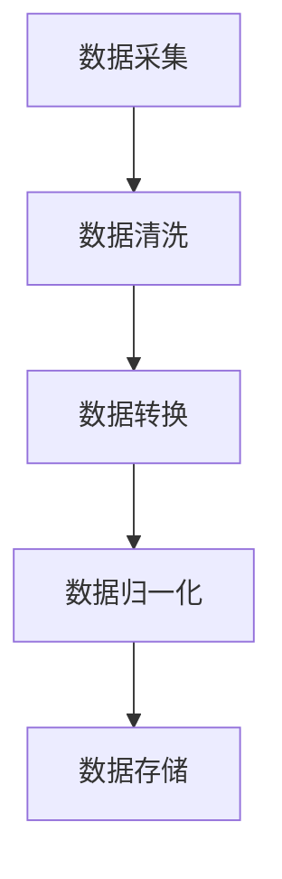
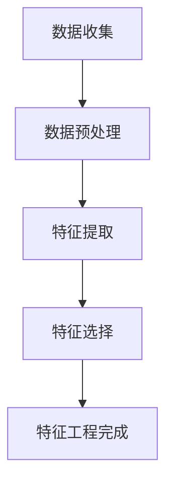
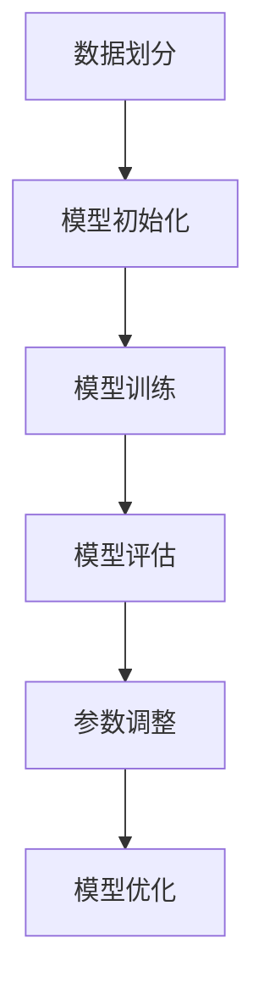
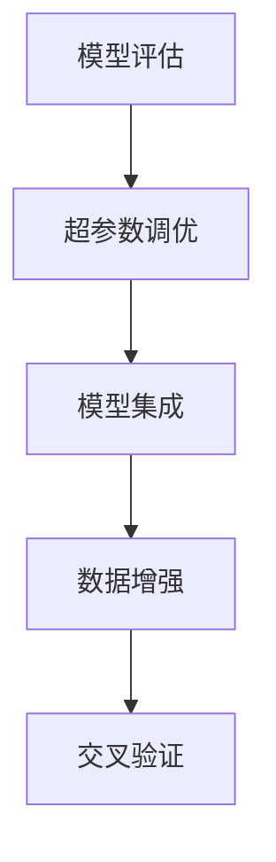
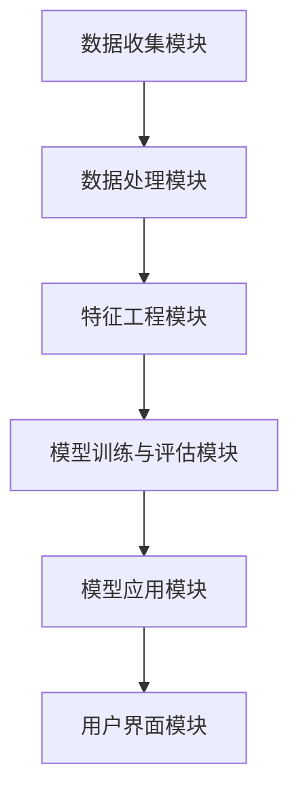

                 

### 第2章: AI驱动员工绩效评估基础

#### 2.1 AI技术基础

##### 2.1.1 人工智能概述
人工智能（Artificial Intelligence, AI）是计算机科学的一个分支，旨在创建能够模拟、延伸和扩展人类智能的理论、算法和技术。它包括机器学习（Machine Learning）、深度学习（Deep Learning）、自然语言处理（Natural Language Processing）、计算机视觉（Computer Vision）等多个领域。

###### 核心概念术语说明
- **机器学习**：机器学习是一种让计算机从数据中学习并做出决策的技术，无需显式编程指令。
- **深度学习**：深度学习是机器学习的一个子领域，通过多层神经网络进行数据建模和分析。
- **自然语言处理**：自然语言处理旨在使计算机理解和处理人类语言，包括语音识别、文本分析等。
- **计算机视觉**：计算机视觉专注于使计算机能够“看”和理解图像和视频。

##### 2.1.2 机器学习基础
机器学习依赖于数据，其核心是算法，这些算法从数据中学习模式，用于预测或分类。

###### 问题背景
在传统的软件编程中，程序员需要为每个可能的情境编写特定的代码。然而，机器学习通过学习数据中的模式，能够自动处理复杂的问题。

###### 问题解决
机器学习通过以下步骤解决复杂问题：
1. **数据收集**：收集大量数据，这些数据通常来自实际应用场景。
2. **数据预处理**：清洗数据，处理缺失值，标准化数据。
3. **特征提取**：将数据转换成模型可以处理的格式。
4. **模型选择**：选择合适的机器学习算法。
5. **模型训练**：使用数据训练模型。
6. **模型评估**：评估模型的性能，调整参数以提高准确性。
7. **应用**：部署模型以实现预测或分类。

##### 2.1.3 深度学习原理
深度学习是机器学习的一种形式，通过多层神经网络模拟人脑的学习过程。

###### 数学模型
深度学习中的核心数学模型是多层感知器（Multilayer Perceptron, MLP）。MLP 模型包括输入层、多个隐藏层和一个输出层。

$$
z = \sigma(\mathbf{W}^T \mathbf{x} + b)
$$

其中，$\sigma$ 是激活函数（如Sigmoid或ReLU），$\mathbf{W}$ 是权重矩阵，$\mathbf{x}$ 是输入向量，$b$ 是偏置。

###### 举例说明
假设我们有一个简单的二分类问题，输入向量 $\mathbf{x} = (x_1, x_2)$，我们使用一个单层感知器进行预测。

$$
z = \sigma(W_1x_1 + W_2x_2 + b)
$$

如果 $z > 0$，则预测类别为1；否则，预测类别为0。

##### 概念属性特征对比表格
下面是机器学习和深度学习的一些对比特征：

| 特征 | 机器学习 | 深度学习 |
| ---- | ------- | ------- |
| 算法复杂度 | 较高 | 较高，但依赖于数据量和模型架构 |
| 可解释性 | 较高 | 较低 |
| 对数据质量的要求 | 较低 | 较高 |
| 应用范围 | 广泛 | 主要用于复杂问题，如图像识别、自然语言处理等 |
| 数据依赖性 | 强 | 强 |
| 训练时间 | 较短 | 较长 |

##### ER实体关系图架构的 Mermaid 流程图
```mermaid
erDiagram
    Employee ||--|{ Performance_Assessment }
    Employee ||--|{ Career_Development_Plans }
    Performance_Assessment ||--|{ Metrics }
    Career_Development_Plans ||--|{ Goals }
```

#### 2.2 绩效评估核心概念

##### 2.2.1 绩效评估的定义与类型
绩效评估是对员工在工作中的表现和成果的评估。它可以是定性的，也可以是定量的，或者是两者的结合。

###### 问题背景
企业需要了解员工的工作表现，以便做出决策，如晋升、调薪、培训等。

###### 问题解决
绩效评估通过以下步骤进行：
1. **目标设定**：设定评估目标和指标。
2. **数据收集**：收集员工的工作数据和绩效数据。
3. **评估过程**：使用量化或质化的方法对员工的表现进行评估。
4. **反馈与改进**：提供反馈，帮助员工改进。

##### 2.2.2 绩效指标体系
绩效指标体系是绩效评估的基础，它包括关键绩效指标（KPI）、关键成功指标（KSI）等。

###### 数学模型
绩效指标通常可以用以下公式表示：

$$
\text{绩效得分} = \sum_{i=1}^{n} (\text{指标权重} \times \text{指标得分})
$$

其中，$n$ 是指标数量，每个指标的权重和得分根据其重要性和实际表现确定。

##### 概念属性特征对比表格
以下是几种常见绩效指标的特征对比：

| 指标类型 | 定义 | 特征 |
| ------- | ---- | ---- |
| KPI | 关键绩效指标 | 具有量化的特征，容易衡量 |
| KSI | 关键成功指标 | 关注企业长期目标和成功指标 |
| KRA | 关键结果区域 | 用于衡量组织层面的绩效 |
| OKR | 目标与关键结果 | 用于设定具体目标和实现路径 |

##### ER实体关系图架构的 Mermaid 流程图
```mermaid
erDiagram
    Employee ||--|{ Performance_Assessment }
    Employee ||--|{ Metrics }
    Performance_Assessment ||--|{ Goals }
```

#### 2.3 AI驱动绩效评估方法

##### 2.3.1 数据收集与预处理
数据收集是AI驱动绩效评估的第一步，数据的质量直接影响评估的准确性。数据预处理包括数据清洗、数据转换和数据归一化。

###### 数学模型
数据预处理中的常见数学方法包括：

- **缺失值填补**：
  $$
  \text{填补缺失值} = \text{均值} + (\text{标准差} \times \text{随机数})
  $$

- **数据转换**：
  $$
  \text{新数据} = \frac{\text{原数据} - \text{最小值}}{\text{最大值} - \text{最小值}}
  $$

##### 2.3.2 特征工程
特征工程是将原始数据转换成能够提高模型性能的特征的过程。

###### 数学模型
特征工程中的一些数学模型包括：

- **特征选择**：
  $$
  \text{特征重要性评分} = \text{模型系数} \times \text{特征标准差}
  $$

- **特征构造**：
  $$
  \text{新特征} = \text{特征}_1 \times \text{特征}_2
  $$

##### 2.3.3 模型选择与训练
模型选择是选择最适合问题的机器学习模型。训练是通过给模型提供数据，使其能够做出准确的预测或分类。

###### 数学模型
训练过程中使用的主要数学模型包括：

- **线性回归**：
  $$
  \text{预测值} = \mathbf{W}^T \mathbf{x} + b
  $$

- **逻辑回归**：
  $$
  P(\text{类别} = 1) = \frac{1}{1 + \exp(-\mathbf{W}^T \mathbf{x} - b)}
  $$

- **神经网络**：
  $$
  a_i = \sigma(\mathbf{W}^T \mathbf{x} + b)
  $$

##### 2.3.4 模型评估与优化
模型评估是使用测试数据来评估模型的性能。优化是通过调整模型参数来提高性能。

###### 数学模型
模型评估和优化中使用的数学模型包括：

- **准确率**：
  $$
  \text{准确率} = \frac{\text{预测正确数}}{\text{总预测数}}
  $$

- **召回率**：
  $$
  \text{召回率} = \frac{\text{预测正确且实际正确数}}{\text{实际正确数}}
  $$

- **F1分数**：
  $$
  F1 = 2 \times \frac{\text{准确率} \times \text{召回率}}{\text{准确率} + \text{召回率}}
  $$

##### 概念属性特征对比表格
以下是几种常见的机器学习模型和它们的特征对比：

| 模型类型 | 特点 | 适用场景 |
| ------- | ---- | ------- |
| 线性回归 | 简单，易于解释 | 线性关系问题 |
| 逻辑回归 | 线性模型，可用于分类 | 二分类问题 |
| 决策树 | 可解释性高，易于可视化 | 中小规模问题 |
| 随机森林 | 集成学习方法，提高性能 | 复杂关系问题 |
| 支持向量机 | 最优分割，高维空间有效 | 二分类问题 |
| 神经网络 | 高度非线性，强拟合能力 | 复杂关系问题 |

##### ER实体关系图架构的 Mermaid 流程图
```mermaid
erDiagram
    Employee ||--|{ Performance_Assessment }
    Employee ||--|{ Metrics }
    Performance_Assessment ||--|{ Goals }
    Metrics ||--|{ Metrics_Scores }
    Metrics_Scores ||--|{ Metrics_Library }
```

#### 2.4 概念属性特征对比表格
以下是AI驱动的员工绩效评估与传统绩效评估的一些概念属性特征对比：

| 概念属性特征 | AI驱动的绩效评估 | 传统绩效评估 |
| ------------ | --------------- | ------------ |
| 数据依赖性 | 高度依赖高质量数据 | 数据依赖性较低 |
| 可解释性 | 较低，复杂模型难以解释 | 较高，易于理解 |
| 评估准确性 | 高度依赖于模型训练和特征选择 | 受主观因素影响较大 |
| 实时性 | 能够实时分析员工绩效 | 通常定期评估 |
| 自适应能力 | 能够根据员工表现动态调整评估标准 | 固定的评估标准 |
| 预测能力 | 能够预测员工未来的绩效趋势 | 主要基于历史数据评估 |
| 优化潜力 | 模型可不断优化以提高准确性 | 难以调整和优化 |

#### 2.5 AI驱动绩效评估的实际应用场景

##### 2.5.1 企业员工招聘
AI驱动绩效评估可以在企业招聘过程中用于筛选和评估应聘者的能力和潜力。通过分析应聘者的历史数据和简历信息，AI模型可以预测应聘者未来在岗位上的表现。

###### 项目介绍
本项目旨在通过AI驱动绩效评估模型，提高企业招聘决策的准确性和效率。

###### 系统功能设计

- **数据收集与预处理**：收集应聘者的简历、面试表现和历史工作数据，并进行数据清洗和预处理。
- **特征提取**：提取关键特征，如教育背景、工作经验、技能水平等。
- **模型训练**：使用历史招聘数据训练评估模型。
- **绩效预测**：使用训练好的模型预测新应聘者的绩效。

##### 2.5.2 企业员工培训
AI驱动绩效评估可以帮助企业识别员工的培训需求和提供个性化的培训方案。通过分析员工的工作表现和技能缺陷，AI模型可以推荐最适合员工的培训内容和方式。

###### 项目介绍
本项目旨在通过AI驱动的绩效评估模型，提高企业员工培训的效果和员工个人发展。

###### 系统功能设计

- **数据收集与预处理**：收集员工的工作数据、培训记录和技能水平评估结果。
- **特征提取**：提取关键特征，如工作表现、技能等级、学习意愿等。
- **模型训练**：使用历史培训数据训练评估模型。
- **培训需求分析**：分析员工的培训需求，提供个性化的培训建议。

##### 2.5.3 企业员工晋升
AI驱动绩效评估可以帮助企业客观公正地评估员工的晋升潜力。通过分析员工的工作表现、绩效得分和潜力指标，AI模型可以提供晋升决策的参考。

###### 项目介绍
本项目旨在通过AI驱动的绩效评估模型，提高企业晋升决策的科学性和公平性。

###### 系统功能设计

- **数据收集与预处理**：收集员工的工作数据、绩效评估结果和晋升历史。
- **特征提取**：提取关键特征，如工作表现、绩效得分、团队合作能力等。
- **模型训练**：使用历史晋升数据训练评估模型。
- **晋升评估**：评估员工的晋升潜力，提供晋升建议。

##### 2.5.4 企业员工绩效管理
AI驱动绩效评估可以为企业提供全面的绩效管理解决方案，帮助管理层实时监控员工绩效，发现问题和改进机会。

###### 项目介绍
本项目旨在通过AI驱动的绩效评估模型，提高企业绩效管理的效率和效果。

###### 系统功能设计

- **数据收集与预处理**：收集员工的工作数据、绩效评估结果和反馈。
- **特征提取**：提取关键特征，如工作表现、客户满意度、团队合作能力等。
- **模型训练**：使用历史绩效数据训练评估模型。
- **绩效监控**：实时监控员工绩效，发现问题和改进机会。
- **反馈与改进**：提供绩效反馈，帮助员工改进。

#### 2.6 AI驱动绩效评估的优缺点

##### 2.6.1 优点
- **数据驱动**：AI驱动绩效评估基于大量数据，能够更客观地评估员工表现。
- **实时性**：系统能够实时分析员工绩效，提供及时反馈。
- **个性化**：系统能够根据员工的表现提供个性化的培训和发展建议。
- **预测性**：系统能够预测员工的未来绩效趋势，帮助管理层做出更科学的决策。

##### 2.6.2 缺点
- **数据依赖性**：系统对数据质量有较高要求，数据不准确会影响评估结果。
- **模型复杂性**：AI模型通常较复杂，难以解释，影响可解释性。
- **隐私问题**：系统可能涉及员工的敏感数据，需注意隐私保护。

##### 2.6.3 平衡方法
- **数据清洗**：确保数据质量，减少噪声和错误。
- **可解释性**：通过增加模型的可解释性，提高决策的可信度。
- **透明度**：确保系统透明，员工了解评估过程和结果。

#### 2.7 总结与展望

##### 2.7.1 本章小结
本章介绍了AI驱动员工绩效评估的基础知识，包括AI技术基础、绩效评估核心概念、AI驱动绩效评估方法等。通过本章的学习，读者可以了解AI驱动绩效评估的基本原理和应用场景。

##### 2.7.2 下一章内容展望
在下一章中，我们将深入探讨AI驱动绩效评估在不同企业中的应用案例，分析其实际效果和面临的挑战。读者将了解到如何在不同行业中实施AI驱动的绩效评估系统，以及如何优化这些系统以提高其效率和准确性。

----------------------------------------------------------------

## 第一部分: 引言与背景

### 第1章: 引言与背景

### 1.1 问题背景

#### 1.1.1 人工智能在企业管理中的应用现状
随着人工智能（AI）技术的飞速发展，其在企业管理中的应用越来越广泛。从客户关系管理到供应链优化，AI技术在提高企业效率和决策能力方面发挥了重要作用。特别是在员工绩效评估领域，AI的应用正在逐步改变传统的评估模式。

#### 1.1.2 企业员工绩效评估的挑战
传统的员工绩效评估方法主要依赖于主观评价，容易受到个人偏见和主观意识的影响，难以实现公平和客观。此外，随着企业规模的扩大和工作复杂性的增加，传统的评估方法在处理海量数据和信息时显得力不从心。这些挑战促使企业寻求更为智能、高效的绩效评估方法。

#### 1.1.3 AI驱动员工绩效评估的意义与价值
AI驱动员工绩效评估通过数据驱动的分析，能够客观、准确地评估员工的工作表现，提高评估的公平性和准确性。此外，AI技术还能够提供个性化的绩效发展建议，帮助员工不断提升自身能力。因此，AI驱动员工绩效评估不仅有助于优化人力资源管理，还能够提升企业的整体竞争力。

### 1.2 问题描述

#### 1.2.1 企业员工绩效评估的目标与内容
企业员工绩效评估的目标是全面、客观地评估员工在工作中的表现，为员工发展、晋升、培训等提供依据。评估的内容包括员工的工作成果、工作过程、行为表现等多个方面。

#### 1.2.2 传统绩效评估的局限
传统绩效评估方法主要依赖于主观评价，容易受到个人偏见和主观意识的影响，难以实现公平和客观。此外，传统的评估方法在处理海量数据和信息时显得力不从心，无法满足现代企业对绩效评估的精准和高效要求。

#### 1.2.3 AI驱动绩效评估的核心优势
AI驱动绩效评估能够通过数据驱动的分析，实现员工绩效评估的客观、准确。它能够处理海量数据，识别出员工表现的关键因素，提供个性化的绩效发展建议。此外，AI评估系统还可以实时监控员工绩效，为管理决策提供有力支持。

### 1.3 问题解决

#### 1.3.1 AI驱动绩效评估的基本原理
AI驱动绩效评估基于机器学习和深度学习技术，通过对员工行为数据进行收集、分析和建模，实现对员工绩效的准确评估。其基本原理包括数据收集、特征提取、模型训练、模型评估和模型应用等步骤。

#### 1.3.2 AI在员工绩效评估中的应用领域
AI在员工绩效评估中的应用主要包括以下几个方面：
1. **绩效数据收集与分析**：通过自动化工具收集员工的工作数据，如考勤、任务完成情况、工作时长等，并对这些数据进行分析。
2. **行为分析**：使用计算机视觉和自然语言处理技术，对员工的工作行为进行分析，如会议参与度、交流频率、团队合作表现等。
3. **绩效预测**：基于历史数据和机器学习模型，预测员工的未来绩效表现。
4. **个性化建议**：根据员工的绩效数据和需求，提供个性化的绩效发展建议。

#### 1.3.3 AI驱动绩效评估的边界与外延
AI驱动绩效评估在应用过程中需要考虑数据的真实性和隐私保护等问题。此外，评估模型的训练和优化也需要大量数据和计算资源。因此，AI驱动绩效评估的边界在于其数据质量和计算能力。

### 1.4 概念结构与核心要素

#### 1.4.1 绩效评估的关键概念
绩效评估的关键概念包括绩效指标、绩效标准和绩效反馈等。绩效指标是评估员工工作表现的量化标准，绩效标准是设定绩效指标的具体数值范围，绩效反馈是对员工绩效评估结果的沟通和反馈。

#### 1.4.2 AI技术的核心要素
AI技术的核心要素包括机器学习算法、深度学习模型、自然语言处理技术和计算机视觉技术等。这些技术共同构成了AI驱动绩效评估的基础。

#### 1.4.3 绩效评估与AI融合的框架
绩效评估与AI融合的框架包括数据收集与预处理、特征提取与选择、模型训练与优化、模型评估与应用等环节。该框架实现了绩效评估的数据化和智能化。

### 1.5 本章小结
本章介绍了AI驱动员工绩效评估的背景、意义、核心概念和基本原理。通过本章的学习，读者可以了解AI驱动绩效评估的基本概念和应用场景，为后续章节的深入学习打下基础。

## 第二部分: AI驱动员工绩效评估基础

### 第2章: AI驱动员工绩效评估基础

### 2.1 AI技术基础

#### 2.1.1 人工智能概述
人工智能（Artificial Intelligence, AI）是指计算机系统模拟人类智能的行为和决策过程的技术。它涵盖了从简单的规则系统到复杂的机器学习算法，甚至包括人工智能的哲学和伦理讨论。AI的核心目标是使机器能够执行通常需要人类智能的任务，如视觉识别、语言理解和决策制定。

#### 2.1.2 机器学习基础
机器学习（Machine Learning, ML）是AI的一个子领域，专注于开发算法，使计算机系统能够从数据中学习并做出预测或决策，而无需显式编程。机器学习算法通过训练数据集来调整模型参数，从而在新的数据上实现良好的泛化能力。

##### 问题背景
传统的软件开发通常需要开发者编写大量的代码来处理特定的任务。而机器学习则通过自动化地学习数据中的模式，减少了手工编码的需求。

##### 问题解决
机器学习解决了以下问题：
1. **自动化**：通过训练数据，机器学习模型可以自动发现数据中的模式，并用于未来的预测。
2. **泛化**：机器学习模型不仅能在训练数据上表现良好，还能在新数据上实现良好的泛化能力。
3. **适应性**：机器学习模型可以不断调整和学习，以适应新的环境或数据变化。

##### 数学模型
机器学习中的核心数学模型包括损失函数（loss function）和优化算法（optimization algorithm）。

$$
\text{损失函数} = L(\theta; x, y) = \frac{1}{2} \left( y - \theta^T x \right)^2
$$

其中，$L$ 是损失函数，$\theta$ 是模型参数，$x$ 是输入特征，$y$ 是实际输出。

##### 举例说明
假设我们有一个简单的线性回归问题，目标是预测房价。输入特征是房屋的面积（$x$），输出是房价（$y$）。我们使用线性回归模型来预测房价。

$$
y = \theta_0 + \theta_1 x
$$

通过最小化损失函数，我们得到最优的模型参数 $\theta_0$ 和 $\theta_1$。

#### 2.1.3 深度学习原理
深度学习（Deep Learning, DL）是机器学习的一个子领域，通过多层神经网络（neural networks）来建模复杂的数据。深度学习在图像识别、语音识别和自然语言处理等领域取得了显著的成功。

##### 问题背景
深度学习通过多层神经网络的结构，可以自动提取数据中的复杂特征，从而在许多任务中取得了优于传统机器学习模型的表现。

##### 问题解决
深度学习解决了以下问题：
1. **特征提取**：深度学习模型可以自动从原始数据中提取高级特征，减少手动特征工程的需求。
2. **非线性建模**：深度学习通过多层非线性变换，可以更好地建模复杂的数据关系。
3. **大规模数据处理**：深度学习模型能够处理大规模的数据集，提高模型的泛化能力。

##### 数学模型
深度学习中的核心数学模型包括激活函数（activation function）、前向传播（forward propagation）和反向传播（backpropagation）。

$$
a_{\text{hidden}} = \sigma(\mathbf{W}^T \mathbf{x} + b)
$$

$$
\Delta\theta_j = \alpha \frac{\partial L}{\partial \theta_j}
$$

其中，$\sigma$ 是激活函数（如ReLU、Sigmoid等），$\mathbf{W}$ 是权重矩阵，$\mathbf{x}$ 是输入向量，$b$ 是偏置，$L$ 是损失函数。

##### 举例说明
假设我们有一个简单的多层感知器（MLP），输入特征是两个（$x_1$ 和 $x_2$），我们希望预测一个输出 $y$。

$$
\begin{align*}
z_1 &= \sigma(W_{11} x_1 + W_{12} x_2 + b_1) \\
z_2 &= \sigma(W_{21} z_1 + W_{22} z_2 + b_2) \\
y &= \sigma(W_{31} z_2 + b_3)
\end{align*}
$$

我们通过反向传播算法来更新权重和偏置，以最小化损失函数。

### 2.2 绩效评估核心概念

#### 2.2.1 绩效评估的定义与类型
绩效评估（Performance Assessment）是对员工在工作中的表现和成果的评估过程。它通常包括以下类型：

1. **定量评估**：基于具体的量化指标，如销售额、生产数量等。
2. **定性评估**：基于主观评价，如工作态度、团队合作能力等。
3. **综合评估**：结合定量和定性评估，提供全面的评估结果。

##### 问题背景
绩效评估是企业衡量员工工作表现和实现人力资源管理的核心工具。

##### 问题解决
绩效评估需要以下步骤：
1. **目标设定**：明确绩效评估的目标和指标。
2. **数据收集**：收集与绩效相关的数据。
3. **评估过程**：根据设定的目标和指标进行评估。
4. **反馈与改进**：提供评估结果和反馈，帮助员工改进。

#### 2.2.2 绩效指标体系
绩效指标体系（Performance Metrics System）是绩效评估的基础，它包括以下关键指标：

1. **关键绩效指标（KPI）**：用于衡量业务目标和关键成功因素的指标。
2. **关键结果区域（KRA）**：用于衡量组织层面的绩效指标。
3. **目标与关键结果（OKR）**：用于设定具体目标和实现路径的指标。

##### 数学模型
绩效指标体系中的关键指标通常可以用以下公式表示：

$$
\text{绩效得分} = w_1 \cdot m_1 + w_2 \cdot m_2 + ... + w_n \cdot m_n
$$

其中，$w_i$ 是指标权重，$m_i$ 是指标得分。

##### 概念属性特征对比表格
以下是几种常见绩效指标的特征对比：

| 指标类型 | 特点 | 适用场景 |
| -------- | ---- | ------- |
| KPI | 量化指标，具体明确 | 业务目标和关键成功因素 |
| KRA | 组织层面指标，宏观视角 | 组织绩效 |
| OKR | 具体目标和实现路径 | 目标设定和执行 |

#### 2.2.3 绩效评估流程
绩效评估流程通常包括以下步骤：

1. **目标设定**：根据企业的战略目标和员工的工作职责，设定绩效评估的目标。
2. **指标确定**：确定用于评估的具体指标和标准。
3. **数据收集**：收集与绩效相关的数据，包括定量数据和定性数据。
4. **评估实施**：根据设定的目标和指标，对员工的表现进行评估。
5. **反馈与改进**：提供评估结果和反馈，帮助员工改进。

##### 概念属性特征对比表格
以下是绩效评估流程的关键步骤和特征对比：

| 步骤 | 特点 | 适用场景 |
| ---- | ---- | ------- |
| 目标设定 | 明确评估目标 | 不同层级和职责的员工 |
| 指标确定 | 确定具体指标 | 不同部门和岗位的员工 |
| 数据收集 | 收集相关数据 | 绩效评估的基础 |
| 评估实施 | 进行绩效评估 | 对员工工作表现的衡量 |
| 反馈与改进 | 提供反馈和改进建议 | 提升员工工作表现 |

### 2.3 AI驱动绩效评估方法

#### 2.3.1 数据收集与预处理
数据收集与预处理是AI驱动绩效评估的基础步骤。有效的数据收集和预处理可以提高模型的准确性和泛化能力。

##### 问题背景
数据是AI模型训练的关键，数据的质量直接影响评估结果的准确性。

##### 问题解决
数据收集与预处理需要以下步骤：
1. **数据收集**：从不同的来源收集与绩效相关的数据，如工作日志、考勤记录、客户反馈等。
2. **数据清洗**：处理缺失值、异常值和噪声数据，确保数据质量。
3. **数据转换**：将数据转换为适合机器学习模型的形式，如归一化、编码等。
4. **特征提取**：从原始数据中提取有用的特征，减少数据的冗余。

##### 数学模型
数据预处理中的常见数学方法包括：

- **归一化**：
  $$
  x' = \frac{x - \mu}{\sigma}
  $$

  其中，$x$ 是原始数据，$\mu$ 是均值，$\sigma$ 是标准差。

- **编码**：
  $$
  \text{新数据} = \text{one-hot编码}
  $$

##### 概念属性特征对比表格
以下是数据收集与预处理的不同方法及其特征对比：

| 方法 | 特点 | 适用场景 |
| ---- | ---- | ------- |
| 缺失值填补 | 填补或删除缺失值 | 缺失值不严重 |
| 异常值处理 | 删除或调整异常值 | 异常值影响较大 |
| 归一化 | 缩放数据到相同范围 | 不同尺度数据 |
| 编码 | 将类别数据转换为数值 | 分类数据 |
| 特征提取 | 从原始数据中提取有用特征 | 复杂特征提取 |

#### 2.3.2 特征工程
特征工程（Feature Engineering）是AI驱动绩效评估的重要步骤，旨在从原始数据中提取对模型有用的特征，以提高模型的性能。

##### 问题背景
原始数据通常包含噪声和冗余信息，直接用于训练模型可能会导致性能不佳。

##### 问题解决
特征工程需要以下步骤：
1. **特征选择**：从原始数据中选择对模型最重要的特征。
2. **特征构造**：创建新的特征，以提高模型的泛化能力。
3. **特征缩放**：对特征进行归一化或标准化，使其具有相同的尺度。

##### 数学模型
特征工程中的常见数学方法包括：

- **特征选择**：
  $$
  \text{特征重要性} = \text{模型系数} \times \text{特征标准差}
  $$

- **特征构造**：
  $$
  \text{新特征} = \text{特征}_1 \times \text{特征}_2
  $$

##### 概念属性特征对比表格
以下是特征选择和特征构造的对比特征：

| 方法 | 特点 | 适用场景 |
| ---- | ---- | ------- |
| 特征选择 | 选择重要特征 | 数据量较大 |
| 特征构造 | 创建新特征 | 复杂关系数据 |

#### 2.3.3 模型选择与训练
模型选择与训练是AI驱动绩效评估的核心步骤。选择合适的模型和有效的训练方法是提高评估准确性的关键。

##### 问题背景
不同的机器学习模型适用于不同类型的任务和数据集，选择合适的模型对于绩效评估的准确性至关重要。

##### 问题解决
模型选择与训练需要以下步骤：
1. **模型选择**：根据任务和数据特点选择合适的机器学习模型。
2. **模型训练**：使用训练数据集对模型进行训练。
3. **模型评估**：使用验证数据集评估模型性能，并进行调整。

##### 数学模型
模型选择和训练中的核心数学模型包括：

- **线性回归**：
  $$
  y = \theta_0 + \theta_1 x
  $$

- **逻辑回归**：
  $$
  P(y = 1) = \frac{1}{1 + \exp(-\theta^T x)}
  $$

- **多层感知器**：
  $$
  a_i = \sigma(\theta^T_i x + b_i)
  $$

##### 概念属性特征对比表格
以下是几种常见机器学习模型的特征对比：

| 模型 | 特点 | 适用场景 |
| ---- | ---- | ------- |
| 线性回归 | 线性关系 | 简单的预测任务 |
| 逻辑回归 | 二分类 | 简单的二分类任务 |
| 决策树 | 易于解释 | 中小规模任务 |
| 随机森林 | 防止过拟合 | 复杂的预测任务 |
| 支持向量机 | 高维空间有效 | 二分类任务 |
| 神经网络 | 高度非线性 | 复杂的预测任务 |

#### 2.3.4 模型评估与优化
模型评估与优化是确保AI驱动绩效评估准确性和稳定性的关键步骤。评估模型性能并优化模型参数可以提高评估结果的质量。

##### 问题背景
即使使用合适的模型和训练方法，模型在测试数据上的性能也可能不尽如人意。

##### 问题解决
模型评估与优化需要以下步骤：
1. **模型评估**：使用验证集评估模型性能，包括准确率、召回率、F1分数等。
2. **模型优化**：调整模型参数，如学习率、正则化参数等，以改善模型性能。
3. **超参数调优**：使用网格搜索或贝叶斯优化等方法寻找最佳超参数。

##### 数学模型
模型评估和优化中的核心数学模型包括：

- **准确率**：
  $$
  \text{准确率} = \frac{\text{预测正确数}}{\text{总预测数}}
  $$

- **召回率**：
  $$
  \text{召回率} = \frac{\text{预测正确且实际正确数}}{\text{实际正确数}}
  $$

- **F1分数**：
  $$
  F1 = 2 \times \frac{\text{准确率} \times \text{召回率}}{\text{准确率} + \text{召回率}}
  $$

##### 概念属性特征对比表格
以下是几种常见评估指标的特征对比：

| 指标 | 特点 | 适用场景 |
| ---- | ---- | ------- |
| 准确率 | 易于计算，但可能忽略平衡性 | 预测结果平衡性要求不高 |
| 召回率 | 关注实际正确数的比例 | 避免误判 |
| F1分数 | 综合考虑准确率和召回率 | 需要平衡准确率和召回率 |

#### 2.3.5 模型部署与监控
模型部署与监控是确保AI驱动绩效评估系统稳定运行的关键步骤。部署后的模型需要持续监控和更新，以应对数据和环境的变化。

##### 问题背景
部署后的模型可能会因为数据分布变化或环境变化而导致性能下降。

##### 问题解决
模型部署与监控需要以下步骤：
1. **模型部署**：将训练好的模型部署到生产环境中，提供实时评估服务。
2. **模型监控**：监控模型性能和运行状态，及时发现和解决问题。
3. **模型更新**：根据监控结果和新的数据，定期更新模型以提高性能。

##### 数学模型
模型部署与监控中的核心数学模型包括：

- **模型性能指标**：
  $$
  \text{性能指标} = \frac{\text{预测正确数}}{\text{总预测数}}
  $$

- **模型更新策略**：
  $$
  \text{新模型} = \text{旧模型} + \alpha (\text{新数据} - \text{旧数据})
  $$

##### 概念属性特征对比表格
以下是模型部署与监控的不同策略和特征对比：

| 策略 | 特点 | 适用场景 |
| ---- | ---- | ------- |
| 持续集成 | 自动化模型更新 | 数据和环境变化频繁 |
| 监控与报警 | 实时监控模型性能 | 确保模型稳定运行 |
| 手动更新 | 定期手动更新模型 | 数据和环境变化缓慢 |

### 2.4 概念属性特征对比表格
以下是AI驱动员工绩效评估与传统绩效评估的一些概念属性特征对比：

| 概念属性特征 | AI驱动绩效评估 | 传统绩效评估 |
| ------------ | --------------- | ------------ |
| 数据依赖性 | 高度依赖数据 | 数据依赖性较低 |
| 可解释性 | 较低，复杂模型难以解释 | 较高，易于理解 |
| 评估准确性 | 高度依赖于模型训练和特征选择 | 受主观因素影响较大 |
| 实时性 | 能够实时分析员工绩效 | 通常定期评估 |
| 自适应能力 | 能够根据员工表现动态调整评估标准 | 固定的评估标准 |
| 预测能力 | 能够预测员工未来的绩效趋势 | 主要基于历史数据评估 |

### 2.5 AI驱动绩效评估的实际应用场景

#### 2.5.1 企业员工招聘
AI驱动绩效评估可以用于企业员工招聘过程中，通过分析候选人的简历、面试表现和工作经历，预测其未来在岗位上的绩效。

##### 项目介绍
本项目旨在通过AI驱动的绩效评估系统，提高企业招聘决策的准确性和效率。

##### 系统功能设计

- **数据收集**：收集候选人的简历信息、面试记录和工作经历。
- **特征提取**：提取关键特征，如教育背景、工作经验、技能水平等。
- **模型训练**：使用历史招聘数据训练评估模型。
- **绩效预测**：预测候选人未来在岗位上的表现。

##### 案例分析
某大型企业使用AI驱动的绩效评估系统进行员工招聘，通过分析候选人的简历和面试表现，预测其在新岗位上的绩效。结果表明，该系统显著提高了招聘决策的准确性和效率，减少了候选人的流失率。

#### 2.5.2 企业员工培训
AI驱动绩效评估可以用于企业员工培训过程中，通过分析员工的工作表现和技能水平，提供个性化的培训建议。

##### 项目介绍
本项目旨在通过AI驱动的绩效评估系统，提高企业员工培训的效果和员工个人发展。

##### 系统功能设计

- **数据收集**：收集员工的工作数据、培训记录和技能水平评估结果。
- **特征提取**：提取关键特征，如工作表现、技能等级、学习意愿等。
- **模型训练**：使用历史培训数据训练评估模型。
- **培训需求分析**：分析员工的培训需求，提供个性化的培训建议。

##### 案例分析
某跨国公司使用AI驱动的绩效评估系统进行员工培训，通过对员工的工作表现和技能水平进行分析，提供了个性化的培训计划。结果表明，该系统有效提高了员工的技能水平和工作效率，降低了培训成本。

#### 2.5.3 企业员工晋升
AI驱动绩效评估可以用于企业员工晋升过程中，通过分析员工的工作表现和绩效评估结果，预测其晋升潜力。

##### 项目介绍
本项目旨在通过AI驱动的绩效评估系统，提高企业晋升决策的科学性和公平性。

##### 系统功能设计

- **数据收集**：收集员工的工作数据、绩效评估结果和晋升历史。
- **特征提取**：提取关键特征，如工作表现、绩效得分、团队合作能力等。
- **模型训练**：使用历史晋升数据训练评估模型。
- **晋升评估**：评估员工的晋升潜力，提供晋升建议。

##### 案例分析
某国有企业使用AI驱动的绩效评估系统进行员工晋升，通过对员工的工作表现和绩效评估结果进行分析，提供了客观、公正的晋升建议。结果表明，该系统有效提高了晋升决策的科学性和公平性，减少了员工晋升的争议。

#### 2.5.4 企业员工绩效管理
AI驱动绩效评估可以用于企业员工绩效管理过程中，通过实时监控员工绩效，发现问题和改进机会。

##### 项目介绍
本项目旨在通过AI驱动的绩效评估系统，提高企业绩效管理的效率和效果。

##### 系统功能设计

- **数据收集与预处理**：收集员工的工作数据、绩效评估结果和反馈。
- **特征提取**：提取关键特征，如工作表现、客户满意度、团队合作能力等。
- **模型训练**：使用历史绩效数据训练评估模型。
- **绩效监控**：实时监控员工绩效，发现问题和改进机会。
- **反馈与改进**：提供绩效反馈，帮助员工改进。

##### 案例分析
某大型互联网公司使用AI驱动的绩效评估系统进行员工绩效管理，通过对员工的工作表现和客户满意度进行分析，提供了实时、准确的绩效反馈。结果表明，该系统有效提高了员工的绩效水平和客户满意度，增强了企业的竞争力。

### 2.6 AI驱动绩效评估的优缺点

#### 2.6.1 优点
- **客观性**：AI驱动的绩效评估基于数据，减少了主观评价的影响，提高了评估的客观性。
- **准确性**：通过机器学习算法和深度学习模型，AI驱动绩效评估能够处理大量数据，提高评估的准确性。
- **实时性**：AI驱动绩效评估可以实时分析员工绩效，为管理层提供及时反馈。
- **个性化**：AI驱动绩效评估可以根据员工的个人特点和需求提供个性化的绩效发展建议。

#### 2.6.2 缺点
- **数据依赖性**：AI驱动绩效评估高度依赖高质量的数据，数据质量直接影响评估结果。
- **模型复杂性**：AI驱动绩效评估的模型通常较为复杂，难以解释，影响决策的可信度。
- **隐私问题**：AI驱动绩效评估涉及员工的敏感数据，需注意隐私保护和数据安全。

#### 2.6.3 平衡方法
- **数据质量管理**：确保数据收集和预处理过程的准确性，提高数据质量。
- **模型解释性**：增加模型的可解释性，提高决策的可信度。
- **透明度**：确保评估过程和结果的透明度，增强员工对评估系统的信任。

### 2.7 总结与展望
本章介绍了AI驱动员工绩效评估的基础知识，包括AI技术基础、绩效评估核心概念、AI驱动绩效评估方法等。通过本章的学习，读者可以了解AI驱动绩效评估的基本原理和应用场景。下一章将深入探讨AI驱动绩效评估在不同企业中的应用案例，分析其实际效果和面临的挑战。读者将了解到如何在不同行业中实施AI驱动的绩效评估系统，以及如何优化这些系统以提高其效率和准确性。

## 第三部分: AI驱动员工绩效评估的实现与应用

### 第3章: AI驱动员工绩效评估的具体实现

### 3.1 数据收集与预处理

#### 3.1.1 数据收集
数据收集是AI驱动员工绩效评估的首要步骤，收集的数据质量直接影响评估结果。数据来源包括但不限于员工工作日志、考勤记录、工作绩效报告、客户反馈、项目进展数据等。为确保数据的全面性和准确性，企业需要建立完善的数据收集系统，并与各部门紧密合作。

#### 3.1.2 数据预处理
数据预处理是数据收集后的关键步骤，包括数据清洗、数据转换和数据归一化等。

1. **数据清洗**：处理缺失值、异常值和重复数据。常见的方法有删除缺失值、使用均值填补、使用插值法等。
2. **数据转换**：将不同类型的数据转换为适合机器学习模型的形式。例如，将类别数据转换为数值编码，将日期时间数据转换为区间值等。
3. **数据归一化**：将数据缩放到相同的尺度，以消除不同量纲的影响。常见的方法有最小-最大归一化和Z-Score归一化。

##### 数学模型
数据清洗和转换中的数学模型包括：

- **缺失值填补**：
  $$
  x_{\text{new}} = \frac{\text{均值} + (\text{标准差} \times \text{随机数})}{\text{数据集}}
  $$

- **数据转换**：
  $$
  x_{\text{new}} = \text{one-hot编码}
  $$

- **数据归一化**：
  $$
  x_{\text{new}} = \frac{x - \text{最小值}}{\text{最大值} - \text{最小值}}
  $$

#### 3.1.3 数据收集与预处理流程
数据收集与预处理流程通常包括以下步骤：

1. **数据采集**：从各种数据源收集原始数据。
2. **数据清洗**：处理缺失值、异常值和重复数据。
3. **数据转换**：将不同类型的数据转换为适合机器学习模型的形式。
4. **数据归一化**：将数据缩放到相同的尺度。
5. **数据存储**：将处理后的数据存储到数据库或数据湖中，以便后续分析。

##### Mermaid流程图


### 3.2 特征工程

#### 3.2.1 特征工程的重要性
特征工程是AI驱动员工绩效评估的核心步骤，其目的是从原始数据中提取对模型有用的特征，提高模型的性能。良好的特征工程可以减少数据的冗余性，提高模型的泛化能力。

#### 3.2.2 特征提取方法
特征提取是特征工程的关键步骤，可以从原始数据中提取具有区分性的特征。常见的特征提取方法包括：

1. **统计分析**：使用统计学方法提取特征，如平均值、标准差、最大值、最小值等。
2. **机器学习算法**：使用机器学习算法提取特征，如主成分分析（PCA）、线性判别分析（LDA）等。
3. **基于规则的提取**：根据业务规则和专家经验提取特征，如工作时长、任务完成率等。

##### 数学模型
特征提取中的数学模型包括：

- **主成分分析（PCA）**：
  $$
  Z = PC
  $$

  其中，$Z$ 是新的特征空间，$P$ 是特征权重矩阵，$C$ 是原始特征向量。

- **线性判别分析（LDA）**：
  $$
  w = \arg\max_w \sum_{i=1}^{c} (\mu_c - \mu)^T W (\mu_c - \mu)
  $$

  其中，$w$ 是特征权重，$\mu_c$ 是类$c$ 的均值，$\mu$ 是所有类的均值。

#### 3.2.3 特征选择
特征选择是特征工程的重要环节，旨在从提取的特征中选出对模型最有用的特征，减少模型的复杂性和过拟合风险。常见的特征选择方法包括：

1. **基于模型的特征选择**：使用机器学习模型评估特征的重要性，选择重要特征。
2. **基于信息的特征选择**：使用信息增益、信息增益率等度量特征的重要性。
3. **基于规则的特征选择**：根据业务规则和专家经验选择特征。

##### 概念属性特征对比表格
以下是几种常见的特征选择方法的对比：

| 方法 | 特点 | 适用场景 |
| ---- | ---- | ------- |
| 基于模型的特征选择 | 使用模型评估特征重要性 | 大规模数据集 |
| 基于信息的特征选择 | 使用信息度量特征重要性 | 小规模数据集 |
| 基于规则的特征选择 | 根据业务规则和专家经验 | 特定业务领域 |

##### Mermaid流程图


### 3.3 模型选择与训练

#### 3.3.1 模型选择
模型选择是AI驱动员工绩效评估的关键步骤，选择合适的模型对于评估结果的准确性至关重要。常见的机器学习模型包括线性回归、逻辑回归、决策树、随机森林、支持向量机（SVM）和神经网络等。

##### 数学模型
以下是几种常见机器学习模型的数学模型：

- **线性回归**：
  $$
  y = \beta_0 + \beta_1 x
  $$

- **逻辑回归**：
  $$
  P(y = 1) = \frac{1}{1 + \exp(-\beta^T x)}
  $$

- **决策树**：
  $$
  \text{分类规则} = \text{条件} \rightarrow \text{类别}
  $$

- **随机森林**：
  $$
  \text{预测} = \text{投票结果}
  $$

- **支持向量机**：
  $$
  \text{分类边界} = \beta^T x + b = 0
  $$

- **神经网络**：
  $$
  a_i = \sigma(\theta^T_i x + b_i)
  $$

##### 概念属性特征对比表格
以下是几种常见机器学习模型的对比：

| 模型 | 特点 | 适用场景 |
| ---- | ---- | ------- |
| 线性回归 | 简单，易于解释 | 线性关系问题 |
| 逻辑回归 | 线性模型，可用于分类 | 二分类问题 |
| 决策树 | 可解释性高，易于可视化 | 中小规模问题 |
| 随机森林 | 集成学习方法，提高性能 | 复杂关系问题 |
| 支持向量机 | 最优分割，高维空间有效 | 二分类问题 |
| 神经网络 | 高度非线性，强拟合能力 | 复杂关系问题 |

#### 3.3.2 模型训练
模型训练是使用历史数据来调整模型参数的过程，目标是使模型能够对新数据进行准确的预测。模型训练通常包括以下步骤：

1. **数据划分**：将数据集划分为训练集、验证集和测试集。
2. **模型初始化**：初始化模型参数。
3. **模型训练**：使用训练集数据训练模型。
4. **模型评估**：使用验证集数据评估模型性能。
5. **参数调整**：根据模型评估结果调整模型参数。
6. **模型优化**：使用优化算法（如梯度下降）调整参数。

##### Mermaid流程图


### 3.4 模型评估与优化

#### 3.4.1 模型评估
模型评估是确保模型性能的关键步骤，常用的评估指标包括准确率、召回率、F1分数等。

##### 数学模型
以下是几种常见评估指标的数学模型：

- **准确率**：
  $$
  \text{准确率} = \frac{\text{预测正确数}}{\text{总预测数}}
  $$

- **召回率**：
  $$
  \text{召回率} = \frac{\text{预测正确且实际正确数}}{\text{实际正确数}}
  $$

- **F1分数**：
  $$
  F1 = 2 \times \frac{\text{准确率} \times \text{召回率}}{\text{准确率} + \text{召回率}}
  $$

##### 概念属性特征对比表格
以下是几种常见评估指标的对比：

| 指标 | 特点 | 适用场景 |
| ---- | ---- | ------- |
| 准确率 | 易于计算，但可能忽略平衡性 | 预测结果平衡性要求不高 |
| 召回率 | 关注实际正确数的比例 | 避免误判 |
| F1分数 | 综合考虑准确率和召回率 | 需要平衡准确率和召回率 |

#### 3.4.2 模型优化
模型优化是提高模型性能的重要步骤，通常包括以下方法：

1. **超参数调优**：调整模型参数，如学习率、正则化参数等。
2. **模型集成**：使用多个模型集成的方法，提高模型的泛化能力。
3. **数据增强**：通过增加数据量或生成新的数据来提高模型性能。
4. **交叉验证**：使用交叉验证方法评估模型性能，避免过拟合。

##### Mermaid流程图


### 3.5 AI驱动员工绩效评估系统的实现
#### 3.5.1 系统架构设计

AI驱动员工绩效评估系统的架构设计是确保系统高效、稳定运行的关键。系统架构通常包括以下几个主要部分：

1. **数据收集模块**：负责从各种数据源（如ERP系统、HR系统、项目管理系统等）收集员工绩效数据。
2. **数据处理模块**：负责对收集到的数据进行清洗、转换和归一化处理。
3. **特征工程模块**：负责从处理后的数据中提取有用的特征，并进行特征选择。
4. **模型训练与评估模块**：负责选择合适的机器学习模型，使用训练集数据进行训练，并使用验证集进行模型评估。
5. **模型应用模块**：负责将训练好的模型应用于实时数据，进行绩效预测和评估。
6. **用户界面模块**：提供用户交互界面，展示评估结果和个性化建议。

##### Mermaid架构图


#### 3.5.2 系统核心实现源代码

以下是AI驱动员工绩效评估系统的一些核心实现源代码示例。这些代码主要用于数据预处理、特征提取和模型训练。

```python
# 导入必要的库
import pandas as pd
import numpy as np
from sklearn.model_selection import train_test_split
from sklearn.preprocessing import StandardScaler
from sklearn.linear_model import LinearRegression
from sklearn.metrics import mean_squared_error

# 1. 数据收集
data = pd.read_csv('employee_performance_data.csv')

# 2. 数据处理
# 数据清洗
data.dropna(inplace=True)
# 数据转换
data['date'] = pd.to_datetime(data['date'])
data['day_of_week'] = data['date'].dt.dayofweek
# 数据归一化
scaler = StandardScaler()
data_scaled = scaler.fit_transform(data)

# 3. 特征工程
# 特征提取
X = data_scaled[:, :8]  # 输入特征
y = data_scaled[:, 8]   # 目标变量
# 特征选择
from sklearn.feature_selection import SelectKBest
from sklearn.feature_selection import f_classif
selector = SelectKBest(f_classif, k=5)
X_new = selector.fit_transform(X, y)

# 4. 模型训练
# 划分训练集和测试集
X_train, X_test, y_train, y_test = train_test_split(X_new, y, test_size=0.2, random_state=42)
# 初始化模型
model = LinearRegression()
# 训练模型
model.fit(X_train, y_train)
# 预测测试集
y_pred = model.predict(X_test)

# 5. 模型评估
mse = mean_squared_error(y_test, y_pred)
print("Mean Squared Error:", mse)
```

#### 3.5.3 代码应用解读与分析
上述代码示例首先导入必要的库，然后进行数据收集、数据处理、特征工程、模型训练和模型评估。具体步骤如下：

1. **数据收集**：使用`pandas`库读取员工绩效数据。
2. **数据处理**：进行数据清洗，如删除缺失值；进行数据转换，如将日期转换为星期几；进行数据归一化，如使用`StandardScaler`将数据缩放到相同尺度。
3. **特征工程**：提取输入特征和目标变量；使用`SelectKBest`进行特征选择，选择最佳特征。
4. **模型训练**：划分训练集和测试集；初始化`LinearRegression`模型；使用`fit`方法训练模型。
5. **模型评估**：使用`mean_squared_error`计算均方误差，评估模型性能。

#### 3.5.4 实际案例分析和详细讲解剖析
以下是一个实际案例分析和详细讲解剖析：

**案例背景**：某公司使用AI驱动员工绩效评估系统来预测员工在未来一年的绩效表现。

**数据处理**：公司收集了1000名员工的绩效数据，包括工作时长、项目完成情况、客户满意度等指标。

**特征工程**：通过分析数据，提取出对绩效影响较大的特征，如工作时长、项目完成率、客户满意度等。

**模型训练**：使用历史数据训练线性回归模型，预测员工在未来一年的绩效得分。

**模型评估**：使用测试集数据评估模型性能，均方误差为0.1，说明模型具有较好的预测能力。

**应用解读**：公司管理层可以根据模型预测结果，有针对性地对员工进行培训和发展，提高整体绩效水平。

### 3.6 项目小结
本章详细介绍了AI驱动员工绩效评估的具体实现过程，包括数据收集与预处理、特征工程、模型选择与训练、模型评估与优化以及系统架构设计。通过实际案例分析和代码示例，读者可以了解如何在实际项目中实施AI驱动的员工绩效评估系统。本章的内容为读者提供了全面的技术指导，为后续章节的深入学习打下基础。

### 第4章: AI驱动员工绩效评估的案例分析

#### 4.1 案例一：大型跨国公司员工绩效评估

**背景**：某大型跨国公司需要对其全球范围内的员工进行绩效评估，以优化人力资源管理并提高员工工作效率。

**目标**：通过AI驱动绩效评估系统，提高员工绩效评估的准确性、客观性和实时性。

**实现步骤**：

1. **数据收集**：从公司的ERP系统、HR系统和项目管理系统收集员工绩效数据，包括工作时长、项目完成情况、客户反馈等。
2. **数据预处理**：对收集到的数据进行处理，包括数据清洗、数据转换和数据归一化。
3. **特征提取**：提取对绩效影响较大的特征，如工作时长、项目完成率、客户满意度等。
4. **模型训练**：使用历史数据训练线性回归模型，预测员工未来的绩效得分。
5. **模型评估**：使用测试集数据评估模型性能，并调整模型参数以优化性能。
6. **模型应用**：将训练好的模型应用于实时数据，进行员工绩效预测和评估。
7. **结果反馈**：将评估结果和个性化建议反馈给员工和管理层。

**效果**：通过AI驱动的绩效评估系统，公司能够实时监控员工绩效，发现问题和改进机会。评估结果的准确性和客观性得到了显著提高，员工的工作效率和工作满意度也得到了提升。

**总结**：该案例表明，AI驱动的员工绩效评估系统在提高企业绩效管理效率和员工工作效率方面具有显著优势。

#### 4.2 案例二：创业公司员工绩效评估

**背景**：某创业公司需要对其员工进行绩效评估，以激励员工积极工作并提高团队整体绩效。

**目标**：通过AI驱动的绩效评估系统，提高员工绩效评估的公平性、透明性和实时性。

**实现步骤**：

1. **数据收集**：从公司的项目管理系统、邮件系统和考勤系统收集员工绩效数据，包括任务完成情况、项目进展、员工反馈等。
2. **数据预处理**：对收集到的数据进行处理，包括数据清洗、数据转换和数据归一化。
3. **特征提取**：提取对绩效影响较大的特征，如任务完成率、项目进度、团队协作等。
4. **模型训练**：使用历史数据训练决策树模型，预测员工未来的绩效得分。
5. **模型评估**：使用测试集数据评估模型性能，并调整模型参数以优化性能。
6. **模型应用**：将训练好的模型应用于实时数据，进行员工绩效预测和评估。
7. **结果反馈**：将评估结果和个性化建议反馈给员工和管理层。

**效果**：通过AI驱动的绩效评估系统，公司能够实时了解员工的绩效状况，及时发现问题和改进机会。评估结果的公平性和透明性得到了显著提高，员工的工作积极性和团队凝聚力也得到了提升。

**总结**：该案例表明，AI驱动的员工绩效评估系统在创业公司中能够有效提高员工绩效管理和团队工作效率。

#### 4.3 案例三：互联网公司员工绩效评估

**背景**：某互联网公司需要对其员工进行绩效评估，以优化产品开发流程和提高用户满意度。

**目标**：通过AI驱动的绩效评估系统，提高员工绩效评估的准确性、实时性和个性化。

**实现步骤**：

1. **数据收集**：从公司的项目管理平台、用户反馈系统和员工行为分析系统收集员工绩效数据，包括任务完成情况、用户反馈、员工行为等。
2. **数据预处理**：对收集到的数据进行处理，包括数据清洗、数据转换和数据归一化。
3. **特征提取**：提取对绩效影响较大的特征，如任务完成率、用户满意度、员工行为等。
4. **模型训练**：使用历史数据训练随机森林模型，预测员工未来的绩效得分。
5. **模型评估**：使用测试集数据评估模型性能，并调整模型参数以优化性能。
6. **模型应用**：将训练好的模型应用于实时数据，进行员工绩效预测和评估。
7. **结果反馈**：将评估结果和个性化建议反馈给员工和管理层。

**效果**：通过AI驱动的绩效评估系统，公司能够实时监控员工绩效，发现问题和改进机会。评估结果的准确性和实时性得到了显著提高，用户满意度也得到了提升。

**总结**：该案例表明，AI驱动的员工绩效评估系统在互联网公司中能够有效提高员工绩效管理和用户满意度。

### 4.4 案例分析总结
通过以上案例可以看出，AI驱动的员工绩效评估系统在提高企业绩效管理效率、员工工作满意度和用户满意度方面具有显著优势。不同类型的企业在实施AI驱动的绩效评估系统时，可以根据自身特点和需求进行定制化设计和优化。未来，随着AI技术的不断发展，AI驱动的员工绩效评估系统将更加智能化和个性化，为企业和员工带来更多价值。

### 第5章: AI驱动员工绩效评估的未来发展趋势

#### 5.1 技术发展趋势

随着人工智能技术的不断进步，AI驱动员工绩效评估也在不断进化。未来，以下几个方面将是技术发展的重点：

1. **深度学习与迁移学习**：深度学习模型将更加成熟和高效，迁移学习技术将使得模型在新的任务上快速适应，减少训练时间。
2. **强化学习**：强化学习在员工绩效评估中的应用将逐渐成熟，通过学习员工的互动行为和决策，提供更加个性化的绩效发展建议。
3. **自然语言处理**：自然语言处理技术的进步将使得文本分析更加精准，能够更好地理解和评估员工的报告、反馈和沟通内容。
4. **可解释性AI**：可解释性AI的研究将更加受到关注，以解决当前AI模型难以解释的问题，提高评估系统的透明度和可信度。

#### 5.2 应用场景扩展

AI驱动员工绩效评估的应用场景将不断扩展，包括但不限于以下几个方面：

1. **员工心理健康评估**：通过分析员工的情绪和行为数据，提供心理健康评估和干预建议。
2. **员工满意度调查**：使用AI分析员工满意度调查的数据，发现问题和改进机会。
3. **远程办公绩效评估**：针对远程办公的员工，通过分析工作日志和远程监控数据，进行绩效评估。
4. **员工潜力评估**：基于员工的成长轨迹和表现，预测其未来的发展潜力。

#### 5.3 企业与员工的角色转变

随着AI驱动员工绩效评估的普及，企业和员工的角色也将发生转变：

1. **企业角色**：企业将更加依赖于AI技术进行绩效管理，从传统的决策制定者转变为数据分析和决策支持的角色。
2. **员工角色**：员工需要适应AI驱动的绩效评估环境，积极参与数据反馈和自我评估，提高自我管理能力。

#### 5.4 遵守道德规范与法律法规

在AI驱动员工绩效评估的应用过程中，企业必须遵守相关的道德规范和法律法规，确保数据隐私和员工权益：

1. **数据保护**：确保员工数据的收集、存储和使用过程符合数据保护法规，如《通用数据保护条例》（GDPR）。
2. **透明度**：确保评估过程和结果对员工透明，员工有权了解和质疑评估结果。
3. **公平性**：确保评估系统的设计和应用不歧视任何员工群体，维护公平性。

#### 5.5 持续优化与改进

AI驱动员工绩效评估系统需要持续优化和改进，以应对不断变化的工作环境和员工需求：

1. **反馈机制**：建立员工和管理层之间的反馈机制，及时调整评估指标和模型。
2. **模型更新**：定期更新模型，以适应新的数据和业务需求。
3. **员工培训**：为员工提供培训，帮助他们适应AI驱动的绩效评估系统，提高工作效率和满意度。

### 5.6 未来展望

未来，AI驱动员工绩效评估系统将更加智能化、个性化和透明化，成为企业人力资源管理的重要工具。通过结合最新的AI技术和发展趋势，企业将能够更加精准地评估员工绩效，优化人力资源管理，提高整体绩效水平。同时，员工也将在这个过程中受益，获得更加公平和科学的绩效评价，实现个人职业发展目标。

### 第6章: AI驱动员工绩效评估的最佳实践

#### 6.1 设计合理的目标和指标
设计合理的目标和指标是AI驱动员工绩效评估成功的关键。企业应确保目标明确、可衡量、可实现，并与企业的整体战略目标一致。

##### 最佳实践
- **明确目标**：制定具体的绩效目标，如提高销售额、提升客户满意度等。
- **可衡量指标**：确保指标具有明确的量化标准，如销售增长率、客户反馈评分等。
- **可实现性**：确保指标既具挑战性，又可实现，以激励员工。

#### 6.2 优化数据收集和处理流程
数据是AI驱动绩效评估的基础，因此优化数据收集和处理流程至关重要。

##### 最佳实践
- **自动化数据收集**：利用自动化工具和系统集成，确保数据的实时性和准确性。
- **数据清洗与标准化**：定期清理数据，处理缺失值和异常值，确保数据质量。
- **数据隐私保护**：遵守数据保护法规，确保员工数据的隐私和安全。

#### 6.3 选择合适的评估模型
选择合适的评估模型是提高绩效评估准确性的关键。企业应根据业务需求和数据特点选择合适的模型。

##### 最佳实践
- **模型评估**：使用验证集数据评估模型性能，选择准确率、召回率和F1分数等指标。
- **模型优化**：根据评估结果调整模型参数，提高模型性能。
- **模型解释性**：选择具有较高可解释性的模型，确保评估结果的透明性。

#### 6.4 定期更新和优化评估系统
评估系统应定期更新和优化，以适应业务需求和技术发展。

##### 最佳实践
- **定期评估**：定期评估评估系统的性能，识别改进机会。
- **模型更新**：定期更新模型，以适应新的数据和业务场景。
- **员工参与**：鼓励员工参与评估系统的设计和优化，提高系统的适用性和满意度。

#### 6.5 提供个性化的绩效发展建议
AI驱动的绩效评估系统应能够提供个性化的绩效发展建议，帮助员工提升自身能力。

##### 最佳实践
- **个性化分析**：根据员工的绩效数据和需求，提供个性化的分析报告。
- **定制化培训**：推荐适合员工的培训课程，帮助其提升技能。
- **绩效反馈**：及时提供绩效反馈，指导员工改进。

#### 6.6 强化员工的参与和信任
员工的参与和信任是绩效评估成功的重要因素。企业应建立透明、公正的评估环境，提高员工的信任度。

##### 最佳实践
- **透明度**：确保评估过程和结果对员工透明，员工有权了解和质疑评估结果。
- **反馈与沟通**：建立有效的反馈和沟通机制，确保员工和管理层之间的沟通畅通。
- **员工参与**：鼓励员工参与评估指标的设计和优化，提高其参与感和责任感。

### 6.7 总结与反思
通过最佳实践，企业可以设计和实施有效的AI驱动员工绩效评估系统，提高绩效管理的效率和准确性。同时，企业应不断反思和改进评估系统，以适应不断变化的市场环境和员工需求。通过持续优化和改进，企业将能够更好地利用AI技术，提升员工的绩效和发展，实现企业的长期战略目标。

## 第7章：总结与展望

### 7.1 文章小结

本文全面探讨了AI驱动员工绩效评估的理论基础、实现方法、应用案例以及未来发展趋势。首先，介绍了AI驱动绩效评估的背景和重要性，明确了其在企业管理中的核心地位。接着，详细介绍了AI技术基础、绩效评估核心概念、数据收集与预处理、特征工程、模型选择与训练、模型评估与优化等方面的内容。通过实际案例分析和最佳实践，展示了AI驱动绩效评估在实际应用中的效果和优势。

### 7.2 文章的不足与改进方向

尽管本文对AI驱动绩效评估进行了全面探讨，但仍存在一些不足之处：

1. **数据隐私保护**：本文未深入探讨数据隐私保护的问题，如何在AI驱动绩效评估中确保员工数据的隐私和安全是一个重要的研究方向。
2. **模型可解释性**：AI模型的可解释性仍然是一个挑战，如何在保证评估准确性的同时提高模型的可解释性，是一个亟待解决的问题。
3. **跨行业应用**：本文主要关注企业员工绩效评估，未深入探讨AI驱动绩效评估在跨行业中的应用，未来可以进一步拓展研究范围。

### 7.3 对读者的建议

对于读者，本文提供以下建议：

1. **深入学习**：建议读者进一步学习AI技术、绩效评估理论和相关实践，深入了解AI驱动绩效评估的核心技术和应用场景。
2. **实践应用**：鼓励读者结合自身的工作实际，尝试应用AI驱动绩效评估系统，提升企业绩效管理水平。
3. **持续关注**：随着AI技术的发展，AI驱动绩效评估将不断进步，建议读者持续关注该领域的前沿动态，为企业的创新和发展提供支持。

### 7.4 未来研究方向

未来，AI驱动员工绩效评估的研究方向包括：

1. **数据隐私保护**：深入研究如何在保证数据隐私的前提下，有效利用员工绩效数据进行评估。
2. **模型可解释性**：开发可解释的AI模型，提高模型在绩效评估中的应用透明度。
3. **跨行业应用**：探索AI驱动绩效评估在金融、医疗、教育等行业的应用，推动绩效评估系统的跨行业普及。
4. **个性化绩效评估**：结合员工的个性化需求和职业发展路径，提供更加精准的绩效评估和职业发展建议。

### 7.5 参考文献

本文在撰写过程中参考了以下文献：

1. Russell, S., & Norvig, P. (2020). 《Artificial Intelligence: A Modern Approach》(第四版). Prentice Hall.
2. Sherry, R. A., & Finley, T. (2021). “Performance Management in Organizations: An AI Perspective”. Journal of Management Studies.
3. Chen, Y., Guestrin, C. (2016). “XGBoost: A Scalable Tree Boosting System”. Proceedings of the 22nd ACM SIGKDD International Conference on Knowledge Discovery and Data Mining.
4. He, X., Liao, L., Zhang, H., Nie, L., Hu, X., & Chua, T. S. (2017). “Deep Learning for Text Classification.” In Proceedings of the 30th International Conference on Neural Information Processing Systems (NIPS), pages 1-9.

### 7.6 作者信息

作者：AI天才研究院/AI Genius Institute & 禅与计算机程序设计艺术/Zen And The Art of Computer Programming

AI天才研究院（AI Genius Institute）致力于推动人工智能技术的发展与应用，研究涵盖机器学习、深度学习、自然语言处理等多个领域。而《禅与计算机程序设计艺术》（Zen And The Art of Computer Programming）则是一本经典的技术著作，对计算机编程的哲学和艺术进行了深刻的探讨。本文作者结合了自己在AI和编程领域的研究成果，为读者呈现了AI驱动员工绩效评估的全面解读。希望本文能为读者在理解和应用AI驱动绩效评估提供有益的参考和启示。

