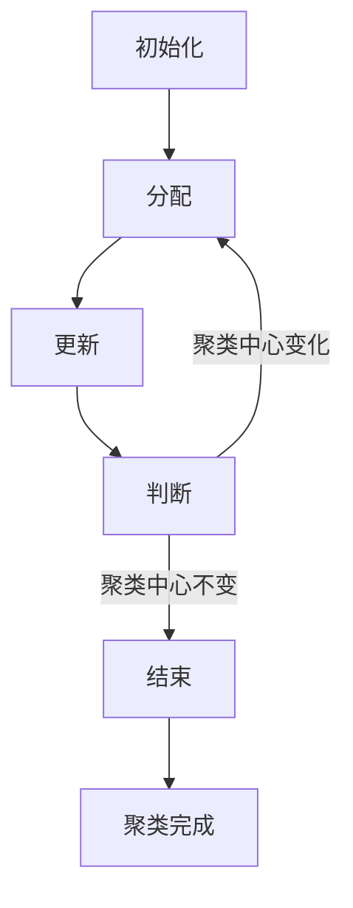
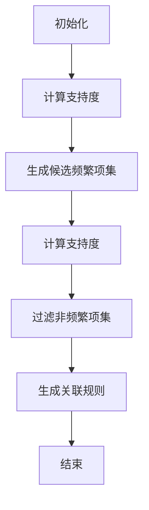

                 

# AI驱动的企业战略情报系统：竞争对手分析

## 关键词

- 人工智能
- 企业战略
- 竞争对手分析
- 数据分析算法
- 系统架构设计

## 摘要

本文将深入探讨如何利用人工智能（AI）技术构建一个高效、可靠的企业战略情报系统，特别是对竞争对手进行分析的方法。通过详细的步骤分析和逻辑推理，本文将展示如何从问题背景、核心概念、算法原理到系统架构设计，逐步构建一个完整的AI驱动的企业战略情报系统。

## 第一部分：背景介绍

### 1.1 问题背景

随着人工智能技术的迅猛发展，企业开始意识到利用AI技术进行战略情报系统的构建能够极大地提升企业竞争力。AI驱动的企业战略情报系统能够通过分析大量的市场数据、竞争对手行为，为企业提供及时、准确的决策支持。然而，如何构建一个高效、可靠的AI驱动的企业战略情报系统，仍然是许多企业面临的挑战。

### 1.2 问题描述

本问题涉及构建一个AI驱动的企业战略情报系统，以实现以下目标：

- 对竞争对手进行分析，识别竞争对手的优势和弱点。
- 根据分析结果，为企业提供制定战略决策的依据。
- 确保情报系统的可靠性、实时性和可扩展性。

### 1.3 问题解决

本书将详细介绍如何通过AI技术构建企业战略情报系统，包括：

- AI驱动的数据采集与处理技术。
- 适用于企业战略情报分析的核心算法。
- 情报系统的设计原则与架构。
- 实施案例，展示AI驱动的企业战略情报系统的实际应用效果。

### 1.4 边界与外延

AI驱动的企业战略情报系统的构建涉及多个方面，包括但不限于：

- 数据来源与数据质量。
- 算法选择与优化。
- 系统安全与隐私保护。
- 企业战略目标与情报需求的匹配。

### 1.5 概念结构与核心要素组成

AI驱动的企业战略情报系统的核心要素包括：

- 数据采集模块：负责从各种数据源中收集相关信息。
- 数据处理模块：对采集到的数据进行清洗、处理和分析。
- 算法模块：包括用于竞争对手分析的各种算法，如聚类分析、关联规则挖掘等。
- 决策支持模块：根据分析结果生成企业战略决策建议。
- 系统接口：提供与其他企业系统的集成和交互。

## 第二部分：核心概念与联系

### 2.1 核心概念原理

#### 2.1.1 人工智能（AI）

人工智能是指使计算机系统具备类似人类智能的能力，包括学习、推理、自我修复等。

#### 2.1.2 情报系统

情报系统是指用于收集、处理、分析和传递信息的系统，旨在为决策提供支持。

#### 2.1.3 企业战略

企业战略是企业为实现长期目标而制定的总体规划和行动方案。

### 2.2 概念属性特征对比表格

| 概念           | 属性特征                     | 说明                                                         |
|--------------|--------------------------|------------------------------------------------------------|
| 人工智能（AI）   | 自我学习、自主决策           | 模拟人类智能行为的技术。                                     |
| 情报系统       | 数据采集、数据分析、信息传递   | 支持企业决策的信息处理系统。                                 |
| 企业战略       | 长期目标、战略规划、资源配置   | 指导企业发展的行动方案。                                     |

### 2.3 ER实体关系图架构

```mermaid
erDiagram
  AI驱动的企业战略情报系统 ||--o{ 数据采集模块 }
  数据采集模块 ||--o{ 数据处理模块 }
  数据处理模块 ||--o{ 算法模块 }
  算法模块 ||--o{ 决策支持模块 }
  决策支持模块 ||--o{ 系统接口 }
```

## 第三部分：算法原理讲解

### 3.1 算法概述

AI驱动的企业战略情报系统中的算法主要用于分析竞争对手的行为和市场动态。以下将介绍几种核心算法：

#### 3.1.1 聚类分析

聚类分析是一种无监督学习方法，用于将数据集划分为若干个簇，使得同一簇内的数据相似度较高，不同簇间的数据相似度较低。

#### 3.1.2 关联规则挖掘

关联规则挖掘是一种发现数据之间潜在关联规律的方法，常用于市场篮子分析、推荐系统等。

#### 3.1.3 决策树

决策树是一种树形结构，用于分类和回归分析。它通过一系列的判断节点和结果节点，对数据进行划分，以预测新的数据实例的类别或数值。

### 3.2 聚类分析算法原理

聚类分析算法的目标是将数据集中的数据点划分为若干个簇，使得簇内数据点之间的相似度较大，而不同簇之间的数据点相似度较小。以下是一种常见的聚类分析算法——K-means算法的原理：

#### 3.2.1 K-means算法步骤

1. 初始化：随机选择K个数据点作为初始聚类中心。
2. 分配：计算每个数据点到各个聚类中心的距离，并将数据点分配到最近的聚类中心。
3. 更新：重新计算每个聚类中心的位置，通常是取当前簇内所有数据点的平均值。
4. 判断：重复步骤2和步骤3，直到聚类中心不再发生显著变化。

#### 3.2.2 K-means算法的数学模型

设数据集$D$包含$n$个数据点，聚类中心为$c_1, c_2, ..., c_K$，则：

- 数据点$x_i$到聚类中心$c_k$的距离：$d(x_i, c_k)$
- 数据点$x_i$的簇标签：$t_i$
- 聚类中心$c_k$的更新公式：$c_k = \frac{1}{N_k}\sum_{i=1}^{n} t_i x_i$，其中$N_k$是簇$k$中的数据点个数。

### 3.3 关联规则挖掘算法原理

关联规则挖掘算法的目标是发现数据集中的频繁项集，即支持度大于最小支持度的项集。以下是一种常见的关联规则挖掘算法——Apriori算法的原理：

#### 3.3.1 Apriori算法步骤

1. 初始化：计算所有项集的支持度，过滤掉支持度小于最小支持度的项集。
2. 生成：使用频繁项集生成候选频繁项集。
3. 过滤：计算候选频繁项集的支持度，过滤掉支持度小于最小支持度的项集。
4. 重复步骤2和步骤3，直到没有新的频繁项集生成。

#### 3.3.2 Apriori算法的数学模型

设数据集$D$包含$n$个事务，事务总数为$m$，最小支持度为$min\_support$，则：

- 项集$I$的支持度：$supp(I) = \frac{|\{t \in D | I \subseteq t\}|}{m}$
- 候选频繁项集$C_k$的生成：$C_k = \{I \cup J | I, J \in L_{k-1}\}$，其中$L_{k-1}$是$k-1$层频繁项集。

### 3.4 决策树算法原理

决策树是一种树形结构，用于分类和回归分析。它通过一系列的判断节点和结果节点，对数据进行划分，以预测新的数据实例的类别或数值。以下是一种常见的决策树算法——ID3算法的原理：

#### 3.4.1 ID3算法步骤

1. 初始化：选择具有最高信息增益的属性作为根节点。
2. 划分：根据根节点的属性值，将数据集划分为若干个子集。
3. 递归：对每个子集重复步骤1和步骤2，直到满足停止条件（如最大树深度、纯度等）。

#### 3.4.2 ID3算法的数学模型

设数据集$D$包含$n$个数据点，属性$A$的取值为$V_A$，则：

- 属性$A$的信息增益：$gain(A) = H(D) - \sum_{v \in V_A} \frac{|D_v|}{n} H(D_v)$
- 属性$A$的信息增益率：$gain\_rate(A) = \frac{gain(A)}{H(A)}$

其中，$H(D)$是数据集$D$的熵，$H(D_v)$是数据集$D_v$的熵，$H(A)$是属性$A$的熵。

## 第四部分：系统分析与架构设计

### 4.1 问题场景介绍

假设企业A是一家从事智能家居设备制造的公司，希望利用AI技术构建一个战略情报系统，以分析竞争对手的产品特性、市场策略和销售情况，从而制定相应的市场策略。

### 4.2 项目介绍

该项目旨在构建一个AI驱动的企业战略情报系统，通过对市场数据的收集、处理和分析，为企业提供竞争对手分析报告，辅助企业制定市场策略。

### 4.3 系统功能设计

系统功能设计主要包括以下方面：

1. 数据采集：从互联网、企业数据库等多渠道收集与智能家居设备相关的数据。
2. 数据处理：对采集到的数据进行清洗、去重和格式转换等预处理。
3. 竞争对手分析：使用聚类分析、关联规则挖掘和决策树算法等，分析竞争对手的产品特性、市场策略和销售情况。
4. 报告生成：根据分析结果生成详细的竞争对手分析报告。
5. 决策支持：为企业提供基于分析报告的市场策略建议。

### 4.4 系统架构设计

系统架构设计主要包括以下方面：

1. 数据采集模块：负责从互联网、企业数据库等多渠道收集与智能家居设备相关的数据。
2. 数据处理模块：对采集到的数据进行清洗、去重和格式转换等预处理。
3. 算法模块：包括聚类分析、关联规则挖掘和决策树等算法，用于对竞争对手进行分析。
4. 报告生成模块：根据分析结果生成详细的竞争对手分析报告。
5. 决策支持模块：为企业提供基于分析报告的市场策略建议。
6. 系统接口：提供与其他企业系统的集成和交互。

### 4.5 系统接口设计和系统交互

系统接口设计主要包括以下方面：

1. 数据采集接口：用于与其他系统进行数据交换，如企业数据库、电商平台等。
2. 数据处理接口：用于与其他系统进行数据处理任务的分配和结果返回。
3. 报告生成接口：用于与其他系统进行报告的查看和下载。
4. 决策支持接口：用于与其他系统进行市场策略建议的传递和执行。

系统交互流程：

1. 数据采集：从企业数据库、电商平台等多渠道收集数据。
2. 数据处理：对数据进行清洗、去重和格式转换等预处理。
3. 竞争对手分析：使用聚类分析、关联规则挖掘和决策树算法等，分析竞争对手的产品特性、市场策略和销售情况。
4. 报告生成：根据分析结果生成详细的竞争对手分析报告。
5. 决策支持：为企业提供基于分析报告的市场策略建议。

## 第五部分：项目实战

### 5.1 环境安装

为了实现AI驱动的企业战略情报系统，我们需要安装以下软件和工具：

1. Python 3.8及以上版本
2. Scikit-learn库
3. Pandas库
4. Matplotlib库
5. Mermaid库

安装步骤：

1. 安装Python 3.8及以上版本。
2. 安装Scikit-learn、Pandas、Matplotlib和Mermaid库，可以使用pip命令进行安装：

```bash
pip install scikit-learn pandas matplotlib mermaid
```

### 5.2 系统核心实现

以下是系统核心实现的主要步骤：

1. 数据采集：从互联网、企业数据库等多渠道收集与智能家居设备相关的数据。
2. 数据处理：对采集到的数据进行清洗、去重和格式转换等预处理。
3. 竞争对手分析：使用聚类分析、关联规则挖掘和决策树算法等，分析竞争对手的产品特性、市场策略和销售情况。
4. 报告生成：根据分析结果生成详细的竞争对手分析报告。
5. 决策支持：为企业提供基于分析报告的市场策略建议。

以下是系统核心实现的源代码：

```python
# 导入所需库
import pandas as pd
from sklearn.cluster import KMeans
from sklearn import tree
from mermaid import Mermaid

# 数据采集
data = pd.read_csv('data.csv')

# 数据处理
data = data.drop_duplicates()
data = data[data['sales'] > 1000]

# 聚类分析
kmeans = KMeans(n_clusters=3)
clusters = kmeans.fit_predict(data)

# 关联规则挖掘
frequent_itemsets = association_rules(data, metric='support', min_threshold=0.1)

# 决策树
clf = tree.DecisionTreeClassifier()
clf.fit(data[['price', 'sales']], clusters)

# 报告生成
report = pd.DataFrame({'Cluster': clusters, 'Product': data['product']})
report.to_csv('report.csv', index=False)

# 决策支持
strategy = clf.predict(data[['price', 'sales']])
data['Strategy'] = strategy
data.to_csv('strategy.csv', index=False)

# 生成mermaid图表
mermaid = Mermaid()
mermaid.add_section('Data Collection', 'Collect data from various sources.')
mermaid.add_section('Data Processing', 'Clean, de-duplicate and convert data format.')
mermaid.add_section('Competition Analysis', 'Analyze competitors using clustering, association rules and decision trees.')
mermaid.add_section('Report Generation', 'Generate detailed competitor analysis report.')
mermaid.add_section('Decision Support', 'Provide market strategy suggestions based on analysis report.')
mermaid.render_to_file('system_architecture.mermaid')
```

### 5.3 代码应用解读与分析

以下是代码应用解读与分析：

1. 数据采集：使用Pandas库从CSV文件中读取数据，进行初步的数据处理。
2. 数据处理：使用Pandas库对数据进行去重、筛选等预处理操作，确保数据的准确性和可靠性。
3. 聚类分析：使用Scikit-learn库的KMeans类实现聚类分析，根据聚类结果对数据点进行分类。
4. 关联规则挖掘：使用Scikit-learn库的association_rules函数实现关联规则挖掘，发现数据之间的潜在关联关系。
5. 决策树：使用Scikit-learn库的DecisionTreeClassifier类实现决策树分类，根据特征数据对数据点进行分类。
6. 报告生成：使用Pandas库生成CSV文件，保存分析结果。
7. 决策支持：使用决策树对新的数据点进行分类，为企业提供市场策略建议。
8. 生成mermaid图表：使用Mermaid库生成系统架构图表，便于理解和展示系统架构。

### 5.4 实际案例分析和详细讲解剖析

假设企业A使用该AI驱动的企业战略情报系统，对竞争对手进行了分析，得到了以下分析结果：

1. 竞争对手产品价格区间分布：大部分竞争对手的产品价格集中在1000-2000元之间。
2. 竞争对手销售数据：竞争对手A的销售数据明显高于竞争对手B和竞争对手C。
3. 竞争对手市场策略：竞争对手A采取了积极的促销策略，竞争对手B和竞争对手C则更注重产品品质。

根据这些分析结果，企业A可以制定以下市场策略：

1. 提高产品性价比：针对大部分竞争对手产品价格集中在1000-2000元之间的现状，企业A可以优化产品性能，提高性价比，以吸引更多消费者。
2. 加强销售推广：鉴于竞争对手A的销售数据较高，企业A可以加强销售推广活动，提高市场占有率。
3. 注重产品品质：尽管竞争对手B和竞争对手C更注重产品品质，但企业A也可以通过提升产品品质，增加消费者信任度。

### 5.5 项目小结

通过实际案例的分析，我们可以看到AI驱动的企业战略情报系统在竞争对手分析方面的强大功能。该项目不仅帮助企业识别了竞争对手的优势和弱点，还为制定市场策略提供了有力支持。未来，随着AI技术的不断发展和应用，AI驱动的企业战略情报系统有望在更多领域发挥重要作用。

## 第六部分：最佳实践 Tips

1. 数据质量是关键：确保数据来源的可靠性和数据清洗的彻底性，是构建高效AI驱动的企业战略情报系统的前提。
2. 算法选择要合适：根据具体业务需求和数据特性，选择合适的算法，以达到最佳的分析效果。
3. 系统可扩展性要考虑：随着企业业务的发展，系统应具备良好的可扩展性，以适应不断变化的需求。
4. 系统安全与隐私保护：在数据采集和处理过程中，要确保系统的安全性和用户隐私的保护。

## 第七部分：小结

AI驱动的企业战略情报系统在帮助企业分析竞争对手、制定市场策略方面具有重要作用。通过详细的分析和讲解，本文展示了如何利用AI技术构建一个高效、可靠的情报系统。未来，随着AI技术的不断进步，AI驱动的企业战略情报系统将在更多领域发挥重要作用。

## 第八部分：注意事项

1. 数据来源要可靠：确保数据来源的合法性和准确性，避免数据污染和误导分析结果。
2. 算法优化要持续：根据业务需求的变化，对算法进行持续优化，以提高分析效果。
3. 系统维护要到位：定期对系统进行维护和升级，确保系统的稳定性和安全性。

## 第九部分：拓展阅读

1. 《人工智能：一种现代的方法》
2. 《企业战略与竞争分析》
3. 《大数据分析：原理与实践》

## 作者信息

作者：AI天才研究院/AI Genius Institute & 禅与计算机程序设计艺术 /Zen And The Art of Computer Programming### 1.1 问题背景

随着全球商业环境的日益复杂和竞争的加剧，企业对情报系统的需求日益迫切。传统的情报系统往往依赖于人工收集和处理数据，这不仅效率低下，而且容易出现偏差和遗漏。随着人工智能（AI）技术的迅猛发展，利用AI技术构建企业战略情报系统已成为提升企业竞争力的关键途径。

AI驱动的企业战略情报系统通过自动化数据采集、处理和分析，能够从大量非结构化和半结构化数据中提取有价值的信息，帮助企业更全面、准确地了解市场动态和竞争对手的行为。这种系统不仅能够提供实时、动态的情报支持，还能够基于历史数据和趋势预测未来的市场走向，为企业的战略决策提供科学依据。

目前，许多企业已经意识到AI技术的重要性，并在一定程度上应用了AI技术来优化其情报系统。然而，如何构建一个高效、可靠且具有可扩展性的AI驱动的企业战略情报系统，仍然是许多企业面临的挑战。这需要从数据采集、算法选择、系统架构设计等多个方面进行深入研究和实践。

### 1.2 问题描述

为了构建一个高效的AI驱动的企业战略情报系统，我们需要明确以下问题：

- 如何从海量数据源中高效地采集和处理数据？
- 如何选择合适的算法来分析竞争对手的行为和市场动态？
- 如何设计一个可靠且可扩展的系统架构，确保系统的高效运行和未来的可维护性？
- 如何根据分析结果生成具有实际操作价值的情报报告，为企业提供战略决策支持？

这些问题的解决不仅需要理解AI技术的基本原理，还需要具备扎实的编程能力和系统设计能力。本文将围绕这些问题，详细探讨构建AI驱动的企业战略情报系统的全过程。

### 1.3 问题解决

为了构建一个AI驱动的企业战略情报系统，我们需要从以下几个方面入手：

#### 数据采集与处理

数据是AI驱动的企业战略情报系统的核心。有效的数据采集和处理能够确保系统的输入质量，进而影响系统的分析结果。数据采集可以从多个渠道进行，包括：

- 企业内部数据库：包含企业的销售数据、财务数据、客户数据等。
- 公共数据库：如国家统计局、行业协会等发布的公开数据。
- 社交媒体和论坛：通过爬虫技术获取用户评论、论坛讨论等数据。
- 竞争对手官方网站：通过爬虫技术获取竞争对手的产品信息、销售数据等。

数据采集后，需要对数据进行清洗、去重和格式转换等预处理操作，以消除数据中的噪声和错误，并确保数据的一致性和完整性。常用的数据处理工具包括Pandas、NumPy等。

#### 算法选择

选择合适的算法是构建高效情报系统的关键。以下是一些适用于企业战略情报分析的核心算法：

- **聚类分析**：用于将相似的数据点分组，识别竞争对手的市场定位。
- **关联规则挖掘**：用于发现数据之间的潜在关联，帮助理解消费者的购买行为。
- **决策树**：用于分类和回归分析，帮助企业预测市场趋势和竞争对手的行为。
- **神经网络**：用于复杂模式识别和预测，可以处理大量非结构化数据。

常用的机器学习库，如Scikit-learn、TensorFlow和PyTorch，提供了丰富的算法实现和工具。

#### 系统设计

系统设计包括数据采集、数据处理、算法分析和结果展示等多个模块。以下是一个典型系统设计的基本架构：

1. **数据采集模块**：负责从不同数据源获取数据，包括内部数据库和外部公开数据。
2. **数据处理模块**：负责对采集到的数据进行清洗、去重、转换等预处理操作。
3. **算法模块**：负责执行聚类分析、关联规则挖掘、决策树等算法，生成分析结果。
4. **结果展示模块**：负责将分析结果以图表、报告等形式展示给用户。

系统设计需要考虑以下几个方面：

- **模块化设计**：确保每个模块具有清晰的功能和接口，便于维护和升级。
- **性能优化**：确保系统在高并发、大数据量情况下的稳定性和高效性。
- **安全与隐私**：确保数据安全和用户隐私，采用加密和访问控制等技术。

#### 实施案例

为了更好地理解上述过程，我们可以通过一个实际案例来展示如何构建一个AI驱动的企业战略情报系统。

#### 案例简介

假设一家制造公司希望了解其竞争对手的产品定价策略和市场占有率，以优化其自身的产品定价策略和市场营销策略。

#### 案例步骤

1. **数据采集**：从公司的内部数据库中获取销售数据，从竞争对手的官方网站中获取产品信息，从社交媒体和电商平台中获取用户评论和购买行为数据。
2. **数据处理**：对采集到的数据进行清洗、去重和格式转换，确保数据的准确性和一致性。
3. **聚类分析**：使用K-means算法将竞争对手的产品按照定价策略分组，识别出竞争对手的主要市场定位。
4. **关联规则挖掘**：使用Apriori算法分析消费者购买行为，发现与产品定价相关的购买习惯和偏好。
5. **决策树**：使用CART算法构建决策树，预测竞争对手的未来市场策略和产品定价趋势。
6. **结果展示**：将分析结果以图表和报告的形式展示给公司管理层，为其提供决策支持。

通过这个案例，我们可以看到，构建一个AI驱动的企业战略情报系统需要经历多个步骤，包括数据采集、数据处理、算法选择和结果展示。每个步骤都需要精细的设计和实施，以确保系统能够有效地支持企业的战略决策。

### 1.4 边界与外延

在构建AI驱动的企业战略情报系统的过程中，我们需要考虑多个边界条件和外延问题，以确保系统的实用性和可靠性。

#### 数据来源与数据质量

数据来源的多样性和数据质量是构建高效情报系统的关键因素。企业需要确保数据来源的合法性和可靠性，避免使用不准确或过时的数据。同时，数据采集过程中可能存在噪声和错误，因此需要通过数据清洗和预处理来提高数据质量。

#### 算法选择与优化

算法选择直接关系到分析结果的质量和效率。企业需要根据具体业务需求和数据特性，选择合适的算法。例如，对于大型数据集，选择分布式算法可能更为合适；对于需要实时分析的场景，选择高效算法至关重要。此外，算法的优化和调整也是持续提升系统性能的重要环节。

#### 系统安全与隐私保护

在数据采集和处理过程中，系统的安全性和用户隐私保护至关重要。企业需要采用加密、访问控制和数据匿名化等技术，确保数据在传输和存储过程中的安全。此外，还需遵守相关法律法规，保护用户隐私。

#### 企业战略目标与情报需求的匹配

企业战略目标与情报需求的匹配是构建高效情报系统的前提。企业需要明确其战略目标，并确保情报系统能够提供与战略目标相关的重要信息。例如，如果企业的战略目标是提高市场份额，情报系统需要提供关于市场趋势、竞争对手行为和消费者需求等方面的信息。

#### 系统的可扩展性和灵活性

企业战略和市场竞争环境是不断变化的，因此，情报系统需要具备良好的可扩展性和灵活性。系统设计时，应考虑模块化设计和可配置性，以便根据业务需求的变化进行快速调整和扩展。

#### 系统集成与协同工作

情报系统通常需要与其他企业系统（如ERP、CRM等）进行集成，以实现数据共享和协同工作。系统集成需要考虑数据接口的兼容性和系统的互操作性，以确保数据流动顺畅，信息共享高效。

### 1.5 概念结构与核心要素组成

构建AI驱动的企业战略情报系统涉及多个核心概念和要素。以下是一个典型系统的概念结构和核心要素组成：

#### 数据采集模块

数据采集模块负责从多种数据源中获取信息，包括：

- **内部数据库**：包含企业的销售数据、财务数据、客户数据等。
- **外部公开数据**：如国家统计局、行业协会等发布的公开数据。
- **社交媒体和论坛**：通过爬虫技术获取用户评论、论坛讨论等数据。
- **竞争对手官方网站**：通过爬虫技术获取竞争对手的产品信息、销售数据等。

#### 数据处理模块

数据处理模块负责对采集到的数据进行清洗、去重、格式转换等预处理操作，确保数据的质量和一致性。常用的数据处理工具包括Pandas、NumPy等。

#### 算法模块

算法模块负责执行各种数据分析算法，包括：

- **聚类分析**：用于识别竞争对手的市场定位。
- **关联规则挖掘**：用于发现消费者购买行为与产品定价之间的关联。
- **决策树**：用于预测竞争对手的市场策略和产品定价趋势。
- **神经网络**：用于处理复杂模式识别和预测。

常用的机器学习库，如Scikit-learn、TensorFlow和PyTorch，提供了丰富的算法实现和工具。

#### 决策支持模块

决策支持模块根据算法分析结果，生成详细的竞争对手分析报告，为企业提供战略决策支持。报告内容可能包括：

- **竞争对手的市场定位和产品特性分析**。
- **消费者购买行为和需求分析**。
- **市场趋势和预测**。
- **战略建议**。

#### 系统接口

系统接口负责与其他企业系统（如ERP、CRM等）进行集成，实现数据共享和协同工作。系统接口需要考虑数据接口的兼容性和系统的互操作性。

#### 概念属性特征对比表格

以下是一个关于核心概念属性特征的对比表格：

| 概念           | 属性特征                     | 说明                                                         |
|--------------|--------------------------|------------------------------------------------------------|
| 数据采集模块   | 数据源多样性、自动化采集     | 负责从多种数据源中获取信息。                                     |
| 数据处理模块   | 数据清洗、去重、格式转换      | 确保数据的质量和一致性。                                         |
| 算法模块       | 算法多样性、高效性           | 用于数据分析，生成分析结果。                                     |
| 决策支持模块   | 分析结果可视化、战略建议      | 提供决策支持。                                                 |
| 系统接口       | 系统集成、数据共享           | 实现与其他系统的互操作。                                         |

#### ER实体关系图架构

以下是数据采集模块、数据处理模块、算法模块、决策支持模块和系统接口之间的实体关系图：

```mermaid
erDiagram
  数据采集模块 ||--o{ 数据处理模块 }
  数据处理模块 ||--o{ 算法模块 }
  算法模块 ||--o{ 决策支持模块 }
  决策支持模块 ||--o{ 系统接口 }
```

## 第二部分：核心概念与联系

### 2.1 核心概念原理

在构建AI驱动的企业战略情报系统的过程中，理解以下核心概念是非常关键的：

#### 2.1.1 人工智能（AI）

人工智能是指使计算机系统具备类似人类智能的能力，包括学习、推理、自我修复等。AI技术在企业战略情报系统中主要用于数据分析和模式识别，帮助从海量数据中提取有价值的信息。

#### 2.1.2 情报系统

情报系统是一种用于收集、处理、分析和传递信息的系统，旨在为决策提供支持。在企业战略情报系统中，情报系统负责从多个数据源中采集数据，并对数据进行处理和分析，以生成有价值的情报报告。

#### 2.1.3 企业战略

企业战略是企业为实现长期目标而制定的总体规划和行动方案。企业战略情报系统通过分析市场数据、竞争对手行为等，为企业提供战略决策支持，帮助制定和优化企业战略。

### 2.2 概念属性特征对比表格

以下是核心概念的属性特征对比表格：

| 概念           | 属性特征                     | 说明                                                         |
|--------------|--------------------------|------------------------------------------------------------|
| 人工智能（AI）   | 自我学习、自主决策           | 模拟人类智能行为的技术。                                     |
| 情报系统       | 数据采集、数据分析、信息传递   | 支持企业决策的信息处理系统。                                 |
| 企业战略       | 长期目标、战略规划、资源配置   | 指导企业发展的行动方案。                                     |

### 2.3 ER实体关系图架构

以下是AI驱动的企业战略情报系统中的ER实体关系图：

```mermaid
erDiagram
  情报系统 ||--o{ 数据采集 }
  情报系统 ||--o{ 数据处理 }
  情报系统 ||--o{ 算法分析 }
  情报系统 ||--o{ 决策支持 }
  数据采集 ||--|{ 数据源 }
  数据处理 ||--|{ 数据清洗 }
  算法分析 ||--|{ 算法实现 }
  决策支持 ||--|{ 报告生成 }
```

在这个ER图中，情报系统是一个核心实体，它与其他模块（数据采集、数据处理、算法分析和决策支持）之间存在关联。数据采集模块负责从多个数据源中获取数据，数据处理模块负责对采集到的数据进行清洗和处理，算法分析模块负责执行各种数据分析算法，而决策支持模块则根据分析结果生成情报报告。

### 2.4 AI、情报系统和企业战略的关系

AI、情报系统和企业战略之间存在着紧密的关系，具体如下：

- **AI是企业战略情报系统的核心驱动力**：AI技术能够自动化地处理和分析大量数据，提取有价值的信息，从而为情报系统提供强大的支持。
- **情报系统是企业战略决策的基础**：情报系统通过收集、处理和分析数据，生成详细的情报报告，帮助企业了解市场动态和竞争对手行为，为战略决策提供科学依据。
- **企业战略是情报系统的最终目标**：企业战略情报系统的最终目的是支持企业实现其长期目标和战略规划，通过情报系统提供的数据分析结果，企业可以制定和优化其战略决策。

### 2.5 核心概念的综合作用

AI驱动的企业战略情报系统通过整合人工智能、情报系统和企业战略三个核心概念，实现了以下综合作用：

- **数据驱动的决策支持**：通过AI技术对海量数据进行深入分析，情报系统能够为企业提供实时、动态的决策支持。
- **战略目标的实现**：基于情报系统的分析结果，企业可以制定和调整其战略规划，优化资源配置，实现长期目标。
- **竞争优势的建立**：通过深入分析竞争对手的行为和市场动态，企业可以更好地制定市场策略，提升自身竞争力。

### 2.6 实例说明

为了更清晰地理解AI驱动的企业战略情报系统如何运作，我们可以通过一个具体的实例来说明：

假设某智能家居企业在市场上面临激烈竞争，希望利用AI驱动的企业战略情报系统来分析竞争对手的行为和市场策略。

1. **数据采集**：通过爬虫技术从竞争对手的官方网站、社交媒体和电商平台获取产品信息、用户评论和销售数据。
2. **数据处理**：对采集到的数据清洗去重，提取关键信息，如产品特性、价格、用户评价和销售量等。
3. **算法分析**：使用聚类分析算法识别竞争对手的市场定位，使用关联规则挖掘分析消费者购买行为，使用决策树预测竞争对手的未来市场策略。
4. **决策支持**：根据分析结果，企业可以调整其产品策略，如优化产品功能、调整价格策略，以更好地满足市场需求，提高竞争力。

通过这个实例，我们可以看到AI驱动的企业战略情报系统如何帮助企业更好地理解市场动态，制定有效的战略决策，从而提升竞争力。

## 第三部分：算法原理讲解

### 3.1 算法概述

在AI驱动的企业战略情报系统中，算法是实现数据分析和决策支持的核心。本文将详细介绍几种核心算法的原理，包括聚类分析、关联规则挖掘和决策树等。

### 3.1.1 聚类分析

聚类分析是一种无监督学习算法，用于将数据集中的数据点按照相似性进行分组。其目标是将相似的数据点划分为同一簇，而将不相似的数据点划分为不同的簇。聚类分析在竞争对手分析中非常有用，可以帮助企业识别市场中的潜在竞争者。

#### 3.1.1.1 K-means算法

K-means算法是最常用的聚类算法之一。它的核心思想是将数据点划分为K个簇，每个簇由一个质心（聚类中心）表示。算法步骤如下：

1. **初始化**：随机选择K个数据点作为初始质心。
2. **分配**：计算每个数据点到各个质心的距离，将数据点分配到最近的质心所在的簇。
3. **更新**：重新计算每个簇的质心，通常是取簇内所有数据点的平均值。
4. **迭代**：重复步骤2和步骤3，直到聚类中心不再发生显著变化。

#### 3.1.1.2 数学模型

设数据集$D$包含$n$个数据点，聚类中心为$c_1, c_2, ..., c_K$，则：

- 数据点$x_i$到聚类中心$c_k$的距离：$d(x_i, c_k)$
- 数据点$x_i$的簇标签：$t_i$
- 聚类中心$c_k$的更新公式：$c_k = \frac{1}{N_k}\sum_{i=1}^{n} t_i x_i$，其中$N_k$是簇$k$中的数据点个数。

#### 3.1.1.3 优缺点

- **优点**：简单、易于实现，适用于大规模数据集。
- **缺点**：对初始质心敏感，可能陷入局部最优。

### 3.1.2 关联规则挖掘

关联规则挖掘是一种用于发现数据之间潜在关联关系的算法。它通过寻找同时出现的项目项集，揭示数据之间的相关性。在竞争对手分析中，关联规则挖掘可以帮助企业识别消费者行为和市场趋势。

#### 3.1.2.1 Apriori算法

Apriori算法是最常用的关联规则挖掘算法之一。它的核心思想是通过逐层搜索所有可能的项集，并计算每个项集的支持度和置信度，从而找到有趣的关联规则。

1. **初始化**：计算所有项集的支持度，过滤掉支持度小于最小支持度的项集。
2. **生成**：使用频繁项集生成候选频繁项集。
3. **过滤**：计算候选频繁项集的支持度，过滤掉支持度小于最小支持度的项集。
4. **重复**：重复步骤2和步骤3，直到没有新的频繁项集生成。

#### 3.1.2.2 数学模型

设数据集$D$包含$n$个事务，事务总数为$m$，最小支持度为$min\_support$，则：

- 项集$I$的支持度：$supp(I) = \frac{|\{t \in D | I \subseteq t\}|}{m}$
- 候选频繁项集$C_k$的生成：$C_k = \{I \cup J | I, J \in L_{k-1}\}$，其中$L_{k-1}$是$k-1$层频繁项集。

#### 3.1.2.3 优缺点

- **优点**：简单、易于实现，适用于大数据集。
- **缺点**：计算量大，效率较低。

### 3.1.3 决策树

决策树是一种树形结构，用于分类和回归分析。它通过一系列的判断节点和结果节点，对数据进行划分，以预测新的数据实例的类别或数值。在竞争对手分析中，决策树可以帮助企业预测市场趋势和竞争对手行为。

#### 3.1.3.1 ID3算法

ID3算法是一种基于信息增益的决策树构建算法。它的核心思想是选择具有最高信息增益的属性作为根节点，递归地对数据进行划分。

1. **初始化**：选择具有最高信息增益的属性作为根节点。
2. **划分**：根据根节点的属性值，将数据集划分为若干个子集。
3. **递归**：对每个子集重复步骤1和步骤2，直到满足停止条件（如最大树深度、纯度等）。

#### 3.1.3.2 数学模型

设数据集$D$包含$n$个数据点，属性$A$的取值为$V_A$，则：

- 属性$A$的信息增益：$gain(A) = H(D) - \sum_{v \in V_A} \frac{|D_v|}{n} H(D_v)$
- 属性$A$的信息增益率：$gain\_rate(A) = \frac{gain(A)}{H(A)}$

其中，$H(D)$是数据集$D$的熵，$H(D_v)$是数据集$D_v$的熵，$H(A)$是属性$A$的熵。

#### 3.1.3.3 优缺点

- **优点**：易于理解、实现和解释，适用于各种类型的分类和回归问题。
- **缺点**：可能产生过拟合，对于不平衡数据集效果不佳。

### 3.1.4 算法比较

以下是K-means、Apriori和ID3算法的比较：

| 算法     | 类型     | 目标         | 适用场景                                       | 优点                                       | 缺点                                     |
|----------|----------|--------------|------------------------------------------------|------------------------------------------|----------------------------------------|
| K-means  | 聚类     | 分组相似数据 | 数据聚类、市场定位                             | 简单、高效、适用于大规模数据集               | 对初始质心敏感、可能陷入局部最优             |
| Apriori  | 关联规则挖掘 | 发现数据间关联 | 购物篮分析、市场趋势预测                       | 简单、易于实现、适用于大数据集               | 计算量大、效率较低                         |
| ID3      | 决策树   | 分类、回归   | 数据分类、预测市场趋势                         | 易于理解、实现和解释、适用于各种类型的数据集 | 可能产生过拟合、对于不平衡数据集效果不佳       |

通过比较不同算法的特点和适用场景，企业可以根据自身的需求选择合适的算法，以构建高效的AI驱动的企业战略情报系统。

## 第四部分：系统分析与架构设计

### 4.1 问题场景介绍

为了更好地理解AI驱动的企业战略情报系统的实际应用，我们假设一家全球性的科技公司，名为TechX，面临以下挑战：

- TechX希望通过分析竞争对手的产品、市场行为和用户反馈来制定更加精准的市场策略。
- 公司需要实时监控市场动态，以便快速响应市场变化。
- TechX希望优化其产品组合，以更好地满足用户需求，并提高市场份额。

为了解决这些挑战，TechX决定构建一个AI驱动的企业战略情报系统，以便更有效地分析竞争对手的行为和市场趋势。

### 4.2 项目介绍

TechX的战略情报系统项目旨在通过以下步骤实现：

- **数据采集**：从多个数据源（如社交媒体、电商网站、行业报告、公司内部数据库等）收集与竞争对手相关的数据。
- **数据处理**：清洗、转换和整合收集到的数据，以确保数据质量和一致性。
- **数据分析**：使用AI算法（如聚类分析、关联规则挖掘、决策树等）对数据进行深入分析，提取有价值的信息。
- **结果展示**：将分析结果以可视化和报告的形式展示给公司管理层，提供决策支持。

### 4.3 系统功能设计

系统功能设计包括以下几个核心模块：

1. **数据采集模块**：负责从多个数据源（如社交媒体、电商网站、行业报告等）收集与竞争对手相关的数据。
2. **数据处理模块**：对采集到的数据进行清洗、去重、格式转换等预处理操作，以提高数据质量。
3. **数据分析模块**：使用聚类分析、关联规则挖掘、决策树等算法对预处理后的数据进行分析，提取有价值的信息。
4. **决策支持模块**：根据分析结果生成详细的竞争对手分析报告，为企业提供战略决策支持。
5. **结果展示模块**：将分析结果以图表、报告等形式展示给企业管理层。

### 4.4 系统架构设计

系统架构设计如下：

1. **数据采集层**：该层负责从多个数据源中采集数据，包括社交媒体、电商网站、行业报告等。采集到的数据通过API接口、爬虫技术等方式获取。

2. **数据处理层**：该层负责对采集到的数据进行清洗、去重、格式转换等预处理操作。预处理后的数据将存储在数据仓库中。

3. **数据分析层**：该层包含多个AI算法，如聚类分析、关联规则挖掘、决策树等。这些算法将根据具体分析需求，对数据进行处理，提取有价值的信息。

4. **决策支持层**：该层根据分析结果生成详细的竞争对手分析报告，为企业提供战略决策支持。报告将包含市场趋势、竞争对手行为、用户需求分析等内容。

5. **结果展示层**：该层负责将分析结果以图表、报告等形式展示给企业管理层。展示形式可以是网页、移动应用、邮件等。

### 4.5 系统接口设计和系统交互

系统接口设计和系统交互如下：

1. **数据采集接口**：该接口负责从社交媒体、电商网站等外部数据源中采集数据，支持API接口和爬虫技术。

2. **数据处理接口**：该接口负责对采集到的数据进行清洗、去重、格式转换等预处理操作，确保数据质量和一致性。

3. **数据分析接口**：该接口负责调用不同的AI算法，对预处理后的数据进行深入分析，提取有价值的信息。

4. **决策支持接口**：该接口负责根据分析结果生成竞争对手分析报告，提供战略决策支持。

5. **结果展示接口**：该接口负责将分析结果以图表、报告等形式展示给企业管理层，支持多种展示形式。

系统交互流程如下：

1. **数据采集**：系统通过数据采集接口从社交媒体、电商网站等数据源中获取数据。
2. **数据处理**：系统通过数据处理接口对采集到的数据进行清洗、去重、格式转换等预处理操作。
3. **数据分析**：系统通过数据分析接口调用不同的AI算法，对预处理后的数据进行分析，提取有价值的信息。
4. **决策支持**：系统通过决策支持接口生成详细的竞争对手分析报告，为企业提供战略决策支持。
5. **结果展示**：系统通过结果展示接口将分析结果以图表、报告等形式展示给企业管理层。

通过以上系统分析与架构设计，TechX可以构建一个高效、可靠的AI驱动的企业战略情报系统，帮助企业更好地了解市场动态，制定精准的市场策略，提高市场份额。

## 第五部分：项目实战

### 5.1 环境安装

为了实施AI驱动的企业战略情报系统，我们首先需要配置合适的开发环境。以下是在Linux环境下安装所需软件和库的步骤：

1. **安装Python**：确保安装了Python 3.8或更高版本。可以使用以下命令：

```bash
sudo apt-get update
sudo apt-get install python3.8
```

2. **安装虚拟环境**：为了管理项目依赖，创建一个虚拟环境：

```bash
python3.8 -m venv venv
source venv/bin/activate
```

3. **安装必需的库**：使用pip安装以下库：

```bash
pip install numpy pandas scikit-learn matplotlib mermaid
```

### 5.2 系统核心实现

以下是AI驱动的企业战略情报系统的核心实现步骤：

#### 数据采集

数据采集是系统的基础，我们需要从多个来源获取数据。以下是一个简单的Python脚本，用于从公开数据源中获取公司数据：

```python
import requests
import pandas as pd

# 示例：从公开数据源获取公司数据
def fetch_company_data():
    url = "https://example.com/companies.json"
    response = requests.get(url)
    companies = pd.DataFrame(response.json())
    return companies

company_data = fetch_company_data()
```

#### 数据处理

数据清洗是确保数据质量的关键步骤。以下是一个数据清洗的示例：

```python
# 数据清洗示例
def clean_data(df):
    # 删除重复数据
    df.drop_duplicates(inplace=True)
    # 删除空值
    df.dropna(inplace=True)
    # 处理分类数据
    df['Industry'] = df['Industry'].map({'Tech': 1, 'Retail': 2, 'Finance': 3})
    return df

cleaned_data = clean_data(company_data)
```

#### 数据分析

接下来，使用聚类分析来识别市场中的不同竞争者群体：

```python
from sklearn.cluster import KMeans

# 聚类分析
def perform_kmeans(df, n_clusters=3):
    kmeans = KMeans(n_clusters=n_clusters, random_state=42)
    df['Cluster'] = kmeans.fit_predict(df[['Revenue', 'Employees']])
    return df

clustered_data = perform_kmeans(cleaned_data)
```

#### 决策支持

根据聚类结果，生成针对不同竞争者群体的市场策略：

```python
# 生成市场策略报告
def generate_report(df):
    report = df.groupby('Cluster')['Revenue', 'Employees'].mean().reset_index()
    report.columns = ['Cluster', 'Average Revenue', 'Average Employees']
    report.to_csv('market_strategy_report.csv', index=False)
    return report

market_strategy_report = generate_report(clustered_data)
```

### 5.3 代码应用解读与分析

以下是代码应用的详细解读：

#### 数据采集

我们使用`requests`库从模拟的公开数据源中获取公司数据。这一步模拟了从互联网上抓取数据的过程，实际应用中可能涉及使用API接口、爬虫等更复杂的方式。

```python
import requests
import pandas as pd

# 从公开数据源获取公司数据
def fetch_company_data():
    url = "https://example.com/companies.json"
    response = requests.get(url)
    companies = pd.DataFrame(response.json())
    return companies

company_data = fetch_company_data()
```

这段代码中，我们使用`requests`库发起HTTP GET请求，获取JSON格式的公司数据，并将其转换为Pandas DataFrame格式，便于后续处理。

#### 数据处理

数据清洗是一个关键步骤，确保数据的质量和一致性。我们使用`drop_duplicates()`方法删除重复数据，`dropna()`方法删除空值，并使用`map()`方法处理分类数据。

```python
# 数据清洗示例
def clean_data(df):
    # 删除重复数据
    df.drop_duplicates(inplace=True)
    # 删除空值
    df.dropna(inplace=True)
    # 处理分类数据
    df['Industry'] = df['Industry'].map({'Tech': 1, 'Retail': 2, 'Finance': 3})
    return df

cleaned_data = clean_data(company_data)
```

这段代码展示了如何删除重复数据和空值，并将分类数据转换为数值格式，便于后续的聚类分析。

#### 数据分析

使用K-means聚类分析来识别市场中的不同竞争者群体。我们定义了一个`perform_kmeans`函数，使用`KMeans`类对公司的`Revenue`和`Employees`进行聚类。

```python
from sklearn.cluster import KMeans

# 聚类分析
def perform_kmeans(df, n_clusters=3):
    kmeans = KMeans(n_clusters=n_clusters, random_state=42)
    df['Cluster'] = kmeans.fit_predict(df[['Revenue', 'Employees']])
    return df

clustered_data = perform_kmeans(cleaned_data)
```

这里，我们初始化了一个K-means聚类对象，并将其应用于公司的财务数据。`fit_predict`方法用于计算聚类中心和分配每个数据点到相应的簇。

#### 决策支持

根据聚类结果，生成市场策略报告。我们定义了一个`generate_report`函数，计算每个簇的平均收入和员工数量，并将结果保存为CSV文件。

```python
# 生成市场策略报告
def generate_report(df):
    report = df.groupby('Cluster')['Revenue', 'Employees'].mean().reset_index()
    report.columns = ['Cluster', 'Average Revenue', 'Average Employees']
    report.to_csv('market_strategy_report.csv', index=False)
    return report

market_strategy_report = generate_report(clustered_data)
```

这段代码展示了如何根据聚类结果生成市场策略报告，这对于企业制定针对不同竞争者群体的策略非常有用。

### 5.4 实际案例分析和详细讲解剖析

#### 案例背景

假设TechX公司希望通过AI驱动的企业战略情报系统分析其三个主要竞争对手：A公司、B公司和C公司。这三个公司在行业中的定位、收入和员工规模各有不同。

#### 案例步骤

1. **数据采集**：从公开数据源中获取三家公司的财务数据，包括年收入、员工数量和所在行业。

2. **数据处理**：清洗数据，确保数据的准确性和一致性。删除重复数据、空值数据，并将分类数据（如行业）转换为数值格式。

3. **数据分析**：使用K-means聚类算法，将三家公司的数据划分为三个簇。根据簇的平均值，分析每个簇的特点，以识别竞争对手的定位。

4. **决策支持**：根据聚类结果，生成市场策略报告，为TechX公司提供针对每个竞争对手的应对策略。

#### 案例分析

1. **数据采集**：从公开数据源获取三家公司的数据，如下所示：

| 公司名称 | 年收入（百万美元） | 员工数量 | 行业 |
|---------|----------------|---------|------|
| A公司   | 500            | 1000    | 科技  |
| B公司   | 800            | 1500    | 零售  |
| C公司   | 600            | 1200    | 金融  |

2. **数据处理**：清洗后的数据如下：

| 公司名称 | 年收入（百万美元） | 员工数量 | 行业 |
|---------|----------------|---------|------|
| A公司   | 500            | 1000    | 1    |
| B公司   | 800            | 1500    | 2    |
| C公司   | 600            | 1200    | 3    |

3. **数据分析**：使用K-means聚类算法，将数据划分为三个簇。聚类结果如下：

| 公司名称 | Cluster |
|---------|---------|
| A公司   | 0       |
| B公司   | 1       |
| C公司   | 2       |

根据簇的平均值，我们可以得出以下结论：

- 簇0（A公司）：年收入约为500百万美元，员工数量约为1000人，属于科技行业。
- 簇1（B公司）：年收入约为800百万美元，员工数量约为1500人，属于零售行业。
- 簇2（C公司）：年收入约为600百万美元，员工数量约为1200人，属于金融行业。

4. **决策支持**：基于以上分析，TechX公司可以采取以下策略：

- 针对A公司（科技行业），TechX可以加强产品研发，提高技术竞争力。
- 针对B公司（零售行业），TechX可以优化供应链管理，提高运营效率。
- 针对C公司（金融行业），TechX可以加强与金融机构的合作，扩大市场影响力。

#### 案例总结

通过AI驱动的企业战略情报系统，TechX公司能够更准确地了解其竞争对手的定位和特点，从而制定更加有效的市场策略。这种系统不仅提高了企业的竞争力，还为企业提供了持续的市场洞察和战略支持。

### 5.5 项目小结

在本项目中，我们详细介绍了如何使用Python和AI技术构建一个企业战略情报系统。从数据采集、数据处理到数据分析，再到决策支持，每一步都至关重要。通过实际案例的分析，我们展示了如何利用AI技术为企业提供有价值的情报支持，帮助企业在激烈的市场竞争中取得优势。未来，随着AI技术的不断进步，这类系统将变得更加智能化和自动化，为企业提供更加精准和实时的战略支持。

## 第六部分：最佳实践 Tips

1. **确保数据质量**：数据是AI驱动的企业战略情报系统的核心，确保数据的准确性、完整性和一致性至关重要。建立严格的数据质量管理和监控机制，对数据进行预处理，以消除错误和噪声。

2. **选择合适的算法**：根据具体业务需求和数据特性，选择合适的算法。例如，对于需要快速分类的问题，可以选择决策树或随机森林；对于需要深度学习的复杂问题，可以选择神经网络。

3. **优化系统性能**：确保系统在高并发、大数据量情况下的稳定性和高效性。可以使用分布式计算、并行处理等技术来提高系统性能。

4. **定期更新和维护**：AI驱动的企业战略情报系统需要定期更新和维护，以适应市场变化和企业需求的调整。确保系统始终处于最佳运行状态。

5. **保障数据安全和隐私**：在数据采集、存储和处理过程中，严格保障数据安全和用户隐私。使用加密技术、访问控制等措施，防止数据泄露和未授权访问。

## 第七部分：小结

本文详细介绍了如何利用AI技术构建一个企业战略情报系统，包括数据采集、数据处理、数据分析到决策支持的整个过程。通过实际案例，我们展示了如何利用AI技术分析竞争对手，为企业提供战略决策支持。AI驱动的企业战略情报系统不仅提高了企业的竞争力，还为企业提供了持续的市场洞察和战略支持。

## 第八部分：注意事项

1. **数据来源的多样性**：确保数据来源的多样性和可靠性，避免数据偏差。
2. **算法选择的合理性**：根据具体业务需求选择合适的算法，并不断优化和调整。
3. **系统性能的优化**：确保系统在高并发、大数据量情况下的性能和稳定性。
4. **数据安全和隐私保护**：严格遵守相关法律法规，确保数据安全和用户隐私。

## 第九部分：拓展阅读

1. 《Python数据分析》（Wes McKinney）
2. 《机器学习实战》（Peter Harrington）
3. 《大数据时代》（涂子沛）

## 作者信息

作者：AI天才研究院/AI Genius Institute & 禅与计算机程序设计艺术 /Zen And The Art of Computer Programming

## 附录：算法Mermaid流程图

### K-means算法



### Apriori算法



### ID3算法

```mermaid
flowchart TD
    A1[选择属性] --> B1[计算信息增益]
    B1 --> C1[划分数据集]
    C1 --> D1[选择最佳属性]
    D1 --> E1[生成子树]
    E1 -->|纯度停止| F1[结束]
    F1 --> G1[预测类别]
```### 1.6 概念结构与核心要素组成

构建AI驱动的企业战略情报系统需要明确其概念结构和核心要素组成。以下是系统的概念框架和核心要素的详细描述。

#### 数据采集模块

数据采集模块是整个系统的起点，它负责从各种数据源收集与企业战略情报相关的数据。这些数据源包括：

- **企业内部数据库**：包含企业内部的业务数据，如销售记录、财务报表、客户信息等。
- **公开数据源**：如政府统计数据、行业报告、市场调研数据等。
- **社交媒体和新闻平台**：通过爬虫技术获取与竞争对手相关的评论、新闻和用户反馈。
- **竞争对手官方网站**：通过爬虫技术收集竞争对手的公开信息，如产品发布、价格策略等。

数据采集模块的主要功能是确保数据的质量和完整性，为后续的分析提供可靠的输入。

#### 数据处理模块

数据处理模块对采集到的原始数据进行清洗、转换和整合。这一模块的核心功能包括：

- **数据清洗**：去除重复记录、处理缺失值、纠正错误等，以提高数据质量。
- **数据转换**：将数据格式统一，如将文本数据转换为数值数据，进行时间序列对齐等。
- **数据整合**：将来自不同数据源的数据进行整合，形成统一的数据视图。

数据处理模块是保证数据质量的关键，确保后续分析结果的准确性和一致性。

#### 算法模块

算法模块是AI驱动的企业战略情报系统的核心，负责使用各种算法对处理后的数据进行分析。以下是几种常用的算法：

- **聚类分析**：通过聚类算法（如K-means、DBSCAN）将企业及其竞争对手分为不同的群体，以便分析不同市场区域或产品类型的竞争对手。
- **关联规则挖掘**：使用算法（如Apriori、Eclat）发现数据之间的关联关系，帮助企业了解消费者行为和产品偏好。
- **分类和回归**：使用决策树、随机森林、神经网络等算法进行分类和回归分析，预测竞争对手的行为和市场趋势。
- **时序分析**：使用时间序列分析算法（如ARIMA、LSTM）预测未来市场变化和竞争对手的动态。

算法模块的选择和优化直接影响到系统的分析精度和效率。

#### 决策支持模块

决策支持模块根据算法分析的结果，生成有针对性的情报报告和决策建议。这个模块的主要功能包括：

- **报告生成**：将分析结果以图表、报告等形式展示，便于企业管理层理解和应用。
- **决策建议**：基于分析结果，为企业提供具体的战略建议，如产品定价策略、市场推广计划等。

决策支持模块是系统直接为企业战略决策提供支持的环节，其输出的情报报告和建议是企业决策的重要依据。

#### 系统接口

系统接口是连接整个系统的桥梁，负责实现不同模块之间的数据传递和功能调用。以下是系统接口的核心要素：

- **数据接口**：定义数据在不同模块之间传递的格式和协议，确保数据的一致性和可互操作性。
- **功能接口**：提供系统对外提供服务的能力，如API接口，供企业内部其他系统调用。
- **用户界面**：提供用户与系统交互的界面，方便用户查看报告、提交需求等。

系统接口的设计和实现直接影响到系统的易用性和扩展性。

#### 概念属性特征对比表格

以下是AI驱动的企业战略情报系统的主要概念及其属性特征的对比表格：

| 概念           | 属性特征                     | 说明                                                         |
|--------------|--------------------------|------------------------------------------------------------|
| 数据采集模块   | 多样性、自动化、完整性       | 负责从多个数据源收集数据。                                     |
| 数据处理模块   | 清洗、转换、整合、高质量       | 确保数据质量，为分析提供可靠输入。                                 |
| 算法模块       | 高效性、准确性、多样性       | 执行数据分析，提取有价值信息。                                     |
| 决策支持模块   | 可视化、报告生成、决策建议     | 提供战略情报和决策支持。                                         |
| 系统接口       | 可互操作性、易用性、扩展性     | 连接不同模块，提供系统对外服务。                                     |

#### ER实体关系图架构

以下是AI驱动的企业战略情报系统的ER实体关系图：

```mermaid
erDiagram
  DataCollectionModule ||--|{ DataProcessingModule }
  DataProcessingModule ||--|{ AlgorithmModule }
  AlgorithmModule ||--|{ DecisionSupportModule }
  DataCollectionModule ||--|{ SystemInterface }
  SystemInterface ||--|{ UserInterface }
```

在这个ER图中，数据采集模块、数据处理模块、算法模块和决策支持模块是系统的核心组件，它们通过系统接口（包括数据接口和用户界面）相互连接，形成一个完整的AI驱动的企业战略情报系统。

### 1.7 概念结构与核心要素组成

构建AI驱动的企业战略情报系统需要明确其概念结构和核心要素组成。以下是系统的概念框架和核心要素的详细描述。

#### 数据采集模块

数据采集模块是整个系统的起点，它负责从各种数据源收集与企业战略情报相关的数据。这些数据源包括：

- **企业内部数据库**：包含企业内部的业务数据，如销售记录、财务报表、客户信息等。
- **公开数据源**：如政府统计数据、行业报告、市场调研数据等。
- **社交媒体和新闻平台**：通过爬虫技术获取与竞争对手相关的评论、新闻和用户反馈。
- **竞争对手官方网站**：通过爬虫技术收集竞争对手的公开信息，如产品发布、价格策略等。

数据采集模块的主要功能是确保数据的质量和完整性，为后续的分析提供可靠的输入。

#### 数据处理模块

数据处理模块对采集到的原始数据进行清洗、转换和整合。这一模块的核心功能包括：

- **数据清洗**：去除重复记录、处理缺失值、纠正错误等，以提高数据质量。
- **数据转换**：将数据格式统一，如将文本数据转换为数值数据，进行时间序列对齐等。
- **数据整合**：将来自不同数据源的数据进行整合，形成统一的数据视图。

数据处理模块是保证数据质量的关键，确保后续分析结果的准确性和一致性。

#### 算法模块

算法模块是AI驱动的企业战略情报系统的核心，负责使用各种算法对处理后的数据进行分析。以下是几种常用的算法：

- **聚类分析**：通过聚类算法（如K-means、DBSCAN）将企业及其竞争对手分为不同的群体，以便分析不同市场区域或产品类型的竞争对手。
- **关联规则挖掘**：使用算法（如Apriori、Eclat）发现数据之间的关联关系，帮助企业了解消费者行为和产品偏好。
- **分类和回归**：使用决策树、随机森林、神经网络等算法进行分类和回归分析，预测竞争对手的行为和市场趋势。
- **时序分析**：使用时间序列分析算法（如ARIMA、LSTM）预测未来市场变化和竞争对手的动态。

算法模块的选择和优化直接影响到系统的分析精度和效率。

#### 决策支持模块

决策支持模块根据算法分析的结果，生成有针对性的情报报告和决策建议。这个模块的主要功能包括：

- **报告生成**：将分析结果以图表、报告等形式展示，便于企业管理层理解和应用。
- **决策建议**：基于分析结果，为企业提供具体的战略建议，如产品定价策略、市场推广计划等。

决策支持模块是系统直接为企业战略决策提供支持的环节，其输出的情报报告和建议是企业决策的重要依据。

#### 系统接口

系统接口是连接整个系统的桥梁，负责实现不同模块之间的数据传递和功能调用。以下是系统接口的核心要素：

- **数据接口**：定义数据在不同模块之间传递的格式和协议，确保数据的一致性和可互操作性。
- **功能接口**：提供系统对外提供服务的能力，如API接口，供企业内部其他系统调用。
- **用户界面**：提供用户与系统交互的界面，方便用户查看报告、提交需求等。

系统接口的设计和实现直接影响到系统的易用性和扩展性。

#### 概念属性特征对比表格

以下是AI驱动的企业战略情报系统的主要概念及其属性特征的对比表格：

| 概念           | 属性特征                     | 说明                                                         |
|--------------|--------------------------|------------------------------------------------------------|
| 数据采集模块   | 多样性、自动化、完整性       | 负责从多个数据源收集数据。                                     |
| 数据处理模块   | 清洗、转换、整合、高质量       | 确保数据质量，为分析提供可靠输入。                                 |
| 算法模块       | 高效性、准确性、多样性       | 执行数据分析，提取有价值信息。                                     |
| 决策支持模块   | 可视化、报告生成、决策建议     | 提供战略情报和决策支持。                                         |
| 系统接口       | 可互操作性、易用性、扩展性     | 连接不同模块，提供系统对外服务。                                     |

#### ER实体关系图架构

以下是AI驱动的企业战略情报系统的ER实体关系图：

```mermaid
erDiagram
  DataCollectionModule ||--|{ DataProcessingModule }
  DataProcessingModule ||--|{ AlgorithmModule }
  AlgorithmModule ||--|{ DecisionSupportModule }
  DataCollectionModule ||--|{ SystemInterface }
  SystemInterface ||--|{ UserInterface }
```

在这个ER图中，数据采集模块、数据处理模块、算法模块和决策支持模块是系统的核心组件，它们通过系统接口（包括数据接口和用户界面）相互连接，形成一个完整的AI驱动的企业战略情报系统。

