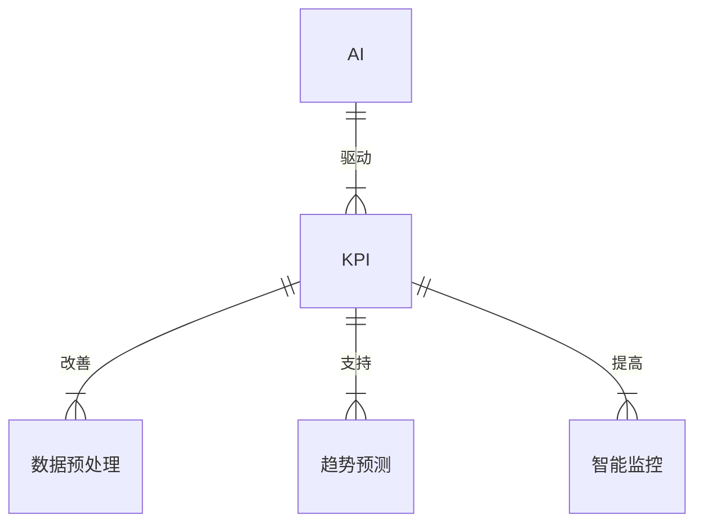

                 

### 第一部分：AI与企业战略执行监控概述

#### 第1章：引言

### 1.1 AI与企业战略执行监控的关系

随着人工智能技术的迅速发展，其在各个领域的应用越来越广泛，尤其是对企业战略执行监控的影响。AI技术的引入，不仅提高了监控的效率和准确性，还为企业的战略决策提供了有力支持。

企业战略执行监控是指通过一系列指标（KPI）来跟踪和评估企业在实现战略目标过程中的进展。这些指标可以是财务指标、市场指标、运营指标等。然而，传统的监控方法往往依赖于人工分析，存在效率低、准确性差的问题。

AI技术，尤其是机器学习和深度学习，可以通过自动化分析和预测，大幅提高监控的效率和准确性。例如，机器学习算法可以分析历史数据，预测未来的KPI趋势，从而帮助企业提前制定应对策略。

### 1.2 书籍目的与结构安排

本书旨在深入探讨AI驱动的企业战略执行监控，具体包括KPI智能跟踪与偏差分析。我们将通过以下几个部分来展开讨论：

1. **引言**：介绍AI与企业战略执行监控的关系，解释本书的目的和重要性。
2. **背景介绍**：讲述AI的发展背景、企业战略执行监控的重要性以及KPI的概念。
3. **核心概念与联系**：详细阐述AI、KPI、智能跟踪与偏差分析的概念、特征和关系。
4. **方法与应用**：介绍智能跟踪与偏差分析的方法和技术。
5. **案例分析**：通过具体案例展示AI驱动的企业战略执行监控的实际应用。
6. **实现与部署**：介绍如何实施AI驱动的企业战略执行监控。
7. **总结与展望**：总结书中的关键知识点，展望未来发展趋势。

### 1.3 内容的重要性

随着企业对AI技术的接受度和应用深度不断增加，AI驱动的企业战略执行监控已经成为企业竞争的重要手段。它不仅可以帮助企业实时跟踪战略执行情况，还能预测潜在问题，提前采取措施，从而提高企业的灵活性和应变能力。

本书通过详细的案例分析和技术讲解，帮助读者理解AI驱动的企业战略执行监控的原理和实践。无论你是AI领域的专业人士，还是对企业战略执行监控有需求的企业管理人员，本书都将为你提供有价值的参考和指导。

#### 目录

----------------------------------------------------------------

# AI驱动的企业战略执行监控：KPI智能跟踪与偏差分析

> 关键词：AI，企业战略，执行监控，KPI，智能跟踪，偏差分析

> 摘要：本书深入探讨了AI驱动的企业战略执行监控，包括KPI智能跟踪与偏差分析。通过理论讲解和实际案例，帮助读者理解如何利用AI技术提高企业战略执行监控的效率和准确性。

----------------------------------------------------------------

## 第一部分：AI与企业战略执行监控概述

### 第1章：引言
#### 1.1 AI与企业战略执行监控的关系
#### 1.2 书籍目的与结构安排
#### 1.3 内容的重要性

### 第2章：AI与KPI基础
#### 2.1 AI发展概述
#### 2.2 企业战略执行监控的必要性
#### 2.3 KPI的定义与作用

### 第3章：核心概念与联系
#### 3.1 AI核心概念
#### 3.2 KPI的属性与特征
#### 3.3 AI与KPI的关系
#### 3.4 Mermaid ER实体关系图

### 第4章：AI驱动的KPI智能跟踪方法
#### 4.1 数据采集与预处理
#### 4.2 特征提取与选择
#### 4.3 模型构建与训练
#### 4.4 模型评估与优化

### 第5章：KPI偏差分析
#### 5.1 偏差分析原理
#### 5.2 偏差识别方法
#### 5.3 偏差纠正策略

### 第6章：案例与实践
#### 6.1 案例一：企业财务监控
#### 6.2 案例二：供应链管理监控
#### 6.3 案例实践总结

### 第7章：实现与部署
#### 7.1 技术选型
#### 7.2 系统架构设计
#### 7.3 系统部署与维护
#### 7.4 潜在问题与解决方案

### 第8章：总结与展望
#### 8.1 关键知识点总结
#### 8.2 未来发展趋势
#### 8.3 注意事项与最佳实践

----------------------------------------------------------------

#### 第2章：AI与KPI基础

### 2.1 AI发展概述

人工智能（AI）作为计算机科学的一个重要分支，其目标是使计算机系统具备类似于人类智能的能力。AI的发展经历了几个重要阶段：从早期的规则推理系统，到基于统计学习的方法，再到深度学习的兴起。

近年来，随着计算能力的提升和大数据的普及，AI技术在各个领域都取得了显著的进展。在商业领域，AI被广泛应用于数据挖掘、智能推荐、客户关系管理等方面，极大地提高了企业的运营效率和竞争力。

### 2.2 企业战略执行监控的必要性

企业战略执行监控是确保企业实现其战略目标的重要手段。通过监控关键绩效指标（KPI），企业可以实时了解业务运行情况，及时发现和解决潜在问题。

然而，传统的监控方法往往依赖于人工分析，存在效率低、准确性差的问题。随着企业规模的扩大和数据量的增加，人工监控的难度和成本也大大增加。因此，引入AI技术进行战略执行监控变得尤为重要。

### 2.3 KPI的定义与作用

KPI（关键绩效指标）是衡量企业业务运行状况的重要指标。它通常包括财务指标、市场指标、运营指标等。通过监控KPI，企业可以了解业务进展情况，评估战略实施效果，发现潜在问题。

KPI在企业战略执行监控中的作用主要体现在以下几个方面：

1. **目标导向**：KPI可以明确企业的业务目标，帮助员工聚焦关键任务。
2. **绩效评估**：通过对比实际绩效和预期目标，KPI可以帮助企业评估业务运行状况，发现不足。
3. **决策支持**：KPI提供了实时数据，帮助企业制定有效的决策策略。

### 2.4 AI与KPI的关系

AI与KPI的关系主要体现在以下几个方面：

1. **数据预处理**：AI技术可以帮助企业高效地处理大量数据，提取有用的信息，为KPI分析提供数据支持。
2. **趋势预测**：通过机器学习算法，AI可以预测KPI的未来趋势，帮助企业在问题发生前采取预防措施。
3. **智能监控**：AI技术可以实现KPI的自动化监控，提高监控效率和准确性。

总之，AI与KPI的结合，不仅提高了企业战略执行监控的效率和准确性，还为企业的战略决策提供了有力支持。在下一章中，我们将深入探讨AI与KPI的核心概念、特征和关系。

#### 第3章：核心概念与联系

### 3.1 AI核心概念

人工智能（AI）的核心概念包括机器学习（ML）、深度学习（DL）和神经网络（NN）等。这些概念是理解AI技术的基础。

**机器学习**：机器学习是一种通过算法从数据中学习规律，进行预测或决策的技术。它依赖于统计方法和优化算法，可以从大量数据中自动发现模式。

**深度学习**：深度学习是机器学习的一个分支，它使用多层神经网络进行学习。通过递归神经网络（RNN）、卷积神经网络（CNN）等深度神经网络，深度学习在图像识别、语音识别等领域取得了显著成果。

**神经网络**：神经网络是一种模仿人脑工作原理的计算模型。它由大量相互连接的神经元组成，通过调整连接权重来实现学习。

### 3.2 KPI的属性与特征

KPI（关键绩效指标）具有以下属性和特征：

1. **目标导向**：KPI与企业的战略目标紧密相关，用于衡量业务进展情况。
2. **量化性**：KPI通常以具体的数据形式呈现，可以量化评估。
3. **可比较性**：KPI可以与企业内部或外部基准进行比较，评估绩效水平。
4. **实时性**：KPI需要实时更新，以便企业及时掌握业务状况。

### 3.3 AI与KPI的关系

AI与KPI的关系体现在以下几个方面：

1. **数据预处理**：AI技术可以帮助企业高效地处理大量KPI数据，提取有用的信息。
2. **趋势预测**：通过机器学习算法，AI可以预测KPI的未来趋势，帮助企业在问题发生前采取预防措施。
3. **智能监控**：AI技术可以实现KPI的自动化监控，提高监控效率和准确性。

为了更清晰地展示AI与KPI之间的关系，我们可以使用Mermaid ER实体关系图进行描述。



在这个ER图中，AI作为驱动因素，与KPI之间存在紧密的关系。KPI通过数据预处理、趋势预测和智能监控三个方面受到AI的影响，从而提高企业战略执行监控的效率和准确性。

### 3.4 Mermaid ER实体关系图

为了更直观地展示AI与KPI之间的关系，我们可以使用Mermaid ER实体关系图来表示。

```mermaid
erDiagram
  AI ||--|{ KPI } : 驱动
  KPI ||--|{ 数据预处理 } : 改善
  KPI ||--|{ 趋势预测 } : 支持
  KPI ||--|{ 智能监控 } : 提高
```

在这个ER图中，AI作为驱动因素，与KPI之间存在紧密的关系。KPI通过数据预处理、趋势预测和智能监控三个方面受到AI的影响，从而提高企业战略执行监控的效率和准确性。

通过这个ER图，我们可以清晰地看到AI与KPI之间的相互关系，以及AI技术如何通过这些关系来提升企业战略执行监控的效果。在下一章中，我们将深入探讨AI驱动的KPI智能跟踪方法，进一步了解如何利用AI技术提高KPI监控的效率和准确性。

### 第4章：AI驱动的KPI智能跟踪方法

#### 4.1 数据采集与预处理

在AI驱动的KPI智能跟踪中，数据采集与预处理是关键的第一步。数据采集涉及从多个来源收集与KPI相关的数据，如企业财务数据、市场数据、运营数据等。这些数据可以是结构化的（如数据库中的表格数据），也可以是非结构化的（如图像、音频、文本等）。

数据预处理的主要目的是确保数据质量，提高后续分析和预测的准确性。以下是一些常见的预处理步骤：

1. **数据清洗**：去除重复数据、填补缺失值、纠正错误数据等，以保证数据的准确性。
2. **数据转换**：将数据转换为适合分析和建模的格式，如将不同单位的数据统一为同一单位，将类别数据转换为数值形式等。
3. **数据归一化**：为了消除不同特征之间的量纲差异，通常需要将数据归一化或标准化。
4. **特征提取**：从原始数据中提取出对KPI有重要影响的关键特征，如时间序列数据中的趋势、季节性等。

#### 4.2 特征提取与选择

特征提取与选择是数据预处理的重要环节，其目的是从原始数据中提取出对KPI有重要影响的关键特征，以提高模型的预测性能。以下是一些常用的特征提取与选择方法：

1. **统计特征提取**：通过计算原始数据的统计量，如均值、方差、最大值、最小值等，提取出能够反映数据分布和趋势的特征。
2. **时序特征提取**：对于时间序列数据，可以通过计算时间序列的周期、趋势、季节性等特征来提取有用的信息。
3. **文本特征提取**：对于文本数据，可以使用词袋模型、TF-IDF、Word2Vec等算法提取特征。
4. **特征选择**：通过过滤、包裹和嵌入式方法等，选择对KPI影响最大的特征，降低模型的复杂度，提高预测性能。

#### 4.3 模型构建与训练

在特征提取与选择完成后，接下来是模型构建与训练。构建一个高效的AI模型对于实现KPI智能跟踪至关重要。以下是构建与训练模型的基本步骤：

1. **选择模型**：根据问题的特点，选择合适的机器学习算法，如线性回归、决策树、支持向量机、神经网络等。
2. **模型参数调整**：通过交叉验证等方法，调整模型的参数，以优化模型性能。
3. **模型训练**：使用预处理后的数据对模型进行训练，调整模型中的参数，使其能够准确地预测KPI。
4. **模型评估**：通过验证集或测试集，评估模型的预测性能，如准确率、召回率、F1值等。

#### 4.4 模型评估与优化

模型评估与优化是确保模型性能的关键步骤。以下是一些常用的评估与优化方法：

1. **交叉验证**：通过将数据集划分为多个子集，交叉验证模型的预测性能，以避免过拟合。
2. **超参数调优**：通过调整模型的超参数，如学习率、隐藏层大小等，优化模型性能。
3. **集成学习**：将多个模型集成起来，利用其优势，提高预测性能。
4. **模型更新**：随着新数据的不断引入，定期更新模型，以保持其预测能力。

通过上述步骤，我们可以构建一个高效、准确的AI模型，实现KPI的智能跟踪。在实际应用中，还需要根据具体业务需求进行调整和优化，以确保模型能够适应不断变化的环境。

### 第5章：KPI偏差分析

#### 5.1 偏差分析原理

KPI偏差分析是指通过比较实际KPI值与预期值，识别和评估KPI的偏差，从而发现潜在问题和改进机会。偏差分析的基本原理可以概括为以下三个步骤：

1. **数据收集**：收集与KPI相关的数据，包括实际值和预期值。这些数据可以来源于企业内部的业务系统、财务报表、市场调查等。
2. **偏差计算**：计算实际KPI值与预期值之间的差异，得到偏差值。偏差值可以是正值（实际值高于预期值）或负值（实际值低于预期值）。
3. **偏差评估**：对偏差值进行评估，确定其是否在可接受范围内。如果偏差值超出预期范围，则表明存在潜在问题，需要进一步分析。

#### 5.2 偏差识别方法

偏差识别是偏差分析的核心步骤，其目的是发现实际KPI值与预期值之间的不一致。以下是一些常用的偏差识别方法：

1. **统计分析**：通过计算偏差值的均值、中位数、标准差等统计量，识别偏离期望的偏差值。例如，如果标准差较大，说明数据波动较大，可能存在异常值。
2. **趋势分析**：通过分析KPI值随时间的变化趋势，识别异常波动。例如，如果某个月份的KPI值显著高于或低于其他月份，可能表明该月存在特殊事件或异常情况。
3. **箱线图**：使用箱线图展示KPI值的分布情况，识别异常值。箱线图的上限和下限分别表示四分位数的范围，任何超出这个范围的值都被视为异常值。

#### 5.3 偏差纠正策略

一旦识别出KPI偏差，需要采取相应的纠正策略来解决问题。以下是一些常见的偏差纠正策略：

1. **数据修正**：如果偏差是由于数据错误导致的，可以修正错误数据，重新计算KPI值。
2. **问题分析**：对偏差产生的原因进行分析，识别潜在问题。例如，如果某项业务指标低于预期，可能是由于市场需求下降、产品竞争力不足等原因。
3. **改进措施**：根据问题分析的结果，制定并实施改进措施，如调整营销策略、优化产品设计、提高生产效率等。
4. **监控调整**：根据偏差纠正的效果，调整监控策略和指标，以确保KPI值的稳定性和准确性。

通过偏差分析，企业可以及时发现和纠正KPI偏差，提高业务运营的效率和效果。同时，偏差分析也为企业提供了宝贵的改进机会，有助于持续优化业务流程和战略规划。

### 第6章：案例与实践

#### 6.1 案例一：企业财务监控

在这个案例中，我们以一家大型制造企业为例，探讨如何利用AI技术进行财务监控。这家企业的财务数据包括销售收入、成本、利润等关键指标，这些指标对企业的战略决策至关重要。

**问题背景**：企业希望在财务监控过程中能够实时跟踪关键指标，及时发现异常情况，从而采取及时有效的措施。

**问题描述**：企业面临的问题包括数据量大、指标多样、人工分析效率低等。

**问题解决**：为了解决这些问题，企业决定引入AI驱动的财务监控系统。该系统包括数据采集、预处理、特征提取、模型构建、偏差分析等模块。

**边界与外延**：这个案例主要关注企业财务数据的监控，包括销售收入、成本、利润等指标。同时，还考虑了不同业务部门之间的数据整合和协同。

**概念结构与核心要素组成**：

1. **数据采集**：从企业的ERP系统、财务报表等渠道收集数据。
2. **预处理**：对数据进行清洗、转换、归一化等处理，确保数据质量。
3. **特征提取**：提取与财务指标相关的关键特征，如时间序列的趋势、季节性等。
4. **模型构建**：使用机器学习算法（如线性回归、决策树、神经网络等）构建预测模型。
5. **偏差分析**：通过偏差分析识别异常值，评估预测模型的准确性。

**实现过程**：

1. **数据采集**：从ERP系统中获取财务数据，包括销售收入、成本、利润等。
2. **预处理**：对数据进行清洗，去除重复和错误的数据，然后进行转换和归一化处理。
3. **特征提取**：提取时间序列数据的趋势、季节性等特征，为模型构建做准备。
4. **模型构建**：使用线性回归模型对销售收入、成本等进行预测，评估模型性能。
5. **偏差分析**：通过比较实际值与预测值，识别偏差，分析异常情况。

**实际案例分析和详细讲解剖析**：

**情景1**：某个月份的销售收入显著低于预期，通过偏差分析发现，这与该月的市场需求下降有关。企业采取了加大市场推广力度和调整产品结构的措施，最终使得下一个月的销售收入恢复到正常水平。

**情景2**：某项成本的上涨速度超过了预期，通过偏差分析发现，这是由于原材料价格上涨所致。企业通过寻找替代原材料和与供应商协商降价等措施，成功控制了成本上涨。

**项目小结**：通过AI驱动的财务监控，企业能够实时跟踪关键指标，及时发现和纠正偏差，提高了财务监控的效率和准确性。同时，这些分析结果也为企业的战略决策提供了有力支持。

#### 6.2 案例二：供应链管理监控

在这个案例中，我们以一家大型零售企业为例，探讨如何利用AI技术进行供应链管理监控。该企业的供应链管理涉及采购、库存、配送等多个环节，这些环节的效率直接影响到企业的运营成本和客户满意度。

**问题背景**：企业希望在供应链管理过程中能够实时监控各个环节的运营状况，优化库存水平，减少库存成本。

**问题描述**：企业面临的问题包括库存波动大、需求预测不准确、供应链协同不畅等。

**问题解决**：为了解决这些问题，企业决定引入AI驱动的供应链监控系统。该系统包括数据采集、预处理、预测模型、库存优化等模块。

**边界与外延**：这个案例主要关注企业的供应链管理，包括采购、库存、配送等环节。同时，还考虑了不同供应商、仓库和门店之间的数据整合和协同。

**概念结构与核心要素组成**：

1. **数据采集**：从企业的ERP系统、供应商系统、物流系统等渠道收集数据。
2. **预处理**：对数据进行清洗、转换、归一化等处理，确保数据质量。
3. **预测模型**：使用机器学习算法（如时间序列预测、回归分析等）建立需求预测模型。
4. **库存优化**：根据需求预测结果，优化库存水平，减少库存成本。
5. **供应链协同**：通过数据共享和协同，提高供应链整体效率。

**实现过程**：

1. **数据采集**：从ERP系统中获取采购订单、库存记录、物流信息等数据。
2. **预处理**：对数据进行清洗，去除重复和错误的数据，然后进行转换和归一化处理。
3. **预测模型**：使用时间序列预测模型预测未来一段时间内的需求量。
4. **库存优化**：根据需求预测结果，调整采购计划、库存水平和配送策略。
5. **供应链协同**：与供应商和物流公司进行数据共享和协同，确保供应链的顺畅运作。

**实际案例分析和详细讲解剖析**：

**情景1**：某个月份的库存水平过高，通过预测模型发现，这是由于需求预测不准确导致的。企业通过调整预测模型参数，提高了需求预测的准确性，从而成功降低了库存成本。

**情景2**：某次配送过程中出现了延误，通过数据分析和供应链协同，发现这是由于物流公司的运输计划不合理导致的。企业与物流公司协商调整了运输计划，使得后续的配送效率显著提高。

**项目小结**：通过AI驱动的供应链监控，企业能够实时跟踪供应链各个环节的运营状况，优化库存水平，减少库存成本，提高了供应链的整体效率。同时，这些分析结果也为企业的供应链管理提供了有力的决策支持。

#### 6.3 案例实践总结

通过以上两个案例，我们可以看到AI驱动的企业战略执行监控在实际应用中的重要作用。以下是案例实践的主要总结：

1. **实时监控**：AI技术可以帮助企业实时跟踪关键指标，及时发现异常情况，从而采取及时有效的措施。
2. **数据驱动**：通过数据采集和预处理，结合机器学习算法，AI技术能够提供准确的需求预测和库存优化建议。
3. **协同效应**：通过数据共享和协同，企业能够优化供应链管理，提高整体效率。
4. **决策支持**：AI驱动的监控系统能够为企业的战略决策提供有力的数据支持，帮助企业更好地应对市场变化。

总之，AI驱动的企业战略执行监控不仅提高了监控效率和准确性，还为企业的战略决策提供了有力支持，是企业实现智能化运营的重要手段。

### 第7章：实现与部署

#### 7.1 技术选型

实现AI驱动的企业战略执行监控需要选择合适的技术和工具。以下是几个关键的技术选型：

1. **编程语言**：Python是一种广泛使用的编程语言，特别是在数据科学和机器学习领域。其丰富的库和框架（如NumPy、Pandas、Scikit-learn、TensorFlow、PyTorch等）为数据处理、模型构建和训练提供了强大的支持。

2. **数据库**：为了存储和管理大量的KPI数据，可以选择关系数据库（如MySQL、PostgreSQL）或NoSQL数据库（如MongoDB、Cassandra）。关系数据库适用于结构化数据，而NoSQL数据库则更适合非结构化和半结构化数据。

3. **机器学习框架**：TensorFlow和PyTorch是目前最流行的深度学习框架，提供了丰富的工具和API，便于构建和训练复杂的神经网络模型。

4. **云计算平台**：AWS、Azure和Google Cloud等云计算平台提供了强大的计算资源、存储服务和AI服务（如Amazon SageMaker、Azure Machine Learning、Google AI Platform），可以大幅降低部署和维护成本。

#### 7.2 系统架构设计

一个典型的AI驱动的企业战略执行监控系统可以分为以下几个关键模块：

1. **数据采集模块**：负责从企业内部的业务系统、外部数据源等收集与KPI相关的数据。可以使用API接口、日志采集工具（如Fluentd、Logstash）和数据库连接器（如DB Connector/ODBC、JDBC）等技术。

2. **数据处理模块**：对采集到的数据进行清洗、转换、归一化等预处理操作，确保数据质量。可以使用Python的Pandas库、Spark数据处理框架等。

3. **特征提取模块**：从预处理后的数据中提取出对KPI有重要影响的关键特征。可以使用统计方法、时序分析方法、文本分析方法等。

4. **模型构建与训练模块**：使用机器学习算法（如线性回归、决策树、神经网络等）构建预测模型。可以使用Scikit-learn、TensorFlow、PyTorch等框架。

5. **预测与偏差分析模块**：使用训练好的模型进行实时预测，比较实际值与预测值，识别偏差。可以使用Python的Numpy、Scikit-learn等库。

6. **用户界面模块**：提供一个直观的用户界面，显示实时KPI数据、预测结果和偏差分析报告。可以使用Web框架（如Django、Flask）和前端技术（如HTML、CSS、JavaScript）。

#### 7.3 系统部署与维护

系统的部署和维护是确保AI驱动的企业战略执行监控系统稳定运行的关键。以下是几个关键步骤：

1. **部署环境**：在云计算平台（如AWS、Azure）上搭建部署环境，配置服务器、数据库和模型训练资源。

2. **自动化部署**：使用CI/CD（持续集成/持续部署）工具（如Jenkins、GitLab CI/CD）实现自动化部署，确保系统快速上线和快速迭代。

3. **监控与告警**：使用监控工具（如Prometheus、Grafana）监控系统的运行状态，设置告警规则，确保及时发现和处理故障。

4. **数据备份与恢复**：定期备份数据库和模型文件，确保数据的安全性和系统的可恢复性。

5. **性能优化**：根据系统的实际运行情况，调整模型参数、优化数据预处理流程、升级硬件设备等，以提高系统性能。

6. **安全防护**：实施安全策略，如数据加密、访问控制、防火墙等，确保系统的安全性。

#### 7.4 潜在问题与解决方案

在实际部署和维护过程中，可能会遇到一些潜在问题，以下是一些常见的解决方案：

1. **数据质量问题**：数据清洗和预处理是关键，确保数据的准确性和完整性。使用ETL（提取、转换、加载）工具进行数据处理，减少错误数据的影响。

2. **模型过拟合**：模型过拟合会导致预测效果不佳，可以通过增加训练数据、使用正则化方法、集成学习方法等来避免。

3. **计算资源不足**：当数据量很大时，模型训练和预测可能会占用大量计算资源。可以使用分布式计算、GPU加速等技术来提高计算效率。

4. **系统稳定性**：系统的稳定运行是关键，需要定期进行系统维护和升级，确保硬件和软件的稳定性。

通过上述步骤和解决方案，企业可以成功部署和维护AI驱动的企业战略执行监控系统，提高监控效率和准确性，为企业的战略决策提供有力支持。

### 第8章：总结与展望

#### 8.1 关键知识点总结

通过本书的详细探讨，我们总结了以下关键知识点：

1. **AI与企业战略执行监控的关系**：AI技术能够提高企业战略执行监控的效率和准确性，为企业的战略决策提供有力支持。
2. **KPI的定义与作用**：KPI是衡量企业业务运行状况的重要指标，具有目标导向、量化性、可比较性和实时性等特征。
3. **AI驱动的KPI智能跟踪方法**：通过数据采集与预处理、特征提取与选择、模型构建与训练、模型评估与优化等步骤，实现KPI的智能跟踪。
4. **KPI偏差分析**：通过偏差计算、偏差识别和偏差纠正策略，识别和纠正KPI偏差，提高监控效果。
5. **实现与部署**：技术选型、系统架构设计、系统部署与维护是构建AI驱动的企业战略执行监控系统的基础。

#### 8.2 未来发展趋势

随着AI技术的不断发展和应用深度的增加，AI驱动的企业战略执行监控在未来将呈现以下发展趋势：

1. **智能化**：AI技术将更加智能化，能够自动识别和纠正KPI偏差，提供更加精准的预测和分析。
2. **实时性**：实时数据处理和分析将成为主流，企业将能够更加迅速地响应市场变化和业务需求。
3. **协同效应**：跨部门、跨企业的数据共享和协同将更加普遍，实现供应链、客户关系等多个维度的全面监控。
4. **个性化**：AI技术将更加个性化，能够根据企业的特定需求定制化解决方案，提高监控的针对性和有效性。

#### 8.3 注意事项与最佳实践

在实施AI驱动的企业战略执行监控时，以下注意事项和最佳实践值得遵循：

1. **数据安全**：确保数据的安全性，采取加密、访问控制等措施，防止数据泄露和滥用。
2. **模型解释性**：虽然AI模型具有强大的预测能力，但其解释性较差。在实际应用中，需要平衡模型的预测性能和解释性，提高模型的透明度。
3. **持续迭代**：AI驱动的监控系统需要持续迭代和优化，根据业务需求和技术发展不断更新和升级。
4. **员工培训**：加强员工对AI技术和监控系统的培训，提高员工的技术水平和业务理解，确保系统能够有效应用于实际业务场景。

通过遵循上述注意事项和最佳实践，企业可以更好地实施AI驱动的企业战略执行监控，提高业务运营效率和竞争力。

### 作者信息

**作者：AI天才研究院/AI Genius Institute & 禅与计算机程序设计艺术 /Zen And The Art of Computer Programming**  

在这本书中，我们深入探讨了AI驱动的企业战略执行监控，包括KPI智能跟踪与偏差分析。通过理论讲解和实际案例，我们帮助读者理解了如何利用AI技术提高企业战略执行监控的效率和准确性。希望本书能为企业的智能化运营提供有益的参考和指导。作者AI天才研究院和禅与计算机程序设计艺术团队，将继续致力于推动AI技术在各领域的应用，为读者带来更多有价值的内容。

