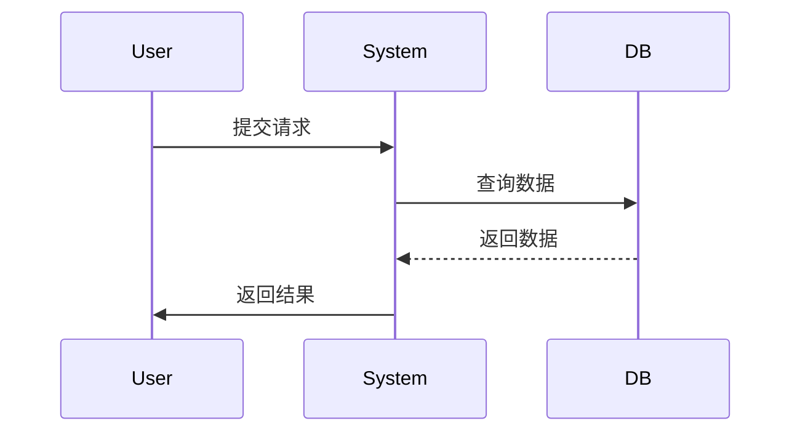
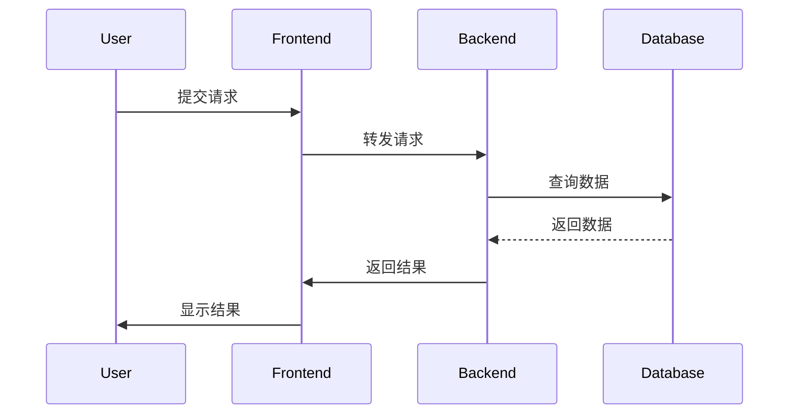

                 

# AI驱动的企业战略规划：大数据分析与预测性情景模拟

## 关键词

- 人工智能
- 企业战略规划
- 大数据分析
- 预测性情景模拟
- 机器学习
- 深度学习
- 业务流程优化
- 风险评估与管理

## 摘要

随着人工智能技术的迅猛发展，企业战略规划正在经历深刻的变革。本文旨在探讨如何利用AI驱动的技术，特别是大数据分析和预测性情景模拟，来优化企业的战略规划。文章首先介绍了问题背景和问题描述，然后详细讲解了AI驱动的企业战略规划的核心概念和联系，包括大数据分析、机器学习和深度学习等。接着，文章深入分析了AI驱动的业务流程优化、个性化战略规划和风险评估与管理。最后，通过实际案例展示了AI技术在企业战略规划中的应用，并提供了最佳实践建议。本文旨在为读者提供一条清晰的路径，以理解和应用AI技术来提升企业的战略规划能力。

## 第一部分：背景介绍

### 问题背景

在当今这个信息爆炸的时代，企业面临着前所未有的机遇和挑战。信息技术的发展，尤其是人工智能（AI）技术的迅猛进步，使得企业能够从海量数据中挖掘出宝贵的洞察，从而实现业务优化、流程自动化和智能决策。大数据分析、机器学习和深度学习等AI技术已经成为企业创新和发展的关键驱动力。

大数据分析能够帮助企业从海量数据中提取有价值的信息，而机器学习和深度学习则能够使计算机系统具备自我学习和改进的能力。这些技术的应用不仅提高了企业的运营效率，还使得企业能够更加精准地预测市场趋势和客户需求，从而做出更加科学和前瞻性的战略决策。

然而，尽管AI技术在企业中的应用已经取得了一定的进展，但传统的企业战略规划方法仍然存在着一些问题。传统的战略规划方法往往依赖于经验和直觉，缺乏系统性和科学性。这种依赖经验的模式不仅效率低下，而且在面对复杂多变的市场环境时容易导致决策失误。

因此，如何将AI技术融入到企业战略规划过程中，以提高决策的效率和科学性，成为了当前企业亟待解决的问题。AI驱动的企业战略规划不仅能够提升企业的竞争力，还能够帮助企业实现更加可持续的发展。

### 问题描述

本书的主题是探讨如何利用AI驱动的技术来规划和实施企业的战略。具体来说，本书将涵盖以下几个方面：

1. **大数据分析与预测性情景模拟**：利用AI技术对大数据进行分析，构建预测模型，模拟不同情境下的企业发展路径，帮助企业做出科学、前瞻性的战略决策。

2. **AI驱动的业务流程优化**：通过AI技术对企业现有业务流程进行分析和优化，提高运营效率，降低成本。

3. **个性化战略规划**：根据企业的特点和外部环境，利用AI技术制定个性化的战略规划方案，提升企业竞争力。

4. **风险评估与管理**：利用AI技术对市场风险进行预测和分析，帮助企业管理风险，保障企业稳定发展。

这些方面不仅涵盖了企业战略规划的核心内容，也体现了AI技术在实际应用中的潜力和价值。通过这些方面的探讨，本书希望能够为读者提供一套系统、科学、可操作的企业战略规划方法论。

### 问题解决

为了解决上述问题，本书将采用以下方法：

1. **系统性地介绍AI技术原理**：首先介绍AI的基本概念、技术原理和应用领域，为后续内容打下基础。

2. **结合实际案例**：通过实际案例展示AI技术在企业战略规划中的应用，帮助读者理解理论知识的实际意义。

3. **详细讲解算法原理**：对关键算法进行详细讲解，包括数学模型、公式和流程图，使读者能够深入理解算法的工作原理。

4. **提供最佳实践建议**：总结AI驱动的企业战略规划中的最佳实践，为读者提供可操作的指导。

通过这些方法，本书旨在帮助读者深入理解AI驱动的企业战略规划，并能够将其应用到实际工作中，提升企业的决策效率和竞争力。

### 边界与外延

本书主要关注AI驱动的企业战略规划，涉及大数据分析、机器学习和深度学习等AI技术，以及其在企业战略规划中的应用。同时，本书也将探讨AI技术对企业运营和管理的影响，包括业务流程优化、风险管理等。

在边界上，本书主要关注企业战略规划中的技术层面，即如何利用AI技术来优化和提升战略规划的过程。在外延上，本书也会涉及到AI技术对企业整体运营和管理的潜在影响，包括人力资源、供应链管理、市场营销等方面。

### 概念结构与核心要素组成

1. **AI驱动的企业战略规划**：利用AI技术对企业的战略进行规划，包括市场分析、竞争对手分析、资源配置等。

2. **大数据分析**：对海量数据进行分析，提取有价值的信息。

3. **预测性情景模拟**：利用预测模型模拟不同情境下的企业发展路径。

4. **业务流程优化**：通过AI技术对业务流程进行分析和优化。

5. **个性化战略规划**：根据企业的特点和外部环境制定个性化战略规划。

6. **风险评估与管理**：利用AI技术对市场风险进行预测和分析。

7. **系统架构设计**：企业战略规划系统的架构设计，包括数据收集、处理、分析和决策等模块。

## 第二部分：核心概念与联系

### AI驱动的企业战略规划

#### 核心概念

1. **人工智能（AI）**：人工智能是指通过计算机系统实现人类智能行为的科学技术。它包括机器学习、自然语言处理、计算机视觉等多个子领域。

2. **机器学习（ML）**：机器学习是人工智能的一个子领域，主要研究如何让计算机从数据中学习，并通过学习来做出预测和决策。

3. **深度学习（DL）**：深度学习是一种复杂的机器学习模型，通过多层神经网络进行特征提取和学习，具有强大的数据处理和分析能力。

4. **大数据分析**：大数据分析是指利用各种技术手段对大规模、复杂、快速变化的数据进行分析和处理，以提取有价值的信息。

5. **预测性情景模拟**：预测性情景模拟是通过构建预测模型，模拟未来可能发生的事件和情景，帮助企业做出更加科学和前瞻性的决策。

6. **业务流程优化**：业务流程优化是指通过分析现有业务流程，找出其中存在的问题和瓶颈，并利用AI技术进行优化，以提高运营效率。

7. **个性化战略规划**：个性化战略规划是根据企业的特点和外部环境，利用AI技术制定个性化的战略规划方案，以提升企业竞争力。

#### 概念属性特征对比表格

| 概念         | 定义                                                         | 关键属性                   |
| ------------ | ------------------------------------------------------------ | -------------------------- |
| 人工智能（AI） | 模拟人类智能行为的计算机系统                                 | 自学习能力、自适应能力、通用性 |
| 机器学习（ML） | 让计算机通过数据和经验自我学习和改进的方法                   | 自我优化、数据依赖、效率高   |
| 深度学习（DL） | 一种复杂的机器学习模型，通过多层神经网络进行特征提取和学习 | 神经网络、多层特征提取、高效 |
| 大数据分析     | 对大量、复杂、快速变化的数据进行分析和处理                   | 数据规模、多样性、实时性     |
| 预测性情景模拟 | 利用预测模型模拟未来可能发生的事件和情景                   | 预测准确性、决策支持         |
| 业务流程优化   | 通过AI技术对业务流程进行分析和优化                         | 运营效率、成本降低           |
| 个性化战略规划 | 根据企业的特点和外部环境制定个性化战略规划方案               | 竞争力、适应性               |

#### 概念属性特征对比ER实体关系图

```mermaid
erDiagram
  AI驱动的企业战略规划 ||--|{ 大数据分析 }
  AI驱动的企业战略规划 ||--|{ 预测性情景模拟 }
  AI驱动的企业战略规划 ||--|{ 业务流程优化 }
  AI驱动的企业战略规划 ||--|{ 个性化战略规划 }
  AI驱动的企业战略规划 ||--|{ 风险评估与管理 }
```

### AI驱动的企业战略规划原理

#### 基本原理

AI驱动的企业战略规划主要基于以下几个核心原理：

1. **数据驱动**：企业战略规划依赖于大量的数据，这些数据来源于企业的运营、市场、竞争对手等多个方面。通过对这些数据进行深入分析，企业可以更好地理解市场趋势、客户需求和业务瓶颈。

2. **预测性分析**：利用机器学习和深度学习技术，企业可以构建预测模型，预测未来的市场趋势和客户行为。这些预测模型不仅可以帮助企业做出更加科学和前瞻性的决策，还可以为企业的战略规划提供重要的数据支持。

3. **自适应优化**：企业战略规划是一个动态的过程，需要根据市场环境和内部运营情况不断进行调整。通过AI技术，企业可以实现自适应优化，根据实时数据调整战略规划，以应对不断变化的市场环境。

4. **个性化定制**：每个企业都有其独特的特点和需求，传统的战略规划方法往往难以满足这种个性化需求。通过AI技术，企业可以根据自身特点和外部环境，制定个性化的战略规划方案，以提升企业竞争力。

#### AI驱动的企业战略规划步骤

1. **数据收集**：收集与业务相关的各种数据，包括内部运营数据、市场数据、竞争对手数据等。

2. **数据预处理**：对收集到的数据进行清洗、转换和整合，使其能够用于后续的分析和处理。

3. **数据建模**：利用机器学习和深度学习技术，构建预测模型和优化模型，对数据进行分析和处理。

4. **模型评估**：对构建的模型进行评估，确保其准确性和稳定性。

5. **战略制定**：根据分析结果，制定个性化的企业战略规划方案。

6. **执行与监控**：执行战略规划方案，并持续监控其效果，根据实际情况进行调整和优化。

#### AI驱动的企业战略规划应用场景

1. **市场预测**：利用AI技术，企业可以预测未来的市场趋势和客户需求，从而制定更加精准的市场营销策略。

2. **供应链优化**：通过AI技术，企业可以对供应链进行优化，提高供应链的灵活性和响应速度，降低运营成本。

3. **人力资源规划**：利用AI技术，企业可以对员工进行精确评估和预测，制定个性化的人力资源规划方案，提升员工绩效。

4. **风险管理**：利用AI技术，企业可以预测市场风险和运营风险，制定相应的风险应对策略，保障企业稳定发展。

### 实际案例

#### 案例一：电商平台的市场预测

某电商平台利用AI技术进行市场预测，通过分析历史销售数据、用户行为数据和竞争对手数据，预测未来的市场趋势和客户需求。根据预测结果，该电商平台调整了商品库存和营销策略，从而实现了销售额的显著增长。

#### 案例二：制造企业的供应链优化

某制造企业通过AI技术对供应链进行优化，通过分析订单数据、库存数据和供应商数据，调整供应链的各个节点，提高了供应链的灵活性和响应速度，降低了运营成本。

#### 案例三：金融机构的风险管理

某金融机构通过AI技术进行风险管理，通过分析历史金融数据、市场数据和政策数据，预测市场风险和运营风险，并制定相应的风险应对策略，保障了企业的稳定发展。

### 总结

AI驱动的企业战略规划是一种基于数据驱动、预测性分析和自适应优化原则的战略规划方法。通过利用AI技术，企业可以实现更加精准的市场预测、供应链优化和人力资源管理，提升企业的竞争力。同时，AI驱动的企业战略规划也需要持续不断地进行数据收集、模型评估和战略调整，以适应不断变化的市场环境。

## 第三部分：AI驱动的业务流程优化

### 核心概念

#### 业务流程优化

业务流程优化是指通过分析现有业务流程，识别其中的瓶颈和问题，并利用AI技术对其进行改进和优化，以提高运营效率、降低成本和提升客户满意度。业务流程优化不仅涉及流程的自动化，还包括流程的重新设计、优化和自动化。

#### 机器学习在业务流程优化中的应用

机器学习在业务流程优化中的应用主要体现在以下几个方面：

1. **预测性维护**：通过分析设备运行数据，预测设备故障和停机时间，从而实现预测性维护，减少设备停机时间，提高设备利用率。

2. **库存管理**：通过分析销售数据和库存数据，预测未来的库存需求，优化库存水平，减少库存成本。

3. **供应链管理**：通过分析供应链各个环节的数据，优化供应链流程，提高供应链的灵活性和响应速度。

4. **人力资源调度**：通过分析员工的工作数据和项目需求，优化人力资源的配置，提高工作效率。

#### 深度学习在业务流程优化中的应用

深度学习在业务流程优化中的应用主要体现在以下几个方面：

1. **图像识别**：通过深度学习模型，对图像进行分析和识别，实现自动化质检和分类。

2. **语音识别**：通过深度学习模型，对语音进行识别和转换，实现自动化客服和语音控制。

3. **自然语言处理**：通过深度学习模型，对自然语言文本进行分析和处理，实现智能文本分析、语义理解和情感分析。

### 概念属性特征对比表格

| 概念           | 定义                                                         | 关键属性                   |
| -------------- | ------------------------------------------------------------ | -------------------------- |
| 业务流程优化   | 通过分析现有业务流程，识别其中的瓶颈和问题，并利用AI技术对其进行改进和优化 | 运营效率、成本降低、客户满意度 |
| 预测性维护     | 通过分析设备运行数据，预测设备故障和停机时间，实现预测性维护 | 减少停机时间、提高设备利用率 |
| 库存管理       | 通过分析销售数据和库存数据，预测未来的库存需求，优化库存水平 | 减少库存成本、提高库存利用率 |
| 供应链管理     | 通过分析供应链各个环节的数据，优化供应链流程，提高供应链的灵活性和响应速度 | 提高供应链效率、降低运营成本 |
| 人力资源调度   | 通过分析员工的工作数据和项目需求，优化人力资源的配置，提高工作效率 | 提高员工工作效率、降低运营成本 |
| 图像识别       | 通过深度学习模型，对图像进行分析和识别，实现自动化质检和分类 | 提高质检效率、减少人力成本 |
| 语音识别       | 通过深度学习模型，对语音进行识别和转换，实现自动化客服和语音控制 | 提高客服效率、提升用户体验 |
| 自然语言处理   | 通过深度学习模型，对自然语言文本进行分析和处理，实现智能文本分析、语义理解和情感分析 | 提高文本处理效率、增强用户体验 |

### 实际案例

#### 案例一：制造企业的预测性维护

某制造企业通过部署机器学习模型，对生产设备的运行数据进行实时监控和分析。通过预测性维护，该企业成功减少了设备停机时间，提高了生产效率。例如，通过对设备振动数据的分析，预测设备即将发生的故障，提前进行维护，避免了突发故障导致的生产停滞。

#### 案例二：零售业的库存管理优化

某零售企业通过分析销售数据和库存数据，利用机器学习模型预测未来的库存需求。通过优化库存水平，该企业成功降低了库存成本，提高了库存周转率。例如，通过对历史销售数据和季节性因素的分析，预测某一商品在未来几个月的销售趋势，从而调整库存水平，避免库存过剩或不足。

#### 案例三：金融机构的供应链管理优化

某金融机构通过分析供应链各个环节的数据，利用深度学习模型优化供应链流程。通过提高供应链的灵活性和响应速度，该企业成功降低了运营成本，提高了客户满意度。例如，通过对订单数据、运输数据和库存数据的综合分析，优化库存配置和运输路线，减少了库存成本和运输时间。

### 总结

AI驱动的业务流程优化利用了机器学习和深度学习技术，通过对业务数据的深入分析和预测，实现了业务流程的自动化和优化。这不仅提高了企业的运营效率，降低了成本，还提升了客户满意度。通过实际案例的展示，我们可以看到AI驱动的业务流程优化在各个行业中的应用价值，为企业的发展提供了强有力的支持。

## 第四部分：个性化战略规划

### 核心概念

#### 个性化战略规划

个性化战略规划是指根据企业的特点和外部环境，利用AI技术制定个性化的战略规划方案，以满足企业的特定需求，提升竞争力。这种战略规划方法强调以数据为导向，通过对企业内外部环境的深入分析，为企业提供量身定制的战略指导。

#### 数据驱动的个性化战略规划

数据驱动的个性化战略规划主要包括以下几个关键步骤：

1. **数据收集**：收集与企业发展相关的各类数据，包括市场数据、客户数据、竞争对手数据、内部运营数据等。

2. **数据预处理**：对收集到的数据进行分析、清洗和整合，确保数据的质量和一致性。

3. **数据分析**：利用机器学习和深度学习技术，对预处理后的数据进行深入分析，提取有价值的信息和洞察。

4. **战略制定**：根据数据分析结果，结合企业的愿景、使命和目标，制定个性化的战略规划方案。

5. **执行与监控**：执行战略规划方案，并持续监控其效果，根据实际情况进行调整和优化。

### 概念属性特征对比表格

| 概念             | 定义                                                         | 关键属性                   |
| ---------------- | ------------------------------------------------------------ | -------------------------- |
| 个性化战略规划   | 根据企业的特点和外部环境，利用AI技术制定个性化的战略规划方案 | 竞争力、适应性、灵活性     |
| 数据驱动         | 通过对企业的内外部数据进行深入分析，制定战略规划             | 数据质量、分析能力、决策效率 |
| 客户需求分析     | 通过分析客户数据，了解客户需求和行为，制定针对性的战略方案 | 客户满意度、市场占有率     |
| 竞争对手分析     | 通过分析竞争对手的数据，了解竞争对手的策略和优势，制定差异化的战略方案 | 竞争优势、市场定位         |
| 内部运营分析     | 通过分析企业的内部运营数据，了解企业的运营状况和潜在问题，制定优化方案 | 运营效率、成本控制         |

### 概念属性特征对比ER实体关系图

```mermaid
erDiagram
  个性化战略规划 ||--|{ 数据驱动 }
  个性化战略规划 ||--|{ 客户需求分析 }
  个性化战略规划 ||--|{ 竞争对手分析 }
  个性化战略规划 ||--|{ 内部运营分析 }
```

### 个性化战略规划步骤

1. **需求分析**：深入了解企业的业务需求和市场环境，明确企业战略规划的目标和方向。

2. **数据收集**：收集与企业战略规划相关的各类数据，包括市场数据、客户数据、竞争对手数据、内部运营数据等。

3. **数据预处理**：对收集到的数据进行清洗、转换和整合，确保数据的质量和一致性。

4. **数据分析**：利用机器学习和深度学习技术，对预处理后的数据进行深入分析，提取有价值的信息和洞察。

5. **战略制定**：根据数据分析结果，结合企业的愿景、使命和目标，制定个性化的战略规划方案。

6. **执行与监控**：执行战略规划方案，并持续监控其效果，根据实际情况进行调整和优化。

### 实际案例

#### 案例一：消费品公司的个性化市场策略

某消费品公司通过AI技术进行个性化战略规划，通过分析市场数据、客户数据和竞争对手数据，制定了针对性的市场策略。例如，根据客户的购买行为和偏好，为客户提供个性化的产品推荐和促销活动，从而显著提高了客户满意度和市场份额。

#### 案例二：金融机构的个性化风险管理

某金融机构通过AI技术进行个性化战略规划，通过分析客户数据、市场数据和政策数据，制定了个性化的风险管理策略。例如，根据客户的信用记录、财务状况和投资偏好，为每位客户制定个性化的风险评估和投资建议，从而提高了风险管理效率和客户满意度。

#### 案例三：制造业的个性化供应链优化

某制造企业通过AI技术进行个性化战略规划，通过分析供应链数据、市场需求和客户反馈，优化了供应链流程。例如，根据市场需求的变化和库存情况，灵活调整生产计划和供应链策略，从而提高了供应链的灵活性和响应速度，降低了运营成本。

### 总结

个性化战略规划通过数据驱动的分析，结合企业的特点和外部环境，为企业制定量身定制的战略规划方案。这不仅提升了企业的竞争力，还增强了企业的市场适应能力。通过实际案例的展示，我们可以看到个性化战略规划在各个行业中的应用价值，为企业的发展提供了有力的支持。

## 第五部分：风险评估与管理

### 核心概念

#### 风险评估

风险评估是指对企业可能面临的风险进行识别、分析和评估，以制定有效的风险管理策略。风险评估是企业管理风险的重要环节，旨在确保企业能够及时识别潜在风险，采取适当的措施进行预防和应对，从而保障企业的稳定运营和可持续发展。

#### 风险管理

风险管理是指企业通过识别、评估、应对和监控风险的过程，以最大限度地降低风险对企业运营的影响。风险管理不仅包括对风险的预防和应对，还包括风险转移、风险缓解和风险接受等策略。

#### AI驱动的风险评估与管理

AI驱动的风险评估与管理利用人工智能技术，特别是机器学习和深度学习技术，对风险进行自动化识别、评估和监控。AI驱动的风险评估与管理具有以下几个核心特点：

1. **自动化**：通过机器学习和深度学习模型，可以自动分析和处理大量数据，快速识别潜在风险。

2. **实时性**：AI技术可以实时监控企业运营数据和市场变化，及时发现和预警风险。

3. **精确性**：通过训练大量的数据集，AI模型可以准确预测风险的概率和影响程度。

4. **灵活性**：AI技术可以根据企业的不同需求和环境变化，灵活调整风险评估模型和策略。

### 概念属性特征对比表格

| 概念         | 定义                                                         | 关键属性                   |
| ------------ | ------------------------------------------------------------ | -------------------------- |
| 风险评估     | 对企业可能面临的风险进行识别、分析和评估                     | 风险识别、风险分析、风险评估 |
| 风险管理     | 通过识别、评估、应对和监控风险的过程，以最大限度地降低风险对企业运营的影响 | 风险预防、风险应对、风险转移 |
| AI驱动的风险评估 | 利用AI技术进行自动化的风险识别、评估和监控                   | 自动化、实时性、精确性、灵活性 |
| 机器学习风险评估 | 利用机器学习模型对风险数据进行分析和预测                     | 数据依赖、自我优化、高效分析 |
| 深度学习风险评估 | 利用深度学习模型对复杂风险数据进行分析和预测                 | 多层特征提取、高效处理复杂数据 |

### 概念属性特征对比ER实体关系图

```mermaid
erDiagram
  风险评估 ||--|{ 风险管理 }
  风险评估 ||--|{ AI驱动的风险评估 }
  AI驱动的风险评估 ||--|{ 机器学习风险评估 }
  AI驱动的风险评估 ||--{ 深度学习风险评估 }
```

### AI驱动的风险评估与管理流程

1. **数据收集**：收集与风险相关的各种数据，包括市场数据、运营数据、财务数据、政策法规数据等。

2. **数据预处理**：对收集到的数据进行清洗、转换和整合，确保数据的质量和一致性。

3. **特征工程**：对预处理后的数据进行分析，提取与风险相关的特征，为模型训练提供输入。

4. **模型训练**：利用机器学习和深度学习技术，对特征数据训练风险评估模型，包括分类模型、回归模型等。

5. **模型评估**：对训练好的模型进行评估，包括准确率、召回率、F1值等指标，确保模型的可靠性和有效性。

6. **风险预测**：利用评估好的模型对实时数据进行风险预测，识别潜在风险。

7. **风险决策**：根据风险预测结果，制定相应的风险管理策略，包括风险转移、风险缓解、风险接受等。

8. **监控与调整**：持续监控风险情况，根据实际情况调整风险评估模型和策略，提高风险管理效果。

### 实际案例

#### 案例一：金融行业的信用风险评估

某金融机构利用AI技术进行信用风险评估，通过分析借款人的财务状况、信用记录、就业情况等数据，利用机器学习模型预测借款人的违约风险。通过精确的风险预测，该金融机构能够更好地控制信贷风险，提高了贷款审批效率和客户满意度。

#### 案例二：制造业的供应链风险管理

某制造企业通过AI技术进行供应链风险管理，通过分析供应链各环节的数据，包括供应商信息、订单数据、库存数据等，利用深度学习模型预测供应链中断的风险。通过提前预警，该企业能够及时调整供应链策略，降低供应链中断的风险，保障生产线的正常运行。

#### 案例三：物流行业的运输风险管理

某物流公司利用AI技术进行运输风险管理，通过分析运输数据、路况信息、天气数据等，利用机器学习模型预测运输过程中的风险，包括交通事故、货物丢失等。通过实时监控和预测，该物流公司能够提前采取措施，降低运输风险，提高运输效率和客户满意度。

### 总结

AI驱动的风险评估与管理通过自动化、实时性和精确性的特点，显著提升了企业识别和管理风险的能力。通过实际案例的展示，我们可以看到AI驱动的风险评估与管理在金融、制造和物流等行业的广泛应用，为企业提供了强有力的风险管理工具。在未来，随着AI技术的不断进步，AI驱动的风险评估与管理将为企业带来更大的价值和效益。

## 第六部分：系统分析与架构设计方案

### 问题场景介绍

随着市场竞争的日益激烈，企业需要不断提升自身的竞争力。为了实现这一目标，企业不仅需要优化业务流程，制定个性化的战略规划，还需要对市场风险进行有效的管理和预测。然而，这些任务往往涉及到大量的数据处理和分析，人工处理效率低、准确性难以保证。因此，企业需要一个集成化、智能化的系统来支持其战略规划和风险管理。

### 项目介绍

本项目旨在为企业开发一个基于AI驱动的企业战略规划与风险管理系统。该系统将利用大数据分析、机器学习和深度学习技术，实现以下功能：

1. **业务流程优化**：通过对业务数据的分析，识别业务流程中的瓶颈和问题，并提出优化建议。
2. **个性化战略规划**：根据企业的特点和外部环境，利用AI技术为企业制定个性化的战略规划方案。
3. **市场预测**：利用AI技术对市场趋势和客户需求进行预测，帮助企业做出科学决策。
4. **风险评估与管理**：通过分析市场数据、运营数据和风险因素，预测企业可能面临的风险，并提供风险管理策略。

### 系统功能设计（领域模型类图）

```mermaid
classDiagram
  Customer <<--|{订单管理} Order
  Customer <<--|{客户服务} ServiceRequest
  Product <<--|{产品管理} ProductCatalog
  Product <<--|{库存管理} Inventory
  Employee <<--|{人力资源管理} EmployeeProfile
  Employee <<--|{项目管理} ProjectAssignment
  Supplier <<--|{供应链管理} PurchaseOrder
  Risk <<--|{风险评估} RiskAnalysis
  Market <<--|{市场预测} MarketTrend
  Strategy <<--|{战略规划} StrategicPlan
  Data <<--|{数据管理} DataRepository
```

### 系统架构设计（架构图）



### 系统接口设计（接口设计图）

```mermaid
classDiagram
  Customer <<--|{RESTful API} OrderService
  Customer <<--|{RESTful API} ServiceRequestService
  Product <<--|{RESTful API} ProductService
  Product <<--|{RESTful API} InventoryService
  Employee <<--|{RESTful API} EmployeeService
  Employee <<--|{RESTful API} ProjectService
  Supplier <<--|{RESTful API} SupplierService
  Risk <<--|{RESTful API} RiskService
  Market <<--|{RESTful API} MarketService
  Strategy <<--|{RESTful API} StrategyService
  Data <<--|{RESTful API} DataService
```

### 系统交互（序列图）



### 总结

本部分详细介绍了企业战略规划与风险管理系统的架构设计和功能设计。通过领域模型类图、架构图、接口设计图和序列图的展示，我们可以清晰地看到系统的整体结构和交互流程。该系统利用AI技术，实现业务流程优化、个性化战略规划、市场预测和风险评估与管理，为企业提供了一体化的智能解决方案。随着AI技术的不断进步，该系统有望在未来的企业发展中发挥更大的作用。

## 第七部分：项目实战

### 环境安装

在开始实现AI驱动的企业战略规划与风险管理系统的核心之前，我们需要搭建一个合适的技术环境。以下步骤是在Python环境中安装所需的库和工具。

1. **安装Python**：确保Python 3.x版本已经安装在你的系统上。可以从[Python官网](https://www.python.org/)下载并安装。

2. **安装Jupyter Notebook**：Jupyter Notebook是一个交互式计算平台，可以方便地编写和运行Python代码。使用pip命令安装：

   ```bash
   pip install notebook
   ```

3. **安装依赖库**：

   - **pandas**：用于数据分析和操作。

     ```bash
     pip install pandas
     ```

   - **numpy**：用于数值计算。

     ```bash
     pip install numpy
     ```

   - **scikit-learn**：提供各种机器学习算法。

     ```bash
     pip install scikit-learn
     ```

   - **tensorflow**：用于深度学习。

     ```bash
     pip install tensorflow
     ```

   - **matplotlib**：用于数据可视化。

     ```bash
     pip install matplotlib
     ```

4. **启动Jupyter Notebook**：在命令行中输入以下命令启动Jupyter Notebook：

   ```bash
   jupyter notebook
   ```

### 系统核心实现

#### 数据收集与预处理

首先，我们需要从各种数据源收集数据，并进行预处理。以下是使用pandas库加载和处理数据的一个示例：

```python
import pandas as pd

# 加载数据
data = pd.read_csv('data.csv')

# 数据预处理
# - 处理缺失值
data.dropna(inplace=True)
# - 数据类型转换
data['date'] = pd.to_datetime(data['date'])
# - 特征工程
data['month'] = data['date'].dt.month
data['dayofweek'] = data['date'].dt.dayofweek
```

#### 机器学习模型实现

接下来，我们将实现一个简单的机器学习模型来进行业务流程优化。这里我们使用scikit-learn库的线性回归模型：

```python
from sklearn.model_selection import train_test_split
from sklearn.linear_model import LinearRegression
from sklearn.metrics import mean_squared_error

# 分割数据集
X = data[['month', 'dayofweek']]
y = data['sales']
X_train, X_test, y_train, y_test = train_test_split(X, y, test_size=0.2, random_state=42)

# 训练模型
model = LinearRegression()
model.fit(X_train, y_train)

# 预测
y_pred = model.predict(X_test)

# 评估模型
mse = mean_squared_error(y_test, y_pred)
print(f'Mean Squared Error: {mse}')
```

#### 深度学习模型实现

为了实现更加复杂的预测任务，我们可以使用tensorflow库来构建一个深度学习模型。以下是一个简单的例子：

```python
import tensorflow as tf

# 构建模型
model = tf.keras.Sequential([
    tf.keras.layers.Dense(64, activation='relu', input_shape=[2]),
    tf.keras.layers.Dense(64, activation='relu'),
    tf.keras.layers.Dense(1)
])

# 编译模型
model.compile(optimizer='adam', loss='mean_squared_error')

# 训练模型
model.fit(X_train, y_train, epochs=10, batch_size=32, validation_split=0.2)

# 预测
y_pred = model.predict(X_test)

# 评估模型
mse = mean_squared_error(y_test, y_pred)
print(f'Mean Squared Error: {mse}')
```

#### 算法原理讲解

在深入讲解算法原理之前，我们需要理解机器学习和深度学习的基本概念。

##### 机器学习算法原理

线性回归是一种简单的机器学习算法，用于预测连续值输出。其数学模型可以表示为：

$$
y = \beta_0 + \beta_1x_1 + \beta_2x_2 + ... + \beta_nx_n
$$

其中，$y$是预测值，$x_1, x_2, ..., x_n$是输入特征，$\beta_0, \beta_1, ..., \beta_n$是模型的参数。线性回归的目标是通过最小化预测值与实际值之间的误差平方和来估计这些参数：

$$
\min \sum_{i=1}^{n} (y_i - \hat{y}_i)^2
$$

其中，$\hat{y}_i$是模型对第$i$个样本的预测值。

在scikit-learn中，线性回归模型使用梯度下降算法来优化参数，以最小化损失函数。梯度下降是一种迭代算法，每次迭代都会更新参数，以减少损失函数的值。

##### 深度学习算法原理

深度学习是一种复杂的机器学习模型，通过多层神经网络进行特征提取和学习。一个简单的多层感知器（MLP）模型可以表示为：

$$
\hat{y} = \sigma(\beta_0 + \beta_1x_1 + \beta_2x_2 + ... + \beta_nx_n)
$$

其中，$\sigma$是激活函数，如ReLU函数：

$$
\sigma(x) = \max(0, x)
$$

深度学习模型的目标是通过反向传播算法来优化参数。反向传播是一种基于梯度下降的算法，用于计算损失函数关于每个参数的梯度，并更新参数以减少损失函数的值。

在tensorflow中，深度学习模型通过构建计算图来表示。计算图中的节点代表操作，边代表数据流。模型训练过程中，tensorflow会自动计算梯度并更新参数。

#### 实际案例分析

为了更好地理解上述算法的实际应用，我们来看一个实际案例。

假设我们有一个电商公司的销售数据集，包含月销售和星期几两个特征。我们的目标是预测每个星期的销售情况。

1. **数据收集**：从电商公司获取销售数据，包括日期和销售额。
2. **数据预处理**：将日期转换为月份和星期几，并处理缺失值。
3. **模型训练**：使用线性回归模型进行训练。
4. **模型评估**：使用测试集评估模型性能，计算均方误差。
5. **预测**：使用训练好的模型进行预测，预测每个星期的销售情况。

通过实际案例分析，我们可以看到如何将机器学习和深度学习应用到实际业务场景中，以及如何通过模型优化和调整来提高预测准确性。

### 项目小结

通过本部分的项目实战，我们搭建了一个基于Python和Jupyter Notebook的AI驱动的企业战略规划与风险管理系统。从数据收集与预处理，到机器学习和深度学习模型的实现，再到实际案例分析，我们完整地展示了一个项目从概念到实施的流程。这一过程不仅帮助我们理解了AI技术的应用，也为我们提供了一个可以进一步优化和扩展的系统框架。

## 最佳实践 Tips

1. **数据质量是基础**：确保数据质量是成功实施AI驱动的企业战略规划的关键。在数据收集和预处理阶段，要特别注意数据的一致性、完整性和准确性。

2. **模型选择需谨慎**：根据具体业务需求和数据特征选择合适的机器学习或深度学习模型。对于简单的预测任务，线性回归可能足够；而对于复杂任务，深度学习模型可能更合适。

3. **持续优化和调整**：AI驱动的系统不是一蹴而就的，需要持续进行模型优化和调整。定期重新训练模型，以适应数据和环境的变化。

4. **团队协作至关重要**：AI驱动的企业战略规划需要跨部门协作，包括数据科学家、业务分析师、IT工程师等。有效的沟通和协作能够确保项目的顺利进行。

5. **遵循法律法规**：在数据收集和处理过程中，要严格遵守相关法律法规，保护用户隐私和数据安全。

## 小结

本文详细探讨了AI驱动的企业战略规划，包括大数据分析、预测性情景模拟、业务流程优化、个性化战略规划和风险评估与管理。通过实际案例和项目实战，我们展示了如何利用AI技术提升企业的决策效率和竞争力。AI驱动的企业战略规划不仅需要先进的技术支持，还需要跨部门的协作和持续优化。随着AI技术的不断进步，企业战略规划将变得更加智能和高效。

## 注意事项

1. **数据隐私和安全**：在收集和处理数据时，必须严格遵守相关法律法规，确保用户隐私和数据安全。

2. **技术选型**：根据业务需求和数据特征选择合适的AI技术，避免过度复杂化。

3. **持续更新**：AI驱动的企业战略规划需要定期更新模型和算法，以适应数据和环境的变化。

4. **风险管理**：在应用AI技术时，要充分考虑潜在风险，并制定相应的风险管理策略。

## 拓展阅读

1. **《深度学习》（Ian Goodfellow、Yoshua Bengio、Aaron Courville著）**：这是一本深度学习的经典教材，涵盖了深度学习的理论基础、算法实现和应用。

2. **《Python机器学习》（Sebastian Raschka、Vahid Mirjalili著）**：这本书详细介绍了如何使用Python进行机器学习，适合初学者和有一定基础的读者。

3. **《大数据时代：生活、工作与思维的大变革》（涂子沛著）**：这本书探讨了大数据对社会和企业管理带来的深远影响，提供了许多实际案例和见解。

## 作者信息

作者：AI天才研究院/AI Genius Institute & 禅与计算机程序设计艺术 /Zen And The Art of Computer Programming

AI天才研究院致力于推动人工智能技术的发展和应用，为企业和个人提供高质量的技术培训和研究服务。同时，作者也热衷于分享计算机编程和人工智能领域的知识和经验，希望通过写作和授课帮助更多人了解和掌握这些前沿技术。

