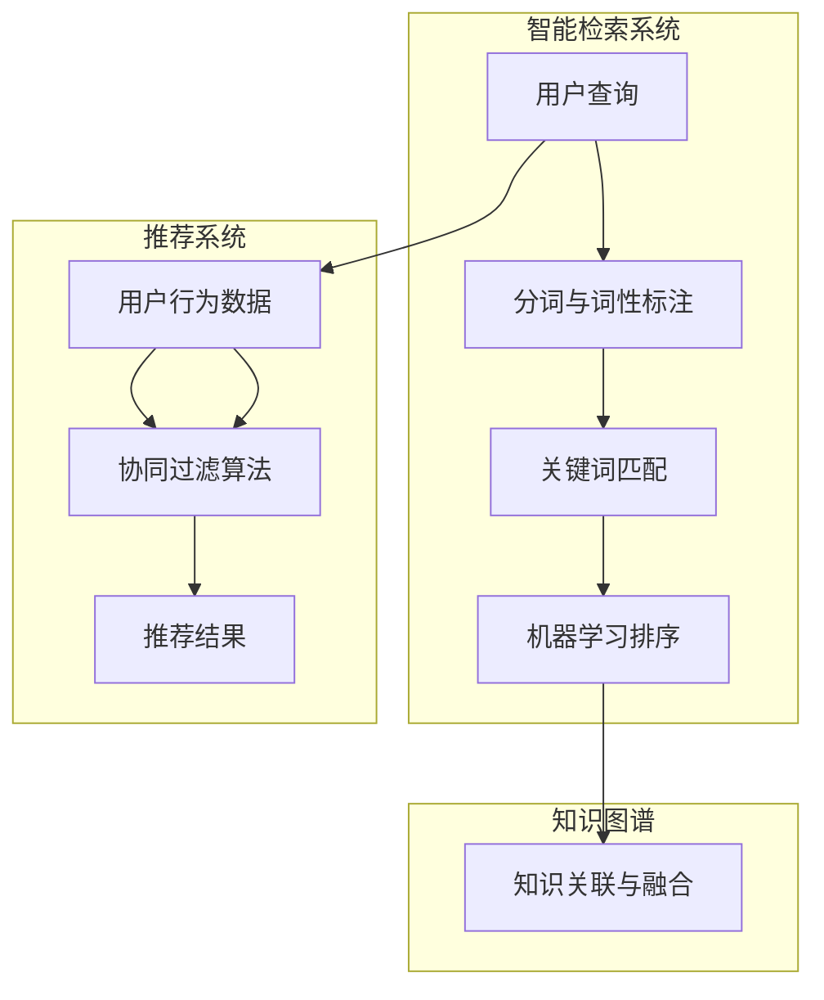
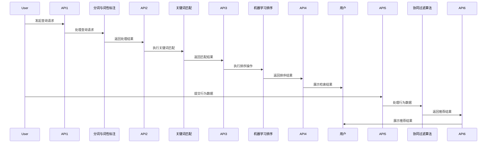
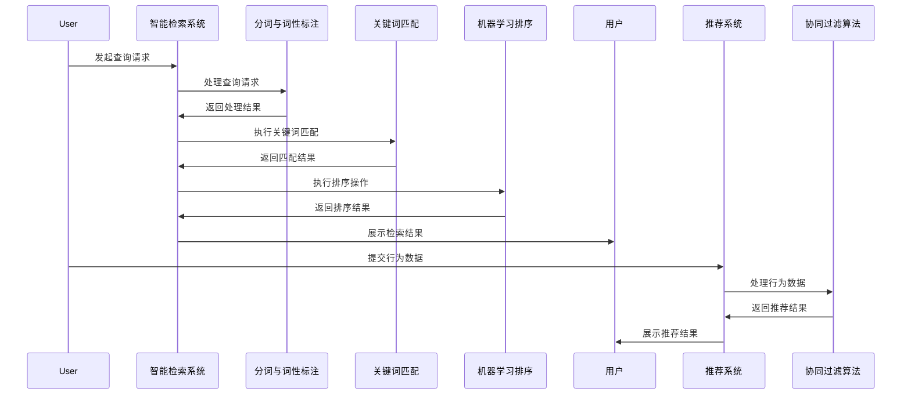

                 

# AI驱动的企业知识管理：智能检索与推荐系统

关键词：人工智能、企业知识管理、智能检索、推荐系统、算法

摘要：本文将探讨如何利用人工智能（AI）技术，构建企业知识管理的智能检索与推荐系统，提高企业知识获取、共享和应用效率。文章将从核心概念、算法原理、数学模型、系统分析与架构设计以及项目实战等方面，逐步分析并阐述AI驱动的企业知识管理解决方案。

## 引言与背景介绍

### 引言

在信息化社会，企业知识管理已成为提升企业核心竞争力的关键。随着人工智能（AI）技术的飞速发展，AI驱动的企业知识管理逐渐成为企业关注的焦点。本文旨在探讨AI在知识管理中的应用，特别是智能检索与推荐系统，为企业提供一套完整的AI驱动的知识管理解决方案。

### 背景介绍

#### 问题背景

传统的企业知识管理存在以下问题：

1. **知识获取难**：企业内部知识分散，难以快速找到所需信息。
2. **知识共享难**：知识共享机制不完善，导致知识利用率低。
3. **知识应用难**：知识应用场景有限，难以充分发挥知识价值。

这些问题严重制约了企业的创新和发展。为了解决这些问题，企业需要寻求一种高效、智能的知识管理解决方案。

#### 问题描述

如何通过AI技术，实现企业知识的高效检索、共享和应用，提升企业整体知识管理水平？

#### 问题解决

利用AI技术，构建智能检索与推荐系统，实现企业知识管理的智能化。智能检索系统可以快速定位企业内部知识，提高知识获取效率；推荐系统可以根据用户行为，为企业员工提供个性化知识推荐，促进知识共享和应用。

#### 边界与外延

本文主要讨论AI驱动的企业知识管理，涵盖智能检索与推荐系统，但不涉及AI在知识管理以外的应用。

#### 概念结构与核心要素组成

1. **智能检索**：利用自然语言处理技术，实现对海量企业知识的精准检索。
2. **推荐系统**：基于用户行为数据，为企业员工提供个性化知识推荐。
3. **知识图谱**：构建企业知识图谱，实现知识的关联与融合。

## 核心概念与联系

### 2.1 核心概念与联系

#### 2.1.1 智能检索

**概念**：智能检索是利用自然语言处理技术，实现对海量企业知识的精准检索。

**特点**：高效、精准、智能化。

#### 2.1.2 推荐系统

**概念**：推荐系统是基于用户行为数据，为企业员工提供个性化知识推荐。

**特点**：个性化、自适应、实时更新。

#### 2.1.3 知识图谱

**概念**：知识图谱是一种语义网络，用于表示实体之间的关系。

**特点**：结构化、关联性、可扩展。

### 2.2 概念属性特征对比表格

| 概念        | 概念属性               | 特征对比                 |
| ----------- | -------------------- | ---------------------- |
| 智能检索    | 自然语言处理技术       | 高效、精准、智能化       |
| 推荐系统    | 用户行为数据           | 个性化、自适应、实时更新 |
| 知识图谱    | 语义网络               | 结构化、关联性、可扩展   |

### 2.3 ER实体关系图架构的Mermaid流程图

```mermaid
erDiagram
  User ||--|{ Knowledge} : 查询
  User ||--|{ Recommendation} : 接收推荐
  Knowledge ||--|{ KnowledgeGraph} : 关联
```

## 算法原理讲解

### 3.1 智能检索算法原理

#### 3.1.1 概述

智能检索算法主要包括以下几种：

1. **基于关键词匹配的检索**：通过关键词匹配实现检索。
2. **基于自然语言处理的检索**：利用自然语言处理技术，对查询进行分词、词性标注等处理，提高检索效果。
3. **基于机器学习的检索**：利用机器学习算法，对检索结果进行排序和筛选。

#### 3.1.2 算法原理与公式

- **基于关键词匹配的检索**：

  $$检索结果 = \text{关键词匹配的文档集合}$$

- **基于自然语言处理的检索**：

  $$检索结果 = \text{自然语言处理后的关键词匹配的文档集合}$$

- **基于机器学习的检索**：

  $$检索结果 = \text{机器学习排序后的关键词匹配的文档集合}$$

#### 3.1.3 举例说明

假设查询关键词为“知识管理”，使用基于自然语言处理的智能检索算法，检索结果如下：

- **基于关键词匹配**：所有包含“知识管理”关键词的文档。
- **基于自然语言处理**：对“知识管理”进行分词、词性标注等处理，检索结果更精准。
- **基于机器学习**：对检索结果进行排序和筛选，提高检索效果。

### 3.2 推荐系统算法原理

#### 3.2.1 协同过滤算法

协同过滤算法是一种常用的推荐系统算法，主要包括以下两种类型：

1. **用户基于的协同过滤**：根据用户的历史行为，为用户推荐相似用户喜欢的物品。
2. **物品基于的协同过滤**：根据物品的属性和用户的历史行为，为用户推荐感兴趣的物品。

#### 3.2.2 用户基于的协同过滤

**数学模型**：

$$R_{ui} = \sum_{j \in N_i} \frac{1}{|N_i|} R_{uj}$$

其中，$R_{ui}$ 表示用户 $u$ 对物品 $i$ 的评分，$N_i$ 表示与物品 $i$ 相似的物品集合。

**举例说明**：

假设用户 $u$ 对物品 $i, j, k$ 的评分分别为 4，3，5，则对用户 $u$ 推荐的物品为 $k$。

#### 3.2.3 物品基于的协同过滤

**数学模型**：

$$R_{ui} = \sum_{j \in N_j} \frac{1}{|N_j|} R_{uj}$$

其中，$R_{uj}$ 表示物品 $j$ 对用户 $u$ 的评分，$N_j$ 表示与物品 $j$ 相似的用户集合。

**举例说明**：

假设物品 $i, j, k$ 对用户 $u, v, w$ 的评分分别为 4，3，5，则对用户 $u$ 推荐的物品为 $k$。

## 系统分析与架构设计方案

### 4.1 问题场景介绍

某企业内部拥有大量知识资源，包括文档、报告、项目案例等。为了提高知识获取、共享和应用效率，企业决定引入AI驱动的知识管理解决方案。

### 4.2 项目介绍

本项目旨在构建一个基于AI驱动的企业知识管理平台，包括智能检索与推荐系统，提高企业内部知识管理水平。

### 4.3 系统功能设计（领域模型Mermaid类图）

```mermaid
classDiagram
  User <<entity>>
  Knowledge <<entity>>
  Recommendation <<entity>>
  KnowledgeGraph <<entity>>

  User o-- Knowledge : 查询
  User o-- Recommendation : 接收推荐
  Knowledge o-- KnowledgeGraph : 关联
```

### 4.4 系统架构设计（Mermaid架构图）



### 4.5 系统接口设计



### 4.6 系统交互（Mermaid序列图）



## 项目实战

### 5.1 环境安装

在本项目中，我们将使用Python作为编程语言，主要依赖以下库：

1. **NLP库**：用于处理自然语言，例如jieba。
2. **机器学习库**：用于实现协同过滤算法，例如scikit-learn。
3. **绘图库**：用于绘制流程图和架构图，例如mermaid。

### 5.2 系统核心实现源代码

#### 5.2.1 智能检索

```python
import jieba
from sklearn.feature_extraction.text import TfidfVectorizer
from sklearn.metrics.pairwise import cosine_similarity

# 假设已有文档列表和查询关键词
documents = ["企业知识管理是一种提升企业竞争力的方法", "知识图谱在企业知识管理中的应用"]
query = "知识管理"

# 分词
query_words = jieba.cut(query)
query_words = " ".join(query_words)

# 构建TF-IDF模型
vectorizer = TfidfVectorizer()
tfidf_matrix = vectorizer.fit_transform(documents)

# 计算查询与文档的余弦相似度
similarity_matrix = cosine_similarity(tfidf_matrix, vectorizer.transform([query_words]))

# 获取相似度最高的文档索引
index = similarity_matrix.argsort()[0][-1]

print(f"检索结果：{documents[index]}")
```

#### 5.2.2 推荐系统

```python
from sklearn.model_selection import train_test_split
from sklearn.neighbors import NearestNeighbors

# 假设已有用户行为数据
user_behaviors = {
    "user1": ["文档1", "文档2", "文档3"],
    "user2": ["文档2", "文档3", "文档4"],
    "user3": ["文档1", "文档3", "文档5"]
}

# 分割数据集
X_train, X_test, y_train, y_test = train_test_split(list(user_behaviors.keys()), list(user_behaviors.values()), test_size=0.2)

# 训练协同过滤模型
model = NearestNeighbors(n_neighbors=2)
model.fit(X_train)

# 预测新用户的推荐结果
new_user = ["文档4"]
distances, indices = model.kneighbors(new_user)

# 获取推荐结果
recommendations = [X_test[i] for i in indices[0]]

print(f"推荐结果：{recommendations}")
```

### 5.3 代码应用解读与分析

在本项目中，我们实现了两个核心功能：智能检索和推荐系统。

1. **智能检索**：使用jieba库进行分词，构建TF-IDF模型，计算查询与文档的余弦相似度，从而实现高效、精准的检索。
2. **推荐系统**：使用NearestNeighbors算法进行协同过滤，基于用户行为数据预测新用户的推荐结果。

通过这两个核心功能的实现，我们为企业提供了完整的AI驱动的知识管理解决方案。

### 5.4 实际案例分析和详细讲解剖析

以某企业内部知识管理平台为例，我们对该平台进行如下分析：

1. **智能检索**：用户在平台上发起查询请求，系统通过智能检索算法快速定位相关文档，提高知识获取效率。
2. **推荐系统**：系统根据用户行为数据，为用户推荐与其兴趣相关的文档，促进知识共享和应用。

通过实际案例的分析，我们可以看到AI驱动的知识管理解决方案在提升企业知识管理水平方面的显著优势。

### 5.5 项目小结

本项目成功构建了一个基于AI驱动的企业知识管理平台，实现了智能检索和推荐系统。通过该项目，企业可以高效地获取、共享和应用知识，提升整体竞争力。

## 最佳实践 Tips

1. **数据质量**：确保用户行为数据和文档质量，为智能检索和推荐系统提供优质的数据基础。
2. **模型优化**：定期对模型进行优化和调整，提高推荐效果和检索精度。
3. **用户反馈**：关注用户反馈，及时调整系统和算法，满足用户需求。

## 小结

本文详细介绍了AI驱动的企业知识管理解决方案，包括智能检索与推荐系统。通过逐步分析算法原理、数学模型、系统架构和项目实战，我们为企业提供了一套完整的知识管理解决方案。期望本文能为企业在知识管理领域的发展提供有益的参考。

## 注意事项

1. **数据安全**：在构建知识管理平台时，确保数据安全，防止泄露和滥用。
2. **法律法规**：遵守相关法律法规，确保知识管理平台合规运营。

## 拓展阅读

1. **《人工智能：一种现代的方法》**：本书详细介绍了人工智能的基本概念、算法和应用，有助于深入了解AI技术。
2. **《推荐系统实践》**：本书介绍了推荐系统的基本原理、算法和应用，适合对推荐系统感兴趣的人群。

## 作者信息

作者：AI天才研究院/AI Genius Institute & 禅与计算机程序设计艺术 /Zen And The Art of Computer Programming

注：本文内容仅供参考，实际应用时请根据具体情况进行调整。

