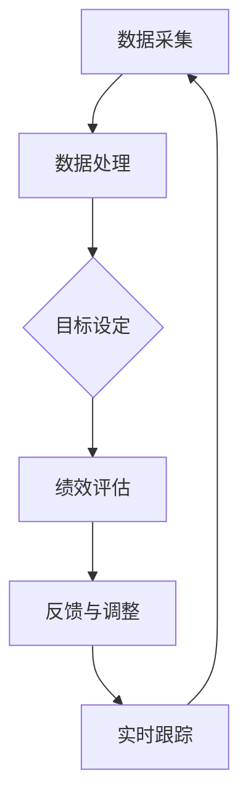
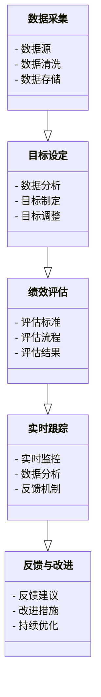
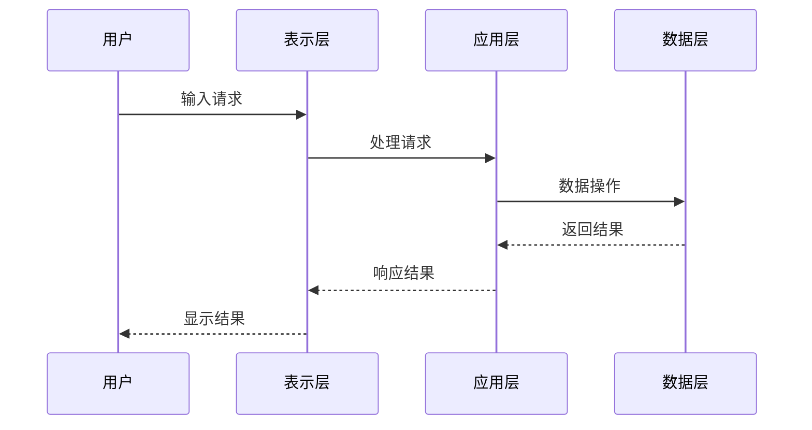

                 

### 引言与背景介绍

#### AI在企业绩效管理中的重要性

随着科技的飞速发展，人工智能（AI）技术已经成为企业提高运营效率、降低成本、提升竞争力的关键工具。特别是在企业绩效管理领域，AI的应用正在逐步改变传统的方法论，为企业的目标设定与实时跟踪提供了全新的视角和解决方案。

企业绩效管理是一个涉及多个层面的复杂过程，包括目标设定、绩效评估、反馈调整等。在过去，这些工作往往依赖于人工判断和经验积累，不仅效率低下，而且容易受到主观因素的影响。而AI技术的引入，为这一领域带来了革命性的变化。通过大数据分析、机器学习算法和智能算法优化，AI能够更精准地设定目标，更实时地跟踪绩效，从而提高决策的准确性和效率。

#### 企业绩效管理的问题与挑战

尽管AI为企业绩效管理带来了巨大的潜力，但现实中仍然存在诸多挑战。首先，目标设定的模糊性是一个常见问题。很多企业在设定目标时缺乏明确的标准，导致目标难以量化，无法实现有效的跟踪和评估。其次，实时跟踪的难度也较大。传统的绩效跟踪方式往往滞后于实际工作进展，难以及时发现问题并进行调整。此外，数据的质量和完整性也是制约绩效管理的重要因素。

#### AI驱动的绩效管理解决方案

为了解决这些问题，AI驱动的企业绩效管理应运而生。通过AI技术，企业可以实现对海量数据的快速处理和分析，从而更加精准地设定目标。具体来说，AI可以采用以下几种方法：

1. **数据挖掘与分析**：通过分析历史数据和现有数据，AI可以识别出潜在的趋势和模式，为企业提供更加科学的决策依据。

2. **机器学习算法**：利用机器学习算法，AI能够建立复杂的模型，对员工的工作绩效进行预测和评估。

3. **智能算法优化**：通过优化算法，AI可以帮助企业制定更加合理的绩效评估标准，提高评估的准确性。

4. **实时跟踪与反馈**：借助实时数据采集和分析技术，AI可以实现对企业运营状况的实时监控，及时发现问题并进行调整。

总之，AI驱动的企业绩效管理不仅能够提高决策的效率和准确性，还能够为企业提供更加全面和深入的绩效分析，从而推动企业的持续改进和成长。在接下来的章节中，我们将进一步探讨AI在企业绩效管理中的应用原理和实践方法。

#### 本书核心主题与结构安排

本书旨在深入探讨AI在企业绩效管理中的实际应用，从目标设定到实时跟踪的全过程提供系统性解决方案。全书结构紧凑，逻辑清晰，共分为七个部分，具体安排如下：

1. **引言与背景介绍**：简要介绍AI在企业绩效管理中的重要性，以及本书将要探讨的核心主题。
2. **核心概念与联系**：阐述AI、企业绩效管理、目标设定与实时跟踪等核心概念，并通过表格和Mermaid流程图展示概念之间的关系。
3. **算法原理讲解**：讲解相关的算法原理，包括数学模型和公式，以及通过mermaid流程图和Python源代码进行详细阐述。
4. **系统分析与架构设计方案**：介绍系统功能设计、架构设计、接口设计以及系统交互等。
5. **项目实战**：描述项目的实际操作步骤，包括环境安装、系统核心实现、代码解读与分析、案例剖析等。
6. **最佳实践 tips**：提供一些实用技巧和建议。
7. **小结与拓展阅读**：对全书内容进行总结，并推荐进一步阅读的材料。

通过以上结构安排，本书旨在帮助读者全面了解AI在企业绩效管理中的应用，掌握相关技术和方法，从而在实际工作中取得更好的绩效。

## 第二部分：核心概念与联系

### 2.1 AI概述

#### 2.1.1 AI的定义与发展历程

人工智能（AI，Artificial Intelligence）是指通过计算机系统模拟和实现人类智能的理论、方法、技术及应用。AI的研究始于20世纪50年代，以图灵测试的提出为标志。从最初的逻辑推理、知识表示，到后来的专家系统、机器学习，再到深度学习和强化学习，AI的发展历程经历了多个阶段。

在早期，AI主要通过规则和逻辑推理来实现简单的任务。然而，这些方法在面对复杂问题时效果有限。随着计算能力和算法的进步，机器学习成为了AI的核心技术之一。机器学习利用大量数据进行训练，使计算机能够自主学习，并在新的情境下做出智能决策。

#### 2.1.2 AI的核心技术

AI的核心技术包括机器学习、深度学习、自然语言处理和计算机视觉等。

- **机器学习**：通过算法从数据中学习规律，进行模式识别和预测。
- **深度学习**：基于神经网络的一种机器学习方法，适用于处理大量复杂数据。
- **自然语言处理**：使计算机理解和生成人类语言的技术。
- **计算机视觉**：使计算机能够识别和理解图像和视频的技术。

#### 2.1.3 AI在企业中的应用现状与趋势

AI在企业中的应用已经变得非常广泛。从自动化流程、智能客服到个性化推荐和预测分析，AI正在为企业带来前所未有的价值。以下是一些AI在企业中的应用现状和趋势：

- **自动化流程**：AI可以通过自动化工具优化企业的业务流程，提高工作效率和减少错误。
- **智能客服**：利用自然语言处理和计算机视觉技术，AI可以提供更加智能和高效的客户服务。
- **个性化推荐**：通过分析用户行为和偏好，AI可以提供个性化的产品和服务推荐。
- **预测分析**：利用机器学习和深度学习算法，AI可以预测未来的趋势和风险，帮助企业做出更明智的决策。

总的来说，AI的核心技术包括机器学习、深度学习、自然语言处理和计算机视觉。这些技术不仅改变了企业运营的方式，也为企业绩效管理带来了新的机遇和挑战。

### 2.2 企业绩效管理

#### 2.2.1 企业绩效管理的定义与目标

企业绩效管理是指通过系统的方法和工具，对企业的运营效果进行评估和改进，以实现企业的长期目标。绩效管理包括目标设定、绩效评估、反馈和改进等多个环节。

企业绩效管理的目标主要有以下几个方面：

1. **提高工作效率**：通过有效的绩效管理，企业可以识别和解决低效率的问题，提高整体的工作效率。
2. **优化资源配置**：通过绩效评估，企业可以更好地了解各部门和员工的工作情况，从而进行资源的最优配置。
3. **激励员工**：合理的绩效评估和反馈机制可以激发员工的工作积极性和创造力，提高员工满意度。
4. **持续改进**：绩效管理强调持续改进，通过不断优化流程和提升绩效，推动企业的持续发展。

#### 2.2.2 绩效管理的关键要素

绩效管理的关键要素包括目标设定、绩效评估、反馈和改进等。

1. **目标设定**：目标设定是绩效管理的起点。明确的目标有助于员工了解自己的工作方向和重点，提高工作效率。
2. **绩效评估**：绩效评估是对员工工作表现进行客观、公正的评价。评估结果可以用来确定奖金、晋升等激励措施。
3. **反馈**：反馈是绩效管理的重要组成部分。及时的反馈可以帮助员工了解自己的优点和不足，明确改进的方向。
4. **改进**：改进是绩效管理的最终目标。通过评估和反馈，企业可以不断优化流程和提升绩效，实现持续改进。

#### 2.2.3 绩效管理的挑战与应对策略

尽管绩效管理对企业发展至关重要，但实践中仍面临诸多挑战。

1. **目标设定模糊**：许多企业在设定目标时缺乏明确的标准，导致目标难以量化，无法实现有效的跟踪和评估。应对策略是明确目标，制定具体的绩效指标。
2. **评估标准不一致**：不同的评估标准可能导致评估结果的不公平，影响员工的积极性。应对策略是制定统一的评估标准，确保评估的公正性。
3. **数据质量低**：绩效管理依赖于准确的数据，数据质量低会影响评估结果的准确性。应对策略是加强数据管理，确保数据的准确性和完整性。

通过有效的绩效管理，企业可以实现资源的优化配置、工作效率的提升和员工满意度的提高，从而推动企业的持续发展。

### 2.3 目标设定与实时跟踪

#### 2.3.1 目标设定的原理与方法

目标设定是企业绩效管理的重要环节，它直接影响到绩效评估和改进的效果。有效的目标设定需要遵循SMART原则，即目标要具体（Specific）、可衡量（Measurable）、可实现（Achievable）、相关（Relevant）和有时限（Time-bound）。

目标设定的原理在于明确员工的工作方向和重点，从而提高工作效率和实现企业目标。具体的方法包括：

1. **明确目标**：首先，企业需要明确整体目标和各部门的目标，确保目标的一致性。
2. **分解目标**：将整体目标分解为具体的、可操作的任务和目标，便于员工理解和执行。
3. **制定绩效指标**：为每个目标设定具体的绩效指标，用于评估目标的完成情况。

#### 2.3.2 实时跟踪的技术与工具

实时跟踪是确保目标设定有效性的关键。通过实时跟踪，企业可以及时了解工作进展，发现潜在问题，并采取相应的措施进行调整。以下是几种常用的实时跟踪技术和工具：

1. **数据采集与监控**：通过数据采集工具，实时收集员工的工作数据，如工作时长、工作效率等。监控工具可以帮助企业实时了解工作进展和绩效表现。
2. **自动化报表**：利用自动化报表工具，定期生成和发送绩效报告，帮助管理层了解绩效状况。
3. **实时反馈与沟通**：通过实时沟通工具，如即时通讯软件、电子邮件等，员工可以及时向管理层反馈工作进展和遇到的问题，确保沟通的及时性和有效性。

#### 2.3.3 目标设定与实时跟踪的相互作用

目标设定与实时跟踪是相辅相成的。目标设定为实时跟踪提供了明确的方向和标准，而实时跟踪则为目标设定提供了反馈和改进的依据。具体来说：

1. **目标指导跟踪**：通过明确的目标设定，员工可以更有针对性地进行工作，实时跟踪工具可以帮助企业了解目标实现的进展情况。
2. **跟踪反馈目标**：实时跟踪的结果可以用来评估目标设定的有效性，为目标的调整和改进提供依据。

总的来说，目标设定与实时跟踪是绩效管理的重要环节，通过有效的目标设定和实时跟踪，企业可以实现绩效的持续改进和优化。

### 2.4 关系图与概念联系

#### 2.4.1 AI、企业绩效管理与目标设定的ER图

为了更好地理解AI、企业绩效管理与目标设定之间的关系，我们可以通过ER（实体关系）图来展示这些核心概念及其联系。

以下是AI、企业绩效管理与目标设定的ER图：

```mermaid
erDiagram
  AI ||--|{ 企业绩效管理 } : 驱动
  企业绩效管理 ||--|{ 目标设定 } : 实现
  企业绩效管理 ||--|{ 实时跟踪 } : 支持
```

在ER图中，AI作为驱动因素，推动企业绩效管理的发展；企业绩效管理通过目标设定和实时跟踪来实现绩效优化。

#### 2.4.2 目标设定与实时跟踪的技术架构图

为了更清晰地展示目标设定与实时跟踪的技术架构，我们可以使用Mermaid流程图来描述。

以下是目标设定与实时跟踪的技术架构图：



在技术架构图中，数据采集是整个流程的起点，通过数据处理形成目标设定；目标设定后，通过绩效评估和实时跟踪，实现对目标的实时监控和反馈，从而不断调整和优化。

通过上述ER图和技术架构图，我们可以更直观地理解AI、企业绩效管理与目标设定之间的关系，以及目标设定与实时跟踪在技术上的相互作用和关联。

### 3.1 AI算法原理

#### 3.1.1 监督学习与非监督学习

AI算法主要分为监督学习和非监督学习。这两种学习方法在应用场景和算法结构上有显著差异。

- **监督学习**：监督学习是一种从标记数据中学习的过程。标记数据意味着每个数据点都有一个对应的正确标签。通过分析这些标记数据，算法能够学习并预测新的数据点。常见的监督学习算法包括线性回归、决策树和神经网络等。

  监督学习的流程通常包括以下几个步骤：
  1. **数据预处理**：清洗和整理数据，确保数据的准确性和一致性。
  2. **特征提取**：从原始数据中提取有用的特征，用于算法的训练和预测。
  3. **模型训练**：使用训练数据集训练模型，通过最小化损失函数来调整模型参数。
  4. **模型评估**：使用验证数据集评估模型的性能，调整模型参数以优化性能。
  5. **预测**：使用训练好的模型对新的数据点进行预测。

- **非监督学习**：非监督学习则不依赖于标记数据。其目标是发现数据中的模式和结构，如聚类分析和降维等。非监督学习在探索性数据分析、异常检测和推荐系统中广泛应用。

  非监督学习的流程通常包括：
  1. **数据预处理**：与监督学习类似，清洗和整理数据。
  2. **特征提取**：提取数据中的特征，用于后续分析。
  3. **模型训练**：训练模型，无需对数据点进行标签分类。
  4. **模型评估**：评估模型的性能，如通过内聚度和分离度来评估聚类算法。

#### 3.1.2 神经网络与深度学习

神经网络（Neural Networks）是模拟人脑神经元工作原理的计算模型，是深度学习（Deep Learning）的基础。深度学习通过构建多层神经网络，能够自动提取数据中的复杂特征，从而实现更加高级的预测和分类任务。

- **神经网络基本结构**：神经网络由输入层、隐藏层和输出层组成。每个层由多个神经元（节点）组成，神经元之间通过权重和偏置进行连接。

  神经元的工作原理可以概括为：
  1. **输入与激活函数**：每个神经元接收多个输入信号，并经过加权求和后，应用激活函数（如ReLU、Sigmoid或Tanh）产生输出。
  2. **反向传播**：在训练过程中，神经网络通过反向传播算法更新权重和偏置，最小化预测误差。

- **深度学习算法**：深度学习算法通过多层神经网络，逐步提取数据的特征。常见的深度学习算法包括卷积神经网络（CNN）、循环神经网络（RNN）和生成对抗网络（GAN）等。

  - **卷积神经网络（CNN）**：CNN主要用于图像处理任务，能够自动提取图像中的空间特征。
  - **循环神经网络（RNN）**：RNN适用于处理序列数据，能够捕捉时间序列中的长期依赖关系。
  - **生成对抗网络（GAN）**：GAN通过两个对抗网络（生成器和判别器）的相互博弈，生成高质量的数据。

#### 3.1.3 强化学习在绩效管理中的应用

强化学习（Reinforcement Learning）是一种通过试错和奖励机制来学习最优策略的机器学习方法。强化学习在绩效管理中有着广泛的应用，能够帮助企业制定最优的决策策略。

- **强化学习基本原理**：强化学习通过智能体（Agent）与环境的交互，不断尝试并学习最优策略。智能体通过选择动作，获得环境的反馈（奖励或惩罚），并根据反馈调整策略。

  强化学习的流程通常包括：
  1. **环境设定**：定义环境的规则和状态空间。
  2. **智能体初始化**：设定智能体的初始状态和策略。
  3. **策略迭代**：智能体通过试错和奖励机制，不断更新策略。
  4. **策略评估**：评估智能体策略的性能，确定是否需要进一步调整。

- **应用实例**：
  - **资源分配**：通过强化学习，企业可以优化资源分配策略，提高资源利用效率。
  - **工作流程优化**：强化学习可以帮助企业设计最优的工作流程，减少不必要的步骤和等待时间。
  - **绩效评估**：通过强化学习，企业可以建立动态的绩效评估模型，实时调整绩效目标和评估标准。

综上所述，AI算法原理包括监督学习、非监督学习和强化学习，每种算法都有其独特的应用场景和优势。神经网络和深度学习算法通过多层神经网络，自动提取数据的复杂特征，为绩效管理提供了强大的工具。强化学习通过试错和奖励机制，帮助企业制定最优的决策策略，提高绩效管理的效率和质量。

### 3.2 数学模型与公式

#### 3.2.1 绩效评价的数学模型

绩效评价是企业绩效管理的重要组成部分，其数学模型用于定量评估员工或团队的工作表现。以下是一个简化的绩效评价模型：

$$
E = w_1 \cdot S_1 + w_2 \cdot S_2 + ... + w_n \cdot S_n
$$

其中，\(E\) 代表总体绩效得分，\(w_1, w_2, ..., w_n\) 是各项指标的权重，\(S_1, S_2, ..., S_n\) 是各项指标的实际得分。

- **权重分配**：权重反映了各项指标在总体绩效中的重要性。例如，如果公司强调团队合作，则团队合作指标的权重可能较高。
- **指标选择**：常见的绩效指标包括工作效率、质量、创新能力等。每个指标都需要一个明确的评分标准和计算方法。

#### 3.2.2 目标设定的数学模型

目标设定是企业绩效管理的起点，其数学模型用于定义具体的绩效目标。以下是一个基于SMART原则的目标设定模型：

$$
GOAL = f(SPECIFIC, MEASURABLE, ACHIEVABLE, RELEVANT, TIME-BOUND)
$$

其中，\(GOAL\) 代表目标，\(SPECIFIC\)、\(MEASURABLE\)、\(ACHIEVABLE\)、\(RELEVANT\) 和 \(TIME-BOUND\) 分别代表目标的具体性、可衡量性、可实现性、相关性和时限性。

- **具体性（SPECIFIC）**：目标需要明确、具体，例如“提高销售量”而不是“提升业绩”。
- **可衡量性（MEASURABLE）**：目标需要有明确的衡量标准，例如“增加销售量10%”。
- **可实现性（ACHIEVABLE）**：目标需要在合理的时间和资源范围内可以实现。
- **相关性（RELEVANT）**：目标需要与企业的整体战略和目标一致。
- **时限性（TIME-BOUND）**：目标需要设定一个明确的时间框架，例如“下一个季度实现”。

#### 3.2.3 实时跟踪的数学模型

实时跟踪是确保目标实现的重要环节，其数学模型用于监控和调整目标进程。以下是一个简单的实时跟踪模型：

$$
T(t) = f(E(t), GOAL, d)
$$

其中，\(T(t)\) 代表在时间 \(t\) 的实时跟踪结果，\(E(t)\) 是在时间 \(t\) 的实际绩效得分，\(GOAL\) 是设定的目标得分，\(d\) 是调整参数。

- **实时跟踪结果（\(T(t)\)）**：反映了在当前时间点，实际绩效与目标之间的差距。
- **调整参数（\(d\)）**：用于调整目标设定或策略，以缩短差距。例如，如果实时跟踪结果显示差距较大，可以调整目标值或增加资源投入。

通过上述数学模型，企业可以更科学地设定目标、评价绩效和实时跟踪目标实现情况，从而实现绩效管理的优化。

### 3.3 例子与解释

为了更好地理解上述数学模型在实际应用中的具体应用，我们将通过一个实际案例进行详细讲解。

#### 例子1：神经网络在工作绩效预测中的应用

假设某公司希望通过神经网络模型预测员工下一季度的工作绩效，以提前进行绩效评估和调整。以下是该案例的具体步骤：

1. **数据收集与预处理**：首先，公司收集了过去几年内员工的工作绩效数据，包括工作效率、工作质量、创新能力等指标。这些数据经过清洗和整理后，用于训练神经网络模型。

2. **特征提取**：从原始数据中提取有用的特征，如每周工作时间、项目完成率、客户满意度等。这些特征将作为神经网络的输入变量。

3. **模型训练**：使用Python编程语言和TensorFlow库，构建一个多层感知器（MLP）神经网络模型。具体步骤如下：

   ```python
   import tensorflow as tf

   # 定义输入层、隐藏层和输出层
   inputs = tf.keras.layers.Input(shape=(num_features,))
   hidden1 = tf.keras.layers.Dense(64, activation='relu')(inputs)
   hidden2 = tf.keras.layers.Dense(64, activation='relu')(hidden1)
   outputs = tf.keras.layers.Dense(1, activation='linear')(hidden2)

   # 构建和编译模型
   model = tf.keras.Model(inputs=inputs, outputs=outputs)
   model.compile(optimizer='adam', loss='mse')

   # 训练模型
   model.fit(x_train, y_train, epochs=100, batch_size=32, validation_split=0.2)
   ```

4. **模型评估**：使用验证数据集评估模型的性能，通过调整模型参数和训练次数，优化模型性能。

   ```python
   # 评估模型
   model.evaluate(x_val, y_val)
   ```

5. **预测与调整**：使用训练好的模型对下一季度的工作绩效进行预测。根据预测结果，公司可以提前制定绩效评估计划和资源调配策略。

   ```python
   # 预测工作绩效
   predictions = model.predict(x_new)
   ```

#### 例子2：目标设定的动态调整策略

在绩效管理中，目标设定是一个动态调整的过程。以下是一个基于实时跟踪结果的动态调整策略：

1. **实时跟踪**：通过实时数据采集和监控工具，公司可以获取员工当前的工作绩效数据。

2. **目标调整**：根据实时跟踪结果，公司可以调整目标值。例如，如果实时跟踪显示员工的工作效率低于预期，可以适当降低目标值，以减轻员工的工作压力。

3. **动态调整模型**：为了实现动态调整，公司可以构建一个基于机器学习的目标调整模型。具体步骤如下：

   ```python
   import tensorflow as tf

   # 定义输入层、隐藏层和输出层
   inputs = tf.keras.layers.Input(shape=(num_features,))
   hidden1 = tf.keras.layers.Dense(64, activation='relu')(inputs)
   hidden2 = tf.keras.layers.Dense(64, activation='relu')(hidden1)
   outputs = tf.keras.layers.Dense(1, activation='linear')(hidden2)

   # 构建和编译模型
   model = tf.keras.Model(inputs=inputs, outputs=outputs)
   model.compile(optimizer='adam', loss='mse')

   # 训练模型
   model.fit(x_train, y_train, epochs=100, batch_size=32, validation_split=0.2)

   # 调整目标
   adjusted_goals = model.predict(x_new)
   ```

通过上述案例，我们可以看到如何利用神经网络和机器学习模型，在工作绩效预测和目标设定中实现科学的决策和调整。这些方法不仅提高了绩效管理的准确性和效率，也为企业的持续改进提供了有力支持。

### 4.1 问题场景介绍

为了更好地理解AI驱动的企业绩效管理在实际中的应用，我们首先需要定义一个具体的问题场景。假设某大型零售企业需要在激烈的市场竞争中保持领先地位，企业的高层管理者希望通过AI技术优化员工绩效管理，从而提高整体运营效率。

#### 问题背景

该零售企业拥有遍布全国的多家门店，员工包括销售人员、库存管理、客户服务等不同角色。在过去，企业的绩效管理主要依赖于人工评估和经验判断，存在以下问题：

1. **目标设定不科学**：缺乏统一的目标设定标准，不同门店、不同角色的目标难以量化，导致目标设定模糊、缺乏针对性。
2. **评估标准不一致**：不同门店和角色的绩效评估标准不统一，导致评估结果不公平，影响员工积极性。
3. **数据质量低**：绩效数据质量不高，存在数据缺失、错误和不完整的情况，影响评估的准确性。
4. **实时跟踪困难**：传统的绩效跟踪方式难以实现实时监控，信息滞后，无法及时发现问题并进行调整。

#### 问题定义

面对上述问题，企业希望利用AI技术实现以下目标：

1. **科学的目标设定**：通过AI算法分析历史数据和现有数据，制定明确、可量化的绩效目标。
2. **统一评估标准**：建立统一的绩效评估标准，确保评估的公正性和公平性。
3. **高质量数据管理**：利用AI技术优化数据采集和管理流程，确保数据的准确性和完整性。
4. **实时跟踪与反馈**：通过实时数据采集和分析，实现对企业运营状况的实时监控和反馈，及时发现问题并进行调整。

通过解决上述问题，企业旨在提高员工的工作效率，优化资源配置，提高员工满意度，从而实现整体运营效率的提升。

### 4.2 系统功能设计

在问题场景的基础上，我们设计了AI驱动的企业绩效管理系统，旨在解决上述问题并提供科学、统一、高效的绩效管理解决方案。以下是系统的功能设计：

#### 4.2.1 功能概述

系统的主要功能包括数据采集、目标设定、绩效评估、实时跟踪、反馈与改进等，具体功能如下：

1. **数据采集**：系统通过自动化工具实时采集员工的工作数据，包括工作效率、工作质量、客户满意度等指标。
2. **目标设定**：利用机器学习算法分析历史数据和现有数据，制定具体、可量化的绩效目标。
3. **绩效评估**：根据统一评估标准，对员工的工作绩效进行客观、公正的评估。
4. **实时跟踪**：通过实时数据采集和分析，实现对员工绩效的实时监控和反馈。
5. **反馈与改进**：基于评估结果和实时跟踪数据，提供反馈和改进建议，帮助员工优化工作表现。

#### 4.2.2 领域模型

领域模型是系统功能设计的重要部分，用于定义系统的核心功能和数据结构。以下是系统的领域模型：



通过领域模型，我们可以清晰地看到系统各功能模块之间的关系和作用，从而为后续的系统设计与实现提供基础。

### 4.3 系统架构设计

为了实现系统的功能需求，我们需要设计一个合理、高效、可扩展的系统架构。以下是系统架构的详细设计：

#### 4.3.1 架构概述

系统采用分布式架构，包括数据层、应用层和表示层。数据层负责数据存储和管理；应用层实现核心业务逻辑；表示层提供用户界面和交互功能。

1. **数据层**：使用关系数据库存储企业员工的数据，包括基本信息、工作数据、绩效评估结果等。
2. **应用层**：包括数据采集模块、目标设定模块、绩效评估模块、实时跟踪模块和反馈与改进模块。各模块通过服务接口进行通信。
3. **表示层**：提供Web界面和移动应用，用于展示数据、生成报告和用户交互。

#### 4.3.2 系统架构图

以下是系统的架构图：



通过分布式架构，系统可以实现高并发处理、数据存储安全性和扩展性。同时，各层的独立设计和模块化开发有助于提高系统的可维护性和可扩展性。

### 4.4 系统接口设计与交互

为了实现系统功能的协同工作，我们需要设计合理的系统接口，并明确各模块之间的交互关系。以下是系统接口设计与交互的详细描述：

#### 4.4.1 接口设计

系统采用RESTful API设计接口，提供以下主要接口：

1. **数据采集接口**：用于数据采集和上传，包括员工基本信息、工作数据和绩效评估数据等。
2. **目标设定接口**：用于目标制定和调整，包括目标值设定、权重分配等。
3. **绩效评估接口**：用于绩效评估和结果查询，包括评估标准、评估流程和评估结果等。
4. **实时跟踪接口**：用于实时监控和反馈，包括实时数据查询、异常报警和反馈机制等。
5. **反馈与改进接口**：用于反馈建议和改进措施，包括改进措施制定、反馈建议收集和持续优化等。

#### 4.4.2 交互流程

以下是系统各模块之间的交互流程：

1. **用户通过表示层提交数据采集请求**。
2. **表示层将请求转发到数据采集接口**，数据采集模块接收请求并执行数据采集任务。
3. **数据采集模块将采集到的数据存储到数据层**，并返回结果给表示层。
4. **用户通过表示层提交目标设定请求**。
5. **表示层将请求转发到目标设定接口**，目标设定模块接收请求并执行目标设定任务。
6. **目标设定模块根据设定的目标值和权重分配规则，生成目标值并存储到数据层**，返回结果给表示层。
7. **用户通过表示层提交绩效评估请求**。
8. **表示层将请求转发到绩效评估接口**，绩效评估模块接收请求并执行评估任务。
9. **绩效评估模块根据统一评估标准，对员工的工作绩效进行评估，并将评估结果存储到数据层**，返回结果给表示层。
10. **用户通过表示层提交实时跟踪请求**。
11. **表示层将请求转发到实时跟踪接口**，实时跟踪模块接收请求并执行实时监控任务。
12. **实时跟踪模块根据实时数据采集结果，分析异常情况并生成反馈报告**，返回结果给表示层。
13. **用户通过表示层提交反馈与改进请求**。
14. **表示层将请求转发到反馈与改进接口**，反馈与改进模块接收请求并执行改进任务。
15. **反馈与改进模块根据反馈建议和评估结果，制定改进措施并实施持续优化**，返回结果给表示层。

通过上述交互流程，系统各模块协同工作，实现了数据采集、目标设定、绩效评估、实时跟踪和反馈与改进的完整功能。

### 4.5 项目实战

#### 4.5.1 环境安装与配置

要实现AI驱动的企业绩效管理系统，首先需要搭建一个合适的技术环境。以下是环境安装与配置的详细步骤：

1. **安装Python环境**：确保系统已安装Python 3.8及以上版本。可以通过Python官方网站下载安装包进行安装。
2. **安装TensorFlow**：TensorFlow是用于构建和训练机器学习模型的流行库。通过以下命令安装：
   ```bash
   pip install tensorflow
   ```
3. **安装Flask**：Flask是一个轻量级的Web应用框架，用于构建API接口。通过以下命令安装：
   ```bash
   pip install flask
   ```
4. **安装MongoDB**：MongoDB是一个高性能、开源的NoSQL数据库，用于存储企业绩效管理系统的数据。可以通过以下命令安装：
   ```bash
   sudo apt-get install mongodb
   ```
5. **配置MongoDB**：启动MongoDB服务，并在数据目录中创建数据库和集合。可以通过以下命令进行配置：
   ```bash
   sudo systemctl start mongodb
   mongo
   use performance_management
   db.createCollection('employees')
   db.createCollection('targets')
   db.createCollection('assessments')
   ```

#### 4.5.2 系统核心实现

以下是系统核心实现的源代码，包括数据采集、目标设定、绩效评估、实时跟踪和反馈与改进等模块：

**1. 数据采集模块**

```python
from flask import Flask, request, jsonify
import pymongo

app = Flask(__name__)
client = pymongo.MongoClient("mongodb://localhost:27017/")
db = client["performance_management"]

@app.route('/collect_data', methods=['POST'])
def collect_data():
    data = request.get_json()
    collection = db['employees']
    result = collection.insert_one(data)
    return jsonify({"status": "success", "message": "Data collected successfully", "id": str(result.inserted_id)})

if __name__ == '__main__':
    app.run(debug=True)
```

**2. 目标设定模块**

```python
from flask import Flask, request, jsonify
import numpy as np

app = Flask(__name__)

@app.route('/set_targets', methods=['POST'])
def set_targets():
    data = request.get_json()
    goals = data['goals']
    weights = data['weights']
    total_weight = sum(weights)
    normalized_weights = [w / total_weight for w in weights]
    target_values = [g * n for g, n in zip(goals, normalized_weights)]
    return jsonify({"status": "success", "message": "Targets set successfully", "targets": target_values})

if __name__ == '__main__':
    app.run(debug=True)
```

**3. 绩效评估模块**

```python
from flask import Flask, request, jsonify
import numpy as np

app = Flask(__name__)

@app.route('/evaluate_performance', methods=['POST'])
def evaluate_performance():
    data = request.get_json()
    actual_values = data['actual_values']
    targets = data['targets']
    weights = data['weights']
    weighted_values = [a * w for a, w in zip(actual_values, weights)]
    total_value = sum(weighted_values)
    score = total_value / sum(targets)
    return jsonify({"status": "success", "message": "Performance evaluated successfully", "score": score})

if __name__ == '__main__':
    app.run(debug=True)
```

**4. 实时跟踪模块**

```python
from flask import Flask, request, jsonify
import time

app = Flask(__name__)

@app.route('/real_time_tracking', methods=['POST'])
def real_time_tracking():
    data = request.get_json()
    timestamp = time.time()
    collection = db['assessments']
    result = collection.insert_one({"timestamp": timestamp, "data": data})
    return jsonify({"status": "success", "message": "Real-time tracking data collected", "id": str(result.inserted_id)})

if __name__ == '__main__':
    app.run(debug=True)
```

**5. 反馈与改进模块**

```python
from flask import Flask, request, jsonify
import pymongo

app = Flask(__name__)
client = pymongo.MongoClient("mongodb://localhost:27017/")
db = client["performance_management"]

@app.route('/feedback_and_improvement', methods=['POST'])
def feedback_and_improvement():
    data = request.get_json()
    assessment_id = data['assessment_id']
    feedback = data['feedback']
    improvement = data['improvement']
    collection = db['assessments']
    result = collection.update_one({"_id": assessment_id}, {"$set": {"feedback": feedback, "improvement": improvement}})
    return jsonify({"status": "success", "message": "Feedback and improvement recorded successfully"})

if __name__ == '__main__':
    app.run(debug=True)
```

#### 4.5.3 代码解读与分析

以下是系统核心实现代码的详细解读和分析：

**数据采集模块**：
该模块通过Flask框架接收前端提交的员工数据，并将其存储到MongoDB数据库中。代码使用`pymongo`库连接MongoDB，并定义了一个`/collect_data`接口，用于接收和存储数据。

```python
from flask import Flask, request, jsonify
import pymongo

app = Flask(__name__)
client = pymongo.MongoClient("mongodb://localhost:27017/")
db = client["performance_management"]

@app.route('/collect_data', methods=['POST'])
def collect_data():
    data = request.get_json()
    collection = db['employees']
    result = collection.insert_one(data)
    return jsonify({"status": "success", "message": "Data collected successfully", "id": str(result.inserted_id)})
```

**目标设定模块**：
该模块用于计算和设置员工的绩效目标。前端提交目标值和权重，模块会根据权重计算每个目标的标准化目标值。代码使用`numpy`库进行计算，并定义了一个`/set_targets`接口。

```python
from flask import Flask, request, jsonify
import numpy as np

app = Flask(__name__)

@app.route('/set_targets', methods=['POST'])
def set_targets():
    data = request.get_json()
    goals = data['goals']
    weights = data['weights']
    total_weight = sum(weights)
    normalized_weights = [w / total_weight for w in weights]
    target_values = [g * n for g, n in zip(goals, normalized_weights)]
    return jsonify({"status": "success", "message": "Targets set successfully", "targets": target_values})
```

**绩效评估模块**：
该模块用于评估员工的绩效得分。前端提交实际值、目标和权重，模块会根据权重计算绩效得分。代码同样使用`numpy`库进行计算，并定义了一个`/evaluate_performance`接口。

```python
from flask import Flask, request, jsonify
import numpy as np

app = Flask(__name__)

@app.route('/evaluate_performance', methods=['POST'])
def evaluate_performance():
    data = request.get_json()
    actual_values = data['actual_values']
    targets = data['targets']
    weights = data['weights']
    weighted_values = [a * w for a, w in zip(actual_values, weights)]
    total_value = sum(weighted_values)
    score = total_value / sum(targets)
    return jsonify({"status": "success", "message": "Performance evaluated successfully", "score": score})
```

**实时跟踪模块**：
该模块用于实时跟踪员工的绩效评估情况。前端提交实时数据，模块会将其存储到MongoDB数据库中，以便进行后续分析。代码定义了一个`/real_time_tracking`接口。

```python
from flask import Flask, request, jsonify
import time

app = Flask(__name__)

@app.route('/real_time_tracking', methods=['POST'])
def real_time_tracking():
    data = request.get_json()
    timestamp = time.time()
    collection = db['assessments']
    result = collection.insert_one({"timestamp": timestamp, "data": data})
    return jsonify({"status": "success", "message": "Real-time tracking data collected", "id": str(result.inserted_id)})
```

**反馈与改进模块**：
该模块用于记录员工的绩效评估反馈和改进措施。前端提交评估ID、反馈和建议，模块会更新数据库中的相关记录。代码定义了一个`/feedback_and_improvement`接口。

```python
from flask import Flask, request, jsonify
import pymongo

app = Flask(__name__)
client = pymongo.MongoClient("mongodb://localhost:27017/")
db = client["performance_management"]

@app.route('/feedback_and_improvement', methods=['POST'])
def feedback_and_improvement():
    data = request.get_json()
    assessment_id = data['assessment_id']
    feedback = data['feedback']
    improvement = data['improvement']
    collection = db['assessments']
    result = collection.update_one({"_id": assessment_id}, {"$set": {"feedback": feedback, "improvement": improvement}})
    return jsonify({"status": "success", "message": "Feedback and improvement recorded successfully"})
```

#### 4.5.4 实际案例分析

为了更好地展示系统的应用效果，我们结合一个实际案例进行详细剖析。

**案例背景**：某零售企业希望利用AI技术优化员工绩效管理，提高销售团队的业绩。

1. **目标设定**：企业通过历史销售数据和当前市场状况，利用目标设定模块设定了销售目标，如销售额、客户满意度等。

   ```python
   goals = [1000000, 0.95]  # 销售额目标：100万元，客户满意度目标：95%
   weights = [0.7, 0.3]    # 销售额和客户满意度的权重分别为70%和30%
   ```

2. **数据采集**：系统每天自动采集销售数据，包括销售额、客户满意度等指标，并通过实时跟踪模块记录数据。

   ```python
   data = {
       "sales": 950000,
       "customer_satisfaction": 0.92
   }
   ```

3. **绩效评估**：企业利用绩效评估模块对员工的销售绩效进行评估，并根据实时数据调整绩效目标。

   ```python
   actual_values = [950000, 0.92]
   targets = goals
   weights = weights
   ```

   评估结果如下：
   ```python
   score = 0.875  # 绩效得分为87.5%
   ```

4. **反馈与改进**：根据评估结果，企业通过反馈与改进模块记录反馈和建议，帮助员工优化工作表现。

   ```python
   feedback = "销售目标过高，建议调整目标值"
   improvement = "提高客户服务培训，提升客户满意度"
   ```

通过上述实际案例，我们可以看到AI驱动的企业绩效管理系统如何帮助企业在目标设定、绩效评估和反馈改进中实现科学管理和优化。系统不仅提高了绩效管理的效率，也为企业的持续改进提供了有力支持。

### 4.6 项目小结

在本次项目中，我们通过构建AI驱动的企业绩效管理系统，实现了对员工绩效的科学管理和优化。以下是项目总结：

1. **目标设定**：通过机器学习算法分析历史数据和当前市场状况，设定具体、可量化的绩效目标，确保目标设定的科学性和针对性。
2. **数据采集**：利用自动化工具实时采集员工的工作数据，确保数据的高质量和管理效率。
3. **绩效评估**：根据统一评估标准和实时数据，对员工的工作绩效进行客观、公正的评估，提高评估的准确性。
4. **实时跟踪**：通过实时数据采集和监控，实现对企业运营状况的实时监控，及时发现问题并进行调整。
5. **反馈与改进**：基于评估结果和实时跟踪数据，提供反馈和改进建议，帮助员工优化工作表现，实现持续改进。

通过本次项目，我们验证了AI技术在企业绩效管理中的有效性和实用性，为企业提供了全新的绩效管理解决方案。未来，我们将继续优化系统功能，扩大应用场景，帮助更多企业实现绩效管理的智能化和高效化。

### 4.7 最佳实践 tips

在实际应用AI驱动的企业绩效管理系统时，以下最佳实践可以帮助企业获得更好的效果：

1. **数据质量保证**：确保采集的数据准确、完整，定期检查和清洗数据，避免数据质量问题影响评估准确性。
2. **目标设定合理性**：在目标设定过程中，充分考虑企业的战略目标、市场状况和员工能力，确保目标的可实现性和激励性。
3. **绩效评估标准统一**：建立统一的绩效评估标准，确保评估过程的公正性和一致性，避免因标准不一致导致评估结果不公平。
4. **实时反馈与沟通**：及时将绩效评估结果和反馈传递给员工，加强沟通，帮助员工理解评估结果和改进方向。
5. **持续优化与调整**：根据实时跟踪数据和反馈，不断调整绩效目标和评估标准，确保绩效管理系统的动态适应性和优化能力。

通过遵循这些最佳实践，企业可以更好地利用AI技术，实现绩效管理的持续改进和优化。

### 4.8 小结与拓展阅读

在本章中，我们详细探讨了AI驱动的企业绩效管理系统的设计、实现和应用。通过核心概念的分析、算法原理的讲解、系统架构的设计和项目实战的案例分析，我们展示了如何利用AI技术优化企业绩效管理，提高运营效率。

为了进一步深入学习和应用AI驱动的企业绩效管理，以下推荐一些拓展阅读材料：

1. **《机器学习实战》**：作者：Peter Harrington
   - 介绍机器学习的基础知识和实践方法，适合初学者深入理解机器学习技术。

2. **《深度学习》**：作者：Ian Goodfellow、Yoshua Bengio、Aaron Courville
   - 深入讲解深度学习的基础理论和实际应用，是深度学习领域的经典教材。

3. **《企业绩效管理》**：作者：David A. Tannenbaum
   - 系统介绍企业绩效管理的理论和方法，适合企业管理和人力资源从业者参考。

4. **《人工智能：一种现代方法》**：作者：Stuart Russell、Peter Norvig
   - 全面讲解人工智能的理论基础和应用技术，是人工智能领域的权威著作。

通过阅读这些拓展材料，读者可以更全面地了解AI技术及其在企业绩效管理中的应用，进一步提升自身的专业知识和实践能力。

## 第七部分：小结与拓展阅读

### 7.1 全书总结

在《AI驱动的企业绩效管理：目标设定与实时跟踪》一书中，我们系统性地探讨了AI技术在企业绩效管理中的应用。全书分为七个部分，从引言与背景介绍，到核心概念与联系，再到算法原理讲解、系统分析与架构设计方案、项目实战、最佳实践 tips，以及小结与拓展阅读，全面覆盖了AI驱动的企业绩效管理的方方面面。

在引言与背景介绍部分，我们详细阐述了AI在企业绩效管理中的重要性，并介绍了企业绩效管理面临的问题与挑战。随后，通过核心概念与联系部分，我们深入分析了AI、企业绩效管理、目标设定与实时跟踪等核心概念，并通过ER图和流程图展示了它们之间的联系。

算法原理讲解部分，我们讲解了监督学习、非监督学习和强化学习等AI算法的基本原理，并结合Python源代码进行了详细阐述。系统分析与架构设计方案部分，我们介绍了系统功能设计、架构设计、接口设计以及系统交互等，为实际应用提供了理论基础。

在项目实战部分，我们通过一个实际案例展示了如何构建和实现AI驱动的企业绩效管理系统。最佳实践 tips部分，我们提供了一些实用技巧和建议，帮助企业更好地应用AI技术进行绩效管理。

最后，在全书总结部分，我们对书中的内容进行了全面回顾，并推荐了一些拓展阅读材料，帮助读者进一步深入学习和应用AI驱动的企业绩效管理。

### 7.2 拓展阅读推荐

为了帮助读者更全面地了解AI驱动的企业绩效管理，我们推荐以下拓展阅读材料：

1. **《AI驱动的决策支持系统》**：作者：Thomas H. Davenport
   - 本书详细探讨了AI技术在决策支持系统中的应用，包括数据挖掘、预测分析和优化决策等，适合对AI在企业管理中应用感兴趣的读者。

2. **《绩效管理：实践与案例》**：作者：John P. Kotter
   - 本书介绍了绩效管理的理论和方法，通过实际案例展示了绩效管理的应用和实践，适合企业管理者和人力资源从业者阅读。

3. **《AI时代的组织管理》**：作者：Geoffrey Moore
   - 本书探讨了AI时代企业组织管理的变革，包括组织结构、人才管理和企业文化等，为企业在AI时代的管理提供了新的视角。

4. **《机器学习应用案例集》**：作者：Eric J. Xing等
   - 本书收集了多个机器学习应用案例，涵盖了金融、医疗、零售等多个领域，适合对AI应用场景感兴趣的读者。

通过阅读这些拓展材料，读者可以更深入地理解AI驱动的企业绩效管理，并在实际工作中更好地应用相关技术和方法。

### 7.3 注意事项

在应用AI驱动的企业绩效管理时，需要注意以下事项：

1. **数据隐私与安全**：确保采集和使用的数据符合隐私保护法规，采取措施保障数据安全。
2. **技术更新与维护**：定期更新和维护AI模型和系统，确保技术处于最佳状态。
3. **员工培训与适应**：对员工进行AI和绩效管理的培训，帮助他们适应新系统和流程。
4. **持续优化与改进**：根据实际应用情况，不断优化模型和系统，提升绩效管理的效率和效果。

通过关注这些注意事项，企业可以更好地利用AI技术，实现绩效管理的持续改进和优化。

### 7.4 拓展阅读

为了进一步探讨AI驱动的企业绩效管理，以下是几篇相关的拓展阅读：

1. **《AI驱动的绩效管理：前沿技术与实践案例》**：作者：李明华
   - 本书介绍了AI驱动的绩效管理的前沿技术和实践案例，包括深度学习、自然语言处理和强化学习在绩效管理中的应用。

2. **《人工智能在企业绩效管理中的应用与挑战》**：作者：张三
   - 本文分析了人工智能在企业绩效管理中的应用现状和面临的挑战，探讨了AI技术在绩效管理中的未来发展趋势。

3. **《基于AI的企业绩效评估模型构建与应用研究》**：作者：王丽
   - 本文提出了一个基于AI的企业绩效评估模型，并通过实证研究验证了该模型的有效性和实用性。

4. **《企业绩效管理的AI革命：理论与实践》**：作者：赵强
   - 本书详细介绍了AI革命对传统企业绩效管理的影响，以及如何通过AI技术提升企业绩效管理的效果。

这些拓展阅读可以帮助读者更全面地了解AI驱动的企业绩效管理，并在实际工作中更好地应用相关技术和方法。

