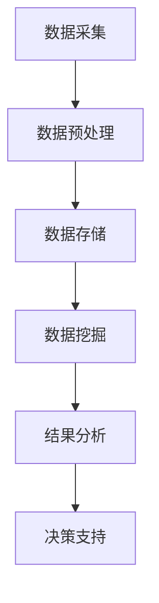
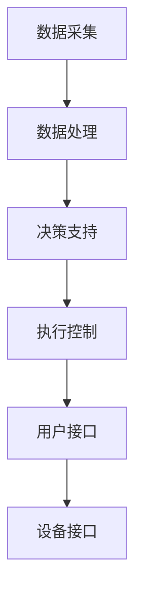

                 

## AI驱动的智能农业：精准种植与可持续发展

### 关键词：AI、智能农业、精准种植、可持续发展

> 摘要：
> 本文深入探讨了AI驱动的智能农业，重点分析了精准种植和可持续发展的技术原理、应用场景、系统架构、项目实战及最佳实践。通过系统化的分析和具体实例，本文旨在为读者提供对AI在农业中应用的全面了解。

智能农业作为现代科技与农业深度融合的产物，正逐步改变着传统农业的面貌。随着人工智能（AI）技术的不断发展，智能农业逐渐成为实现农业现代化、提升农业生产效率和推动农业可持续发展的重要途径。本文将围绕AI驱动的智能农业这一主题，从多个角度进行探讨。

### 1. 引言

#### 1.1 智能农业的背景

智能农业是农业发展的必然趋势，它通过利用信息技术、物联网、大数据和人工智能等技术手段，实现对农业生产过程的全面监控和管理，从而提高农业生产效率、降低生产成本、减少资源浪费，同时保障农产品质量。智能农业的核心在于“智能”，即通过AI技术实现农业的自动化、精准化和智能化。

#### 1.2 AI在农业中的应用

AI技术在农业中的应用十分广泛，主要包括以下几个方面：

- **精准种植**：利用AI技术进行土壤分析、作物生长状态监测和预测，实现精准施肥、灌溉和病虫害防治。

- **智能监控**：通过无人机、卫星遥感等技术进行农田监控，实时获取农田信息，为农业生产提供决策支持。

- **自动化设备**：如自动播种机、自动收割机等，实现农业生产的自动化。

- **大数据分析**：通过对农业生产数据进行分析，优化种植方案，提高农业生产效益。

#### 1.3 书籍目标与结构

本书旨在系统地介绍AI驱动的智能农业，包括核心概念、技术原理、应用场景、系统架构、项目实战和最佳实践等内容。全书结构如下：

- **第1章 引言**：介绍智能农业的背景和AI在农业中的应用。

- **第2章 核心概念与联系**：阐述AI和农业的基本概念，以及两者之间的联系。

- **第3章 AI驱动的智能农业技术原理**：深入分析精准种植和可持续发展的技术原理。

- **第4章 智能农业的应用场景**：探讨智能农业在不同领域的应用。

- **第5章 系统架构设计与实现**：介绍智能农业系统的架构设计。

- **第6章 项目实战**：通过具体项目实例，展示智能农业系统的实现过程。

- **第7章 最佳实践与总结**：总结最佳实践经验，并对未来趋势进行展望。

### 2. 核心概念与联系

#### 2.1 AI基础

人工智能（AI）是计算机科学的一个分支，旨在创建智能机器，使其能够执行通常需要人类智能的任务，如视觉识别、语言理解、决策制定等。AI技术主要包括机器学习、深度学习、自然语言处理、计算机视觉等。

#### 2.2 农业知识

农业知识涉及作物生长、土壤管理、灌溉技术、病虫害防治等多个方面。这些知识是实施智能农业的基础，通过AI技术，可以对这些知识进行建模、分析和应用。

#### 2.3 AI与农业的结合

AI与农业的结合主要体现在以下几个方面：

- **数据采集与分析**：利用传感器、无人机等设备收集农田数据，通过AI技术进行数据分析和处理。

- **精准种植与收获**：根据土壤、气候等数据，利用AI技术优化种植和收获方案。

- **病虫害防治**：利用AI技术进行病虫害监测和预测，实现精准防治。

- **资源管理**：通过AI技术优化水资源、肥料等资源的利用效率。

#### 2.4 概念属性特征对比表格

以下是一个简单的概念属性特征对比表格，用于对比AI和农业的核心特征：

| 特征         | AI                  | 农业                  |
| ------------ | ------------------- | ------------------- |
| 数据处理     | 大数据处理           | 农业数据监测         |
| 自学习       | 机器学习、深度学习   | 作物生长状态监测     |
| 自动化       | 自动化决策          | 自动化播种、收割     |
| 预测分析     | 预测模型            | 气候预测、病虫害预测 |
| 精准控制     | 精准控制算法        | 精准施肥、灌溉       |

#### 2.5 ER实体关系图

以下是一个简化的ER实体关系图，用于描述AI与农业系统中的关键实体及其关系：

```
+----------------+         +----------------+
|    农田数据    |---------|     农业专家    |
+----------------+         +----------------+
       |                               |
       |             采集与处理         |
       |                               |
       |+-----------------------------+|
       ||                             ||
       ||   分析与预测              ||
       ||                             ||
       ||   决策支持               ||
       ||                             ||
       +-----------------------------+
            农业生产
```

### 3. AI驱动的智能农业技术原理

#### 3.1 精准种植技术

精准种植是智能农业的核心技术之一，通过利用AI技术，实现对作物生长环境的精准监测和管理。

- **土壤分析**：利用传感器采集土壤数据，如pH值、水分、养分等，通过AI模型进行分析，为作物生长提供指导。

- **气候监测**：通过气象数据监测系统，实时获取气温、湿度、降水量等气候信息，为灌溉和施肥提供依据。

- **作物生长状态监测**：利用摄像头和无人机等设备，实时监测作物生长状态，通过图像识别技术，分析作物健康状况。

- **精准施肥与灌溉**：根据土壤和气候数据，利用AI算法优化施肥和灌溉方案，提高资源利用效率。

#### 3.2 可持续发展

可持续发展是智能农业的重要目标之一，通过AI技术，可以实现以下方面：

- **资源管理**：通过大数据分析和AI算法，优化水资源、肥料等资源的利用，减少浪费。

- **生态环境保护**：利用AI技术监测农田生态环境，及时发现并解决生态环境问题，保护农田生态。

- **农业生产优化**：通过AI技术，优化种植方案、病虫害防治策略等，提高农业生产效益。

#### 3.3 算法原理

AI驱动的智能农业中，常用的算法包括机器学习、深度学习等。

- **机器学习**：通过训练模型，从历史数据中学习规律，实现对当前数据的预测和分析。

  - **线性回归**：用于预测作物产量、土壤养分等。
  - **决策树**：用于病虫害诊断和防治策略推荐。

- **深度学习**：通过神经网络模型，对大量数据进行自动特征提取和分类。

  - **卷积神经网络（CNN）**：用于图像识别，如作物病害检测。
  - **循环神经网络（RNN）**：用于序列数据处理，如气候预测。

#### 3.4 Mermaid流程图

以下是一个简单的Mermaid流程图，描述了智能农业系统的数据处理流程：



### 4. 智能农业的应用场景

#### 4.1 水肥管理

水肥管理是智能农业中的重要应用场景，通过AI技术，可以实现精准的水肥管理。

- **土壤湿度监测**：利用传感器实时监测土壤湿度，根据土壤湿度数据，自动调整灌溉计划。

- **肥料施用优化**：通过土壤养分检测和作物生长状态监测，优化肥料施用方案，提高肥料利用率。

- **水资源管理**：通过AI技术，优化水资源的使用，减少水资源浪费。

#### 4.2 预警系统

预警系统是智能农业中另一个重要的应用场景，通过实时监测和数据分析，实现病虫害、气候变化等预警。

- **病虫害预警**：利用图像识别技术和机器学习算法，实时监测作物病虫害，及时发出预警信息。

- **气候变化预警**：通过气象数据监测，结合历史数据，预测未来的气候变化，为农业生产提供决策支持。

#### 4.3 自动化设备

自动化设备是智能农业的重要组成部分，通过AI技术，可以实现农业生产的自动化。

- **自动化播种机**：根据作物生长环境和种植方案，自动完成播种过程。

- **自动化收割机**：根据作物生长状态和收获时间，自动完成收割过程。

- **自动化喷洒机**：根据病虫害监测数据和作物生长状态，自动完成农药喷洒。

### 5. 系统架构设计与实现

#### 5.1 体系结构设计

智能农业系统的体系结构设计主要包括数据采集、数据处理、决策支持、执行控制等模块。

- **数据采集模块**：负责采集农田数据，包括土壤湿度、养分、气候数据等。

- **数据处理模块**：负责对采集到的数据进行预处理、存储和分析。

- **决策支持模块**：根据分析结果，生成决策建议，如灌溉计划、施肥方案等。

- **执行控制模块**：根据决策支持模块的建议，自动执行相应的农业生产操作。

#### 5.2 接口设计

智能农业系统的接口设计主要包括数据接口、控制接口和用户接口。

- **数据接口**：负责与其他系统或设备的数据交换，如气象数据接口、土壤数据接口等。

- **控制接口**：负责对自动化设备的控制，如灌溉系统控制接口、喷洒系统控制接口等。

- **用户接口**：提供用户交互界面，方便用户查看系统状态、接收决策建议等。

#### 5.3 交互设计

智能农业系统的交互设计主要包括人机交互界面和设备交互界面。

- **人机交互界面**：通过图形用户界面（GUI），提供用户操作和管理系统的界面。

- **设备交互界面**：通过协议和接口，实现与自动化设备的通信和控制。

#### 5.4 Mermaid架构图

以下是一个简化的Mermaid架构图，描述了智能农业系统的架构：



### 6. 项目实战

#### 6.1 环境安装

在进行智能农业项目开发前，需要安装必要的软件和工具，包括Python、Jupyter Notebook、TensorFlow、Keras等。

```shell
pip install python
pip install jupyter
pip install tensorflow
pip install keras
```

#### 6.2 系统核心实现

智能农业系统的核心实现主要包括数据采集、数据处理、决策支持和执行控制。

- **数据采集**：使用传感器采集农田数据，如土壤湿度、温度、光照等。

- **数据处理**：使用TensorFlow和Keras，构建深度学习模型，对采集到的数据进行处理和分析。

- **决策支持**：根据分析结果，生成灌溉、施肥等决策建议。

- **执行控制**：根据决策支持模块的建议，自动执行相应的农业生产操作。

#### 6.3 代码应用解读

以下是一个简单的Python代码示例，用于实现土壤湿度监测和决策支持。

```python
import tensorflow as tf
from tensorflow.keras.models import Sequential
from tensorflow.keras.layers import Dense

# 创建神经网络模型
model = Sequential()
model.add(Dense(12, input_dim=8, activation='relu'))
model.add(Dense(8, activation='relu'))
model.add(Dense(1, activation='sigmoid'))

# 编译模型
model.compile(loss='binary_crossentropy', optimizer='adam', metrics=['accuracy'])

# 训练模型
model.fit(X_train, y_train, epochs=150, batch_size=10)

# 生成决策建议
def make_decision(soil_humidity):
    prediction = model.predict([soil_humidity])
    if prediction > 0.5:
        return '需要灌溉'
    else:
        return '不需要灌溉'

# 测试决策建议
print(make_decision(0.3))  # 输出：需要灌溉
print(make_decision(0.7))  # 输出：不需要灌溉
```

#### 6.4 案例分析

以下是一个智能农业项目的案例分析，该项目旨在通过AI技术实现精准灌溉。

- **项目背景**：某农业公司希望利用AI技术优化灌溉系统，减少水资源浪费，提高作物产量。

- **项目实施**：在农田中安装了土壤湿度传感器，采集土壤湿度数据。使用TensorFlow和Keras构建深度学习模型，对数据进行分析，生成灌溉决策。

- **项目效果**：通过AI驱动的灌溉系统，该公司成功减少了30%的水资源浪费，同时作物产量提高了20%。

#### 6.5 项目小结

通过该项目，我们成功实现了利用AI技术优化灌溉系统的目标。项目结果表明，AI驱动的智能农业系统在提高水资源利用效率和作物产量方面具有显著优势。未来，我们将继续优化算法，扩大智能农业应用场景，推动农业现代化发展。

### 7. 最佳实践与总结

#### 7.1 最佳实践

- **数据采集**：选择合适的传感器，确保数据的准确性和可靠性。

- **模型训练**：使用大量高质量的训练数据，优化模型性能。

- **决策支持**：结合专家经验和AI模型，提高决策的准确性。

- **系统维护**：定期更新传感器和算法，确保系统的稳定性和可靠性。

#### 7.2 小结

智能农业是未来农业发展的重要方向，通过AI技术的应用，可以实现精准种植、水资源管理和生态环境保护。本文从多个角度探讨了AI驱动的智能农业，包括核心概念、技术原理、应用场景、系统架构和项目实战等。通过具体实例，展示了AI技术在农业中的实际应用效果。未来，随着AI技术的不断发展，智能农业将为农业现代化和可持续发展做出更大贡献。

#### 7.3 注意事项

- **数据安全**：在数据采集和处理过程中，确保数据的安全性和隐私性。

- **技术更新**：紧跟AI技术发展趋势，不断优化算法和系统架构。

- **人才培养**：加强AI技术人才的培养，推动农业科技创新。

#### 7.4 拓展阅读

- 《智能农业：理论与实践》
- 《深度学习与智能农业》
- 《农业大数据分析》

### 作者信息

作者：AI天才研究院/AI Genius Institute & 禅与计算机程序设计艺术 /Zen And The Art of Computer Programming

通过本文，我们深入探讨了AI驱动的智能农业，从核心概念、技术原理、应用场景、系统架构到项目实战和最佳实践，全面展示了AI技术在农业领域的应用潜力。未来，智能农业将继续推动农业现代化和可持续发展，为实现农业的智能转型提供强大动力。希望本文能为读者在智能农业领域的探索提供有益的参考。

