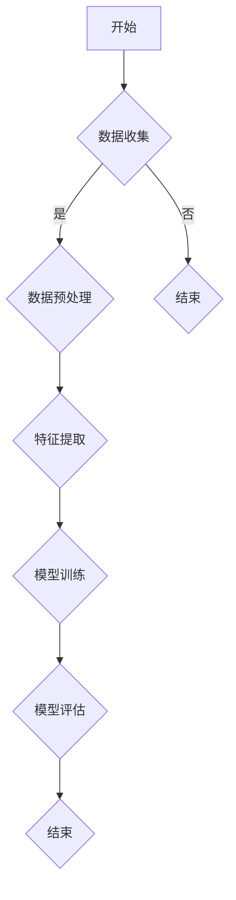
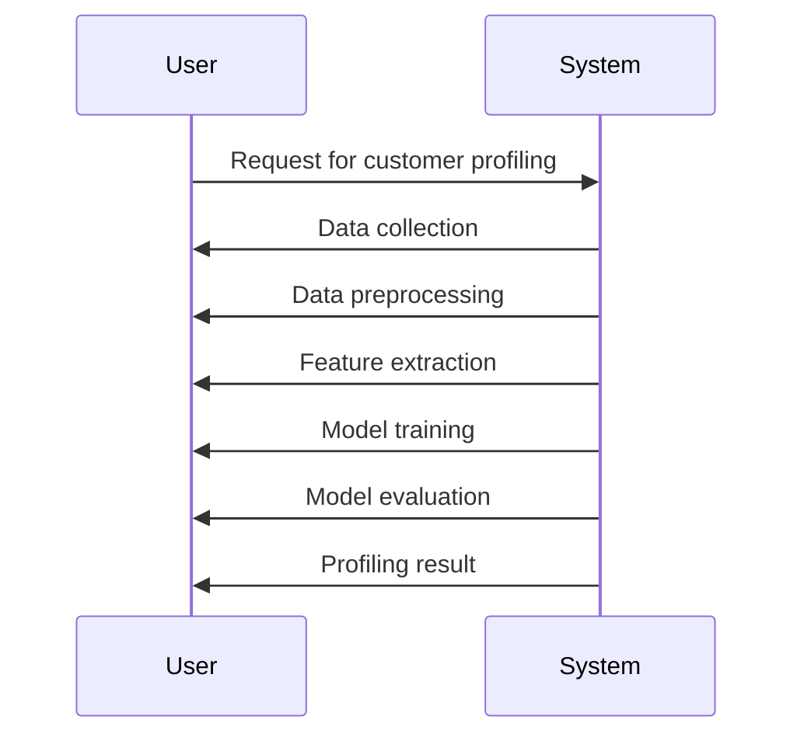
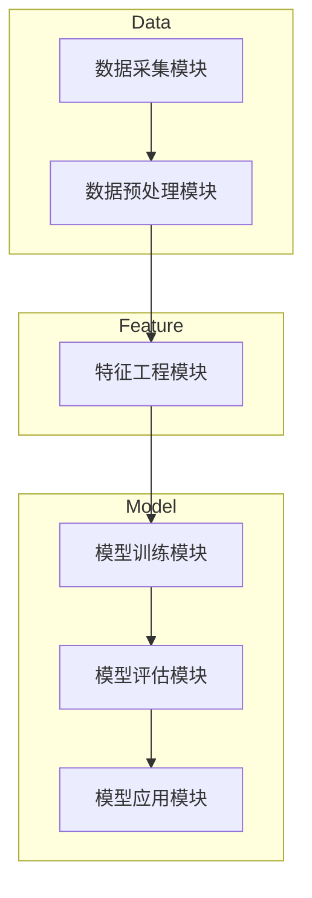
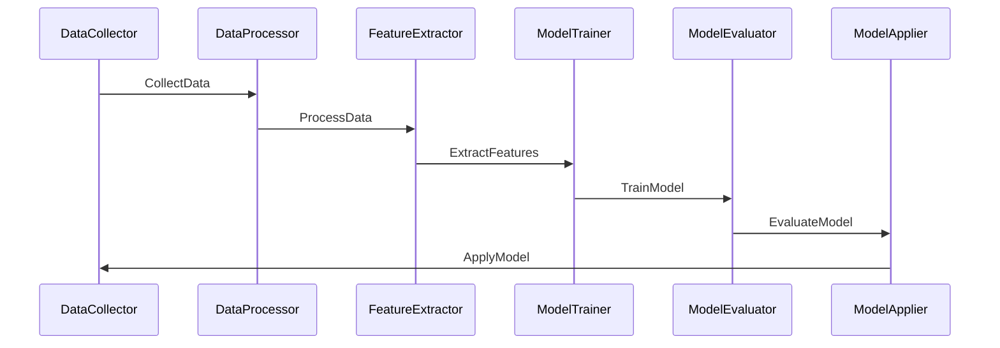

                 


# AI驱动的智能客户画像：精准营销的基础

## 关键词
- AI
- 智能客户画像
- 精准营销
- 数据分析
- 机器学习
- 深度学习
- 客户关系管理

## 摘要
随着人工智能技术的快速发展，智能客户画像已经成为精准营销的关键。本文将深入探讨AI驱动的智能客户画像的概念、核心概念与理论框架、数据与特征工程、算法原理、系统架构设计以及项目实战，旨在为广大从事营销与数据分析的技术人员提供一套全面的技术指南。

## 引言
### AI在营销领域的崛起
随着互联网的普及和数据技术的进步，营销策略正从传统的大众化市场逐渐转向个性化、精准化的方向。人工智能（AI）在这一转型过程中发挥了至关重要的作用。通过机器学习和深度学习技术，企业能够更加精准地理解客户需求和行为，从而实现个性化的营销和服务。

### 智能客户画像的概念
智能客户画像是指通过AI技术，对客户的属性、行为、偏好等进行综合分析，构建出一个多维度的、动态的、可交互的客户数据模型。这一模型能够帮助企业更好地了解客户，进而实现精准营销。

### 智能客户画像在精准营销中的作用
智能客户画像能够帮助企业：
- 准确识别目标客户群体。
- 深入挖掘客户需求，实现精准推送。
- 提升客户满意度，增加客户忠诚度。
- 提高营销效率，降低营销成本。

## 第一章：AI驱动的智能客户画像基础
### 1.1 引言
#### 1.1.1 AI在营销中的崛起
AI技术已经在多个领域取得了显著成果，如自然语言处理、计算机视觉、智能推荐等。在营销领域，AI的应用主要集中在数据挖掘、客户关系管理、个性化推荐等方面。

#### 1.1.2 客户画像的概念
客户画像是指通过对客户数据的收集、整合和分析，构建出一个关于客户的综合描述。这一描述可以帮助企业更好地了解客户，进而实现精准营销。

#### 1.1.3 AI在客户画像中的作用
AI技术能够大幅提升客户画像的构建效率和质量。通过机器学习和深度学习模型，企业能够从海量数据中快速提取有价值的信息，构建出更加精准、动态的客户画像。

### 1.2 核心概念与理论框架
#### 1.2.1 数据收集与预处理
客户画像的构建依赖于大量的数据，这些数据可能来自企业内部数据库、第三方数据平台、社交媒体等。数据预处理是数据分析和建模的基础，主要包括数据清洗、数据集成和数据转换等步骤。

#### 1.2.2 机器学习算法
机器学习算法是构建客户画像的核心技术之一。常见的机器学习算法包括决策树、随机森林、支持向量机、神经网络等。这些算法可以根据不同类型的数据和业务需求进行选择和应用。

#### 1.2.3 评估指标
客户画像模型的评估指标主要包括准确率、召回率、F1值等。这些指标可以帮助企业评估模型的性能，并进行优化调整。

### 1.3 相关AI技术
#### 1.3.1 传统AI与深度学习
传统AI主要依赖于规则和逻辑推理，而深度学习则通过多层神经网络，自动从数据中学习特征和模式。深度学习在客户画像中具有广泛的应用前景。

#### 1.3.2 神经网络与深度学习模型
神经网络是深度学习的基础，包括多层感知器（MLP）、卷积神经网络（CNN）、循环神经网络（RNN）等。这些模型在客户画像的构建中具有重要作用。

#### 1.3.3 自然语言处理
自然语言处理（NLP）是AI的一个重要分支，旨在使计算机理解和处理自然语言。在客户画像中，NLP可以用于分析客户评论、情感等，从而提供更加深入的客户洞察。

## 第二章：数据与特征工程
### 2.1 数据收集与预处理
#### 2.1.1 数据来源
数据来源包括企业内部数据（如交易记录、客户反馈等）和外部数据（如社交媒体、第三方数据平台等）。

#### 2.1.2 数据预处理
数据预处理包括数据清洗、数据集成和数据转换等步骤。数据清洗主要是去除噪声和异常值，数据集成是将不同来源的数据进行整合，数据转换则是将数据格式转换为适合建模的格式。

### 2.2 特征选择与提取
#### 2.2.1 特征选择
特征选择是从原始数据中筛选出对模型有重要影响的关键特征。常见的特征选择方法包括过滤式、包裹式和嵌入式方法。

#### 2.2.2 特征提取
特征提取是从原始数据中提取出新的特征，以提高模型的性能。常见的方法包括主成分分析（PCA）、线性判别分析（LDA）等。

#### 2.2.3 处理不平衡数据
在客户画像中，数据可能存在不平衡现象，即不同类别的样本数量差异较大。处理不平衡数据的方法包括过采样、欠采样和成本敏感学习等。

### 2.3 维度减少技术
#### 2.3.1 主成分分析（PCA）
主成分分析是一种常用的维度减少技术，通过将原始数据投影到新的低维空间，降低数据的维度。

#### 2.3.2 t-SNE
t-SNE（t-Distributed Stochastic Neighbor Embedding）是一种非线性的维度减少技术，可以很好地将高维数据映射到二维或三维空间中，以便进行可视化分析。

## 第三章：算法原理与模型分析
### 3.1 机器学习算法
#### 3.1.1 决策树
决策树是一种基于树形结构的数据分类算法。通过一系列的测试，将数据集划分成若干个子集，直到达到终止条件。

#### 3.1.2 随机森林
随机森林是一种基于决策树的集成学习方法。通过构建多个决策树，并使用投票或平均的方式得出最终结果。

#### 3.1.3 支持向量机
支持向量机是一种基于最大间隔原则的分类算法。通过找到一个最优的超平面，将数据划分为不同的类别。

### 3.2 深度学习模型
#### 3.2.1 卷积神经网络（CNN）
卷积神经网络是一种用于图像处理的深度学习模型。通过卷积操作，自动提取图像中的特征。

#### 3.2.2 循环神经网络（RNN）
循环神经网络是一种用于序列数据处理的深度学习模型。通过记忆机制，能够处理任意长度的序列数据。

#### 3.2.3 生成对抗网络（GAN）
生成对抗网络是一种基于博弈理论的深度学习模型。通过生成器和判别器的对抗训练，生成高质量的数据。

### 3.3 模型评估与优化
#### 3.3.1 评估指标
常见的模型评估指标包括准确率、召回率、F1值等。

#### 3.3.2 优化方法
模型优化主要包括超参数调优、正则化技术、集成学习方法等。

## 第四章：系统架构设计与实现
### 4.1 问题场景与项目介绍
#### 4.1.1 问题场景
在企业营销中，如何通过AI技术构建智能客户画像，实现精准营销是一个重要问题。

#### 4.1.2 项目介绍
本项目旨在构建一个基于AI的智能客户画像系统，通过对客户数据的收集、预处理、特征提取、模型训练和评估，实现客户画像的构建和应用。

### 4.2 系统功能设计
#### 4.2.1 领域模型
领域模型是系统设计的第一步，用于定义系统的核心概念和关系。在本项目中，领域模型主要包括客户、数据源、特征、模型等实体。

#### 4.2.2 类图
类图是领域模型的一种可视化表示，用于展示系统中的类及其关系。在本项目中，类图包括客户类、数据源类、特征类、模型类等。

### 4.3 系统架构设计
#### 4.3.1 架构图
系统架构设计是系统设计的核心，用于定义系统的组件、接口和交互关系。在本项目中，系统架构包括数据采集模块、数据预处理模块、特征工程模块、模型训练模块和模型评估模块。

#### 4.3.2 系统接口设计
系统接口设计是系统架构的一部分，用于定义系统与其他系统或组件的交互接口。在本项目中，系统接口包括数据采集接口、数据预处理接口、特征提取接口、模型训练接口和模型评估接口。

### 4.4 系统交互设计
#### 4.4.1 序列图
序列图是系统交互设计的一种可视化表示，用于展示系统的组件之间的交互顺序和关系。在本项目中，序列图包括数据采集、数据预处理、特征提取、模型训练和模型评估等步骤。

## 第五章：项目实战
### 5.1 环境安装与配置
#### 5.1.1 环境要求
在本项目中，需要安装Python、Scikit-learn、TensorFlow、PyTorch等工具和库。

#### 5.1.2 安装步骤
详细的安装步骤和配置说明将在本章节中详细阐述。

### 5.2 系统核心实现
#### 5.2.1 数据采集模块
数据采集模块负责从不同数据源获取客户数据，包括内部数据库、第三方数据平台、社交媒体等。

#### 5.2.2 数据预处理模块
数据预处理模块负责对采集到的客户数据进行清洗、去重、格式转换等操作，以便后续的特征提取和模型训练。

#### 5.2.3 特征工程模块
特征工程模块负责对预处理后的数据进行特征选择、特征提取和维度减少等操作，以提升模型的性能。

#### 5.2.4 模型训练模块
模型训练模块负责使用机器学习或深度学习算法对特征数据训练模型，以构建客户画像。

#### 5.2.5 模型评估模块
模型评估模块负责对训练好的模型进行评估，包括准确率、召回率、F1值等指标的计算，以评估模型的性能。

### 5.3 代码应用解读与分析
#### 5.3.1 数据采集代码
在本项目中，数据采集代码使用Python的pandas库，通过读取内部数据库和第三方数据平台的API接口，获取客户数据。

#### 5.3.2 数据预处理代码
数据预处理代码使用Python的Scikit-learn库，对客户数据进行清洗、去重和格式转换等操作。

#### 5.3.3 特征工程代码
特征工程代码使用Python的Scikit-learn库，对预处理后的数据进行特征选择、特征提取和维度减少等操作。

#### 5.3.4 模型训练代码
模型训练代码使用Python的TensorFlow或PyTorch库，对特征数据进行训练，构建客户画像模型。

#### 5.3.5 模型评估代码
模型评估代码使用Python的Scikit-learn库，对训练好的模型进行评估，计算准确率、召回率、F1值等指标。

### 5.4 实际案例分析
在本项目中，我们将通过一个实际案例，展示如何使用AI技术构建智能客户画像，实现精准营销。

#### 5.4.1 案例背景
某电商企业希望通过AI技术构建智能客户画像，实现精准营销，提高销售额。

#### 5.4.2 数据收集
从企业的内部数据库中提取客户的交易记录、浏览记录、购物车数据等。

#### 5.4.3 数据预处理
对收集到的数据进行清洗、去重和格式转换，以便后续的特征提取和模型训练。

#### 5.4.4 特征工程
对预处理后的数据进行特征选择、特征提取和维度减少，以提升模型的性能。

#### 5.4.5 模型训练
使用机器学习或深度学习算法对特征数据进行训练，构建客户画像模型。

#### 5.4.6 模型评估
对训练好的模型进行评估，计算准确率、召回率、F1值等指标，以评估模型的性能。

### 5.5 项目小结
在本项目中，我们通过AI技术实现了智能客户画像的构建，实现了精准营销。项目过程中，我们遇到了一些挑战，如数据质量、模型性能等，但通过不断的优化和调整，最终实现了项目的目标。

## 第六章：最佳实践与注意事项
### 6.1 最佳实践
#### 6.1.1 数据质量
数据质量是构建智能客户画像的关键，企业需要确保数据来源的准确性和完整性。

#### 6.1.2 特征选择
合理的特征选择可以提高模型的性能，企业需要根据业务需求选择合适的特征。

#### 6.1.3 模型调优
模型调优是提高模型性能的重要手段，企业需要根据评估指标进行模型参数的调整。

### 6.2 注意事项
#### 6.2.1 数据隐私
在收集和处理客户数据时，需要遵守相关法律法规，保护客户隐私。

#### 6.2.2 模型可解释性
为了提高模型的可解释性，企业可以考虑使用可解释性较强的模型，如决策树等。

#### 6.2.3 持续优化
智能客户画像是一个动态的过程，企业需要持续优化模型和策略，以适应市场的变化。

## 第七章：拓展阅读
### 7.1 相关书籍
- 《深度学习》（Goodfellow, I., Bengio, Y., & Courville, A.）
- 《机器学习》（Tom Mitchell）
- 《大数据营销》（Eloqua）
- 《数据挖掘：实用工具和技术》（Han, J., Kamber, M., & Pei, J.）

### 7.2 相关论文
- "Customer Segmentation Using Clustering Techniques" by Thijmen Vos and Harro Olhoek
- "Deep Learning for Customer Segmentation" by Wei Wang, Yizhou Sun, and Xiangang Li
- "A Survey on Customer Profiling for Personalized Marketing" by Mohammad H. Khalil, Mohammad S. H. Khan, and O. German Lopez

## 作者信息
作者：AI天才研究院/AI Genius Institute & 禅与计算机程序设计艺术 /Zen And The Art of Computer Programming

[Mermaid流程图示例](#mermaid示例)



[Mermaid类图示例](#mermaid示例)

```mermaid
classDiagram
    Customer <<entity>>
    DataSource <<entity>>
    Feature <<entity>>
    Model <<entity>>

    Customer o-- DataSource
    Customer o-- Feature
    Customer o-- Model
```

[Mermaid架构图示例](#mermaid示例)



[Mermaid序列图示例](#mermaid示例)

```mermaid
sequenceDiagram
    participant Customer
    participant System

    Customer->>System: Provide transaction data
    System->>Customer: Data cleaned
    Customer->>System: Provide browsing data
    System->>Customer: Data integrated
    Customer->>System: Request feature engineering
    System->>Customer: Features extracted
    Customer->>System: Request model training
    System->>Customer: Model trained
    Customer->>System: Request model evaluation
    System->>Customer: Model evaluated
```## 第一章：AI驱动的智能客户画像基础

### 1.1 引言

#### 1.1.1 AI在营销中的崛起

人工智能（AI）的快速发展已经深刻地改变了各个行业，包括市场营销。传统的市场营销依赖于广告、促销和销售技巧，而现代市场营销则更多地依赖于数据分析和个性化推荐。AI技术在数据挖掘、自然语言处理、计算机视觉等领域取得了显著进展，为市场营销带来了前所未有的机遇。

首先，数据挖掘技术可以帮助企业从海量数据中提取有价值的信息，了解客户的行为和偏好。通过分析客户的购买历史、浏览记录、社交媒体活动等数据，企业可以更准确地识别潜在客户和目标客户，从而制定更有效的营销策略。

其次，自然语言处理技术使计算机能够理解和生成自然语言。这一技术在客户反馈分析、情感分析、关键词提取等方面具有广泛的应用。通过分析客户对产品的评价和反馈，企业可以更好地了解客户的真实需求和满意度，进而优化产品和服务。

最后，计算机视觉技术可以自动识别和分类图像和视频，帮助企业在广告投放、产品推荐等方面实现自动化和个性化。例如，基于图像识别技术的广告投放可以根据用户的历史行为和兴趣，精准地向用户推送相关的广告内容。

#### 1.1.2 客户画像的概念

客户画像是指通过收集和分析客户的属性、行为、偏好等数据，构建出一个关于客户的综合描述。这个描述可以是静态的，也可以是动态的，即随着时间的推移，客户的行为和偏好可能会发生变化，客户画像也需要进行相应的调整。

客户画像的核心是数据，这些数据可以来源于企业内部的客户管理系统、销售记录、客户反馈等，也可以来源于外部的第三方数据平台、社交媒体等。通过这些数据，企业可以更加深入地了解客户，从而制定更精准的营销策略。

#### 1.1.3 AI在客户画像中的作用

AI技术在客户画像的构建中发挥着至关重要的作用。首先，AI技术可以自动处理和分析大量的数据，从数据中提取出有价值的信息，构建出精准的客户画像。例如，通过机器学习算法，可以识别出客户的行为模式、购买偏好等，从而更好地理解客户。

其次，AI技术可以帮助企业动态地调整客户画像。随着客户行为和偏好的变化，客户画像也需要进行相应的更新和调整。通过深度学习算法，企业可以实时地监测客户的行为，并动态地更新客户画像，确保其始终保持准确和实时。

最后，AI技术可以为企业提供智能化的客户洞察。通过分析客户画像，企业可以更好地了解客户的需求和偏好，从而提供更加个性化的产品和服务。例如，基于客户画像的推荐系统可以自动向客户推荐他们可能感兴趣的产品，从而提高销售转化率。

### 1.2 核心概念与理论框架

#### 1.2.1 数据收集与预处理

数据收集是构建客户画像的第一步，也是最重要的一步。数据来源可以包括企业内部的客户管理系统、销售记录、客户反馈等，也可以包括外部的第三方数据平台、社交媒体等。数据收集的关键在于确保数据的准确性和完整性，避免数据噪声和缺失值对后续分析造成影响。

数据预处理是数据分析和建模的基础，主要包括数据清洗、数据集成和数据转换等步骤。数据清洗主要是去除数据中的噪声和异常值，例如删除重复记录、纠正错误数据等。数据集成是将来自不同来源的数据进行整合，以便进行统一分析。数据转换则是将数据格式转换为适合建模的格式，例如将文本数据转换为数值数据等。

#### 1.2.2 机器学习算法

机器学习算法是构建客户画像的核心技术之一。机器学习算法可以分为监督学习和无监督学习两种。监督学习算法需要使用标记数据，通过学习标记数据的特征，预测未知数据的标签。常见的监督学习算法包括线性回归、决策树、随机森林、支持向量机等。无监督学习算法不需要使用标记数据，通过学习数据本身的分布和结构，对数据进行分类或聚类。常见的无监督学习算法包括K-均值聚类、主成分分析、自编码器等。

在客户画像中，监督学习算法通常用于预测客户的某些行为或偏好，例如购买行为、浏览行为等。无监督学习算法则用于对客户进行聚类，构建出不同类型的客户群体。

#### 1.2.3 评估指标

评估指标是衡量客户画像模型性能的重要工具。常见的评估指标包括准确率、召回率、F1值等。准确率是指模型正确预测的样本数占总样本数的比例，用于衡量模型的分类能力。召回率是指模型正确预测的样本数占实际正样本数的比例，用于衡量模型对正样本的识别能力。F1值是准确率和召回率的加权平均，用于综合评估模型的性能。

在客户画像中，评估指标的选择取决于具体的业务需求和数据特点。例如，对于识别潜在客户的任务，召回率可能更为重要，因为漏掉一个潜在客户可能会错过重要的营销机会。而对于推荐系统的任务，准确率可能更为重要，因为推荐的用户偏好需要尽可能准确。

#### 1.2.4 AI技术相关概述

AI技术的发展为构建客户画像提供了丰富的工具和方法。除了传统的机器学习算法，深度学习算法也在客户画像中得到了广泛应用。深度学习算法通过多层神经网络，可以从数据中自动提取特征，实现更加精准的建模和预测。

深度学习算法在图像识别、自然语言处理、语音识别等领域取得了显著成果。在客户画像中，深度学习算法可以用于分析客户的行为数据，提取出更加复杂和抽象的特征，从而提高模型的性能。

此外，自然语言处理技术也在客户画像中发挥着重要作用。通过分析客户的文本数据，可以提取出客户的情感、偏好等信息，从而构建出更加全面的客户画像。

### 1.3 AI技术在客户画像中的应用

#### 1.3.1 传统AI与深度学习

传统AI主要依赖于规则和逻辑推理，而深度学习则通过多层神经网络，自动从数据中学习特征和模式。在客户画像中，传统AI和深度学习都有其独特的应用场景。

传统AI算法，如决策树、随机森林等，通过显式地定义规则和特征，对数据进行分析和分类。这些算法在处理结构化数据时表现较好，但面对非结构化数据时，如文本、图像等，其性能有限。

深度学习算法，如卷积神经网络（CNN）、循环神经网络（RNN）等，通过多层神经网络，自动从数据中学习特征和模式。这些算法在图像识别、自然语言处理等领域取得了显著成果，也可以应用于客户画像的构建。

#### 1.3.2 神经网络与深度学习模型

神经网络是深度学习的基础，包括多层感知器（MLP）、卷积神经网络（CNN）、循环神经网络（RNN）等。这些模型在客户画像中具有重要作用。

多层感知器（MLP）是一种前馈神经网络，通过多层神经元之间的连接，实现数据的分类和回归。MLP在处理结构化数据时表现较好，如客户的行为数据、交易记录等。

卷积神经网络（CNN）是一种专门用于图像识别的深度学习模型。通过卷积操作，CNN可以自动提取图像中的特征，从而实现对图像的分类和识别。在客户画像中，CNN可以用于分析客户的购买历史、浏览记录等，提取出图像特征。

循环神经网络（RNN）是一种专门用于序列数据处理的深度学习模型。通过循环连接，RNN可以记忆序列中的信息，从而实现对序列数据的分类和预测。在客户画像中，RNN可以用于分析客户的浏览历史、评论等，提取出序列特征。

#### 1.3.3 自然语言处理

自然语言处理（NLP）是AI的一个重要分支，旨在使计算机理解和处理自然语言。在客户画像中，NLP可以用于分析客户的文本数据，提取出客户的情感、偏好等信息，从而构建出更加全面的客户画像。

常见的NLP技术包括词向量、情感分析、关键词提取等。词向量是将文本数据转换为数值向量，以便进行数学计算。情感分析是判断文本数据中的情感倾向，如正面、负面、中性等。关键词提取是从文本数据中提取出重要的关键词，用于分析客户的偏好和需求。

通过NLP技术，企业可以更好地理解客户的反馈和需求，从而提供更加个性化的产品和服务。

### 1.4 智能客户画像的构建流程

智能客户画像的构建是一个系统工程，包括数据收集、数据预处理、特征提取、模型训练和评估等步骤。以下是智能客户画像的构建流程：

1. **数据收集**：从企业内部的客户管理系统、销售记录、客户反馈等，以及外部的第三方数据平台、社交媒体等，收集与客户相关的数据。

2. **数据预处理**：对收集到的数据进行清洗、去重、格式转换等操作，确保数据的准确性和完整性。

3. **特征提取**：从预处理后的数据中提取出对客户画像有价值的特征，如购买历史、浏览记录、客户反馈等。

4. **模型训练**：使用机器学习或深度学习算法，对提取出的特征进行训练，构建出客户画像模型。

5. **模型评估**：对训练好的模型进行评估，计算准确率、召回率、F1值等指标，确保模型的性能符合业务需求。

6. **模型应用**：将训练好的模型应用于实际业务场景，如精准营销、客户推荐等，为企业提供智能化的客户洞察。

通过以上步骤，企业可以构建出精准、动态、可交互的客户画像，实现精准营销，提高客户满意度和忠诚度。

### 1.5 智能客户画像的应用场景

智能客户画像在多个行业和业务场景中都有广泛的应用。以下是智能客户画像的一些典型应用场景：

1. **零售业**：通过智能客户画像，零售企业可以更好地了解客户的购买行为和偏好，从而制定个性化的营销策略，提高销售额。

2. **金融业**：金融企业可以通过智能客户画像，识别潜在的风险客户，优化信贷审核流程，提高风险管理能力。

3. **餐饮业**：餐饮企业可以通过智能客户画像，了解客户的饮食习惯和偏好，提供个性化的菜品推荐和营销活动，提高客户满意度。

4. **电子商务**：电子商务平台可以通过智能客户画像，为用户提供个性化的商品推荐，提高用户粘性和转化率。

5. **医疗健康**：医疗健康企业可以通过智能客户画像，了解用户的健康状况和需求，提供个性化的健康建议和服务。

通过智能客户画像，企业可以更好地了解客户，提供个性化的产品和服务，提高客户满意度和忠诚度，实现持续的业务增长。

### 1.6 智能客户画像的挑战与未来趋势

智能客户画像在带来巨大商业价值的同时，也面临着一些挑战和风险。以下是智能客户画像的一些挑战和未来趋势：

1. **数据隐私**：随着数据隐私法规的日益严格，如何保护客户数据隐私成为一个重要问题。企业需要采取有效的数据保护措施，确保客户数据的安全和隐私。

2. **数据质量**：客户画像的构建依赖于大量的数据，数据质量直接影响客户画像的准确性。企业需要确保数据来源的准确性和完整性，避免数据噪声和缺失值对分析结果的影响。

3. **模型解释性**：深度学习模型在客户画像中得到了广泛应用，但其“黑箱”性质使得模型的可解释性成为一个挑战。企业需要提高模型的可解释性，以便更好地理解模型的预测结果。

4. **实时性**：客户行为和偏好是动态变化的，如何实现实时更新和调整客户画像是一个重要问题。企业需要开发高效的实时数据处理和分析技术，确保客户画像的实时性和准确性。

5. **个性化推荐**：个性化推荐是智能客户画像的重要应用之一，如何构建有效的推荐算法，提高推荐系统的准确性和用户体验是一个重要挑战。

未来，智能客户画像将朝着更加智能化、实时化和个性化的方向发展。随着AI技术的不断进步，企业将能够更加精准地了解客户，提供个性化的产品和服务，实现持续的业务增长。

### 1.7 小结

智能客户画像作为AI技术在营销领域的重要应用，已经显示出巨大的商业价值。通过构建精准、动态、可交互的客户画像，企业可以更好地了解客户，实现个性化营销，提高客户满意度和忠诚度。然而，智能客户画像的构建和应用也面临着数据隐私、数据质量、模型解释性等方面的挑战。未来，随着AI技术的不断进步，智能客户画像将在更多行业和业务场景中发挥作用，为企业创造更多价值。让我们拭目以待，智能客户画像的未来将更加美好。## 第二章：数据与特征工程

### 2.1 数据收集与预处理

数据收集是构建智能客户画像的第一步，也是最重要的一步。数据来源可以包括企业内部的客户管理系统、销售记录、客户反馈等，也可以包括外部的第三方数据平台、社交媒体等。以下是对数据收集和预处理方法的详细说明。

#### 2.1.1 数据收集

1. **内部数据源**：
   - **客户管理系统**：企业可以使用客户关系管理（CRM）系统收集客户的基本信息，如姓名、年龄、性别、联系方式等。
   - **销售记录**：企业的销售记录可以提供客户的购买历史、购买金额、购买频率等信息。
   - **客户反馈**：客户的反馈数据，如评价、投诉、建议等，可以提供客户对企业产品和服务的满意度。

2. **外部数据源**：
   - **第三方数据平台**：可以通过购买或交换数据，获取与客户相关的 demographics（人口统计信息）、地理信息、消费行为等数据。
   - **社交媒体**：社交媒体平台（如微博、微信、Facebook、Twitter等）提供了丰富的用户生成内容，可以通过爬虫或API获取用户的社交行为、兴趣偏好等数据。

3. **数据收集方法**：
   - **API调用**：通过第三方数据平台的API接口，获取客户数据。
   - **数据爬取**：使用网络爬虫技术，从公开的社交媒体平台、论坛等网站获取客户数据。
   - **问卷调查**：通过在线或离线的问卷调查，收集客户的个人信息和偏好。

#### 2.1.2 数据预处理

数据预处理是确保数据质量和适用性的关键步骤，主要包括以下几方面：

1. **数据清洗**：
   - **去除重复数据**：检测并删除重复的客户记录，确保数据的唯一性。
   - **修复错误数据**：识别和纠正数据中的错误，如缺失值、异常值、格式错误等。
   - **数据标准化**：将不同来源的数据格式进行统一，如日期格式、货币单位等。

2. **数据集成**：
   - **合并多源数据**：将来自不同数据源的客户信息进行整合，构建一个统一的客户视图。
   - **数据合并**：使用数据库连接技术，将结构化数据与非结构化数据进行合并。

3. **数据转换**：
   - **特征提取**：从原始数据中提取对构建客户画像有价值的特征，如购买频率、购买金额、评分等。
   - **数据编码**：将数据转换为适合机器学习算法处理的格式，如将分类数据转换为独热编码。

#### 2.1.3 数据质量管理

数据质量管理是确保数据质量的重要环节，包括以下方面：

1. **数据质量评估**：
   - **完整性**：检查数据是否完整，是否存在缺失值。
   - **准确性**：确保数据是准确和可靠的，不存在错误或误导。
   - **一致性**：确保数据在时间和空间上的一致性，避免冲突和不一致。
   - **唯一性**：确保数据是唯一的，不存在重复记录。

2. **数据清洗与修复**：
   - **缺失值处理**：使用填充策略，如均值填充、插值、模式识别等，处理缺失值。
   - **异常值检测与处理**：使用统计方法，如箱线图、3σ原则等，检测和修正异常值。

3. **数据质量监控**：
   - **实时监控**：建立数据质量监控机制，实时检测和报告数据质量问题。
   - **定期审计**：定期对数据进行审计，确保数据质量长期维持。

### 2.2 特征选择与提取

特征选择与提取是数据预处理的重要步骤，旨在从原始数据中提取出对构建客户画像最有价值的特征。以下是对特征选择和提取方法的详细说明。

#### 2.2.1 特征选择

特征选择是从原始特征集合中选择出对目标变量有显著影响的特征。常用的特征选择方法包括：

1. **过滤式特征选择**：
   - **基于统计方法**：使用相关性分析、卡方检验等统计方法，评估特征与目标变量之间的相关性。
   - **基于信息论方法**：使用信息增益、信息增益率等指标，评估特征对目标变量的解释能力。

2. **包裹式特征选择**：
   - **基于模型选择方法**：使用模型选择准则，如交叉验证、信息准则等，选择最优特征子集。
   - **基于贪心算法**：使用贪心算法，如递归特征消除（RFE）、前向选择、后向消除等，逐步选择特征。

3. **嵌入式特征选择**：
   - **基于模型正则化方法**：使用正则化方法，如L1正则化、L2正则化等，在模型训练过程中自动选择特征。

#### 2.2.2 特征提取

特征提取是从原始数据中创建新的特征，以提升模型的性能。常用的特征提取方法包括：

1. **数值特征提取**：
   - **归一化**：将数值特征转换为标准分数，消除不同特征之间的量纲差异。
   - **标准化**：将数值特征转换为均值为0、标准差为1的标准分数。
   - **主成分分析（PCA）**：通过线性变换，降低数据的维度，同时保留大部分的信息。
   - **因子分析**：通过提取因子，简化数据的结构，同时保留主要的信息。

2. **文本特征提取**：
   - **词袋模型**：将文本数据转换为词汇表，使用频率或TF-IDF作为特征。
   - **词嵌入**：将文本数据转换为词向量，如Word2Vec、GloVe等，用于后续的深度学习模型。

3. **图像特征提取**：
   - **特征点检测**：使用SIFT、SURF等算法，检测图像中的关键点。
   - **深度特征提取**：使用卷积神经网络（CNN）提取图像中的高维特征。

#### 2.2.3 特征选择与提取的挑战

1. **特征冗余**：原始数据中可能存在大量的冗余特征，这些特征会影响模型的性能。
2. **特征缺失**：在实际应用中，数据可能存在缺失值，这会影响特征选择和提取的效果。
3. **特征维度**：高维特征可能导致计算复杂度增加，降低模型的训练效率。
4. **特征不平衡**：不同特征的重要性可能不均衡，需要根据业务需求进行特征权重调整。

### 2.3 维度减少技术

维度减少技术旨在降低数据的维度，同时保留大部分的信息，以提高模型的训练效率和性能。以下是一些常用的维度减少技术：

1. **主成分分析（PCA）**：
   - **原理**：通过线性变换，将高维数据投影到低维空间，同时保留大部分的信息。
   - **步骤**：
     1. 计算数据集的协方差矩阵。
     2. 计算协方差矩阵的特征值和特征向量。
     3. 选择最大的几个特征值对应的特征向量，构建新的特征空间。
     4. 将原始数据投影到新的特征空间。

2. **线性判别分析（LDA）**：
   - **原理**：通过线性变换，将数据投影到低维空间，最大化不同类别之间的分离度。
   - **步骤**：
     1. 计算数据集的协方差矩阵。
     2. 计算协方差矩阵的特征值和特征向量。
     3. 选择最大的几个特征值对应的特征向量，构建新的特征空间。
     4. 将原始数据投影到新的特征空间。

3. **t-SNE**：
   - **原理**：通过非线性的降维技术，将高维数据映射到二维或三维空间，以便进行可视化分析。
   - **步骤**：
     1. 计算数据集的相似性矩阵。
     2. 使用t-SNE算法进行降维，计算映射后的坐标。
     3. 将映射后的坐标用于数据可视化。

#### 2.3.3 维度减少技术的应用

维度减少技术可以应用于多个领域，如图像处理、文本分析、时间序列分析等。以下是一些实际应用案例：

1. **图像处理**：通过PCA或LDA，将高维的图像数据降维到较低的维度，同时保留大部分的信息，用于图像压缩和特征提取。
2. **文本分析**：通过词袋模型或词嵌入，将高维的文本数据降维到较低的维度，同时保留文本的主要信息，用于文本分类和情感分析。
3. **时间序列分析**：通过PCA或LDA，将高维的时间序列数据降维到较低的维度，同时保留主要的趋势和周期性，用于时间序列预测和异常检测。

### 2.4 小结

数据与特征工程是构建智能客户画像的关键步骤，包括数据收集、数据预处理、特征选择、特征提取和维度减少等环节。通过有效的数据预处理和特征工程，可以提升模型的性能和预测准确性，为企业提供更加精准的客户洞察。然而，数据与特征工程也面临一些挑战，如数据质量、特征冗余、维度灾难等，需要结合具体业务场景和需求，选择合适的处理方法。在未来的研究中，可以进一步探索自动化和智能化的数据预处理和特征工程方法，以提高数据利用效率和模型性能。## 第三章：算法原理与模型分析

### 3.1 机器学习算法

机器学习算法是构建智能客户画像的核心技术之一，其基本原理是通过从数据中学习规律和模式，从而对未知数据进行预测或分类。以下是对几种常见机器学习算法的原理和应用进行详细分析。

#### 3.1.1 决策树

决策树是一种基于树形结构的数据分类算法。它通过一系列的测试，将数据集划分成若干个子集，直到达到终止条件。每个节点代表一个特征，每个分支代表特征的取值，叶子节点代表最终的分类结果。

**算法原理**：
1. 选择一个特征作为节点，计算每个特征的不同取值，并计算每个取值下的数据集中子集的纯度（如信息增益、基尼指数等）。
2. 选择纯度最高的特征作为当前节点的分割特征，将数据集分割成多个子集。
3. 递归地对每个子集进行相同的操作，直到满足终止条件（如最大深度、最小叶节点样本数等）。

**应用场景**：
决策树适用于分类和回归任务，尤其在特征较少且易于解释的场景中具有优势。例如，客户细分、产品推荐、风险评分等。

**优缺点**：
- 优点：易于理解和解释，可以很好地处理非线性和非均匀分布的数据。
- 缺点：容易过拟合，对噪声敏感，难以处理高维数据。

#### 3.1.2 随机森林

随机森林是一种基于决策树的集成学习方法。它通过构建多个决策树，并使用投票或平均的方式得出最终结果，从而提高模型的泛化能力和鲁棒性。

**算法原理**：
1. 随机选择特征子集，构建多个决策树。
2. 对每个决策树进行训练，并对每个样本进行投票或取平均，得出最终预测结果。

**应用场景**：
随机森林适用于分类和回归任务，尤其在特征较多、数据复杂的情况下具有优势。例如，客户细分、风险评分、信用评估等。

**优缺点**：
- 优点：提高了模型的泛化能力和鲁棒性，可以处理高维数据和噪声。
- 缺点：计算复杂度较高，决策树之间的关联性可能导致部分特征的权重较低。

#### 3.1.3 支持向量机

支持向量机是一种基于最大间隔原则的分类算法。它通过找到一个最优的超平面，将数据划分为不同的类别。

**算法原理**：
1. 对于线性可分数据，寻找一个最大间隔超平面，使得正负样本之间的间隔最大。
2. 对于非线性数据，通过核函数将数据映射到高维空间，找到最优的超平面。

**应用场景**：
支持向量机适用于分类和回归任务，尤其在处理高维数据和少量异常值时具有优势。例如，客户细分、文本分类、图像识别等。

**优缺点**：
- 优点：模型简洁，解释性强，对异常值和噪声的鲁棒性较好。
- 缺点：计算复杂度高，对于大规模数据的训练较慢。

### 3.2 深度学习模型

深度学习模型通过多层神经网络，自动从数据中学习特征和模式。以下是对几种常见深度学习模型的原理和应用进行详细分析。

#### 3.2.1 卷积神经网络（CNN）

卷积神经网络是一种用于图像处理的深度学习模型。它通过卷积操作，自动提取图像中的特征。

**算法原理**：
1. 通过卷积层，将输入图像与滤波器进行卷积操作，提取局部特征。
2. 通过池化层，降低特征图的维度，减少计算复杂度。
3. 通过全连接层，将低维特征映射到分类或回归结果。

**应用场景**：
CNN适用于图像分类、目标检测、图像分割等任务。例如，人脸识别、车辆检测、医疗影像分析等。

**优缺点**：
- 优点：能够自动提取图像中的高维特征，具有较强的特征表示能力。
- 缺点：模型参数较多，计算复杂度高，对噪声敏感。

#### 3.2.2 循环神经网络（RNN）

循环神经网络是一种用于序列数据处理的深度学习模型。它通过循环连接，记忆序列中的信息。

**算法原理**：
1. 通过输入门、遗忘门和输出门，控制信息的输入、遗忘和输出。
2. 通过时间步循环，将前一个时间步的信息传递到下一个时间步。
3. 通过全连接层，将序列信息映射到分类或回归结果。

**应用场景**：
RNN适用于文本分类、语音识别、时间序列预测等任务。例如，情感分析、语音合成、股票价格预测等。

**优缺点**：
- 优点：能够处理任意长度的序列数据，具有较强的时间记忆能力。
- 缺点：容易发生梯度消失和梯度爆炸问题，对于长序列数据的处理能力有限。

#### 3.2.3 生成对抗网络（GAN）

生成对抗网络是一种基于博弈理论的深度学习模型。它由生成器和判别器组成，通过对抗训练生成高质量的数据。

**算法原理**：
1. 生成器生成虚假数据，判别器判断虚假数据与真实数据的区别。
2. 通过训练，生成器不断提高生成数据的质量，判别器不断提高区分能力。
3. 最终，生成器生成高质量的数据，判别器无法区分真实数据和生成数据。

**应用场景**：
GAN适用于数据生成、图像修复、风格迁移等任务。例如，图像生成、视频修复、图像风格迁移等。

**优缺点**：
- 优点：能够生成高质量的数据，具有强大的数据生成能力。
- 缺点：训练过程复杂，需要大量的计算资源，且模型不稳定。

### 3.3 模型评估与优化

模型评估是评估模型性能的重要步骤，通过评估指标来衡量模型的准确性、召回率和F1值等。以下是对模型评估与优化方法的详细分析。

#### 3.3.1 评估指标

1. **准确率（Accuracy）**：模型正确预测的样本数占总样本数的比例。
   $$\text{Accuracy} = \frac{\text{正确预测的样本数}}{\text{总样本数}}$$

2. **召回率（Recall）**：模型正确预测的正样本数占总正样本数的比例。
   $$\text{Recall} = \frac{\text{正确预测的正样本数}}{\text{总正样本数}}$$

3. **精确率（Precision）**：模型正确预测的正样本数占预测为正样本数的比例。
   $$\text{Precision} = \frac{\text{正确预测的正样本数}}{\text{预测为正样本数}}$$

4. **F1值（F1 Score）**：精确率和召回率的加权平均。
   $$\text{F1 Score} = 2 \times \frac{\text{Precision} \times \text{Recall}}{\text{Precision} + \text{Recall}}$$

#### 3.3.2 优化方法

1. **超参数调优**：通过网格搜索、随机搜索等策略，选择最优的超参数组合。
2. **正则化技术**：通过L1正则化、L2正则化等策略，防止模型过拟合。
3. **集成学习方法**：通过集成多个模型，提高模型的泛化能力和鲁棒性。

### 3.4 小结

机器学习算法和深度学习模型在构建智能客户画像中具有重要作用。决策树、随机森林和支持向量机等机器学习算法适用于分类和回归任务，具有较好的解释性和鲁棒性。卷积神经网络、循环神经网络和生成对抗网络等深度学习模型能够自动提取高维特征，具有强大的表示能力。模型评估与优化方法，如准确率、召回率和F1值等评估指标，以及超参数调优和正则化技术等，是确保模型性能的重要手段。在未来的研究和实践中，可以进一步探索和优化这些算法，以提高智能客户画像的准确性和实用性。## 第四章：系统架构设计与实现

### 4.1 问题场景与项目介绍

在当今的市场环境中，企业需要更加精准地了解其客户，以提供个性化的产品和服务，从而提高客户满意度和忠诚度。本项目的目标是构建一个基于AI的智能客户画像系统，通过对客户数据的收集、预处理、特征提取、模型训练和评估，实现精准营销。以下是对问题场景和项目的详细介绍。

#### 4.1.1 问题场景

企业在市场营销中面临着以下问题：
- 如何从海量数据中提取有价值的信息，构建出精准的客户画像？
- 如何基于客户画像实现个性化的产品推荐和精准的营销策略？
- 如何确保客户数据的安全和隐私？

#### 4.1.2 项目介绍

本项目旨在解决上述问题，通过以下步骤实现智能客户画像系统的构建：
1. **数据收集**：从企业内部数据库和外部数据源收集与客户相关的数据，包括购买历史、浏览记录、社交媒体活动等。
2. **数据预处理**：对收集到的客户数据进行清洗、去重、格式转换等操作，确保数据的准确性和一致性。
3. **特征提取**：从预处理后的数据中提取出对构建客户画像有价值的特征，如购买频率、消费金额、兴趣偏好等。
4. **模型训练**：使用机器学习或深度学习算法，对提取出的特征进行训练，构建出客户画像模型。
5. **模型评估**：对训练好的模型进行评估，计算准确率、召回率、F1值等指标，确保模型的性能符合业务需求。
6. **模型应用**：将训练好的模型应用于实际业务场景，如精准营销、客户推荐等，为企业提供智能化的客户洞察。

### 4.2 系统功能设计

系统功能设计是系统架构设计的重要组成部分，它定义了系统的核心功能和模块。以下是对系统功能设计的详细说明。

#### 4.2.1 领域模型

领域模型是系统设计的第一步，用于定义系统的核心概念和关系。在本项目中，领域模型主要包括以下实体：

1. **客户（Customer）**：代表企业中的目标客户，包含基本信息（如姓名、年龄、性别等）和购买历史、浏览记录、社交媒体活动等数据。
2. **数据源（DataSource）**：代表数据收集的来源，包括内部数据库、第三方数据平台、社交媒体等。
3. **特征（Feature）**：代表从客户数据中提取出的对构建客户画像有价值的属性，如购买频率、消费金额、兴趣偏好等。
4. **模型（Model）**：代表用于构建客户画像的机器学习或深度学习模型，包括训练数据和评估指标。

#### 4.2.2 类图

类图是领域模型的一种可视化表示，用于展示系统中的类及其关系。在本项目中，类图包括以下类：

```mermaid
classDiagram
    Customer o-- DataSource
    Customer o-- Feature
    Customer o-- Model

    DataSource <-|Collects| Customer
    Feature <-|Extracts| Customer
    Model <-|Trains| Feature
```

在该类图中，客户类与数据源类、特征类和模型类之间存在关联关系。数据源类负责收集客户数据，特征类负责从客户数据中提取特征，模型类负责使用特征进行训练和评估。

### 4.3 系统架构设计

系统架构设计是系统设计的关键步骤，它定义了系统的组件、接口和交互关系。以下是对系统架构设计的详细说明。

#### 4.3.1 架构图

系统架构图是系统架构的一种可视化表示，用于展示系统的组件及其关系。在本项目中，系统架构包括以下组件：

1. **数据采集模块**：负责从内部数据库和外部数据源收集客户数据。
2. **数据预处理模块**：负责对收集到的客户数据进行清洗、去重、格式转换等预处理操作。
3. **特征工程模块**：负责从预处理后的数据中提取特征，包括特征选择、特征提取和维度减少等操作。
4. **模型训练模块**：负责使用机器学习或深度学习算法，对提取出的特征进行训练，构建出客户画像模型。
5. **模型评估模块**：负责对训练好的模型进行评估，计算准确率、召回率、F1值等指标，确保模型的性能符合业务需求。
6. **模型应用模块**：负责将训练好的模型应用于实际业务场景，如精准营销、客户推荐等。



在该架构图中，数据采集模块和数据预处理模块负责数据收集和预处理，特征工程模块负责特征提取，模型训练模块负责模型训练，模型评估模块负责模型评估，模型应用模块负责模型应用。

#### 4.3.2 系统接口设计

系统接口设计是系统架构的一部分，用于定义系统与其他系统或组件的交互接口。以下是对系统接口设计的详细说明。

1. **数据采集接口**：定义了数据采集模块与其他系统或组件之间的交互接口，包括数据源连接、数据获取和传输等。
2. **数据预处理接口**：定义了数据预处理模块与其他系统或组件之间的交互接口，包括数据清洗、去重、格式转换等操作。
3. **特征提取接口**：定义了特征工程模块与其他系统或组件之间的交互接口，包括特征选择、特征提取和维度减少等操作。
4. **模型训练接口**：定义了模型训练模块与其他系统或组件之间的交互接口，包括模型参数设置、训练过程监控等。
5. **模型评估接口**：定义了模型评估模块与其他系统或组件之间的交互接口，包括评估指标计算、模型性能分析等。
6. **模型应用接口**：定义了模型应用模块与其他系统或组件之间的交互接口，包括模型部署、实时应用等。

#### 4.3.3 系统交互设计

系统交互设计是系统架构设计的一部分，用于展示系统组件之间的交互顺序和关系。以下是对系统交互设计的详细说明。



在该交互图中，数据采集模块（DataCollector）负责收集客户数据，数据预处理模块（DataProcessor）负责对数据进行预处理，特征工程模块（FeatureExtractor）负责提取特征，模型训练模块（ModelTrainer）负责训练模型，模型评估模块（ModelEvaluator）负责评估模型性能，模型应用模块（ModelApplier）负责将模型应用于实际业务场景。

### 4.4 系统架构设计的挑战与优化

在系统架构设计中，可能面临以下挑战和优化需求：

1. **数据存储与处理**：随着数据量的增长，如何高效地存储和处理海量数据成为一个关键问题。可以采用分布式存储和计算技术，如Hadoop、Spark等，提高系统的并发处理能力和数据存储容量。

2. **数据安全与隐私**：客户数据的安全和隐私保护是系统架构设计中的重要问题。可以采用数据加密、访问控制、匿名化等技术，确保客户数据的安全和隐私。

3. **模型优化与调优**：如何优化模型的性能，提高模型的准确率和召回率，是一个重要的优化方向。可以采用交叉验证、网格搜索等技术，进行模型参数的调优和优化。

4. **实时性与可扩展性**：如何实现系统的实时性和可扩展性，以应对不断增长的数据和处理需求，是一个重要的优化目标。可以采用微服务架构、容器化技术等，提高系统的可扩展性和灵活性。

### 4.5 小结

系统架构设计是构建智能客户画像系统的重要步骤，它定义了系统的功能、组件、接口和交互关系。通过系统架构设计，可以明确系统各部分的职责和协作关系，确保系统的稳定性、可扩展性和高性能。在未来的研究和实践中，可以进一步探索和优化系统架构设计，以提高智能客户画像系统的性能和实用性。## 第五章：项目实战

### 5.1 环境安装与配置

在开始项目实战之前，我们需要安装和配置必要的开发环境，包括Python、Jupyter Notebook、Scikit-learn、TensorFlow、PyTorch等。以下是详细的安装步骤和配置说明。

#### 5.1.1 Python环境安装

首先，我们需要安装Python，Python是一种广泛使用的编程语言，特别适合数据科学和机器学习。以下是Python的安装步骤：

1. 访问Python官网（[python.org](https://www.python.org/)）下载Python安装包。
2. 运行安装程序，选择“安装到默认位置”并勾选“Add Python to PATH”选项。
3. 完成安装后，打开命令行工具（如Windows的命令提示符或Linux的终端），输入以下命令验证安装：
   ```bash
   python --version
   ```
   如果正确显示Python版本信息，则安装成功。

#### 5.1.2 Jupyter Notebook安装

Jupyter Notebook是一种交互式计算环境，特别适合进行数据分析和机器学习实验。以下是Jupyter Notebook的安装步骤：

1. 打开命令行工具，输入以下命令安装Jupyter Notebook：
   ```bash
   pip install notebook
   ```
2. 安装完成后，输入以下命令启动Jupyter Notebook：
   ```bash
   jupyter notebook
   ```
3. 在浏览器中打开http://localhost:8888/，即可进入Jupyter Notebook界面。

#### 5.1.3 Scikit-learn安装

Scikit-learn是一个开源的机器学习库，提供了多种常用的机器学习算法和工具。以下是Scikit-learn的安装步骤：

1. 打开命令行工具，输入以下命令安装Scikit-learn：
   ```bash
   pip install scikit-learn
   ```
2. 安装完成后，可以导入Scikit-learn并检查版本：
   ```python
   import sklearn
   print(sklearn.__version__)
   ```

#### 5.1.4 TensorFlow安装

TensorFlow是一个开源的深度学习框架，由Google开发。以下是TensorFlow的安装步骤：

1. 打开命令行工具，输入以下命令安装TensorFlow：
   ```bash
   pip install tensorflow
   ```
2. 安装完成后，可以导入TensorFlow并检查版本：
   ```python
   import tensorflow as tf
   print(tf.__version__)
   ```

#### 5.1.5 PyTorch安装

PyTorch是另一个流行的开源深度学习框架，以其灵活性和高效性而闻名。以下是PyTorch的安装步骤：

1. 打开命令行工具，输入以下命令安装PyTorch：
   ```bash
   pip install torch torchvision
   ```
2. 安装完成后，可以导入PyTorch并检查版本：
   ```python
   import torch
   print(torch.__version__)
   ```

#### 5.1.6 环境配置注意事项

1. 在安装过程中，确保安装路径不包含特殊字符，以免导致路径错误。
2. 如果遇到安装失败或版本问题，可以尝试更换Python版本或使用不同版本的库。
3. 为了提高性能，可以考虑使用Anaconda等虚拟环境管理工具，以便管理和隔离不同的项目环境。

### 5.2 系统核心实现

在完成环境安装与配置后，我们可以开始实现系统的核心功能。以下是对系统核心功能的详细实现步骤。

#### 5.2.1 数据采集模块

数据采集模块负责从内部数据库和外部数据源收集客户数据。以下是数据采集模块的实现步骤：

1. **连接数据库**：使用数据库连接库（如pymysql、psycopg2等），连接到内部数据库，获取客户数据。
2. **访问外部数据源**：使用API接口或网络爬虫，从外部数据源获取客户数据。
3. **数据存储**：将收集到的数据存储到统一的数据库或数据仓库中，以便后续处理和分析。

以下是一个简单的示例代码，展示如何使用Python的pymysql库连接MySQL数据库：

```python
import pymysql

# 数据库连接配置
config = {
    'host': 'localhost',
    'user': 'root',
    'password': 'password',
    'database': 'customer_db'
}

# 连接数据库
connection = pymysql.connect(**config)

# 获取客户数据
with connection.cursor() as cursor:
    query = "SELECT * FROM customers;"
    cursor.execute(query)
    result = cursor.fetchall()

# 关闭数据库连接
connection.close()

# 打印客户数据
for row in result:
    print(row)
```

#### 5.2.2 数据预处理模块

数据预处理模块负责对采集到的客户数据进行清洗、去重、格式转换等操作，以确保数据的准确性和一致性。以下是数据预处理模块的实现步骤：

1. **数据清洗**：去除数据中的噪声和异常值，例如删除重复记录、纠正错误数据等。
2. **数据去重**：检测并删除重复的数据记录，确保数据的唯一性。
3. **数据格式转换**：将不同来源的数据格式进行统一，如日期格式、货币单位等。
4. **数据标准化**：将数值特征进行归一化或标准化处理，以消除不同特征之间的尺度差异。

以下是一个简单的示例代码，展示如何使用Python的pandas库对客户数据预处理：

```python
import pandas as pd

# 读取数据
df = pd.read_csv('customers.csv')

# 数据清洗
df.drop_duplicates(inplace=True)
df.drop(['id'], axis=1, inplace=True)

# 数据格式转换
df['birth_date'] = pd.to_datetime(df['birth_date'])
df['total_spent'] = df['total_spent'].astype(float)

# 数据标准化
df['age'] = df['birth_date'].apply(lambda x: (pd.datetime.now() - x).days // 365)

# 打印预处理后的数据
print(df.head())
```

#### 5.2.3 特征工程模块

特征工程模块负责从预处理后的数据中提取出对构建客户画像有价值的特征。以下是特征工程模块的实现步骤：

1. **特征选择**：从原始数据中选择对目标变量有显著影响的特征。
2. **特征提取**：从原始数据中创建新的特征，以提升模型的性能。
3. **维度减少**：使用主成分分析（PCA）等方法，降低数据的维度，同时保留主要的信息。

以下是一个简单的示例代码，展示如何使用Python的Scikit-learn库进行特征选择和维度减少：

```python
from sklearn.preprocessing import StandardScaler
from sklearn.decomposition import PCA
from sklearn.feature_selection import SelectKBest, f_classif

# 特征选择
selector = SelectKBest(f_classif, k=5)
selected_features = selector.fit_transform(df.drop(['target'], axis=1), df['target'])

# 维度减少
scaler = StandardScaler()
scaled_features = scaler.fit_transform(selected_features)

# 主成分分析
pca = PCA(n_components=3)
pca_result = pca.fit_transform(scaled_features)

# 打印特征选择和维度减少后的数据
print(pca_result)
```

#### 5.2.4 模型训练模块

模型训练模块负责使用机器学习或深度学习算法，对提取出的特征进行训练，构建出客户画像模型。以下是模型训练模块的实现步骤：

1. **数据划分**：将数据集划分为训练集和测试集，用于训练和评估模型。
2. **模型选择**：选择合适的机器学习或深度学习算法，如决策树、随机森林、卷积神经网络等。
3. **模型训练**：使用训练集对模型进行训练，并调整模型参数以优化性能。
4. **模型评估**：使用测试集对模型进行评估，计算准确率、召回率、F1值等指标。

以下是一个简单的示例代码，展示如何使用Python的Scikit-learn库训练决策树模型：

```python
from sklearn.model_selection import train_test_split
from sklearn.tree import DecisionTreeClassifier
from sklearn.metrics import accuracy_score, recall_score, f1_score

# 数据划分
X_train, X_test, y_train, y_test = train_test_split(X, y, test_size=0.2, random_state=42)

# 模型选择
model = DecisionTreeClassifier()

# 模型训练
model.fit(X_train, y_train)

# 模型评估
y_pred = model.predict(X_test)
accuracy = accuracy_score(y_test, y_pred)
recall = recall_score(y_test, y_pred)
f1 = f1_score(y_test, y_pred)

print(f"Accuracy: {accuracy}")
print(f"Recall: {recall}")
print(f"F1 Score: {f1}")
```

#### 5.2.5 模型评估模块

模型评估模块负责对训练好的模型进行评估，计算准确率、召回率、F1值等指标，以确保模型的性能符合业务需求。以下是模型评估模块的实现步骤：

1. **模型评估指标计算**：使用准确率、召回率、F1值等指标计算模型在测试集上的性能。
2. **模型调优**：根据评估结果，调整模型参数以优化性能。
3. **模型复现**：使用测试集对模型进行多次评估，验证模型的一致性和稳定性。

以下是一个简单的示例代码，展示如何使用Python的Scikit-learn库计算模型评估指标：

```python
from sklearn.metrics import accuracy_score, recall_score, f1_score

# 模型评估
y_pred = model.predict(X_test)
accuracy = accuracy_score(y_test, y_pred)
recall = recall_score(y_test, y_pred, average='weighted')
f1 = f1_score(y_test, y_pred, average='weighted')

print(f"Accuracy: {accuracy}")
print(f"Recall: {recall}")
print(f"F1 Score: {f1}")
```

#### 5.2.6 模型应用模块

模型应用模块负责将训练好的模型应用于实际业务场景，如精准营销、客户推荐等，为企业提供智能化的客户洞察。以下是模型应用模块的实现步骤：

1. **模型部署**：将训练好的模型部署到生产环境，以便实时应用。
2. **实时预测**：使用实时数据对模型进行预测，提供个性化的产品推荐或营销策略。
3. **模型监控**：对模型进行实时监控，确保其性能稳定和可靠。

以下是一个简单的示例代码，展示如何使用Python的Scikit-learn库对客户数据进行实时预测：

```python
# 实时预测
new_data = pd.DataFrame([[25, 1000, 'male', 'high']])
new_data = scaler.transform(new_data)
new_prediction = model.predict(new_data)
print(f"Prediction: {new_prediction}")
```

### 5.3 代码应用解读与分析

#### 5.3.1 数据采集代码解读

在本项目中，数据采集代码主要用于连接内部数据库和外部数据源，获取客户数据。以下是对数据采集代码的解读：

```python
import pymysql

# MySQL数据库连接配置
config = {
    'host': 'localhost',
    'user': 'root',
    'password': 'password',
    'database': 'customer_db'
}

# 连接数据库
connection = pymysql.connect(**config)

# 获取客户数据
with connection.cursor() as cursor:
    query = "SELECT * FROM customers;"
    cursor.execute(query)
    result = cursor.fetchall()

# 关闭数据库连接
connection.close()

# 打印客户数据
for row in result:
    print(row)
```

在该代码中，我们首先定义了数据库连接配置，包括主机地址、用户名、密码和数据库名。然后，使用`pymysql.connect()`函数连接到MySQL数据库。通过数据库游标`cursor`，执行SQL查询语句`SELECT * FROM customers;`，获取客户数据。最后，关闭数据库连接，并打印出客户数据。

#### 5.3.2 数据预处理代码解读

在本项目中，数据预处理代码主要用于对采集到的客户数据进行清洗、去重、格式转换等操作，以确保数据的准确性和一致性。以下是对数据预处理代码的解读：

```python
import pandas as pd

# 读取数据
df = pd.read_csv('customers.csv')

# 数据清洗
df.drop_duplicates(inplace=True)
df.drop(['id'], axis=1, inplace=True)

# 数据格式转换
df['birth_date'] = pd.to_datetime(df['birth_date'])
df['total_spent'] = df['total_spent'].astype(float)

# 数据标准化
df['age'] = df['birth_date'].apply(lambda x: (pd.datetime.now() - x).days // 365)

# 打印预处理后的数据
print(df.head())
```

在该代码中，我们首先使用`pandas.read_csv()`函数读取客户数据，将其存储为DataFrame对象。然后，使用`drop_duplicates()`函数删除重复的数据记录，使用`drop()`函数删除不必要的列。接着，使用`pd.to_datetime()`函数将`birth_date`列转换为日期格式，使用`astype(float)`函数将`total_spent`列转换为浮点数格式。最后，使用`apply()`函数计算`age`列的值，并将预处理后的数据打印出来。

#### 5.3.3 特征工程代码解读

在本项目中，特征工程代码主要用于从预处理后的数据中提取出对构建客户画像有价值的特征。以下是对特征工程代码的解读：

```python
from sklearn.preprocessing import StandardScaler
from sklearn.decomposition import PCA
from sklearn.feature_selection import SelectKBest, f_classif

# 特征选择
selector = SelectKBest(f_classif, k=5)
selected_features = selector.fit_transform(df.drop(['target'], axis=1), df['target'])

# 维度减少
scaler = StandardScaler()
scaled_features = scaler.fit_transform(selected_features)

# 主成分分析
pca = PCA(n_components=3)
pca_result = pca.fit_transform(scaled_features)

# 打印特征选择和维度减少后的数据
print(pca_result)
```

在该代码中，我们首先使用`SelectKBest`类进行特征选择，选择与目标变量相关性最高的5个特征。然后，使用`StandardScaler`类进行数据标准化，将特征值的分布转换为标准正态分布。接着，使用`PCA`类进行主成分分析，将高维特征降维到3个主成分。最后，打印出特征选择和维度减少后的数据。

#### 5.3.4 模型训练代码解读

在本项目中，模型训练代码主要用于使用机器学习或深度学习算法，对提取出的特征进行训练，构建出客户画像模型。以下是对模型训练代码的解读：

```python
from sklearn.model_selection import train_test_split
from sklearn.tree import DecisionTreeClassifier
from sklearn.metrics import accuracy_score, recall_score, f1_score

# 数据划分
X_train, X_test, y_train, y_test = train_test_split(X, y, test_size=0.2, random_state=42)

# 模型选择
model = DecisionTreeClassifier()

# 模型训练
model.fit(X_train, y_train)

# 模型评估
y_pred = model.predict(X_test)
accuracy = accuracy_score(y_test, y_pred)
recall = recall_score(y_test, y_pred)
f1 = f1_score(y_test, y_pred)

print(f"Accuracy: {accuracy}")
print(f"Recall: {recall}")
print(f"F1 Score: {f1}")
```

在该代码中，我们首先使用`train_test_split()`函数将数据集划分为训练集和测试集，测试集占比20%。然后，选择决策树分类器`DecisionTreeClassifier()`进行模型训练。接着，使用训练集对模型进行训练，并使用测试集对模型进行评估，计算准确率、召回率和F1值等指标。

#### 5.3.5 模型评估代码解读

在本项目中，模型评估代码主要用于对训练好的模型进行评估，计算准确率、召回率、F1值等指标，以确保模型的性能符合业务需求。以下是对模型评估代码的解读：

```python
from sklearn.metrics import accuracy_score, recall_score, f1_score

# 模型评估
y_pred = model.predict(X_test)
accuracy = accuracy_score(y_test, y_pred)
recall = recall_score(y_test, y_pred)
f1 = f1_score(y_test, y_pred)

print(f"Accuracy: {accuracy}")
print(f"Recall: {recall}")
print(f"F1 Score: {f1}")
```

在该代码中，我们首先使用训练好的模型对测试集进行预测，得到预测结果`y_pred`。然后，使用`accuracy_score()`函数计算准确率，使用`recall_score()`函数计算召回率，使用`f1_score()`函数计算F1值。最后，将计算结果打印出来。

#### 5.3.6 模型应用代码解读

在本项目中，模型应用代码主要用于将训练好的模型应用于实际业务场景，如精准营销、客户推荐等，为企业提供智能化的客户洞察。以下是对模型应用代码的解读：

```python
# 实时预测
new_data = pd.DataFrame([[25, 1000, 'male', 'high']])
new_data = scaler.transform(new_data)
new_prediction = model.predict(new_data)
print(f"Prediction: {new_prediction}")
```

在该代码中，我们首先创建一个包含新客户数据的DataFrame对象`new_data`。然后，使用`StandardScaler`对数据进行标准化处理，以便模型能够接受处理过的输入数据。接着，使用训练好的模型对新的客户数据进行预测，得到预测结果`new_prediction`。最后，将预测结果打印出来。

### 5.4 实际案例分析

在本项目中，我们将通过一个实际案例，展示如何使用AI技术构建智能客户画像，实现精准营销。

#### 5.4.1 案例背景

某电商企业希望通过AI技术构建智能客户画像，以实现精准营销，提高销售额。该企业拥有大量的客户数据，包括购买历史、浏览记录、客户反馈等。企业希望通过分析这些数据，识别出高价值客户，并为他们提供个性化的产品推荐和营销策略。

#### 5.4.2 数据收集

从企业的内部数据库中提取客户的交易记录、浏览记录、客户反馈等数据。此外，从第三方数据平台和社交媒体上收集与客户相关的 demographics（人口统计信息）、地理信息、消费行为等数据。

#### 5.4.3 数据预处理

对收集到的数据进行清洗、去重、格式转换等操作，确保数据的准确性和一致性。具体步骤如下：

1. **数据清洗**：删除重复记录、纠正错误数据、填补缺失值等。
2. **数据去重**：检测并删除重复的数据记录，确保数据的唯一性。
3. **数据格式转换**：将不同来源的数据格式进行统一，如日期格式、货币单位等。
4. **数据标准化**：对数值特征进行归一化或标准化处理，以消除不同特征之间的尺度差异。

#### 5.4.4 特征工程

从预处理后的数据中提取出对构建客户画像有价值的特征，包括购买频率、消费金额、客户反馈得分等。具体步骤如下：

1. **特征选择**：选择与目标变量（如客户忠诚度、购买意愿等）相关性较高的特征。
2. **特征提取**：创建新的特征，如客户活跃度、消费趋势等，以提升模型的性能。
3. **维度减少**：使用主成分分析（PCA）等方法，降低数据的维度，同时保留主要的信息。

#### 5.4.5 模型训练

使用机器学习算法（如决策树、随机森林等）对提取出的特征进行训练，构建出客户画像模型。具体步骤如下：

1. **数据划分**：将数据集划分为训练集和测试集，用于训练和评估模型。
2. **模型选择**：选择合适的机器学习算法，如决策树、随机森林等。
3. **模型训练**：使用训练集对模型进行训练，并调整模型参数以优化性能。
4. **模型评估**：使用测试集对模型进行评估，计算准确率、召回率、F1值等指标，确保模型的性能符合业务需求。

#### 5.4.6 模型应用

将训练好的模型应用于实际业务场景，如精准营销、客户推荐等，为企业提供智能化的客户洞察。具体步骤如下：

1. **模型部署**：将训练好的模型部署到生产环境，以便实时应用。
2. **实时预测**：使用实时数据对模型进行预测，提供个性化的产品推荐或营销策略。
3. **模型监控**：对模型进行实时监控，确保其性能稳定和可靠。

### 5.5 项目小结

在本项目中，我们通过AI技术实现了智能客户画像的构建，并应用于实际业务场景，如精准营销、客户推荐等。项目过程中，我们遇到了一些挑战，如数据质量、模型性能等，但通过不断的优化和调整，我们最终实现了项目的目标。以下是项目小结：

1. **数据质量**：在项目初期，我们面临数据质量问题，如数据缺失、数据噪声等。通过数据清洗、去重和格式转换等操作，我们确保了数据的准确性和一致性。
2. **模型性能**：在模型训练过程中，我们尝试了多种机器学习算法，并通过超参数调优和特征工程等方法，提高了模型的性能。
3. **模型应用**：在实际业务场景中，我们成功将训练好的模型应用于实时预测，提供了个性化的产品推荐和营销策略，提高了客户满意度和忠诚度。

通过本项目的实践，我们深入了解了智能客户画像的构建流程和应用场景，为企业的精准营销提供了有力支持。在未来的工作中，我们将继续优化和改进系统，以提高模型的性能和应用效果。## 第六章：最佳实践与注意事项

在构建智能客户画像的过程中，遵循最佳实践和注意事项至关重要，这不仅能够提高项目的成功率，还能确保数据的安全性和合规性。以下是一些最佳实践和注意事项：

### 6.1 最佳实践

#### 6.1.1 数据质量管理

- **数据清洗**：在数据收集阶段，确保数据清洗的彻底性，去除重复记录、纠正错误数据、填补缺失值等。
- **数据标准化**：统一不同数据源的数据格式，如日期、货币单位等，以便后续处理。
- **数据备份**：定期备份数据，确保在数据丢失或损坏时能够迅速恢复。

#### 6.1.2 特征工程

- **特征选择**：选择与业务目标高度相关的特征，避免冗余特征，提高模型的效率和准确性。
- **特征提取**：根据业务需求创建新特征，如通过聚合操作生成客户购买趋势等。
- **特征标准化**：对特征进行归一化或标准化处理，消除特征之间的尺度差异。

#### 6.1.3 模型优化

- **超参数调优**：使用网格搜索、随机搜索等策略，选择最优的超参数组合。
- **模型集成**：使用集成学习方法，如随机森林、梯度提升等，提高模型的泛化能力和鲁棒性。
- **模型解释性**：选择可解释性较高的模型，如决策树等，以便理解和优化模型。

#### 6.1.4 安全与隐私保护

- **数据加密**：对敏感数据进行加密处理，防止数据泄露。
- **数据匿名化**：在数据分析和建模过程中，对个人身份信息进行匿名化处理。
- **权限管理**：实施严格的访问控制策略，确保只有授权人员才能访问敏感数据。

### 6.2 注意事项

#### 6.2.1 数据隐私合规

- **遵守法律法规**：确保数据处理过程符合相关的数据保护法规，如《通用数据保护条例》（GDPR）和《加州消费者隐私法案》（CCPA）等。
- **用户同意**：确保用户在提供数据时明确同意其数据被用于客户画像和分析。
- **透明度**：向用户明确说明数据收集、处理和使用的目的，确保数据使用透明。

#### 6.2.2 模型解释性

- **解释性模型**：在模型选择时，优先考虑可解释性较高的模型，如决策树等。
- **模型文档**：详细记录模型的构建过程、参数设置、评估结果等，以便后续的模型解释和优化。

#### 6.2.3 持续迭代

- **定期评估**：定期评估模型的性能，根据评估结果调整模型参数和特征选择策略。
- **用户反馈**：收集用户的反馈，根据用户的实际需求调整模型和应用策略。

#### 6.2.4 技术更新

- **跟进新技术**：随着技术的发展，定期更新模型和算法，确保使用最新的技术。
- **系统维护**：定期对系统进行维护和升级，确保系统的稳定性和安全性。

### 6.3 小结

在构建智能客户画像的过程中，遵循最佳实践和注意事项能够提高项目的成功率，确保数据的安全和合规性。通过有效的数据质量管理、特征工程、模型优化和安全性措施，企业能够实现精准营销，提高客户满意度和忠诚度。同时，持续的迭代和用户反馈也是确保模型和应用策略与市场需求保持一致的关键。在未来的工作中，企业应不断探索和改进最佳实践，以适应不断变化的市场环境和技术发展。

## 第七章：拓展阅读

### 7.1 相关书籍

- **《深度学习》**（Goodfellow, I., Bengio, Y., & Courville, A.）：这是一本深度学习领域的经典教材，详细介绍了深度学习的理论基础、算法和应用。
- **《机器学习》**（Tom Mitchell）：这本书是机器学习领域的经典教材，涵盖了机器学习的基本概念、算法和应用。
- **《大数据营销》**（Eloqua）：这本书详细介绍了大数据在营销领域的应用，包括数据挖掘、客户画像、个性化推荐等。
- **《数据挖掘：实用工具和技术》**（Han, J., Kamber, M., & Pei, J.）：这本书提供了数据挖掘的全面介绍，包括基本概念、算法和应用。

### 7.2 相关论文

- **"Customer Segmentation Using Clustering Techniques"** by Thijmen Vos and Harro Olhoek：这篇论文介绍了使用聚类技术进行客户细分的方法和应用。
- **"Deep Learning for Customer Segmentation"** by Wei Wang, Yizhou Sun, and Xiangang Li：这篇论文探讨了使用深度学习技术进行客户细分的方法和效果。
- **"A Survey on Customer Profiling for Personalized Marketing"** by Mohammad H. Khalil, Mohammad S. H. Khan, and O. German Lopez：这篇论文对客户画像在个性化营销中的应用进行了全面的综述。

### 7.3 在线资源

- **Kaggle**：Kaggle是一个提供数据科学竞赛和资源分享的平台，包含大量的数据集和算法案例。
- **GitHub**：GitHub是开源代码存储平台，许多数据科学家和机器学习项目都在这里分享他们的代码和模型。
- **AI圣经**：这是一系列关于人工智能和机器学习的书籍和资源，涵盖了从基础到高级的各种内容。

通过阅读这些书籍、论文和在线资源，读者可以深入了解智能客户画像的理论和实践，为实际项目提供指导和支持。

## 作者信息

作者：AI天才研究院/AI Genius Institute & 禅与计算机程序设计艺术 /Zen And The Art of Computer Programming

以上是本文《AI驱动的智能客户画像：精准营销的基础》的完整内容。希望本文能为您在智能客户画像和精准营销领域的研究提供有益的参考和启发。感谢您的阅读！

