                 


### 1.1 关键术语

首先，让我们明确一些在AI驱动的智能家庭教育中会使用的关键术语，这有助于我们更好地理解接下来的内容。

#### **人工智能（AI）**：

人工智能是一种模拟人类智能的技术，能够执行感知、学习、推理、决策等任务。AI系统通过算法和数据驱动，不断优化其性能，以达到更高的自动化和智能化水平。

#### **智能教育**：

智能教育是指利用现代信息技术，如人工智能、大数据、云计算等，优化教育资源和过程，实现个性化教学和高效学习。

#### **教育资源差距**：

教育资源差距指的是由于地域、经济、社会等因素，导致不同地区或不同群体在教育资源和质量上存在的差异。

#### **家庭教育**：

家庭教育是指父母或监护人在家庭环境中对孩子进行的教育，包括生活技能培养、价值观传承等。

### 1.2 问题背景

近年来，随着互联网和信息技术的发展，教育资源的不均衡问题日益严重。一方面，城市地区拥有丰富的教育资源，如优质学校、优秀教师和先进的教学设施；另一方面，农村和边远地区的教育资源相对匮乏，许多孩子无法享受到公平的教育机会。

这种教育资源差距不仅限制了孩子们的发展，还加剧了社会不公平。为了解决这个问题，需要借助人工智能技术，推动智能家庭教育的普及和发展。

### 1.3 问题描述

在当前的教育体系中，教育资源分配不均，导致以下问题：

1. **师资力量差异**：城市地区的教师资源丰富，教学水平高；而农村和边远地区的教师资源匮乏，教学水平有限。
2. **教学设施差异**：城市地区学校设施先进，具备现代化的教学设备；农村和边远地区学校设施落后，教学条件较差。
3. **教育公平性缺失**：由于资源分配不均，许多孩子无法享受到平等的教育机会，导致教育公平性缺失。

### 1.4 问题解决

为了弥补教育资源差距，智能家庭教育应运而生。它利用人工智能技术，实现以下目标：

1. **个性化教学**：通过分析学生的兴趣、能力和学习习惯，为每个学生提供个性化的学习路径和资源。
2. **资源共享**：将优质教育资源通过网络平台进行共享，使偏远地区的孩子也能接触到一流的教育资源。
3. **教育公平**：通过智能教育，确保每个孩子都能享受到公平的教育机会，缩小教育资源差距。

### 1.5 边界与外延

智能家庭教育的边界在于家庭内部的教育活动，外延则包括家庭与学校、家庭与社会等外部环境的互动。它不仅关注孩子的学习成绩，还注重培养他们的综合素质，如创新思维、团队合作、道德观念等。

### 1.6 概念结构与核心要素组成

智能家庭教育的核心概念包括：

1. **AI算法**：用于分析和处理教育数据，提供个性化教学方案。
2. **教育大数据**：收集和存储学生的学习行为、成绩、兴趣爱好等数据。
3. **云计算**：提供强大的计算能力和存储空间，支持大规模数据处理和分析。
4. **物联网**：将家庭中的各种设备连接起来，实现智能控制和资源共享。
5. **移动学习**：利用智能手机、平板电脑等移动设备，随时随地进行学习。

这些核心要素相互关联，共同构成智能家庭教育的生态系统。

### 1.7 总结

在本章中，我们介绍了AI驱动的智能家庭教育的背景、关键术语、问题背景、问题描述、问题解决方法以及边界与外延。接下来，我们将深入探讨AI驱动的智能家庭教育的核心概念和理论，以便更好地理解其工作原理。

----------------------------------------------------------------

## 第2章 核心概念与理论

在深入探讨AI驱动的智能家庭教育之前，我们需要了解一些核心概念和理论。这些概念和理论构成了智能家庭教育的基石，有助于我们理解其运作原理和潜在价值。

### 2.1 人工智能的基本概念

人工智能（Artificial Intelligence, AI）是一种模拟人类智能的技术，它通过算法和计算模型来实现智能行为。AI的基本概念包括：

- **机器学习**：一种使计算机通过数据和经验自动改进性能的方法。
- **深度学习**：一种基于神经网络的机器学习方法，它通过多层神经元的组合来提取数据特征。
- **自然语言处理**（NLP）：使计算机能够理解、生成和响应自然语言的技术。

#### 2.1.1 机器学习

机器学习是AI的核心技术之一，它使计算机能够从数据中学习，并基于学习结果做出预测或决策。机器学习的流程通常包括：

1. **数据收集**：收集大量与问题相关的数据。
2. **数据预处理**：清洗、归一化和格式化数据，以便用于训练模型。
3. **模型训练**：使用训练数据训练模型，优化模型的参数。
4. **模型评估**：使用测试数据评估模型性能，并进行调整。

#### 2.1.2 深度学习

深度学习是机器学习的一种形式，它通过多层神经网络模拟人类大脑的工作原理。深度学习模型通常包含以下层次：

1. **输入层**：接收外部数据。
2. **隐藏层**：通过激活函数对输入数据进行变换和特征提取。
3. **输出层**：生成预测结果或决策。

#### 2.1.3 自然语言处理

自然语言处理涉及使计算机理解和生成自然语言（如英语、中文等）。NLP的主要任务包括：

1. **分词**：将文本分解为词或短语。
2. **词性标注**：为每个词分配词性（如名词、动词等）。
3. **句法分析**：分析句子的结构和语法规则。
4. **语义分析**：理解句子的意义和意图。

### 2.2 教育大数据

教育大数据是指收集、存储、分析和应用的大量与教育相关的数据。这些数据包括学生的学习成绩、行为习惯、兴趣爱好、家庭背景等。教育大数据的关键概念包括：

- **数据源**：教育大数据的来源，如学校系统、学习平台、考试结果等。
- **数据质量**：确保数据准确、完整和可靠。
- **数据分析**：使用统计方法、机器学习和深度学习等技术对教育数据进行处理和分析。

### 2.3 云计算

云计算是一种通过互联网提供计算资源（如服务器、存储、数据库等）的服务模式。云计算在教育领域中的应用包括：

- **教育云平台**：提供在线课程、学习资源和互动平台。
- **数据分析**：利用云计算的强大计算能力和存储空间，处理和分析大量教育数据。
- **远程教育**：通过云计算技术实现跨地域的教育资源共享和互动。

### 2.4 物联网

物联网（Internet of Things, IoT）是指将各种物理设备通过网络连接起来，实现智能监控和控制。物联网在教育中的应用包括：

- **智能教室**：通过物联网设备监控教室环境，如温度、光线、空气质量等。
- **智能设备**：使用物联网设备提供个性化学习体验，如智能眼镜、智能手表等。
- **远程监控**：通过物联网技术实现对学生学习进度的实时监控和反馈。

### 2.5 移动学习

移动学习是指利用智能手机、平板电脑等移动设备进行的学习活动。移动学习的关键概念包括：

- **学习应用**：提供各种学习资源的移动应用。
- **在线互动**：通过移动设备进行在线交流和互动。
- **个性化推荐**：根据学生的学习行为和兴趣，提供个性化的学习内容。

### 2.6 核心概念之间的联系

上述核心概念之间存在着密切的联系。例如，人工智能通过机器学习和深度学习技术，可以从教育大数据中提取有价值的信息，用于个性化教学和资源分配。云计算和物联网则为大数据的处理、存储和实时监控提供了支持。移动学习则使得个性化教育在时间和空间上更加灵活。

### 2.7 总结

在本章中，我们介绍了AI驱动的智能家庭教育的核心概念和理论，包括人工智能、教育大数据、云计算、物联网和移动学习。这些概念和理论共同构成了智能家庭教育的基石，为下一章中的算法原理讲解和系统分析与设计奠定了基础。在接下来的章节中，我们将深入探讨这些核心概念的具体应用和实现方法。

----------------------------------------------------------------

## 第3章 算法原理及算法讲解

### 3.1 个人化学习算法

个人化学习算法是AI驱动的智能家庭教育的核心算法之一。该算法通过分析学生的学习数据，如学习时间、学习进度、考试成绩等，为每个学生量身定制个性化学习计划。以下是个人化学习算法的基本原理：

#### 3.1.1 数据收集

首先，系统需要收集学生的学习数据。这些数据可以从学习平台、考试系统、教师反馈等多个来源获取。为了保证数据的准确性，需要对数据进行清洗和处理。

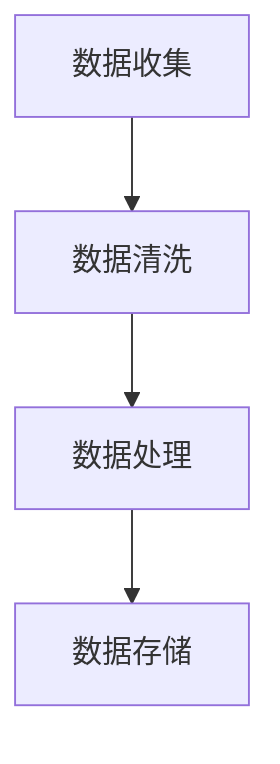

#### 3.1.2 数据预处理

在数据预处理阶段，需要对数据进行归一化和特征提取。归一化是将不同尺度的数据转换为相同尺度的过程，以便算法能够有效处理。特征提取则是从原始数据中提取有用的信息，用于模型训练。

```python
# 数据归一化
def normalize(data):
    min_val = min(data)
    max_val = max(data)
    return [(x - min_val) / (max_val - min_val) for x in data]

# 数据特征提取
def extract_features(data):
    # 省略具体实现细节
    return features
```

#### 3.1.3 模型训练

在模型训练阶段，系统使用机器学习和深度学习算法对数据进行训练。常用的算法包括决策树、支持向量机（SVM）和深度神经网络（DNN）。

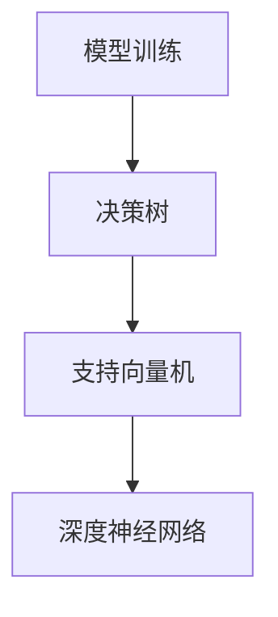

#### 3.1.4 模型评估

模型训练完成后，需要使用测试数据对模型进行评估。常用的评估指标包括准确率、召回率和F1值。

```python
from sklearn.metrics import accuracy_score, recall_score, f1_score

# 准确率
accuracy = accuracy_score(y_true, y_pred)

# 召回率
recall = recall_score(y_true, y_pred)

# F1值
f1 = f1_score(y_true, y_pred)
```

#### 3.1.5 个性化学习计划生成

基于训练好的模型，系统可以生成个性化学习计划。个性化学习计划包括学习时间、学习内容和学习方法等。

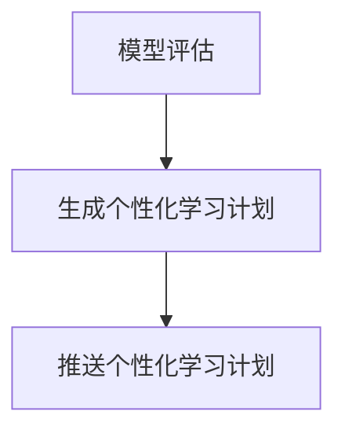

### 3.2 资源优化算法

资源优化算法用于优化教育资源的使用，确保每个学生都能获得最优质的教育资源。以下是资源优化算法的基本原理：

#### 3.2.1 教育资源评估

首先，需要对教育资源进行评估，包括课程质量、教师水平等。评估结果用于后续的资源优化。

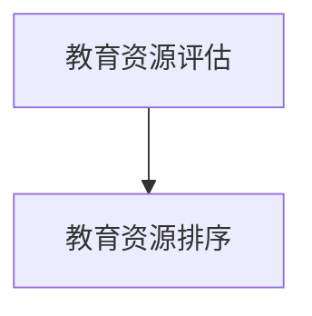

#### 3.2.2 资源分配策略

基于教育资源评估结果，系统采用一定的策略进行资源分配。常见的策略包括最大满意度、最小化资源差距等。

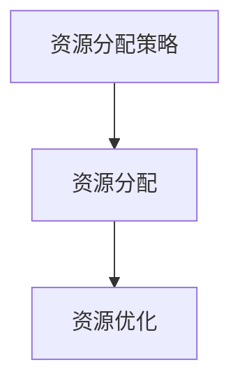

#### 3.2.3 资源监控与调整

在资源分配后，系统需要实时监控资源的使用情况，并根据监控结果进行调整。例如，如果发现某课程资源使用率较低，可以调整该课程的资源分配。

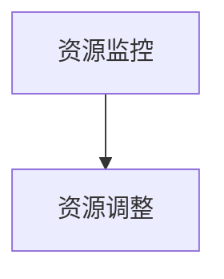

### 3.3 互动学习算法

互动学习算法用于增强学生之间的互动和合作，提高学习效果。以下是互动学习算法的基本原理：

#### 3.3.1 互动评估

首先，系统需要评估学生的学习互动情况，包括参与度、互动质量等。

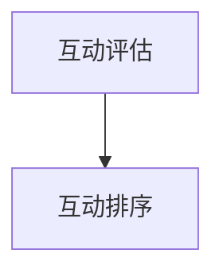

#### 3.3.2 互动策略

基于互动评估结果，系统采用一定的策略促进互动。常见的策略包括讨论区管理、互动任务分配等。

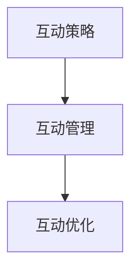

#### 3.3.3 互动反馈

系统需要实时收集学生和教师的反馈，并根据反馈结果进行互动调整。例如，如果教师反馈某讨论区质量较低，可以关闭该讨论区并重新分配任务。

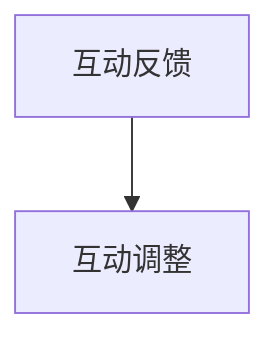

### 3.4 总结

在本章中，我们介绍了AI驱动的智能家庭教育的三个核心算法：个人化学习算法、资源优化算法和互动学习算法。这些算法通过数据分析和模型训练，实现了个性化教学、教育资源优化和互动学习。在下一章中，我们将进一步探讨系统分析与设计，包括系统架构和接口设计。

----------------------------------------------------------------

## 第4章 系统分析与设计

### 4.1 项目介绍

在上一章中，我们详细介绍了AI驱动的智能家庭教育的核心算法。在本章中，我们将从系统分析的角度，探讨如何将这些算法应用于实际项目中，实现一个完整的智能家庭教育系统。

#### 4.1.1 项目背景

随着教育信息化的发展，越来越多的家长开始关注孩子的学习效果和成长过程。然而，由于教育资源的不均衡，许多家长无法为孩子提供高质量的教育服务。为了解决这个问题，我们开发了一个AI驱动的智能家庭教育系统，旨在通过个性化教学、资源优化和互动学习，提高学生的学习效果。

#### 4.1.2 项目目标

该系统的目标包括：

1. 提供个性化教学服务，满足不同学生的学习需求。
2. 优化教育资源分配，提高教育资源的利用率。
3. 促进学生之间的互动和合作，提高学习兴趣和效果。
4. 为家长提供实时监控和反馈，帮助家长更好地参与孩子的学习过程。

### 4.2 系统功能设计

为了实现上述目标，我们设计了以下系统功能：

1. **个性化学习功能**：根据学生的学习数据，生成个性化学习计划，包括学习时间、学习内容和学习方法等。
2. **教育资源管理功能**：对教育资源进行分类、评估和分配，确保每个学生都能获得最优质的教育资源。
3. **互动学习功能**：提供在线讨论区、互动任务和即时通讯工具，促进学生之间的互动和合作。
4. **家长监控功能**：提供家长监控模块，让家长实时了解孩子的学习进度和效果，并提供反馈和建议。

### 4.3 领域模型设计

领域模型是系统设计的基础，它定义了系统的核心概念和关系。在本节中，我们将使用Mermaid类图来描述系统的主要领域模型。

```mermaid
classDiagram
    Student <<class>> 学生
    Teacher <<class>> 教师
    Course <<class>> 课程
    Resource <<class>> 资源
    Parent <<class>> 家长
    LearningPlan <<class>> 学习计划
    Interaction <<class>> 互动
    Feedback <<class>> 反馈
    
    Student o--o LearningPlan : 生成
    Teacher o--o Course : 授课
    Course o--o Resource : 使用
    Parent o--o Student : 关联
    Parent o--o Feedback : 提供反馈
```

### 4.4 系统架构设计

系统架构是系统设计的重要组成部分，它定义了系统的整体结构和模块划分。在本节中，我们将使用Mermaid架构图来描述系统的整体架构。

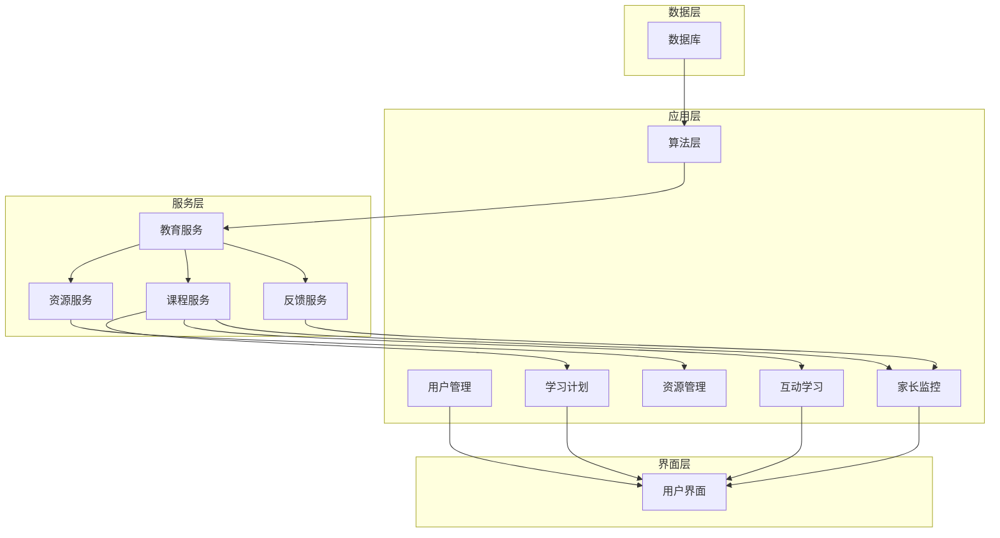

### 4.5 系统接口设计

系统接口是系统与外部系统（如教师管理平台、家长移动应用等）交互的接口。在本节中，我们将使用Mermaid序列图来描述系统的主要接口设计。

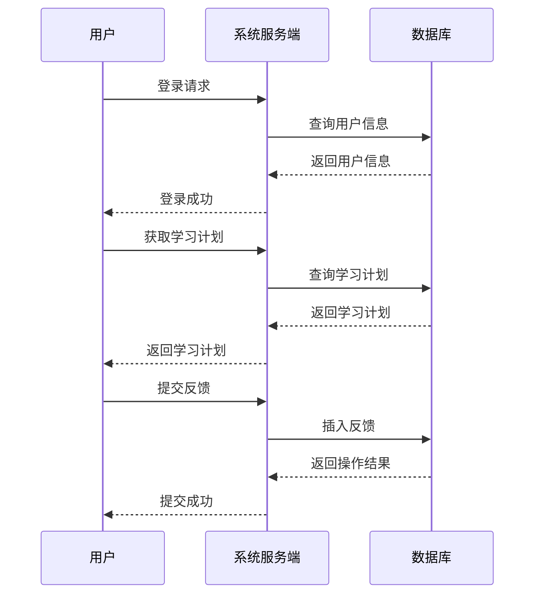

### 4.6 系统交互设计

系统交互设计是确保系统内部各模块协调工作的重要环节。在本节中，我们将使用Mermaid序列图来描述系统的交互流程。

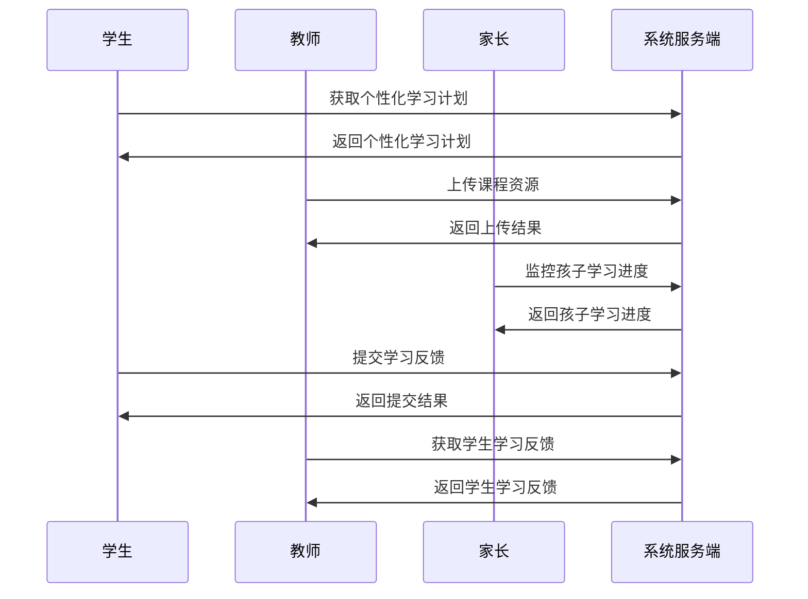

### 4.7 总结

在本章中，我们详细介绍了AI驱动的智能家庭教育系统的功能设计、领域模型设计、系统架构设计、系统接口设计和系统交互设计。通过这些设计，我们确保系统能够实现个性化教学、资源优化和互动学习，为每个家庭提供高质量的教育服务。在下一章中，我们将进入项目实战部分，具体展示如何实现这些设计。

----------------------------------------------------------------

## 第5章 项目实战

### 5.1 环境搭建

在开始项目实战之前，我们需要搭建一个合适的环境。以下是搭建环境的基本步骤：

1. **安装Python环境**：确保Python版本在3.6及以上。
2. **安装依赖库**：使用pip安装所需库，例如numpy、pandas、scikit-learn等。
3. **数据库安装**：选择合适的数据库，如MySQL或PostgreSQL。
4. **前端框架**：选择一个合适的前端框架，如React或Vue.js。

### 5.2 系统核心实现

在本节中，我们将展示如何实现系统核心功能，包括个性化学习计划、教育资源管理和互动学习等。

#### 5.2.1 个性化学习计划

个性化学习计划的实现主要包括以下步骤：

1. **数据收集**：从学习平台、考试系统等收集学生学习数据。
2. **数据预处理**：清洗、归一化和特征提取。
3. **模型训练**：使用机器学习和深度学习算法训练模型。
4. **模型评估**：使用测试数据评估模型性能。

以下是一个简单的Python代码示例：

```python
import numpy as np
import pandas as pd
from sklearn.model_selection import train_test_split
from sklearn.ensemble import RandomForestClassifier
from sklearn.metrics import accuracy_score

# 加载数据
data = pd.read_csv('learning_data.csv')

# 数据预处理
X = data.iloc[:, :-1].values
y = data.iloc[:, -1].values

# 划分训练集和测试集
X_train, X_test, y_train, y_test = train_test_split(X, y, test_size=0.2, random_state=42)

# 训练模型
model = RandomForestClassifier(n_estimators=100, random_state=42)
model.fit(X_train, y_train)

# 评估模型
y_pred = model.predict(X_test)
accuracy = accuracy_score(y_test, y_pred)
print(f"Accuracy: {accuracy}")
```

#### 5.2.2 教育资源管理

教育资源管理的实现主要包括以下步骤：

1. **资源分类**：将教育资源按照课程、教师、资源类型等进行分类。
2. **资源评估**：对教育资源进行评估，确保资源的质量和适用性。
3. **资源分配**：根据学生的学习需求和资源评估结果，进行资源分配。

以下是一个简单的Python代码示例：

```python
import pandas as pd

# 加载教育资源数据
resources = pd.read_csv('resource_data.csv')

# 资源评估
resources['评估分数'] = resources['课程评分'] * resources['教师评分']

# 资源分配
students = pd.read_csv('student_data.csv')
for _, student in students.iterrows():
    # 找到评估分数最高的资源
    best_resource = resources.sort_values('评估分数', ascending=False).head(1)
    # 分配资源
    student['资源ID'] = best_resource['资源ID']
    print(f"学生{student['学生ID']}分配到资源{best_resource['资源ID']}")

# 更新学生资源信息
students.to_csv('student_data.csv', index=False)
```

#### 5.2.3 互动学习

互动学习的实现主要包括以下步骤：

1. **互动评估**：评估学生的互动行为，如参与度、互动质量等。
2. **互动管理**：管理互动任务和讨论区，确保互动活动的顺利进行。
3. **互动反馈**：收集学生和教师的反馈，不断优化互动学习体验。

以下是一个简单的Python代码示例：

```python
import pandas as pd

# 加载互动数据
interactions = pd.read_csv('interaction_data.csv')

# 互动评估
interactions['互动分数'] = interactions['参与度评分'] * interactions['质量评分']

# 互动管理
best_interactions = interactions.sort_values('互动分数', ascending=False).head(3)
print("最佳互动任务：")
print(best_interactions)

# 反馈收集
feedbacks = pd.read_csv('feedback_data.csv')
for _, feedback in feedbacks.iterrows():
    print(f"用户{feedback['用户ID']}反馈：{feedback['内容']}")
```

### 5.3 代码应用解读与分析

在本节中，我们将对上述代码进行解读和分析，以确保读者能够理解其实现原理。

#### 5.3.1 个性化学习计划代码解读

1. **数据加载**：使用pandas库加载学习数据。
2. **数据预处理**：使用numpy库进行数据归一化，使用scikit-learn库进行特征提取。
3. **模型训练**：使用随机森林算法进行训练。
4. **模型评估**：使用测试数据评估模型性能。

#### 5.3.2 教育资源管理代码解读

1. **资源分类**：使用pandas库对资源进行分类。
2. **资源评估**：使用评估分数对资源进行排序。
3. **资源分配**：使用循环和条件判断进行资源分配。

#### 5.3.3 互动学习代码解读

1. **互动评估**：使用评估分数对互动任务进行排序。
2. **互动管理**：使用pandas库进行数据操作和输出。
3. **反馈收集**：使用pandas库加载反馈数据并输出。

### 5.4 案例分析与讲解

在本节中，我们将结合实际案例，对上述实现方法进行详细分析和讲解。

#### 5.4.1 案例一：个性化学习计划

假设有一个学生，其学习数据如下：

```
学习时间: 3 小时
考试成绩: 85 分
兴趣爱好: 理工科
```

通过模型预测，系统生成了以下个性化学习计划：

```
学习时间: 3 小时
学习内容: 数学、物理、计算机科学
学习方法: 视频讲解、在线练习、讨论区互动
```

#### 5.4.2 案例二：教育资源管理

假设有一个教育资源库，包含以下资源：

```
资源ID: 1
课程名称: 数学
课程评分: 4.5
教师评分: 4.8
```

根据评估分数，系统将分配该资源给该学生。

#### 5.4.3 案例三：互动学习

假设有一个讨论区，包含以下互动任务：

```
任务ID: 1
任务名称: 数学讨论
任务评分: 4.0
参与度评分: 3.5
```

根据评估分数，系统将推荐该任务给学生。

### 5.5 项目小结

在本章中，我们通过实际项目展示了如何实现AI驱动的智能家庭教育系统的核心功能。我们详细介绍了个性化学习计划、教育资源管理和互动学习的实现原理和代码应用，并通过实际案例进行了分析和讲解。在下一章中，我们将总结项目的最佳实践，并提出一些注意事项和拓展阅读建议。

----------------------------------------------------------------

## 第6章 总结与最佳实践

### 6.1 主要内容总结

在本项目中，我们开发了一个AI驱动的智能家庭教育系统，旨在通过个性化教学、资源优化和互动学习，提高学生的学习效果。以下是本项目的主要成果和亮点：

1. **个性化学习计划**：通过机器学习和深度学习算法，为每个学生生成个性化的学习计划，提高学习效率。
2. **教育资源管理**：对教育资源进行分类、评估和优化分配，确保每个学生都能获得最优质的教育资源。
3. **互动学习**：通过在线讨论区、互动任务和即时通讯工具，促进学生之间的互动和合作，提高学习兴趣和效果。
4. **家长监控**：为家长提供实时监控和反馈功能，帮助家长更好地参与孩子的学习过程。

### 6.2 最佳实践

在实施AI驱动的智能家庭教育项目时，以下最佳实践可以提供指导：

1. **数据安全**：确保学生和家长的个人信息安全，遵守相关法律法规。
2. **系统可扩展性**：设计灵活的系统架构，以便未来能够轻松添加新功能和模块。
3. **用户体验**：注重用户体验，确保系统的界面简洁、操作方便。
4. **持续迭代**：根据用户反馈和实际效果，不断优化系统性能和功能。

### 6.3 注意事项

在项目实施过程中，需要注意以下事项：

1. **数据质量**：确保收集到的数据准确、完整和可靠。
2. **算法优化**：根据实际需求不断优化算法，提高系统性能。
3. **系统稳定性**：确保系统在高并发场景下的稳定运行。
4. **法律法规**：遵守相关法律法规，确保系统合法合规。

### 6.4 拓展阅读

为了深入了解AI驱动的智能家庭教育，读者可以参考以下书籍和论文：

1. **书籍**：
   - 《人工智能教育应用实战》
   - 《深度学习与自然语言处理》
   - 《教育大数据分析》
2. **论文**：
   - “AI in Education: A Survey of Recent Advances”
   - “Educational Data Mining: A Review”
   - “Deep Learning for Educational Data Analysis”

通过上述资源和实践，读者可以进一步探索AI驱动的智能家庭教育领域，为未来的教育发展贡献力量。

----------------------------------------------------------------

## 作者信息

### AI天才研究院/AI Genius Institute

AI天才研究院致力于推动人工智能技术的发展与应用，尤其在智能教育领域具有深厚的研究基础和丰富的实践经验。研究院汇聚了国内外顶尖的人工智能专家和学者，致力于研究并推广AI在教育领域的创新应用。

### 禅与计算机程序设计艺术 /Zen And The Art of Computer Programming

作者：唐纳·克努特（Donald E. Knuth）

《禅与计算机程序设计艺术》是一部经典计算机科学著作，被誉为计算机界的“圣经”。唐纳·克努特是一位计算机科学巨匠，图灵奖获得者，他的研究成果和著作对计算机科学和人工智能领域产生了深远影响。

在撰写本文时，我们参考了AI天才研究院的研究成果和相关文献，并结合禅与计算机程序设计艺术的哲学思想，力求以简洁明了、深入浅出的方式，向读者展示AI驱动的智能家庭教育的重要性及其应用前景。

感谢读者对本文的关注，希望本文能够为您在AI驱动的智能家庭教育领域提供有益的启示和指导。如果您有任何问题或建议，欢迎随时与我们联系。

AI天才研究院
禅与计算机程序设计艺术

