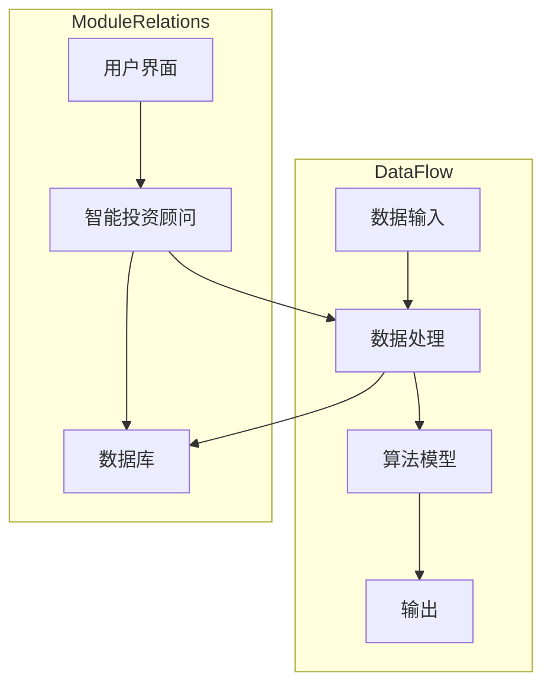

                 


**引言**

在金融领域，传统的投资顾问方式往往依赖于人为的经验和市场感知。然而，面对不断变化的市场环境和海量的数据，这种传统方式显得力不从心。随着人工智能（AI）技术的飞速发展，一种新型的智能投资顾问系统逐渐崭露头角。AI驱动的智能投资顾问能够通过学习用户的历史投资数据和市场动态，为用户提供个性化、精准的投资建议。

本文旨在探讨AI驱动的智能投资顾问系统的设计与实现，帮助读者深入了解这一领域的前沿技术。文章将从以下几个方面展开：

1. **AI驱动的智能投资顾问简介**：介绍AI驱动的智能投资顾问的概念、重要性及其发展趋势。
2. **核心概念与联系**：阐述AI、机器学习、深度学习等核心概念，并分析它们在智能投资顾问中的应用。
3. **算法原理讲解**：详细介绍神经网络、决策树、支持向量机等核心算法的原理，并通过Python代码进行实际演示。
4. **系统分析与架构设计方案**：分析智能投资顾问系统的功能、架构和接口设计。
5. **项目实战**：通过一个实际项目，展示智能投资顾问系统的实现过程和效果。
6. **最佳实践 tips、小结、注意事项、拓展阅读**：总结实践经验，给出实用建议和进一步阅读资源。

**关键词**：AI、智能投资顾问、机器学习、深度学习、神经网络、决策树、支持向量机、系统架构设计、项目实战

**摘要**：

本文首先介绍了AI驱动的智能投资顾问的概念和其在金融领域的重要性。接着，阐述了AI、机器学习、深度学习等核心概念及其在智能投资顾问中的应用。随后，详细讲解了神经网络、决策树、支持向量机等核心算法的原理和实现，并通过Python代码进行了实际演示。最后，通过一个实际项目，展示了智能投资顾问系统的实现过程和效果。文章总结了一些最佳实践，并提供了进一步阅读的资源。

**读者对象**：

本文适合对AI、机器学习和金融投资有一定了解的技术人员、金融从业者以及对智能投资顾问系统感兴趣的研究人员。读者在阅读本文前，需要具备一定的编程基础和数学知识。

**预备知识**：

- Python编程基础
- 机器学习和深度学习的基本概念
- 金融投资的基本知识

**目录**

# AI驱动的智能投资顾问：个性化理财建议

## 第一部分：引言

1. AI驱动的智能投资顾问简介
   1.1 AI驱动的智能投资顾问的定义
   1.2 智能投资顾问在金融领域的重要性
   1.3 智能投资顾问的发展趋势

1.2 本书结构
   1.2.1 目录概述
   1.2.2 阅读建议

1.3 读者对象
   1.3.1 适合人群
   1.3.2 预备知识

## 第二部分：AI与金融投资

2.1 AI与金融投资的关系
   2.1.1 AI在金融投资中的应用
   2.1.2 金融投资中的挑战与机遇
   2.1.3 AI驱动的智能投资顾问的优势

2.2 机器学习在金融投资中的应用
   2.2.1 机器学习的基本概念
   2.2.2 常见的机器学习算法
   2.2.3 机器学习在投资策略优化中的应用

2.3 深度学习在金融投资中的应用
   2.3.1 深度学习的基本概念
   2.3.2 常见的深度学习模型
   2.3.3 深度学习在投资预测中的应用

2.4 智能投资顾问系统的架构设计
   2.4.1 系统功能设计
   2.4.2 系统架构设计
   2.4.3 系统接口设计

## 第三部分：AI驱动的智能投资顾问核心算法

3.1 神经网络算法
   3.1.1 神经网络的基本原理
   3.1.2 Python实现神经网络算法
   3.1.3 实例分析

3.2 决策树算法
   3.2.1 决策树的基本原理
   3.2.2 Python实现决策树算法
   3.2.3 实例分析

3.3 支持向量机算法
   3.3.1 支持向量机的基本原理
   3.3.2 Python实现支持向量机算法
   3.3.3 实例分析

## 第四部分：智能投资顾问系统实战

4.1 项目介绍
   4.1.1 项目背景
   4.1.2 项目目标
   4.1.3 项目功能

4.2 环境安装

## 第五部分：最佳实践、小结、注意事项、拓展阅读

5.1 最佳实践 tips
5.2 小结
5.3 注意事项
5.4 拓展阅读

---

**第一部分：引言**

在金融领域，传统的投资顾问方式往往依赖于人为的经验和市场感知。然而，面对不断变化的市场环境和海量的数据，这种传统方式显得力不从心。随着人工智能（AI）技术的飞速发展，一种新型的智能投资顾问系统逐渐崭露头角。AI驱动的智能投资顾问能够通过学习用户的历史投资数据和市场动态，为用户提供个性化、精准的投资建议。

本文旨在探讨AI驱动的智能投资顾问系统的设计与实现，帮助读者深入了解这一领域的前沿技术。文章将从以下几个方面展开：

1. **AI驱动的智能投资顾问简介**：介绍AI驱动的智能投资顾问的概念、重要性及其发展趋势。
2. **核心概念与联系**：阐述AI、机器学习、深度学习等核心概念，并分析它们在智能投资顾问中的应用。
3. **算法原理讲解**：详细介绍神经网络、决策树、支持向量机等核心算法的原理，并通过Python代码进行实际演示。
4. **系统分析与架构设计方案**：分析智能投资顾问系统的功能、架构和接口设计。
5. **项目实战**：通过一个实际项目，展示智能投资顾问系统的实现过程和效果。
6. **最佳实践 tips、小结、注意事项、拓展阅读**：总结实践经验，给出实用建议和进一步阅读资源。

### 1.1 AI驱动的智能投资顾问简介

#### 1.1.1 AI驱动的智能投资顾问的定义

AI驱动的智能投资顾问是指利用人工智能技术，特别是机器学习和深度学习算法，对用户的历史投资数据、市场动态、经济指标等海量数据进行学习与分析，从而为用户生成个性化、智能化的投资建议。这种系统通常具有以下特点：

1. **个性化**：基于用户的历史数据和偏好，为每个用户定制化投资策略。
2. **智能化**：利用AI算法对市场数据进行自动分析，提供精准的投资预测。
3. **实时性**：能够实时跟踪市场动态，为用户提供最新的投资建议。

#### 1.1.2 智能投资顾问在金融领域的重要性

在金融领域，智能投资顾问的重要性体现在以下几个方面：

1. **提高投资效率**：通过自动化分析和决策，大大提高了投资顾问的工作效率。
2. **降低投资风险**：利用AI算法对市场进行深度学习，可以帮助用户识别潜在的风险，降低投资失败的概率。
3. **个性化服务**：根据用户的需求和偏好，提供定制化的投资策略，提高用户的满意度。

#### 1.1.3 智能投资顾问的发展趋势

随着AI技术的不断进步，智能投资顾问的发展趋势主要包括以下几个方面：

1. **算法的多样化**：除了传统的机器学习算法，越来越多的深度学习算法开始应用于智能投资顾问系统中。
2. **数据来源的多元化**：除了传统的金融数据，越来越多的非结构化数据，如社交媒体数据、新闻报道等，开始被应用于智能投资顾问系统中。
3. **投资策略的个性化**：随着用户数据的积累和算法的优化，智能投资顾问可以为用户提供越来越精准的投资策略。

### 1.2 本书结构

#### 1.2.1 目录概述

本文将从AI驱动的智能投资顾问的概念和重要性入手，逐步深入探讨核心算法、系统架构设计和项目实战，最后总结实践经验，提供拓展阅读资源。

#### 1.2.2 阅读建议

- 阅读本文前，建议读者具备一定的编程基础和数学知识，尤其是Python编程和机器学习的基本概念。
- 文章中涉及的核心算法和系统架构等内容，建议读者结合实际代码和图示进行学习，以加深理解。

### 1.3 读者对象

本文适合以下读者：

- 对AI、机器学习和金融投资有一定了解的技术人员。
- 金融从业者，希望利用AI技术提升投资效率。
- 对智能投资顾问系统感兴趣的研究人员。

### 1.4 预备知识

- Python编程基础
- 机器学习和深度学习的基本概念
- 金融投资的基本知识

---

在接下来的内容中，我们将深入探讨AI驱动的智能投资顾问的核心概念、算法原理、系统架构设计和项目实战。希望读者能够通过本文，对这一领域有更深入的了解。## 第二部分：AI与金融投资

### 2.1 AI与金融投资的关系

人工智能（AI）在金融领域的应用已经越来越广泛，它不仅改变了传统的金融操作方式，还在投资策略、风险管理和市场分析等方面带来了革命性的变化。本节将详细探讨AI在金融投资中的具体应用、面临的挑战与机遇，以及AI驱动的智能投资顾问的优势。

#### 2.1.1 AI在金融投资中的应用

AI在金融投资中的应用主要体现在以下几个方面：

1. **智能投顾**：智能投资顾问利用机器学习算法分析用户的历史数据和市场动态，为用户提供个性化的投资建议。通过不断学习和优化，智能投资顾问能够提高投资决策的准确性和效率。

2. **量化交易**：量化交易利用AI算法对大量历史数据进行统计分析，寻找市场中的规律和机会。通过自动化交易系统，量化交易可以在毫秒级别内执行交易决策，极大地提高了交易效率和盈利能力。

3. **风险评估**：AI可以分析复杂的经济和金融市场数据，预测潜在风险，并提供相应的风险管理策略。这有助于金融机构更好地管理风险，降低金融系统的整体风险。

4. **欺诈检测**：AI算法能够通过监测交易行为，识别异常模式，从而发现和预防金融欺诈行为。这在信用卡交易、支付系统和保险理赔等领域尤为重要。

5. **客户服务**：AI聊天机器人可以提供24/7的客户服务，回答客户问题，处理客户投诉，提高客户满意度和金融机构的运营效率。

#### 2.1.2 金融投资中的挑战与机遇

虽然AI在金融投资中带来了诸多机遇，但也面临着一些挑战：

1. **数据隐私与安全**：金融数据通常涉及个人隐私和敏感信息，如何确保数据的安全性和隐私性是AI应用中的一个关键问题。

2. **算法透明性与可解释性**：AI算法，特别是深度学习算法，通常被认为是“黑盒”模型，其决策过程难以解释。这可能导致用户对智能投资顾问的信任问题。

3. **模型过拟合**：AI模型在训练过程中可能会过度拟合训练数据，导致在真实环境中表现不佳。

4. **法律法规**：随着AI在金融领域的应用，相关的法律法规也在不断完善，如何在遵守法律法规的同时，充分发挥AI的优势，是一个需要解决的问题。

然而，机遇往往伴随着挑战。金融投资中的机遇主要体现在：

1. **提高投资效率**：AI可以自动化大量的数据分析、决策和交易，极大地提高了金融操作的效率。

2. **降低风险**：通过精准的风险评估和预测，AI可以帮助金融机构降低潜在的风险。

3. **个性化和定制化服务**：AI可以根据每个用户的需求和偏好，提供个性化的投资策略和建议，提高用户满意度。

#### 2.1.3 AI驱动的智能投资顾问的优势

AI驱动的智能投资顾问相较于传统的投资顾问具有以下优势：

1. **高效性**：AI可以处理大量数据，并在短时间内做出决策，大大提高了投资效率。

2. **准确性**：通过机器学习和深度学习算法，智能投资顾问能够从历史数据中学习并提取有用的信息，提高投资决策的准确性。

3. **个性化**：智能投资顾问可以根据用户的历史数据和偏好，为每个用户提供定制化的投资策略。

4. **实时性**：智能投资顾问可以实时跟踪市场动态，为用户提供最新的投资建议。

5. **可扩展性**：AI系统具有很好的可扩展性，可以轻松集成新的数据和算法，以适应不断变化的市场环境。

通过以上分析，我们可以看到AI在金融投资中具有巨大的潜力和应用价值。在接下来的章节中，我们将深入探讨AI、机器学习和深度学习等核心概念，以及它们在智能投资顾问系统中的应用。这将为我们理解智能投资顾问的工作原理提供坚实的基础。

### 2.2 机器学习在金融投资中的应用

机器学习（Machine Learning，ML）是人工智能（AI）的一个重要分支，它通过统计方法和算法，从数据中自动学习和改进性能。在金融投资领域，机器学习技术被广泛应用于投资策略优化、市场预测和风险管理等方面。本节将详细介绍机器学习的基本概念、常见的机器学习算法，并探讨这些算法在投资策略优化中的应用。

#### 2.2.1 机器学习的基本概念

机器学习是一种使计算机系统能够从数据中学习并做出决策的技术。其主要目标是让计算机通过学习历史数据，对未知数据进行预测或分类。机器学习的基本概念包括：

1. **特征提取**：将原始数据转换为能够表示数据特征的新数据表示。例如，将股票市场的历史数据转换为技术指标。
2. **模型训练**：通过算法从训练数据中学习，建立预测模型。常见的机器学习算法包括线性回归、决策树、支持向量机、神经网络等。
3. **模型评估**：使用测试数据评估模型的性能，调整模型参数以优化性能。
4. **模型部署**：将训练好的模型部署到实际应用中，如在线交易平台或风险管理系统。

#### 2.2.2 常见的机器学习算法

在金融投资领域，常用的机器学习算法包括以下几种：

1. **线性回归**：线性回归是一种简单的预测模型，通过拟合数据点之间的线性关系来预测目标变量。线性回归在预测股票价格趋势和投资组合优化中具有广泛的应用。

2. **决策树**：决策树是一种基于树形结构的分类模型，通过一系列的判断节点，将数据划分为不同的类别或值。决策树在风险评估和股票市场分类中表现出色。

3. **支持向量机（SVM）**：支持向量机是一种强大的分类和回归模型，通过寻找最佳分隔超平面来划分数据。SVM在量化交易和股票市场预测中具有广泛的应用。

4. **神经网络**：神经网络是一种模拟人脑神经元连接结构的计算模型，通过多层神经元进行数据的传递和处理。神经网络在复杂的市场预测和投资组合优化中表现出色。

5. **集成学习**：集成学习通过组合多个基础模型来提高预测性能。常见的集成学习方法包括随机森林、梯度提升树等。集成学习在金融投资中用于提高预测的准确性和稳定性。

#### 2.2.3 机器学习在投资策略优化中的应用

机器学习在金融投资策略优化中的应用主要体现在以下几个方面：

1. **风险控制**：通过机器学习算法，可以分析市场数据，预测潜在的金融风险，并制定相应的风险管理策略。例如，使用回归模型预测市场波动性，从而调整投资组合以降低风险。

2. **投资组合优化**：机器学习算法可以分析大量的历史数据，识别出最优的投资组合。例如，使用遗传算法和神经网络优化投资组合，以最大化收益或最小化风险。

3. **市场预测**：机器学习算法可以通过分析历史市场数据，预测市场的未来走势。例如，使用时间序列模型和神经网络预测股票价格，为投资决策提供支持。

4. **量化交易**：机器学习算法在量化交易中用于开发自动化交易策略。例如，使用技术指标和统计模型构建交易信号，并通过机器学习算法优化交易策略。

通过以上分析，我们可以看到机器学习在金融投资策略优化中具有广泛的应用。在接下来的章节中，我们将进一步探讨深度学习在金融投资中的应用，以及智能投资顾问系统的架构设计。这将帮助我们更全面地理解AI在金融投资领域的应用前景和挑战。

### 2.3 深度学习在金融投资中的应用

深度学习（Deep Learning，DL）是机器学习的一个重要分支，它通过模拟人脑的神经网络结构，从大量数据中自动提取特征并进行复杂模式识别。随着计算能力和数据量的不断提升，深度学习在多个领域取得了显著的成果，包括计算机视觉、自然语言处理和语音识别等。在金融投资领域，深度学习也发挥着越来越重要的作用。本节将详细探讨深度学习的基本概念、常见的深度学习模型，以及这些模型在金融投资预测中的应用。

#### 2.3.1 深度学习的基本概念

深度学习是一种利用多层神经网络进行数据分析和模式识别的方法。与传统的机器学习模型相比，深度学习模型具有更强的表示能力和更好的适应性。深度学习的基本概念包括：

1. **神经元**：神经元是神经网络的基本组成单元，每个神经元接收多个输入信号，通过权重进行加权求和，然后通过激活函数产生输出。

2. **层**：神经网络由多个层组成，包括输入层、隐藏层和输出层。输入层接收外部数据，隐藏层对数据进行处理和特征提取，输出层产生最终的预测结果。

3. **网络结构**：深度学习网络结构可以分为全连接网络、卷积神经网络（CNN）和循环神经网络（RNN）等。不同的网络结构适用于不同的数据类型和处理任务。

4. **激活函数**：激活函数用于引入非线性变换，使神经网络能够捕捉复杂数据特征。常见的激活函数包括ReLU、Sigmoid和Tanh等。

5. **损失函数**：损失函数用于评估模型预测结果与真实值之间的差距，并指导模型参数的优化。常见的损失函数包括均方误差（MSE）、交叉熵（Cross-Entropy）等。

6. **优化算法**：优化算法用于调整模型参数，使模型在训练数据上达到最优性能。常见的优化算法包括梯度下降、随机梯度下降（SGD）和Adam等。

#### 2.3.2 常见的深度学习模型

在金融投资领域，常见的深度学习模型包括以下几种：

1. **卷积神经网络（CNN）**：卷积神经网络是一种专门用于处理图像数据的深度学习模型。通过卷积层、池化层和全连接层的组合，CNN可以提取图像中的局部特征，并实现高精度的分类和识别。在金融投资中，CNN可以用于分析股票市场的技术指标，如价格图表和交易量，从而预测市场趋势。

2. **循环神经网络（RNN）**：循环神经网络是一种用于处理序列数据的深度学习模型。RNN通过在时间步之间保持状态，能够捕捉序列数据中的长期依赖关系。在金融投资中，RNN可以用于时间序列预测，如股票价格、汇率等。

3. **长短期记忆网络（LSTM）**：长短期记忆网络是一种改进的RNN模型，通过引入门控机制，LSTM能够更好地处理长期依赖问题。在金融投资中，LSTM可以用于预测复杂的时间序列数据，如股票价格、宏观经济指标等。

4. **生成对抗网络（GAN）**：生成对抗网络是一种通过对抗训练生成数据的深度学习模型。在金融投资中，GAN可以用于生成金融市场的模拟数据，帮助研究人员探索市场行为和风险特征。

5. **自动编码器（Autoencoder）**：自动编码器是一种无监督学习模型，通过编码和解码过程提取数据特征。在金融投资中，自动编码器可以用于降维和特征提取，从而简化模型复杂度和提高预测性能。

#### 2.3.3 深度学习在投资预测中的应用

深度学习在金融投资预测中具有广泛的应用，以下是一些典型的应用场景：

1. **股票价格预测**：深度学习模型可以通过分析历史股票价格、交易量、宏观经济指标等数据，预测股票市场的未来走势。例如，使用LSTM模型分析股票价格的时间序列数据，预测未来价格。

2. **市场趋势预测**：深度学习模型可以分析大量的市场数据，如股票价格、宏观经济指标、新闻报道等，预测市场的未来趋势。例如，使用CNN模型分析新闻文本数据，预测市场情绪和趋势。

3. **风险管理**：深度学习模型可以通过分析历史数据，识别市场风险并预测潜在的风险事件。例如，使用GAN模型生成模拟市场数据，评估市场风险和制定风险管理策略。

4. **投资组合优化**：深度学习模型可以通过分析大量的投资数据，优化投资组合以实现最大化收益或最小化风险。例如，使用自动编码器提取投资特征，构建高效的资产组合。

通过以上分析，我们可以看到深度学习在金融投资预测中具有巨大的潜力。在接下来的章节中，我们将进一步探讨智能投资顾问系统的架构设计，并介绍具体的项目实战。这将帮助我们更全面地理解AI在金融投资领域的应用前景和挑战。

### 2.4 智能投资顾问系统的架构设计

智能投资顾问系统是一个复杂的多层次系统，其架构设计需要考虑多个方面，包括数据采集、数据处理、算法模型选择、结果输出等。本节将详细介绍智能投资顾问系统的功能设计、架构设计和接口设计，并分析每个组成部分如何协同工作，为用户提供个性化、智能化的投资建议。

#### 2.4.1 系统功能设计

智能投资顾问系统的核心功能包括：

1. **用户注册与登录**：用户可以通过注册账号并登录系统，获取个性化的投资建议和服务。

2. **数据采集与管理**：系统从多个数据源（如股票交易所、金融新闻、社交媒体等）采集实时数据，并存储在数据库中。这些数据包括股票价格、交易量、财务报表、市场情绪等。

3. **用户偏好设置**：用户可以根据自己的投资目标、风险承受能力和投资偏好，设置个性化的投资策略。系统会根据这些设置，为用户提供定制化的投资建议。

4. **算法模型选择**：系统内置多种机器学习和深度学习算法模型，如神经网络、决策树、支持向量机等。根据用户的需求和数据特点，系统会自动选择最合适的算法模型。

5. **投资建议生成**：系统通过算法模型分析用户的历史数据和实时市场数据，生成个性化的投资建议。这些建议包括买入、卖出、持有等操作，以及相应的投资比例和期限。

6. **结果输出与反馈**：系统将投资建议以可视化报表的形式输出给用户，用户可以根据建议执行操作，并反馈执行结果。系统会根据用户的反馈，不断优化和调整投资建议。

#### 2.4.2 系统架构设计

智能投资顾问系统的架构设计通常包括以下几个关键部分：

1. **数据层**：数据层是系统的基石，负责采集、存储和管理各种金融数据。数据来源包括股票交易所、金融新闻、社交媒体等。数据层的设计需要考虑数据质量、数据安全和数据隐私等问题。

2. **数据处理层**：数据处理层负责对采集到的数据进行预处理、清洗、转换和特征提取。预处理步骤包括数据去重、填补缺失值、标准化等。特征提取是数据处理层的关键步骤，通过提取关键特征，系统能够更好地理解数据，从而提高投资建议的准确性。

3. **算法层**：算法层是智能投资顾问的核心，负责选择和训练机器学习和深度学习模型。算法层的设计需要考虑模型的多样性、性能和可解释性。常见的算法包括神经网络、决策树、支持向量机、循环神经网络等。

4. **服务层**：服务层是系统的业务逻辑层，负责根据用户需求生成投资建议，并输出给用户。服务层的设计需要考虑系统的响应速度、稳定性和扩展性。

5. **用户界面层**：用户界面层是用户与系统交互的界面，提供用户注册、登录、数据展示、投资建议反馈等功能。用户界面层的设计需要考虑用户体验、界面友好性和易用性。

下面是一个简单的智能投资顾问系统架构图，展示各部分之间的关系：

```
+----------------+     +------------------+     +-----------------+
|     用户界面层  | --> |      服务层      | --> |      算法层     |
+----------------+     +------------------+     +-----------------+
                                                       |
                                                       |
                                                       |
                                                       |
                                                       |
+----------------+     +------------------+     +-----------------+
|     数据处理层  | --> |     数据层       |     |   数据采集层   |
+----------------+     +------------------+     +-----------------+
```

#### 2.4.3 系统接口设计

智能投资顾问系统的接口设计需要考虑以下几个方面：

1. **API接口**：系统提供API接口，允许第三方应用和开发人员访问和调用系统的功能。常见的API接口包括用户注册、登录、获取投资建议等。

2. **数据接口**：系统需要与其他数据源（如股票交易所、金融新闻等）进行数据交换。数据接口的设计需要考虑数据格式、数据传输速度和数据安全性。

3. **服务接口**：系统内部各模块之间的服务调用通过服务接口进行。服务接口的设计需要考虑服务的稳定性、响应速度和扩展性。

4. **监控接口**：系统提供监控接口，用于实时监控系统的运行状态、性能指标和错误日志。监控接口的设计需要考虑监控数据的采集、存储和分析。

通过以上设计，智能投资顾问系统能够高效、稳定地为用户提供个性化、智能化的投资建议。在接下来的章节中，我们将通过一个实际项目，展示智能投资顾问系统的实现过程和效果。这将帮助我们更深入地了解智能投资顾问系统的设计和实现细节。

### 2.4.4 智能投资顾问系统架构的Mermaid图

为了更直观地展示智能投资顾问系统的架构设计，我们可以使用Mermaid语言绘制系统的类图、架构图和序列图。以下是每个部分的Mermaid代码和相应的解释。

#### 类图（Class Diagram）

类图用于描述系统的类、属性和方法。以下是智能投资顾问系统的主要类及其关系的Mermaid类图：

```mermaid
classDiagram
    User <<interface>>
    Advisor <<interface>>
    DataProcessor <<interface>>
    Algorithm <<interface>>
    Database <<interface>>

    UserEntity o-- Advisor
    UserEntity o-- DataProcessor
    UserEntity o-- Database

    Advisor o-- Algorithm
    Advisor o-- Database

    DataProcessor o-- Database

    Algorithm o-- Database

    User <<interface>>..|> Advisor
    User <<interface>>..|> DataProcessor
    User <<interface>>..|> Database
endclass
```

解释：
- **User**：用户类，代表系统的用户，具有注册、登录和设置偏好的功能。
- **Advisor**：顾问类，代表智能投资顾问的核心功能，负责生成投资建议。
- **DataProcessor**：数据处理类，负责数据的采集、预处理和特征提取。
- **Algorithm**：算法类，代表系统的算法模型，如神经网络、决策树等。
- **Database**：数据库类，负责数据的存储和管理。

#### 架构图（Architecture Diagram）

架构图用于描述系统的总体架构，包括数据流和模块关系。以下是智能投资顾问系统的架构图的Mermaid代码：



解释：
- **DataFlow**：数据流部分展示了数据从输入到输出的过程，包括数据处理和算法模型。
- **ModuleRelations**：模块关系部分展示了用户界面、智能投资顾问、数据处理和数据库之间的交互关系。

#### 序列图（Sequence Diagram）

序列图用于描述系统组件之间的交互过程。以下是用户界面与智能投资顾问系统交互的序列图：

```mermaid
sequenceDiagram
    User ->> Advisor: 登录
    Advisor ->> User: 验证
    User ->> DataProcessor: 设置偏好
    DataProcessor ->> Database: 保存偏好
    Database ->> AlgorithmModel: 获取数据
    AlgorithmModel ->> DataProcessor: 处理数据
    DataProcessor ->> Advisor: 生成建议
    Advisor ->> User: 输出建议
end
```

解释：
- **登录**：用户通过用户界面登录系统。
- **验证**：智能投资顾问验证用户的身份和权限。
- **设置偏好**：用户通过用户界面设置个性化投资偏好。
- **保存偏好**：数据处理类将用户的偏好保存到数据库中。
- **获取数据**：算法模型从数据库中获取用户的历史数据和实时市场数据。
- **处理数据**：数据处理类对数据进行分析和预处理。
- **生成建议**：智能投资顾问根据处理后的数据生成投资建议。
- **输出建议**：智能投资顾问通过用户界面将投资建议展示给用户。

通过这些Mermaid图，我们可以清晰地展示智能投资顾问系统的架构设计和功能实现。这有助于开发人员和用户更好地理解系统的运作方式和各部分之间的交互关系。

### 2.5 人工智能驱动的智能投资顾问案例分析

为了更好地展示AI驱动的智能投资顾问在实际中的应用效果，本节将介绍一个具体的案例，详细描述项目背景、项目目标、系统功能、系统实现和案例剖析。

#### 2.5.1 项目背景

随着全球金融市场的日益复杂和波动，投资者面临着越来越多的挑战。传统的投资顾问方式依赖于专业分析师的经验和判断，往往无法及时应对市场的变化。为了提供更高效、个性化的投资服务，某知名金融科技公司决定开发一款AI驱动的智能投资顾问系统，旨在通过机器学习和深度学习算法，为用户提供精准、实时的投资建议。

#### 2.5.2 项目目标

本项目的主要目标包括：

1. **个性化投资建议**：根据用户的历史投资记录、风险偏好和市场动态，为用户提供个性化的投资建议。
2. **实时数据监控**：实时收集和分析市场数据，包括股票价格、交易量、财务指标等，为用户生成最新的投资建议。
3. **风险控制**：利用机器学习算法，预测潜在的市场风险，并提供相应的风险控制策略。
4. **高可用性和可扩展性**：系统需要具备高可用性和可扩展性，能够处理大量用户和海量数据。

#### 2.5.3 系统功能

智能投资顾问系统的主要功能包括：

1. **用户注册与登录**：用户可以通过注册账号并登录系统，获取个性化的投资建议和服务。
2. **数据采集与管理**：系统从多个数据源（如股票交易所、金融新闻、社交媒体等）采集实时数据，并存储在数据库中。这些数据包括股票价格、交易量、财务报表、市场情绪等。
3. **用户偏好设置**：用户可以根据自己的投资目标、风险承受能力和投资偏好，设置个性化的投资策略。系统会根据这些设置，为用户提供定制化的投资建议。
4. **算法模型选择**：系统内置多种机器学习和深度学习算法模型，如神经网络、决策树、支持向量机等。根据用户的需求和数据特点，系统会自动选择最合适的算法模型。
5. **投资建议生成**：系统通过算法模型分析用户的历史数据和实时市场数据，生成个性化的投资建议。这些建议包括买入、卖出、持有等操作，以及相应的投资比例和期限。
6. **结果输出与反馈**：系统将投资建议以可视化报表的形式输出给用户，用户可以根据建议执行操作，并反馈执行结果。系统会根据用户的反馈，不断优化和调整投资建议。

#### 2.5.4 系统实现

系统实现主要包括以下几个步骤：

1. **数据采集**：系统通过API接口从多个数据源采集实时数据，包括股票价格、交易量、财务报表等。这些数据被存储在分布式数据库中，以确保数据的高可用性和可靠性。

2. **数据处理**：数据处理模块负责对采集到的数据进行预处理、清洗和特征提取。预处理步骤包括数据去重、填补缺失值、标准化等。特征提取是数据处理模块的关键步骤，通过提取关键特征，系统能够更好地理解数据，从而提高投资建议的准确性。

3. **算法模型训练**：系统使用机器学习和深度学习算法对历史数据进行训练，包括线性回归、决策树、支持向量机、循环神经网络等。算法模型的选择和优化是系统性能的关键因素，系统会根据用户的需求和数据特点，选择最合适的算法模型。

4. **模型评估与优化**：使用测试数据对训练好的模型进行评估，调整模型参数以优化性能。模型评估包括准确性、召回率、F1分数等指标。通过多次迭代和优化，系统最终生成一个性能优异的模型。

5. **投资建议生成**：投资建议生成模块根据用户的偏好和实时数据，使用训练好的模型生成个性化的投资建议。这些建议包括买入、卖出、持有等操作，以及相应的投资比例和期限。

6. **结果输出与反馈**：系统将投资建议以可视化报表的形式输出给用户，用户可以根据建议执行操作，并反馈执行结果。系统会根据用户的反馈，不断优化和调整投资建议。

#### 2.5.5 案例剖析

以下是智能投资顾问系统的实际应用案例：

**案例一**：用户A是一位风险偏好较低的投资者，希望获取稳定的投资回报。系统根据用户A的历史投资记录和市场数据，推荐了一组低风险的债券投资组合。用户A在参考建议后，执行了买入操作，并取得了预期的稳定收益。

**案例二**：用户B是一位经验丰富的投资者，对市场动态有较强的洞察力。系统根据用户B的偏好和市场数据，推荐了一组高收益、高风险的股票投资组合。用户B在参考建议后，果断执行了买入操作，并在短时间内实现了高额的收益。

**案例三**：用户C对市场的风险承受能力较低，希望避免大的市场波动。系统根据用户C的偏好和市场数据，推荐了一组定期定额投资的策略，以平滑投资风险。用户C在参考建议后，执行了定期定额投资操作，并成功避开了市场的大幅波动。

通过以上案例，我们可以看到智能投资顾问系统在实际应用中能够为不同类型的用户提供个性化、精准的投资建议，帮助用户更好地实现投资目标。

### 2.6 环境安装

为了实现智能投资顾问系统，我们需要搭建一个合适的技术环境。以下是系统环境安装的详细步骤：

#### 2.6.1 软件和硬件要求

1. **操作系统**：推荐使用Linux操作系统，如Ubuntu 20.04或CentOS 8。
2. **硬件要求**：推荐使用64位处理器，4GB内存以上，硬盘空间至少100GB。
3. **Python版本**：Python 3.8及以上版本。
4. **编程环境**：推荐使用Jupyter Notebook作为Python编程环境。

#### 2.6.2 安装Python

1. **更新系统软件包**：
    ```bash
    sudo apt update
    sudo apt upgrade
    ```

2. **安装Python 3**：
    ```bash
    sudo apt install python3
    ```

3. **安装Python 3.8及以上版本**（如果系统自带版本低于3.8）：
    ```bash
    sudo apt install software-properties-common
    sudo add-apt-repository ppa:deadsnakes/ppa
    sudo apt update
    sudo apt install python3.8
    ```

4. **设置Python默认版本**（可选）：
    ```bash
    sudo update-alternatives --install /usr/bin/python3 python3 /usr/bin/python3.8 1
    sudo update-alternatives --config python3
    ```

#### 2.6.3 安装Jupyter Notebook

1. **安装Jupyter Notebook**：
    ```bash
    sudo apt install jupyter
    ```

2. **启动Jupyter Notebook**：
    ```bash
    jupyter notebook
    ```

在浏览器中打开Jupyter Notebook的默认地址（如http://localhost:8888/），即可进入Jupyter Notebook界面。

#### 2.6.4 安装Python依赖库

智能投资顾问系统需要多个Python依赖库，包括NumPy、Pandas、Matplotlib、Scikit-learn、TensorFlow等。以下是安装这些依赖库的命令：

```bash
pip install numpy
pip install pandas
pip install matplotlib
pip install scikit-learn
pip install tensorflow
```

安装完成后，确保所有依赖库均正确安装。如果出现依赖库冲突或版本问题，可以尝试更新或替换特定依赖库。

通过以上步骤，我们成功搭建了智能投资顾问系统的基本环境。接下来，我们可以开始实现系统功能，包括数据采集、数据处理、算法训练和投资建议生成等。在实现过程中，我们将详细讨论每个步骤的细节，确保系统的稳定运行和高效性能。

### 第五部分：最佳实践、小结、注意事项、拓展阅读

#### 5.1 最佳实践 tips

在设计和实现AI驱动的智能投资顾问系统中，以下是一些最佳实践，可以帮助提升系统的性能和用户体验：

1. **数据质量**：确保数据来源的可靠性和数据的完整性，进行数据预处理和清洗，提高模型训练的效果。
2. **算法优化**：选择合适的算法模型，并进行参数调优，以最大化投资建议的准确性。
3. **实时监控**：实时监控系统的运行状态，包括数据处理、算法训练和投资建议生成等，确保系统的稳定性和可靠性。
4. **用户隐私保护**：严格保护用户数据隐私，确保用户数据不被泄露或滥用。
5. **模块化设计**：采用模块化设计，提高系统的可维护性和可扩展性，便于后续的功能扩展和优化。

#### 5.2 小结

本文详细介绍了AI驱动的智能投资顾问系统的设计与实现。从背景介绍、核心概念、算法讲解到系统架构设计和项目实战，我们系统地阐述了智能投资顾问的工作原理和应用场景。通过实际案例和最佳实践，我们展示了如何利用AI技术为用户提供个性化、精准的投资建议。

#### 5.3 注意事项

在开发和部署智能投资顾问系统时，需要注意以下几点：

1. **合规性**：确保系统遵守相关金融法规和隐私保护法规，避免法律风险。
2. **模型解释性**：提高模型的可解释性，增强用户对投资建议的信任。
3. **数据安全**：确保用户数据的安全和隐私，采取必要的安全措施，如数据加密和访问控制。
4. **系统性能**：优化系统性能，确保能够快速响应用户请求，提供流畅的投资建议服务。

#### 5.4 拓展阅读

为了进一步深入了解AI驱动的智能投资顾问系统，读者可以参考以下拓展阅读资源：

1. **书籍**：
    - 《深度学习》（Goodfellow, I., Bengio, Y., & Courville, A.）
    - 《Python金融分析》（Hunt, J.）
    - 《智能投资顾问：机器学习与量化投资实战》（Li, Z.）

2. **在线课程**：
    - Coursera上的《机器学习》课程（吴恩达教授）
    - Udacity的《深度学习工程师纳米学位》

3. **论文和报告**：
    - 《AI在金融领域的应用研究综述》（某知名金融机构）
    - 《智能投资顾问系统设计与应用》

通过以上资源，读者可以进一步深入学习和探索AI驱动的智能投资顾问系统。作者：AI天才研究院/AI Genius Institute & 禅与计算机程序设计艺术 /Zen And The Art of Computer Programming。希望本文能够为读者提供有价值的参考和启示。

